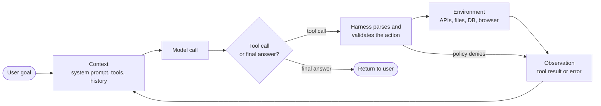
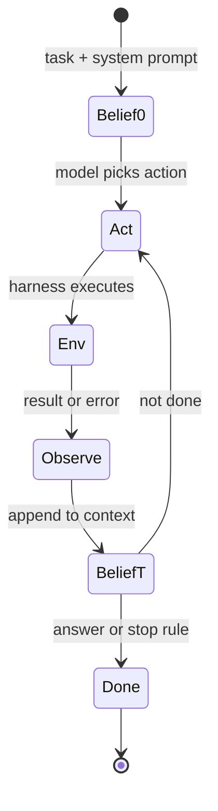
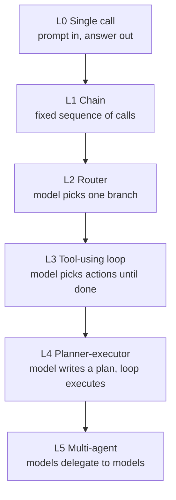
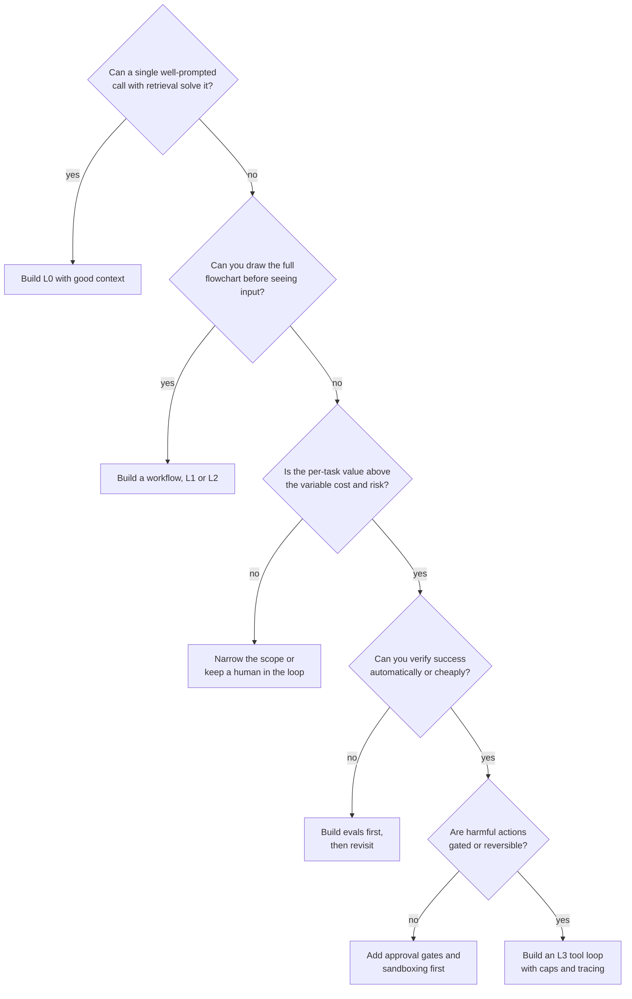
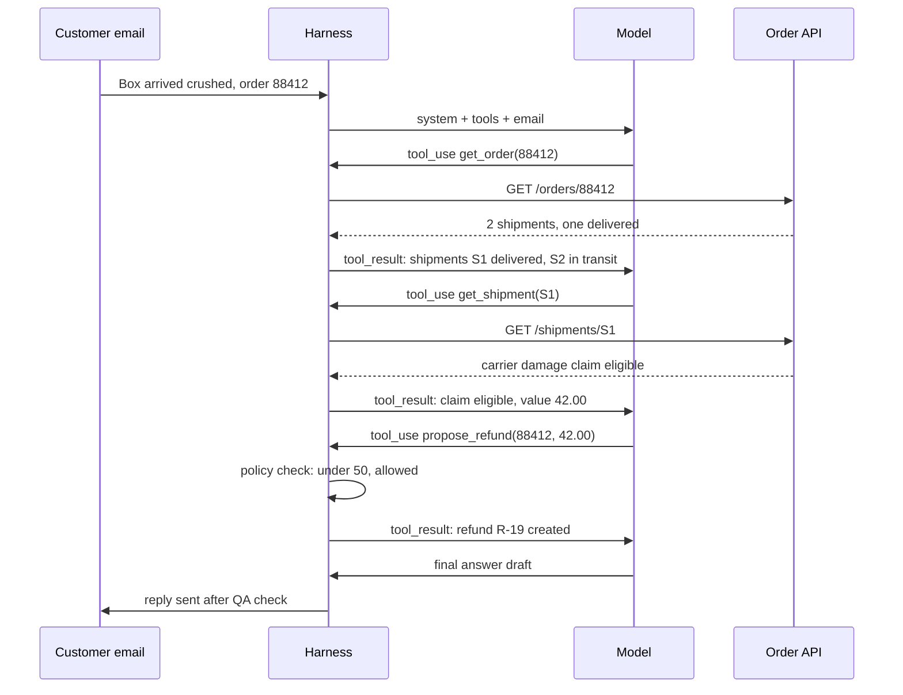
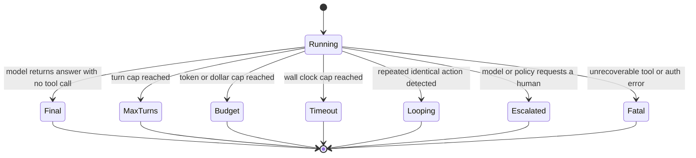
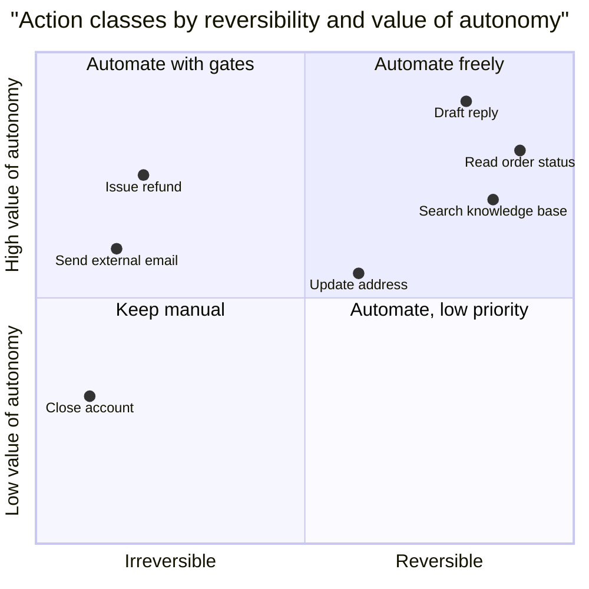
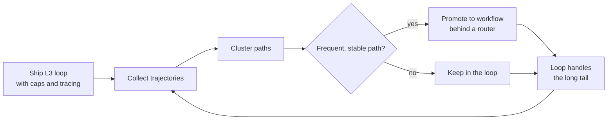

# Chapter 01: What an Agent Is

> **What this chapter covers**: The loop of model, tools, and environment; agents as partially observable sequential decision-making; workflows versus agents; the levels of autonomy from a single call to multi-agent systems; the agent-computer interface as a design surface; a decision framework for whether to build an agent at all; and the arithmetic of compounding error.
>
> **Prerequisites**: None. This is the first chapter.
>
> **Where it is used**: Every later chapter. Chapter 02 builds the patterns on this loop, Chapter 03 defines the tool interface, Chapter 05 builds the harness around it, and the Quality and Production parts measure and ship it.

---

## 01.1 Level 1: Foundations

### The one-sentence definition

An agent is a program in which a language model chooses the next action, the program executes that action against an environment, and the result goes back to the model, repeatedly, until a stop condition fires.

Three parts carry the weight of that sentence.

1. **The model chooses.** Control flow is decided at run time by the model, not written in advance by the engineer. This is the defining property. A pipeline with ten LLM calls in a fixed order is not an agent. A single model call that decides whether to call a tool, and which one, already has a little agency.
2. **The program executes.** The model emits text. Something else (the harness) parses that text into an action, runs it, and captures the outcome. The model never touches the world directly.
3. **Repeatedly.** The output of the environment becomes input to the next model call. The loop is what gives an agent the ability to recover from surprises, and also what lets errors compound.

You have already built most of the pieces. A text-to-SQL system that runs the query, sees an error, and retries with the error message in context is a small agent. An MCP server is a tool surface that some agent will call. What changes when you call something an agent is that you give up the fixed control flow, and in exchange you must engineer the loop, the stop conditions, the tool interface, and the measurement of end-to-end reliability.

### The loop



Every agent in this curriculum is a variation on this picture. The variations are in what goes into the context, how the model's output is parsed, what the environment is, and who decides to stop.

### Vocabulary

| Term | Meaning in this curriculum |
|---|---|
| Model | The LLM that maps a context to the next output (text, a tool call, or both). |
| Tool | A named, typed operation the harness exposes to the model: a function, an API, a shell, a browser action. |
| Environment | Everything outside the model that tools read from or write to. It has state the model cannot see directly. |
| Observation | What the harness puts back into context after an action: the tool result, an error, or a truncated view. |
| Trajectory | The full sequence of (context, action, observation) steps for one task. The unit of debugging and evaluation. |
| Harness | The code around the model: the loop, parsing, validation, retries, budgets, stop conditions. Chapter 05. |
| Turn | One model call. A task usually takes many turns. |
| Step | One action and its observation. A turn can contain several steps when tools are called in parallel. |
| Stop condition | The rule that ends the loop: final answer, max turns, budget exhausted, human interrupt, or a terminal error. |
| Workflow | A system where LLM calls sit inside control flow that the engineer wrote. |
| Agent | A system where the model decides the control flow at run time. |

### Why agents exist at all

Workflows are cheaper, faster, and easier to test. Agents exist because some tasks have a solution path that you cannot enumerate ahead of time. Debugging a failing test, answering a support ticket that touches three systems, or exploring an unfamiliar database schema all have this property: the right second step depends on what the first step returned. You could try to write every branch, but the branching factor explodes, and the model is better at choosing among branches than your if-statements are at anticipating them.

The honest framing: an agent trades predictability for coverage. You accept variance in cost, latency, and correctness in exchange for handling inputs you did not anticipate. Whether that trade is worth it is the decision framework in section 01.2.

### Agents as partially observable sequential decision-making

The cleanest formal lens is the partially observable Markov decision process (POMDP). You do not need to solve POMDPs to build agents. You need the vocabulary, because it names exactly where agents go wrong.

A POMDP has:

- **States** $s \in S$: the true state of the environment. For a coding agent, the full repository, the test results, the installed packages. For a support agent, the customer's account, their order history, the refund policy.
- **Actions** $a \in A$: what the agent can do. Here, the tool calls plus "answer and stop".
- **Transition** $T(s' \mid s, a)$: how the environment changes after an action. Deterministic for a file read, stochastic for a flaky API.
- **Observations** $o \in \Omega$ with $O(o \mid s', a)$: what the agent sees after acting. A tool result is an observation. It is never the full state.
- **Reward** $R(s, a)$: in practice, a task success signal at the end, plus costs along the way.

The agent never sees $s$. It sees a history $h_t = (o_0, a_0, o_1, a_1, \ldots, o_t)$. A belief state $b_t(s) = P(s \mid h_t)$ summarizes what the history implies about the true state. An LLM agent has no explicit belief state. Its context window is the history, and the model's internal computation over that history is an implicit, approximate belief update.

This framing explains four practical facts.

1. **Observation design matters as much as action design.** If `search_orders` returns only order IDs, the agent must spend actions to learn what each order is. The observation function is yours to design. Chapter 03 and the ACI section below return to this.
2. **Context is the belief state, and it is lossy.** Compaction (Chapter 06) is lossy belief compression. If the summary drops the fact that a refund was already issued, the agent's belief is wrong and its next action can be harmful.
3. **Information-gathering actions have value.** In a POMDP, an action that changes nothing in the world but sharpens the belief can be optimal. Asking the user a clarifying question is exactly such an action. Agents that never ask are acting on a flat belief.
4. **Horizon drives difficulty.** Error and cost scale with the number of steps. Short-horizon tasks are easy for a reason.



### What the model is and is not doing

The model is a policy $\pi(a \mid h_t)$ that was never trained on your environment. Post-training on tool use gives it a prior over reasonable actions in reasonable environments. It does not know your API's quirks, your pagination semantics, or that `status=closed` in your ticketing system means something different from `resolved`. Everything you want it to know about your environment must arrive through the system prompt, the tool definitions, or the observations. That is the core engineering fact of agents.

---

## 01.2 Level 2: Working knowledge

### Workflows versus agents

Anthropic's December 2024 engineering post "Building effective agents" drew the distinction this curriculum uses: workflows are systems where LLMs and tools are orchestrated through predefined code paths, and agents are systems where LLMs dynamically direct their own processes and tool usage. The post's central advice was to find the simplest solution possible and add agentic complexity only when it demonstrably improves outcomes. That advice has aged well.

| Dimension | Workflow | Agent |
|---|---|---|
| Who decides control flow | Engineer, at design time | Model, at run time |
| Cost per task | Fixed, predictable | Variable, heavy-tailed |
| Latency | Bounded by the graph | Bounded only by max turns |
| Testing | Unit test each node | Evaluate trajectories statistically |
| Failure mode | Wrong branch for an unanticipated input | Wanders, loops, compounds errors |
| Debugging | Stack trace | Trajectory reading |
| Best when | Steps are known, inputs are in-distribution | Steps depend on intermediate results |

A useful test: can you draw the flowchart before seeing the input? If yes, build the workflow. If the flowchart has a box labelled "figure out what to do next" that you cannot expand, that box is where an agent goes, and possibly only that box.

### When a plain workflow is the better choice

Choose a workflow when any of these hold.

- **The steps are known.** Classify a ticket, extract fields, look up the account, draft a reply. Four fixed steps. An agent adds nothing but variance.
- **Latency is tight.** A voice assistant with a 800 ms budget cannot afford three sequential model calls chosen at run time.
- **Actions are irreversible and high-stakes.** Payments, deletions, outbound messages. You want the control flow reviewed by a human once, at design time, not decided by a model on every request.
- **You need an audit trail that a regulator accepts.** "The model decided" is a weaker story than "the code path is this, and the model filled in these fields".
- **The volume is high and margins are thin.** At 1 million tasks a month, a 3x variance in tokens per task is a budget problem.

### Levels of autonomy

The brief lists six levels. They are a ladder: each level gives the model more control over what happens next.



| Level | Who controls flow | Model calls per task | Typical use | Main risk |
|---|---|---|---|---|
| L0 Single call | Engineer | 1 | Classification, extraction, drafting | Wrong answer, no recovery |
| L1 Chain | Engineer | 2 to 5, fixed | Draft then critique, extract then format | Early error propagates |
| L2 Router | Model picks one branch | 2 | Ticket triage to specialist prompts | Misroute |
| L3 Tool loop | Model, step by step | 3 to 50 | Support agent, SQL agent, coding agent | Loops, drift, compounding error |
| L4 Planner-executor | Model plans, harness executes | 5 to 100 | Research tasks, multi-system changes | Stale plan, over-planning |
| L5 Multi-agent | Models delegate | 10 to hundreds | Broad research, parallel exploration | Coordination cost, token blowup |

Two points matter more than the table.

First, levels mix. A production system is often an L1 chain whose third node is an L3 loop with a hard turn cap. Autonomy is a property of each node, not of the whole system.

Second, cost rises faster than capability. Anthropic reported in its June 2025 post on its multi-agent research system that agents used about 4 times more tokens than chat, and multi-agent systems about 15 times more. Treat those numbers as one vendor's measurement on one workload, not a law, but the direction is universal.

### The agent-computer interface

The SWE-agent paper (Yang et al., 2024) introduced the term agent-computer interface (ACI): the set of commands and the format of their outputs that an agent uses to interact with a computer. The authors showed that designing the interface for a model, rather than handing it a raw human shell, substantially improved results on SWE-bench with the same underlying model. Their editor, for example, showed a window of about 100 lines with line numbers, ran a linter on every edit, and rejected edits that introduced syntax errors, so the agent could not silently corrupt a file.

The lesson generalizes. The ACI is everything the model sees and touches:

- **Tool names and descriptions.** The model reads these every turn. They are prompts.
- **Argument schemas.** What the model must produce. Fewer, well-typed, semantically named arguments beat many optional ones.
- **Observation format.** What comes back. Concise, relevant, with stable identifiers and actionable error messages.
- **Granularity.** One `update_ticket(fields)` tool, or ten `set_ticket_priority` style tools. Chapter 03 covers the trade-off.
- **Guard rails inside the tools.** Validation, dry-run modes, confirmations. The SWE-agent linter is a guard rail inside a tool.

Human interfaces are designed for humans who can scroll, glance, and remember visual layout. Model interfaces should be designed for a reader that sees everything as tokens, pays for every token, and cannot scroll back except by reading its own context.

| Human interface habit | ACI equivalent |
|---|---|
| Show everything, let the user scroll | Paginate, return the top N, offer a follow-up query |
| Error codes for developers | Error messages that say what to do next |
| Internal IDs in URLs | Human-meaningful identifiers plus the ID |
| Many small buttons | Fewer tools that match user intents |
| Silent success | Confirm what changed, in one line |

### A decision framework: should you build an agent at all?

Ask these in order. Stop at the first "no" and build the simpler thing.



The questions encode five constraints.

1. **Sufficiency of the simplest thing.** Many "agent" requests are retrieval problems. Good context in one call beats a loop that fetches the same context over five turns.
2. **Enumerability.** If the path is enumerable, write it.
3. **Economics.** Agents have a cost distribution, not a cost. Section 01.3 does the arithmetic.
4. **Verifiability.** If you cannot tell whether the agent succeeded, you cannot improve it. Coding agents advanced fast partly because tests are a cheap verifier.
5. **Blast radius.** Autonomy over reversible, read-only actions is cheap. Autonomy over irreversible writes needs gates (Chapter on human-in-the-loop and security later in the curriculum).

### Worked example: triage for a synthetic company

Northwind Outfitters (synthetic) wants an "AI agent" for inbound support email. Volume: 40,000 emails a month. Walk the framework.

- About 60 percent are order status questions. The steps are fixed: extract order number, look it up, answer. That is an L1 chain.
- About 25 percent are returns within policy. Fixed steps plus one decision (eligible or not). L2 router into a chain.
- About 15 percent are messy: damaged items, partial shipments, disputes spanning several orders. The path depends on what the lookups return. This is where an L3 loop earns its cost, with a turn cap and a human approval gate on refunds above a threshold.

So the "agent" is a router, two chains, and one loop that handles 6,000 emails a month. That is the typical shape of a good production system.

Put rough economics on it. Suppose the chains cost about 0.01 dollars per email (two short calls) and the loop about 0.25 dollars per email (the 10-turn case computed in 01.3). Monthly model spend is $34{,}000 \times 0.01 + 6{,}000 \times 0.25 = 340 + 1{,}500 = 1{,}840$ dollars. Routing everything through the loop would cost $40{,}000 \times 0.25 = 10{,}000$ dollars, more than five times as much, and would be less accurate on the easy 85 percent because the loop adds chances to wander. The router pays for itself on the first day.

### One trajectory, step by step

Abstract loops hide the details that matter. Here is one trajectory from the Northwind messy-case loop, with the harness made visible.



Four observations from this trace.

1. The model needed two lookups because `get_order` did not include shipment condition. A richer observation would have removed one step. This is ACI design in action.
2. The policy check ran in the harness, not in the model. The model proposed; code decided.
3. Every model call resent the system prompt, tools, and history. That is where the tokens go.
4. The final reply passed through a QA check before sending. The loop's last action was a draft, not an irreversible send.

### The minimal loop

The core of every harness fits on one screen. This is pseudocode close to real Python; Chapter 05 turns it into a production harness.

```python
def run(task, tools, max_turns=12, max_tokens=200_000):
    messages = [{"role": "user", "content": task}]
    used = 0
    for turn in range(max_turns):
        resp = model.call(system=SYSTEM, tools=tools.schemas(), messages=messages)
        used += resp.usage.total
        messages.append({"role": "assistant", "content": resp.content})
        calls = [b for b in resp.content if b.type == "tool_use"]
        if not calls:
            return resp.text, "final"
        results = []
        for c in calls:
            try:
                out = tools.execute(c.name, c.input)   # validation and policy inside
                results.append(tool_result(c.id, out))
            except ToolError as e:
                results.append(tool_result(c.id, str(e), is_error=True))
        messages.append({"role": "user", "content": results})
        if used > max_tokens:
            return None, "budget"
    return None, "max_turns"
```

Every line is a design decision. The stop reasons are explicit and returned, so you can count them. Errors become observations instead of exceptions, so the model can recover. Validation and policy live inside `tools.execute`, not in the prompt. The loop has two independent caps. Notice what is missing: loop detection, compaction, streaming, parallel execution, tracing, and durable state. Those are the rest of the curriculum.

### What the model sees on each turn

Everything the agent "knows" on a turn is in the request. A typical support agent on turn 6 might carry:

| Context segment | Tokens (illustrative) | Stable across turns? | Notes |
|---|---|---|---|
| System prompt: role, policy, style | 1,800 | Yes | Cacheable prefix |
| Tool definitions, 6 tools | 2,200 | Yes | Cacheable; each description is a prompt |
| Task and user message | 300 | Yes after turn 1 | The goal; must stay visible |
| History: 5 prior model outputs | 750 | Grows | Reasoning and tool calls |
| History: 5 tool results | 3,000 | Grows | Usually the largest segment |
| Total | 8,050 | | |

Two things follow. Tool results dominate history, so observation design (short, relevant, paginated) is the main context lever. And the stable prefix (system plus tools) is about half of the request at turn 6, which is why prompt caching matters so much for agents (Chapter 06).

### Stop conditions

An agent that cannot stop reliably is not deployable. Enumerate stop reasons explicitly and log them for every run.



The distribution of stop reasons is one of the first dashboards to build. A healthy support agent in the worked example might show 88 percent final, 6 percent escalated, 4 percent max turns, 2 percent other. A rising max-turns share is an early warning of a tool regression or a new kind of task, usually days before success rate moves visibly.

A "final" stop is not a success. The model can stop with a wrong answer. Stop reason and task outcome are separate columns in your logs.

### Latency is also compounding

Every sequential turn adds model latency plus tool latency. Take a model with 0.6 seconds to first token and 60 output tokens per second, 150 output tokens per turn, and a 300 ms average tool call. One turn costs about $0.6 + 150/60 + 0.3 = 3.4$ seconds. Ten turns is 34 seconds. That is acceptable for an email, marginal for chat, and impossible for voice. Parallel tool calls (Chapter 03) and fewer, richer tools are the main latency levers, followed by smaller models on the easy turns.

| Channel | Typical user-tolerable latency | Feasible sequential turns at 3.4 s |
|---|---|---|
| Voice | Under about 1 second to start speaking | 0, use a workflow or stream a holding reply |
| Chat | A few seconds to first visible progress | 1 to 3, stream intermediate status |
| Email or ticket | Minutes | 10 or more |
| Background job | Hours | Bounded by cost, not latency |

These tolerances are rules of thumb, not measured standards; measure your own users.

---

## 01.3 Level 3: Depth

### Compounding error: the core arithmetic

Suppose each step of a task succeeds independently with probability $p$, and the task needs $n$ steps to all succeed. Task success is

$$P_{\text{task}} = p^{n}$$

| Per-step $p$ | $n = 5$ | $n = 10$ | $n = 20$ | $n = 50$ |
|---|---|---|---|---|
| 0.99 | 0.951 | 0.904 | 0.818 | 0.605 |
| 0.98 | 0.904 | 0.817 | 0.668 | 0.364 |
| 0.95 | 0.774 | 0.599 | 0.358 | 0.077 |
| 0.90 | 0.590 | 0.349 | 0.122 | 0.005 |

Worked check for one cell: $0.95^{10}$. $0.95^2 = 0.9025$, $0.95^4 = 0.8145$, $0.95^8 = 0.6634$, times $0.9025$ gives $0.5987$. So a 95 percent per-step agent completes a 10-step task about 60 percent of the time.

Invert it. To hit 90 percent task success at 20 steps you need $p = 0.9^{1/20}$. $\ln 0.9 = -0.10536$, divided by 20 is $-0.005268$, exponentiated is $0.99475$. You need about 99.5 percent per step. That is the single most important number in this chapter: long-horizon agents need per-step reliability that most people have never measured.

### Why the naive model is too pessimistic, and too optimistic

The $p^n$ model assumes independent failures and no recovery. Both assumptions are wrong in ways that matter.

**Recovery makes it better.** Real agents see errors and retry. Model each step as: succeed with probability $p$, fail detectably with probability $q_d$ (the agent sees an error and can retry), fail silently with probability $q_s$ (wrong result, looks fine). With $r$ allowed retries on detectable failures, per-step success becomes

$$p_{\text{eff}} = p \sum_{k=0}^{r} q_d^{k} = p \frac{1 - q_d^{r+1}}{1 - q_d}$$

Take $p = 0.93$, $q_d = 0.05$, $q_s = 0.02$, $r = 2$. The sum is $1 + 0.05 + 0.0025 = 1.0525$, so $p_{\text{eff}} = 0.93 \times 1.0525 = 0.9788$. Over 10 steps, $0.9788^{10} \approx 0.807$, compared with $0.93^{10} \approx 0.484$ without retries. Recovery from detectable errors nearly doubles task success.

The ceiling is set by silent failures. Even with infinite retries, $p_{\text{eff}} \to p / (1 - q_d) = 0.93 / 0.95 = 0.979$, because the 2 percent silent failure rate never gets caught. **Converting silent failures into detectable ones is worth more than improving the model.** That is the quantitative argument for validation in tools, typed schemas (Chapter 03), and verifier steps (Chapter 02).

**Correlation makes it different.** Failures are not independent. If the agent misunderstood the task in step 1, steps 2 through 10 all fail together. If the task is easy, all steps succeed together. Correlated failures mean the task success distribution is bimodal: agents tend to either nail a task or fail it completely. This is why averaging per-step accuracy is misleading, and why you evaluate at the task level.

### pass@k versus pass^k

Two metrics, opposite questions.

- **pass@k**: probability that at least one of $k$ independent attempts succeeds. Useful when you can verify and pick the winner (coding with tests). $\text{pass@}k = 1 - (1 - p)^k$.
- **pass^k**: probability that all $k$ independent attempts succeed. Introduced for agents by the tau-bench paper (Yao et al., 2024) to measure consistency. Useful when a user will run the task many times and expects it to work every time. $\text{pass}^k = p^k$ if attempts are independent with per-task success $p$.

For a task where the agent succeeds 80 percent of the time:

| $k$ | pass@k | pass^k |
|---|---|---|
| 1 | 0.800 | 0.800 |
| 2 | 0.960 | 0.640 |
| 4 | 0.998 | 0.410 |
| 8 | 1.000 | 0.168 |

Customer-facing agents live in the pass^k column. The tau-bench authors reported that even strong function-calling agents of mid-2024 dropped well below 25 percent pass^8 on the retail domain. Check the current leaderboard before citing specific figures, since scores change with every model release.

Estimating pass^k across a task set: for each task $i$ with $n$ trials and $c_i$ successes, the unbiased estimator is $\binom{c_i}{k} / \binom{n}{k}$, averaged over tasks. Averaging per-task $p_i^k$ is not the same as $(\bar{p})^k$: by Jensen's inequality, heterogeneous task difficulty makes the mean of $p_i^k$ larger than $\bar p^k$ for $k > 1$. Report the estimator, not the shortcut.

### Cost is a distribution

Agents do not have a cost per task. They have a cost distribution with a long right tail.

Worked example. A support agent built on a model priced (hypothetically) at 3 dollars per million input tokens and 15 dollars per million output tokens. Each turn resends the growing context. Let the system prompt plus tools be 4,000 tokens, each turn add 600 tokens of observation and 150 tokens of output.

Turn $t$ input is $4000 + 750(t-1)$ tokens. Over $T$ turns, total input is

$$\sum_{t=1}^{T} \left(4000 + 750(t-1)\right) = 4000T + 750\frac{T(T-1)}{2}$$

| Turns $T$ | Input tokens | Output tokens | Cost without caching |
|---|---|---|---|
| 4 | 20,500 | 600 | 0.0705 dollars |
| 10 | 73,750 | 1,500 | 0.2438 dollars |
| 25 | 325,000 | 3,750 | 1.0313 dollars |

For $T = 10$: $40{,}000 + 750 \times 45 = 73{,}750$ input tokens, times 3 dollars per million is 0.2213 dollars, plus $1{,}500 \times 15 / 10^6 = 0.0225$ dollars, total 0.2438 dollars.

Input grows quadratically with turns. A task that wanders to 25 turns costs about 15 times a 4-turn task. Prompt caching changes the constant dramatically (Chapter 06), but not the shape. This is why max-turn caps and loop detection are economic controls, not just safety controls.

### Failure modes of the loop

| Failure | What it looks like in a trajectory | Root cause | First fix |
|---|---|---|---|
| Looping | Same tool, same arguments, three times | Observation does not change belief, or error message is not actionable | Loop detector, better error text |
| Drift | Agent solves a different problem than asked | Goal fell out of attention in a long context | Restate the goal, compact, shorter horizon |
| Premature stop | Answers after one lookup, misses a second order | No verification step, over-eager final answer | Checklist in prompt, verifier |
| Hallucinated tool result | Claims an action succeeded without calling the tool | Model completes the pattern instead of acting | Require tool evidence, check trajectories |
| Wrong tool | Calls `search_customers` when it needed `search_orders` | Overlapping descriptions | Merge or disambiguate tools |
| Argument errors | Wrong date format, wrong ID type | Weak schema, no examples | Typed schema, strict mode, examples |
| Unsafe action | Issues a refund without authorization | Autonomy over irreversible writes | Approval gate, policy check in the tool |
| Budget blowout | 80 turns on a trivial ticket | No cap, pathological loop | Hard caps on turns, tokens, wall time |

### Measuring per-step reliability

You cannot use the compounding arithmetic without estimates of $p$, $q_d$, and $q_s$. Most teams have never measured them. A practical protocol:

1. Sample 100 to 200 trajectories from your eval set or production traces.
2. For each step, label it: correct action with correct arguments, detectable failure (error returned), silent failure (plausible but wrong), or unnecessary (correct but redundant).
3. Estimate each rate with a bootstrap confidence interval over trajectories, not over steps, because steps within a trajectory are correlated.
4. Predict task success from the rates and compare with the measured task success. A large gap tells you failures are correlated, which usually means early misunderstanding.

Worked example. 150 trajectories, 1,240 steps. Labels: 1,141 correct, 62 detectable failures, 25 silent, 12 redundant. Per-step rates: $p = 1141/1240 = 0.920$, $q_d = 0.050$, $q_s = 0.020$. With two retries, $p_{\text{eff}} = 0.920 \times (1 + 0.05 + 0.0025) = 0.968$. Mean steps per task is $1240/150 \approx 8.3$, so predicted task success is $0.968^{8.3} \approx 0.76$. Suppose measured task success is 0.64. The 12-point gap says failures cluster: some tasks fail in many steps at once. Read those trajectories first; they usually share a root cause such as a misread goal or a missing tool.

Labeling is expensive. An LLM judge can pre-label, but calibrate it against human labels on a subset before trusting it (the evaluation chapters cover judge calibration).

### How many tasks do you need to measure success?

Task success is a proportion, and small eval sets give wide intervals. For $n$ tasks with observed success $\hat p$, the normal approximation gives a 95 percent interval of $\hat p \pm 1.96\sqrt{\hat p(1-\hat p)/n}$.

| Tasks $n$ | $\hat p = 0.70$ half-width | $\hat p = 0.90$ half-width |
|---|---|---|
| 30 | 0.164 | 0.107 |
| 100 | 0.090 | 0.059 |
| 300 | 0.052 | 0.034 |
| 1,000 | 0.028 | 0.019 |

For $n = 100$, $\hat p = 0.7$: $0.7 \times 0.3 = 0.21$, divided by 100 is $0.0021$, square root $0.0458$, times 1.96 is $0.090$. So "70 percent on 100 tasks" means somewhere between about 61 and 79 percent. A claimed 4-point improvement on a 100-task set is noise unless the comparison is paired (same tasks, both systems) and the paired difference is significant. Agent outcomes also vary run to run on the same task, so run each task several times and bootstrap over tasks, resampling tasks with their runs attached. The evaluation chapters build this properly; the point here is that the compounding-error arithmetic is only as good as the estimates you feed it.

### Where your existing systems sit

| System you have built | Autonomy level | Environment | Main observation risk | What makes it more agentic |
|---|---|---|---|---|
| Text-to-SQL with retry on error | L3, short horizon | Database | Large result sets flood context | Letting it explore schema before writing SQL |
| RAG question answering | L0 or L1 | Index | Irrelevant chunks steer the answer | Letting it reformulate and re-query |
| MCP server | None by itself | It is the environment | Verbose tool outputs, vague descriptions | Nothing; it is the ACI for someone else's agent |
| Eval pipeline with an LLM judge | L1 | Dataset | Judge drift | Usually should stay a workflow |

The MCP row is worth dwelling on. When you build an MCP server you are designing an ACI for agents you do not control. The same principles apply: concise observations, actionable errors, well-named tools. Chapter 03 and the protocols part treat this in detail.

### Value of information: when asking beats acting

The POMDP view makes clarifying questions quantitative. Suppose the agent is unsure which of two orders the customer means, with belief 0.7 on order A. Acting on A succeeds with probability 0.7; if wrong, the cost is a misapplied refund worth $-10$ units against $+5$ for a correct resolution. Expected value of acting now: $0.7 \times 5 + 0.3 \times (-10) = 0.5$. Asking first costs one turn and some user annoyance, say $-0.5$ units, then resolves the ambiguity: $5 - 0.5 = 4.5$. Asking wins by a wide margin.

Flip it: belief 0.97 on A. Acting: $0.97 \times 5 + 0.03 \times (-10) = 4.55$. Asking still gives 4.5. Now acting is marginally better. The threshold where they cross is where $5b - 10(1-b) = 4.5$, that is $15b = 14.5$, $b \approx 0.967$. The exact numbers are invented, but the structure is real: the more asymmetric the cost of a wrong action, the higher the confidence you should require before acting, and irreversible actions should almost always be preceded by confirmation. Models do not do this calculation; your prompts and gates must encode it.

### Horizon is a distribution, so success is a mixture

Tasks do not all take $n$ steps. If step counts vary, task success is the expectation of $p^N$ over the step distribution, and because $p^n$ is convex in $n$, the mean hides the tail.

Worked example with $p = 0.97$ and this step distribution from a support agent's traces:

| Steps $N$ | Share of tasks | $0.97^N$ | Contribution |
|---|---|---|---|
| 3 | 0.40 | 0.913 | 0.365 |
| 8 | 0.35 | 0.784 | 0.274 |
| 15 | 0.20 | 0.633 | 0.127 |
| 30 | 0.05 | 0.401 | 0.020 |
| Total | 1.00 | | 0.786 |

Mean steps is $0.4 \times 3 + 0.35 \times 8 + 0.2 \times 15 + 0.05 \times 30 = 8.5$, and $0.97^{8.5} \approx 0.772$, close to the mixture's 0.786 here. The more useful view is by segment: the 25 percent of tasks with 15 or more steps contribute 25 percent of volume but $0.20 \times 0.367 + 0.05 \times 0.599 = 0.103$ of the 0.214 total failure mass, nearly half of all failures. Long tasks are where to spend engineering effort: better tools for them, checkpoints for them, or routing them to a human.

### Checkpoints reset compounding: the arithmetic

Take a 30-step task at $p_{\text{eff}} = 0.98$. Without checkpoints, $0.98^{30} = 0.545$. Split it into three 10-step phases, each ending in a verifier that catches a failed phase with probability $v = 0.9$ and allows one retry of the phase. Phase success on one attempt is $0.98^{10} = 0.817$. With one retry triggered only when the verifier catches the failure, phase success is $0.817 + (1 - 0.817) \times 0.9 \times 0.817 = 0.817 + 0.1346 = 0.952$. Three phases: $0.952^3 = 0.862$.

A verifier that catches failures lifts task success from 55 to 86 percent at the cost of re-running a phase about $0.183 \times 0.9 \approx 16$ percent of the time, which adds about $3 \times 0.165 \times 10 \approx 5$ steps, or 16 percent more steps overall. Verification is the cheapest reliability you can buy, provided a verifier exists. Where none exists, a human review at the phase boundary plays the same role at higher cost.

| Design | Task success | Expected steps | Steps per success |
|---|---|---|---|
| 30 steps, no checkpoint | 0.545 | 30 | 55.0 |
| 3 phases, verifier 0.9, one retry | 0.862 | about 34.9 | 40.5 |
| 6 phases of 5, verifier 0.9, one retry | 0.897 | about 32.6 | 36.3 |

For the 6-phase row: phase success $0.98^5 = 0.904$; with retry $0.904 + 0.096 \times 0.9 \times 0.904 = 0.982$; six phases $0.982^6 \approx 0.897$; expected extra steps $6 \times 0.096 \times 0.9 \times 5 \approx 2.6$. A real verifier also has a false-pass rate, which lowers these numbers; model it once you measure it. Diminishing returns set in quickly, and each checkpoint costs a verifier call, so three to five phases is usually the sweet spot.

### Production case: an agent that regressed without a code change

A synthetic logistics firm, Wide World Freight, ran a shipment-exception agent at a measured 0.81 task success (95 percent CI 0.77 to 0.85) for two months. One week, success fell to 0.66 with no deploy. Stop-reason share for max turns rose from 3 to 14 percent.

The three most likely causes, and how to tell them apart:

1. **A tool's upstream changed.** Check tool error rates and output sizes by day. Here: the carrier-tracking API had started returning a new status value, `EXCEPTION_HOLD`, not in the tool's enum mapping, so the tool returned "unknown status" and the agent re-queried in a loop.
2. **The input mix shifted.** Check the distribution of task types by day. Stable here.
3. **The model changed behind an alias.** Check whether the model identifier was a floating alias. It was pinned, so ruled out.

The fix was a one-line mapping plus an actionable error ("status EXCEPTION_HOLD means customs hold; call get_customs_status"). The lesson for the design: pin model versions, monitor per-tool error rates and output sizes, and treat the stop-reason distribution as a leading indicator. None of this is visible in a pass rate measured once at launch.

### The environment is adversarial by accident

Tools return things you did not write: web pages, emails, customer notes, file contents. Anything in an observation becomes part of the model's context and can steer it. This is prompt injection, covered in the security chapters. The design consequence belongs here: an agent's trust boundary is at its observations, not at its user input. Treat every observation as untrusted data.

---

## 01.4 Level 4: Mastery

### Designing the autonomy envelope

Senior engineers do not ask "agent or not". They design an autonomy envelope: for each action class, how much the model may do without a human.



The envelope is a table in your design doc, not a vibe:

| Action class | Autonomy | Gate | Rationale |
|---|---|---|---|
| Read-only lookups | Full | None | Reversible, cheap, high value |
| Drafts shown to a human | Full | Human sends | The human is the gate |
| Reversible writes | Full with audit log | Undo available | Mistakes are recoverable |
| Refunds under 50 dollars | Full | Policy check in tool | Cost of error below cost of review |
| Refunds over 50 dollars | Propose only | Human approval | Irreversible, material |
| Account closure | None | Human only | Irreversible, low volume |

The threshold numbers come from the business, not from engineering. Your job is to make them explicit and enforce them in code rather than in the prompt. A prompt that says "never refund more than 50 dollars" is a suggestion. A tool that rejects the call is a control.

### Horizon management is the main design lever

From the arithmetic, the single biggest lever is $n$, the number of steps that must all succeed. Senior designs shorten effective horizons in four ways.

1. **Better tools.** A `get_order_with_shipments(order_id)` tool replaces three calls. Each merged call removes a multiplicative factor.
2. **Checkpoints with verification.** Break a 30-step task into three 10-step phases, each ending in a verifiable state. A verified checkpoint resets the compounding. If verification catches 90 percent of phase failures and retries, the task behaves like three short tasks.
3. **Deterministic scaffolding.** Move the enumerable parts of the task into code. The model only handles the steps that need judgment.
4. **Decomposition to sub-agents with clean contexts.** A sub-agent that starts fresh on a subproblem has a short horizon and a clean belief state. The cost is coordination and tokens (Chapter 02 and the multi-agent chapter).

### What the literature and vendors disagree on

**How much autonomy.** Anthropic's "Building effective agents" (December 2024) argued for simple, composable patterns and against heavy frameworks. Cognition's June 2025 post "Don't Build Multi-Agents" argued that parallel sub-agents without shared context make conflicting decisions, and recommended single-threaded agents with context compression. Anthropic's June 2025 multi-agent research post reported that a multi-agent setup outperformed a single agent on its internal research evaluation by a large margin, at much higher token cost. These are not contradictory once you see the task shape: breadth-first research with independent subquestions parallelizes well; coding, where every decision constrains the next, does not. Both sides are describing their own workloads.

**Whether "agent" should be a spectrum or a category.** Some practitioners (and the framing in this chapter) treat agency as a continuum of how much control flow the model owns. Others reserve the word for open-ended loops. Use the spectrum in design reviews because it forces the question "which node needs autonomy?" rather than "is this an agent?".

**Whether frameworks help.** Framework vendors present their graphs and abstractions as essential. Several strong open harnesses (mini-SWE-agent is the extreme example, at around a hundred lines of Python for the agent class according to its repository, as of 2025) show that the loop itself is small. The framework chapters in Part III compare them against the same reference spec so you can judge on evidence.

**Benchmarks as proxies.** Vendors headline benchmark scores. Scores depend heavily on the harness (Chapter 05), the number of attempts, and whether the benchmark has leaked into training data. Treat vendor benchmark numbers as marketing until reproduced on your own task distribution.

### The FDE conversation

In a customer discovery session, the question "should we build an agent" usually arrives as "we want an AI agent for X". The senior move is to translate it into the four quantities from this chapter and get numbers for them:

1. **Horizon**: how many dependent steps does the typical task take, and the p95 task?
2. **Verifiability**: how will we know a task succeeded, automatically?
3. **Blast radius**: which actions are irreversible, and what does one mistake cost?
4. **Volume and value**: tasks per month, and value per successful task versus cost of a failure.

With those numbers you can do the arithmetic in front of the customer: "At 12 steps and 97 percent per step, we expect 69 percent end-to-end success before retries. We will need verification after step 6 and a human gate on the credit memo to make this safe." That sentence is worth more than any demo.

### Build versus buy for the loop

By late 2026 every major model vendor ships some form of agent runtime: SDKs with a built-in tool loop, hosted agents with managed sandboxes, and frameworks with graph abstractions. The names and feature sets change quarterly, so check current docs. The durable decision is where you want control.

| Option | You control | You give up | Fits when |
|---|---|---|---|
| Your own loop on a raw model API | Everything: context, retries, tracing, policy | Time to build the boring parts | Regulated, multi-provider, or unusual environments |
| Vendor SDK tool loop | Tools, prompt, some hooks | Some visibility into loop internals | One provider, standard patterns |
| Framework graph (Part III) | Graph topology, state schema | Framework idioms and upgrade churn | Durable, multi-step workflows with human gates |
| Fully hosted agent product | Configuration only | Most of the design surface | Commodity use cases, speed over control |

A forward deployed engineer usually starts with a vendor SDK or a small custom loop for the prototype, and moves durable, gated, multi-step flows into a framework or durable execution engine once the shape is proven. Whatever you choose, keep the tool layer and the eval set independent of it, so you can switch.

### The lifecycle: agents often become workflows

A pattern worth expecting in real deployments: you ship an L3 loop because the task space is not yet understood, you log thousands of trajectories, and you discover that 70 percent of them follow three paths. Those paths become deterministic workflows with a router in front, and the loop shrinks to the long tail. The agent was the discovery tool for the workflow.



Promotion criteria should be explicit: a path that covers at least a few percent of volume, succeeds consistently in the loop, and has stable inputs is a candidate. The payoff is lower cost, lower latency, and higher consistency on the common cases. The risk is brittleness if the input distribution shifts, which is why the router needs a fallback into the loop.

The reverse also happens. A workflow that accumulates a dozen special-case branches for rare inputs is often better replaced by a loop for that part. Branch count growing faster than volume is the signal.

### Reliability targets are business numbers

"How reliable does it need to be" has no engineering answer. Derive it from the cost of the alternatives. If a human handles a messy ticket for 6 dollars, the agent resolves 70 percent at 0.30 dollars each, and a failed agent attempt costs the 0.30 dollars plus a human handling cost of 7 dollars (slightly more than 6 because of the extra context switch), then expected cost per ticket is $0.30 + 0.30 \times 7 = 2.40$ dollars, well below 6. The agent pays even at 70 percent. If instead a failure produced a wrong refund that cost 40 dollars to unwind, the expected cost would be $0.30 + 0.30 \times 40 = 12.30$ dollars, worse than the human. Same success rate, opposite decision, because the failure is silent and expensive. Get the cost of a silent failure from the customer before promising anything.

### Worked sizing: an accounts-payable exception agent

Fabrikam Logistics (synthetic) processes 25,000 invoices a month. 92 percent match a purchase order automatically in their existing system. The remaining 2,000 exceptions are handled by four clerks. The request: "an agent for the exceptions".

Step 1, horizon. Sampling 50 exception cases by hand shows a median of 7 dependent lookups (invoice, PO, receipt, vendor record, prior invoices, contract terms, approval matrix) and a p95 of 15.

Step 2, per-step reliability. A prototype on 60 cases measures $p = 0.95$, $q_d = 0.03$, $q_s = 0.02$ per step. With two retries, $p_{\text{eff}} = 0.95 \times 1.0309 = 0.979$. Median task: $0.979^7 \approx 0.862$. p95 task: $0.979^{15} \approx 0.727$.

Step 3, silent failure cost. A silent failure here is approving a mismatched invoice, and the finance team estimates an average unwind cost of 120 dollars. A detectable failure (the agent escalates) costs the clerk's handling time, about 9 dollars.

Step 4, design. The arithmetic says full autonomy on approval is wrong: even a 2 percent per-step silent rate over 7 steps yields roughly $1 - 0.98^7 \approx 13$ percent of tasks touched by at least one silent error before verification. So the agent prepares a resolution packet (findings, the discrepancy, a recommended action, and links to evidence), and a clerk approves. The agent's job becomes reducing clerk time per exception from, say, 18 minutes to 5.

Step 5, economics. Model cost per exception at about 12 turns with caching, estimated at 0.20 dollars, gives 400 dollars a month. Clerk time saved: $2{,}000 \times 13$ minutes $\approx 433$ hours a month. The value is in the time saved, not in autonomy, and the design keeps the silent-failure cost at zero because a human approves every write.

This is a common and defensible shape for enterprise agents: autonomous investigation, human-approved action.

### Production case: capacity planning for a tool loop

Northwind's messy-case loop (6,000 tasks a month) is moving to a peak-hour chat channel. Peak is 12 percent of daily volume in one hour. Daily volume is $6{,}000 / 30 = 200$ tasks, so peak is 24 tasks an hour. Mean task duration is 34 seconds (10 turns at 3.4 s, from 01.2). By Little's law, concurrent tasks $L = \lambda W = (24 / 3600) \times 34 \approx 0.23$. Trivial. Now the same design for a larger tenant at 60 times the volume: $L \approx 13.6$ concurrent tasks, each making a model call roughly every 3.4 s, so about 4 model requests a second and, at about 8,000 input tokens per call, about 32,000 input tokens a second at peak. That number, not the monthly bill, is what you check against the provider's rate limits (tokens per minute) before launch: $32{,}000 \times 60 = 1.92$ million input tokens per minute. Many accounts need a limit increase or provisioned capacity at that level, and the p95 task (25 turns) makes the peak burstier than the mean suggests. Rate limits are a design input for agents in a way they rarely are for single-call features.

### Edge cases worth knowing

- **Tasks with no terminal state.** Monitoring agents that run indefinitely need a different stop design: bounded episodes, periodic reset of context, and state held outside the context.
- **Multiple principals.** An agent acting for a user inside a company system serves the user, the company's policy, and the tool provider's terms. Conflicts between them must be resolved in code, with the instruction hierarchy (Chapter 05) as a second line.
- **Non-stationary environments.** The environment can change during the task (inventory sells out, a ticket is updated by a human). Re-read before write, and design writes to be conditional (compare-and-set) where the backend allows.
- **Long-running tasks and durability.** A task that spans hours must survive process restarts. That requires checkpointed state outside the model (the durable execution chapter).

---

## 01.5 Subtopic checklist

- [x] The loop of model, tools, and environment (01.1, loop diagram)
- [x] Agents as partially observable sequential decision-making: state, action, observation, belief (01.1)
- [x] Workflows versus agents, with the distinction and a comparison table (01.2)
- [x] When a plain workflow is the better choice (01.2)
- [x] Levels of autonomy: single call, chain, router, tool-using loop, planner-executor, multi-agent (01.2)
- [x] Agent-computer interface as a design surface (01.2, 01.4)
- [x] A decision framework for whether to build an agent at all (01.2 flowchart, worked example, 01.4 FDE conversation)
- [x] Compounding error: per-step reliability to task reliability arithmetic, with recovery and silent failures (01.3)
- [x] pass@k versus pass^k (01.3)
- [x] Cost as a distribution with quadratic input growth (01.3)
- [x] Failure modes of the loop (01.3)
- [x] Autonomy envelope and horizon management (01.4)

## 01.6 Common misconceptions

1. **"An agent is any system with an LLM and tools."** A fixed pipeline that calls a tool is a workflow. The defining property is that the model decides control flow at run time.
2. **"More autonomy means more capability."** More autonomy means more coverage of unanticipated inputs and more variance. On enumerable tasks, a workflow is both cheaper and more accurate.
3. **"95 percent accuracy per step is good enough."** At 20 steps it gives about 36 percent task success. Long-horizon agents need per-step reliability above 99 percent or verification checkpoints.
4. **"Retries fix reliability."** Retries only fix detectable failures. Silent failures set a ceiling that retries cannot pass. Converting silent failures to detectable ones is the higher-leverage fix.
5. **"The context window is the agent's memory of the world."** It is a lossy history from which the model infers an approximate belief. It never contains the true environment state, and compaction makes it lossier.
6. **"Tool descriptions are documentation."** They are prompts that the model reads on every turn. Wording changes behavior measurably.
7. **"A prompt instruction is a safety control."** "Never refund above 50 dollars" in a prompt is a suggestion. Enforcement belongs in the tool or a policy layer.
8. **"Agent cost scales linearly with turns."** Without caching, input tokens grow roughly quadratically with turns, because each turn resends the history.
9. **"pass@1 tells you how a customer will experience the agent."** Customers run the task repeatedly. pass^k, which falls fast with $k$, is closer to their experience.
10. **"Multi-agent is the advanced version of single-agent."** It is a different trade-off: parallel breadth at several times the token cost, with coordination failures. Many tasks get worse.

11. **"A stop with a final answer means the task succeeded."** Stop reason and outcome are independent. A model can confidently stop with a wrong answer; log and evaluate them separately.
12. **"A 5-point gain on a 100-task eval proves the new prompt is better."** The 95 percent interval on 100 tasks is about plus or minus 9 points. Use paired comparisons, repeated runs, and bootstrap intervals.

## 01.7 Practice

1. **Conceptual.** For three systems you have built (a text-to-SQL service, an MCP server consumer, a RAG pipeline), place each node on the autonomy ladder. Identify one node that is more autonomous than it needs to be and one that would benefit from more autonomy.
2. **Arithmetic.** A 15-step task needs 85 percent end-to-end success. Compute the required per-step reliability with no retries. Then assume detectable failure rate 4 percent, silent failure 1 percent, and two retries; compute the achievable task success and state whether the target is met.
3. **Arithmetic.** You ran 10 trials on each of 4 tasks with successes 10, 9, 6, and 3. Compute pass@1, the naive $(\bar p)^4$, and the unbiased pass^4 estimator. Explain the gap.
4. **Design.** Draw the autonomy envelope for a synthetic IT helpdesk agent at "Contoso Labs" that can reset passwords, unlock accounts, provision software licenses, and grant admin rights. Put thresholds and gates in a table.
5. **Design.** Apply the decision framework to "an agent that writes weekly sales summaries from the CRM". Argue for the level you pick, and state what evidence would change your mind.
6. **Hands-on (4060, WSL2).** Serve a small open-weight instruct model with tool calling through Ollama or vLLM (a 3B to 8B model at 4-bit fits in 8 GB). Write a 40-line loop with two tools (`read_file`, `list_dir`) over a synthetic directory. Log every trajectory to JSONL. Run 20 tasks, measure per-step validity and task success, and compare with $p^n$.
7. **Hands-on.** Add a loop detector to the agent from exercise 6 that stops when the same tool and arguments repeat three times. Measure how often it fires and whether stopping improves cost per successful task.
8. **Hands-on.** Take one tool from exercise 6 and redesign its observation (pagination, line numbers, actionable errors). Rerun the 20 tasks and report the change in turns per task and success, with a paired comparison.
9. **Arithmetic.** Using the value-of-information example, recompute the confidence threshold for acting when a wrong action costs $-40$ instead of $-10$. State what this implies for irreversible actions.
10. **Hands-on.** For the agent from exercise 6, build a stop-reason dashboard (a simple table from the JSONL log is fine) and report the distribution over 50 runs with bootstrap intervals.
11. **Conceptual.** Write the POMDP tuple (states, actions, observations, reward) for a support agent. Name one information-gathering action and explain when it is optimal.

## 01.8 How this is tested

<details><summary>Define an agent in one sentence and explain what distinguishes it from a workflow.</summary>

An agent is a system in which the model chooses the next action at run time, a harness executes it, and the result feeds back until a stop condition fires. A workflow also uses LLM calls and tools, but the engineer fixed the control flow in code. The distinction is who owns control flow, not whether tools are present.
</details>

<details><summary>A customer asks for an agent to process invoices. How do you decide whether to build one?</summary>

Walk the framework. Can one well-prompted extraction call with the invoice in context handle most cases? Usually yes, so start there. Can I draw the flowchart (extract, validate against PO, route exceptions)? If yes, a workflow. Reserve a tool loop only for the exception path where the investigation depends on what lookups return, and put a human gate on payment approval. Quantify volume, value, and cost of an error before committing.
</details>

<details><summary>Per-step reliability is 97 percent and the task needs 12 steps. What is the task success rate, and what do you do about it?</summary>

$0.97^{12} \approx 0.694$, about 69 percent. Options: shorten the horizon with better tools, add a verified checkpoint midway, convert silent failures into detectable ones through validation so retries help, and move enumerable steps into deterministic code. Then measure again, because independence is an approximation.
</details>

<details><summary>Why do retries not rescue an agent with a 3 percent silent failure rate?</summary>

Retries trigger only on errors the harness or model can see. A silent failure produces a plausible wrong result and is never retried. With infinite retries, per-step success converges to $p/(1-q_d)$, which is capped below 1 by the silent rate. The fix is detection: schema validation, postconditions in tools, and verifier steps.
</details>

<details><summary>Explain pass^k and when you would report it instead of pass@k.</summary>

pass^k is the probability that all $k$ independent attempts at a task succeed, a consistency metric from tau-bench. pass@k is the probability at least one succeeds. Report pass^k for customer-facing agents that run the same kind of task repeatedly without a verifier to pick the best attempt. Report pass@k where a cheap verifier (tests) selects among attempts.
</details>

<details><summary>What is the agent-computer interface and why does it matter?</summary>

The ACI, from the SWE-agent paper, is the set of actions and observation formats an agent uses. The paper showed that designing commands and outputs for a model, for example a windowed file viewer with line numbers and an edit command that lints and rejects broken edits, improved results with the same model. Tool names, schemas, observation formats, and in-tool guard rails are all ACI and all tunable.
</details>

<details><summary>Frame an LLM agent as a POMDP. What does the framing buy you in practice?</summary>

States are the true environment, actions are tool calls plus answering, observations are tool results, and reward is task success minus costs. The agent sees only history, and its context is an implicit lossy belief. Practically this says observation design is as important as action design, compaction is belief compression that can drop critical facts, information-gathering actions such as clarifying questions have real value, and difficulty grows with horizon.
</details>

<details><summary>Why is agent cost described as a distribution, and what drives the tail?</summary>

The number of turns varies by task, and without caching each turn resends the growing history, so input tokens grow roughly quadratically in turns. A 25-turn trajectory can cost around 15 times a 4-turn one in the worked example. The tail comes from loops, drift, and hard tasks. Controls are max-turn and token caps, loop detection, caching, and compaction.
</details>

<details><summary>Give three situations where you would refuse to put an agent in the loop.</summary>

Tight latency budgets that cannot absorb several sequential model calls; irreversible high-stakes actions where the control flow must be reviewed at design time; and high-volume, low-margin tasks with enumerable steps where variance in tokens per task breaks the unit economics. In each case, use a workflow and possibly a single model call per node.
</details>

<details><summary>How do you enforce a refund limit for a support agent?</summary>

In the tool or a policy layer, not the prompt. The refund tool checks the amount and the caller's authority and rejects or routes to human approval above the threshold. The prompt can explain the policy so the model plans sensibly, but the control lives in code and is logged.
</details>

<details><summary>Anthropic and Cognition published apparently opposite advice on multi-agent systems in 2025. Reconcile them.</summary>

Cognition argued that parallel sub-agents without shared context make conflicting decisions, which is true for tightly coupled work like coding. Anthropic reported gains from parallel sub-agents on breadth-first research where subquestions are independent, at much higher token cost. The deciding variable is coupling between subtasks. Low coupling favors parallel agents; high coupling favors one agent with good context management.
</details>

<details><summary>What is the highest-leverage way to improve a long-horizon agent's task success?</summary>

Reduce the effective horizon. Merge tool calls so fewer steps must succeed, add verified checkpoints so failures are caught and retried within a phase, and move enumerable steps into code. Each removes multiplicative factors from $p^n$, which usually beats a small gain in per-step accuracy.
</details>

<details><summary>Why is the trust boundary of an agent at its observations?</summary>

Tool results include content written by third parties: web pages, emails, documents, customer notes. That content enters the context and can steer the model, which is indirect prompt injection. The user is not the only source of instructions the model sees, so every observation must be treated as untrusted data, and consequential actions must be gated independently of what the context says.
</details>

<details><summary>Your agent's max-turns stop rate doubled overnight but task success looks unchanged. What do you investigate?</summary>

A rising max-turns share is a leading indicator. Check whether a tool changed its output format or error messages (a common cause of loops), whether a new task type arrived, whether latency or rate limiting on a tool causes repeated retries, and whether a prompt or model version changed. Pull a sample of max-turns trajectories and look for repeated identical calls. Success rate lags because many tasks still finish, but cost and latency have already degraded.
</details>

<details><summary>When should an agent ask the user a clarifying question instead of acting?</summary>

When the expected value of acting on the current belief is lower than the value of acting after resolving the ambiguity, minus the cost of asking. The more asymmetric and irreversible the cost of a wrong action, the higher the confidence threshold for acting. Encode this with explicit instructions for ambiguous cases and with confirmation gates before irreversible actions, since models do not reliably perform the calculation themselves.
</details>

<details><summary>A 30-step task succeeds 55 percent of the time. How much can checkpoints help, and what do they cost?</summary>

Split into three 10-step phases with a verifier that catches 90 percent of phase failures and one retry: phase success rises from $0.98^{10} = 0.817$ to about 0.952, and task success to about $0.952^3 = 0.862$. The cost is re-running about 16 percent of phases plus the verifier calls. Returns diminish beyond a handful of phases, and a verifier's false-pass rate reduces the gain, so measure it.
</details>

## 01.9 Summary

- An agent is a loop where the model chooses the next action, the harness executes it, and the observation returns, until a stop condition fires.
- The defining property is model-owned control flow, not the presence of tools.
- The POMDP framing names the key facts: the agent sees observations, not state; context is a lossy belief; information-gathering has value; horizon drives difficulty.
- Workflows are the default. Use an agent only for the nodes whose path you cannot enumerate before seeing the input.
- Autonomy is a per-node property on a ladder from single call to multi-agent. Production systems mix levels.
- The agent-computer interface (tool names, schemas, observation formats, in-tool guard rails) is a design surface that moves results with the same model.
- Task success under independent steps is $p^n$; 90 percent at 20 steps needs about 99.5 percent per step.
- Retries fix detectable failures only. Silent failures cap reliability, so convert them into detectable ones.
- pass^k measures consistency and falls quickly; customer-facing agents live there.
- Cost is a heavy-tailed distribution; uncached input grows quadratically with turns, so caps and loop detection are economic controls.
- Design an explicit autonomy envelope per action class, and enforce thresholds in code.
- Shortening the effective horizon is usually the largest lever on reliability.

## 01.10 Further reading

- Anthropic, "Building effective agents" (December 2024). The workflow versus agent distinction and the case for simple patterns.
- Yang et al., "SWE-agent: Agent-Computer Interfaces Enable Automated Software Engineering" (2024, NeurIPS 2024). Origin of the ACI concept with ablations.
- Yao et al., "tau-bench: A Benchmark for Tool-Agent-User Interaction in Real-World Domains" (2024). Introduces pass^k and policy-following evaluation.
- Kaelbling, Littman, Cassandra, "Planning and acting in partially observable stochastic domains" (Artificial Intelligence, 1998). The standard POMDP reference.
- Anthropic, "How we built our multi-agent research system" (June 2025). Token cost multipliers and when parallel agents help.
- Cognition, "Don't Build Multi-Agents" (June 2025). The counterargument, centered on shared context.
- Russell and Norvig, "Artificial Intelligence: A Modern Approach", chapters on agents and decision-making under uncertainty. Classical grounding for the agent abstraction.
- mini-SWE-agent repository (SWE-agent team, 2025). Evidence that the core loop is small; read it in one sitting.
- Chen et al., "Evaluating Large Language Models Trained on Code" (2021). The unbiased pass@k estimator that the pass^k estimator mirrors.
