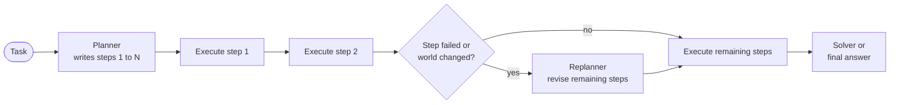
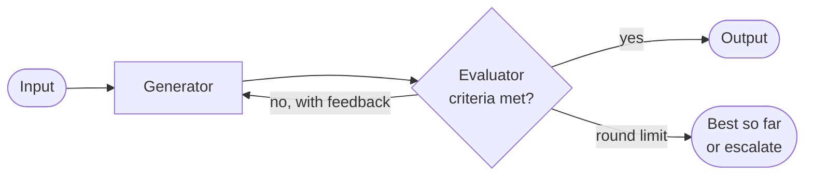
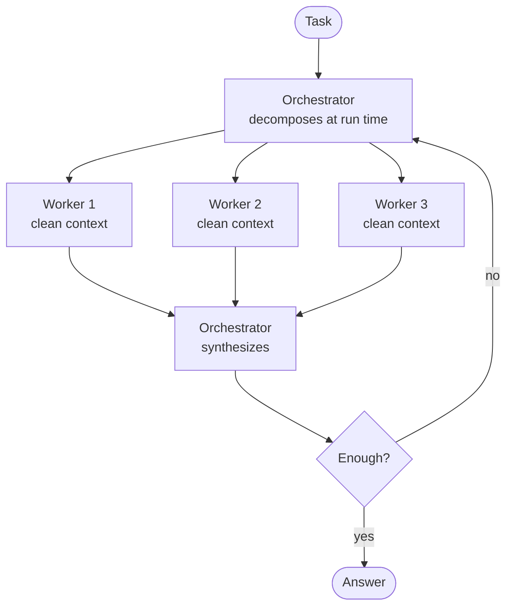
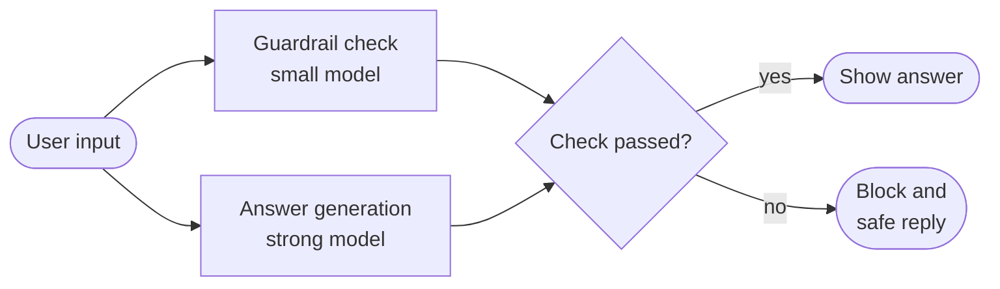
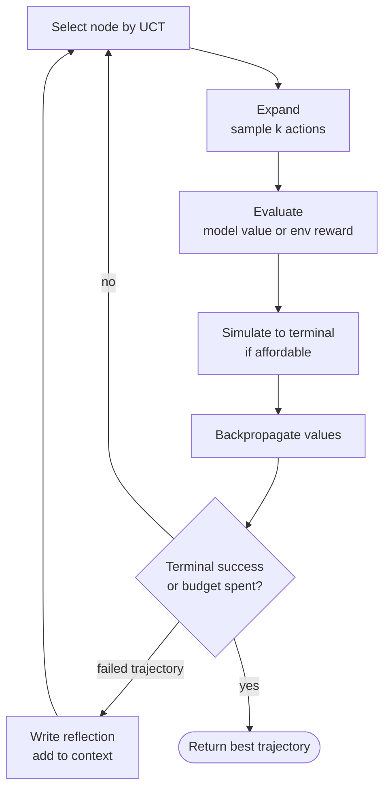
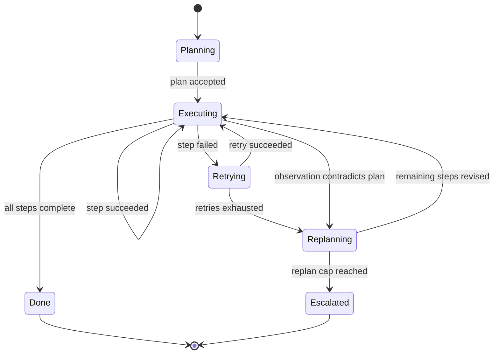
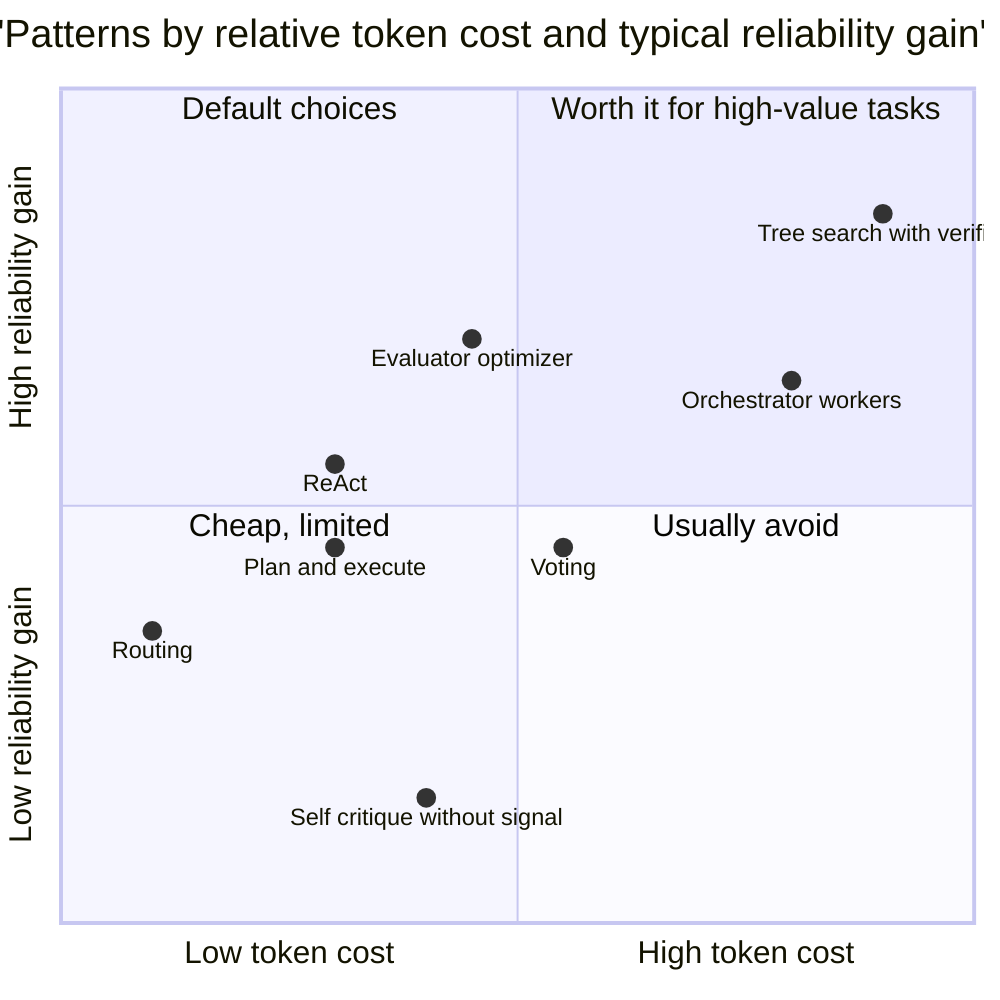
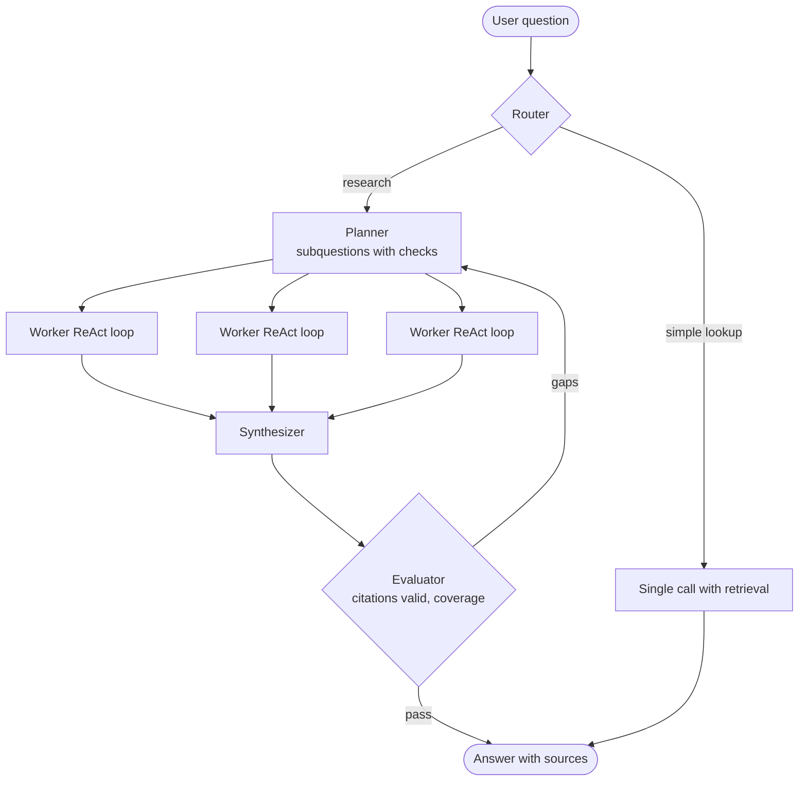

# Chapter 02: Core Patterns and Planning

> **What this chapter covers**: The core agent patterns (ReAct, plan-and-execute, reflection and Reflexion, orchestrator-workers, evaluator-optimizer, parallelization by sectioning and voting, routing), planning and search over actions (Tree of Thoughts, LATS and Monte Carlo tree search, replanning, task decomposition), when search is worth the tokens, and the cost and reliability of each pattern.
>
> **Prerequisites**: Chapter 01.
>
> **Where it is used**: Chapter 04 (reasoning models change which patterns pay), Chapter 05 (harness implementations of these patterns), Part III (every framework implements a subset), the multi-agent and evaluation chapters.

---

## 02.1 Level 1: Foundations

### Patterns are control-flow shapes

Chapter 01 defined an agent as a loop in which the model picks actions. A pattern is a reusable shape for that control flow: who decides what, in what order, with what feedback. Every pattern in this chapter is a composition of three primitives.

1. **Generate.** A model call produces a thought, an action, a plan, or an answer.
2. **Execute.** The harness runs an action and returns an observation.
3. **Evaluate.** Something judges a result: a test, a validator, a rule, another model call, or a human.

Patterns differ in how they arrange these primitives and who controls the arrangement. Knowing the primitives makes new patterns (and framework marketing) easy to decode: most "novel architectures" are a known pattern with a new name.

### The pattern families

| Family | Patterns | Core idea |
|---|---|---|
| Acting loops | ReAct | Interleave reasoning and acting, one step at a time |
| Plan first | Plan-and-execute, ReWOO, LLMCompiler | Decide the steps up front, then run them |
| Improve by feedback | Reflection, Reflexion, evaluator-optimizer, self-refine | Generate, critique, revise |
| Divide the work | Orchestrator-workers, sectioning | Split into subtasks, combine |
| Many attempts | Voting, self-consistency, best-of-N | Sample several, aggregate or select |
| Choose the path | Routing | Classify, then dispatch |
| Search | Tree of Thoughts, LATS, MCTS | Explore alternatives, backtrack, pick the best |

Anthropic's "Building effective agents" (December 2024) grouped the workflow patterns as prompt chaining, routing, parallelization (sectioning and voting), orchestrator-workers, and evaluator-optimizer, then described agents as the open loop. This chapter uses those names where they exist and adds the research lineage (ReAct, Reflexion, ToT, LATS) that most frameworks implement.

### Why patterns matter more than prompts

A prompt improves one call. A pattern changes the error structure of the whole task. From Chapter 01, task success is roughly $p^n$ for independent steps, with detectable failures recoverable and silent failures not. Every pattern here is a way to change $p$, $n$, or the ratio of detectable to silent failures:

- ReAct lets each step react to the last observation, which raises $p$ when the environment is surprising.
- Plan-and-execute fixes the plan, which lowers per-step reasoning cost but lowers $p$ when the plan is stale.
- Reflection and evaluator-optimizer convert silent failures into detectable ones, if the evaluator is good.
- Voting reduces variance on a single step at the cost of more calls.
- Orchestrator-workers shortens each worker's horizon.
- Search spends tokens to try several paths and select, raising task success on problems with a reliable evaluator.

Keep this lens. For any pattern, ask: which term does it change, and at what token cost?

---

## 02.2 Level 2: Working knowledge

### ReAct

ReAct (Yao et al., 2022, published at ICLR 2023) interleaves a reasoning trace and an action in each step: Thought, Action, Observation, repeat. The paper showed that reasoning grounded in observations reduced hallucination compared with chain-of-thought alone on knowledge tasks such as HotpotQA and FEVER, and that acting guided by reasoning beat acting alone on interactive tasks such as ALFWorld and WebShop.

In 2026, native tool calling (Chapter 03) has absorbed the format. The model emits optional text and structured tool calls, the harness returns tool results, and that is ReAct without the text parsing. Reasoning models (Chapter 04) move the "Thought" into a separate thinking channel. The pattern is the same: one step, observe, decide the next step.

```mermaid
sequenceDiagram
    participant H as Harness
    participant M as Model
    participant E as Environment
    H->>M: task, tools, history
    M->>H: thought plus tool call A
    H->>E: execute A
    E-->>H: observation A
    H->>M: history plus observation A
    M->>H: thought plus tool call B
    H->>E: execute B
    E-->>H: observation B
    H->>M: history plus observation B
    M->>H: final answer
```



**Strengths.** Adapts to every observation. Simple to implement. Robust to surprising environments.

**Weaknesses.** One model call per step, so latency and cost scale with steps. Myopic: it can wander without a global plan. Context grows every step.

**Use it** as the default loop for tasks with unpredictable environments: debugging, investigations, support cases. Most production agents are ReAct loops with good tools.

### Plan-and-execute

A planner call writes an ordered list of steps. An executor (a smaller model, a ReAct sub-loop, or plain code) runs each step. Optionally a replanner revises the remaining plan after each step or on failure. Variants:

- **Plan-and-Solve prompting** (Wang et al., 2023): a prompting technique, plan then solve, in one call.
- **ReWOO** (Xu et al., 2023): the planner writes the full plan with placeholders for evidence, workers fill them without calling the planner again, and a solver composes the answer. The abstract reports 5x token efficiency and a 4 percent accuracy improvement on HotpotQA relative to observation-dependent baselines such as ReAct.
- **LLMCompiler** (Kim et al., 2023): the planner emits a dependency graph of tool calls, a scheduler runs independent calls in parallel, and a joiner decides whether to finish or replan. The paper reported latency speedups over ReAct from parallel execution.



**Strengths.** A global view of the task. Fewer calls to the expensive model (plan once, execute cheaply). Plans are inspectable and approvable by humans before execution. Parallel execution of independent steps.

**Weaknesses.** Plans go stale when observations surprise. Planners over-decompose simple tasks. Placeholders fail when a later step needs to see an earlier result to decide what to do.

**Use it** when the task structure is mostly knowable from the request (multi-part research, data pipelines, migrations), when you want a human to approve a plan before actions, or when many steps are independent and can run in parallel.

### Reflection and Reflexion

**Reflection** (also called self-critique or self-refine) is generate, critique, revise, within a single task attempt. Self-Refine (Madaan et al., 2023) showed gains across several generation tasks using the same model as generator and critic.

**Reflexion** (Shinn et al., 2023) is reflection across attempts. After a failed trial, the agent writes a verbal reflection on why it failed and stores it in an episodic memory; the next trial conditions on those reflections. The paper reported 91 percent pass@1 on HumanEval, compared with 80 percent for GPT-4 at the time, using test feedback as the failure signal.

The crucial detail in Reflexion is the signal. It used environment feedback (tests failing, a task environment reporting failure), not the model's unaided opinion. That distinction matters because of a result from Huang et al. ("Large Language Models Cannot Self-Correct Reasoning Yet", 2023, ICLR 2024): without external feedback, asking a model to review and correct its own reasoning answers often did not help and sometimes hurt, since it changed correct answers to incorrect ones.

The rule: **reflection helps in proportion to the quality of the feedback signal.** Tests, validators, compilers, and ground-truth checks make it strong. "Please review your answer" alone makes it weak.

### Evaluator-optimizer

The Anthropic post names this workflow: one call generates, another evaluates against explicit criteria and returns feedback, and the loop repeats until the evaluator passes or a round limit is hit. It is reflection with a separated, specified evaluator. It works when:

- the criteria can be stated clearly (a style guide, a rubric, a schema, a test),
- a human would demonstrably improve the output by giving that feedback,
- and the evaluator is cheaper or more reliable than the generator at the check.



Translation of legal clauses with a terminology checker, SQL generation checked by an EXPLAIN and a row-count sanity check, and marketing copy checked against a banned-claims list are good fits. Open-ended "make it better" is not.

### Orchestrator-workers

An orchestrator model decomposes the task at run time into subtasks, dispatches them to workers (model calls or sub-agents), and synthesizes the results. It differs from plan-and-execute in that the subtasks are not known in advance and each worker is typically a model with its own context, not a single tool call.



**Strengths.** Each worker has a short horizon and a focused context. Workers can run in parallel. The orchestrator's context holds summaries, not raw observations.

**Weaknesses.** Token cost multiplies. Workers can duplicate work or contradict each other. Synthesis loses detail. The orchestrator's decomposition is a single point of failure.

**Use it** for breadth-first tasks with loosely coupled subtasks: research across many sources, code changes across independent files, auditing many documents.

### Parallelization: sectioning and voting

**Sectioning** splits a task into independent parts that run concurrently, then combines them. The split is decided by code or by a simple prompt, not by an orchestrator at run time. Example: run a guardrail check in parallel with the main response, or evaluate five aspects of a document in five parallel calls.

**Voting** runs the same task several times and aggregates. Self-consistency (Wang et al., 2022) sampled multiple chain-of-thought paths and took the majority answer, improving arithmetic and commonsense reasoning benchmarks substantially over single greedy decoding. For agents, voting fits single high-stakes decisions: is this content a policy violation, is this code change safe, which of three tools applies.

Majority voting arithmetic. If each vote is independently correct with probability $p$, a majority of $n$ (odd) is correct with probability

$$P_{\text{maj}} = \sum_{k=\lceil n/2 \rceil}^{n} \binom{n}{k} p^k (1-p)^{n-k}$$

For $p = 0.8$ and $n = 3$: $P = 3 \times 0.8^2 \times 0.2 + 0.8^3 = 0.384 + 0.512 = 0.896$. For $n = 5$: $10 \times 0.8^3 \times 0.2^2 + 5 \times 0.8^4 \times 0.2 + 0.8^5 = 0.2048 + 0.4096 + 0.32768 = 0.942$. Three times the cost buys about 10 points; five times buys about 14. The independence assumption is optimistic: samples from the same model share blind spots, so real gains are smaller. Voting across different models or prompts decorrelates errors better.

Sectioning, worked. A chat assistant must run an input safety check (a small-model call, 0.8 s) and generate the answer (strong model, 4 s to finish). Sequentially: 4.8 s. In parallel: 4 s, and if the check fails you discard the answer before showing it. The cost is paying for the generation on the small fraction of inputs that fail the check. At a 2 percent failure rate and 0.03 dollars per generation, that waste is 0.0006 dollars per request, a cheap price for 0.8 seconds on every request. If the answer is streamed to the user, however, you cannot un-show tokens, so stream only after the check passes, or accept the risk explicitly.



### Routing

A classifier (a small model, an embedding nearest-neighbor, or rules) assigns the input to one of several downstream handlers: specialized prompts, different models, workflows, or a full agent. Chapter 01's Northwind example was a router in front of two chains and a loop.

Routing economics are simple and compelling. If 70 percent of traffic can go to a model that costs one tenth as much, and the router itself is cheap and 97 percent accurate, total cost falls by roughly 60 percent. Misroutes are the risk: a hard case sent to the cheap path fails silently. Mitigations are confidence thresholds (low-confidence cases go to the strong path), a fallback when the cheap path's own checks fail, and monitoring misroute rate on a labeled sample.

Worked routing arithmetic. 100,000 requests a month, average 8,000 input and 500 output tokens. Strong model at a hypothetical 3 dollars input and 15 dollars output per million tokens: $8{,}000 \times 3/10^6 + 500 \times 15/10^6 = 0.024 + 0.0075 = 0.0315$ dollars per request, 3,150 dollars a month. A small model at one tenth the price costs 0.00315 dollars. The router is a small-model call of 1,000 input and 5 output tokens, about 0.0003 dollars. Route 70 percent to small: $0.7 \times 0.00315 + 0.3 \times 0.0315 + 0.0003 = 0.0022 + 0.00945 + 0.0003 = 0.01195$ dollars, 1,195 dollars a month, a 62 percent saving. Now add misroutes: 3 percent of the small-path traffic is really hard, fails, gets detected by a check, and is retried on the strong model. That adds $0.7 \times 0.03 \times 0.0315 \approx 0.00066$ dollars per request, still a 60 percent saving. If those misroutes were silent instead, the saving would be the same and the quality loss invisible. Detection is what makes routing safe.

### A minimal evaluator-optimizer

The pattern is small. What matters is where the evaluator's signal comes from.

```python
def generate_sql(question, schema, max_rounds=3):
    feedback, best = None, None
    for r in range(max_rounds):
        sql = llm(prompt_sql(question, schema, feedback))
        try:
            rows, cols = db.execute(f"{sql} LIMIT 5")      # external signal 1
        except DBError as e:
            feedback = f"Query failed: {e}. Fix the query."
            continue
        issues = check_columns(question, cols)              # external signal 2, rules
        issues += llm_judge(question, sql, cols, rows)      # model signal, rubric
        score = 1.0 - 0.25 * len(issues)
        if best is None or score > best[0]:
            best = (score, sql)
        if not issues:
            return sql, r + 1
        feedback = "Issues: " + "; ".join(issues)
    return best[1], max_rounds                              # best, not last
```

Three details carry the reliability. The first two signals are external (the database and a rule check), so the loop is not asking the model to grade itself. The function keeps the best version rather than the last, which defuses oscillation. And the round count is returned, so you can monitor how often the loop hits its limit.

### Reflexion memory in practice

Reflexion's memory is a list of short natural-language lessons from failed trials. In production, this generalizes to two scopes.

| Scope | Content | Lifetime | Risk |
|---|---|---|---|
| Within a task | "Attempt 1 failed because the date filter used the wrong timezone" | Until the task ends | Context bloat across many trials |
| Across tasks | "For this tenant's schema, revenue lives in `fact_orders.net_amount`" | Curated, versioned | Wrong lessons persist and spread |

Within-task reflections are cheap and safe. Cross-task lessons are a memory system (the memory chapters) and need review, because a wrong lesson learned once will be applied to every later task. Treat cross-task reflections as candidates that a human or an eval promotes, not as automatic writes.

### Choosing a pattern

| Task shape | Default pattern | Why |
|---|---|---|
| Unknown steps, surprising environment | ReAct loop | Reacts to each observation |
| Knowable steps, want approval before acting | Plan-and-execute | Inspectable plan, fewer expensive calls |
| Many independent tool calls | Plan with DAG and parallel execution | Latency |
| Output checkable against clear criteria | Evaluator-optimizer | Converts silent failures to feedback |
| Repeated attempts with a failure signal | Reflexion | Learns from failed trials |
| Broad research, loosely coupled parts | Orchestrator-workers | Short horizons, parallelism |
| One high-stakes judgment | Voting | Variance reduction |
| Mixed traffic with an easy majority | Routing | Cost |
| Hard problem, reliable evaluator, big budget | Search (ToT, LATS) | Explores and backtracks |

---

## 02.3 Level 3: Depth

### Planning and search

A ReAct agent commits to one action at a time and never reconsiders. Search methods keep several partial solutions alive, evaluate them, and expand the promising ones. They trade tokens for success on problems where a wrong early choice is fatal and a good evaluator exists.

#### Tree of Thoughts

Tree of Thoughts (Yao et al., 2023, NeurIPS 2023) frames problem solving as search over a tree of "thoughts" (coherent intermediate steps). At each node, the model proposes several next thoughts, a value prompt rates each (for example, "sure, likely, impossible"), and a search algorithm (breadth-first with a beam, or depth-first with backtracking) chooses what to expand. On the Game of 24, the paper reported GPT-4 with chain-of-thought solving 4 percent of problems and ToT with breadth $b = 5$ solving 74 percent.

That gap is the canonical example of search paying off: the task has a small branching factor, a crisp success check, and fatal early mistakes. It is also the canonical example of cost. Each ToT problem used many times the tokens of a single chain-of-thought answer.

#### LATS and MCTS over actions

Language Agent Tree Search (Zhou et al., 2023, ICML 2024) applies Monte Carlo tree search to agent trajectories. Nodes are states (the history so far), edges are actions, and the model plays three roles: proposing actions (the policy), scoring states (the value function), and writing reflections on failed trajectories that feed back into later expansions. Because the environment can be reset or the state restored, the search can try an action, observe, and back up. The paper reported state-of-the-art results at the time on HumanEval (92.7 percent pass@1 with GPT-4) and gains on WebShop and HotpotQA.

The MCTS loop:

1. **Select**: descend from the root choosing children by an upper confidence bound, $\text{UCT}(s) = \bar V(s) + c\sqrt{\ln N(\text{parent}) / N(s)}$, balancing mean value $\bar V$ against exploration.
2. **Expand**: sample $k$ candidate actions from the model at the selected node.
3. **Evaluate**: score new nodes with the model's value estimate, or by executing and observing.
4. **Simulate**: roll out to a terminal state, if affordable.
5. **Backpropagate**: update value estimates up the path.
6. **Reflect**: on a failed terminal state, write a reflection and add it to context for later expansions.



The hard requirement is reversibility. MCTS needs to revisit states. That is easy in simulated environments (a web shop sandbox, a code repository you can reset, a math problem) and impossible in production environments with side effects (you cannot un-send an email to explore an alternative). In production, search runs over plans or drafts, not over live actions, or inside a sandbox that can be snapshotted.

#### Replanning

Replanning is the middle ground between rigid plans and pure ReAct. Triggers:

- a step fails after retries,
- an observation contradicts a plan assumption (the file does not exist, the customer has two accounts),
- a periodic checkpoint (every $k$ steps),
- or the model itself flags the plan as invalid.

The replanner sees the original goal, the plan so far, what was completed, and what surprised. It rewrites only the remaining steps. The failure mode is thrashing: replanning every step turns plan-and-execute into an expensive ReAct with extra calls. Count replans per task and cap them.



Replan cost arithmetic. A plan of 8 steps, planner call of 4,000 input tokens, replanner call of 6,000 (it also sees progress). If the replan rate is one per task, planning overhead is 10,000 tokens. At one replan per two steps, it is $4{,}000 + 4 \times 6{,}000 = 28{,}000$ tokens, plus the executor calls. A ReAct loop over the same 8 steps at about 5,000 tokens per call uses 40,000 tokens and never replans. When replanning approaches one per step, plan-and-execute is strictly worse than ReAct.

#### Task decomposition

Decomposition quality decides orchestrator-worker and plan-and-execute results. Good decompositions have four properties:

1. **Independence.** Subtasks can be done without seeing each other's intermediate state. Coupled subtasks produce contradictions (the Cognition argument from Chapter 01).
2. **Verifiability.** Each subtask has a checkable output.
3. **Right grain.** Big enough to be worth a model call, small enough to fit a short horizon. A subtask needing 30 steps has not been decomposed.
4. **Complete coverage.** The union of subtasks covers the task. Missing a subtask is a silent failure at synthesis.

A useful practice is to have the planner state, per subtask, its input, expected output, and success check. That turns decomposition into something you can evaluate.

### When search is worth the tokens

Search multiplies cost. A tree with branching $b$, depth $d$, and one call per node costs up to about $b^d$ calls for exhaustive search and roughly $b \cdot d \cdot w$ for a beam of width $w$. MCTS with $N$ iterations of $k$ expansions costs about $N \times (k + 1)$ calls plus rollouts.

A simple model makes the decision quantitative. Let single-attempt success be $p_1$. Search with budget multiplier $m$ achieves success $p_m$. Value per success is $V$, cost per single attempt is $c$. Search is worth it when

$$(p_m - p_1) V > (m - 1) c$$

Worked example 1: a code-fixing agent. $p_1 = 0.45$, search with 8 times the budget and tests as the evaluator achieves $p_m = 0.70$. Value of a fixed bug $V = 40$ dollars of engineer time. Cost per attempt $c = 0.60$ dollars. Left side: $0.25 \times 40 = 10$ dollars. Right side: $7 \times 0.60 = 4.20$ dollars. Search pays.

Worked example 2: a support reply. $p_1 = 0.85$, search at 5 times gets $p_m = 0.88$. $V = 3$ dollars, $c = 0.10$ dollars. Left: $0.03 \times 3 = 0.09$. Right: $4 \times 0.10 = 0.40$. Search loses. Improve the tools instead.

The deeper condition is the evaluator. Search is only as good as its ability to recognize the best branch. With a perfect verifier (tests that fully specify correctness), best-of-$m$ success approaches pass@$m$, which is $1 - (1 - p_1)^m$ if attempts are independent. With a noisy evaluator, selection accuracy caps the gain. Worse, a model-based value function tends to prefer confident, well-formatted wrong answers, so search can amplify its biases.

| Condition | Search helps | Search wastes tokens |
|---|---|---|
| Evaluator | Tests, validators, exact checks | Model opinion only |
| Early mistakes | Fatal and unrecoverable | Easily corrected later |
| Environment | Resettable or sandboxed | Live side effects |
| Value per success | High | Low |
| Latency tolerance | Minutes or hours | Seconds |
| Single-attempt success | Moderate (0.2 to 0.7) | Very high or near zero |

Tree of Thoughts cost, worked. Take a problem of depth $d = 3$, breadth $b = 5$ proposals per node, a beam of $w = 5$ kept per level, and one value call per proposal. Level 1: 1 proposal call producing 5 thoughts, 5 value calls. Levels 2 and 3: 5 kept nodes each make 1 proposal call (5 thoughts), so 5 proposal calls and 25 value calls per level. Total: $1 + 5 + 2 \times (5 + 25) = 66$ calls, versus 1 call for chain-of-thought. If each call is about 1,000 tokens, ToT costs about 66,000 tokens per problem. On Game of 24, that bought a move from 4 to 74 percent success, which is worth it for a benchmark and rarely for a support ticket.

Best-of-N with a perfect verifier, worked. A patch generator solves a bug with $p_1 = 0.35$. Independent attempts with tests as selector: $N = 2$ gives $1 - 0.65^2 = 0.578$; $N = 4$ gives $1 - 0.65^4 = 0.821$; $N = 8$ gives $1 - 0.65^8 = 0.968$. The marginal gain from 4 to 8 attempts is 14.7 points for 4 more attempts. In practice attempts are correlated (the same misunderstanding recurs), so measure the curve rather than trusting the formula, and raise sampling temperature or vary prompts to diversify.



The placements are judgments from the literature and practice, not measurements; the gains depend entirely on the task and the evaluator.

The last row deserves a note. If $p_1$ is near 1, there is nothing to gain. If $p_1$ is near 0, the model rarely generates a correct branch, so search has nothing to select. Search pays in the middle.

### Cost and reliability of each pattern

Illustrative numbers for a task that a single ReAct pass solves in 6 steps, with calls of about 5,000 input and 300 output tokens on average. The multipliers are the point, not the absolute values.

| Pattern | Model calls | Relative tokens | Latency shape | What it changes in $p^n$ | Main failure |
|---|---|---|---|---|---|
| ReAct | 6 | 1.0x | Sequential, 6 calls | Raises $p$ via reactivity | Wandering, myopia |
| Plan-and-execute | 1 plan + 6 cheap | 0.6 to 1.2x | Plan then fast steps | Lowers cost per step | Stale plans |
| Plan with DAG | 1 plan + parallel + join | 0.6 to 1.0x | Plan then parallel | Lowers latency | Missing dependencies |
| Evaluator-optimizer | 2 per round, 2 to 3 rounds | 1.5 to 2.5x on output | Sequential rounds | Silent to detectable | Weak evaluator, oscillation |
| Reflexion | Trials times steps | 2 to 4x | Multiple full attempts | Retries with learning | Needs failure signal |
| Orchestrator-workers | 1 + workers + synthesis | 3 to 15x | Parallel workers | Shortens horizon | Contradictions, token blowup |
| Voting, $n = 5$ | 5 on one step | 5x on that step | Parallel | Raises one step's $p$ | Correlated errors |
| Routing | 1 small + handler | 0.3 to 0.8x | One extra fast call | Cheaper common path | Misroutes |
| Tree search | $b \times d$ to hundreds | 5 to 100x | Long | Explores alternatives | Evaluator bias, cost |

The 3 to 15 times figure for orchestrator-workers comes from Anthropic's June 2025 multi-agent post, which reported multi-agent systems using about 15 times the tokens of chat and single agents about 4 times. Treat the other multipliers as order-of-magnitude estimates to replace with your own traces.

### Voting under correlated errors, worked

The binomial formula assumes independent votes. A simple correlation model: with probability $\rho$ an input is "shared-hard", and all votes copy the first vote's answer; otherwise votes are independent. For $p = 0.8$, $n = 5$:

$$P = \rho \cdot p + (1 - \rho) \cdot P_{\text{maj}}(p, 5)$$

| $\rho$ | Majority-of-5 accuracy | Gain over single vote |
|---|---|---|
| 0.0 | 0.942 | +14.2 points |
| 0.3 | $0.3 \times 0.8 + 0.7 \times 0.942 = 0.899$ | +9.9 points |
| 0.6 | $0.6 \times 0.8 + 0.4 \times 0.942 = 0.857$ | +5.7 points |
| 0.9 | $0.9 \times 0.8 + 0.1 \times 0.942 = 0.814$ | +1.4 points |

This toy model still assumes the per-vote accuracy is the same on shared-hard inputs, which is generous; in practice the correlated inputs are the hard ones, so the gain shrinks further. You can estimate $\rho$ from data: run five samples on a labeled set and measure how often all five agree when wrong. If unanimous-wrong is common, add diversity (different prompts, different models, different retrieved context) before adding votes.

### Orchestrator token accounting, worked

An orchestrator dispatches $W$ workers. Each worker runs $s$ steps with a base context $b$ and adds $o$ tokens of observation per step. The orchestrator reads a summary of $r$ tokens from each worker. Worker input tokens are $s \cdot b + o \cdot s(s-1)/2$ (the quadratic growth from Chapter 01). Take $W = 5$, $s = 6$, $b = 4{,}000$, $o = 1{,}000$, $r = 600$.

- Per worker: $6 \times 4{,}000 + 1{,}000 \times 15 = 39{,}000$ input tokens.
- All workers: $195{,}000$.
- Orchestrator: planning call at 5,000, synthesis call at $5{,}000 + 5 \times 600 = 8{,}000$, one follow-up round at 8,000: 21,000.
- Total: about 216,000 input tokens.

A single agent covering the same ground in 30 sequential steps with the same per-step observation has input $30 \times 4{,}000 + 1{,}000 \times 435 = 555{,}000$ tokens, because its context carries every observation. The multi-agent design is cheaper here, which surprises people. The reason is context isolation: each worker's quadratic term is small. The comparison flips when workers need large shared context (big $b$) or when the single agent would compact aggressively. Do this arithmetic with your own numbers before accepting either "multi-agent is expensive" or "multi-agent is efficient".

### Production case: best-of-N patches in a sandbox

A synthetic software vendor, Proseware, uses an agent to fix failing tests in dependency-upgrade pull requests. Single-attempt success, measured on 120 historical upgrade failures, was 0.38 (95 percent CI 0.30 to 0.47). Each attempt runs in a container snapshot of the repository, so attempts are independent and resettable, which satisfies search's hard requirement.

Design: run $N$ attempts in parallel containers at temperature 0.8 with two prompt variants alternating, run the full test suite on each, and pick the passing patch with the smallest diff. Measured on the same 120 cases:

| $N$ | Measured success | Independent-attempts prediction $1 - 0.62^N$ | Cost per case at 0.90 dollars per attempt |
|---|---|---|---|
| 1 | 0.38 | 0.38 | 0.90 |
| 2 | 0.55 | 0.62 | 1.80 |
| 4 | 0.68 | 0.85 | 3.60 |
| 8 | 0.74 | 0.98 | 7.20 |

The measured curve (illustrative but typical in shape) falls well short of the independent prediction because some failures are shared: the model misunderstands the upgrade the same way in every attempt. The team chose $N = 4$: marginal success from 4 to 8 was 6 points for 3.60 dollars more per case, while an engineer's time on a failed case cost far more, so the decision rested on a second factor, CI capacity. The tests take 11 minutes per attempt, and 8 parallel containers per PR exceeded the CI budget at peak. The constraint that bound was infrastructure, not tokens, which is common for search in production.

One more safeguard proved necessary. Passing tests is not the same as a correct fix: 3 of the 82 accepted patches in the pilot "fixed" tests by weakening an assertion. The team added a rule-based check that rejects diffs touching test files unless the task allows it. The verifier defines what search optimizes, so it must encode what "correct" means, not just what is easy to check.

### Failure modes that are specific to patterns

**Reflection oscillation.** Generator and evaluator disagree in a cycle: the evaluator asks for more detail, the generator adds it, the evaluator asks for concision. Fix with criteria that do not conflict, a round limit, and keeping the best-scoring version rather than the last.

**Sycophantic self-evaluation.** The same model evaluating its own output tends to approve it. Use a different prompt with explicit criteria at minimum, a different model where possible, and an external check wherever one exists.

**Plan fixation.** The executor follows a step that the last observation has made pointless. Give the executor explicit permission and a mechanism to report "this step is invalid because X", which triggers replanning.

**Decomposition leakage.** Workers need context the orchestrator did not pass (the user's constraint, the chosen library version). Workers then make inconsistent assumptions. Pass a shared brief to every worker: goal, constraints, decisions already made, output format.

**Synthesis loss.** The orchestrator summarizes worker results and drops the one caveat that mattered. Require workers to return structured results with a "caveats" field, and have synthesis cite which worker each claim came from.

**Router drift.** Traffic mix changes and the router's thresholds no longer match. Monitor route distribution and sample misroutes weekly.

---

## 02.4 Level 4: Mastery

### Composing patterns in production

Real systems nest patterns. A representative production design for a research assistant at a synthetic firm, Litware Analytics:



Four patterns in one system: routing at the front, plan-and-execute with orchestrator-workers in the middle, ReAct inside each worker, evaluator-optimizer at the end. The evaluator checks mechanical properties (every claim has a citation, every citation resolves, every subquestion is answered) rather than asking a model whether the answer is "good".

### Decisions a senior engineer makes

**Where to put the evaluator.** Evaluators are the highest-leverage component because they convert silent failures into detectable ones. Put them where a cheap, reliable check exists: after SQL generation (execute on a sample and check shape), after code edits (run tests), after extraction (schema validation plus cross-field rules). Avoid evaluators that are just the generator asked twice.

**How much to plan.** Planning helps when the plan is likely to survive contact with the environment. A good heuristic is plan survival rate: the fraction of planned steps executed without replanning. Measure it. If it is under about half, the task is too surprising for upfront planning, and ReAct with a short high-level outline in the prompt will do better at lower cost.

**When to parallelize.** Parallelize reads freely. Parallelize writes only when they touch disjoint resources. Parallelizing dependent reasoning (two workers designing two halves of one API) produces contradictions.

**When to use a reasoning model instead of a pattern.** Reasoning models (Chapter 04) internalize some of what patterns did externally: planning, self-critique, and exploration of alternatives inside the thinking trace. A plan-and-execute scaffold around a strong reasoning model can be redundant. Measure the scaffold's added value against the bare model with the same tools before keeping it. This is one of the most common findings when teams re-evaluate older agent designs on newer models.

### What the literature and vendors disagree on

**Does self-correction work?** Self-Refine and Reflexion reported gains; Huang et al. (2023) reported that intrinsic self-correction on reasoning often fails. The resolution most practitioners accept: feedback quality is the variable. With external signals, reflection helps. Without, it is at best neutral.

**Is search practical?** Research results for ToT and LATS are strong on benchmarks with verifiers. Production adoption of explicit tree search in agents remains limited, because live environments are not resettable, evaluators are noisy, and latency budgets are tight. The practical forms that do ship are best-of-N with a verifier (generate several patches, run tests, keep the passing one) and internal search inside reasoning models. Vendors sometimes describe parallel sampling features as "search"; check whether a real evaluator is selecting.

**Multi-agent orchestration.** Anthropic's June 2025 post reported that its multi-agent research system outperformed a single agent substantially on an internal research eval, and attributed much of the performance variance to token usage. Cognition's "Don't Build Multi-Agents" argued the opposite for coding. Both are consistent with the decomposition-independence criterion above. When evaluating a vendor's multi-agent claim, ask whether the baseline single agent was given the same token budget.

**Frameworks and patterns.** Frameworks (Part III) market patterns as features. Most patterns here are 20 to 100 lines of code on top of a model API. The value of a framework is in durability, state persistence, human-in-the-loop interrupts, and tracing, not in the pattern itself.

### Budgeting a pattern

Before adopting a pattern, write its budget:

| Line item | ReAct baseline | Proposed: planner + parallel workers + evaluator |
|---|---|---|
| Calls per task | 8 | 1 + 4 workers x 4 steps + 1 synth + 2 eval = 20 |
| Mean input tokens per call | 6,000 | Planner 3,000; worker 4,000; synth 10,000; eval 6,000 |
| Total input tokens | 48,000 | $3{,}000 + 64{,}000 + 10{,}000 + 12{,}000 = 89{,}000$ |
| Wall time (4 s per call) | 32 s | Plan 4 + workers 16 (parallel) + synth 4 + eval 8 = 32 s |
| Task success on eval set | 0.62 | 0.78 (measured on a pilot, hypothetical here) |
| Input cost per success at 3 dollars per million | $48{,}000 \times 3 / 10^6 / 0.62 = 0.232$ dollars | $89{,}000 \times 3 / 10^6 / 0.78 = 0.342$ dollars |

Cost per task nearly doubles, latency is flat because of parallelism, and cost per success rises by about 47 percent while success rises 16 points. Whether that is worth it depends on the value of a success, which is the business's number. Cost per successful task is the right unit; cost per task hides the reliability gain.

### Case study: simplifying an over-engineered design

A synthetic company, Adatum Health Ops, built a claims-coding assistant as five specialist agents (intake, policy lookup, coding, compliance review, letter writing) coordinated by a supervisor agent. Measured on 200 labeled claims:

| Metric | Five-agent design |
|---|---|
| Task success | 0.71 (95 percent CI 0.65 to 0.77) |
| Mean model calls per claim | 31 |
| Mean input tokens per claim | 240,000 |
| p50 / p95 wall time | 95 s / 260 s |

Reading 40 failed trajectories showed three causes. The supervisor re-sent the full history to each specialist, so each specialist's context was dominated by other specialists' tool output. The compliance agent and the coding agent disagreed on 11 claims because neither saw the other's reasoning. And the letter writer occasionally stated codes that the coding agent had revised later.

The redesign used this chapter's criteria. Intake and policy lookup are enumerable, so they became a deterministic workflow. Coding is the part with judgment and branching, so it became a single ReAct loop with the policy context and four tools. Compliance review became an evaluator with explicit rules plus a model check against a rubric, feeding back into the coding loop at most twice. The letter became a templated generation from the final structured coding output, so it could not contradict it.

| Metric | Redesign |
|---|---|
| Task success | 0.80 (95 percent CI 0.74 to 0.85) |
| Mean model calls per claim | 9 |
| Mean input tokens per claim | 62,000 |
| p50 / p95 wall time | 28 s / 70 s |

The paired difference on the same 200 claims was significant (these numbers are illustrative, but the shape is common). Fewer agents, a clear evaluator, and deterministic steps where the path was known won on every axis. The lesson is not "multi-agent is bad"; it is that each agent boundary must earn its coordination cost.

### Production case: replanning in a data migration agent

A synthetic retailer, Lucerne Goods, uses a plan-and-execute agent to migrate reporting queries from an old warehouse schema to a new one. Each job covers 20 to 60 queries. The planner lists queries in dependency order (views before the reports that use them); a ReAct executor rewrites and tests each against sample data.

Pilot metrics on 12 jobs, 480 queries:

| Metric | Value |
|---|---|
| Queries migrated and passing row-count and checksum checks | 0.87 |
| Plan survival (steps executed without replanning) | 0.64 |
| Replans per job, mean | 7.3 |
| Replan cause: dependency missing from plan | 0.52 of replans |
| Replan cause: executor could not rewrite, needed a different approach | 0.31 of replans |
| Replan cause: sample data revealed a schema mismatch | 0.17 of replans |

The dominant cause was a planning defect: the planner inferred dependencies by reading query text and missed views referenced through a synonym layer. The fix was to compute the dependency graph deterministically from the warehouse catalog and give the planner the graph rather than asking it to infer one. Replans fell to 2.1 per job, plan survival rose to 0.89, and token use per job fell by about 35 percent (illustrative figures).

Three lessons carry over:

1. **Measure why you replan.** Replan causes are the diagnostic for the planner, just as stop reasons are for the loop.
2. **Give the planner facts it would otherwise guess.** Anything computable (dependencies, schemas, permissions) should be computed and passed in.
3. **Keep the evaluator mechanical.** Row counts and checksums on sample data caught 94 percent of wrong rewrites in the pilot; a model judge reading SQL would have been slower and less reliable.

### Break-even for adding an evaluator round, worked

An evaluator round costs one evaluator call plus one regeneration. Let the generator's first-pass success be $g$, the evaluator catch a failure with probability $c$ and wrongly reject a good output with probability $w$, and a regeneration succeed with probability $g'$.

Success after one round: $g(1 - w) + g \cdot w \cdot g' + (1 - g) \cdot c \cdot g'$. The middle term is a good output wrongly rejected and then regenerated successfully; outputs rejected and failing regeneration are lost.

| Parameter | Value |
|---|---|
| First-pass success $g$ | 0.75 |
| Catch rate $c$ | 0.80 |
| False rejection $w$ | 0.05 |
| Regeneration success with feedback $g'$ | 0.70 |

Success: $0.75 \times 0.95 + 0.75 \times 0.05 \times 0.70 + 0.25 \times 0.80 \times 0.70 = 0.7125 + 0.0263 + 0.14 = 0.879$. About 13 points gained for one evaluator call on every item plus a regeneration on $0.75 \times 0.05 + 0.25 \times 0.8 = 0.2375$ of items. A sloppy evaluator with $w = 0.25$ gives $0.5625 + 0.1313 + 0.14 = 0.834$, and burns regenerations on a quarter of good outputs. False rejections are the hidden cost of strict evaluators.

Sensitivity of the evaluator round to its parameters, holding the others at the table values:

| Change | Success after one round | Direction |
|---|---|---|
| Baseline | 0.879 | |
| Catch rate $c$ falls to 0.50 | 0.826 | Weak evaluator halves the gain |
| Regeneration $g'$ falls to 0.40 | 0.808 | Feedback that does not help the generator |
| False rejection $w$ rises to 0.25 | 0.834 | Strict evaluator wastes good outputs |
| First-pass $g$ rises to 0.90 | 0.943 | Less room to gain; round adds 4 points |

The table says where to invest: catch rate and regeneration quality matter most, and a strong first pass leaves little for the evaluator to do.

### Pattern checklist for a design review

Before a pattern ships, the review should be able to answer:

- Which term of $p^n$ does it change, and by how much on our eval?
- What is the evaluator, and is its signal external to the generator?
- What are the caps: rounds, replans, workers, attempts, tokens, wall time?
- What is the cost per successful task compared with the simplest baseline?
- Which calls run in parallel, and are any of them writes?
- What does the trace show for a failed run, and can an on-call engineer read it?
- Has the pattern been re-measured on the current model version?

### Choosing patterns under a latency budget

Latency often decides the pattern before cost does. Take 4 seconds per sequential model call and 0.5 seconds per tool call.

| Pattern | Sequential depth | Estimated wall time | Fits a 10 s chat budget? |
|---|---|---|---|
| Single call with retrieval | 1 call | 4.5 s | Yes |
| Router plus single call | 2 calls (router fast, say 1 s) | 5.5 s | Yes |
| ReAct, 4 steps | 4 calls + 4 tools + final | 22 s | No, stream progress or move async |
| Plan plus 4 parallel tool calls plus join | 2 calls + 1 parallel tool round | 8.5 s | Yes |
| Evaluator-optimizer, 2 rounds | 4 calls | 16 s | No |
| Orchestrator with 3 parallel 3-step workers | 1 + 3 (parallel) + 1 | 22 s | No |

The plan-with-parallel-calls row is why LLMCompiler-style designs matter for interactive products: the dependency graph turns sequential depth into width. For async channels (email, tickets, background jobs), the budget is cost, not latency, and deeper patterns become affordable.

### Pattern portability across models

A pattern tuned on one model can fail on another. Observed patterns worth expecting:

- Smaller open-weight models (7B to 14B class) follow ReAct with good tools but produce weaker plans and weaker self-critique. For them, move planning into code or a stronger planner model, and keep evaluators external.
- Reasoning models plan and critique internally; external planners often add latency without gain. Evaluators with external signals still help, because they add information the model does not have.
- Models differ in their tendency to call tools in parallel and in how eagerly they stop. Stop-condition and parallelism behavior must be re-measured per model.

The lesson is operational: keep patterns in the harness configurable per model, and keep a paired eval that runs every pattern-model combination you ship.

### Edge cases

- **Plans that require information you do not have yet.** Use ReWOO-style placeholders only when later steps do not need to branch on earlier results. Otherwise plan at a coarse level and let ReAct fill the details.
- **Evaluator cheaper than generator.** Common and ideal: a small model or code checks a large model's output. The reverse (a large model evaluating a small one) is fine for offline data generation but expensive online.
- **Human as evaluator.** In evaluator-optimizer with a human, the round limit is the human's patience. Two rounds is typical before trust drops.
- **Determinism for audits.** Search and voting are stochastic. If you need reproducibility, log seeds where the provider supports them, log all candidates, and log the selection rationale.

---

## 02.5 Subtopic checklist

- [x] ReAct: mechanism, modern form with native tool calls, strengths, weaknesses (02.2)
- [x] Plan-and-execute, including Plan-and-Solve, ReWOO, LLMCompiler (02.2)
- [x] Reflection and self-critique, Self-Refine, Reflexion, and the self-correction caveat (02.2, 02.4)
- [x] Orchestrator-workers (02.2, 02.4)
- [x] Evaluator-optimizer (02.2)
- [x] Parallelization: sectioning and voting, with majority-vote arithmetic (02.2)
- [x] Routing and its economics (02.2)
- [x] Tree of Thoughts (02.3)
- [x] LATS and MCTS over actions, UCT, reversibility requirement (02.3)
- [x] Replanning triggers and thrashing (02.3)
- [x] Task decomposition properties (02.3)
- [x] When search is worth the tokens, with a break-even inequality and worked examples (02.3)
- [x] Cost and reliability of each pattern (02.3 table, 02.4 budget)

## 02.6 Common misconceptions

1. **"ReAct means parsing Thought/Action/Observation text."** The pattern is interleaved reasoning and acting. Native tool calling implements it without text parsing, and reasoning models move the thought into a thinking channel.
2. **"Asking the model to check its work makes it more accurate."** Without an external signal, self-correction on reasoning often does not help and can hurt (Huang et al., 2023). Reflection helps in proportion to feedback quality.
3. **"Plan-and-execute is always cheaper than ReAct."** It is cheaper only when the plan survives. With frequent replanning, it costs more than ReAct.
4. **"Voting with five samples gives the binomial improvement."** Samples from one model share errors, so real gains are smaller than the independent-vote calculation. Diversify prompts or models to decorrelate.
5. **"Multi-agent is better because each agent specializes."** Specialization helps only when subtasks are loosely coupled. On coupled tasks, parallel agents contradict each other and multiply token cost.
6. **"Tree search can be added to any agent."** MCTS needs revisitable states. Live environments with side effects cannot be searched over; search over plans or in a sandbox instead.
7. **"Search always improves results given enough budget."** Search is bounded by the evaluator. With a biased model evaluator, more search can select confident wrong answers more reliably.
8. **"A router is a free cost optimization."** Misroutes send hard cases to the weak path and fail silently. Routers need confidence thresholds, fallbacks, and misroute monitoring.
9. **"Scaffolding that helped last year's model still helps."** Reasoning models internalize planning and critique. Re-measure every scaffold against the bare model with the same tools.
10. **"Cost per task is the metric to minimize."** Cost per successful task is the right unit. A pattern that doubles cost and raises success can still lower cost per success, or not; compute it.

11. **"Every specialist deserves its own agent."** Each agent boundary adds coordination cost and a chance of contradiction. Make a step an agent only when it needs run-time judgment; make enumerable steps code.
12. **"Keep the last revision from a refine loop."** Loops oscillate; keep the best-scoring revision, not the last one.

## 02.7 Practice

1. **Conceptual.** For each pattern in the cost table, name which term of the $p^n$ model it changes and give one task where it would make results worse.
2. **Arithmetic.** Compute majority-vote accuracy for $p = 0.7$ with $n = 3, 5, 7$. Then assume errors are correlated so that with probability 0.3 all votes share the same answer as the first vote. Recompute for $n = 5$ and compare.
3. **Arithmetic.** A migration agent has $p_1 = 0.3$, value per success 200 dollars, cost per attempt 2 dollars. With tests as a perfect verifier and independent attempts, how many attempts maximize expected profit? Show the marginal calculation.
4. **Design.** Design a pattern composition for a synthetic insurance claims assistant at "Tailspin Mutual" that reads a claim, checks policy coverage, and drafts a decision letter. Specify routers, evaluators, and where humans approve.
5. **Design.** Write the decomposition for "compare the refund policies of our five competitors" with inputs, outputs, and success checks per subtask. State which properties of good decomposition it satisfies.
6. **Hands-on (4060).** Implement ReAct and plan-and-execute on the same 30 synthetic multi-hop questions over a local SQLite database, using a 7B-class open-weight model at 4-bit via Ollama or vLLM. Report success, tokens, and wall time per task with bootstrap intervals, paired by question.
7. **Hands-on.** Add an evaluator-optimizer loop to SQL generation: execute the query with LIMIT 5, check column names against the question, and feed back mismatches. Measure the change in accuracy and the mean number of rounds.
8. **Hands-on.** Implement best-of-N with a verifier on 20 small Python bug-fix tasks with unit tests (write the tasks yourself or use a public mini set). Plot success against N from 1 to 8 and compare with $1 - (1 - p_1)^N$.
9. **Conceptual.** Explain why a model-scored value function in LATS might prefer wrong answers, and propose two mitigations.
10. **Design.** Measure plan survival rate on the plan-and-execute agent from exercise 6. Decide from the number whether to keep planning.

11. **Arithmetic.** Redo the orchestrator token accounting with $b = 12{,}000$ (workers need a large shared brief) and compare with the single agent. Find the value of $b$ at which the two designs cost the same.
12. **Hands-on.** On the best-of-N setup from exercise 8, estimate the shared-failure fraction from unanimous-wrong rates and compare the measured curve with the correlated model.

## 02.8 How this is tested

<details><summary>Explain ReAct and how it maps onto modern native tool calling.</summary>

ReAct interleaves a reasoning step and an action, observes the result, and repeats. With native tool calling, the model emits optional text plus structured tool calls, the harness returns tool results, and the loop continues, so the Thought/Action/Observation format is implemented by the API rather than parsed from text. Reasoning models move the thought into a separate thinking channel. The control-flow shape is unchanged.
</details>

<details><summary>When would you choose plan-and-execute over ReAct?</summary>

When the task structure is largely knowable from the request, when a human should approve the plan before actions, or when many steps are independent and can run in parallel. It is also useful to put the expensive model in the planner and a cheap executor underneath. Avoid it when observations frequently invalidate the plan; measure plan survival to decide.
</details>

<details><summary>Does self-reflection improve agent accuracy?</summary>

It depends on the feedback signal. Reflexion's gains used environment feedback such as failing tests. Huang et al. (2023) found intrinsic self-correction on reasoning, without external feedback, often did not help and sometimes changed correct answers to wrong. So reflection is worth it where a test, validator, compiler, or ground-truth check exists.
</details>

<details><summary>Distinguish orchestrator-workers from plan-and-execute.</summary>

In plan-and-execute, the plan is a list of steps (often tool calls) written up front and executed, possibly with replanning. In orchestrator-workers, the orchestrator decomposes at run time into subtasks handed to workers that are themselves model calls or agents with their own contexts, and then synthesizes their results. Orchestrator-workers suits breadth-first work with loosely coupled parts and costs more tokens.
</details>

<details><summary>Compute the accuracy of a 3-vote majority with per-vote accuracy 0.8, and explain why the real number is lower.</summary>

$3 \times 0.8^2 \times 0.2 + 0.8^3 = 0.384 + 0.512 = 0.896$. Real accuracy is lower because votes from the same model are correlated: they share blind spots and fail on the same inputs. Using different prompts or models reduces correlation.
</details>

<details><summary>What does LATS add over Tree of Thoughts, and what does it require from the environment?</summary>

LATS applies Monte Carlo tree search to agent trajectories with actions and real observations, uses the model as policy, value function, and reflection generator, and backs up values through the tree. ToT searches over thoughts, typically without environment interaction. LATS requires that states can be revisited, meaning a resettable or snapshottable environment, which rules out live side effects.
</details>

<details><summary>How do you decide whether search is worth the tokens?</summary>

Compare the gain in expected value with the added cost: search pays when $(p_m - p_1) V > (m-1) c$. Then check the preconditions: a reliable evaluator, fatal early mistakes, a resettable environment, latency tolerance, and a single-attempt success rate in the middle range. If the evaluator is only model opinion, expect much smaller gains than the formula suggests.
</details>

<details><summary>What makes a good task decomposition?</summary>

Independence (subtasks do not need each other's intermediate state), verifiability (each has a checkable output), the right grain (fits a short horizon), and complete coverage (nothing missing at synthesis). Have the planner state inputs, expected outputs, and success checks for each subtask so the decomposition itself can be evaluated.
</details>

<details><summary>A router sends 70 percent of traffic to a model one tenth the price. What can go wrong and how do you guard it?</summary>

Misroutes send hard cases to the weak path, where they fail silently. Guard with confidence thresholds that send uncertain cases to the strong path, checks on the cheap path's output that escalate on failure, monitoring of route distribution, and a weekly labeled sample to measure misroute rate. Retune thresholds as traffic shifts.
</details>

<details><summary>Your evaluator-optimizer loop runs to the round limit on 30 percent of inputs. Diagnose.</summary>

Likely causes: conflicting criteria causing oscillation, an evaluator stricter than the generator can satisfy, or feedback that is not actionable. Check whether scores improve across rounds or cycle, whether the same criterion fails repeatedly, and whether the feedback names a specific change. Fix criteria conflicts, make feedback specific, keep the best version rather than the last, and consider a stronger generator for that input class.
</details>

<details><summary>Your team wants to add a planner in front of a reasoning model that already performs well. How do you decide?</summary>

Run a paired evaluation: the bare reasoning model with the same tools versus the scaffolded version, on the same tasks, with repeated runs and bootstrap intervals, comparing success, cost per success, and latency. Reasoning models often internalize planning, so the scaffold may add cost without gain. Keep it only if it wins on cost per success or adds a needed property such as human plan approval.
</details>

<details><summary>Reconcile Anthropic's and Cognition's 2025 positions on multi-agent systems.</summary>

Anthropic reported multi-agent gains on breadth-first research, where subquestions are independent and parallel workers with clean contexts help, at much higher token cost. Cognition argued against multi-agent designs for coding, where decisions are tightly coupled and parallel workers without shared context produce conflicts. The deciding variable is subtask coupling, plus whether the single-agent baseline had the same token budget.
</details>

<details><summary>Give the cost per successful task for a design that costs 0.40 dollars per task at 80 percent success versus 0.25 dollars at 55 percent.</summary>

$0.40 / 0.80 = 0.50$ dollars per success versus $0.25 / 0.55 \approx 0.455$ dollars. The cheaper design is still cheaper per success, but the comparison ignores the cost of failures. If each failure costs 5 dollars of human handling, total expected cost per task is $0.40 + 0.2 \times 5 = 1.40$ versus $0.25 + 0.45 \times 5 = 2.50$, and the more reliable design wins clearly.
</details>

<details><summary>Why does parallel sectioning of a guardrail and a generation interact badly with streaming?</summary>

In parallel sectioning, the answer is generated while the guardrail check runs, and the answer is discarded if the check fails. If the answer is streamed to the user as it is generated, tokens are shown before the check completes and cannot be withdrawn. Either hold the stream until the check passes (losing some latency benefit) or accept and document the risk for low-severity checks.
</details>

<details><summary>How does plan-and-execute compare with ReAct when replanning happens after most steps?</summary>

It becomes worse than ReAct. Each replan call carries the goal, the plan, and progress, so it is larger than a ReAct step, and executor calls are still needed. At about one replan per step you pay for ReAct plus planner overhead. Measure replans per task and plan survival rate, and switch to ReAct with a coarse outline when survival is low.
</details>

<details><summary>Best-of-8 with tests predicted 98 percent success but you measured 74. Explain and act.</summary>

The prediction $1 - (1 - p_1)^N$ assumes independent attempts. Real attempts share failure causes, such as a consistent misunderstanding of the task, so the curve flattens. Diversify attempts with different prompts, context, or models; measure the marginal gain per added attempt; and check that the verifier cannot be gamed, for example by patches that weaken tests.
</details>

<details><summary>Is a five-worker orchestrator always more expensive than one agent?</summary>

No. Each worker's context holds only its own observations, so the quadratic growth of input tokens is split into small pieces. In the worked example five workers used about 216,000 input tokens against 555,000 for one agent doing 30 sequential steps. The comparison flips when workers need large shared context or when the single agent compacts well. Do the arithmetic with measured parameters.
</details>

<details><summary>Your plan-and-execute agent replans seven times per job. How do you diagnose it?</summary>

Log a cause for every replan and tabulate them. Typical causes are facts the planner had to guess (dependencies, schemas, permissions), executor failures that need a different approach, and environment surprises. If guessed facts dominate, compute them deterministically and pass them to the planner. If executor failures dominate, improve the executor's tools. Only surprises are inherent to the task; if they dominate, switch to ReAct with a coarse outline.
</details>

<details><summary>How do you estimate how correlated your voting samples are?</summary>

Run several samples per item on a labeled set and measure how often all samples agree on a wrong answer. With independent votes at accuracy $p$, unanimous-wrong over five votes should occur at about $(1-p)^5$ of items; a much higher observed rate means strong correlation. Fit the shared-hard fraction $\rho$ from that, then predict the majority accuracy as $\rho p + (1-\rho) P_{\text{maj}}$ and decide whether diversity or more votes is the better spend.
</details>

## 02.9 Summary

- Every pattern is a composition of generate, execute, and evaluate; decode new architectures in those terms.
- ReAct is the default loop and is what native tool calling implements.
- Plan-and-execute pays when plans survive contact with the environment; measure plan survival.
- ReWOO and LLMCompiler cut tokens and latency by planning once and running independent steps in parallel.
- Reflection and evaluator-optimizer work in proportion to the quality of the feedback signal; intrinsic self-correction is weak.
- Orchestrator-workers shortens horizons for loosely coupled work at several times the token cost.
- Voting reduces variance on single decisions, but correlated samples give less than the binomial gain.
- Routing is the biggest cost lever for mixed traffic; guard against silent misroutes.
- Tree of Thoughts and LATS turn tokens into success when a reliable evaluator exists and states are revisitable.
- Search is worth it when $(p_m - p_1)V > (m-1)c$ and single-attempt success is in the middle range.
- Good decompositions are independent, verifiable, right-sized, and complete.
- Evaluate patterns on cost per successful task, and re-measure scaffolds whenever the model changes.

## 02.10 Further reading

- Yao et al., "ReAct: Synergizing Reasoning and Acting in Language Models" (2022, ICLR 2023). The interleaved loop.
- Shinn et al., "Reflexion: Language Agents with Verbal Reinforcement Learning" (2023, NeurIPS 2023). Reflection across trials with episodic memory.
- Madaan et al., "Self-Refine: Iterative Refinement with Self-Feedback" (2023). Generate, critique, revise within one attempt.
- Huang et al., "Large Language Models Cannot Self-Correct Reasoning Yet" (2023, ICLR 2024). The limit of intrinsic self-correction.
- Yao et al., "Tree of Thoughts: Deliberate Problem Solving with Large Language Models" (2023, NeurIPS 2023). Search over thoughts, Game of 24 results.
- Zhou et al., "Language Agent Tree Search Unifies Reasoning, Acting, and Planning in Language Models" (2023, ICML 2024). MCTS over agent trajectories.
- Wang et al., "Self-Consistency Improves Chain of Thought Reasoning in Language Models" (2022, ICLR 2023). Voting over sampled reasoning paths.
- Xu et al., "ReWOO: Decoupling Reasoning from Observations for Efficient Augmented Language Models" (2023). Plan with placeholders, token savings.
- Kim et al., "An LLM Compiler for Parallel Function Calling" (2023, ICML 2024). DAG planning and parallel execution.
- Wang et al., "Plan-and-Solve Prompting" (2023, ACL 2023). Planning as a prompting technique.
- Anthropic, "Building effective agents" (December 2024). The workflow pattern vocabulary.
- Anthropic, "How we built our multi-agent research system" (June 2025). Orchestrator-workers in production with token multipliers.
- Kocsis and Szepesvari, "Bandit based Monte-Carlo Planning" (ECML 2006). The UCT algorithm.
