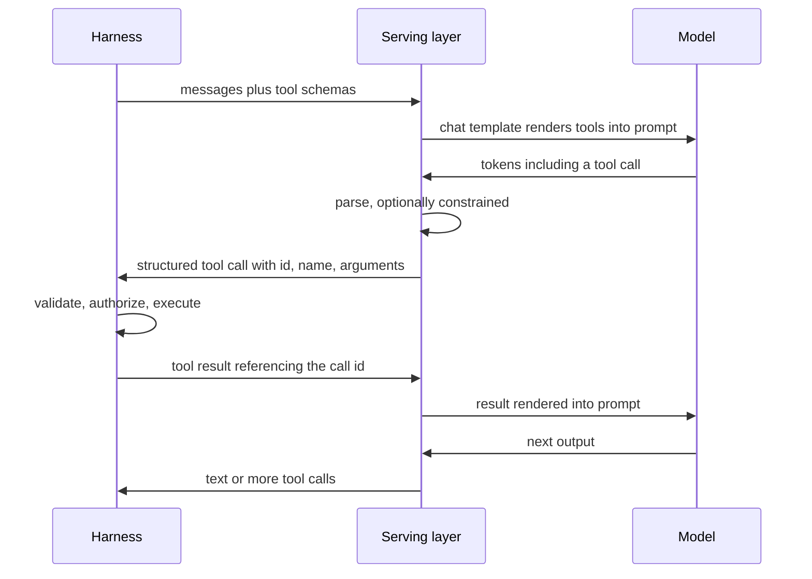
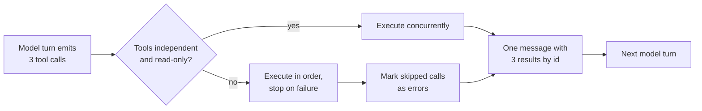
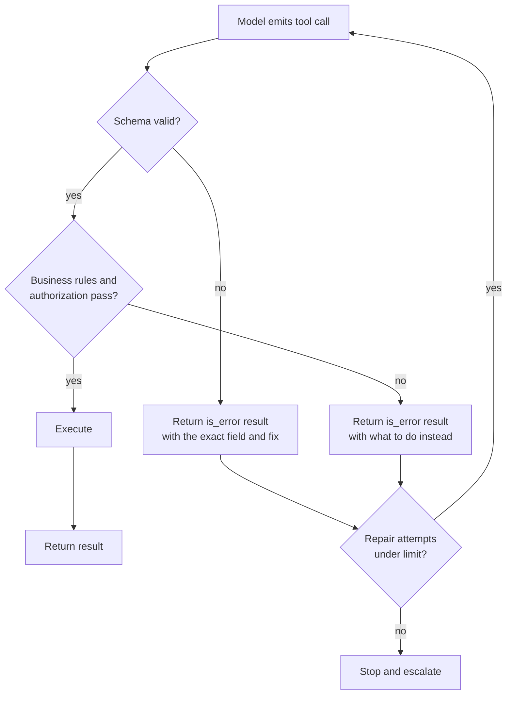
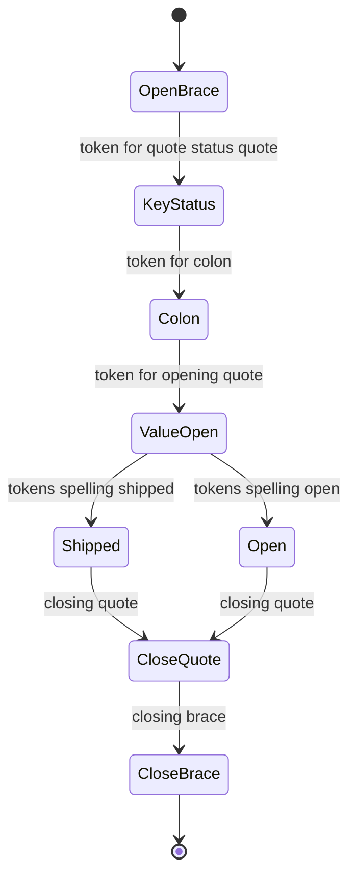
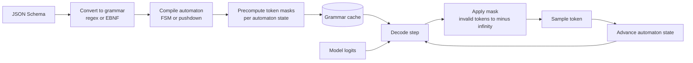
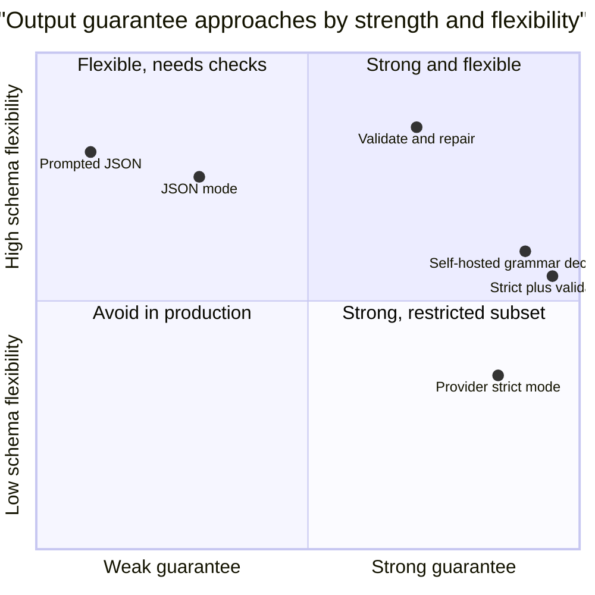

# Chapter 03: Tool Calling and Structured Outputs

> **What this chapter covers**: JSON Schema tool definitions, parallel tool calls, forced and none tool choice, structured outputs and strict mode, the internals of constrained decoding (grammar and finite-state masking), how Anthropic, OpenAI, Gemini, and open-weight chat templates with tool parsers differ, validation and repair loops, and schema design for reliability.
>
> **Prerequisites**: Chapters 01 and 02.
>
> **Where it is used**: Chapter 05 (the harness parses and executes these calls), Chapter 06 (tool definitions are part of the cached prefix), the MCP chapter (MCP tools are JSON Schema tools), every framework chapter, and the evaluation and security chapters.

---

## 03.1 Level 1: Foundations

### What tool calling actually is

A model generates tokens. Tool calling is a convention, trained into the model and enforced by the serving stack, in which some of those tokens form a structured request: a tool name and arguments. The provider's API parses that request out of the token stream and returns it as a structured object. Your harness executes it and sends back the result in a designated message format. The model then continues.

Three layers are involved, and confusing them causes most tool-calling bugs.

1. **The model layer.** Post-training taught the model a format for tool calls (special tokens, XML-like tags, or JSON after a marker) and when to use tools. This is where tool-selection quality lives.
2. **The serving layer.** The provider or your inference server renders tool definitions into the prompt through a chat template, parses the model's output back into structured calls, and optionally constrains decoding so the output must match a schema.
3. **The harness layer.** Your code validates arguments, enforces policy, executes, formats results, and handles errors (Chapter 05).



The model never executes anything. A "tool call" is a request. That sentence is the root of every security property in later chapters: the harness decides what actually happens.

### Structured outputs are the same machinery

Structured outputs ask the model for a final response that matches a JSON Schema, rather than a tool call. Mechanically they are the same: a schema, a model trained to produce matching JSON, and optionally a decoder that makes non-matching output impossible. Many teams implemented structured outputs as "a tool the model is forced to call" before dedicated features existed. The distinction today is purpose:

| Use | Mechanism | Output goes to |
|---|---|---|
| The model needs to act or fetch data | Tool call | Your harness, which executes and returns a result |
| You need the final answer in a fixed shape | Structured output | Your application, which consumes it |

### Vocabulary

| Term | Meaning |
|---|---|
| Tool definition | Name, description, and a JSON Schema for arguments. |
| Tool choice | A request parameter that lets the model decide, requires a tool, forces a specific tool, or forbids tools. |
| Parallel tool calls | Several tool calls in one model turn, to be executed and answered together. |
| Tool call id | An identifier the API assigns to each call; the result must reference it. |
| Strict mode | A provider setting that guarantees arguments match the schema, usually through constrained decoding. |
| Constrained decoding | Masking the model's next-token distribution so only tokens that keep the output valid under a grammar can be sampled. |
| Chat template | The function (often Jinja) that turns messages and tools into the model's actual token sequence. |
| Tool parser | The component of an inference server that extracts structured calls from the raw model output. |
| Repair loop | Returning a validation error to the model so it can correct its call. |

### Why this deserves a chapter

From Chapter 01: silent failures set the ceiling on agent reliability, and converting them into detectable failures is the highest-leverage fix. Tool calls are where most detectable failures can be caught: a wrong type, a missing field, an invalid enum, a nonexistent ID. Schema design, strict mode, and validation are therefore not plumbing. They are the reliability layer.

---

## 03.2 Level 2: Working knowledge

### Anatomy of a tool definition

All major providers use JSON Schema for arguments, with different wrappers. Anthropic's format (field names verified against the Claude docs, September 2026):

```json
{
  "name": "search_orders",
  "description": "Search a customer's orders. Use when the user refers to an order without an order ID, or asks about recent purchases. Returns at most 10 orders, newest first, each with order_id, date, status, and total. Does not return line items; call get_order for those.",
  "input_schema": {
    "type": "object",
    "properties": {
      "customer_id": {"type": "string", "description": "Internal customer ID, format CUST-123456."},
      "status": {"type": "string", "enum": ["open", "shipped", "delivered", "cancelled"]},
      "since": {"type": "string", "format": "date", "description": "ISO date, inclusive."}
    },
    "required": ["customer_id"],
    "additionalProperties": false
  }
}
```

Anthropic uses `input_schema`; OpenAI uses `parameters` inside a function tool; Gemini uses function declarations with `parameters`. Anthropic's docs require tool names to match `^[a-zA-Z0-9_-]{1,128}$` and list optional per-tool properties including `strict`, `cache_control`, `input_examples`, and `defer_loading` (as of September 2026). The Claude docs are explicit that detailed descriptions are "by far the most important factor" in tool performance and recommend at least three to four sentences per tool.

Every part of this definition is prompt text the model reads on every turn:

- **Name.** A verb and a noun, namespaced if you have many tools (`orders_search`, `crm_get_contact`).
- **Description.** What it does, when to use it, when not to, what it returns, and what it does not return. The last clause prevents wasted calls.
- **Parameter descriptions.** Formats, units, examples, and the relation to other tools' outputs ("the `order_id` returned by `search_orders`").
- **Enums.** The strongest constraint you can give without strict mode.
- **Required and `additionalProperties: false`.** Tell the model exactly which fields exist.

### The request and response cycle

A tool loop, in Anthropic's message format:

1. Request with `tools` and `messages`.
2. Response with `stop_reason: "tool_use"` and content containing zero or more `text` blocks and one or more `tool_use` blocks, each with `id`, `name`, and `input`.
3. Your next request appends the assistant message unchanged, then a user message containing one `tool_result` block per `tool_use`, each with the matching `tool_use_id`, and `is_error: true` if the tool failed.

OpenAI's Responses API uses output items of type `function_call` (with `call_id`, `name`, and `arguments` as a JSON string) and input items of type `function_call_output` (with `call_id` and `output`). The Chat Completions API uses `tool_calls` on the assistant message and `role: "tool"` messages with `tool_call_id`. Gemini returns `functionCall` parts and expects `functionResponse` parts.

The concepts are identical. The field names differ, and one practical difference bites often: OpenAI returns arguments as a JSON string you must parse (and which can be malformed without strict mode), while Anthropic returns `input` as a parsed object.

### Tool choice: auto, required, forced, none

| Intent | Anthropic `tool_choice` | OpenAI `tool_choice` | Gemini mode |
|---|---|---|---|
| Model decides (default with tools) | `{"type": "auto"}` | `"auto"` | `AUTO` |
| Must call some tool | `{"type": "any"}` | `"required"` | `ANY` |
| Must call this tool | `{"type": "tool", "name": "x"}` | `{"type": "function", "name": "x"}` | `ANY` with allowed function names restricted to one |
| No tools this turn | `{"type": "none"}` | `"none"` | `NONE` |
| Restrict to a subset | Not a tool_choice option; filter the tools list | `allowed_tools` | Allowed function names |

Sources: Claude "Define tools" page, OpenAI function calling guide, Gemini function calling guide, all checked September 2026. Gemini also documents a `VALIDATED` mode that the docs describe as ensuring function schema adherence; check the current docs for its exact semantics and field location, which differ between the Gemini API surfaces.

Three details matter in practice.

**Forced choice suppresses preamble.** Anthropic's docs note that with `any` or `tool`, the API prefills the assistant turn to force a tool call, so the model will not emit natural-language text before the call. If you want reasoning or an explanation, use `auto` and instruct the model in the user message.

**Forced choice is not universally supported.** As of September 2026, the Claude docs state that forced tool use (`any` and `tool`) returns a 400 error on some models, including Claude Opus 5.5, and is incompatible with manually enabled extended thinking; the recommended alternative is `auto` combined with strict tool use or structured outputs. Check the current model support table before depending on forced choice.

**Changing tool choice can affect caching.** The Claude docs note that changing `tool_choice` invalidates cached message blocks (tools and system prompt stay cached). OpenAI's `allowed_tools` exists partly so you can keep the full tool list stable for caching while restricting what the model may call. Keep the tool list stable across turns; restrict with the choice parameter, not by editing the list, where the provider supports it.

`none` is underrated. Use it for a final summarization turn where you want text only, or to stop a loop that keeps calling tools after it has what it needs.

### Parallel tool calls

Models can emit several tool calls in one turn when the calls are independent: look up three orders, fetch weather for two cities. Both Anthropic and OpenAI enable this by default.

- **Anthropic:** disable with `disable_parallel_tool_use: true` inside the `tool_choice` object; it is not a top-level parameter. With `auto` this means at most one tool per response.
- **OpenAI:** `parallel_tool_calls: false` as a request parameter.

Rules for handling parallel calls correctly:

1. **Return every result together.** Anthropic's docs require one `tool_result` per `tool_use`, all in the next user message, with the results before any text in that message. If you skip a call (because an earlier one in a sequential run failed), still return a result for it with `is_error: true` and a short explanation.
2. **Choose the execution strategy per tool.** The API does not prescribe execution order. Run independent reads concurrently. Run writes or tools with shared state sequentially.
3. **Match by id, never by position.** Results must reference the call id.

The latency win is real. Three independent 400 ms lookups take 1.2 s sequentially and about 0.4 s concurrently, and they save two model round trips of several seconds each compared with calling tools one per turn. Parallel calls are the cheapest latency optimization in agent design.



### Structured outputs and strict mode

Three levels of guarantee exist, from weakest to strongest.

1. **Prompted JSON.** Ask for JSON in the prompt, parse, hope. Modern models comply most of the time, but "most" is a silent-failure rate.
2. **JSON mode.** The provider guarantees syntactically valid JSON but not schema conformance.
3. **Schema-constrained output (strict mode).** The provider guarantees the output conforms to your schema, typically by constrained decoding.

Provider specifics, verified September 2026:

- **Anthropic.** Strict tool use: set `"strict": true` on a tool definition. The docs describe this as grammar-constrained sampling and guarantee that tool `input` follows the `input_schema` and that the tool name is valid. JSON structured outputs for the final response use `output_config.format`; the older `output_format` parameter is documented as deprecated, beta headers are no longer required, and the feature is listed as generally available. Compiled grammars are cached for 24 hours from last use; the first request with a new schema has extra latency while the grammar compiles.
- **OpenAI.** `strict: true` on a function tool. Requirements: `additionalProperties: false` on every object, and every property listed in `required`; optional fields are expressed as a union with null, for example `"type": ["string", "null"]`. Structured outputs for text use a JSON schema response format (`text.format` in the Responses API, `response_format` in Chat Completions). OpenAI also offers custom tools that accept free-form text, optionally constrained by a Lark context-free grammar or a regex.
- **Gemini.** Structured output via a response schema on the generation config (`response_schema`, and a `response_json_schema` variant that accepts JSON Schema), plus the function calling modes above.
- **Open-weight via vLLM.** Named tool choice and `tool_choice="required"` use structured outputs to guarantee valid calls, according to the vLLM docs. Arbitrary constraints (JSON schema, regex, choice list, EBNF grammar) are available through a `structured_outputs` request field, with backends including xgrammar and guidance and an `auto` default that picks one.

Strict mode supports a subset of JSON Schema. Anthropic's documented unsupported features include recursive schemas, numeric bounds (`minimum`, `maximum`, `multipleOf`), string length bounds, `pattern`, conditional schemas, `not`, `oneOf` (use `anyOf`), `prefixItems`, and external `$ref`. OpenAI's subset differs. Consequence: **strict mode guarantees shape, not business validity.** A `quantity` field can be a guaranteed integer and still be negative, because the bound is not enforceable in the grammar. You still validate.

### Validation and repair loops

Even with strict mode, validate in the harness, because:

- schemas cannot express cross-field rules (`end_date` after `start_date`),
- they cannot check existence (`order_id` refers to a real order the user owns),
- and strict mode is not available for every model, tool type, or schema.

The repair loop turns a validation failure into a detectable failure the model can fix:



Good error messages are specific and actionable:

| Bad | Good |
|---|---|
| `Invalid input` | `since must be an ISO date like 2026-09-01; got "last week". Resolve relative dates using today's date, 2026-09-27.` |
| `Not found` | `No order 88412 for customer CUST-000731. Call search_orders with this customer_id to list their orders.` |
| `Forbidden` | `Refunds above 50.00 require approval. Call request_refund_approval with the amount and reason instead.` |

The right-hand column is ACI design (Chapter 01): the error tells the model the next action. In practice, a good error message usually gets the call fixed on the first retry; cap repairs at two or three and escalate after that.

### Making a schema strict-compatible across providers

OpenAI strict mode requires every property in `required` and no additional properties, so optional fields become nullable. The same logical tool, written for OpenAI strict mode:

```json
{
  "type": "function",
  "name": "search_orders",
  "description": "Search a customer's orders ... (same text as above)",
  "strict": true,
  "parameters": {
    "type": "object",
    "properties": {
      "customer_id": {"type": "string", "description": "Internal customer ID, format CUST-123456."},
      "status": {"type": ["string", "null"], "enum": ["open", "shipped", "delivered", "cancelled", null]},
      "since": {"type": ["string", "null"], "description": "ISO date, inclusive, or null for no lower bound."}
    },
    "required": ["customer_id", "status", "since"],
    "additionalProperties": false
  }
}
```

Two semantic changes follow. The model must now explicitly emit `null` for fields it would have omitted, so the description must say what `null` means. And your tool implementation must treat `null` and "absent" identically. Converters that generate provider formats from one internal definition should apply this transformation automatically and add the null semantics to descriptions.

### Formatting tool results

Results are observations (Chapter 01), and their format is part of the ACI. Guidelines:

| Concern | Guideline | Why |
|---|---|---|
| Size | Return the fields the next decision needs; paginate with a cursor | Results dominate context growth |
| Identifiers | Include stable IDs the model can pass to other tools | Enables chaining without guessing |
| Format | Compact JSON or short labeled text; be consistent per tool | Models parse both; consistency matters more than choice |
| Truncation | Say explicitly that output was truncated and how to get more | Silent truncation causes wrong conclusions |
| Errors | `is_error` plus an actionable message | Converts failures into repairable ones |
| Empty results | Say "no orders match; filters were status=open, since=2026-09-01" | Prevents the model from assuming a tool failure |
| Untrusted content | Delimit third-party text clearly as data | Reduces injection risk, does not remove it |

Worked example of the size effect. A `get_customer` tool returns the full CRM record, 2,400 tokens. The agent calls it on average 1.3 times per task, and each result stays in context for about 6 later turns. Context cost is $2{,}400 \times 1.3 \times 6 \approx 18{,}700$ input tokens per task. A trimmed version returns 350 tokens of the fields the agent actually uses: $350 \times 1.3 \times 6 \approx 2{,}700$ tokens. That is 16,000 input tokens saved per task, before caching, from one tool.

### Structured output design for extraction

For extraction and classification outputs, order and field design matter because generation is left to right.

```json
{
  "type": "object",
  "properties": {
    "evidence": {"type": "array", "items": {"type": "string"}, "description": "Verbatim quotes supporting the decision."},
    "rationale": {"type": "string", "description": "Two to four sentences of reasoning."},
    "decision": {"type": "string", "enum": ["approve", "deny", "needs_review"]},
    "confidence": {"type": "string", "enum": ["low", "medium", "high"]}
  },
  "required": ["evidence", "rationale", "decision", "confidence"],
  "additionalProperties": false
}
```

Evidence first forces grounding before judgment. Rationale before decision gives the model room to reason inside the constrained output. A `needs_review` enum value gives the model a legitimate way to abstain, which is better than forcing a binary guess. Categorical confidence is more stable than a numeric score, which models tend to produce poorly calibrated. Measure all four choices on your own data; they are good defaults, not laws.

### Schema design for reliability

Rules that consistently reduce errors:

1. **Fewer, intent-shaped tools.** The Claude docs recommend consolidating related operations and namespacing names. A tool per user intent beats a tool per API endpoint.
2. **Enums over free strings** wherever the value set is closed.
3. **Flat over nested.** Each nesting level is a place to misplace a field.
4. **Semantic identifiers.** Return and accept IDs the model has seen in earlier results; describe where they come from.
5. **Required over optional.** Every optional field is a decision the model must make. Make defaults explicit in the description.
6. **Units and formats in names or descriptions.** `amount_usd`, `duration_minutes`, ISO dates.
7. **No overlapping tools.** If two descriptions could both justify a call, merge them or add "use X instead when".
8. **Examples for complex inputs.** Anthropic's `input_examples` field attaches schema-validated examples; its docs estimate about 20 to 50 tokens for simple examples and 100 to 200 for complex nested ones.
9. **Reasoning fields before answer fields** in structured outputs, when you want the model to think before committing (a `rationale` string before `decision`), because generation is left to right.

---

## 03.3 Level 3: Depth

### How tools reach the model: chat templates

A model does not see your JSON. It sees tokens produced by a chat template. Anthropic documents that when you pass `tools`, the API constructs a special system prompt containing formatting instructions and the tool definitions, followed by your system prompt. That construction costs tokens on every request, and the Claude pricing docs list a per-model tool-use system prompt overhead (check the current table rather than memorizing a figure).

For open-weight models the template is visible, usually a Jinja template in the tokenizer config. Formats vary by family:

| Family | How tools appear in the prompt | How calls appear in output | vLLM parser (as of September 2026) |
|---|---|---|---|
| Hermes-style, also used by Qwen2.5 | Tool JSON inside a system section with tags | JSON inside `<tool_call>` tags | `hermes` |
| Llama 3.1 and later | Tool JSON in system or user message | JSON object, or special python tag for built-ins | `llama3_json` |
| Llama 4 | Tool definitions in the template | Pythonic call syntax | `llama4_pythonic` |
| Mistral | Tools in a special tokens block | `[TOOL_CALLS]` token then JSON | `mistral` |
| DeepSeek V3 family | Template-specific markers | Special tokens around calls | `deepseek_v3`, `deepseek_v31` |
| GPT-OSS | Harmony format | Channel-based messages | `openai` |

To enable tool calling in vLLM you pass `--enable-auto-tool-choice` and `--tool-call-parser <name>` (vLLM docs, checked September 2026). Parser names change between vLLM releases; confirm against the version you install.

Three consequences.

1. **Template mismatch breaks tool calling silently.** If you fine-tune a model with one template and serve it with another, tool calls may be emitted in a format the parser cannot read. The server returns text that contains a malformed call and no structured `tool_calls`. This is the most common open-weight tool-calling bug.
2. **Parsers are heuristics.** In `auto` mode, the parser watches the output stream for the family's call marker. If the model writes a tool call in the wrong format, or writes JSON that looks like a call in prose, the parser misfires.
3. **Tool definitions consume context.** Twenty tools with rich descriptions can easily exceed 5,000 tokens. On an 8 GB GPU with a 7B model at 4-bit and limited KV cache, that is a real fraction of your context budget.

### Constrained decoding internals

Constrained decoding makes invalid output impossible by editing the next-token distribution. At each step, the decoder computes the set of tokens that keep the output a valid prefix of some string in the target language, sets the logits of all other tokens to negative infinity, and samples from what remains.

$$\tilde{P}(t \mid x_{<i}) \propto \begin{cases} P(t \mid x_{<i}) & \text{if } x_{<i} \cdot t \text{ is a valid prefix} \\ 0 & \text{otherwise} \end{cases}$$

The difficulty is speed. A vocabulary has 100,000 to 200,000 tokens, and a token can span several grammar symbols (`"},{"` is one token in many tokenizers). Checking every token against the grammar at every step is too slow naively. Two families of techniques solve it.

**Finite-state machines for regular languages.** Willard and Louf ("Efficient Guided Generation for Large Language Models", 2023, the basis of Outlines) compile a regex (and JSON Schemas that reduce to regular languages) into a finite-state machine over characters, then precompute, for each FSM state, which vocabulary tokens lead to a valid next state. At decode time, the mask is a lookup by current state. Cost moves from decode time to compile time.



This toy FSM accepts only `{"status": "open"}` or `{"status": "shipped"}`. At the `ValueOpen` state, the mask allows only tokens that begin `open` or `shipped`; every other token in the vocabulary has probability zero.

**Pushdown automata for context-free grammars.** Nested JSON with arbitrary depth, and general grammars, need a stack. XGrammar (Dong et al., 2024) splits tokens into context-independent ones (validity can be precomputed per grammar position) and context-dependent ones (need the stack at run time), precomputes the former, and checks only the latter at decode time, reporting large speedups over earlier engines. This is why recursive schemas are harder: they require the stack, and some providers simply do not support them in strict mode.

The whole pipeline, from schema to sampled token:



Worked mask arithmetic. With a 150,000-token vocabulary, at the position right after `"status": "` in the toy FSM, perhaps a few dozen tokens are valid (tokens spelling prefixes of `open` or `shipped`). The mask zeroes more than 99.9 percent of the vocabulary. If the model's unconstrained distribution put 0.97 probability on `open` and 0.02 on `shipped`, renormalization barely changes anything, which is the common case when the prompt and schema agree. If the model wanted to write `pending`, a status that does not exist, the mask forces it into `open` or `shipped` by the ratio of their small probabilities. Constrained decoding hides the disagreement instead of surfacing it. That is the strongest argument for including an explicit escape value (`unknown`, `needs_review`) in enums: it gives the model's real belief a valid place to go.

The compile step explains two provider behaviors: first-request latency for a new schema, and grammar caching (24 hours from last use in Anthropic's docs). Keep schemas stable; generating a slightly different schema per request defeats the cache.

### What constrained decoding does to quality

Masking guarantees syntax. It does not guarantee the model wanted to produce that output. Three effects matter.

1. **Distribution distortion.** When the model's preferred token is masked, the renormalized distribution can push it down an unlikely path. If a model wanted to write prose and the grammar forces a JSON object, the content can degrade.
2. **Tokenization artifacts.** Forcing a token boundary the model would not naturally choose (for example, splitting a word across a grammar boundary) produces unusual token sequences. Good engines handle token healing and multi-symbol tokens carefully; naive ones do not.
3. **Reasoning suppression.** Tam et al. ("Let Me Speak Freely?", 2024) reported that strict format constraints can degrade reasoning performance on some tasks, with JSON-mode-style restrictions hurting more than looser formats. The effect varies by model and task, and later work has argued it depends heavily on prompt design. The practical rule: let the model reason first (a thinking channel, a free-text field placed before the answer fields, or a prior turn), then constrain the final structure.

| Approach | Syntax guarantee | Schema guarantee | Quality risk | Latency |
|---|---|---|---|---|
| Prompted JSON | No | No | Low | Baseline |
| JSON mode | Yes | No | Low | Baseline |
| Strict, constrained decoding | Yes | Yes, within supported subset | Some, if reasoning is squeezed | First-request compile, then small |
| Post-hoc validation plus repair | No | Yes, after repair | Low | Extra round trip on failure |

### Failure taxonomy for tool calls

| Failure | Example | Detectable by | Fix |
|---|---|---|---|
| Wrong tool | `search_customers` instead of `search_orders` | Trajectory review, eval | Better descriptions, merge overlapping tools |
| Missing call | Answers from memory instead of looking up | Groundedness check | "Always look up before answering" plus eval |
| Hallucinated call result | Claims a refund was issued without calling | Compare claims with tool log | Require evidence, check in evaluator |
| Malformed arguments | Invalid JSON string | Parser | Strict mode |
| Schema-valid, semantically wrong | Correct type, wrong customer's ID | Business validation | Authorization and existence checks |
| Wrong format inside a string | "next Tuesday" for a date | Validator | Format in description, strict `format`, repair |
| Redundant calls | Same lookup three times | Loop detector | Better observation, caching |
| Parallel misuse | Two conflicting writes in parallel | Harness policy | Sequential execution for writes |

Only the malformed-arguments row is fully solved by strict mode. The rest need harness logic and evaluation.

### Repair loop arithmetic

Let $e$ be the probability a call fails validation and $f$ the probability a repair attempt fixes it. With up to $r$ repairs, the probability a call ends valid is

$$P_{\text{valid}} = (1 - e) + e \left(1 - (1 - f)^{r}\right)$$

Take $e = 0.08$ (no strict mode, a 7B open-weight model) and $f = 0.75$ (specific error messages). With $r = 1$: $0.92 + 0.08 \times 0.75 = 0.98$. With $r = 2$: $0.92 + 0.08 \times 0.9375 = 0.995$. With vague messages, $f$ might be 0.3: $r = 2$ gives $0.92 + 0.08 \times 0.51 = 0.961$. Error message quality moves call validity by more than three points here, which matters because Chapter 01 showed each point of per-step reliability compounds.

Cost side: expected extra model turns per call are $e \left(1 + (1 - f) + \ldots\right)$ up to $r$ terms. With $e = 0.08$, $f = 0.75$, $r = 2$: $0.08 \times (1 + 0.25) = 0.10$ extra turns per call. On a 10-call task, one extra turn on average. Strict mode removes the schema-level part of $e$ at the cost of first-request compile latency, and business-rule failures remain.

| Setup | $e$ | $f$ | $r$ | Valid per call | Valid over 10 calls |
|---|---|---|---|---|---|
| Prompted, vague errors | 0.08 | 0.30 | 2 | 0.961 | 0.672 |
| Prompted, specific errors | 0.08 | 0.75 | 2 | 0.995 | 0.951 |
| Strict schema, business errors only | 0.02 | 0.75 | 2 | 0.9988 | 0.988 |

The last row: $0.98 + 0.02 \times 0.9375 = 0.99875$, and to the tenth power about 0.988. Strict mode plus good errors gets per-call validity close to the level long-horizon agents need.

### Streaming tool calls

Providers stream tool-call arguments as partial JSON fragments. Three harness rules.

1. **Accumulate by call index or id,** since parallel calls interleave in the stream.
2. **Execute only on completion,** signalled by the provider's end-of-block or finish event. A partial JSON that parses (for example `{"amount": 5` then `0}`) can be wrong if acted on early.
3. **Show progress early.** The tool name arrives first; showing "Looking up order..." in the UI cuts perceived latency without risk.

For open-weight servers, streaming with auto tool parsing is where parsers are most fragile, because the parser must decide from a partial stream whether the model is writing text or starting a call. If you see calls leaking into streamed text, test the same prompts without streaming to isolate the parser.

### Numbers worth knowing

Tool definition tokens, worked. Ten tools with 80-word descriptions and five parameters each at about 20 tokens per parameter description: per tool about $110 + 100 + 40$ tokens of schema overhead, about 250 tokens; ten tools about 2,500 tokens, plus the provider's tool-use system prompt. At 100,000 requests a day and a hypothetical 3 dollars per million input tokens, uncached tool definitions cost $2{,}500 \times 100{,}000 \times 3 / 10^6 = 750$ dollars a day. With a prompt cache read at a tenth of the input price (a common ratio; check your provider), that falls to about 75 dollars a day plus write costs. Tool definitions belong in the cached prefix and must stay byte-stable (Chapter 06).

Parallelism, worked. A task needs 6 independent lookups. Sequential single calls: 6 model turns at 3 s plus 6 tools at 0.4 s is 20.4 s. One turn with 6 parallel calls then a final turn: 2 model turns at 3 s plus 0.4 s concurrent tools is 6.4 s. The token saving is also large, because each avoided turn avoids resending the whole context.

---

## 03.4 Level 4: Mastery

### Designing a tool surface

A senior engineer designs tools as a product for a model user. The process:

1. **List user intents** from real transcripts, not API endpoints.
2. **Map intents to tools.** One tool per intent where possible. Merge endpoints the model would always call together.
3. **Design observations** before arguments. What does the model need to see to decide its next step? Return exactly that, with stable identifiers and a hint for the next call.
4. **Write descriptions as prompts,** then test them: run the eval set, read trajectories where the wrong tool was picked, and revise.
5. **Decide the guarantee level per tool.** Strict mode for tools whose arguments feed systems that cannot tolerate malformed input. Validation and repair everywhere.
6. **Decide the execution policy per tool.** Read-only concurrent, writes sequential, irreversible writes gated.

| Design choice | Option A | Option B | Choose A when | Choose B when |
|---|---|---|---|---|
| Granularity | One tool with an `action` enum | Separate tools per action | Actions share arguments and context | Actions have very different arguments or risk levels |
| Output size | Full record | Summary plus ID for a detail call | Records are small | Records are large or rarely fully needed |
| Errors | Raise, harness formats | Return a structured error object | Uniform error handling | Tool-specific recovery hints |
| Guarantee | Strict mode | Validate and repair | Schema fits the supported subset, input feeds brittle systems | Schema uses unsupported features, or reasoning quality suffers |

The granularity row has a safety dimension. Anthropic recommends consolidating related operations, but consolidating a read and an irreversible write into one tool makes it harder to gate the write. Split by risk level even when you consolidate by intent.

### Large tool sets

With dozens or hundreds of tools (common once agents connect to several MCP servers), three problems appear: definition tokens crowd the context, selection accuracy drops as descriptions overlap, and the cache breaks whenever the tool list changes.

Mitigations, in increasing sophistication:

1. **Curate.** Most agents need far fewer tools than they are given.
2. **Namespace and disambiguate.** Prefixes and "use X instead when" clauses.
3. **Restrict per turn without editing the list.** OpenAI's `allowed_tools` keeps the list stable for caching while limiting what can be called.
4. **Load tools on demand.** Anthropic documents a tool search capability and a `defer_loading` property so that tool definitions are discovered when needed rather than all loaded up front (as of September 2026; check current docs for status and supported models). The general pattern (a search tool over tool descriptions) can be built on any provider.
5. **Route to sub-agents** that each carry a small tool set (Chapter 02, orchestrator-workers).

### Provider differences that bite in production

| Issue | Anthropic | OpenAI | Gemini | Open-weight via vLLM |
|---|---|---|---|---|
| Arguments format | Parsed object `input` | JSON string `arguments` | Parsed object in `functionCall` | JSON string, parser-dependent |
| Strict schema | `strict: true` per tool | `strict: true` per function | Validated mode and response schema | Guided decoding for named or required choice |
| Optional fields in strict | Standard `required` list | All fields required, nullable types | Check docs | Backend-dependent |
| Disable parallel | `disable_parallel_tool_use` inside `tool_choice` | `parallel_tool_calls: false` | Check docs | Model and parser dependent |
| Forced tool | `any` or `tool`, not on all models | `required` or named | `ANY` plus allowed names | Named or `required` via structured outputs |
| Text before tool call | Yes with `auto`, suppressed when forced | Model-dependent | Model-dependent | Template-dependent |
| Free-form grammar tools | Not as a tool type (as of September 2026) | Custom tools with Lark or regex grammar | Check docs | Grammar and regex via structured outputs |

Portability advice: define tools once in a neutral internal format (name, description, JSON Schema, risk level, execution policy) and generate each provider's format from it. Keep schemas inside the intersection of supported JSON Schema features if you need to switch providers. Test each provider on the same eval set; tool-selection behavior differs even when the schema is identical.

### Choosing a guarantee level



The placements are judgments. The point of the chart is that no single approach is both strongest and most flexible: strict mode restricts you to a schema subset, validate-and-repair accepts any rule you can write in code but costs round trips, and the production answer is usually strict mode for shape plus harness validation for everything else.

### A tool definition registry

At scale, tool definitions become a governed artifact, not strings scattered across code. A registry entry holds:

| Field | Example | Used by |
|---|---|---|
| Name and version | `orders_search` v3 | Harness, traces |
| Description and parameter docs | Prompt text | Model |
| JSON Schema | Strict-compatible intersection | Provider converters |
| Risk level | read, reversible write, irreversible write | Policy engine, approval gates |
| Execution policy | concurrent, sequential, gated | Harness |
| Timeout and retry policy | 5 s, 2 retries on 5xx | Harness |
| Owner | team or service | Incident response |
| Eval coverage | IDs of eval cases exercising the tool | CI |

Changing a description is a behavior change, so it goes through the same review and eval gate as a prompt change. Version the description, log the version in traces, and compare selection accuracy before and after. This is where your MCP experience applies directly: an MCP server is a tool registry exposed over a protocol, and the same governance applies (the protocols part covers MCP specifics).

### Production case: turning on strict mode

A synthetic travel company, Margie's Travel, ran a booking agent with 14 tools without strict mode. Traces over one week (about 210,000 tool calls) showed 2.9 percent schema-invalid calls, mostly dates in wrong formats and passenger counts as strings, repaired at 81 percent on the first retry. The team enabled strict mode on all 14 tools.

What happened, in order:

1. **Six tools were rejected at request time** because their schemas used unsupported features (`minimum` and `maximum` on counts, a `pattern` on booking references, `oneOf` on a payment union). The team moved the bounds and pattern into harness validation, rewrote `oneOf` as `anyOf`, and documented the bounds in descriptions.
2. **First-request latency rose** for the first call with each schema after deploy while grammars compiled, then settled. Because a feature flag generated one schema variant per tenant (a tenant-specific enum of fare classes), the grammar cache hit rate was low for small tenants. Fix: a single schema with the union of fare classes and a harness check for tenant eligibility.
3. **Schema-invalid calls went to zero.** Business-rule failures (departure after return, unavailable fare class) stayed at about 1.1 percent, unchanged, which was expected: strict mode does not see them.
4. **One quality regression appeared.** A `notes` field that the model previously sometimes omitted was now nullable-required in the OpenAI variant, and the model began filling it with restated context, inflating downstream emails. The description was changed to "null unless the customer gave special instructions".

Net effect on the weekly eval (paired, 400 tasks): task success rose from 0.84 to 0.88 (difference CI roughly 0.02 to 0.06, illustrative). The lessons generalize: audit schemas against the supported subset before flipping the switch, keep schemas stable for the grammar cache, and read trajectories after the change because the model's behavior on optional fields can shift.

### Production case: A/B testing tool descriptions on an MCP server

A synthetic analytics vendor, Fourth Coffee Data, exposes an MCP server with 11 tools to customers' agents. Support tickets showed agents calling `run_query` with raw SQL when `get_metric` (a governed, cached metric lookup) would have answered. The team ran an A/B study on descriptions only, with schemas unchanged.

Protocol:

1. Build 150 synthetic tasks where the correct first tool is known (90 metric lookups, 60 ad hoc queries).
2. Run each task 3 times against two client models under each description variant.
3. Measure first-tool accuracy, task success, and tokens, paired by task.

Variants and results (illustrative):

| Variant | `get_metric` description change | First-tool accuracy on metric tasks | Wrong use of `get_metric` on ad hoc tasks |
|---|---|---|---|
| A (baseline) | "Get a metric value." | 0.58 | 0.03 |
| B | Adds what metrics exist and "prefer this over run_query for any listed metric" | 0.86 | 0.05 |
| C | B plus "Does not support custom filters; use run_query for those" | 0.88 | 0.02 |

Variant C won on both columns: the "when not to use" clause cut misuse while keeping the gain. Two further findings: one client model responded far more to the change than the other, so descriptions must be tested against every model you expect to serve; and the longer descriptions added about 180 tokens to the tool list, negligible against the tokens saved by avoiding exploratory SQL. When you run a server that other people's agents call, descriptions are your only lever on their behavior, which makes this kind of study routine maintenance, not a one-off.

### Tool count and selection accuracy

Selection accuracy tends to fall as tools are added, especially when descriptions overlap. A simple way to reason about it: if each added tool that overlaps with the correct one takes a probability share $\delta$ of wrong selections, then with $k$ overlapping tools selection accuracy is roughly $1 - k\delta$ for small $k\delta$. At $\delta = 0.02$, five overlapping tools cost about 10 points. The model is crude, but it says what to measure: not the total tool count but the number of tools that plausibly compete for each intent. Build a confusion matrix of intended versus chosen tool from your eval set, and merge or disambiguate the pairs with the most confusion.

### Grammar cache economics, worked

Suppose a multi-tenant platform generates one schema per tenant (a tenant-specific enum), with 2,000 tenants. Compiled grammars are cached for 24 hours from last use (Anthropic's documented behavior; other stacks differ). A tenant with fewer than one request a day recompiles on nearly every request.

| Tenant tier | Tenants | Requests per tenant per day | Share of requests hitting a cold grammar |
|---|---|---|---|
| Large | 50 | 5,000 | about 0.0 percent |
| Medium | 450 | 50 | about 2 percent (first call of the day) |
| Small | 1,500 | 0.5 | close to 100 percent |

Small tenants make up 750 requests a day, all cold, and each pays the compile latency on its first tool call, exactly where their users judge responsiveness. Consolidating to one schema with the union of values and a harness-side eligibility check makes every tenant share the warm grammar. The same logic applies to prompt caches (Chapter 06): per-tenant variation in the prefix moves small tenants to the cold path.

| Option | Grammar cache | Enforcement of tenant values | Trade-off |
|---|---|---|---|
| Per-tenant schema | Cold for small tenants | In the grammar | Latency for small tenants |
| Union schema plus harness check | Warm for all | In code, with a repair loop | Occasional repair turn |
| Free string plus harness check | Warm | In code only | More invalid values reach the harness |

The union option is usually best: shape guaranteed by the grammar, tenant rules by code.

Quick check on the medium tier: 50 requests a day spread over business hours keep the grammar warm all day, so only the first request after a gap of more than 24 hours compiles. Weekends matter: a tenant idle from Friday evening to Monday morning starts every week cold. If compile latency is material for your schemas, a scheduled warm-up request per schema before business hours is a cheap mitigation, though it costs a request per schema per day and should be measured before being adopted.

Before-and-after checklist for any strict-mode rollout:

- Audit every schema against the provider's supported subset.
- Count distinct schemas generated per day; consolidate variants.
- Move unsupported constraints into harness validation with repair messages.
- Re-state constraints in descriptions so the model aims for them.
- Measure first-call latency by tenant tier after deploy.
- Read a sample of trajectories for behavior changes on nullable fields.

### Production case: provider failover

A synthetic insurer, Tailspin Mutual, runs its claims agent on one provider with a second as failover. The first real outage revealed that failover "worked" at the HTTP level and failed at the agent level: task success on the backup dropped to 0.61 against 0.83 on the primary.

Causes found in trajectories, and fixes:

| Cause | Symptom | Fix |
|---|---|---|
| Arguments as a JSON string on the backup, parsed as an object by the harness | Every call raised a parse error, then repaired | Normalize in the provider adapter |
| Forced tool choice semantics differed | Backup emitted text instead of the extraction call | Use each provider's own required-choice value from the neutral registry |
| Parallel calls default differed | Two conflicting writes ran concurrently | Execution policy per tool enforced in the harness, not assumed from the provider |
| Descriptions tuned for the primary | Backup chose `search_policies` where `get_policy` was right | Per-provider eval, two description tweaks that helped both |

After fixes, backup success reached 0.79 on the same eval. Failover is an agent-level property: it needs a tool adapter layer, provider-specific evals, and a periodic drill, not just a second API key.

### What the literature and vendors disagree on

**Constrained decoding and quality.** Vendors present strict mode as pure upside ("no need to validate and retry"). Research such as Tam et al. (2024) reported that format restrictions can hurt reasoning, while follow-up work argued the effect depends on prompt design and is small with well-designed schemas. The defensible position: strict mode is excellent for arguments and extraction, and should come after reasoning, not instead of it. Keep validating business rules regardless of vendor claims.

**Many tools versus few.** Some guidance favors many narrow tools for clarity; Anthropic's current docs favor consolidating related operations with an action parameter. The disagreement dissolves when you measure selection accuracy on your own task set and split by risk.

**Native tool calling versus code as action.** An alternative to JSON tool calls is letting the model write code that calls functions (the CodeAct line of work, Wang et al., 2024, reported gains on some benchmarks). Code composes actions, handles loops, and reduces round trips, at the cost of needing a sandbox and making policy enforcement harder, since you must analyze code rather than a structured call. Vendors increasingly offer both. Choose code actions for data-heavy tasks in a sandbox, JSON calls where each action must be individually authorized.

### Edge cases

- **Streaming tool calls.** Arguments arrive as partial JSON deltas. Do not execute until the call is complete. For UI, you can show the tool name early.
- **Very large arguments.** Writing a whole file as a JSON string argument invites escaping errors. Prefer diff or patch tools, or a custom free-form tool with a grammar where available.
- **Idempotency.** A retried request can re-emit a write call. Give write tools an idempotency key derived from the call id or task step, and deduplicate in the tool.
- **Results containing instructions.** A tool result is untrusted data (Chapter 01). Wrap it clearly as data, and never let a result change tool permissions.
- **Tool results with images or files.** Supported in different ways per provider (OpenAI's function call output accepts text, image, or file content per its guide; check each provider). Size and token cost can be large; downscale.

---

## 03.5 Subtopic checklist

- [x] JSON Schema tool definitions, with field names per provider (03.2)
- [x] Parallel tool calls: defaults, disabling per provider, result formatting, execution strategy (03.2)
- [x] Forced and none tool choice, with the provider mapping and support caveats (03.2)
- [x] Structured outputs and strict mode, guarantee levels, supported subsets (03.2)
- [x] Constrained decoding internals: logit masking, FSM compilation, pushdown automata, compile caching, quality effects (03.3)
- [x] Provider differences: Anthropic, OpenAI, Gemini, open-weight chat templates and tool parsers (03.2, 03.3, 03.4)
- [x] Validation and repair loops with actionable error messages (03.2)
- [x] Schema design for reliability (03.2, 03.4)
- [x] Large tool sets and on-demand loading (03.4)
- [x] Failure taxonomy for tool calls (03.3)

## 03.6 Common misconceptions

1. **"The model executes the tool."** The model emits a request. The harness decides whether and how to execute it. Every security control depends on this.
2. **"Strict mode means I do not need validation."** Strict mode guarantees shape within a supported schema subset. It cannot check numeric bounds it does not support, cross-field rules, existence, or authorization.
3. **"JSON mode and structured outputs are the same."** JSON mode guarantees valid JSON; structured outputs guarantee conformance to your schema.
4. **"Forced tool choice works everywhere."** As of September 2026, some Claude models reject `any` and `tool` with a 400 error, and forced choice is incompatible with manually enabled extended thinking. Check support per model.
5. **"Descriptions are for humans reading the code."** The model reads them on every turn, and they are the largest single factor in tool-selection quality.
6. **"More tools make the agent more capable."** More tools cost context, reduce selection accuracy, and complicate caching. Curate, namespace, or load on demand.
7. **"Constrained decoding has no quality cost."** Masking can distort the distribution and squeeze reasoning. Let the model reason first, then constrain.
8. **"Parallel tool calls can be answered one per message."** Anthropic requires all results for a turn's calls in the next user message, matched by id, with skipped calls marked as errors.
9. **"An open-weight model that supports tools will work with any server config."** The chat template and tool parser must match the model family; mismatches produce silent parsing failures.
10. **"Editing the tool list per turn is a harmless way to restrict tools."** It changes the cached prefix and can invalidate the cache. Restrict with tool choice parameters where available.

11. **"A constrained output that parses is a faithful output."** If the model's belief has no valid place in the schema, masking forces it into an allowed value and hides the disagreement. Include escape values such as `needs_review`.
12. **"Tool result format is an implementation detail."** Results dominate context growth and shape the next decision. Size, identifiers, truncation notices, and empty-result messages are ACI design.

## 03.7 Practice

1. **Conceptual.** For the `search_orders` example, list every piece of text the model reads and rewrite each to reduce one failure from the taxonomy.
2. **Design.** Design a tool surface (names, descriptions, schemas, risk levels, execution policies) for a synthetic IT helpdesk at "Contoso Labs" with six intents. Split by risk where needed.
3. **Arithmetic.** You have 40 tools averaging 300 tokens each and 50,000 requests a day at a hypothetical 2.50 dollars per million input tokens with cache reads at 10 percent of that. Compute daily cost uncached and cached, and the saving from cutting to 12 tools.
4. **Hands-on (4060).** Serve a 7B-class tool-capable open-weight model at 4-bit with vLLM or Ollama, enable its tool parser, and run 50 synthetic tool-calling prompts. Measure the parse failure rate. Then deliberately use a mismatched template or parser and measure again.
5. **Hands-on.** Using vLLM's structured outputs with a JSON schema, extract fields from 100 synthetic invoices with and without the constraint. Compare schema-valid rate, field accuracy, and latency, with bootstrap intervals, paired by invoice.
6. **Hands-on.** Implement a repair loop: validate arguments with a JSON Schema validator plus two business rules, return specific error messages, and cap repairs at two. Report first-try validity, post-repair validity, and mean repairs.
7. **Hands-on.** Write a 40-line toy constrained decoder: given a small vocabulary and a regex for an enum of three strings, compute the allowed token mask at each step and sample. Show that invalid outputs are impossible.
8. **Design.** Write a neutral internal tool format and a converter to Anthropic and OpenAI formats. List the schema features you had to avoid to keep strict mode portable.
9. **Conceptual.** Explain why placing a `rationale` field before `decision` in a structured output can change accuracy, and design an experiment to test it.
10. **Conceptual.** Argue for or against letting an agent write code that calls your functions instead of issuing JSON tool calls, for a finance reconciliation use case.

11. **Arithmetic.** Using the repair formula, find the minimum repair success $f$ with $r = 2$ that keeps 20-call task validity above 0.95 when $e = 0.05$.
12. **Hands-on.** Build a confusion matrix of intended versus chosen tool for 100 synthetic tasks over your exercise 2 tool surface on a local model. Merge or disambiguate the worst pair and re-measure, paired by task.
13. **Design.** Write the provider adapter interface for the failover case: which fields it normalizes, which policies it refuses to delegate to the provider, and which evals it must pass before a provider is eligible.

## 03.8 How this is tested

<details><summary>Walk through what happens between defining a tool and getting a result back into the model.</summary>

The tool schema is sent with the request, rendered into the prompt by the provider's chat template or tool system prompt, and the model generates tokens that encode a call. The serving layer parses, optionally under constrained decoding, and returns a structured call with an id, name, and arguments. The harness validates, authorizes, executes, and returns a result referencing the id. The model then continues with the result in context. The model never executes anything.
</details>

<details><summary>What does strict mode guarantee and what does it not?</summary>

It guarantees the arguments conform to the schema within the provider's supported JSON Schema subset, and on Anthropic that the tool name is valid. It does not enforce unsupported keywords (Anthropic lists numeric bounds, string length, and `pattern` among them), cross-field rules, existence of referenced IDs, authorization, or semantic correctness. Validation in the harness remains necessary.
</details>

<details><summary>How does constrained decoding work, and why is there first-request latency?</summary>

At each step the decoder masks tokens that would make the output an invalid prefix under the grammar and samples from the rest. To make this fast, the schema is compiled into an automaton (a finite-state machine for regular constraints, a pushdown automaton for nested grammars) with precomputed token masks per state. Compilation happens the first time a schema is seen, hence the latency, and the compiled grammar is cached (24 hours from last use on Anthropic, per its docs).
</details>

<details><summary>Can constrained decoding hurt quality? How do you mitigate it?</summary>

Yes. Masking renormalizes the distribution over allowed tokens, which can push the model down unlikely paths, and strict formats can suppress reasoning; Tam et al. (2024) reported degradation on some reasoning tasks under format restrictions. Mitigate by letting the model reason before constrained output, placing rationale fields before decision fields, keeping schemas simple, and measuring accuracy with and without the constraint on your task.
</details>

<details><summary>Compare how you force a specific tool on Anthropic and OpenAI, and name a caveat.</summary>

Anthropic uses `tool_choice: {"type": "tool", "name": "x"}`; OpenAI uses `tool_choice: {"type": "function", "name": "x"}`. On Anthropic, forcing prefills the assistant turn so no text precedes the call, and as of September 2026 some models (including Claude Opus 5.5) reject forced choice with a 400 error, and it is incompatible with manual extended thinking. The alternative is `auto` with strict tools or structured outputs.
</details>

<details><summary>How do you handle three parallel tool calls where the second is a write that fails?</summary>

Decide execution per tool: reads can run concurrently, writes sequentially. If the write fails and a later call depends on it, do not run the dependent call. Return one result per call id in a single message, marking the failed write with `is_error: true` and a specific message, and marking skipped calls as errors explaining they were not executed. Never drop a result.
</details>

<details><summary>An open-weight model served with vLLM returns tool calls as plain text instead of structured calls. What are the likely causes?</summary>

The tool parser does not match the model family, the chat template is wrong (common after fine-tuning with a different template), or auto tool choice was not enabled with `--enable-auto-tool-choice` and `--tool-call-parser`. Distinguish by inspecting the raw output: if the call is in the family's format, the parser flag is wrong or missing; if it is in a different format, the template or fine-tune is at fault.
</details>

<details><summary>Write a good error message for a tool call with a relative date and explain why it is good.</summary>

"since must be an ISO date like 2026-09-01; got 'last week'. Resolve relative dates using today's date, 2026-09-27." It names the field, the expected format with an example, what was received, and how to fix it, so the model can repair in one retry. Vague errors cause loops.
</details>

<details><summary>What schema design choices most improve tool-call reliability?</summary>

Intent-shaped, non-overlapping tools; detailed descriptions including when not to use a tool and what it does not return; enums for closed sets; flat structures; required fields with explicit defaults; units and formats in names; semantic IDs whose provenance is described; examples for complex inputs; and splitting by risk level so irreversible writes can be gated.
</details>

<details><summary>How do you manage an agent connected to 150 tools?</summary>

Curate first; most tasks need few tools. Namespace and disambiguate descriptions. Keep the tool list stable for caching and restrict per turn with choice parameters where supported. Load definitions on demand through a tool search mechanism (Anthropic documents one with deferred loading; the pattern can be built anywhere). Or route to sub-agents with small tool sets. Measure selection accuracy on an eval set after each change.
</details>

<details><summary>When would you use structured outputs instead of a tool call?</summary>

When the goal is a final answer in a fixed shape for your application to consume, such as an extraction or a classification with a rationale, rather than an action that the harness executes and returns a result for. Tool calls feed the loop; structured outputs end it.
</details>

<details><summary>Why can editing the tool list between turns hurt cost?</summary>

Tool definitions are part of the prompt prefix that caches key on. Changing the list changes the prefix and invalidates cached tokens after the change, so you pay full input price again. Keep the list byte-stable and restrict tools with choice parameters such as OpenAI's `allowed_tools`, noting that on Anthropic changing `tool_choice` also invalidates cached message blocks.
</details>

<details><summary>Code as action versus JSON tool calls: what is the trade-off?</summary>

Code actions let the model compose many operations, loop, and transform data in one step, reducing round trips, and some research reported benchmark gains. They require a sandbox and make per-action authorization harder because policy must analyze code. JSON calls are individually inspectable and gateable. Use code in sandboxed, data-heavy tasks and JSON calls where each action must be authorized.
</details>

<details><summary>Why include a value like needs_review in an enum under strict mode?</summary>

Constrained decoding forces the output into allowed values. If the model's actual belief does not fit any value, masking pushes it into whichever allowed value it rates least unlikely, which is a silent failure. An explicit escape value gives that belief a valid place to land, turning a hidden disagreement into a detectable abstention you can route to a human.
</details>

<details><summary>A get_customer tool returns 2,400 tokens and most agents use five fields. Quantify and fix.</summary>

Each result stays in context for several later turns, so the cost multiplies: at 1.3 calls per task and 6 subsequent turns, about 18,700 input tokens per task. Trimming to the used fields (about 350 tokens) cuts that to about 2,700. Return the needed fields plus an ID, and offer a detail tool or a fields parameter for the rare case that needs more.
</details>

<details><summary>Quantify how error message quality affects tool-call validity.</summary>

With validation failure rate $e$, repair success $f$, and $r$ repairs, validity is $(1-e) + e(1 - (1-f)^r)$. At $e = 0.08$ and $r = 2$, vague errors ($f = 0.3$) give 0.961 per call and about 0.67 over 10 calls, while specific errors ($f = 0.75$) give 0.995 per call and about 0.95 over 10 calls. Message quality is a reliability lever of the same order as model choice.
</details>

<details><summary>You enable strict mode and six tools are rejected. What happened and what do you do?</summary>

Their schemas used features outside the provider's supported subset, such as numeric bounds, `pattern`, or `oneOf` on Anthropic. Move bounds and patterns into harness validation, rewrite `oneOf` as `anyOf`, document constraints in descriptions, and keep schemas stable so compiled grammars stay cached. Then re-run the eval and read trajectories for behavior shifts on optional or nullable fields.
</details>

<details><summary>Failover to a second provider works at the HTTP level but task success drops by 20 points. Why?</summary>

Tool-calling semantics differ: arguments as parsed objects versus JSON strings, forced-choice values, parallel-call defaults, and how each model responds to the same descriptions. Fix with a provider adapter that normalizes calls and results, execution policy enforced in the harness, a neutral tool registry generating provider formats, and a per-provider eval run regularly as a failover drill.
</details>

<details><summary>How would you run an A/B test on MCP tool descriptions?</summary>

Build a task set where the correct tool is known, including tasks where each tool should not be used. Hold schemas fixed and vary only descriptions. Run each task several times against every client model you expect, and measure first-tool accuracy, misuse on negative tasks, task success, and tokens, paired by task with bootstrap intervals. Adding "when not to use this tool" clauses often cuts misuse without losing recall. Re-run whenever client models change.
</details>

<details><summary>Selection accuracy dropped after you added 20 tools. What do you measure first?</summary>

A confusion matrix of intended versus chosen tool on the eval set. The total tool count matters less than how many tools plausibly compete for the same intent. Find the most-confused pairs and merge them, add disambiguating clauses to their descriptions, or restrict tools per task type. Then check that the tool list is still byte-stable for caching.
</details>

<details><summary>What must a harness do when tool-call arguments stream in?</summary>

Accumulate fragments per call index or id, because parallel calls interleave. Execute only after the provider signals the call is complete, since a partial JSON that happens to parse can have the wrong value. The tool name arrives first and can be shown in the UI. If calls leak into streamed text on an open-weight server, compare with non-streaming output to isolate a parser problem.
</details>

## 03.9 Summary

- Tool calling is a trained convention plus a serving-layer parser; the model requests, the harness executes.
- Structured outputs use the same machinery to shape the final answer instead of requesting an action.
- Tool names, descriptions, and parameter descriptions are prompts; descriptions matter most.
- Tool choice has four intents across providers (auto, required, forced, none); forced choice suppresses preamble and is not supported on every model.
- Parallel tool calls are the cheapest latency win; return all results together, matched by id, and run writes sequentially.
- Guarantees rise from prompted JSON to JSON mode to strict schema conformance; strict mode covers a JSON Schema subset.
- Constrained decoding masks invalid tokens using compiled automata; compile once, cache, and keep schemas stable.
- Constraints can squeeze reasoning; reason first, then constrain.
- Strict mode guarantees shape, not business validity; validate and repair with specific, actionable errors.
- Open-weight tool calling depends on the chat template and parser matching the model family.
- Design tools as a product for a model user: intent-shaped, non-overlapping, split by risk, observations designed first.
- Define tools once in a neutral format and generate provider formats; test each provider on the same eval set.

## 03.10 Further reading

- Anthropic, Claude docs: "Define tools", "Strict tool use", "Parallel tool use", and "Structured outputs" (checked September 2026). Field names, tool choice semantics, supported schema subset, grammar caching.
- OpenAI, "Function calling" guide and "Structured Outputs" guide (checked September 2026). Strict mode requirements, `allowed_tools`, custom tools with grammars.
- Google, Gemini API "Function calling" and "Structured output" docs (checked September 2026). Calling modes and response schemas.
- vLLM docs, "Tool Calling" and "Structured Outputs" (checked September 2026). Parser flags and constrained decoding backends.
- Willard and Louf, "Efficient Guided Generation for Large Language Models" (2023). FSM-indexed constrained decoding, the basis of Outlines.
- Dong et al., "XGrammar: Flexible and Efficient Structured Generation Engine for Large Language Models" (2024). Pushdown automata with precomputed token masks.
- Tam et al., "Let Me Speak Freely? A Study on the Impact of Format Restrictions on Performance of Large Language Models" (2024). Format constraints and reasoning.
- Wang et al., "Executable Code Actions Elicit Better LLM Agents" (CodeAct, 2024). Code as the action space.
- Anthropic, "Writing effective tools for agents" (engineering blog, 2025). Tool design, consolidation, response shaping.
- Schick et al., "Toolformer: Language Models Can Teach Themselves to Use Tools" (2023). Early self-supervised tool use.
- Patil et al., "Gorilla: Large Language Model Connected with Massive APIs" (2023) and the Berkeley Function Calling Leaderboard. Evaluation of tool-call accuracy.
- JSON Schema specification, json-schema.org. The keywords providers support in subsets.
