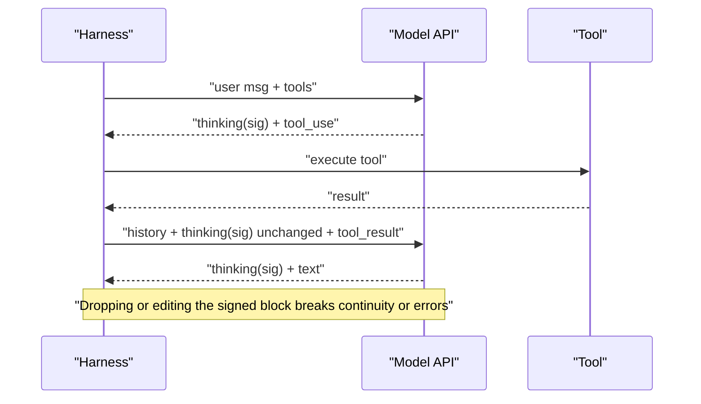
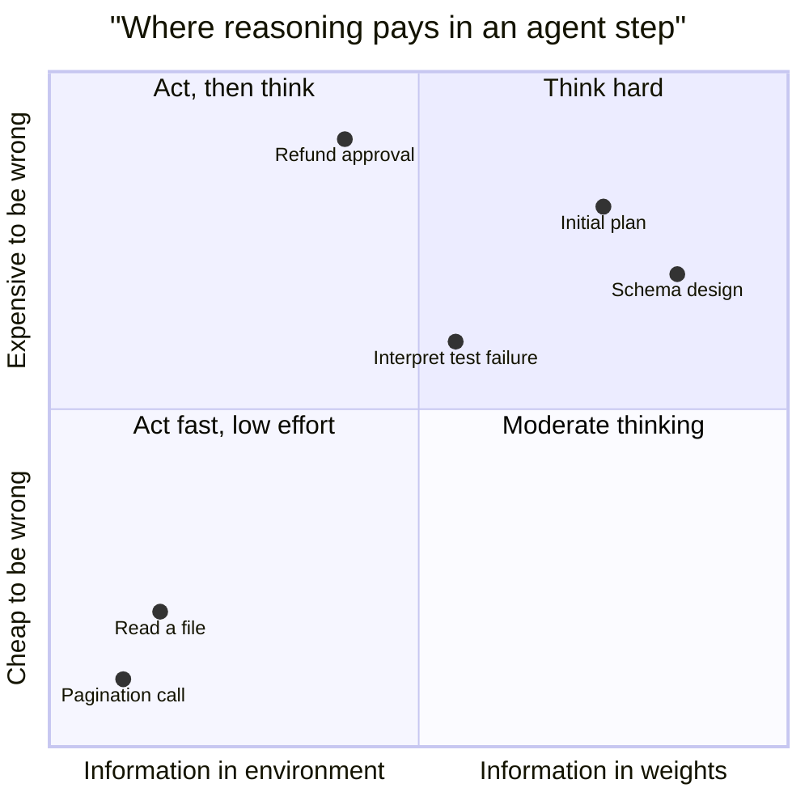
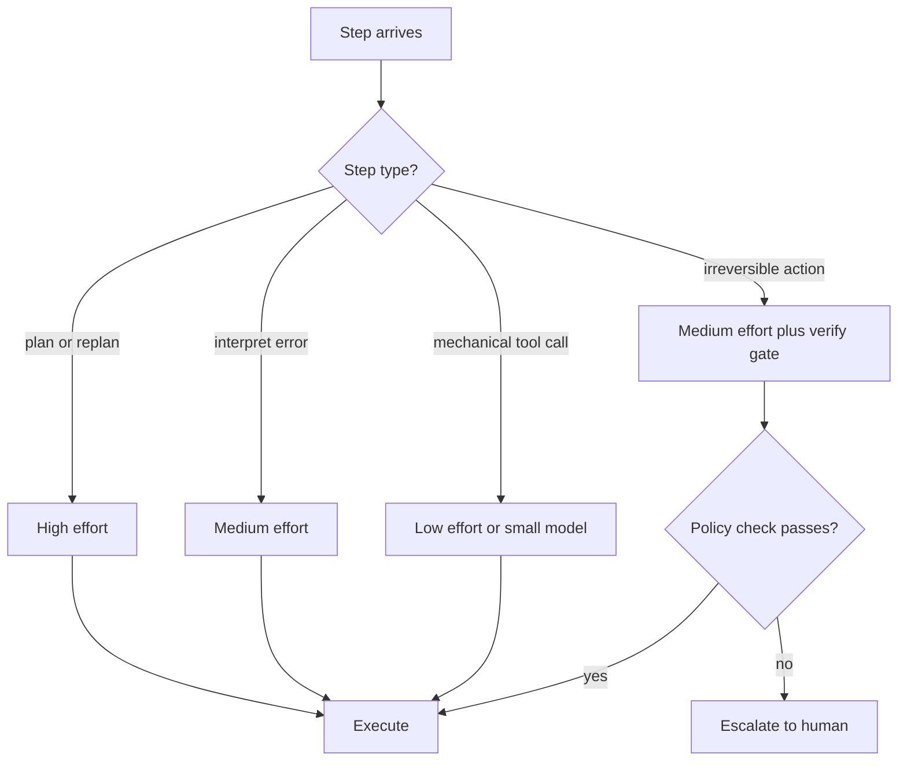
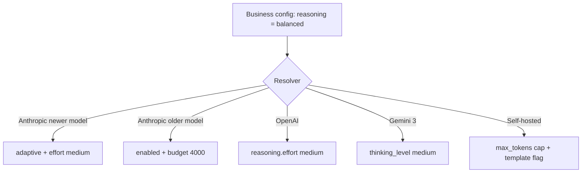
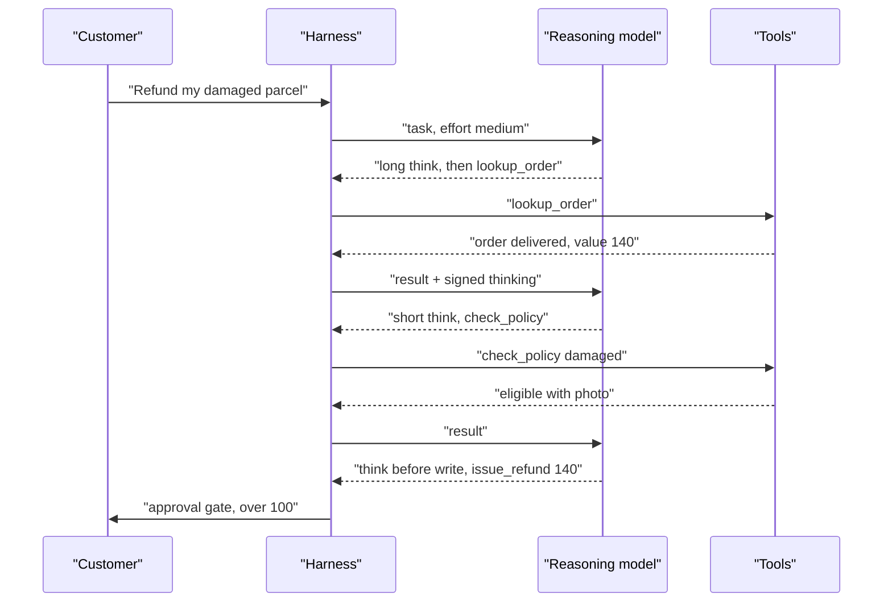

# Chapter 04: Reasoning Models Inside Agents

> **What this chapter covers**: How reasoning (thinking) models behave when they sit inside a tool-using loop. Extended and adaptive thinking, interleaved thinking between tool calls, budgets and effort settings, preserving or dropping thinking blocks across turns, the cost and latency of reasoning, when reasoning helps planning and when it hurts a tight tool loop, and what the test-time compute scaling literature actually shows.
>
> **Prerequisites**: Chapters 01, 02, 03.
>
> **Where it is used**: Chapter 05 (harness engineering), 06 (context budget and caching), 18 (routing cheap vs frontier per step), 26 (evaluation of effort sweeps), 31 (latency and cost engineering).

---

## 04.1 Level 1: Foundations

### What a reasoning model is, in agent terms

A reasoning model generates a stretch of hidden or semi-hidden tokens before it commits to visible output. In a chat product that looks like "the model thinks, then answers". In an agent it looks different: the model may think before its first tool call, think again after each tool result, and think before its final answer. Every one of those thinking segments costs output tokens, adds latency, and changes what is in context for the next step.

The mental model to hold is simple. **Thinking is test-time compute you buy per step.** You are paying the model to search internally (try an approach, check it, back off) instead of searching externally with tool calls. Sometimes internal search is cheaper than external search. Sometimes it is a waste, because the information needed is in the environment, not in the weights.

### Vocabulary

| Term | Meaning |
|---|---|
| Thinking block / reasoning item | The provider's container for reasoning tokens. Anthropic calls it a `thinking` block; OpenAI's Responses API calls it a `reasoning` output item; Gemini returns thought parts with thought signatures. |
| Summarized thinking | What you see is a summary of the reasoning, not the raw chain of thought. You are billed for the full reasoning. |
| Signature / encrypted content | An opaque, encrypted copy of the full reasoning that you must round-trip unchanged so the model can continue its own chain of thought. |
| Interleaved thinking | Thinking that happens between tool calls inside one assistant turn, not only at the start. |
| Budget | A token target for thinking (Anthropic manual mode `budget_tokens`, Gemini 2.5 `thinkingBudget`). |
| Effort | A behavioural dial (low, medium, high and more) that scales all output: thinking, tool calls, and text. |
| Adaptive thinking | The model decides per request whether and how much to think. |
| Test-time compute | Any compute spent at inference to improve an answer: longer reasoning, sampling many answers and voting, search. |

### Why this exists

Pre-reasoning models forced every bit of deliberation into visible text ("Let me think step by step"). That text polluted the answer, was hard to budget, and was trained only incidentally. Reasoning models are trained, typically with reinforcement learning on verifiable tasks, to use a private scratchpad well. OpenAI's o1 announcement (September 2024) showed accuracy on hard maths rising smoothly with both training-time RL compute and test-time thinking compute. DeepSeek-R1 (January 2025) showed that the behaviour (long chains, self-verification, backtracking) emerges from RL with rule-based rewards and published the recipe. Since then every frontier vendor ships a thinking mode.

For agents the relevant consequence is that the model now has two ways to reduce uncertainty: think harder, or act (read a file, run a query). Good agent design decides which is cheaper at each step.

### The three places thinking can go in a loop


Without interleaved thinking, only `T1` exists and the model reacts to tool results reflexively. With it, `T2` and `T3` exist, which is where most of the value for agents lives: interpreting a surprising result, noticing an error, deciding to change plan.

### Reasoning vs non-reasoning models in a loop

| Property | Non-reasoning model | Reasoning model |
|---|---|---|
| Deliberation | In visible text, if prompted | In thinking blocks, trained by RL |
| Per-step latency | Low, dominated by prefill and short output | Higher, dominated by thinking decode |
| Planning quality on ambiguous tasks | Needs explicit prompting (plan first) | Stronger by default |
| Tool-call count | Often more, shorter steps | Often fewer, better-chosen steps, unless it overthinks |
| Cost profile | Input-dominated | Output-dominated on hard steps |
| Debuggability | Full visible reasoning if prompted | Summaries or none; must rely on actions |
| Harness complexity | Plain messages | Signatures, retention rules, config per model |

The right question is not "reasoning or not" but "how much reasoning at which step". With adaptive thinking and effort dials, the same model can behave like either column.

### How the training shapes agent behaviour

Reasoning models learn from rewards on verifiable outcomes: tests passing, answers matching, sometimes tool-use environments. Three behavioural consequences matter for agents:

1. **Persistence.** RL rewards eventually getting it right, so models keep trying approaches. That is good for hard problems and bad when the right move is to stop and ask.
2. **Verification habits.** Models learn to check their work, including re-running tests. Harnesses should make checking cheap (fast test commands, concise output).
3. **Reward hacking pressure.** If the training environment rewarded passing tests, the model may be tempted to special-case tests or weaken assertions. Chapter 30 covers this; the harness defence is to review diffs to test files and to make the finish tool check for such edits.

---

## 04.2 Level 2: Working knowledge

### How each major provider exposes thinking (as of September 2026, check the current docs)

Verified against the provider docs on 27 September 2026. These APIs changed several times in 2025 and 2026, so treat the parameter names as a snapshot.

| Aspect | Anthropic Messages API | OpenAI Responses API | Gemini API |
|---|---|---|---|
| Turn it on | `thinking: {type: "adaptive"}` on newer models; manual `{type: "enabled", budget_tokens: N}` on Claude 4.5 and earlier | Reasoning models always reason; control with `reasoning.effort` | Dynamic thinking by default on thinking models |
| Depth control | `output_config.effort`: `low`, `medium`, `high`, and on some models `xhigh`, `max` | `reasoning.effort`: model-dependent subset of `none`, `minimal`, `low`, `medium`, `high`, `xhigh`, `max` | `thinking_level` (Gemini 3 series) or `thinkingBudget` (2.5 series) |
| What you see | `display: "summarized"` or `"omitted"` (default on many newer models) | `reasoning.summary` (`auto`, `concise`, `detailed`, model-dependent) | Thought summaries when requested |
| Continuity token | `signature` on each thinking block | `encrypted_content` on reasoning items when `store: false` or ZDR | Thought signatures |
| Usage field | `usage.output_tokens_details.thinking_tokens` | `usage.output_tokens_details.reasoning_tokens` | thought token count in usage metadata |
| Billing | Full thinking billed as output, even if omitted or summarized | Reasoning billed as output | Thinking billed as output |

Two Anthropic details matter for harness authors. First, manual extended thinking (`budget_tokens`, minimum 1,024) is deprecated on the Claude 4.6 models and rejected with a 400 on Claude 4.7 and later, which only accept adaptive thinking (Anthropic extended thinking docs, September 2026). Second, on some of the newest models adaptive thinking is always on and cannot be disabled; effort becomes the only cost dial. If your harness hard-codes `budget_tokens` or `thinking: {type: "disabled"}`, a model upgrade can break it outright.

### Budgets vs effort

A **budget** is a token target for thinking. It is predictable but blunt: the model thinks up to roughly N tokens on every request, whether the step is hard or trivial. Anthropic documents it as a target, not a strict cap; `max_tokens` remains the hard ceiling on total output.

**Effort** is a behavioural signal applied to the whole response. Per Anthropic's effort docs (September 2026), lower effort also produces fewer, terser tool calls and less preamble; higher effort makes more tool calls and more explanation. That is a significant difference for agents: effort changes the *policy*, not just the thinking length.

**Adaptive** thinking lets the model skip thinking on easy steps. The docs note that in a tool-use loop, follow-up requests that only process tool results can skip thinking at any level. That is exactly the behaviour you want for mechanical steps.

### Worked example: cost of thinking in a 12-step agent

Take a support agent that averages 12 model calls per task. Illustrative prices (check current pricing): input $3 per million tokens, output $15 per million tokens. Each call has on average 20,000 input tokens (mostly cached, ignore caching for now) and 300 visible output tokens.

- Without thinking: output per task = 12 x 300 = 3,600 tokens = $0.054. Input = 12 x 20,000 = 240,000 tokens = $0.72. Total about $0.77.
- With 2,000 thinking tokens on every call: extra output = 12 x 2,000 = 24,000 tokens = $0.36. Total about $1.13, a 47 percent increase.
- With adaptive thinking that thinks 4,000 tokens on the 2 planning steps and 200 on the 10 mechanical steps: extra = 8,000 + 2,000 = 10,000 tokens = $0.15. Total about $0.92.

Latency matters more than dollars here. At an illustrative decode rate of 80 output tokens per second, 2,000 thinking tokens is 25 seconds per step, 300 seconds per task. The adaptive profile adds 125 seconds. For an interactive agent that is the difference between usable and abandoned.

### Preserving thinking blocks across tool calls

Inside a tool-use turn, the rule on all three providers is the same: **pass the reasoning back, unmodified, with the tool result.** Anthropic requires the thinking blocks from the last assistant message to be passed back complete and in order, including `redacted_thinking` blocks; you cannot rearrange, edit, or partially drop them. OpenAI says to pass back any reasoning items returned with the last function call, either via `previous_response_id` or by replaying the output items. Gemini requires thought signatures to be returned in stateless mode.



Across *completed* turns the providers differ, and this changed over time. Anthropic's docs (September 2026) state that Claude Opus 4.5 and models numbered 4.6 and higher keep prior turns' thinking blocks in context and bill them as input, while Sonnet 4.5, Haiku 4.5 and earlier models stripped them. You are told to pass everything back and let the API filter. You can override with the `clear_thinking_20251015` context-editing strategy (Chapter 06).

The harness rule: store thinking blocks verbatim in your trajectory store, send them back verbatim, and never let a "helpful" middleware re-serialise, trim, or translate them. A common bug is a framework that converts messages to an internal format and back, losing the `signature` field.

### Tool choice restrictions

Forced tool use and thinking interact. Anthropic's docs (September 2026) say manual extended thinking only supports `tool_choice` `auto` or `none`; `any` or a named tool errors. Adaptive thinking supports forced tool use, except on some of the newest models (the docs name Claude Opus 5.5, Fable 5.1 and Mythos 5.1). If your extraction step relies on forcing a tool, test it against every model in your fallback chain. The durable workaround is structured outputs (Chapter 03) instead of forced tool calls.

### A minimal Anthropic request with adaptive thinking and effort

```json
{
  "model": "<current model id>",
  "max_tokens": 32000,
  "thinking": {"type": "adaptive", "display": "summarized"},
  "output_config": {"effort": "medium"},
  "tools": [{"name": "lookup_order", "description": "...", "input_schema": {"type": "object"}}],
  "messages": [{"role": "user", "content": "Where is order 8812?"}]
}
```

Set `max_tokens` generously. Thinking counts toward it, and a truncated thinking block means no tool call at all, which a naive harness reads as "the model gave up".

### Stateful vs stateless reasoning continuity

Providers offer two ways to keep reasoning continuous across calls.

**Stateful.** The provider keeps the conversation. With OpenAI's Responses API you pass `previous_response_id` and the provider supplies earlier reasoning items itself. Simple, but the state lives with the vendor, which may conflict with data-retention requirements, and you cannot replay the exact context yourself.

**Stateless.** You send the full history each time, including encrypted reasoning (OpenAI `encrypted_content` with `store: false`, Anthropic signatures, Gemini thought signatures). More bytes on the wire, full control, compatible with zero-data-retention setups, and replayable.

| Concern | Stateful | Stateless |
|---|---|---|
| Harness code | Minimal | Must round-trip opaque blobs correctly |
| Data retention | Provider stores state | You store state |
| Replay and debugging | Harder | Exact |
| Failover to another region or account | State may not follow | Works if blobs are portable within the vendor |
| Payload size | Small | Grows with history |

For enterprise deployments, stateless is the usual default because it keeps state in your store and makes incidents replayable. It also forces the discipline of testing blob round-trips.

### Worked example: interleaved vs non-interleaved on a debugging task

A synthetic eval of 120 debugging tasks compares a model with thinking only at the start of each turn against the same model with interleaved thinking. Illustrative results:

| Configuration | Success | Mean turns | Mean thinking tokens per task | Mean cost |
|---|---|---|---|---|
| Think at start only | 0.58 | 14.2 | 9,000 | $0.41 |
| Interleaved | 0.66 | 11.5 | 13,500 | $0.46 |

Interleaved thinking uses 50 percent more thinking tokens but fewer turns, so cost rises only 12 percent while success rises 8 points. Cost per *successful* task falls from $0.41 / 0.58 = $0.71 to $0.46 / 0.66 = $0.70. The metric that matters for a customer is cost per resolved task, not cost per attempt.

### Worked example: sizing max_tokens for a thinking step

A harness sets `max_tokens` per call. Too low truncates thinking and loses the tool call; too high has no direct cost (you pay for tokens generated, not the ceiling) but can allow runaway outputs and long timeouts.

From 2,000 traced planning steps at high effort, suppose thinking tokens have a median of 3,200, a p95 of 9,800 and a p99 of 17,500, and visible output has a p99 of 1,500. A ceiling of 16,000 truncates about 1.5 percent of planning steps (those whose thinking plus output exceed it). A ceiling of 24,000 truncates under 0.5 percent. The choice: 24,000, plus an alert when `stop_reason` is `max_tokens`. Anthropic's newer docs suggest starting around 64k at `xhigh` or `max` effort for agentic work (effort docs, September 2026), which reflects how long those modes think.

Remember the constraint on older Anthropic models in manual mode: `budget_tokens` must be less than `max_tokens`, except with interleaved thinking, where the budget spans all thinking blocks in the turn and can exceed `max_tokens`.

### Worked example: thinking tokens in a streamed UX

A chat agent streams to users. With `display: "summarized"`, users watch a summary of reasoning appear. With `display: "omitted"`, they see nothing until text or a tool progress event. Suppose thinking is 2,500 tokens at 80 tokens per second (31 s) and the visible answer is 200 tokens (2.5 s).

- Summarized: first visible content after about 1 s (summary begins), full answer at about 34 s.
- Omitted with no progress events: first visible content at about 32 s. Users think it is broken.
- Omitted with harness progress events ("Checking your order...", emitted when the tool call arrives): first visible event when the first tool call is decoded, final answer at about 34 s.

The design rule: if thinking is omitted, the harness must provide its own progress signal. Anthropic's docs describe a beta `display: "updates"` mode that returns short progress updates some models write between tool calls (beta header `thinking-display-updates-2026-08-18`, September 2026); treat it as a convenience, not a guarantee.

### Handling thinking in your trajectory store

| Field | Store? | Why |
|---|---|---|
| Thinking block with signature, verbatim | Yes | Needed to continue or replay the conversation |
| Summarised thinking text | Yes, flagged as a summary | Debugging; never as audit evidence |
| Thinking token count per call | Yes | Cost attribution, effort tuning |
| Effort and thinking config per call | Yes | Reproducibility; explains cache misses |
| Redacted thinking blocks | Yes, verbatim | Must be passed back unchanged |

Treat signatures as opaque binary data: no trimming, no re-encoding, no logging pipelines that truncate long strings. A common bug is a log shipper that caps fields at 32 KB, which quietly corrupts replays built from logs.

---

## 04.3 Level 3: Depth

### What the model is doing when it thinks

Reasoning models are trained with RL where the reward is outcome-based (did the answer verify, did the tests pass). The policy learns that emitting more exploratory tokens before answering increases reward on hard problems. Nothing forces the reasoning to be faithful to the eventual answer, and research has repeatedly found that stated reasoning does not always reflect what drove the output. For agents that means: **never treat the thinking text as an audit log.** Log the actions and observations; treat summarized thinking as a debugging hint.

Because the chain is summarized or encrypted, you also cannot parse it for control flow. A harness that greps thinking for "I should escalate" is building on sand. If you want a signal, ask for it as a structured field or a tool call.

### Test-time compute scaling: what the results say

Three families of results matter.

1. **Sequential scaling (longer chains).** The o1 announcement (OpenAI, September 2024) showed log-linear gains on AIME with more thinking compute. Muennighoff et al., "s1: Simple test-time scaling" (2025), showed that "budget forcing" (appending "Wait" to extend thinking, or truncating it) gives controllable scaling on a small fine-tuned model, and that gains flatten.
2. **Parallel scaling (sample and select).** Snell et al., "Scaling LLM Test-Time Compute Optimally can be More Effective than Scaling Model Parameters" (2024), found that the optimal mix of sequential revision and parallel search depends on problem difficulty, and that on easy and medium problems, test-time compute on a smaller model can match a model many times larger. On the hardest problems, pretraining compute won.
3. **Agentic overthinking.** Cuadron et al., "The Danger of Overthinking: Examining the Reasoning-Action Dilemma in Agentic Tasks" (arXiv, February 2025), analysed 4,018 trajectories on software engineering tasks. They name three patterns (analysis paralysis, rogue actions, premature disengagement), find that higher overthinking scores correlate with lower resolution rates and that reasoning models overthink more than non-reasoning ones, and report that simply selecting the lower-overthinking solution improved performance by almost 30 percent while cutting compute cost by 43 percent.

The synthesis: thinking has diminishing and task-dependent returns, and in an environment where acting reveals information, excess thinking substitutes guesses for observations.



### Where reasoning helps in agents

- **Initial decomposition.** Turning an ambiguous ticket into a plan. One long think at the start amortises across many steps.
- **Interpreting surprising observations.** A failing test with a confusing trace, a SQL error, an empty search result. Interleaved thinking lets the model reason about why before retrying.
- **Policy-heavy decisions.** tau-bench style tasks where the agent must check eligibility rules before acting. Reasoning over a long policy reduces rule violations, and violations are expensive.
- **Verification before irreversible actions.** A short think before `issue_refund` is cheap insurance.

### Where reasoning hurts

- **Tight mechanical loops.** Paging through results, reading ten files, running a linter. Each step is predictable; thinking adds latency without information.
- **Latency-bound UX.** Voice and chat where time to first token dominates. A 20-second think kills a voice agent.
- **Overthinking instead of observing.** The model speculates about what a file contains rather than opening it.
- **Format fragility.** Long reasoning before a structured output occasionally leaves too little of `max_tokens` for the output. Truncation errors look like model failures.
- **Cache churn.** Changing thinking parameters or top-level effort between requests invalidates message-level cache breakpoints on Anthropic (Chapter 06). A harness that toggles effort per step can lose its cache every step.

### Numbers to reason with

| Quantity | Typical range | Source or basis |
|---|---|---|
| Anthropic manual `budget_tokens` minimum | 1,024 | Anthropic docs, September 2026 |
| Anthropic advice above 32k thinking | use batch to avoid timeouts | Anthropic docs, September 2026 |
| OpenAI advice on reserve | at least 25,000 tokens for reasoning plus output when starting | OpenAI reasoning guide, September 2026 |
| Thinking per planning step | 1k to 10k tokens | Illustrative; measure in your traces |
| Thinking per mechanical step with adaptive | 0 to a few hundred | Illustrative; measure |

### Failure modes specific to reasoning in loops

1. **Lost signature.** Framework serialisation drops the signature. Symptom: 400 error, or thinking silently disabled for the request (Anthropic says toggling thinking mid-turn does not error; it disables thinking for that request).
2. **Truncated think.** `max_tokens` too low. Symptom: `stop_reason` is `max_tokens` with no tool call.
3. **Cache invalidation by config change.** Effort or budget changed mid-conversation. Symptom: `cache_read_input_tokens` drops to zero on that request.
4. **Thinking-as-action.** The model "decides" in thinking that it did something it never called a tool for, then reports success. Symptom: final answer claims an action with no matching tool call. Harness fix: verify claimed side effects against the tool log.
5. **Plan lock-in.** A long initial plan becomes sticky; the model follows it despite contradicting evidence. Fix: explicit replanning checkpoints (Chapter 02).
6. **Default drift across models.** One model defaults to `high` effort, another to `medium` (Anthropic documents Opus 5.5 defaulting to medium, September 2026). Swapping model ids silently changes cost and behaviour. Always set effort explicitly.

### Anatomy of a reasoning token budget inside one turn

It helps to trace where tokens go in a single interleaved turn. Take a debugging step on a coding agent with adaptive thinking at high effort. Illustrative, measured shapes vary by model.

| Segment | Tokens | Billed as | Visible to user |
|---|---|---|---|
| Input: cached prefix (tools, system, history) | 48,000 | cache read | No |
| Input: new tool result (failing test output) | 1,800 | input | No |
| Thinking before tool call | 2,400 | output | Summary only, if requested |
| Tool call (`read_file`) | 60 | output | Yes, as progress |
| Thinking after tool result, same turn | 1,100 | output | Summary only |
| Tool call (`edit_file`) | 350 | output | Yes |
| Final text | 120 | output | Yes |

Output tokens: 2,400 + 60 + 1,100 + 350 + 120 = 4,030, of which 3,500 (87 percent) are thinking. Input: 48,000 cached at $0.30 per MTok = $0.0144; 1,800 uncached at $3 per MTok = $0.0054. Output at $15 per MTok = $0.0605. Thinking is 75 percent of this step's cost even though almost 50,000 tokens were read. That ratio is typical for reasoning-heavy steps and it inverts the usual intuition that input dominates agent cost. On mechanical steps with little thinking, input dominates again, which is why the step mix decides where optimisation effort should go.

### Latency model for a reasoning step

Wall time for one model call is roughly:

`T = T_queue + T_prefill(uncached input) + T_cached_read + (thinking + output tokens) / decode_rate`

With illustrative numbers: queue 0.3 s; uncached prefill of 1,800 tokens at 5,000 tokens per second is 0.36 s; cached read overhead 0.2 s; 4,030 output tokens at 70 tokens per second is 57.6 s. Decode dominates completely. Three consequences follow:

1. Caching speeds up time to first token but barely touches total latency on reasoning steps.
2. The only big levers are fewer thinking tokens (effort, adaptive), faster decode (a smaller or faster-tier model), or fewer steps.
3. Streaming the thinking (`display: "summarized"`) does not shorten the step; it makes waiting tolerable. `display: "omitted"` shortens time to first *visible text* because the server skips streaming thinking, but total decode is the same.


### Comparison: ways to buy test-time compute in an agent

| Method | Where compute goes | Needs a verifier | Cost multiplier | Latency effect | Best for |
|---|---|---|---|---|---|
| Longer thinking (effort up) | Sequential tokens in one call | No | 1.5x to 5x output | Linear in tokens | Planning, policy reasoning |
| Interleaved thinking | Tokens between tool calls | No | Proportional to steps | Adds per step | Interpreting observations |
| Best-of-k sampling of one step | k parallel calls | Yes, or voting | k x step cost | Parallel, so near 1x wall time | SQL, extraction, code snippets |
| Best-of-k full trajectories | k parallel agents | Yes (tests) | k x task cost | Near 1x wall time, k x infra | Offline coding, batch jobs |
| Self-critique turn | Extra model call | Weak (the model itself) | Plus 1 call | Plus 1 step | Drafts, reports |
| Tree search over actions (LATS-style) | Many branches with value estimates | Yes | 10x to 100x | Large | Research, rarely production |

The row that matters most in practice is best-of-k with a real verifier. If you have tests, a schema, or an executable check, parallel sampling beats longer thinking per dollar on many tasks. If you have no verifier, longer thinking is the cheaper bet, because voting only helps when errors are independent.

### Reasoning models and tool-call reliability

A failure pattern seen across vendors: reasoning models sometimes emit tool calls with arguments that were "decided" in thinking but not carried exactly into the call. Symptoms are subtle: a date off by one, a unit changed, an id copied from an earlier result instead of the latest. Mitigations that work:

- Strict schemas with enums and formats (Chapter 03), so wrong shapes fail fast.
- Echo-back in tool results ("Refund of 140.00 USD to order 8812 queued"), so the next think can catch a mismatch.
- A pre-write check step: for irreversible tools, the harness shows the model the exact call and asks it to confirm against the evidence before execution. That is one extra short call, cheap compared with a wrong refund.

### Reasoning and prompt injection

Longer reasoning over untrusted tool output does not make a model immune to injected instructions. In some cases it gives injected text more "consideration". The defence is structural (Chapter 29): the instruction hierarchy, least-privilege tools, and approval gates on sensitive actions. Do not treat higher effort as a security control.

### Evaluating reasoning configurations properly

Effort comparisons fail in predictable ways. A sound protocol:

1. **Same tasks, paired.** Run every configuration on identical tasks and seeds where possible; compare with a paired bootstrap on per-task success.
2. **Repeats.** At least 3 runs per task per configuration, so you can report pass^k and see variance. Reasoning often narrows variance more than it moves the mean.
3. **Four columns, always.** Success, cost per task, p50 and p95 wall time, and tokens split into thinking, other output and input.
4. **Stratify by difficulty.** Test-time compute helps hard tasks and wastes money on easy ones (Snell et al. 2024). A single average hides that.
5. **Pin everything.** Model id, effort, thinking mode, display, max_tokens, and prompt version.

Worked sample-size arithmetic. To detect a 4-point difference in success around 0.8 with a paired design, where the two configurations disagree on about 15 percent of tasks, you need roughly n where the standard error of the paired difference, sqrt(0.15 / n), is about 4 / 2.8 = 1.43 points, that is 0.0143. Solving 0.15 / n = 0.000204 gives n of about 735 tasks. Most teams have 200. With 200 tasks the smallest reliably detectable difference is about 2.8 x sqrt(0.15 / 200) = 7.7 points. Know your detection limit before claiming high effort is better.

### Where reasoning interacts with other harness features

| Feature | Interaction | What to do |
|---|---|---|
| Prompt caching | Config changes invalidate message breakpoints; prior thinking kept in context is cacheable as part of earlier turns | Hold config constant; use per-message effort where supported |
| Context editing | Clearing old thinking saves tokens but invalidates the cache at that point | Clear in large chunks, rarely |
| Compaction | Summaries drop thinking; some compaction modes can keep thinking for recent turns under conditions | Follow the vendor rules; validate after compaction |
| Structured outputs | Long thinking can crowd out output within max_tokens | Size max_tokens; prefer schemas over forced tools |
| Parallel tool calls | The model reasons once, then emits several calls | Good fit; reduces thinking per call |
| Sub-agents | Each sub-agent thinks in its own context | Use low effort for narrow sub-agents (Anthropic suggests low for sub-agents) |

### Failure case study: the overthinking refund bot

A synthetic retailer, Pinecrest Home, moved its refund agent from a non-reasoning model to a reasoning model at high effort. Offline success rose from 0.78 to 0.83 on 300 tasks (paired CI [+0.02, +0.08]). In production, median handle time went from 14 s to 61 s, abandonment rose from 3 percent to 11 percent, and cost per task tripled. Trace review showed the model thinking 2,000 to 4,000 tokens before every `lookup_order`, a call whose result it could not predict anyway.

The fix had three parts: effort set to medium, adaptive thinking, and a system prompt line telling the model to look up facts before reasoning about them. Offline success was 0.82 (paired against high: [-0.03, +0.01]), median handle time 22 s, abandonment 4 percent. The lesson: offline evals without latency or abandonment metrics picked the wrong configuration. Agent evals need cost and time columns next to success.

---

## 04.4 Level 4: Mastery

### Design decision 1: one model with variable effort, or two models

Option A: one reasoning model, effort varied by step type. Option B: a frontier reasoning model as planner and a small fast model as executor (Chapter 02 plan-and-execute, Chapter 18 routing).

| Criterion | One model, variable effort | Planner plus executor |
|---|---|---|
| Context continuity | Full; one trajectory | Must pass a plan across a boundary |
| Cache behaviour | Changing top-level effort breaks cache unless the provider supports per-message effort | Each model has its own cache; stable per model |
| Cost | High floor, the frontier rate even at low effort | Low for executor steps |
| Failure mode | Overthinking or underthinking per step | Plan-execution mismatch; executor ignores plan |
| Engineering | Simple | Two prompts, two evals, handoff contract |

Anthropic documents a per-message effort change (beta header `mid-conversation-output-config-2026-07-01` as of September 2026, on a subset of models) that preserves the prompt cache. Where available it makes Option A much cheaper to run. Where not, pick an effort per workload and hold it for the conversation.

A senior default: start with one model at a measured effort, add a second model only when traces show a large fraction of steps are mechanical and the cost difference justifies the handoff complexity.

### Design decision 2: effort as a routed variable

Treat effort like any hyperparameter: sweep it on your eval set and pick per workload. A realistic sweep for a 200-task support eval:

| Effort | Task success | 95% CI | Mean output tokens per task | Mean wall time |
|---|---|---|---|---|
| low | 0.71 | [0.65, 0.77] | 4,100 | 38 s |
| medium | 0.80 | [0.74, 0.85] | 9,800 | 71 s |
| high | 0.82 | [0.77, 0.87] | 21,500 | 140 s |

These numbers are illustrative, not measured. The decision method is what matters: compare medium and high with a *paired* bootstrap on the same tasks (Chapter 26). If the paired difference is +0.02 with a CI of [-0.01, 0.05], high is not worth 2.2 times the tokens. Then check pass^k (reliability across repeats), because higher effort sometimes reduces variance even when mean success barely moves.



### Design decision 3: what to keep in context

Reasoning tokens from earlier turns compete with tool results for context. On models that keep prior thinking, a 40-turn session with 3,000 thinking tokens per turn carries 120,000 tokens of old reasoning, billed as input on every call (cached, hopefully). Options:

- Keep all thinking: best continuity and cache stability, highest input tokens.
- Clear thinking older than N turns (`clear_thinking_20251015` with `keep: {type: "thinking_turns", value: N}`): lower tokens, but the cache is invalidated at the clearing point.
- Compact periodically (Chapter 06): summary replaces old turns including their thinking.

Worked arithmetic. Illustrative input price $3 per MTok, cache read at 0.1x ($0.30 per MTok). 120,000 tokens of old thinking read from cache costs $0.036 per call; over 40 remaining calls that is $1.44. Clearing it once costs a cache rewrite of, say, 150,000 tokens at 1.25x ($0.56) and then saves most of the $1.44. Clearing wins on long sessions if quality holds; measure quality, because the cleared reasoning sometimes held the rationale for a decision.

### Design decision 4: visibility and trust

`display: "omitted"` cuts time to first visible text because the server skips streaming thinking (Anthropic docs, September 2026). For end-user UX that is usually right. For operators you want summaries in traces. A good split: omit for the user stream, request summaries on a sampled fraction of production traffic and on all eval runs. Remember that summaries are not faithful transcripts, so do not put them in audit logs as evidence of intent.

### Edge cases senior engineers hit

- **Streaming with signatures.** The signature arrives as a separate delta at the end of the thinking block. Accumulate with the SDK helper, not by concatenating text.
- **Fallback chains across vendors.** Anthropic thinking blocks cannot be sent to OpenAI and vice versa. When you fail over mid-trajectory, drop the foreign reasoning and accept a continuity hit, or restart the step. Gateways that claim transparent cross-vendor failover for reasoning models are glossing over this.
- **ZDR and stateless mode.** With OpenAI `store: false`, you must carry `encrypted_content` yourself. Losing it degrades multi-step quality without any error.
- **Batch API for deep thinking.** Anthropic recommends batch for budgets above 32k; that is incompatible with interactive agents but ideal for offline eval sweeps.
- **Evaluation contamination by effort defaults.** An eval that omits effort measures whatever the default was that month. Pin it.

### Where the literature and vendors disagree

- **"More thinking is always better."** Vendor charts show monotone gains on maths benchmarks. Agentic studies (Cuadron et al. 2025) and vendor docs themselves (Anthropic notes `max` can overthink on structured-output tasks) show otherwise. Treat monotone charts as marketing for your workload until your eval confirms.
- **Faithfulness of reasoning.** Vendors describe thinking as the model's reasoning; interpretability and faithfulness research shows stated chains can omit the real drivers. Design for unfaithfulness.
- **Reasoning vs tools.** Some argue a strong enough reasoner needs fewer tools. In practice, for tasks grounded in private state (a database, a repo), no amount of thinking substitutes for reading it.

### Design decision 5: open-weight reasoning models

Self-hosted reasoning models (R1-style distillations, open reasoning families; Chapter 20) change the arithmetic. You pay for GPU time, not tokens, so long thinking costs latency and throughput rather than dollars per token. On an RTX 4060 8 GB, a 4-bit 7B-class model decodes at tens of tokens per second (measure it: the number depends on quantization, context length and backend). A 3,000-token think then takes more than a minute, which rules out interactive loops but can suit batch agents.

Open models also expose raw thinking text. That is useful for debugging and for training data (Chapter 34), but you must parse it yourself: chat templates put reasoning in tags that the serving stack's reasoning parser strips (vLLM and SGLang ship reasoning parsers per model family; check the current docs for the exact flag names). If the parser is misconfigured, thinking leaks into the visible answer or into tool call arguments, a common self-hosting bug.

| Aspect | Hosted reasoning API | Self-hosted open reasoning model |
|---|---|---|
| Thinking visibility | Summarised or omitted | Raw text available |
| Continuity across tool calls | Signatures or encrypted items | You keep or drop raw text in the template |
| Cost of long thinking | Output tokens | GPU seconds, lower throughput |
| Control knobs | Effort, budget, adaptive | Max tokens, budget forcing, system prompt |
| Main risk | Vendor changes defaults | Template and parser mismatches |

### Design decision 6: effort by tenant and by SLO

In a multi-tenant product, effort becomes a pricing and SLO lever. A premium tier might run high effort with a 90 s p95 SLO; a standard tier medium with 30 s. Encode this in config per tenant, and make sure the cache strategy follows. If tiers share a prefix but differ in effort, and effort is rendered into the prompt, they will not share cache entries on providers where effort affects the prefix. Measure hit ratio per tier.

Worked arithmetic. Two tiers of 10,000 tasks per day each, a shared 15,000-token prefix read 10 times per task. If effort breaks prefix sharing, each tier keeps its own warm cache. At high traffic both stay warm and the loss is small: two cache writes per TTL window instead of one. At low traffic, where a tier's cache goes cold between requests, each cold start costs a 1.25x write instead of a 0.1x read: 15,000 x ($3.75 - $0.30) / 1e6 = $0.052 per cold start. With 2,000 cold starts per day that is about $100 per day. Small, but it shows up as a hit-ratio anomaly that confuses on-call engineers if nobody explains it.

### What vendors disagree on, concretely

| Question | Anthropic (docs, September 2026) | OpenAI (docs, September 2026) | Gemini (docs, September 2026) |
|---|---|---|---|
| Can you see thinking? | Summaries only; omitted by default on newer models | Summaries on request | Thought summaries on request |
| Who decides how much to think? | Adaptive thinking guided by effort; fixed budgets on older models | Effort | Thinking level, dynamic by default |
| Prior-turn reasoning retention | Kept on newer models, stripped on older; clearable | Pass reasoning items back; the provider manages them | Signatures must be returned in stateless mode |
| Can thinking be turned off? | Yes on many models; not on some newest models | `none` effort on some models, not all | Model-dependent minimum levels |
| Forced tool use with thinking | Restricted on manual mode and on some newest models | Supported via tool choice (check per model) | Function calling modes supported (check per model) |

The practical upshot for a multi-vendor harness: abstract "reasoning level" as your own enum (for example `fast`, `balanced`, `deep`) and map it per vendor and per model in config. Never leak vendor parameter names into business logic.



### Design decision 7: loop-level budgets vs per-call controls

Effort and `max_tokens` act per call. Long agents also need a budget for the whole loop. There are two ways to provide one.

**Harness-enforced budget.** Your loop sums tokens or dollars and stops at a cap (Chapter 05). This is hard and vendor-neutral, but the model does not know it is coming, so it gets cut off mid-work.

**Model-visible budget.** Anthropic offers task budgets (beta header `task-budgets-2026-03-13`, September 2026, on a subset of models): `output_config.task_budget` with `type: "tokens"`, a `total` (minimum 20,000) and an optional `remaining` for carrying the budget across your own compaction. The model sees a server-side countdown and paces itself, finishing gracefully as the budget runs down. The docs are explicit that it is advisory, not enforced. `max_tokens` remains the hard per-request cap. They also warn that a budget clearly too small for the task can produce refusal-like behaviour or aggressive scoping down, and that decrementing `remaining` on every request breaks caching and makes the model wrap up early.

Worked example from the docs' counting rules. With a 100,000-token budget, a turn of three requests that generates 5,000, then 4,000, then 6,000 tokens and receives tool results of 2,800 and 1,200 tokens spends 19,000 against the budget. The client transmitted about 20,800 tokens in payloads because it resent history, but resent content is counted once. A harness that mirrors the budget by summing payload sizes will overcount.

| Control | Scope | Enforced? | Model aware? | Portable? |
|---|---|---|---|---|
| `max_tokens` | One call | Yes | Indirectly | Yes |
| Effort | One call or message | Behavioural | Yes | Concept yes, values no |
| Vendor task budget | One agentic turn | Advisory | Yes, countdown | No |
| Harness cost cap | Task or session | Yes | Only if you tell it | Yes |

Senior default: use both. The model-visible budget, where available, shapes behaviour. The harness cap, set higher, is the safety net. Size both from the p99 of measured per-task spend, not from a guess.

### Starting points by agent archetype

These are starting hypotheses to sweep, not answers (Chapter 25 covers the archetypes).

| Archetype | Planning steps | Mechanical steps | Irreversible steps | Latency tolerance | Starting configuration |
|---|---|---|---|---|---|
| Customer support | Short | Many lookups | Refunds, account changes | Low | Medium effort, adaptive, verify gate on writes |
| Coding agent | Long | Many reads, test runs | Commits, pushes | Medium to high | High effort (or higher where recommended), large max_tokens |
| Deep research | Long | Many searches | Rare | High | High effort for synthesis; low-effort sub-agents for search |
| Text-to-SQL analyst | Medium | Schema reads | None (read-only) | Medium | Medium effort; best-of-3 on query generation with execution check |
| Voice agent | Short | Few | Bookings | Very low | Low effort or non-reasoning model; hand hard cases to a background reasoner |

### A note on reasoning and sub-agents

Sub-agents multiply reasoning cost. An orchestrator at high effort that spawns five sub-agents, each also at high effort, can spend six times the thinking of a single agent. Anthropic's effort docs list sub-agents as a typical use case for `low` effort. Give narrow sub-agents low effort and small budgets, and keep deep reasoning for the orchestrator's synthesis.

### Production checklist for reasoning in agents

1. Effort, thinking mode and display pinned explicitly per model in versioned config.
2. `max_tokens` sized for thinking plus output at the chosen effort, with truncation alerts.
3. Thinking blocks stored and replayed verbatim; a round-trip test in CI.
4. Cache hit ratio monitored per effort tier.
5. Effort sweeps with paired CIs, cost and latency columns, re-run on every model upgrade.
6. Side-effect verification against the tool log before final answers.
7. Cross-vendor failover tested with reasoning blocks stripped.
8. No control flow parsed from thinking text.

### Incident runbook: reasoning regressions after a model upgrade

Model upgrades are the most common source of reasoning incidents, because defaults move. A runbook that has held up:

| Symptom | Most likely causes | How to distinguish | Fix |
|---|---|---|---|
| 400 errors on every call | `budget_tokens` or `type: "enabled"` sent to a model that rejects it; `thinking: disabled` on an always-on model | Error message text names the parameter | Resolver maps to adaptive plus effort |
| Cost per task up 2x, success flat | Default effort higher on new model; display default changed (no cost effect); prior thinking now retained as input | Compare thinking tokens and input tokens per call before and after | Pin effort; consider thinking clearing |
| Latency up, cost flat | Effort default changed; slower model tier | Output tokens per call and decode rate | Pin effort; route mechanical steps to a faster model |
| Cost down, success down | Default effort lower (for example medium instead of high) | Config diff, thinking tokens per call | Pin effort to the old level and re-sweep |
| Forced tool call errors | New model restricts forced tool use with thinking | Error message; tool_choice in the request | Structured outputs, or `auto` with a strong instruction |
| Occasional empty responses | `max_tokens` too small for new thinking lengths | `stop_reason` equals `max_tokens` | Raise the ceiling; alert |

The general rule: every model upgrade is a config migration and a re-evaluation, never a string swap.

### Auditing a vendor reasoning claim

When a vendor announces "X percent better on agentic benchmark Y at max effort", ask:

1. Which harness? Benchmarks score model plus harness (Chapter 05).
2. Which effort, and what token spend per task? A gain at 5x tokens may be worthless at your budget.
3. Pass@1 or pass@k? With what number of attempts?
4. Is the benchmark contaminated or saturated? (Chapter 26.)
5. What is the latency? Leaderboards rarely report it.
6. Does it transfer to your task mix? Only your paired eval answers that.

A claim that fails questions 2 and 5 is marketing for interactive agents, even if it is true for batch work.

### Worked design: a reasoning-aware support agent end to end

A synthetic company, Northwind Parcels, runs a support agent with five tools: `lookup_order`, `lookup_customer`, `check_policy`, `issue_refund` (approval-gated above $100), and `escalate`. Traffic is 20,000 tasks per day. The team must decide how to use reasoning.

Step 1, measure the step mix from 1,000 traces. Illustrative result: 18 percent of calls are the initial plan, 64 percent are mechanical lookups or follow-ups that only process a tool result, 11 percent interpret an unexpected result, 7 percent precede a write.

Step 2, assign a policy per step type (the flowchart above), then estimate. Assume adaptive thinking averages 3,000 tokens on plan steps, 1,200 on interpretation, 800 before writes, and 100 on mechanical steps at medium effort. With 10 calls per task, thinking per task = 10 x (0.18 x 3,000 + 0.11 x 1,200 + 0.07 x 800 + 0.64 x 100) = 10 x (540 + 132 + 56 + 64) = 7,920 tokens. At $15 per MTok output that is $0.119 per task, $2,376 per day.

Step 3, compare with fixed high effort at an assumed 2,500 thinking tokens on every call: 25,000 tokens per task, $0.375, $7,500 per day. The adaptive profile saves about $5,100 per day if the paired eval shows no significant loss.

Step 4, the gate. The team ships only if the paired bootstrap difference in policy adherence between the two configurations has a 95 percent CI whose lower bound is above minus 1 point, and pass^3 does not fall.



### Reasoning and parallel sampling inside agents

Sequential thinking is one form of test-time compute. The other is parallel: run the same step k times and choose. In agents, full-trajectory best-of-k is expensive (k times the cost) and needs a verifier, but it is practical in two places. First, offline, where a test suite verifies coding patches and you can afford k = 4 to 8. Second, at a single high-stakes step, such as generating a SQL query, where you sample 3 candidates, execute each read-only, and pick by agreement or a check.

Arithmetic: if one sample is correct with p = 0.7 and a perfect verifier exists, best-of-3 success is 1 - 0.3^3 = 0.973. Without a verifier, majority voting over 3 gives 0.7^3 + 3 x 0.7^2 x 0.3 = 0.784, assuming independent errors and a single correct answer. Correlated errors reduce both. Reasoning models shrink the gain from voting, because their single-sample accuracy is higher and their errors are more correlated.

---

## 04.5 Subtopic checklist

- [x] Extended thinking (manual budget mode) and its deprecation path to adaptive thinking
- [x] Interleaved thinking between tool calls, and how it is enabled per model generation
- [x] Thinking budgets (`budget_tokens`, `thinkingBudget`) and their rules
- [x] Effort settings across Anthropic, OpenAI, Gemini, and what effort changes
- [x] Preserving thinking blocks inside a tool-use turn (signatures, encrypted content)
- [x] Dropping or keeping thinking across completed turns, per model, and clearing strategies
- [x] Cost of reasoning with worked arithmetic
- [x] Latency of reasoning with worked arithmetic
- [x] When a reasoning model helps planning
- [x] When reasoning hurts tool loops (overthinking, latency, cache churn, truncation)
- [x] Test-time compute scaling results (o1, s1, Snell et al., DeepSeek-R1, agentic overthinking)
- [x] Tool choice restrictions with thinking
- [x] Design decisions: single model vs planner-executor, effort sweeps, context retention, visibility
- [x] Loop-level budgets (vendor task budgets vs harness caps), stateful vs stateless continuity, open-weight reasoning models
- [x] Evaluation protocol and sample size for effort comparisons

---

## 04.6 Common misconceptions

1. **"Summarized thinking is the chain of thought."** It is a summary produced for display. You are billed for the full reasoning, and even the full reasoning is not guaranteed to be faithful.
2. **"`display: omitted` makes thinking free."** Omitted thinking is billed the same. It only saves streaming time.
3. **"The thinking budget is a hard cap."** On Anthropic it is a target; `max_tokens` is the hard ceiling. Plan headroom.
4. **"I can drop thinking blocks to save tokens mid tool loop."** Inside the current turn you must return them unchanged. Across completed turns, use the provider's clearing mechanism, not manual deletion that breaks the turn structure.
5. **"Effort only changes thinking length."** Anthropic documents that effort also changes the number and verbosity of tool calls. It is a policy dial.
6. **"Higher effort is always more accurate."** Returns diminish and can reverse on structured and mechanical tasks. Sweep it.
7. **"Reasoning models do not need a plan in the prompt."** They plan internally, but explicit task structure and replanning checkpoints still reduce plan lock-in and help debugging.
8. **"Swapping model id keeps behaviour the same if the prompt is the same."** Defaults for effort, thinking mode, and display differ by model. Pin them explicitly.
9. **"Thinking text is a good audit log for compliance."** Log actions and observations. Thinking is neither complete nor verified.
10. **"Cross-vendor failover is transparent."** Reasoning state is vendor-specific and encrypted; failover loses it.

11. **"Caching makes reasoning steps fast."** Caching shortens prefill. Reasoning steps are dominated by decode time, which caching does not touch.
12. **"Majority voting is a free reliability boost for reasoning models."** Voting needs independent errors. Reasoning models' errors are more correlated, and voting multiplies cost by k.
13. **"An offline eval that shows higher success settles the effort choice."** Without cost, latency and abandonment columns it can pick a configuration that fails in production.

---

## 04.7 Practice

1. **Conceptual.** Explain in five sentences why interleaved thinking helps more in a debugging agent than in a retrieval agent that pages through search results.
2. **Arithmetic.** An agent makes 20 calls per task at 25,000 input tokens and 400 visible output tokens. Add 3,000 thinking tokens on 3 calls and 150 on the rest. At $3 input and $15 output per MTok, what is the percentage cost increase from thinking? What is the added latency at 70 tokens per second?
3. **Design.** For a text-to-SQL agent with tools `list_tables`, `describe_table`, `run_query`, assign an effort level to each step type and justify it. Describe the eval that would falsify your assignment.
4. **Hands-on (free tier or low cost).** Using any provider with a free or low tier, run 30 synthetic tasks at two effort levels. Log output tokens, reasoning tokens, and success. Compute a paired bootstrap CI on the success difference.
5. **Hands-on (RTX 4060, WSL2).** Serve a small open reasoning model (for example a distilled R1-style 1.5B model in 4-bit via Ollama or llama.cpp). Measure tokens per second and the thinking length distribution on 20 tool-selection prompts. Estimate the latency cost of thinking for a 10-step loop.
6. **Debugging.** Your harness logs `stop_reason: max_tokens` with an empty tool call on 4 percent of steps after a model upgrade. List the three most likely causes and how to distinguish them.
7. **Design.** Write the contract for a planner-executor handoff where the planner is a reasoning model and the executor is a small non-reasoning model. What fields, what validation, what replanning trigger?
8. **Research reading.** Read Cuadron et al. (2025) and summarise its three overthinking patterns. For each, name a harness-level mitigation.
9. **Hands-on.** Write a middleware test that round-trips a thinking block with a signature through your framework's message conversion and asserts byte equality.

10. **Arithmetic.** A reasoning step reads 60,000 cached tokens and 2,000 uncached, and emits 3,000 thinking and 400 other output tokens. At $3 input, 0.1x cache reads and $15 output per MTok, what share of the step's cost is thinking?
11. **Sample size.** Two effort levels disagree on 20 percent of tasks. How many paired tasks do you need to detect a 5-point difference at roughly 95 percent confidence?
12. **Design.** Write the resolver config that maps `fast`, `balanced` and `deep` to parameters for two vendors and a self-hosted model. Include `max_tokens` per level.
13. **Hands-on.** Write a CI test that fails if any request in a recorded trajectory sets a thinking parameter that the target model rejects, using a small per-model capability table.

---

## 04.8 How this is tested

<details><summary>What is interleaved thinking and why does it matter for agents?</summary>

It is reasoning between tool calls within one assistant turn, not only before the first action. It matters because the most valuable reasoning in an agent is interpreting observations: a failed test, an empty result, a policy conflict. Without it the model reacts to tool results reflexively. On Anthropic it was a beta header on older models and is automatic with adaptive thinking on newer ones.
</details>

<details><summary>Why must you pass thinking blocks back unchanged during a tool loop?</summary>

The signature is an encrypted copy of the full reasoning. The provider decrypts it to reconstruct the model's chain of thought for the continuation. Editing, reordering, or dropping blocks breaks the turn structure and either errors or silently disables thinking for that request, degrading quality.
</details>

<details><summary>Budget vs effort: what is the difference and which would you use?</summary>

A budget targets a number of thinking tokens per request. Effort is a behavioural dial across all output, including tool call count and verbosity, and with adaptive thinking lets the model skip thinking on easy steps. On models that support it I use effort plus adaptive thinking, swept on an eval; budgets are for older models or when I need predictable latency.
</details>

<details><summary>Give a case where a reasoning model makes an agent worse.</summary>

A tight mechanical loop, like paging through 30 pages of API results or running a linter repeatedly. Each step is predictable; thinking adds 10 to 30 seconds per step, increases cost, and can cause the model to speculate instead of reading the next page. Overthinking studies on SWE-bench-style tasks found lower solve rates for trajectories with heavy reasoning and little action.
</details>

<details><summary>How do you choose an effort level for production?</summary>

Run an effort sweep on a representative eval set with repeats. Compare adjacent levels with a paired bootstrap on the same tasks, look at pass^k as well as mean success, and plot success against tokens and wall time. Pick the lowest level whose paired difference from the next level up is not significant, then pin it explicitly in config.
</details>

<details><summary>What happens to prompt caching when you change effort or thinking budget mid-conversation?</summary>

On Anthropic, thinking configuration and top-level effort are rendered into the prompt, so changing them invalidates message-level breakpoints at least, and possibly system and tool breakpoints depending on the model. Hold them constant within a cached conversation, or use a per-message effort change where the provider supports it.
</details>

<details><summary>Summarize the test-time compute scaling literature in one minute.</summary>

o1 showed log-linear gains with thinking compute on hard maths. Snell et al. showed compute-optimal test-time strategies depend on difficulty and can let a small model match a much larger one on easy to medium problems, but not the hardest. s1 showed simple budget forcing gives controllable but flattening gains. DeepSeek-R1 showed RL with verifiable rewards produces long-reasoning behaviour. Agentic studies show overthinking hurts when the environment holds the information.
</details>

<details><summary>Is thinking text a reliable explanation of the agent's decision?</summary>

No. What you get is usually a summary, and research shows even full chains can be unfaithful to what actually drove the output. Use the action and observation log for audits, and ask for explicit structured rationale fields if you need an explanation artefact.
</details>

<details><summary>Your agent claims it refunded a customer but there is no refund tool call. What happened and how do you prevent it?</summary>

The model resolved the action in its reasoning or text and reported it as done. Prevent it by verifying claimed side effects against the tool log in the harness before the final message is shown, and by making the final response template reference tool call ids.
</details>

<details><summary>How do you handle failover from one vendor's reasoning model to another mid-trajectory?</summary>

Reasoning state is vendor-specific and encrypted, so it cannot be transferred. Strip foreign reasoning blocks, keep the visible messages and tool results, and either continue with a continuity hit or restart the current step. Test the failover path in evals; do not assume a gateway handles it.
</details>

<details><summary>What does a thinking-heavy planner plus small executor buy you, and what does it cost?</summary>

It buys low cost and latency for mechanical steps and deep reasoning only where it pays. It costs a handoff contract, two prompts and two evals, and a new failure mode where the executor diverges from the plan. It pays off when traces show most steps are mechanical.
</details>

<details><summary>Why set max_tokens high when using thinking?</summary>

Thinking tokens count toward max_tokens. If the budget is exhausted during thinking, the model emits no tool call or answer, which the harness may misread as refusal or completion. Newer vendor docs recommend large ceilings (tens of thousands) at high effort.
</details>

<details><summary>What is the latency cost of 3,000 thinking tokens at 60 tokens per second, and how does it change UX design?</summary>

50 seconds. For interactive agents you need progress streaming (tool status, summaries), lower effort on mechanical steps, or a fast model for first response while the reasoning model works in the background.
</details>

<details><summary>Where does the cost go in a reasoning-heavy agent step?</summary>

Mostly output. A step that reads 50k cached tokens and thinks 3,500 tokens spends most of its cost on thinking, because cached input is cheap and output is priced several times higher than input. On mechanical steps with little thinking, input dominates. The step mix decides where to optimise.
</details>

<details><summary>Why doesn't prompt caching fix reasoning latency?</summary>

Caching removes prefill work for the cached prefix, which shortens time to first token. Reasoning steps spend most of their time decoding thinking tokens, and caching does not change that. The levers are effort, adaptive thinking, faster models and fewer steps.
</details>

<details><summary>How many tasks do you need to compare two effort levels?</summary>

It depends on the discordance rate. With paired tasks that disagree 15 percent of the time, the standard error of the difference is sqrt(0.15/n). To detect 4 points you need roughly 700+ tasks; with 200 tasks you can only detect about 8 points. State your detection limit.
</details>

<details><summary>After a model upgrade, cost doubled and success stayed flat. Walk through the diagnosis.</summary>

Compare per-call thinking tokens, output tokens and input tokens before and after. Likely causes: a higher default effort, prior-turn thinking now kept in context as input, or longer thinking per step at the same effort. Check the config diff and usage fields, then pin effort and consider thinking clearing, re-running the paired eval.
</details>

<details><summary>A vendor offers a model-visible task budget. Does that replace your harness cost cap?</summary>

No. Anthropic documents its task budget as advisory: the model paces itself against a countdown but may exceed it, and max_tokens is the only hard per-request cap. Keep a harness cap set above the task budget as the safety net, size both from measured p99 spend, and do not decrement the budget per request, because that breaks caching and makes the model stop early.
</details>

<details><summary>Stateful or stateless reasoning continuity for an enterprise deployment?</summary>

Usually stateless: send full history with encrypted reasoning blobs, set store to false where relevant. State stays in your store, which satisfies retention requirements, and trajectories are exactly replayable. The cost is larger payloads and the need to test blob round-trips in CI.
</details>

<details><summary>Interleaved thinking raised cost per attempt by 12 percent. Is it worth it?</summary>

Look at cost per resolved task, not per attempt. If success rose from 0.58 to 0.66 while mean cost rose from $0.41 to $0.46, cost per resolved task is roughly flat ($0.71 vs $0.70) and the customer gets 8 more points of resolution. Confirm with a paired CI before deciding.
</details>

---

## 04.9 Summary

- Thinking is test-time compute bought per step; it substitutes internal search for external search.
- Interleaved thinking, between tool calls, is where reasoning pays most in agents.
- Providers expose thinking differently, but all require round-tripping encrypted reasoning unchanged within a tool loop.
- Across completed turns, retention differs by model; use the provider's clearing strategy rather than manual edits.
- Effort is a policy dial, not just a thinking-length dial; it changes tool call behaviour.
- Budgets and effort defaults differ by model; pin them explicitly and re-sweep after upgrades.
- Reasoning helps planning, interpreting surprises, and policy-heavy or irreversible decisions.
- Reasoning hurts mechanical loops, latency-bound UX, and when it replaces observation.
- Changing thinking config or effort mid-conversation invalidates caches unless the provider supports per-message effort.
- Thinking text is not faithful evidence; log actions and observations.
- Test-time compute has diminishing, task-dependent returns; verify vendor curves on your workload.
- Choose effort with paired bootstrap comparisons and pass^k, not single runs.

- Judge configurations by cost per resolved task, with latency and abandonment columns next to success.
- Keep a harness cost cap even when the vendor offers a model-visible task budget.

---

## 04.10 Further reading

- Anthropic, "Thinking", "Extended thinking", and "Effort" docs (platform.claude.com, checked September 2026): the authoritative rules for adaptive thinking, display, signatures, preservation and effort levels.
- Anthropic, "Context editing" docs: `clear_thinking_20251015` and its caching trade-off.
- OpenAI, "Reasoning models" guide (developers.openai.com): effort values, summaries, encrypted content, passing reasoning items in function calling.
- Google, "Gemini thinking" docs (ai.google.dev): thinking levels, budgets, thought signatures.
- OpenAI, "Learning to Reason with LLMs" (September 2024): the o1 announcement and train and test compute scaling charts.
- DeepSeek-AI, "DeepSeek-R1: Incentivizing Reasoning Capability in LLMs via Reinforcement Learning" (2025): open recipe for RL-trained reasoning.
- Anthropic, "Task budgets" docs (checked September 2026): the advisory loop-level budget, counting rules, and caching caveats.
- Anthropic, "Effort" docs: per-model defaults and the per-message effort beta.
- Snell et al., "Scaling LLM Test-Time Compute Optimally can be More Effective than Scaling Model Parameters" (2024): difficulty-dependent compute-optimal inference.
- Muennighoff et al., "s1: Simple test-time scaling" (2025): budget forcing and the shape of sequential scaling.
- Cuadron et al., "The Danger of Overthinking: Examining the Reasoning-Action Dilemma in Agentic Tasks" (2025): overthinking patterns in coding agents.
- Anthropic, "Raising the bar on SWE-bench Verified with Claude 3.5 Sonnet" (6 January 2025): a minimal harness paired with a strong model.
- Turpin et al., "Language Models Don't Always Say What They Think" (2023): unfaithful chain-of-thought explanations.
