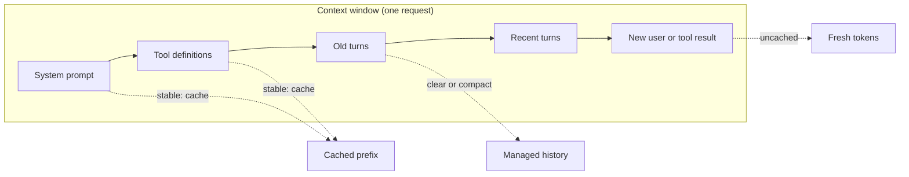
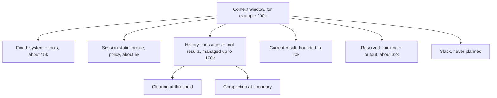
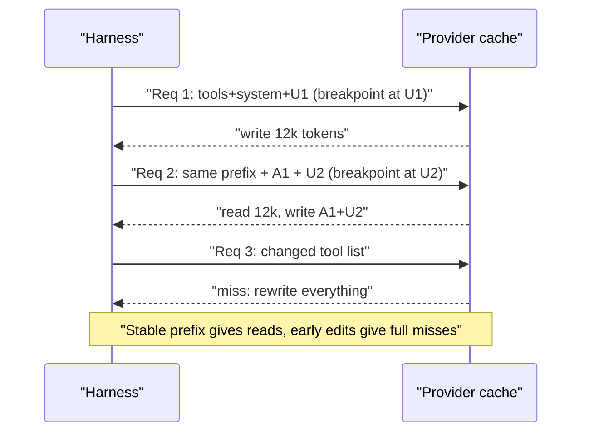
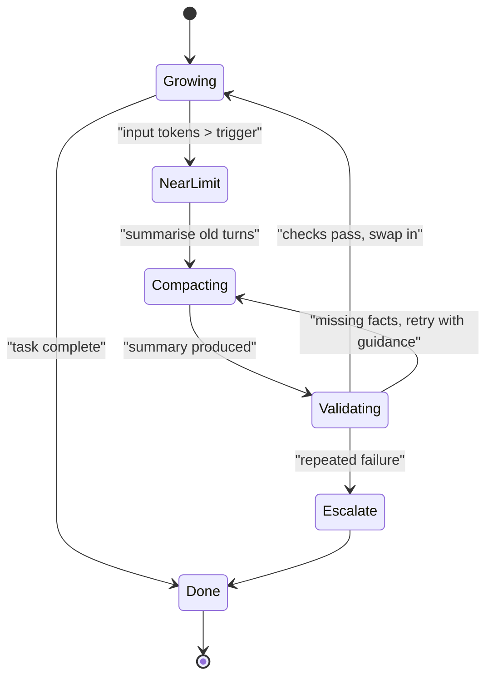
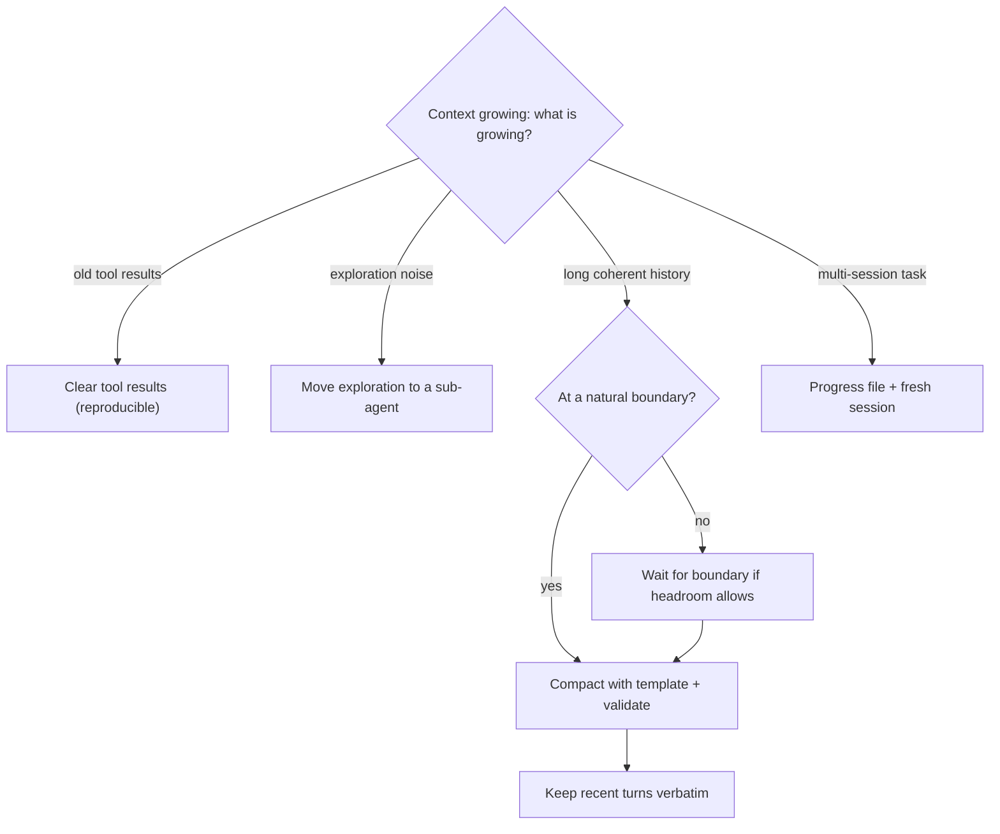
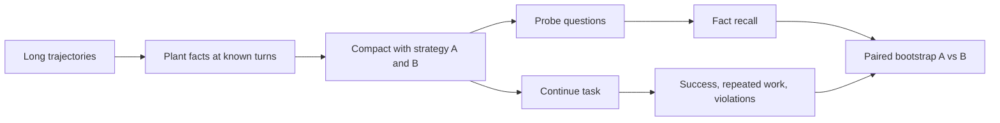
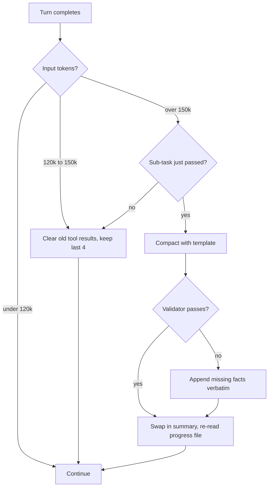

# Chapter 06: Context Engineering I: Budget, Caching, Compaction

> **What this chapter covers**: The context window as a budget shared by system prompt, tools, history, retrieved data, and scratchpad. Prompt caching mechanics across providers: breakpoints, stable prefixes, ordering for cache hits, TTLs, and worked savings arithmetic. Compaction: triggers, the compaction cliff, validating a summary against the trajectory, compaction as a deliberate choice. Context rot and lost-in-the-middle, and why million-token windows do not remove curation. Tool result clearing, truncation, and pagination.
>
> **Prerequisites**: Chapters 03, 04, 05.
>
> **Where it is used**: Chapter 07 (retrieval, isolation, progressive disclosure), 08 (memory), 18 (gateway caching), 22 (long-running agents), 31 (latency and cost).

---

## 06.1 Level 1: Foundations

### Context is a budget, not a bucket

Every model call sends the whole context: system prompt, tool definitions, the message history, tool results, and any retrieved documents. The model re-reads all of it to produce each token. That has three costs: money (input tokens), latency (prefill time, time to first token), and quality (attention is spread over everything present). Context engineering is the discipline of deciding what goes in, in what order, for how long.

Anthropic's engineering post on context engineering (September 2025) frames it as finding the smallest set of high-signal tokens that maximises the chance of the desired outcome. That is the right mental model: **context is a scarce resource even when the window is large.**

### The five consumers

| Consumer | Typical size in an agent | Stability |
|---|---|---|
| System prompt | 1k to 10k tokens | Static per deployment |
| Tool definitions | 200 to 1,000 tokens per tool; 50 tools can be 25k+ | Static per deployment, unless tools are loaded dynamically |
| Message history | Grows every turn | Append-only, until compacted |
| Tool results and retrieved data | 100 to 100k per result | Append-only, the main source of growth |
| Scratchpad and reasoning | Thinking blocks, TODO notes | Grows; provider-specific retention (Chapter 04) |

### Vocabulary

| Term | Meaning |
|---|---|
| Prefix cache | Provider stores the model's internal state (KV cache) for a prompt prefix and reuses it for later requests with the identical prefix |
| Breakpoint | A marker saying "cache up to here" (Anthropic `cache_control`) |
| TTL | How long a cache entry lives without being used |
| Cache write / read | Creating an entry (may cost a premium) and hitting it (discounted) |
| Compaction | Replacing older context with a summary |
| Clearing | Deleting specific old content (tool results, thinking) by rule, without summarising |
| Context rot | Degradation of model performance as input length grows, even within the window |
| Lost in the middle | Lower recall of information placed in the middle of a long context |

### Why this exists

Agents are append-only by default. A 40-turn coding session can accumulate 300k tokens of file reads and test logs, most of it irrelevant by turn 40. Without engineering, cost grows quadratically (each turn re-reads a growing history), latency grows linearly, and quality falls. Caching fixes cost and latency for the stable part. Clearing and compaction fix growth. Curation fixes quality.



### Why prefill is the thing being cached

Each model call has two phases. **Prefill** processes all input tokens in parallel and builds the key-value (KV) cache, one entry per token per layer. **Decode** generates output tokens one at a time, each attending over the KV cache. Prefill cost grows with input length; decode cost grows with output length and, more weakly, with context length. Prompt caching stores the KV cache for a prefix so prefill can skip it. That explains all the pricing: cached reads are cheap because the expensive compute already happened, and writes cost a premium because the provider must store the tensors.

It also explains the limits. A KV cache is only valid for the exact token sequence it was computed from, because every position's keys and values depend on everything before it. There is no partial credit for "mostly the same" prompts.

### A context budget in one picture



---

## 06.2 Level 2: Working knowledge

### Why cost grows quadratically without caching

If every turn adds `d` tokens and there is a fixed prefix `p`, turn `t` sends `p + t*d` tokens. Over `T` turns total input is `T*p + d*T*(T+1)/2`.

Worked example: `p` = 12,000 (system plus tools), `d` = 3,000 per turn, `T` = 30. Total input = 30 x 12,000 + 3,000 x 30 x 31 / 2 = 360,000 + 1,395,000 = 1,755,000 tokens. At an illustrative $3 per MTok, that is $5.27 per task, and most of it is re-reading old history.

### Prompt caching: the mechanism

Transformer inference computes key and value tensors for every input token. If two requests share an identical prefix, the provider can store those tensors from the first request and skip recomputing them for the second. The match is exact and prefix-based: one different token early in the prompt means everything after it misses.

Consequences that follow directly from the mechanism:

1. Order matters. Put stable things first: tools, system prompt, then history, then the new message.
2. Anything dynamic early (a timestamp in the system prompt, a random tool order, a per-user greeting) destroys the cache for everything after it.
3. Append-only histories cache well; edited histories (rewrite an old message, clear an old tool result) invalidate from the edit point onward.

### Provider comparison (as of September 2026, check the current docs)

Verified against provider documentation on 27 September 2026. Prices are multipliers on the model's base input rate because base rates differ per model.

| Aspect | Anthropic | OpenAI | Gemini |
|---|---|---|---|
| Activation | Explicit `cache_control` breakpoints (up to 4), or top-level automatic caching that places a moving breakpoint | Automatic on prompts above a minimum | Implicit caching automatic on Gemini 2.5 and newer; explicit caches as separate objects |
| Minimum cacheable | 512 to 4,096 tokens depending on model (for example 1,024 on Sonnet 4.6, 4,096 on Haiku 4.5) | 1,024 tokens on GPT-5.6 and later | 2,048 (2.5 series) to 4,096 (newer Flash and Pro) for implicit |
| Write cost | 1.25x base (5 minute TTL), 2x base (1 hour TTL) | 1.25x on GPT-5.6 and later; no write charge on earlier models | Explicit caches: storage charged per token per hour |
| Read cost | 0.1x base on most models; lower on some (the docs list 0.05x for Opus 5.5, 0.025x for Fable 5.1 and Mythos 5.1) | 0.1x on GPT-5.6 and later | Discounted cached rate (for example $0.075 vs $0.75 per MTok on Gemini 3.8 Flash, a 0.1x ratio) |
| TTL | 5 minutes default, refreshed on each hit; 1 hour option | `prompt_cache_options.ttl` of `"30m"` on GPT-5.6 and later; `prompt_cache_retention` `in_memory` or `24h` on earlier models | Implicit: provider managed; explicit: set by you |
| Usage fields | `cache_creation_input_tokens`, `cache_read_input_tokens`, `input_tokens` | `usage.input_tokens_details.cached_tokens`, `cache_write_tokens` | cached token count in usage metadata |
| Routing hint | Not needed | `prompt_cache_key`; guidance of roughly 15 requests per minute per prefix to avoid overflow routing | Not documented |

These numbers are the most volatile in the chapter. The mechanism is stable; the multipliers and parameter names are not.

### Anthropic cache hierarchy and invalidation

Anthropic documents the cache order as tools, then system, then messages. A change at one level invalidates that level and everything after it. Their invalidation table (September 2026) includes:

| Change | Invalidates |
|---|---|
| Tool definitions | Tools, system, messages (everything) |
| Web search or citations toggle, speed setting | System and messages |
| `tool_choice` | Messages |
| Adding or removing images anywhere | Messages |
| Thinking parameters, effort | Messages always; more depending on model |

The practical rule: **freeze tools and system prompt per session.** Dynamic tool loading (Chapter 07) is useful, but every change to the tool list is a full cache miss unless the provider's tool search mechanism is designed to avoid that.

Anthropic also documents a lookback window: a breakpoint checks at most 20 block positions backwards for an earlier cache entry. In a long agent turn with many tool calls, a single breakpoint at the end can fail to find the previous entry. The fix is an extra breakpoint partway, or automatic caching, which moves the breakpoint forward for you.



### Worked savings: Anthropic 5 minute cache

Same agent as above: `p` = 12,000, `d` = 3,000, `T` = 30. Illustrative base input $3 per MTok, so write at 1.25x = $3.75, read at 0.1x = $0.30. Assume turns arrive within 5 minutes, so the cache stays warm, and automatic caching writes each new increment once and reads everything before it.

- Writes: the whole context is written once over the task: 12,000 + 30 x 3,000 = 102,000 tokens x $3.75 per MTok = $0.383.
- Reads: at turn `t`, the prefix read is everything before the new increment: 12,000 + (t-1) x 3,000. Summed over t = 1 to 30: 30 x 12,000 + 3,000 x (0 + 1 + ... + 29) = 360,000 + 1,305,000 = 1,665,000 tokens x $0.30 per MTok = $0.500.
- Total input cost about $0.88, versus $5.27 uncached. An 83 percent saving.

If the model's read multiplier is 0.05x, reads cost $0.25 and the total is about $0.63.

### Worked savings: 1 hour TTL for bursty sessions

A support agent is used in bursts: a user returns every 10 to 20 minutes. With a 5 minute TTL each return is a miss on a 12,000-token prefix plus, say, 40,000 of history.

- 5 minute TTL, return after 15 minutes: rewrite 52,000 tokens at 1.25x = $0.195 per return.
- 1 hour TTL: first write at 2x = 52,000 x $6 per MTok = $0.312, then each return reads at 0.1x = $0.0156.
- Break-even: 1 hour wins once there are at least one or two returns inside the hour. With 4 returns: 5 minute costs 4 x $0.195 = $0.78; 1 hour costs $0.312 + 4 x $0.0156 + small writes of new increments, about $0.40.

### Worked savings: OpenAI and Gemini

OpenAI GPT-5.6 and later (September 2026 docs): write 1.25x, read 0.1x, 1,024 minimum. For the same 30-turn task the arithmetic mirrors Anthropic's 5 minute case, provided requests route to the same cache: use `prompt_cache_key` per conversation to improve routing. On earlier OpenAI models there was no write charge, so the saving was pure discount on reads.

Gemini explicit caching adds a storage term. A 200,000-token document cached for 2 hours on a model at $0.75 per MTok input, with the cached rate at $0.075 and storage at $0.50 per MTok per hour (Gemini 3.8 Flash pricing page, September 2026, which notes these prices change on 1 January 2027):

- Storage: 0.2 MTok x $0.50 x 2 hours = $0.20.
- 100 queries reading the cache: 100 x 0.2 x $0.075 = $1.50. Uncached: 100 x 0.2 x $0.75 = $15.00.
- Saving about $13.30. With only 3 queries the cache costs $0.20 + $0.045 versus $0.45 uncached: still a small win. With 1 query it loses.

### Worked example: where the tokens go in a real-shaped agent request

A support agent at turn 12, measured shape (illustrative):

| Component | Tokens | Share | Cached? |
|---|---|---|---|
| Tool definitions (18 tools) | 9,400 | 18% | Yes |
| System prompt | 5,100 | 10% | Yes |
| Customer profile and policy excerpt | 3,800 | 7% | Yes after turn 1 |
| Turns 1 to 11 messages | 6,200 | 12% | Yes |
| Tool results turns 1 to 11 | 26,500 | 51% | Yes |
| New tool result | 1,100 | 2% | No |
| Total | 52,100 | 100% | 98% cached |

Two observations. Tool results are half the request, so clearing and formatting are where the tokens are. Tool definitions are nearly a fifth, which is why progressive disclosure and tool search matter once tool counts grow (Chapter 07).

### Worked example: automatic caching vs explicit breakpoints

Anthropic offers two styles (September 2026). **Automatic caching**: a single top-level `cache_control` places the breakpoint on the last cacheable block and moves it forward as the conversation grows. **Explicit breakpoints**: up to 4 `cache_control` markers on chosen blocks.

For a simple linear chat or agent, automatic is enough. Explicit breakpoints earn their place in three cases:

1. **Shared prefixes at several levels.** One breakpoint after tools and global system (shared by all tenants), one after tenant policy (shared within a tenant), one at the end of history (per session).
2. **Long tool-heavy turns.** The 20-block lookback means a single end breakpoint can miss earlier entries after many tool calls; an extra breakpoint midway fixes it.
3. **Mixed TTLs.** A 1 hour TTL on the stable global prefix and 5 minutes on the session tail. Anthropic's docs require longer-TTL entries to come before shorter ones in the prompt (check the current docs for the ordering rule).

Arithmetic for case 1. 1,000 tenants, a 14,000-token global prefix, a 3,000-token tenant block, 200 sessions per tenant per day. With one breakpoint at the end of history only, each new session writes the global plus tenant prefix once if it misses (17,000 tokens at 1.25x). With a breakpoint after the global prefix, a new session reads the global 14,000 from cache (at 0.1x) and writes only the 3,000-token tenant block when it is cold. Per cold session at $3 per MTok base: without the extra breakpoint 17,000 x $3.75 / 1e6 = $0.064; with it 14,000 x $0.30 / 1e6 + 3,000 x $3.75 / 1e6 = $0.0042 + $0.0113 = $0.0155. If 20 percent of the 200,000 daily sessions start cold, that is 40,000 x ($0.064 - $0.0155) = about $1,940 per day saved by one breakpoint.

### Reading the usage fields correctly

Anthropic reports `input_tokens` as the tokens after the last cache breakpoint only, and total input as `cache_read_input_tokens + cache_creation_input_tokens + input_tokens` (prompt caching docs, September 2026). A dashboard that plots `input_tokens` alone will show a tiny number and hide the real volume. OpenAI reports `cached_tokens` as a subset of input tokens. Normalise per provider in your telemetry layer:

| Normalised field | Anthropic | OpenAI (GPT-5.6 and later) |
|---|---|---|
| total_input | read + creation + input_tokens | input_tokens |
| cached_read | cache_read_input_tokens | input_tokens_details.cached_tokens |
| cache_write | cache_creation_input_tokens | input_tokens_details.cache_write_tokens |
| uncached | input_tokens | input_tokens minus cached minus writes (check the docs) |

Getting this wrong makes hit-ratio dashboards meaningless. Verify the formula against the invoice for one day before trusting it.

### Tool definitions as a context cost

Tool definitions sit at the very front of the prompt, so they are both a token cost and a cache anchor. Worked example: 60 tools averaging 450 tokens each is 27,000 tokens on every call. Even cached at 0.1x on a $3 base, that is $0.0081 per call. At 20 calls per task and 50,000 tasks per day, $8,100 per day just to re-read tool definitions from cache, and $81,000 per day if the cache misses.

Beyond cost, large tool sets hurt selection accuracy: more near-duplicate tools means more wrong picks. Options, in order of preference:

1. Remove and merge tools that overlap (Chapter 24).
2. Load tool subsets per workflow or tenant, fixed for the session so the cache holds.
3. Use provider tool search or deferred loading, where only a search tool and a few core tools are always present and others are loaded on demand (Chapter 07). Check how the provider keeps the cache valid when tools are discovered mid-session.

### Choosing between implicit and explicit caching on Gemini

Implicit caching needs no code and passes on savings automatically when requests hit (Gemini caching docs, September 2026). Explicit caching guarantees the discount for a named cache but adds storage cost per hour. Rule of thumb from the arithmetic earlier in this section: use explicit caches for large documents queried many times within a known window (a contract review session, a codebase Q&A), and rely on implicit caching for ordinary agent traffic with a stable prefix. The docs note that implicit caching is the only kind supported through the Interactions API.

### Ordering for cache hits: a checklist

1. Tools sorted deterministically, definitions byte-identical across requests.
2. System prompt fully static; no dates, user names, or request ids. Put those in the first user message or late.
3. History append-only between compactions.
4. New content at the end.
5. Thinking and effort settings fixed for the session (Chapter 04).
6. Breakpoints: one after tools and system, one at the end of history (or use automatic), extra ones in long tool-heavy turns.
7. Monitor the cache hit ratio: `cache_read / (cache_read + cache_creation + uncached input)`. Alert on drops.

---

## 06.3 Level 3: Depth

### Context rot and lost in the middle

Two strands of evidence show that more context is not free for quality.

**Lost in the middle.** Liu et al., "Lost in the Middle: How Language Models Use Long Contexts" (TACL 2024), found that on multi-document QA and key-value retrieval, accuracy was highest when the relevant information was at the beginning or end of the context and dropped when it was in the middle, a U-shaped curve. Newer models have flattened that curve on simple retrieval, but the effect reappears on harder tasks.

**Context rot.** Chroma's technical report "Context Rot: How Increasing Input Tokens Impacts LLM Performance" (Hong, Troynikov, Huber, 14 July 2025) tested 18 models, including GPT-4.1, Claude 4, Gemini 2.5 and Qwen3. Performance degraded as input length grew even on simple tasks. Lower similarity between question and answer made it worse, a single distractor already reduced accuracy, and some distractors hurt consistently more than others. Counterintuitively, models did better on shuffled haystacks than on coherent ones. On LongMemEval, a gap between focused prompts of about 300 tokens and full prompts of about 113k tokens remained even with reasoning enabled. Needle-in-a-haystack scores near 100 percent do not predict performance on tasks that require reasoning over the content.

Mechanistic intuition: attention is a softmax over all positions. More tokens means more competitors for each query's attention mass, especially from near-duplicates and distractors. Long-context training extends position handling but does not make irrelevant tokens free.

### Why million-token windows do not remove curation

Several vendors offer 1M-token windows on some models (as of September 2026, check per model and tier). Large windows are valuable: whole-repo reads, long documents, long sessions before compaction. They do not remove curation because:

1. **Cost.** 800k tokens at $3 per MTok is $2.40 per uncached call; even cached at 0.1x it is $0.24 per call, every call.
2. **Latency.** Prefill of hundreds of thousands of tokens takes seconds even when cached reads are faster.
3. **Quality.** Context rot and distractors. A curated 30k context often beats a raw 500k one.
4. **Premium pricing.** Some providers price long-context requests above a threshold at a higher rate (check the current pricing page).

A useful rule: use the large window as headroom, not as a target. Curate as if the window were 100k and treat the rest as insurance.

### Tool result clearing

The biggest growth source in agents is stale tool results: a file read 20 turns ago, a search result already acted on. Clearing removes them while leaving a placeholder so the model knows something was there.

Anthropic's context editing (beta header `context-management-2025-06-27`, September 2026) implements this server-side with `clear_tool_uses_20250919`: triggered at an input token threshold (default 100,000), keeping the most recent N tool uses (default 3), with `clear_at_least`, `exclude_tools`, and an option to clear tool inputs as well. The client keeps the full history; the edit applies before the prompt reaches the model. The response reports what was cleared.

The trade-off is caching. Clearing edits the middle of the history, so everything after the clearing point is a cache miss. Hence `clear_at_least`: clear in large chunks, rarely, so you pay one rewrite and then read the new shorter prefix for many turns.

Worked arithmetic. History at 140,000 tokens; clearing removes 90,000 of old tool results, leaving 50,000. Base $3 per MTok, write 1.25x, read 0.1x.

- One-time rewrite: 50,000 x $3.75 per MTok = $0.19.
- Per-turn read before clearing: 140,000 x $0.30 per MTok = $0.042. After: 50,000 x $0.30 per MTok = $0.015.
- Saving $0.027 per turn; break-even after 7 turns. Plus better attention and more headroom.

Clearing only 5,000 tokens would still cost a rewrite of the whole post-edit history, which is why small frequent clears are a net loss.

### Layout rules derived from lost in the middle and context rot

1. **Task and constraints at the edges.** The instruction that matters most for the current step goes near the end, closest to generation. Critical standing constraints go in the system prompt (the start) and are restated briefly near the end on long tasks.
2. **Few distractors.** Near-duplicate documents hurt more than irrelevant ones, because they compete for the same attention. Deduplicate retrieved chunks and drop low-scoring ones rather than including "just in case".
3. **Structure over prose.** Clear headings and tags around retrieved blocks help the model locate content. Chroma's finding that shuffled haystacks sometimes did better than coherent ones is a caution that structure effects are not simple; test your layout.
4. **Short working set.** Keep the part of the context that changes per step small, and push bulk into files the agent reads on demand.

### Pagination design for agent tools

| Design choice | Recommendation | Why |
|---|---|---|
| Cursor vs offset | Cursor when data changes between calls; offset for static files | Offsets skip or duplicate on mutation |
| Default page size | Small (10 to 50 items, or 100 to 300 lines) | The model can ask for more; it cannot un-see a big page |
| Total count | Always return it | Lets the model decide whether to page or filter |
| Filters | Offer them before pages | One filtered call beats five pages |
| Response format | A concise mode and a detailed mode | Anthropic's tools post reports a concise format cutting one example from 206 to 72 tokens |
| Truncation note | Say what was cut and how to get it | Silent truncation leads to wrong conclusions |

Worked example. A log search matches 12,000 lines. Returning all of them is about 400k tokens, impossible. Returning the first 200 lines plus "12,000 matches; 43 distinct error types; top 5 listed; use error_type= to filter" is about 3,000 tokens, and the next call is targeted. The model reaches the root cause in two calls instead of paging blindly through 60.

### Truncation and pagination

Clearing handles old results; truncation and pagination handle new ones (Chapter 05). Principles:

- Every tool that can return unbounded output takes `limit` and `offset` or a cursor, with sensible defaults.
- Truncation is explicit and tells the model how to get more.
- Summaries beat raw dumps for logs: failing tests only, errors with 5 lines of context, a count of passes.
- For huge artifacts, write to a file and return the path plus a summary; the agent reads slices on demand (file system as memory, Chapter 07).

### Compaction

Compaction replaces older turns with a summary. It is the only way to continue indefinitely, and it is lossy.



Anthropic offers server-side compaction in two forms (September 2026, both beta): compaction on demand (beta header `compact-2026-09-04`, a top-level `compaction` parameter, with options to keep recent turns word for word and to run in the background) and compaction at a token threshold, plus the context-editing strategy `compact_20260112`. Claude Code and Codex CLI compact client-side or through these APIs. You can always write your own summariser.

### The compaction cliff

Agents often behave well until the first compaction and then degrade sharply: they redo finished work, forget constraints, lose file paths, or contradict earlier decisions. That drop is the compaction cliff. Causes:

1. **Summary omits load-bearing details.** Exact identifiers, error messages, user constraints stated once in turn 3.
2. **Loss of negative knowledge.** "We tried approach A; it failed because X." Summaries keep what was done, drop what did not work, so the agent retries A.
3. **Loss of reasoning.** Thinking blocks and rationale disappear (Chapter 04).
4. **Cache reset.** The first request after compaction is a full write; latency spikes.
5. **Distribution shift.** The model now sees a summary in a form it was not trained to continue from.

Mitigations: a summary template with required sections (goal, constraints, decisions with reasons, failed attempts, open TODOs, key identifiers and paths, next step); keep recent turns verbatim; keep a structured progress file outside context (Chapter 07) that survives compaction; compact earlier, at a lower threshold, so there is room for a careful summary.

### Validating a summary against the trajectory

A summary is a claim about a trajectory; validate it like any generated claim.

1. **Extract checkable facts from the trajectory mechanically**: file paths touched, ids created, tool calls with side effects, user-stated constraints (messages from the user role), last error.
2. **Check coverage**: each extracted fact appears in the summary (string match for ids and paths; a small judge for constraints).
3. **Check contradictions**: a judge compares summary claims to the trajectory and flags claims with no support.
4. **Gate**: if coverage is below threshold, retry with the missing items listed, or append them verbatim.

Worked example. A trajectory has 14 side-effecting tool calls, 6 file paths, 3 user constraints. The summary mentions 12 of 14 actions, 6 of 6 paths, 2 of 3 constraints. Coverage of constraints is 67 percent, below a 100 percent requirement for constraints, so the harness appends the missing constraint verbatim before swapping in the summary. Cost of validation: one small model call over perhaps 20k tokens, far cheaper than a derailed task.

### Compaction as a deliberate choice

Compaction is not only an emergency when the window fills. Choose it deliberately at natural boundaries: after a sub-task completes, after a plan is approved, when switching phases. Boundary compactions produce better summaries because the state is coherent. Alternatives to compaction, often better:

- Sub-agents that do exploratory work in their own context and return a short result (Chapter 07).
- Starting a fresh session from a progress file rather than a summary.
- Clearing tool results without summarising, when the results are reproducible.



### Self-hosted prefix caching

Open-weight serving stacks implement the same idea. vLLM has automatic prefix caching over its paged KV cache; SGLang's RadixAttention stores prefixes in a radix tree and shares them across requests. The economics differ from APIs: there is no per-token discount, but cached prefixes skip prefill compute, which raises throughput and cuts time to first token. The constraint is GPU memory. On an 8 GB RTX 4060 running a 4-bit 7B-class model, the KV cache has limited room (the weights take most of the memory), so long shared prefixes compete with concurrent requests. Measure hit rate and eviction in the server metrics; a cache that evicts constantly gives nothing.

Worked estimate of KV size, which drives this: per token, KV bytes = 2 (K and V) x layers x KV heads x head dim x bytes per value. For an illustrative model with 28 layers, 4 KV heads (grouped-query attention), head dim 128 and fp16 KV: 2 x 28 x 4 x 128 x 2 = 57,344 bytes, about 56 KB per token. A 12,000-token prefix is about 0.69 GB. On an 8 GB card holding roughly 4.5 GB of weights, that leaves room for only a few such contexts. KV cache quantization (fp8) halves it. Check your model's config for the real numbers.

### Comparison: context management techniques

| Technique | Removes | Lossy? | Cache impact | Cost | Best for |
|---|---|---|---|---|---|
| Truncation at source | Excess of a new result | Yes, recoverable by pagination | None | Free | Every unbounded tool |
| Pagination | Nothing, defers | No | None | Extra calls when needed | Lists, search, logs |
| Write to file, return path | Bulk content | No | None | A later read call | Large artifacts |
| Tool result clearing | Old results | Yes, recoverable if reproducible | Invalidates after edit point | One rewrite | Reproducible reads |
| Thinking clearing | Old reasoning | Yes | Invalidates after edit point | One rewrite | Long reasoning sessions |
| Compaction | Old turns | Yes, summary | Full rewrite | A summariser call plus rewrite | Long coherent histories |
| Sub-agent isolation | Exploration noise | Returns a summary | Separate caches | Extra calls | Search-heavy sub-tasks |
| Fresh session plus progress file | Everything | Yes, structured | New cache | Rebuild cost | Multi-session work |

Order of preference in most agents: bound at source, then clear, then isolate, then compact. Compaction is the most powerful and the most lossy, so it goes last.

### Failure case study: the timestamp that tripled the bill

A synthetic travel company added "Current time: 14:32:07 UTC" to the first line of its system prompt so the agent would know the time. Cache hit ratio fell from 91 percent to 3 percent overnight. Input cost per task went from $0.18 to $0.61, and p50 time to first token rose from 0.9 s to 2.7 s. The fix moved the date (not the time) into the first user message, and exposed time through a `get_current_time` tool. Hit ratio went back to 90 percent. The detection gap was the real failure: nobody alerted on hit ratio, so it took four days and a finance question to find.

### Failure case study: the compaction that forgot the refund

A synthetic bank's dispute agent compacted at 150k tokens with a generic "summarise the conversation" prompt. In 4 percent of long disputes the summary dropped the fact that a provisional credit had already been issued in turn 9, and the agent issued a second one. Fixes: the summary template gained a required "side effects already performed" section filled mechanically from the tool log, not by the model. A validator checks every write tool call id appears in the summary. Side-effecting actions after compaction are cross-checked against the idempotency store. Duplicate credits went to zero in the next 2,000 disputes. The lesson: facts about side effects should never depend on a model's summary. Take them from the log.

### Compaction summary template

```text
GOAL: <one paragraph, the user's objective in their words>
CONSTRAINTS: <every user-stated constraint, verbatim>
SIDE EFFECTS DONE: <filled from the tool log: tool, id, result>
DECISIONS: <decision, reason>
FAILED ATTEMPTS: <approach, why it failed>
KEY IDENTIFIERS: <ids, paths, URLs>
OPEN ITEMS: <TODO list with status>
NEXT STEP: <the single next action>
```

The mechanical sections (side effects, identifiers) are filled by the harness. The model writes the rest, and the validator checks them.

---

## 06.4 Level 4: Mastery

### Designing a context budget

Treat the window like a memory budget in embedded systems: allocate, monitor, enforce.

Worked budget for a 200k window support agent:

| Slot | Allocation | Policy |
|---|---|---|
| System prompt | 6k | Static, cached |
| Tools (18 tools) | 9k | Static, cached; rare tools behind tool search |
| Customer profile and policy excerpt | 4k | Loaded at session start, cached after first turn |
| History | up to 100k | Clear tool results at 100k keeping last 3; compact at 140k at a boundary |
| Current tool result | up to 20k | Truncate and paginate above 20k |
| Thinking and output headroom | 32k | Reserved via max_tokens |
| Slack | about 29k | Never planned to be used |

Enforce in the harness: estimate tokens before sending, and if a tool result would exceed its slot, truncate or write to a file. Track actuals per turn in traces.

### Cache strategy at scale

- **Shared prefixes across users.** If thousands of sessions share the same system prompt and tools, every session reads the same cached prefix, on providers where caches are shared within an organisation (Anthropic documents cache isolation per organisation or workspace; check current docs). Per-user content goes after the shared prefix.
- **Warm the cache** before a burst (Anthropic documents pre-warming with `max_tokens: 0`, which is incompatible with manual thinking budgets).
- **Multi-tenant ordering.** Global prefix (tools, base system), then tenant prefix (tenant policy), then user history. Three breakpoints capture three levels of sharing.
- **Measure** hit ratio per tenant and per route. A single deploy that inserts a timestamp into the system prompt can raise input cost several times overnight; alert on it.

Worked example at scale. 50,000 sessions per day, shared prefix 15,000 tokens, average 20 calls per session. Base $3 per MTok, read 0.1x. Prefix reads: 50,000 x 20 x 15,000 = 15 billion tokens per day. Cached: $4,500 per day. Uncached: $45,000 per day. A cache-breaking bug costs about $40,500 per day on the prefix alone.

### Compaction design decisions

| Decision | Options | Senior default |
|---|---|---|
| Who summarises | Same model, cheaper model, vendor server-side | Same or equal-quality model; a cheap summariser is a false economy on long tasks |
| Trigger | Fixed token threshold, boundary events, both | Boundary events with a hard threshold fallback |
| What stays verbatim | Nothing, last N turns, pinned messages | Last few turns plus pinned user constraints |
| Validation | None, rule-based, judge-based | Rule-based for ids and paths, judge for constraints |
| Where state lives | Only in context, plus progress file | Progress file is the source of truth; summary is a view |
| Vendor vs own | Server-side compaction vs own summariser | Server-side for single-vendor; own for multi-vendor portability |

### Where the literature and vendors disagree

- **"Long context replaces RAG and curation."** Vendor marketing around million-token windows suggests so; context rot evidence and cost arithmetic say otherwise. The honest position: large windows shift the break-even, they do not remove it.
- **Needle tests as evidence.** Vendors show near-perfect needle-in-a-haystack. Independent studies show that simple retrieval scores do not predict reasoning over long inputs.
- **Server-side compaction quality.** Vendors present it as a solved convenience. Practitioners report compaction cliffs. Validate on your tasks.
- **Summarise vs restart.** Some teams prefer fresh sessions seeded from structured progress files over summaries; Anthropic's long-running agent guidance leans on progress files and git history as well. Measure both.

### Cache economics by traffic pattern

Whether caching pays depends on how often a prefix is reused within its TTL. Illustrative model: a 20,000-token prefix, $3 per MTok base, 1.25x writes (5 minutes), 2x writes (1 hour), 0.1x reads.

| Traffic pattern | Requests per prefix per hour | 5 min TTL cost per hour | 1 h TTL cost per hour | Uncached cost per hour | Best choice |
|---|---|---|---|---|---|
| Hot (steady chat) | 120, evenly spaced | 1 write + 119 reads = $0.075 + $0.714 = $0.79 | $0.12 + $0.714 = $0.83 | $7.20 | 5 min |
| Warm (every 10 min) | 6 | 6 writes = $0.45 | 1 write + 5 reads = $0.12 + $0.03 = $0.15 | $0.36 | 1 h |
| Cold (twice an hour) | 2 | 2 writes = $0.15 | 1 write + 1 read = $0.126 | $0.12 | No cache or 1 h |
| Single use | 1 | $0.075 | $0.12 | $0.06 | No cache |

The single-use and cold rows show that caching can cost more than not caching. Write premiums only pay back through reads. For batch jobs that touch a prefix once, disable caching or rely on providers without write premiums.

### Evaluating a compaction strategy

A compaction strategy is a model of the trajectory and needs its own eval, separate from task success.

1. **Build a set of long trajectories** (real, anonymised, or synthetic) with known facts planted at various turns: constraints, ids, failed attempts, side effects.
2. **Compact each at several points** with the candidate strategy.
3. **Probe after compaction** with questions whose answers depend on the planted facts ("Which approach did we already rule out, and why?"), scored against the ground truth.
4. **Continue the task** from the compacted state and measure success, repeated work (duplicate tool calls matching earlier ones), and constraint violations.
5. **Compare strategies pairwise** on the same trajectories with bootstrap CIs.

Worked example. 60 trajectories, 8 planted facts each (480 facts). Generic summary recall: 71 percent (341 of 480). Template summary: 89 percent. Template plus mechanical sections: 96 percent. Repeated-work rate after compaction: 14 percent, 6 percent and 3 percent. The mechanical sections cost nothing in model calls; they come from the tool log. Illustrative numbers, but this is the shape most teams see.



### Vendor comparison: context management features

| Capability | Anthropic (September 2026) | OpenAI (September 2026) | Gemini (September 2026) | Self-hosted |
|---|---|---|---|---|
| Prefix caching | Explicit and automatic, 5 min and 1 h TTL | Automatic, TTL parameter on newer models | Implicit, plus explicit caches with storage billing | Automatic prefix caching in vLLM, RadixAttention in SGLang |
| Server-side clearing | Context editing strategies (beta) | Check current docs | Check current docs | Your harness |
| Server-side compaction | On demand and threshold (beta) | Check current docs (Codex and the Responses API have compaction features; verify names) | Check current docs | Your harness |
| Long windows | Up to 1M on some models and tiers; check | Model-dependent; check | Up to 1M or more on some models; check | Limited by GPU memory |

I have not verified OpenAI's and Gemini's server-side clearing and compaction features for this chapter, so those cells say to check. Treat the whole table as a snapshot.

### Where vendors and practitioners disagree, concretely

| Claim | Who makes it | Counter-evidence or caveat |
|---|---|---|
| "Just put everything in the 1M window" | Long-context marketing | Context rot (Chroma, 2025), cost arithmetic, latency |
| "Server-side compaction handles long tasks" | Vendor docs present it as a convenience | Compaction cliffs; validate on your tasks |
| "Caching is automatic, no work needed" | Automatic-caching providers | Prefix exactness means layout work is still yours; hit ratio must be monitored |
| "Summaries preserve what matters" | Default summarisers | Side effects and negative knowledge get dropped; use templates and the tool log |
| "Retrieval beats long context" | RAG vendors | For small corpora that fit, long context with caching can be simpler and as good; measure |

### Designing for multi-hour agents

Long-running agents (Chapter 07 and 22) combine every technique in this chapter. Anthropic's "Effective harnesses for long-running agents" (26 November 2025) describes an initializer agent that sets up the environment, a progress file (`claude-progress.txt`), a JSON feature list with features initially marked failing, and git commits after each session, so each new session starts from structured artefacts rather than from a summary. That is compaction by externalisation: the durable state lives in files and version control, and the context holds only the working set.

Worked arithmetic for a 6-hour agent. Suppose 400 model calls, an average context of 90k tokens held by clearing and two compactions, 95 percent cache hits, a $3 per MTok base, 0.1x reads and 1.25x writes. Input: 400 x 90,000 = 36M tokens. Reads: 34.2M x $0.30 / 1e6 = $10.26. Uncached and writes: 1.8M tokens at a blended $3.75 per MTok = $6.75. Input total about $17. Without clearing, the average context would drift towards the window (say 180k) and cost roughly double, and quality would degrade before that.

### Context engineering review checklist

Use this in a design review of any agent before it goes to production.

| Area | Question | Red flag |
|---|---|---|
| Layout | Is everything before the history byte-identical across requests? | Timestamps, user names or random ordering early |
| Tools | How many tokens are tool definitions, and do they change mid-session? | Over 20k, or per-request tool lists |
| Caching | What is the measured hit ratio, and is it alerted on? | No metric, or under 70 percent on multi-turn traffic |
| TTL | Does the TTL match the observed gap between requests? | Returns every 10 minutes on a 5 minute TTL |
| Results | Does every unbounded tool paginate and truncate explicitly? | Raw query dumps |
| Growth | What happens at 50, 100 and 150 turns? | Nobody knows |
| Clearing | Which tool results are reproducible and safe to clear? | Clearing tools whose output cannot be regenerated |
| Compaction | Is there a template, validation, and a mechanical side-effects section? | A generic summarise prompt |
| State | Where does durable task state live? | Only in the context window |
| Budget | Is output and thinking headroom reserved? | max_tokens set without reference to thinking length |
| Quality | Is post-compaction success tracked? | No compaction-aware metric |

A system that answers every row well rarely has context incidents. Most real incidents trace to the layout, results and compaction rows.

### Edge cases

- **Clearing a result the model still needs.** Use `exclude_tools` for tools whose output is not reproducible (a one-time token, a user upload), or write those results to a file first.
- **Images.** Adding or removing images invalidates the message cache on Anthropic; keep images early and stable, or pass them by reference.
- **Parallel sub-agents.** Each has its own cache; a shared prefix still helps them.
- **Mid-session tool discovery.** Adding a tool mid-session invalidates the whole cache on Anthropic unless it comes through a mechanism designed for deferred loading. Verify with the usage fields.
- **Summaries in another language.** If users write in several languages, instruct the summariser to keep constraints verbatim in the original language; translated constraints drift.
- **Streaming plus compaction.** Server-side threshold compaction runs inside the request that crosses the threshold, so that request is slow; on-demand or background compaction avoids blocking the user.

### Worked design: context plan for a long coding session

A synthetic developer-tools company runs a coding agent on a 200k window. Measured over 300 sessions: tools and system are 14k, file reads average 4k each with 25 reads per session, test runs average 6k of output with 12 runs, and sessions last 60 turns.

Without management, history at turn 60 is about 14k + 100k + 72k + 30k of messages and thinking = 216k, over the window. The plan:

1. Test output formatter: failing tests and a summary only, cutting 6k to about 1.2k per run. Saves about 58k.
2. Clear tool results at 120k, keeping the last 4, clearing at least 40k each time, excluding the user-upload tool.
3. A progress file updated after each sub-task and re-read after any compaction.
4. Boundary compaction after each passing sub-task if input exceeds 150k, with the template and validator.



Expected effect, estimated from the traces: no session exceeds the window, one or two clears and at most one compaction per session, and a cache hit ratio above 85 percent between those events. The team verifies with a 50-session paired comparison against the unmanaged baseline on task success and cost, reporting bootstrap intervals.

### Worked example: pagination vs full read over a session

An agent reads a 3,000-line file three times over a 40-turn session. A full read is about 36,000 tokens and stays in history. A targeted read with an offset and 150 lines is about 1,800 tokens. Suppose each read happens at turn 5 and the content is carried to turn 40, so 35 turns of cached re-reading at $0.30 per MTok.

- Full reads: 3 x 36,000 = 108,000 tokens carried, costing 108,000 x 35 x $0.30 / 1e6 = $1.13, plus the attention cost of 108k mostly irrelevant tokens.
- Targeted reads: 3 x 1,800 = 5,400 tokens carried, costing $0.057.

The file-reading tool's default page size decides this, not the model.

### Measuring context health in production

Four metrics catch most context problems:

| Metric | Definition | Alert when |
|---|---|---|
| Cache hit ratio | Cache reads over total input tokens | Drops more than 10 points after a deploy |
| Input tokens per turn, p95 | From usage fields | Rises without a traffic change |
| Tool result size, p95 per tool | Tokens per result | A tool exceeds its slot |
| Post-compaction success delta | Success on tasks that compacted vs matched tasks that did not | Gap widens |

The last one is how you see the compaction cliff in production rather than in anecdotes.

---

## 06.5 Subtopic checklist

- [x] The context budget: system prompt, tools, history, retrieved data, scratchpad
- [x] Quadratic cost growth without caching, with arithmetic
- [x] Prompt caching mechanism: exact prefix, KV reuse
- [x] Breakpoints, automatic caching, lookback window
- [x] Stable prefix and ordering for cache hits, with a checklist
- [x] TTLs and cost per provider (Anthropic, OpenAI, Gemini), with worked savings arithmetic
- [x] Cache invalidation rules
- [x] Compaction: triggers, server-side options, own summariser
- [x] The compaction cliff: causes and mitigations
- [x] Validating a summary against the trajectory, with a worked example
- [x] Compaction as a deliberate choice, and alternatives
- [x] Context rot and lost in the middle, with sources
- [x] Why 1M-token windows do not remove curation
- [x] Tool result clearing, with caching trade-off arithmetic
- [x] Truncation and pagination of large outputs
- [x] Context budget design and cache strategy at scale
- [x] Usage field normalisation, multi-level breakpoints, self-hosted prefix caching and KV sizing
- [x] Failure case studies: cache-breaking timestamp, compaction that dropped a side effect

---

## 06.6 Common misconceptions

1. **"Caching is automatic, so ordering does not matter."** Caching is prefix-exact. A dynamic token early breaks everything after it.
2. **"A cache write is free."** Anthropic charges 1.25x or 2x for writes, and OpenAI does on newer models. Frequent rewrites can cost more than no caching.
3. **"Clearing old tool results always saves money."** It invalidates the cache after the edit point. Small, frequent clears lose money; large, rare clears win.
4. **"A 1M-token window means no need for curation."** Cost, latency, and context rot still apply.
5. **"Needle-in-a-haystack scores prove long-context reasoning."** They test retrieval of a distinct fact, not reasoning over similar distractors.
6. **"Compaction is lossless enough."** It drops negative knowledge, identifiers, and constraints unless you enforce a template and validate.
7. **"Compact only when the window is full."** Emergency compaction produces worse summaries than boundary compaction.
8. **"A cheap model is fine for summarising."** The summary becomes the agent's memory; a poor summary costs far more than the savings.
9. **"Changing effort or tools mid-session is harmless."** Both invalidate caches on Anthropic.
10. **"Cache hit ratio is a provider concern."** It is a first-class production metric for you; regressions multiply cost.

11. **"input_tokens in the usage object is my total input."** On Anthropic it is only the tokens after the last breakpoint; total input is reads plus writes plus input_tokens.
12. **"Self-hosted prefix caching is free capacity."** It competes for GPU memory with concurrent requests; on small GPUs it evicts quickly.
13. **"Summaries can be trusted to record side effects."** Take side effects from the tool log mechanically; models omit them.

---

## 06.7 Practice

1. **Arithmetic.** `p` = 8,000, `d` = 2,500, `T` = 40. Compute uncached input tokens, then cost with a 5 minute cache at write 1.25x and read 0.1x on a $3 per MTok base. What is the saving percentage?
2. **Arithmetic.** When does a 1 hour TTL beat a 5 minute TTL for a 60,000-token context with returns every 12 minutes? Find the number of returns at break-even.
3. **Hands-on (free tier or low cost).** Send the same 5,000-token prefix twice to a provider with caching and log the usage fields. Then insert a timestamp at the top of the system prompt and repeat. Report the hit ratios.
4. **Hands-on (RTX 4060, WSL2).** With vLLM or llama.cpp serving a small model locally, enable prefix caching and measure time to first token for a repeated 6,000-token prefix versus a changed one.
5. **Design.** Write a compaction summary template for a coding agent with required sections. Write the rule-based validator that checks ids and paths.
6. **Experiment.** Build a 20-turn synthetic task where a constraint is stated in turn 2. Compact at turn 12 with and without the template. Measure constraint violation rate over 30 runs.
7. **Design.** Allocate a context budget for a research agent with a 128k window, including headroom for thinking.
8. **Reading.** Read Liu et al. (2024) and the Chroma context rot report. Write three harness rules they justify.
9. **Analysis.** Your input cost tripled after a deploy with no traffic change. List the three most likely causes and how to distinguish them from traces.

10. **Arithmetic.** Compute the KV cache size per token for a model with 32 layers, 8 KV heads, head dim 128 and fp16 KV. How many 8,000-token contexts fit in 3 GB?
11. **Arithmetic.** With 500 tenants, a 10,000-token global prefix, a 2,000-token tenant block and 30,000 cold sessions per day, compute the daily saving from adding a breakpoint after the global prefix ($3 base, 1.25x write, 0.1x read).
12. **Hands-on.** Write a telemetry normaliser that maps Anthropic and OpenAI usage objects to total_input, cached_read, cache_write and uncached, with unit tests on recorded responses.
13. **Design.** Redesign a log-search tool's output for an agent: default page size, filters, total counts and truncation notes. Estimate tokens before and after for a 10,000-line match.

---

## 06.8 How this is tested

<details><summary>How does prompt caching work mechanically, and what breaks it?</summary>

The provider stores the key-value tensors for a prompt prefix and reuses them when a later request has a byte-identical prefix. Anything different early (a timestamp, reordered tools, a changed tool definition, images added, thinking or effort changes on some providers) invalidates everything after that point.
</details>

<details><summary>Order the parts of an agent prompt for maximum cache hits.</summary>

Tools (deterministically ordered), static system prompt, tenant-level static content, then append-only history, then the new message. Dynamic facts like date or user name go late. Keep thinking and effort settings fixed per session.
</details>

<details><summary>Compute the saving from caching a 30-turn agent with a 12k prefix and 3k per turn.</summary>

Uncached: 30 x 12k + 3k x 465 = 1.755M tokens, $5.27 at $3 per MTok. Cached with write 1.25x and read 0.1x: writes about 102k tokens ($0.38), reads about 1.665M ($0.50), about $0.88 total, an 83 percent saving.
</details>

<details><summary>When would you choose a 1 hour cache TTL?</summary>

When users return to a session after more than 5 minutes but within the hour, or when a batch of agents shares a prefix over a longer window. The 2x write pays off after one or two returns that would otherwise be full rewrites at 1.25x.
</details>

<details><summary>What is context rot?</summary>

Performance degradation as input length grows, even well within the window, worse with distractors and low similarity between query and relevant content. Chroma's 2025 report documented it across frontier models. It is why curation matters even with large windows.
</details>

<details><summary>Why do million-token windows not remove the need for context engineering?</summary>

Cost per call scales with tokens even with cache discounts, prefill latency grows, some providers price long contexts at a premium, and quality degrades with irrelevant content. Large windows are headroom, not a target.
</details>

<details><summary>What is the compaction cliff and how do you prevent it?</summary>

A sharp quality drop after compaction: repeated work, forgotten constraints, lost identifiers, retried failed approaches. Prevent it with a required-section summary template, keeping recent turns verbatim, pinning user constraints, a progress file outside context, compacting at boundaries, and validating the summary.
</details>

<details><summary>How do you validate a compaction summary?</summary>

Mechanically extract facts from the trajectory (paths, ids, side-effecting calls, user constraints, last error), check coverage in the summary, run a judge for unsupported claims, and gate: retry with the missing items or append them verbatim.
</details>

<details><summary>Tool result clearing vs compaction: when do you use each?</summary>

Clearing for stale, reproducible tool outputs: cheap, no summarisation risk. Compaction when the history itself is long and coherent and must be carried forward. Clearing first often postpones compaction substantially.
</details>

<details><summary>Why does clearing interact badly with caching, and how do you mitigate it?</summary>

It edits the middle of the history, invalidating the cache after the edit point, so the next request rewrites the rest. Mitigate by clearing in large chunks rarely (a minimum clear amount), so one rewrite buys many cheaper reads.
</details>

<details><summary>Input cost tripled after a deploy. What do you check?</summary>

Cache hit ratio in usage fields. Then look for a dynamic value added early in the prompt, a change in tool ordering or definitions per request, or a changed effort or thinking setting per step. Diff two consecutive rendered prompts byte by byte.
</details>

<details><summary>Explain lost in the middle and what it implies for prompt layout.</summary>

Liu et al. found accuracy was highest when relevant information was at the start or end of a long context and lower in the middle. Put instructions and the current task at the edges, keep critical constraints near the end of the context, and avoid burying key facts in long retrieved blocks.
</details>

<details><summary>How would you design a context budget for a production agent?</summary>

Allocate slots for system, tools, static session data, history, current tool result, and thinking plus output headroom, with policies per slot (cache, clear, compact, truncate). Enforce with token estimates in the harness and track actuals in traces with alerts.
</details>

<details><summary>Why is a cached read cheaper than uncached input?</summary>

Caching stores the prefill result, the key-value tensors for the prefix. A read skips that compute and only loads the stored state, so providers discount it heavily. Writes cost a premium because the provider must store the tensors. Validity is exact-prefix because each position's keys and values depend on all earlier tokens.
</details>

<details><summary>When do you use more than one cache breakpoint?</summary>

When there are several levels of sharing (global, tenant, session), when long tool-heavy turns exceed the lookback window, or when mixing TTLs. Each breakpoint lets a shorter shared prefix be read even when the longer one misses, which pays off heavily with many tenants.
</details>

<details><summary>A summary dropped a side effect and the agent repeated it. What is the design fix?</summary>

Never let side-effect facts depend on the model's summary. Fill a side-effects section mechanically from the tool log, validate that every write call id appears, and cross-check writes after compaction against an idempotency store.
</details>

<details><summary>How do the Chroma context rot findings change how you lay out context?</summary>

Performance falls with length even on simple tasks, distractors hurt, and low question-answer similarity hurts. So keep the working set small, deduplicate near-duplicate chunks, drop low-relevance retrieval, place the current task near the end, and test layout choices rather than assuming coherent structure helps.
</details>

<details><summary>Is caching always worth turning on?</summary>

No. Write premiums only pay back through reads within the TTL. A prefix used once, or twice an hour on a 5 minute TTL, costs more cached than uncached. Match the TTL to the gap between requests, and disable caching for single-use batch prompts on providers that charge for writes.
</details>

<details><summary>How would you evaluate a compaction strategy before shipping it?</summary>

Plant known facts (constraints, ids, failed attempts, side effects) in long trajectories, compact at several points, probe recall with questions, then continue the tasks and measure success, repeated work and violations. Compare strategies pairwise with bootstrap CIs on the same trajectories.
</details>

---

## 06.9 Summary

- Context is a budget with three costs: money, latency, and attention quality.
- Without caching, agent input cost grows quadratically with turns.
- Prompt caching reuses exact prefixes; order stable content first and never put dynamic values early.
- Provider mechanics differ (explicit breakpoints vs automatic, write premiums, TTLs); multipliers and parameter names change often.
- Anthropic invalidates in the order tools, system, messages; tool changes invalidate everything.
- Worked arithmetic typically shows 70 to 90 percent input savings for multi-turn agents with a warm cache.
- Context rot and lost in the middle mean more tokens can lower quality.
- Million-token windows are headroom, not a reason to stop curating.
- Clear stale tool results in large, rare chunks to limit cache rewrites.
- Compaction is lossy; use templates, verbatim recent turns, progress files, and validation to avoid the compaction cliff.
- Compact at natural boundaries by choice, and consider sub-agents or fresh sessions instead.
- Track cache hit ratio as a production metric; one bug can multiply cost overnight.

- Normalise provider usage fields before computing hit ratios, and alert on hit-ratio drops.
- Side-effect facts come from the tool log, never from a summary.

---

## 06.10 Further reading

- Anthropic, "Effective context engineering for AI agents" (September 2025): the budget framing and long-horizon techniques.
- Anthropic, "Prompt caching" docs (platform.claude.com, checked September 2026): breakpoints, TTLs, multipliers, invalidation table, lookback window.
- Anthropic, "Context editing" and "Compaction" docs (checked September 2026): tool result clearing, thinking clearing, server-side compaction.
- OpenAI, "Prompt caching" guide (developers.openai.com, checked September 2026): minimums, retention, `prompt_cache_key`.
- Google, "Context caching" docs and pricing page (ai.google.dev, checked September 2026): implicit and explicit caching, storage pricing.
- Liu et al., "Lost in the Middle: How Language Models Use Long Contexts" (TACL 2024).
- Hong et al. (Chroma), "Context Rot: How Increasing Input Tokens Impacts LLM Performance" (July 2025).
- Anthropic, "Writing effective tools for agents" (11 September 2025): concise response formats, truncation defaults, pagination guidance.
- Kwon et al., "Efficient Memory Management for Large Language Model Serving with PagedAttention" (SOSP 2023): KV cache management underlying prefix caching.
- Zheng et al., "SGLang: Efficient Execution of Structured Language Model Programs" (2024): RadixAttention and prefix reuse.
- Anthropic, "Effective harnesses for long-running agents" (2025): progress files and session handoff as an alternative to summaries.
