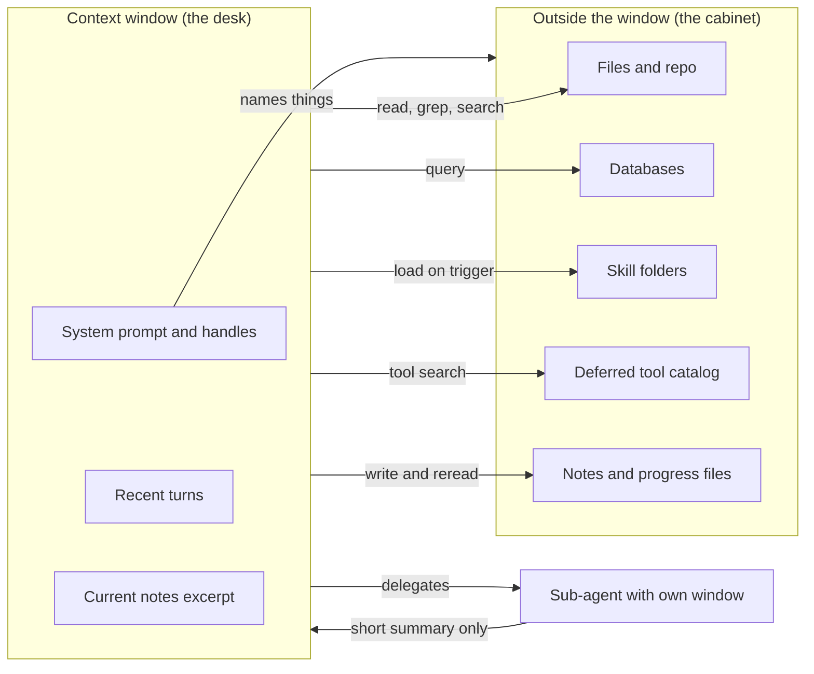
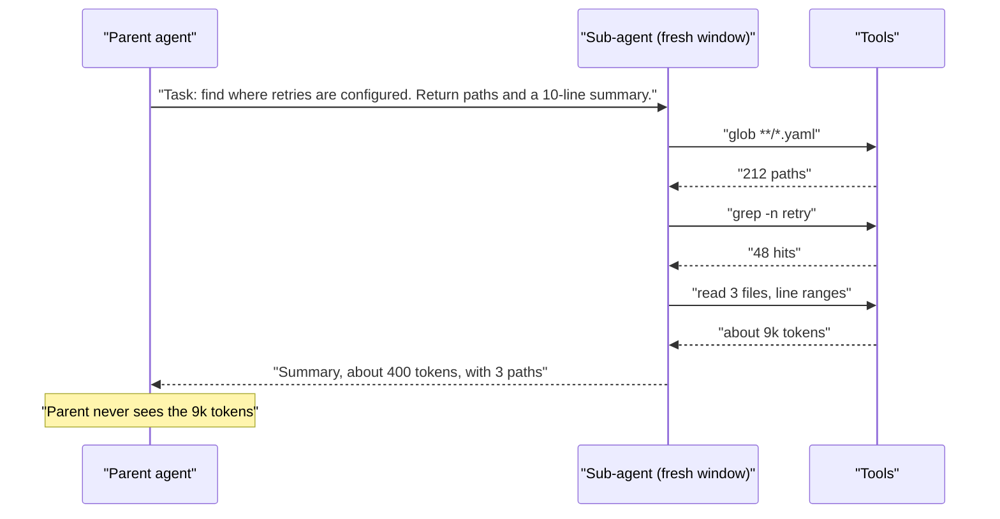
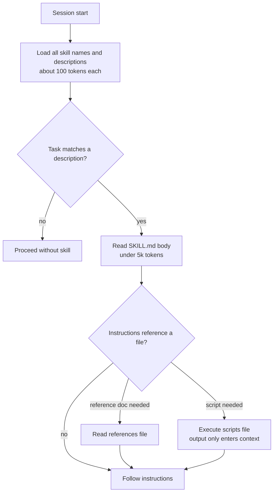
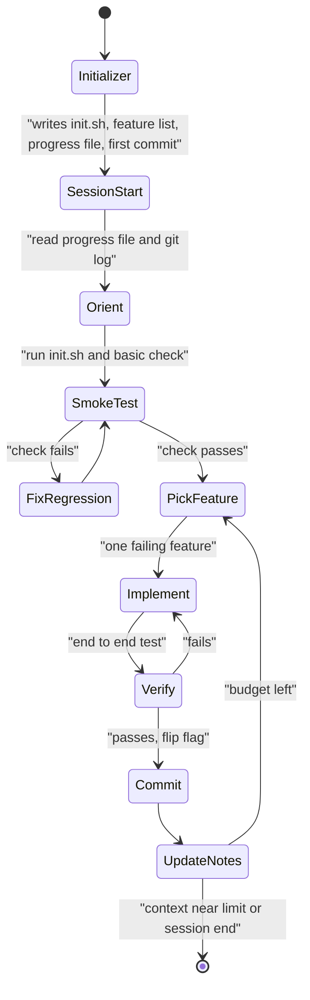
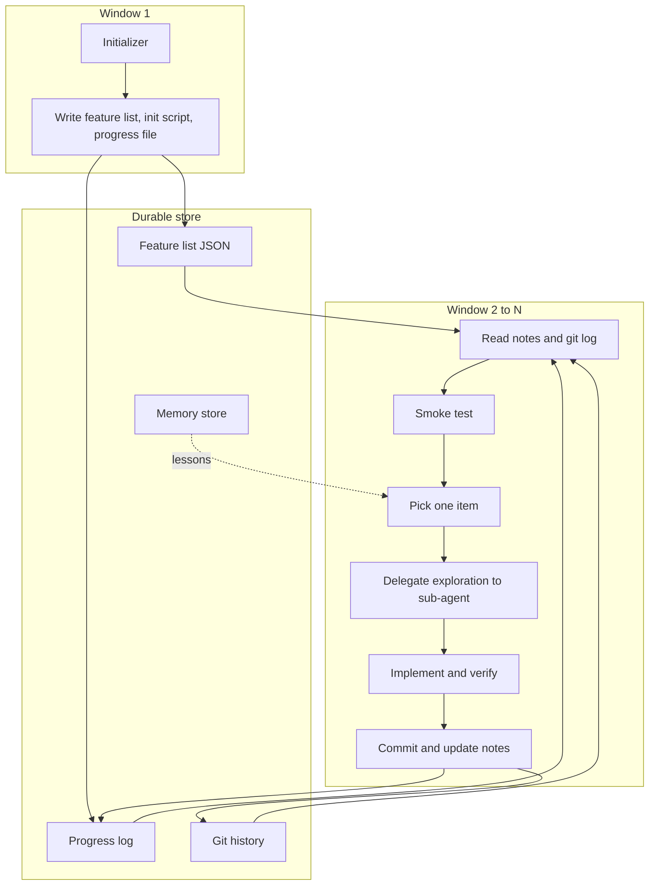
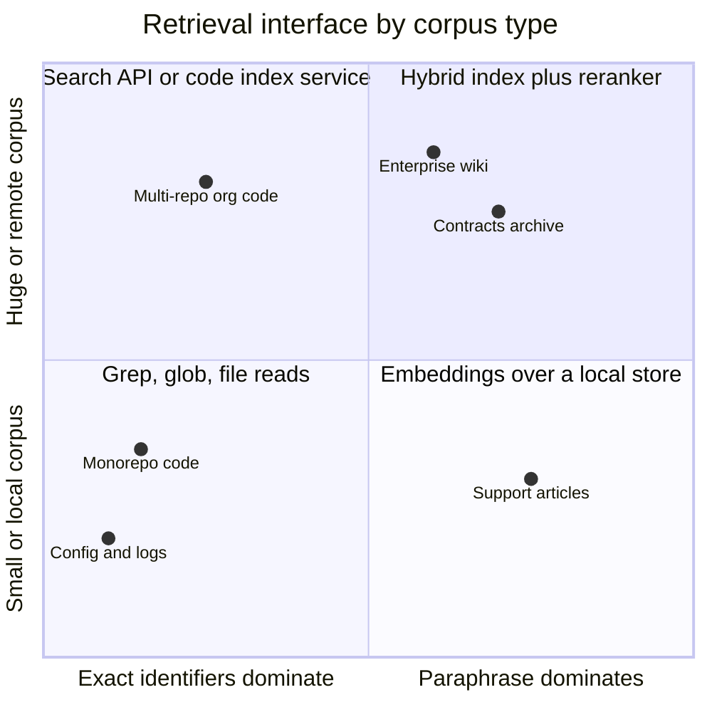

# Chapter 07: Context Engineering II: Retrieval, Isolation, Progressive Disclosure

> **What this chapter covers**: How an agent gets the right tokens into its window at the right moment instead of all tokens up front. Just-in-time retrieval versus pre-loading, the file system as memory, grep and glob tools versus vector RAG, sub-agents as context isolation, progressive disclosure through Agent Skills and tool search, structured note-taking (TODO files, progress files, feature lists), and the design of multi-hour runs that survive many context resets.
>
> **Prerequisites**: Chapters 01, 03, 05, 06.
>
> **Where it is used**: Chapter 08 (memory builds on the file-as-memory idea), Chapter 09 (agentic RAG is just-in-time retrieval over a corpus), Chapter 11 (Claude Agent SDK skills and sub-agents), Chapter 16 (MCP servers with hundreds of tools), Chapter 21 (multi-agent systems), Chapter 22 (long-running agents), Chapter 25 (coding and research archetypes).

---

## 07.1 Level 1: Foundations

### The problem this chapter solves

Chapter 06 treated the context window as a budget and showed how to spend less of it: caching, compaction, clearing tool results. This chapter is about the other half of the problem. Which tokens should enter the window at all, and when?

There are two broad answers.

1. **Pre-loading.** Decide before the run what the model might need, retrieve it, and put it in the prompt. Classic RAG does this. So does a system prompt that pastes in the whole API reference.
2. **Just-in-time (JIT) retrieval.** Give the model cheap handles (file paths, table names, tool names, URLs, skill descriptions) and tools to dereference them. The model pulls the content when it decides it needs it.

Anthropic's September 2025 engineering post "Effective context engineering for AI agents" frames the goal as finding the smallest set of high-signal tokens that maximizes the chance of the desired outcome. Pre-loading optimizes for recall at the cost of noise. JIT optimizes for precision at the cost of extra turns.

### Vocabulary

| Term | Meaning in this chapter |
|---|---|
| Handle | A short reference the model can resolve later: a path, an ID, a URL, a tool name, a skill name |
| JIT retrieval | The model fetches content through tools at the moment of need |
| Pre-loading | The harness retrieves content before the model call and injects it |
| Context isolation | Running a sub-task in a separate context window so its intermediate tokens never reach the parent |
| Progressive disclosure | Showing a short index first and revealing detail in layers on demand |
| Agent Skill | A folder with a `SKILL.md` (frontmatter plus instructions) and optional scripts and references, loaded in layers |
| Deferred tool | A tool whose definition is known to the API but not placed in the model's context until discovered by search |
| Scratchpad or notes file | A file the agent writes to record plans, progress, and decisions outside the window |
| Context reset | Starting a fresh window (new session, or after compaction) that must rebuild state from durable artifacts |

### The mental model: a desk and a filing cabinet

Think of the context window as a desk and everything else as a filing cabinet. A human engineer does not photocopy the whole cabinet onto the desk. They keep a few index cards on the desk (what exists, where), open one folder at a time, take notes on a pad, and put folders back. When a sub-problem is large, they hand it to a colleague and ask for a one-page answer.

Each of those moves maps to a technique:

| Human move | Agent technique | Section |
|---|---|---|
| Index cards on the desk | Handles in the system prompt: directory tree, skill descriptions, tool categories | 07.2 |
| Open one folder | `read_file`, `grep`, `glob`, `search_docs`, SQL `DESCRIBE` | 07.2 |
| Notes pad | TODO file, progress file, feature list | 07.2, 07.3 |
| Hand off to a colleague | Sub-agent with its own context, returning a summary | 07.2, 07.3 |
| Manuals on a shelf, opened only for the relevant chapter | Agent Skills, tool search | 07.2, 07.3 |



### Why this exists now

Three trends made it necessary.

1. **Agents run many turns.** A 60-turn coding session with file reads can generate hundreds of thousands of tokens of observations. Pre-loading does not scale to that horizon, and the window refills anyway.
2. **Tool catalogs exploded.** Connecting five MCP servers can put tens of thousands of tokens of tool definitions into every request before the user speaks. Anthropic's tool search documentation (checked September 2026) gives about 55k tokens for a GitHub, Slack, Sentry, Grafana, and Splunk setup, and says selection accuracy degrades past 30 to 50 tools.
3. **Long windows did not remove the need to curate.** Chapter 06 covered context rot: accuracy on retrieval and reasoning falls as irrelevant tokens accumulate, even well inside the advertised window. A 1M-token window lets you be sloppy; it does not make sloppiness free.

### Where JIT beats pre-loading, and where it does not

JIT is not always better. It costs turns, and each turn costs latency and a chance of the model choosing the wrong thing to fetch.

| Situation | Better choice | Why |
|---|---|---|
| Answer depends on a small, predictable set of facts (a policy, a customer record) | Pre-load | One retrieval, no extra turns, deterministic |
| The corpus is large and the relevant subset is unknown until work begins (a repo, a data warehouse) | JIT | Relevance emerges during the task |
| The model tends to under-fetch (skips reading and guesses) | Pre-load a minimum, JIT the rest | Guarantees a floor of grounding |
| Latency budget under about 2 s end to end | Pre-load | Each JIT turn adds a model round trip |
| Content changes during the run (files the agent itself edits) | JIT | Pre-loaded copies go stale |
| Content is untrusted (web pages, emails) | JIT into an isolated sub-agent | Limits injection blast radius (Chapter 29) |

The common production answer is hybrid. Claude Code, for example, loads `CLAUDE.md` project instructions up front and then explores the repository with glob, grep, and file reads. The up-front part is small, stable, and cacheable. The JIT part is large and task-specific.

---

## 07.2 Level 2: Working knowledge

### Handles: what goes in the prompt instead of content

A handle is useful only if the model can predict what is behind it. Good handles carry metadata.

| Weak handle | Strong handle |
|---|---|
| `doc_4812` | `docs/billing/refund-policy-2026.md (3.1 KB, updated 2026-08-02)` |
| `table_17` | `analytics.fct_orders (41 columns, 1.2B rows, grain: one row per order line)` |
| `tool: search` | `crm_search_contacts: find contacts by name, email, or company; returns up to 20` |

Folder structure, naming conventions, sizes, and timestamps are signals the model uses to decide what to open. A directory listing of 300 files with meaningful names costs perhaps 3k tokens and lets the model navigate a codebase it has never seen.

### The file system as memory and as a retrieval index

Coding agents discovered something retrieval engineers had overlooked: for many corpora, a file system plus a shell is a better retrieval system than an embedding index.

- **The file system is already an index.** Paths encode hierarchy and topic. `ls`, `find`, and `tree` are cheap overviews.
- **`grep` is exact and explainable.** It finds every occurrence of an identifier, which is what code questions usually need. Embeddings find "things like" the query and miss exact symbols.
- **`head`, `tail`, and line ranges make reads partial.** The agent reads 40 lines around a hit instead of a 2,000-line file.
- **The agent can write too.** The same interface stores notes, intermediate results, and generated artifacts, which is the "file system as memory" idea developed further in Chapter 08.

### Grep and glob versus vector RAG

This is one of the most argued questions in the field. The honest answer is that it depends on the corpus and the query distribution.

| Dimension | Grep, glob, file reads (agentic search) | Vector RAG (pre-computed index) |
|---|---|---|
| Setup | None; works on the live tree | Chunking, embedding, index build, refresh pipeline |
| Freshness | Always current | Stale until re-indexed |
| Exact identifiers, error codes, SKUs | Excellent | Weak without hybrid BM25 |
| Paraphrase and synonyms ("cancel" vs "terminate") | Weak unless the model tries several patterns | Strong |
| Latency per query | Low per call, but several calls per question | One call, low |
| Token cost | Can be high if the model reads whole files | Bounded by top-k |
| Scale | Fine to millions of lines on local disk; poor for billions of documents | Scales to very large corpora |
| Explainability | The trajectory shows every search | Scores are opaque |
| Security | Needs a sandbox for shell access | Needs tenant filters on the index |

Anthropic has said publicly that early Claude Code versions used a vector index and that agentic search worked better for code; treat that as one vendor's experience with one corpus type. For prose corpora with heavy paraphrase (support articles, contracts, research papers), dense or hybrid retrieval usually wins, and Chapter 09 covers it. The strongest systems expose both: a `search_docs` tool backed by hybrid retrieval and a `grep` tool for exact matches, and let the model choose.

### Worked example: tokens spent by pre-loading versus JIT

A support agent answers questions about a synthetic SaaS product, Northwind Cloud. The knowledge base has 1,200 articles averaging 900 tokens each.

**Option A: pre-load top-8 chunks per question.** Chunks are 400 tokens. Pre-loading costs 8 x 400 = 3,200 tokens per question, whether needed or not. Measured on a 200-question sample, the gold passage is in the top 8 for 86% of questions.

**Option B: JIT with a `search_kb` tool returning titles and 2-line snippets (about 60 tokens per hit, 10 hits), plus `read_article`.** Typical trajectory: one search (600 tokens of results), one or two article reads (900 each). Mean cost is 600 + 1.4 x 900 = 1,860 tokens of observations, plus one extra model turn. Measured gold-article hit rate: 91%, because the model reformulates when the first search misses.

Token saving per question: 3,200 - 1,860 = 1,340 tokens of input. Latency cost: one extra round trip, about 1.2 s on a mid-size model. Whether B is better depends on the latency budget, not only on tokens. For a chat widget with a 3 s budget, A may win. For an email-reply agent, B wins.

### Sub-agents for context isolation

A sub-agent is a separate model loop with its own context window, its own (usually narrower) tool set, and a task description from the parent. It returns a result, typically a summary, and its intermediate tokens are discarded.



The parent pays for the sub-agent's tokens in money, but not in its own window. That is the whole point. Anthropic's context engineering post describes sub-agents that explore with tens of thousands of tokens and return a condensed summary on the order of 1,000 to 2,000 tokens.

When to use a sub-agent:

- The sub-task is **read-heavy and write-light**: search, exploration, research, log analysis.
- The sub-task's output can be **summarized without losing what the parent needs**.
- The sub-task handles **untrusted content** you want quarantined.
- Several sub-tasks are **independent** and can run in parallel.

When not to:

- The sub-task needs the parent's full working state (you would have to copy it in, defeating isolation).
- The sub-task makes coordinated writes to shared state (parallel sub-agents editing the same files conflict; Chapter 21).
- The task is short. A sub-agent adds at least one extra model call and a summary step.

In Claude Code, sub-agents are defined as Markdown files with YAML frontmatter under `.claude/agents/` (project) or `~/.claude/agents/` (user), and each runs in its own context window. The Claude Agent SDK exposes the same mechanism (Chapter 11). Other frameworks call the pattern agent-as-tool (OpenAI Agents SDK, Strands) or a subgraph (LangGraph).

### Designing the sub-agent contract

The interface between parent and sub-agent is a tool contract (Chapter 03) whether or not your framework calls it one. Specify:

1. **Objective** in one or two sentences.
2. **Output format**, ideally a schema: `{"answer": str, "evidence": [{"path": str, "lines": str}], "confidence": "high|medium|low", "open_questions": [str]}`.
3. **Budget**: max turns, max tokens, wall clock.
4. **Tool scope**: read-only if possible.
5. **Stop condition**: "stop when you have three independent confirming sources or after 15 tool calls."

The most common failure is an under-specified objective. Anthropic's multi-agent research post (June 2025) reports that vague delegation led sub-agents to duplicate work or interpret the task differently, and that detailed task descriptions fixed much of it.

### Progressive disclosure with Agent Skills

A skill is a directory containing a `SKILL.md` file and optional supporting files. The format was published by Anthropic and is maintained as an open specification at agentskills.io. As of September 2026, the spec defines:

- **Required frontmatter**: `name` (1 to 64 characters, lowercase letters, digits, hyphens, must match the directory name) and `description` (1 to 1,024 characters, saying what the skill does and when to use it).
- **Optional frontmatter**: `license`, `compatibility` (up to 500 characters), `metadata` (string map), and an experimental `allowed-tools`.
- **Optional directories** by convention: `scripts/`, `references/`, `assets/`.

```markdown
---
name: invoice-reconciliation
description: Reconcile vendor invoices against purchase orders in the
  Northwind ERP export. Use when the user asks to match, audit, or explain
  invoice discrepancies, or mentions PO numbers and invoice totals.
license: Apache-2.0
metadata:
  owner: finance-platform
  version: "1.3"
---
# Invoice reconciliation
1. Load the export with scripts/load_export.py (prints a schema summary).
2. Match on po_number, then on vendor_id plus amount within 0.5 percent.
3. For tolerance rules by vendor tier, read references/tolerances.md.
4. Output a table: invoice_id, po_number, status, delta, reason.
```

The spec describes three disclosure levels:

| Level | What loads | When | Size guidance in spec |
|---|---|---|---|
| 1. Metadata | `name` and `description` of every installed skill | Session start | About 100 tokens per skill |
| 2. Instructions | Full `SKILL.md` body | When the agent activates the skill | Under 5,000 tokens recommended, under 500 lines |
| 3. Resources | Files in `scripts/`, `references/`, `assets/` | Only when the instructions say to and the task needs them | Unbounded; scripts may run without being read |



The key property is that level 1 cost grows with the number of skills, but level 2 and 3 costs are paid only for skills actually used. Fifty installed skills cost about 5k tokens of metadata. If a task uses one skill with a 3k-token body and one 2k reference file, the total is about 10k tokens instead of the 150k or more that pasting all fifty full skills would cost.

A second property is that **scripts are executed, not read**. A 400-line validation script contributes only its output to the context. This turns procedural knowledge into code, which is both cheaper and more deterministic than prose instructions.

The description does all the triggering work at level 1, so write it the way you write a tool description: what it does, when to use it, and the keywords a user would say. The spec's own "poor example" is a description that says only that the skill helps with PDFs.

### Lazy tool loading and tool search

Tools have the same problem as skills: every definition sits in every request. Tool search applies progressive disclosure to tool definitions.

The Anthropic implementation (checked against the docs in September 2026):

- Add a search tool of type `tool_search_tool_regex_20251119` (the model writes Python regex patterns, up to 200 characters) or `tool_search_tool_bm25_20251119` (natural-language queries, up to 500 characters).
- Send every tool definition in `tools`, and mark those that should not load up front with `defer_loading: true`. At least one tool must be non-deferred.
- The API searches names, descriptions, argument names, and argument descriptions, returns `tool_reference` blocks (5 by default, adjustable by the model through a `limit`), and expands them into full definitions inline.
- Limit: 10,000 deferred tools per request.
- Deferred tools are excluded from the cached system-prompt prefix, so discovering a tool does not invalidate the prompt cache (Chapter 06). A deferred tool cannot carry `cache_control`.
- You can implement your own search (for example embeddings) by returning `tool_reference` blocks from a custom tool.

OpenAI's Responses API also has tool search with `defer_loading`, and recommends grouping deferred functions into namespaces or MCP servers because models were trained mainly on those surfaces (OpenAI docs, checked September 2026). Parameter details differ between providers; check the current docs before porting code.

```json
{
  "tools": [
    {"type": "tool_search_tool_bm25_20251119", "name": "tool_search_tool_bm25"},
    {"name": "crm_get_account", "description": "Fetch one account by id.",
     "input_schema": {"type": "object",
       "properties": {"account_id": {"type": "string"}},
       "required": ["account_id"]}},
    {"name": "billing_issue_refund", "description": "Refund an invoice line.",
     "input_schema": {"type": "object",
       "properties": {"invoice_id": {"type": "string"},
                      "amount_cents": {"type": "integer"}},
       "required": ["invoice_id", "amount_cents"]},
     "defer_loading": true}
  ]
}
```

### Worked example: tool search savings

Numbers are from Anthropic's "Advanced tool use" post (November 2025): 58 tools across several MCP servers consumed about 55k tokens; with tool search, about 8.7k tokens, an 85% reduction. On their internal MCP evaluation, Claude Opus 4 accuracy went from 49% to 74% and Opus 4.5 from 79.5% to 88.1%. These are vendor numbers on a vendor benchmark; treat them as direction, not as a guarantee for your catalog.

Per-request arithmetic for a 40-turn session, assuming the tool block is cached (Chapter 06) and billed at a 0.1x cache-read multiplier after the first write:

- Without search: first turn writes 55k tokens to cache, then 39 turns read 55k at 0.1x, which is 55k + 39 x 5.5k = 269.5k billed-equivalent input tokens for tool definitions alone.
- With search: 8.7k cached prefix, plus discovered definitions appended inline, say 4 tools x 700 tokens = 2.8k that then ride in history (also cached after they appear). Roughly 8.7k + 39 x (0.87k + 0.28k) = 53.6k.

The saving is about 216k billed-equivalent tokens per session. At an illustrative $3 per million input tokens that is $0.65 per session, which matters at 100k sessions a month. The accuracy gain usually matters more than the money.

### Note-taking and scratchpads

A note file is the cheapest form of durable state. Three shapes recur.

| Artifact | Format | Written when | Read when | Purpose |
|---|---|---|---|---|
| TODO list | Markdown checklist | Planning, then after each step | Every few turns | Keep the plan in view; recency beats a plan buried 50 turns back |
| Progress log | Append-only text (Anthropic's example uses `claude-progress.txt`) | End of each work unit or session | Start of each session | Tell a fresh window what was done, what broke, what is next |
| Feature or test list | JSON with a boolean per item | Once, by an initializer | Every session | A checkable definition of done the agent cannot quietly rewrite |

Why TODO lists work mechanically: rewriting the plan at the end of the context puts it in the most recent tokens, where attention is strongest, and counters the drift that happens when the original plan sits tens of thousands of tokens back. Manus described this "recitation" effect publicly in 2025; Claude Code's TodoWrite tool does the same.

Why JSON for the feature list: Anthropic's "Effective harnesses for long-running agents" post (November 2025) reports that models were less likely to inappropriately edit or overwrite a JSON file than a Markdown one, and the harness tells the model it is unacceptable to remove or edit tests. Structure resists casual edits.

```json
{"features": [
  {"id": "F-017", "category": "auth",
   "description": "User can reset password via emailed link",
   "steps": ["open /login", "click Forgot", "submit email", "open link", "set password"],
   "passes": false}
]}
```

---

## 07.3 Level 3: Depth

### The cost model of JIT retrieval

Each JIT fetch has four costs.

1. **Decision cost**: the model must spend output tokens deciding to fetch, and may choose wrongly.
2. **Round-trip latency**: one model call plus the tool execution.
3. **Observation tokens**: the fetched content, which then persists in history until cleared.
4. **Re-read cost**: in later turns, those observation tokens are re-sent (cheaply if cached).

A useful approximation for the extra input tokens a fetch adds over the rest of a session is `o x (1 + 0.1 x r)` where `o` is observation size and `r` is remaining turns, with 0.1 the cache-read multiplier. A 6k-token file read at turn 10 of 50 costs 6k x (1 + 0.1 x 40) = 30k billed-equivalent tokens. The same read inside a sub-agent that returns 500 tokens costs the parent 500 x 5 = 2.5k, plus the sub-agent's own spend. This arithmetic is why read-heavy exploration moves into sub-agents and why Chapter 06's tool result clearing matters.

### Failure modes of JIT retrieval

| Failure | Symptom in traces | Cause | Mitigation |
|---|---|---|---|
| Under-fetching | Model answers without reading; hallucinated paths or APIs | Prompt rewards speed; model is overconfident | Require evidence fields in output; pre-load a minimum; eval for grounding |
| Over-fetching | Reads whole files, many duplicates | No pagination, no line ranges | Tools that return excerpts and line numbers; cap output size |
| Search thrash | 10+ grep calls with slight variations | Handles lack metadata; vocabulary mismatch | Add a semantic search tool; better naming; show a directory map |
| Stale handles | Reads a path that moved | Handles cached in notes or prompt | Validate handles on use; return actionable not-found errors |
| Wrong granularity | Fetches a 50k-token log | Tool returns raw payloads | Server-side filtering, summarizing tools, pagination (Chapter 24) |

### Sub-agent economics

Isolation saves the parent's window but multiplies total spend. Anthropic's multi-agent research post (June 2025) reported that agents use about 4x the tokens of chat and multi-agent systems about 15x, and that token usage alone explained 80% of performance variance on BrowseComp in their analysis. The same post reported a 90.2% improvement on an internal research eval for a multi-agent setup (Opus 4 lead, Sonnet 4 workers) over single-agent Opus 4.

Read those numbers carefully:

- The improvement is on breadth-first research, where sub-tasks are naturally parallel. It does not transfer to tasks with tight dependencies such as most coding.
- If token use explains most variance, part of the gain is "spent more compute." A single agent given the same token budget with good compaction might close some of the gap. The literature has not settled this (see 07.4).

A worked cost comparison, illustrative prices $3 per million input and $15 per million output, no caching for simplicity:

| Design | Parent tokens (in/out) | Sub-agent tokens (in/out) | Cost |
|---|---|---|---|
| Single agent reads 12 sources inline | 420k / 8k | none | $1.26 + $0.12 = $1.38 |
| Parent plus 4 sub-agents, 3 sources each | 60k / 6k | 4 x (110k / 4k) | $0.18 + $0.09 + $1.32 + $0.24 = $1.83 |

The multi-agent design costs 33% more here but keeps the parent under 60k tokens, which avoids compaction and context rot. If the single agent's 420k run triggers a compaction that loses a key finding, the cheaper design is the worse design. Measure on your eval set.

### How skills fail

- **Trigger misses**: the description does not match how users phrase the task, so the skill never loads. Measure activation rate per skill against a labeled set of prompts. This is a classification problem; treat it like one.
- **Trigger collisions**: two skills with overlapping descriptions; the model loads the wrong one or both. Namespacing and "use when, do not use when" phrases help.
- **Metadata tax**: with hundreds of skills, level 1 alone costs tens of thousands of tokens. At that point you need a search over skills, the same way tool search sits over tools. Harnesses differ on whether they do this; check yours.
- **Instruction drift**: a skill's body is loaded once, early; 80 turns later it is far back in the window or compacted away. Long procedures should write their own checklist into the TODO file on activation.
- **Supply-chain risk**: a skill can include scripts that run with the agent's permissions. A third-party skill is third-party code. Review it, pin it, and sandbox execution (Chapter 29).

### How tool search fails

- **Discoverability depends on descriptions.** Search is only as good as the text it matches. A tool named `do_op` with description "performs operation" is invisible to BM25 and regex alike.
- **Always-needed tools deferred.** Deferring a tool the agent calls every turn adds a search step each session. Anthropic's docs recommend keeping the three to five most frequently used tools non-deferred.
- **Search results as a new attack surface.** If tool descriptions come from untrusted MCP servers, a poisoned description can rank itself first for many queries (Chapter 29 tool poisoning).
- **Evaluation blind spot.** Tool-selection evals written against a fully loaded catalog do not test the search step. Add cases where the right tool must be discovered.

### Structured notes: the details that decide whether they work

Notes fail in predictable ways.

| Failure | Example | Fix |
|---|---|---|
| Notes become a diary | 400 lines of "I looked at X" | Separate append-only log from a short current-state section the agent rewrites |
| Notes contradict code | Progress file says F-017 passes; tests fail | Verify on session start: run the smoke test before trusting notes |
| Premature completion | Agent marks features done after writing code, not after testing | Only a test runner or an end-to-end check may flip `passes` |
| Scope rewriting | Agent deletes hard features from the list | JSON format, explicit instruction, and a harness check that the item count never drops |
| Lost environment knowledge | Each session rediscovers how to start the server | An `init.sh` or `make dev` written by the first session |

The Anthropic harness post lists four observed failure modes that shaped the design: trying to build everything in one session, declaring the project done too early, marking features done without end-to-end testing, and leaving undocumented bugs. Its answer was two roles: an initializer session that writes `init.sh`, the progress file, the feature list, and an initial git commit; then coding sessions that each read the progress file and git log, run a basic test, pick one failing feature, implement and verify it (the post used browser automation through Puppeteer MCP), commit, and update the progress file.



### Git as a context-engineering tool

For agents that edit files, version control does three context jobs.

1. **Compressed history.** `git log --oneline -20` is a 20-line summary of what happened, written at the time.
2. **Cheap rollback.** When a change breaks things, `git checkout` beats asking the model to remember and reverse its edits.
3. **Diff-sized observations.** `git diff` shows only what changed, which is the right granularity for review by the agent or a sub-agent.

A commit message is a note with a timestamp and an attached diff. Treat commit discipline as part of the harness, not a courtesy.

### Worked example: sizing the always-present index layer

The index layer is paid on every turn, so size it deliberately. A synthetic operations agent for Tailspin Freight has:

| Item | Count | Tokens each | Total |
|---|---|---|---|
| Core system prompt | 1 | 2,400 | 2,400 |
| Non-deferred tools | 5 | 350 | 1,750 |
| Tool category summary for search | 1 | 300 | 300 |
| Skill metadata | 36 | 90 | 3,240 |
| Repository map (top two directory levels) | 1 | 1,800 | 1,800 |
| Total always-present layer | | | 9,490 |

Over a 50-turn session with caching (first turn written, 49 turns read at 0.1x), the layer costs 9,490 + 49 x 949 = 55,991 billed-equivalent tokens. Now suppose the team adds 60 more skills. Metadata grows by 60 x 90 = 5,400 tokens, and the session cost of the layer rises by 5,400 + 49 x 540 = 31,860, a 57% increase before any skill is used. That is the point at which skills need their own search, or pruning by team, or per-deployment skill sets.

The rule of thumb: every item in the index layer must earn its per-turn cost through activation rate. A skill activated in 0.2% of sessions costs its 90 tokens on every turn of the other 99.8%. If you track activation per skill (07.4 checklist), you can prune on data.

### Worked example: truncation messages that the model can act on

A `read_file` tool that silently returns the first 2,000 lines of a 9,000-line file causes the agent to reason about code it never saw. Compare three responses for the same call.

| Response design | Tokens | Model behavior observed in traces (typical) |
|---|---|---|
| First 2,000 lines, no notice | about 24k | Assumes file is complete; misses definitions later in the file |
| First 2,000 lines plus "[truncated]" | about 24k | Sometimes re-reads the whole file with the same call, getting the same result |
| First 200 lines plus "File has 9,012 lines. Showing 1 to 200. Use offset and limit, or grep for a symbol, to read more." | about 2.5k | Greps for the target symbol, then reads a 60-line range |

The third design is cheaper by about 10x and more accurate, because it tells the model how to get what it needs. Actionable truncation is part of context engineering, not only tool design (Chapter 24).

### Failure case: the sub-agent that returned too much

A team gave a code-exploration sub-agent the contract "investigate the payment module and report back." The sub-agent returned 14k tokens: file dumps, its own reasoning, and a list of every function. The parent's window grew as if it had done the reads itself, and the isolation benefit vanished.

Diagnosis from traces: no output schema, no length cap, and an objective that invited completeness. Fix, in order of impact:

1. An output schema with bounded fields (`summary` up to 300 words, `key_paths` up to 10, `open_questions` up to 5).
2. A harness-side check that rejects results over 2,000 tokens and asks the sub-agent to compress once.
3. A narrower objective: "Find where card payments are retried and the retry limit. Report paths and line numbers."

After the fix, mean returned size fell to about 900 tokens. The parent's p95 context at task end fell from 118k to 61k tokens, which removed the compaction that had been triggering on 30% of runs.

### Failure case: parallel sub-agents that disagree

Three research sub-agents return conflicting facts about the same vendor's pricing: one quotes a 2024 page, one a 2026 page, one a reseller. A parent that simply concatenates summaries will pick one arbitrarily or average them into nonsense.

Design responses:

- Require each finding to carry `source_url`, `source_date`, and `source_type` (primary, secondary, reseller).
- Give the parent an explicit precedence rule: primary over secondary, newer over older, and flag conflicts it cannot resolve.
- For high-stakes facts, spawn a verifier sub-agent with the conflicting claims and ask it to find the primary source.

The cost of the verifier is one extra sub-agent on perhaps 5% of tasks; the cost of a wrong price in a customer-facing report is far higher.

### Failure case: the notes file that became a trap

A long-running migration agent wrote in its progress log, early in the run, "The staging database cannot be reached; use the local fixture." The network issue was fixed an hour later. Every subsequent session read the note, trusted it, and tested against stale fixtures, so the migration passed tests locally and failed in staging.

The general lesson: a note is a claim with a timestamp, and some claims decay. Mitigations:

- Separate **facts about the environment** (which change) from **decisions** (which do not). Environment facts carry a "last verified" timestamp and are re-checked on session start by a smoke test.
- The session-start routine checks the claims most likely to have changed (connectivity, credentials, service health) before reading the rest of the notes.
- Notes older than a threshold are shown to the model with their age, so it can weigh them.

---

## 07.4 Level 4: Mastery

### Designing context for multi-hour runs

A multi-hour run is a sequence of context windows connected by durable artifacts. Design the artifacts first; the prompts follow.

**Principle 1: every window must be restartable from disk.** Assume any window can end at any time (crash, compaction, budget). The memory tool docs say it bluntly in the instruction they inject: assume interruption. If the only record of a decision is in the window, the decision is lost.

**Principle 2: separate what changes at different rates.**

| Layer | Changes | Store | Read |
|---|---|---|---|
| Mission and constraints | Never during the run | System prompt (cached) | Every turn |
| Definition of done | Rarely; only by a human | JSON feature list | Session start |
| Plan | Per work unit | TODO file | Every few turns |
| Progress | Per work unit | Append-only log plus git | Session start |
| Working observations | Per turn | Context window only, cleared aggressively | Current turn |
| Learned lessons | Occasionally | Memory store (Chapter 08) | On relevant tasks |

**Principle 3: verification gates, not self-report.** The model's claim that something works is weak evidence. Tests, type checks, browser checks, or a separate verifier sub-agent flip state.

**Principle 4: the orchestrator stays thin.** In long runs the top-level window should hold the plan, summaries, and decisions, not raw observations. Push exploration into sub-agents, and push large outputs to files with only paths returned.



### Compaction versus reset versus sub-agents

Senior engineers pick deliberately among three ways of surviving a long horizon.

| Strategy | What survives | Cost | Risk | Best for |
|---|---|---|---|---|
| Compaction (Chapter 06) | A model-written summary of the window | One summarization call | Summary silently drops a detail; the compaction cliff | Conversational tasks where history matters |
| Reset with notes | Only what the agent wrote to files | Session start re-orientation, 5k to 20k tokens | Notes incomplete if the agent did not write them | Long engineering tasks with checkable state |
| Sub-agent isolation | The sub-agent's returned result | Extra model calls | Summary loses nuance; duplicated work across sub-agents | Read-heavy exploration and research |

Anthropic's harness post argues that compaction alone was not enough for its long-running coding case and added structured artifacts. Other teams (and other vendors' harnesses) rely more heavily on compaction with tuned prompts. There is no consensus; the durable lesson is that you should be able to name, for any fact your agent needs at hour three, which of these mechanisms carries it there.

### Choosing the retrieval interface per corpus

A decision procedure you can defend in a design review:



Then add the orthogonal questions: Is the content trusted? (If not, isolate.) Does it change during the run? (If yes, JIT.) Is there a tenant boundary? (If yes, filters enforced in the tool, not in the prompt.)

### Progressive disclosure as a general design pattern

Skills and tool search are two instances of one pattern: **an index layer the model always sees, a detail layer it loads on demand, and an execution layer whose internals it never sees.** The same pattern applies to:

- **Database schemas**: list tables with one-line descriptions; `describe_table` on demand; sample rows only when asked (Chapter 09).
- **API surfaces**: list endpoint groups; fetch an OpenAPI fragment per group.
- **Documentation**: a table of contents; section reads by anchor.
- **MCP servers**: server-level summaries; tool definitions on search (Chapter 16).

When you design any agent-facing surface with more than about 20 items, ask what the index layer is and how many tokens it costs per item. If you cannot answer, the surface will not scale.

### What vendors and researchers disagree on

1. **Agentic search versus indexes for code.** Anthropic has favored agentic search for Claude Code. Several other coding tools (Cursor, for example, has written about codebase indexing) invest heavily in embedding indexes and report gains. Both can be true for different repo sizes and query mixes. Measure on your own tasks.
2. **Multi-agent versus single agent with more budget.** Anthropic's research system favors multi-agent for breadth-first research. Cognition's June 2025 essay "Don't build multi-agents" argued that sharing full context and avoiding parallel conflicting decisions matters more, and favored a single-threaded agent with compression. These are positions from product teams, not controlled studies.
3. **How much to pre-load.** Some harnesses push rich project context up front; others keep it minimal and rely on JIT. The right point moves with model capability: stronger models fetch more reliably, which argues for less pre-loading over time.
4. **Skill format convergence.** The Agent Skills format is open and has been adopted by several agent products, but adoption details (which fields are honored, how `allowed-tools` is enforced, whether skills are searched or listed) vary by implementation, and the spec marks `allowed-tools` experimental. Check each harness.

### Production checklist for a context-engineered agent

- A token budget per layer, measured from traces, with alerts when any layer grows past its budget.
- Handles with metadata in the index layer; no bare IDs.
- Every retrieval tool supports pagination, line ranges, and a size cap with an actionable truncation message.
- Sub-agent contracts with schema, budget, tool scope, and stop condition.
- Skill activation rate and false-activation rate tracked per skill.
- Tool search discovery evaluated with cases that require search.
- Notes schema versioned; the harness validates notes on session start.
- A replay test: kill the agent at a random turn, restart, and confirm it resumes from artifacts without redoing completed work.

### Production decision: per-deployment context profiles

An FDE deploying the same agent to three customers rarely wants the same index layer for each. A profile is a versioned bundle: system prompt fragment, non-deferred tools, deferred catalog, installed skills, and note schema.

| Profile element | Customer A (regulated bank) | Customer B (retailer) | Customer C (internal IT) |
|---|---|---|---|
| Skills installed | 12, all reviewed, read-only scripts | 30 | 55 |
| Tool search | Off (18 tools, all vetted) | BM25 over 140 tools | Custom embedding search over 700 tools |
| Web retrieval | Disabled | Isolated sub-agent | Isolated sub-agent |
| Notes location | Customer-managed bucket in their VPC | Vendor-hosted, per-tenant prefix | Local repo |
| Always-present layer budget | 6k tokens | 10k tokens | 14k tokens |

Treat profiles as configuration under version control with eval-gated promotion (Chapter 32). A change to a skill description is a behavior change and should run the activation eval before it ships.

### Production decision: when to pay for isolation

A simple rule a reviewer can check: use a sub-agent when the expected observation tokens of the sub-task, times the remaining turns multiplier, exceed the sub-agent's own spend plus its returned summary cost.

Worked threshold. Parent at turn 12 of an expected 40. Sub-task expected to read 25k tokens. Cache-read multiplier 0.1.

- Inline cost to the parent: 25k x (1 + 0.1 x 28) = 95k billed-equivalent tokens, plus context rot risk.
- Sub-agent: its own spend, say 25k observations plus 8k of prompts and turns, roughly 45k with its re-reads, plus a 1k summary costing the parent 1k x 3.8 = 3.8k.
- Total with sub-agent: about 49k. Isolation saves about 46k equivalent tokens here and keeps the parent smaller.

At turn 36 of 40, the same read inline costs 25k x 1.4 = 35k, less than the sub-agent's 45k. Late in a session, inline reads (followed by clearing) can be the cheaper choice. The rule is not "always delegate"; it is "delegate early, read inline late, and clear after."

### Failure case at scale: the index layer drifts out of the cache

A team noticed their cache hit rate fall from 92% to 40% after a release. The cause was a skill loader that sorted skills by last-modified time, so any skill edit reordered the metadata block and invalidated the cached prefix for every tenant. Ordering matters for caching (Chapter 06). Sort the index layer deterministically by a stable key, and put frequently edited sections after the cache breakpoint. The fix restored the hit rate within a day and cut input cost by about 3x at their traffic.

### Failure case at scale: tool search in a multi-tenant catalog

A platform exposed one deferred catalog of 2,400 tools across all tenants and filtered calls at execution time. Tool search then returned tools the tenant could not use, the model tried them, and each failure cost a turn. Worse, tool names leaked the existence of other tenants' integrations. The fix was to build the `tools` array per request from the tenant's entitlements, so search could only find permitted tools. Entitlement filtering belongs before search, not after.

### Production decision: measuring context health from traces

You cannot manage what you do not measure. Emit these per session and chart their distributions, not only means:

| Metric | Definition | Healthy signal | Alarm signal |
|---|---|---|---|
| Peak context tokens | Max input tokens over the session | Well under the compaction trigger | p95 near the trigger |
| Observation share | Tool-result tokens divided by total input tokens | Falls after clearing kicks in | Rises steadily across turns |
| Re-read ratio | Repeated reads of the same path or ID divided by all reads | Under about 10% | Over 25%: the agent forgets what it read |
| Sub-agent return size | Tokens returned per delegation | Under the contract cap | Frequently at the cap: contract too broad |
| Skill activation precision | Correct activations divided by activations | Stable after description changes | Drops after a new skill is added (collision) |
| Search-to-use ratio | Tools discovered by search that are then called | High | Low: search returns noise |
| Resume redo rate | Work repeated after a reset | Near zero | Notes are not carrying state |

Worked read of a dashboard: re-read ratio jumped from 8% to 31% after a release that enabled aggressive tool result clearing. The agent was clearing file contents, forgetting them, and reading them again. The fix was to keep a one-line summary in place of each cleared result ("read src/billing/retry.py lines 1 to 120: defines RetryPolicy, max_attempts=5"). Re-reads fell to 11%, and total input tokens fell another 14% because the summaries were far smaller than the reads.

---

## 07.5 Subtopic checklist

- [x] Just-in-time retrieval versus pre-loading, with a decision table and worked token and latency arithmetic
- [x] Handles and metadata as the index layer
- [x] File system as memory and as a retrieval index
- [x] Grep and glob tools versus vector RAG, with a comparison table and a corpus quadrant
- [x] Sub-agents for context isolation: when, when not, contract design, economics with vendor numbers
- [x] Progressive disclosure through Agent Skills: agentskills.io spec fields, limits, three loading levels, token arithmetic, failure modes
- [x] Lazy tool loading and tool search with hundreds or thousands of tools: Anthropic tool types, `defer_loading`, limits, caching interaction, OpenAI equivalent, savings arithmetic, failure modes
- [x] Note-taking and scratchpads: TODO files, progress logs, JSON feature lists, and why each format works
- [x] Structured progress files for long-horizon tasks: the initializer and coding-session pattern
- [x] Context engineering for multi-hour runs: restartability, rate-separated layers, verification gates, compaction versus reset versus sub-agents
- [x] Disagreements between vendors and practitioners

## 07.6 Common misconceptions

1. **"A 1M-token window means I can pre-load everything."** Capacity is not quality. Context rot degrades accuracy as irrelevant tokens accumulate, cost scales with tokens re-sent every turn, and latency rises with prompt length. Curation still wins.
2. **"Vector RAG is always better than grep."** For exact identifiers and live code, grep is faster to set up, always fresh, and more precise. For paraphrase-heavy prose, dense or hybrid retrieval wins. Offer both when the corpus is mixed.
3. **"Sub-agents save money."** They save the parent's window, not money. Total tokens usually rise, often by several times. The benefit is quality and parallelism, bought with spend.
4. **"A skill is just a long prompt in a file."** The value is layered loading: only the description is always present, the body loads on activation, and scripts execute without entering context. A single long prompt has none of those properties.
5. **"Deferring tools breaks prompt caching."** In Anthropic's implementation, deferred tools are excluded from the cached prefix and discovered definitions are appended inline, so the prefix stays cached. Check other providers individually.
6. **"The agent will keep its own notes if I tell it to."** It will keep some notes, inconsistently. Reliable notes need a schema, a harness that reads them at session start, and gates that verify claims in them.
7. **"Markdown and JSON progress files are equivalent."** Anthropic reported the model was less likely to casually rewrite JSON. Structure is a behavioral lever, not only a parsing convenience.
8. **"Tool search removes the need for good tool descriptions."** It raises the stakes. Search matches on names and descriptions, so a vague description makes a tool undiscoverable.
9. **"Compaction and note-taking are alternatives."** They compose. Compaction manages the window within a session; notes carry state across resets and protect against what compaction drops.
10. **"JIT retrieval is always cheaper."** A large observation read early is re-sent on every later turn. Without clearing or isolation, one 20k-token read at turn 5 of 60 can cost more than a small pre-loaded context.

## 07.7 Practice

1. **Conceptual.** For each of these corpora, choose pre-load, JIT with grep, JIT with hybrid search, or sub-agent isolation, and justify it in two sentences: (a) a 400-file Python service; (b) 30,000 insurance policy PDFs; (c) a user's last 20 support tickets; (d) arbitrary web pages returned by search.
2. **Arithmetic.** An agent reads a 9k-token file at turn 8 of a 45-turn session with a 0.1x cache-read multiplier and no clearing. Compute the billed-equivalent input tokens that read costs over the session. Then compute the parent's cost if a sub-agent reads it and returns 700 tokens. State the break-even sub-agent spend.
3. **Design.** Write the sub-agent contract (objective, output schema, budget, tool scope, stop condition) for a "find every place a deprecated function is called and classify each call site by migration difficulty" task in a 2,000-file repo.
4. **Hands-on (laptop).** Write two Agent Skills for a synthetic dataset of your choice, with deliberately overlapping descriptions. Build 40 labeled prompts (20 per skill, 10 ambiguous). Run them through any skill-capable harness and measure activation precision and recall. Rewrite descriptions and measure again. Report both with 95% bootstrap intervals.
5. **Hands-on (laptop, free API tier or local model).** Generate 150 synthetic tool definitions across six fake services. Implement client-side tool search with BM25 (rank-bm25) and with a small local embedding model (for example a MiniLM-class model on the 4060). Build 60 queries with gold tools and report recall@5 for each method with intervals. Which tools are never found, and why?
6. **Hands-on (laptop).** Implement the initializer and coding-session pattern for a toy web app with 25 features in a JSON list. Kill the agent process at a random point three times. Measure how many features were redone and whether any `passes` flag was flipped without a passing test.
7. **Design.** You have 600 MCP tools from 14 servers. Decide which to keep non-deferred, how to namespace, and what the system prompt should say about tool categories. Estimate the tokens of the always-present layer.
8. **Critique.** A colleague claims their multi-agent research system is "90% better" than a single agent. List the questions you would ask before believing it, including token-budget parity, task type, eval set, and variance.
9. **Conceptual.** Explain why rewriting a TODO list at the end of the context improves adherence to a plan, in terms of attention and recency. What does this predict about very long system prompts?
10. **Hands-on (laptop).** Compare `grep`-only versus a hybrid search tool on a 1,500-article synthetic knowledge base with 100 questions (half exact-term, half paraphrased). Report answer accuracy, mean tool calls, and mean observation tokens per question, split by question type.

## 07.8 How this is tested

<details>
<summary>When would you pre-load context instead of letting the agent retrieve it just in time?</summary>

Pre-load when the needed facts are small and predictable (a customer record, a policy), when the latency budget cannot absorb extra model round trips, when the model tends to under-fetch and you need a guaranteed floor of grounding, or when the content is stable and cacheable. Use JIT when the relevant subset is unknown until the work starts, when content changes during the run, or when the corpus is too large to pre-load. Most production agents are hybrid: a small cached up-front layer plus tools for the rest.
</details>

<details>
<summary>Why did coding agents move toward grep and glob instead of embeddings, and when is that the wrong choice?</summary>

Code questions usually hinge on exact identifiers, grep is always fresh against a tree the agent is editing, there is no index pipeline to build or keep in sync, and trajectories are explainable. It is the wrong choice for paraphrase-heavy prose, for corpora too large to scan, and when the model burns many calls guessing patterns. For those, a hybrid BM25 plus dense index with a reranker is better, and many systems expose both tools.
</details>

<details>
<summary>What does a sub-agent buy you, and what does it cost?</summary>

It buys context isolation: the parent sees only the returned result, not the tens of thousands of tokens of exploration, which keeps the parent's window clean and avoids compaction. It also enables parallelism and quarantines untrusted content. It costs extra total tokens (Anthropic reported roughly 15x chat for multi-agent systems), extra latency for the delegation and summary, possible loss of nuance in the summary, and coordination risk if sub-agents write to shared state.
</details>

<details>
<summary>Walk through how an Agent Skill is loaded.</summary>

At session start only the name and description of every installed skill are loaded, about 100 tokens each per the agentskills.io spec. When the task matches a description, the agent reads the full SKILL.md body, recommended under 5,000 tokens. If the body references files, the agent reads references or executes scripts only as needed, and a script's output, not its source, enters context. Name is required and capped at 64 characters; description is required and capped at 1,024.
</details>

<details>
<summary>How does tool search interact with prompt caching on the Anthropic API?</summary>

Deferred tools are excluded from the cached system-prompt prefix. When the model discovers a tool, the API appends a tool_reference inline in the conversation and expands it, so the cached prefix is untouched. A deferred tool cannot carry cache_control, so put the breakpoint on a non-deferred tool. You still send every definition in every request because the server needs them to search and expand.
</details>

<details>
<summary>You have 800 tools. Design the tool layer.</summary>

Keep three to five high-frequency tools non-deferred, defer the rest, and namespace by service so one search matches a group. Add a short system prompt section naming the categories available. Rewrite descriptions with the words users actually use. Build an eval that requires discovery, and track discovery hit rate and wrong-tool rate in traces. If built-in search misses paraphrases, implement a custom embedding search that returns tool references. Restrict which servers can contribute descriptions, since search results are an injection surface.
</details>

<details>
<summary>Why use a JSON feature list instead of a Markdown checklist for long-running agents?</summary>

Structure constrains behavior. Anthropic reported the model was less likely to inappropriately edit or overwrite JSON, and combined it with an explicit instruction that removing or editing tests is unacceptable. JSON also lets the harness validate invariants: the item count never drops, and only a test runner flips passes to true.
</details>

<details>
<summary>An agent keeps declaring the task finished too early. What do you change?</summary>

Replace self-report with verification. Give it an explicit, external definition of done (a feature or test list), let only tests or an end-to-end check flip completion, run a smoke test at the start of every session, and make the stop condition "all items pass" rather than "I believe I am done." Add a verifier sub-agent or a deterministic check before the harness accepts a stop. Also check whether the prompt rewards brevity or speed in a way that encourages early stopping.
</details>

<details>
<summary>Compute the cost of a large read early in a long session.</summary>

Use observation size times one plus the cache-read multiplier times the remaining turns. A 6k-token read at turn 10 of 50 with a 0.1x multiplier is 6k times (1 + 0.1 x 40) = 30k billed-equivalent tokens. If a sub-agent does the read and returns 500 tokens, the parent pays about 500 times 5 = 2.5k, and the sub-agent is worth it if its own spend is under about 27.5k equivalent tokens and the summary keeps what matters. Clearing the result after use also cuts the cost.
</details>

<details>
<summary>How do you evaluate whether skills trigger correctly?</summary>

Treat activation as classification. Build a labeled prompt set per skill, including near misses and prompts that should trigger nothing. Measure precision and recall of activation from traces, with bootstrap intervals, and a confusion matrix across skills to find collisions. Fix by rewriting descriptions with trigger keywords and explicit exclusions, then re-measure on a held-out set so you do not overfit descriptions to the eval.
</details>

<details>
<summary>What must a multi-hour agent be able to survive, and how do you design for it?</summary>

A context reset at any turn: crash, compaction, budget limit, or a new session. Design so every window can restart from disk: mission in the cached system prompt, definition of done in a structured file, plan in a TODO file, progress in an append-only log plus git, lessons in a memory store, and raw observations only in the window. Verify with a kill-and-resume test that checks no completed work is redone and no false completion is recorded.
</details>

<details>
<summary>Anthropic says multi-agent research beat single agent by 90 percent. How do you interpret that?</summary>

It is a vendor result on an internal breadth-first research eval, with an Opus lead and Sonnet workers against a single Opus agent. The same post says token use explained 80 percent of variance on BrowseComp, so part of the gain is more compute. It likely does not transfer to tightly coupled tasks like coding, and a single agent with equal budget and good compaction is the fair baseline. Others, such as Cognition, have argued the opposite for their product. Run your own paired comparison at matched budget.
</details>

<details>
<summary>What are the security implications of skills and tool search?</summary>

A skill can ship scripts that run with the agent's permissions, so third-party skills are supply-chain code: review, pin, and sandbox them. Tool descriptions become search results, so a malicious MCP server can write descriptions that rank for many queries and get its tools loaded (tool poisoning). Mitigate with allowlisted servers, pinned manifests, least-privilege tool scopes, and approval gates on sensitive actions (Chapter 29).
</details>

## 07.9 Summary

- Context engineering has two halves: spending less of the window (Chapter 06) and choosing which tokens enter it (this chapter).
- Pre-loading buys recall and low latency; JIT retrieval buys precision and freshness at the cost of turns. Production agents are usually hybrid.
- Handles with metadata (paths, sizes, grains, descriptions) are the index layer that makes JIT work.
- Grep and glob beat embeddings for exact identifiers in live code; hybrid retrieval beats grep for paraphrase-heavy prose. Offer both when the corpus is mixed.
- Sub-agents isolate context, not cost. They trade higher total tokens for a clean parent window and parallelism.
- Agent Skills (agentskills.io) disclose in three layers: about 100 tokens of metadata, a body under about 5k tokens on activation, and resources or scripts only when needed.
- Tool search defers tool definitions and loads a few on demand; Anthropic reports about 85% fewer tool tokens and higher selection accuracy on its own eval.
- Descriptions do the triggering work for both skills and tool search; evaluate activation as a classification problem.
- TODO files, progress logs, and JSON feature lists are durable state. Structure and harness checks make them reliable.
- Multi-hour runs are sequences of windows joined by artifacts. Design for a reset at any turn, and verify with kill-and-resume tests.
- Verification gates, not model self-report, decide when work is done.
- Vendors disagree on agentic search versus indexes and on multi-agent versus single agent. Measure on your tasks at matched budget.

## 07.10 Further reading

- Anthropic, "Effective context engineering for AI agents" (September 2025). The framing of JIT retrieval, compaction, note-taking, and sub-agents used in this chapter.
- Anthropic, "Effective harnesses for long-running agents" (November 2025). The initializer and coding-session pattern, progress file, and JSON feature list.
- Anthropic, "How we built our multi-agent research system" (June 2025). Orchestrator-worker research, token multiples, and delegation lessons.
- Anthropic, "Introducing advanced tool use on the Claude Developer Platform" (November 2025). Tool search, programmatic tool calling, and tool use examples with vendor numbers.
- Agent Skills specification, agentskills.io/specification. Frontmatter fields, limits, directory layout, and progressive disclosure levels.
- Anthropic docs, "Tool search tool" (platform.claude.com). Tool types, `defer_loading`, limits, and caching behavior.
- OpenAI docs, "Tool search" guide (developers.openai.com). The Responses API equivalent with namespaces.
- Claude Code docs, "Subagents" (code.claude.com). File format and isolation behavior of sub-agents.
- Cognition, "Don't build multi-agents" (June 2025). The opposing argument for single-threaded agents with context compression.
- Liu et al., "Lost in the Middle: How Language Models Use Long Contexts" (TACL 2024). Why position in the window matters for retrieved content.
