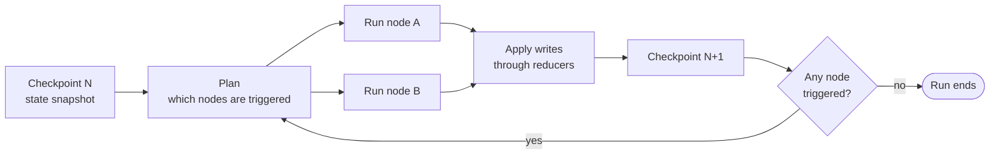
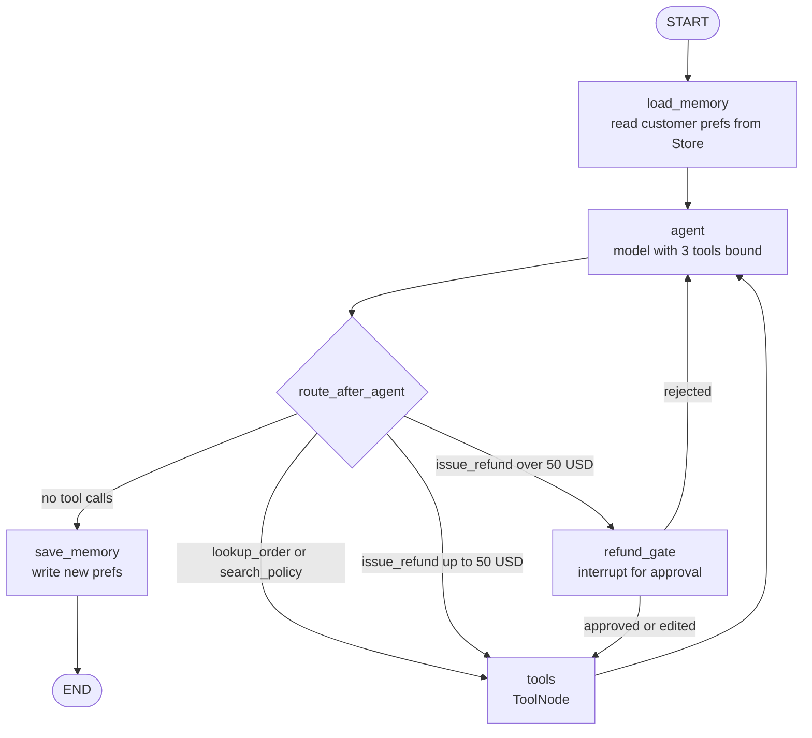
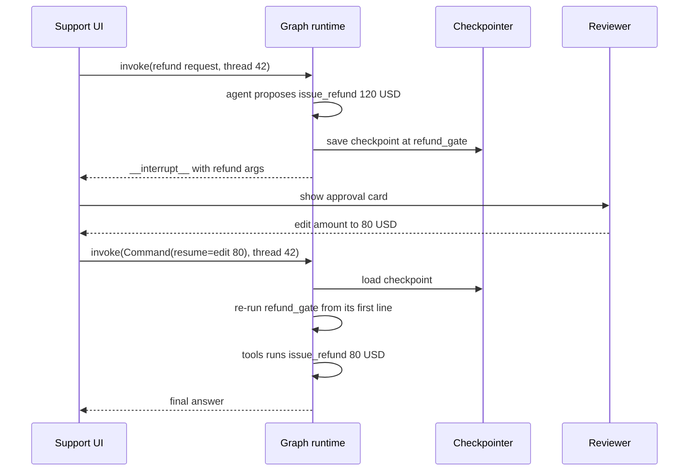
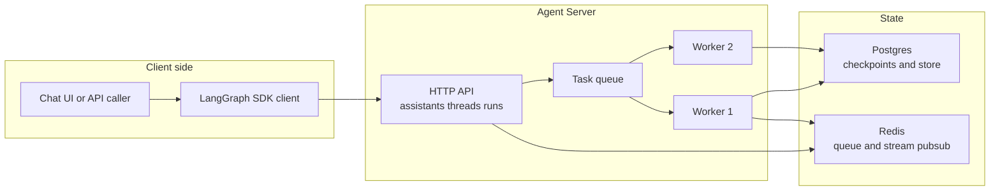
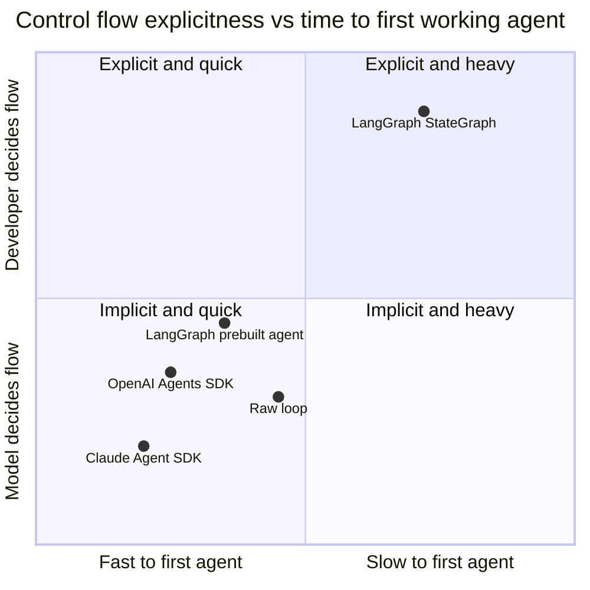
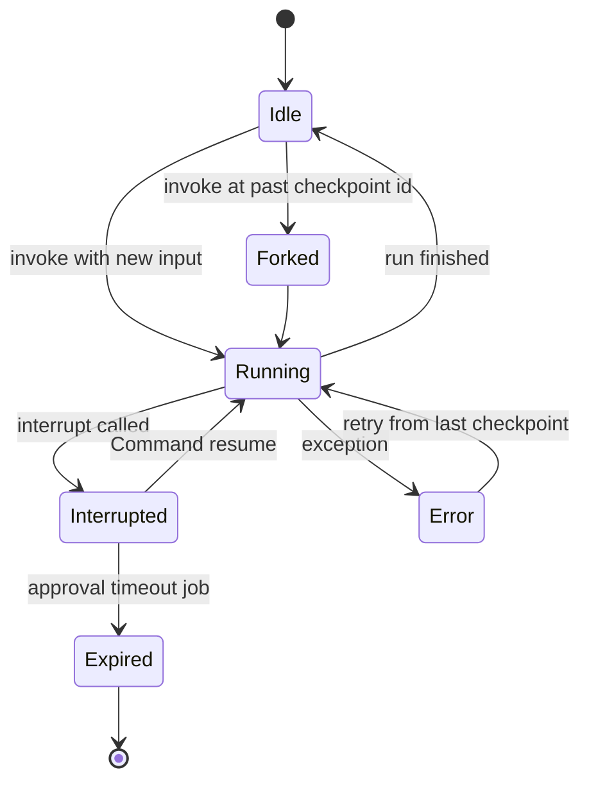

# Chapter 10: LangGraph

> **What this chapter covers**: LangGraph as an explicit state machine for agents: `StateGraph`, state schemas and reducers, conditional edges, `Command` and `Send`, checkpointers (in-memory, SQLite, Postgres, Redis, DynamoDB), `interrupt()` for human-in-the-loop, time travel, subgraphs, the long-term `Store`, streaming modes, durability modes, and LangGraph Platform (now LangSmith Deployment). Built to the Part III reference spec so it compares with Chapters 11 to 15.
>
> **Prerequisites**: Chapters 1, 2, 3, 5, 6, 8.
>
> **Where it is used**: Chapter 21 (multi-agent supervisors and swarms), Chapter 22 (checkpointing vs durable execution), Chapter 23 (approval gates and streaming UX), Chapter 28 (tracing), Chapter 32 (deployment), Chapter 36 (capstone 1 and 3).

---

## The Part III reference spec

Every framework chapter in Part III builds the same agent so the chapters compare. The spec is fixed.

| Element | Specification |
|---|---|
| Company | Harbor Home Goods, a synthetic online retailer |
| Task | Answer order questions, answer policy questions, issue refunds |
| Tool 1 | `lookup_order(order_id)` returns status, items, total, customer id |
| Tool 2 | `search_policy(query)` returns the top 3 policy passages with ids |
| Tool 3 | `issue_refund(order_id, amount_usd, reason)` writes to the payments system |
| Memory | Thread memory for the conversation, plus long-term customer preferences (for example "prefers store credit") |
| Approval gate | Any `issue_refund` above 50 USD pauses for a human; the human can approve, edit the amount, or reject |
| Tracing | Every model call and tool call traced with token counts and latency |
| Eval hook | 40 scripted tau-bench-style conversations with a pass/fail checker (Chapter 26) |

The chapter builds this in LangGraph in 10.2 and returns to its costs and failure modes in 10.3 and 10.4.

## 10.1 Level 1: Foundations

### What LangGraph is

LangGraph is a library for building agents as graphs of Python (or TypeScript) functions that read and write a shared state object. It is maintained by LangChain Inc. It does not require LangChain; you can call any model SDK inside a node. Version 1.0 shipped in October 2025, and the maintainers committed to no breaking changes until 2.0 (as of September 2026, check the release notes for the current minor version).

The core idea: an agent is a state machine. The model is one node among several. Control flow between nodes is either fixed (an edge) or decided at runtime (a conditional edge, or a node returning a `Command`). The runtime saves the state after every step, so a run can pause, resume, fork, or be replayed.

Compare this with the model-driven loop of Chapter 5. In a model-driven loop the harness is a `while` loop: call the model, run its tool calls, repeat until it stops. In LangGraph you can write exactly that loop as a two-node graph, but you can also insert deterministic steps (policy check, PII scrub, approval) at fixed positions the model cannot skip.

### Vocabulary

| Term | Meaning |
|---|---|
| State | A typed dict (or Pydantic model or dataclass) that flows through the graph |
| Channel | One key of the state; each has a reducer that decides how writes combine |
| Reducer | A function `(old, new) -> merged`; default is overwrite |
| Node | A function `state -> partial update` |
| Edge | A fixed transition from one node to the next |
| Conditional edge | A router function that returns the name of the next node |
| Super-step | One round in which all scheduled nodes run, possibly in parallel |
| Checkpointer | Persists a snapshot of state after each super-step, keyed by `thread_id` |
| Thread | One conversation or run history; the unit of short-term memory |
| Store | Cross-thread key-value memory with optional semantic search |
| Interrupt | A pause inside a node that surfaces a value to the caller and waits |
| `Command` | A node return value that updates state and chooses the next node |
| `Send` | A message that schedules a node with a custom input, used for fan-out |

### The execution model: Pregel super-steps

LangGraph's runtime is modelled on Google's Pregel (bulk synchronous parallel graph processing). Each super-step does three things:

1. Pick the nodes whose inputs changed in the previous step.
2. Run them, in parallel if more than one.
3. Apply their writes to the channels through the reducers, then save a checkpoint.

This explains three behaviours that confuse newcomers. Two parallel nodes that both write the same overwrite channel in the same step raise an `InvalidUpdateError`, because the runtime cannot choose. A reducer such as list append resolves this. And checkpoints are per super-step, not per node, so a failure mid-step replays the whole step.



### Why a graph and not a loop

A plain loop is simpler and often better (Chapter 15 makes the no-framework case). LangGraph earns its complexity when you need at least two of the following:

- Pause for a human for minutes to days, then resume in another process.
- Deterministic steps the model cannot bypass (compliance checks, redaction).
- Replay and fork from any past step for debugging.
- Parallel branches with a well-defined merge.
- Explicit multi-agent topologies (supervisor, swarm) with inspectable routing.

If you need none of these, a 60-line loop around a provider SDK is cheaper to own.

### Where it sits

| Framework style | Example | Control flow lives in |
|---|---|---|
| Graph, explicit | LangGraph | Your edges and routers |
| Model-driven loop | Claude Agent SDK, Strands | The model's tool choices |
| Handoff-based | OpenAI Agents SDK | The model's handoff choices plus your guardrails |
| Role-based | CrewAI | Task definitions and a process type |

LangGraph can express all the others; the reverse is not true without extra code. That flexibility is also its main cost: more decisions are yours.

## 10.2 Level 2: Working knowledge

### Defining state with reducers

State is a `TypedDict` whose keys can carry a reducer through `Annotated`. The prebuilt `add_messages` reducer appends messages, and replaces a message when a new one has the same id. That id rule is what makes edit-and-resume work.

```python
from typing import Annotated, TypedDict
from operator import add
from langgraph.graph.message import add_messages

class SupportState(TypedDict):
    messages: Annotated[list, add_messages]   # append or replace by id
    customer_id: str | None                   # overwrite
    tool_calls_made: Annotated[int, add]      # sum across writes
    pending_refund: dict | None               # overwrite
```

Design rules for state:

- Keep it small and serialisable. Every key is written to the checkpointer on every super-step.
- Store references (an order id, an S3 key) rather than blobs (a 2 MB PDF).
- Give every channel that parallel nodes write a reducer.
- Use separate input and output schemas when the caller should not see internals (`StateGraph(State, input_schema=..., output_schema=...)`; check the current parameter names in the API reference).

### Nodes, edges, and conditional edges

A node takes state and returns a partial update. The builder wires them.

```python
from langgraph.graph import StateGraph, START, END

builder = StateGraph(SupportState)
builder.add_node("agent", call_model)        # model with tools bound
builder.add_node("tools", run_tools)         # executes tool calls
builder.add_node("refund_gate", refund_gate) # approval step

builder.add_edge(START, "agent")
builder.add_conditional_edges("agent", route_after_agent,
                              ["tools", "refund_gate", END])
builder.add_edge("tools", "agent")
builder.add_edge("refund_gate", "tools")
graph = builder.compile(checkpointer=checkpointer, store=store)
```

`route_after_agent` inspects the last message. No tool calls: go to `END`. A call to `issue_refund` above 50 USD: go to `refund_gate`. Any other tool call: go to `tools`. The list of destinations is optional but lets the graph render correctly in Studio and in `graph.get_graph().draw_mermaid()`.

The prebuilt `ToolNode` and `tools_condition` in `langgraph.prebuilt` implement the tool node and the "any tool calls?" router. LangChain 1.0 also ships `create_agent`, which builds the standard model-tools loop with middleware hooks on top of LangGraph (as of late 2025; the older `create_react_agent` in `langgraph.prebuilt` was marked for deprecation, check current docs before choosing).

### The reference agent as a graph



### `Command`: update and route in one return

A node can return `Command(update={...}, goto="node_name")`. This replaces a node plus a conditional edge when the routing decision needs the node's own computation. It is also how agents in a swarm hand off: the active agent's tool returns a `Command` with `goto` set to the peer and `graph=Command.PARENT` to route in the parent graph.

```python
from langgraph.types import Command, interrupt

def refund_gate(state: SupportState) -> Command:
    call = state["messages"][-1].tool_calls[0]
    decision = interrupt({"action": "issue_refund", "args": call["args"]})
    if decision["type"] == "reject":
        msg = {"role": "tool", "tool_call_id": call["id"],
               "content": f"Refund rejected by reviewer: {decision['note']}"}
        return Command(update={"messages": [msg]}, goto="agent")
    if decision["type"] == "edit":
        call["args"]["amount_usd"] = decision["amount_usd"]
    return Command(update={"pending_refund": call["args"]}, goto="tools")
```

On reject the gate writes a tool message so the model sees why, rather than leaving an orphaned tool call (which most provider APIs reject on the next request). On edit the node rewrites the arguments. A cleaner production variant replaces the whole AI message by id so the trace shows what was actually executed.

### `Send`: dynamic fan-out

`Send(node_name, payload)` schedules a node with its own input. A router returning a list of `Send` objects runs them in parallel in the next super-step. This is the map step of map-reduce: one `Send` per sub-question in a research agent, with a list-append reducer collecting results. The reference agent does not need it; Chapter 21 does.

### Checkpointers

Compile with a checkpointer and pass a `thread_id` in the config. Every invocation on that thread resumes from the latest checkpoint.

```python
config = {"configurable": {"thread_id": "cust-8812-conv-3"}}
graph.invoke({"messages": [("user", "Where is order HH-1042?")]}, config)
graph.invoke({"messages": [("user", "Refund the lamp please")]}, config)
```

| Checkpointer | Package | Use |
|---|---|---|
| `InMemorySaver` | `langgraph` | Tests and notebooks; lost on restart |
| `SqliteSaver`, `AsyncSqliteSaver` | `langgraph-checkpoint-sqlite` | Local dev, single process |
| `PostgresSaver`, `AsyncPostgresSaver` | `langgraph-checkpoint-postgres` | Default production choice |
| `RedisSaver` (plus shallow variants) | `langgraph-checkpoint-redis` (Redis-maintained) | Low latency, TTL built in; needs Redis 8 or Redis Stack modules |
| `DynamoDBSaver` | `langgraph-checkpoint-aws` (AWS-maintained, in `langchain-aws`) | Serverless on AWS; large checkpoints offload to S3 |
| AgentCore Memory and Valkey savers | `langgraph-checkpoint-aws` | Bedrock AgentCore deployments |

Postgres, SQLite, and in-memory savers are maintained by LangChain. The Redis and AWS packages are maintained by those vendors, and their release cadence differs. Pin versions and run your own resume tests (Practice 4). Call `checkpointer.setup()` once to create tables; do not let every worker race to do it on startup.

### Interrupts for human-in-the-loop

`interrupt(value)` inside a node does four things: stops execution, saves a checkpoint, surfaces `value` to the caller, and waits indefinitely. With `invoke`, the pending interrupt appears under `result["__interrupt__"]`. Resume by invoking the same thread with `Command(resume=decision)`; the value becomes the return value of `interrupt()`.



The rule that causes most interrupt bugs: **on resume, the node restarts from its first line**, not from the `interrupt()` call. Anything before `interrupt()` runs again. So:

- Put side effects after the interrupt, or in a separate node after the gate.
- Make anything before it idempotent (reads are fine; a `send_email` is not).
- Do not wrap `interrupt()` in a bare `try/except`; it works by raising a special exception.
- If a node calls `interrupt()` more than once, resume values are matched by order, so never make the number or order of interrupts conditional on non-deterministic data.

Static breakpoints (`interrupt_before=[...]`, `interrupt_after=[...]` at compile or invoke time) also exist. The docs position them for debugging, not for production approvals.

### Time travel

Because every super-step is checkpointed, a thread is a history you can inspect and fork.

- `graph.get_state(config)` returns the latest `StateSnapshot`: values, the next nodes, pending tasks and interrupts, the checkpoint id.
- `graph.get_state_history(config)` yields every snapshot, newest first.
- `graph.update_state(config, values, as_node=...)` writes a new checkpoint as if a given node had produced `values`. Reducers apply.
- Invoking with a config that carries a past `checkpoint_id` replays from that point; nodes before it are not re-run, nodes after it run fresh. Any new write creates a fork, a new branch of history on the same thread.

Uses: reproduce a bad trajectory from the step before it went wrong, patch the state (say, fix a hallucinated order id), and continue; or run the same prefix with two prompts to compare.

### Subgraphs

A compiled graph can be a node in another graph. Two ways:

| Pattern | When | State handling |
|---|---|---|
| Add compiled subgraph as a node | Parent and child share state keys | Shared keys flow in and out automatically |
| Call subgraph inside a node function | Different schemas | You map parent state to child input and back |

Subgraphs inherit the parent's checkpointer; you compile the child without one. The child's checkpoints live under a namespace (`checkpoint_ns`), so an interrupt inside a subgraph surfaces to the parent caller and resumes correctly. You can compile a subgraph with `checkpointer=True` to give it persistent memory of its own across calls on the same thread (check the current docs for the exact semantics). Stream with `subgraphs=True` to see child events.

### The Store: long-term memory

The checkpointer is per thread. The `Store` holds data across threads, keyed by a namespace tuple and a key. The reference agent keeps customer preferences at namespace `("harbor", tenant_id, "customers", customer_id)`.

```python
def load_memory(state: SupportState, *, store) -> dict:
    ns = ("harbor", "t-01", "customers", state["customer_id"])
    prefs = store.search(ns, query="refund preference", limit=3)
    note = "; ".join(p.value["text"] for p in prefs) or "none"
    return {"messages": [("system", f"Known preferences: {note}")]}
```

`InMemoryStore` and `PostgresStore` (in `langgraph-checkpoint-postgres`) are the LangChain-maintained implementations; Redis and others exist from vendors. Configure an `index` with an embedding function and dimensions to enable semantic `search`; without it, `search` filters by namespace and metadata only. Chapter 8 covers what to write and when. In LangGraph the write policy is yours: a `save_memory` node that runs at the end, or a background job over finished threads.

### Streaming modes

`graph.stream(...)` and `astream(...)` take `stream_mode`, a single value or a list.

| Mode | Emits | Typical use |
|---|---|---|
| `values` | Full state after each step | Simple UIs, debugging |
| `updates` | Each node's partial update | Progress indicators per node |
| `messages` | `(token, metadata)` tuples from model calls | Token streaming to chat UI |
| `custom` | Anything a node emits with `get_stream_writer()` | Tool progress ("searching 3 of 5 sources") |
| `checkpoints` | Checkpoint events, same shape as `get_state()` | Audit, external mirroring |
| `tasks` | Task start and finish with results and errors | Fine-grained timelines |
| `debug` | Checkpoints plus tasks plus metadata | Deep debugging |

Pass `version="v2"` to get a uniform `{"type", "ns", "data"}` chunk shape across modes (as of September 2026; newer event APIs are appearing, check the streaming page). A production chat UI usually wants `["messages", "updates", "custom"]` together.

### Tracing

LangGraph emits traces to LangSmith when `LANGSMITH_TRACING=true` and an API key are set. For Langfuse or any OpenTelemetry backend, attach a callback handler in the config or use an OTel instrumentation (Chapter 28). Put `thread_id`, tenant id, and user id in trace metadata so traces join to checkpoints.

## 10.3 Level 3: Depth

### Checkpoint anatomy and write amplification

A checkpoint stores channel values, channel versions, the versions each node has seen, and pending writes. The versions let the planner decide which nodes are triggered. Pending writes matter for fault tolerance: when one of two parallel nodes succeeds and the other fails, the successful node's writes are saved as pending, so on retry only the failed node re-runs.

The cost is storage. Postgres checkpointers store each channel blob keyed by version, so an unchanged channel is not rewritten, but the `messages` channel changes every step. A worked estimate for the reference agent:

| Quantity | Value |
|---|---|
| Messages at end of a typical conversation | 24 |
| Average serialised message size (text plus tool JSON) | 1.2 KB |
| Super-steps per conversation | 14 |
| Messages blob written per step (grows from 1 to 24) | mean 12 messages, about 14 KB |
| Checkpoint bytes per conversation | 14 steps x 14 KB, about 200 KB |
| Conversations per day | 20,000 |
| New checkpoint data per day | about 4 GB |
| 90-day retention | about 360 GB |

Three levers: TTLs on checkpoints (Redis savers and LangSmith Deployment support TTL configuration; with Postgres you run a pruning job), shallow checkpointers that keep only the latest checkpoint per thread (you lose time travel), and the `durability` setting.

### Durability modes

Since LangGraph 0.6, `durability` controls when checkpoints are written.

| Mode | Behaviour | Crash mid-run loses | Latency cost |
|---|---|---|---|
| `"exit"` | Persist only when the run finishes or interrupts | Everything since the run started | Lowest |
| `"async"` | Persist in the background while the next step runs | At most the last step, small window | Low |
| `"sync"` | Persist before the next step starts | Nothing past the last completed step | One DB round trip per step |

For the reference agent a Postgres write in the same region is roughly 2 to 10 ms, and model calls are 800 to 3,000 ms, so `sync` costs under 1 percent of latency. Use `sync` whenever a step has a side effect. `exit` is for short, idempotent, high-volume graphs.

### Checkpointing is not durable execution

This distinction is the core of Chapter 22. A checkpointer saves state between super-steps. It does not journal the result of each external call inside a node. If a node calls `issue_refund` and the process dies before the super-step's checkpoint is saved, on resume the node runs again and the refund is issued twice.

Defences, in order of preference:

1. **Idempotency keys** on every write tool. Derive the key from `thread_id` plus the tool call id; the payments API deduplicates.
2. **Put the side effect in its own node** with nothing else, so the retry window is small and the node can check "already done?" first.
3. **Functional API `@task`**. In LangGraph's functional API (`@entrypoint` and `@task`), task results are saved to the checkpointer, so on resume a completed task returns its saved result instead of running again. This is closer to journal replay, scoped to that API.
4. **An external durable engine** (Temporal, DBOS, Restate) around the side effect, when money or irreversible actions are involved.

### Interrupt semantics in depth

Because resume re-runs the node, and interrupts are matched to resume values by index within the node, several edge cases follow.

- **Multiple pending interrupts.** Parallel branches can each interrupt in the same super-step. The caller receives several interrupts, each with an id, and can resume them together by passing a mapping from interrupt id to value (check the current API; this changed during 0.x).
- **Model calls before the interrupt.** If the node calls the model and then interrupts, resume calls the model again, with a different sample. The reviewer approved one refund amount and the graph proceeds with another. Put the model call in the previous node and have the gate node only read state. This is the single most common HITL bug in LangGraph code review.
- **Timeouts.** `interrupt()` waits forever. Expiry is your job: a scheduled job that resumes stale threads with `{"type": "reject", "note": "expired"}` after 48 hours.
- **Authorisation.** Anyone who can call `invoke` with the thread id can resume. The API layer must check that the resumer is an authorised reviewer for that tenant.

### Reducers and parallel merges

Reducers are where subtle state bugs hide.

- `add_messages` with a message missing an id assigns one. Two branches generating the "same" summary produce two messages.
- A custom reducer that is not associative gives order-dependent results when three parallel branches merge. Parallel writes in one step are applied in a deterministic order, but relying on that order couples your logic to scheduler internals.
- `RemoveMessage(id=...)` through `add_messages` deletes a message, which is how you implement tool result clearing and compaction (Chapter 6) inside graph state.
- Overwriting a list you meant to append to silently drops history. Unit test every reducer with two concurrent writes.

### Recursion limit and runaway graphs

Each super-step counts against `recursion_limit` (default 25 in older releases; newer releases raised the default, check your version's config reference). Hitting it raises `GraphRecursionError`. Treat this as the backstop, not the stop condition. The real stop conditions go in state: a `tool_calls_made` counter checked by the router, and a token or cost budget checked before each model call (Chapter 31).

### Failure modes

| Failure | Symptom | Root cause | Fix |
|---|---|---|---|
| Double side effect | Two refunds in the ledger | Node re-run after crash or on resume | Idempotency key; side effect after interrupt |
| Orphaned tool call | Provider 400 on next turn | Router skipped the tool node or gate rejected without a tool message | Always answer every tool call id |
| `InvalidUpdateError` | Crash at a parallel merge | Two nodes wrote one overwrite channel | Add reducer or split keys |
| State bloat | Slow steps, large DB | Blobs in state, unbounded messages | References, trimming, `RemoveMessage` |
| Lost interrupt | UI never shows approval | Using `stream` without reading interrupt events | Handle `__interrupt__` or the interrupt events |
| Wrong thread | Customer sees another's history | `thread_id` built from user-supplied data | Server-generated ids, tenant check |
| Schema drift on resume | Deserialisation error | Deployed a new state schema with old threads paused | Additive schema changes; migration for paused threads |

The last one deserves emphasis. A paused thread may resume weeks later on new code. Changing a node's name breaks resume for threads paused at that node. Treat node names and state keys as a public API once threads are in flight.

### Numbers for the reference agent

Assumptions: Claude Sonnet 5 at 2 USD per million input tokens and 10 USD per million output tokens (Anthropic pricing page, September 2026), 5-minute cache read at 0.1x. System prompt plus tool definitions: 2,400 tokens, cached. An average conversation makes 4 model calls. Average uncached input per call (history growth): 1,800 tokens. Output per call: 220 tokens.

| Line | Tokens per conversation | Cost |
|---|---|---|
| Cached prefix reads | 4 x 2,400 = 9,600 | 9,600 x 0.20 / 1M = 0.00192 USD |
| Uncached input | 4 x 1,800 = 7,200 | 7,200 x 2 / 1M = 0.0144 USD |
| Output | 4 x 220 = 880 | 880 x 10 / 1M = 0.0088 USD |
| Total | | about 0.025 USD |

Ignoring the first cache write, 20,000 conversations a day costs about 500 USD a day in tokens. LangGraph itself adds no token cost. It adds checkpoint I/O (about 14 writes per conversation) and, on LangSmith Deployment, per-node or per-run platform charges. Check current pricing; it has changed more than once.

### Latency budget for one refund turn

A user asks for a 30 USD refund on an order. The turn makes three model calls and two tool calls. Measured ranges are typical of a same-region deployment in 2026; treat them as a template, not a benchmark.

| Step | Work | Budget |
|---|---|---|
| Load checkpoint | One Postgres read | 5 ms |
| `load_memory` | Store search with embedding | 40 to 80 ms |
| Model call 1 | Decide to call `lookup_order` | 700 to 1,200 ms (TTFT about 400 ms with cached prefix) |
| `lookup_order` | Internal API | 80 ms |
| Model call 2 | Decide to call `issue_refund` | 700 to 1,200 ms |
| `issue_refund` | Payments API with idempotency key | 250 ms |
| Model call 3 | Final answer, streamed | 900 to 1,500 ms (first token shown at about 400 ms) |
| Checkpoint writes | 6 super-steps, `sync` | 6 x 5 ms = 30 ms |
| Total | | about 2.9 to 4.3 s, first visible token at about 1.5 s with progress events |

Two observations. Framework overhead (checkpoints, planning) is about 1 percent. The large lever is removing a model call: a deterministic `lookup_order` node when the message contains an order id pattern saves about a second, which is exactly the kind of change a graph makes easy and a pure model-driven loop makes awkward.

### The functional API

LangGraph also offers a functional API: decorate a function with `@entrypoint` (which accepts a checkpointer) and helper functions with `@task`. You write ordinary Python control flow (`if`, `for`, `while`) instead of edges. Tasks return futures, so several can run in parallel. `interrupt()` works the same way.

| Aspect | Graph API | Functional API |
|---|---|---|
| Control flow | Edges, routers, `Command` | Plain Python |
| Checkpoint granularity | Per super-step | Entrypoint state plus saved task results |
| Visualisation in Studio | Full graph | Opaque function |
| Resume after crash | Re-runs the step | Completed tasks return saved results |
| Best for | Inspectable topologies, multi-agent | Porting existing code, linear workflows with side effects |

The functional API is the better fit when a team already has a working Python workflow and wants persistence and HITL without rewriting it as a graph. The graph API is better when the topology itself is what reviewers and customers need to see.

### Multi-agent topologies in LangGraph

The companion libraries `langgraph-supervisor` and `langgraph-swarm` package two common topologies (Chapter 21 compares them in general).

- **Supervisor.** A supervisor agent has one handoff tool per worker. Workers return control to the supervisor after each task. Predictable, costs an extra model call per hop.
- **Swarm.** Each agent has handoff tools to its peers; the last active agent is stored in state so the next user message goes straight to it. Fewer hops, harder to reason about.

Both are built on the same primitives covered above: `Command(goto=..., graph=Command.PARENT)` for handoffs, shared `messages` state, and subgraphs. You can write either by hand in about 60 lines, which is worth doing once so you know what the packages do. The LangChain team has written that for many uses they now prefer the supervisor pattern built through tool calling over the prebuilt library (check the current guidance before adopting either package).

### Testing a LangGraph agent

Chapter 27 covers agent testing in general. Graph-specific practice:

- **Unit test nodes as functions.** A node is `state -> update`; call it with a fixture state and assert on the update. No model needed for routers and gates.
- **Mock the model at the node boundary.** Inject a fake chat model that returns scripted tool calls, then run the compiled graph with `InMemorySaver`.
- **Test resume explicitly.** Run to the interrupt, assert on `__interrupt__`, resume with each decision type, and assert the tool was called the right number of times.
- **Test crash recovery.** Raise inside a tool on first call, retry the thread, assert no duplicate side effect.
- **Snapshot the graph.** Commit the `draw_mermaid()` output; a diff in review shows topology changes.

## 10.4 Level 4: Mastery

### LangGraph Platform, now LangSmith Deployment

In October 2025 LangChain renamed LangGraph Platform to **LangSmith Deployment**, and LangGraph Studio to LangSmith Studio (LangChain changelog). The server component is the Agent Server (formerly LangGraph Server). Its API is built around:

- **Assistants**: a graph plus a configuration (model, prompt, tools), versioned.
- **Threads**: persistent state, backed by the platform's Postgres checkpointer.
- **Runs**: one invocation on a thread, foreground or background.
- **Cron jobs**: scheduled runs.
- **Double-texting strategies**: what happens when a user sends a second message while a run is active: `reject`, `enqueue`, `interrupt`, or `rollback`.
- **Store API** and **webhooks**, plus task queues and horizontal workers.

Deployment options have included cloud SaaS, hybrid (control plane in LangChain's cloud, data plane in your VPC), and fully self-hosted, with the self-hosted enterprise tier licensed. Names and tiers have shifted since 2024, so check the deployment docs for the current matrix before promising a customer a topology.

You do not need the platform to run LangGraph in production. The open-source library with a Postgres checkpointer behind your own FastAPI service is common. What you give up by self-hosting: double-texting handling, background run queues, cron, Studio integration, and managed scaling. You rebuild each one if you need it.



### Self-hosted production blueprint

For a customer that will not send data to a SaaS control plane, a typical FDE blueprint:

| Concern | Choice | Reason |
|---|---|---|
| API | FastAPI, one endpoint per operation (start, resume, get state) | Keeps interrupts explicit |
| Workers | Stateless containers; any worker can resume any thread | State lives in Postgres |
| Checkpointer | `AsyncPostgresSaver` with a connection pool, `durability="sync"` for tool-writing graphs | Correctness over microseconds |
| Store | `PostgresStore` with pgvector index, tenant in namespace prefix | One database to secure |
| Concurrency | Advisory lock per `thread_id` | Prevents two workers running the same thread (your double-texting policy) |
| Retention | Nightly prune of checkpoints older than N days except the latest per thread | Controls the 360 GB problem |
| Tracing | Langfuse via OTel, `thread_id` as session id | Joins traces to checkpoints |
| Approvals | Interrupt payload written to an approvals table; reviewer UI resumes via API | Audit trail outside the checkpoint blob |

The per-thread lock is not optional. Without it, a user double-clicking "send" launches two runs on one thread; both read checkpoint N and both write N+1, and one branch silently wins.

### Multi-tenant isolation

LangGraph has no tenant concept; the thread id is an opaque string. Enforce isolation in three places. Generate thread ids server-side and store `(tenant_id, thread_id)` in your own table. Prefix every Store namespace with the tenant and never let the model choose the namespace. Scope tool credentials per tenant through the runtime config or the `context` parameter (the runtime context API added in 0.6; check the current name), not through state, because state is persisted and visible in time travel.

### Versioning graphs with paused threads

When you change a graph, threads already in flight carry checkpoints produced by the old version. Safe changes: adding a node, adding an optional state key with a default, changing a prompt. Unsafe: renaming or removing a node where threads are paused, changing a key's type, changing a reducer. Strategies, in order of effort:

1. Drain: stop starting new threads on the old version, let paused ones finish or expire.
2. Run both versions side by side; route by the version stored with the thread (LangSmith Deployment assistants versioning does this).
3. Migrate: load each paused checkpoint, transform state, write with `update_state`.

### Graph design heuristics

- **Deterministic where you can, model where you must.** Policy lookup before the model call is a fixed edge, not a tool the model may forget.
- **One side effect per node.** Makes retries safe and traces readable.
- **Routers read state, not the model's prose.** Route on structured tool calls or a structured output field, never on regex over free text.
- **Keep the graph under 15 nodes.** Beyond that, extract subgraphs with clear input and output schemas.
- **Prefer a model-driven inner loop inside a node for open-ended work,** and the graph for the outer guard rails. A common pattern: an outer graph of intake, agent, approval, summarise, where "agent" is itself the prebuilt tool loop.

### Where practitioners disagree

| Question | For LangGraph | Against |
|---|---|---|
| Is explicit graph control needed with 2026 models? | Compliance steps and approvals must be unbypassable | Strong models follow tool loops well; graphs add ceremony (Anthropic's "building effective agents" guidance favours simple loops) |
| Checkpoints enough for durability? | Fine for most chat agents with idempotent tools | Money-moving and long-running work need journal replay (Temporal and DBOS advocates) |
| Abstraction weight | The prebuilt layer gets you started fast | Frequent API churn in 2024 and 2025 (MessageGraph removed, create_react_agent moved) burned early adopters; 1.0 promised stability |
| Platform lock-in | Open-source runtime, portable checkpoints | Studio, double-texting, cron, and assistants are platform features you rebuild if you leave |

Where the vendor marketing overreaches: "durable execution" in LangGraph docs means resumable from checkpoints, which is weaker than the Temporal meaning. Say so to customers.

### Portability to the other chapters

Mapping the reference spec across frameworks:

| Spec element | LangGraph | Claude Agent SDK (Ch 11) | OpenAI Agents SDK (Ch 12) |
|---|---|---|---|
| Loop | Graph with agent and tool nodes | Built into `query()` | Built into `Runner` |
| Tools | Functions bound to the model, `ToolNode` | In-process MCP server | `@function_tool` |
| Thread memory | Checkpointer | Session transcript on disk or `SessionStore` | `Session` classes |
| Long-term memory | `Store` | Files, memory tool, or your MCP server | Your own store via a tool |
| Approval gate | `interrupt()` plus `Command(resume=)` | `canUseTool` callback or `PreToolUse` hook | `needs_approval` plus `RunState` |
| Tracing | LangSmith or OTel callbacks | OTel export from Claude Code, or hooks | Built-in tracing with processors |



The placements are the author's judgment, not a benchmark.

### Reliability arithmetic: where the graph helps

Suppose on the 40 scripted conversations the model-driven version of the reference agent has these per-conversation failure sources, measured over 200 runs:

| Failure source | Rate per conversation |
|---|---|
| Forgot to check refund policy before refunding | 6 percent |
| Wrong order id passed to a tool | 3 percent |
| Final answer contradicts a tool result | 2 percent |
| Other | 2 percent |
| Pass rate (pass@1) | about 87 percent |

Moving the policy check to a fixed edge (`search_policy` runs deterministically before any `issue_refund` reaches the gate) removes the first source by construction. A deterministic validator node that checks order ids against the customer's orders before the tool runs removes most of the second. If those two changes take pass@1 from 0.87 to about 0.95, the effect on consistency is larger than it looks. For pass^k (all of k independent trials succeed, Chapter 26), assuming independence:

| k | pass^k at 0.87 | pass^k at 0.95 |
|---|---|---|
| 1 | 0.87 | 0.95 |
| 3 | 0.66 | 0.86 |
| 8 | 0.33 | 0.66 |

This is the honest case for explicit graphs: they convert classes of model error into structural impossibilities. The case against is that each structural rule is code you maintain, and a rule that is wrong fails every time, not 6 percent of the time. Independence is also an approximation; failures on hard conversations correlate, so measure pass^k directly rather than computing it.

### A decision record for Harbor Home Goods

The following is a template for the design doc Chapter 35 asks for, filled for this chapter's agent.

| Field | Content |
|---|---|
| Decision | Build the support agent on open-source LangGraph with Postgres, self-hosted in the customer's VPC |
| Drivers | Refund approvals wait up to 5 days; compliance requires a policy check that cannot be skipped; customer security review rejects SaaS control planes |
| Rejected: LangSmith Deployment | Hybrid option viable later; team prefers one control plane for now |
| Rejected: model-driven SDK only | No unbypassable policy step without extra hook code; approval pause spans processes |
| Rejected: Temporal around a loop | Durable, but adds a second platform for a team of three; revisit if refund volume passes 5,000 a day |
| Risks | Checkpoint storage growth, schema changes with paused threads, per-thread concurrency |
| Mitigations | 30-day prune, additive schema policy with a resume test in CI, advisory locks |
| Exit cost | Graph nodes are plain functions; moving to another framework rewrites wiring, not logic |

### Lifecycle of a thread



### Facts to re-check before a customer meeting

These moved at least once between 2024 and 2026. Verify them on the day.

| Fact | Value as of September 2026 | Where to check |
|---|---|---|
| Library major version | 1.x, stability promise until 2.0 | LangGraph release notes |
| Hosted product name | LangSmith Deployment (formerly LangGraph Platform) | LangChain changelog |
| Studio name | LangSmith Studio | LangChain changelog |
| Prebuilt agent entry point | `create_agent` in LangChain 1.x; `create_react_agent` deprecated | LangChain agents docs |
| Durability modes | `exit`, `async`, `sync` | Durable execution docs |
| Stream modes | values, updates, messages, custom, checkpoints, tasks, debug | Streaming docs |
| Redis saver requirements | Redis 8 or Redis Stack, LangGraph 1.0 or later | langgraph-redis README |
| DynamoDB saver | `DynamoDBSaver` in `langgraph-checkpoint-aws`, S3 offload | AWS DynamoDB developer guide |
| Deployment tiers and pricing | Changed several times | LangSmith pricing page |

Rule of thumb for an FDE: quote mechanisms from memory, quote names, tiers, and prices from the docs page open in front of you.

## 10.5 Subtopic checklist

- [x] `StateGraph`, nodes, edges, compile (10.2)
- [x] State schemas and reducers, `add_messages`, parallel merge rules (10.2, 10.3)
- [x] Conditional edges and routers (10.2)
- [x] `Command` and `Send` (10.2)
- [x] Checkpointers: in-memory, SQLite, Postgres, Redis, DynamoDB, maintainers and packages (10.2)
- [x] Checkpoint anatomy, storage arithmetic, TTLs, shallow savers (10.3)
- [x] Durability modes (10.3)
- [x] Interrupts for HITL, resume semantics, re-execution rule, multiple interrupts, timeouts (10.2, 10.3)
- [x] Time travel: history, update_state, forks (10.2)
- [x] Subgraphs, namespaces, checkpointer inheritance (10.2)
- [x] Store for long-term memory, namespaces, semantic search (10.2)
- [x] LangGraph Platform, renamed LangSmith Deployment; assistants, threads, runs, cron, double-texting (10.4)
- [x] Streaming modes and v2 format (10.2)
- [x] Tracing (10.2)
- [x] Checkpointing vs durable execution, idempotency (10.3)
- [x] Reference spec built and costed (10.2, 10.3)
- [x] Multi-tenancy and versioning with paused threads (10.4)

## 10.6 Common misconceptions

1. **"LangGraph requires LangChain."** It does not. Nodes are plain functions; call any SDK. LangChain chat models are convenient, not required.
2. **"On resume, execution continues from the `interrupt()` line."** The whole node re-runs from its first line. Code before the interrupt executes twice.
3. **"A checkpointer makes my agent durable like Temporal."** It saves state between super-steps. A crash inside a node repeats the node, including its side effects.
4. **"Checkpoints are saved after every node."** They are saved after every super-step. Parallel nodes share one checkpoint.
5. **"Thread memory and long-term memory are the same thing."** The checkpointer is per thread; the Store is cross-thread. Mixing them leaks one customer's data into another's context or loses preferences between conversations.
6. **"`recursion_limit` is my stop condition."** It is a crash backstop. Budget and turn limits belong in state and routers.
7. **"Static `interrupt_before` is the way to do approvals."** The docs recommend dynamic `interrupt()` for production HITL; static breakpoints are for debugging.
8. **"Time travel re-runs everything from the start."** Replaying from a checkpoint id skips earlier steps and re-executes only what comes after, creating a fork.
9. **"LangGraph Platform is gone."** It was renamed LangSmith Deployment in October 2025; the capabilities continue.
10. **"Any worker can safely pick up any request for a thread."** Only with a per-thread lock. Without one, concurrent runs on one thread race.

## 10.7 Practice

1. **Conceptual.** Two parallel nodes each write `summary: str`. Explain what happens, why, and two fixes. Then explain what changes if the key uses `add_messages`.
2. **Hands-on (laptop, free).** Build the reference agent with `InMemorySaver` and a local model through Ollama (Qwen2.5 7B at Q4 fits in 8 GB with a 8k context). Mock the three tools with a JSON file of 50 synthetic orders. Run 10 conversations and print `get_state_history` for one.
3. **Hands-on.** Add the refund gate with `interrupt()`. Put a `print("side effect")` before the interrupt and observe it run twice. Move it after. Write a pytest that asserts `issue_refund` is called exactly once per approved refund.
4. **Hands-on (Docker in WSL2).** Swap to `PostgresSaver` in a Postgres container. Start a conversation, kill the Python process with `kill -9` mid-run, restart, resume. Measure checkpoint rows and bytes per conversation and compare with the 10.3 estimate.
5. **Design.** A customer wants refund approvals to wait up to 5 business days and be resumable by any of 12 reviewers. Design the expiry job, the authorisation check, and the audit table. Where do you store the reviewer's identity?
6. **Hands-on.** Use time travel to fix a trajectory: seed a conversation where the model looks up the wrong order id, find the checkpoint before the tool call, `update_state` the tool call arguments, and continue. Record the fork in your trace backend.
7. **Design.** You must add a new node between `agent` and `tools` in a graph with 3,000 threads paused at `refund_gate`. Write the migration plan and the test that proves paused threads still resume.
8. **Measurement.** Stream with `["messages", "updates", "custom"]` and build a terminal UI showing tokens, node transitions, and "searching policy" progress. Measure time to first token with and without a cached system prompt.
9. **Conceptual.** Rewrite `refund_gate` so a model call before the gate cannot change the amount after approval. Explain why your version is safe under resume.
10. **Eval.** Run the 40 scripted conversations 5 times each. Report pass@1 and pass^5 with bootstrap 95 percent intervals (Chapter 26), and keep the numbers for the Chapter 11 and 12 comparisons.

## 10.8 How this is tested

<details><summary>Explain LangGraph's execution model. What is a super-step?</summary>

LangGraph uses a Pregel-style bulk synchronous model. In each super-step the runtime selects nodes whose input channels changed, runs them (in parallel if several), applies their writes through each channel's reducer, and saves a checkpoint. The run ends when no node is triggered. Consequences: parallel nodes share one checkpoint, conflicting writes to an overwrite channel raise an error, and a failure replays the step's failed tasks while successful tasks' writes are kept as pending writes.
</details>

<details><summary>What does a reducer do, and when do you need a custom one?</summary>

A reducer defines how a write to a state key merges with the current value. The default overwrites. `add_messages` appends and replaces by id; `operator.add` concatenates or sums. You need a non-default reducer whenever two nodes may write the same key in one super-step, or when you want append semantics. A custom reducer should be associative and deterministic, and you should unit test it with concurrent writes.
</details>

<details><summary>Walk through an approval gate with interrupt(). What is the most common bug?</summary>

The gate node calls `interrupt(payload)`. The runtime saves a checkpoint and returns the payload to the caller under `__interrupt__`. The UI shows it to a reviewer. The caller resumes by invoking the same thread with `Command(resume=decision)`, and `interrupt()` returns the decision. The common bug: the node re-runs from its first line on resume, so any side effect or model call before `interrupt()` runs again. A model call before the interrupt can even produce different arguments from the ones the reviewer approved. Keep gate nodes pure: read state, interrupt, then act.
</details>

<details><summary>Is a LangGraph checkpointer durable execution? Defend your answer.</summary>

Not in the Temporal sense. A checkpointer saves state between super-steps; it does not journal each external call inside a node. If the process crashes after a tool has charged a card but before the checkpoint is written, the node runs again on resume. The functional API's `@task` saves task results, which gets closer. For irreversible actions you still need idempotency keys or a durable engine. Checkpointing gives resumability and time travel, which is enough for most chat agents with idempotent tools.
</details>

<details><summary>Compare the three durability modes and pick one for a refund agent.</summary>

`exit` persists only at the end or at an interrupt, so it is fastest but loses the whole run on a crash. `async` persists in the background during the next step, with a small loss window. `sync` persists before the next step, so nothing past the last completed step is lost. For a refund agent use `sync`: a Postgres write is a few milliseconds against model calls of about a second, and the agent has side effects.
</details>

<details><summary>How do thread memory and long-term memory differ in LangGraph?</summary>

Thread memory is the checkpointed state of one `thread_id`, typically the message history plus working fields. Long-term memory is the `Store`, a namespaced key-value store (optionally with semantic search) shared across threads. Customer preferences belong in the Store under a tenant and customer namespace. The conversation belongs in the thread. You write to the Store deliberately, from a node or a background job, with a write policy.
</details>

<details><summary>How would you debug a production trajectory that went wrong at step 7?</summary>

Pull the thread's history with `get_state_history`, find the checkpoint just before step 7, and inspect the state and the pending node. Reproduce by invoking with that checkpoint id; only later steps re-run. To test a fix, `update_state` the offending value (for example the tool arguments), or change the prompt, and continue, which creates a fork. Compare the fork's trace with the original. This is only possible because every super-step was checkpointed and the trace carries the thread id.
</details>

<details><summary>When would you choose LangGraph over a model-driven SDK?</summary>

When the workflow has steps that must run regardless of the model's choices (compliance, redaction, approvals), when runs pause for humans and resume in other processes, when you need replay and forking for debugging or evaluation, or when the topology is explicitly multi-agent. For a single open-ended coding or research task with a good harness, a model-driven SDK gets further faster. A common hybrid puts a model-driven loop inside one node of an outer LangGraph workflow.
</details>

<details><summary>What is Send used for? Give an example.</summary>

`Send(node, payload)` schedules a node with a custom input. A router that returns a list of `Send` objects fans out: each runs in parallel in the next super-step with its own payload, and a reducer collects the results. Example: a research agent splits a question into five sub-questions and sends each to a `research` node; results append to `findings`, and a `synthesise` node runs after all complete.
</details>

<details><summary>What changes when you move from open-source LangGraph to LangSmith Deployment?</summary>

You get a managed Agent Server with assistants (versioned graph configs), threads backed by a Postgres checkpointer, background runs and a task queue, cron jobs, double-texting strategies (reject, enqueue, interrupt, rollback), a Store API, webhooks, Studio integration, and managed scaling. You give up some control over the data plane depending on the deployment option, and you take on platform pricing. The graph code is the same. LangGraph Platform was renamed LangSmith Deployment in October 2025.
</details>

<details><summary>You deploy a new graph version. Some threads are paused at an interrupt. What can break?</summary>

A paused thread resumes on the new code with the old checkpoint. If you renamed or removed the node it is paused at, resume fails. If you changed a key's type or a reducer, deserialisation or merge may fail or silently misbehave. Mitigate with additive-only changes, running old and new versions side by side and routing by the version stored per thread, or a migration that loads each paused checkpoint and rewrites it with `update_state`. Test resume of a paused thread in CI.
</details>

<details><summary>How do you prevent two concurrent runs on the same thread?</summary>

Two runs on one thread both read the latest checkpoint and both write a successor, so one branch of work is lost or tool calls repeat. Self-hosted, take a per-thread lock (a Postgres advisory lock on a hash of the thread id) for the duration of a run, and define a policy for a second message: reject it, queue it, or interrupt the first run. LangSmith Deployment exposes this as double-texting strategies.
</details>

<details><summary>Estimate checkpoint storage for 20,000 conversations a day.</summary>

With about 14 super-steps per conversation and a messages channel averaging about 14 KB per write, each conversation writes about 200 KB, so 20,000 a day is about 4 GB a day and about 360 GB over 90 days. Reduce with TTLs or pruning, shallow checkpointers where time travel is not needed, trimming or clearing large tool results, and keeping blobs out of state.
</details>

<details><summary>Where must tenant isolation be enforced in a LangGraph deployment?</summary>

LangGraph has no tenant model. Enforce it at the API layer by generating thread ids server-side and mapping them to tenants, at the Store by prefixing every namespace with the tenant id chosen by code (never by the model), and at tool execution by passing tenant-scoped credentials through runtime config or context rather than state. Also check authorisation on resume, since anyone who can resume a thread can approve its pending action.
</details>

<details><summary>When would you use the functional API instead of the graph API?</summary>

When a team already has working Python control flow and wants persistence, interrupts, and crash recovery without rewriting it as nodes and edges. `@entrypoint` provides the checkpointed run and `@task` wraps side-effecting steps whose results are saved, so completed tasks are not repeated on resume. The graph API is better when the topology must be visible and reviewable, as in multi-agent systems or compliance workflows.
</details>

<details><summary>How can an explicit graph improve pass^k, and what is the catch?</summary>

It turns some model error classes into structural impossibilities, for example a fixed edge that always runs the policy check before a refund. If that lifts pass@1 from 0.87 to 0.95, pass^8 roughly doubles under an independence assumption (0.33 to 0.66). The catch is that each rule is code: a wrong rule fails on every run, and failures on hard cases correlate, so measure pass^k directly instead of computing it.
</details>

<details><summary>Why should routers read structured state rather than the model's prose?</summary>

Routing on free text (for example a regex for the word refund in the model's reply) breaks when the model rephrases, and it can be steered by injected text. Routing on structured tool calls or a validated structured-output field is deterministic and testable without the model. The router becomes a pure function of state that you unit test.
</details>

## 10.9 Summary

- LangGraph models an agent as a state machine: typed state, nodes that return partial updates, and fixed or conditional edges.
- The runtime runs Pregel-style super-steps and checkpoints after each one, keyed by `thread_id`.
- Reducers decide how writes merge; parallel writers to one key need a reducer.
- `Command` combines a state update with routing; `Send` fans out to parallel nodes.
- Checkpointers exist for memory, SQLite, Postgres (LangChain-maintained), Redis (Redis-maintained), and DynamoDB (AWS-maintained); Postgres is the default production choice.
- `interrupt()` plus `Command(resume=...)` implements approval gates; on resume the node re-runs from the top, so keep gate nodes free of side effects and model calls.
- Time travel (`get_state_history`, `update_state`, replay from a checkpoint id) enables debugging and forking.
- The Store holds cross-thread memory under namespaces; tenant prefixes are your job.
- Seven stream modes; production chat UIs usually combine `messages`, `updates`, and `custom`.
- Durability modes `exit`, `async`, `sync` trade latency against loss on crash; use `sync` for side effects.
- Checkpointing is not durable execution; use idempotency keys or a durable engine for irreversible actions.
- LangGraph Platform is now LangSmith Deployment (October 2025); you can self-host the open-source runtime but rebuild queues, cron, and double-texting.
- The reference support agent costs about 0.025 USD per conversation on Sonnet 5 with caching; LangGraph adds I/O, not tokens.

## 10.10 Further reading

- LangGraph documentation, Overview and Graph API (docs.langchain.com/oss/python/langgraph): the primary reference for `StateGraph`, reducers, `Command`, and `Send`.
- LangGraph documentation, Persistence: checkpointers, threads, the Store, and memory.
- LangGraph documentation, Interrupts: `interrupt()`, `Command(resume=...)`, and the node re-execution rule.
- LangGraph documentation, Streaming: the stream modes and the v2 chunk format.
- LangGraph documentation, Durable execution: durability modes and the functional API's task semantics.
- LangChain changelog, "Product naming changes: LangSmith Deployment and LangSmith Studio" (October 2025): the rename.
- LangSmith Deployment documentation (docs.langchain.com/langsmith/deployment): assistants, threads, runs, cron, double-texting, deployment options.
- `langgraph-checkpoint-redis` (github.com/redis-developer/langgraph-redis): the Redis saver and store, TTL and version requirements.
- AWS, "Using DynamoDB as a checkpoint store for LangGraph agents" (DynamoDB developer guide): `DynamoDBSaver` with S3 offload.
- Malewicz et al., "Pregel: A System for Large-Scale Graph Processing" (SIGMOD 2010): the execution model LangGraph borrows.
- Anthropic, "Building effective agents" (December 2024): the counterpoint that simple loops often beat frameworks.
