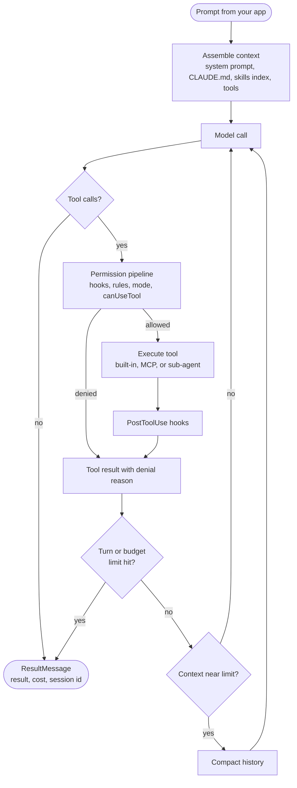
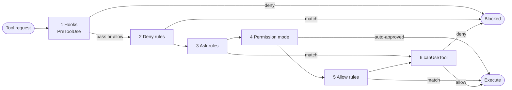
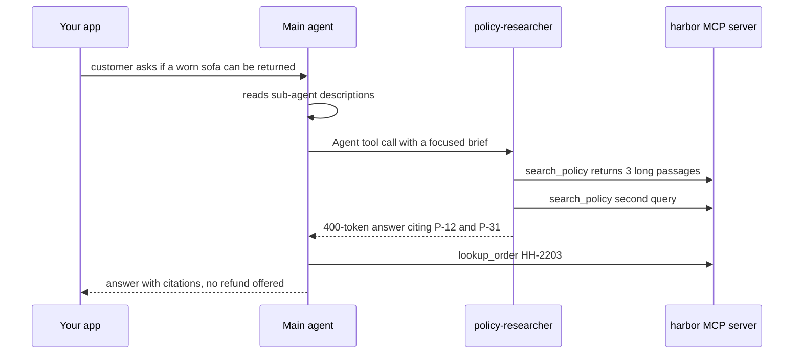
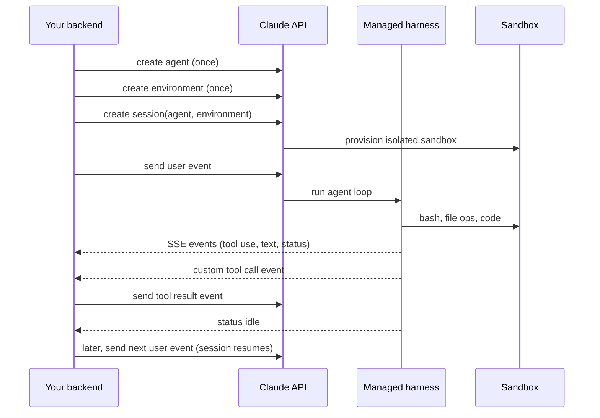
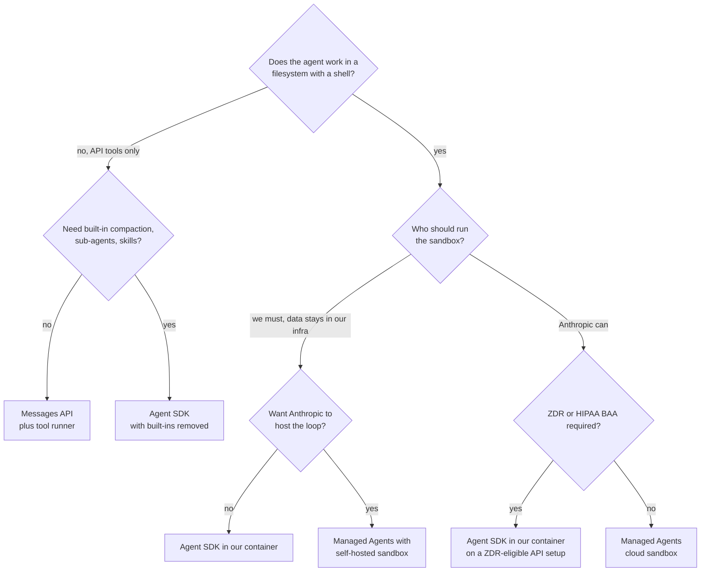
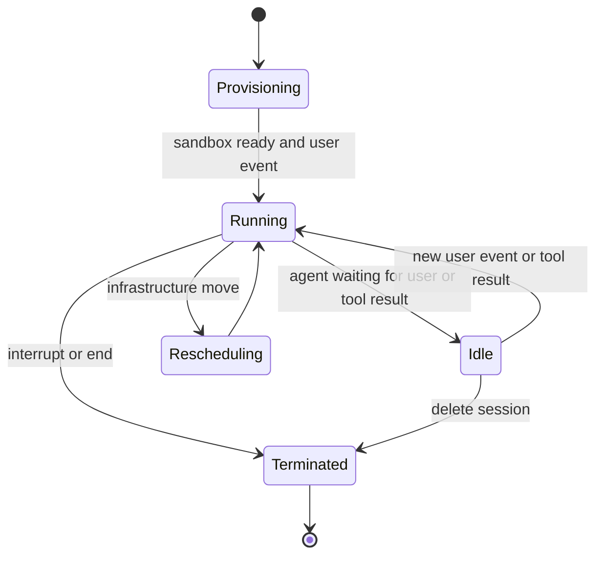

# Chapter 11: Claude Agent SDK and Managed Agents

> **What this chapter covers**: Anthropic's three ways to run an agent. The Claude Agent SDK (the Claude Code harness as a Python and TypeScript library): `query()` and `ClaudeSDKClient`, built-in tools, permission modes and evaluation order, hooks, sub-agents, skills, MCP, sessions, budgets. Claude Managed Agents (a hosted harness with cloud or self-hosted sandboxes, in public beta since April 2026). The Claude API platform tools an agent uses directly: web search, web fetch, code execution, the Files API, tool search, the MCP connector, and the tool runner. The Part III reference agent built on the SDK.
>
> **Prerequisites**: Chapters 3, 4, 5, 6, 7, 10 (for the reference spec).
>
> **Where it is used**: Chapter 16 (MCP), Chapter 19 (cloud platforms), Chapter 21 (sub-agents), Chapter 24 (sandboxes), Chapter 29 (permissions and hooks as security controls), Chapter 32 (deployment), Chapter 36 (capstone 1).

---

## 11.1 Level 1: Foundations

### Three products, one harness idea

Anthropic ships its agent loop in three forms. Knowing which one a customer means is the first question in any scoping call.

| Product | Who runs the loop | Where tools execute | You get |
|---|---|---|---|
| Client SDK with the tool runner | Your code (the SDK helper drives the loop) | Your process | Messages API plus a loop helper, nothing else built in |
| Claude Agent SDK | Your process, running the Claude Code binary | Your machine or container | Claude Code's tools, permissions, hooks, sub-agents, skills, sessions, compaction |
| Claude Managed Agents | Anthropic's servers | An Anthropic cloud sandbox, or a self-hosted sandbox you run | A hosted harness, persistent sessions, events over SSE, scheduled runs |

The Agent SDK was called the Claude Code SDK until late September 2025, when it was renamed because it is used far beyond coding; there is a migration guide from the old packages (`claude-code-sdk` in Python). Managed Agents launched in public beta on 8 April 2026.

The three share a design stance that differs from LangGraph (Chapter 10): **the model drives the control flow.** You do not draw edges. You give the model tools, a system prompt, and permissions, and the harness runs the loop until the model stops, a limit trips, or a permission denies an action. Your control points are the tool surface, the permission system, hooks, and budgets.

### Why "the Claude Code harness as a library" matters

A good harness moves agent benchmark scores more than a model swap (Chapter 5). The Agent SDK gives you the harness Anthropic tunes for its own product: the agent loop, context management and automatic compaction, prompt caching, the file editing tools, the bash tool with its safety checks, sub-agent orchestration, and the permission system. You inherit years of iteration. You also inherit its opinions: it is built for an agent that works in a filesystem with a shell.

That second point is the key scoping question. The SDK shines when the agent's work looks like "operate on files and run commands": coding, data analysis, document processing, ops runbooks, research that writes a report. For a pure chat support agent with three API tools and no filesystem, most of the harness is unused weight, and the Messages API with the tool runner is often the better fit. The reference agent in 11.2 uses the SDK anyway so the chapters compare; 11.4 returns to the choice.

### Vocabulary

| Term | Meaning |
|---|---|
| `query()` | Async generator that runs one agent session and yields messages |
| `ClaudeSDKClient` | Python client holding a session across several queries, with interrupts |
| `ClaudeAgentOptions` | Python options object (TypeScript: `Options`) |
| Built-in tools | `Read`, `Write`, `Edit`, `Bash`, `Glob`, `Grep`, `WebSearch`, `WebFetch`, `Agent`, `AskUserQuestion`, and others |
| Permission mode | Global policy for approvals: `default`, `dontAsk`, `acceptEdits`, `bypassPermissions`, `plan`, `auto` |
| Allow and deny rules | `allowed_tools` and `disallowed_tools`, plus rules from settings files |
| `canUseTool` | Your callback for approvals no earlier step resolved |
| Hook | A callback on a lifecycle event such as `PreToolUse` |
| Sub-agent | A separate agent with its own context, prompt, and tool set, called via the `Agent` tool |
| Skill | A folder with a `SKILL.md` loaded progressively when relevant |
| SDK MCP server | An in-process MCP server built with `@tool` and `create_sdk_mcp_server` |
| Session | The persisted transcript of a run; resumable and forkable |
| Setting sources | Which filesystem config to load: `user`, `project`, `local` |

### The loop



## 11.2 Level 2: Working knowledge

### Packages and entry points

| Language | Package | Entry points |
|---|---|---|
| Python | `claude-agent-sdk` | `query()`, `ClaudeSDKClient`, `ClaudeAgentOptions`, `@tool`, `create_sdk_mcp_server` |
| TypeScript | `@anthropic-ai/claude-agent-sdk` | `query()`, `tool()`, `createSdkMcpServer()` |

The SDK runs the Claude Code binary as a subprocess and talks to it over a structured stream. Authentication uses an API key (or Bedrock, Vertex AI, or Foundry credentials). Anthropic does not permit third-party products built on the SDK to offer claude.ai login or subscription rate limits unless approved (Agent SDK overview, September 2026).

Use `query()` for one task. Use `ClaudeSDKClient` (Python) when you need several exchanges in one session, mid-run interrupts, or to change the permission mode while running. In TypeScript, pass `continue: true` or `resume` on later `query()` calls; the experimental V2 session API was removed in TypeScript SDK 0.3.142.

### Key options

These are the options the reference agent uses. The Python reference lists many more (as of September 2026).

| Option (Python) | Purpose |
|---|---|
| `system_prompt` | A string, or a preset such as the Claude Code prompt with an append |
| `model`, `fallback_model` | Model alias or id, and a fallback |
| `tools`, `allowed_tools`, `disallowed_tools` | Tool set, auto-approved tools, removed or denied tools |
| `permission_mode` | One of the six modes |
| `can_use_tool` | Async approval callback |
| `hooks` | Map from hook event to a list of `HookMatcher` |
| `agents` | Map of sub-agent name to `AgentDefinition` |
| `mcp_servers` | MCP servers: stdio, HTTP, or in-process SDK servers |
| `setting_sources` | Which of `user`, `project`, `local` settings to load |
| `skills` | Skills available to the session, or `"all"` |
| `max_turns`, `max_budget_usd` | Hard limits on turns and spend |
| `resume`, `fork_session`, `continue_conversation` | Session continuation |
| `session_store` | Mirror transcripts to your own backend |
| `output_format` | JSON Schema for a validated structured final result |
| `thinking`, `effort` | Reasoning behaviour (Chapter 4) |
| `cwd`, `env`, `sandbox` | Working directory, environment, sandbox settings |
| `enable_file_checkpointing` | Track file edits so they can be rewound |

### Defining the reference tools as an SDK MCP server

Custom tools in the SDK are MCP tools. For tools in your own process, build an in-process server: no subprocess, no network hop.

```python
from claude_agent_sdk import tool, create_sdk_mcp_server

@tool("lookup_order", "Look up a Harbor order by id. Returns status, "
      "items, total_usd, customer_id.", {"order_id": str})
async def lookup_order(args):
    order = await orders_api.get(args["order_id"])
    return {"content": [{"type": "text", "text": order.to_json()}]}

@tool("issue_refund", "Refund part or all of an order. Irreversible.",
      {"order_id": str, "amount_usd": float, "reason": str})
async def issue_refund(args):
    key = f"{args['order_id']}:{args['amount_usd']}:{current_session_id()}"
    r = await payments.refund(**args, idempotency_key=key)
    return {"content": [{"type": "text", "text": r.to_json()}]}

harbor = create_sdk_mcp_server(name="harbor", version="1.0.0",
                               tools=[lookup_order, search_policy, issue_refund])
```

Tools are exposed to the model as `mcp__<server>__<tool>`, here `mcp__harbor__issue_refund`. Permission rules, hooks, and traces use that full name. A tool can return `is_error: True` in its result to tell the model the call failed, which is better than raising, because the model sees an actionable message (Chapter 24).

### Wiring the reference agent

```python
from claude_agent_sdk import query, ClaudeAgentOptions, HookMatcher

options = ClaudeAgentOptions(
    system_prompt=HARBOR_SUPPORT_PROMPT,
    model="claude-sonnet-5",
    mcp_servers={"harbor": harbor},
    tools=[],                                   # no built-in tools at all
    allowed_tools=["mcp__harbor__lookup_order", "mcp__harbor__search_policy"],
    permission_mode="default",                  # refunds fall to can_use_tool
    can_use_tool=refund_approval,
    hooks={"PreToolUse": [HookMatcher(matcher="mcp__harbor__issue_refund",
                                      hooks=[refund_policy_hook])]},
    setting_sources=[],                         # ignore local .claude config
    max_turns=12, max_budget_usd=0.25,
)
async for msg in query(prompt=user_message, options=options):
    handle(msg)
```

Decisions in that block:

- `tools=[]` removes the built-in filesystem, shell, and web tools. A support agent does not need `Bash`. Removing tools is stronger than denying them: a bare-name deny removes the tool from the model's context, and so does an empty tool set. (Check the current reference for the exact `tools` preset semantics.)
- The two read tools are auto-approved by `allowed_tools`. `issue_refund` is not, so in `default` mode it falls through to `can_use_tool`.
- `setting_sources=[]` stops the agent loading a developer's `~/.claude` settings, hooks, or skills on a server. In production, be explicit about which sources load.
- `max_turns` and `max_budget_usd` are hard stops; the result message then has subtype `error_max_turns` or `error_max_budget_usd`.

### The permission pipeline

This is the most important mechanism in the SDK, because it is where security policy lives. The documented order (Agent SDK permissions page, September 2026):



Properties that follow, each of which appears in code review:

- **A hook deny wins everywhere,** including `bypassPermissions`. A hook allow does not skip later deny and ask rules.
- **Deny rules apply in every mode,** including `bypassPermissions`. A scoped deny such as `Bash(rm *)` matches the pattern as written; `/bin/rm` does not match it.
- **`allowed_tools` does not constrain `bypassPermissions`.** Unlisted tools fall through to the mode, which approves them. To block tools in bypass mode, use `disallowed_tools`.
- **Auto-approved calls never reach `canUseTool`.** A check you put in the callback is silently skipped for any tool an allow rule or mode approves. Checks that must always run go in a `PreToolUse` hook.
- **`dontAsk` denies anything that would prompt,** and never calls `canUseTool`. Pair it with an explicit `allowed_tools` list for headless agents.
- **Some actions no mode auto-approves**, such as removals of critical paths and tools that require user interaction.

### Permission modes

| Mode | Behaviour | Use |
|---|---|---|
| `default` | No mode approvals; unresolved calls go to `canUseTool` | Interactive or approval-gated apps |
| `dontAsk` | Anything that would prompt is denied | Headless agents with a fixed tool list |
| `acceptEdits` | File edits and common filesystem commands in the working directory approved | Trusted coding in an isolated directory |
| `bypassPermissions` | Everything approved except deny rules, ask rules, hooks, and protected actions | Disposable sandboxes only |
| `plan` | Read-only tools run; edits and writes go to `canUseTool` | Propose-then-approve workflows |
| `auto` | A model classifier approves or denies permission prompts | Check availability; research-grade autonomy |

A sub-agent runs in its parent's mode unless its `AgentDefinition` sets `permissionMode` and the parent is in `default`, `dontAsk`, or `plan`. A sub-agent never escalates itself to `bypassPermissions`.

### The approval gate: `can_use_tool` vs a hook

Two ways to build the refund gate:

```python
async def refund_approval(tool_name, input_data, context):
    if tool_name != "mcp__harbor__issue_refund":
        return PermissionResultDeny(message="Tool not permitted")
    if input_data["amount_usd"] <= 50:
        return PermissionResultAllow()
    decision = await approvals.request_and_wait(input_data, timeout_s=900)
    if decision.kind == "edit":
        return PermissionResultAllow(
            updated_input={**input_data, "amount_usd": decision.amount})
    return PermissionResultDeny(message=f"Reviewer rejected: {decision.note}")
```

`can_use_tool` suits an interactive human in the loop while the process waits. Its limit is that the Python process must stay alive while the reviewer decides. For approvals that take hours, deny with a message such as "Refund queued for review; tell the customer you will follow up", record the pending action, and start a new session (or resume this one) when the reviewer acts. That is a design difference from LangGraph's `interrupt()`, which persists the pause for you.

The `PreToolUse` hook enforces policy that must hold regardless of mode, for example "no refund above the order total" or "no refund on orders older than 90 days". It returns `permissionDecision: "deny"` with a `permissionDecisionReason` the model sees.

### Hooks

Hooks are callbacks on lifecycle events, filtered by a matcher (a tool name pattern such as `"Write|Edit"` or `"mcp__harbor__.*"`). The main events, as of September 2026 (the TypeScript SDK exposes more than Python; check the hooks reference for your version):

| Event | Fires | Typical use |
|---|---|---|
| `PreToolUse` | Before a tool runs | Block, modify input, require approval, audit |
| `PostToolUse` | After a tool succeeds | Redact output, log, add context for the model |
| `PostToolUseFailure` | After a tool fails | Error telemetry |
| `UserPromptSubmit` | When a prompt arrives | Inject context, reject prompts |
| `Stop` | When the agent is about to finish | Force a final check, save state |
| `SubagentStart`, `SubagentStop` | Around sub-agent runs | Aggregate results, trace |
| `PreCompact` | Before compaction | Archive the full transcript |
| `PermissionRequest` | When a permission prompt would be shown | Programmatic decision |
| `SessionStart`, `SessionEnd` | Session lifecycle | Setup, teardown, metrics |
| `Notification` | Agent status notifications | Forward to Slack or a UI |

Hooks come from two sources: callbacks in `options.hooks`, and shell command hooks in settings files when the matching setting source is loaded. On a server, that second path is a supply-chain risk (a repository's `.claude/settings.json` can define hooks that run shell commands), which is another reason to set `setting_sources` explicitly.

### Sub-agents

A sub-agent is a separate agent loop with its own context window, prompt, tools, and optionally model. The main agent calls it through the `Agent` tool (earlier docs and versions called it `Task`; check which name your version reports in traces). Only the sub-agent's final message returns to the parent, which is the point: context isolation (Chapter 7).

```python
from claude_agent_sdk import AgentDefinition

agents = {
  "policy-researcher": AgentDefinition(
      description="Use for any question about returns, warranty, or refund "
                  "policy. Returns cited policy passages.",
      prompt="You research Harbor policy. Cite passage ids. Never refund.",
      tools=["mcp__harbor__search_policy"],
      model="haiku", maxTurns=6),
}
```

The `description` is what the parent reads when deciding to delegate, so write it like a tool description. Sub-agents can also be defined as Markdown files in `.claude/agents/` when the project setting source is loaded. For the reference agent a sub-agent is overkill; it pays off when policy search returns long passages that would bloat the main context. Sub-agents cannot spawn their own sub-agents in the standard configuration (check the current docs; this has been relaxed in some versions).

### Skills

A skill is a directory with a `SKILL.md` (YAML front matter with `name` and `description`, then instructions) plus optional scripts and reference files. At start, only names and descriptions enter context. The model reads the full `SKILL.md` when a task matches, and reads further files only if needed. This is progressive disclosure (Chapter 7), and Agent Skills is published as an open standard at agentskills.io.

In the SDK, skills load from `.claude/skills/` in the project and from `~/.claude/skills/`, according to `setting_sources`, and the `skills` option restricts which are available. A support deployment might ship a `refund-policy-exceptions` skill with a decision table that the model reads only when a refund is unusual, saving several thousand tokens on every ordinary conversation.

### MCP servers

`mcp_servers` accepts three kinds:

| Kind | Config | When |
|---|---|---|
| stdio | Command and args | Local tools packaged as a server |
| HTTP (Streamable HTTP) or SSE | URL and headers | Remote servers, shared across agents |
| SDK (in-process) | `create_sdk_mcp_server(...)` | Your own Python or TypeScript functions |

`strict_mcp_config=True` uses only the servers you pass and ignores project MCP config. Allow rules can glob within a named server (`mcp__harbor__*`), but an unanchored `mcp__*` allow rule is ignored with a warning, a deliberate guard against approving every server's tools at once. For many tools, the harness supports tool search so definitions load on demand (Chapter 7).

### Sessions

The SDK writes each session's transcript to disk, under `~/.claude/projects/<encoded-cwd>/<session-id>.jsonl` by default.

| Need | Mechanism |
|---|---|
| Multi-turn in one process | `ClaudeSDKClient` (Python), or `continue: true` (TypeScript) |
| Pick up the latest session after restart | `continue_conversation=True` |
| Resume a specific session | `resume=session_id` from the `ResultMessage` |
| Branch without changing the original | `resume=...` with `fork_session=True` |
| Resume on another host | A `SessionStore` adapter, or copy the `.jsonl` file |
| Nothing written to disk | `persistSession: false` in TypeScript |

Sessions persist the conversation, not the filesystem. A forked session that edits files edits the real files. Use file checkpointing to rewind edits.

For the reference agent, one session per support conversation, stored through a `SessionStore` adapter to Postgres or S3 so any worker can resume. Long-term customer preferences are not session data; expose them through a small MCP tool (`get_customer_prefs`, `save_customer_pref`) backed by your own store, or use the memory tool pattern with files.

### Tracing

Claude Code can export OpenTelemetry metrics and events when telemetry environment variables are set (check the monitoring docs for the current variables and whether traces or only metrics and logs are exported). Most teams also trace from the SDK side: iterate the message stream, open a span per `AssistantMessage` and per tool use, and record `ResultMessage.total_cost_usd`, usage, and `session_id`. `PreToolUse` and `PostToolUse` hooks are a clean place to emit tool spans. Several observability vendors, Langfuse among them, publish Agent SDK integrations; verify one before relying on it.

## 11.3 Level 3: Depth

### What the harness does for context

The SDK inherits Claude Code's context engineering:

- **Prompt caching** on the stable prefix (system prompt, tools, early history) without you placing breakpoints.
- **Automatic compaction** when the context nears the window: history is summarised and the run continues. A `PreCompact` hook lets you archive the full transcript first.
- **Tool result handling**: large outputs are truncated or saved to files with a pointer, and the model re-reads what it needs.
- **CLAUDE.md memory**: project instructions load when the project setting source is enabled.

Each is a Chapter 6 technique you do not have to build. The trade: you do not fully control them. Compaction happens when the harness decides, and the summary prompt is the harness's.

### Cost arithmetic for the reference agent

Assume Claude Sonnet 5 at 2 USD per million input tokens and 10 USD per million output tokens, cache reads at 0.1x (Anthropic pricing page, September 2026). The SDK's system prompt, when you pass your own string, is your prompt; when you use the Claude Code preset, it is several thousand tokens larger. Tool definitions of three small MCP tools: about 600 tokens, plus the tool use system prompt of 354 tokens on Sonnet 5.

| Configuration | Prefix tokens | 4 calls, prefix cached | Prefix cost per conversation |
|---|---|---|---|
| Custom prompt, no built-ins | 2,400 | 9,600 cache reads | 0.0019 USD |
| Claude Code preset plus built-in tools | about 15,000 (estimate; measure with the token counting endpoint) | 60,000 cache reads | 0.012 USD |

Add the same uncached history and output as Chapter 10 (about 0.023 USD) and the totals are about 0.025 USD vs about 0.035 USD per conversation. At 20,000 conversations a day the difference is about 200 USD a day, for tools the support agent never calls. Remove what you do not use.

### Budgets and runaway protection

`max_budget_usd` stops the run once reported cost reaches the value; `max_turns` stops after N agentic turns. Both are checked between turns, so the final turn can overshoot. A turn with a 20,000-token output on Opus 5.5 (20 USD per million output) costs 0.40 USD by itself. Set the per-session cap below your real ceiling by one maximum turn's cost, and enforce a tenant-level daily cap outside the SDK (Chapter 31).

### Sub-agent economics

A sub-agent starts with its own prompt and no parent history, so it pays its own prefix and its own cache writes. Worked example: the parent delegates a policy question. The sub-agent prefix is 1,500 tokens; it makes 3 calls on Haiku 4.5 (1 USD input, 5 USD output per million) and reads 6,000 tokens of policy text; it returns 400 tokens.

| Option | Parent context growth | Cost |
|---|---|---|
| Parent reads policy directly | +6,000 tokens, carried in every later call (say 3 more) on Sonnet 5 | 6,000 x 3 x 2 / 1M = 0.036 USD, uncached |
| Sub-agent on Haiku | +400 tokens in parent | Sub-agent about 0.012 USD plus parent 400 x 3 x 2 / 1M = 0.0024 USD |

Here the sub-agent is about 2.5 times cheaper and keeps the parent's context clean. It is slower (a sequential extra loop, about 2 to 4 seconds), and it loses nuance the parent might have used. For a 1,000-token policy passage the direct read wins.

### Sub-agent delegation in sequence



The main agent never sees the raw passages, only the cited summary. The trace shows the sub-agent as nested spans; `SubagentStart` and `SubagentStop` hooks let you record its cost separately, which matters when a sub-agent on a cheap model quietly runs 15 turns.

### Structured results and file checkpointing

Two options change how the SDK fits into a larger system.

`output_format` takes a JSON Schema, and the final result is validated against it. A back-office agent that must return `{decision, refund_usd, policy_ids}` to a workflow engine should use it, so the caller parses a validated object rather than prose.

`enable_file_checkpointing` tracks file changes the agent makes so they can be rewound to an earlier point. For agents that edit files (reports, configuration, code) this gives an undo that sessions do not: forking a session branches the conversation, while file checkpointing restores the files.

### Streaming to a UI

By default the stream yields complete messages: a system init message (with the session id), assistant messages with text and tool use blocks, user messages carrying tool results, and a final `ResultMessage` with `result`, `total_cost_usd`, usage, `num_turns`, and `session_id`. Set `include_partial_messages=True` to also receive partial streaming events for token-by-token display. `include_hook_events` adds hook lifecycle events, which a UI can render as "checking refund policy".

### Latency budget for one refund turn on the SDK

| Step | Budget |
|---|---|
| SDK subprocess start (cold) | 0.5 to 2 s; amortised to near zero with `ClaudeSDKClient` or a warm pool |
| Model call 1, calls `lookup_order` | 700 to 1,200 ms |
| In-process MCP call | 80 ms (the API behind it), negligible transport |
| Model call 2, calls `issue_refund` | 700 to 1,200 ms |
| Permission pipeline and hook | under 5 ms for code; a human approval is unbounded |
| Model call 3, final answer | 900 to 1,500 ms, first token at about 400 ms |
| Total with a warm process | about 2.5 to 4 s |

The subprocess start is the SDK-specific cost. For a chat product, keep one client per active conversation or a pool of warm workers; spawning a fresh `query()` per message adds a visible delay. For batch jobs it does not matter.

### Testing an Agent SDK agent

- **Test tools directly.** SDK MCP tools are async functions; call them with argument dicts and assert on the returned content blocks.
- **Test permission logic without the model.** Call your `can_use_tool` callback and hook functions with synthetic inputs covering each branch, including the "tool is also in `allowed_tools`" misconfiguration.
- **Integration runs with a cheap model.** Run the 40 scripted conversations on Haiku 4.5 in CI for wiring errors; run the real model nightly for quality.
- **Assert on the message stream.** Record which tools were called with which arguments from `AssistantMessage` tool use blocks, and assert that `issue_refund` above 50 USD always coincided with an approval event.
- **Pin configuration.** Snapshot the effective options (tools, allow and deny lists, setting sources, hooks) and fail CI if they change without review; permission drift is a security change.

### Security properties and gaps

The permission pipeline and hooks are real controls, but they sit inside the process that runs the agent. Threats to model (Chapter 29):

| Threat | SDK control | Gap |
|---|---|---|
| Prompt injection via tool results | Deny rules, hooks on write tools, `plan` mode | Harness cannot tell injected intent from real intent |
| Destructive shell commands | Remove `Bash`, scoped deny rules, sandbox settings | Pattern rules are syntactic; `Bash(rm *)` misses `find -delete` |
| Exfiltration via web tools | Remove `WebFetch`, domain rules | An allowed MCP tool that posts data is still a channel |
| Malicious project config | `setting_sources` explicit, `strict_mcp_config` | Default `query()` loads project settings |
| Over-privileged sub-agents | `AgentDefinition.tools`, inherited mode | Sub-agent in parent's `bypassPermissions` inherits it |

The durable answer is layering: run the SDK inside a container or VM with no credentials beyond what the tools need, egress restricted to named hosts, and a non-root user (Claude Code refuses `bypassPermissions` as root outside a recognised sandbox on Linux and macOS). Treat SDK permissions as the inner layer, not the only one.

### Compaction in long sessions: a worked example

A document-processing agent on the SDK reads 40 synthetic supplier contracts of about 6,000 tokens each and writes a risk table. Without intervention it would need about 240,000 tokens of reads in one context, plus its own notes.

| Strategy | Peak context | What the model sees at the end | Risk |
|---|---|---|---|
| Read everything in the main agent | Hits compaction several times | Summaries of summaries of early contracts | Early details lost at each compaction (the compaction cliff, Chapter 6) |
| Main agent writes findings to `findings.md` after each contract | About 20,000 tokens | The file plus the current contract | Notes are only as good as the note-taking instruction |
| One sub-agent per contract, returning a 300-token row | About 15,000 tokens in the main agent | 40 rows | 40 sub-agent prefixes; higher total tokens, lower main-context risk |

The file-as-memory pattern usually wins on cost; the sub-agent pattern wins on isolation and parallelism. Both avoid relying on automatic compaction to preserve details it was not told to preserve. A `PreCompact` hook that saves the transcript gives you an audit trail if compaction does fire.

### Reliability arithmetic

The SDK's approval gate is structural in one sense and not in another. It is structural that `issue_refund` cannot run without passing the permission pipeline. It is not structural that the model checks policy first; that depends on the prompt. Suppose the model skips the policy lookup in 6 percent of refund conversations. Adding a `PreToolUse` hook that denies `issue_refund` unless `search_policy` appears earlier in the session (tracked in your own state from `PostToolUse` hooks) converts those 6 percent from wrong refunds into denials with a reason, after which the model usually calls `search_policy` and retries. Measure the retry success rate; if it is 90 percent, the policy-skip failure rate drops from 6 percent to about 0.6 percent. Hooks are how a model-driven harness gets graph-like guarantees without a graph.

### Failure modes

| Failure | Symptom | Cause | Fix |
|---|---|---|---|
| Approval check skipped | Refund issued without review | Tool listed in `allowed_tools`, so `canUseTool` never ran | Remove from allow list; enforce in `PreToolUse` |
| Agent uses `Bash` for an API call | `curl` in traces | Built-in tools left enabled | `tools=[]` or deny `Bash` |
| Behaviour differs on server vs laptop | Extra hooks or skills | Settings loaded from `~/.claude` or the repo | Explicit `setting_sources` |
| Cannot resume on another worker | "Session not found" | Session file on the first host's disk | `SessionStore` adapter |
| Cost spikes | High `total_cost_usd` | Claude Code preset and built-in tools in a narrow agent; compaction loops | Custom prompt, remove tools, cap budget |
| Process hangs on approval | Worker blocked for hours | `can_use_tool` awaiting a human | Deny with "queued", resume later |

## 11.4 Level 4: Mastery

### Claude Managed Agents

Managed Agents is Anthropic's hosted harness (public beta since 8 April 2026; every endpoint requires the `managed-agents-2026-04-01` beta header, which the SDKs set automatically). It is configured through the Claude API instead of run as a library. Four concepts:

| Concept | What it is |
|---|---|
| Agent | Model, system prompt, tools, MCP servers, skills; created once, referenced by id, versioned |
| Environment | Where sessions run: an Anthropic-managed cloud sandbox (packages, network policy, mounted files), or a self-hosted sandbox on your infrastructure |
| Session | A running agent in an environment, with its own isolated sandbox, conversation history, and outputs stored server-side |
| Events | Messages between your app and the session: user turns, tool results, status updates, streamed over SSE |



Built-in tools include bash, file operations (read, write, edit, glob, grep), web search and fetch with optional domain allow or block lists, and MCP servers. Custom tools execute on your side: the session emits an event, you run the tool and post the result. The docs also describe scheduled deployments (cron-style recurring sessions), steering or interrupting a running session with further events, and research-preview features such as MCP tunnels and "dreaming" that need access requests (as of September 2026).

Pricing (Anthropic pricing page, September 2026): tokens at standard model rates with the usual caching multipliers, plus **session runtime at 0.08 USD per session-hour**, metered to the millisecond, only while the session status is `running`. Idle time waiting for your next message or a tool confirmation does not accrue. Runtime replaces code execution container-hour billing inside sessions. The Batch API discount does not apply.

Worked example, the reference agent on Managed Agents: 20,000 conversations a day, each running for about 25 seconds of active time (model calls plus tool waits count as running; waiting for the customer to reply is idle).

| Line | Arithmetic | Per day |
|---|---|---|
| Tokens | 20,000 x 0.025 USD | 500 USD |
| Runtime | 20,000 x 25 s = 139 session-hours x 0.08 USD | 11 USD |
| Total | | about 511 USD |

Runtime is about 2 percent of cost here. For a long-running coding or analysis agent it is a larger share, but still small next to tokens: an 8-hour session costs 0.64 USD in runtime.

Constraints that matter in scoping:

- Because sessions are stateful and stored server-side, Managed Agents is **not eligible for Zero Data Retention or HIPAA BAA coverage** as of September 2026. You can delete sessions and files through the API.
- It is also offered on Claude Platform on AWS, with some differences in features and session behaviour. It is not available through the partner-operated Bedrock or Vertex AI model endpoints.
- Beta behaviours may change between releases. Pin what you can and re-run evals after announced changes.
- Rate limits are published in the Managed Agents reference; check them against your peak concurrency.

### SDK vs Managed Agents vs Messages API



| Dimension | Messages API plus tool runner | Agent SDK | Managed Agents |
|---|---|---|---|
| Loop | SDK helper, your process | Claude Code binary, your process | Anthropic servers |
| Built-in tools | None (server tools optional) | Files, shell, web, sub-agents, skills | Bash, files, web, MCP |
| State | Your problem | Local transcripts or `SessionStore` | Server-side sessions |
| Long pauses | Your problem | Your problem | Built in (idle sessions resume) |
| Sandbox | Your problem | Your container | Anthropic cloud or self-hosted |
| Models | Any Claude model, any platform | Claude via API, Bedrock, Vertex, Foundry | Claude API and Claude Platform on AWS |
| Lock-in | Lowest | Medium (Claude Code config conventions) | Highest (hosted API) |
| ZDR eligible | Yes, per feature | Depends on the API features used | No (September 2026) |

### Anthropic platform tools an agent can use directly

These work on the Messages API with any harness, including LangGraph. Type strings are dated versions; several versions stay current at once (tool reference, September 2026).

| Tool | Type string (latest listed) | Executes | Price beyond tokens |
|---|---|---|---|
| Web search | `web_search_20260318` | Server | 10 USD per 1,000 searches |
| Web fetch | `web_fetch_20260318` | Server | None; cap with `max_content_tokens` |
| Code execution | `code_execution_20260521` | Server sandbox | Free with web search or fetch in the request; else 1,550 free hours per organisation per month, then 0.05 USD per container-hour, 5-minute minimum |
| Tool search | `tool_search_tool_regex_20251119`, `tool_search_tool_bm25_20251119` | Server | Tokens only |
| MCP connector | `mcp_toolset` with beta header `mcp-client-2025-11-20` | Server connects to remote MCP | Tokens only |
| Memory | `memory_20250818` | Client (you store the files) | Tokens only |
| Bash, text editor | `bash_20250124`, `text_editor_20250728` | Client | Tokens only |
| Computer use, browser use | `computer_toolset_20260801`, `browser_toolset_20260801` | Client | Tokens plus screenshots |

Notes that matter in design:

- **Code execution plus programmatic tool calling.** From `code_execution_20260120`, code in the sandbox can call your tools marked with `allowed_callers`, so the model can loop over 200 orders in code instead of 200 tool turns. That turns a 200-turn trajectory into one, with large token and latency savings (Chapter 24).
- **Files API.** Upload a file once, reference it by `file_id` in messages or mount it into the code execution container. It is a beta feature with its own header (as of September 2026, check the Files API page for the current header and limits). Files preloaded into a container bill execution time even if code does not run.
- **Server tools and parallel calls.** If the model calls a server tool in the same parallel group as a client tool, you get the server tool's results back to handle; plan for it in your loop.
- **Tool runner.** The client SDKs include a beta tool runner that executes your tool functions and loops until the model stops. It is the smallest harness Anthropic ships.

### Production blueprint on the Agent SDK

| Concern | Choice |
|---|---|
| Process model | One SDK session per request in a short-lived container or a worker pool; the SDK spawns a subprocess per session, so size workers by memory, not threads |
| Isolation | Container per tenant or per session for agents with shell access; no cloud credentials in the environment |
| Config | `setting_sources` explicit; skills, agents, and hooks shipped in the image, versioned with the code |
| Tools | In-process SDK MCP servers for internal APIs; remote MCP servers over HTTP with per-tenant tokens |
| Permissions | `dontAsk` with explicit allow list for headless jobs; `default` with `can_use_tool` for human-supervised flows; `PreToolUse` hooks for invariants |
| Sessions | `SessionStore` to shared storage; session id stored with the ticket |
| Limits | `max_turns`, `max_budget_usd`, container CPU and wall-clock limits |
| Observability | Message-stream spans plus hook spans to OTel; cost from `ResultMessage` |
| Evals | Same 40 conversations as Chapter 10, 5 trials each, pass^k with intervals |

### Custom tools and approvals in Managed Agents

In a Managed Agents session, built-in tools run in the sandbox, and custom tools run in your backend. The flow for the reference agent's `issue_refund`:

1. The agent definition declares `issue_refund` as a custom tool with its JSON schema.
2. When the model calls it, the session emits a tool use event and waits, status idle, which does not accrue runtime.
3. Your backend receives the event, applies the refund policy and, above 50 USD, asks a reviewer. That can take two days; the idle session costs nothing meanwhile.
4. Your backend posts a tool result event (success, or a rejection message), and the session resumes.

This gives Managed Agents a clean long-pause story that the Agent SDK lacks: the pause is server-side state, like a LangGraph interrupt, and the approval logic stays in your code where it is auditable. Built-in tool permissions and MCP server configuration are set on the agent and environment (check the Managed Agents tools page for the current permission options).

### Migrating between the SDK and Managed Agents

The concepts map closely, which makes a staged path realistic: prototype on the Agent SDK locally, move to Managed Agents when you want hosted sandboxes, or move back when a compliance requirement appears.

| Agent SDK | Managed Agents |
|---|---|
| `ClaudeAgentOptions` (prompt, tools, MCP, skills) | Agent object, created once and versioned |
| `cwd`, container you run | Environment (cloud sandbox or self-hosted sandbox) |
| Session transcript and `resume` | Session object, server-side history |
| Message stream from `query()` | Events over SSE |
| `can_use_tool` and hooks in your process | Custom tool events handled by your backend; agent-level tool configuration |
| `max_turns`, `max_budget_usd` | Check the session options for limits; enforce budgets in your backend too |

What does not carry over directly: in-process Python hooks (there is no process of yours inside the hosted loop), local settings files, and anything that assumes the agent can reach your private network, unless you use a self-hosted sandbox or MCP tunnels.

### Where practitioners disagree

| Question | One view | The other view |
|---|---|---|
| Use a coding harness for non-coding agents? | Anthropic's position: the same harness powers research, finance, and support agents; file system as memory generalises | For API-only chat agents it is overhead; the Messages API is simpler to secure and cheaper |
| Model-driven control vs graphs | Strong models plus good tools need no graph; graphs fossilise yesterday's model limits | Compliance steps must be structural, not prompted |
| Hosted harness | Managed Agents removes sandbox and state engineering | Data residency, ZDR, and lock-in; the self-hosted sandbox option narrows but does not close the gap |
| Hooks as security | Deterministic, fast, auditable | In-process; a sandbox and network policy are the real boundary |

A fair reading of Anthropic's marketing: "get to production 10x faster" (Managed Agents launch blog) is a vendor claim with no public methodology. The durable point underneath is true: sandbox provisioning, session state, and long-pause handling are weeks of work you skip.

### Lifecycle of a Managed Agents session



Only `Running` accrues runtime charges. The state names follow the pricing page's terms (`running`, `idle`, `rescheduling`, `terminated`); check the session reference for the full status set.

### Facts to re-check before a customer meeting

| Fact | Value as of September 2026 | Where to check |
|---|---|---|
| Python package | `claude-agent-sdk` | Agent SDK Python reference |
| TypeScript package | `@anthropic-ai/claude-agent-sdk` | Agent SDK TypeScript reference |
| Permission modes | default, dontAsk, acceptEdits, bypassPermissions, plan, auto | Agent SDK permissions page |
| Sub-agent tool name | `Agent` (formerly `Task`) | Tools reference |
| Managed Agents status | Public beta since 8 April 2026 | Managed Agents overview |
| Managed Agents beta header | `managed-agents-2026-04-01` | Managed Agents overview |
| Managed Agents runtime price | 0.08 USD per running session-hour | Pricing page |
| Managed Agents ZDR and HIPAA BAA | Not eligible | Managed Agents overview |
| Latest web search, web fetch, code execution versions | `web_search_20260318`, `web_fetch_20260318`, `code_execution_20260521` | Tool reference |
| Web search price | 10 USD per 1,000 searches | Pricing page |
| Files API beta header | Not verified for this chapter | Files API page |

## 11.5 Subtopic checklist

- [x] The Claude Code harness as a library, rename from Claude Code SDK (11.1)
- [x] Packages, `query()`, `ClaudeSDKClient`, options (11.2)
- [x] Built-in tools (bash, file, web) and removing them (11.1, 11.2)
- [x] Hooks: events, matchers, deny decisions, settings-file hooks (11.2)
- [x] Permission modes and the six-step evaluation order (11.2)
- [x] Sub-agents: `AgentDefinition`, context isolation, economics (11.2, 11.3)
- [x] Skills and progressive disclosure (11.2)
- [x] MCP: stdio, HTTP, in-process SDK servers, naming, strict config (11.2)
- [x] Sessions: continue, resume, fork, `SessionStore`, file checkpointing (11.2)
- [x] Budgets and limits (11.2, 11.3)
- [x] Claude Managed Agents: status and date, concepts, sandboxes, pricing, ZDR limits (11.4)
- [x] Anthropic platform tools: Files API, code execution, web search, web fetch, tool search, MCP connector, memory, tool runner (11.4)
- [x] Reference spec built with three tools, memory, approval gate, tracing (11.2)
- [x] Choosing between Messages API, Agent SDK, and Managed Agents (11.4)

## 11.6 Common misconceptions

1. **"The Agent SDK is for coding agents only."** It is the Claude Code harness, but Anthropic positions it for any agent; the question is whether a filesystem and shell help your task.
2. **"`allowed_tools` is an allow list that blocks everything else."** It pre-approves listed tools. Unlisted tools still exist and fall through to the mode; in `bypassPermissions` they are approved.
3. **"My `can_use_tool` callback sees every tool call."** Calls approved by an allow rule or a mode never reach it. Invariants belong in `PreToolUse` hooks.
4. **"Deny rules do not apply in bypass mode."** They do. Hooks, deny rules, and ask rules are evaluated before the mode.
5. **"Sessions snapshot the files the agent changed."** Sessions persist the conversation only. File checkpointing is a separate option.
6. **"A session can be resumed on any server."** By default the transcript is a local file. Use a `SessionStore` or move the file.
7. **"Managed Agents is the Agent SDK running in Anthropic's cloud."** It is a hosted harness with its own API (agents, environments, sessions, events) and its own tool set; features and configuration differ.
8. **"Managed Agents runtime is the main cost."** At 0.08 USD per running session-hour, tokens dominate for nearly every workload.
9. **"Managed Agents is fine for any regulated workload."** As of September 2026 it is not ZDR or HIPAA BAA eligible because state is stored server-side.
10. **"Server tools like web search run in my process."** They run on Anthropic's infrastructure; you receive results in the response.

## 11.7 Practice

1. **Conceptual.** For each permission mode, state what happens to a call to `mcp__harbor__issue_refund` that is not in `allowed_tools`, with and without a `PreToolUse` hook that denies refunds above 200 USD.
2. **Hands-on (laptop).** Install `claude-agent-sdk` in a `uv` project in WSL2. Build the reference agent with the in-process `harbor` MCP server and mock data. Print every message type the stream yields for one conversation.
3. **Hands-on.** Put the refund check only in `can_use_tool`, then add `mcp__harbor__issue_refund` to `allowed_tools`. Show that refunds above 50 USD now bypass the check. Move the invariant to a `PreToolUse` hook and show it holds.
4. **Hands-on.** Measure the prefix cost difference between the Claude Code system prompt preset with built-in tools and your custom prompt with `tools=[]`, using `usage` from the result messages. Compare with the 11.3 estimate.
5. **Design.** Refund approvals can take two days. Design the flow on the Agent SDK without holding a process open: what the tool returns, where the pending action is stored, how the session resumes, and what the customer is told.
6. **Hands-on.** Add a `policy-researcher` sub-agent on Haiku. Run 20 policy questions with and without it; report tokens, cost, latency, and answer quality with a simple rubric.
7. **Hands-on (free tier or small credit).** Create a Managed Agents agent and cloud environment, run one session that analyses a synthetic CSV with bash, and reconcile the invoice lines (tokens and runtime) with the pricing formula.
8. **Security.** Write a threat model for an SDK agent with `Bash` enabled that processes customer-uploaded files. List three injections, the SDK control for each, and the container control you would add.
9. **Design.** A customer requires HIPAA BAA coverage and wants a document-processing agent with a shell. Choose among Messages API, Agent SDK, and Managed Agents and justify.
10. **Eval.** Run the 40 reference conversations 5 times each on the SDK build and compare pass^5 with the Chapter 10 LangGraph build, using a paired bootstrap on the same conversations.

11. **Hands-on.** Implement the `PreToolUse` invariant "no refund unless `search_policy` ran earlier in this session", using a `PostToolUse` hook to record tool history. Seed 20 conversations that tempt the model to skip the policy check and measure the retry success rate.
12. **Measurement.** Time a cold `query()` against a warm `ClaudeSDKClient` for 20 consecutive messages in WSL2, and report p50 and p95 time to first token for each.
13. **Design.** Write the migration table for moving the reference agent from the Agent SDK to Managed Agents, and list what you would re-test.

## 11.8 How this is tested

<details><summary>What is the Claude Agent SDK and how does it differ from the Messages API?</summary>

It is the Claude Code harness packaged as a Python and TypeScript library. It runs the agent loop, built-in tools (files, shell, web), permissions, hooks, sub-agents, skills, sessions, compaction, and caching, in your process via the Claude Code binary. The Messages API is a single model call; you write the loop, or use the tool runner helper, and build everything else yourself.
</details>

<details><summary>Walk through the permission evaluation order.</summary>

Hooks run first and can deny outright; a hook allow does not skip later rules. Then deny rules (from `disallowed_tools` and settings), which apply in every mode. Then ask rules, which send the call to `canUseTool`. Then the permission mode, which may auto-approve (`bypassPermissions`, `acceptEdits` for file operations). Then allow rules. Finally the `canUseTool` callback, unless the mode is `dontAsk`, which denies instead.
</details>

<details><summary>Why is putting a security check in canUseTool risky?</summary>

Because any call resolved earlier never reaches it: a tool listed in `allowed_tools`, a mode that auto-approves, or a read the tool approves by itself. The check is silently skipped. Checks that must always run go in a `PreToolUse` hook, which runs before everything else and whose deny applies even in `bypassPermissions`.
</details>

<details><summary>How would you build a refund approval gate on the Agent SDK?</summary>

Leave `issue_refund` out of `allowed_tools` and run in `default` mode so it reaches `can_use_tool`. The callback allows small refunds, asks a human for large ones, and can return an allow with `updated_input` for an edited amount or a deny with a message. Enforce hard invariants (amount not above the order total) in a `PreToolUse` hook. For approvals that take hours, deny with a "queued for review" message, persist the pending action, and resume the session when the reviewer decides, since the callback holds the process.
</details>

<details><summary>What problem do sub-agents solve, and what do they cost?</summary>

Context isolation: the sub-agent does noisy work (searching, reading long documents) in its own window and returns only a summary, so the parent's context stays small and focused. They can use a cheaper model and a narrower tool set. They cost an extra sequential loop (latency), their own prefix and cache writes, and loss of detail. They pay off when the material read is large relative to the summary.
</details>

<details><summary>How do skills reduce context cost?</summary>

Only each skill's name and description load at start. The model reads the full `SKILL.md` when a task matches, and further bundled files only when needed. Rarely used procedures cost a few dozen tokens per session instead of thousands. Skills load from project and user directories according to `setting_sources`, and the `skills` option restricts them.
</details>

<details><summary>How are custom tools provided to the SDK, and how are they named?</summary>

As MCP tools: stdio or HTTP servers, or in-process SDK servers built with `@tool` and `create_sdk_mcp_server`. The model sees them as `mcp__<server>__<tool>`. Permission rules, hooks, and traces use that name, and allow rules can glob within a named server but not across all servers.
</details>

<details><summary>Explain continue, resume, and fork.</summary>

Continue picks up the most recent session in the working directory without an id. Resume takes a specific session id, needed when many sessions exist. Fork, with resume, creates a new session starting from a copy of the history and leaves the original unchanged. All three restore the conversation, not the filesystem. Across hosts you need a `SessionStore` or to move the transcript file.
</details>

<details><summary>What is Claude Managed Agents, and what are its core concepts?</summary>

A hosted agent harness configured through the Claude API, in public beta since April 2026 behind the `managed-agents-2026-04-01` header. An agent (model, prompt, tools, MCP servers, skills), an environment (Anthropic cloud sandbox or self-hosted sandbox), a session (a running agent with its own sandbox and server-side history), and events (user turns, tool results, status) streamed over SSE. Sessions persist and resume after pauses.
</details>

<details><summary>How is Managed Agents priced? Estimate a workload.</summary>

Tokens at standard model rates with caching multipliers, plus 0.08 USD per session-hour while the session is running, metered to the millisecond; idle time is free. For 20,000 support conversations a day at 25 seconds of running time and 0.025 USD of tokens each, runtime is about 139 hours or 11 USD, and tokens are about 500 USD. Tokens dominate.
</details>

<details><summary>When would you not choose Managed Agents?</summary>

When the workload needs Zero Data Retention or a HIPAA BAA (not eligible as of September 2026), when the customer must use Bedrock or Vertex AI model endpoints, when data residency rules forbid server-side session storage, or when you need control of the harness internals. The Agent SDK in your own container, or the Messages API, fits those cases.
</details>

<details><summary>What does programmatic tool calling change for agent design?</summary>

With recent code execution versions, code in the sandbox can call tools marked with `allowed_callers`. The model writes a loop over many items in code instead of making one tool call per item. A 200-step trajectory becomes one code execution, which cuts tokens (intermediate results stay in the sandbox), latency, and the chance of drift across many turns. The cost is less visibility per step and the need for tools safe to call in bulk.
</details>

<details><summary>How do you harden an SDK agent that has Bash?</summary>

Layer controls. Inside the SDK: remove tools you do not need, deny dangerous patterns, add `PreToolUse` hooks for invariants, avoid `bypassPermissions`, load settings sources explicitly. Outside it: run in a container or microVM as non-root with no cloud credentials, restrict egress to named hosts, mount only needed paths, cap CPU, memory, and wall-clock. Pattern-based deny rules are syntactic, so the sandbox is the real boundary.
</details>

<details><summary>How do long approval pauses work in Managed Agents, and what do they cost?</summary>

A custom tool call makes the session emit an event and go idle. Your backend runs the approval, which can take days, then posts the tool result event and the session resumes. Idle time does not accrue the 0.08 USD per session-hour runtime charge, so the wait is free apart from storage. The approval logic stays in your code, which keeps it auditable.
</details>

<details><summary>Why does setting_sources matter on a server?</summary>

By default the SDK can load settings from the user directory and the project, including hooks that run shell commands, MCP servers, skills, sub-agents, and permission rules. On a server processing arbitrary repositories or running under a shared account, that lets a repository's config change the agent's behaviour or execute commands. Setting `setting_sources` explicitly, and `strict_mcp_config` for MCP, makes the effective configuration exactly what your code passes.
</details>

<details><summary>What SDK-specific latency cost should a chat product plan for?</summary>

The SDK runs the Claude Code binary as a subprocess, so a cold `query()` pays process start-up, around half a second to two seconds. For chat, keep a `ClaudeSDKClient` per active conversation or a pool of warm workers. Model calls still dominate a turn at a few seconds, but a cold start per message is visible to users.
</details>

<details><summary>How can a model-driven harness get graph-like guarantees?</summary>

With hooks that encode invariants. A `PostToolUse` hook records which tools ran; a `PreToolUse` hook denies `issue_refund` unless `search_policy` ran first, returning a reason the model can act on. The model usually retries correctly, so a 6 percent policy-skip rate with a 90 percent retry success becomes about 0.6 percent, without drawing a graph. Measure the retry rate rather than assuming it.
</details>

<details><summary>When would you choose file-as-memory over sub-agents for a long document task?</summary>

When cost matters more than isolation. Writing findings to a file after each document keeps the main context small at little extra cost, while one sub-agent per document pays a prefix and cache write each time. Sub-agents win when documents are independent and can run in parallel, or when raw text must never enter the main context. Either beats relying on automatic compaction to keep details it was not told to keep.
</details>

<details><summary>What changes when moving an agent from the Agent SDK to Managed Agents?</summary>

Options become a versioned agent object, your container becomes an environment, local transcripts become server-side sessions, and the message stream becomes SSE events. In-process hooks and `can_use_tool` do not carry over; approvals move to custom tool events your backend handles. Local settings files are gone, and private network access needs a self-hosted sandbox or MCP tunnels. Retention also changes: Managed Agents is not ZDR eligible.
</details>

## 11.9 Summary

- Anthropic offers three ways to run an agent: Messages API with the tool runner, the Agent SDK, and Managed Agents.
- The Agent SDK is the Claude Code harness as a library: loop, built-in tools, permissions, hooks, sub-agents, skills, MCP, sessions, compaction.
- The model drives control flow; your control points are tools, permissions, hooks, and budgets.
- Permissions evaluate hooks, deny rules, ask rules, mode, allow rules, then `canUseTool`; invariants belong in `PreToolUse` hooks.
- `allowed_tools` pre-approves; it does not restrict. Removing tools is stronger than denying them.
- Custom tools are MCP tools named `mcp__server__tool`; in-process SDK servers avoid a network hop.
- Sub-agents isolate context at the price of an extra loop; skills load instructions progressively.
- Sessions persist conversations locally by default; use a `SessionStore` for multi-host resume.
- Set `setting_sources` explicitly on servers so local or repository config does not leak in.
- Managed Agents (beta since April 2026) hosts the harness with agents, environments, sessions, and events; runtime is 0.08 USD per running session-hour, and it is not ZDR or HIPAA BAA eligible as of September 2026.
- Platform tools (web search, web fetch, code execution with programmatic tool calling, tool search, MCP connector, memory, Files API) work with any harness.
- For an API-only support agent, remove built-in tools or use the Messages API; unused harness weight costs real money at volume.
- In Managed Agents, custom tool calls idle the session, so multi-day approvals cost no runtime and keep approval logic in your backend.
- Hooks can give a model-driven harness graph-like guarantees; measure the retry rate after a hook denial.

## 11.10 Further reading

- Claude Agent SDK overview (code.claude.com/docs/en/agent-sdk/overview): the three-way comparison of Agent SDK, CLI, client SDK, and Managed Agents.
- Agent SDK Python reference (code.claude.com/docs/en/agent-sdk/python): `ClaudeAgentOptions`, `AgentDefinition`, `@tool`, `create_sdk_mcp_server`.
- Agent SDK permissions (code.claude.com/docs/en/agent-sdk/permissions): the six-step evaluation order and mode details.
- Agent SDK hooks (code.claude.com/docs/en/agent-sdk/hooks): events, matchers, and decision outputs.
- Agent SDK sessions (code.claude.com/docs/en/agent-sdk/sessions): continue, resume, fork, and cross-host resume.
- Claude Managed Agents overview (platform.claude.com/docs/en/managed-agents/overview): concepts, tools, beta header, data retention.
- Claude pricing (platform.claude.com/docs/en/about-claude/pricing): Managed Agents runtime, code execution, web search and fetch pricing.
- Tool reference (platform.claude.com/docs/en/agents-and-tools/tool-use/tool-reference): current tool type strings and beta headers.
- Anthropic engineering, "Building agents with the Claude Agent SDK" (September 2025): the design rationale and the rename.
- Anthropic, "Equipping agents for the real world with Agent Skills" (October 2025) and agentskills.io: the Skills format.
- Anthropic, "Effective context engineering for AI agents" (2025): the context techniques the harness implements.
