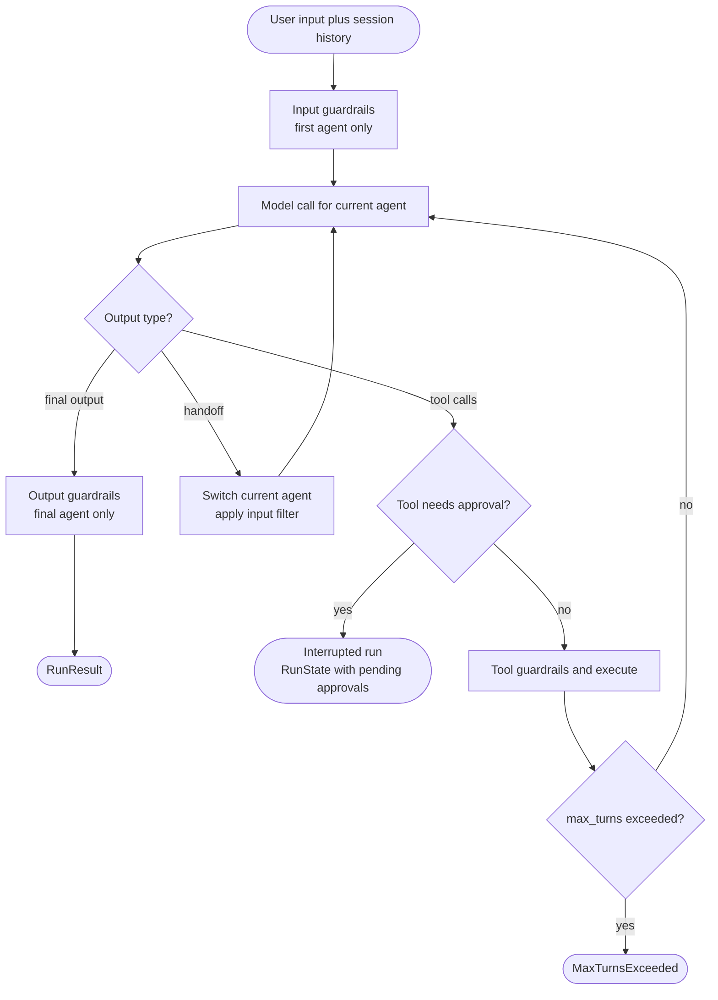
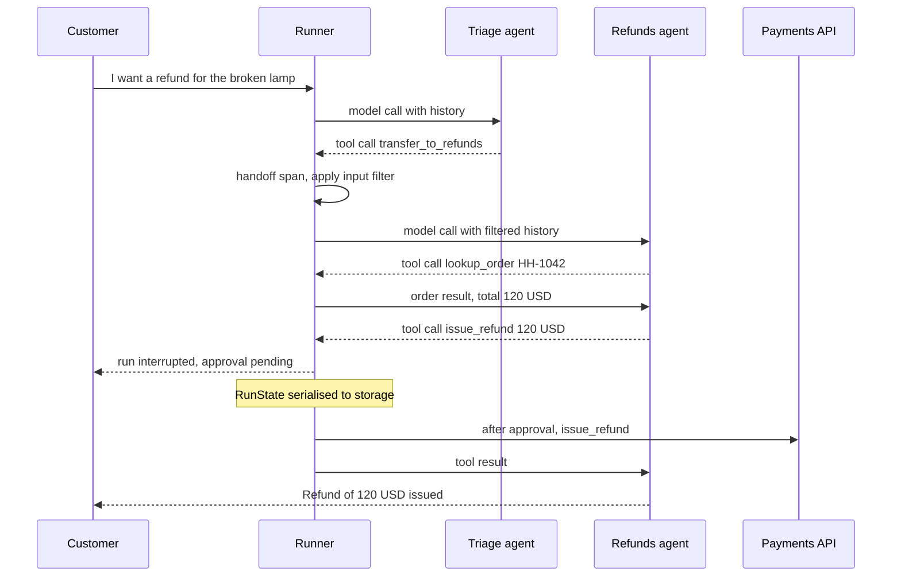
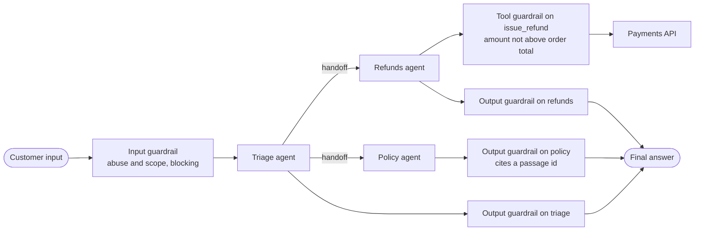
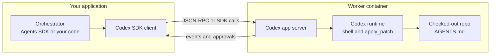
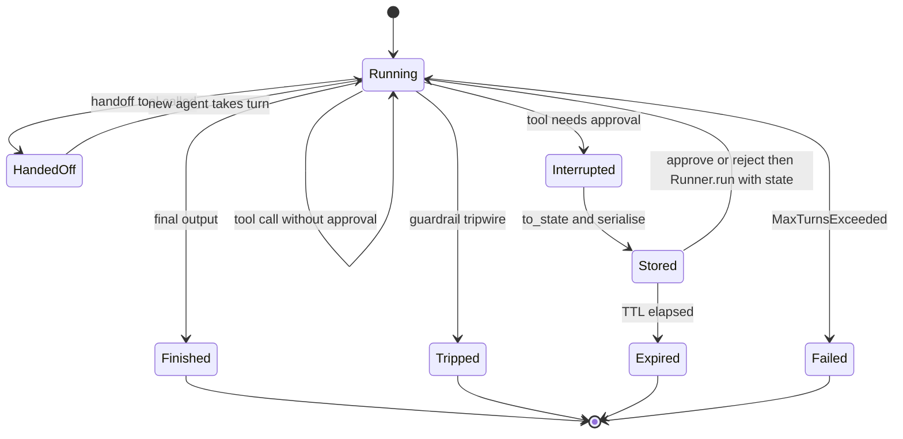

# Chapter 12: OpenAI Agents SDK and AgentKit

> **What this chapter covers**: OpenAI's agent stack as of September 2026. The Agents SDK (Python and TypeScript): agents, the runner loop, function and hosted tools, handoffs and agents-as-tools, guardrails at three boundaries, sessions, human-in-the-loop approvals with serialisable run state, and built-in tracing. The Responses API and Conversations API underneath it, and the Assistants API sunset. AgentKit: Agent Builder (deprecated, shutting down 30 November 2026), ChatKit, and the evaluation tooling. Codex as a harness, through the CLI and the Codex SDK. The Part III reference agent built on the SDK.
>
> **Prerequisites**: Chapters 3, 4, 5, 6, 10 (for the reference spec), 11 (for comparison).
>
> **Where it is used**: Chapter 21 (handoffs vs agent-as-tool), Chapter 23 (ChatKit and approval UX), Chapter 26 (trace grading), Chapter 28 (tracing processors), Chapter 29 (guardrails), Chapter 36 (capstone 1).

---

## 12.1 Level 1: Foundations

### The stack in layers

OpenAI's agent offering is easiest to understand as layers. Each layer is usable without the ones above it.

| Layer | Product | What it gives you |
|---|---|---|
| Model API | Responses API, Conversations API | One model turn with built-in tools, optional server-side state |
| Agent library | Agents SDK (Python `openai-agents`, TypeScript `@openai/agents`) | The loop, tools, handoffs, guardrails, sessions, approvals, tracing |
| UI | ChatKit | An embeddable chat front end that talks to your backend |
| Visual builder | Agent Builder | Drag-and-drop workflows; deprecated, shutting down 30 November 2026 |
| Coding harness | Codex (CLI, IDE, cloud, Codex SDK) | A full coding agent you can drive programmatically |

"AgentKit" is the name OpenAI used at DevDay in October 2025 for the bundle of Agent Builder, ChatKit, a connector registry, and expanded evaluation features, on top of the Agents SDK and Responses API. It is a marketing umbrella, not a package.

### Design stance

The Agents SDK is deliberately small. Its documentation lists a handful of primitives: agents, tools, handoffs, guardrails, sessions, and tracing. The loop is model-driven like the Claude Agent SDK (Chapter 11), but it ships no filesystem or shell harness by default; you bring the tools. Where LangGraph (Chapter 10) makes control flow explicit, the Agents SDK makes **delegation** explicit: an agent can hand the conversation to another agent, and that transfer is a first-class, traced event.

The SDK is provider-agnostic in principle. It defaults to OpenAI models through the Responses API, and it supports the Chat Completions API and other providers through model adapters (including a LiteLLM integration; check the models page for current adapters). Hosted tools such as web search only work with OpenAI's Responses models.

### Vocabulary

| Term | Meaning |
|---|---|
| `Agent` | Name, instructions, model, tools, handoffs, guardrails, optional output type |
| `Runner` | Runs the loop: `run()` (async), `run_sync()`, `run_streamed()` |
| Turn | One model call plus the tool calls it triggers |
| Function tool | A Python function exposed with `@function_tool` |
| Hosted tool | A tool OpenAI runs: `WebSearchTool`, `FileSearchTool`, `CodeInterpreterTool`, `HostedMCPTool`, and others |
| Handoff | A tool that transfers control of the conversation to another agent |
| Agent as tool | `agent.as_tool(...)`: call another agent and get its output back, without transferring control |
| Guardrail | A check on input, output, or a tool call that can trip a wire and halt |
| Session | Stores conversation items across runs |
| `RunState` | Serialisable snapshot of a paused run, used for approvals |
| Trace, span | Built-in record of a run: agent, generation, tool, handoff, guardrail spans |

### The loop



Final output means text with no tool calls, or, when `output_type` is set, a structured object that validates against it.

## 12.2 Level 2: Working knowledge

### Agents and the runner

```python
from agents import Agent, Runner, function_tool

@function_tool
async def lookup_order(order_id: str) -> str:
    """Look up a Harbor order. Returns status, items, total_usd, customer_id.

    Args:
        order_id: Harbor order id such as HH-1042.
    """
    return (await orders_api.get(order_id)).to_json()

support = Agent(
    name="Harbor support",
    instructions=HARBOR_SUPPORT_PROMPT,
    model="gpt-5",          # placeholder; use the current recommended model
    tools=[lookup_order, search_policy, issue_refund],
)
result = await Runner.run(support, "Where is order HH-1042?")
print(result.final_output)
```

`@function_tool` builds the JSON schema from type hints and the description from the docstring (Google, Sphinx, and NumPy styles are parsed, including per-argument descriptions). It supports Pydantic field constraints, per-call timeouts, a custom `failure_error_function` that turns exceptions into a message for the model, and `defer_loading=True` for tool search with many tools.

`Runner.run` takes `max_turns`; exceeding it raises `MaxTurnsExceeded`. Older releases defaulted to 10 turns; the current running-agents page says runs have no turn limit unless you set one (September 2026). Always set it explicitly. `RunConfig` holds run-wide settings: model overrides, guardrails, tracing options, `nest_handoff_history`, and `error_handlers` that turn terminal errors (max turns, refusal, invalid final output) into controlled fallbacks.

### Structured final output

Set `output_type` to a Pydantic model and the agent's final answer must validate against it. Structured outputs use the Responses API's strict JSON schema mode where the model supports it (Chapter 3). This is how you make an agent a reliable component in a larger system, for example a triage agent that returns `{intent, order_id, urgency}`.

### Hosted tools

Hosted tools run on OpenAI's side and work only with Responses API models (tools page, September 2026).

| Tool | Does |
|---|---|
| `WebSearchTool` | Web search with citations |
| `FileSearchTool` | Retrieval over OpenAI vector stores |
| `CodeInterpreterTool` | Python in a sandboxed container |
| `HostedMCPTool` | Exposes a remote MCP server's tools; OpenAI's side calls the server |
| `ImageGenerationTool` | Image generation |
| `ToolSearchTool` | Loads deferred tools, namespaces, or hosted MCP servers on demand |

Local runtime tools that you execute include `ComputerTool` (you implement the computer interface), `ShellTool`, and `ApplyPatchTool` (you implement the editor). These mirror the tools Codex uses.

### MCP

The SDK connects to MCP servers in three ways: stdio servers (`MCPServerStdio`), Streamable HTTP servers (`MCPServerStreamableHttp`), and hosted MCP (`HostedMCPTool`, where OpenAI's infrastructure calls a public server). With local connections, your process lists tools and forwards calls, and you can cache the tool list and filter which tools the agent sees. With hosted MCP, the server must be reachable from OpenAI, and each call can require approval.

### Handoffs

A handoff is exposed to the model as a tool. An agent listed in `handoffs=[refunds_agent]` appears as a tool named `transfer_to_refunds_agent` (derived from the agent's name; override with `tool_name_override`). When the model calls it, the runner switches the current agent. By default the new agent sees the entire conversation so far.

```python
from agents import Agent, handoff
from agents.extensions import handoff_filters

refunds = Agent(name="Refunds", instructions=REFUNDS_PROMPT,
                tools=[lookup_order, issue_refund])
triage = Agent(
    name="Harbor triage",
    instructions="Route refund requests to Refunds. Answer order status "
                 "and policy questions yourself.",
    tools=[lookup_order, search_policy],
    handoffs=[handoff(refunds,
                      input_filter=handoff_filters.remove_all_tools,
                      on_handoff=log_handoff)],
)
```

`handoff()` parameters: `input_filter` (edit what history the receiving agent sees, for example strip earlier tool calls), `on_handoff` (a callback, useful to prefetch data), `input_type` (a schema for arguments the model supplies with the handoff, such as a reason), and `tool_name_override`. With `RunConfig.nest_handoff_history`, the runner compacts earlier history into summary segments at each handoff, which limits context growth in long multi-agent conversations.

### Handoff vs agent as tool

| | Handoff | `agent.as_tool()` |
|---|---|---|
| Control after the call | Moves to the new agent for the rest of the run | Returns to the caller |
| History the callee sees | Whole conversation (filterable) | Only the input the caller passes |
| Who writes the final answer | The last agent | The caller |
| Good for | Routing a customer to a specialist | A manager calling specialists and synthesising |
| Chapter 21 name | Handoff, swarm | Supervisor, agent-as-tool |

`as_tool` accepts `tool_name`, `tool_description`, structured `parameters`, `needs_approval`, `custom_output_extractor`, and `is_enabled`. For the reference agent, a handoff from triage to a refunds specialist is natural: the refunds agent should own the rest of the conversation.



### Guardrails

Guardrails run at three boundaries (guardrails page, September 2026):

| Kind | Runs on | Timing |
|---|---|---|
| Input guardrail | The first agent's input only | In parallel with the agent by default, or blocking before it starts |
| Output guardrail | The final agent's output only | After the final output |
| Tool guardrail | Every function-tool call, input and output | Before and after execution; not for hosted tools or handoffs |

A guardrail function returns a `GuardrailFunctionOutput` with `tripwire_triggered`. When it trips, the run raises `InputGuardrailTripwireTriggered`, `OutputGuardrailTripwireTriggered`, or the tool equivalents, and you handle the exception.

```python
from agents import input_guardrail, GuardrailFunctionOutput

@input_guardrail
async def off_topic(ctx, agent, user_input):
    verdict = await Runner.run(topic_classifier, user_input, context=ctx.context)
    return GuardrailFunctionOutput(
        output_info=verdict.final_output,
        tripwire_triggered=not verdict.final_output.is_support_request)
```

The parallel default is a latency choice with a cost consequence: the main agent starts immediately, so if the guardrail trips after 600 ms the main agent may already have consumed tokens (and, in principle, started a tool call). Use blocking mode for guardrails protecting side effects. Note the boundary rules: an input guardrail on the refunds agent does nothing if triage is the first agent, and an output guardrail on triage does nothing if refunds produces the final answer.

### Human-in-the-loop approvals

This is the reference agent's refund gate. Mark the tool with `needs_approval`, either a boolean or an async function that decides per call.

```python
async def refund_needs_approval(ctx, params, call_id) -> bool:
    return params["amount_usd"] > 50

@function_tool(needs_approval=refund_needs_approval)
async def issue_refund(order_id: str, amount_usd: float, reason: str) -> str:
    """Refund part or all of an order. Irreversible."""
    key = f"{order_id}:{amount_usd}:{current_run_id()}"
    return (await payments.refund(order_id, amount_usd, reason, key)).to_json()
```

When the model calls a tool needing approval, the run stops and `result.interruptions` holds `ToolApprovalItem` entries (agent name, tool name, arguments). Convert to a `RunState` with `result.to_state()`, serialise with `to_string()` or `to_json()`, and store it. When the reviewer decides, load the state, call `state.approve(item)` or `state.reject(item)` (with an optional `rejection_message`), and resume with `Runner.run(agent, state)`. `always_approve=True` makes a decision sticky for the rest of the run, and decisions survive serialisation. The mechanism covers function tools, shell and patch tools, MCP tools, and nested `as_tool` agents.

This is the same shape as LangGraph's `interrupt()` (Chapter 10), with one difference: the paused state is an object you store, not a checkpoint the framework writes for you. That is simpler to reason about and puts retention and access control in your hands.

### Sessions

A session stores conversation items so you do not pass history manually. Before each run the runner reads the session; after, it writes the new items.

| Session | Backing | Use |
|---|---|---|
| `SQLiteSession` | File or memory | Local dev |
| `AsyncSQLiteSession` | aiosqlite | Async local |
| `RedisSession` | Redis | Shared across workers |
| `SQLAlchemySession` | Any SQLAlchemy database | Production on Postgres or MySQL |
| `MongoDBSession`, `DaprSession` | MongoDB, Dapr state stores | Existing infrastructure |
| `OpenAIConversationsSession` | OpenAI Conversations API | Server-side state |
| `EncryptedSession` | Wraps any session | Encryption at rest |

A custom session implements four methods: `get_items`, `add_items`, `pop_item`, `clear_session`. Alternatives to sessions: manual history with `result.to_input_list()`, a server-managed `conversation_id`, or `previous_response_id` chaining. Session persistence and server-managed state are mutually exclusive in one call.

Long-term memory is not built in. For customer preferences, add two function tools backed by your own store, or read preferences in code before the run and put them in the instructions (dynamic instructions can be a function of the run context).

### Context and dependency injection

`Runner.run(agent, input, context=HarborContext(tenant_id=..., customer_id=..., db=...))` passes a typed object to every tool, guardrail, and hook through `RunContextWrapper`. The context is not sent to the model. This is where tenant id, credentials, and database handles belong, never in the prompt.

### Tracing

Tracing is on by default. Each run records a trace with spans for agents, generations, function tools, guardrails, and handoffs, exported to the OpenAI dashboard. Disable with `OPENAI_AGENTS_DISABLE_TRACING=1`, `set_tracing_disabled(True)`, or `RunConfig.tracing_disabled=True`. Tracing is unavailable to organisations under a Zero Data Retention policy with OpenAI's exporter.

To send traces elsewhere, `add_trace_processor()` adds a processor alongside the default exporter, and `set_trace_processors()` replaces the defaults. The docs list many integrations (Langfuse, LangSmith, Weights and Biases, Datadog, and others). A subtle point from the docs: processors are independent observers, so a redaction processor added alongside the default exporter does **not** stop unredacted data reaching the default exporter. For PII, replace the processors and redact inside the one exporter you keep.

## 12.3 Level 3: Depth

### The Responses API underneath

The Agents SDK's default model class calls the Responses API. Understanding it explains several SDK behaviours.

- **Items, not messages.** Input and output are lists of typed items: messages, function calls, function call outputs, reasoning items, hosted tool calls. The SDK's `to_input_list()` returns items.
- **Optional server-side state.** With `store=True`, a response can be continued by passing `previous_response_id`, and OpenAI replays the prior items. The Conversations API adds durable conversation objects that hold items across many responses. The migration guide says response objects are retained for 30 days while conversation objects persist until deleted (as of September 2026; check the data controls page).
- **Reasoning items.** Reasoning models emit reasoning items. Passing them back on the next turn, which `previous_response_id` does automatically, preserves the model's chain of thought across tool calls (Chapter 4). Under ZDR, request encrypted reasoning content and pass it back yourself.
- **Built-in tools** run inside the same response: web search, file search, code interpreter, remote MCP, image generation, computer use, and shell-type tools. One API call can contain several internal tool calls.

### The Assistants API sunset

The Assistants API (threads, runs, assistants) was deprecated in August 2025 and sunset on 26 August 2026 (OpenAI deprecations page). Migration maps assistants to prompts or agent configurations, threads to conversations, and runs to responses. OpenAI provided no automated thread migration. If a customer still references Assistants in a design doc, the design is out of date.

### Cost arithmetic for the reference agent

OpenAI prices change often; use placeholders and plug in the current page. Let input cost `p_in` per million tokens, cached input `p_cache`, output `p_out`. With the same shape as Chapter 10 (2,400-token prefix, 4 calls, 1,800 uncached history tokens and 220 output tokens per call):

- Cached prefix: 9,600 x `p_cache` / 1M
- Uncached input: 7,200 x `p_in` / 1M
- Output: 880 x `p_out` / 1M

OpenAI's prompt caching is automatic for prompts above a minimum length (1,024 tokens historically) with no write premium, and the discount on cached tokens has varied by model generation (50 percent on early models, larger on later ones; check current pricing). With illustrative values of 1.25 USD input, 0.125 USD cached, and 10 USD output per million, a conversation costs 0.0012 + 0.009 + 0.0088, about 0.019 USD.

Two SDK-specific costs change this:

| Pattern | Extra cost | Estimate |
|---|---|---|
| Parallel input guardrail with an LLM classifier | One small-model call per conversation | +2 to 5 percent |
| Handoff triage to refunds | Refunds agent re-reads the conversation with its own prefix | +1 model call, about +25 percent on refund conversations |
| `nest_handoff_history` | Summarises history at handoff | Saves tokens on long chats, costs a summarisation call |
| Hosted web search | Per-call tool fee plus result tokens | Varies; check the tools pricing page |

### Handoff failure modes

Handoffs are the SDK's signature feature and its main source of production bugs.

| Failure | Symptom | Cause | Fix |
|---|---|---|---|
| Ping-pong | Triage and refunds transfer back and forth | Both agents have handoffs to each other with overlapping instructions | One-way handoffs, or a turn counter guard; clearer boundaries in instructions |
| Lost context | Refunds agent asks for the order id again | `input_filter` stripped the tool result with the id | Filter tool noise but keep a summary; use `input_type` to pass key fields |
| Guardrail gap | Refund output not checked | Output guardrail on triage, final answer from refunds | Put output guardrails on every agent that can finish |
| Wrong agent answers | Specialist answers out of scope | Handoff descriptions vague | Treat handoff descriptions as tool descriptions; eval routing accuracy |
| Context bloat | Slow, costly long chats | Whole history passed at every handoff | `nest_handoff_history` or filters |

Measure routing directly: on the 40 reference conversations, label the correct agent for each turn and report routing accuracy with an interval (Chapter 26).

### Approval state in depth

A serialised `RunState` contains the conversation items, the current agent, pending approvals, and context needed to resume. Three engineering consequences:

- **Code versioning.** State references agents and tools by name. Resuming after a deploy that renamed a tool fails. Treat agent and tool names as a stable API once states are in storage, like LangGraph node names.
- **Security.** The state contains the conversation and tool arguments. Store it encrypted, scoped to the tenant, with a TTL; check the resumer's authority to approve.
- **Idempotency.** Approval resumes the run, and the tool executes then. If the worker crashes between the payment call and saving the result, a retry repeats the refund. The idempotency key in the tool is the defence, exactly as in Chapters 10 and 22.

### Guardrail coverage in a handoff graph

The boundary rules mean coverage has to be designed, not assumed. For the reference agent with three agents:



Every agent that can finish has its own output guardrail, and the one irreversible tool has a deterministic tool guardrail in addition to `needs_approval`. The input guardrail sits on triage because triage is always the first agent. If a future change lets a conversation start directly on refunds (say, a "request refund" button), the input guardrail must move or be duplicated. Put a test in CI that enumerates entry agents and finishing agents and asserts coverage.

### Model classes: Responses vs Chat Completions

| | `OpenAIResponsesModel` (default) | `OpenAIChatCompletionsModel` |
|---|---|---|
| Hosted tools | Yes | No |
| Reasoning items preserved across turns | Yes | Not in the same way |
| Server-side state options | `previous_response_id`, conversations | None |
| Other providers | OpenAI only | Any OpenAI-compatible endpoint (vLLM, Ollama, gateways) |

Use the Chat Completions class to run the SDK against a local model on the 4060 or through a gateway such as LiteLLM (Chapter 18), accepting the loss of hosted tools. Tool-calling quality with small local models is the limit, not the SDK (Chapter 20).

### Multi-tenant design

The SDK has no tenant concept. Enforce isolation in the same three places as Chapter 10: the session key (tenant plus conversation id, generated server-side), the context object (tenant-scoped API clients created per run, so a tool cannot reach another tenant's data even if the model supplies a foreign order id), and stored `RunState` (encrypted, tagged with tenant, authority checked on resume). A tool guardrail that verifies the order's customer matches the context's customer turns a cross-tenant or cross-customer lookup from a data leak into a tripped wire.

### Guardrails are not a security boundary on their own

Guardrails are classifiers and checks you write. An LLM-based input guardrail has its own false negative rate. Injection that arrives through a tool result (a policy page, an email body) is not an "input" in the input-guardrail sense, because input guardrails see only the first agent's user input. Tool guardrails are the right place to validate tool arguments deterministically (amount not above order total, order belongs to customer). Chapter 29 treats guardrails as one layer among several.

### Tracing numbers

Built-in tracing batches spans and exports in the background, so the latency impact on the loop is small. The volume is not small: a 4-turn conversation with one handoff and two guardrails produces roughly 12 to 20 spans. At 20,000 conversations a day that is about 300,000 spans a day. If you add a third-party processor, budget for its ingestion pricing, and sample in production if needed (for example keep 100 percent of errors and approvals, 10 percent of the rest).

### Streaming

`Runner.run_streamed()` returns a result object whose `stream_events()` async iterator yields three kinds of event (check the streaming page for current class names):

| Event kind | Contains | UI use |
|---|---|---|
| Raw response events | Token deltas straight from the model API | Typing effect |
| Run item events | A completed item: message, tool call, tool output, handoff | "Looking up your order", "Transferred to Refunds" |
| Agent updated events | The current agent changed | Change the avatar or label in the chat |

A support UI typically renders raw text deltas for the assistant message and run item events for progress. When the run is interrupted for approval, the streamed result also carries interruptions, so the UI can switch to a "waiting for approval" state without polling.

### Latency budget for a handoff turn

A customer asks for a 120 USD refund. Triage hands off, refunds looks up the order and calls `issue_refund`, which needs approval. Ranges are typical same-region figures for a mid-size model in 2026; treat them as a template.

| Step | Budget |
|---|---|
| Session read (Postgres) | 5 ms |
| Input guardrail (small model, parallel) | 300 to 600 ms, hidden behind the next step |
| Triage model call, decides handoff | 600 to 1,000 ms |
| Handoff, input filter applied | under 5 ms |
| Refunds model call, calls `lookup_order` | 700 to 1,200 ms |
| `lookup_order` | 80 ms |
| Refunds model call, calls `issue_refund` | 700 to 1,200 ms |
| Interruption, `RunState` stored | 10 ms |
| Time to "waiting for approval" | about 2.1 to 3.5 s |

The handoff costs one full model call (600 to 1,000 ms). If most conversations are refunds, a single agent with all tools is faster and cheaper; handoffs pay off when specialist instructions and tool sets are large enough to confuse one agent, or when ownership and audit need a clean boundary.

### Dynamic instructions and context

`instructions` can be a function of the run context and agent, returning a string at each turn. The reference agent uses it to inject the customer's tier and stored preferences:

```python
def harbor_instructions(ctx, agent) -> str:
    c = ctx.context
    prefs = "; ".join(c.preferences) or "none recorded"
    return (f"{HARBOR_SUPPORT_PROMPT}\n\nCustomer tier: {c.tier}. "
            f"Known preferences: {prefs}. Tenant: {c.tenant_display_name}.")
```

This keeps the long static prompt identical across customers (good for caching, which keys on the prefix) and appends the variable part at the end. Putting the variable text at the start would break the cache on every conversation. The same prefix rule from Chapter 6 applies to every provider.

### Lifecycle hooks

The SDK exposes run hooks and agent hooks with callbacks such as agent start and end, tool start and end, and handoff (check the current `RunHooks` and `AgentHooks` method names). They are observers: use them for metrics, audit logs, and prefetching. Unlike Claude Agent SDK `PreToolUse` hooks, they are not the mechanism for blocking a call; that is the job of tool guardrails and `needs_approval`.

### Testing an Agents SDK agent

- **Unit test function tools** as plain async functions.
- **Fake the model.** Implement the SDK's model interface with a scripted model that returns a fixed sequence of tool calls and outputs; run the real runner against it. This tests handoff wiring, guardrail placement, and approvals without API cost.
- **Test the approval round trip.** Run to the interruption, serialise, deserialise in a new process, approve, resume, and assert one refund.
- **Test guardrail boundaries.** Assert that an output guardrail fires on every agent that can produce a final answer, using scripted runs that end on each agent.
- **Replay traces.** Export real traces, turn them into scripted-model fixtures, and keep them as regression tests (Chapter 27).

### Python and TypeScript differences

The TypeScript SDK (`@openai/agents`) mirrors the Python concepts: `Agent`, `run()`, `tool()` with Zod schemas, handoffs, guardrails, sessions, and approvals with serialisable state. It also has first-class voice agent support built on the Realtime API (check the TypeScript docs for the current voice API). Feature parity lags in both directions from release to release, so check the changelog for the feature you need in the language you ship.

### Reading a trace: a worked debugging example

A customer reports that the agent refunded 120 USD on an order whose total was 95 USD. The trace for the conversation shows:

| Span | Detail |
|---|---|
| Agent span, Harbor triage | 1 generation, handoff to Refunds |
| Handoff span | `input_filter=remove_all_tools` applied |
| Agent span, Refunds | 3 generations |
| Generation 1 | Model asks the customer for the order id, although the customer gave it earlier |
| Function span `lookup_order` | Called with HH-1042, returns total 95 USD |
| Generation 2 | Model calls `issue_refund` with 120 USD, the amount the customer claimed |
| Tool guardrail | None configured |
| Approval | Reviewer approved from a card showing only the amount and reason |

Three findings, each with a fix. The input filter removed the triage agent's `lookup_order` result, so refunds lost context and relied on the customer's claim; keep a summary or pass key fields through `input_type`. No tool guardrail compared the amount with the order total; add one. The approval card lacked the order total, so the reviewer could not catch the error; show tool arguments next to the facts they should match. The model was not the root cause of any of the three. This is typical: most agent incidents trace to context, validation, or UX decisions in the harness (Chapter 28).

### Versioning agents and prompts

An agent's behaviour is the product of its instructions, tool descriptions, handoff descriptions, guardrails, and the model snapshot. Version them together as one release unit (Chapter 32):

- Pin the model to a dated snapshot in production, not a moving alias.
- Keep instructions and tool descriptions in the repository, reviewed like code; OpenAI's prompt objects in the dashboard are convenient but split the source of truth.
- Tag each trace with the release version, so a regression shows up as a step change by version in the dashboard.
- Gate promotion on the eval set (pass^k and routing accuracy with intervals), and keep stored `RunState` objects compatible across the change or drain them first.

## 12.4 Level 4: Mastery

### AgentKit: what is current

| Component | Status as of September 2026 | Notes |
|---|---|---|
| Agent Builder | Deprecated; shuts down 30 November 2026 | OpenAI directs users to ChatKit plus the Agents SDK for code-based workflows |
| ChatKit | Available | Embeddable chat UI; unaffected by the Agent Builder deprecation |
| Agents SDK | Available, actively developed | The recommended path for agent logic |
| Evals features (datasets, trace grading) | Announced with AgentKit | Check the current evals docs before designing around them |
| Connector Registry | Announced with AgentKit | Status not verified for this chapter; check before relying on it |

Agent Builder lived roughly thirteen months from its October 2025 launch to its scheduled shutdown. The lesson for an FDE is concrete. Visual builders from model vendors are the most volatile layer of the stack. Put durable logic in code you own (the SDK, or your own loop), and treat hosted visual tooling as prototyping.

### ChatKit

ChatKit is a front-end component set for chat experiences: message rendering, streaming, attachments, tool progress, and widgets. It talks to a backend endpoint. OpenAI's docs describe two integration paths: a recommended hosted path for workflows, and an advanced path where you run your own backend, often built on the Agents SDK. ChatKit can point at any backend that returns the response shape it expects, whether or not the backend uses the Agents SDK. For the reference agent, ChatKit renders the approval card for the refunds reviewer and streams the customer conversation. Chapter 23 compares it with AG-UI, CopilotKit, and assistant-ui.

### Codex as a harness

Codex is OpenAI's coding agent: a CLI, IDE extensions, a desktop app, and a cloud service that runs tasks in sandboxes. For agent engineers it matters in two ways.

1. **As a reference harness.** The open-source Codex CLI shows how OpenAI structures a coding loop: shell and apply-patch tools, sandbox policies with approval modes, `AGENTS.md` for repository instructions (Chapter 17), and MCP client support. It is one of the open harnesses Chapter 5 recommends reading.
2. **As a component.** The Codex SDK lets your application start and continue local Codex threads. The TypeScript package is `@openai/codex-sdk` (Node 18 or later) with a `Codex` class, `startThread()`, `run()`, and `resumeThread(threadId)`. A Python library (`openai-codex`) controls the local Codex app server over JSON-RPC. The Codex app server is the integration point for custom clients handling authentication, history, approvals, and streamed events. The older `codex mcp-server` command has been removed in favour of the app server (Codex SDK docs, September 2026).



The pattern is the same as embedding the Claude Agent SDK (Chapter 11): a specialised harness for code work, called from a general orchestrator that owns routing, approvals, and state.

### Production blueprint on the Agents SDK

| Concern | Choice |
|---|---|
| Topology | Triage agent with one-way handoffs to specialists; specialists never hand back, they finish or escalate to a human |
| State | `SQLAlchemySession` on Postgres, keyed by tenant and conversation; or the Conversations API if server-side storage is acceptable |
| Approvals | `needs_approval` functions per tool; `RunState` stored encrypted with a 7-day TTL; reviewer service resumes with authority checks |
| Guardrails | Blocking input guardrail for abuse; tool guardrails for argument invariants; output guardrails on every agent that can finish |
| Context | Typed context object with tenant id and scoped clients; nothing sensitive in instructions |
| Tracing | Replace default processors with one exporter that redacts, then ships to Langfuse via OTel; sample normal traffic |
| Limits | Explicit `max_turns`; per-tenant token budgets enforced outside the SDK |
| Models | Pin model snapshots; re-run evals before any change |
| UI | ChatKit or your own front end over a streaming endpoint (`run_streamed`) |

### Total cost at volume across Part III so far

For 20,000 reference conversations a day, the framework rarely drives the bill. Using this part's estimates (token prices differ by provider and change often, so these are illustrative):

| Build | Tokens per day | Framework or platform extras per day | Notes |
|---|---|---|---|
| LangGraph self-hosted (Ch 10) | about 500 USD on Sonnet 5 | Postgres for about 4 GB a day of checkpoints | Plus engineering time for queues and locks |
| Claude Agent SDK (Ch 11) | about 500 USD with built-ins removed, about 700 USD with the preset | Container compute | Subprocess per session |
| Claude Managed Agents (Ch 11) | about 500 USD | About 11 USD runtime | No ZDR |
| OpenAI Agents SDK | about 380 USD at the illustrative prices, plus about 25 percent on handoff conversations | Trace ingestion if exported | Guardrail model calls add 2 to 5 percent |

The table's lesson is about what dominates. Differences between frameworks are a few percent; the choice of model, the caching discipline, and the number of model calls per conversation move cost by factors. Choose the framework on control, portability, and operations; choose the model and the call count on cost.

### Data residency and retention

A customer's first question will be where data goes. With the Agents SDK:

- Model calls go to the Responses API. With `store=True` (the default for Responses), response objects are retained by OpenAI; set `store=False` for stateless calls, which also rules out `previous_response_id` chaining.
- `OpenAIConversationsSession` stores history with OpenAI; SQL or Redis sessions keep it in your infrastructure.
- Built-in tracing sends traces to OpenAI unless disabled or replaced, and is unavailable under ZDR.
- Hosted tools (file search vector stores, code interpreter containers) keep data on OpenAI's side for their lifetime.

For a strict customer, the configuration is `store=False`, local sessions, replaced trace processors, no hosted tools that persist data, and ZDR on the account. That is achievable, but it gives up some convenience features, which you should state in the design doc.

### Comparison across Part III so far

| Spec element | LangGraph (Ch 10) | Claude Agent SDK (Ch 11) | OpenAI Agents SDK |
|---|---|---|---|
| Loop control | Explicit graph | Model-driven, harness-managed | Model-driven, runner-managed |
| Multi-agent primitive | Subgraphs, `Command` handoffs, `Send` | Sub-agents (isolated context) | Handoffs (transfer control), agents as tools |
| Approval gate | `interrupt()`, checkpoint persists pause | `canUseTool` or hooks; long waits need your own persistence | `needs_approval`, serialisable `RunState` |
| Thread memory | Checkpointer | Session transcripts, `SessionStore` | Session classes or Conversations API |
| Long-term memory | `Store` | Files, memory tool, or MCP tool | Your tool plus store |
| Guardrails | Your nodes | Hooks and permission rules | Input, output, and tool guardrails |
| Tracing | LangSmith or OTel callbacks | OTel from Claude Code, or hooks | Built-in, with processors |
| Built-in tools | None | Files, shell, web, sub-agents, skills | Hosted web, file search, code interpreter, MCP |
| Lock-in | Low (model-agnostic) | Claude models | OpenAI hosted tools; loop is portable |


Placements are the author's judgment as of September 2026.

### Reliability arithmetic for handoffs

Routing is a step, and steps compound (Chapter 1). Suppose, on the reference conversations:

| Step | Success rate |
|---|---|
| Triage routes correctly | 0.97 |
| Specialist completes the task given correct routing | 0.92 |
| End to end with handoff | 0.97 x 0.92 = 0.89 |
| Single agent with all tools, measured | 0.90 |

The two designs are indistinguishable at this sample size. On 40 conversations x 5 trials, a paired bootstrap interval on the difference will straddle zero. That result is common, and it is the correct basis for a decision: pick on cost, latency, and maintainability, not on a 1-point difference that is noise. Handoffs start to win when a single agent's tool count and instructions grow large enough that its tool selection accuracy drops, typically beyond a few dozen tools or several conflicting policies. Measure that point for your domain instead of assuming it.

### Migrating a customer off Agent Builder

A customer with Agent Builder workflows must move before 30 November 2026. A practical plan:

1. **Inventory.** Export each workflow's nodes, prompts, tools, guardrails, and the ChatKit surfaces that call it.
2. **Map nodes to code.** Agent nodes become `Agent` objects; branches become handoffs or plain Python conditionals; guardrail nodes become guardrail functions; approval nodes become `needs_approval`.
3. **Recreate evals first.** Build a golden set from production traces of each workflow before rewriting, so parity is measured, not assumed.
4. **Swap the backend behind ChatKit.** Keep the front end; point it at the new SDK-based endpoint.
5. **Shadow, then cut over.** Run the new backend on mirrored traffic, compare outcomes, then switch.

The trap is step 2 done without step 3: the rewrite "looks the same" but prompt wording and tool descriptions shift behaviour. The eval set is the contract.

### Where practitioners disagree

| Question | One view | The other view |
|---|---|---|
| Handoffs as the core multi-agent primitive | Clean ownership: one agent speaks at a time; traces are readable | Most production systems want a manager that keeps control (agent as tool); handoffs make guardrail coverage and evaluation harder |
| Parallel input guardrails | Latency matters; most inputs are benign | Tokens and possibly side effects occur before the wire trips; block for anything risky |
| Server-side state (Conversations, `previous_response_id`) | Less code, reasoning items preserved automatically | Retention and residency; harder to move providers |
| Vendor builders | Speed for non-engineers | Agent Builder's deprecation within about a year is the counter-example |

### Lifecycle of a run with approvals



### Facts to re-check before a customer meeting

| Fact | Value as of September 2026 | Where to check |
|---|---|---|
| Python package | `openai-agents` (import `agents`) | Agents SDK docs |
| TypeScript package | `@openai/agents` | Agents SDK JS docs |
| Default `max_turns` | Docs say no limit unless set; older releases used 10 | Running agents page |
| Agent Builder | Deprecated, shutdown 30 November 2026 | Agent Builder guide |
| ChatKit | Available | ChatKit guide |
| Assistants API | Sunset 26 August 2026 | Deprecations page |
| Response object retention | 30 days (per migration guidance); conversations persist until deleted | Data controls page |
| Codex SDK packages | `@openai/codex-sdk` (TypeScript), `openai-codex` (Python) | Codex SDK docs |
| `codex mcp-server` | Removed; use the app server | Codex SDK docs |
| Model prices and cache discount | Change with each model generation | OpenAI pricing page |

## 12.5 Subtopic checklist

- [x] Agents: instructions, model, tools, output type, context (12.2)
- [x] Runner loop, `run`, `run_sync`, `run_streamed`, `max_turns`, `RunConfig` (12.1, 12.2)
- [x] Function tools and hosted tools (12.2)
- [x] MCP connections: stdio, Streamable HTTP, hosted (12.2)
- [x] Handoffs: tool naming, parameters, filters, nested history, failure modes (12.2, 12.3)
- [x] Agent as tool vs handoff (12.2)
- [x] Guardrails: input, output, tool; parallel vs blocking; boundary rules (12.2, 12.3)
- [x] Sessions: classes, protocol, alternatives (12.2)
- [x] Human-in-the-loop approvals with `RunState` (12.2, 12.3)
- [x] Tracing: default, disabling, processors, ZDR, redaction caveat (12.2, 12.3)
- [x] Responses API, Conversations API, reasoning items, Assistants sunset (12.3)
- [x] AgentKit: Agent Builder deprecation, ChatKit, evals, connector registry status (12.4)
- [x] Codex as a harness: CLI, Codex SDK, app server (12.4)
- [x] Reference spec built and costed (12.2, 12.3)
- [x] Data residency and retention configuration (12.4)

## 12.6 Common misconceptions

1. **"AgentKit is a package I install."** It is an umbrella name for Agent Builder, ChatKit, evaluation features, and a connector registry around the Agents SDK and Responses API.
2. **"Agent Builder is a safe long-term platform."** It is deprecated and shuts down on 30 November 2026.
3. **"Input guardrails protect every agent in a handoff chain."** They run on the first agent's input only; output guardrails run on the final agent's output only.
4. **"A parallel input guardrail prevents the agent from doing anything if it trips."** In parallel mode the agent starts at once and may consume tokens before the wire trips; use blocking mode for risky flows.
5. **"Handoffs return control to the caller."** They transfer control for the rest of the run. Use `as_tool` to keep control.
6. **"Adding a redaction trace processor keeps PII out of OpenAI traces."** Processors are independent; the default exporter still receives raw data unless you replace the processors.
7. **"The Agents SDK only works with OpenAI models."** The loop works with other providers through model adapters; hosted tools do not.
8. **"The Assistants API is fine for new projects."** It was sunset on 26 August 2026; use Responses and Conversations.
9. **"Approving a tool call is enough to prevent a double refund."** Approval resumes execution; a crash and retry can still repeat the call without an idempotency key.
10. **"`max_turns` defaults to a safe value."** Current docs say runs have no turn limit unless you set one; set it explicitly.

## 12.7 Practice

1. **Conceptual.** Draw the handoff graph for triage, refunds, and policy agents. Mark where input, output, and tool guardrails must be attached so every final answer and every refund is checked.
2. **Hands-on (laptop).** Build the reference agent with `openai-agents` in a `uv` project. To stay free, point the SDK at a local OpenAI-compatible server (Ollama or vLLM serving a 7B tool-capable model in 8 GB) through the Chat Completions model class; hosted tools will be unavailable.
3. **Hands-on.** Implement the refund gate with `needs_approval`. Serialise the `RunState` to a file, restart the process, load it, approve, and resume. Assert the refund tool ran exactly once.
4. **Hands-on.** Create a ping-pong failure between two agents with overlapping instructions. Fix it with one-way handoffs and measure routing accuracy on 20 scripted conversations before and after.
5. **Design.** A bank requires no conversation data stored by the model vendor. List every SDK and API setting you change, and the features you lose.
6. **Hands-on.** Replace the default trace processors with a single exporter that redacts email addresses and card-like numbers, then ships spans to a local Langfuse (Docker). Verify nothing unredacted leaves.
7. **Measurement.** Compare parallel vs blocking input guardrails on 50 inputs, 10 of them malicious: report added latency (p50, p95) and tokens spent on tripped runs.
8. **Design.** Rewrite the reference agent using a manager that calls a refunds agent through `as_tool` instead of a handoff. Compare guardrail placement, trace readability, and cost.
9. **Hands-on (optional, small cost).** Use the Codex SDK to run a thread that fixes a failing test in a toy repository inside a container, and log every event it streams.
10. **Eval.** Run the 40 reference conversations 5 times on the Agents SDK build; compare pass^5 with Chapters 10 and 11 using paired bootstrap intervals on the same conversations, and record which failures are framework-specific.

11. **Hands-on.** Write the CI test that enumerates entry agents and finishing agents in your handoff graph and fails if any lacks an input or output guardrail.
12. **Debugging.** Reproduce the 12.3 incident (refund above the order total) with a scripted model, then add the tool guardrail and the richer approval card, and show the test now fails safe.
13. **Design.** Plan an Agent Builder migration for a synthetic three-workflow customer: inventory, eval set, mapping, shadow period, and cutover date before 30 November 2026.

## 12.8 How this is tested

<details><summary>Name the Agents SDK primitives and what each is for.</summary>

Agents (instructions, model, tools, handoffs, guardrails, output type), the runner (the loop), tools (function tools you run, hosted tools OpenAI runs), handoffs (transfer control to another agent), guardrails (checks on input, output, and tool calls that can halt a run), sessions (conversation memory across runs), and tracing (built-in spans for every step). Human-in-the-loop approvals with serialisable run state sit on top of tools.
</details>

<details><summary>How is a handoff represented to the model, and what does the receiving agent see?</summary>

As a tool, named from the target agent (for example `transfer_to_refunds_agent`). When called, the runner switches the current agent. By default the new agent sees the whole conversation. An `input_filter` can remove tool calls or other items, `input_type` can require structured arguments, and `nest_handoff_history` compacts earlier history into summaries.
</details>

<details><summary>When would you use agent-as-tool instead of a handoff?</summary>

When a coordinating agent should keep control, call specialists, and synthesise their outputs into its own final answer. The specialist sees only the input passed to it and returns a result. Handoffs suit routing a user to a specialist who owns the rest of the conversation. Agent-as-tool simplifies guardrail coverage and evaluation, because one agent always produces the final answer.
</details>

<details><summary>Explain where each guardrail type runs and a gap that follows.</summary>

Input guardrails run on the first agent's input, output guardrails on the final agent's output, tool guardrails on every function-tool call. Gap: in a triage-to-refunds flow, an output guardrail on triage never runs when refunds answers, and an input guardrail on refunds never runs. Also, tool results carrying injected text are not inputs, so input guardrails do not see them.
</details>

<details><summary>What is the trade-off of parallel input guardrails?</summary>

Parallel mode starts the agent immediately, hiding guardrail latency. If the guardrail trips, the agent may already have used tokens and, depending on timing, begun work. Blocking mode waits for the guardrail first, adding its latency but preventing any spend or action on bad input. Use blocking for flows with side effects.
</details>

<details><summary>Walk through a refund approval with the Agents SDK.</summary>

Mark `issue_refund` with `needs_approval` as a function returning true above 50 USD. When the model calls it, the run stops with `interruptions` holding a `ToolApprovalItem`. Convert with `to_state()`, serialise, and store it encrypted with a TTL. The reviewer service loads it, checks authority, calls `approve` or `reject` with a message, and resumes with `Runner.run(agent, state)`. The tool uses an idempotency key so a crash and retry cannot refund twice.
</details>

<details><summary>How do sessions differ from previous_response_id and the Conversations API?</summary>

Sessions store items in a backend you choose (SQLite, Redis, SQL, MongoDB, or OpenAI Conversations) and the runner reads and writes them around each run. `previous_response_id` asks OpenAI to replay a stored prior response's items. The Conversations API holds durable conversation objects server-side. Sessions in your own database keep data in your infrastructure; the server-side options reduce code and preserve reasoning items automatically. A single call uses one approach, not both.
</details>

<details><summary>How do you keep PII out of traces?</summary>

Either disable tracing or replace the default processors with `set_trace_processors()` and redact inside the single exporter you keep. Adding a redaction processor with `add_trace_processor()` alongside the default is not enough, because processors observe independently and the default exporter still receives raw data. Under ZDR, OpenAI's tracing is unavailable anyway.
</details>

<details><summary>What happened to the Assistants API and what replaces it?</summary>

It was deprecated in August 2025 and sunset on 26 August 2026. The Responses API replaces runs, the Conversations API replaces threads, and prompts or agent configurations replace assistants. There was no automated thread migration, so history had to be exported and recreated.
</details>

<details><summary>What is AgentKit and what should a customer build on today?</summary>

AgentKit was the October 2025 umbrella for Agent Builder, ChatKit, evaluation features, and a connector registry around the Agents SDK and Responses API. Agent Builder is deprecated and shuts down on 30 November 2026. Build agent logic in the Agents SDK or your own code, and use ChatKit or another UI layer for the front end.
</details>

<details><summary>How can Codex be used as a component in a larger agent system?</summary>

Through the Codex SDK: the TypeScript package `@openai/codex-sdk` starts, runs, and resumes Codex threads, and a Python library drives the local Codex app server over JSON-RPC. An orchestrator delegates coding tasks to Codex running in a sandboxed worker with the repository, receives streamed events and approval requests, and owns routing and state. The older `codex mcp-server` path was removed in favour of the app server.
</details>

<details><summary>Configure the Agents SDK for a customer that forbids vendor-side storage.</summary>

Use `store=False` on model calls (no `previous_response_id`), sessions in the customer's database instead of `OpenAIConversationsSession`, tracing disabled or processors replaced with an in-VPC exporter, no hosted tools that persist data (vector stores, code interpreter files), and ZDR on the OpenAI organisation. State the lost features in the design doc: server-side conversation state, automatic reasoning item replay, and hosted retrieval.
</details>

<details><summary>Compare approval gates across LangGraph, the Claude Agent SDK, and the OpenAI Agents SDK.</summary>

LangGraph: `interrupt()` in a node; the checkpointer persists the pause and `Command(resume=...)` continues, with the node re-running from the top. Claude Agent SDK: `canUseTool` or a hook decides while the process waits; long waits need your own persistence and a resumed session. OpenAI Agents SDK: `needs_approval` interrupts the run and returns a serialisable `RunState` you store and resume. All three need idempotent side effects and authorisation on resume.
</details>

<details><summary>Why do dynamic instructions put variable text at the end?</summary>

Prompt caching keys on the longest identical prefix. If the long static prompt comes first and the per-customer text (tier, preferences) is appended last, every conversation shares the cached prefix. Putting variable text first changes the prefix for every customer and turns cache hits into misses, which raises cost and time to first token.
</details>

<details><summary>A handoff design and a single-agent design score 0.89 and 0.90. What do you conclude?</summary>

Nothing about quality, at typical eval sizes. A paired bootstrap interval on the difference over 40 conversations x 5 trials will almost certainly include zero. Decide on cost (handoffs add a model call), latency, guardrail coverage, and maintainability. Revisit if the single agent's tool count grows until its tool selection accuracy drops, which you measure directly.
</details>

<details><summary>How would you migrate a customer's Agent Builder workflow before the shutdown?</summary>

Inventory the workflow, build an eval set from its production traces first, map agent nodes to `Agent` objects, branches to handoffs or code, guardrail nodes to guardrail functions, and approval nodes to `needs_approval`. Keep the ChatKit front end and swap the backend. Shadow the new backend on mirrored traffic, compare outcomes on the eval set, then cut over well before 30 November 2026.
</details>

<details><summary>A reviewer approved a wrong refund amount. Which harness decisions would you examine?</summary>

The context each agent received (did a handoff input filter strip the order lookup?), the validation on the tool (is there a tool guardrail comparing amount with order total?), and the approval UX (did the card show the facts the amount should match?). In practice these harness decisions, not the model, cause most such incidents. The trace shows each of them.
</details>

<details><summary>Why use the Chat Completions model class in the Agents SDK?</summary>

To run the SDK against non-OpenAI or local models through any OpenAI-compatible endpoint, such as vLLM, Ollama, or a LiteLLM gateway. You keep the runner, handoffs, guardrails, sessions, and approvals. You lose hosted tools, server-side state, and reasoning item replay, and tool-calling quality depends on the model.
</details>

<details><summary>How do you version an Agents SDK deployment safely?</summary>

Treat instructions, tool and handoff descriptions, guardrails, and the pinned model snapshot as one release. Keep prompts in the repository, tag traces with the release version, and gate promotion on the eval set with intervals. Because stored run states reference agents and tools by name, keep names stable or drain paused runs before a rename.
</details>

## 12.9 Summary

- OpenAI's agent stack layers the Responses and Conversations APIs, the Agents SDK, ChatKit, the deprecated Agent Builder, and Codex.
- The Agents SDK is small: agents, runner, tools, handoffs, guardrails, sessions, tracing, plus approvals.
- Handoffs are tools named `transfer_to_<agent>` that move control; agents as tools keep control with the caller.
- Guardrails run at three boundaries: first agent's input, final agent's output, every function-tool call; parallel input guardrails trade tokens for latency.
- `needs_approval` plus a serialisable `RunState` implements approval gates across processes.
- Sessions store history in SQLite, Redis, SQL, MongoDB, Dapr, or OpenAI Conversations; long-term memory is yours to build.
- Tracing is on by default; replace processors to redact, and note it is unavailable under ZDR.
- The Responses API works in items, supports server-side state, and preserves reasoning items between turns.
- The Assistants API was sunset on 26 August 2026.
- Agent Builder shuts down on 30 November 2026; ChatKit and the SDK continue; vendor visual builders are the most volatile layer.
- Codex is both a reference coding harness and a component through the Codex SDK and app server.
- Set `max_turns` explicitly, use idempotency keys on write tools, and treat agent and tool names as stable once run states are stored.
- Design guardrail coverage per entry agent and per finishing agent, and test it in CI.
- Most incidents trace to harness decisions (context filters, validation, approval UX) rather than the model; the trace shows which.

## 12.10 Further reading

- OpenAI Agents SDK documentation (openai.github.io/openai-agents-python): primitives, agents, running agents, results.
- Agents SDK, Handoffs page: tool naming, `handoff()` parameters, input filters, nested history.
- Agents SDK, Guardrails page: input, output, and tool guardrails and execution modes.
- Agents SDK, Human-in-the-loop page: `needs_approval`, interruptions, `RunState`.
- Agents SDK, Sessions page: session classes and the session protocol.
- Agents SDK, Tracing page: default behaviour, processors, the ZDR note.
- Agents SDK, Tools page: function tools, hosted tools, `as_tool` parameters.
- OpenAI, "Introducing AgentKit" (October 2025): the launch framing of Agent Builder, ChatKit, and evals.
- OpenAI API docs, Agent Builder guide: the deprecation notice and 30 November 2026 shutdown.
- OpenAI API docs, ChatKit guide: integration paths.
- OpenAI API docs, Assistants migration guide and Deprecations page: the 26 August 2026 sunset and mapping to Responses and Conversations.
- Codex SDK docs and "Unlocking the Codex harness: how we built the App Server" (OpenAI): Codex as an embeddable harness.
