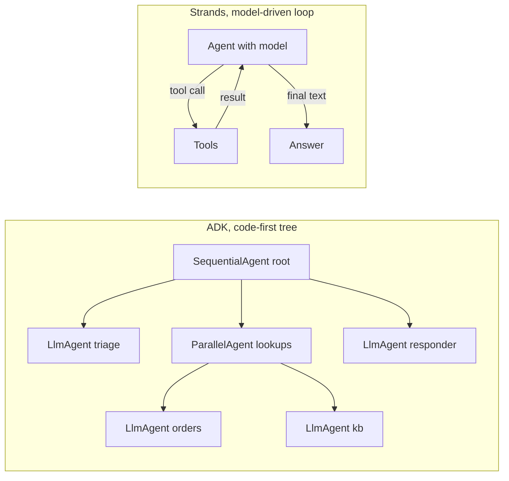
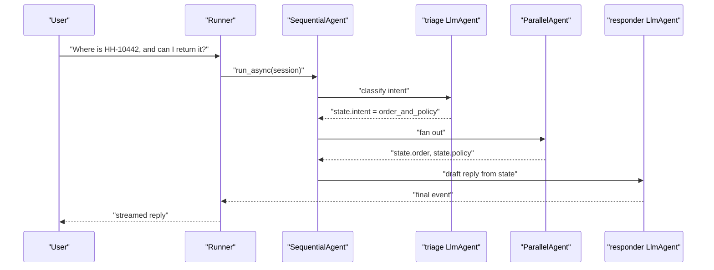
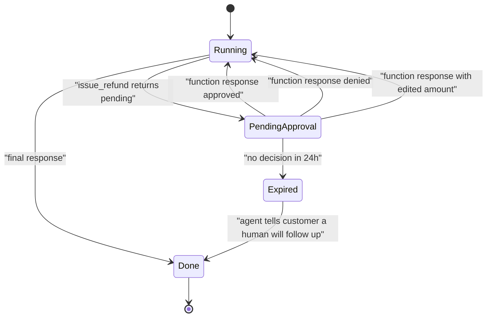
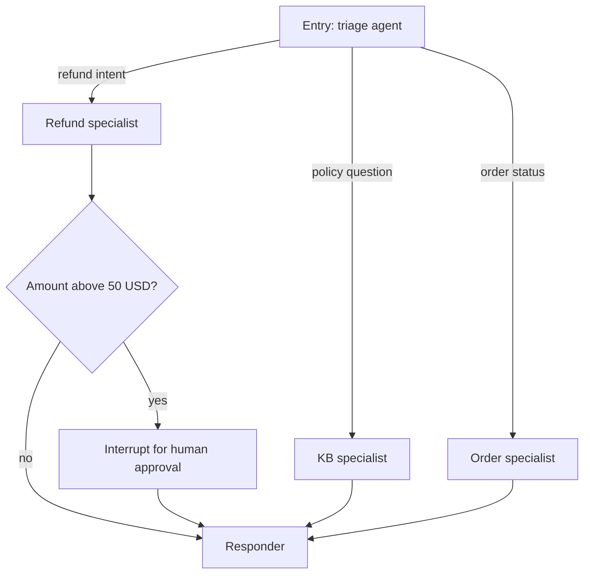
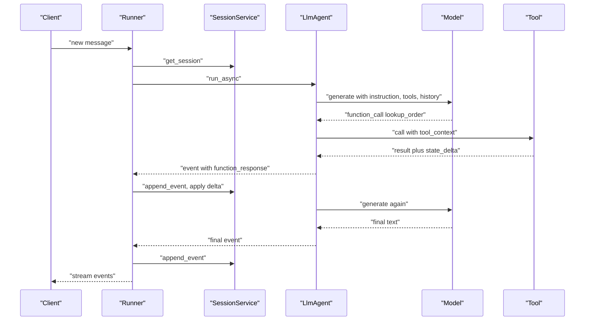
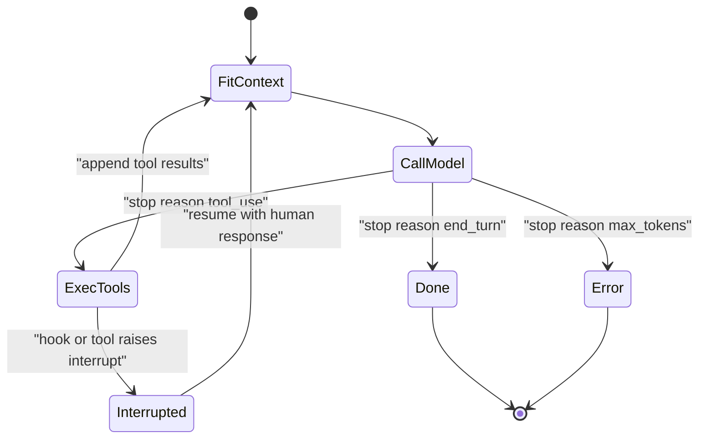
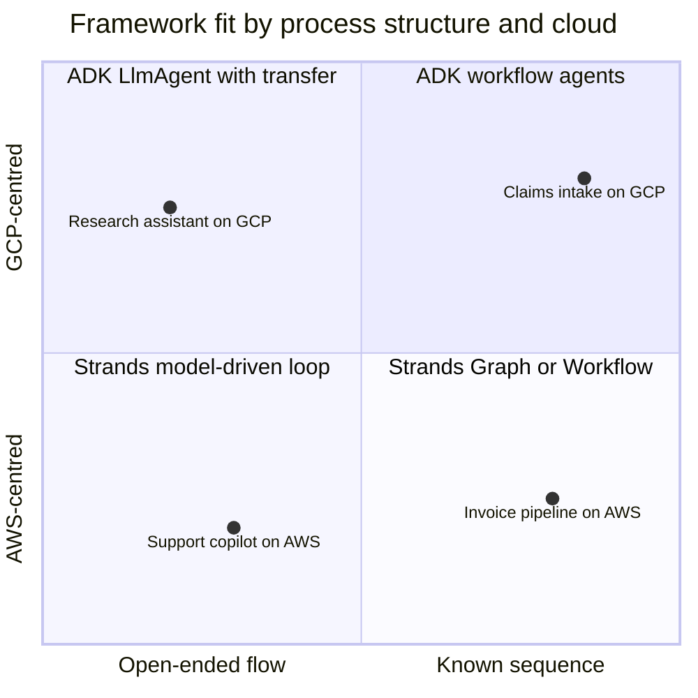
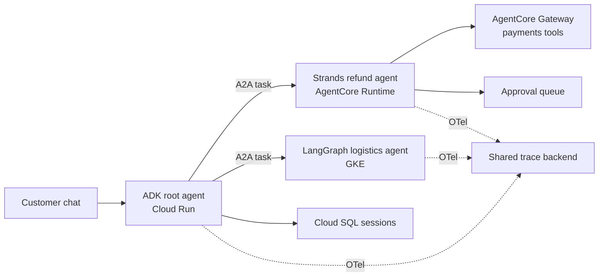

# Chapter 13: Google ADK and Strands Agents

> **What this chapter covers**: Google's Agent Development Kit (ADK) and AWS's Strands Agents, the two hyperscaler-backed open-source agent frameworks. For ADK: LlmAgent, the workflow agents (SequentialAgent, ParallelAgent, LoopAgent), sessions, state scopes, callbacks, native A2A, and deployment to Agent Engine (now documented as Agent Runtime), Cloud Run, and GKE. For Strands: the model-driven loop, the `@tool` decorator, hooks, the multi-agent primitives (agents-as-tools, Swarm, Graph, Workflow), Bedrock as the default provider, and deployment to Bedrock AgentCore. Both are built to the Part III reference spec so they compare directly with Chapters 10 to 12.
>
> **Prerequisites**: Chapters 1, 2, 3, 5, 6, 8, 10.
>
> **Where it is used**: Chapter 17 (A2A), Chapter 32 (deployment on Agent Engine and AgentCore), Chapter 36 (the cross-framework A2A capstone that pairs ADK with Strands and LangGraph).

---

## 13.1 Level 1: Foundations

### 13.1.1 Why two hyperscaler frameworks exist

Every major cloud now ships an agent framework whose job is partly technical and partly commercial. The technical job is to give you a loop, tool plumbing, state, and observability. The commercial job is to make the vendor's managed runtime the path of least resistance. Google ADK leads to Vertex AI's agent runtime. Strands leads to Bedrock and AgentCore. Both are open source (Apache 2.0) and both run anywhere, but the defaults pull you toward one cloud.

Keep that dual role in mind. When a customer says "we are a GCP shop" or "we are on AWS", these two frameworks are usually on the shortlist before any technical evaluation. Your job as an FDE is to know where each one is genuinely strong and where the defaults are merely convenient.

### 13.1.2 Two philosophies

The two frameworks disagree about who controls the flow.

| Question | Google ADK | Strands Agents |
|---|---|---|
| Who decides the next step? | You, with explicit workflow agents, or the model inside an LlmAgent | The model, almost always |
| Core abstraction | A tree of agents (LlmAgent plus workflow agents) | One `Agent` running a model-driven loop |
| How you add structure | Compose SequentialAgent, ParallelAgent, LoopAgent, custom agents | Add tools, hooks, and multi-agent patterns around the loop |
| State model | Session with scoped key-value state and an event log | Conversation messages plus agent state, with a session manager |
| Interop story | A2A built in (`to_a2a`, `RemoteA2aAgent`) | A2A support plus MCP as first-class tools |
| Home runtime | Vertex AI Agent Engine (Agent Runtime) | Bedrock AgentCore Runtime |

ADK is "code-first orchestration": you assemble deterministic scaffolding out of workflow agents and put LLM judgement only where it earns its place. Strands is "model-driven": you give a capable model a prompt and tools, and the framework trusts the model to plan. AWS's own framing, from the Strands launch in May 2025, is that modern models are good enough at planning that heavy orchestration code is often unnecessary.

Neither philosophy is right in general. Chapter 1's compounding error arithmetic applies: if a flow has five steps a human already knows, encoding them as a SequentialAgent removes four model decisions that each carry some failure probability. If the path genuinely varies per request, the model-driven loop avoids brittle branching code.



### 13.1.3 Vocabulary

**ADK**

- **Agent**: anything that extends `BaseAgent`. An `LlmAgent` (aliased as `Agent`) wraps a model with instructions and tools. Workflow agents orchestrate sub-agents without calling a model themselves.
- **Runner**: the object that executes an agent against a session service and produces an event stream.
- **Session**: one conversation thread, identified by app name, user id, and session id. It holds an ordered list of **events** and a **state** dictionary.
- **Event**: the unit of history. Model turns, tool calls, tool results, and state deltas are all events.
- **State scopes**: keys with no prefix belong to the session; `user:` keys are shared across all of one user's sessions; `app:` keys are shared across all users of the app; `temp:` keys live only for the current invocation and are never persisted.
- **Callbacks**: hook functions before and after the agent, the model call, and each tool call.
- **Invocation**: one pass from a user message to the final response, possibly spanning many model and tool calls.

**Strands**

- **Agent**: one class holding a model, a system prompt, tools, conversation history, and hooks. Calling the agent with a string runs the loop.
- **Event loop**: the model-driven cycle. Call the model, execute any tool calls, append results, repeat until the model stops asking for tools.
- **`@tool`**: a decorator that turns a typed Python function with a docstring into a tool spec.
- **Hooks**: typed events (before and after invocation, model call, tool call) that you subscribe to, usually bundled in a `HookProvider` in Python.
- **Conversation manager**: the policy that keeps history inside the context window, for example a sliding window or summarising manager.
- **Session manager**: persistence of the agent's messages and state to a file, S3, or another store.
- **Multi-agent primitives**: agents-as-tools, Swarm, Graph (built with `GraphBuilder`), and Workflow.

### 13.1.4 Where each sits in the landscape

ADK was released at Google Cloud Next in April 2025 and is the framework behind Google's own Agentspace-era products. As of September 2026 the ADK documentation lives at adk.dev, covers Python, TypeScript, Go, Java, and Kotlin, and announces ADK TypeScript 2.0 as GA with graph workflow support. The Python package is `google-adk`, and Google's own Cloud Run quickstarts pin 2.x versions. Treat exact version numbers as volatile and pin them in your lockfile.

Strands was released by AWS in May 2025, reached 1.0 in July 2025 with the multi-agent primitives and A2A support, and has Python and TypeScript SDKs. As of August 2026 the TypeScript package `@strands-agents/sdk` is on a 1.x line. Strands is the framework AWS uses internally for several of its own agent products (Amazon Q Developer and AWS Glue were cited at launch; that is AWS's claim).

### 13.1.5 The reference spec, restated

Every Part III chapter builds the same agent, defined at the top of Chapter 10, so you can compare frameworks on equal terms:

| Element | Specification |
|---|---|
| Company | Harbor Home Goods, a synthetic online retailer |
| Task | Answer order questions, answer policy questions, issue refunds |
| Tool 1 | `lookup_order(order_id)` returns status, items, total, customer id |
| Tool 2 | `search_policy(query)` returns the top 3 policy passages with ids |
| Tool 3 | `issue_refund(order_id, amount_usd, reason)` writes to the payments system |
| Memory | Thread memory for the conversation, plus long-term customer preferences (for example "prefers store credit") |
| Approval gate | Any `issue_refund` above 50 USD pauses for a human; the human can approve, edit the amount, or reject |
| Tracing | Every model call and tool call traced with token counts and latency |
| Eval hook | 40 scripted tau-bench-style conversations with a pass/fail checker (Chapter 26) |

The approval gate is the interesting part. It forces each framework to show how it pauses, persists, and resumes, and the edit-the-amount option forces it to show how a human's change reaches the tool call. The 40 scripted conversations are the common yardstick: every chapter reports pass@1 and pass^k on the same set.

---

## 13.2 Level 2: Working knowledge

### 13.2.1 ADK: the LlmAgent

An `LlmAgent` is a model plus an instruction plus tools. Tools can be plain Python functions (ADK wraps them as `FunctionTool` and reads the signature and docstring), other agents wrapped as `AgentTool`, MCP toolsets, or Google's built-in tools such as Google Search grounding.

```python
from google.adk.agents import LlmAgent

def lookup_order(order_id: str) -> dict:
    """Return status, items and total for a Harbor order id like HH-10442."""
    return orders_db.get(order_id)

def search_policy(query: str) -> list[str]:
    """Search Harbor policy. Returns the top 3 passages with their ids."""
    return policy_index.search(query, k=3)

support = LlmAgent(
    name="support",
    model="gemini-2.5-flash",
    instruction=(
        "You are Harbor Home Goods support. Known customer preferences: "
        "{user:preferences?}. Look up orders before answering and cite "
        "policy passage ids. Refunds above 50 USD go to a human for approval."
    ),
    tools=[lookup_order, search_policy, issue_refund],
    output_key="last_reply",
)
```

Three details matter. First, `{user:preferences?}` is ADK's instruction templating: the framework substitutes the state value before the model sees the prompt, and the trailing `?` makes the key optional (check the current state docs for the exact optional-key syntax in your version). Second, `output_key` writes the agent's final text into session state, which is how one agent passes results to the next in a workflow. Third, the model name is a string; ADK talks to Gemini natively and to other providers through its LiteLLM wrapper. Model identifiers change often, so read the current Gemini model list rather than copying the one above.

### 13.2.2 ADK: workflow agents

Workflow agents do not call a model. They schedule sub-agents deterministically.

| Workflow agent | Behaviour | Typical use |
|---|---|---|
| `SequentialAgent` | Runs sub-agents in order, sharing one session state | Pipelines: triage, fetch, draft, check |
| `ParallelAgent` | Runs sub-agents concurrently on branches of the same invocation | Independent lookups, fan-out research |
| `LoopAgent` | Repeats sub-agents until `max_iterations` or a sub-agent escalates | Generate and critique, polling |
| Custom `BaseAgent` subclass | You write `_run_async_impl` and yield events | Conditional routing that must be code |

Sub-agents in a `ParallelAgent` share state, so each branch should write to a distinct `output_key`. Otherwise the last writer wins and you get a race you will only see under load.

A `LoopAgent` stops when a sub-agent emits an event with `escalate=True` in its actions, usually from a small "checker" agent or a tool that calls `tool_context.actions.escalate = True`. Always set `max_iterations`. A loop that relies on the model deciding it is done is exactly the runaway pattern Chapter 31 warns about.



### 13.2.3 ADK: LLM-driven delegation

An `LlmAgent` can also hold `sub_agents`. In that case ADK gives the model a transfer mechanism, and the model can hand control to a sub-agent by name based on each sub-agent's `description`. This is the ADK equivalent of OpenAI Agents SDK handoffs (Chapter 12).

The alternative is `AgentTool`, which wraps an agent as a tool. The difference matters:

- **Transfer (sub_agents)**: control moves to the sub-agent. It talks to the user directly and owns subsequent turns until it transfers back.
- **AgentTool**: the parent stays in control. The child runs, returns a result, and the parent continues. The child's intermediate turns do not land in the parent's context.

Use `AgentTool` when you want context isolation (Chapter 7). Use transfer when the specialist needs to own the conversation, for example a billing agent that must ask the customer follow-up questions.

### 13.2.4 ADK: sessions, state, and memory

The `Runner` needs a session service. ADK ships three:

| Service | Persistence | When to use |
|---|---|---|
| `InMemorySessionService` | Process memory, lost on restart | Tests, `adk web` local development |
| `DatabaseSessionService` | SQL database via a connection URL | Self-hosted on Cloud Run or GKE with Cloud SQL or AlloyDB |
| `VertexAiSessionService` | Managed by Vertex AI's agent runtime | Deployed on Agent Engine |

State changes are not made by mutating a dictionary you hold. They are recorded as `state_delta` on events, and the session service applies them when the event is appended. Inside tools and callbacks you write through `tool_context.state` or `callback_context.state`, and ADK captures the delta for you. This event-sourced design is what makes sessions replayable and auditable.

The scope prefixes carry the reference spec's memory requirement:

- `user:preferences` (for example `{"refund_method": "store_credit"}`) survives across sessions for that user. That is the spec's long-term preference memory with no extra infrastructure.
- `app:refund_policy_version` is global config visible to every session.
- `temp:raw_order_json` is scratch data that should not be persisted (useful for large tool outputs you do not want in the database).

Long-term semantic memory is a separate service. ADK defines a `MemoryService` interface with an in-memory implementation and a Vertex AI Memory Bank implementation. A `load_memory` style tool lets the agent search past sessions. For the reference spec, session events cover thread memory and `user:` state covers keyed preferences such as "prefers store credit"; a memory service is only needed if you also want semantic recall over past conversations. Check the current memory docs for the exact tool names, because this area has changed across releases.

### 13.2.5 ADK: callbacks

Callbacks are ADK's control surface. Each returns `None` to let the default proceed, or a value to short-circuit.

| Callback | Return `None` | Return a value |
|---|---|---|
| `before_agent_callback` | Agent runs | Returned `Content` becomes the response, agent skipped |
| `after_agent_callback` | Original output used | Returned `Content` is appended |
| `before_model_callback` | Model call proceeds | Returned `LlmResponse` replaces the call entirely |
| `after_model_callback` | Response used unchanged | Returned `LlmResponse` replaces it |
| `before_tool_callback` | Tool executes | Returned dict is used as the tool result, tool skipped |
| `after_tool_callback` | Result used unchanged | Returned dict replaces the result |
| `on_model_error_callback`, `on_tool_error_callback` (Python) | Exception propagates | Returned value suppresses the error |

This table is the whole guardrail story in ADK. Input filtering and caching go in `before_model_callback`. Argument validation and policy checks go in `before_tool_callback`. PII redaction of tool output goes in `after_tool_callback`. A cached answer can be returned from `before_model_callback` with zero tokens spent.

```python
def refund_guard(tool, args, tool_context):
    if tool.name != "issue_refund":
        return None
    order = orders_db.get(args["order_id"])
    if args["amount_usd"] > order["total"]:
        return {"status": "rejected", "reason": "amount exceeds order total"}
    return None  # allow; amounts above 50 USD still hit the gate in 13.2.6
```

### 13.2.6 ADK: the approval gate

ADK has two ways to pause for a human.

1. **Tool confirmation.** Recent ADK Python releases let a `FunctionTool` require confirmation, so the run emits a confirmation request event and resumes when the client sends back an approval. As of September 2026 this is documented under tool confirmation; the parameter name and whether it is marked experimental vary by version, so check the docs for your pinned release.
2. **Long-running tools.** A `LongRunningFunctionTool` returns immediately with a pending status. The client later sends a function response with the final result as a new message in the same session. This works in every version and maps cleanly onto an external approval queue (a Slack button, a ticketing system).

For the reference spec, the long-running pattern is the more portable choice. `issue_refund` executes directly when `amount_usd` is 50 or less. Above 50 USD it writes a pending approval row (order id, proposed amount, reason, session id, function call id) and returns `{"status": "pending_approval"}`. The approver can approve, edit the amount, or reject. The decision arrives as a function response event for that call id, carrying the final amount; a small executor then performs the refund with that amount and an idempotency key derived from the approval id, so the model never re-decides the number after a human set it. Because the session is persisted in `DatabaseSessionService` or `VertexAiSessionService`, the worker that resumes can be a different process.



### 13.2.7 ADK: A2A

A2A (Chapter 17) is where ADK is ahead of most frameworks, since Google originated the protocol. Two pieces:

- **Exposing.** `to_a2a(root_agent, port=8001)` from `google.adk.a2a.utils.agent_to_a2a` returns an ASGI app you serve with uvicorn. It generates or accepts an agent card.
- **Consuming.** `RemoteA2aAgent` points at a remote agent card URL and behaves like a local sub-agent, so an ADK root agent can transfer to a Strands or LangGraph agent running elsewhere.

As of September 2026 the ADK A2A Python utilities are still flagged experimental (ADK prints a warning you can suppress with an environment variable). Treat the API as subject to change and wrap it behind your own thin adapter.

### 13.2.8 ADK: tooling and deployment

ADK's CLI is one of its real strengths:

- `adk web` runs a local dev UI with an event inspector, state viewer, and trace view.
- `adk run` runs an agent in the terminal.
- `adk api_server` serves the agent over a FastAPI app.
- `adk eval` runs evaluation sets (trajectory and response checks) against the agent.
- `adk deploy cloud_run`, `adk deploy agent_engine`, and `adk deploy gke` package and deploy.

Deployment targets:

| Target | What you manage | Sessions | Best for |
|---|---|---|---|
| Agent Engine (Agent Runtime) | Almost nothing; managed scaling | `VertexAiSessionService`, Memory Bank | Teams that want Google to run it |
| Cloud Run | Container, scaling config, database | `DatabaseSessionService` on Cloud SQL | Most production deployments; cheap at low traffic |
| GKE | Cluster, pods, GPUs if self-hosting models | Your choice | Open models on GPUs, strict network control |
| Any container host | Everything | Your choice | Other clouds, on-prem, air-gapped |

Naming note: Google's docs have called the managed service "Vertex AI Agent Engine" and, in the current ADK docs as of September 2026, "Agent Runtime". The CLI subcommand is still documented as `agent_engine`. Say "Agent Engine, now documented as Agent Runtime" to a customer and check the console for the current name.

### 13.2.9 Strands: the model-driven loop

Strands' core is small. An `Agent` has a model, a system prompt, tools, and messages. Calling it runs the event loop until the model returns a message with no tool calls.

```python
from strands import Agent, tool

@tool
def lookup_order(order_id: str) -> dict:
    """Return status, items and total for a Harbor order id like HH-10442.

    Args:
        order_id: The order id, format HH- followed by digits.
    """
    return orders_db.get(order_id)

agent = Agent(
    system_prompt="You are Harbor Home Goods support. Look up orders before answering.",
    tools=[lookup_order, search_policy, issue_refund],
)
result = agent("Where is HH-10442?")
```

With no `model` argument, Strands uses Amazon Bedrock with a default Anthropic Claude model, which requires AWS credentials and model access in your region. The default model id changes as Bedrock adds models; set it explicitly with `BedrockModel(model_id=...)` so a library upgrade cannot silently change your model. Strands also has providers for Anthropic's API, OpenAI, Gemini, Ollama, LiteLLM, llama.cpp, and others.

The `@tool` decorator reads the type hints and the docstring (including the `Args:` section) to build the JSON schema. That makes docstring quality directly part of tool quality (Chapter 3). Tools can also receive a `ToolContext` for access to the agent and invocation state, and can be async or streaming.

### 13.2.10 Strands: hooks, state, and sessions

Strands hooks subscribe to typed events such as `BeforeInvocationEvent`, `AfterInvocationEvent`, `BeforeModelCallEvent`, `AfterModelCallEvent`, `BeforeToolCallEvent`, and `AfterToolCallEvent`. In Python you group them in a `HookProvider`. In TypeScript there is no `HookProvider` interface; hooks are bundled with a `Plugin` class instead (per the TypeScript API reference, 2026). Hook event field names evolve across minor versions, so pin and check.

A `BeforeToolCallEvent` handler can modify the tool call or cancel it, which is where the refund policy check lives. It is also where the spec's approval gate lives. Strands interrupts let a hook call `event.interrupt(...)`; the run stops with an interrupt stop reason and a list of interrupt instances, and the caller resumes by invoking the agent again with interrupt responses (each carrying the interrupt id and a response payload). With a session manager persisting state, the resume can happen in a new process.

```python
from strands.hooks import HookProvider, HookRegistry, BeforeToolCallEvent

class RefundGate(HookProvider):
    def register_hooks(self, registry: HookRegistry) -> None:
        registry.add_callback(BeforeToolCallEvent, self.gate)

    def gate(self, event: BeforeToolCallEvent) -> None:
        call = event.tool_use
        if call["name"] != "issue_refund" or call["input"]["amount_usd"] <= 50:
            return
        decision = event.interrupt("refund-approval", reason=call["input"])
        if decision["action"] == "reject":
            event.cancel_tool = "Refund rejected by a Harbor reviewer."
        elif decision["action"] == "edit":
            call["input"]["amount_usd"] = decision["amount_usd"]
```

On first execution `event.interrupt` raises and the run returns the interrupt; on resume the same call returns the human's response, so the hook applies approve, edit, or reject. The field and method names above follow the interrupts docs as of September 2026 (the feature arrived after 1.0 and has had follow-up changes, such as making model-call events interruptible); check them against your pinned version. Because the hook re-runs on resume, it must be free of side effects before the interrupt call.

State has three layers:

- **Messages**: the conversation. Kept within budget by a conversation manager (`SlidingWindowConversationManager` is the default; a summarising manager is available).
- **Agent state**: a JSON-serialisable key-value store on the agent that is not sent to the model. Good for customer id, tenant id, and preferences such as "prefers store credit".
- **Session manager**: persists messages and agent state. `FileSessionManager` and `S3SessionManager` ship with the SDK; AgentCore Memory provides a managed alternative.

### 13.2.11 Strands: multi-agent primitives

Strands 1.0 added four patterns. They differ in who decides the flow.

| Pattern | Who decides | Control structure | Use when |
|---|---|---|---|
| Agents-as-tools | Parent model | A specialist agent wrapped as a `@tool` | One orchestrator, isolated specialists |
| Swarm | Each agent, via an injected handoff tool | Peer handoffs with shared context | Open-ended collaboration, unknown order |
| Graph | You, with conditional edges | Directed graph via `GraphBuilder` | Known structure with some branching |
| Workflow | You, with task dependencies | DAG of tasks, parallel where possible | Repeatable pipelines |

Swarm injects a handoff tool into each member. Its safety limits include `max_handoffs` (default 20 per the Swarm docs), `max_iterations`, execution timeouts, and repetitive-handoff detection. Set all of them. `GraphBuilder` exposes `add_node`, `add_edge` (optionally with a condition), `set_entry_point`, and `build`, plus `set_max_node_executions`, `set_execution_timeout`, and `set_node_timeout` for bounds. A graph node can itself be a Swarm or Graph, so you can nest a flexible region inside a deterministic one.



### 13.2.12 Strands: deployment to AgentCore

Bedrock AgentCore (Chapter 32) is AWS's managed agent platform: Runtime (serverless hosting with session isolation), Memory, Gateway (tools and MCP), Identity, Observability, and managed tools such as Code Interpreter and Browser. The Strands path is:

1. Wrap the agent with `BedrockAgentCoreApp` from the `bedrock-agentcore` package and decorate an entry point.
2. Build a container (or use the starter toolkit CLI) and deploy to AgentCore Runtime.
3. Point the session manager at AgentCore Memory, register tools through AgentCore Gateway, and let AgentCore Observability collect the OpenTelemetry spans Strands already emits.

AgentCore Runtime is framework-agnostic: it also hosts LangGraph, CrewAI, and ADK agents. Strands is simply the one with the shortest path. Strands also runs on Lambda, Fargate, EKS, or any container host.

### 13.2.13 Structured output and model providers

Both frameworks can return typed objects rather than free text, which matters for the reference agent when the reply feeds a ticketing system.

- **ADK.** An LlmAgent accepts an `output_schema` (a Pydantic model) so the final response is constrained to that schema. Historically, setting an output schema restricted the agent's ability to use tools in the same agent in some versions; the common workaround is a two-agent sequence where a tool-using agent writes to state and a schema-constrained agent formats. Check your version's docs, since this restriction has been relaxed over time.
- **Strands.** `agent.structured_output(Model, prompt)` (and its async variant) asks the model for a Pydantic-validated object, using the provider's tool-calling mechanism under the hood. Newer releases also accept a structured output model on the agent call itself; check the current API.

Provider coverage is where the two differ most in practice:

| Capability | ADK with Gemini | ADK via LiteLLM | Strands with Bedrock | Strands other providers |
|---|---|---|---|---|
| Parallel tool calls | Yes | Depends on provider | Yes | Depends on provider |
| Prompt caching controls | Gemini context caching | Provider-dependent | Bedrock prompt caching where the model supports it | Provider-dependent |
| Extended thinking or reasoning | Gemini thinking config | Provider-dependent | Model-dependent fields | Provider-dependent |
| Native grounding tools | Google Search, Vertex AI Search | No | Bedrock Knowledge Bases via tools | No |

The practical rule: the native provider path is the one the framework's maintainers test hardest. Off the native path, run your eval suite before claiming parity.

### 13.2.14 Tracing in both

Both frameworks emit OpenTelemetry. ADK traces invocations, agent runs, model calls, and tool calls, and integrates with Cloud Trace; third-party backends (Langfuse, Arize Phoenix, others) consume the same OTel spans. Strands emits OTel spans for the event loop cycles, model calls, and tool calls, following the GenAI semantic conventions (Chapter 28), and exports to any OTLP endpoint, X-Ray, or AgentCore Observability. For the reference spec, both satisfy "tracing" with a configuration change, not code.

---

## 13.3 Level 3: Depth

### 13.3.1 ADK internals: the Runner and the event stream

An ADK invocation is an async generator of events. The Runner:

1. Loads or creates the session from the session service.
2. Appends the user message as an event.
3. Calls `root_agent.run_async(invocation_context)`, which yields events.
4. For every event that is not partial, calls `session_service.append_event`, which applies `state_delta` and persists.
5. Yields each event to the caller for streaming.

Two consequences. First, state written inside a tool is not visible in the session service until the event carrying it is appended. Code that reads the session from the database mid-invocation sees stale state. Second, because history is an event log, "time travel" in the LangGraph sense (Chapter 10) is possible in principle (rebuild from a prefix of events) but ADK does not expose it as a first-class feature the way LangGraph checkpoints do. As of September 2026 ADK has added session rewind features in some versions; verify before promising it.



### 13.3.2 Context cost of ADK patterns

The structural choice changes token cost. Consider the reference agent on a typical refund question. Assume a 1,800-token system prompt plus tool schemas, 600 tokens per tool result, and a 250-token final answer. Prices are illustrative (input $0.30 per million, output $2.50 per million, roughly a flash-class model; check current pricing).

Single LlmAgent, three model calls (lookup, KB search, answer):

- Call 1: 1,800 + 50 user = 1,850 input.
- Call 2: 1,850 + 80 call + 600 result = 2,530 input.
- Call 3: 2,530 + 80 + 600 = 3,210 input.
- Total input 7,590, output about 410. Cost about 7,590 x 0.30e-6 + 410 x 2.5e-6 = $0.00228 + $0.00103 = $0.0033.

SequentialAgent of triage, parallel fetch (two LlmAgents), responder, each with its own shorter 700-token instruction and only its tools:

- Triage: 750 input, 30 output.
- Two fetch agents: each 750 + one call, one result, about 750 + 1,430 = 2,180 total input, 150 output.
- Responder: 700 + 1,200 of state injected = 1,900 input, 250 output.
- Total input about 4,830, output about 430. Cost about $0.00145 + $0.00108 = $0.0025.

The workflow version is about 25 percent cheaper here and removes the model's freedom to skip the lookup. It costs more engineering and is worse when the user asks something the triage step did not anticipate. The numbers flip when prompts are cached (Chapter 6), since the single-agent prefix is reused and the per-agent prefixes are short anyway. The point is not the exact figure; it is that the tree shape is a cost lever you control in ADK.

### 13.3.3 Strands internals: the event loop

The Strands event loop is recursive. Each cycle:

1. Apply the conversation manager to fit messages to the context window.
2. Call the model with system prompt, tool specs, and messages, streaming.
3. If the stop reason is tool use, execute the requested tools (concurrently by default when the model asks for several), append results, and recurse.
4. If the stop reason is end of turn, return an `AgentResult` with the final message, metrics, and stop reason.
5. If the stop reason is max tokens, raise, because a truncated tool call is not recoverable by default.

There is no explicit max-turns parameter on the core loop in the way LangGraph has a recursion limit. You bound it with hooks (count `BeforeModelCallEvent` and cancel), timeouts, or the multi-agent limits. This is the most common production gap in Strands deployments: a model that keeps calling a failing tool will keep looping until the context fills. Add a cycle counter in a hook from day one.



### 13.3.4 Swarm economics

Swarm is attractive in demos and expensive in production. Each handoff carries shared context to the next agent. Suppose a four-agent swarm where each agent's prompt is 1,000 tokens, the shared context grows by 700 tokens per handoff, and a typical task takes 6 handoffs with 2 model calls per agent visit.

- Visit k sees about 1,000 + 700k tokens of context, twice.
- Sum over k = 0 to 5: 2 x (6 x 1,000 + 700 x 15) = 2 x (6,000 + 10,500) = 33,000 input tokens.

The equivalent agents-as-tools design, where the orchestrator calls each specialist with a 200-token brief and receives a 300-token summary, might use the orchestrator's growing context (1,000 + 500 per call, six calls, about 13,500) plus six specialist runs of about 1,500 each (9,000), total about 22,500. That is roughly a third less, and the orchestrator keeps a clean summary-only view. Swarm wins when the specialists genuinely need each other's full working context. Measure it on your own traces before you choose.

### 13.3.5 Failure modes

| Failure | Framework | Symptom | Fix |
|---|---|---|---|
| Parallel branches overwrite one state key | ADK | Intermittent wrong answers under load | Distinct `output_key` per branch |
| LoopAgent never escalates | ADK | Runs to `max_iterations` every time | Deterministic checker, not a model judgement |
| Transfer ping-pong between sub-agents | ADK | Many transfers, no progress | Tighten descriptions; disallow transfer back for leaf agents |
| `InMemorySessionService` in production | ADK | State lost on every Cloud Run scale-down | Database or Vertex session service |
| No loop bound | Strands | Runaway cost on tool errors | Hook-based cycle counter and timeout |
| Default model drift | Strands | Behaviour change after upgrade | Pin `model_id` explicitly |
| Swarm handoff cycles | Strands | Agents bounce A to B to A | Repetitive handoff detection, lower `max_handoffs` |
| Sliding window drops the approval context | Strands | Agent forgets a refund was already approved | Store approvals in agent state, not messages |
| Region model access missing | Strands on Bedrock | AccessDenied on first call | Enable the model in the Bedrock console for the region |

### 13.3.6 Comparing to the Part III baseline

| Reference spec item | ADK | Strands |
|---|---|---|
| Three tools | Functions auto-wrapped as `FunctionTool` | `@tool` functions |
| Thread memory | Session events | Messages plus session manager |
| Preference memory ("prefers store credit") | `user:` state prefix | Agent state, or AgentCore Memory |
| 40 scripted eval conversations | `adk eval` eval set, or your own harness | Your harness around `agent()` |
| Approval gate | Tool confirmation or long-running tool | Interrupts from hook or tool |
| Tracing | OTel, Cloud Trace | OTel, AgentCore Observability |
| Durable pause across processes | Yes, with persistent session service | Yes, with session manager plus interrupt state |
| Lines of glue code, rough | About 120 | About 90 |

The line counts are this chapter's own rough estimates for a minimal but complete implementation, not a benchmark.

### 13.3.7 Worked latency budget for the reference agent

A customer asks for a p95 of 6 seconds to the first useful token and 12 seconds to a complete answer. Assume these measured component latencies (synthetic, but typical of a flash-class hosted model in 2026; measure your own):

| Component | p50 | p95 |
|---|---|---|
| Model call, time to first token | 0.45 s | 1.1 s |
| Model call, full generation of a tool call | 0.9 s | 2.0 s |
| Model call, full 250-token answer | 1.8 s | 3.4 s |
| `lookup_order` (database) | 0.05 s | 0.2 s |
| `search_policy` (vector search plus rerank) | 0.25 s | 0.7 s |
| Session load and append (Cloud SQL) | 0.03 s | 0.12 s |

**Single LlmAgent, sequential tool calls.** Two tool-call generations, two tools, one answer. p95 is not additive in general, but summing p95s gives a conservative upper bound: 2.0 + 0.2 + 2.0 + 0.7 + 3.4 + 0.12 = 8.4 s to completion. Time to first token of the answer is 8.4 - 3.4 + 1.1 = 6.1 s. That misses the 6-second first-token target.

**Model asks for both tools in parallel.** One tool-call generation, tools run concurrently (bounded by the slower, 0.7 s), one answer: 2.0 + 0.7 + 3.4 + 0.12 = 6.2 s total; first token at 2.0 + 0.7 + 1.1 + 0.12 = 3.9 s. Both targets met. The instruction "call lookup_order and search_policy together when both are needed" plus a model that supports parallel calls buys 2.2 seconds.

**ADK tree with a triage LlmAgent, then ParallelAgent, then responder.** Triage adds a full model call (about 2.0 s at p95 for a short classification), so the tree is slower than the parallel single agent here: roughly 2.0 + 2.0 + 0.7 + 3.4 = 8.1 s. The tree wins on cost and control, loses on latency. Replace the triage LlmAgent with a keyword or small-classifier router in a custom agent and it drops back under 7 seconds.

**Strands, same agent.** The loop is the same shape as the single LlmAgent; Strands executes concurrent tool calls by default, so the parallel case applies whenever the model emits both calls in one turn.

The lesson generalises across Part III: framework overhead is milliseconds, while turn count and parallelism are seconds. Chapter 31 develops the full latency method.

### 13.3.8 Testing both frameworks

A trajectory regression suite catches most framework-upgrade breakage. For each test case, record the expected tool sequence (as a multiset if order does not matter), the expected final-answer facts, and the expected state after the run.

- In ADK, drive the `Runner` with `InMemorySessionService` and a mocked model, or use `adk eval` with an eval set that includes expected tool trajectories. `before_model_callback` can return canned `LlmResponse` objects for deterministic unit tests.
- In Strands, pass a stub model provider (or a recorded-response provider) and assert on `result.metrics` and the message list. `BeforeToolCallEvent` hooks can replace real tools with fakes.

Keep two tiers: fast deterministic tests with mocked models on every commit, and a nightly run with the real model, 50 to 200 cases, and bootstrap intervals on pass rate. A framework upgrade is accepted when the nightly pass rate interval overlaps the baseline and no individual trajectory test regresses.

### 13.3.9 Context management over long sessions

A support conversation that runs 40 turns tests each framework's context policy.

- **ADK** sends the session's event history to the model, filtered to what the current agent should see. Long sessions grow without bound unless you act. Options: a `before_model_callback` that trims or summarises `llm_request.contents`, moving bulky tool results to `temp:` state or artifacts (ADK's artifact service stores files and blobs outside the prompt), and ADK's event compaction features where your version provides them (check the docs, this area moved during 2026).
- **Strands** applies its conversation manager every cycle. The default sliding window keeps the most recent messages and drops older ones, taking care not to split a tool call from its result. The summarising manager replaces older messages with a model-written summary. Both change what the model knows, so critical facts (an approval already given, the verified customer id) belong in agent state and are re-injected, not left to survive in messages.

Worked example: 40 turns, each adding about 900 tokens (user, tool calls, results, reply). Without management, turn 40 sends about 36,000 tokens of history plus the 1,800-token prefix. With a 20-message sliding window (roughly 8 turns here), it sends about 7,200 plus the prefix, a fivefold reduction on the last turn. With prompt caching on the stable prefix, the history part is what you pay for at full rate, so trimming it is the main lever (Chapter 6).

### 13.3.9 The 40 scripted conversations, worked

The Chapter 10 eval hook gives every framework the same yardstick. Here is how to read results from it, with illustrative numbers (not a benchmark; run your own). Suppose each implementation runs the 40 conversations 5 times with the same model:

| Implementation | Passes out of 200 | pass@1 | Conversations passing all 5 | pass^5 (observed) |
|---|---|---|---|---|
| ADK single LlmAgent | 172 | 0.86 | 26 of 40 | 0.65 |
| ADK tree with code triage and fixed policy step | 186 | 0.93 | 32 of 40 | 0.80 |
| Strands single agent with RefundGate hook | 174 | 0.87 | 27 of 40 | 0.68 |

Three points about reading this table. First, 40 conversations is a small set: a bootstrap 95 percent interval on 0.86 over 40 clustered conversations is roughly plus or minus 0.07, so the two single-agent rows are indistinguishable. Second, compare implementations on the same conversations with a paired bootstrap (resample conversations, recompute the difference), which is much tighter than comparing two independent intervals. Third, pass^5 separates the designs more than pass@1 does, because the fixed policy step removes a failure that recurs randomly across trials. That is the same effect Chapter 10 found when it moved the policy check onto a fixed edge, and the ADK tree gets it from a SequentialAgent rather than a graph edge.

---

## 13.4 Level 4: Mastery

### 13.4.1 Choosing between them in a customer engagement

The decision is rarely "which framework is better". It is usually one of these:

1. **The customer's cloud.** If the customer runs on GCP with Vertex AI contracts, ADK plus Agent Engine avoids a procurement fight. If on AWS with Bedrock, Strands plus AgentCore does the same. A framework that fights the customer's IAM model costs weeks.
2. **How structured the process is.** Regulated processes with a known sequence (claims intake, KYC) fit ADK workflow agents. Open-ended assistants fit Strands' model-driven loop.
3. **Model portfolio.** ADK is best with Gemini and works with others through LiteLLM. Strands is best with Bedrock models (including Claude) and works with others through its providers. If the customer has a model mandate, check how first-class that provider is in the framework, especially for features like prompt caching and extended thinking.
4. **Interop.** If the target architecture is several agents owned by different teams, ADK's A2A support is the most mature and Strands supports A2A as well. Either can be the hub.



### 13.4.2 Designing the tree in ADK

Senior-level ADK design follows a few rules.

- **Put the model only where judgement is needed.** Triage, drafting, and ambiguous extraction need a model. Fetching an order by id does not; use a custom `BaseAgent` or a plain tool call inside a callback.
- **Prefer `AgentTool` over transfer for anything that does not need to talk to the user.** Transfer puts the specialist's full turns in the shared history; `AgentTool` returns only the result.
- **Treat state as a typed contract.** Define the keys each agent reads and writes in one module. Stringly-typed state across ten agents is the ADK equivalent of global variables.
- **Use `temp:` for bulky intermediates.** A 20 KB order history does not belong in the persisted session.
- **Put caching and guardrails in callbacks, not prompts.** A `before_model_callback` that returns a cached `LlmResponse` for repeated FAQ questions costs zero tokens and is testable.

### 13.4.3 Designing the loop in Strands

The model-driven philosophy moves the design effort into three places.

- **Tool surface.** With no orchestration code, the tool list is the plan. Fewer, well-described tools with clear preconditions beat many overlapping ones. Tool descriptions are prompts (Chapter 3).
- **Hooks as the policy layer.** Everything you would put in orchestration code in another framework goes into hooks: loop bounds, budget caps, argument policy, redaction, approval interrupts. Keep hooks in a separate, tested module.
- **Escalate structure only when traces demand it.** Start with one agent. If traces show the model reliably doing A then B then C, move that to a Graph or Workflow. If traces show distinct skill clusters, move to agents-as-tools. Swarm last.

### 13.4.4 Production concerns that bite

**Multi-tenancy.** In ADK, `app:` state is shared across all users of the app. In a multi-tenant deployment where one app serves several customers, never put tenant data in `app:` keys. Either run one app name per tenant or keep tenant config outside state. In Strands on AgentCore Runtime, each session runs in an isolated microVM (AWS's documented design), which helps, but tools and memory stores still need tenant-scoped credentials (Chapter 32).

**Cold starts.** Agent Engine and AgentCore Runtime both have cold start behaviour. Measure p95 time to first token from a cold instance before committing to a latency SLO. Cloud Run with a minimum instance count trades money for latency predictably.

**Evaluation.** ADK's `adk eval` checks tool trajectories and final responses against `.test.json` or eval set files. It is useful for regression, not for statistical claims: run it on at least 50 cases and compute bootstrap intervals yourself (Chapter 26). Strands has an evals SDK as well; as of September 2026 check its maturity before relying on it, and prefer your own harness with pass^k (Chapter 26).

**Upgrades.** Both frameworks ship frequently. ADK moved from 1.x to 2.x during 2026, and Strands TypeScript went from 1.1 in May to 1.18 by August 2026. Pin versions, keep a trajectory regression suite, and upgrade on a schedule.

### 13.4.5 Cross-framework A2A architecture

The Chapter 36 capstone pairs these two frameworks. A realistic design: an ADK root agent on Cloud Run handles the customer conversation and delegates refund processing to a Strands agent on AgentCore owned by the finance team, over A2A.



Design points a senior engineer raises:

- **Identity crosses clouds.** The A2A call needs authentication (OAuth client credentials or workload identity federation). Decide who issues tokens before writing code.
- **Trace context must propagate.** Pass W3C `traceparent` through A2A so one customer request is one trace across GCP and AWS.
- **Approval lives with the owner.** The finance team's agent owns the approval gate. The ADK side sees an A2A task in an input-required or working state and tells the customer a human is reviewing.
- **Failure isolation.** If AgentCore is down, the ADK agent must degrade: log the refund request and promise follow-up, rather than retry forever.

### 13.4.6 Migration paths

Customers rarely start greenfield. Three migrations come up often.

- **LangGraph to ADK.** Nodes that call a model become LlmAgents; deterministic nodes become custom agents or tool calls; conditional edges become either LLM transfer (if the model chose the branch) or a custom agent's routing code (if code chose it). The checkpointer maps to a persistent session service. Interrupts map to long-running tools or tool confirmation. Expect to lose first-class time travel.
- **Bedrock Agents (the older managed service) to Strands on AgentCore.** Action groups become `@tool` functions or Gateway targets. Knowledge bases become a retrieval tool. The main gain is control over the loop and prompts; the main cost is that you now own the code.
- **Hand-written loop to either.** Keep your tool functions and eval set unchanged, port only the loop, and require the eval pass rate to hold within its interval before switching traffic. The eval set is the migration contract.

### 13.4.7 Security posture

Both frameworks put tools in-process with the agent by default, so the agent's credentials are the tools' credentials. Senior designs separate them.

- **Credentials outside the model's reach.** In ADK, tools read credentials from the environment or Secret Manager, never from state the model can influence. ADK's authenticated tool support can run OAuth flows for user-delegated access. In Strands on AgentCore, AgentCore Identity and Gateway hold outbound credentials so the agent code never sees raw secrets.
- **Prompt injection through tool results.** `search_policy` returns text an attacker may have planted in a policy document. Put output filtering in `after_tool_callback` (ADK) or an `AfterToolCallEvent` hook (Strands), and keep the refund tool behind the approval gate regardless of what the model was told (Chapter 29).
- **Code execution.** ADK's built-in code execution and AgentCore Code Interpreter both run code in managed sandboxes. Do not substitute a local `exec` for either in production.
- **Least privilege per agent.** In a multi-agent tree, give each sub-agent only its tools. ADK makes this natural because each LlmAgent has its own tool list. In a Strands Swarm, every member can hand off to every other, so a compromised member can route work to the one holding the dangerous tool; prefer agents-as-tools or Graph where the refund capability sits behind a fixed edge.

### 13.4.8 Cost of the managed runtimes

Both managed runtimes bill for compute time while the agent runs, on top of model tokens, and both bill separately for memory and other services. As of September 2026 AgentCore Runtime prices by vCPU-hours and GB-hours with I/O wait for model responses not billed as CPU (AWS's stated design), and Agent Engine prices by vCPU and memory hours. Check both pricing pages for current rates, because they have changed since launch. For a support agent where most wall time is spent waiting on the model, the runtime line item is usually small compared with tokens; for agents that run code or browse for minutes, it is not. Put both in the cost model (Chapter 31) rather than assuming either away.

### 13.4.9 Where vendors and practitioners disagree

- **Model-driven vs orchestrated.** AWS argues that frontier models plan well enough that orchestration code is mostly unnecessary. Google's ADK and LangGraph argue for explicit structure. Practitioner evidence (Anthropic's "Building effective agents", December 2024) sides with starting simple and adding structure when needed, which is compatible with both. The honest answer is that it depends on step count and the cost of a wrong step.
- **Framework-native vs framework-agnostic runtimes.** Both managed runtimes claim to host any framework. In practice the native framework gets features first (memory integration, evaluation hooks, console views). Treat "framework-agnostic" as true for hosting and partially true for everything else.
- **A2A maturity.** Google positions A2A as the interop standard (donated to the Linux Foundation in June 2025). Adoption is real but uneven; many teams still integrate agents with plain HTTP or MCP. Use A2A when agents are owned by different teams or vendors, not as a default between two agents in one repo.

---

## 13.5 Subtopic checklist

- [x] ADK LlmAgent: model, instruction, tools, `output_key`, instruction templating
- [x] ADK SequentialAgent
- [x] ADK ParallelAgent and shared-state races
- [x] ADK LoopAgent, `max_iterations`, escalation
- [x] ADK custom agents and LLM-driven transfer vs AgentTool
- [x] ADK session services: InMemory, Database, VertexAi
- [x] ADK state scopes: session, `user:`, `app:`, `temp:`
- [x] ADK memory service
- [x] ADK callbacks: agent, model, tool, error; short-circuit semantics
- [x] ADK native A2A: `to_a2a`, `RemoteA2aAgent`, experimental status
- [x] ADK deployment to Agent Engine (Agent Runtime), Cloud Run, GKE
- [x] ADK CLI: web, run, api_server, eval, deploy
- [x] Strands model-driven loop and its internals
- [x] Strands `@tool` decorator and docstring-driven schemas
- [x] Strands hooks, interrupts, conversation and session managers
- [x] Strands swarm with handoff limits
- [x] Strands graph with GraphBuilder and bounds
- [x] Strands agents-as-tools and Workflow
- [x] Strands with Bedrock as default provider, model pinning
- [x] Strands deployment to AgentCore (Runtime, Memory, Gateway, Observability)
- [x] Reference spec built in both, with approval gate and tracing
- [x] Cost arithmetic for tree shape and swarm handoffs
- [x] Cross-framework A2A architecture

## 13.6 Common misconceptions

1. **"ADK only works with Gemini."** ADK is optimised for Gemini but supports other models through its LiteLLM integration and model registry. Feature parity (for example caching controls) varies by provider.
2. **"Strands only works on AWS."** Bedrock is the default provider, but Strands supports Anthropic, OpenAI, Gemini, Ollama, LiteLLM, and others, and runs on any container host.
3. **"Workflow agents call the model to decide what to do."** SequentialAgent, ParallelAgent, and LoopAgent are deterministic. Only LlmAgents call the model.
4. **"ParallelAgent branches have isolated state."** They share session state. Use distinct keys per branch.
5. **"Writing to state inside a tool persists immediately."** State changes are recorded as event deltas and persisted when the Runner appends the event.
6. **"`app:` state is safe for per-customer data."** It is shared across every user of the app. In multi-tenant setups it is a leak waiting to happen.
7. **"Strands' model-driven loop needs no limits because the model knows when to stop."** Models loop on tool errors. Add a cycle counter and timeout in hooks.
8. **"Swarm is the most powerful pattern, so use it by default."** Swarm has the highest token cost and the least predictable path. Start with a single agent or agents-as-tools.
9. **"A2A replaces MCP."** A2A connects agents to agents; MCP connects agents to tools and data (Chapters 16 and 17). They are complementary.
10. **"Managed runtimes remove the need for your own evaluation."** `adk eval` and AgentCore evaluations help, but release decisions still need your own eval set with confidence intervals.

11. **"ADK Agent Engine and Cloud Run give identical behaviour."** Session and memory services differ (managed Vertex services versus your database), and so do scaling and cold starts. Test on the target.
12. **"A Strands Graph is deterministic, so it needs no evals."** The edges are deterministic; the nodes are still models. Evaluate node outputs and end-to-end outcomes.

## 13.7 Practice

1. **Conceptual.** Explain in five sentences why ADK stores state changes as event deltas rather than a mutable dictionary, and what that buys you for audit and replay.
2. **Conceptual.** For the Harbor refund flow, list which steps need model judgement and which do not. Draw the minimal ADK tree.
3. **Design.** A customer wants the ADK support agent to remember each customer's refund preference (store credit or card) across sessions but must not leak it across tenants in one multi-tenant deployment. Specify the state keys, app names, and session service configuration.
4. **Design.** Redesign a Strands swarm of four agents as agents-as-tools. Estimate tokens for a six-handoff task under both designs using the Section 13.3.4 method with your own numbers.
5. **Hands-on (4060 laptop).** Build the reference agent in ADK with `InMemorySessionService` and a local model through LiteLLM pointing at Ollama (a 7B or 8B instruct model fits in 8 GB at 4-bit). Use `adk web` to inspect the event stream for one refund request.
6. **Hands-on (4060 laptop).** Build the same agent in Strands with the Ollama provider. Add a hook that cancels the run after 8 model calls. Force a failing tool and confirm the bound works.
7. **Hands-on (free tier).** Implement the approval gate in ADK as a long-running tool. Persist sessions in SQLite with `DatabaseSessionService`, kill the process while approval is pending, restart, and resume with an approval response.
8. **Hands-on.** Expose the Strands refund agent over A2A and consume it from ADK with `RemoteA2aAgent`, both on localhost. Confirm one trace spans both processes by propagating `traceparent`.
9. **Evaluation.** Write 30 test cases for the reference agent and run them with `adk eval`. Report pass rate with a bootstrap 95 percent interval. Explain why 30 cases is too few for a release decision.
10. **Design.** Write a one-page memo recommending ADK or Strands for a synthetic insurer on AWS with a known seven-step claims process. Argue both sides before deciding.

11. **Hands-on.** Add a `before_model_callback` to the ADK agent that returns a cached `LlmResponse` for the ten most frequent FAQ questions. Measure the hit rate and token saving over 200 synthetic questions.
12. **Design.** For a 40-turn session, choose between the Strands sliding window and summarising conversation managers. State which facts move to agent state and why.

13. **Conceptual.** List every place in the ADK and Strands reference implementations where a side effect could run twice after a crash, and the idempotency key you would use for each.

## 13.8 How this is tested

<details><summary>What is the difference between an LlmAgent and a workflow agent in ADK?</summary>

An LlmAgent calls a model with an instruction and tools and lets the model decide the next action, including transferring to sub-agents. Workflow agents (SequentialAgent, ParallelAgent, LoopAgent) do not call a model. They orchestrate sub-agents deterministically. Good ADK designs use workflow agents for known structure and LlmAgents only where judgement is needed.
</details>

<details><summary>Explain ADK state prefixes and give a use for each.</summary>

No prefix: session-scoped, for this conversation's working data. `user:`: shared across all sessions for one user id, for durable preferences like "prefers store credit". `app:`: shared across all users of the app, for global config such as a policy version. `temp:`: invocation-only and never persisted, for bulky intermediates. The multi-tenant risk is `app:`, which is shared by everyone.
</details>

<details><summary>How would you implement a human approval gate in ADK that survives a process restart?</summary>

Make the tool long-running (or use tool confirmation where supported) so it returns a pending status and the invocation ends. Persist the session with DatabaseSessionService or VertexAiSessionService. Store the pending approval externally, keyed by session id. When the human decides, send a function response for that call into the same session; any worker can load the session and continue. Add an expiry path so pending approvals do not hang forever.
</details>

<details><summary>What does returning a value from before_tool_callback do?</summary>

It skips the tool and uses the returned dictionary as the tool result. That is how you implement policy checks, mocks in tests, and cached results. Returning None lets the tool run normally.
</details>

<details><summary>Transfer to a sub-agent versus AgentTool: when do you use each?</summary>

Transfer hands control to the sub-agent, which then owns the conversation and talks to the user; its turns land in shared history. AgentTool runs the child as a tool and returns only its result, so the parent stays in control and its context stays clean. Use transfer when the specialist must converse with the user, AgentTool for isolated sub-tasks.
</details>

<details><summary>Describe the Strands event loop and its main production gap.</summary>

It fits messages to the context window, calls the model, executes tool calls if the stop reason is tool use, appends results, and recurses until the model ends its turn. The gap is that there is no built-in max-turns bound on the core loop comparable to a recursion limit, so a model retrying a failing tool can run until the context fills. Add a hook that counts model calls and cancels, plus timeouts.
</details>

<details><summary>Compare Strands Swarm, Graph, and agents-as-tools.</summary>

Agents-as-tools: one orchestrator model calls specialists as tools and sees only their results; cheapest and most controllable. Graph: you define nodes and conditional edges with GraphBuilder; deterministic structure with bounded execution. Swarm: agents hand off to each other via an injected tool with shared context; most flexible, highest token cost, least predictable. Bound Swarm with max_handoffs, iterations, timeouts, and repetition detection.
</details>

<details><summary>Why pin the model id in Strands even if the default works?</summary>

The default Bedrock model changes across SDK releases. An upgrade could silently change the model, its price, and its behaviour, invalidating your eval baseline. Pinning makes model changes an explicit, evaluated decision.
</details>

<details><summary>How does ADK support A2A, and what is its maturity?</summary>

`to_a2a` wraps an ADK agent as an A2A server app with an agent card; `RemoteA2aAgent` consumes a remote A2A agent as if it were a local sub-agent. As of September 2026 the Python A2A utilities are flagged experimental, so wrap them behind an adapter and pin versions.
</details>

<details><summary>What does AgentCore give a Strands deployment that a plain container does not?</summary>

Serverless hosting with per-session isolation, managed memory, a gateway for tools and MCP with credentials, identity integration, and observability for OTel spans, plus managed tools like a code interpreter and browser. The trade is lock-in to AWS for those services and cold-start behaviour you must measure.
</details>

<details><summary>A ParallelAgent gives wrong answers only under load. What do you check first?</summary>

Whether branches write to the same state key. Branches share session state, so the last writer wins and ordering varies with latency. Give each branch a distinct output_key and have the downstream agent read both.
</details>

<details><summary>A customer on AWS insists on Gemini models. Does that rule out Strands?</summary>

No. Strands has a Gemini provider and a LiteLLM provider. Check which features are first-class for that provider (streaming, structured output, caching, thinking) and whether data residency and procurement allow a cross-cloud model call. The framework choice and model choice are separable, but the managed runtime integrations are strongest with the native provider.
</details>

<details><summary>Estimate the token cost difference between a single agent and a workflow tree for a three-call task.</summary>

Walk through it: a single agent re-sends a growing context each call (for example 1,850, 2,530, 3,210 input tokens, about 7,600 total). A tree with short per-agent prompts and only relevant tools might total about 4,800. With illustrative flash-class prices this is roughly $0.0033 versus $0.0025. Then note that prompt caching narrows the gap and that the tree reduces flexibility.
</details>

<details><summary>Where do you put a prompt-injection defence for tool output in ADK and in Strands?</summary>

In ADK, an after_tool_callback that inspects or sanitises the tool result before the model sees it, plus a before_tool_callback policy check on dangerous tools. In Strands, an AfterToolCallEvent hook for output and a BeforeToolCallEvent hook for policy. In both, keep the refund behind a human approval so an injected instruction cannot complete a money movement alone.
</details>

<details><summary>Why can a single parallel-tool-call turn beat an ADK workflow tree on latency?</summary>

Latency is dominated by model turns. A single agent that emits both tool calls in one turn pays one tool-call generation, the slower tool, and one answer. A tree with a triage LlmAgent adds a whole model call before any tool runs. The tree may still win on cost and control; replacing model triage with a code router recovers the latency.
</details>

## 13.9 Summary

- ADK is code-first: an agent tree where LlmAgents make judgements and workflow agents (Sequential, Parallel, Loop) provide deterministic structure.
- Strands is model-driven: one Agent loops on model and tools, and structure is added with hooks and multi-agent patterns only when traces justify it.
- ADK sessions are event logs with scoped state (`user:`, `app:`, `temp:`); state changes are deltas applied on event append.
- ADK callbacks short-circuit by returning a value; they are the home of guardrails, caching, and policy checks.
- ADK's A2A support (`to_a2a`, `RemoteA2aAgent`) is the most integrated of any framework, and still experimental in Python as of September 2026.
- ADK deploys to Agent Engine (documented now as Agent Runtime), Cloud Run, and GKE; never use the in-memory session service in production.
- Strands' `@tool` builds schemas from type hints and docstrings; docstring quality is tool quality.
- Strands has no built-in loop bound equivalent to a recursion limit; add a hook-based counter and timeouts.
- Strands' multi-agent primitives trade control for flexibility in this order: agents-as-tools, Workflow, Graph, Swarm.
- Bedrock is Strands' default provider; pin the model id explicitly.
- AgentCore and Agent Engine both host other frameworks, but the native framework gets the smoothest integration.
- Choose by the customer's cloud, the process structure, and the model mandate, then confirm with traces and a costed eval.

## 13.10 Further reading

- Google ADK documentation, adk.dev: agents, sessions and state, callbacks, A2A quickstarts, deployment guides. The primary source for every API name in this chapter.
- google/adk-python on GitHub: source and release notes; read the changelog before each upgrade.
- ADK deploy guide for Cloud Run (adk.dev and Google Cloud docs): the `adk deploy cloud_run` flags and the generated container layout.
- Strands Agents documentation, strandsagents.com: agent loop, tools, hooks, session management, multi-agent patterns (Swarm, Graph, Workflow).
- AWS Open Source Blog, "Introducing Strands Agents 1.0" (July 2025): the multi-agent primitives and A2A support, and AWS's model-driven argument.
- AWS Machine Learning Blog, "Strands Agents SDK: a technical deep dive into agent architectures and observability": the loop internals and OTel instrumentation.
- Amazon Bedrock AgentCore developer guide: Runtime, Memory, Gateway, Identity, Observability.
- A2A protocol specification, a2a-protocol.org: the protocol both frameworks implement.
- Anthropic, "Building effective agents" (December 2024): the workflows-versus-agents argument that frames the ADK and Strands philosophies.
