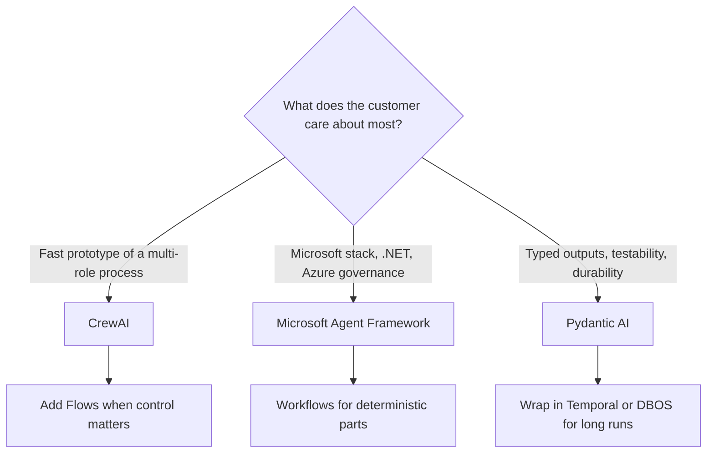
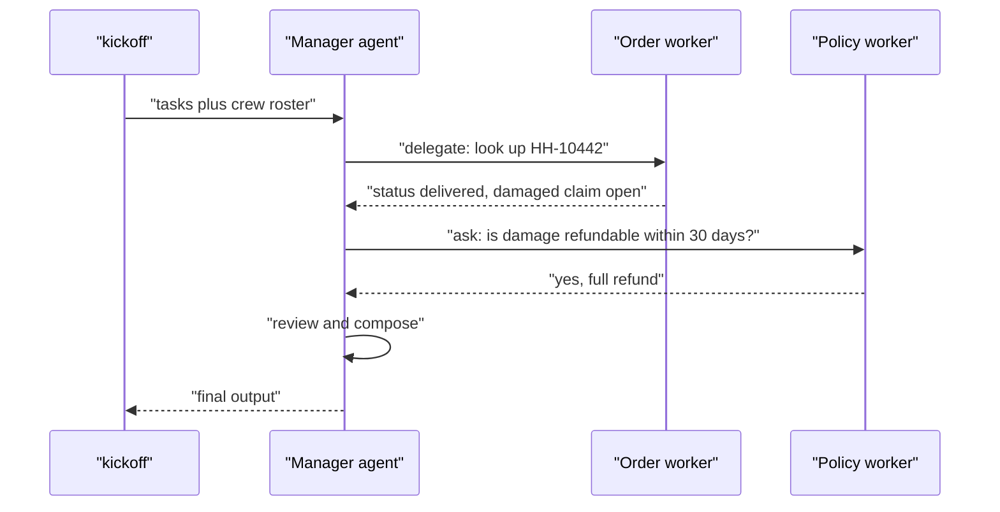
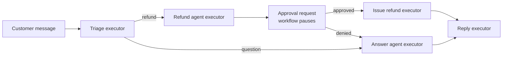
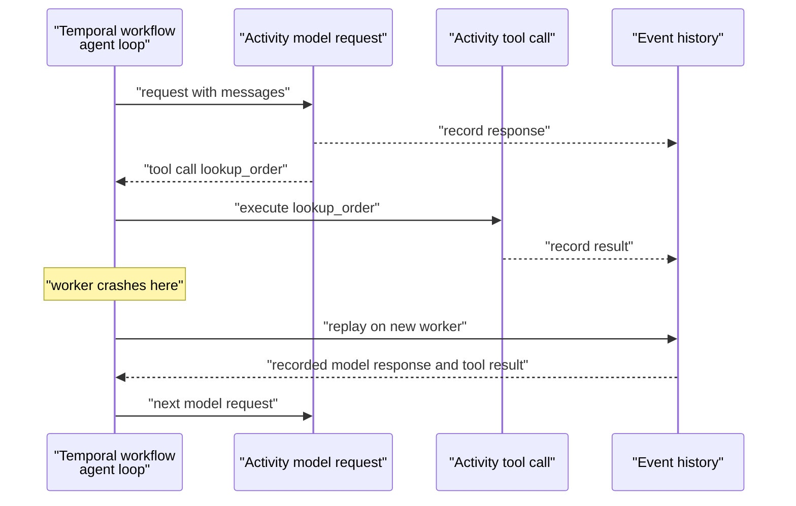
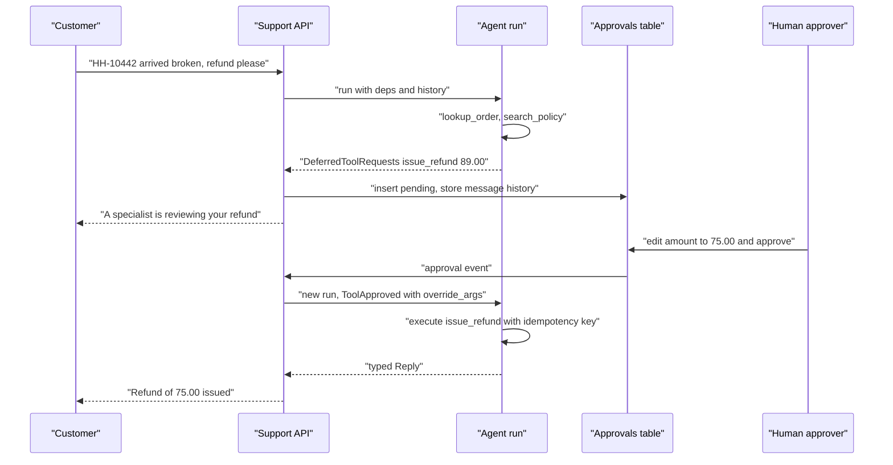
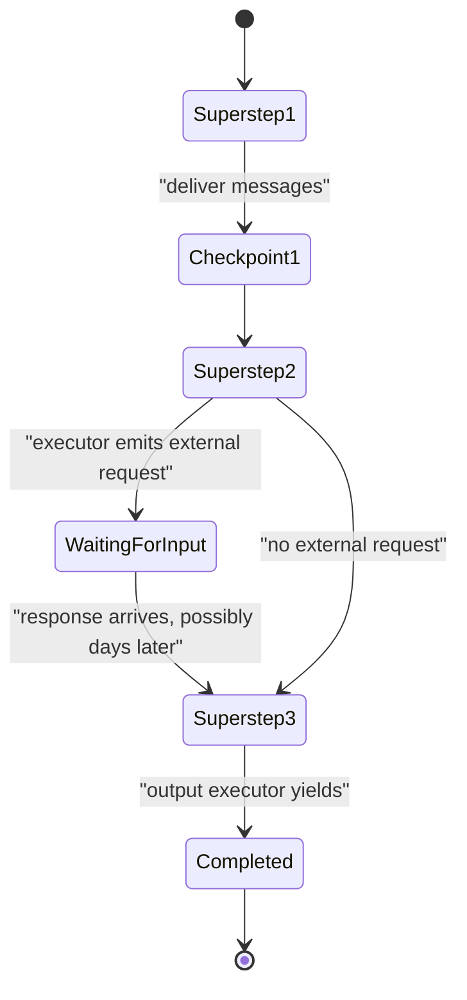
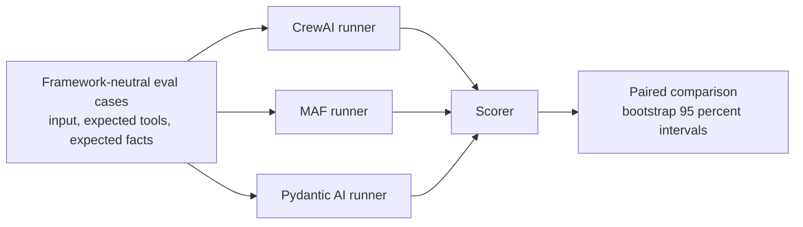
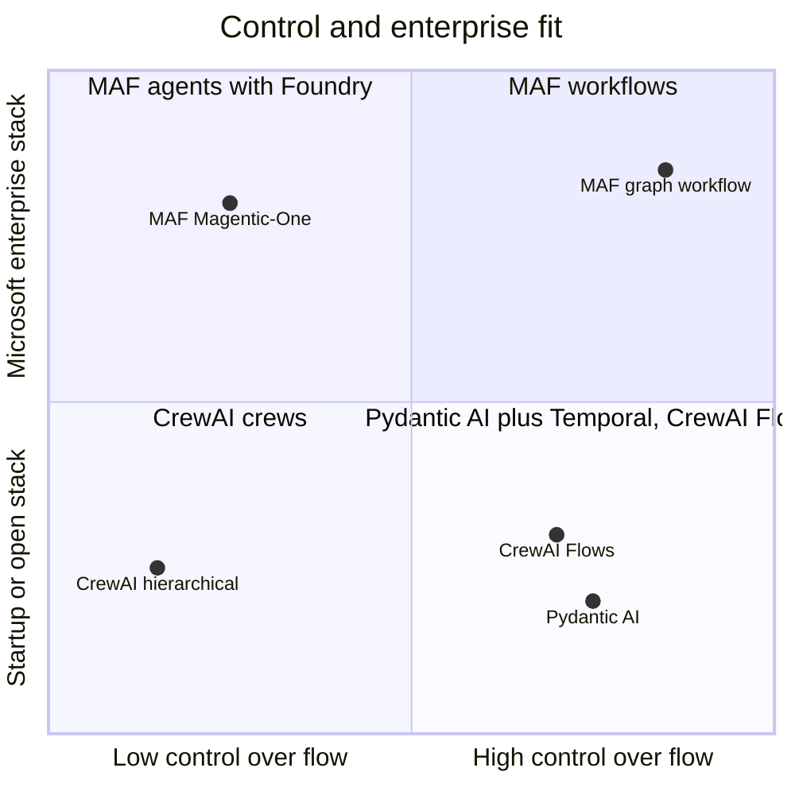

# Chapter 14: CrewAI, Microsoft Agent Framework, Pydantic AI

> **What this chapter covers**: Three frameworks with three different centres of gravity. CrewAI is role-based: agents with roles and goals, tasks, crews run sequentially or hierarchically, Flows for event-driven control, and a unified memory system. Microsoft Agent Framework is the merger of AutoGen and Semantic Kernel, GA as 1.0 in April 2026, with agents, middleware, graph-based workflows, multi-agent orchestration patterns, and Microsoft Foundry's hosted agents. Pydantic AI is type-first: typed agents, dependency injection through `RunContext`, validated structured output, and durable execution wrappers for Temporal, DBOS, and others. Each is built to the Part III reference spec.
>
> **Prerequisites**: Chapters 1, 2, 3, 5, 8, 10.
>
> **Where it is used**: Chapter 15 (framework selection), Chapter 22 (durable execution on Temporal), Chapter 32 (deployment on Foundry), Chapter 36 (the durable-agent capstone).

---

## 14.1 Level 1: Foundations

### 14.1.1 Three centres of gravity

The frameworks in this chapter answer different first questions.

| Framework | First question it answers | Core metaphor | Language |
|---|---|---|---|
| CrewAI | "Who does what?" | A team of role-playing agents working through tasks | Python |
| Microsoft Agent Framework | "How does this fit an enterprise Microsoft stack?" | Agents plus typed workflow graphs, with middleware | Python and .NET |
| Pydantic AI | "Is the output correct and typed?" | A typed function whose body is an LLM loop | Python |

CrewAI optimises for speed of expression: a four-agent content pipeline takes thirty lines. Microsoft Agent Framework optimises for enterprise fit: .NET parity, Azure identity, Foundry hosting, and orchestration patterns Microsoft Research already published (Magentic-One). Pydantic AI optimises for correctness: type checking, validated outputs, testability, and durable execution through proven workflow engines.



### 14.1.2 Vocabulary

**CrewAI**

- **Agent**: a model with a `role`, `goal`, and `backstory`, plus tools. The three text fields become the system prompt.
- **Task**: a unit of work with a `description`, `expected_output`, an assigned agent, and optional context from other tasks, output schema, guardrail, and human input flag.
- **Crew**: agents plus tasks plus a `process`.
- **Process**: `Process.sequential` (default, tasks in order) or `Process.hierarchical` (a manager agent plans, delegates, and validates).
- **Flow**: an event-driven Python class whose methods are decorated with `@start`, `@listen`, and `@router`, with typed or unstructured state and optional `@persist`.
- **Memory**: as of 2026, a unified `Memory` class that replaced the older short-term, long-term, entity, and external memory types.

**Microsoft Agent Framework (MAF)**

- **Agent**: the core abstraction in both Python and .NET, built over a chat client (a provider connector such as Foundry, Azure OpenAI, OpenAI, or others).
- **Thread**: the conversation state for an agent, which can be stored in the service or locally.
- **Tools**: functions, MCP servers, and hosted tools, with optional human approval.
- **Middleware**: interceptors around agent runs and function calls.
- **Context providers and memory**: pluggable components that inject context before a run and learn after it.
- **Workflows**: typed, graph-based orchestration of executors (agents or functions) connected by edges, with checkpointing and human-in-the-loop requests.
- **Orchestration patterns**: prebuilt sequential, concurrent, handoff, group chat, and Magentic-One workflows.
- **Foundry**: Microsoft's AI platform (formerly Azure AI Foundry, now branded Microsoft Foundry in Microsoft's 2026 materials), whose Agent Service hosts agents.

**Pydantic AI**

- **Agent**: generic over a dependency type and an output type, `Agent[Deps, Output]`.
- **RunContext**: the object tools and dynamic instructions receive, carrying `deps`, usage, messages, and run metadata.
- **Dependencies (`deps_type`)**: an injected object (database pool, HTTP client, tenant id) that tools use, swapped in tests.
- **Output type**: a Pydantic model, a union, or a function; the agent retries until the output validates.
- **Toolsets**: groups of tools, including MCP servers, that can be filtered, prefixed, or wrapped.
- **Deferred tools**: tools that need approval or external execution; the run ends with a request and resumes with results.
- **Durable execution**: wrappers or capabilities that run the agent inside Temporal, DBOS, Prefect, Restate, and other engines.

### 14.1.3 Status as of September 2026

- **CrewAI** is on a fast release cadence. It is independent of LangChain (it was rewritten without LangChain dependencies in 2024). The open-source framework is MIT licensed; CrewAI Enterprise (the AMP platform) is a commercial product. Flows are the recommended structure for production.
- **Microsoft Agent Framework** was announced in public preview in October 2025, reached release candidate in early 2026, and shipped 1.0 GA on 3 April 2026 for Python (`agent-framework` on PyPI) and .NET (`Microsoft.Agents.AI`). At the 1.0 release several pieces remained preview, including DevUI, the Foundry hosted-agent integration, and the agent harness. In August 2026 Microsoft announced GA of the Agent Framework harness and Foundry Hosted Agents (reported by InfoQ, August 2026). AutoGen is in maintenance mode (bug fixes and security patches); Semantic Kernel still ships releases, but Microsoft positions Agent Framework as the path for new agent work.
- **Pydantic AI** reached 1.0 in September 2025 and has continued with a stability policy. As of September 2026 its docs describe durable execution on Temporal, DBOS, Prefect, Restate, and several other engines, and they mark the original `TemporalAgent` wrapper as a legacy path in favour of a `TemporalDurability` capability. Check the current docs before choosing between the two.

### 14.1.4 How the three got here

The lineage explains the design choices.

- **CrewAI** (open-sourced late 2023) grew from the observation that multi-agent demos were easier to reason about when agents had jobs. Its early versions were built on LangChain; the rewrite to remove that dependency and the later addition of Flows reflected production users asking for less magic and more control.
- **Microsoft Agent Framework** descends from two Microsoft projects with different audiences. AutoGen (Microsoft Research, 2023) explored conversational multi-agent patterns and produced Magentic-One. Semantic Kernel (2023) served enterprise developers with plugins, connectors, telemetry, and .NET support. Maintaining both confused customers; MAF takes AutoGen's orchestration ideas and Semantic Kernel's enterprise plumbing.
- **Pydantic AI** (late 2024) comes from the team behind Pydantic, the validation library most LLM frameworks already depend on. Its premise is that the ergonomics of FastAPI (types, dependency injection, validation) should apply to agents.

Each lineage shows in the API: CrewAI thinks in teams, MAF thinks in enterprise components, Pydantic AI thinks in typed functions.

### 14.1.5 The reference spec, restated

The same agent as Chapters 10 to 13, defined at the top of Chapter 10:

| Element | Specification |
|---|---|
| Company | Harbor Home Goods, a synthetic online retailer |
| Task | Answer order questions, answer policy questions, issue refunds |
| Tool 1 | `lookup_order(order_id)` returns status, items, total, customer id |
| Tool 2 | `search_policy(query)` returns the top 3 policy passages with ids |
| Tool 3 | `issue_refund(order_id, amount_usd, reason)` writes to the payments system |
| Memory | Thread memory for the conversation, plus long-term customer preferences (for example "prefers store credit") |
| Approval gate | Any `issue_refund` above 50 USD pauses for a human; the human can approve, edit the amount, or reject |
| Tracing | Every model call and tool call traced with token counts and latency |
| Eval hook | 40 scripted tau-bench-style conversations with a pass/fail checker (Chapter 26) |

Each framework makes a different part of this easy. CrewAI makes the roles easy and the gate awkward. MAF makes the gate and the Azure plumbing easy. Pydantic AI makes the gate, including the edit-the-amount path, almost trivial, and leaves memory to you.

---

## 14.2 Level 2: Working knowledge

### 14.2.1 CrewAI: agents, tasks, crews

CrewAI's unit of thought is the task, not the turn. You describe work to be done and the agent that does it.

```python
from crewai import Agent, Task, Crew, Process

resolver = Agent(
    role="Harbor Home Goods support specialist",
    goal="Resolve order and refund questions accurately and within policy",
    backstory="You know Harbor's refund policy and always check the order first.",
    tools=[lookup_order, search_policy, issue_refund],
)

resolve = Task(
    description="Customer message: {message}. Resolve it.",
    expected_output="A reply to the customer, and any refund request raised.",
    agent=resolver,
    human_input=True,  # a human reviews before the task completes
)

crew = Crew(agents=[resolver], tasks=[resolve], process=Process.sequential, memory=True)
result = crew.kickoff(inputs={"message": "HH-10442 arrived broken, refund please"})
```

`kickoff(inputs=...)` interpolates `{message}` into task descriptions. The `expected_output` field is prompt text; for machine-readable results set `output_pydantic` or `output_json` on the task. A task `guardrail` (a function or a text description checked by an LLM) validates output and triggers retries.

The `human_input=True` flag gives the reference spec's approval gate in its crudest form: the agent's output is shown to a human who can give feedback before the task finishes. It is console-oriented by default. For a real approval queue you want Flows, below, or CrewAI Enterprise's HITL webhooks.

### 14.2.2 CrewAI: sequential vs hierarchical

| Process | How tasks run | Who assigns work | Cost | Predictability |
|---|---|---|---|---|
| Sequential | In list order; each task's output is context for later tasks | You, statically | Lowest | High |
| Hierarchical | A manager agent plans, delegates to workers, reviews results | The manager LLM | Higher, often much higher | Low to medium |

Hierarchical requires a `manager_llm` or a custom `manager_agent`. The manager uses delegation tools to assign tasks to workers and to ask them questions. It is the CrewAI version of the orchestrator-workers pattern (Chapter 2).

Practitioners report that hierarchical mode often misbehaves: the manager executes tasks itself, delegates to the wrong worker, or loops on review (a Towards Data Science analysis in 2025 documented these failure modes, and GitHub discussions on `manager_agent` show the same confusion). Treat hierarchical as a prototyping tool. In production, encode the routing you want in a Flow and use sequential crews inside it.



### 14.2.3 CrewAI: Flows

Flows are how CrewAI adds deterministic control. A Flow is a class; methods are steps; decorators wire them.

```python
from crewai.flow.flow import Flow, start, listen, router
from pydantic import BaseModel

class SupportState(BaseModel):
    message: str = ""
    intent: str = ""
    refund_amount: float = 0.0
    order_id: str = ""

class SupportFlow(Flow[SupportState]):
    @start()
    def classify(self):
        self.state.intent = classify_intent(self.state.message)

    @router(classify)
    def route(self):
        return "refund" if self.state.intent == "refund" else "answer"

    @listen("refund")
    def handle_refund(self):
        return refund_crew.kickoff(inputs={"message": self.state.message})

    @listen("answer")
    def handle_answer(self):
        return answer_crew.kickoff(inputs={"message": self.state.message})
```

`@start()` marks entry points. `@listen(x)` runs when method `x` finishes or when a router emits label `x`. `@router(x)` returns a label string that selects the next listeners. `or_` and `and_` combinators let a listener wait for any or all of several methods. State is either a Pydantic model (typed) or a dictionary, and each flow run gets an id. `@persist` saves state after each method (SQLite by default) so a flow can be resumed by id.

A sketch of the gate as Flow methods (the refund crew proposes, the Flow decides):

```python
    @router(handle_refund)
    def gate(self):
        return "needs_approval" if self.state.refund_amount > 50 else "execute"

    @listen("needs_approval")
    def park(self):
        approvals.create(flow_id=self.state.id, amount=self.state.refund_amount)
        # flow ends here; @persist has saved state

    @listen("execute")
    def execute(self):
        payments.refund(self.state.order_id, self.state.refund_amount,
                        key=f"refund:{self.state.id}")
```

On the reviewer's decision, your service reloads the flow by its state id, sets `refund_amount` to the approved or edited value (or marks it rejected), and kicks off from the execute or reply step. The exact resume call depends on the CrewAI version; the design (the model proposes, code gates, the human's number wins) does not.

That last feature is how CrewAI satisfies the approval gate robustly: the refund branch writes a pending approval, the flow ends, and a second invocation with the same state id and the approver's decision resumes it. CrewAI has added first-class human feedback support in Flows in 2026; check the current docs for the decorator name and semantics before relying on it.

### 14.2.4 CrewAI: memory

CrewAI's 2026 memory system is a single `Memory` class. On save, an LLM infers scope, categories, importance, and metadata. On recall, a composite score blends semantic similarity, recency decay, and importance. Storage defaults to LanceDB. It can be used standalone, with crews (`memory=True`), with individual agents, or inside Flows.

Two consequences for the reference spec:

- Remembering that a customer prefers store credit works out of the box, but it is fuzzy retrieval, not a keyed lookup. For preferences that change what the agent does with money (store credit versus card refund), store them in Flow state or your own customer table and inject them, rather than hoping recall ranks them first.
- Every save costs an LLM call for analysis. At high volume that is a real line item (Section 14.3.3).

Older tutorials use `short_term_memory`, `long_term_memory`, and `entity_memory` parameters. Those describe the pre-unification design; do not copy them into new code without checking the current docs.

### 14.2.5 Microsoft Agent Framework: the agent

MAF's agent is a thin, provider-agnostic object over a chat client. In Python:

```python
from agent_framework import Agent  # names per the 1.0 docs; verify in your version
from agent_framework.openai import OpenAIChatClient

agent = Agent(
    chat_client=OpenAIChatClient(),
    name="harbor-support",
    instructions="You are Harbor Home Goods support. Look up orders before answering.",
    tools=[lookup_order, search_policy, issue_refund],
)
thread = agent.get_new_thread()
reply = await agent.run("Where is HH-10442?", thread=thread)
```

Treat the import paths and constructor arguments above as illustrative. The preview releases used `ChatAgent` and helper methods such as `create_agent` on the client; the 1.0 release notes describe `Agent` as the core abstraction in both languages. Class names moved between preview and GA, so read the 1.0 migration notes before porting preview code.

The pieces that matter conceptually:

- **Chat clients** are the provider boundary: Foundry, Azure OpenAI, OpenAI, and others, including Anthropic and local models through connectors.
- **Threads** hold conversation state. Some providers store it server-side (a thread id), others locally (a message list you serialise).
- **Function tools** are plain functions with type annotations. Tools can be marked as requiring human approval, in which case the run returns an approval request that the caller answers before the tool executes. That is the reference spec's gate.
- **Middleware** wraps agent runs and function invocations for logging, policy, redaction, and retries.
- **The 50 USD threshold.** MAF's function-tool approval is typically configured per tool (require approval always, or never) rather than per argument value; check whether your version adds conditional approval. If not, the spec's conditional rule needs either function middleware that inspects `amount_usd` and requests approval only above 50, or a workflow executor that routes large refunds to an external request. The workflow route also handles the edit path cleanly: the response message carries the approved amount, and the payout executor uses it.

- **Context providers** add memory: they run before each invocation to inject context and after it to update stores.

### 14.2.6 Microsoft Agent Framework: workflows

Workflows are MAF's answer to LangGraph. A workflow is a directed graph of **executors** connected by **edges**. Executors receive typed messages and emit messages; agents can be wrapped as executors. Edges can be direct, conditional, fan-out, or fan-in. The builder validates types at build time, which catches wiring bugs before runtime.

Key properties:

- **Superstep execution.** Messages are delivered in rounds (a Pregel-style model), which makes concurrent branches deterministic.
- **Checkpointing.** Workflow state is checkpointed at superstep boundaries and can be resumed, including in another process.
- **Human-in-the-loop.** An executor can emit a request for external input; the workflow pauses until a response arrives.
- **Streaming events.** Callers observe executor starts, outputs, and completions as events.

The prebuilt orchestrations are built on workflows:

| Pattern | Behaviour | Maps to |
|---|---|---|
| Sequential | Agents run in order, each seeing prior output | CrewAI sequential, ADK SequentialAgent |
| Concurrent | Agents run in parallel, results aggregated | ADK ParallelAgent |
| Handoff | Agents transfer control to each other | OpenAI Agents SDK handoffs |
| Group chat | A manager selects the next speaker | AutoGen group chat |
| Magentic-One | An orchestrator keeps a task ledger and progress ledger, directs specialists, and replans | Microsoft Research's Magentic-One (2024) |



### 14.2.7 Microsoft Agent Framework: Foundry and deployment

Microsoft Foundry's Agent Service runs agents as managed resources. There are two shapes:

- **Service-defined agents**: the agent definition (model, instructions, tools such as file search, code interpreter, Bing grounding, and connectors) lives in Foundry, and your code calls it through a chat client. Threads live server-side.
- **Hosted agents**: your MAF code (or another framework's) is packaged as a container and Foundry runs it, with consumption billing, identity, and governance. Hosted Agents were preview at MAF 1.0 and reported GA in August 2026.

Other deployment targets include Azure Container Apps, Azure Functions (MAF documents a durable agents extension on Durable Functions), AKS, and any container host. For the reference spec, Foundry gives identity through Microsoft Entra, content safety filters, and tracing into Application Insights through OpenTelemetry.

### 14.2.8 Pydantic AI: the typed agent

Pydantic AI treats an agent as a typed function.

```python
from dataclasses import dataclass
from pydantic import BaseModel
from pydantic_ai import Agent, RunContext

@dataclass
class Deps:
    tenant_id: str
    db: "OrdersRepo"

class Reply(BaseModel):
    message: str
    refund_requested: bool
    order_id: str | None = None

support = Agent(
    "anthropic:claude-sonnet-4-5",  # model string; check the current list
    deps_type=Deps,
    output_type=Reply,
    instructions="You are Harbor Home Goods support. Look up orders before answering.",
)

@support.tool
async def lookup_order(ctx: RunContext[Deps], order_id: str) -> dict:
    """Return status, items and total for a Harbor order id."""
    return await ctx.deps.db.get(ctx.deps.tenant_id, order_id)
```

Three mechanisms:

1. **Dependency injection.** `deps_type` declares what tools receive. The tenant id and database client come in through `ctx.deps`, never through the prompt. In tests you pass a fake repository. This is the cleanest multi-tenancy story of any framework in Part III, because tenant scoping is enforced by code the model cannot see.
2. **Validated output.** With `output_type=Reply`, the agent exposes an output tool (or uses native structured output where the provider supports it) and validates the result. On validation failure, the error is sent back to the model and it retries, up to a configurable retry count. Output validators can add business rules and raise `ModelRetry`.
3. **Static typing.** `Agent[Deps, Reply]` is generic. A type checker catches a tool that expects the wrong deps type or code that reads a field the output does not have.

### 14.2.9 Pydantic AI: approvals, history, memory, tracing

- **Approval gate.** Pydantic AI's deferred tools map exactly onto the spec. A tool registered with `requires_approval=True` always defers; for the spec's "above 50 USD" rule, the tool instead raises `ApprovalRequired` only when `amount_usd > 50` and the call has not been approved yet. The run then ends with `DeferredToolRequests` as its output (include it in the agent's output types). Your application stores the pending calls and message history, collects a decision, and starts a new run with `message_history=` and `deferred_tool_results=`, a `DeferredToolResults` mapping each tool call id to `True` (approve), `ToolApproved(override_args={"amount_usd": 40.0})` (edit the amount), or `ToolDenied("reason")` (reject). The run is stateless between the two calls, which makes it easy to put the pause in a queue or database. Names are from the deferred-tools docs as of September 2026.
- **History.** `result.all_messages()` returns the message list; you persist it (for example as JSON) and pass `message_history=` on the next run. History processors can trim or summarise.
- **Memory.** Pydantic AI does not ship a long-term memory store. You implement it as tools or dynamic instructions over your own database, or integrate Mem0 or similar (Chapter 8). For the reference spec, thread memory is the persisted message history, and customer preferences ("prefers store credit") are loaded from your customer table into `deps` and rendered by a dynamic instruction function, with a `save_preference` tool for updates.
- **Tracing.** Pydantic AI instruments with OpenTelemetry and integrates natively with Pydantic Logfire; any OTel backend works.

The gate in code, following the deferred-tools docs:

```python
from pydantic_ai import ApprovalRequired, DeferredToolRequests

support = Agent(..., deps_type=Deps, output_type=[Reply, DeferredToolRequests])

@support.tool
async def issue_refund(ctx: RunContext[Deps], order_id: str,
                       amount_usd: float, reason: str) -> dict:
    """Refund an order. Amounts above 50 USD need a Harbor reviewer."""
    if amount_usd > 50 and not ctx.tool_call_approved:
        raise ApprovalRequired
    key = f"refund:{ctx.tool_call_id}"  # idempotency key
    return await ctx.deps.payments.refund(order_id, amount_usd, reason, key)
```

The first run returns `DeferredToolRequests`. The resume run passes `ToolApproved(override_args={"amount_usd": 75.0})` for an edit, and the tool re-executes with `ctx.tool_call_approved` true and the edited amount. Check that the attribute names match your version; the pattern is stable, the spelling has moved before.

### 14.2.10 Pydantic AI: durable execution

Durable execution (Chapter 22) means a crash, deploy, or multi-day wait does not lose progress. Pydantic AI does not implement its own engine. It adapts the agent loop to existing engines.

With Temporal, the pattern is: model requests, tool calls, and MCP communication run as Temporal activities (non-deterministic I/O), while the agent's control loop runs in the deterministic workflow. On crash, Temporal replays the workflow from its event history, reusing recorded activity results, and continues. Requirements that follow directly from that design:

- `deps` must be serialisable, because it crosses the workflow-activity boundary and is stored in event history (which Temporal caps at 2 MB per payload by default).
- Tools running as activities get a reduced `RunContext` (deps, run id, usage, metadata, but not the model or messages).
- Tool argument validation runs in its own activity before approval or deferral, so validators must be idempotent.

With DBOS, the agent's run methods become DBOS workflows and steps are checkpointed to Postgres. DBOS is a library rather than a separate cluster, which is lighter to operate than Temporal.



### 14.2.11 Pydantic AI: toolsets, MCP, and multi-agent composition

Tools in Pydantic AI can be grouped into toolsets. A toolset can be a set of functions, an MCP server (stdio or streamable HTTP), or a wrapper around another toolset that filters, renames with a prefix, or requires approval for some tools. This is how you give the same agent a local `lookup_order` function and a remote MCP knowledge-base server without special cases.

Multi-agent composition is plain Python. Three patterns the docs describe:

- **Agent delegation**: a tool on agent A calls agent B's `run` and returns its output, passing `ctx.usage` so the token budget is shared. This is agents-as-tools.
- **Programmatic hand-off**: application code runs agent A, inspects its typed output, and decides whether to run agent B. Because outputs are typed, the hand-off condition is ordinary code.
- **Graphs**: for complex state machines, the Pydantic ecosystem offers a graph library; most teams find the first two patterns enough.

Usage limits (`UsageLimits`) cap requests and tokens per run, which is the loop bound Strands lacks by default. Set them on every production run.

### 14.2.12 CrewAI: tools and structured output in detail

CrewAI tools come from three places: functions decorated with `@tool`, subclasses of `BaseTool` with a Pydantic `args_schema`, and the `crewai-tools` package (search, scraping, file, and database tools). MCP servers can be attached as tool sources through an adapter.

Tool-level features matter for the reference spec:

- **Caching.** Tools cache results by argument by default in CrewAI, controllable with a cache function. Good for `search_policy`, dangerous for `lookup_order` if order status changes mid-conversation. Disable caching on anything time-sensitive.
- **Result as answer.** A tool can be flagged so its output becomes the task's final answer directly, skipping another model call.
- **Structured task output.** `output_pydantic=Reply` makes the task's result parseable; `task.output.pydantic` returns the object. Pair it with a `guardrail` function that checks business rules (refund not above order total) and returns failure text to trigger a retry.

The guardrail plus structured output combination is the closest CrewAI gets to Pydantic AI's validated output.

### 14.2.13 The approval gate, end to end

The approval gate is the part of the reference spec that separates toy agents from deployable ones, so walk it through once with Pydantic AI's deferred tools. The same shape applies to MAF tool approval and CrewAI persisted Flows.



Design decisions in that diagram:

1. **The pause is between runs, not inside one.** No process waits in memory for a human. Any worker can pick up the approval event.
2. **The approval record stores the exact arguments.** The human sees "refund 89.00 on HH-10442", edits it to 75.00, and the resumed run executes the overridden arguments, not a fresh model decision that might differ. `override_args` is what makes the spec's edit path a one-liner.
3. **Idempotency key.** Derived from the approval id, so a retried resume cannot refund twice.
4. **Expiry.** Pending approvals older than a threshold resolve to "denied, escalated", and the customer gets a follow-up message.
5. **Audit.** The approval row, the message history, and the trace id are linked, so an auditor can reconstruct why money moved (Chapter 33).

In MAF the same flow uses the tool-approval request and response content types, or a workflow executor that emits an external request and checkpoints. In CrewAI it is a Flow branch plus `@persist`, resumed by state id.

---

## 14.3 Level 3: Depth

### 14.3.1 How CrewAI builds the prompt

CrewAI's abstraction has a cost you should see. For each task execution the agent's system prompt is assembled from the role, goal, and backstory, then the task description, expected output, context from prior tasks, tool descriptions, and (if memory is on) recalled memories. The agent then runs a ReAct-style loop until it produces a final answer that satisfies the expected output.

Consequences:

- **Prompt control is indirect.** You write role, goal, backstory, and expected output; CrewAI writes the rest from templates. You can override templates, but most teams do not, and the prompt the model sees is longer than people expect. Inspect it in traces before tuning.
- **Context from prior tasks is concatenated.** In a sequential crew of five tasks, the fifth task's prompt includes the outputs of the four before it, unless you set `context` explicitly per task. Set it.
- **Role text is not magic.** "You are a world-class support specialist" does not measurably improve tool use on current models. Role text is useful to scope behaviour ("never promise a refund"); treat it as instructions, not persona.

### 14.3.2 Hierarchical cost arithmetic

Take a crew of three workers and a manager on a refund request that needs two worker contributions. Assume a manager prompt of 2,500 tokens (roster, tasks, delegation tool schemas) and worker prompts of 1,500 tokens.

Sequential crew (two tasks, fixed order):

- Task 1: worker runs 2 model calls, about 1,500 + 2,100 = 3,600 input.
- Task 2: worker runs 2 calls with task 1 output in context, about 1,900 + 2,500 = 4,400 input.
- Total about 8,000 input tokens.

Hierarchical crew:

- Manager planning call: 2,500.
- Two delegations, each a manager call (about 2,800 and 3,400 as context grows) plus the worker's two calls (3,600 each): 2,800 + 3,400 + 7,200 = 13,400.
- Manager review and final composition: about 4,000.
- Total about 19,900 input tokens, roughly 2.5 times sequential. If the manager asks a clarifying question or re-delegates once, add another 5,000 to 7,000.

At $3 per million input tokens (a Sonnet-class price; check current), that is $0.024 versus $0.060 per request before output tokens. At 50,000 requests a month, $1,200 versus $3,000. The manager earns its cost only when the routing genuinely cannot be written down.

### 14.3.3 Memory write cost in CrewAI

The unified memory analyses each saved item with an LLM. Suppose each task completion saves two items, each analysis call is about 600 input and 150 output tokens, and a small model is used at $0.15 per million input and $0.60 per million output. Per request: 2 x (600 x 0.15e-6 + 150 x 0.60e-6) = 2 x ($0.00009 + $0.00009) = $0.00036. At 50,000 requests a month, $18. Cheap with a small model; ten times that if the memory LLM defaults to your main model. Configure the memory model explicitly.

### 14.3.4 MAF workflows internals

MAF workflows use a superstep model. In each superstep, all executors with pending messages run (concurrently), their outputs are collected, and the messages are delivered at the start of the next superstep. Checkpoints are taken between supersteps.

This design has three properties worth knowing:

- **Deterministic concurrency.** Fan-out branches run in the same superstep; their outputs are delivered together, so fan-in executors see a consistent set. No read-your-sibling's-half-written-state races.
- **Resumable at a boundary.** A crash mid-superstep replays that superstep from the last checkpoint. Executors with side effects must be idempotent, the same rule as Temporal activities.
- **Type-checked edges.** Executors declare the message types they handle. The builder rejects an edge from an executor that emits `RefundRequest` to one that only handles `Question`.

Compared with LangGraph (Chapter 10): both are Pregel-inspired and checkpoint at step boundaries. LangGraph centres a shared state object with reducers; MAF centres typed messages between executors. LangGraph has the more mature ecosystem and time travel; MAF has .NET parity and typed message contracts.



### 14.3.5 Magentic-One in practice

Magentic-One (Microsoft Research, November 2024) is an orchestrator that maintains two ledgers: a task ledger (facts, guesses, plan) and a progress ledger (is the task done, are we looping, who acts next, what instruction). Each orchestrator step is a structured LLM call that updates the progress ledger. When progress stalls for a set number of rounds, it replans by rewriting the task ledger.

It is strong on open-ended tasks (web research, file manipulation) where the plan changes as facts arrive. It is expensive: the orchestrator's ledger call happens every step, and the ledger grows. For a support agent it is the wrong tool. For a deep research agent (Chapter 9) it is a reasonable default. The published results were on GAIA, AssistantBench, and WebArena in 2024; they do not transfer to support workloads, so do not cite them to a customer as evidence for their use case.

### 14.3.6 Pydantic AI retries and their cost

Validated output buys correctness with retries. If a model produces invalid output 8 percent of the time on first attempt and 2 percent on retry (numbers from your own traces, not a benchmark), then the expected number of output attempts is 1 + 0.08 + 0.08 x 0.02 = about 1.082, an 8 percent token overhead on the final step. The benefit is that the downstream code never sees an invalid `Reply`. The risk is a retry storm when the schema is ambiguous: a field the model cannot fill correctly fails every attempt. Cap retries (the default is small), log validation errors as metrics, and treat a rising retry rate as a schema design bug (Chapter 3).

### 14.3.7 Durable execution overhead

Temporal records every activity input and output in event history. For the reference agent with 4 model calls and 3 tool calls per request, each model payload around 12 KB (messages grow), history per request is on the order of 60 to 100 KB. At 50,000 requests a month, that is 3 to 5 GB of history per month before retention, which matters on Temporal Cloud's storage pricing and on self-hosted database sizing. Each activity also adds a scheduling round trip, typically tens of milliseconds on a healthy cluster; small next to a model call, not zero.

DBOS writes a checkpoint row per step to Postgres. Similar data volume, one fewer system to run, and your existing Postgres operations apply.

Neither is worth it for a 10-second support exchange that can simply be retried. Both are worth it for an agent that waits hours for an approval, runs for many minutes, or performs side effects that must not repeat.

### 14.3.8 Failure modes

| Failure | Framework | Symptom | Fix |
|---|---|---|---|
| Manager does the work itself | CrewAI hierarchical | Workers never called, low quality | Use a Flow with explicit routing |
| Context bloat across tasks | CrewAI sequential | Late tasks slow and expensive | Set `context` per task |
| Memory recall returns stale or wrong facts | CrewAI | Wrong name or tier used | Keyed facts in state or DB, not fuzzy memory |
| Preview API names in GA code | MAF | Import errors after upgrade | Follow the 1.0 migration notes |
| Non-idempotent executor | MAF workflows | Double refund after resume | Idempotency keys on side effects |
| Thread stored service-side, lost with resource | MAF with Foundry | Conversation gone after cleanup | Know where threads live; back up if needed |
| Unserialisable deps | Pydantic AI with Temporal | Workflow fails to start | Make deps a Pydantic-serialisable model |
| Retry storm on ambiguous schema | Pydantic AI | Token spike, then failure | Clarify schema, cap retries, alert on retry rate |
| Non-deterministic code in workflow | Pydantic AI with Temporal | Replay errors | All I/O in activities; no random or time calls in workflow code |

### 14.3.9 Testing each framework

Testability differs more between these three than between any other trio in Part III.

**Pydantic AI** is the easiest to test. It ships a `TestModel` that calls every tool with schema-valid arguments and returns a valid output, and a `FunctionModel` whose responses you script. Combined with deps injection, a unit test builds a fake repository, overrides the agent's model with the test model, runs the agent, and asserts on calls and output. No network, no tokens, runs in milliseconds. The docs also describe a global switch that blocks real model requests during tests, which prevents an accidental paid call in CI.

**Microsoft Agent Framework** tests best at two levels. Unit-test executors in isolation, since they are typed message handlers. Integration-test workflows with a fake chat client that returns scripted responses. Middleware is the natural place to record calls for assertions.

**CrewAI** is the hardest to unit-test, because the prompt is assembled internally and the loop is inside the agent. Most teams test at the Flow level with a cheap model and assert on state after each method, plus task guardrails as executable checks. Budget for a larger slice of tests that hit a real (small) model.

A shared rule across all three: the eval set (Chapter 26) is framework-independent. Keep test cases as data (input, expected tool calls, expected facts in the answer) so the same set can run against any implementation. That is how the Chapter 36 capstone compares three frameworks fairly.



### 14.3.10 Observability in practice

All three emit OpenTelemetry, but the span shapes differ, which matters when you compare them in one backend.

- **Pydantic AI** emits an agent run span with child spans per model request and tool call, following the OpenTelemetry GenAI semantic conventions (Chapter 28), with token usage as attributes. Logfire renders them natively; Langfuse and Phoenix accept them over OTLP.
- **MAF** emits spans for agent invocations, chat client calls, function calls, and workflow executor runs, and targets Application Insights and Aspire dashboards by default. Workflow spans nest executor spans under a superstep structure.
- **CrewAI** has its own tracing for its enterprise platform and integrations with third-party backends through OpenTelemetry instrumentation. Crew, task, agent, and tool levels show up as nested spans. The prompt CrewAI assembled is visible in the model span, which is the single most useful thing to look at when a crew misbehaves.

For a customer running several frameworks, normalise on the GenAI semantic conventions at the collector (rename attributes if needed) so that "tokens per task" and "tool error rate" mean the same thing across implementations.

### 14.3.11 Worked comparison on one request

Take one request, "HH-10442 arrived broken, can I get a refund?", through each framework's idiomatic design, with a Sonnet-class model at an illustrative $3 per million input and $15 per million output tokens.

| Framework design | Model calls | Input tokens | Output tokens | Cost | Human pauses |
|---|---|---|---|---|---|
| CrewAI Flow: classifier call, then one-agent sequential crew | 4 | 9,800 | 700 | $0.040 | 1 via persist and resume |
| CrewAI hierarchical crew, manager plus two workers | 7 | 19,900 | 1,300 | $0.079 | 1 via human input |
| MAF workflow: code triage, one agent executor, approval request | 3 | 7,400 | 550 | $0.030 | 1 via external request |
| Pydantic AI agent with deferred refund tool | 3 | 7,100 | 520 | $0.029 | 1 via deferred call |

Arithmetic for the Pydantic AI row: input 7,100 x $3e-6 = $0.0213; output 520 x $15e-6 = $0.0078; total $0.0291. The other rows follow the same method. The token counts are this chapter's synthetic estimates for minimal idiomatic implementations; your prompts will differ. The pattern is robust: the frameworks cost the same per model call, and the design (how many calls, how much prompt per call) sets the bill.

### 14.3.12 The reference spec compared

| Reference spec item | CrewAI | Microsoft Agent Framework | Pydantic AI |
|---|---|---|---|
| Three tools | `@tool` or `BaseTool` | Annotated functions | `@agent.tool` with `RunContext` |
| Thread memory | Crew or Flow state, unified Memory | Agent thread | Persisted message history |
| Preference memory | Unified Memory or Flow state | Context provider over a store | Loaded into deps, dynamic instructions |
| Gate: approve, edit, reject | Flow router on the decision, resume by state id | Approval response; edit via a workflow request executor | `True`, `ToolApproved(override_args=...)`, `ToolDenied` |
| 40 scripted conversations | Your harness around `kickoff` | Your harness around `run` | Your harness; `TestModel` for plumbing tests |
| Approval gate | Task human input, Flow persist and resume | Tool approval request, workflow external request | Deferred tools |
| Durable pause | `@persist` on Flows | Workflow checkpoints | Temporal, DBOS, others |
| Tracing | OTel integrations, CrewAI tracing | OTel, Application Insights | OTel, Logfire |
| Typed output | `output_pydantic` | Structured output via client | `output_type`, validated with retries |

---

## 14.4 Level 4: Mastery

### 14.4.1 When each wins



- **CrewAI** wins for fast demos of multi-role processes and for teams who think in roles and tasks. It is weaker when the customer needs precise prompt control or predictable cost. Flows close much of that gap.
- **Microsoft Agent Framework** wins inside Microsoft enterprises: .NET teams, Entra identity, Foundry governance, Microsoft 365 and Copilot integration, and a vendor with long-term support commitments. It is weaker for teams outside Azure who do not want the Microsoft opinion about everything.
- **Pydantic AI** wins when outputs feed other software, when testability matters, and when durability must come from a proven engine. It is weaker for multi-agent choreography, which it leaves to you (a graph library exists in the Pydantic ecosystem, but most teams compose agents in plain Python).

### 14.4.2 The FDE's migration map

Customers bring existing code. Common moves:

- **AutoGen 0.2 or 0.4 to MAF.** Microsoft publishes migration guides. Group chats map to the group chat orchestration; AutoGen's `AssistantAgent` maps to the MAF agent; custom speaker selection maps to a custom manager. Budget time for the event and message type changes, not just renames.
- **Semantic Kernel to MAF.** Kernel plugins become tools; SK agents become MAF agents; SK process framework workflows map onto MAF workflows. Microsoft ships migration assistants (per the 1.0 announcement) that generate upgrade plans; treat their output as a starting point to review, not a finished migration.
- **CrewAI prototype to production.** Keep the crews that work, wrap them in a Flow with explicit routing, move keyed facts out of fuzzy memory into state, configure the memory LLM, and add evals before and after.
- **Ad hoc Python to Pydantic AI.** The lightest migration: wrap existing functions as tools, define deps and output types, and the agent becomes testable.

### 14.4.3 Designing for durability from day one

Chapter 22 covers durable execution in depth. The framework-level decision is:

1. **Short, retryable exchanges** (under a minute, no irreversible side effects): no durable engine. Persist history, retry the whole turn on failure.
2. **Medium runs with a human pause** (approval gates): the framework's own persistence suffices. CrewAI `@persist`, MAF workflow checkpoints, Pydantic AI deferred tools with history in your database.
3. **Long or side-effecting runs** (multi-step financial operations, hours of work, many external calls): a durable engine. Pydantic AI on Temporal or DBOS, MAF on Durable Functions, or LangGraph with a durable checkpointer plus idempotent tools.

The mistake to avoid is jumping to tier 3 for a tier 1 problem. Temporal is excellent and adds a cluster, a programming model, and determinism constraints.

### 14.4.4 Multi-tenancy across the three

- **CrewAI**: memory storage is per-process by default. In a multi-tenant service, scope memory storage per tenant (separate paths or collections) and never let a crew see another tenant's memory. Tools must receive tenant context explicitly; there is no built-in injection mechanism as strong as Pydantic AI's deps.
- **MAF**: use Entra identities per tenant or per application, scope Foundry projects, and pass tenant context through middleware. Service-side threads live in the Foundry project; project boundaries are tenant boundaries.
- **Pydantic AI**: tenant id in deps, repositories that require it, and tests that assert a tool cannot be called without it. The model never sees the tenant id unless you put it in the prompt, which you should not.

### 14.4.5 Where vendors and practitioners disagree

- **Role-playing agents.** CrewAI's premise is that giving agents roles and backstories helps. The evidence that persona text improves task performance on current models is weak; the evidence that clear instructions and good tools help is strong. CrewAI works well in practice mainly because it forces you to decompose work into tasks with expected outputs, not because of the personas.
- **Framework consolidation.** Microsoft presents MAF as the unification of AutoGen and Semantic Kernel. Semantic Kernel still ships releases in 2026 and AutoGen still gets patches, so customers will see all three. Recommend MAF for new work, and do not force a migration of a stable SK application without a reason.
- **Durability in the framework vs in the engine.** Some frameworks build their own persistence (LangGraph checkpointers, CrewAI persist, MAF checkpoints). Pydantic AI delegates to engines built for it. The engine approach gives stronger guarantees and more operational burden. Both camps are right for different run lengths.
- **Magentic-One as a general orchestrator.** Microsoft's materials present it prominently. Its published strength is on web and file tasks; outside that, a simpler pattern is usually cheaper and just as good. Measure before adopting.

### 14.4.6 Foundry hosted vs self-hosted for MAF

| Factor | Foundry Agent Service | Self-hosted on Container Apps or AKS |
|---|---|---|
| Identity and governance | Entra, project-level RBAC, content filters built in | You wire Entra and policy yourself |
| Thread and state storage | Service-managed for service-defined agents | Your database, your retention rules |
| Tooling | Hosted tools (file search, code interpreter, grounding) | Anything you can call |
| Model choice | Models in the Foundry catalogue | Any provider with a MAF connector |
| Billing | Consumption billing for hosted agents plus model tokens | Compute you provision plus tokens |
| Portability | Lower | Higher |

For regulated customers the deciding question is usually data residency and retention: where threads and files live, for how long, and who can read them. Get that in writing from the customer's compliance team before choosing (Chapter 33).

### 14.4.7 An FDE decision memo, worked

A synthetic insurer, Northfield Mutual, runs .NET services on Azure and wants a claims-intake agent with a mandatory adjuster approval step and 18-month audit retention. Candidate choices:

- MAF in .NET with a graph workflow: triage executor, document-extraction agent, policy-check executor, approval request, payout executor. Hosted in Foundry or Container Apps. Checkpoints in durable storage. Tracing to Application Insights. Fits their language, identity, and governance.
- Pydantic AI on Temporal: stronger typing of extracted fields and durable retries, but a Python service in a .NET shop and a new platform to operate.
- CrewAI: fastest demo, least control over prompts and audit trail.

Recommendation: MAF workflows, with extracted-claim schemas validated at the workflow edge, idempotency keys on payouts, and an eval set of 200 synthetic claims with bootstrap intervals on extraction accuracy before go-live. The memo also records the risk that parts of the Foundry integration were preview until August 2026 and names a fallback (Container Apps hosting).

---

## 14.5 Subtopic checklist

- [x] CrewAI agents: role, goal, backstory, tools
- [x] CrewAI tasks: description, expected output, context, structured output, guardrails, human input
- [x] CrewAI crews and `kickoff` inputs
- [x] CrewAI sequential process
- [x] CrewAI hierarchical process, `manager_llm`, `manager_agent`, and failure modes
- [x] CrewAI Flows: `@start`, `@listen`, `@router`, state, `@persist`
- [x] CrewAI memory: unified Memory class, recall scoring, cost
- [x] Microsoft Agent Framework as the AutoGen plus Semantic Kernel merger
- [x] MAF GA status: 1.0 on 3 April 2026, preview components, August 2026 harness and hosted agents GA
- [x] MAF agents, threads, tools with approval, middleware, context providers
- [x] MAF workflows: executors, edges, supersteps, checkpoints, HITL
- [x] MAF orchestrations: sequential, concurrent, handoff, group chat, Magentic-One
- [x] Azure AI Foundry (Microsoft Foundry) Agent Service, service-defined and hosted agents
- [x] Pydantic AI typed agents, `Agent[Deps, Output]`
- [x] Pydantic AI dependency injection with `RunContext`
- [x] Pydantic AI validated output and retries
- [x] Pydantic AI deferred tools for approval
- [x] Pydantic AI durable wrappers: Temporal (TemporalAgent and TemporalDurability), DBOS
- [x] Reference spec across all three
- [x] Cost arithmetic: hierarchical overhead, memory writes, retries, durable history

## 14.6 Common misconceptions

1. **"CrewAI hierarchical mode is the production-grade option."** It is the least predictable and most expensive. Production CrewAI uses Flows with sequential crews inside.
2. **"Role and backstory text make agents smarter."** They are instructions. Clear scope helps; flattering personas do not measurably help on current models.
3. **"CrewAI memory is a database."** It is LLM-analysed fuzzy recall. Keyed facts belong in state or a real database.
4. **"Microsoft Agent Framework is still preview."** The core reached GA as 1.0 on 3 April 2026. Some integrations were preview at that date; the harness and Foundry Hosted Agents were reported GA in August 2026.
5. **"AutoGen and Semantic Kernel are dead."** AutoGen is in maintenance; Semantic Kernel still ships. MAF is the recommended path for new work.
6. **"MAF workflows are just AutoGen group chats."** Workflows are typed, checkpointed graphs of executors. Group chat is one prebuilt orchestration on top.
7. **"Pydantic AI is only for structured output."** It is a full agent framework with tools, toolsets, MCP, deferred tools, history, streaming, and durable execution.
8. **"Durable execution means the framework saves the chat history."** Durable execution means the run itself resumes after a crash at the step it reached, with side effects not repeated. Saving history is necessary but not sufficient.
9. **"Wrapping an agent in Temporal makes any tool safe to retry."** Temporal retries activities. Tools with side effects still need idempotency keys.
10. **"Pydantic AI deps are sent to the model."** Deps are passed to your tools and instruction functions. The model sees only what you put in prompts and tool results.

11. **"CrewAI tool caching is always safe."** Cached results by argument can be stale for time-sensitive tools like order status. Disable caching where freshness matters.
12. **"Foundry hosting means Microsoft handles compliance for you."** Hosting provides controls; residency, retention, and access decisions are still the customer's, and must be configured and documented.

## 14.7 Practice

1. **Conceptual.** Explain why CrewAI's sequential process concatenates prior task outputs and how the `context` parameter changes cost. Give the token arithmetic for a five-task crew.
2. **Conceptual.** Compare MAF's superstep model with LangGraph's. Name one property each gets from being Pregel-inspired.
3. **Design.** Rewrite a CrewAI hierarchical crew of four agents as a Flow with a router and sequential crews. Estimate the token saving on a typical request.
4. **Design.** Specify the deps type, output type, and tool signatures for the reference agent in Pydantic AI so that no tool can run without a tenant id.
5. **Hands-on (4060 laptop).** Build the reference agent in Pydantic AI with an Ollama-served 7B or 8B model through the OpenAI-compatible provider. Write pytest tests with a fake repository and Pydantic AI's test model so no real model is called.
6. **Hands-on (4060 laptop).** Build the refund approval as a deferred tool. Persist `all_messages()` to SQLite, exit, and resume with an approval in a second process.
7. **Hands-on (free tier).** Run Temporal's dev server locally (`temporal server start-dev`) and wrap the Pydantic AI agent for durable execution. Kill the worker after the first tool call and confirm the run resumes without repeating the tool.
8. **Hands-on.** Build a CrewAI Flow with `@persist` that pauses at the refund approval. Resume it by state id with the approver's decision.
9. **Hands-on.** Build a two-executor MAF workflow (triage, answer) in Python with a checkpoint store. Inspect the emitted events and the checkpoint contents.
10. **Evaluation.** Run the same 50 synthetic support cases through CrewAI sequential and CrewAI hierarchical. Report paired pass-rate difference with a bootstrap 95 percent interval, plus mean tokens per case.

11. **Design.** Draw the MAF workflow for the Northfield claims agent in Section 14.4.7, with message types on every edge and the superstep at which the checkpoint before approval is taken.
12. **Hands-on.** Take one CrewAI crew and dump the assembled system prompt from a trace. Count its tokens, identify which parts came from your role, goal, backstory, and task text, and which from CrewAI templates.

## 14.8 How this is tested

<details><summary>Sequential vs hierarchical process in CrewAI: trade-offs?</summary>

Sequential runs tasks in fixed order with prior outputs as context; cheap and predictable. Hierarchical adds a manager LLM that plans, delegates, and reviews; flexible but often 2 to 3 times the tokens and prone to the manager doing work itself or delegating poorly. Production systems usually encode routing in a Flow and run sequential crews inside it.
</details>

<details><summary>What do @start, @listen, and @router do in CrewAI Flows?</summary>

@start marks entry methods. @listen(x) runs a method when method x completes or when a router emits label x. @router(x) runs after x and returns a label that selects which listeners run next. Combined with typed state and @persist, Flows give deterministic, resumable control around crews.
</details>

<details><summary>What is Microsoft Agent Framework and what is its status?</summary>

It is Microsoft's open-source SDK that unifies AutoGen's multi-agent patterns and Semantic Kernel's enterprise features, for Python and .NET. Version 1.0 went GA on 3 April 2026 with stable agents, connectors, middleware, memory providers, workflows, and orchestrations. Some integrations were preview at 1.0; the harness and Foundry Hosted Agents were reported GA in August 2026. AutoGen is maintenance-only.
</details>

<details><summary>Explain MAF workflows' execution model and why it matters for resumability.</summary>

Workflows are graphs of executors connected by typed edges, executed in supersteps: all executors with pending messages run, outputs are delivered at the next superstep. Checkpoints are taken between supersteps, so a crash resumes from the last boundary. Concurrency is deterministic. Side-effecting executors must be idempotent because a superstep can be replayed.
</details>

<details><summary>When would you use Magentic-One, and when not?</summary>

Use it for open-ended tasks where the plan changes as facts arrive, such as web research and file manipulation, which is where its published results are. Do not use it for structured processes like support or claims, where its per-step ledger calls add cost and unpredictability without benefit. Measure on your own tasks either way.
</details>

<details><summary>How does Pydantic AI's dependency injection help multi-tenancy?</summary>

Tools receive a typed deps object through RunContext. Put the tenant id and tenant-scoped clients in deps, set by server code from the authenticated request. The model cannot change or see it. Repositories require the tenant id, and tests assert it. This makes cross-tenant access a code bug that tests can catch, not a prompt-injection outcome.
</details>

<details><summary>What happens when a Pydantic AI agent's output fails validation?</summary>

The validation error is returned to the model, which retries, up to the configured retry limit. Output validators can add business rules and raise ModelRetry. Downstream code only ever sees a validated object or an exception. Monitor retry rates; a high rate means the schema is ambiguous.
</details>

<details><summary>How does Pydantic AI run on Temporal, and what constraints does it impose?</summary>

The agent loop runs in the deterministic workflow; model requests, tool calls, and MCP communication run as activities. On crash, Temporal replays the workflow using recorded activity results. Constraints: deps must be serialisable (payloads land in event history, capped at 2 MB by default), tools in activities get a reduced RunContext, workflow code must be deterministic, and side-effecting tools need idempotency.
</details>

<details><summary>Temporal vs DBOS for a durable Pydantic AI agent?</summary>

Temporal is a separate service (self-hosted cluster or Temporal Cloud) with a mature workflow model, visibility tooling, and strong multi-language support. DBOS is a library that checkpoints to Postgres, so there is no new cluster, and it suits teams already running Postgres. Choose on operational appetite and existing infrastructure; both give step-level resumption.
</details>

<details><summary>Implement the reference approval gate in each of the three frameworks, briefly.</summary>

CrewAI: a Flow branch writes a pending request, the flow persists with @persist and ends, a second invocation resumes by state id with the decision. MAF: mark the refund tool as requiring approval or emit an external request from a workflow executor; the run pauses and resumes with the response, with checkpoints for durability. Pydantic AI: a deferred tool ends the run with a request; store history, collect the decision, rerun with history plus approval results.
</details>

<details><summary>What does CrewAI's unified memory do on save, and what is the risk?</summary>

An LLM analyses the item to infer scope, categories, importance, and metadata; recall blends semantic similarity, recency, and importance. The risks are cost (an LLM call per save, so configure a small model) and fuzzy recall for facts that must be exact. Store keyed facts in state or a database.
</details>

<details><summary>A .NET enterprise on Azure asks which framework to use. What do you ask before answering?</summary>

Which languages the team maintains, whether they need Foundry governance and Entra identity, how structured the process is, run length and durability needs, required integrations (Microsoft 365, Copilot), model mandates, and audit retention. If the answers are .NET, Azure governance, and structured processes, MAF workflows are the default; confirm with a small eval.
</details>

<details><summary>Estimate the token overhead of CrewAI hierarchical mode for a two-worker task.</summary>

Sequential: two worker tasks of about 3,600 and 4,400 input tokens, around 8,000. Hierarchical: manager planning (2,500), two manager delegation calls (around 6,200), two worker runs (7,200), and review (4,000), around 19,900. Roughly 2.5 times, more with re-delegation. At $3 per million input tokens and 50,000 requests a month, about $1,200 versus $3,000.
</details>

<details><summary>Why does CrewAI's default tool caching matter for a support agent?</summary>

Tools cache results by arguments, so a repeated lookup_order call in the same run can return a stale status after the order changed. Cache stable lookups like KB search, disable caching for time-sensitive tools, and test for it.
</details>

<details><summary>How do you bound cost in a Pydantic AI run?</summary>

Pass UsageLimits with request and token caps on each run, and share ctx.usage when one agent delegates to another so the cap covers the whole tree. Combine with retry caps on output validation and alerts on retry rate.
</details>

<details><summary>Foundry-hosted or self-hosted MAF for a bank in the EU?</summary>

Start from data residency and retention: which region holds threads, files, and traces, for how long, and who can access them. If Foundry meets those in writing and the bank wants built-in governance, host there. If not, or if portability matters, self-host on Container Apps or AKS with your own storage and Entra integration. Either way, keep the agent code framework-level so the hosting choice can change.
</details>

<details><summary>What does the resumed run execute after a human approves a deferred refund?</summary>

It should execute exactly the arguments the human approved, stored with the approval record, not a fresh model decision. The resume uses an idempotency key derived from the approval id so that a retry cannot refund twice, and the approval row, history, and trace id are linked for audit.
</details>

## 14.9 Summary

- CrewAI is role-and-task based; its speed of expression is real, and its prompts are assembled from templates you should inspect.
- Sequential crews are cheap and predictable; hierarchical crews cost roughly 2 to 3 times more and misbehave often. Use Flows for control.
- CrewAI Flows (`@start`, `@listen`, `@router`, `@persist`) give deterministic, resumable orchestration around crews.
- CrewAI's 2026 memory is a unified, LLM-analysed Memory class; keyed facts belong elsewhere.
- Microsoft Agent Framework unifies AutoGen and Semantic Kernel; 1.0 went GA on 3 April 2026 for Python and .NET.
- MAF workflows are typed, superstep-executed, checkpointed graphs of executors, with prebuilt sequential, concurrent, handoff, group chat, and Magentic-One orchestrations.
- Foundry Agent Service hosts service-defined agents and containerised hosted agents; Hosted Agents were reported GA in August 2026.
- Pydantic AI treats an agent as a typed function: `Agent[Deps, Output]`, dependency injection through `RunContext`, validated output with retries.
- Pydantic AI's deps give the strongest tenant-isolation pattern in Part III.
- Pydantic AI delegates durability to engines: Temporal, DBOS, and others; the Temporal path now centres a durability capability, with `TemporalAgent` marked legacy.
- Durable engines add operational weight; use them for long or side-effecting runs, not short retryable exchanges.
- In every framework, side-effecting tools need idempotency keys, because every resumable system replays something.

- The approval gate is a pause between runs, with stored arguments, an idempotency key, an expiry, and an audit link, whichever framework you use.

## 14.10 Further reading

- CrewAI documentation, docs.crewai.com: agents, tasks, crews, processes, Flows, memory, and the hierarchical process guide.
- CrewAI GitHub repository and discussions (for example discussion 1220 on `manager_agent`): real-world behaviour of hierarchical mode.
- Microsoft Agent Framework Version 1.0 announcement, devblogs.microsoft.com/agent-framework (April 2026): what is GA and what remained preview.
- microsoft/agent-framework on GitHub: source, samples, migration guides from AutoGen and Semantic Kernel, release notes.
- InfoQ, "Microsoft Agent Framework Harness and Hosted Agents Reach General Availability" (August 2026): the Foundry hosting milestone.
- Fourney et al., "Magentic-One: A Generalist Multi-Agent System for Solving Complex Tasks" (Microsoft Research, 2024): the ledger-based orchestrator.
- Pydantic AI documentation, ai.pydantic.dev: agents, dependencies, output, deferred tools, toolsets, testing.
- Pydantic AI durable execution docs (Temporal, DBOS, and others): the activity boundary, serialisation, and determinism constraints.
- Microsoft Foundry Agent Service documentation, learn.microsoft.com: service-defined agents, hosted agents, threads, and regional availability.
- Temporal documentation, docs.temporal.io: workflows, activities, event history, and replay, the model Pydantic AI maps onto.
- DBOS documentation, docs.dbos.dev, Pydantic AI integration page: Postgres-backed durable workflows as a library.
