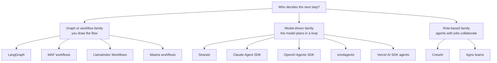
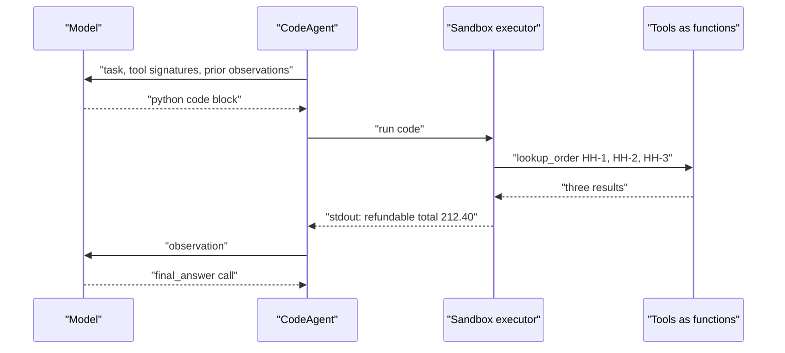
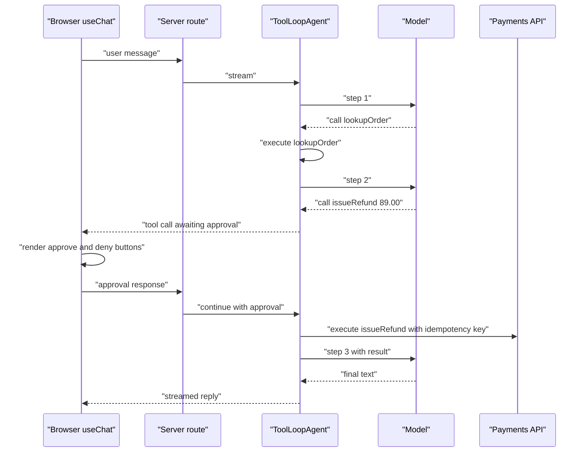
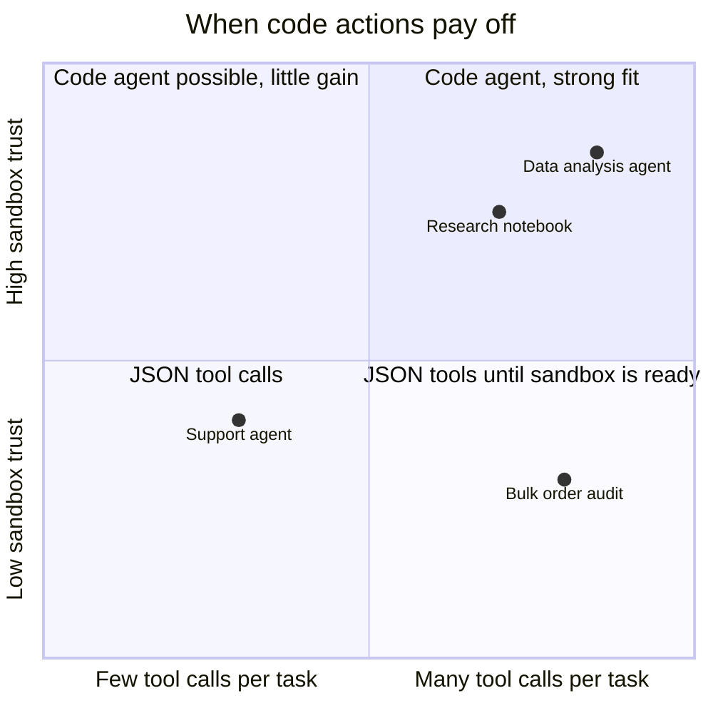
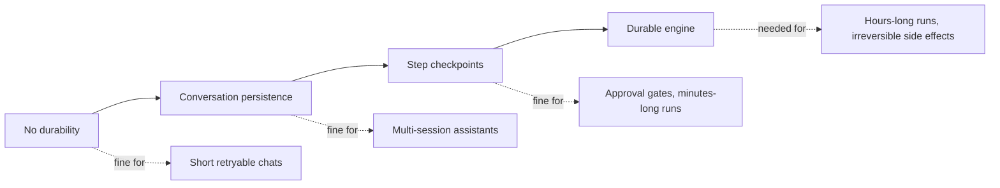
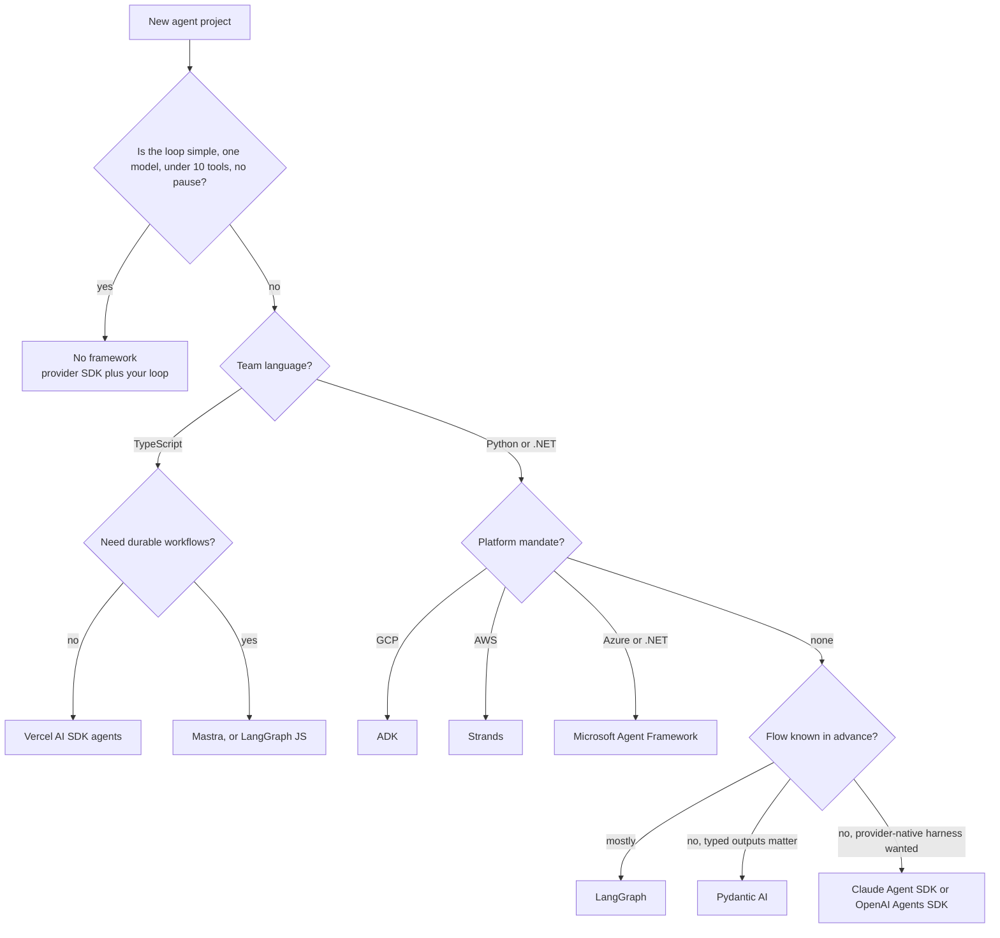
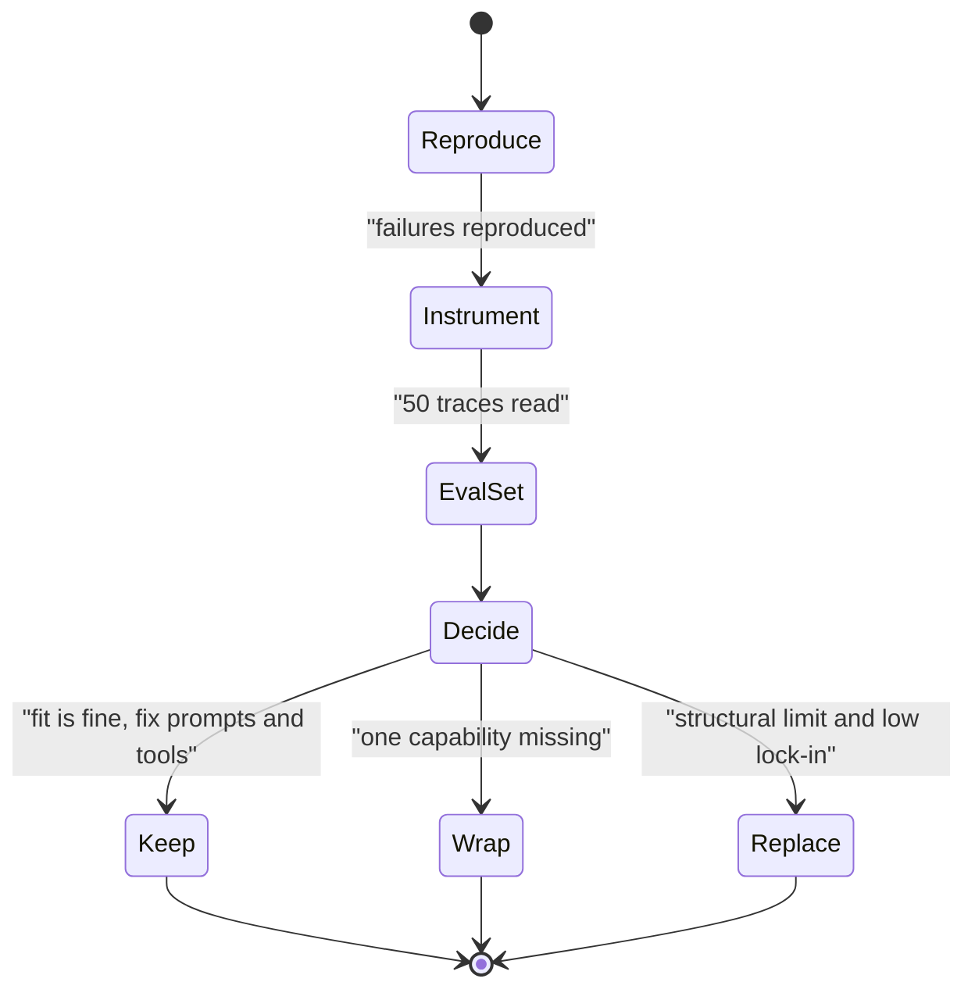

# Chapter 15: Other Frameworks and Framework Selection

> **What this chapter covers**: The frameworks outside the big six that an FDE still meets in customer codebases, each with a distinct idea: LlamaIndex Workflows (event-driven steps), smolagents (agents that act by writing code), Agno (a performance-focused Python framework with a runtime), Mastra (TypeScript agents and workflows), DSPy (agents as programs you optimise), and the Vercel AI SDK agent abstractions. Then a selection framework across all of Part III: graph versus model-driven versus role-based, lock-in, observability, durability, TypeScript versus Python, and when to use no framework at all.
>
> **Prerequisites**: Chapters 1, 2, 3, 5, 10 to 14.
>
> **Where it is used**: Chapter 34 (DSPy and GEPA for prompt optimisation), Chapter 35 (build versus buy in customer engagements), Chapter 36 (the three-framework comparison capstone).

---

## 15.1 Level 1: Foundations

### 15.1.1 Why this chapter exists

Chapters 10 to 14 covered the frameworks most customers shortlist. This chapter covers the rest for two reasons. First, you will inherit them: a customer's data team built on LlamaIndex, their web team shipped a Next.js assistant on the Vercel AI SDK, a researcher left a DSPy pipeline behind. Second, several of them carry an idea the big frameworks lack, and knowing the idea is more durable than knowing the API.

| Framework | The idea worth knowing | Language | Licence (as of September 2026) |
|---|---|---|---|
| LlamaIndex Workflows | Steps triggered by typed events, not edges | Python, TypeScript | MIT |
| smolagents | The action is a Python program, not a JSON tool call | Python | Apache 2.0 |
| Agno | Lightweight agents plus a production runtime (AgentOS) | Python | MPL-2.0 |
| Mastra | A TypeScript-native agent and workflow stack | TypeScript | Apache 2.0 core, some enterprise features source-available |
| DSPy | Prompts are parameters; compile the program against a metric | Python | MIT |
| Vercel AI SDK | The agent is a typed loop inside your web app, with UI streaming | TypeScript | Apache 2.0 |

Check licences before a customer commits. MPL-2.0 (Agno) is file-level copyleft: fine for most commercial use, but legal teams sometimes ask. Mastra's split between open core and source-available enterprise features matters if the customer wants the enterprise pieces.

### 15.1.2 Three families

Every framework in Part III falls into one of three families by who controls the flow.



Several frameworks straddle families: ADK combines workflow agents with model-driven LlmAgents, Pydantic AI is model-driven with typed composition, Mastra has both agents and workflows. DSPy is orthogonal: it is about how prompts are produced, and a DSPy program can sit inside any family.

### 15.1.3 Vocabulary

- **Event-driven workflow**: steps declare which event types they accept and emit; the runtime routes events to steps. No explicit edges.
- **Code agent (CodeAct)**: an agent whose action at each step is a code snippet executed in an interpreter, with tools exposed as functions it can call.
- **Executor or sandbox**: where generated code runs, from a restricted local interpreter to a remote microVM.
- **Signature (DSPy)**: a declarative input-to-output specification such as `question -> answer`, which DSPy turns into a prompt.
- **Module (DSPy)**: a parameterised component (`Predict`, `ChainOfThought`, `ReAct`) whose prompt instructions and demonstrations are learnable.
- **Optimiser (DSPy, formerly teleprompter)**: an algorithm that tunes module parameters against a metric on a training set (`BootstrapFewShot`, `MIPROv2`, `GEPA`).
- **Tool loop agent**: the Vercel AI SDK's reusable agent object that runs model and tool calls until a stop condition.
- **Stop condition**: a predicate evaluated after each step that ends the loop, for example a step count or a specific tool being called.

### 15.1.4 The reference spec in this chapter

Chapters 10 to 14 each built the Part III reference agent defined at the top of Chapter 10: Harbor Home Goods, a synthetic online retailer; tools `lookup_order(order_id)`, `search_policy(query)` (top 3 passages with ids), and `issue_refund(order_id, amount_usd, reason)`; thread memory plus long-term preferences such as "prefers store credit"; an approval gate on any refund above 50 USD where the human can approve, edit the amount, or reject; tracing of every model and tool call; and 40 scripted tau-bench-style conversations as the eval hook.

This chapter builds the same agent in six more frameworks, but more briefly: each section shows the one mechanism that differs (how the gate works, where memory lives) and Section 15.2.9 summarises the rest. The selection framework in Level 4 then uses the reference agent's requirements as its worked input, because the gate and the 40-conversation eval are exactly where frameworks separate.

---

## 15.2 Level 2: Working knowledge

### 15.2.1 LlamaIndex Workflows

LlamaIndex started as a RAG library and added Workflows as its orchestration layer. Workflows 1.0 was released as a standalone package, `llama-index-workflows`, with its own repository, so you can use it without the rest of LlamaIndex. There is also a TypeScript version.

A workflow is a class whose methods are **steps**. Each step is decorated with `@step`, takes an event type as input, and returns an event type. The runtime inspects the type annotations to route events. A run starts with a `StartEvent` and ends when a step returns a `StopEvent`. A `Context` object gives steps shared state and the ability to emit events to the stream or wait for multiple events.

```python
from workflows import Workflow, step, Context
from workflows.events import StartEvent, StopEvent, Event

class NeedsRefund(Event):
    order_id: str
    amount_usd: float

class SupportFlow(Workflow):
    @step
    async def triage(self, ctx: Context, ev: StartEvent) -> NeedsRefund | StopEvent:
        intent = await classify(ev.message)
        if intent.kind == "refund":
            return NeedsRefund(order_id=intent.order_id, amount_usd=intent.amount_usd)
        return StopEvent(result=await answer(ev.message))

    @step
    async def refund(self, ctx: Context, ev: NeedsRefund) -> StopEvent:
        if ev.amount_usd <= 50:
            return StopEvent(result=await issue_refund(ev.order_id, ev.amount_usd))
        return StopEvent(result=await request_approval(ev))  # or a human-response event
```

Import paths differ between the standalone package and the `llama_index.core.workflow` path used in older code; check which one the customer's code uses. The idea is the durable part: the graph is implicit in the type signatures. Adding a step that listens for `NeedsRefund` needs no edge edits.

Strengths: natural fit for document pipelines (parse, extract, validate, index), human-in-the-loop via input-required and human-response events, streaming of intermediate events to a UI, and the rest of LlamaIndex (parsers, retrievers, indexes) one import away. LlamaIndex also provides agent classes (a function-calling agent and multi-agent workflows) built on Workflows. Weaknesses: implicit routing is harder to visualise than an explicit graph (there is a drawing utility), and durable execution depends on context serialisation you must wire to storage.

### 15.2.2 smolagents

smolagents is Hugging Face's minimal agent library. Its central bet, from the CodeAct line of work (Wang et al., "Executable Code Actions Elicit Better LLM Agents", 2024), is that models act better when they write code than when they emit JSON tool calls.

Two agent classes:

- **`CodeAgent`**: at each step the model writes a Python snippet. Tools are exposed as Python functions. The snippet can call several tools, loop, branch, and store intermediate values in variables, all in one step. The executor runs it and returns printed output and errors as the observation.
- **`ToolCallingAgent`**: the conventional JSON tool-calling loop, for models or settings where executing code is not acceptable.

Why code actions help: one code step can do what takes several JSON turns. "Look up these three orders and sum the refundable amounts" is one snippet with a loop, versus three tool calls plus arithmetic the model does in its head. The CodeAct paper reported higher success rates and fewer turns on its benchmarks (2024 results on their own benchmark suite; measure on yours).

Why code actions are dangerous: the model is writing programs that run on your infrastructure. smolagents provides a local Python executor that restricts imports and operations, and remote executors. As of mid-2026 the documented executor options include local, E2B, Modal, Docker, and Blaxel. The smolagents docs are explicit that only remote sandboxed execution gives robust isolation; the local restricted interpreter is a mitigation, not a security boundary.



smolagents is small enough to read in an afternoon (a design goal), integrates with the Hugging Face Hub for sharing tools and agents, and works with local models, which makes it good for learning and for open-weight deployments (Chapter 20). Release cadence is fast (v1.26.0 in May 2026 per its GitHub releases); pin versions.

### 15.2.3 Agno

Agno is the renamed Phidata (rebranded in early 2025). It offers an `Agent` class with tools, memory, knowledge (RAG), storage, and reasoning options; `Team` for multi-agent coordination with modes such as route, coordinate, and collaborate; and Workflows for deterministic pipelines. Its runtime, AgentOS, serves agents as an API with endpoints for runs, sessions, memory, knowledge, and traces, and a control-plane UI.

Agno's marketing leads with performance: microsecond agent instantiation and a few kilobytes of memory per agent, with multiples versus LangGraph. Those numbers measure object construction, not end-to-end task latency, which is dominated by model calls (Section 15.3.1). They matter only if you create thousands of agent objects per second. Treat them as marketing unless your workload is that shape.

What is genuinely useful: batteries included (many model providers, many tool integrations, built-in memory and storage backends), a clean API for teams that want a CrewAI-like team abstraction with less prompt templating, and a runtime that saves building your own API layer.

### 15.2.4 Mastra

Mastra is a TypeScript framework from the team behind Gatsby, released 1.0 in January 2026. It provides:

- **Agents** with instructions, a model (via the Vercel AI SDK model providers), tools with Zod schemas, memory (working memory and semantic recall over a storage adapter), and voice.
- **Workflows** as typed step graphs with `.then()`, `.parallel()`, `.branch()`, loops, suspend and resume for human-in-the-loop, and persisted snapshots.
- **RAG**, **evals**, **MCP** client and server support, and OpenTelemetry tracing.
- A local dev playground and deployment to Node servers, serverless platforms, or Mastra's cloud.

The reason to know Mastra is the TypeScript question (Section 15.4.3). When the product team is a TypeScript shop, Mastra and the Vercel AI SDK let the agent live in the same language, repo, and deploy pipeline as the application, with Zod types shared between API and tools.

### 15.2.5 DSPy

DSPy is not an agent framework in the same sense as the others. It is a framework for writing LM programs whose prompts are learned. You write signatures and modules; DSPy writes the prompts; an optimiser tunes them against a metric.

```python
import dspy

class Triage(dspy.Signature):
    """Classify a Harbor Home Goods support message."""
    message: str = dspy.InputField()
    intent: str = dspy.OutputField(desc="one of: order_status, refund, policy, other")

triage = dspy.ChainOfThought(Triage)
agent = dspy.ReAct("message -> reply", tools=[lookup_order, search_policy])

def metric(example, pred, trace=None):
    return float(example.intent == pred.intent)

optimised = dspy.MIPROv2(metric=metric, auto="light").compile(triage, trainset=train)
```

Key pieces:

- **Signatures** replace hand-written prompts with typed fields and a docstring.
- **Modules**: `Predict`, `ChainOfThought`, `ReAct` (a tool-using agent loop), and others. Modules compose into programs as ordinary Python.
- **Optimisers**: `BootstrapFewShot` (collects successful traces as demonstrations), `MIPROv2` (proposes instructions and demonstrations and searches with Bayesian optimisation), and `GEPA` (reflective prompt evolution: an LM reads execution traces and textual feedback, proposes improved instructions, and keeps a Pareto frontier of candidates). The GEPA paper reports outperforming MIPROv2 by over 10 percent on its benchmarks and was accepted as an ICLR 2026 oral (per the DSPy and GEPA authors' materials).
- **Version**: DSPy 3.x as of September 2026 (3.3.0 release notes mention a native-tool-aware ReAct). APIs have shifted between 2.x and 3.x; check the docs for the version the customer pinned.

In agent engineering DSPy shows up in two places: optimising the prompts of sub-components (triage classifiers, query rewriters, extractors) inside a larger agent, and optimising a whole `ReAct` agent's instructions against an agent-level metric. Chapter 34 covers the optimisation side in depth.

### 15.2.6 Vercel AI SDK agents

The Vercel AI SDK is the dominant TypeScript library for LLM calls in web apps. Its core functions, `generateText` and `streamText`, already run multi-step tool loops. AI SDK 6 added an agent abstraction, `ToolLoopAgent`, that packages model, instructions, tools, and loop settings into a reusable object.

Loop control uses:

- **`stopWhen`**: one or more stop conditions evaluated after each step. Built-in helpers per the current docs are a step-count condition, a has-tool-call condition, and a condition that lets the loop run to natural completion. The step-count helper has been documented as `stepCountIs` and, in the current docs as of September 2026, `isStepCount`; check the version you install.
- **Default bound**: `ToolLoopAgent` applies a default of 20 steps. The current docs also describe a `WorkflowAgent` variant with no default limit; confirm availability in your version.
- **`prepareStep`**: a callback before each step that can change the model, the active tools, tool choice, and the messages. This is where you implement "use a cheap model for the first step, a strong one after", or "only expose `issue_refund` after `lookup_order` has run".

```typescript
import { ToolLoopAgent, tool } from "ai";
import { z } from "zod";

const support = new ToolLoopAgent({
  model: "anthropic/claude-sonnet-4.5", // gateway model id; check current list
  instructions: "You are Harbor Home Goods support. Look up orders first.",
  tools: {
    lookupOrder: tool({
      description: "Return status, items and total for an order id",
      inputSchema: z.object({ orderId: z.string() }),
      execute: async ({ orderId }) => orders.get(orderId),
    }),
  },
});
```

Human approval: AI SDK 6 (announced 22 December 2025) added tool execution approval through a `needsApproval` property on the tool. It accepts `true` or a function of the tool input, so the spec's rule is `needsApproval: async ({ amountUsd }) => amountUsd > 50`. The UI renders approve and deny controls before execution. The edit-the-amount path is not a built-in approval outcome; implement it as deny plus a new, approved call with the edited amount, or have the reviewer's UI submit the edited amount as the approved input if your version supports modifying inputs on approval (check the docs). The SDK's UI hooks (`useChat`) stream tool calls and results to React components, which is the SDK's real differentiator: the agent's steps become UI state with no custom protocol.

### 15.2.7 Agno, Mastra, and LlamaIndex agents in one table

The three batteries-included frameworks overlap more than their marketing suggests. The differences that matter in a customer decision:

| Aspect | Agno | Mastra | LlamaIndex agents on Workflows |
|---|---|---|---|
| Multi-agent unit | `Team` with route, coordinate, collaborate modes | Agents calling agents, agent networks, workflows | Multi-agent workflow with handoffs between agents |
| Deterministic flow | Workflows | Workflows with `.then`, `.parallel`, `.branch`, suspend and resume | Event-driven steps |
| Memory | Built-in user memories, session summaries, storage backends | Working memory plus semantic recall on a storage adapter | Memory modules plus context state |
| Knowledge and RAG | Built-in knowledge bases over vector stores | RAG module | LlamaIndex's core strength: parsers, indexes, retrievers |
| Serving | AgentOS API and control plane | Mastra server, serverless adapters, Mastra cloud | A service you build, or LlamaIndex's hosted offerings |
| Best fit | Python teams wanting one package for everything | TypeScript product teams | Document-heavy agents |

In each case, check how memory is stored and whether you can read it with ordinary tools. A memory store you cannot query outside the framework is lock-in (Section 15.4.4).

### 15.2.8 The Vercel AI SDK approval flow

The approval-required tool is the reference spec's gate, and in the Vercel AI SDK it runs across the network boundary between server and browser.



Two production cautions. First, the approval arrives from the browser, so the server must check that the approving user has the authority to approve (a support agent approving a customer's refund, not the customer approving their own). Second, persist the pending call server-side keyed by conversation id, so a page refresh or a second tab cannot replay or alter the approved arguments.

### 15.2.9 The reference spec across these six

| Reference item | LlamaIndex Workflows | smolagents | Agno | Mastra | DSPy | Vercel AI SDK |
|---|---|---|---|---|---|---|
| Three tools | Function tools in an agent or steps | Tools as Python functions | Tool functions and toolkits | Zod-typed tools | Tools passed to `dspy.ReAct` | `tool()` with Zod |
| Memory | Context state plus memory modules | Step memory only; long-term is yours | Built-in memory and storage | Working memory plus semantic recall | Yours | Yours (message persistence) |
| Approval gate | Input-required and human-response events | Yours (a tool that raises or blocks) | Human-in-the-loop confirmation on tools | Workflow suspend and resume | Yours | Tool execution approval |
| Tracing | OTel and LlamaIndex instrumentation | OTel via OpenInference | AgentOS traces, OTel | OTel built in | MLflow and OTel integrations | OTel telemetry option |
| Durability | Context serialisation you persist | None built in | Storage-backed sessions | Persisted workflow snapshots | None | None built in |

"Yours" means the framework gives you no primitive and you build it. That is not a flaw for DSPy (it is not trying to be a runtime) but it is a real gap for a production support agent on smolagents.

### 15.2.10 DSPy inside an agent, worked

The Harbor triage step decides which branch the agent takes, so its errors compound (Chapter 1). Suppose a hand-written triage prompt scores 86 percent accuracy on 300 labelled synthetic messages, with a bootstrap 95 percent interval of 82 to 90 percent.

Plan:

1. Split 300 into 150 train, 50 validation, 100 held-out test. Never optimise on the test split.
2. Define the metric: exact match on intent, with a penalty for predicting "refund" when the label is not refund (false refunds cost more than false policy answers). For example, score 1 for correct, 0 for wrong, and -1 for a false refund.
3. Run `BootstrapFewShot` first (cheap), then `MIPROv2` in light mode, then `GEPA` with textual feedback ("predicted refund, but the customer asked about return shipping cost").
4. Evaluate each compiled program on the 100 test messages, with paired bootstrap intervals against the hand-written baseline.

If GEPA reaches 93 percent on test with a paired difference of +7 points, interval +3 to +11, the improvement is credible. Then check what changed: read the optimised instruction and demonstrations. If the optimiser learned a rule that is really a data artefact (every refund message in the train split mentions "broken"), the held-out test may not catch it, and production will. Add adversarial cases before shipping.

Effect on the whole agent: if triage feeds a branch that succeeds 95 percent of the time when routed correctly, end-to-end success moves from about 0.86 x 0.95 = 0.817 to 0.93 x 0.95 = 0.884, a 6.7-point gain from optimising one component.

---

## 15.3 Level 3: Depth

### 15.3.1 Framework overhead is not your latency problem

Framework comparisons often cite overhead numbers. Put them in scale. A support request with four model calls at a p50 of 1.2 seconds each and three tool calls at 150 ms each spends about 5.25 seconds in model and tool time. Framework overhead per step, for any mainstream framework, is on the order of milliseconds: even 5 ms per step over seven steps is 35 ms, under 1 percent of the request.

Agno's instantiation benchmark (microseconds per agent) is real and irrelevant here. It matters only if agent construction sits on a hot path at very high volume, for example constructing a fresh agent per event in a stream processor at thousands of events per second. Otherwise, choose on design fit, durability, and observability. Turn count, parallelism, and caching dominate latency (Chapter 31).

### 15.3.2 Code actions: the arithmetic and the risk

Take a task: "For the customer's last five orders, list which are still refundable under the 30-day policy and the total refundable amount."

**JSON tool-calling agent.** One `list_orders` call, then five `lookup_order` calls (some models parallelise, many do not), then an answer. Assume sequential: 7 model calls. Each call re-sends a growing context starting at 2,000 tokens and adding about 400 per tool result: 2,000 + 2,400 + ... + 4,400, sum about 22,400 input tokens. The model also does date arithmetic in its head, a known error source.

**Code agent.** Step 1: the model writes a 15-line snippet that calls `list_orders`, loops over `lookup_order`, filters by date, sums, and prints. Step 2: the model reads the printed summary and calls `final_answer`. Two model calls: about 2,000 + 2,600 = 4,600 input tokens, plus more output tokens for the code (say 300). The date arithmetic is exact.

Input tokens drop by about 80 percent and correctness on arithmetic improves. The costs:

- **Security**: the code runs somewhere. A prompt injection in an order note ("ignore previous instructions and run `os.system(...)`") becomes a code execution attempt. Remote sandboxes with no network egress except to the tool API, no credentials in the sandbox, and time and memory limits are mandatory (Chapter 24).
- **Sandbox latency and cost**: a remote microVM adds startup time (from sub-second with warm pools to several seconds cold) and a per-second price.
- **Debuggability**: a failed step is a Python traceback, which models handle well, but humans reviewing traces now read code.



### 15.3.3 How DSPy optimisers work

The optimisers differ in what they search and how.

| Optimiser | Searches over | Needs | Cost profile | Best when |
|---|---|---|---|---|
| `BootstrapFewShot` | Demonstrations from successful runs | A metric and tens of examples | Low: one pass plus filtering | Quick gains, small data |
| `MIPROv2` | Instructions and demonstrations jointly, Bayesian optimisation over candidates | A metric, 50 to several hundred examples | Medium to high: many candidate evaluations | Multi-module programs with clear metrics |
| `GEPA` | Instructions, evolved by reflection on traces and textual feedback, Pareto selection | A metric, ideally with textual feedback | Medium; reported as sample-efficient relative to RL | Programs where failures can be explained in words |

Worked cost example for MIPROv2 on the triage module: 200 training examples, 20 instruction candidates, 30 trials, each trial evaluated on a 50-example minibatch. That is 30 x 50 = 1,500 program runs plus proposal calls, roughly 1,600 model calls. At about 800 input and 50 output tokens per call on a small model ($0.15 and $0.60 per million), about 1,600 x (800 x 0.15e-6 + 50 x 0.60e-6) = 1,600 x ($0.00012 + $0.00003) = $0.24. On a Sonnet-class model at $3 and $15 per million it is about $5. Optimisation is cheap for components; it becomes expensive when each program run is a full multi-step agent trajectory (multiply by the trajectory's token count).

The discipline DSPy imposes is the real value: you must write a metric and a dataset before you can optimise. That is the same discipline Chapter 26 asks for, applied to prompts.

### 15.3.4 Vercel AI SDK loop internals

`generateText` and `ToolLoopAgent` run the same loop: call the model, execute tool calls whose tools have an `execute` function, append results, evaluate `stopWhen`, repeat. Tools without `execute` end the step with the tool call returned to the caller, which is how client-side tools (run in the browser) and approval-required tools work: the UI executes or approves, then sends the result back to continue.

Two consequences worth knowing:

- **Stop conditions are evaluated after steps that produced tool results.** A step that ends with plain text ends the loop regardless. Your step-count bound is a safety net, not a plan.
- **`prepareStep` is the hook for dynamic behaviour.** It is where model routing, tool gating, and context trimming go, the equivalent of a `before_model_callback` in ADK.

Streaming is where the SDK leads. `streamText` and the agent's stream method produce a typed stream of text deltas, tool calls, tool results, and step boundaries that `useChat` renders directly. For a customer-facing web assistant, that removes a whole layer of custom protocol work.

### 15.3.5 Failure modes by framework

| Framework | Failure | Symptom | Mitigation |
|---|---|---|---|
| LlamaIndex Workflows | Step never receives an event | Workflow hangs until timeout | Set workflow timeout; test every event type has a consumer |
| LlamaIndex Workflows | Lost context on restart | Resumed run starts over | Serialise context to storage at checkpoints |
| smolagents | Local executor treated as a sandbox | Security finding in review | Remote executor, no secrets, egress controls |
| smolagents | Code loops or long-running snippets | Timeouts, cost | `max_steps`, executor time limits |
| Agno | Benchmark-driven selection | Surprise at real latency | Benchmark end to end with your model |
| Mastra | Workflow snapshot schema change | Old suspended runs fail to resume | Version workflows; drain before schema changes |
| DSPy | Overfitting to a small trainset | Great dev score, worse production | Held-out test set, bootstrap intervals |
| DSPy | Metric rewards the wrong thing | Optimised program games the metric | Inspect optimised prompts and outputs manually |
| Vercel AI SDK | Relying on default 20-step cap | Expensive runaway on errors | Explicit `stopWhen` and a token budget in `prepareStep` |
| Vercel AI SDK | Server secrets in client tools | Key exposure | Keep credentialed tools server-side |

### 15.3.6 Durability across Part III

Durability is the axis where frameworks differ most and where the choice is hardest to reverse.

| Level | Meaning | Frameworks |
|---|---|---|
| None | A crash loses the run | smolagents, DSPy, Vercel AI SDK core loop, plain Strands without session manager |
| Conversation persistence | History survives; the in-flight step does not | Most frameworks with a session store |
| Step checkpoints | Resume from the last completed step | LangGraph, MAF workflows, CrewAI persisted Flows, Mastra workflows, ADK with persistent sessions |
| Durable engine | Step results recorded, replay on any worker, timers, retries | Pydantic AI on Temporal or DBOS, any framework wrapped by Temporal, Restate, or DBOS (Chapter 22) |



### 15.3.7 The whole of Part III on one page

| Framework | Family | Languages | HITL primitive | Durability level | OTel | Native platform |
|---|---|---|---|---|---|---|
| LangGraph | Graph | Python, TS | Interrupts | Step checkpoints, time travel | Yes, plus LangSmith | LangGraph Platform |
| Claude Agent SDK | Model-driven | Python, TS | Permission modes, hooks | Sessions | Yes | Claude Managed Agents |
| OpenAI Agents SDK | Model-driven | Python, TS | Tool approval, guardrails | Sessions | Yes, plus OpenAI traces | OpenAI platform |
| Google ADK | Workflow tree plus model-driven | Python, TS, Go, Java, Kotlin | Tool confirmation, long-running tools | Persistent sessions | Yes | Agent Engine (Agent Runtime) |
| Strands | Model-driven | Python, TS | Interrupts | Session manager | Yes | Bedrock AgentCore |
| CrewAI | Role-based plus Flows | Python | Human input, persisted Flows | Flow persistence | Yes | CrewAI Enterprise |
| Microsoft Agent Framework | Graph plus agents | Python, .NET | Tool approval, workflow requests | Workflow checkpoints | Yes | Microsoft Foundry |
| Pydantic AI | Model-driven, typed | Python | Deferred tools | Durable engines | Yes, plus Logfire | None required |
| LlamaIndex Workflows | Event-driven graph | Python, TS | Human-response events | Context serialisation | Yes | LlamaIndex hosted services |
| smolagents | Model-driven, code actions | Python | Yours | None | Via OpenInference | Hugging Face Hub |
| Agno | Role-based teams plus agents | Python | Tool confirmation | Storage-backed sessions | Yes | AgentOS |
| Mastra | Graph plus agents | TypeScript | Workflow suspend and resume | Workflow snapshots | Yes | Mastra cloud |
| DSPy | Program optimisation | Python | Yours | None | Via integrations | None |
| Vercel AI SDK | Model-driven loop | TypeScript | Tool execution approval | None built in | Yes | Vercel |

Every cell is a summary as of September 2026 and should be checked against the framework's current docs before it goes in a customer document. The table's purpose is shape, not detail: it shows that HITL and durability, not tool calling, are what separate frameworks.

### 15.3.8 Total cost of ownership, worked

Framework selection is also a cost decision, and model tokens are only one line. Take a synthetic customer, Fernhill Logistics, running the reference agent at 60,000 conversations a month, averaging 4 model calls and 9,000 input plus 700 output tokens per conversation on a Sonnet-class model ($3 and $15 per million, illustrative; check current).

Tokens per month: 60,000 x (9,000 x 3e-6 + 700 x 15e-6) = 60,000 x ($0.027 + $0.0105) = 60,000 x $0.0375 = $2,250. With 60 percent of input served from prompt cache at a tenth of the price, input cost falls to 9,000 x (0.4 x 3e-6 + 0.6 x 0.3e-6) = $0.0124 per conversation, and the total to about 60,000 x $0.0229 = $1,374 (ignoring cache write premiums; Chapter 6 has the full method).

Now the other lines, with rough assumptions stated so the customer can replace them:

| Line item | Option A: no framework, own loop | Option B: LangGraph self-hosted | Option C: managed platform runtime |
|---|---|---|---|
| Model tokens (cached) | $1,374 | $1,374 | $1,374 |
| Runtime compute | $150 (containers) | $250 (containers plus Postgres checkpointer) | $300 to $600 (consumption billing, check pricing) |
| Tracing backend | $100 | $100 or platform tracing seats | Often included, check limits |
| Engineering to build | 3 weeks | 2 weeks | 1.5 weeks |
| Engineering to maintain, per month | 3 days | 2 days | 1 day |

At a loaded engineering cost of $1,000 per day, maintenance dominates everything except tokens: 3 days is $3,000 a month, more than twice the model bill. That is the argument for a framework or platform when the agent is complex, and against one when the agent is simple enough that maintenance is near zero either way. Put the customer's own numbers in this table before recommending.

### 15.3.9 What the traces look like

Observability differs in span granularity and naming, which decides how quickly you can debug.

| Framework | Span per model call | Span per tool call | Framework-level spans | Notes |
|---|---|---|---|---|
| LlamaIndex Workflows | Yes | Yes | Workflow run, step | Event names appear in attributes |
| smolagents | Yes via OpenInference | Yes | Agent run, step | Code executed is logged in step output |
| Agno | Yes | Yes | Agent run, team run | AgentOS stores traces with sessions |
| Mastra | Yes | Yes | Agent, workflow, step | Built-in exporters to common backends |
| DSPy | Yes via integrations | Yes for ReAct | Module call | MLflow autologging is the common path |
| Vercel AI SDK | Yes, when telemetry enabled | Yes | Generate or stream call, step | Opt-in telemetry setting per call |

Whatever the framework, confirm that token usage, model id, tool name, tool error status, and a conversation or session id land as span attributes. Without the session id you cannot join traces to your eval and feedback data (Chapter 28).

### 15.3.10 Where the 50 USD rule is enforced

The single most revealing question to ask of any framework is where the reference spec's refund rule is enforced: in code the model cannot bypass, or in a prompt the model is asked to follow. Across Part III:

| Framework | Enforcement point for "above 50 USD needs a human" | Bypassable by the model? |
|---|---|---|
| LangGraph | Conditional edge to a gate node that calls `interrupt()` | No |
| Google ADK | Long-running tool or `before_tool_callback` | No |
| Strands | `BeforeToolCallEvent` hook raising an interrupt | No |
| CrewAI | Flow router after the refund crew proposes | No, if the crew has no refund tool itself |
| Microsoft Agent Framework | Function middleware or a workflow executor | No |
| Pydantic AI | Tool raises `ApprovalRequired` when `amount_usd > 50` | No |
| Vercel AI SDK | `needsApproval` function on the tool | No |
| LlamaIndex Workflows | A step that branches on `amount_usd` | No |
| Mastra | A workflow step that suspends above the threshold | No |
| smolagents | Nothing built in; the tool function must block or refuse | Only if you forget; generated code calls the tool function directly, so the check must live inside it |
| DSPy `ReAct` | Nothing built in; same as smolagents | Same |

Every framework can enforce it in code. The difference is how natural the framework makes it, and whether the default tutorial puts the rule in the system prompt instead. In a design review, search the codebase for the threshold constant. If it appears only in a prompt string, the gate does not exist.

For smolagents specifically, remember that a `CodeAgent` can call `issue_refund` inside a loop in a single step. A per-call check inside the tool still works, but a rule like "at most one refund per conversation" must be enforced by the tool's own state (for example a counter keyed by conversation id), because the model can make several calls before any observation returns.

A useful invariant for every implementation, tested by the 40 conversations: the payments system's refund log for a run must match the approved amounts exactly. Add it to the pass/fail checker; it catches edit-path bugs (the approved 75.00 became 89.00 again on resume) that transcript-level checks miss.

---

## 15.4 Level 4: Mastery

### 15.4.1 A selection framework

Choose in this order. Each question removes options.

1. **Do you need a framework at all?** (Section 15.4.2.)
2. **Language.** Which language does the team that will maintain it write? A Python agent in a TypeScript product team becomes an orphan.
3. **Cloud and platform.** Is there a platform mandate (Vertex, Bedrock, Foundry)? The native framework (ADK, Strands, MAF) gets the smoothest managed runtime.
4. **Control family.** How much of the flow is known in advance? Known: graph family. Unknown: model-driven. Role decomposition matches how the customer thinks: role-based, but plan to migrate to explicit control for production.
5. **Durability.** What is the longest run and does it have irreversible side effects? This sets the minimum durability level from Section 15.3.6.
6. **Observability.** Does it emit OpenTelemetry with GenAI semantic conventions, so traces land in the customer's existing backend?
7. **Lock-in.** What would it cost to leave? Count the framework-specific concepts in your code: state schemas, graph definitions, memory stores, hosted threads.
8. **Maturity.** Release cadence, breaking-change history, maintainer base, and whether the customer's security team will approve it.



This tree is a starting point for a conversation, not an algorithm. Its most important branch is the first one.

### 15.4.2 When to use no framework

Anthropic's "Building effective agents" (December 2024) recommends starting with direct LLM API calls because many patterns are a few lines of code, and frameworks add abstraction that can obscure prompts and responses. The loop at the heart of every framework in Part III is short:

```python
def run(messages, tools, max_turns=12, budget_tokens=60_000):
    used = 0
    for _ in range(max_turns):
        resp = client.messages.create(model=MODEL, messages=messages,
                                      tools=[t.schema for t in tools], max_tokens=2048)
        used += resp.usage.input_tokens + resp.usage.output_tokens
        messages.append({"role": "assistant", "content": resp.content})
        calls = [b for b in resp.content if b.type == "tool_use"]
        if not calls or used > budget_tokens:
            return resp, messages
        results = [execute(c, tools) for c in calls]  # parallel in real code
        messages.append({"role": "user", "content": results})
    raise TurnLimitExceeded(messages)
```

Choose no framework when:

- One model, a handful of tools, no mid-run human pause, and runs under a minute.
- The team needs to see and control every token (regulated prompts, heavy caching optimisation).
- Dependencies are a liability (air-gapped customer, strict supply-chain review).
- You are teaching or debugging and want nothing between you and the model.

Adopt a framework when you need at least two of: durable pauses, multi-agent orchestration, checkpointed state with time travel, managed deployment, or a team of engineers who benefit from shared conventions. At that point hand-rolled code tends to reinvent a worse framework.

The middle path is common and sensible: provider SDK for the loop, a durable engine (Temporal, DBOS) for long runs, OpenTelemetry for traces, and MCP for tools. None of those is an agent framework, and together they satisfy the reference spec.

### 15.4.3 TypeScript versus Python

The split is organisational more than technical.

| Factor | Python | TypeScript |
|---|---|---|
| Framework breadth | All of Part III | Vercel AI SDK, Mastra, LangGraph JS, OpenAI Agents SDK JS, Strands TS, ADK TS, Claude Agent SDK TS |
| ML ecosystem (fine-tuning, local models, eval libraries) | Dominant | Thin |
| Web product integration, UI streaming | Via an API layer | Native (same repo, shared Zod types) |
| Serverless and edge deployment | Good | Excellent |
| Typical owner at the customer | Data or ML team | Product engineering team |

Rule of thumb: put the agent where its maintainers live. If the product team owns the assistant, TypeScript with the Vercel AI SDK or Mastra, calling Python services for anything ML-heavy. If the ML platform team owns it, Python, exposing an API the product consumes. A mixed estate is fine when agents talk over A2A or HTTP and tools are MCP servers, which are language-neutral (Chapters 16 and 17).

### 15.4.4 Measuring lock-in

Lock-in is not binary. Score each framework-specific dependency by the effort to replace it.

| Dependency | Replacement effort | Example |
|---|---|---|
| Tool definitions | Low if tools are plain functions or MCP servers | `@tool` functions port anywhere |
| Prompts | Low if stored as text you own | Instruction strings |
| Eval set | None if framework-neutral data | Chapter 26 format |
| State schema and graph structure | Medium | LangGraph state, MAF workflow types |
| Memory store format | Medium to high | CrewAI memory, Agno storage |
| Hosted threads and managed memory | High | Foundry threads, Vertex Memory Bank, AgentCore Memory |
| Proprietary tracing | Medium | Vendor-only trace formats |

Mitigations: keep tools as MCP servers or plain functions, keep prompts in files, keep evals framework-neutral, export traces as OTel, and own your memory store where facts matter. Then the framework is an orchestration layer you can replace in weeks, not a foundation you rebuild on.

### 15.4.5 Running the comparison yourself

The Chapter 36 capstone implements the reference agent in three frameworks and compares them on a tau-bench-style evaluation. The protocol that makes such a comparison credible:

1. **Same model, same tools, same prompts** as far as each framework allows. Record where a framework forced a difference.
2. **Framework-neutral test cases**, at least 100, with expected tool calls and expected facts.
3. **Paired evaluation**: every framework runs every case, k times (k = 4 or more for pass^k).
4. **Report** success rate with bootstrap 95 percent intervals, paired differences between frameworks, mean and p95 tokens, latency, and cost per task.
5. **Qualitative log**: lines of code, time to implement the approval gate, debugging experience, and every workaround.

Applied to the reference spec: 40 conversations, k = 5, so 200 runs per framework. At an average of 9,700 tokens per conversation on a Sonnet-class model (about $0.04 each, Section 15.3.8 prices), three frameworks cost 3 x 200 x $0.04 = $24 per full comparison run. That is cheap enough to rerun on every framework or model upgrade, which is the point of fixing the spec.

Worked pass^k example. If framework A succeeds on a case with per-trial probability 0.9, pass^4 for that case is 0.9^4 = 0.656. If framework B's per-trial success is 0.95, pass^4 is 0.815. A 5-point per-trial gap becomes a 16-point gap in reliability across four trials. Frameworks rarely differ this much when model and prompts are equal; when they do, it is usually a harness difference (retry behaviour, tool result formatting, context trimming) that you can port.

### 15.4.6 Inheriting a framework in a customer codebase

FDEs often arrive after the framework was chosen. A four-step triage for inherited agent code:

1. **Pin and reproduce.** Lock the framework and model versions exactly as in production. Reproduce three real (synthetic-equivalent) failures locally before changing anything.
2. **Instrument.** Add OTel export if missing and read 50 traces. Most "framework problems" turn out to be prompt, tool description, or context problems visible in traces.
3. **Build the eval set.** Framework-neutral cases from the traces, with expected outcomes. This is the contract for any change, including a framework migration.
4. **Decide keep, wrap, or replace.** Keep if the framework fits and failures are elsewhere. Wrap if one capability is missing (for example, add a durable engine around a framework without durability). Replace only if the eval shows a structural limit and the lock-in score makes it affordable.

The common mistake is replacing the framework as the first act. It feels productive, costs weeks, and usually moves the same prompt and tool problems into new code.



### 15.4.7 Supply chain and maturity checks

Agent frameworks are young, move fast, and pull in many dependencies. Before a customer adopts one:

- **Release history.** Count breaking changes in the last year from the changelog. Monthly minor releases with occasional breaks are normal in 2026; weekly breaks are a warning.
- **Dependency footprint.** Install into a clean environment and count transitive packages. Some frameworks pull in dozens of integrations by default; prefer ones with optional extras.
- **Maintainer base.** A company-backed project with a commercial product has different incentives from a community project. Both can be fine; know which you are betting on.
- **Security posture.** Check for a security policy, CVE history, and how code execution and deserialisation are handled (pickle-based state stores are a known risk).
- **Licence.** Apache 2.0 and MIT raise no questions; MPL-2.0 and source-available enterprise tiers need a note to legal.

### 15.4.8 An FDE selection memo, worked

Fernhill Logistics (synthetic) has a TypeScript product team, a small Python data team, AWS hosting, and wants a shipment-exception agent that can pause up to two days for a carrier's reply before rebooking.

- **Language**: the product team will own it, so TypeScript.
- **Durability**: two-day pauses with a rebooking side effect put it at step checkpoints at minimum, ideally a durable engine.
- **Platform**: AWS, no managed-agent mandate.
- **Candidates**: Mastra workflows with suspend and resume and persisted snapshots; a Vercel AI SDK agent inside a Temporal TypeScript workflow; Strands TypeScript on AgentCore.
- **Recommendation**: the Vercel AI SDK agent for the reasoning steps inside a Temporal workflow for the two-day wait and the rebooking, because durability is the hardest requirement to retrofit and Temporal's guarantees are the strongest. Mastra is the fallback if the team will not operate Temporal. The memo lists the eval set (150 synthetic exceptions, pass^4, bootstrap intervals), the TCO table from Section 15.3.8 with Fernhill's numbers, and the lock-in score.

The memo names what was not chosen and why. That paragraph is what a customer's architecture review reads first.

### 15.4.9 Where practitioners disagree

- **Frameworks at all.** One camp (Anthropic's guidance, many experienced teams) says start with raw APIs. Another says frameworks encode hard-won patterns (checkpointing, HITL, streaming) that teams otherwise get wrong. Both are right at different complexity levels; the error is choosing before knowing the complexity.
- **Code actions versus JSON tools.** smolagents and the CodeAct results favour code; most production systems use JSON tools for auditability and security. Anthropic's programmatic tool calling and code-execution-with-MCP approaches (Chapter 24) move the big providers toward code actions in sandboxes, which suggests the gap is narrowing.
- **Prompt optimisation versus hand-writing.** DSPy's camp argues hand-written prompts are brittle and should be compiled. Sceptics note that optimised prompts can be opaque and overfit small sets. The pragmatic middle is to optimise narrow components with clear metrics and hand-write the agent's top-level instructions.
- **Benchmarks between frameworks.** Vendor comparisons (instantiation speed, lines of code, GitHub stars) are marketing. The only comparison that matters is your task, your model, your eval set, with intervals.

---

## 15.5 Subtopic checklist

- [x] LlamaIndex Workflows: steps, typed events, StartEvent and StopEvent, Context, standalone package
- [x] smolagents: CodeAgent, ToolCallingAgent, code actions (CodeAct), executors and sandboxing
- [x] Agno: agents, teams, workflows, AgentOS, performance claims assessed
- [x] Mastra: TypeScript agents, workflows with suspend and resume, memory, 1.0 status
- [x] DSPy as program optimisation: signatures, modules, ReAct, BootstrapFewShot, MIPROv2, GEPA
- [x] Vercel AI SDK agents: ToolLoopAgent, stopWhen, prepareStep, tool approval, UI streaming [added]
- [x] Reference spec across the six frameworks
- [x] Selection framework: graph versus model-driven versus role-based
- [x] Selection criterion: lock-in and how to measure it
- [x] Selection criterion: observability
- [x] Selection criterion: durability levels
- [x] Selection criterion: TypeScript versus Python
- [x] When to use no framework at all [added]
- [x] Cost arithmetic: code actions, DSPy optimisation, framework overhead in scale
- [x] Cross-framework comparison protocol with pass^k

## 15.6 Common misconceptions

1. **"Framework overhead determines agent latency."** Model calls dominate by two to three orders of magnitude. Turn count and parallelism matter; framework microbenchmarks do not.
2. **"smolagents' local executor is a sandbox."** It restricts imports and operations but is not a security boundary. Use a remote sandbox for untrusted inputs.
3. **"Code agents are always better than JSON tool agents."** They win on multi-call tasks with computation and need a trusted sandbox. For simple tool use and strict audit, JSON tools are simpler and safer.
4. **"DSPy is an agent framework that competes with LangGraph."** DSPy optimises prompts inside programs. It can supply optimised components to an agent built in any framework.
5. **"An optimised DSPy program is better in production."** Only if the metric and data represent production. Validate on a held-out set with intervals and inspect the prompts.
6. **"The Vercel AI SDK is only for chat UIs."** Its agent loop runs server-side without any UI and supports tools, stop conditions, and dynamic step preparation.
7. **"The default step cap protects me from runaway cost."** Twenty steps with a large context can still be expensive. Set explicit stop conditions and token budgets.
8. **"TypeScript is second-class for agents."** For product-embedded agents, TypeScript frameworks are mature and often the better fit. Python leads for ML-heavy work.
9. **"No framework means no structure."** A plain loop plus a durable engine, OTel, and MCP tools is structured; it just has fewer abstractions.
10. **"Picking the most popular framework minimises risk."** Popularity lowers hiring risk but not fit risk. A mismatched framework costs more than an unpopular well-fitting one.
11. **"LlamaIndex is only for RAG."** Workflows is a general event-driven orchestration layer, available as a standalone package.

12. **"The Vercel AI SDK approval step is secure because the UI shows buttons."** The server must check that the approver has authority and that the approved arguments match the stored pending call.
13. **"A framework comparison table is a decision."** Tables show shape. The decision needs the customer's language, platform, durability needs, and an eval on their task.

14. **"Putting the refund threshold in the system prompt is a gate."** A prompt rule is a request to the model. A gate is code on the path to the payments system that the model cannot skip.

## 15.7 Practice

1. **Conceptual.** Explain how LlamaIndex Workflows routes events without explicit edges, and one bug class this makes easier and one it makes harder.
2. **Conceptual.** Using Section 15.3.2's method, compute the token difference between a JSON tool agent and a code agent for a task needing ten lookups and a sum.
3. **Design.** A TypeScript product team wants a customer assistant with a refund approval step and runs up to five minutes. Choose a stack and justify durability, observability, and lock-in.
4. **Design.** Score lock-in (Section 15.4.4) for the reference agent built in LangGraph, CrewAI, and Pydantic AI. Which dependency is hardest to move in each?
5. **Hands-on (4060 laptop).** Run a smolagents `CodeAgent` with a local 7B or 8B coder model via Ollama or a Transformers model, using the Docker executor. Give it the ten-lookup task with fake tools and count model calls.
6. **Hands-on (4060 laptop).** Optimise a DSPy triage classifier with `BootstrapFewShot` and then `MIPROv2` (light) using a local model. Report accuracy on a held-out set of 100 with bootstrap 95 percent intervals, before and after.
7. **Hands-on (free tier).** Build the reference agent with the Vercel AI SDK `ToolLoopAgent`, with `prepareStep` exposing the refund tool only after an order lookup, and an approval-required refund tool.
8. **Hands-on.** Write the no-framework loop from Section 15.4.2 for the reference agent with your provider's SDK. Add OTel spans per model and tool call and export to a local Jaeger or Phoenix.
9. **Hands-on.** Build a LlamaIndex workflow with a human-in-the-loop event for the refund, and serialise the context so the run can resume after a restart.
10. **Evaluation.** Design the comparison protocol for your own three-framework capstone: case count, k, metrics, and how you will report paired differences.
11. **Conceptual.** Explain why a 5-point gap in per-trial success can become a 16-point gap in pass^4.
12. **Design.** A customer's legal team flags Agno's MPL-2.0 licence. Explain what file-level copyleft means for their use and what you would ask their counsel.

13. **Hands-on.** Take the DSPy plan in Section 15.2.10 and run it end to end on 300 synthetic messages with a local model. Report paired differences with intervals and read the optimised prompt.
14. **Design.** Fill in the TCO table in Section 15.3.8 for a customer of your choosing, with stated assumptions for every line.

## 15.8 How this is tested

<details><summary>What is a code agent and why can it outperform JSON tool calling?</summary>

A code agent's action is a program executed in an interpreter, with tools exposed as functions. One step can call many tools, loop, branch, and compute exactly, so multi-call tasks take fewer model turns and fewer tokens, and arithmetic is not done in the model's head. The CodeAct paper reported higher success and fewer turns on its benchmarks. The price is sandboxing: generated code must run in an isolated environment without secrets.
</details>

<details><summary>How do DSPy's MIPROv2 and GEPA differ?</summary>

MIPROv2 proposes instruction and demonstration candidates and searches combinations with Bayesian optimisation against a metric. GEPA evolves instructions by having an LM reflect on execution traces and textual feedback, keeping a Pareto frontier of candidates. GEPA's authors report beating MIPROv2 by over 10 percent on their benchmarks and better sample efficiency; both need a metric and data, and both can overfit small sets.
</details>

<details><summary>When would you recommend no framework?</summary>

When the agent has one model, few tools, no mid-run human pause, and short runs; when the team needs full control of tokens and caching; when dependencies are a liability, such as air-gapped deployments. Pair the plain loop with a durable engine, OpenTelemetry, and MCP tools if needed. Adopt a framework when you need several of durable pauses, multi-agent orchestration, checkpointed state, or managed deployment.
</details>

<details><summary>How does the Vercel AI SDK control the agent loop?</summary>

stopWhen takes one or more stop conditions evaluated after tool steps, such as a step count or a specific tool being called; ToolLoopAgent defaults to 20 steps. prepareStep runs before each step and can change model, active tools, tool choice, and messages. Tools without execute functions return control to the caller, which is how client-side and approval-required tools work.
</details>

<details><summary>Walk through the framework selection questions in order.</summary>

Need a framework at all; team language; platform mandate; control family (known flow, model-driven, role-based); durability level from run length and side effects; OpenTelemetry support; lock-in cost; maturity and security approval. Earlier answers eliminate options, and the eval comparison confirms the final choice.
</details>

<details><summary>How do you evaluate Agno's performance claims?</summary>

They measure agent instantiation time and memory per agent object, not task latency. End-to-end latency is dominated by model calls, so framework overhead is under 1 percent for typical agents. The claims matter only when constructing agents is on a hot path at very high volume. Benchmark end to end with your model and workload.
</details>

<details><summary>What are the durability levels, and which frameworks sit where?</summary>

None (smolagents, DSPy, the Vercel AI SDK core loop); conversation persistence (most frameworks with session stores); step checkpoints (LangGraph, MAF workflows, CrewAI persisted Flows, Mastra workflows, ADK with persistent sessions); durable engine with recorded step results and replay (Pydantic AI on Temporal or DBOS, any framework wrapped in Temporal, Restate, or DBOS). Choose by run length and irreversible side effects.
</details>

<details><summary>TypeScript or Python for a customer's agent?</summary>

Put the agent where its maintainers live. Product teams in TypeScript benefit from the Vercel AI SDK or Mastra, shared types, and UI streaming. ML platform teams in Python get the broadest framework and ML ecosystem. Mixed estates work when agents communicate over A2A or HTTP and tools are MCP servers.
</details>

<details><summary>How would you reduce lock-in when adopting a framework?</summary>

Keep tools as plain functions or MCP servers, prompts in files you own, evals as framework-neutral data, traces in OpenTelemetry, and critical memory in your own store. Avoid depending on hosted threads or proprietary memory unless the platform benefits justify it. Then the framework is a replaceable orchestration layer.
</details>

<details><summary>What does LlamaIndex Workflows' event-driven model buy you?</summary>

Steps declare accepted and emitted event types, and the runtime routes by type, so adding a consumer needs no edge edits and pipelines stay decoupled. It suits document pipelines and streaming intermediate events to a UI. The cost is implicit routing that is harder to visualise and bugs where an event has no consumer, which hang until timeout.
</details>

<details><summary>How do you run a credible cross-framework comparison?</summary>

Same model, tools, and prompts where possible; at least 100 framework-neutral cases; every framework runs every case k times; report success with bootstrap intervals, paired differences, pass^k, tokens, latency, and cost; log implementation effort and workarounds. Attribute large differences to harness behaviour and check whether they can be ported.
</details>

<details><summary>Where does DSPy fit inside an agent built in another framework?</summary>

Use DSPy to optimise narrow components with clear metrics, such as triage classifiers, query rewriters, and extractors, then call the compiled module from the agent's tools or nodes. The agent framework handles the loop, state, and pauses; DSPy handles prompt quality for components it can measure.
</details>

<details><summary>What must be true of a sandbox before you deploy a code agent to customers?</summary>

Remote isolation (microVM or container) rather than a local restricted interpreter; no credentials inside; egress limited to the tool endpoints needed; CPU, memory, and time limits; per-session isolation; logging of executed code; and a threat model that includes prompt injection through tool results.
</details>

<details><summary>Maintenance cost versus token cost: how does it change framework selection?</summary>

For moderate-volume agents, engineering maintenance often exceeds the model bill: a few engineer-days a month can be several times the token cost. That favours frameworks or platforms that reduce maintenance for complex agents, and the plain loop for simple agents where maintenance is near zero anyway. Put the customer's numbers into a TCO table rather than arguing from preference.
</details>

<details><summary>You inherit a struggling CrewAI agent. What do you do first?</summary>

Pin versions and reproduce failures, instrument with OTel and read traces, then build a framework-neutral eval set from them. Only then decide keep, wrap, or replace. Most failures are prompt, tool, or context issues visible in traces; replacing the framework first moves those problems into new code.
</details>

<details><summary>Optimising a triage component raised its accuracy from 86 to 93 percent. What is the end-to-end effect?</summary>

If the downstream branch succeeds 95 percent of the time when correctly routed, end-to-end success goes from about 0.817 to 0.884. Confirm the component gain with a paired bootstrap interval on a held-out set, read the optimised prompt for data artefacts, and add adversarial cases before shipping.
</details>

<details><summary>How do you check, in a design review, whether an agent's refund gate is real?</summary>

Find where the threshold is enforced. If the 50 USD constant appears only in a prompt, there is no gate. A real gate is code on the tool path (an edge, hook, middleware, callback, or a check inside the tool) that pauses for a human, persists the pending call with its exact arguments, and executes only the approved or edited amount with an idempotency key. Verify it with an eval check that the payments log matches approved amounts.
</details>

## 15.9 Summary

- The frameworks outside the big six each carry one durable idea: event-driven steps (LlamaIndex), code actions (smolagents), batteries-included runtime (Agno), TypeScript-native stack (Mastra), compiled prompts (DSPy), and UI-integrated loops (Vercel AI SDK).
- Every framework belongs to a family by who controls the flow: graph, model-driven, or role-based. DSPy is orthogonal.
- Code actions cut turns and tokens on multi-call tasks and demand a real remote sandbox.
- DSPy optimisers (BootstrapFewShot, MIPROv2, GEPA) need a metric and data; optimise narrow components and validate on held-out sets.
- The Vercel AI SDK's `ToolLoopAgent` with `stopWhen` and `prepareStep` is a compact, well-integrated TypeScript agent loop; set explicit bounds.
- Mastra reached 1.0 in January 2026 and is the most complete TypeScript agent-and-workflow framework.
- Framework overhead is milliseconds; model turns are seconds. Do not select on microbenchmarks.
- Durability comes in four levels; match it to run length and irreversible side effects.
- Choose in order: framework at all, language, platform, control family, durability, observability, lock-in, maturity.
- The no-framework path (provider SDK, durable engine, OTel, MCP) is legitimate and often best for simple agents.
- Reduce lock-in by owning tools, prompts, evals, traces, and critical memory.
- Compare frameworks only with paired evals, pass^k, and intervals on your own task.

## 15.10 Further reading

- LlamaIndex, "Announcing Workflows 1.0" and the Workflows documentation at developers.llamaindex.ai: steps, events, context, human-in-the-loop.
- Hugging Face smolagents documentation, including "Secure code execution": agent classes and executor options.
- Wang et al., "Executable Code Actions Elicit Better LLM Agents" (CodeAct, ICML 2024): the evidence behind code agents.
- Agno documentation at docs.agno.com: agents, teams, workflows, AgentOS.
- Mastra documentation at mastra.ai/docs: agents, workflows, memory, deployment.
- DSPy documentation at dspy.ai and the stanfordnlp/dspy release notes: signatures, modules, optimisers.
- Khattab et al., "DSPy: Compiling Declarative Language Model Calls into Self-Improving Pipelines" (2023): the programming model.
- Agrawal et al., "GEPA: Reflective Prompt Evolution Can Outperform Reinforcement Learning" (2025): the reflective optimiser.
- Vercel AI SDK documentation at ai-sdk.dev, Agents section (building agents, loop control) and the AI SDK 6 announcement.
- Anthropic, "Building effective agents" (December 2024): the case for starting without a framework.
