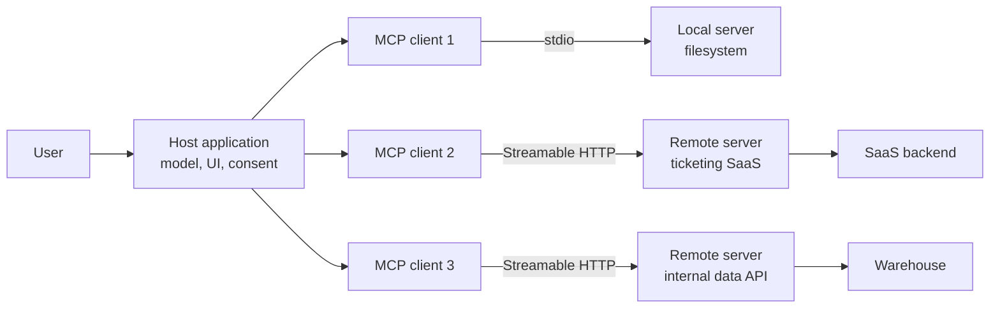
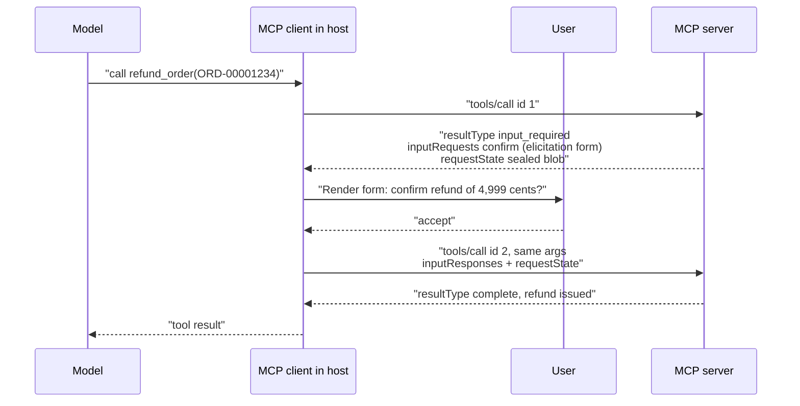
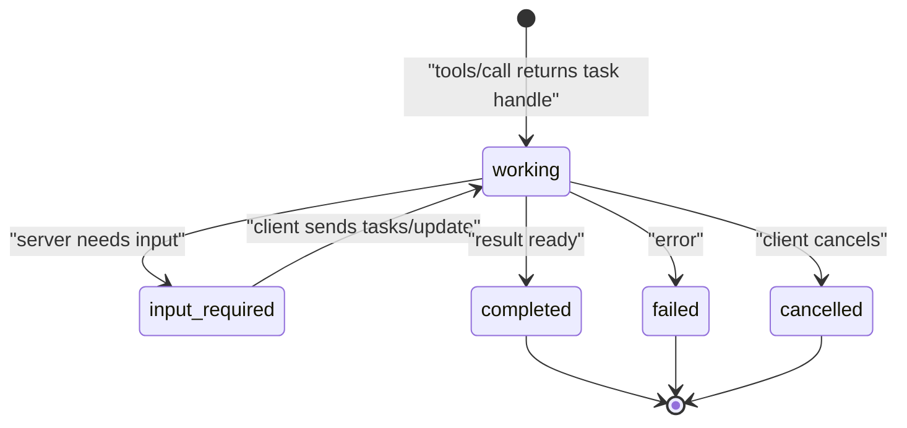
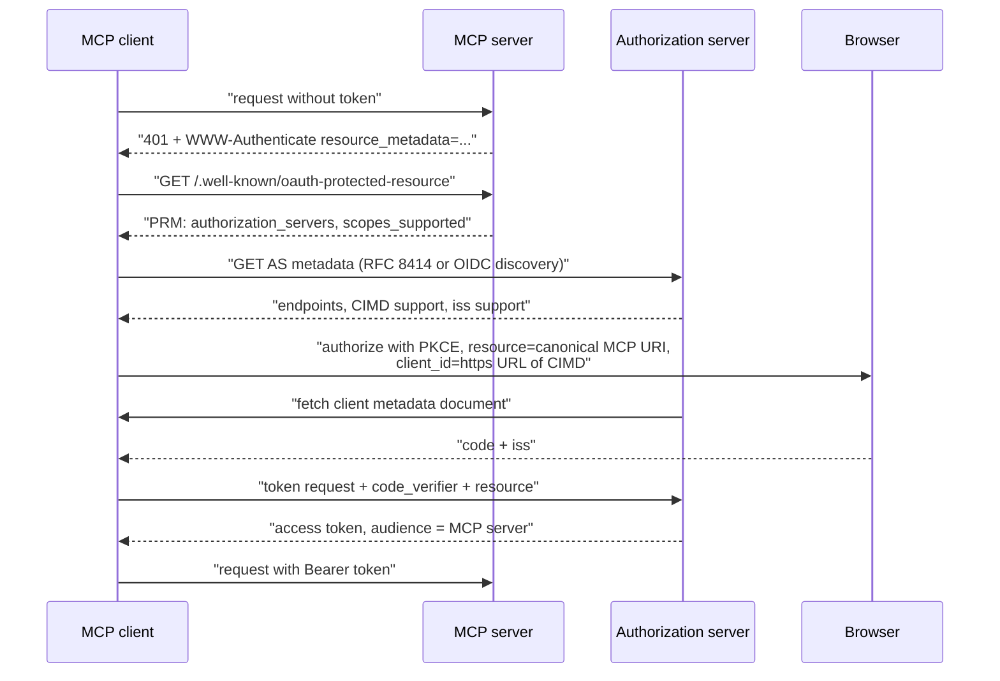
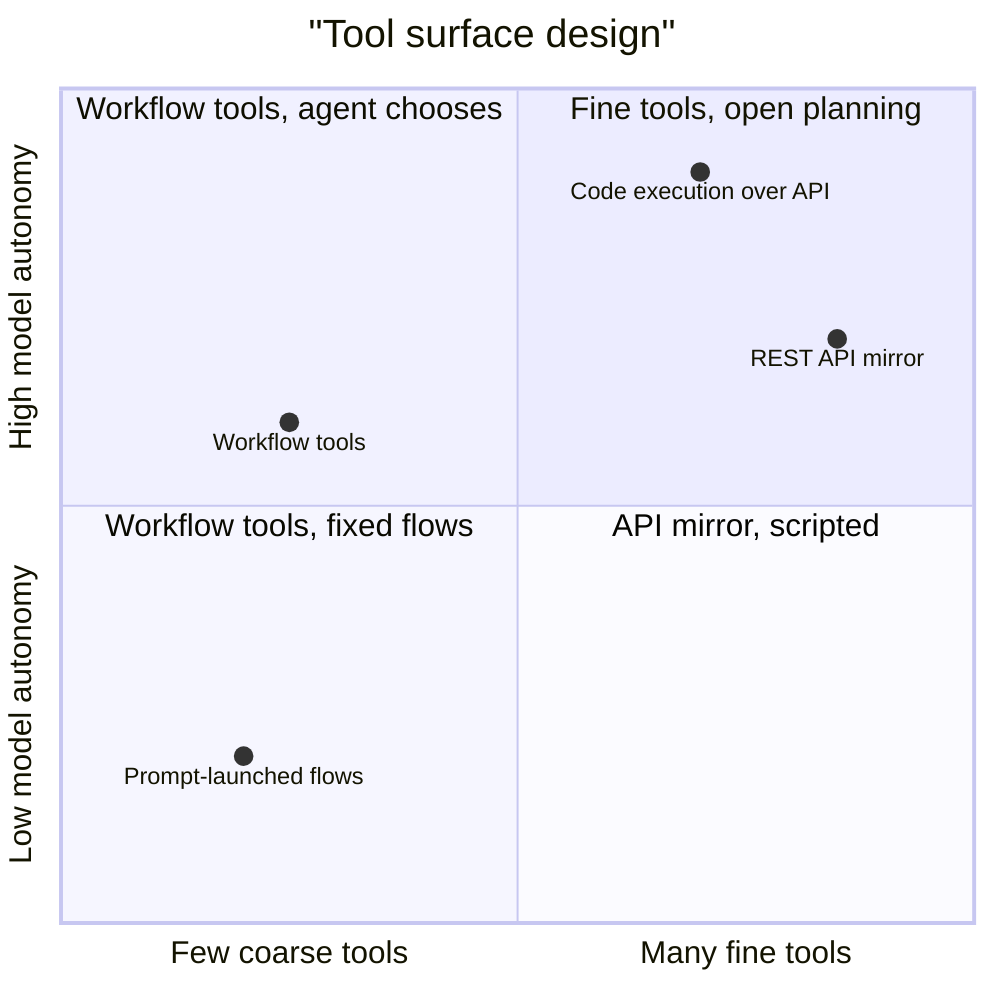
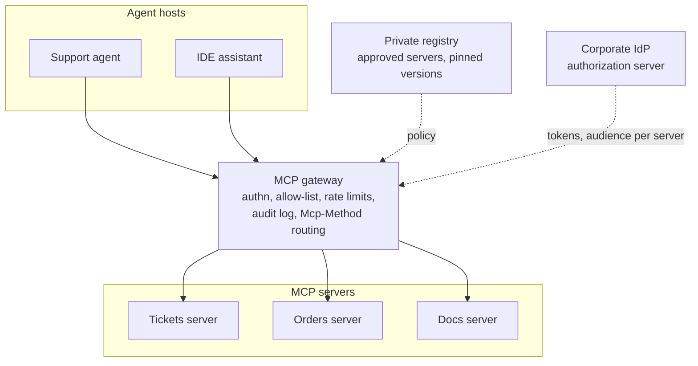

# Chapter 16: Model Context Protocol

> **What this chapter covers**: The Model Context Protocol (MCP) as of the 2026-07-28 specification revision: roles, server primitives (tools, resources, prompts), client features (sampling, elicitation, roots) and their deprecation, transports, the move from stateful sessions to a stateless request model, Multi Round-Trip Requests, the Tasks extension, URL-mode elicitation, extensions and MCP Apps, the MCP Registry, authorization (OAuth 2.1, Protected Resource Metadata, Client ID Metadata Documents, audience binding), governance under the Agentic AI Foundation, tool description design with A/B testing, and server performance.
>
> **Prerequisites**: Chapters 2 (tool calling), 4 (the agent loop), 9 (context engineering), 13 and 15 (framework integration of tools).
>
> **Where it is used**: Chapter 17 (A2A and the wider stack), Chapter 19 (cloud agent gateways that front MCP), Chapter 27 (agent security), Chapter 31 (deployment), and every framework chapter that consumes MCP tools.

---

**Spec revision used.** Every normative claim in this chapter is checked against the MCP specification revision **2026-07-28**, which the versioning page at modelcontextprotocol.io listed as the current revision when this chapter was written (September 2026). Where the previous revision **2025-11-25** differs, the chapter says so, because most servers and SDKs in the field were still speaking 2025-11-25 or earlier at the time of writing. If you read this after a newer revision ships, check the changelog page first; the protocol moved twice in under a year.

## 16.1 Level 1: Foundations

### 16.1.1 The problem MCP solves

Before MCP, every agent host wrote its own adapter for every tool source. Ten hosts and twenty tool sources meant up to 200 bespoke integrations, each with its own auth, schema format, and error conventions. MCP turns this into an M plus N problem: a host implements an MCP client once, a tool vendor implements an MCP server once, and they interoperate.

The analogy people use is the Language Server Protocol. LSP let one Python language server work in VS Code, Neovim, and Emacs. MCP lets one GitHub server work in Claude, ChatGPT, Cursor, VS Code, and your own LangGraph agent. The analogy holds on the architecture (JSON-RPC 2.0 messages, capability negotiation, a host that owns the UI) and breaks on the security model: a language server reads your code, an MCP server can act in the world on your behalf with your credentials.

You have built MCP servers already, so the value of this chapter is not "what is a tool". It is the precise contract, the parts that changed in 2026, and the design and operational decisions that separate a demo server from one a customer's security team will approve.

### 16.1.2 Roles: host, client, server

| Role | What it is | Owns |
|---|---|---|
| Host | The application the user interacts with: Claude Desktop, an IDE, your agent service | The model, the conversation, user consent, which servers are connected |
| Client | A protocol endpoint inside the host, one per server connection | Message framing, version selection, capability declaration, auth tokens for that server |
| Server | A process or service exposing capabilities | Tools, resources, prompts, and its own backend credentials |

The one-client-per-server rule matters. It is the isolation boundary: server A never sees server B's messages, and the host decides what crosses between them (usually by putting both servers' tool outputs into one model context, which is where cross-server prompt injection lives; see Chapter 27).



### 16.1.3 The three server primitives

MCP distinguishes primitives by **who controls them**. This is the mental model that makes the rest of the spec readable.

| Primitive | Controlled by | Typical use | Method family |
|---|---|---|---|
| Tools | The model (host lets it decide) | Actions and queries with side effects or computation | `tools/list`, `tools/call` |
| Resources | The application | Context the host attaches: files, records, schemas | `resources/list`, `resources/read`, `resources/templates/list` |
| Prompts | The user | Templates the user picks, often as slash commands | `prompts/list`, `prompts/get` |

The distinction is not decorative. If your text-to-SQL server exposes the warehouse schema as a tool (`get_schema`), the model decides when to fetch it and pays a round trip each time. If it exposes the schema as a resource, the host can attach it up front, cache it, and keep it in the stable prefix of the prompt where provider prompt caching works (Chapter 18). If it exposes "analyse last week's churn" as a prompt, the user triggers a vetted workflow instead of hoping the model composes it.

### 16.1.4 The client features

Servers can also ask the client for things:

- **Sampling**: the server asks the host's model to generate a completion. Lets a server use an LLM without holding its own API key.
- **Elicitation**: the server asks the user for structured input (a form) or, since 2025-11-25, sends them to a URL (URL mode) for something that must not pass through the client, such as an OAuth consent or a payment.
- **Roots**: the client tells the server which filesystem locations or URIs it may operate on.

The big 2026 change: in 2026-07-28, **Roots, Sampling, and Logging are Deprecated** under the new feature lifecycle policy (SEP-2577). They still work, and the policy guarantees at least twelve months in the Deprecated state before removal, but new implementations should not adopt them. The spec's suggested migrations: pass directories via tool parameters or configuration instead of Roots; call an LLM provider directly instead of Sampling; log to stderr or OpenTelemetry instead of Logging. Elicitation is not deprecated.

### 16.1.5 Why the protocol went stateless

Through 2025-11-25, an MCP connection began with an `initialize` request and a `notifications/initialized` notification, and a Streamable HTTP server could mint an `Mcp-Session-Id` header that the client echoed. That made remote servers stateful: a load balancer had to route every request in a session to the instance that held it, or the instances had to share session storage. Server-to-client requests (sampling, elicitation, roots) required the server to hold an open stream and correlate responses.

The 2026-07-28 revision removes all of that (SEP-2575, SEP-2567). Every request carries its protocol version and client capabilities in `_meta`. There is no handshake and no protocol-level session. Server-to-client requests are replaced by **Multi Round-Trip Requests (MRTR)**: the server returns an `input_required` result and the client retries. The practical outcome is that a remote MCP server can sit behind an ordinary round-robin load balancer and scale like any stateless HTTP API.

This is the most important thing to know when a customer says "we built an MCP server last year". Their server likely speaks 2025-06-18 or 2025-11-25. It still interoperates with clients that support those versions (the spec defines backward compatibility with the initialization-based revisions), but its scaling model and its elicitation code are now legacy.

### 16.1.6 Vocabulary

| Term | Meaning |
|---|---|
| Revision | A `YYYY-MM-DD` string naming the last backwards-incompatible change |
| `_meta` | Reserved metadata object on requests and results; carries version, capabilities, client and server info, trace context |
| `server/discover` | Mandatory RPC (2026-07-28) returning supported versions, capabilities, identity |
| MRTR | Multi Round-Trip Requests: `InputRequiredResult` plus retry with `inputResponses` |
| `requestState` | Opaque server-owned blob the client echoes on retry; attacker-controlled input |
| `resultType` | Required on every result: `"complete"` or `"input_required"` |
| Extension | Optional capability beyond core, identified by a reverse-domain string such as `io.modelcontextprotocol/tasks` |
| PRM | OAuth 2.0 Protected Resource Metadata (RFC 9728) |
| CIMD | Client ID Metadata Document: the client's `client_id` is an HTTPS URL serving its metadata |
| SEP | Specification Enhancement Proposal, the change process |

## 16.2 Level 2: Working knowledge

### 16.2.1 The message layer

MCP is JSON-RPC 2.0. Requests have an `id`, a `method`, and `params`; results echo the `id`. Under 2026-07-28, every request's `params._meta` must carry the protocol version and client capabilities, and should carry client info. A minimal tool call looks like this:

```json
{
  "jsonrpc": "2.0",
  "id": 7,
  "method": "tools/call",
  "params": {
    "name": "create_ticket",
    "arguments": {"title": "Refund not received", "priority": "high"},
    "_meta": {
      "io.modelcontextprotocol/protocolVersion": "2026-07-28",
      "io.modelcontextprotocol/clientCapabilities": {"elicitation": {}},
      "io.modelcontextprotocol/clientInfo": {"name": "support-agent", "version": "1.4.0"},
      "traceparent": "00-4bf92f3577b34da6a3ce929d0e0e4736-00f067aa0ba902b7-01"
    }
  }
}
```

The `traceparent` key is the W3C trace context propagation convention the 2026-07-28 revision documented for `_meta` (SEP-414). It is how a tool call made by an agent in LangGraph shows up as a child span of the right agent step in Langfuse or any OpenTelemetry backend.

If the server does not support the requested version it returns `UnsupportedProtocolVersionError` listing the versions it does support, and the client retries with one of them. A client that wants to choose up front calls `server/discover`, which every 2026-07-28 server must implement.

### 16.2.2 Tools in detail

A tool definition has a `name`, an optional `title`, a `description`, an `inputSchema`, optionally an `outputSchema`, and optional `annotations`. Since 2025-11-25 tools can carry `icons`. Under 2026-07-28 the input and output schemas may use any JSON Schema 2020-12 keyword (SEP-2106), and `structuredContent` may be any JSON value.

```json
{
  "name": "refund_order",
  "title": "Refund an order",
  "description": "Issue a refund for a delivered order. Use only after lookup_order confirms status is DELIVERED and the customer asked for a refund. Amount defaults to the full order total. Fails with ALREADY_REFUNDED if a refund exists.",
  "inputSchema": {
    "type": "object",
    "properties": {
      "order_id": {"type": "string", "pattern": "^ORD-[0-9]{8}$"},
      "amount_cents": {"type": "integer", "minimum": 1},
      "reason": {"type": "string", "enum": ["damaged", "not_received", "changed_mind"]}
    },
    "required": ["order_id", "reason"]
  },
  "annotations": {"destructiveHint": true, "idempotentHint": false, "openWorldHint": true}
}
```

Three rules that come from the spec and matter in practice:

1. **Input validation errors are tool execution errors, not protocol errors.** Since 2025-11-25 (SEP-1303), if the model passes `order_id: "12345"`, return a result with `isError: true` and a message the model can act on ("order_id must look like ORD-12345678"). A JSON-RPC error goes to the client and the model often never sees it, so it cannot self-correct.
2. **Annotations are hints, not guarantees.** The spec is explicit that clients must not trust annotations from untrusted servers. A malicious server can mark a destructive tool `readOnlyHint: true`. Use annotations to drive UI (confirmation prompts), never to skip approval for a server you do not control.
3. **Deterministic `tools/list` order.** 2026-07-28 says servers SHOULD return tools in a deterministic order. The reason is prompt caching: tool definitions sit at the top of the prompt, and a reordered list invalidates the provider cache for every conversation (Chapter 18 has the arithmetic).

### 16.2.3 Resources and prompts

Resources are identified by URIs (`file:///`, `https://`, or custom schemes like `crm://account/ACME-001`). `resources/templates/list` exposes parameterised URIs (`crm://account/{id}`). Under 2026-07-28, list and read results implement a `CacheableResult` interface with required `ttlMs` (a freshness hint in milliseconds) and `cacheScope` (`"public"` or `"private"`, controlling whether shared intermediaries may cache). A schema resource that changes weekly can say `ttlMs: 3600000, cacheScope: "private"` and the client stops polling it.

Subscriptions changed. The `resources/subscribe` and `resources/unsubscribe` methods and the HTTP GET stream were replaced by one method, `subscriptions/listen`: a long-lived POST whose response stream carries change notifications the client opted into (`toolsListChanged`, `promptsListChanged`, `resourcesListChanged`, `resourceSubscriptions`), each tagged with `io.modelcontextprotocol/subscriptionId`. Request-scoped notifications such as progress still flow on the response stream of the request they belong to.

Prompts return a list of messages, optionally with embedded resources. Use them for workflows a user should launch deliberately: "draft a quarterly business review for account X" as a prompt that pulls the right resources is more reliable than a free-text request.

### 16.2.4 Transports

| Transport | Status in 2026-07-28 | Use |
|---|---|---|
| stdio | Active | Local servers launched by the host as a subprocess. Credentials come from the environment, not OAuth. stdout carries only protocol messages; logs go to stderr. |
| Streamable HTTP | Active | Remote servers. Client POSTs each JSON-RPC message; server replies with JSON or an SSE stream for that request. |
| HTTP+SSE (the 2024-11-05 transport) | Deprecated | Legacy only; migrate to Streamable HTTP. |

What changed in Streamable HTTP for 2026-07-28:

- No `Mcp-Session-Id`. No GET endpoint (replaced by `subscriptions/listen`).
- Standard request headers `Mcp-Method` and `Mcp-Name` are required on POSTs (SEP-2243), so gateways and WAFs can route and rate-limit by method and tool name without parsing the body. A mismatch between header and body yields `HeaderMismatchError`.
- The `MCP-Protocol-Version` header carries the same version as `_meta`.
- SSE resumability (`Last-Event-ID`, event IDs) is removed. If a response stream breaks, the in-flight request is lost and the client must reissue it with a new request ID. This pushes idempotency onto tool design (16.3.4).
- Servers must validate `Origin` and return 403 for invalid values (clarified in 2025-11-25) to block DNS rebinding against local HTTP servers.

### 16.2.5 Multi Round-Trip Requests

MRTR is how a server asks for more input without holding state. Only `tools/call`, `resources/read`, and `prompts/get` may return it.



The server's interim result looks like this (trimmed):

```json
{
  "resultType": "input_required",
  "inputRequests": {
    "confirm": {
      "method": "elicitation/create",
      "params": {
        "mode": "form",
        "message": "Refund 49.99 USD on ORD-00001234?",
        "requestedSchema": {"type": "object",
          "properties": {"confirm": {"type": "boolean"}}, "required": ["confirm"]}
      }
    }
  },
  "requestState": "v1.AEAD-sealed-payload"
}
```

The rules that matter: the retry uses a new JSON-RPC `id`; the client must echo `requestState` byte for byte and must not inspect it; the server must treat `requestState` as attacker-controlled and integrity-protect it (HMAC or AEAD) whenever it influences authorization or business logic; and the server should bind it to the authenticated principal, a short expiry, and a digest of the original request to limit replay. The spec notes that these measures do not by themselves make state single-use; a one-time action still needs a server-side check.

An `inputRequests` entry may only use a feature the client declared. If the client did not declare `elicitation`, the server must not send `elicitation/create`.

### 16.2.6 Elicitation: form mode and URL mode

Form mode sends a restricted JSON Schema (flat object, primitive fields, enums with titles, defaults since 2025-11-25) and the client renders a form. The user can `accept`, `decline`, or `cancel`.

URL mode (added in 2025-11-25, SEP-1036) sends the user to a URL instead. The point is that sensitive data never passes through the MCP client or the model: a third-party OAuth consent for the server's own backend, a payment page, an identity check. Under 2025-11-25 the server later sent `notifications/elicitation/complete` with an `elicitationId`. Under 2026-07-28 both are removed: the client learns the outcome by retrying the original request, and a server that needs to correlate encodes its own identifier in `requestState`.

The rule for form mode is simple and often broken: never ask for passwords, API keys, or card numbers through a form elicitation. The spec says servers must not use form mode for sensitive information; that is what URL mode is for.

### 16.2.7 The Tasks extension

Long-running work (a 20 minute data export, a batch evaluation) does not fit one request-response. 2025-11-25 added **experimental** tasks to the core protocol (SEP-1686): the client could ask for a request to run as a task, get a task handle, poll, and fetch the result with a blocking `tasks/result`.

2026-07-28 moved tasks out of the core into an official extension, `io.modelcontextprotocol/tasks` (SEP-2663), and redesigned it:

- polling via `tasks/get` replaces the blocking `tasks/result`;
- `tasks/update` lets the client send input to a running task;
- `tasks/list` is removed;
- servers may return a task handle unsolicited, without per-request opt-in.



The state names above follow the 2025-11-25 experimental task states. The extension is versioned separately from the core and was still settling at the time of writing; check the extension's own spec page for the exact status values and whether cancellation is a dedicated method before you code against it.

### 16.2.8 Extensions and MCP Apps

2026-07-28 adds an `extensions` field to both `ClientCapabilities` and `ServerCapabilities`. An extension is optional, additive, and identified by a reverse-domain name. Both sides must declare it for it to be used. This is how MCP grows without bloating the core: Tasks moved there, authorization extensions live in a separate `ext-auth` repository, and **MCP Apps** lives there.

MCP Apps (SEP-1865, extension identifier `io.modelcontextprotocol/ui`, stable at extension version 2026-01-26 per the ext-apps repository) lets a server ship interactive UI. The server declares UI resources under the `ui://` URI scheme, tools reference those resources in metadata, and the host renders them in a sandboxed iframe that talks back to the host over MCP's JSON-RPC. A flight search tool can return a seat map instead of a wall of JSON. The security model is mandatory iframe sandboxing plus host-mediated, auditable messages: the UI never gets the host's credentials and cannot call tools except through the host. Host support varied by product in mid 2026; verify the specific hosts your customer uses.

### 16.2.9 The MCP Registry

The MCP Registry at registry.modelcontextprotocol.io is a metadata catalogue of public servers: name (namespaced by a verified domain or GitHub account), description, version, and how to install or connect (package coordinates or a remote URL), in a `server.json` format. It launched in preview on 8 September 2025. The API froze at v0.1 on 24 October 2025 pending a GA v1, and as of September 2026 the registry still described itself as a preview without data-durability guarantees; check its about page for current status.

Two things the registry is not. It is not a security review: a listing proves namespace ownership, not that the server is safe. And it is not meant to be queried directly by every host at runtime; the design intent is that downstream sub-registries (a vendor marketplace, your company's allow-list) consume it and add curation. For an enterprise, the pattern is a private registry that mirrors approved entries and pins versions.

### 16.2.10 Authorization in one pass

For HTTP transports, MCP authorization is OAuth 2.1 with a chosen subset of related RFCs. The MCP server is an OAuth resource server; a separate (or co-hosted) authorization server issues tokens.



The pieces:

- **Protected Resource Metadata (RFC 9728).** MCP servers must publish it; clients must use it to discover the authorization server. The 401 challenge's `resource_metadata` parameter points to it, with the `.well-known` path as fallback.
- **Authorization server discovery.** The AS must offer RFC 8414 metadata or OpenID Connect Discovery; clients must try both.
- **Client registration.** Three mechanisms: pre-registration, **Client ID Metadata Documents**, and Dynamic Client Registration (RFC 7591). CIMD was added as recommended in 2025-11-25; in 2026-07-28 DCR is Deprecated in its favour. With CIMD, the client's `client_id` is an HTTPS URL; the AS fetches the JSON document at that URL and validates the redirect URIs in it. This removes the open registration endpoint that DCR required, which security teams disliked because anyone could mint clients.
- **PKCE** is required (OAuth 2.1).
- **Resource indicators (RFC 8707).** The client must send `resource=<canonical MCP server URI>` on both the authorization and token requests. This is audience binding: the token says which server it is for.
- **Audience validation.** The server must verify the token was issued for it, and must not accept or pass through tokens meant for anything else. Token passthrough (the MCP server forwarding the user's token to a downstream API) is explicitly forbidden; the server gets its own token for downstream calls.
- **Issuer validation (RFC 9207).** 2026-07-28 says ASes should return `iss` in the authorization response, and clients must check a present `iss` against the recorded issuer before redeeming the code. This blocks mix-up attacks when a client talks to many ASes.
- **Scope step-up.** A 403 with `error="insufficient_scope"` and a `scope` parameter tells the client which scopes the operation needs; the client re-authorizes with the union of old and new scopes (incremental consent, SEP-835).
- **Credentials keyed by issuer** (2026-07-28, SEP-2352): a client must not reuse a client ID registered with one AS at another.

stdio servers do not use any of this; they read credentials from the environment.

### 16.2.11 Governance

In December 2025 the Linux Foundation announced the Agentic AI Foundation (AAIF), with Anthropic contributing MCP alongside Block's goose and OpenAI's AGENTS.md as founding projects. The protocol's own governance (maintainers, core maintainers, working groups, the SEP process) was formalised in 2025-11-25 (SEP-932, SEP-1302) and the SEP workflow moved to PR-based files in a `seps/` directory in 2026-07-28 (SEP-1850). In August 2026 A2A also joined the AAIF (Chapter 17). The Linux Foundation press release and the AAIF site are the primary sources; membership counts quoted in secondary sources vary, so this chapter does not repeat them.

The practical meaning: no single vendor can change MCP unilaterally, deprecations follow a published policy with a twelve-month minimum window (SEP-2596), and a customer's procurement team can treat MCP as a neutral standard.

### 16.2.12 Message-level walkthroughs under 2026-07-28

The snippets below trace real exchanges on the wire. JSON-RPC envelopes are shown in full where they teach something and trimmed elsewhere. Field names follow the 2026-07-28 spec pages for basic messages, MRTR, and authorization.

**Walkthrough A: discovery and a plain tool call over Streamable HTTP.**

Step 1. The client probes the server once and caches the answer.

```http
POST /mcp HTTP/1.1
Host: tickets.example.net
Content-Type: application/json
Accept: application/json, text/event-stream
MCP-Protocol-Version: 2026-07-28
Mcp-Method: server/discover

{"jsonrpc":"2.0","id":1,"method":"server/discover","params":{"_meta":{
  "io.modelcontextprotocol/protocolVersion":"2026-07-28",
  "io.modelcontextprotocol/clientCapabilities":{"elicitation":{}},
  "io.modelcontextprotocol/clientInfo":{"name":"support-agent","version":"1.4.0"}}}}
```

The result lists supported versions, the server's capabilities (tools, resources, any extensions such as `io.modelcontextprotocol/tasks`), and its identity. The client now knows it can stay stateless.

Step 2. The client lists tools. The result carries `resultType: "complete"`, the tool array, and the `CacheableResult` fields.

```json
{"jsonrpc":"2.0","id":2,"result":{
  "resultType":"complete",
  "tools":[{"name":"ticket_create","description":"...","inputSchema":{"type":"object"}}],
  "ttlMs":600000,
  "cacheScope":"private",
  "_meta":{"io.modelcontextprotocol/serverInfo":{"name":"tickets","version":"3.2.1"}}}}
```

With `ttlMs` of 600,000 the host can reuse this list for 10 minutes. A host that places the list in the stable prompt prefix and refreshes only on expiry or a `toolsListChanged` notification keeps the provider cache warm.

Step 3. The model picks `ticket_create`. The POST carries `Mcp-Method: tools/call` and `Mcp-Name: ticket_create` as headers, matching the body. A gateway can rate-limit on those headers alone. The result:

```json
{"jsonrpc":"2.0","id":3,"result":{
  "resultType":"complete",
  "content":[{"type":"text","text":"Created TCK-20931, priority high"}],
  "structuredContent":{"ticket_id":"TCK-20931","priority":"high"},
  "isError":false}}
```

Return both `content` (for the model) and `structuredContent` (for code that validates against `outputSchema`). If the model had sent an invalid priority, the same shape comes back with `isError: true` and a corrective message, not a JSON-RPC error.

**Walkthrough B: an MRTR exchange with a version mismatch first.**

A client configured for a newer revision calls an older server.

```json
{"jsonrpc":"2.0","id":10,"error":{"code":-32022,
  "message":"Unsupported protocol version",
  "data":{"supported":["2026-07-28","2025-11-25"]}}}
```

The client retries with 2026-07-28 (the shape of `data` here is illustrative; read the `UnsupportedProtocolVersionError` schema for exact field names). Then it calls `refund_order`. The server needs confirmation and returns the `input_required` result shown in 16.2.5. The client renders the form and retries:

```json
{"jsonrpc":"2.0","id":12,"method":"tools/call","params":{
  "name":"refund_order",
  "arguments":{"order_id":"ORD-00001234","reason":"damaged"},
  "inputResponses":{"confirm":{"action":"accept","content":{"confirm":true}}},
  "requestState":"v1.AEAD-sealed-payload",
  "_meta":{"io.modelcontextprotocol/protocolVersion":"2026-07-28"}}}
```

Four things to check in a code review of this exchange:

1. The retry `id` (12) differs from the original (11).
2. The arguments are identical to the original call. The server compares a digest of them with the one sealed in `requestState`.
3. `requestState` is echoed unchanged.
4. If the user had declined, the client still retries with `action: "decline"`. The server then returns a complete result saying the refund was not issued, and the model can tell the user. A client that just drops the call leaves the model guessing.

**Walkthrough C: OAuth discovery, message by message.**

1. The client sends `tools/call` with no token. The server replies `401` with `WWW-Authenticate: Bearer resource_metadata="https://tickets.example.net/.well-known/oauth-protected-resource", scope="tickets:write"`.
2. The client fetches the PRM document:

```json
{"resource":"https://tickets.example.net/mcp",
 "authorization_servers":["https://login.example.net"],
 "scopes_supported":["tickets:read"],
 "bearer_methods_supported":["header"]}
```

3. The client fetches `https://login.example.net/.well-known/oauth-authorization-server`. If that fails it tries OpenID Connect discovery. It records `issuer` and checks `client_id_metadata_document_supported` and `authorization_response_iss_parameter_supported`.
4. The client's `client_id` is `https://agent.example.org/oauth/client.json`. The AS fetches that document, which lists `client_name`, `redirect_uris`, `grant_types`, and `token_endpoint_auth_method`, and checks that the redirect URI in the request is among them.
5. The client opens the browser with `response_type=code`, `code_challenge` (S256), `scope=tickets:write` (taken from the challenge), `resource=https%3A%2F%2Ftickets.example.net%2Fmcp`, and `state`.
6. The callback arrives with `code`, `state`, and `iss`. The client compares `iss` to the recorded issuer by exact string before doing anything else.
7. The token request sends `code`, `code_verifier`, and the same `resource`. The access token's audience is the MCP server's canonical URI.
8. The retried `tools/call` carries `Authorization: Bearer ...` and succeeds. A later call to `ticket_delete` gets `403 insufficient_scope, scope="tickets:admin"`. The client re-authorizes with the union `tickets:write tickets:admin`.

Where teams get this wrong in practice: using a different `resource` value in steps 5 and 7, trailing-slash mismatches in the canonical URI, reading `scope` from `scopes_supported` when the challenge gave a narrower one, and caching tokens by server host rather than by issuer plus resource.

## 16.3 Level 3: Depth

### 16.3.1 Version negotiation and backward compatibility

Under 2025-11-25 the version was negotiated once in `initialize`. Under 2026-07-28 every request carries its version and the server accepts or rejects each independently. A client that must talk to both kinds of server needs a probe. The spec offers `server/discover` as a backward-compatibility probe on stdio: a legacy server will reject an unknown method, and the client falls back to the `initialize` handshake.

A pragmatic client strategy for late 2026:

1. For a server you have not seen, call `server/discover`.
2. If it returns versions including 2026-07-28, go stateless.
3. If it fails with method-not-found (or on HTTP returns an error typical of a legacy server), run `initialize` with the highest legacy version you support, and keep the session ID if one is issued.
4. Cache the result per server URL with a TTL.

Most SDKs do this for you once they reach 2026-07-28 support; check the SDK tier and changelog before assuming. The SDK tiering system (SEP-1730) exists precisely so you can tell which SDKs track the spec closely.

### 16.3.2 Why statelessness is worth the migration

Consider a remote server with 6 instances behind a load balancer, 3,000 concurrent agent conversations, and a p99 tool latency of 800 ms.

Under a sessionful design with sticky routing, one instance failure drops 500 sessions (one sixth). Each dropped session must re-initialize and loses any in-flight server-to-client request (a pending elicitation is simply gone). Scaling from 6 to 9 instances does not rebalance existing sessions; the new instances only get new sessions, so the hot instances stay hot until conversations end.

Under 2026-07-28, any instance can serve any request. An instance failure loses only its in-flight requests (roughly concurrency times latency divided by instances: if the fleet sees 400 requests per second at 0.8 s mean latency, about 320 are in flight fleet-wide, about 53 per instance), and each of those is retried by the client on another instance. Scale-out rebalances immediately. Pending elicitations survive because their state is in the client's `requestState`, not on the dead instance.

The cost is that cross-call state must now be explicit. SEP-2567 is blunt: servers that need state across calls use server-minted handles passed as ordinary tool arguments. A `open_cart` tool returns `cart_id: "c_8f2a"`; later tools take `cart_id`. That handle lives in the model's context and in your database, which is visible, debuggable, and survives restarts. It also means the model can pass the wrong handle, so validate ownership of every handle against the authenticated principal.

### 16.3.3 Securing requestState

`requestState` moves server memory into the client. Treat it like a session cookie.

A sound construction: serialise `{principal, method, args_digest, step, pending_ids, expires_at}` and seal it with AES-GCM (AEAD) under a server key, with a key ID prefix for rotation. On retry: decrypt (reject on failure), compare principal with the token's subject, compare method and a SHA-256 of the canonicalised arguments with the retry, check expiry (60 to 300 seconds is typical for a human confirmation), and for one-shot actions record a nonce in Redis with the same TTL and reject reuse.

Size matters. A 300 byte payload sealed and base64url encoded is about 430 bytes. Keep it small; it travels on every retry, and it must not carry data the user should not see (the client cannot read it if encrypted, but a signed-only payload is readable).

### 16.3.4 Idempotency after resumability was removed

With SSE resumability gone, a broken stream means the client reissues the request with a new ID. If the tool had side effects, the first attempt may have completed. For any tool with side effects:

- accept an idempotency key argument (or derive one from a client-supplied handle plus operation);
- store the result keyed by it for longer than the client's retry horizon;
- return the stored result on a duplicate.

The Tasks extension helps for long operations: return a task handle quickly and let the client poll, so a broken stream only loses a cheap poll.

### 16.3.5 Where the tokens go

MCP's cost is paid in context. Every connected server's tool definitions sit in the prompt of every model call.

Worked example. A host connects 5 servers averaging 18 tools each. A well-written definition (name, 60 word description, schema with 4 parameters) is about 220 tokens. Total: 5 times 18 times 220 = 19,800 tokens of tool definitions before the user says anything. An agent task averaging 12 model calls resends them 12 times: 237,600 input tokens per task on tool definitions alone.

With provider prompt caching and a stable, deterministically ordered tool block, the first call writes the cache and the next 11 read it. On a model at 3 USD per million input tokens with reads at 0.1 times and 5 minute writes at 1.25 times (the Anthropic multipliers as of September 2026; check current pricing), the tool block costs:

- uncached: 237,600 times 3 / 1,000,000 = 0.713 USD per task;
- cached: (19,800 times 1.25 + 11 times 19,800 times 0.1) times 3 / 1,000,000 = (24,750 + 21,780) times 3 / 1,000,000 = 0.140 USD per task.

That is an 80 percent saving, and it disappears if one server returns its tools in a different order per request. This is the arithmetic behind the deterministic-order SHOULD.

Accuracy degrades too. Tool selection accuracy falls as the tool count grows, and past a few dozen tools most models confuse near-duplicates. The fixes, in order of preference: connect fewer servers per agent (scope by task), let the host filter tools per step (Chapter 9, tool retrieval), and merge fine-grained tools into fewer workflow-level tools.

### 16.3.6 Failure modes

| Failure | Symptom | Cause | Fix |
|---|---|---|---|
| Tool poisoning | Model follows instructions hidden in a tool description | Malicious or compromised server | Pin server versions, review descriptions on change, show diffs to admins |
| Rug pull | Tool definition changes after approval | Server updated its list | Hash definitions at approval; alert on `toolsListChanged` with a diff |
| Cross-server injection | Output of server A causes a call to server B | Shared model context | Taint tracking, approval on destructive calls, per-task server scoping (Chapter 27) |
| Confused deputy | Server acts with its own broad credentials for a user who lacks rights | Missing per-user authorization downstream | Per-user tokens or token exchange; never a shared admin key behind a multi-user server |
| Token passthrough | Downstream API accepts a token not meant for it | Server forwarded the client's token | Forbidden by spec; get a separate downstream token |
| Stdout pollution | stdio client crashes on parse error | Server printed logs to stdout | Log to stderr only |
| Session affinity leftovers | 404s after scale-out on a legacy server | Sticky sessions assumed | Migrate to 2026-07-28 or add shared session store |
| Duplicate side effects | Two refunds issued | Retry after broken stream | Idempotency keys |

### 16.3.7 Error codes

2026-07-28 partitions the JSON-RPC server-error range: -32000 to -32019 stays implementation-defined, -32020 to -32099 is reserved for MCP. The new codes: `HeaderMismatch` -32020, `MissingRequiredClientCapability` -32021, `UnsupportedProtocolVersion` -32022. Resource-not-found moved from -32002 to -32602 (Invalid Params). If you alert on error codes, update the mapping when you upgrade.

## 16.4 Level 4: Mastery

### 16.4.1 Tool description design

The description is the only documentation the model reads. In a text-to-SQL server you have probably seen that renaming one parameter changed accuracy more than a prompt rewrite. A description that works tells the model five things, in this order:

1. **What it does**, in one sentence, with the domain noun ("Issue a refund for a delivered order").
2. **When to use it and when not**, especially versus sibling tools ("Use after lookup_order. For partial shipments use refund_line_items instead").
3. **Preconditions** ("status must be DELIVERED").
4. **What comes back**, including the shape of errors the model can act on ("Fails with ALREADY_REFUNDED").
5. **Cost or side effects** if they matter ("Sends an email to the customer").

Parameter descriptions carry format constraints and examples. Enums beat free text. Return compact, model-oriented output: IDs plus the three fields the next step needs, not the full API object. Put guidance in the error messages, because the model reads errors at the exact moment it needs guidance.

Anti-patterns: marketing language ("powerful, flexible"), instructions to the model that belong in the host's system prompt ("always be polite"), and descriptions that differ between servers only in the product name, which makes selection a coin toss.

The spec's tool name guidance (SEP-986, 2025-11-25) is worth following: short, stable, ASCII, snake or dot separated. Hosts prefix names with the server name to avoid collisions, so `create` becomes ambiguous fast; `ticket_create` survives.

### 16.4.2 A/B testing tool descriptions

Treat descriptions as a model you train with experiments. The protocol:

1. **Golden set.** 150 to 300 user requests with the correct tool and key arguments labelled, including near-miss cases where a sibling tool is wrong. Include multi-step tasks where the right first call matters.
2. **Variants.** Change one thing per variant: description text, parameter names, output shape, or tool granularity. Freeze the model, temperature, system prompt, and the other servers.
3. **Metrics.** Tool selection accuracy, argument exact-match or schema-valid rate, end-to-end task success, and tokens per task. For stochastic agents run each item k times and report pass^k (Chapter 30).
4. **Paired analysis.** Same items for both variants. Use a paired bootstrap on the per-item difference, or McNemar's test for binary outcomes.

Worked example. 200 items, variant A (current) versus B (adds "when not to use" sentences). Per-item outcomes: both correct 150, both wrong 18, A only 8, B only 24. Accuracy A = 158/200 = 79.0 percent; B = 174/200 = 87.0 percent; difference 8.0 points. McNemar uses only discordant pairs: statistic (24 minus 8) squared over (24 plus 8) = 256/32 = 8.0, p about 0.005 on one degree of freedom. A paired bootstrap on the item-level differences (10,000 resamples) gives a 95 percent interval of roughly 3.5 to 12.5 points. Report it as: "B improves tool selection by 8.0 points (95 percent CI 3.5 to 12.5, paired bootstrap, n = 200, 2026-09-27)". Then check that B did not add tokens enough to matter: if B's tool block grew from 19,800 to 22,500 tokens, the cached cost change is small, but check the uncached cold-start cost for short conversations.

Run the study against at least two model families. A description tuned to one model family's quirks can regress on another, and your server will be called by hosts you do not control.

**Sample size for a description A/B study.** Decide n before you start. For paired binary outcomes, power depends on the discordant-pair rate, not on overall accuracy. With p10 as the rate where only A is right and p01 where only B is right, a McNemar test at two-sided alpha 0.05 and 80 percent power needs about

n = (1.96 times sqrt(p_d) + 0.84 times sqrt(p_d minus delta squared)) squared / delta squared

where p_d = p10 + p01 is the discordant rate and delta = p01 minus p10 is the effect.

| Expected effect delta | Discordant rate p_d | Items needed (approx.) |
|---|---|---|
| 8 points | 0.16 | 196 |
| 5 points | 0.12 | 380 |
| 5 points | 0.20 | 632 |
| 3 points | 0.10 | 870 |
| 2 points | 0.08 | 1,560 |

Worked check for the first row: sqrt(0.16) = 0.40, sqrt(0.16 minus 0.0064) = 0.392. The numerator is (1.96 times 0.40 + 0.84 times 0.392) squared = (0.784 + 0.329) squared = 1.239. Divide by 0.0064 to get about 194, which rounds to the tabled 196.

Lessons from the table:

- Detecting a 2 to 3 point change needs roughly 1,000 or more items. Most teams cannot label that many, so they should aim for changes big enough to matter (5 points or more) or pool several related changes into one variant.
- Running each item k times does not add independent items. It reduces per-item noise. Analyse per-item mean success with a paired bootstrap, and count items, not runs, as n.
- Estimate p_d from a pilot of 50 items before sizing the full study.
- Pre-register the metric, n, and the decision rule ("ship B if the lower CI bound exceeds 0"), so a borderline result is not re-analysed until it passes.
- Stratify the golden set by intent and difficulty and report per-stratum results. A variant that helps common intents can hurt rare ones.

### 16.4.3 Designing the tool surface

The granularity decision is the one senior engineers argue about.



- **API mirror** (one tool per REST endpoint): quick to generate, poor accuracy, huge token cost. Acceptable for internal power-user agents only.
- **Workflow tools** (`resolve_refund_request` that does lookup, policy check, and refund): fewer calls, fewer errors, encodes business rules server-side where they are testable. The default for customer deployments.
- **Code execution over an API**: the model writes code against a typed client in a sandbox, and the MCP server exposes the API as files or a module rather than as tools. This cuts tool-definition tokens drastically for large APIs and has become a common pattern since late 2025; it needs a real sandbox (Chapter 23).
- **Prompts plus resources**: when the workflow is known, let the user launch it.

### 16.4.4 Server performance and connection pooling

An MCP server is usually a thin layer over a backend. Its latency budget is dominated by the backend and by connection setup.

Budget for a remote tool call at p50, a server in the same region as the backend:

| Step | Cold (ms) | Warm (ms) |
|---|---|---|
| TLS to MCP server from client | 60 | 0 (keep-alive) |
| Token validation (JWKS cached) | 1 | 1 |
| Backend DB connection (TLS + auth) | 40 | 0 (pooled) |
| Query | 25 | 25 |
| Serialise and respond | 3 | 3 |
| Total | 129 | 29 |

A 4x difference from connection handling alone. Rules:

- **Pool backend connections** per instance (a database pool sized to the instance's concurrency, an HTTP client with keep-alive). Statelessness at the MCP layer does not mean stateless processes; pools are process state and that is fine.
- **Cache JWKS and token introspection results** for their validity period; introspection on every call adds a network hop.
- **Keep the client's HTTP connection alive.** Streamable HTTP is plain HTTP; HTTP/2 multiplexing lets one connection carry many concurrent tool calls.
- **Per-user downstream tokens** need a token cache keyed by user and scope, or every call becomes an OAuth exchange.
- **Stream progress** on long calls (`notifications/progress` on the request's response stream) so the host UI stays responsive, and switch to the Tasks extension past about 30 seconds so a dropped connection does not lose work.
- **Bound output size.** A tool returning 40,000 tokens of rows is a context bomb. Paginate, summarise, or return a resource link.
- **stdio servers** start per host process; a Python server with heavy imports can take 1 to 3 seconds to start. Lazy-import backends and keep the process alive for the host session.

Capacity arithmetic. A server instance with a pool of 20 backend connections and a 25 ms query handles at most 20 / 0.025 = 800 queries per second before queuing. At 400 requests per second with 1.2 backend calls each, one instance runs at 480 / 800 = 60 percent pool utilisation. Plan to keep pool utilisation under about 70 percent at p99 load, because queueing delay rises sharply past that (Chapter 32).

### 16.4.5 Enterprise deployment pattern



The gateway is where the 2026-07-28 header requirements pay off: it can enforce "this agent may call `orders.refund` at most 10 times per minute" by reading `Mcp-Method` and `Mcp-Name` without parsing JSON bodies. Several vendors ship MCP gateways (the AAIF's agentgateway project, cloud gateways in Chapter 19, API gateway plugins); pick on audit and policy features, not tool count.

Audience binding in this topology needs care. If the gateway terminates OAuth and forwards to servers, either each server validates a token issued for it (the gateway performs token exchange per server), or the servers trust the gateway over mTLS and the gateway is the resource server. What you must not do is forward one token accepted by all servers; that is the passthrough pattern the spec forbids.

### 16.4.6 Observability for MCP

A tool call crosses three processes (model provider, host, server), so tracing must be deliberate.

- **Propagate trace context** in `_meta` (`traceparent`, `tracestate`, `baggage`) as documented in 2026-07-28. The server starts a child span from it. The agent's trace then shows the model call, the tool decision, the MCP request, the server's backend queries, and the result as one tree.
- **Span attributes worth recording**: method, tool name, server name and version, protocol version, result type (`complete` or `input_required`), `isError`, output size in bytes and in estimated tokens, latency split into queue, backend, and serialise.
- **Metrics per tool**: call rate, error rate (protocol errors and tool execution errors separately), p50 and p95 latency, mean output tokens. Output tokens per tool is the metric most teams forget; it is what inflates context.
- **Logs**: stdio servers write to stderr; remote servers use structured logs with the trace ID. With the Logging feature Deprecated, do not rely on `notifications/message` for operational logs.
- **Audit**: for tools with side effects, a separate append-only audit record of principal, tool, arguments (redacted), and outcome. Audit is a compliance artifact, not a debugging log, and has its own retention.

A useful weekly report for a customer: top ten tools by output tokens, top ten by error rate, and the tools the model never calls. Unused tools are pure context cost; remove or merge them.

### 16.4.7 Migration guide from 2025-11-25 to 2026-07-28

Each row below is a change in the 2026-07-28 changelog, what breaks if you ignore it, and the action to take.

| 2025-11-25 behaviour | 2026-07-28 behaviour | What breaks | Action |
|---|---|---|---|
| `initialize` handshake, version negotiated once | Version and capabilities in every request's `_meta`; `server/discover` mandatory | New clients never send initialize | Implement `server/discover`; read `_meta` per request; keep the handshake for legacy clients |
| `Mcp-Session-Id` sessions | No protocol sessions | Anything keyed by session ID | Server-minted handles as tool arguments, with ownership checks |
| Server-initiated `sampling/createMessage`, `elicitation/create`, `roots/list` | MRTR `input_required` results | Server code that awaits a client response mid-handler | Return `InputRequiredResult` with sealed `requestState`; resume on retry |
| URL elicitation with `elicitationId` and completion notification | Both removed; outcome learned on retry | Completion handlers never fire | Put your correlation ID inside `requestState` |
| GET stream plus `resources/subscribe` | `subscriptions/listen` POST stream | Clients no longer open GET | Implement `subscriptions/listen` with opt-in types |
| SSE resumability with `Last-Event-ID` | Removed | Resumed streams never arrive | Idempotency keys; Tasks for long work |
| `ping`, `logging/setLevel` | Removed; log level per request in `_meta` | Health checks built on ping | HTTP health endpoint; OpenTelemetry for logs |
| Tasks experimental in core, `tasks/result` | `io.modelcontextprotocol/tasks` extension, `tasks/get`, `tasks/update` | Blocking result calls | Declare the extension; switch to polling |
| Results without `resultType` | `resultType` required | Strict new clients fail parsing | Add `resultType: "complete"` everywhere |
| Resource not found -32002 | -32602 | Error mapping and alerts | Update codes; new MCP codes are in -32020 to -32099 |
| No `Mcp-Method` or `Mcp-Name` headers | Required on POST | Gateways reject the request | Send the headers; validate that they match the body |
| DCR commonly used | DCR deprecated; CIMD preferred; `iss` validation; `application_type` in DCR | Stricter ASes reject old flows | Publish a CIMD; validate `iss`; key credentials by issuer |
| List results without cache hints | `ttlMs` and `cacheScope` required | Strict clients fail parsing | Add sensible TTLs per list |

Order of work that minimises risk:

1. Add the fields that cost nothing to older clients: `resultType`, `ttlMs`, `cacheScope`, deterministic order, and the new error codes behind a flag.
2. Implement `server/discover` and per-request `_meta` handling alongside `initialize`.
3. Move state to handles and convert server-initiated requests to MRTR.
4. Add idempotency keys.
5. Migrate auth.
6. Remove sessions last, once telemetry shows legacy clients have gone.

Check your SDK's 2026-07-28 support status first. Many of these steps are SDK upgrades, not hand-written code.

### 16.4.8 Worked migration: a legacy server to 2026-07-28

A synthetic company, Brightwell Insurance, runs a claims MCP server built in mid 2025 on the 2025-06-18 revision. It has 34 tools, uses `Mcp-Session-Id` to remember the "current claim", uses sampling to summarise claim notes with the host's model, uses Dynamic Client Registration, and runs 2 instances with sticky sessions.

Step by step:

1. **Inventory and test harness.** Record 500 real (synthetic) tool-call sequences from the current server as golden traffic. Build a replay harness that checks results match. Nothing else starts until this exists.
2. **Remove the implicit session.** Add a `claim_id` parameter to every tool that relied on "current claim". Add `open_claim` returning the ID. Validate on every call that the authenticated user may access that claim. Update tool descriptions to say "claim_id from open_claim or search_claims".
3. **Replace sampling.** The summarise feature calls the provider through the company's model gateway (Chapter 18) with the server's own virtual key and budget. This moves model cost from the host to the server owner, which must be agreed with whoever pays.
4. **Confirmations via MRTR.** The "close claim" tool returns `input_required` with a form elicitation and a sealed `requestState` bound to user, claim ID, and a 120 second expiry, and records a nonce to enforce single use.
5. **Idempotency.** "Issue payment" takes an idempotency key; results are stored for 24 hours.
6. **Consolidate tools.** The 500-trace harness shows 9 tools called less than once per 1,000 tasks and 6 near-duplicate pairs. Merge to 22 tools. A/B test descriptions on the golden set (16.4.2) before and after the merge.
7. **Auth.** Move to CIMD with the corporate IdP, add RFC 8707 resource handling and audience checks, and validate `iss`. Keep DCR enabled for older clients for the deprecation window.
8. **Dual support.** The SDK version chosen supports both the 2026-07-28 per-request model and the legacy handshake. Remove sticky sessions only after legacy traffic falls below an agreed threshold (for example 1 percent for 14 days).
9. **Scale test.** Run 3 instances behind round-robin and kill one under load; confirm clients retry cleanly and no duplicate payments occur.

Effort estimate for a team that knows the codebase: roughly 2 to 3 engineer-weeks, dominated by steps 1, 2, and 6. The payoff: horizontal scaling without affinity, fewer tools (22 times about 220 tokens is 4,840 versus 7,480 tokens per call), and an auth model the security team accepts.

### 16.4.9 Where practitioners and vendors disagree

- **Is MCP needed at all for a single-app agent?** If you own the agent and the tools, native function calling in-process is simpler and faster. MCP pays off when tools are shared across hosts or teams, or when the tool owner is a different party. Many production agents use both.
- **Sampling's deprecation.** Some server authors relied on sampling to avoid holding model keys. The maintainers' view (SEP-2577) is that integrating directly with provider APIs is clearer about who pays and which model runs. Expect some servers to keep using it during the window.
- **Remote versus local.** Local stdio servers inherit the user's machine privileges; remote servers centralise control and audit. Security teams increasingly prefer remote servers behind a gateway, while developer tools still lean local.
- **Registry trust.** The registry proves namespace ownership, not safety. Vendors that sell "verified" MCP marketplaces add scanning, but scanning descriptions for injection is heuristic. Treat any claim of a "safe" marketplace as marketing until you see their review process.
- **Code execution versus tools.** Proponents cite large token savings for big APIs; critics point to sandbox complexity and harder auditing of what the agent actually did. Both are right; it depends on API size and the audit requirement.

## 16.5 Subtopic checklist

- [x] Host, client, server roles and the one-client-per-server boundary
- [x] Tools, resources, prompts and who controls each
- [x] Client features: sampling, elicitation, roots, and their 2026-07-28 deprecation status
- [x] Transports: stdio and Streamable HTTP, deprecated HTTP+SSE
- [x] Sessions: 2025-11-25 `Mcp-Session-Id` and initialize, removed in 2026-07-28; server-minted handles
- [x] Async Tasks: experimental in 2025-11-25, moved to the `io.modelcontextprotocol/tasks` extension in 2026-07-28
- [x] URL-mode elicitation and its 2026-07-28 changes
- [x] Extensions mechanism
- [x] MCP Registry status and role
- [x] OAuth 2.1, Protected Resource Metadata, Client ID Metadata Documents, audience binding via RFC 8707, issuer validation, step-up scopes
- [x] MCP Apps (`io.modelcontextprotocol/ui`)
- [x] Governance under the Linux Foundation Agentic AI Foundation
- [x] Tool description design
- [x] A/B testing descriptions with paired statistics
- [x] Server performance and connection pooling [added]
- [x] Multi Round-Trip Requests and `requestState` security
- [x] Prompt-cache implications of tool lists

## 16.6 Common misconceptions

1. **"MCP servers keep a session per client."** That was true of Streamable HTTP through 2025-11-25. In 2026-07-28 there are no protocol sessions; state lives in explicit handles or `requestState`.
2. **"Annotations like readOnlyHint make a tool safe to auto-approve."** Annotations are untrusted hints. Only trust them from servers you control and have reviewed.
3. **"A validation failure should be a JSON-RPC error."** Since 2025-11-25 the spec says input validation errors are tool execution errors (`isError: true`) so the model can correct itself.
4. **"Sampling is the recommended way for a server to use an LLM."** Sampling is Deprecated in 2026-07-28. Call a provider directly.
5. **"The MCP Registry vets servers."** It verifies namespace ownership. It does not audit behaviour, and it was still in preview as of September 2026.
6. **"The MCP server can forward the user's token to the backend API."** Token passthrough is forbidden. The server must only accept tokens issued for it and obtain its own downstream credentials.
7. **"Dynamic Client Registration is how MCP clients register."** It was the default early on; 2025-11-25 recommended CIMD and 2026-07-28 deprecates DCR.
8. **"Form elicitation is fine for collecting an API key."** Sensitive data must use URL mode so it never passes through the client or the model.
9. **"Tools/list order does not matter."** It matters for prompt cache hits; the spec now says servers SHOULD return a deterministic order.
10. **"stdio servers need OAuth too."** The spec says stdio implementations should not follow the HTTP authorization spec and should take credentials from the environment.
11. **"MCP is an Anthropic product."** It was created by Anthropic and has been a Linux Foundation AAIF project since December 2025, with a public SEP process.

## 16.7 Practice

1. **Conceptual.** For a customer-support data platform, list five capabilities and classify each as tool, resource, or prompt. Justify each choice by who should control it and by prompt-cache placement.
2. **Conceptual.** Explain why removing SSE resumability in 2026-07-28 increases the importance of idempotency keys. Give a concrete double-execution scenario.
3. **Design.** A legacy 2025-06-18 server uses `Mcp-Session-Id` to hold a shopping cart. Redesign it for 2026-07-28 with server-minted handles. Specify handle format, ownership checks, and expiry.
4. **Design.** Design the `requestState` payload for a two-step refund confirmation. Specify fields, cryptographic protection, TTL, and how you enforce single use.
5. **Hands-on (4060 or CPU).** Build a Python MCP server with the official SDK exposing three support tools over Streamable HTTP. Run the MCP Inspector against it. Measure p50 and p95 tool latency with and without a pooled database connection (SQLite with WAL or a local Postgres in Docker). Report both with bootstrap intervals over 500 calls.
6. **Hands-on.** Implement a form elicitation (or MRTR `input_required` if your SDK supports 2026-07-28) that confirms destructive calls. Log the full message exchange and annotate each field.
7. **Hands-on, A/B study.** Using a local model through Ollama (Qwen2.5 7B Instruct at Q4 fits in 8 GB) as the tool-calling model, build a 100-item golden set for your three tools with near-miss cases. Compare two description variants. Report accuracy, the paired difference with a bootstrap 95 percent CI, and McNemar's statistic.
8. **Hands-on.** Put two copies of your server behind a round-robin reverse proxy (nginx or Caddy in Docker). Kill one mid-run and measure what the client sees. Repeat with a sessionful legacy configuration if your SDK supports both, and compare.
9. **Security.** Write a threat model for an MCP server that has write access to a CRM and is used by a multi-tenant agent. Cover tool poisoning, confused deputy, token passthrough, cross-tenant handle misuse, and `requestState` replay.
10. **Design.** Compute the tool-definition token cost for your own production MCP setup (count tools, estimate tokens per definition, calls per task) with and without prompt caching. Decide whether to split servers per task type.

## 16.8 How this is tested

<details><summary>What are the three MCP roles and why is there one client per server?</summary>

Host (the application with the model and UI), client (a protocol endpoint inside the host), server (exposes capabilities). One client per server gives isolation: each connection has its own capabilities, auth, and lifecycle, and servers cannot see each other's traffic. The host decides what crosses between servers, which is also where cross-server injection risk sits, because tool outputs from different servers share one model context.
</details>

<details><summary>When would you expose something as a resource instead of a tool?</summary>

When the application, not the model, should decide to include it, and when it is context rather than an action: schemas, reference documents, account records. Resources can be attached up front, cached with `ttlMs` and `cacheScope`, and placed in the stable prompt prefix. A tool costs a model decision and a round trip each time. Actions with side effects stay tools.
</details>

<details><summary>What changed about sessions and initialization in the 2026-07-28 revision?</summary>

The `initialize` and `notifications/initialized` handshake and the `Mcp-Session-Id` header were removed. Every request carries protocol version and client capabilities in `_meta`; servers must implement `server/discover`; version mismatch returns `UnsupportedProtocolVersionError`. Cross-call state uses server-minted handles in tool arguments. The result is that remote servers can be load balanced without affinity.
</details>

<details><summary>Explain Multi Round-Trip Requests and the security obligations around requestState.</summary>

A server that needs more input returns a result with `resultType: "input_required"`, `inputRequests` (elicitation, sampling, or roots requests), and optionally `requestState`. The client gathers inputs and retries the original request with a new id, `inputResponses`, and the exact `requestState`. The server must treat `requestState` as attacker-controlled, integrity-protect it when it affects authorization or logic, and should bind it to the principal, an expiry, and the original request. Single-use requires a server-side check.
</details>

<details><summary>How does MCP authorization prevent a token for server A being used at server B?</summary>

Resource indicators (RFC 8707): the client must send the canonical MCP server URI as `resource` in both authorization and token requests, so the token's audience is that server. The server must validate that the token was issued for it and reject others. Token passthrough is forbidden. Issuer validation (RFC 9207) and keying client credentials by issuer prevent mix-up across authorization servers.
</details>

<details><summary>What is a Client ID Metadata Document and why did MCP move toward it?</summary>

The client uses an HTTPS URL as its `client_id`. The authorization server fetches the JSON metadata at that URL and validates redirect URIs and other metadata. It removes the need for an open Dynamic Client Registration endpoint, which lets anyone mint clients and was hard to govern. 2025-11-25 made CIMD recommended; 2026-07-28 deprecated DCR in its favour, keeping DCR for backward compatibility.
</details>

<details><summary>When should a server use URL-mode elicitation instead of form mode?</summary>

Whenever the interaction involves sensitive data or a third-party flow that must not pass through the MCP client or the model: OAuth consent for the server's own backend, payment, identity verification. Form mode must not collect secrets. In 2026-07-28 the client learns the outcome by retrying the original request; the completion notification and `elicitationId` were removed.
</details>

<details><summary>How did Tasks change between 2025-11-25 and 2026-07-28?</summary>

In 2025-11-25 tasks were experimental core features with a blocking `tasks/result`. In 2026-07-28 they became the official extension `io.modelcontextprotocol/tasks`: polling with `tasks/get`, client input via `tasks/update`, no `tasks/list`, and servers may return task handles unsolicited. Both sides declare the extension in capabilities.
</details>

<details><summary>You have 90 tools across 5 servers. Accuracy is falling and cost is high. What do you do?</summary>

Measure first: per-tool selection confusion on a golden set and tokens per task. Then scope servers per agent task so each agent sees only what it needs; add host-side tool retrieval per step; merge fine-grained tools into workflow tools; rewrite descriptions with when-not-to-use guidance; make tool order deterministic so caching works; consider code execution over a typed API for very large surfaces. Validate each change with a paired A/B test.
</details>

<details><summary>How would you A/B test two tool descriptions rigorously?</summary>

A labelled golden set with near-miss cases, one change per variant, everything else frozen, k runs per item for stochastic agents. Metrics: selection accuracy, argument validity, task success, tokens. Paired analysis on the same items: paired bootstrap on per-item differences for a CI, McNemar's test on discordant pairs for binary outcomes. Repeat on at least two model families because hosts vary.
</details>

<details><summary>Why did the spec add Mcp-Method and Mcp-Name headers?</summary>

So intermediaries (gateways, WAFs, rate limiters) can route, authorize, and meter by method and tool without parsing JSON-RPC bodies. The server rejects a mismatch between headers and body with `HeaderMismatchError`, which prevents smuggling a different call past a header-based policy.
</details>

<details><summary>What does the Agentic AI Foundation mean for a customer adopting MCP?</summary>

MCP is governed by a Linux Foundation directed fund rather than a single vendor, with a public SEP process and a published deprecation policy of at least twelve months. That lowers lock-in risk and makes procurement easier. It does not make any particular server trustworthy; server review remains the customer's job.
</details>

<details><summary>Give a latency budget for a remote MCP tool call and the top optimisations.</summary>

Roughly: client TLS 60 ms cold, token validation 1 ms with cached JWKS, backend connection 40 ms cold, query 25 ms, serialise 3 ms: about 130 ms cold, 30 ms warm. Optimisations: HTTP keep-alive or HTTP/2 from client, pooled backend connections, cached JWKS and downstream tokens, bounded output size, progress notifications, Tasks for work over about 30 seconds.
</details>

<details><summary>A customer's MCP server was built on 2025-06-18. What is your migration plan?</summary>

Inventory: session usage, server-initiated requests (sampling, elicitation, roots), SSE resumability, DCR. Plan: move cross-call state to explicit handles, replace server-initiated requests with MRTR, add idempotency keys for side-effecting tools, implement `server/discover` and per-request version handling, add deterministic tool order and `CacheableResult` fields, move auth to CIMD with RFC 8707 audience and RFC 9207 issuer checks. Support both legacy and new clients during the transition via the spec's backward compatibility rules, and verify SDK support tier first.
</details>

## 16.9 Summary

- MCP standardises how hosts connect to tool and context providers: host, one client per server, server, over JSON-RPC 2.0.
- Tools are model-controlled, resources application-controlled, prompts user-controlled; choosing correctly affects accuracy and cache cost.
- The current revision is 2026-07-28. It removed `initialize`, protocol sessions, and SSE resumability, and made every request self-describing via `_meta`.
- Server-to-client requests are now Multi Round-Trip Requests; `requestState` must be integrity-protected and bound to principal, expiry, and request.
- Roots, Sampling, and Logging are Deprecated with at least twelve months' notice; Elicitation remains, with URL mode for sensitive flows.
- Tasks moved from experimental core to the `io.modelcontextprotocol/tasks` extension with polling and `tasks/update`.
- Extensions are declared in capabilities; MCP Apps (`io.modelcontextprotocol/ui`) delivers sandboxed interactive UI.
- The MCP Registry is a namespaced metadata catalogue, in preview as of September 2026, intended to feed curated sub-registries.
- Authorization is OAuth 2.1 with PRM, CIMD (DCR deprecated), PKCE, RFC 8707 audience binding, RFC 9207 issuer checks, and scope step-up; no token passthrough.
- MCP is governed under the Linux Foundation's Agentic AI Foundation.
- Tool descriptions are the model's only documentation; test changes with paired statistics on a golden set.
- Deterministic tool order and stable tool blocks can cut tool-definition cost by around 80 percent with provider caching.
- Performance is mostly connection handling: pool backend connections, cache tokens, bound outputs, use Tasks for long work.

## 16.10 Further reading

- MCP specification 2026-07-28, modelcontextprotocol.io/specification/2026-07-28: the normative text used for this chapter.
- MCP 2026-07-28 changelog (Key Changes page): the list of breaking changes and SEP numbers.
- MCP specification 2025-11-25 and its changelog: the previous revision most deployed servers still speak.
- Multi Round-Trip Requests pattern page (spec 2026-07-28, basic/patterns/mrtr): message shapes and security requirements.
- MCP authorization page (spec 2026-07-28, basic/authorization): OAuth 2.1 profile, CIMD, resource indicators, issuer validation.
- RFC 9728, OAuth 2.0 Protected Resource Metadata: the discovery document MCP servers publish.
- RFC 8707, Resource Indicators for OAuth 2.0: the audience binding mechanism.
- RFC 9207, OAuth 2.0 Authorization Server Issuer Identification: mix-up attack defence.
- draft-ietf-oauth-client-id-metadata-document: the CIMD draft.
- SEP-1865, MCP Apps, and the modelcontextprotocol/ext-apps repository: the UI extension spec.
- MCP Registry about page, modelcontextprotocol.io/registry/about: status and design intent.
- Linux Foundation press release announcing the Agentic AI Foundation (December 2025): governance.
- MCP Feature lifecycle and deprecation policy (SEP-2596): how and when features are removed.
