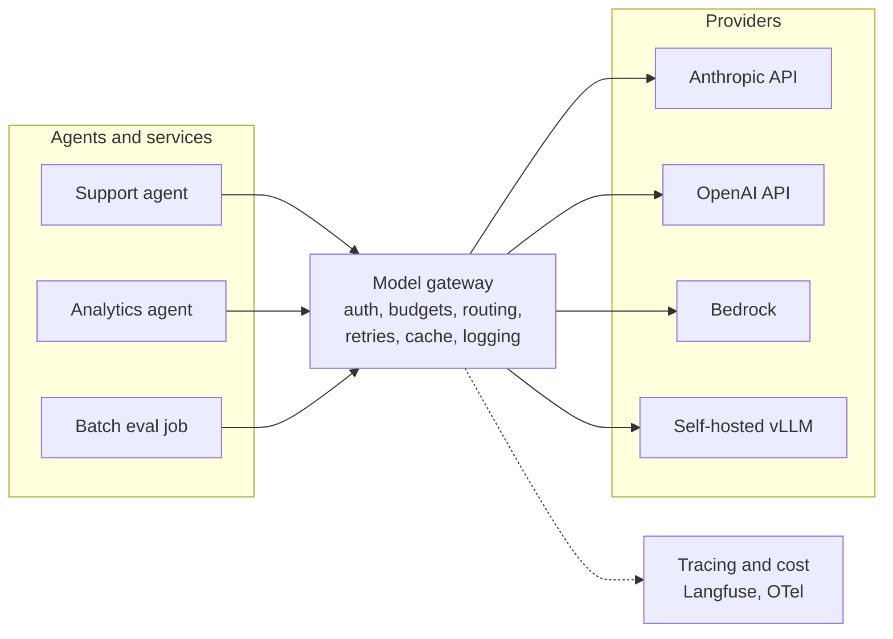
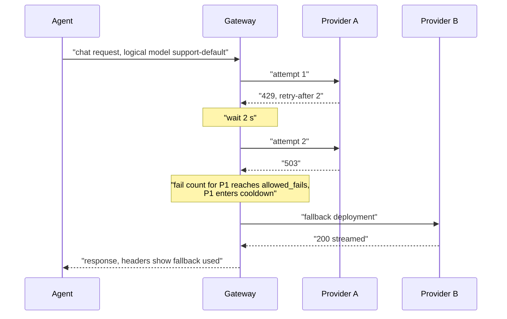
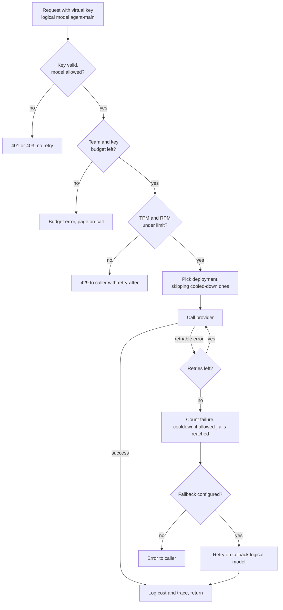
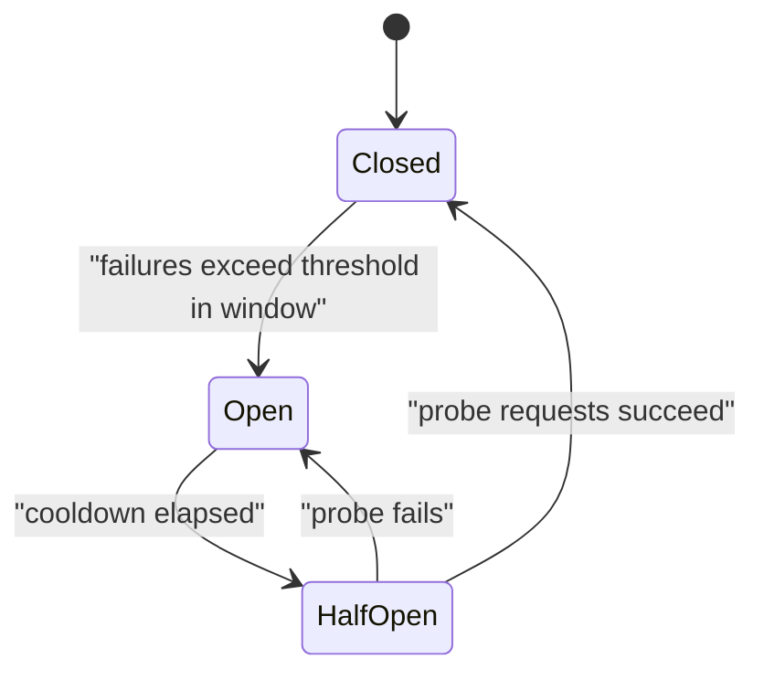
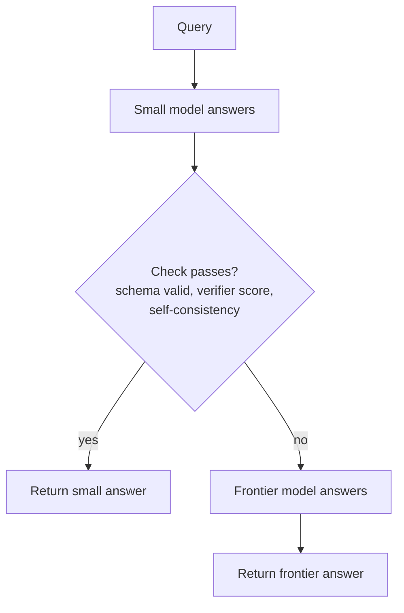
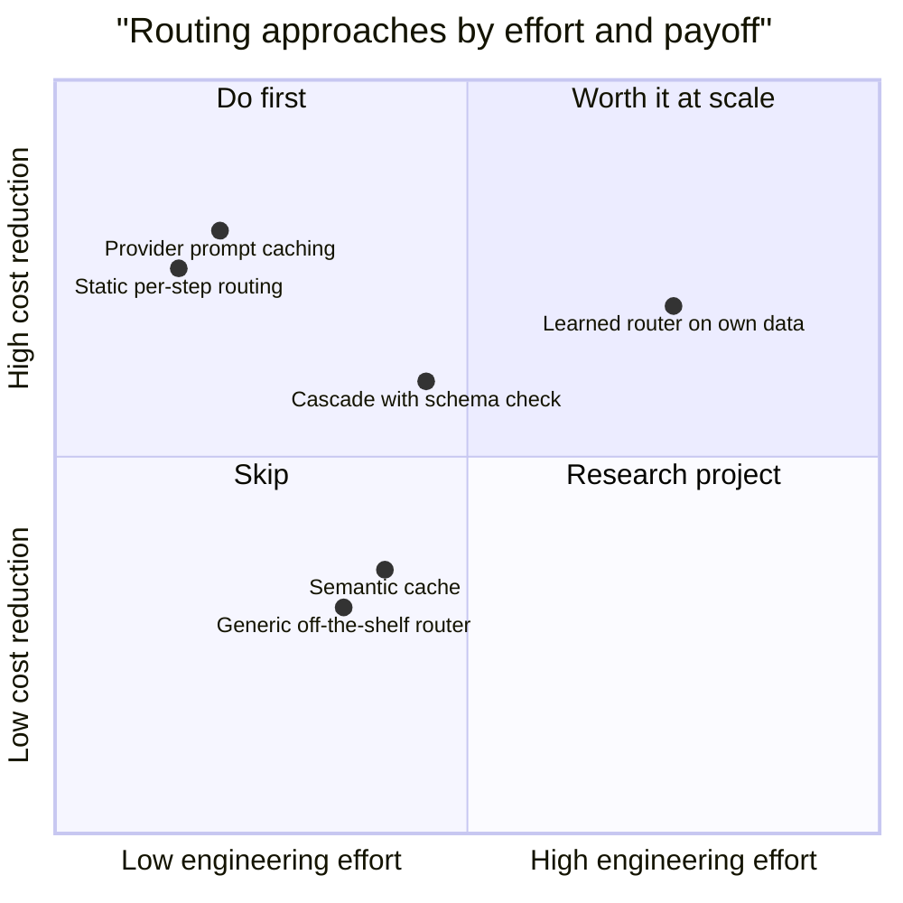

# Chapter 18: Model Access Layer and Gateways

> **What this chapter covers**: The layer between an agent and the model providers: why it exists, LiteLLM as SDK and proxy (virtual keys, budgets, fallbacks, load balancing, cost tracking, Langfuse callbacks), the hosted and API-gateway alternatives (Portkey, OpenRouter, Kong AI Gateway, Cloudflare AI Gateway) and Amazon Bedrock cross-region inference, model routing (cheap versus frontier per step, cascades, learned routers in the style of RouteLLM), resilience (rate limits, backoff with jitter, circuit breakers, failover), and the three kinds of caching (exact, semantic, provider prompt caching) with their arithmetic.
>
> **Prerequisites**: Chapters 2 (tool calling), 4 (the agent loop), 9 (context engineering), 16 (MCP, for the parallel with MCP gateways).
>
> **Where it is used**: Chapter 19 (cloud platforms), Chapter 20 (self-hosted open models behind the same gateway), Chapter 28 (observability), Chapter 32 (cost and latency engineering), Chapter 33 (multi-tenancy).

---

**Currency note.** Gateway products ship weekly. This chapter explains mechanisms that are stable (routing, backoff, circuit breaking, cache economics) and cites product specifics only where checked against official docs in September 2026: LiteLLM's reliability and routing docs, Anthropic's prompt caching docs, OpenAI's prompt caching guide, AWS's cross-region inference docs, and the Cloudflare and Kong gateway docs. Prices and multipliers are quoted with that date; recheck before you put them in a customer proposal.

## 18.1 Level 1: Foundations

### 18.1.1 Why a model access layer

An agent in production calls models many times per task, often from several providers. Calling provider SDKs directly from agent code works for a prototype and fails in five predictable ways:

1. **Outages and rate limits.** Every provider has incidents and per-minute token limits. Without failover, a 429 storm on one provider stops your product.
2. **Cost blindness.** Nobody can answer "what did tenant X cost last week" or stop a runaway loop that burns 400 USD overnight.
3. **Key sprawl.** Provider API keys end up in every service, notebook, and CI job. Revoking one is an incident.
4. **Model lock-in in code.** Model names and provider-specific parameters are hard-coded across the codebase, so trying a cheaper model means a code change in twenty places.
5. **No single place for policy.** Logging, PII redaction, guardrails, and caching get reimplemented per service.

A model access layer (usually called an LLM gateway or AI gateway) centralises these. Agents call one OpenAI-compatible endpoint with a virtual key and a logical model name; the gateway maps that to real providers, enforces budgets and limits, retries and fails over, caches, and emits traces and cost records.



### 18.1.2 The three shapes of gateway

| Shape | Examples | Where it runs | Strength | Weakness |
|---|---|---|---|---|
| Library | LiteLLM SDK, provider-agnostic SDKs | In your process | No extra hop, simple | Policy per service, keys in each service |
| Self-hosted proxy | LiteLLM Proxy, Portkey's open-source gateway, Kong AI Gateway | Your cluster | Central policy, data stays in your network | You operate it (HA, Redis, Postgres) |
| Managed gateway or aggregator | Cloudflare AI Gateway, Portkey hosted, OpenRouter | Vendor edge or cloud | Zero ops, global edge, one bill (OpenRouter) | Data passes a third party; vendor limits and fees |

Cloud-native routing is a fourth shape. Amazon Bedrock cross-region inference routes your request to capacity in other AWS regions inside AWS, with no gateway of your own. It solves capacity, not multi-provider policy.

### 18.1.3 Vocabulary

| Term | Meaning |
|---|---|
| Logical model | A name your code uses (`support-default`) that the gateway maps to one or more deployments |
| Deployment | A concrete provider and model and credentials (`anthropic/claude-sonnet-...` with key K) |
| Virtual key | A gateway-issued key tied to a team, user, or tenant with budgets and allowed models |
| Fallback | Try a different logical model after an error class |
| Load balancing | Spread requests across deployments of the same logical model |
| Cooldown | Temporarily remove a failing deployment from rotation |
| Cascade | Try a cheap model first and escalate only if a check fails |
| Router (learned) | A classifier predicting whether a cheap model will be good enough for this query |
| Exact cache | Return a stored response for a byte-identical request |
| Semantic cache | Return a stored response for a semantically similar request, by embedding similarity |
| Prompt caching | Provider-side reuse of the KV cache for a repeated prompt prefix, billed at a discount |

## 18.2 Level 2: Working knowledge

### 18.2.1 LiteLLM: SDK and proxy

LiteLLM (BerriAI, open source) is the most common self-hosted gateway in agent stacks. It has two forms. The Python SDK exposes `completion()` and friends with an OpenAI-style interface across a long list of providers. The Proxy is a server exposing OpenAI-compatible endpoints (`/chat/completions`, `/embeddings`, and others), configured with a YAML file, backed by Postgres for keys and spend and optionally Redis for shared rate-limit and cooldown state across replicas.

A minimal proxy config that shows the core ideas:

```yaml
model_list:
  - model_name: support-default          # logical name used by agents
    litellm_params: {model: anthropic/claude-sonnet-4-5, api_key: os.environ/ANTHROPIC_API_KEY, rpm: 400}
  - model_name: support-default          # second deployment, same logical name
    litellm_params: {model: bedrock/us.anthropic.claude-sonnet-4-5-v1:0, rpm: 200}
  - model_name: support-cheap
    litellm_params: {model: openai/gpt-5-mini, api_key: os.environ/OPENAI_API_KEY}
router_settings:
  routing_strategy: simple-shuffle
  num_retries: 2
  allowed_fails: 3
  cooldown_time: 30
  redis_host: os.environ/REDIS_HOST
litellm_settings:
  fallbacks: [{"support-default": ["support-cheap"]}]
  context_window_fallbacks: [{"support-cheap": ["support-default"]}]
  success_callback: ["langfuse"]
```

Model identifiers here are illustrative; use the exact names in your providers' current model lists and LiteLLM's provider docs. The keys that matter, as documented in LiteLLM's reliability docs (September 2026):

- **`fallbacks`** for general errors (429, 5xx), **`context_window_fallbacks`** for context-length errors, **`content_policy_fallbacks`** for provider content-policy refusals, and `default_fallbacks` as a catch-all.
- **`num_retries`** per deployment, **`allowed_fails`** before a deployment is cooled down, **`cooldown_time`** in seconds, **`request_timeout`**.
- **`routing_strategy`**: `simple-shuffle` (default, weighted by rpm or tpm or explicit weight), `latency-based-routing`, `usage-based-routing-v2` (lowest current TPM use, needs Redis), and `cost-based-routing`.
- **Callbacks**: `success_callback` and `failure_callback` with `langfuse` (or the OpenTelemetry integration) send each call's input, output, tokens, cost, latency, and metadata to your tracing backend.

### 18.2.2 Virtual keys, teams, budgets

The proxy issues virtual keys. Each key belongs to a user or a team, and each can carry a budget in USD, a budget reset period, allowed models, and rate limits (TPM and RPM, and parallel request limits). When spend reaches the budget, requests are rejected until reset. Agents pass tenant or user identifiers as metadata so spend can be attributed below the key level.

For a multi-tenant agent product, the practical mapping is one team per customer tenant, one key per service per tenant, and a per-user tag in request metadata. That gives three levels of spend reporting and a hard cap per tenant. It also lets you offer tiered plans ("Starter tenants may only use support-cheap").

Budgets are the most important protection against agent loops. A loop that calls a frontier model 3,000 times with a 30,000 token context costs, at 3 USD per million input tokens, 3,000 times 30,000 times 3 / 1,000,000 = 270 USD in input alone. A 50 USD daily team budget stops it at under a fifth of that, and your on-call finds out from an alert rather than an invoice.

### 18.2.3 Cost tracking

The gateway computes cost per request from token counts and a price map. LiteLLM ships a community-maintained model price file and lets you override per deployment. Three details make the numbers right or wrong:

1. **Cached tokens.** Providers bill cache reads and writes at different rates (18.2.8). A gateway that multiplies total input tokens by the base price overstates cost for cached agents by a factor of three or more. Check that your gateway version reads the provider's cache usage fields.
2. **Reasoning tokens.** Models with hidden reasoning bill thinking tokens as output. They appear in the usage object under provider-specific fields.
3. **Negotiated prices.** Enterprise discounts and committed-use pricing are not in public price maps. Override them.

Validate monthly: compare gateway-reported spend with the provider invoice. A 2 to 5 percent gap is normal (timing, rounding); a 30 percent gap means a pricing bug.

### 18.2.4 The alternatives in one table

| Product | Type | Notable features (per official docs, September 2026) | When to pick |
|---|---|---|---|
| LiteLLM Proxy | Open-source, self-hosted | Virtual keys, budgets, fallbacks, routing strategies, broad provider coverage, Langfuse and OTel callbacks | You want control, data in your VPC, and Python-friendly extension |
| Portkey | Hosted gateway plus open-source gateway | Configs with fallbacks, retries, load balancing, conditional routing; guardrails; observability; prompt management | You want managed ops and a UI for non-engineers |
| OpenRouter | Hosted aggregator | One API and one bill across many providers and open models; provider routing preferences; automatic provider fallback | Prototyping, open-weight access without contracts, many models; check its fee model and data policies per provider |
| Kong AI Gateway | Plugins on Kong API gateway | AI Proxy Advanced with load-balancing algorithms including semantic routing; AI Semantic Cache plugin; prompt guard plugins | The customer already runs Kong and wants AI traffic in the same governance plane |
| Cloudflare AI Gateway | Managed, edge | Logging, exact-match caching, rate limiting, retries and fallback, dynamic routing, guardrails | Low-ops global edge, already on Cloudflare |
| Bedrock cross-region inference | Cloud-native routing | Geographic and global inference profiles routing to capacity across regions | Workload is on Bedrock and needs throughput without your own failover |

Feature lists change monthly. Evaluate on the four things that matter for agents: correct handling of tool-call streaming for each provider, correct cost accounting with caching, latency overhead at p99, and data handling terms.

### 18.2.5 Bedrock cross-region inference

On Bedrock you invoke an **inference profile** instead of a single-region model ID. A geographic profile (for example a `us.` or `eu.` prefixed profile) routes within that geography; a global profile routes across supported commercial regions. Per AWS documentation (September 2026), there is no extra routing charge, you are billed at the source region's price for geographic profiles, and AWS advertised roughly 10 percent lower prices for global profiles on some Anthropic models versus geographic ones. Your data may be processed in any region in the profile, which is a data-residency decision the customer must sign off; global profiles are wrong for EU-only workloads.

Cross-region inference raises throughput and smooths regional spikes. It does not protect against a model-wide or Bedrock-wide incident, and it does not give you a second provider. Put Bedrock behind the gateway as one deployment among several if the customer needs provider diversity.

### 18.2.6 Routing basics: cheap versus frontier per step

An agent task is not one kind of work. A support agent run might have:

| Step | Needs | Model tier |
|---|---|---|
| Classify intent | Short input, label output | Small, cheap |
| Plan and choose tools | Reasoning over tool descriptions | Frontier or strong mid-tier |
| Extract order ID from text | Pattern extraction | Small |
| Summarise a 40-page policy | Long context, faithfulness | Mid-tier with long context |
| Draft customer reply | Tone, correctness | Mid-tier |
| Judge own draft against policy | Careful reasoning | Frontier, or a separate judge model |

Static per-step routing (the node decides the logical model) is the simplest and most effective optimisation. In LangGraph, each node calls the gateway with its own logical model name; the gateway maps names to deployments. No learned router needed.

Worked example. A task with 10 model calls, averaging 8,000 input and 600 output tokens each. Frontier at 3 USD in and 15 USD out per million tokens; small model at 0.25 in and 2.00 out (illustrative prices, September 2026; check current lists). All frontier: 10 times (8,000 times 3 + 600 times 15) / 1,000,000 = 10 times (0.024 + 0.009) = 0.330 USD per task. Route 6 of 10 calls to the small model: 4 times 0.033 + 6 times (8,000 times 0.25 + 600 times 2) / 1,000,000 = 0.132 + 6 times 0.0032 = 0.132 + 0.0192 = 0.151 USD. A 54 percent saving, if quality holds on those six steps; measure it with a paired eval (Chapter 30).

### 18.2.7 Rate limits and backoff with jitter

Provider limits come as requests per minute and tokens per minute (input and output separately on some providers), per model and per organisation or project. Responses carry headers with remaining quota and reset times on most major providers; a 429 may carry `retry-after`.

Retry rules for agent traffic:

1. **Retry only retriable errors.** 429, 500, 502, 503, 504, 529 (Anthropic's overloaded status), connection resets, and timeouts before any output. Never retry 400s (bad request) or 401 and 403.
2. **Honour `retry-after`** when present.
3. **Otherwise exponential backoff with full jitter**: wait a uniform random time between 0 and min(cap, base times 2 to the power attempt). Base 0.5 s, cap 20 s is a reasonable start.
4. **Bound total retry time** by the caller's latency budget, not by a count alone.
5. **Beware retrying a streamed response.** If tokens already reached the user, a retry duplicates output. Retry only before the first token, or restart the turn explicitly.

Why jitter: without it, 200 agents that all hit a 429 at the same second retry at the same moments (1 s, 2 s, 4 s), recreating the spike each time. Full jitter spreads retries uniformly and, in AWS's well-known analysis of backoff strategies, completes the same work with far fewer total calls than plain exponential backoff.



### 18.2.8 Three kinds of caching

| Cache | Key | Hit returns | Saves | Risk |
|---|---|---|---|---|
| Exact (gateway) | Hash of the full request | The stored response, no model call | 100 percent of that call | Low hit rate for agents; stale answers if the world changed |
| Semantic (gateway) | Embedding of the prompt, similarity above a threshold | A stored response to a similar prompt | 100 percent of that call | Wrong answer for a subtly different question |
| Provider prompt caching | Exact prefix of the prompt (tokens) | Nothing is skipped; the model still runs, but prefix processing is reused | Most of the prefix's input cost and time to first token | Almost none on correctness; cost if writes are not reused |

For agents, **provider prompt caching is the big one**. An agent's prompt is a large stable prefix (system prompt, tool definitions, retrieved policy) plus a growing conversation. Every call shares the prefix with the previous one. Exact and semantic caches rarely hit on agent steps because the conversation state differs each time.

Provider prompt caching specifics as documented in September 2026:

- **Anthropic.** Explicit `cache_control` breakpoints (up to 4 per request) or automatic caching set at request level. Cache writes cost 1.25 times base input for the default 5 minute TTL and 2 times for the 1 hour TTL; reads cost 0.1 times base input on most models, with lower read multipliers on some newer models (the docs listed 0.05 times for Claude Opus 5.5). Minimum cacheable length varies by model (512, 1,024, or 4,096 tokens depending on the model). The TTL refreshes on each hit.
- **OpenAI.** Automatic for prompts of 1,024 tokens or more; no write surcharge. The cached-input discount depends on the model generation (it was 50 percent when introduced in 2024 and is larger on newer models; check the pricing page per model). A `prompt_cache_retention` parameter selects in-memory retention or extended 24 hour retention, and reports in mid 2026 said 24 hour retention became the default for some newer models; check the current guide.
- **Others** (Gemini implicit and explicit context caching, Bedrock prompt caching for supported models) have their own minimums, TTLs, and storage charges. Read each before modelling.

### 18.2.9 Wiring the agent to the gateway

The agent side should know as little about providers as possible.

- **One client, one base URL.** Point the OpenAI-compatible client (or LangChain's `ChatOpenAI`, or LiteLLM's SDK in proxy mode) at the gateway, with the service's virtual key. Provider SDKs are used only where a provider-specific feature has no translation (some beta features), and then through the gateway's pass-through endpoints if it has them.
- **Logical names in config, not code.** Each LangGraph node reads its logical model name from configuration: `plan`, `extract`, `draft`. Changing a model is a gateway config change reviewed like any other.
- **Metadata on every call.** Tenant ID, user ID (hashed), conversation ID, agent step name, and the trace context. The gateway uses these for budgets, sticky routing, and attribution; Langfuse uses them to group generations under the right trace.
- **Timeouts per step.** Classification steps get a 5 s budget; planning steps 30 s; long-context summarisation 90 s. The gateway's `request_timeout` is a backstop; the agent's own deadline is the real one.
- **Surface fallbacks.** Read the gateway's response headers or metadata that report which deployment served the call, and record it on the span. Without this, "quality dropped on Tuesday" is unexplainable.

Checklist of provider differences that a gateway translates and that break most often: parallel tool calls, streaming tool-call argument deltas, `tool_choice` semantics, image and document inputs, system prompt placement, stop reasons, reasoning or thinking blocks that must be passed back unchanged on the next turn, and cache control markers. Write one contract test per item per provider you use and run it on every gateway upgrade.

### 18.2.10 Where OpenTelemetry fits

LiteLLM's Langfuse callback is the fastest route to per-call traces. For a customer that already runs an OpenTelemetry collector, emit OTel spans from the gateway instead (LiteLLM, Portkey, and Kong all document OTel integrations; check versions) using the GenAI semantic conventions, and let the collector fan out to Langfuse, Datadog, or whatever the customer uses. The important property is one trace per agent task, with the gateway spans as children of the agent's step spans, so a slow task can be attributed to model latency, retries, or tool time in one view (Chapter 28).

### 18.2.11 Worked deployment: LiteLLM with budgets and failover

This walkthrough builds a small but realistic gateway for Larkspur Health Tech, a synthetic company with two tenants (Acme Clinics on a Pro plan, Birch Dental on Starter), one support agent, and a nightly eval job. Everything runs in Docker Compose inside WSL2 for development. The same shape moves to Kubernetes with a Helm chart later.

**Topology.** Three containers: `litellm` (the proxy on port 4000), `postgres` (keys, teams, spend logs), and `redis` (shared cooldowns, rate-limit counters, optional exact cache). In production you would run three proxy replicas and managed Postgres and Redis. For the lab, one replica each.

**Model list.** Four deployments behind three logical names:

| Logical name | Deployment | Role |
|---|---|---|
| `agent-main` | Anthropic API, mid-tier model | Primary |
| `agent-main` | Same model on Bedrock, geographic inference profile | Same-model second channel |
| `agent-small` | Small hosted model | Cheap steps and fallback for non-critical steps |
| `agent-local` | Ollama on the 4060, Qwen2.5 7B Instruct Q4 | Development and offline eval only |

**Config essentials** (trimmed; the model strings are placeholders to replace with current IDs):

```yaml
model_list:
  - model_name: agent-main
    litellm_params: {model: anthropic/<mid-tier-model>, api_key: os.environ/ANTHROPIC_API_KEY, rpm: 300, tpm: 2000000}
  - model_name: agent-main
    litellm_params: {model: bedrock/<eu-inference-profile-id>, aws_region_name: eu-west-1, rpm: 150}
  - model_name: agent-small
    litellm_params: {model: openai/<small-model>, api_key: os.environ/OPENAI_API_KEY}
  - model_name: agent-local
    litellm_params: {model: ollama_chat/qwen2.5:7b-instruct-q4_K_M, api_base: http://host.docker.internal:11434}
router_settings:
  routing_strategy: simple-shuffle
  num_retries: 2
  allowed_fails: 3
  cooldown_time: 45
  redis_host: os.environ/REDIS_HOST
litellm_settings:
  request_timeout: 60
  fallbacks: [{"agent-main": ["agent-small"]}]
  context_window_fallbacks: [{"agent-small": ["agent-main"]}]
  success_callback: ["langfuse"]
  failure_callback: ["langfuse"]
general_settings:
  master_key: os.environ/LITELLM_MASTER_KEY
  database_url: os.environ/DATABASE_URL
```

Five decisions in this config:

1. **Weights follow rpm.** `simple-shuffle` sends about two thirds of `agent-main` traffic to the first-party API and one third to Bedrock. That keeps both channels warm, so a failover does not land on a channel with cold caches and untested limits. The cost is lower cache hit rates for conversations that bounce between channels. Tag-based sticky routing per conversation fixes that, if your LiteLLM version supports it for your setup.
2. **Retries before fallback.** Two retries per deployment absorb brief 429s. Three failures put a deployment into a 45 second cooldown.
3. **The fallback to `agent-small` is for general errors only.** It is acceptable for the support agent's classification and extraction steps. For the drafting step, the agent code catches a fallback-served response (from response metadata) and asks the user to retry rather than sending a weaker draft. The gateway cannot know which steps tolerate a weaker model. The agent can.
4. **The EU profile for Bedrock**, because Larkspur's tenants are EU clinics. A global profile would be cheaper and would break their residency commitment.
5. **`agent-local` is excluded from every production key** through the key's allowed-models list.

**Teams, keys, and budgets.** Create a team per tenant with the admin API, using the master key:

```bash
curl -s localhost:4000/team/new -H "Authorization: Bearer $LITELLM_MASTER_KEY" \
  -H "Content-Type: application/json" \
  -d '{"team_alias":"acme-clinics","max_budget":600,"budget_duration":"30d","tpm_limit":1500000,"rpm_limit":240,"models":["agent-main","agent-small"]}'
curl -s localhost:4000/key/generate -H "Authorization: Bearer $LITELLM_MASTER_KEY" \
  -H "Content-Type: application/json" \
  -d '{"team_id":"<acme-team-id>","key_alias":"acme-support-agent","max_budget":20,"budget_duration":"1d"}'
```

| Principal | Monthly budget | Daily key budget | TPM | Models |
|---|---|---|---|---|
| Acme Clinics (Pro) | 600 USD | 20 USD per service key | 1.5 M | main, small |
| Birch Dental (Starter) | 90 USD | 4 USD | 300 k | small only |
| Nightly eval job | 150 USD | 10 USD | 500 k, separate provider project | main, small, local |

Why a daily key budget under a monthly team budget: the monthly figure protects the contract. The daily figure is a loop detector. Acme's support agent normally spends about 12 USD a day (roughly 800 conversations at 0.015 USD). A runaway loop hits the 20 USD daily cap within hours rather than draining the 600 USD month by breakfast. When a budget is exceeded, the proxy rejects the request with a budget error; LiteLLM's docs show an `ExceededTokenBudget` message. The agent must turn that into a clear user message and page on-call, not retry.

**Budget arithmetic for Acme.** Assume 800 conversations a day, 6 model calls each, 10,000 input tokens per call with a 75 percent cache read share, and 400 output tokens per call. Use illustrative prices: 3 USD per million input, 0.3 per million cache reads, 3.75 per million cache writes, 15 per million output. Per call:

- Reads: 7,500 times 0.3 per million = 0.00225 USD.
- New input, treated as cache writes: 2,500 times 3.75 per million = 0.009375 USD.
- Output: 400 times 15 per million = 0.006 USD.
- Total: about 0.0176 USD per call.

Per day: 800 times 6 times 0.0176 = 84.5 USD. That is far above the 12 USD guess, so either the plan price or the daily cap is wrong. This is exactly the check to do before go-live. The fix here is a cheaper model for 4 of the 6 steps. At the 18.2.6 small-model prices, those 4 calls cost about 0.004 USD each. Daily spend becomes 800 times (2 times 0.0176 + 4 times 0.004) = 800 times 0.0512 = 41 USD. Set the daily key cap near 1.5 times that (60 USD) and the monthly team budget to match the plan. The lesson: size budgets from arithmetic on measured token counts, not from a guess.

**Failover test.** With traffic from a load script running at 5 requests per second:

1. Revoke the Anthropic key in the environment and restart one replica. Expect 401s, which are not retried. Check that this surfaces as an alert rather than a silent fallback, because auth errors are configuration bugs, not outages.
2. Point the first deployment at a mock that returns 529 half the time. Expect retries, then cooldown after 3 failures, then Bedrock carrying the traffic. Verify in Langfuse that the served model changed and that cost per call rose while the caches were cold.
3. Make both `agent-main` channels fail. Expect the classification step to succeed on `agent-small` and the drafting step to return the agent's "try again" message.
4. Exhaust Birch's daily key budget with a loop. Expect budget errors for Birch only, with Acme unaffected.

The request path the tests exercise, per call:



The order matters. Auth, budget, and limit checks happen before any provider call. A rejected request costs nothing and returns in milliseconds. Retries happen per deployment before fallback. Cooldown state is shared through Redis, so one replica's failures protect the others.

Record p50 and p95 latency, fallback rate, and error rate for each scenario. That table goes into the customer's operational readiness review.

## 18.3 Level 3: Depth

### 18.3.1 Prompt caching arithmetic for an agent

A support agent run: system prompt plus tool definitions plus policy excerpt = 12,000 tokens, stable. Each of 8 turns adds on average 1,500 tokens of conversation and tool results. Model base input price 3 USD per million tokens, cache write 1.25 times, read 0.1 times (Anthropic-style, 5 minute TTL). Output ignored for this comparison.

Without caching, input tokens over 8 calls: call k sends 12,000 + 1,500 times (k minus 1). Sum = 8 times 12,000 + 1,500 times (0 + 1 + ... + 7) = 96,000 + 1,500 times 28 = 138,000 tokens. Cost 138,000 times 3 / 1,000,000 = 0.414 USD.

With a breakpoint that moves to the end of each call's prompt (automatic caching behaves like this): call 1 writes 12,000 tokens. Call k reads everything cached so far and writes the new 1,500. Reads: sum over k = 2 to 8 of (12,000 + 1,500 times (k minus 2)) = 7 times 12,000 + 1,500 times (0 + ... + 6) = 84,000 + 31,500 = 115,500 tokens. Writes: 12,000 + 7 times 1,500 = 22,500 tokens. Cost = (115,500 times 0.1 + 22,500 times 1.25) times 3 / 1,000,000 = (11,550 + 28,125) times 3 / 1,000,000 = 0.119 USD.

A 71 percent input cost saving, and time to first token falls because the prefix is not recomputed. What breaks it:

- A timestamp or request ID in the system prompt (invalidates everything after it).
- Tool definitions in a different order per call (Chapter 16's deterministic-order rule).
- A gateway that injects per-request text at the top (some guardrail plugins do).
- Gaps longer than the TTL between turns (a human takes 7 minutes to reply). Consider the 1 hour TTL when turns are slow: writes cost 2 times instead of 1.25 times, which pays off if it avoids even one full rewrite.
- Load balancing across providers or accounts. Caches are per provider and, depending on provider, per organisation or region. Round-robin between two Anthropic accounts halves the hit rate. **Route a conversation sticky to one deployment** where you can; LiteLLM and other gateways support deployment affinity or tag-based routing for this, but check your version.

### 18.3.2 Semantic caching: when it is safe

Semantic caching embeds the prompt and returns a stored answer if cosine similarity exceeds a threshold. It works for FAQ-shaped traffic ("what are your opening hours") and fails badly on anything with parameters ("refund order ORD-00001234" versus "refund order ORD-00001243" can be above 0.97 similarity).

Quantify before enabling. Take 2,000 logged queries, embed them, and for each candidate threshold count hits and label a sample of hits as correct or wrong. A typical outcome on support traffic:

| Threshold | Hit rate | Wrong-answer rate among hits |
|---|---|---|
| 0.90 | 31 percent | 12 percent |
| 0.95 | 18 percent | 3 percent |
| 0.98 | 7 percent | 0.5 percent |

Numbers like these are illustrative; they vary with the embedding model and traffic. The decision is economic and ethical: at 0.95, 18 percent of calls are saved, and 0.54 percent of all answers are wrong (18 percent times 3 percent). Is that acceptable for this product? For a support agent that issues refunds, no. For a docs chatbot, maybe. Restrict semantic caching to the first-turn, no-tool, no-personal-data path, and key the cache by tenant so one customer's answer never serves another. The threshold is a product decision with an eval behind it, not a default.

### 18.3.3 Circuit breakers

Retries handle transient errors. A circuit breaker handles a deployment that is failing persistently, so you stop sending it traffic and stop paying its timeout latency.



The full state machine, with the parameters a production breaker needs:

| State | Traffic behaviour | Exit condition | Typical parameters |
|---|---|---|---|
| Closed | All requests pass. Outcomes recorded in a sliding window | Failure rate at or above threshold with at least the minimum number of calls in the window | Window 30 s, minimum 20 calls, threshold 50 percent. Slow calls (TTFT above 10 s) count as failures |
| Open | Requests fail fast or go straight to the fallback. No calls to the deployment | Open duration elapsed | 30 to 60 s, doubling on each consecutive re-open, capped at 5 minutes |
| Half-open | A limited number of probe requests pass. Everything else behaves as Open | All probes succeed: Closed. Any probe fails: Open with a longer duration | 3 to 5 probes, one at a time |

What counts as a failure matters as much as the thresholds:

- 5xx, 529, timeouts, and connection errors count.
- 429 counts when it persists. A single 429 with a short `retry-after` is flow control, not failure.
- 400 and 401 do not count. They are your bugs, and opening the breaker hides them.
- A content-policy refusal does not count.

**Worked timeline.** A deployment serves 10 requests per second.

- **t = 0 s:** errors start at a 60 percent rate.
- **t = 2 s:** the window holds 20 calls with 12 failures, which is at the 50 percent threshold. The breaker opens. About 12 user-facing failures have happened, and retries on other deployments rescued most of them.
- **t = 2 to 32 s:** 300 requests go to the fallback with no added latency. Without the breaker, each would have waited out a timeout or a retry cycle. With a 10 s timeout and a 60 percent failure rate, that is about 180 requests times 10 s, or 30 minutes of cumulative user waiting avoided.
- **t = 32 s:** half-open. The first probe fails, so the breaker re-opens for 60 s.
- **t = 92 s:** half-open again. Three probes succeed and the breaker closes. Traffic returns, and the provider cache is warm again within one conversation turn per active user.

A minimal breaker core, to show the logic rather than to copy:

```python
class Breaker:
    def __init__(s, threshold=0.5, min_calls=20, open_s=30, probes=3):
        s.state, s.window, s.opened_at, s.open_s = "closed", [], 0.0, open_s
        s.threshold, s.min_calls, s.probes, s.ok_probes = threshold, min_calls, probes, 0
    def allow(s, now):
        if s.state == "open" and now - s.opened_at >= s.open_s:
            s.state, s.ok_probes = "half_open", 0
        return s.state != "open"
    def record(s, ok, now):
        if s.state == "half_open":
            if not ok:
                s.state, s.opened_at, s.open_s = "open", now, min(s.open_s * 2, 300)
            else:
                s.ok_probes += 1
                if s.ok_probes >= s.probes:
                    s.state, s.window, s.open_s = "closed", [], 30
            return
        s.window = [(t, o) for t, o in s.window if now - t < 30] + [(now, ok)]
        fails = sum(1 for _, o in s.window if not o)
        if len(s.window) >= s.min_calls and fails / len(s.window) >= s.threshold:
            s.state, s.opened_at = "open", now
```

In production, keep the window and state in Redis so all gateway replicas agree, and limit concurrent half-open probes to one per deployment across the fleet.

**Breaker scope.** Choose what one breaker protects:

| Scope | Opens when | Risk if too coarse | Risk if too fine |
|---|---|---|---|
| Per deployment (model plus key plus region) | That channel fails | Rarely too coarse | Many breakers, each with few calls, so they trip slowly |
| Per model across channels | The model itself is degraded | One bad region takes out healthy ones | Not applicable |
| Per provider | A provider-wide incident | A single model's issue blocks all models | Not applicable |

Per deployment is the right default. Add a per-provider breaker only as a fast path for large incidents, and open it only when several deployment breakers for that provider are already open.

LiteLLM's `allowed_fails` plus `cooldown_time` is a simple breaker per deployment. Production-grade breakers use a failure rate over a sliding window (for example over 50 percent failures across at least 20 requests in 30 seconds) rather than a count, because a count trips too easily at high traffic and too slowly at low traffic. Keep breaker state in shared storage (Redis) when the gateway has several replicas, or each replica learns about the outage separately.

Latency-based breaking matters for agents: a provider that is up but has p95 time to first token of 25 seconds is effectively down for an interactive agent. Track TTFT per deployment and treat sustained breaches as failures.

### 18.3.4 Failover is not free

Failing over from model A to model B changes behaviour. Prompts tuned for A may be worse on B. Tool-call formats differ subtly (parallel tool calls, how the model handles `tool_choice`), and a gateway's translation layer is where many bugs live. Prompt caches do not transfer, so the first calls on B are full price and slower.

Classify fallbacks:

| Fallback type | Example | Behaviour change | Use |
|---|---|---|---|
| Same model, other capacity | Anthropic API to Bedrock or Vertex for the same model | Minimal | Default first fallback |
| Same family, other size | Frontier to mid-tier | Moderate | For non-critical steps |
| Different provider | Claude to GPT or Gemini | Significant | Last resort; eval-gated |
| Degraded mode | Canned response, queue for later, human handoff | Explicit | When quality cannot be guaranteed |

Run your agent eval suite on every fallback target at least monthly, and gate the fallback chain on a minimum score. A fallback that makes the agent confidently wrong is worse than a clear "try again in a minute".

### 18.3.5 Gateway overhead and availability

A self-hosted proxy adds a network hop and processing. Well-deployed, the added p50 latency is typically a few milliseconds to low tens of milliseconds in-region; vendors publish their own overhead benchmarks, which are marketing until you reproduce them with your payload sizes and streaming. Measure p99 with streaming and tool calls, since that is where proxies do the most work (reassembling and translating chunks).

The gateway is now a single point of failure for every agent. Availability arithmetic: if the gateway is 99.95 percent available and the model tier behind it (with failover) is 99.9 percent, the composed availability is about 0.9995 times 0.999 = 99.85 percent, roughly 13 hours of downtime a year. Run at least three replicas across zones, keep config in version control, keep Postgres and Redis highly available, and make the gateway fail open for logging (if the tracing backend is down, still serve) but fail closed for auth and budgets.

## 18.4 Level 4: Mastery

### 18.4.1 Cascades

A cascade tries a cheap model and escalates to an expensive one only if a check says the cheap answer is not good enough.



Cost model. Let c_s and c_f be per-call costs, c_v the check cost, and e the escalation rate. Expected cost per query = c_s + c_v + e times c_f. With c_s = 0.003, c_v = 0.001, c_f = 0.033 USD and e = 0.30: 0.003 + 0.001 + 0.0099 = 0.0139 USD versus 0.033 for always-frontier: 58 percent cheaper. Break-even escalation rate: c_s + c_v + e times c_f = c_f gives e = 1 minus (c_s + c_v) / c_f = 1 minus 0.004 / 0.033 = 0.88. Above 88 percent escalation the cascade costs more than just calling the frontier model.

Latency model. Escalated queries pay both calls. If the small call takes 0.8 s and the frontier 3.0 s, mean latency = 0.8 + 0.1 (check) + 0.30 times 3.0 = 1.8 s versus 3.0 s; but p95 is worse (escalated queries take 3.9 s). For interactive agents, consider running both in parallel and cancelling the frontier call when the small answer passes: lower latency, higher cost.

**How the saving depends on escalation rate.** Same costs (c_s = 0.003, c_v = 0.001, c_f = 0.033 USD):

| Escalation rate e | Expected cost per query | Saving vs always-frontier | Mean latency (s) |
|---|---|---|---|
| 0.10 | 0.0073 | 78 percent | 1.20 |
| 0.20 | 0.0106 | 68 percent | 1.50 |
| 0.30 | 0.0139 | 58 percent | 1.80 |
| 0.50 | 0.0205 | 38 percent | 2.40 |
| 0.70 | 0.0271 | 18 percent | 3.00 |
| 0.88 | 0.0330 | 0 percent | 3.54 |

Mean latency is 0.9 + e times 3.0 seconds. Above e = 0.70 the cascade is slower on average than calling the frontier model directly, even though it is still slightly cheaper.

**Quality accounting.** A cascade also has a false-accept rate: the check passes a small-model answer that is actually wrong. Let q_s be the small model's accuracy, q_f the frontier's, and assume the check has recall r for catching wrong small answers and a false-reject rate f on correct ones. Then:

- Escalation rate e = (1 minus q_s) times r + q_s times f.
- Cascade accuracy = q_s times (1 minus f) + (1 minus q_s) times (1 minus r) times 0 + e times q_f.

The zero term assumes an undetected wrong answer stays wrong. Take q_s = 0.80, q_f = 0.92, r = 0.85, f = 0.10:

- e = 0.20 times 0.85 + 0.80 times 0.10 = 0.17 + 0.08 = 0.25.
- Accuracy = 0.80 times 0.90 + 0.25 times 0.92 = 0.72 + 0.23 = 0.95.

That looks better than the frontier's 0.92, and it is too optimistic. The formula assumes the frontier model scores its overall 0.92 on the escalated queries. But the escalated set is biased towards hard queries: 0.17 of traffic that the small model got wrong, plus 0.08 that it got right but the check rejected. Accuracy on that slice is usually lower. Written carefully:

- Kept correct: 0.80 times 0.90 = 0.72.
- Kept wrong: 0.20 times 0.15 = 0.03.
- Escalated: 0.25, answered by the frontier model. Assume its accuracy on this harder slice is lower, say 0.85: 0.2125.
- Total accuracy: 0.72 + 0.2125 = 0.9325 at a cost of 0.003 + 0.001 + 0.25 times 0.033 = 0.0123 USD, versus 0.92 at 0.033 USD.

Whether the frontier's accuracy on escalated queries is 0.85 or 0.75 changes the conclusion. Measure it on a labelled set, and report cascade accuracy with a paired bootstrap interval against always-frontier on the same items.

**Three-stage cascades** (small, then mid, then frontier) follow the same algebra. With per-stage escalation rates e1 = 0.35 and e2 = 0.30, and costs 0.003, 0.010, and 0.033 USD (checks folded in), the expected cost is 0.003 + 0.35 times 0.010 + 0.35 times 0.30 times 0.033 = 0.003 + 0.0035 + 0.0035 = 0.0100 USD. That is cheaper than the two-stage 0.0139, but tail latency now includes three calls for 10.5 percent of queries. Use three stages only when the traffic has a clear middle band of difficulty.

The check is everything. Cheap checks that work: JSON schema validation, tool-argument validation against the real API, a deterministic rule ("must cite a policy ID that exists"). Checks that work less well: the small model's self-reported confidence, and token log-probabilities for free text. A verifier model is often good but costs money; include c_v honestly.

### 18.4.2 Learned routers

A learned router predicts, before any generation, whether the cheap model will be good enough for this query, and sends it to one model only. RouteLLM (Ong et al., 2024, LMSYS and UC Berkeley) trained routers on human preference data from Chatbot Arena, with variants including a matrix-factorisation router, a BERT classifier, and a causal LLM classifier, and reported large cost reductions on benchmarks such as MT-Bench while retaining most of the strong model's quality (see the paper for the exact numbers per benchmark and router). The general lesson from that work and follow-ups: routers trained on generic preference data transfer imperfectly to a specific domain, and a router tuned on your own traffic with your own quality labels does better.

How to build one for a customer:

1. Log 5,000 to 20,000 production queries for one step type (for example "draft reply").
2. Run both the cheap and the frontier model on all of them offline.
3. Label which is acceptable, with an LLM judge calibrated against 300 human labels (Chapter 30).
4. Train a small classifier (logistic regression on embeddings is a strong baseline; a fine-tuned small encoder if you need more) to predict "cheap is acceptable".
5. Pick the threshold on a held-out set to hit a target: for example "no more than 2 points quality loss versus always-frontier, measured with a paired bootstrap".
6. Deploy behind the gateway as a custom routing hook; log router scores for drift monitoring.

The trade-off curve is the deliverable: quality versus percentage routed to cheap. Present it to the customer and let them pick the operating point.



### 18.4.3 Multi-tenant fairness

With one gateway serving many tenants against shared provider limits, one tenant's batch job can consume the org's TPM and cause 429s for everyone. Controls in order of strength:

1. **Per-tenant TPM and RPM limits** at the gateway, set below the provider limit so the sum of reserved capacity for paying tiers fits.
2. **Priority classes**: interactive agent traffic ahead of batch and evaluation traffic. Some gateways support priority queues; otherwise run batch through a separate logical model on separate provider keys or projects.
3. **Separate provider projects or accounts per tier**, so limits are isolated at the provider. Costs prompt-cache locality if one conversation moves between them; do not move conversations.
4. **Provider batch APIs** for offline work (typically around half price with hours of latency, per provider pricing pages as of 2026). Evaluations and backfills belong there, not on the interactive path.

### 18.4.4 Security and data handling at the gateway

The gateway sees every prompt and response. That makes it the right place for, and the biggest risk to, data protection.

- **Key custody.** Provider keys live only in the gateway's secret store. Services hold revocable virtual keys scoped to models and budgets.
- **Logging policy.** Full prompt logging to Langfuse is invaluable for debugging and a liability for PII. Redact or hash at the gateway before export; set retention; per-tenant opt-out for regulated customers.
- **Egress control.** Allow-list provider endpoints; block direct egress from agent pods to provider APIs so the gateway cannot be bypassed.
- **Third-party gateways.** Hosted gateways and aggregators add a data processor. Read their data retention terms and each upstream provider's terms as routed through them; zero-data-retention agreements with a provider may not apply when traffic goes via an aggregator's account.
- **Guardrails placement.** Input and output guardrails at the gateway apply uniformly but add latency to every call; tool-level guardrails in the agent are more precise. Use both, and measure the added p95 (Chapter 27).

### 18.4.5 A reference design

For a forward-deployed agent product with 40 tenants, interactive support agents, and nightly evaluation:

- LiteLLM Proxy, 3 replicas across zones, Postgres (managed, multi-AZ) for keys and spend, Redis for shared limits, cooldowns, and exact cache.
- Logical models per step type: `plan`, `extract`, `draft`, `judge`, `embed`. Each maps to a primary deployment and a same-model alternative capacity deployment (for example the provider's first-party API and Bedrock), then an eval-gated cross-provider fallback.
- Per-tenant teams with budgets and TPM limits; batch evaluation on a separate provider project with lower priority.
- Sticky routing per conversation to preserve prompt cache hits.
- Langfuse callbacks with redaction; OpenTelemetry trace context propagated from the agent so gateway spans nest under agent steps.
- Alerts: spend rate per tenant above 3 times the trailing 7-day hourly mean, fallback rate above 5 percent over 10 minutes, cache read ratio dropping below half its baseline (someone broke the prefix), TTFT p95 per deployment.

The cache-read-ratio alert catches the most expensive silent regression in agent systems: a harmless-looking prompt change that puts a date at the top of the system prompt and triples the bill.

### 18.4.6 Capacity planning against provider limits

Provider limits are the real ceiling of an agent product, so plan them like database capacity.

Worked example. Take a mid-size deployment at 2 agent tasks per second at peak. Each task makes 10 model calls averaging 14,000 input tokens (after caching, the provider still counts input tokens toward TPM limits on most providers; check whether cached tokens count toward your provider's limits, since policies differ) and 600 output tokens.

- Requests per minute: 2 times 10 times 60 = 1,200 RPM.
- Input tokens per minute: 1,200 times 14,000 = 16.8 million ITPM.
- Output tokens per minute: 1,200 times 600 = 720,000 OTPM.

If the provider tier gives, say, 4 million input tokens per minute for the model, you are four times over at peak. Options, in order: raise the tier (talk to the provider account team early, it takes days to weeks); add capacity through a second channel for the same model (Bedrock or Vertex); route more steps to a smaller model with separate limits; shrink the context (Chapter 9); check whether cached tokens are exempt from input limits on your provider, which can change the picture entirely.

Headroom: plan for peak at no more than about 70 percent of limits, because limits are enforced over short windows and bursts arrive faster than a per-minute average suggests.

### 18.4.7 Incident walkthrough

A synthetic scenario, written as the timeline an on-call engineer would reconstruct.

- **09:02** Provider A starts returning 529 overloaded on 30 percent of requests for the frontier model.
- **09:02 to 09:04** Gateway retries with jitter; p95 latency rises from 6 s to 14 s. `allowed_fails` trips for the Provider A deployment on two of three replicas; the third replica's Redis connection had failed at 08:40, so it keeps its own state and keeps sending traffic.
- **09:04** Traffic shifts to the same-model deployment on the cloud channel. Its prompt caches are cold: cache read ratio falls from 78 percent to 9 percent, and cost per task rises 2.8 times for the next 20 minutes.
- **09:11** The cloud channel hits its own TPM limit (it was sized for 30 percent of traffic, now carrying 90 percent). 429s rise. The cross-provider fallback activates for the `draft` step only, as configured.
- **09:30** Provider A recovers. Half-open probes succeed and traffic returns.

What the post-incident review changes:

1. Alert on Redis connectivity for every gateway replica; a replica without shared state is a split-brain circuit breaker.
2. Size the secondary channel for full traffic at peak or accept and document the degraded mode.
3. Budget for cold-cache cost during failover in the monthly cost model (in this case about 20 minutes a month of 2.8 times cost is small, but a multi-hour failover is not).
4. Add a load-shedding rule: when both channels are saturated, batch and evaluation traffic gets 429 at the gateway first.
5. Verify the eval scores of the cross-provider `draft` fallback, which had not been run in six weeks.

### 18.4.8 Where practitioners and vendors disagree

- **Build versus buy.** LiteLLM is free and flexible but you own its operations and upgrade churn (it moves fast and has had breaking releases). Hosted gateways remove ops but add a data processor and per-request fees. Kong and Cloudflare make sense when the customer already standardised on them.
- **Aggregators for production.** OpenRouter is excellent for breadth and prototyping. Some teams run production through it; others avoid it for data-processing and enterprise-contract reasons. It depends on the customer's legal posture.
- **Learned routing value.** Vendor claims of large savings from routing are real on some benchmarks and traffic mixes, and small on others. On agent workloads, static per-step routing plus prompt caching captures most of the saving with far less risk; a learned router is a second-year optimisation.
- **Semantic caching.** Gateway vendors promote it heavily. For agents with tools and personal data it is rarely safe beyond narrow paths; treat vendor hit-rate claims as marketing until measured on your traffic with a wrong-answer rate.
- **Where guardrails live.** Gateway vendors argue for centralised guardrails; agent framework vendors argue for in-agent ones. The answer is both, at different granularity.

## 18.5 Subtopic checklist

- [x] LiteLLM proxy and SDK
- [x] Virtual keys, teams, budgets
- [x] Fallbacks (general, context window, content policy)
- [x] Load balancing and routing strategies
- [x] Cost tracking and its pitfalls (cache tokens, reasoning tokens, negotiated prices)
- [x] Langfuse callbacks and OTel trace propagation
- [x] Portkey
- [x] OpenRouter
- [x] Kong AI Gateway
- [x] Cloudflare AI Gateway
- [x] Bedrock cross-region inference (geographic and global profiles)
- [x] Routing: cheap versus frontier per step
- [x] Cascades with cost and latency models
- [x] RouteLLM-style learned routers
- [x] Rate limits
- [x] Backoff with jitter
- [x] Circuit breakers
- [x] Failover and its behavioural cost
- [x] Semantic versus exact versus provider prompt caching

## 18.6 Common misconceptions

1. **"Semantic caching is the main cost lever for agents."** Agent steps rarely repeat; provider prompt caching of the stable prefix is the main lever.
2. **"Prompt caching changes the answer."** It reuses computation for an identical prefix; the output distribution is the same as without caching.
3. **"Retries with exponential backoff are enough."** Without jitter, synchronised clients recreate the spike. Use full jitter and honour `retry-after`.
4. **"Failover to another provider is transparent."** Behaviour, tool-call handling, and cache state all change. Eval-gate cross-provider fallbacks.
5. **"Load balancing across accounts is free capacity."** It fragments prompt caches. Keep conversations sticky.
6. **"The gateway's cost numbers are the bill."** Only if it counts cached and reasoning tokens correctly and uses your negotiated prices. Reconcile monthly.
7. **"Bedrock global cross-region inference is just faster."** It may process data in any supported region; that is a residency decision.
8. **"A learned router will cut costs by most of the frontier spend."** Results depend heavily on traffic; generic routers transfer imperfectly. Measure the quality-cost curve on your own data.
9. **"Retrying a streamed response is safe."** If tokens already reached the user, a retry duplicates output. Retry only before the first token.
10. **"Budgets are a finance feature."** They are the main safety net against runaway agent loops.
11. **"A 401 from a provider should trigger failover."** Auth errors are configuration bugs. Failing over hides them until the fallback's bill arrives. Alert on them instead, and do not count them as breaker failures.
12. **"Budgets can be set from a guess of cost per conversation."** The Acme example came out about 7 times over the guess. Compute budgets from measured tokens, cache share, and current prices.
13. **"A cascade is always slower than a single call."** Its mean latency is lower when escalation is rare. Its tail latency is higher. Report both.
14. **"The gateway decides which steps can use a weaker fallback."** Only the agent knows which steps tolerate a weaker model. Surface the serving deployment to the agent and let it decide.

## 18.7 Practice

1. **Conceptual.** For a 7-step agent of your choice, assign each step a model tier and justify. Estimate the per-task cost at current list prices with and without your routing.
2. **Arithmetic.** Recompute the 18.3.1 example for a 1 hour TTL with 2 times writes, assuming one 7 minute gap after turn 4. Which TTL is cheaper?
3. **Arithmetic.** For a cascade with c_s = 0.002, c_v = 0.0015, c_f = 0.040 USD, find the break-even escalation rate and the saving at 25 percent escalation.
4. **Hands-on.** Run LiteLLM Proxy in Docker in WSL2 with two deployments: a local Ollama model (Qwen2.5 3B) and a free-tier or low-cost hosted model. Configure a virtual key with a 1 USD budget, a fallback, and Langfuse callbacks. Kill Ollama mid-run and confirm the fallback and cooldown in the logs and traces.
5. **Hands-on.** Write a retry wrapper with full jitter and a sliding-window circuit breaker. Simulate 200 concurrent clients against a mock server that returns 429 for 10 seconds. Compare total requests and completion time for no jitter versus full jitter.
6. **Hands-on.** Measure prompt caching on a provider that offers it: send an 8-turn agent conversation with a 5,000 token stable prefix, then the same with a timestamp at the top of the system prompt. Report cache read tokens, cost, and TTFT for both, with bootstrap intervals over 20 runs.
7. **Hands-on.** Build a semantic cache experiment on 1,000 synthetic support queries with parameter variations. Plot hit rate and wrong-answer rate against threshold using a local embedding model (bge-small runs easily on the 4060).
8. **Design.** Design a multi-tenant gateway configuration for 3 plan tiers with fairness guarantees. Specify limits, priorities, and what happens when a tenant hits its budget mid-conversation.
9. **Hands-on.** Train a logistic-regression router on embeddings of 2,000 queries labelled by whether a small local model's answer matched a stronger model's (judged by an LLM judge). Plot the quality-versus-percent-routed curve and pick an operating point with a paired bootstrap CI.
10. **Design.** Write the alert set for a production gateway. For each alert, the metric, threshold, window, and the runbook's first step.

11. **Hands-on.** Deploy the 18.2.11 Compose stack in WSL2. Use Ollama for one channel and a mock server that you can switch into failure modes for the other. Run the four failover scenarios and fill in the latency, fallback, and error table.
12. **Arithmetic.** Redo the Acme budget calculation with a 90 percent cache read share and 5 calls per conversation, then set the daily key cap and monthly team budget.
13. **Hands-on.** Extend the 18.3.3 breaker with Redis-backed state. Show that two gateway processes open and close together when one sees failures.

## 18.8 How this is tested

<details><summary>Why put a gateway between agents and model providers?</summary>

Central failover and retries, per-tenant budgets and rate limits, one place for keys, logical model names decoupled from code, uniform logging and cost attribution, and a single enforcement point for caching and guardrails. The cost is an extra hop and a new critical component to run highly available.
</details>

<details><summary>Explain LiteLLM's fallback types and cooldown.</summary>

`fallbacks` handles general errors like 429 and 5xx, `context_window_fallbacks` handles context length errors by moving to a longer-context model, `content_policy_fallbacks` handles provider refusals. Per deployment, `num_retries` retries, and after `allowed_fails` failures the deployment is cooled down for `cooldown_time` seconds and removed from rotation, a simple circuit breaker. Redis shares this state across replicas.
</details>

<details><summary>Implement retry policy for an agent calling a rate-limited provider.</summary>

Retry only retriable errors (429, 5xx, 529, connection errors, timeouts before first token). Honour retry-after. Otherwise full jitter: sleep uniform(0, min(cap, base times 2 to the attempt)). Bound total time by the latency budget. Do not retry after streaming has started to the user. Combine with a circuit breaker so persistent failures fail over quickly instead of burning the budget on retries.
</details>

<details><summary>Why does jitter matter?</summary>

Clients that failed together retry together without jitter, recreating the load spike at each backoff step. Randomising the wait spreads retries across the interval, reducing contention and total calls, as shown in AWS's analysis of backoff strategies.
</details>

<details><summary>Compare exact caching, semantic caching, and provider prompt caching for an agent.</summary>

Exact caching skips the call for byte-identical requests; rare hits for agents. Semantic caching skips the call for similar prompts above a threshold; risky with parameters, tenants, or personal data. Provider prompt caching reuses the KV cache of an identical prefix, so the model still runs on the new part; it does not change answers and cuts input cost and TTFT substantially for agents, whose prompts share a large stable prefix.
</details>

<details><summary>Compute the saving from prompt caching for an agent with a 12,000 token prefix and 8 turns of 1,500 tokens.</summary>

Uncached input: 96,000 plus 1,500 times 28 = 138,000 tokens, 0.414 USD at 3 USD per million. With a moving breakpoint: reads 115,500 at 0.1 times, writes 22,500 at 1.25 times, cost (11,550 plus 28,125) times 3 per million = 0.119 USD. About 71 percent saved, plus lower TTFT.
</details>

<details><summary>What silently destroys prompt cache hit rates?</summary>

Anything that changes the prefix: timestamps or request IDs in the system prompt, non-deterministic tool ordering, gateway-injected headers in the prompt, changing tool definitions, toggling features that alter the prefix, turn gaps longer than the TTL, and load balancing a conversation across accounts or providers. Monitor cache read ratio and alert on drops.
</details>

<details><summary>Design a cascade and state when it stops paying off.</summary>

Small model first, a cheap reliable check (schema validation, argument validation, deterministic rules, or a verifier), escalate to frontier on failure. Expected cost c_s plus c_v plus e times c_f. Break-even when e equals 1 minus (c_s plus c_v) over c_f. Latency: mean improves, but escalated queries pay both calls; run in parallel if tail latency matters.
</details>

<details><summary>How would you build a learned router for a customer?</summary>

Log real queries for one step type, run cheap and frontier models offline, label acceptability with a calibrated judge, train a simple classifier on embeddings, choose the threshold on held-out data to meet a quality-loss bound with a paired bootstrap CI, deploy as a routing hook, monitor router score drift. Present the quality versus percent-routed curve so the customer picks the operating point.
</details>

<details><summary>What does Bedrock cross-region inference give you and what does it not?</summary>

It routes requests via inference profiles to capacity in other regions within a geography or globally, raising throughput with no extra routing fee; global profiles were priced about 10 percent lower for some models per AWS in 2025 and 2026. It does not provide provider diversity, it does not protect against a model-wide incident, and global profiles can process data outside a residency boundary.
</details>

<details><summary>How do you keep one tenant from starving others?</summary>

Per-tenant TPM and RPM limits below provider limits, priority classes that put interactive traffic ahead of batch, separate provider projects or keys for batch and evaluation, provider batch APIs for offline work, and budgets with alerts. Keep conversations sticky so fairness measures do not destroy cache locality.
</details>

<details><summary>What are the risks of routing production traffic through a hosted gateway or aggregator?</summary>

An additional data processor with its own retention and logging terms; possible loss of zero-data-retention agreements you have directly with a provider; a dependency on the vendor's availability and rate limits; per-request fees; and debugging opacity when the vendor translates formats. Mitigate with contract review, a self-hosted fallback path, and measuring overhead yourself.
</details>

<details><summary>Your gateway's cost dashboard shows 3 times the provider invoice. Likely causes?</summary>

Cached input tokens billed at full price in the gateway's price map, a stale or wrong price entry for a model, negotiated discounts not configured, double counting of retries or fallbacks, or reasoning tokens misclassified. Reconcile one day request by request against the provider usage export.
</details>

<details><summary>Define the states and transitions of a circuit breaker for a model deployment, and what counts as a failure.</summary>

**Closed:** traffic passes and outcomes go into a sliding window. It opens when the failure rate crosses a threshold with a minimum call count in the window.

**Open:** fail fast or go to the fallback until the open duration elapses. The duration grows on repeated re-opens.

**Half-open:** allow a few probes. All succeed: close. Any fails: re-open with a longer duration.

What counts as a failure: 5xx, 529, timeouts, connection errors, sustained 429s, and slow TTFT. What does not: 400, 401, 403, and content refusals. Keep the state shared across replicas.
</details>

<details><summary>Why can a cascade's measured accuracy disappoint compared with a back-of-envelope estimate?</summary>

Estimates often assume the frontier model is as accurate on escalated queries as on all queries. Escalated queries are selected for difficulty, so frontier accuracy on them is lower. Undetected wrong small-model answers (the check's missed recall) also pass straight through. Measure accuracy on the escalated slice directly, and compare the cascade with always-frontier on the same items using a paired bootstrap.
</details>

## 18.9 Summary

- A model access layer centralises failover, budgets, keys, logical model names, logging, and caching for all agents.
- LiteLLM Proxy is the common self-hosted choice: model lists with logical names, fallbacks by error class, retries, cooldowns, routing strategies, virtual keys with budgets, and Langfuse callbacks.
- Portkey, OpenRouter, Kong AI Gateway, and Cloudflare AI Gateway trade operational effort for data handling, fees, and ecosystem fit.
- Bedrock cross-region inference adds regional capacity through inference profiles; global profiles are a residency decision.
- Static per-step routing to cheap or frontier models captures most routing savings; measure quality with paired evals.
- Cascades pay off below a computable escalation rate and depend on a cheap, reliable check.
- Learned routers in the RouteLLM style need training on the customer's own traffic to perform well.
- Retry only retriable errors, honour retry-after, use full jitter, bound by latency budget, and never retry after streaming starts.
- Circuit breakers with shared state stop sending traffic to persistently failing or slow deployments.
- Failover changes behaviour; eval-gate every cross-provider fallback.
- Provider prompt caching is the largest cost lever for agents; stable prefixes and sticky routing keep it working.
- Semantic caching is safe only on narrow, parameter-free, tenant-keyed paths with a measured wrong-answer rate.
- Monitor spend rate, fallback rate, cache read ratio, and TTFT per deployment. Test every failover scenario before go-live, and alert on auth errors instead of failing over.
- Size budgets from measured token counts and cache share: a monthly team budget protects the contract, and a daily key budget catches runaway loops.

## 18.10 Further reading

- LiteLLM docs, Proxy reliability and fallbacks (docs.litellm.ai/docs/proxy/reliability): fallback types, retries, cooldowns.
- LiteLLM docs, Router load balancing (docs.litellm.ai/docs/routing): routing strategies.
- LiteLLM docs, virtual keys and budgets: team and key budgets and limits.
- Anthropic prompt caching docs (platform.claude.com/docs, build-with-claude/prompt-caching): multipliers, TTLs, minimums, breakpoints.
- OpenAI prompt caching guide (developers.openai.com): automatic caching, retention options.
- AWS Bedrock user guide, cross-region inference, geographic and global profiles: routing and pricing behaviour.
- Cloudflare AI Gateway docs (developers.cloudflare.com/ai-gateway): caching, rate limiting, dynamic routing.
- Kong docs, AI Proxy Advanced and AI Semantic Cache plugins (developer.konghq.com/plugins): load balancing and semantic cache.
- Portkey docs (portkey.ai/docs): gateway configs, fallbacks, guardrails.
- OpenRouter docs (openrouter.ai/docs): provider routing and fallbacks.
- Ong et al., "RouteLLM: Learning to Route LLMs with Preference Data", arXiv 2406.18665, 2024: learned routing.
- Chen, Zaharia, Zou, "FrugalGPT", arXiv 2305.05176, 2023: LLM cascades.
- Marc Brooker, "Exponential Backoff and Jitter", AWS Architecture Blog, 2015: the jitter analysis.
- Michael Nygard, "Release It!", 2nd edition, 2018: circuit breaker pattern.
