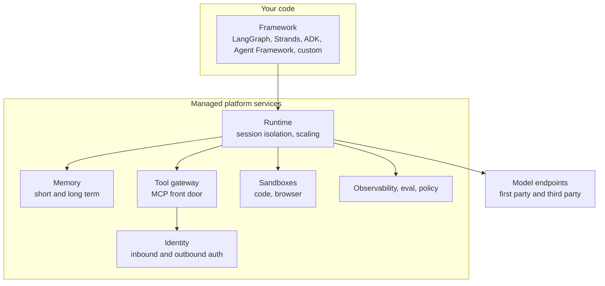
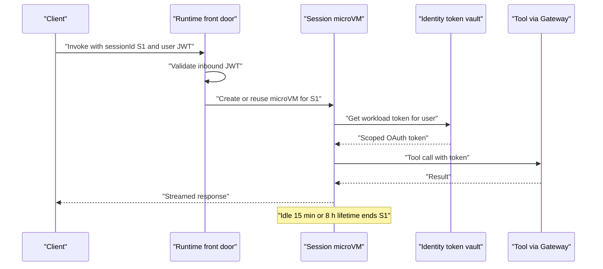
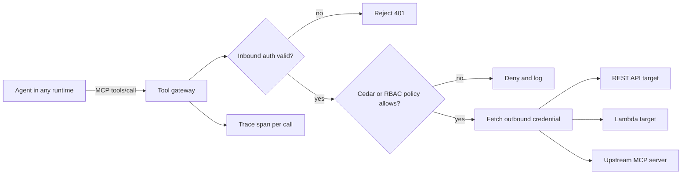
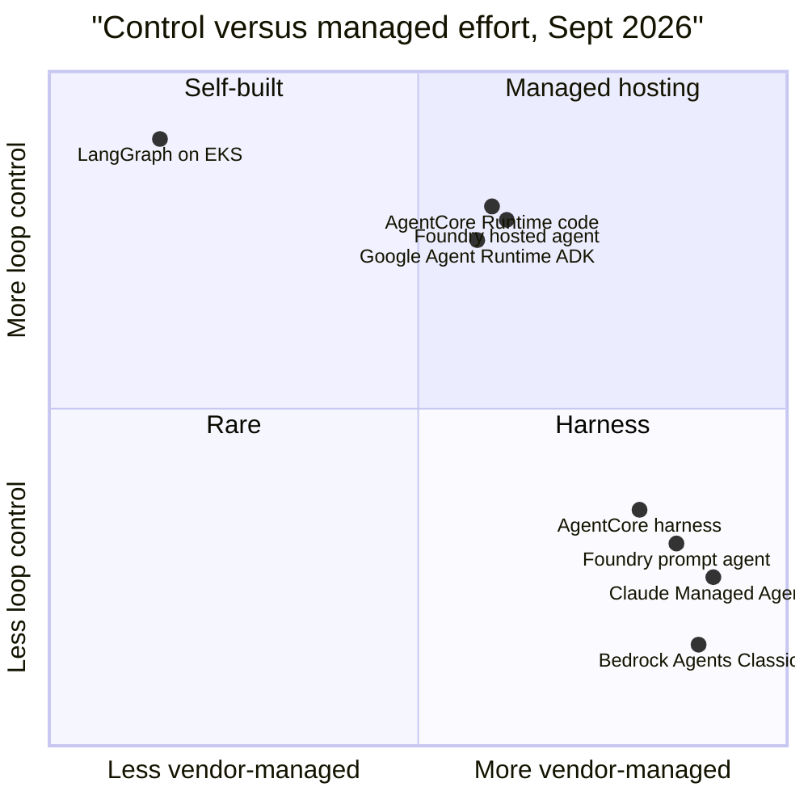
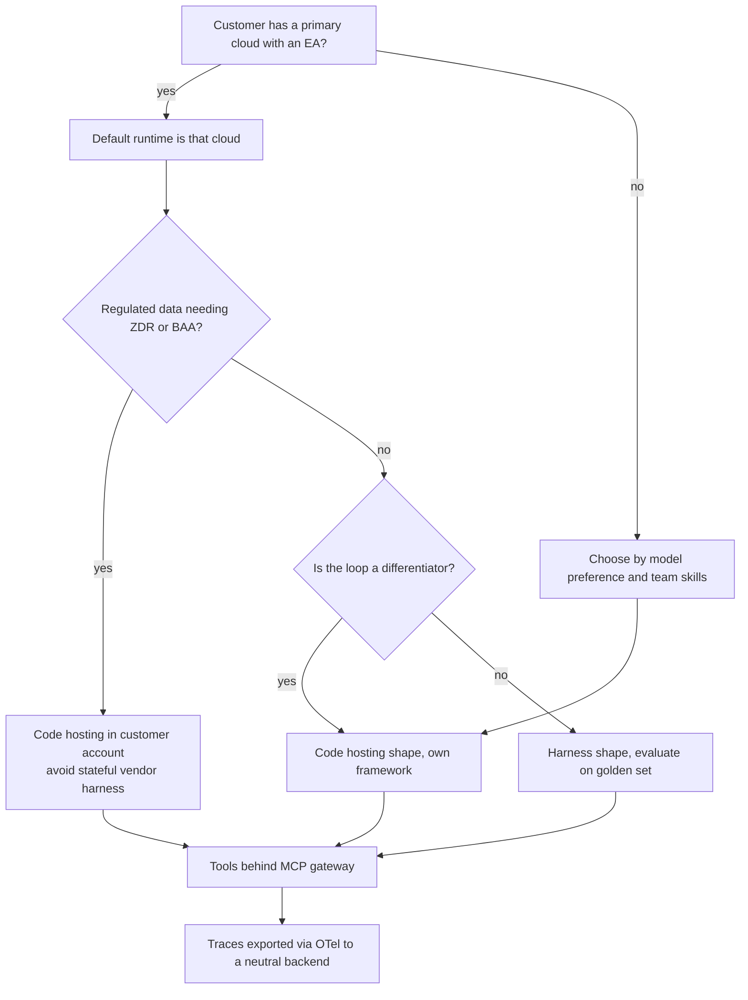
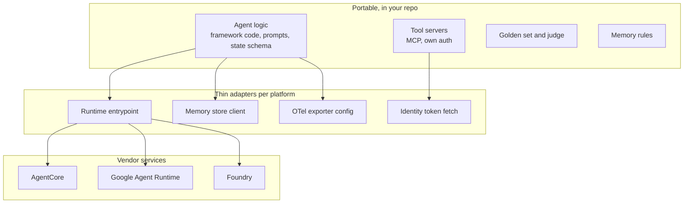
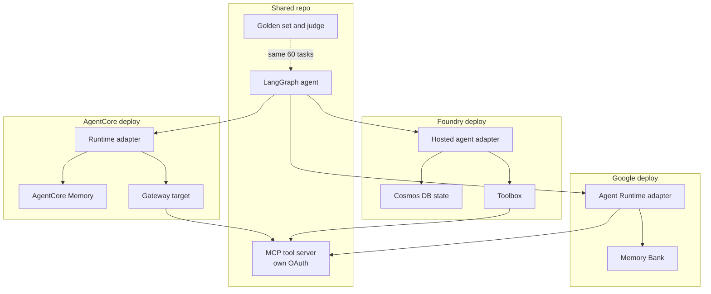

# Chapter 19: Cloud Agent Platforms

> **What this chapter covers**: What the hyperscaler and model-vendor agent platforms actually provide, layer by layer. AWS Bedrock (models, Converse API, Bedrock Agents Classic and its maintenance mode, AgentCore Runtime, Memory, Gateway, Identity, Code Interpreter, Browser, Observability, Policy, Evaluations), Bedrock Guardrails and Knowledge Bases. Google's Gemini Enterprise Agent Platform (formerly Vertex AI, with Agent Runtime formerly Agent Engine, and the Gemini Enterprise app that absorbed Agentspace), ADK deployment. Microsoft Foundry Agent Service. Claude Managed Agents. A comparison table and a portability strategy.
>
> **Prerequisites**: Chapters 1 and 5 (the agent loop and harness), 8 (memory), 10 to 15 (frameworks), 24 (tool design), 16 (MCP), 17 (A2A), 18 (gateways).
>
> **Where it is used**: Any customer engagement where the buyer has already chosen a cloud. Security reviews that ask "where does the agent run and who does it act as". Build versus buy decisions for the runtime layer. Migration work off Bedrock Agents Classic.

---

## 19.1 Level 1: Foundations

### 19.1.1 What a "cloud agent platform" is

Every agent needs the same six things beneath the loop you wrote in Chapters 1 and 5:

1. **Model access**: an inference endpoint with quotas, regions, and a billing relationship.
2. **A runtime**: somewhere to execute the loop for minutes or hours, isolated per user session, that scales to zero.
3. **State**: short-term session history and long-term memory that survives the process.
4. **Tools**: a way to reach APIs, databases, a sandbox for code, and a browser, with credentials.
5. **Identity**: who the agent is, and on whose behalf it acts, for every downstream call.
6. **Observability and control**: traces, evaluations, guardrails, and policy.

A cloud agent platform is a vendor's managed bundle of some or all of these six. The important insight is that the bundles are modular in 2026. You can use one vendor's runtime with another vendor's model and a third party's framework. The marketing presents each platform as a whole; the engineering reality is a set of separately priced services you can adopt one at a time.



### 19.1.2 Two shapes: harness platforms and hosting platforms

The platforms split into two shapes, and most vendors now offer both.

- **Harness (declarative) shape**: you declare model, instructions, tools, and memory settings. The vendor owns the loop. Examples: the AgentCore managed harness, Foundry prompt agents, Claude Managed Agents. You lose control of the loop but get a tuned one for free.
- **Hosting (code) shape**: you bring a container or code package that runs your own loop in any framework. The vendor provides isolation, scaling, identity, and the adjacent services. Examples: AgentCore Runtime with your own code, Foundry hosted agents, Google Agent Runtime with ADK or custom containers.

The harness shape is the successor to the 2023 generation of "agents as configuration" (the original Bedrock Agents, Azure Assistants-style APIs). The 2023 generation hid the loop so completely that teams hit walls: stage-specific prompts they could not debug, no multi-agent control, and model catalogs frozen to the platform's release cycle. The 2025 and 2026 generation keeps a declarative option but makes the code path a first-class peer.

### 19.1.3 Why these platforms exist

A reader who has built production LLM systems will ask: I can run LangGraph in a container on ECS, so why pay for a runtime? Three reasons hold up under scrutiny.

1. **Session isolation is hard to do right.** An agent that runs code or browses on behalf of user A must not leak filesystem, memory, or credentials into user B's session. Per-session microVMs are the durable answer, and building them yourself is a platform team's multi-quarter project.
2. **Outbound identity is harder.** The agent needs to call Salesforce as the user, with a token that was consented to, refreshed, and scoped. Token vaults with OAuth flows are undifferentiated work.
3. **Procurement.** The customer already has an enterprise agreement, a data processing addendum, and a security review with one cloud. Running inside that boundary removes months from the sales cycle. For a Forward Deployed Engineer, this is usually the deciding reason.

The reason that does not hold up is "the platform makes the agent smarter". The model and your context engineering do that. Vendor claims that a harness improves task success (Anthropic reported up to 10 points on structured file generation in its April 2026 Managed Agents launch) are measured on the vendor's own tasks; treat them as a hypothesis to test on your golden set.

### 19.1.4 Vocabulary as of September 2026

Names changed heavily in 2026. Use the current names with customers, but recognize the old ones in their documents.

| Current name (Sept 2026) | Former name | Vendor |
| --- | --- | --- |
| Amazon Bedrock Agents Classic | Amazon Bedrock Agents | AWS |
| Amazon Bedrock AgentCore (Runtime, Memory, Gateway, Identity, Code Interpreter, Browser, Observability, Policy, Evaluations) | new in 2025 | AWS |
| Gemini Enterprise Agent Platform | Vertex AI (rebranded at Cloud Next, April 2026) | Google |
| Agent Runtime | Vertex AI Agent Engine | Google |
| Agent Platform Sessions, Agent Platform Memory Bank | Agent Builder Sessions, Memory Bank | Google |
| Gemini Enterprise (app) | Agentspace (folded in) | Google |
| Microsoft Foundry, Foundry Agent Service | Azure AI Studio, then Azure AI Foundry, Azure AI Agent Service | Microsoft |
| Claude Managed Agents | new, public beta April 2026 | Anthropic |

Google's own documentation says existing customers do not need to migrate for the Vertex AI rename; APIs are unchanged. The naming table is the kind of thing that will be stale within six months. Check the vendor name-change pages before a customer meeting.

---

## 19.2 Level 2: Working knowledge

### 19.2.1 AWS Bedrock: the model layer

Bedrock is the model access layer. It hosts first-party Amazon Nova models and third-party models (Anthropic, Meta, Mistral, and others; the catalog changes monthly, check the console). Three API surfaces matter for agents:

- **InvokeModel**: the provider's native request body. Portable across nothing.
- **Converse and ConverseStream**: a single message schema across Bedrock models, with `toolConfig` for tool definitions and `toolUse` and `toolResult` content blocks. This is the one to use for agent loops you want to switch between models on Bedrock.
- **Cross-region inference profiles**: model IDs prefixed with a geography (for example `us.` or `eu.`) that route across regions within that geography for throughput. Chapter 18 covers the capacity implications.

A Converse tool definition looks like this (shape only; check field names against the current API reference):

```json
{
  "toolConfig": {
    "tools": [{
      "toolSpec": {
        "name": "get_order_status",
        "description": "Look up an order by ID. Returns status and ETA.",
        "inputSchema": {"json": {
          "type": "object",
          "properties": {"order_id": {"type": "string"}},
          "required": ["order_id"]
        }}
      }
    }],
    "toolChoice": {"auto": {}}
  }
}
```

The model replies with `stopReason: "tool_use"` and a `toolUse` block with a `toolUseId`. You execute the tool and send back a user message with a `toolResult` referencing the same ID. This is the same loop as Chapter 1 in different field names. Converse is portable across Bedrock models, not across clouds.

### 19.2.2 Bedrock Agents Classic and why it matters that it is in maintenance mode

The original Bedrock Agents (launched November 2023) is now named Bedrock Agents Classic. Per the AWS maintenance mode page, as of 30 July 2026:

- It is closed to new customers. Accounts without Bedrock Agents activity in the prior 12 months get `AccessDeniedException` on `CreateAgent` and `InvokeInlineAgent`.
- Existing agents keep working. No end-of-life date and no migration deadline have been announced.
- The model catalog in Classic is frozen as of 30 July 2026. New models only reach agents through AgentCore.
- Knowledge Bases and Guardrails are unaffected.

Classic's concepts still appear in customer estates, so know them: **action groups** (OpenAPI or function schemas with a Lambda executor), **knowledge base association**, **prompt overrides** at four stages (pre-processing, orchestration, KB response generation, post-processing), **return of control** (the agent returns the tool call to the client instead of invoking Lambda), and **multi-agent collaboration** (supervisor and routing modes).

The FDE lesson: a platform that owns the loop can freeze it. If the customer's agent logic lives in a vendor's prompt override configuration, migration is a rewrite. If it lives in your code, migration is a redeploy.

### 19.2.3 AgentCore, service by service

AgentCore went generally available in October 2025. Policy and Evaluations were previewed at re:Invent in December 2025 and reached GA in March 2026. Each service is usable alone.

**Runtime.** Hosts your agent code (container image up to 2 GB, or a direct code deployment zip up to 250 MB compressed) or the managed harness. Each session runs in its own isolated microVM. Limits from the AgentCore quotas page, checked September 2026:

| Limit | Value | Adjustable |
| --- | --- | --- |
| Maximum session duration (`maxLifetime`) | 8 hours default and maximum on microVMs | Yes, within range |
| Idle session timeout (`idleRuntimeSessionTimeout`) | 15 minutes default | Yes, 60 s to 8 h |
| Synchronous request timeout | 15 minutes | No |
| Streaming connection maximum | 60 minutes | No |
| Asynchronous job maximum | 8 hours | No |
| Payload size | 100 MB | No |
| Hardware per session | 2 vCPU, 8 GB | No |
| Session storage | 1 GB | No |
| Active sessions per account | 5,000 in us-east-1 and us-west-2, 2,500 elsewhere | Yes |
| New sessions per second | 25 | Yes |

AWS documentation also describes an "Instances" compute type that provisions EC2 in your account and allows sessions of up to 14 days. Treat that as a newer option and check its regional availability. The Runtime supports HTTP, MCP, and A2A protocol contracts for the agent it hosts, which means an AgentCore-hosted agent can itself be an MCP server or an A2A agent.

**Memory.** Short-term memory stores raw events per actor and session (`CreateEvent`, up to 100 messages per call, event expiry between 7 and 365 days). Long-term memory runs extraction strategies over events (built-in semantic facts, user preferences, summaries, episodic, or custom prompts) and stores memory records you retrieve with `RetrieveMemoryRecords`. Up to 6 strategies per memory resource. The extraction runs asynchronously on a model, with a default budget of 150,000 tokens per minute per account. That quota is the first thing to hit in a load test.

**Gateway.** Turns REST APIs (OpenAPI), Lambda functions, and existing MCP servers into MCP tools behind one endpoint. It handles inbound auth (who may call the gateway) and outbound auth (credentials for each target). It offers semantic tool search so an agent with hundreds of tools can find the relevant few (Chapter 24 on tool overload). Defaults: 100 targets per gateway, 1,000 tools per target, 200 tool calls per second.

**Identity.** Workload identities for agents, plus a token vault of OAuth2 and API-key credential providers. It supports the three-legged OAuth flow so an agent acting for a user gets a user-consented token, and a two-legged flow for machine credentials. This is the service that answers the security reviewer's question "on whose behalf".

**Code Interpreter and Browser.** Managed sandboxes, 1,000 concurrent sessions per account each by default. Code Interpreter sessions get 2 vCPU and 8 GB; Browser sessions 1 vCPU and 4 GB with 10 GB disk, live view, and session recording. Both have 8-hour limits on asynchronous commands.

**Observability.** OpenTelemetry-based traces and metrics surfaced in CloudWatch, with spans for model calls, tool calls, and memory operations. Because it is OTel, you can also export to Langfuse or another backend (Chapter 28).

**Policy.** Cedar policies evaluated at the Gateway on every tool call, authored in Cedar directly or from natural language that the service converts to Cedar. This is deterministic authorization outside the model, which is the correct place for it (Chapter 29).

**Evaluations.** Built-in evaluators (AWS says 13) scoring sessions for correctness, helpfulness, tool selection, and safety, online on sampled traffic or on demand. Treat built-in LLM-judge evaluators as uncalibrated until you check them against human labels (Chapter 26).

### 19.2.4 Bedrock Guardrails and Knowledge Bases

**Guardrails** are policy bundles applied to model input and output: content filters, a prompt attack filter, denied topics, word filters, sensitive information filters (PII detection and masking, custom regex), contextual grounding checks (is the answer supported by the provided source and relevant to the query), and Automated Reasoning checks (validate claims against a formal policy derived from a document). Two usage modes:

- Attached to a model invocation through Converse or InvokeModel.
- Standalone through the `ApplyGuardrail` API, which evaluates any text, including output from models outside Bedrock. This is the mode that makes Guardrails portable.

**Knowledge Bases** are managed RAG: ingestion from S3 and other connectors, chunking strategies, embeddings, a vector store (OpenSearch Serverless, Aurora PostgreSQL with pgvector, and others; check the current list), and `Retrieve` or `RetrieveAndGenerate` APIs. In an AgentCore design you expose the knowledge base through Gateway or a retrieval tool, not by attaching it to an agent config.

### 19.2.5 Google: Gemini Enterprise Agent Platform

At Cloud Next in April 2026, Google renamed Vertex AI to Gemini Enterprise Agent Platform and consolidated it with Agentspace under a Gemini Enterprise umbrella. The pieces that matter for agent builders:

- **Agent Development Kit (ADK)**: Google's open-source framework (Python, Java, and other languages; Chapter 13 covers it). Agents are `LlmAgent`, `SequentialAgent`, `ParallelAgent`, `LoopAgent` compositions.
- **Agent Runtime** (formerly Agent Engine): managed hosting for ADK, LangGraph, and other framework agents, with custom container support added in 2026. It emits OpenTelemetry gen_ai metrics for ADK agents from recent ADK versions.
- **Agent Platform Sessions** and **Memory Bank**: session history and long-term memory with automated memory generation from events.
- **Gemini Enterprise app** (where Agentspace went): the end-user surface where employees find and run agents over enterprise search connectors. This is a distribution channel, not a runtime.

Deployment of an ADK agent is a packaging step: you wrap the root agent in an app object, and a deploy call or CLI uploads the code and dependencies to Agent Runtime and returns a resource name you query. The exact SDK class names moved during the rename; use the current quickstart rather than memorized names.

### 19.2.6 Microsoft Foundry Agent Service

Azure AI Foundry became Microsoft Foundry from 1 January 2026. Foundry Agent Service (docs updated September 2026) offers three agent types plus an ephemeral path:

| Path | You write | Foundry runs |
| --- | --- | --- |
| Prompt agent | instructions, model, tools as config | the loop, fully managed |
| Voice-based prompt agent | config plus audio settings | loop plus Voice Live speech stack (preview) |
| Hosted agent | a container or zip in Agent Framework, LangGraph, OpenAI Agents SDK, Anthropic Agent SDK, or custom | container compute, endpoint, per-agent Entra identity, session state |
| Responses API directly | your whole agent, elsewhere | inference and platform tools only |

Differentiators: **Toolboxes** (a curated tool set exposed as one managed MCP endpoint with central auth and versioning), **Entra agent identity** (a dedicated identity per agent, with On-Behalf-Of passthrough), **private networking** (VNet for prompt agents, BYO VNet with VM-isolated sandboxes for hosted agents), bring-your-own storage (Cosmos DB for conversation state, AI Search for retrieval), and publishing to Teams and Microsoft 365 Copilot. The overview page states A2A v1.0 endpoints are GA.

### 19.2.7 Claude Managed Agents

Anthropic launched Claude Managed Agents in public beta on 8 April 2026. It is a harness-shaped platform specific to Claude models. Four concepts:

- **Agent**: model, system prompt, tools, MCP servers, and skills, created once and referenced by ID.
- **Environment**: where sessions run, either an Anthropic-managed cloud sandbox or a self-hosted sandbox on your infrastructure.
- **Session**: a running instance with a persistent filesystem and server-side event history.
- **Events**: user turns, tool results, and status updates, streamed over server-sent events. You can steer or interrupt mid-run.

Built-in tools are bash, file operations, web search and fetch, and MCP. Requests carry the beta header `managed-agents-2026-04-01` (the SDK sets it). It is also offered through Claude Platform on AWS. One important constraint for regulated customers: because sessions are stateful server-side, the docs state Managed Agents is not currently eligible for Zero Data Retention or HIPAA BAA coverage. The self-hosted sandbox option moves execution, not the event history.

### 19.2.8 Worked example: the reference support agent on four platforms

Take the book's reference spec: a support agent with three tools (`lookup_order`, `issue_refund`, `search_kb`), memory, one approval gate before refunds, and tracing.

| Spec element | AgentCore | Google Agent Platform | Foundry | Claude Managed Agents |
| --- | --- | --- | --- | --- |
| Loop | Strands or LangGraph in Runtime, or harness | ADK in Agent Runtime | Hosted agent, or prompt agent | managed harness |
| `lookup_order`, `issue_refund` | Lambda targets behind Gateway | ADK function tools or MCP | Toolbox with OpenAPI tools | MCP server you host |
| `search_kb` | Knowledge Base via Gateway | Vertex AI Search tool | File search or AI Search | MCP server or web fetch |
| Memory | AgentCore Memory | Sessions and Memory Bank | Conversation state in Cosmos DB, memory tool | session filesystem and history |
| Approval gate | harness inline function (return of control) or LangGraph interrupt | ADK tool confirmation or callback | workflow approval or custom | custom tool that pauses and waits for a user event |
| Refund authorization | Cedar policy at Gateway: amount under limit | IAM plus callback check | Entra RBAC plus tool code | check inside your MCP server |
| Tracing | CloudWatch via OTel | Cloud Trace via OTel | Application Insights | event history, plus your own spans |

The pattern: the loop, memory, and tracing columns change with the platform. The tools column does not if you put the tools behind MCP. That observation is the core of the portability strategy in 19.4.

---

## 19.3 Level 3: Depth

### 19.3.1 Session isolation internals

A per-session microVM (Firecracker-style) gives each session its own kernel, filesystem, and memory. The costs are cold start (a new microVM per new session) and a hard ceiling on per-session hardware (2 vCPU and 8 GB on AgentCore). The benefits are that code execution, browser state, and cached credentials cannot cross sessions.



Two failure modes to design for:

1. **Session loss is normal.** A session ends on idle timeout, on max lifetime, on health check failure, or on an explicit stop. Anything in the microVM filesystem is gone (session storage persists only within the session's lifecycle rules). Durable state must live in Memory or your own store. Chapter 22's rule applies: checkpoint outside the compute.
2. **Session ID is the tenancy key.** If your client reuses a session ID across users, the platform's isolation is defeated by your own code. AgentCore requires session IDs of at least 33 characters, which nudges you toward UUIDs. Derive session IDs server-side from an authenticated user and conversation, never from a client-supplied string alone.

### 19.3.2 The 8-hour and 15-minute numbers, and what they force

The 15-minute synchronous request timeout means a single HTTP request cannot carry a long agent run. The 60-minute streaming ceiling means a single stream cannot either. Long runs must be asynchronous: the invocation starts work, returns quickly, and the client polls or subscribes. The 8-hour asynchronous ceiling bounds a single session's life; a multi-day workflow (waiting for a human approval over a weekend) must persist state and end the session, then resume in a new one.

Worked budget: a research agent does 40 tool calls at an average of 12 s each plus 40 model turns at 6 s each. That is 40 × 18 s = 720 s, which is 12 minutes. It fits a synchronous request with a 3-minute margin. Add a 20 percent tail and a retry on two slow tools (2 × 60 s) and you are at 16.4 minutes, over the limit. The design answer is async from the start, not after the first production timeout.

### 19.3.3 Memory extraction: the hidden model bill

Long-term memory extraction is a model call over conversation events that you did not write and may not see in your own traces. Arithmetic for a support deployment with 20,000 conversations a day, 12 turns each, 150 tokens per turn:

- Events tokenized for extraction: 20,000 × 12 × 150 = 36 million tokens a day.
- If three strategies each read the full event stream, that is 108 million input tokens a day.
- Averaged over 24 hours, 108,000,000 / 1,440 minutes = 75,000 tokens per minute, half the default 150,000 TPM quota. Peak hours at 3 times the average reach 225,000 TPM and will throttle.

The lesson generalizes across Google Memory Bank and any managed memory: extraction is metered model usage, it has quotas, and it runs behind the scenes. Budget it explicitly and ask the vendor how extraction tokens are billed (as of September 2026, check the AgentCore pricing page for the current per-record and per-token rates rather than trusting a number in a slide).

### 19.3.4 Gateway as the control point

The Gateway pattern (AgentCore Gateway, Foundry Toolboxes, and a self-hosted MCP gateway from Chapter 18) is the most valuable piece of any platform, because it concentrates four concerns in one hop:



Authentication, authorization, credential injection, and audit happen outside the model and outside your framework. When the framework changes, the gateway does not. When the model changes, the gateway does not. A security reviewer can read the Cedar policies without reading agent code.

A Cedar policy for the refund gate reads roughly like this (illustrative; derive the entity and action names from the schema the service generates from your tools):

```text
permit (
  principal,
  action == AgentCore::Action::"RefundTool__issue_refund",
  resource
) when {
  context.input.amount <= 200 &&
  principal.hasTag("role") && principal.getTag("role") == "support_agent"
};
```

Anything over 200 is denied by default, and the agent is told so, which it can relay to the human for approval through a separate path.

### 19.3.5 Failure modes by layer

| Layer | Failure | Symptom | Mitigation |
| --- | --- | --- | --- |
| Model | Regional capacity, throttling | 429 or `ThrottlingException` at peak | cross-region profile, gateway fallback (Chapter 18) |
| Runtime | Cold start | first turn 2 to 10 s slower | keep-warm pings, smaller image, pre-created sessions |
| Runtime | Lifetime or idle expiry | "session not found" mid-task | async pattern, durable checkpoints |
| Memory | Extraction lag | agent does not recall a fact from 30 s ago | read short-term events for recency, long-term for durability |
| Memory | Extraction quality | wrong or stale preference recalled | custom strategy prompts, evaluate extraction (Chapter 8) |
| Gateway | Tool search misses | agent never sees the right tool | tune descriptions, cap tool count, test recall |
| Identity | Consent not granted | tool call returns an authorization URL | surface consent to user, elicitation pattern |
| Guardrails | False positive block | legitimate answer masked | tune filter strength per category, evaluate on golden set |
| Harness | Hidden prompt change | behavior shifts with no deploy on your side | pin versions where possible, run regression evals nightly |

The last row deserves emphasis. With any harness-shaped platform, the vendor can change its internal prompts. Anthropic's Managed Agents docs state behaviors "may be refined between releases". Your nightly regression suite (Chapter 27) is the only defense.

### 19.3.6 Cost structure

The platforms charge for different things, which makes naive comparisons wrong.

- **Runtime**: AgentCore bills active CPU and memory consumption per second, and AWS has stated that I/O wait (waiting on the model) is not billed for CPU. That matters: an agent spends most of its wall time waiting for inference.
- **Memory**: per event stored and per memory record extracted or retrieved, plus the extraction model tokens.
- **Gateway**: per tool call and per tool search.
- **Harness platforms**: Claude Managed Agents bills model tokens plus session runtime; Foundry prompt agents bill inference plus tool usage.

Illustrative arithmetic (hypothetical unit prices, not quotes): an agent run of 90 s wall time with 8 s of active CPU at 1 vCPU and 2 GB. If CPU were billed on wall time, that is 90 vCPU-seconds; billed on active time, 8 vCPU-seconds, an 11x difference. At 100,000 runs a month the gap dominates the runtime line. Always ask each vendor what "active" means and whether waiting on a streaming response counts.

---

## 19.4 Level 4: Mastery

### 19.4.1 The comparison table

As of September 2026. Every cell is version-sensitive; verify before quoting to a customer.

| Dimension | AWS AgentCore | Google Agent Platform | Microsoft Foundry Agent Service | Claude Managed Agents |
| --- | --- | --- | --- | --- |
| Status | GA (Oct 2025); Policy and Evaluations GA Mar 2026 | GA under new name (Apr 2026) | GA; voice agents preview | Public beta (Apr 2026) |
| Shapes | harness and code hosting | ADK and custom containers on Agent Runtime | prompt, voice, hosted, Responses API | harness only |
| Models | Bedrock catalog plus OpenAI-compatible and other providers | Gemini plus Model Garden | Foundry catalog (OpenAI, Llama, DeepSeek, others) | Claude only |
| Frameworks | any (Strands, LangGraph, OpenAI Agents SDK, Claude Agent SDK) | ADK first, LangGraph and others | Agent Framework, LangGraph, OpenAI and Anthropic SDKs | not applicable |
| Isolation | microVM per session | managed containers | VM-isolated sandbox per session for hosted agents | cloud or self-hosted sandbox |
| Session length | 8 h microVM; longer on Instances type | check current docs | check current docs | long-running, check rate limits |
| Memory | short and long term, strategies | Sessions, Memory Bank | memory tool, BYO Cosmos DB | session filesystem and history |
| Tool front door | Gateway (MCP) | ADK tools, MCP | Toolboxes (MCP endpoint) | MCP servers |
| Identity | workload identity plus token vault | service accounts, IAM | Entra agent identity, OBO | API key; your MCP servers handle downstream auth |
| Policy | Cedar at Gateway | IAM, callbacks | RBAC, content filters | your code |
| Protocols | HTTP, MCP, A2A | A2A (Google originated it), MCP | A2A v1.0 GA, MCP, M365 channels | MCP |
| Distribution | your app | Gemini Enterprise app | Teams, M365 Copilot | your app |
| Data retention caveat | your account | your project | your tenant | not ZDR or HIPAA BAA eligible (docs, Sept 2026) |



### 19.4.2 The decision a senior engineer makes

The question is rarely "which platform is best". It is "which layers do we let the vendor own, given this customer's constraints". A decision flow:



Heuristics that survive customer contact:

1. **Tools are the asset; the loop is replaceable.** Put every tool behind MCP with its own auth. The tool layer is where the customer's systems integration effort lives, and MCP makes it platform-neutral.
2. **Own the evaluation set, not the vendor's evaluators.** Built-in evaluators are useful for dashboards. Promotion decisions use your calibrated judge on your golden set (Chapter 26).
3. **Export traces in OpenTelemetry gen_ai conventions.** AgentCore, Google Agent Runtime, and Foundry all emit OTel. If traces only live in the vendor console, you cannot compare platforms or leave one.
4. **Keep memory schema in your code.** Managed memory is fine as a store. The extraction rules (what counts as a preference, what expires) are product decisions that should be versioned in your repo, expressed as custom strategy prompts.
5. **Prefer harnesses for internal tools, hosting for customer-facing products.** Internal tools tolerate behavior drift; a customer-facing product needs the regression control of owning the loop.

### 19.4.3 A portability strategy

Portability is not "runs anywhere with zero changes". It is "moving costs weeks, not quarters". The architecture:



Concrete rules:

- The runtime entrypoint is a 30-line adapter that parses the platform's invocation payload into your `run(session_id, user, message)` call.
- The model client goes through a gateway or an abstraction (LiteLLM, Chapter 18), so a model swap is config.
- Memory access goes through an interface with two methods, `recall(actor, query)` and `record(actor, events)`, implemented per platform.
- Outbound tokens come from an interface `token_for(user, provider, scopes)`; the implementation is AgentCore Identity, Entra OBO, or your own vault.
- Guardrails that must be portable use a standalone API (`ApplyGuardrail`) or an open-source guard model you host (Chapter 29), not a guardrail only attachable to one vendor's invocation.

Worked estimate of switching cost. A support agent with 3 tools, memory, approval, and tracing. With the structure above: rewrite the entrypoint adapter (1 day), memory adapter (2 days including migrating records), identity adapter (2 days including OAuth app registration), OTel config (half a day), rerun the golden set and fix regressions (3 days). About 8.5 engineer-days. Without it, where logic lives in Classic prompt overrides, action group schemas, and platform-specific memory: a rewrite, typically 4 to 8 weeks. The factor of roughly 5 is the argument to put in the architecture decision record.

### 19.4.4 Where vendors and practitioners disagree

- **Harness value.** Vendors claim tuned harnesses beat hand-written loops (Anthropic's 10 point claim, AWS's claim that the harness is more token-efficient than Classic's prompts). Practitioners report that for narrow, well-specified agents a 200-line custom loop with good tools matches a harness. Both can be true: the harness wins on open-ended tasks with file and shell work, the custom loop wins where domain constraints dominate. Measure.
- **Multi-agent as a platform feature.** Bedrock Agents Classic had built-in supervisor and routing collaboration; the AWS migration table says AgentCore's harness only supports agent-as-tool and "routing mode multi-agent is not straightforward today". Google and Microsoft emphasize A2A between agents. The disagreement is whether multi-agent coordination belongs in the platform or in your code. Chapter 21 argues for code.
- **Memory as a managed service.** Vendors push managed long-term memory. Critics note extraction quality is hard to evaluate and costs are opaque. A defensible middle: use managed short-term event storage, and treat long-term extraction as an experiment with its own evals.
- **Lock-in.** Every vendor says it is open because it supports MCP and A2A. Protocol support reduces tool and inter-agent lock-in. It does nothing for identity, memory data, policy language (Cedar is open source but AgentCore's schema generation is not), or distribution channels (Teams, Gemini Enterprise). The lock-in moved up the stack; it did not vanish.

### 19.4.5 Edge cases a senior engineer checks

- **Region availability.** AgentCore, Foundry hosted agents, and Google Agent Runtime roll out region by region. A European customer with an EU-only data residency requirement may find a service missing in their region. Check before designing.
- **Model availability per service.** A model in the Bedrock catalog is not automatically usable inside every AgentCore feature (Memory extraction uses its own models). Same for Foundry agent-capable models, which the catalog filters separately.
- **Quota increases take time.** Default 25 new sessions per second is 90,000 an hour, enough for most launches, but the per-account memory extraction TPM is often not. Request increases two weeks ahead.
- **Deletion and retention.** For each store (events, memory records, traces, browser recordings, session filesystems), know the retention default and the delete API. Customers ask during the security review, and browser session recordings are the one teams forget.
- **Identity for background agents.** A scheduled agent with no user present cannot use a three-legged OAuth token that has expired. Design refresh token handling and a failure path that notifies the owner.

---

### 19.4.6 Worked case: one agent deployed three ways

This case takes a single agent and deploys it on AgentCore, Google Agent Runtime, and Foundry hosted agents. The goal is to show exactly what changes, what stays the same, and what each option costs. The company is synthetic.

**The agent.** Northwind Parts, a synthetic industrial distributor, wants a "quote assistant" for its sales team. Specification:

- Tools: `search_catalog(query)`, `get_price(sku, qty, customer_tier)`, `check_stock(sku, warehouse)`, `create_quote(customer_id, lines[])`. The last one has side effects.
- Memory: per-salesperson preferences (default warehouse, favourite customers) and per-customer history (last five quotes).
- Approval: any quote over 25,000 needs a sales manager's approval before `create_quote` commits.
- Traffic: 400 salespeople, about 6,000 sessions a working day, 22 working days a month, so 132,000 sessions a month.
- Session shape: 9 model turns, 7 tool calls, 70 s wall time, 6 s of active CPU in the agent process.
- Model: the same frontier model on all three platforms where available, otherwise the closest equivalent. (Model availability differs by cloud; this is itself a finding to record.)

**What is shared across all three deployments.** This is the portable core, and it lives in one repository:

| Component | Implementation | Lines of code (approx.) |
| --- | --- | --- |
| Agent graph | LangGraph, 4 nodes: plan, act, approve, respond | 220 |
| Prompts | versioned Markdown files | 3 files |
| Tool server | FastMCP server with the 4 tools, its own OAuth resource server | 350 |
| State schema | TypedDict with `messages`, `quote_draft`, `approval_status` | 30 |
| Memory interface | `recall(actor, query)`, `record(actor, events)` | 20 (interface) |
| Token interface | `token_for(user, provider, scopes)` | 10 (interface) |
| Golden set | 60 tasks with expected tool calls and final quote totals | data |
| Judge | calibrated rubric for quote correctness | 1 prompt, calibration file |

**What changes per platform.** The adapters:

| Adapter | AgentCore | Google Agent Runtime | Foundry hosted agent |
| --- | --- | --- | --- |
| Entrypoint | HTTP app with the Runtime invocation contract, packaged as container | ADK or custom container wrapping the LangGraph app | container implementing the hosted agent protocol |
| Memory | AgentCore Memory: events for short term, custom strategy for preferences | Agent Platform Sessions plus Memory Bank | Cosmos DB (BYO) for state, memory tool or own store |
| Outbound tokens | AgentCore Identity token vault, OAuth provider for the ERP | Secret Manager plus service account, or own vault | Entra agent identity with On-Behalf-Of to the ERP |
| Tool access | MCP server registered as a Gateway target | MCP server called directly from the agent | MCP server added to a Toolbox |
| Approval gate | LangGraph interrupt, resume via new invocation with the same session ID | same | same |
| Policy | Cedar at Gateway: `create_quote` total at most 25,000 unless `approved` | IAM plus check in the MCP server | RBAC plus check in the MCP server |
| Tracing | OTel to CloudWatch, second exporter to Langfuse | OTel to Cloud Trace, second exporter to Langfuse | OTel to Application Insights, second exporter to Langfuse |
| Adapter size | about 180 lines plus IaC | about 160 lines plus IaC | about 170 lines plus IaC |

Two observations. First, the approval gate is identical on all three because it lives in LangGraph, not in the platform. Had it lived in a harness feature, it would have been rewritten three times. Second, the policy check lives in the MCP server on two platforms and additionally in Cedar on AgentCore. The MCP server check is the portable one; Cedar is defence in depth where available.



### 19.4.7 Cost arithmetic for the three deployments

All unit prices below are **illustrative placeholders** for the arithmetic, not quotes. Every vendor publishes a pricing page; substitute current numbers before a customer conversation. The structure of the calculation is the point.

**Model tokens (the same on every platform if the model is the same).** Per session: 9 turns with average input 7,000 tokens (system prompt, 4 tool schemas, history) and 350 output tokens.

- Input: 9 × 7,000 = 63,000 tokens. Output: 9 × 350 = 3,150 tokens.
- With prompt caching, assume 75 percent of input is a cached prefix billed at 10 percent of the base rate. Effective input = 63,000 × (0.25 + 0.75 × 0.10) = 63,000 × 0.325 = 20,475 full-price-equivalent tokens.
- At 3 per million input and 15 per million output: 20,475 × 3 / 1e6 + 3,150 × 15 / 1e6 = 0.0614 + 0.0473 = 0.1087 per session.
- Monthly: 132,000 × 0.1087 = 14,348.

**Runtime compute.** Session wall time 70 s, active CPU 6 s, assume 1 vCPU and 2 GB allocated.

| Billing basis | vCPU-seconds per session | GB-seconds per session | Monthly vCPU-hours | Monthly GB-hours |
| --- | --- | --- | --- | --- |
| Active CPU only, memory on wall time | 6 | 140 | 220 | 5,133 |
| Wall time for both | 70 | 140 | 2,567 | 5,133 |

With illustrative rates of 0.09 per vCPU-hour and 0.01 per GB-hour:

- Active-CPU billing: 220 × 0.09 + 5,133 × 0.01 = 19.8 + 51.3 = 71 per month.
- Wall-time billing: 2,567 × 0.09 + 51.3 = 231 + 51.3 = 282 per month.

Either way, runtime is 0.5 to 2 percent of the model bill. This is the most common surprise in platform cost reviews: compute is rarely the line that matters for agents; tokens are.

**Memory.** Short-term: 9 turns × 2 events (user and assistant) = 18 events per session, 2.38 million events a month. Long-term extraction with one custom strategy reading 9 × 800 = 7,200 tokens per session: 950 million tokens a month through the extraction model. If the extraction model costs 0.25 per million input tokens, that is 238 a month, plus per-event and per-record charges (illustratively 0.25 per thousand events: 594). Memory lands around 800 to 1,000 a month, larger than compute.

**Tool gateway.** 7 tool calls per session is 924,000 calls a month. At an illustrative 0.005 per thousand calls, 4.6 a month. Tool search, if used on every turn, adds a larger per-query charge; here the agent has 4 tools, so no tool search is needed.

**Observability.** Traces with about 25 spans per session, 3.3 million spans a month, ingested into a cloud logging product at an illustrative 0.50 per GB with about 2 KB per span: 6.6 GB, about 3 a month in ingestion but more in retention and queries. Langfuse self-hosted or cloud adds its own line.

**Totals per month (illustrative):**

| Line | AgentCore | Google Agent Runtime | Foundry hosted |
| --- | --- | --- | --- |
| Model tokens | 14,348 | 14,348 (if same model available) | 14,348 (if same model available) |
| Runtime compute | 71 to 282 | similar order | similar order |
| Memory | about 830 | similar order | Cosmos DB RU and storage, similar order |
| Gateway or toolbox | about 5 | not applicable | toolbox charges if any |
| Observability | tens | tens | tens |
| Total | about 15,300 to 15,500 | about 15,300 | about 15,300 |

The honest conclusion: for a token-heavy agent, platform choice changes the total by a few percent. Model choice, caching rate, and the number of turns change it by factors. A 20 percent reduction in turns through better tool design saves more than any platform switch. Present this table to a customer who is agonizing over platform pricing, then redirect the conversation to what matters.

**Sensitivity.** Where platform cost does matter:

1. **Long, idle-heavy sessions.** A session held open for 8 hours waiting for approvals costs 8 hours of memory allocation on a wall-time basis. 1,000 such sessions a day at 2 GB is 16,000 GB-hours a day. Fix: end sessions at the approval gate and resume later.
2. **Browser and code sandboxes.** Browser sessions are much more expensive per minute than the agent process because they run a full browser. An agent that browses for 3 minutes per task at scale can make the sandbox line rival the token line.
3. **Memory extraction at high turn counts.** Extraction cost scales with conversation tokens, not with sessions.
4. **Cross-region data transfer.** An agent in one region calling a model in another pays egress.

### 19.4.8 The portability layer, designed

The interfaces from 19.4.3, specified precisely enough to build. Each interface is small on purpose: a large interface is a sign that platform concepts are leaking into agent logic.

```python
from typing import Protocol, Iterable

class MemoryStore(Protocol):
    def recall(self, actor_id: str, query: str, k: int = 5) -> list[dict]: ...
    def record(self, actor_id: str, session_id: str, events: Iterable[dict]) -> None: ...
    def forget(self, actor_id: str) -> None: ...          # deletion requests

class TokenBroker(Protocol):
    def token_for(self, user_id: str, provider: str, scopes: list[str]) -> str: ...
    def consent_url(self, user_id: str, provider: str, scopes: list[str]) -> str | None: ...

class RuntimeAdapter(Protocol):
    def parse(self, raw_request: dict) -> tuple[str, str, str]: ...   # session, user, message
    def respond(self, events: Iterable[dict]) -> object: ...          # stream to platform
```

Design decisions and why:

- **`forget` is in the interface from day one.** Deletion requests (GDPR erasure, a customer offboarding) must work on every platform. If the interface lacks it, someone will discover during an audit that one platform's memory records cannot be found by user.
- **`consent_url` returns `None` when a token exists.** The agent surfaces a consent link to the user instead of failing when OAuth consent is missing. This handles AgentCore Identity's authorization URL flow, Entra's consent, and a self-built vault the same way.
- **`RuntimeAdapter.respond` takes an iterator of events.** Platforms differ in streaming (SSE, chunked HTTP, WebSocket). The agent emits a platform-neutral event stream; the adapter translates.
- **No model client in the interface.** Model access goes through a gateway (Chapter 18) configured by environment. Switching models is configuration, not code.
- **Tracing is not an interface.** It is OpenTelemetry with the gen_ai conventions, configured by environment variables for the exporter. OTel already is the portability layer.

**Conformance tests.** Each adapter gets the same contract test suite, run in CI against a local emulator or a sandbox account:

| Test | Asserts |
| --- | --- |
| `recall_after_record` | a fact recorded for actor A is recalled for A within the platform's extraction delay |
| `isolation` | a fact recorded for actor A is never recalled for actor B |
| `forget` | after `forget(A)`, recall for A returns nothing and a direct platform query finds no records |
| `token_refresh` | a token past expiry is refreshed without user interaction when a refresh token exists |
| `consent_missing` | missing consent returns a URL, not an exception |
| `stream_roundtrip` | 50 events emitted arrive in order through the platform's streaming path |
| `session_resume` | an interrupted session resumes from checkpoint with the same state hash |

The isolation and forget tests are the ones security reviewers ask about, and having them green on every platform is a strong answer.

**Migration runbook.** Moving the quote assistant from AgentCore to Foundry:

1. Implement `FoundryRuntimeAdapter`, `CosmosMemoryStore`, `EntraTokenBroker`. Run conformance tests.
2. Export memory records from AgentCore Memory per actor, transform to the Cosmos schema, import. Verify counts per actor.
3. Register the ERP OAuth app for Entra OBO; users re-consent once (plan communication).
4. Add the MCP server to a Foundry Toolbox. Replicate the Cedar policy as an RBAC rule plus the existing MCP server check.
5. Point OTel exporters at Application Insights and keep the Langfuse exporter unchanged, so dashboards and evals continue.
6. Run the 60-task golden set on both deployments, three trials each; require the paired success difference interval to include zero or favor the new platform.
7. Shift 10 percent of salespeople for one week, compare escalation and error rates, then complete the cutover.

Estimated effort: 8 to 12 engineer-days, of which re-consent and memory migration are the schedule risks, not code.

### 19.4.9 Security review questions per platform

Customers' security teams ask the same questions. Prepare the answers per platform before the review.

| Question | Where the answer lives |
| --- | --- |
| Where is conversation data stored and for how long? | memory resource config, event expiry, trace retention |
| Can the vendor's staff access it? | vendor data processing terms, customer-managed keys support |
| Is data used to train models? | model provider terms on the platform (usually no for enterprise APIs; verify) |
| How is one user's session isolated from another's? | runtime isolation model (microVM, VM sandbox) plus your session ID derivation |
| On whose behalf does the agent call internal systems? | token broker design, OBO or three-legged OAuth |
| What stops the agent doing something it should not? | policy at the tool boundary, approval gates, tool scopes |
| How do we delete a user's data? | `forget` implementation and conformance test |
| How do we audit what the agent did? | traces with user and session IDs, tool call logs at the gateway |
| What happens if the vendor changes the harness? | nightly regression evals, version pinning |

A table like this, filled in with links to configuration, often shortens a security review from weeks to days.

## 19.5 Subtopic checklist

- [x] AWS Bedrock models and the model catalog
- [x] Converse API and tool configuration
- [x] Bedrock Agents Classic, its concepts, and maintenance mode status (July 2026)
- [x] AgentCore Runtime with verified limits (8 h session, 15 min idle, 15 min sync, 100 MB payload)
- [x] AgentCore Memory, short-term and long-term strategies, extraction quotas
- [x] AgentCore Gateway
- [x] AgentCore Identity
- [x] AgentCore Code Interpreter and Browser
- [x] AgentCore Observability
- [x] AgentCore Policy and Evaluations
- [x] Bedrock Guardrails, including ApplyGuardrail, grounding and Automated Reasoning checks
- [x] Bedrock Knowledge Bases
- [x] Google Vertex AI Agent Engine, now Agent Runtime under Gemini Enterprise Agent Platform
- [x] Agentspace naming (folded into Gemini Enterprise)
- [x] ADK deployment
- [x] Azure AI Foundry Agent Service, now Microsoft Foundry Agent Service
- [x] Anthropic Claude Managed Agents
- [x] Comparison table
- [x] Portability strategy

## 19.6 Common misconceptions

1. **"The platform makes the agent better."** The model, tools, and context do. A harness can help, but that claim must be tested on your golden set, not accepted from a launch post.
2. **"Supporting MCP and A2A means no lock-in."** Protocols remove lock-in at the tool and inter-agent layers. Identity, memory data, policy, observability consoles, and distribution channels remain vendor-specific.
3. **"Bedrock Agents is deprecated, so existing agents will stop."** Classic is in maintenance mode: closed to new accounts from 30 July 2026, existing agents keep working, no end-of-life announced. The real problem is the frozen model catalog.
4. **"An 8-hour session means an 8-hour request."** Synchronous requests time out at 15 minutes and streams at 60. Long work must be asynchronous.
5. **"Managed memory is free once you pay for storage."** Long-term extraction runs model calls with their own quota (150,000 TPM default on AgentCore) and cost.
6. **"Session isolation is automatic."** It is automatic per session ID. If your code lets a client choose or reuse the ID across users, you have defeated it.
7. **"Guardrails replace authorization."** Content filters classify text. Whether the agent may issue a 500 refund is an authorization decision that belongs in deterministic policy (Cedar, RBAC) at the tool boundary.
8. **"Built-in evaluators tell you if the agent is good."** They are uncalibrated LLM judges on generic criteria. Use them for trend dashboards and calibrate against human labels before any gating.
9. **"Agentspace and Vertex AI Agent Engine are the current products."** As of April 2026 they are the Gemini Enterprise app and Agent Runtime under the Gemini Enterprise Agent Platform. APIs carried over.
10. **"Harness platforms are fine for regulated data."** Check retention eligibility. Claude Managed Agents documents that it is not ZDR or HIPAA BAA eligible as of September 2026 because state is stored server-side.

## 19.7 Practice

1. **Conceptual.** For each of the six platform needs in 19.1.1, name which of the four platforms provides it as a managed service and which leaves it to you. Identify the one need none of them fully solves (hint: evaluation of your domain).
2. **Conceptual.** Explain in five sentences why the tool layer is the portable asset and the loop is replaceable. Then give one case where the opposite is true.
3. **Design.** A logistics customer on Azure wants a dispatcher agent that runs for up to three days while waiting for carrier confirmations. Design the state and session strategy given a per-session lifetime limit, and state where each piece of state lives.
4. **Design.** Write the Cedar-style policy set (pseudo-code is fine) for a finance agent with tools `read_ledger`, `create_journal_entry`, `approve_payment`. Payment approval requires a human, journal entries over 10,000 require a second tool call from a different principal.
5. **Arithmetic.** Your agent serves 5,000 sessions a day, 20 turns each, 200 tokens per turn, with two long-term memory strategies. Compute daily extraction input tokens and peak TPM assuming a 4x peak-to-average ratio. Does it fit a 150,000 TPM quota?
6. **Hands-on (free tier, local).** Build the reference support agent in LangGraph with tools behind a local MCP server (FastMCP). Write the runtime adapter as a single function `run(session_id, user, message)`. Then write a second adapter matching the AgentCore Runtime HTTP contract (a `/invocations` POST and a `/ping` GET, check current docs) and run it in Docker locally. Count lines changed between adapters.
7. **Hands-on (local).** Export your agent's traces with OpenTelemetry gen_ai semantic conventions to a local Langfuse or Jaeger container. Verify model calls, tool calls, and token counts appear as spans with the standard attribute names.
8. **Hands-on (free tier where available).** Call Bedrock `ApplyGuardrail` (or, if you have no AWS account, a local open guard model such as a Llama Guard variant through Ollama) on 50 synthetic support replies with injected PII. Measure precision and recall of PII masking with a bootstrap 95 percent interval.
9. **Design review.** A colleague proposes putting the refund approval rule in the system prompt of a Foundry prompt agent. Write the three-sentence review comment explaining the failure mode and the fix.
10. **Migration.** Given a Bedrock Agents Classic agent with two action groups, a knowledge base, and an orchestration prompt override, list the AgentCore equivalents and identify which piece has no direct equivalent per the AWS migration table.

## 19.8 How this is tested

<details><summary>What are the six things a cloud agent platform provides, and which is hardest to build yourself?</summary>

Model access, a session-isolated runtime, state (short and long-term memory), tools (gateway, code sandbox, browser), identity (inbound and outbound, on-behalf-of), and observability with evaluation and policy. The hardest to build well is usually outbound identity: an OAuth token vault with user consent flows, refresh, scoping, and audit across many SaaS providers. Per-session isolation for code execution is second. Model access and tracing are the easiest to replicate.
</details>

<details><summary>What is the status of Bedrock Agents in 2026 and what would you tell a customer running it?</summary>

It was renamed Bedrock Agents Classic and entered maintenance mode on 30 July 2026: closed to accounts without usage in the prior 12 months, existing agents keep working, no end-of-life date, no migration deadline, and the model catalog is frozen at that date. I would tell them nothing breaks today, but they will not get new models or features, so plan migration to AgentCore (harness for simple agents, code-defined for custom orchestration or multi-agent), starting with moving action groups behind Gateway as MCP tools because that step is reusable whatever runtime they end on.
</details>

<details><summary>Walk through the AgentCore Runtime session limits and how they shape a design.</summary>

As of September 2026: 15 minutes idle timeout by default, 8 hours maximum lifetime on microVMs (both configurable within 60 s to 8 h), 15-minute synchronous request timeout, 60-minute streaming limit, 8-hour async jobs, 100 MB payload, 2 vCPU and 8 GB per session. So anything that can exceed about 10 minutes should be async from day one, durable state must live in Memory or an external store because sessions end, and a multi-day workflow needs checkpoint, end session, and resume in a new session on an event.
</details>

<details><summary>How does AgentCore Gateway change the security posture of an agent?</summary>

It moves authentication, authorization, credential injection, and audit out of the agent code and the model into one network hop. Inbound auth checks who may call tools, Cedar policies from AgentCore Policy decide per call whether the action is allowed given its arguments, the Identity token vault injects outbound credentials so the agent never holds long-lived secrets, and every call produces a trace span. A prompt injection can make the model request a forbidden action, but the gateway denies it deterministically.
</details>

<details><summary>What happened to Vertex AI Agent Engine and Agentspace?</summary>

At Cloud Next in April 2026 Google rebranded Vertex AI as the Gemini Enterprise Agent Platform. Agent Engine became Agent Runtime, Sessions and Memory Bank were renamed under Agent Platform, and Agentspace was folded into the Gemini Enterprise app, the employee-facing surface. Google states existing customers do not need to migrate; the services continue under new names. ADK remains the first-party framework and deploys to Agent Runtime, which now also accepts custom containers.
</details>

<details><summary>Compare Foundry's prompt agents and hosted agents.</summary>

Prompt agents are pure configuration (instructions, model, tools); Foundry runs the loop with no compute to manage, and they support private networking. Hosted agents are your code in Agent Framework, LangGraph, the OpenAI or Anthropic SDKs, or custom, shipped as a container or zip; Foundry gives a managed endpoint, autoscaling, a dedicated Entra identity per agent, session state, and VM-isolated sandboxes with BYO VNet. Choose prompt agents for internal tools and fast starts, hosted agents when the orchestration or custom code is the product.
</details>

<details><summary>What is Claude Managed Agents and when would you not use it?</summary>

A beta (since April 2026) managed harness for Claude: you create an agent (model, prompt, tools, MCP servers, skills), an environment (Anthropic cloud sandbox or self-hosted sandbox), and sessions that stream events over SSE with persistent filesystems and history. Built-in bash, file, web search and fetch, and MCP tools. I would not use it when the customer needs ZDR or a HIPAA BAA (documented as not eligible because state is stored server-side), when they need a non-Claude model, or when behavior drift from harness updates is unacceptable without a regression gate.
</details>

<details><summary>How do you estimate the cost of managed long-term memory?</summary>

Count the tokens the extraction strategies read: sessions per day times turns times tokens per turn times number of strategies. Convert to tokens per minute at peak to check the quota, and to monthly tokens for cost at the extraction model's price, plus per-record storage and retrieval charges. For 20,000 conversations of 12 turns at 150 tokens with three strategies, that is 108 million tokens a day, 75,000 TPM average, and about 225,000 TPM at a 3x peak, over the 150,000 default quota.
</details>

<details><summary>Design a portability strategy for an agent that might move from AWS to Azure.</summary>

Keep agent logic, prompts, state schema, memory rules, and the golden set in the repo. Put all tools behind MCP servers with their own OAuth. Route model calls through a gateway abstraction. Write thin adapters for the runtime entrypoint, memory store, outbound token fetch, and OTel exporter. Use standalone guardrail APIs or self-hosted guard models. Then a move is rewriting four adapters and rerunning evals, on the order of 8 to 10 engineer-days for a reference agent, versus a multi-week rewrite if logic lives in platform config.
</details>

<details><summary>Where does lock-in remain even when a platform supports MCP and A2A?</summary>

Identity (Entra agent IDs, AgentCore workload identities, token vault contents and consent records), memory data and extraction configuration, policy definitions and the generated schemas they depend on, observability dashboards and evaluator configurations, distribution channels such as Teams or the Gemini Enterprise app, and the harness loop itself if you use a declarative agent. Protocols moved lock-in up the stack rather than removing it.
</details>

<details><summary>A customer asks why they should not just run LangGraph on EKS. What is your answer?</summary>

They can, and for a team with a strong platform group it is often right. What they give up is per-session microVM isolation for code and browser tools, a managed token vault with consent flows, managed memory, and per-call policy at a gateway; building those is several quarters of platform work. What they gain is full control, no session limits, and no managed-service markup. I would decide based on whether the agent runs untrusted code or acts on behalf of many users with OAuth; if yes, managed runtime and identity usually win; if it is a single-tenant internal agent with API tools, EKS is fine.
</details>

<details><summary>How should built-in platform evaluators be used?</summary>

As monitoring, not as gates. They are LLM judges with generic rubrics and unknown calibration on your domain. Use them for trend dashboards on sampled production traffic and to flag sessions for human review. Promotion and regression gates should use your own golden set with a judge you calibrated against human labels, reporting agreement and bootstrap confidence intervals. If the built-in evaluator correlates well with your calibrated judge on your data, you can then trust it more for monitoring.
</details>

<details><summary>What is the right place for a refund limit rule, and why not the system prompt?</summary>

In deterministic authorization at the tool boundary: a Cedar policy at the gateway, RBAC plus a check in the tool service, or a guard in your MCP server. The system prompt is advisory; a prompt injection in a customer message or a retrieved document can override it, and models occasionally violate instructions anyway. The tool boundary check cannot be talked out of the rule, it is auditable, and the security reviewer can read it without reading prompts.
</details>

## 19.9 Summary

- A cloud agent platform bundles model access, runtime, state, tools, identity, and observability; in 2026 these are modular and separately priced.
- Two shapes exist: declarative harnesses (vendor owns the loop) and code hosting (you own the loop, vendor owns isolation and adjacent services).
- Bedrock Agents Classic is in maintenance mode from 30 July 2026, closed to new accounts with a frozen model catalog; AgentCore is the successor.
- AgentCore Runtime runs each session in a microVM, with an 8-hour lifetime, 15-minute idle and sync timeouts, 60-minute streams, and 100 MB payloads (Sept 2026).
- Managed long-term memory is metered model usage with quotas; budget extraction tokens explicitly.
- The tool gateway is the most valuable platform piece: auth, policy, credential injection, and audit outside the model.
- Google renamed Vertex AI to Gemini Enterprise Agent Platform in April 2026; Agent Engine is Agent Runtime; Agentspace lives in the Gemini Enterprise app.
- Microsoft Foundry Agent Service offers prompt, voice, and hosted agents plus the Responses API, with Entra identity per agent and Toolboxes as an MCP endpoint.
- Claude Managed Agents is a Claude-only harness in beta since April 2026, not ZDR or HIPAA BAA eligible as of September 2026.
- Portability means tools behind MCP, logic and evals in your repo, and thin adapters for runtime, memory, identity, and telemetry.
- Harness platforms can change behavior without your deploy; nightly regression evals are mandatory.
- Protocol support reduces lock-in at the tool and agent layers but not in identity, memory, policy, or distribution.

## 19.10 Further reading

- AWS, "Quotas for Amazon Bedrock AgentCore" (docs.aws.amazon.com/bedrock-agentcore/latest/devguide/bedrock-agentcore-limits.html): the authoritative limits table; re-check before any design review.
- AWS, "Amazon Bedrock Agents Classic maintenance mode" (docs.aws.amazon.com/bedrock/latest/userguide/agents-classic-maintenance-mode.html): status, FAQ, and the Classic to AgentCore capability map.
- AWS, "Configure Amazon Bedrock AgentCore lifecycle settings": idle and max lifetime parameters and session termination causes.
- AWS, Converse API reference in the Bedrock user guide: tool configuration and content block shapes.
- AWS, Bedrock Guardrails user guide, including contextual grounding and Automated Reasoning checks and the ApplyGuardrail API.
- Cedar policy language documentation (cedarpolicy.com): the semantics AgentCore Policy compiles to.
- Google Cloud, "Gemini Enterprise Agent Platform name changes" and the Agent Runtime documentation: the rename map and deployment model.
- Google, Agent Development Kit documentation (google.github.io/adk-docs): agent types and deployment targets.
- Microsoft Learn, "What is Microsoft Foundry Agent Service?" (updated September 2026): agent types, toolboxes, identity, networking.
- Anthropic, "Claude Managed Agents overview" (platform.claude.com/docs/en/managed-agents/overview): concepts, beta header, data retention eligibility.
- OpenTelemetry semantic conventions for generative AI: the trace schema that makes platforms comparable.
