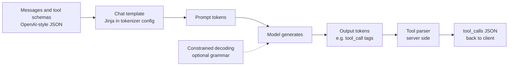
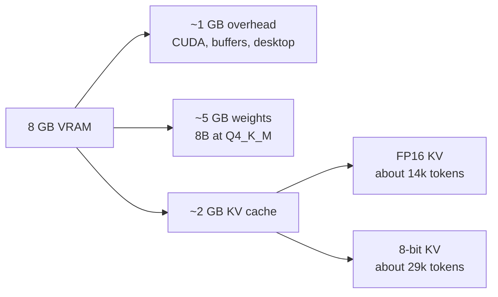
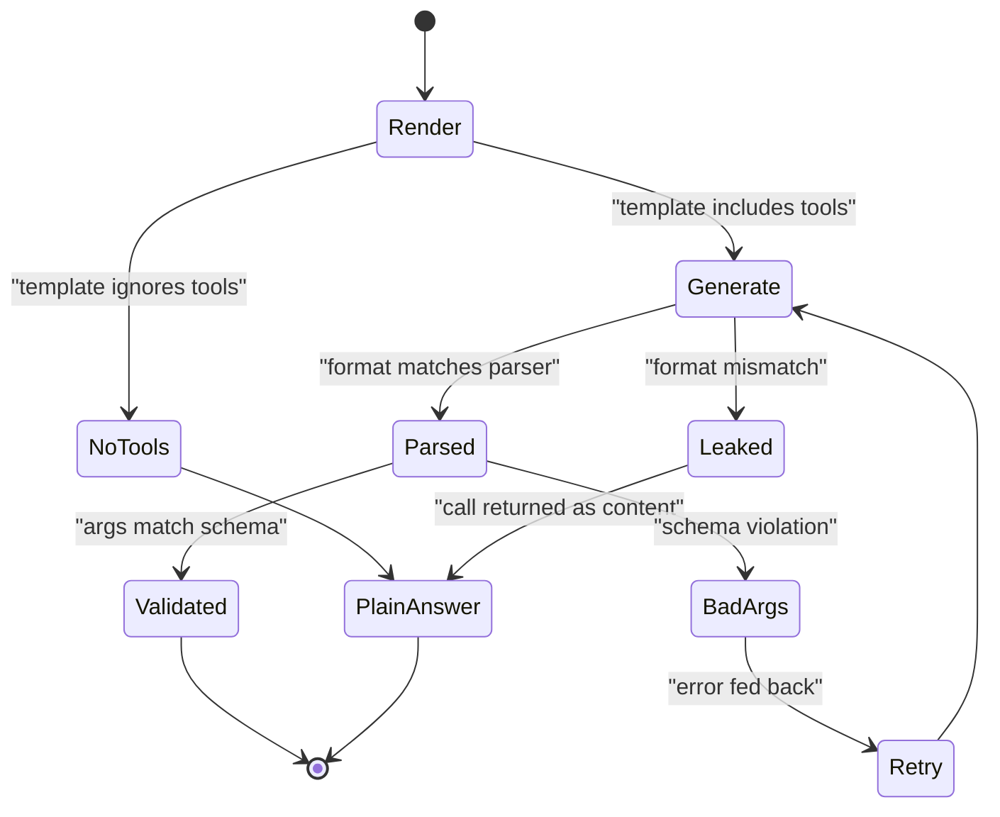
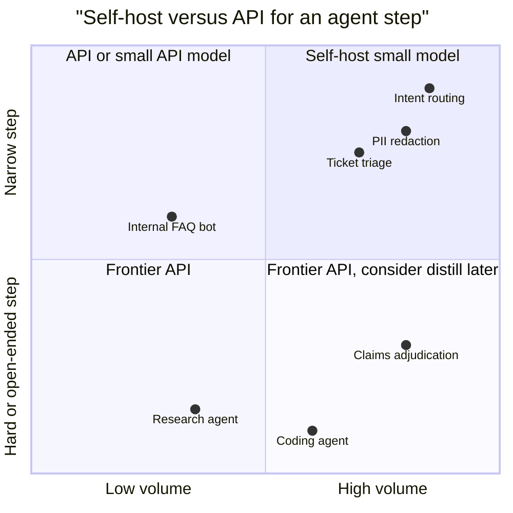
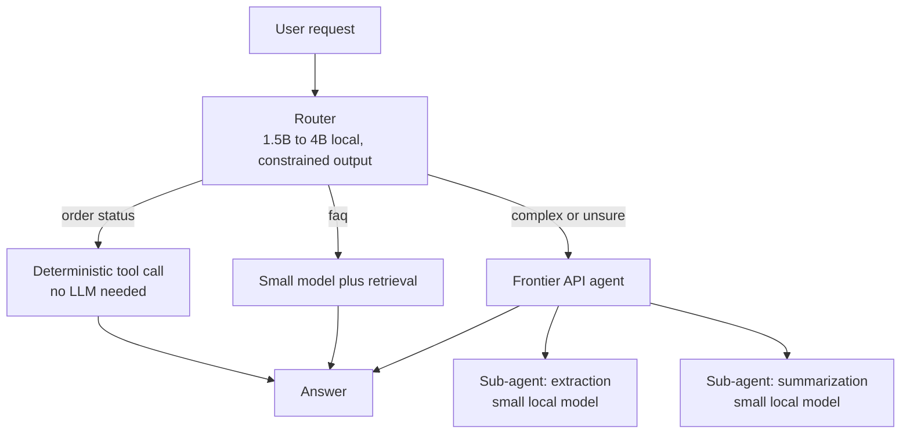
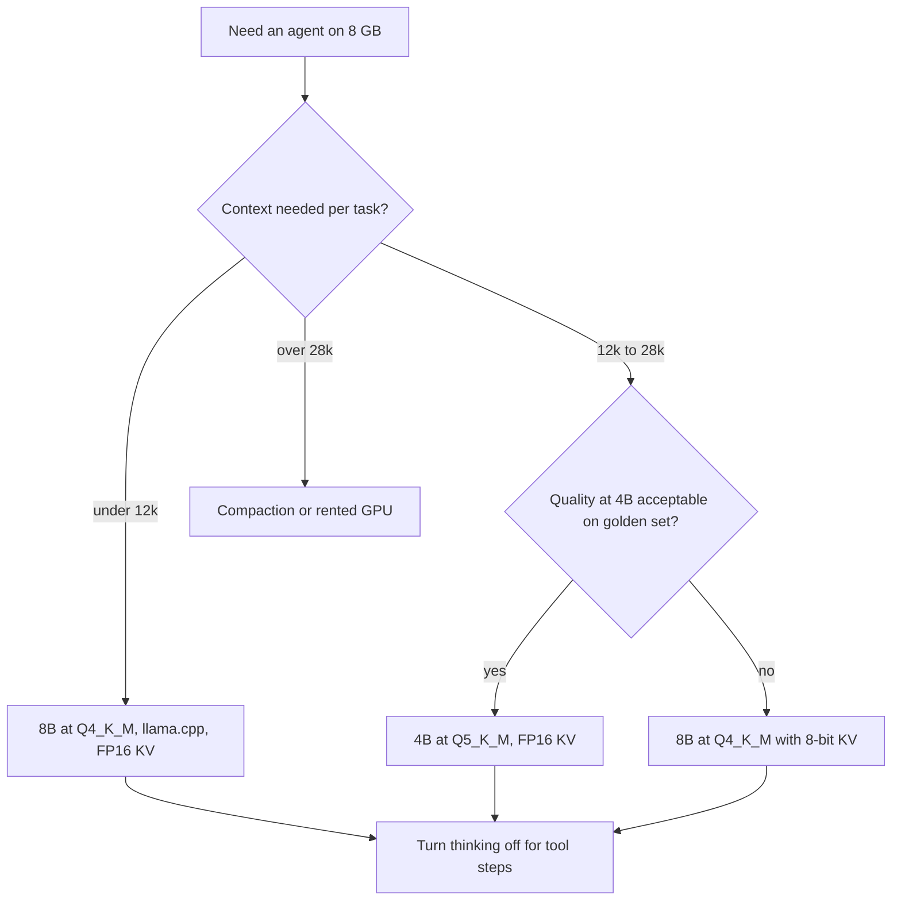
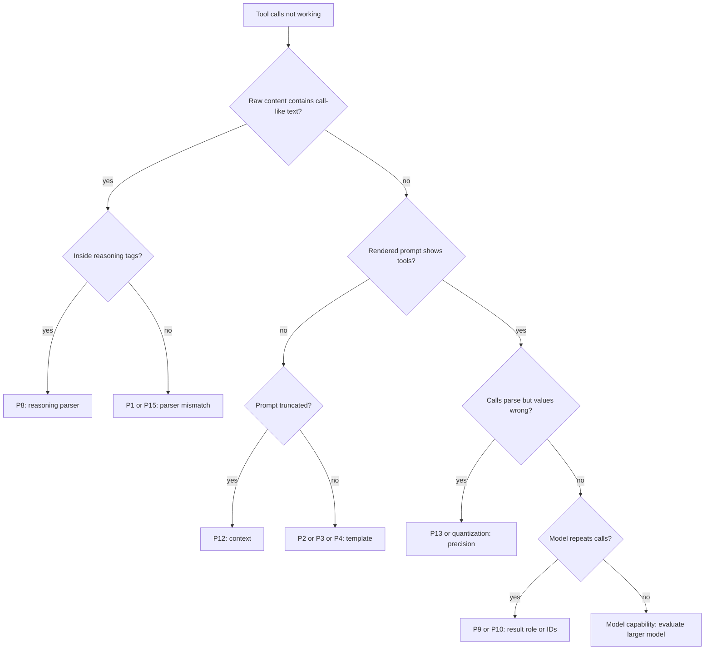
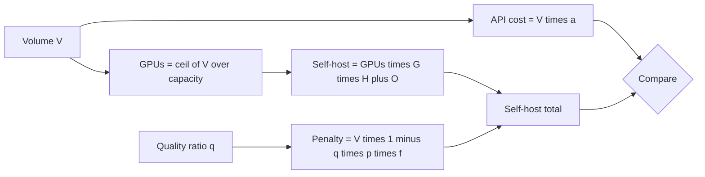

# Chapter 20: Open-Weight Models for Agents

> **What this chapter covers**: Which open-weight models are usable for tool calling and how to check that at the time you read this (BFCL and agentic benchmarks). How chat templates turn messages and tools into tokens and how tool parsers turn tokens back into calls in vLLM, SGLang, llama.cpp, and Ollama. Structured output backends (xgrammar, Outlines, guidance, llguidance, GBNF). Serving an agent on an 8 GB RTX 4060 with real VRAM arithmetic. When self-hosting beats APIs (data residency, cost at volume, latency). Small models as routers and sub-agents.
>
> **Prerequisites**: Chapters 1 (agent loop), 3 (tool calling and structured outputs), 24 (tool design), 18 (gateways and routing).
>
> **Where it is used**: Air-gapped or residency-bound customer deployments, high-volume narrow agents where API cost dominates, cheap routing and classification steps inside larger agents, and local development without an API bill.

---

## 20.1 Level 1: Foundations

### 20.1.1 What "good at tool use" means for an open model

A model is useful in an agent loop when it does five things reliably:

1. **Emits a parseable call**: the exact token format its template and parser expect, every time.
2. **Selects the right tool**: including choosing no tool when none fits (the hallucination or relevance test).
3. **Fills arguments correctly**: types, enums, required fields, values copied exactly from context.
4. **Uses results**: reads a tool response and continues, rather than repeating the call or ignoring it.
5. **Holds up over many turns**: state tracking across 10 to 50 steps without drifting.

Closed frontier APIs do all five well. Open models vary sharply, and the variation is often in items 1 and 5, not in reasoning. A model can score well on single-call benchmarks and still loop forever in a 20-step agent. That is why you need two kinds of evidence: function-calling benchmarks for items 1 to 3, and agentic benchmarks for items 4 and 5.

### 20.1.2 The three layers that must agree

Every open-weight tool-calling stack has three layers, and most failures are a mismatch between them:



- The **chat template** renders your `messages` and `tools` arrays into the exact text the model was trained on. It lives in the model's `tokenizer_config.json` or a separate `.jinja` file.
- The **model** emits a call in its trained format: Hermes-style `<tool_call>{json}</tool_call>`, Llama 3 JSON, Mistral `[TOOL_CALLS]`, pythonic `[func(a=1)]`, Qwen3-Coder XML, the gpt-oss harmony format, and others.
- The **tool parser** on the server recognizes that format and converts it back into OpenAI-compatible `tool_calls`.

If the template renders tools in a format the model did not see in training, accuracy drops. If the parser expects a different format than the model emits, you get tool calls returned as plain text content. Neither problem shows up as an error; both show up as a worse agent.

### 20.1.3 Why self-host at all

Three durable reasons, one situational:

- **Data residency and control**: the customer's data cannot leave their network or jurisdiction, or their regulator requires a model they can audit and pin.
- **Cost at volume**: for narrow, high-volume steps (classification, extraction, routing), a small self-hosted model can cost a fraction of an API call per step once utilization is high.
- **Latency and locality**: an on-premise or edge model avoids WAN round trips, and a small model gives very short time to first token.
- **Situational**: development without an API bill, which on an 8 GB laptop is the use you will exercise most.

The reasons that usually do not hold: "open models are as good as frontier APIs for long agent runs" (the gap narrowed through 2025 and 2026, and aggregator sites in September 2026 claim single-digit points on BFCL V4 overall, but multi-turn reliability gaps remain and must be measured on your task), and "self-hosting is cheaper" at low utilization (a GPU idle 90 percent of the time is expensive).

### 20.1.4 Vocabulary

| Term | Meaning |
| --- | --- |
| Open-weight | weights downloadable; license may restrict use (check Llama, Gemma, Qwen, and others individually) |
| Chat template | Jinja program that renders messages and tools into prompt text |
| Tool parser | server component that extracts calls from generated text |
| Constrained decoding | masking logits so only tokens valid under a grammar or schema can be sampled |
| GGUF | llama.cpp file format with quantized weights and embedded template |
| Q4_K_M, Q5_K_M, Q8_0 | llama.cpp quantization types; roughly 4.8, 5.7, and 8.5 bits per weight effective |
| AWQ, GPTQ | 4-bit weight quantization formats common in vLLM |
| FP8 | 8-bit float weights and optionally KV cache, supported on Ada GPUs (the 4060 is compute capability 8.9) |
| KV cache | stored attention keys and values per token; grows linearly with context |
| MoE, active parameters | mixture of experts; compute scales with active parameters, memory with total |

---

## 20.2 Level 2: Working knowledge

### 20.2.1 Choosing a model: how to read the evidence in September 2026

Leaderboards change monthly, so this section teaches the procedure and names only families.

**Step 1: the Berkeley Function Calling Leaderboard (BFCL).** BFCL V4 (the official page showed a last update of 12 April 2026 when checked in September 2026) scores single calls (non-live curated and live user-contributed), multi-turn with state, agentic tasks (web search, memory), and relevance or hallucination detection. It reports an overall score and per-category scores. Read the categories, not the overall:

- **Non-live and live AST**: can the model format a call. Most modern open models above 7B score well here.
- **Multi-turn**: the category that predicts agent behavior best. Open models historically trailed most here.
- **Irrelevance or hallucination**: does the model refrain from calling when no tool fits. Some fine-tuned tool models score high on calling and poorly here, which in production means spurious side effects.
- **Format sensitivity and prompt versus native FC mode**: BFCL tests some models in both a native function-calling mode and a prompt mode. Use the mode you will serve.

**Step 2: agentic benchmarks.** tau-bench and tau2-bench (simulated users with airline, retail, telecom domains, reporting pass^k), Terminal-Bench, SWE-bench Verified for coding agents. These catch the multi-step failures single-call benchmarks miss.

**Step 3: your own golden set.** Thirty to one hundred tasks from the customer's domain, with the customer's tool schemas. Nothing substitutes for it, because tool schema style (long enums, nested objects, many optional fields) changes rankings.

**Families to shortlist**, based on published BFCL and tau-bench results through 2025 and vendor reports in 2026 (verify current versions and scores before quoting): Qwen (Qwen3 dense 0.6B to 32B and MoE variants, strong tool use for size, Apache 2.0 for most sizes), GLM (Zhipu, strong agentic results in its 4.5 generation onward), Kimi K2 and successors (Moonshot, large MoE tuned for agents), DeepSeek V3 and successors (large MoE), gpt-oss (OpenAI, 20B and 120B MoE, Apache 2.0, harmony format), Llama 3.x and 4, Mistral and Devstral, and specialist tool-tuned models (Salesforce xLAM, ToolACE). In September 2026 several aggregator sites list newer versions of these families with scores I could not confirm on the official BFCL page; check the leaderboard directly.

**For an 8 GB laptop**, the practical shortlist is dense models from about 1.5B to 8B in 4-bit quantization: Qwen3 4B and 8B class, Llama 3.1 8B class, and small tool specialists. Large MoE models do not fit: an MoE's memory cost is its total parameters, not its active parameters.

### 20.2.2 Serving with vLLM

vLLM exposes an OpenAI-compatible server. Tool calling needs two flags (verified against the vLLM tool calling docs, September 2026):

```bash
vllm serve Qwen/Qwen3-4B-AWQ \
  --enable-auto-tool-choice \
  --tool-call-parser hermes \
  --max-model-len 16384 \
  --gpu-memory-utilization 0.90 \
  --kv-cache-dtype fp8
```

- `--enable-auto-tool-choice` lets the model decide when to call (`tool_choice: "auto"`).
- `--tool-call-parser` names the parser. The docs list many: `hermes` (also used for Qwen2.5 and Qwen3 dense), `llama3_json`, `mistral`, `pythonic`, `qwen3_xml`, `deepseek_v3`, `deepseek_v31`, `kimi_k2`, `glm45`, `openai` (gpt-oss), `xlam`, and more.
- `--chat-template` overrides the template when the one shipped with the model lacks tool support or has a bug.
- `--tool-parser-plugin` registers a custom parser you wrote.

With `tool_choice: "required"` or a named function, vLLM uses structured outputs to force the call to match the tool's JSON schema. With `auto`, the parser extracts whatever the model emitted, and a malformed call becomes content. That asymmetry matters: `auto` is where open models fail silently.

### 20.2.3 Serving with SGLang

SGLang uses the same idea with `--tool-call-parser` at launch. Its parser list (SGLang docs, September 2026) includes `llama3`, `llama4`, `mistral`, `qwen`, `qwen3_coder`, `deepseekv3`, `deepseekv31`, `deepseekv32`, `glm`, `kimi_k2`, `gpt-oss`, `pythonic`, and others. SGLang's strengths for agents are RadixAttention (automatic prefix caching across requests that share a system prompt and tool list, which agent loops do heavily) and fast constrained decoding through xgrammar. Named `tool_choice` and `required` are enforced with the grammar backend.

### 20.2.4 Serving with llama.cpp

`llama-server` enables tool calling with `--jinja`, which makes it execute the model's Jinja chat template instead of a built-in approximation:

```bash
llama-server -m qwen3-8b-q4_k_m.gguf --jinja -fa \
  -c 16384 -ngl 99 --port 8080
```

The llama.cpp function calling doc (checked September 2026) describes native format handlers for families such as Llama 3.x, Hermes, Qwen 2.5, Mistral Nemo, Functionary, and Command R7B, and a **generic** fallback for unrecognized templates that works but uses more tokens. You can override the template with `--chat-template-file`. Check `GET /props` to see which template was loaded. The same doc warns that extreme KV cache quantization (for example `-ctk q4_0`) substantially degrades tool calling. llama.cpp also supports GBNF grammars and a `json_schema` field for constrained output.

### 20.2.5 Serving with Ollama

Ollama wraps llama.cpp with a model registry. Tool calling works through `/api/chat` with a `tools` array and through its OpenAI-compatible `/v1/chat/completions`. Models that support tools carry a "tools" capability tag in the library. Ollama's `format` field accepts a JSON schema for structured output. Two practical traps:

- **Context length**: Ollama's default context window is small relative to agent needs (it has changed across versions; check the current default). An agent with 8 tools and a few turns can exceed it, and older turns are silently truncated. Set `num_ctx` explicitly in a Modelfile or request options.
- **Template drift**: Ollama ships its own Go-template version of each model's chat template. It usually matches, but when a model's upstream Jinja template is updated, the Ollama version may lag.

### 20.2.6 Structured output backends

Constrained decoding makes invalid output impossible by masking tokens at each step. The backends you will meet:

| Backend | Approach | Where used |
| --- | --- | --- |
| xgrammar | pushdown automaton over a context-free grammar, with precomputed token masks for context-independent tokens | vLLM, SGLang, TensorRT-LLM |
| Outlines | finite-state machine compiled from regex or JSON schema; the original index-based method | vLLM backend, standalone library |
| guidance and llguidance | Earley-style parser in Rust with lazy mask computation | vLLM backend, llama.cpp option |
| lm-format-enforcer | character-level parser, Python `re` for regex | vLLM backend |
| GBNF | llama.cpp's grammar format; JSON schemas are converted to it | llama.cpp, Ollama |

vLLM selects the backend with `--structured-outputs-config.backend`, default `auto`, which picks per request (vLLM docs, September 2026). Backends differ in which JSON Schema features they support (`pattern`, `minItems`, recursive `$ref`, `oneOf`) and in first-request compile latency for large schemas.

### 20.2.7 Worked example: a local agent on the 4060

Target: the reference support agent (3 tools, memory, one approval gate) running entirely locally for development.

1. Model: a Qwen3 8B class model in Q4_K_M GGUF, about 5.0 GB of weights.
2. Server: `llama-server --jinja -fa -c 12288 -ngl 99`, fp16 KV cache.
3. Client: LangGraph with `ChatOpenAI(base_url="http://localhost:8080/v1")`, tools bound as usual.
4. Evaluation: the same 40-task golden set used for the API model, with pass^3.

Illustrative results from this kind of setup (your numbers will differ; measure): the API model at 0.90 pass@1 and 0.80 pass^3, the local 8B model at 0.75 pass@1 and 0.55 pass^3. The drop from pass@1 to pass^3 is larger for the small model. That gap is the signature of multi-turn unreliability, and it is the number to show a customer who asks whether a local model is "good enough".

---

## 20.3 Level 3: Depth

### 20.3.1 VRAM arithmetic on an 8 GB card

Memory has three parts: weights, KV cache, and overhead (CUDA context, activations, framework buffers, about 0.7 to 1.2 GB in practice on consumer cards).

**Weights.** Bytes = parameters × bits per weight / 8.

| Model size | FP16 | Q8_0 (~8.5 bpw) | Q5_K_M (~5.7 bpw) | Q4_K_M (~4.8 bpw) |
| --- | --- | --- | --- | --- |
| 1.7B | 3.4 GB | 1.8 GB | 1.2 GB | 1.0 GB |
| 4B | 8.0 GB | 4.3 GB | 2.9 GB | 2.4 GB |
| 8B | 16.0 GB | 8.5 GB | 5.7 GB | 4.8 GB |
| 14B | 28.0 GB | 14.9 GB | 10.0 GB | 8.4 GB |

(Q4_K_M files are often a little larger than the formula because embedding and output layers stay at higher precision; an 8B Q4_K_M GGUF is typically about 4.9 to 5.0 GB.)

**KV cache per token** = 2 (K and V) × layers × KV heads × head dimension × bytes per element.

For a Qwen3 8B class config (36 layers, 8 KV heads with grouped-query attention, head dimension 128), in FP16:

2 × 36 × 8 × 128 × 2 bytes = 147,456 bytes, about 144 KiB per token.

- 8,192 tokens: 1.13 GiB
- 16,384 tokens: 2.25 GiB
- 32,768 tokens: 4.5 GiB

For a Llama 3.1 8B config (32 layers, 8 KV heads, head dimension 128) it is 128 KiB per token, so 16,384 tokens cost 2.0 GiB.

**Budget for Qwen3 8B class Q4_K_M on 8 GB:** 8.0 − 1.0 overhead − 5.0 weights = 2.0 GB for KV. At 144 KiB per token that is about 14,500 tokens of context in FP16. With an 8-bit KV cache (`--kv-cache-dtype fp8` in vLLM, `-ctk q8_0 -ctv q8_0` in llama.cpp), about 29,000 tokens. The 4060's 8 GB is also shared with the Windows desktop through WSL2, so leave headroom.



**Is 14,000 tokens enough for an agent?** Count: system prompt 800 tokens, 8 tool schemas at 150 tokens each (1,200), and each turn of user message, reasoning, call, and result averaging 600 tokens. That is 2,000 fixed plus 600 per turn, so 20 turns fit in 14,000. A research agent pasting 3,000-token web pages fits only 4 pages. Context compaction (Chapter 6) is not optional locally.

**Alternatives when it does not fit:** a 4B model at Q5_K_M (2.9 GB) leaves about 4 GB for KV, roughly 28,000 FP16 tokens; or partial CPU offload in llama.cpp (`-ngl` below the layer count), which on a 13950HX with DDR5 works but drops generation speed several-fold for the offloaded layers.

### 20.3.2 Throughput and latency on the laptop

Decode on a single sequence is memory-bandwidth bound. The RTX 4060 Laptop GPU has about 256 GB/s of memory bandwidth (128-bit bus; check your exact SKU's memory clock). Each generated token reads all weights once:

- 8B at Q4_K_M, 5.0 GB: upper bound 256 / 5.0 ≈ 51 tokens per second. Real-world is typically 60 to 80 percent of the bound, so 30 to 40 tokens per second.
- 4B at Q4_K_M, 2.4 GB: upper bound about 107 tokens per second, real 65 to 85.

An agent turn that emits 150 tokens of reasoning and a call takes about 4 to 5 seconds on the 8B model plus prefill. Prefill of a 6,000-token prompt runs much faster (compute bound, typically thousands of tokens per second on this card), but without prefix caching it repeats every turn. Enable prefix caching (vLLM does this by default in recent versions; llama.cpp reuses the cached prefix for a slot) so that each turn only prefills the new tokens.

Latency for a 12-step agent task: 12 × (0.3 s prefill of new tokens + 4.5 s decode + tool time). Without tools, about 58 seconds. The same task on a frontier API with 80 tokens per second decode and 0.6 s time to first token would be about 12 × (0.6 + 1.9) = 30 seconds. Local is not automatically faster; it is faster only for small models or short outputs.

### 20.3.3 Chat template failure modes

Templates are code, and they have bugs. The recurring ones:

1. **Tools not rendered.** The template has no branch for the `tools` variable, so the model never sees the schemas and answers from its own knowledge. Test: render a prompt with `tokenizer.apply_chat_template(messages, tools=tools, tokenize=False)` and read it.
2. **Tool results in the wrong role.** Some templates expect `role: "tool"` with `tool_call_id`, some `role: "ipython"`, some fold results into a user turn. A mismatch confuses the model about what it said versus what the tool said.
3. **Reasoning content handling.** Hybrid reasoning models (Qwen3 with thinking on or off, gpt-oss with reasoning levels) expect previous turns' reasoning to be stripped or kept according to a rule. Keeping it everywhere inflates context; stripping it wrongly can break the model's continuation.
4. **BOS or special token duplication.** The template adds a BOS token and the server adds another. Small, but it shifts outputs.
5. **Parallel calls.** The template or parser supports only one call per turn, so a model that emits two calls has the second silently dropped.



Every arrow into `PlainAnswer` is a silent failure. Add a monitor: the fraction of turns where the content contains text resembling a tool call (for example `<tool_call>` or `{"name":`) but `tool_calls` is empty. A non-zero rate means a parser or template mismatch.

### 20.3.4 Constrained decoding: what it guarantees and what it costs

Constrained decoding guarantees syntax, not semantics. The JSON will parse and match the schema; the `order_id` may still be invented. Three deeper issues:

- **Distribution distortion.** Masking tokens renormalizes the probability over allowed tokens. If the model "wanted" to write prose and the grammar forces JSON, you get valid JSON of a low-quality answer. Research on grammar-constrained decoding (for example the "Let Me Speak Freely?" study, 2024) reported reasoning quality drops under strict formats in some tasks; others found negligible effects with good prompts. The safe pattern: let the model reason in free text first, then constrain only the final call.
- **Tokenization boundary effects.** A grammar that forbids a token that would have spanned a boundary (for example a token containing `"}` together) forces the model into unusual tokenizations. Mature backends handle this, but custom GBNF grammars can trigger it.
- **Compile latency.** Large schemas with many optional fields or deep nesting can take hundreds of milliseconds to compile on the first request. xgrammar and llguidance cache compiled grammars; a new tool list per request defeats the cache.

For tool calling with `tool_choice: "auto"`, the server cannot constrain from the first token because the model may choose to answer in text. Backends that support "triggered" grammars switch into constrained mode when the model emits the tool-call start tag. Check whether your server does this for your model; if not, `auto` calls are unconstrained.

### 20.3.5 Quantization and tool-calling accuracy

Tool calling is more sensitive to quantization than chat quality, because a single wrong token in an argument value (an ID, an enum member) fails the call. Rules of thumb that hold across community evaluations, but should be verified on your set:

- 8-bit weights (Q8_0, FP8): typically indistinguishable from FP16 on tool calling.
- 5 to 6 bit (Q5_K_M, Q6_K): small losses, usually acceptable.
- 4-bit (Q4_K_M, AWQ, GPTQ): measurable losses on long argument copying and multi-turn tasks for small models; larger models tolerate it better.
- Below 4 bits: avoid for tool use on models under about 14B.
- KV cache at 8 bits: usually fine. At 4 bits: the llama.cpp docs specifically warn it degrades tool calling.

The measurement protocol: run your golden set on FP16 (on Kaggle T4s if it does not fit locally), then on each quantization, and compare paired per-task outcomes with a bootstrap interval on the difference. An unpaired comparison of two means on 40 tasks has intervals too wide to detect a 5-point drop.

---

## 20.4 Level 4: Mastery

### 20.4.1 When self-hosting beats APIs

Make the decision on four axes, not on a single cost comparison.



**Data residency.** This axis is binary and overrides the others. If data cannot leave a jurisdiction or network, you self-host or use a cloud region with the right contractual terms (Chapter 19). Note that major clouds host open models in-region (Bedrock, Vertex, Foundry), which gives residency without running GPUs.

**Cost at volume.** Worked break-even with illustrative prices (check current prices; these are round numbers for the arithmetic):

- Step: routing classifier, 1,500 input tokens and 20 output tokens.
- Small API model at 0.10 per million input and 0.40 per million output: 1,500 × 0.10/1e6 + 20 × 0.40/1e6 = 0.000150 + 0.000008 = 0.000158 per call.
- Self-hosted 4B model on one L4-class GPU rented at 0.80 per hour. With batching, prefill-dominated classification at, say, 40 requests per second sustained (measure this for your model and prompt; it depends heavily on prompt length and prefix cache hits): 144,000 requests per hour, 0.80 / 144,000 = 0.0000056 per call.
- At full utilization self-hosting is about 28 times cheaper. At 5 percent utilization (7,200 requests per hour on an always-on GPU), the cost is 0.000111 per call, still slightly cheaper but now close, and before counting engineering time.
- Add one engineer-week a month for operations at a loaded 4,000: at 1 million calls a month the API costs 158, self-hosting costs 576 in GPU plus 4,000 in labor. At 500 million calls a month the API costs 79,000, self-hosting about 3,500 in GPU (at high utilization) plus 4,000 in labor.

The break-even here is roughly 50 million calls a month. The general form: self-hosting wins when volume × (API cost per call − GPU cost per call at your real utilization) exceeds operations cost. Utilization is the variable teams get wrong.

**Latency.** Self-hosting a small model wins time to first token (tens of milliseconds on a local GPU versus hundreds over the internet) and wins for short outputs. Frontier APIs win on decode speed for large models, because providers run them on hardware you do not have.

**Capability.** For long, open-ended agent loops, frontier APIs still lead in multi-turn reliability as of September 2026 on most public agentic benchmarks. Check the current tau-bench and BFCL multi-turn columns before claiming otherwise.

### 20.4.2 Small models as routers and sub-agents

The most reliable production use of small open models is not as the main agent. It is inside a larger system, at narrow steps:



Design rules:

1. **Constrain router output** to an enum with a confidence field, using structured output. A router that can emit free text will eventually emit a label you did not define.
2. **Route "unsure" up.** Calibrate a threshold on a labeled set so that the cheap path handles only what it handles well. Chapter 18 covers cascades; the threshold is a product decision with a measured error cost.
3. **Give sub-agents one job and a small tool set.** A 4B model with two tools and a 2,000-token context is far more reliable than the same model with 12 tools.
4. **Fine-tune when the step is stable.** A router or extractor with a fixed label set is the ideal target for a LoRA fine-tune on a few thousand examples, which on the 4060 is feasible with QLoRA at 1.5B to 4B. Distilling from frontier model outputs is common; check the frontier provider's terms on using outputs for training.
5. **Measure end to end.** A router with 95 percent accuracy that misroutes hard requests to the cheap path can reduce overall task success more than it saves. Report cost per successful task, not cost per call.

Worked example: 100,000 requests a day, frontier agent cost 0.04 per task, success 0.88. A local router sends 55 percent to a small-model path costing 0.002 with success 0.86 on those requests, and 45 percent to the frontier path with success 0.90 on the harder remainder. Cost: 55,000 × 0.002 + 45,000 × 0.04 = 110 + 1,800 = 1,910 per day versus 4,000. Success: 0.55 × 0.86 + 0.45 × 0.90 = 0.473 + 0.405 = 0.878, a 0.2-point drop inside most confidence intervals. The design saves 52 percent. Verify with a paired evaluation before claiming it.

### 20.4.3 Production serving decisions

| Decision | Laptop development | Single-node production | Multi-tenant production |
| --- | --- | --- | --- |
| Engine | llama.cpp or Ollama | vLLM or SGLang | vLLM or SGLang behind a gateway |
| Format | GGUF Q4_K_M or Q5_K_M | AWQ, GPTQ, or FP8 | FP8 or BF16 on larger GPUs |
| Structured output | GBNF or json_schema | xgrammar via auto | xgrammar or llguidance, cached grammars |
| Prefix caching | slot reuse | on | on, route by prefix hash |
| Multi-LoRA | not needed | optional | serve per-tenant adapters on one base |
| Observability | logs | Prometheus metrics, OTel traces | plus per-tenant quotas and cost |

Edge cases senior engineers check:

- **Pin the template.** Store the exact chat template file in the repo and pass it explicitly. A model repo update can change the template under you.
- **Pin the parser to the model version.** A new model release in the same family can change the tool format (Qwen3 dense uses Hermes-style tags; Qwen3-Coder uses an XML format with its own parser).
- **Reasoning tokens count against context and latency.** Hybrid reasoning models can emit thousands of thinking tokens. For router and sub-agent steps, turn thinking off or cap it.
- **Parallel tool calls.** Confirm the model, template, and parser all support them before enabling them in the framework.
- **License.** Some open-weight licenses restrict use above a monthly active user threshold or in specific fields. Check the model card and license file for the customer's use.

### 20.4.4 Where practitioners disagree

- **Constrained decoding for everything versus only for the final call.** Some teams constrain every output; others let the model reason freely and constrain only the call. The evidence is mixed and model-dependent; test both on your golden set.
- **Leaderboards.** BFCL is the standard, but critics note that its schemas are simpler than enterprise APIs and that fine-tuning on similar data inflates scores. Agentic benchmarks with simulated users (tau-bench) are closer to production but noisier. Use both and trust your own set more.
- **Small fine-tuned specialists versus general models.** Tool-specialist models can top single-call categories but generalize poorly to new schemas and have weak irrelevance detection. General instruction models of the same size are often more robust. Evaluate on schemas the model has not seen.
- **Self-hosted cost claims.** Vendor and blog break-even analyses often assume 100 percent utilization and zero operations cost. Ask for the utilization assumption first.

---

### 20.4.5 VRAM and throughput for model and quantization pairs on 8 GB

This section extends 20.3.1 into a sizing table you can reuse. It uses the same method throughout, so you can recompute it for any model card.

**Method.**

1. Weights (GB) = parameters (billions) × effective bits per weight / 8. Add about 5 percent for embeddings and output layers kept at higher precision in GGUF files.
2. KV per token (bytes) = 2 × layers × KV heads × head dim × bytes per element (2 for FP16, 1 for 8-bit).
3. Budget = 8.0 GB − overhead − weights. Use 1.0 GB overhead under WSL2 with a desktop running; 0.7 GB if the laptop display runs on the integrated GPU.
4. Max context = budget / KV per token. Cap at the model's trained context.
5. Decode ceiling (tokens/s) = bandwidth / weights in GB, with bandwidth about 256 GB/s. Expect 60 to 80 percent of the ceiling in practice.

The architecture figures below are representative of each size class (grouped-query attention with 8 KV heads is common in 2025 and 2026 dense models). Read the exact `num_hidden_layers`, `num_key_value_heads`, and `head_dim` from the model's `config.json` before trusting a row.

**Architecture assumptions.**

| Class | Layers | KV heads | Head dim | KV per token FP16 | KV per token 8-bit |
| --- | --- | --- | --- | --- | --- |
| 1.5B to 1.7B | 28 | 8 | 128 | 112 KiB | 56 KiB |
| 3B to 4B | 36 | 8 | 128 | 144 KiB | 72 KiB |
| 7B to 8B (Llama-like) | 32 | 8 | 128 | 128 KiB | 64 KiB |
| 7B to 8B (Qwen3-like) | 36 | 8 | 128 | 144 KiB | 72 KiB |
| 14B | 40 | 8 | 128 | 160 KiB | 80 KiB |

(Check one row: 2 × 28 × 8 × 128 × 2 = 114,688 bytes = 112 KiB.)

**Sizing table, 8 GB card, 1.0 GB overhead.**

| Model and quant | Weights | KV budget | Max context FP16 KV | Max context 8-bit KV | Decode ceiling | Expected decode |
| --- | --- | --- | --- | --- | --- | --- |
| 1.7B Q8_0 | 1.9 GB | 5.1 GB | about 47,000 | about 95,000 (cap at trained max) | 135 tok/s | 80 to 110 |
| 1.7B BF16 | 3.6 GB | 3.4 GB | about 31,000 | about 63,000 | 71 tok/s | 45 to 55 |
| 4B Q4_K_M | 2.5 GB | 4.5 GB | about 32,000 | about 65,000 | 102 tok/s | 65 to 80 |
| 4B Q5_K_M | 3.0 GB | 4.0 GB | about 29,000 | about 58,000 | 85 tok/s | 55 to 68 |
| 4B Q8_0 | 4.5 GB | 2.5 GB | about 18,000 | about 36,000 | 57 tok/s | 35 to 45 |
| 8B Llama-like Q4_K_M | 5.0 GB | 2.0 GB | about 16,000 | about 32,000 | 51 tok/s | 30 to 40 |
| 8B Qwen3-like Q4_K_M | 5.0 GB | 2.0 GB | about 14,500 | about 29,000 | 51 tok/s | 30 to 40 |
| 8B Qwen3-like Q5_K_M | 6.0 GB | 1.0 GB | about 7,300 | about 14,500 | 43 tok/s | 26 to 34 |
| 8B AWQ 4-bit (vLLM) | 5.4 GB | about 1.1 GB after vLLM reserves | about 8,000 | about 16,000 | 47 tok/s | 28 to 36 |
| 14B Q4_K_M | 8.8 GB | negative | does not fit | does not fit | not applicable | offload only |
| 14B Q3_K_M | 7.0 GB | about 0 | does not fit usefully | does not fit usefully | not applicable | offload only |

Worked row, 4B Q5_K_M: 4 × 5.7 / 8 = 2.85 GB, plus 5 percent is 3.0 GB. Budget 8.0 − 1.0 − 3.0 = 4.0 GB = 4,194,304 KiB. At 144 KiB per token: 29,127 tokens. Decode ceiling 256 / 3.0 = 85 tokens per second.

Notes on the table:

- **vLLM is less memory-frugal than llama.cpp on a small card.** vLLM pre-allocates KV cache blocks up to `--gpu-memory-utilization` and reserves memory for CUDA graphs and sampling. On 8 GB, a 4B AWQ model with `--max-model-len 16384` is comfortable; an 8B AWQ often needs `--max-model-len` of 8,192 or less and `--enforce-eager` to skip CUDA graph memory. llama.cpp is usually the better local engine for 8B; vLLM is better for 4B and below when you want batching.
- **14B does not fit.** With partial offload in llama.cpp (say 30 of 40 layers on GPU), decode drops to single-digit to low teens tokens per second because CPU layers run at DDR5 bandwidth, around 60 to 80 GB/s on this laptop class. Use Kaggle or a rented GPU for 14B evaluation.
- **Batching changes throughput, not the ceiling per sequence.** With 4 concurrent sequences on a 4B model, total throughput can approach 3 times single-sequence, but KV cache is shared across sequences, so each gets a quarter of the context budget.
- **Prefill.** Prompt processing on the 4060 runs in the low thousands of tokens per second for 4B to 8B at 4-bit (measure with `llama-bench`). A 6,000-token first turn costs 2 to 4 seconds; later turns cost only their new tokens if prefix caching works.

**Agent-level latency by configuration.** A 12-turn task, 150 output tokens per turn, 500 new prompt tokens per turn after the first, first turn 3,000 tokens, prefill at 2,000 tokens per second:

| Configuration | Decode per turn | Prefill total | Total model time |
| --- | --- | --- | --- |
| 4B Q4_K_M at 72 tok/s | 2.1 s | 1.5 + 11 × 0.25 = 4.25 s | 12 × 2.1 + 4.25 = 29.5 s |
| 8B Q4_K_M at 35 tok/s | 4.3 s | 4.25 s (same token counts, slower prefill in practice) | 12 × 4.3 + 4.25 = 55.9 s |
| 8B Q4_K_M, thinking on, 600 tokens per turn | 17.1 s | 4.25 s | 12 × 17.1 + 4.25 = 209.5 s |

The last row is why reasoning mode must be controlled per step on a laptop. Thinking tokens quadruple latency here, and they also consume the scarce KV budget: 12 turns × 600 tokens = 7,200 tokens of reasoning if the template keeps it in history.



### 20.4.6 Tool-parser failure catalogue

These are the failures you will see when running open models behind OpenAI-compatible servers. Each entry has a symptom, the check that confirms it, and the fix. Use it as a debugging runbook.

| No. | Failure | Symptom | Confirming check | Fix |
| --- | --- | --- | --- | --- |
| P1 | Wrong parser for model family | `tool_calls` empty; content contains `<tool_call>` or `[TOOL_CALLS]` | inspect raw content; compare to model card format | set the matching `--tool-call-parser` |
| P2 | Template has no tools branch | model answers without calling; never mentions tools | render prompt with `apply_chat_template(..., tools=...)`; tools absent | pass a tool-aware `--chat-template` file |
| P3 | llama.cpp without `--jinja` | calls appear rarely or in odd formats | `/props` shows built-in template, not the model's | restart with `--jinja` |
| P4 | Ollama template lag | works upstream in vLLM, fails in Ollama | diff Ollama Modelfile template with upstream Jinja | update Ollama model, or supply a custom Modelfile template |
| P5 | Parallel calls dropped | only the first of several calls executes | raw output contains two call blocks; response has one | use a parser and template supporting parallel calls, or disable parallel calls in the framework |
| P6 | Streaming parse breaks | non-streaming works, streaming yields partial or garbled arguments | compare stream and non-stream on same prompt with temperature 0 | update server version; disable streaming for tool turns |
| P7 | JSON in arguments double-encoded | `arguments` is a string containing escaped JSON inside a string | `json.loads` twice succeeds | fix in parser or client normalization; report upstream |
| P8 | Reasoning text swallows the call | call emitted inside thinking block and never parsed | raw output shows call inside reasoning tags | enable the server's reasoning parser so reasoning is separated before tool parsing; or turn thinking off |
| P9 | Tool result role mismatch | model repeats the call as if it never got the result | render prompt; result shown as user text or missing | send `role: "tool"` with correct `tool_call_id`, or use the role the template expects |
| P10 | Missing `tool_call_id` linkage | model confuses which result belongs to which call | multiple calls; results lack IDs in rendered prompt | preserve IDs from the server; some templates need them in the content |
| P11 | Schema features unsupported by grammar backend | server error or ignored constraint on `pattern`, `oneOf`, recursive refs | test schema directly against backend | simplify schema, or choose another backend |
| P12 | Context truncation removes tool schemas | model stops calling tools late in a conversation | token count of rendered prompt exceeds context; server truncates left | set context explicitly; compact history; keep tools in system prefix |
| P13 | KV cache over-quantized | arguments contain small copying errors (wrong digits in IDs) | compare 4-bit KV to 8-bit KV on same prompts | use 8-bit or FP16 KV |
| P14 | Stop tokens misconfigured | generation continues past the call and invents a tool result | raw output contains a fake `<tool_response>` | use the template's stop tokens; update `generation_config.json` handling |
| P15 | Model version format change | upgrade breaks all calls | model card changed tool format (for example coder variants using XML) | pin model revision and parser together |



**Monitoring that catches these in production.** Three counters cover most of the catalogue:

1. `leaked_call_rate`: fraction of assistant turns where content matches a call-syntax regex and `tool_calls` is empty (P1, P3, P4, P8, P15).
2. `repeat_call_rate`: fraction of tool calls identical in name and arguments to a call earlier in the same session (P9, P10, and loops).
3. `schema_violation_rate`: fraction of tool calls whose arguments fail JSON Schema validation in the tool server (P7, P11, P13).

Alert on a step change in any of them after a deploy, model update, or server upgrade.

### 20.4.7 A break-even model for self-hosting versus an API

The arithmetic in 20.4.1 generalizes to a small model you can put in a spreadsheet. The variables:

| Symbol | Meaning | Example value |
| --- | --- | --- |
| V | calls per month | varies |
| a | API cost per call | 0.000158 |
| G | GPU cost per hour, all-in (rental or amortized purchase plus power) | 0.80 |
| R | sustained requests per second at acceptable latency, measured | 40 |
| u | average utilization (fraction of capacity used) | varies |
| H | hours the GPU is provisioned per month | 730 |
| O | operations cost per month (people, monitoring, on-call) | 4,000 |
| q | quality ratio: self-hosted success divided by API success | 0.97 |
| f | cost of a failed task (rework, escalation) | 0.05 |

**Self-hosted cost per month** = N_gpu × G × H + O, where N_gpu = ceil(V / (R × 3,600 × H × u_max)) and u_max is the utilization you can run at while meeting latency (often 0.5 to 0.7 because traffic is bursty).

**API cost per month** = V × a.

**Quality adjustment.** If the self-hosted model fails more often, add V × (1 − q) × p × f, where p is the API success rate. This term is omitted in most published break-even analyses and it frequently decides the answer.

**Worked example.** Routing step, V = 50 million calls a month, a = 0.000158, R = 40, u_max = 0.6, G = 0.80, O = 4,000, q = 0.97, p = 0.95, f = 0.05.

- Capacity per GPU per month at u_max: 40 × 3,600 × 730 × 0.6 = 63.07 million calls. N_gpu = 1.
- Self-hosted: 1 × 0.80 × 730 + 4,000 = 584 + 4,000 = 4,584.
- Quality penalty: 50,000,000 × 0.03 × 0.95 × 0.05 = 71,250. That is not a typo: a 3 percent relative drop in success, at 0.05 per failure, costs far more than the GPU.
- API: 50,000,000 × 0.000158 = 7,900.

Self-hosting loses decisively once quality is priced in, unless the failure cost is lower or the quality gap is closed (for example by fine-tuning the router until q is about 1.00). Rework it with q = 0.998: penalty = 50,000,000 × 0.002 × 0.95 × 0.05 = 4,750, self-hosted total 9,334 versus API 7,900, still a loss. With q = 1.0: 4,584 versus 7,900, a win.

**Break-even volume ignoring quality** is where V × a = G × H × N_gpu + O. With one GPU: V = (584 + 4,000) / 0.000158 = 29 million calls a month. Above 63 million you need a second GPU, and the curve steps.



**Sensitivity, in order of how often they flip the decision:**

1. **Quality ratio q and failure cost f.** Measure q with a paired evaluation. If you cannot bound it within about 1 point, you cannot make the decision on cost.
2. **Operations cost O.** A team that already runs GPU inference in production has a small marginal O; a team starting from zero should budget at least one engineer's partial time plus on-call.
3. **Utilization.** Bursty traffic with strict latency forces low u_max. Batch or asynchronous workloads can run near 0.9.
4. **API price trend.** API prices for a given capability level have fallen repeatedly. A break-even computed today at current prices may reverse in a year. Model the next price cut explicitly.
5. **Data residency.** If required, the API option may be unavailable or available only through a regional cloud endpoint at a different price. Then the comparison is between self-hosting and that endpoint, not the public API.

**What to present to a customer.** A one-page table: V, a, measured R, u_max, O, measured q with its interval, the resulting monthly costs with and without the quality term, and the volume at which the decision flips. Customers accept a recommendation to keep the API when they can see the quality term; they rarely accept it from a GPU-only comparison.

### 20.4.8 A reproducible local evaluation protocol

The sizing table and the break-even model both depend on measured numbers: throughput R, quality ratio q, and the context your tasks actually need. This is the protocol for measuring them on the 4060 so the numbers survive a customer's scrutiny.

**Fix everything that can drift.**

| Item | How to pin it |
| --- | --- |
| Model weights | Hugging Face revision hash, or the GGUF file's SHA-256 |
| Chat template | the `.jinja` file committed in the repo and passed explicitly |
| Parser | server flag recorded in the run config |
| Server version | vLLM, SGLang, or llama.cpp version or commit, recorded |
| Sampling | temperature, top_p, max tokens, seed where supported |
| Context length | explicit `--max-model-len`, `-c`, or `num_ctx` |
| KV cache dtype | explicit flag |
| Thinking mode | explicit on or off per step |

**Measure throughput under the agent's real shape.** Synthetic benchmarks with 128-token prompts overstate throughput for agents. Replay 200 recorded agent turns (real prompt lengths, real output lengths) against the server at concurrency 1, 2, 4, and 8. Record p50 and p95 time to first token and decode tokens per second. R is the highest concurrency whose p95 latency meets the step's budget.

**Measure quality with pairing.** Run the golden set on the candidate and the API baseline, three trials each, same tasks. For each task compute success rate per system. The paired difference per task has lower variance than two independent means; bootstrap the mean of per-task differences (resample tasks, 10,000 resamples) for the 95 percent interval. Report pass@1 and pass^3.

Worked example of why pairing matters. On 40 tasks, API success 0.85 and local 0.78. Unpaired, each proportion's standard error is about sqrt(0.85 × 0.15 / 40) = 0.056 and sqrt(0.78 × 0.22 / 40) = 0.065, so the difference's standard error is about 0.086 and the interval is roughly ±0.17: inconclusive. Paired, if the systems agree on 34 of 40 tasks and differ on 6 (local fails 5 where API succeeds, and wins 1), the per-task differences have a standard error near 0.06 and the interval is about 0.10 ± 0.12. Still wide at 40 tasks; the lesson is to use at least 100 tasks when the decision depends on a gap of a few points.

**Record the tool-level metrics too.** For each run, the three counters from 20.4.6 (leaked calls, repeated calls, schema violations), argument exact-match rate against expected calls, and irrelevance accuracy (correctly not calling). A model with the same task success but twice the schema violation rate is fragile.

**Write it to the log.** Following the project's convention: metric, value, 95 percent interval, date, model revision, quantization, server version, GPU hours. Numbers without the configuration are not reproducible and should not be quoted.

### 20.4.9 Engine configuration recipes for agent workloads

These are starting configurations for the 4060, one per engine, annotated with the reason for each setting. Treat flag names as correct for the versions checked in September 2026 and confirm with `--help` on your installed version.

**llama.cpp, 8B at Q4_K_M, single user, long context.**

| Setting | Value | Reason |
| --- | --- | --- |
| `--jinja` | on | execute the model's own template so tool formats match |
| `-c` | 14336 | fits the FP16 KV budget from 20.4.5 with headroom |
| `-ngl` | 99 | all layers on GPU; offload only when forced |
| `-fa` | on | flash attention lowers memory for attention and speeds prefill |
| `-ctk`, `-ctv` | leave FP16, or `q8_0` to double context | never `q4_0` for tool calling |
| `--chat-template-file` | only if the embedded template is wrong | pin the file in the repo when used |
| `-np` | 1 | one slot keeps the full context for one agent; more slots split it |

**vLLM, 4B AWQ, small batch for a router service.**

| Setting | Value | Reason |
| --- | --- | --- |
| `--enable-auto-tool-choice` | on | allow `tool_choice: auto` |
| `--tool-call-parser` | per model card | must match the model's emitted format |
| `--max-model-len` | 8192 | router prompts are short; frees memory for concurrent sequences |
| `--gpu-memory-utilization` | 0.85 | leave room for the desktop under WSL2 |
| `--kv-cache-dtype` | fp8 | Ada supports FP8; doubles sequences in the same memory |
| `--max-num-seqs` | 8 | cap concurrency to protect p95 latency |
| prefix caching | on (default in recent versions) | router system prompt and label list are a shared prefix |

**Ollama, development convenience.**

| Setting | Value | Reason |
| --- | --- | --- |
| `num_ctx` | set explicitly, for example 12288 | the default is too small for agent loops |
| model tag | one with the tools capability | tool support depends on the packaged template |
| `format` | JSON schema for structured steps | enables grammar-constrained output |
| `keep_alive` | long, for example 30m | avoids reloading weights between agent turns |

**Router-specific settings, any engine.**

- Output: a JSON schema with an enum label and a numeric confidence, constrained.
- Thinking: off.
- Max tokens: about 40, since the output is tiny; this also bounds worst-case latency.
- Temperature: 0 for reproducibility; confidence comes from a calibrated score or log probabilities, not sampling.

**Sub-agent-specific settings.**

- Tool list: two or three tools, not the parent's full set.
- Context: the brief plus retrieved material, capped; no parent history.
- Thinking: on only if the golden set shows a gain that justifies the latency.
- Output: schema constrained, with a length cap on free-text fields.

**A health check before every evaluation run.** Send three fixed requests: one that must call tool A with specific arguments, one that must call no tool, and one with two parallel calls. Assert the parsed `tool_calls` exactly. If any fails, stop: the evaluation would measure the configuration bug, not the model.

### 20.4.10 From laptop to customer hardware

The laptop numbers transfer to production hardware through the same formulas. A synthetic example: Tailspin Health needs an on-premise intake agent for 200 concurrent users, each session averaging 16,000 tokens of context, with an 8B-class model at FP8 on a single 48 GB workstation GPU.

- Weights at FP8: 8 × 1 byte = 8 GB, plus about 5 percent: 8.4 GB.
- Overhead: about 3 GB for a server engine with CUDA graphs.
- KV budget: 48 − 8.4 − 3 = 36.6 GB.
- KV per token at FP8 for a Qwen3-like 8B: 72 KiB. Tokens that fit: 36.6 × 1,048,576 KiB / 72 KiB ≈ 533,000 tokens.
- Concurrent sessions at 16,000 tokens each: 533,000 / 16,000 ≈ 33.

So one GPU serves about 33 fully resident sessions, not 200. But 200 concurrent users are not 200 concurrent generations: if each user's agent is generating 20 percent of the time (the rest is tool calls and the user reading), about 40 sequences are active at once, and paged KV with prefix sharing (a common system prompt and tool list) reduces the per-session footprint. Two GPUs give a safe margin; one GPU works only if sessions are compacted to about 8,000 tokens.

Decode throughput check: 48 GB-class workstation cards have several times the laptop's bandwidth; at, say, 900 GB/s the single-sequence ceiling is about 107 tokens per second, and batching 40 sequences raises total throughput well beyond that while each sequence slows. Measure p95 per-turn latency at 40 concurrent sequences with the replay method from 20.4.8 before committing to hardware.

The general lesson: size on KV cache and active sequences, not on weights. Weights are a fixed cost; context is the variable one, and agents have long contexts.

## 20.5 Subtopic checklist

- [x] Which open models are good at tool use, and how to verify with BFCL (categories, V4, update date)
- [x] Agentic benchmarks beyond BFCL (tau-bench, Terminal-Bench, SWE-bench) and your own golden set
- [x] Chat templates: what they do and their failure modes
- [x] Tool parsers in vLLM (flags and parser names)
- [x] Tool parsers in SGLang
- [x] Tool calling in llama.cpp (`--jinja`, native and generic formats)
- [x] Tool calling in Ollama (tools, format, context length)
- [x] Structured output backends: xgrammar, Outlines, guidance and llguidance, lm-format-enforcer, GBNF
- [x] Serving agents on an 8 GB RTX 4060: sizes, quantization, KV cache and context limits, throughput
- [x] Quantization effects on tool calling
- [x] When self-hosting beats APIs: data residency, cost at volume with break-even arithmetic, latency
- [x] Small models as routers and sub-agents

## 20.6 Common misconceptions

1. **"A high BFCL overall score means the model is a good agent."** The overall mixes single-call formatting with multi-turn behavior. Read the multi-turn and irrelevance columns, then test on an agentic benchmark and your own tasks.
2. **"MoE models with few active parameters fit on small GPUs."** Memory scales with total parameters. A 30B MoE with 3B active needs roughly 30B worth of weight memory.
3. **"If the server returns no tool_calls, the model chose not to call a tool."** It may have emitted a call in a format the parser did not recognize, returned as content. Monitor for call-like text in content.
4. **"Constrained decoding makes tool calls correct."** It makes them syntactically valid. Semantic correctness (right tool, right values) is unchanged or can degrade if the constraint fights the model.
5. **"Ollama uses the model's full context window by default."** Its default context is set by Ollama and has historically been far smaller than the model's maximum. Set `num_ctx` explicitly.
6. **"4-bit quantization is free."** For tool calling on small models it costs measurable accuracy, most visible in argument copying and long multi-turn tasks. Measure paired against a higher precision baseline.
7. **"Self-hosting is cheaper."** Only at high utilization and volume. At low utilization, an idle GPU plus operations time costs more than API calls.
8. **"Local is faster."** Local small models win time to first token; frontier APIs often win total task time on long outputs because of higher decode speed.
9. **"The chat template is just formatting."** It determines whether the model sees the tools at all, how it reads tool results, and whether reasoning is preserved. Template bugs are among the most common causes of poor open-model agent performance.
10. **"KV cache quantization is always safe."** 8-bit usually is; 4-bit KV is documented by llama.cpp to substantially degrade tool calling.
11. **"If a model fits in VRAM, it will run at its benchmarked context."** Weights fitting says nothing about KV cache. On 8 GB an 8B model at 4-bit leaves room for roughly 14,000 to 16,000 FP16 tokens, far below its trained context.
12. **"Tool parser choice is a one-time setup."** Parsers are tied to model versions and server versions. A model upgrade in the same family can change the call format and silently break parsing.

## 20.7 Practice

1. **Conceptual.** Draw the three-layer diagram (template, model, parser) for a model you use and write down where each layer's configuration lives on disk.
2. **Arithmetic.** For a model with 28 layers, 4 KV heads, and head dimension 128, compute KV cache per token in FP16 and the maximum context that fits on an 8 GB card with 2.5 GB of weights and 1 GB overhead, in FP16 and 8-bit KV.
3. **Hands-on (4060).** Serve a 4B class model with llama.cpp `--jinja` and with Ollama. Render the same `messages` and `tools` through each and diff the prompts the server logs. Report any template differences.
4. **Hands-on (4060).** Build a 40-task golden set for the reference support agent with synthetic orders. Run it against an 8B Q4_K_M and a 4B Q5_K_M model, three trials each. Report pass@1 and pass^3 with bootstrap 95 percent intervals and a paired difference.
5. **Hands-on (4060).** Add a monitor that flags turns where the content contains `<tool_call>` or `{"name"` but `tool_calls` is empty. Deliberately break the parser setting and confirm the monitor fires.
6. **Hands-on (4060, WSL2).** Serve a small AWQ model with vLLM using `--enable-auto-tool-choice` and the correct parser. Compare `tool_choice: "auto"` with `tool_choice: "required"` on 30 prompts that need a call, counting malformed calls in each.
7. **Design.** A hospital network wants an intake triage agent that cannot send data to any external API. Design the model, serving stack, routing, and evaluation plan, with hardware sized for 200 concurrent users.
8. **Arithmetic.** Redo the break-even in 20.4.1 for an extraction step with 4,000 input tokens and 300 output tokens, a GPU throughput you measure or assume at 8 requests per second, and 30 percent utilization. State the monthly volume at which self-hosting breaks even.
9. **Hands-on (4060).** QLoRA fine-tune a 1.5B model as a 6-way intent router on 3,000 synthetic examples generated by a larger model. Compare accuracy and calibration against zero-shot 8B. Report the confidence threshold that sends 90 percent-precision traffic to the cheap path.
10. **Review.** A teammate reports that the local model "never uses tools". List the three most likely causes and one test that distinguishes each.
11. **Arithmetic.** Using the method in 20.4.5, compute weights, KV budget, maximum FP16 and 8-bit context, and decode ceiling for a 3B model (36 layers, 2 KV heads, head dimension 128) at Q6_K (about 6.6 bits per weight). Explain why so few KV heads changes the picture.
12. **Hands-on (4060).** Reproduce three rows of the 20.4.5 table on your laptop: load each configuration, find the largest context that starts without out-of-memory, and measure decode speed with `llama-bench`. Report measured against predicted and explain the gap.
13. **Hands-on (4060).** Deliberately trigger failures P1, P3, P9, and P12 from the catalogue in 20.4.6 and confirm that your three monitoring counters detect each one.
14. **Spreadsheet.** Build the break-even model in 20.4.7. Find the quality ratio q at which self-hosting breaks even for V of 20, 50, and 200 million calls a month with f of 0.01 and 0.05.

## 20.8 How this is tested

<details><summary>How do you choose an open-weight model for a tool-calling agent?</summary>

Shortlist by constraints first: license, hardware memory (total parameters for MoE), context needs. Then read BFCL category scores, focusing on multi-turn and irrelevance rather than overall, in the mode (native or prompt) I will serve. Then check agentic benchmarks such as tau-bench for pass^k. Finally run my own golden set with the customer's schemas and multiple trials, comparing candidates on paired per-task outcomes with bootstrap intervals. The golden set decides.
</details>

<details><summary>Explain the chat template, the model's tool format, and the tool parser, and how they fail.</summary>

The template renders messages and tool schemas into the trained prompt format; the model emits calls in its trained syntax (Hermes tags, Llama JSON, pythonic, harmony, and others); the server parser converts that syntax back into OpenAI-style tool_calls. Failures: the template omits tools so the model never sees them; results are placed in the wrong role; the parser expects a different syntax so calls leak as content; parallel calls are dropped. All are silent, so I render prompts to inspect them and monitor call-like text in content.
</details>

<details><summary>What vLLM flags enable tool calling and what does tool_choice do?</summary>

`--enable-auto-tool-choice` and `--tool-call-parser <name>`, optionally `--chat-template` and `--tool-parser-plugin`. With `tool_choice` set to `required` or a named function, vLLM uses structured outputs to force a schema-valid call. With `auto`, the model decides and the parser extracts what it emitted, so malformed calls can appear as content. That is why `auto` needs monitoring with open models.
</details>

<details><summary>Size an 8B model agent for an 8 GB GPU.</summary>

Weights at Q4_K_M are about 5 GB. Overhead about 1 GB. That leaves 2 GB for KV. For a 36-layer, 8-KV-head, 128-dim model, KV is 2 × 36 × 8 × 128 × 2 bytes = 144 KiB per token in FP16, so about 14,500 tokens, or about 29,000 with 8-bit KV. An agent with 2,000 tokens of fixed prompt and 600 tokens per turn fits about 20 turns. Beyond that I need compaction, a 4B model, or 8-bit KV.
</details>

<details><summary>Why is decode speed bounded by memory bandwidth, and what does that predict on a 4060?</summary>

Single-sequence decode reads every weight once per token and does little arithmetic per byte, so it is memory bound. The 4060 Laptop has about 256 GB/s. An 8B Q4_K_M model at 5 GB gives an upper bound near 51 tokens per second, with 30 to 40 typical. A 4B model roughly doubles that. Batching raises total throughput because weights are read once for many sequences.
</details>

<details><summary>What does constrained decoding guarantee, and what are its costs?</summary>

It guarantees the output matches the grammar or schema, so it parses. It does not guarantee the right tool or correct values. Costs: renormalizing probabilities can lower answer quality when the format fights the model, unusual tokenization at grammar boundaries, compile latency for large or changing schemas, and uneven JSON Schema feature support across backends. A common mitigation is free reasoning first, then a constrained final call.
</details>

<details><summary>Compare xgrammar, Outlines, and llguidance.</summary>

Outlines compiles regex or JSON schema to a finite-state machine and indexes allowed tokens per state; it pioneered the approach but is limited for recursive grammars. xgrammar uses a pushdown automaton for context-free grammars and precomputes masks for context-independent tokens, making it fast in vLLM and SGLang. llguidance (from guidance) uses an Earley-style parser with lazy mask computation in Rust, handling broad grammars with low startup cost. In vLLM the `auto` backend picks per request.
</details>

<details><summary>When does self-hosting beat an API for an agent?</summary>

When data residency forbids external calls (this overrides cost); when a narrow step runs at high volume and high GPU utilization so per-call cost falls far below API pricing after operations cost; and when time to first token matters for small models at the edge. It does not beat APIs for long open-ended agent loops needing frontier multi-turn reliability, or at low utilization. I compute break-even as volume times per-call savings at real utilization against operations cost.
</details>

<details><summary>How would you use small models inside a larger agent system?</summary>

As routers with enum-constrained output and a calibrated confidence threshold that sends uncertain cases to the frontier path; as single-purpose sub-agents for extraction, redaction, or summarization with two or three tools and short context; and as fine-tuning targets once a step's label set is stable. I measure cost per successful task end to end, because a cheap router that misroutes hard cases can cost more in failures than it saves.
</details>

<details><summary>How does quantization affect tool calling compared with chat quality?</summary>

Tool calling is more sensitive because one wrong token in an ID or enum fails the call, and multi-turn tasks compound small errors. 8-bit weights are usually indistinguishable from FP16; 5 to 6 bit is usually fine; 4-bit shows measurable losses on small models; below 4 bits I avoid for tool use. KV cache at 4 bits is documented by llama.cpp to hurt tool calling. I verify with paired runs against a higher-precision baseline.
</details>

<details><summary>A local model returns tool calls as plain text. Diagnose it.</summary>

Three likely causes: the wrong `--tool-call-parser` for the model's format; the server not using the model's Jinja template (llama.cpp without `--jinja`, or a stale Ollama template) so the model emits an untrained format; or a model version change that switched formats (for example a coder variant with XML calls). I check the parser against the model card, render the prompt to see the template, and inspect the raw output for the call syntax, which tells me which layer mismatched.
</details>

<details><summary>What are the traps with Ollama for agent development?</summary>

The default context window is set by Ollama and is smaller than agent loops need, so earlier turns are truncated silently unless I set `num_ctx`. Its templates are Go-template ports of upstream Jinja templates and can lag model updates. Tool support depends on the model's tools capability. For anything beyond development I move to vLLM or SGLang for batching, prefix caching, and metrics.
</details>

<details><summary>Walk through the break-even model for self-hosting and name the term most analyses omit.</summary>

API cost is volume times cost per call. Self-hosted cost is the number of GPUs needed at a latency-safe utilization times GPU cost per hour times hours, plus operations cost. The omitted term is quality: volume times the drop in success rate times the cost of a failed task. For 50 million routing calls a month, a 3 percent relative quality drop at 0.05 per failure costs about 71,000 a month, far more than the GPU, so self-hosting loses unless fine-tuning closes the gap. I present both totals, with and without the quality term, and the volume at which the decision flips.
</details>

<details><summary>Why is vLLM sometimes the wrong engine on an 8 GB laptop?</summary>

vLLM pre-allocates KV cache up to its memory utilization target and reserves memory for CUDA graphs and sampling, so on 8 GB an 8B 4-bit model often gets only about 8,000 tokens of context unless you lower `--max-model-len` and use eager mode. llama.cpp allocates exactly the context you request and supports partial offload, so it fits more context for a single user. vLLM is the better choice for 4B and below when I need batching, prefix caching across requests, and production-like behavior.
</details>

<details><summary>How would you show a customer that a local model is or is not good enough?</summary>

Pin the whole configuration (weights revision, template, parser, server version, sampling, context, KV dtype, thinking mode), run at least 100 golden tasks with three trials on both the local model and the API baseline, and report pass@1, pass^3, and the paired difference with a bootstrap interval. Add tool-level metrics: leaked calls, repeated calls, schema violations, argument exact match, irrelevance accuracy. Then put the measured quality ratio into the break-even model so the cost and quality trade-off shows on one page.
</details>

<details><summary>Thinking mode is on for a local 8B agent and it is slow. Quantify and fix.</summary>

At about 35 tokens per second, 600 thinking tokens per turn add about 17 seconds per turn, so a 12-turn task goes from about 56 seconds to over 200. If the template keeps reasoning in history, it also uses about 7,200 tokens of a 14,000-token KV budget. Fix: turn thinking off for routine tool steps and allow it only for planning or hard steps, cap reasoning length, and make sure previous turns' reasoning is stripped as the model's template intends.
</details>

## 20.9 Summary

- Tool-use quality for open models means parseable calls, right tool selection including none, correct arguments, using results, and multi-turn stability.
- Read BFCL by category (multi-turn and irrelevance matter most), then agentic benchmarks with pass^k, then your own golden set; leaderboards change monthly.
- Template, model format, and parser must agree; mismatches fail silently as calls leaking into content.
- vLLM needs `--enable-auto-tool-choice` and the right `--tool-call-parser`; SGLang uses `--tool-call-parser`; llama.cpp needs `--jinja`; Ollama needs an explicit `num_ctx`.
- Constrained decoding (xgrammar, Outlines, llguidance, GBNF) guarantees syntax, not semantics.
- On 8 GB, an 8B model at Q4_K_M leaves about 2 GB for KV, roughly 14,000 FP16 tokens or 29,000 at 8-bit.
- Decode speed is bandwidth bound: about 30 to 40 tokens per second for 8B Q4 on a 4060 Laptop.
- Tool calling is more quantization-sensitive than chat; avoid 4-bit KV and sub-4-bit weights for small models.
- Self-hosting wins on residency, high-volume narrow steps at high utilization, and time to first token; not on long frontier-grade loops.
- Small models belong at routing and single-purpose sub-agent steps, evaluated by cost per successful task.
- Pin templates, parsers, and model versions; they change under you.
- Size every configuration with the same five steps: weights, KV per token, budget, max context, decode ceiling.
- Diagnose tool failures with a catalogue and three counters: leaked calls, repeated calls, schema violations.
- Price quality into every self-hosting break-even; a few points of lost success usually outweigh the GPU bill.
- Size production hardware on KV cache and active sequences, not on weights.

## 20.10 Further reading

- Berkeley Function Calling Leaderboard (gorilla.cs.berkeley.edu/leaderboard.html) and the BFCL paper on OpenReview: categories, methodology, current scores.
- Yao et al., "tau-bench: A Benchmark for Tool-Agent-User Interaction in Real-World Domains" (2024), and the tau2-bench follow-up: pass^k and simulated users.
- vLLM documentation, "Tool Calling" and "Structured Outputs": flags, parser list, backends.
- SGLang documentation, "Tool Parser": parser names and constrained tool choice.
- llama.cpp `docs/function-calling.md`: `--jinja`, native and generic handlers, KV quantization warning.
- Ollama API documentation: `tools`, `format`, and `num_ctx`.
- Willard and Louf, "Efficient Guided Generation for Large Language Models" (2023): the Outlines FSM method.
- Dong et al., "XGrammar: Flexible and Efficient Structured Generation Engine for Large Language Models" (2024).
- Tam et al., "Let Me Speak Freely? A Study on the Impact of Format Restrictions on Performance of Large Language Models" (2024): evidence on constraint costs.
- Hugging Face documentation, "Chat Templates": how `apply_chat_template` renders tools.
- Ong et al., "RouteLLM: Learning to Route LLMs with Preference Data" (2024): learned routing between cheap and strong models.
- Kwon et al., "Efficient Memory Management for Large Language Model Serving with PagedAttention" (2023): the vLLM KV cache design behind the sizing rules.
- Zheng et al., "SGLang: Efficient Execution of Structured Language Model Programs" (2024): RadixAttention prefix sharing for agent loops.
