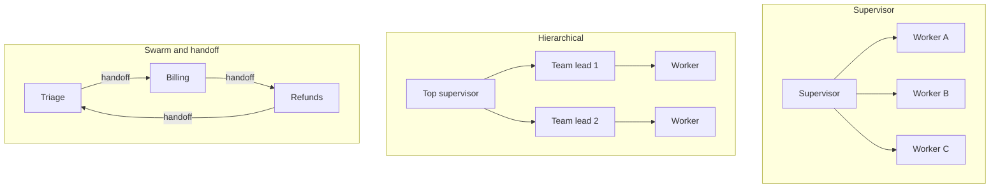
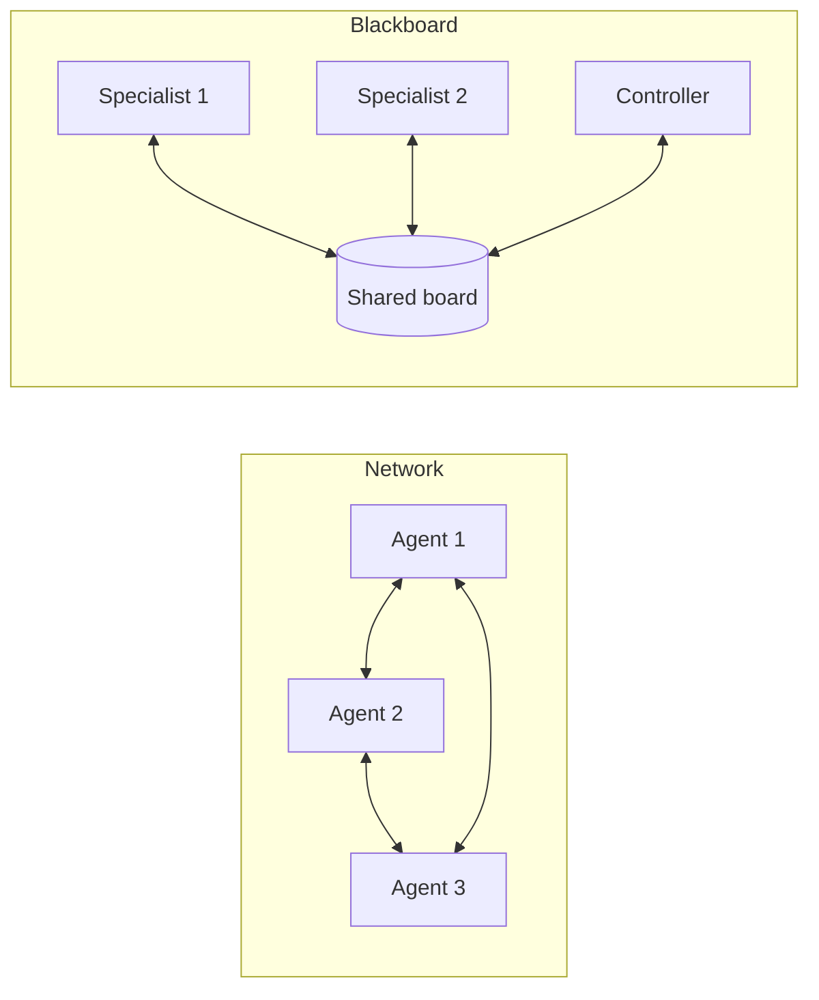
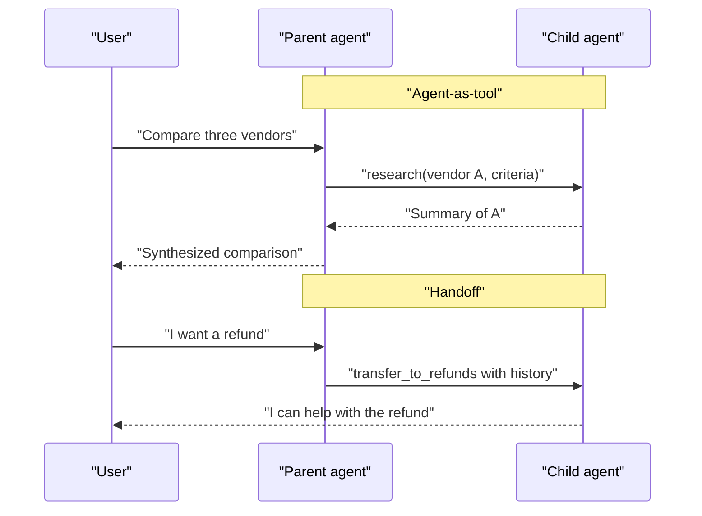
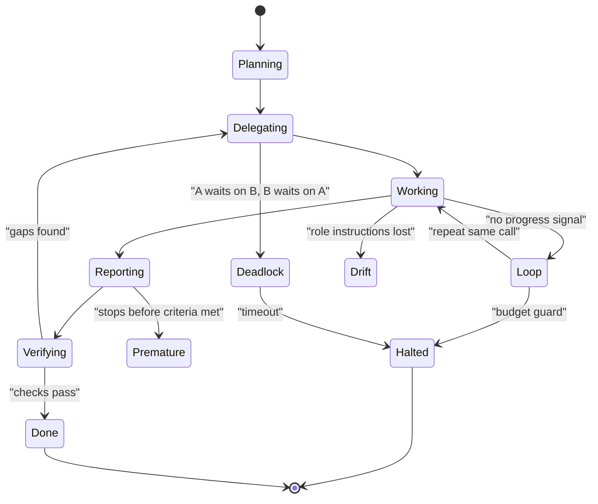
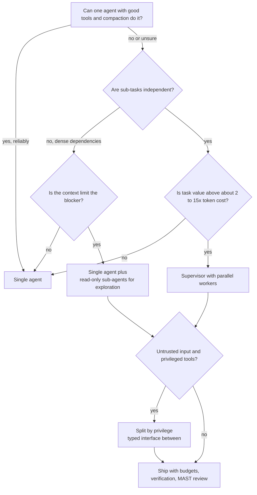
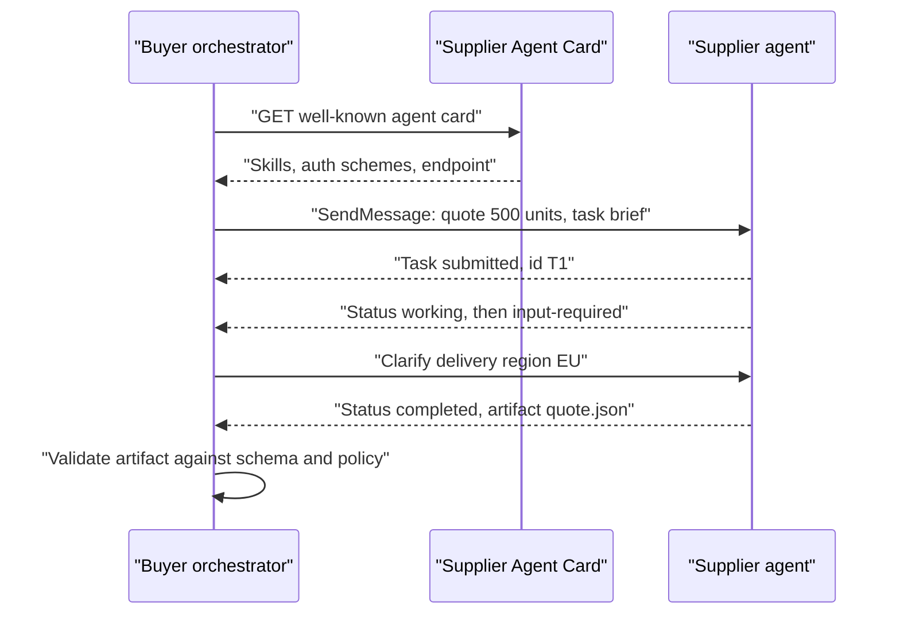
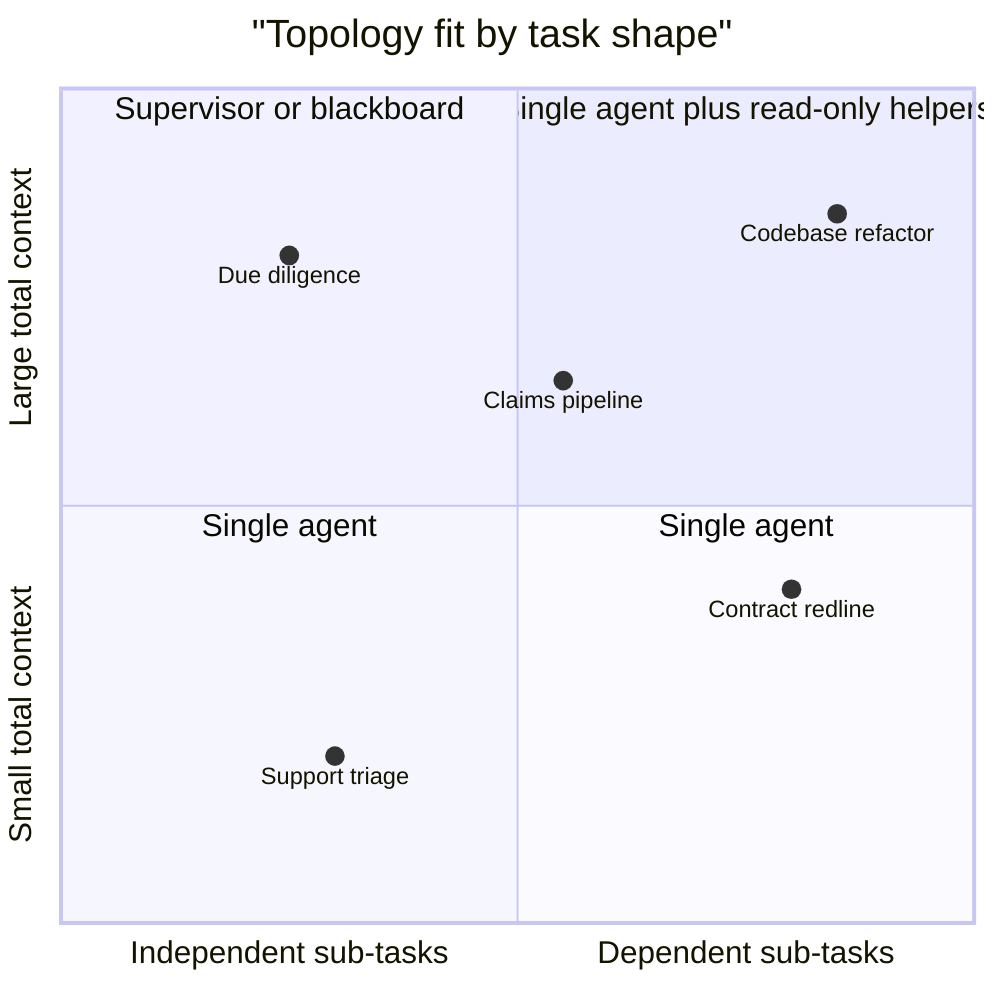
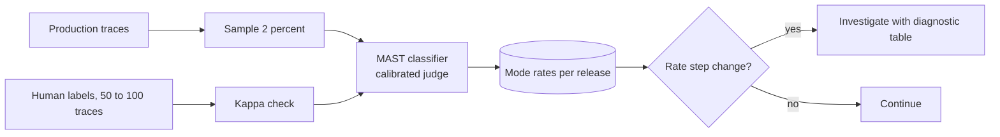
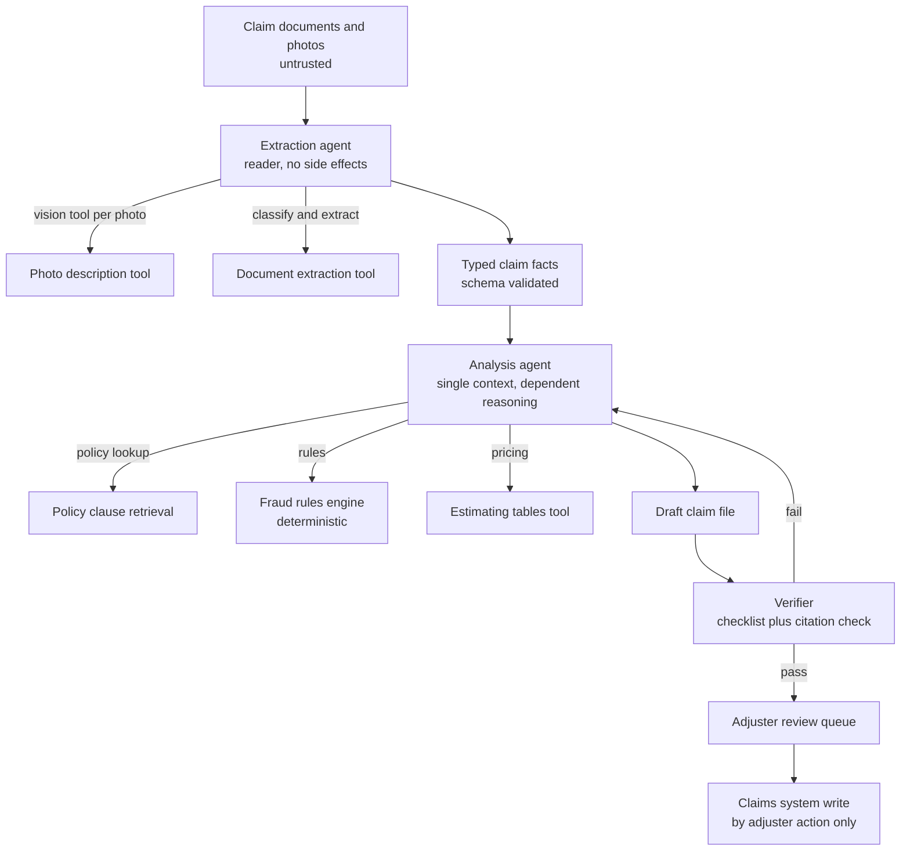

# Chapter 21: Multi-Agent Systems

> **What this chapter covers**: The five topologies (supervisor, hierarchical, swarm and handoff, network, blackboard) and what each costs. When splitting work across agents helps (parallel breadth, context isolation, separation of privilege) and when it hurts (coordination overhead, token cost multiplier, error compounding). Message passing versus shared state, agent-as-tool versus handoff. Failure modes: loops, role drift, deadlock, duplicated work, conflicting writes. The MAST failure taxonomy from research. Cross-organization agents over A2A.
>
> **Prerequisites**: Chapters 1 and 2 (agent loop and patterns), 6 and 7 (context engineering, compaction, isolation), 10 to 15 (frameworks), 17 (A2A), 22 is helpful but not required.
>
> **Where it is used**: Deep research products, coding agents with sub-agents, back-office pipelines that cross departments, and any design review where someone proposes "one agent per role". Most of the value of this chapter is knowing when to say no.

---

## 21.1 Level 1: Foundations

### 21.1.1 What makes a system "multi-agent"

A multi-agent system is two or more LLM-driven loops, each with its own context window and instructions, that coordinate to complete a task. The defining property is **separate contexts**. A single agent that calls ten tools is one agent. A single agent whose prompt says "you are now the reviewer" is still one agent. The moment a second loop starts with a fresh context that sees only what it is handed, you have a multi-agent system and all its coordination problems.

This definition matters because the benefits and costs of multi-agent systems both come from context separation:

- **Benefit**: each agent's context holds only what it needs. A sub-agent can read 200,000 tokens of source material and return a 1,500-token summary, and the parent never pays for the 200,000 tokens in its own window.
- **Cost**: each agent knows only what it was told. Every piece of shared understanding must be explicitly communicated, and anything left out is invisible to the receiver.

### 21.1.2 The five topologies





| Topology | Control | Communication | Typical use |
| --- | --- | --- | --- |
| Supervisor (orchestrator-worker) | one agent decides who works next and synthesizes | messages to and from workers | deep research, parallel analysis |
| Hierarchical | supervisors of supervisors | messages down and up a tree | large tasks with natural sub-teams |
| Swarm and handoff | the active agent passes control to a peer | conversation history travels with control | customer service triage, phased workflows |
| Network (peer to peer) | any agent may call any other | direct messages | simulations, debates; rarely production |
| Blackboard | a controller or rules pick who acts on shared state | reads and writes to a shared store | long-running pipelines, document assembly |

The supervisor pattern is the workhorse. Handoff is second, mostly in conversational products. Network topologies are the most general and the least controllable; they appear in research and demos far more than in production.

### 21.1.3 Why multi-agent exists

Three reasons stand up in production:

1. **Breadth in parallel.** Research over many independent sources, analysis of many files, or checking many hypotheses. Wall time drops because workers run concurrently.
2. **Context isolation.** A worker can burn a large context on exploration and return a compressed result. The parent's context stays clean, which keeps it accurate (Chapter 6 on context rot).
3. **Separation of privilege.** An agent that reads untrusted web content should not hold the tool that sends money. Splitting them, with a narrow typed interface between, limits prompt injection blast radius (Chapter 29).

Two reasons that do not hold up on their own: "it mirrors the org chart" (roles that humans need for human reasons, like a separate reviewer because people are busy, do not transfer to models that share weights), and "specialization makes each agent better" (a role prompt changes behavior far less than a clean context and the right tools do).

### 21.1.4 The evidence both ways

The best-documented positive result is Anthropic's research system (engineering blog, June 2025): an orchestrator with Claude Opus 4 as lead and Claude Sonnet 4 subagents outperformed single-agent Claude Opus 4 by 90.2 percent on Anthropic's internal research evaluation. The same post reports that multi-agent runs used about 15 times the tokens of a chat interaction (single agents about 4 times), and that token usage explained about 80 percent of performance variance on BrowseComp. Read that last number carefully: much of the gain is spending more tokens, which multi-agent structure makes possible by parallelizing and isolating context.

The best-known skeptical position is Cognition's "Don't Build Multi-Agents" (June 2025): parallel sub-agents working from partial context make implicitly conflicting decisions, and for tasks like coding where every action depends on every prior decision, a single agent with full context and good compaction is more reliable.

Both are right about different task shapes. Research is breadth-first with independent sub-questions. Coding and transactional work are depth-first with dense dependencies. The rest of this chapter is about telling them apart.

---

## 21.2 Level 2: Working knowledge

### 21.2.1 Agent-as-tool versus handoff

These are the two primitive coordination mechanisms. Every framework implements both under different names.

**Agent-as-tool.** The parent calls the child like a function. The child gets a task description (not the parent's history), runs its own loop, and returns a result. Control returns to the parent. The parent stays responsible for the final answer.

**Handoff.** The active agent transfers control to another agent, usually with the conversation history. The new agent talks to the user directly. The original agent is no longer in the loop unless control is handed back.



| Property | Agent-as-tool | Handoff |
| --- | --- | --- |
| Who answers the user | parent | the agent holding control |
| Context passed | a task brief you write | usually the full history, optionally filtered |
| Parallelism | natural (fan out several tool calls) | none; one active agent |
| Accountability | parent owns output | diffuse, follows control |
| Failure isolation | child failure is a tool error | a bad handoff leaves the user with the wrong agent |
| Framework names | OpenAI Agents SDK `as_tool`, LangGraph subgraph call, ADK `AgentTool`, Claude Agent SDK subagents | OpenAI Agents SDK handoffs, LangGraph `Command(goto=...)` swarm, ADK `transfer_to_agent` |

Default to agent-as-tool. It keeps one agent accountable, allows parallelism, and makes the interface between agents an explicit, typed brief. Use handoff when the user must converse with a specialist for several turns and the parent adds nothing to those turns.

### 21.2.2 Message passing versus shared state

The second design axis is how agents share information.

- **Message passing**: agents exchange messages; each keeps its own private context. Supervisor and handoff systems are message-passing. Advantages: isolation, clear provenance, easy tracing. Disadvantages: whatever the sender forgets to include is lost.
- **Shared state**: agents read and write a common store (a LangGraph state object, a database, a document, a blackboard). Advantages: no information lost in translation, easy to resume. Disadvantages: concurrent writes conflict, and agents may read partial or stale state.

In practice most production systems mix them: messages for control, a shared store for artifacts. The Anthropic research system has subagents write findings to external storage and pass lightweight references back, which avoids a "game of telephone" through the lead agent's context. A LangGraph supervisor keeps a shared `messages` list plus typed fields.

A LangGraph-style state for a supervisor with artifacts, showing the reducers that make concurrent writes safe:

```python
from typing import Annotated, TypedDict
from operator import add
from langgraph.graph.message import add_messages

class ResearchState(TypedDict):
    messages: Annotated[list, add_messages]    # control conversation
    plan: list[str]                            # written only by supervisor
    findings: Annotated[list[dict], add]       # workers append, never overwrite
    budget_tokens_left: int                    # supervisor decrements
    done: bool
```

The `Annotated[..., add]` reducer on `findings` is the whole conflicting-writes story in one line: parallel workers append, and the framework merges. A plain `list` field written by two parallel branches would raise an error or lose one write depending on the framework version.

### 21.2.3 Writing the brief

The quality of a multi-agent system is mostly the quality of the briefs the orchestrator writes. Anthropic's post lists early failures from vague briefs: subagents duplicating each other's searches, misreading scope, and spawning 50 subagents for a simple query. A good brief has:

1. **Objective**: one sentence on what to find or produce.
2. **Scope and boundaries**: what is out of scope, and what other workers are covering (to prevent duplication).
3. **Output format**: a schema, with a length cap.
4. **Tools and sources**: which to prefer, which to avoid.
5. **Budget**: maximum tool calls or tokens, and a stop condition.

A worked brief for the vendor comparison:

```text
Objective: Assess Vendor B's SOC 2 and data residency posture for EU customers.
Out of scope: pricing and features (another worker covers them). Vendors A and C.
Sources: vendor trust center, official audit summaries. Avoid forums.
Output: JSON {soc2_type, report_date, eu_regions[], subprocessors_url, gaps[]},
        max 300 words in gaps.
Budget: at most 12 tool calls. Stop when all fields are filled or marked unknown.
```

### 21.2.4 Scaling effort to the task

Multi-agent systems overspend on easy tasks. Put explicit rules in the orchestrator's instructions and enforce them in code:

| Task class | Workers | Tool calls per worker | Example |
| --- | --- | --- | --- |
| Simple fact | 0 (orchestrator answers) or 1 | 3 to 10 | "When was Vendor B founded?" |
| Comparison | 2 to 4 | 10 to 15 | "Compare three vendors on security" |
| Broad research | 5 to 10 | 10 to 20 | "Map the EU market for X" |

Anthropic's post describes similar guidance embedded in their prompts. Enforce the cap in code too: the fan-out function refuses more than N workers regardless of what the model asks for.

### 21.2.5 Worked example: token and cost multiplier

A single agent answers a comparison question with 12 turns, average context 18,000 tokens per turn, 500 output tokens per turn. Input tokens: 12 × 18,000 = 216,000. Output: 6,000.

The multi-agent version: an orchestrator does 4 turns at an average 6,000 tokens of context. Three workers each do 10 turns at an average 14,000 tokens. Orchestrator input: 24,000. Workers input: 3 × 10 × 14,000 = 420,000. Total input: 444,000, which is 2.06 times the single agent. Output: orchestrator 2,000 plus workers 3 × 10 × 400 = 12,000, so 14,000 total.

With illustrative prices of 3 per million input and 15 per million output: single agent 0.648 + 0.090 = 0.738. Multi-agent 1.332 + 0.210 = 1.542, about 2.1 times. With prompt caching at a 90 percent discount on cached prefixes and 70 percent of input cached in each agent, input cost falls by 63 percent in both designs, and the ratio stays near 2 times.

Wall time is where multi-agent wins: if each turn takes 8 s, the single agent takes 96 s; the multi-agent takes 4 × 8 s for the orchestrator plus 10 × 8 s for the parallel workers, 112 s, which is slower because this orchestrator is serial around the workers. Parallelism only helps wall time when worker runs are long relative to orchestration. With 5 workers each doing 20 turns (160 s) versus a single agent doing 100 turns serially (800 s), multi-agent wins by 4 times on time at perhaps 1.3 times the tokens because each worker's context is smaller.

The lesson: compute both cost and time for your task shape before choosing. The multiplier is not a constant 15; it depends on turns and context sizes.

---

## 21.3 Level 3: Depth

### 21.3.1 Error compounding

If each agent in a pipeline completes its sub-task correctly with probability p, and the sub-tasks are all required, the system succeeds with probability p^n (assuming independence). Five agents at 0.95 each give 0.95^5 = 0.774. Ten agents give 0.599.

A supervisor with verification changes the arithmetic. Suppose each worker succeeds with probability 0.90, the supervisor detects a failure with probability 0.80, and a retry succeeds with 0.90. The per-worker success becomes 0.90 + 0.10 × 0.80 × 0.90 = 0.972. For five workers: 0.972^5 = 0.868, versus 0.90^5 = 0.590 without verification. Verification is where multi-agent reliability comes from, which is why the MAST taxonomy's verification category matters.

The independence assumption flatters multi-agent systems. Workers share the same base model and similar prompts, so their errors correlate: if the model misunderstands a domain term, every worker misunderstands it. Correlated errors also defeat "majority voting" across agents built on one model. Diversity (different models, different evidence) is what makes voting work.

### 21.3.2 Failure modes



**Loops.** Two agents hand a task back and forth ("please clarify" / "please proceed"), or an agent repeats the same tool call. Causes: no progress signal, no termination condition, a handoff graph with cycles. Mitigations: a global step budget and token budget per task enforced in code, detecting repeated identical calls (hash of tool name and arguments), and a maximum handoff count.

**Role drift.** Over a long conversation an agent stops following its role (the reviewer starts writing code, the researcher starts answering the user). Cause: the role lives only in the system prompt, and long histories dilute it. Mitigations: short worker lifetimes (fresh context per task), role-specific tool sets so the reviewer cannot write code, and re-injecting role reminders at compaction.

**Deadlock.** Agent A waits for B's output and B waits for A's. With LLMs this often looks like two agents each asking the other a clarifying question. Mitigations: a directed acyclic dependency structure for delegation, timeouts, and a supervisor that owns all scheduling.

**Duplicated work.** Parallel workers research the same thing because briefs overlapped. Mitigations: explicit partitioning in briefs, a shared "claimed" list on the blackboard, and deduplication of findings by source URL or entity ID.

**Conflicting writes.** Two workers update the same record or file. Mitigations: single-writer ownership per field, append-only reducers, optimistic concurrency with version numbers on shared records, and merging by the supervisor rather than by workers.

| Failure | Detect in traces by | Guard in code |
| --- | --- | --- |
| Loop | repeated (tool, args) hash, handoff count | step and token budget, max handoffs |
| Role drift | tool calls outside role, judge on role adherence | role-scoped tools, fresh contexts |
| Deadlock | two agents waiting, no tool calls, timer | DAG delegation, timeouts |
| Duplicated work | overlapping sources across workers | partitioned briefs, claim registry |
| Conflicting writes | version conflicts, lost updates | reducers, single writer, version checks |
| Premature termination | output missing required fields | completion checklist validated in code |

### 21.3.3 The MAST taxonomy

Cemri, Pan, Yang and colleagues ("Why Do Multi-Agent LLM Systems Fail?", arXiv 2503.13657, 2025) built the Multi-Agent System Failure Taxonomy (MAST) from expert annotation of traces across seven popular multi-agent frameworks. The released MAST-Data has over 1,600 annotated traces, and the authors reported high inter-annotator agreement (Cohen's kappa of 0.88) during taxonomy development. MAST has 14 failure modes in three categories:

**FC1, specification and system design**
1. Disobey task specification
2. Disobey role specification
3. Step repetition
4. Loss of conversation history
5. Unaware of termination conditions

**FC2, inter-agent misalignment**
6. Conversation reset
7. Fail to ask for clarification
8. Task derailment
9. Information withholding
10. Ignored other agent's input
11. Reasoning-action mismatch

**FC3, task verification and termination**
12. Premature termination
13. No or incomplete verification
14. Incorrect verification

The reported distribution across categories differs between paper versions (one widely cited version gives roughly 42, 37, and 21 percent for FC1, FC2, FC3); cite the version you read. Three findings matter more than the exact percentages:

1. **Most failures are design failures, not model failures.** Specification problems and missing termination conditions are fixable in the system design. The authors showed that prompt and topology fixes helped but did not remove failures, implying structural changes are needed.
2. **Verification is weak.** Many systems have a "verifier" agent that checks superficially (does the code compile) rather than against the task specification.
3. **An LLM-as-judge annotator is feasible.** The authors built an LLM annotation pipeline validated against human labels, which makes MAST usable as a trace-classification scheme in your own monitoring (Chapter 28).

Use MAST as a checklist in design reviews: for each of the 14 modes, point to the mechanism that prevents or detects it. A design that cannot answer for modes 5, 12, 13, and 14 is not ready.

### 21.3.4 Context passing: the core engineering problem

Most FC2 failures (information withholding, ignored input, derailment) are context passing failures. Options for what a child receives:

| Pass | Tokens | Risk |
| --- | --- | --- |
| Task brief only | smallest | child lacks decisions the parent made |
| Brief plus relevant excerpts | small to medium | parent must choose excerpts correctly |
| Brief plus summary of history | medium | summary may drop a constraint |
| Full history | largest | cost, context rot, no isolation benefit |

For handoffs, frameworks usually pass the full history by default and offer input filters. For agent-as-tool, you write the brief. A reliable pattern is a structured **decision log** in shared state: every constraint or decision the orchestrator makes is appended as a short record ("user is EU-based", "exclude on-premise options"), and every brief includes the log. It is cheap (a few hundred tokens) and directly targets information withholding.

### 21.3.5 Observability for multi-agent runs

A multi-agent trace is a tree, and debugging requires seeing it as one. Requirements:

- One trace ID for the whole task, with a span per agent run and child spans for its model and tool calls.
- The brief each child received and the result it returned, as span attributes or events.
- Per-agent token and cost totals rolled up to the task.
- Handoff events recorded explicitly (from, to, reason).

OpenTelemetry gen_ai semantic conventions include agent spans (`invoke_agent`); check the current convention version for attribute names. Langfuse, LangSmith, and the platform tracers in Chapter 19 all render nested agent spans.

---

## 21.4 Level 4: Mastery

### 21.4.1 The decision: one agent or many



The principle: start with one agent, measure, and add agents only to fix a measured problem (context overflow, wall time, privilege separation). Multi-agent designs proposed on day one for "modularity" usually cost more and fail more.

The "read-only sub-agents" branch is the common coding-agent compromise: the main agent keeps full context and makes all writes, while sub-agents explore (search a codebase, read documentation) and return summaries. Reads parallelize safely; writes stay single-threaded. This resolves most of the Cognition objection while keeping the context isolation benefit.

### 21.4.2 Design patterns that work

**Orchestrator-worker with verification.** Lead plans, spawns workers with briefs, collects structured results, runs a verification pass (a separate checker with the original task specification, not the worker's claims), and synthesizes. Citations or evidence are checked in a dedicated pass. This is the Anthropic research pattern.

**Privilege-split pair.** A "reader" agent handles untrusted content with no side-effect tools and returns a typed, schema-validated object. An "actor" agent with side-effect tools never sees raw untrusted text, only the typed object. This is the dual-LLM or CaMeL-style pattern from the prompt injection literature (Chapter 29), expressed as a two-agent system.

**Handoff with return.** A triage agent hands off to specialists, and specialists hand back to triage when out of scope. Cap the handoff count at 3 to 5 per conversation, log every handoff reason, and evaluate routing accuracy separately from resolution quality.

**Blackboard for long pipelines.** A controller watches a shared document (a claims file, a due diligence report) and triggers specialists when their preconditions are met ("financials section present, risk section empty"). Durable execution (Chapter 22) runs the controller. This suits processes measured in hours or days where agents join and leave.

### 21.4.3 Budget and termination in code

Termination must not depend on the model deciding it is done. Enforce in the orchestrator:

```python
class Budget:
    def __init__(self, max_steps=60, max_tokens=400_000, max_workers=6,
                 max_handoffs=4, deadline_s=900):
        self.max_steps, self.max_tokens = max_steps, max_tokens
        self.max_workers, self.max_handoffs = max_workers, max_handoffs
        self.deadline_s = deadline_s
        self.steps = self.tokens = self.workers = self.handoffs = 0
        self.seen_calls: set[str] = set()

    def check_call(self, tool: str, args_hash: str) -> None:
        key = f"{tool}:{args_hash}"
        if key in self.seen_calls:
            raise LoopDetected(key)
        self.seen_calls.add(key)
        self.steps += 1
        if self.steps > self.max_steps:
            raise BudgetExceeded("steps")
```

On any budget exception the orchestrator returns the best partial result with an explicit "incomplete" flag. A partial answer labeled as partial is a product outcome; a runaway loop is an incident.

### 21.4.4 Cross-organization agents over A2A

When agents belong to different organizations, the topology is forced: you cannot share state or read the other side's traces, so it is message passing between opaque agents. A2A (Chapter 17) is the protocol for this. A2A reached v1.0 in early 2026 under Linux Foundation governance (sources give dates in March and April 2026; check the project's release notes), and Microsoft Foundry documents A2A v1.0 endpoints as GA.



What changes when the other agent is outside your trust boundary:

- **The remote agent is untrusted input.** Its artifacts and messages can contain prompt injection. Validate artifacts against a schema and treat free-text parts as data, never as instructions to your orchestrator.
- **No shared traces.** You see only task states and artifacts. Log everything at your boundary, including the full exchange, and agree on a correlation ID with the partner.
- **Authentication and authorization are per organization.** The Agent Card declares auth schemes; use OAuth client credentials or mutual TLS as agreed, and signed Agent Cards where supported to prevent spoofing.
- **Long-running tasks.** Supplier tasks can take hours or days. Use push notifications or polling with durable execution on your side (Chapter 22), and idempotency on anything you commit based on their result.
- **Contracts.** The agent-to-agent interface needs the same things as an API contract: versioning, SLAs, error semantics, and who pays for failures. A2A standardizes the envelope, not the business terms.

### 21.4.5 Evaluating multi-agent systems

Evaluate at three levels:

1. **Task outcome**: the same golden set and pass^k as a single agent (Chapter 26). A multi-agent design must beat the single-agent baseline on a paired comparison to justify its cost.
2. **Coordination quality**: per-trace MAST classification with a calibrated judge, handoff routing accuracy, duplicated-work rate (overlap of sources across workers), and budget exhaustion rate.
3. **Efficiency**: tokens and cost per successful task, wall time at p50 and p95.

Worked comparison: 60 research tasks, single agent versus supervisor with four workers, three trials each. Single agent pass@1 0.62, cost per task 0.90, p50 time 240 s. Multi-agent pass@1 0.74, cost per task 2.70, p50 time 110 s. Paired difference in success 0.12 with a bootstrap 95 percent interval of, say, 0.05 to 0.19. Cost per successful task: single 0.90 / 0.62 = 1.45, multi 2.70 / 0.74 = 3.65. So multi-agent buys 12 points of success and 2.2 times faster answers for 2.5 times the cost per success. Whether that is worth it is a product decision, and this table is how you present it.

### 21.4.6 Where the literature and vendors disagree

- **Is multi-agent structure itself valuable, or is it just more compute?** Anthropic's finding that token usage explains about 80 percent of variance suggests much of the benefit is spend. Skeptics argue a single agent given the same token budget with good compaction would close much of the gap. Fair comparisons at equal token budgets are rare; run one before claiming structure matters.
- **Frameworks for autonomous agent societies versus explicit graphs.** Conversation-driven frameworks (AutoGen-style group chats, CrewAI crews) emphasize emergent collaboration. Graph frameworks (LangGraph) emphasize explicit control flow. MAST's finding that most failures are specification and termination problems favors explicit control.
- **Role-playing personas.** Some papers report gains from assigning expert personas to agents; others find minimal effect of persona prompts on accuracy. Tools and context isolation are the reliable levers.
- **Debate and voting.** Multi-agent debate improves some reasoning benchmarks in published studies, but gains shrink with stronger base models and correlated errors when all agents share one model. Use diverse models if you use voting.
- **Platforms.** AWS's own migration notes say routing-mode multi-agent is "not straightforward" on the AgentCore harness, while Google and Microsoft lead with A2A. Vendor emphasis on multi-agent is partly positioning; the engineering questions in this chapter do not change with the platform.

---

### 21.4.7 Cost and error arithmetic by topology

This section runs one task through five topologies with the same assumptions, so the differences come only from structure. All prices are illustrative.

**Task.** Produce a due diligence brief on a synthetic acquisition target, Fabrikam Robotics, covering five independent areas: financials, legal, technology, market, and team. Each area needs about 10 tool calls of research.

**Shared assumptions.**

- Price: 3 per million input tokens, 15 per million output, no caching (caching is added at the end).
- Each worker turn: average context grows from 3,000 to 20,000 tokens over 10 turns, mean 11,500; output 400 tokens.
- Orchestration turn: context 6,000 tokens, output 600.
- Per-area success probability for a worker with a good brief: 0.90. A verifier catches 75 percent of area failures; a retry succeeds at 0.90.
- Handoff or message overhead: each inter-agent message adds 800 tokens to the receiver's context.
- Turn latency: 7 s.

**Topology A: single agent.** One agent does all 50 research calls. Its context grows across all five areas: mean context about 45,000 tokens over 50 turns (capped by compaction at 60,000).

- Input: 50 × 45,000 = 2.25 million tokens; output 50 × 400 = 20,000.
- Cost: 6.75 + 0.30 = 7.05.
- Time: 50 × 7 = 350 s.
- Success: context rot degrades later areas. Suppose area success is 0.90 for the first two areas and 0.82 for the last three. System success = 0.90^2 × 0.82^3 = 0.81 × 0.551 = 0.446. No verifier.

**Topology B: supervisor with five parallel workers and a verifier.**

- Workers: 5 × 10 × 11,500 = 575,000 input; 5 × 10 × 400 = 20,000 output.
- Orchestrator: 4 turns (plan, dispatch, verify, synthesize) at 6,000 plus 5 × 800 message overhead on the verify and synthesize turns: 4 × 6,000 + 2 × 4,000 = 32,000 input; 2,400 output.
- Retries: expected retries = 5 × 0.10 × 0.75 = 0.375 worker runs, 0.375 × 115,000 = 43,125 input, 1,500 output.
- Total input 650,125, output 23,900. Cost: 1.95 + 0.36 = 2.31.
- Time: plan 7 s + parallel workers 70 s + verify 7 s + expected retry time 0.375 × 70 (bounded by the slowest retry, assume one retry 70 s with probability 1 − (1 − 0.075)^5 = 0.32, so 22 s expected) + synthesize 7 s = 113 s.
- Per-area success with verification: 0.90 + 0.10 × 0.75 × 0.90 = 0.9675. System: 0.9675^5 = 0.848.

Topology B is cheaper than A here because each worker's context stays small. The "multi-agent costs more" rule of thumb holds when the single agent's context stays small; it inverts when a single agent would carry a huge context across many sub-tasks.

**Topology C: hierarchical (top supervisor, two team leads, five workers).** Leads for "business" (financials, market, team) and "technical" (legal, technology).

- Workers as in B: 575,000 input, 20,000 output.
- Two leads, 3 turns each at 6,000 plus message overhead: 2 × (18,000 + 3 × 800 × 2.5 average workers) = 2 × 24,000 = 48,000 input; 3,600 output.
- Top: 3 turns at 6,000 plus 2 × 800: 19,600 input; 1,800 output.
- Retries as in B: 43,125 input, 1,500 output.
- Total input 685,725, output 26,900. Cost 2.06 + 0.40 = 2.46.
- Time: B plus one more coordination layer, about 113 + 14 = 127 s.
- Success: same area success if leads verify; each lead's summary adds a small information-loss risk. Suppose each lead's synthesis is correct with 0.97: 0.848 × 0.97^2 = 0.798.

Hierarchy costs a little more, is slower, and loses a little accuracy for five areas. It pays off when one supervisor would have to manage 20 or more workers and its own context would overflow with their reports.

**Topology D: handoff chain (financials hands to legal hands to technology and so on).** Each agent receives full history.

- Agent k starts with the accumulated history of agents 1 to k−1. Mean context for agent k is roughly 11,500 + (k − 1) × 20,000 (each prior agent adds about 20,000 tokens of history). Mean contexts: 11,500, 31,500, 51,500, 71,500, 91,500.
- Input: 10 × (11,500 + 31,500 + 51,500 + 71,500 + 91,500) = 10 × 257,500 = 2.575 million. Output 20,000.
- Cost: 7.73 + 0.30 = 8.03.
- Time: sequential, 350 s.
- Success: no verifier, later agents suffer the same context growth as topology A: roughly 0.45.

Handoff with full history is the worst choice for this task: it has the single agent's context growth and none of its continuity. Handoff suits conversational routing, not research decomposition.

**Topology E: blackboard.** A controller writes the five area stubs to a shared document. Workers claim an area, write findings to the board, and a verifier agent reviews each section against a checklist.

- Workers: as in B, but each reads the board state at start (about 2,000 tokens) instead of a brief: 5 × 10 × 11,700 = 585,000 input; 20,000 output.
- Controller: event-driven, about 6 short turns at 3,000: 18,000 input; 1,200 output.
- Verifier: 5 section reviews at 8,000: 40,000 input; 2,000 output.
- Retries: 43,125 input; 1,500 output.
- Total input 686,125, output 24,700. Cost 2.06 + 0.37 = 2.43.
- Time: similar to B if workers run in parallel, about 115 s.
- Success: similar to B, 0.848, with better resumability because state is on the board.

**Summary table.**

| Topology | Cost | Time | Success | Cost per success |
| --- | --- | --- | --- | --- |
| A single agent | 7.05 | 350 s | 0.45 | 15.7 |
| B supervisor plus verifier | 2.31 | 113 s | 0.85 | 2.72 |
| C hierarchical | 2.46 | 127 s | 0.80 | 3.08 |
| D handoff chain | 8.03 | 350 s | 0.45 | 17.8 |
| E blackboard | 2.43 | 115 s | 0.85 | 2.86 |

**With prompt caching.** If 60 percent of each agent's input is a cached prefix at 10 percent price, input cost falls by 54 percent everywhere. Topology A's long single context benefits the most in absolute terms (it has the most repeated prefix), bringing it to about 3.4, still worse than B. The ranking is stable.

**When the ranking flips.** Make the five areas dependent (legal findings change what technology must check, which changes the financial model). Now workers in B act on stale assumptions. If 30 percent of the time a worker's output conflicts with another's and the verifier catches only half of those, effective success in B drops to about 0.85 × (1 − 0.15) = 0.72, and the single agent with good compaction, which sees all findings in order, may reach 0.70 to 0.80. The design answer for dependent areas is B with a second round: after the first pass, the orchestrator shares a findings digest with all workers for a reconciliation pass, costing another 5 × 3 turns.



### 21.4.8 MAST failure modes: diagnostics and fixes

For each of the 14 MAST modes: what it looks like in a trace, a diagnostic you can automate, and the fix. The mode names follow Cemri, Pan, Yang et al. (2025); the diagnostics and fixes are engineering practice, not from the paper.

**FC1. Specification and system design**

| Mode | Looks like | Diagnostic | Fix |
| --- | --- | --- | --- |
| 1. Disobey task specification | output ignores a stated constraint (format, scope, length) | validate final output against a machine-checkable spec: schema, required sections, forbidden content | write the spec as a schema or checklist; validate in code; feed violations back once |
| 2. Disobey role specification | the reviewer writes code, the researcher answers the user | count tool calls or actions outside the agent's allowed set; judge role adherence per turn | give each role only its tools; short-lived workers; role reminder at compaction |
| 3. Step repetition | the same tool call or plan step recurs | hash of (tool, normalized args) seen twice in one run | loop guard that returns the earlier result and a note; step budget |
| 4. Loss of conversation history | agent re-asks for information already given | detect questions whose answers appear earlier in the trace (embedding match against prior user turns) | decision log in state; compaction that preserves facts; include log in every brief |
| 5. Unaware of termination conditions | agent keeps working after goals met, or never declares done | runs hitting step budget with all required fields already filled | explicit completion checklist in state; orchestrator checks it after each step |

**FC2. Inter-agent misalignment**

| Mode | Looks like | Diagnostic | Fix |
| --- | --- | --- | --- |
| 6. Conversation reset | an agent restarts the task from scratch mid-run | worker output restates the plan or repeats early steps after a handoff | pass structured state, not free-text history; resumable checkpoints |
| 7. Fail to ask for clarification | worker guesses on an ambiguous brief | judge flags briefs with ambiguous terms; worker outputs contain assumption language | allow workers a `request_clarification` tool that returns to the orchestrator; ambiguity check before dispatch |
| 8. Task derailment | worker drifts to an adjacent, unrequested topic | semantic similarity between worker output and brief objective below threshold | tighter objective and exclusions in brief; verifier checks relevance |
| 9. Information withholding | a worker knew a relevant fact but did not report it | facts in worker tool results absent from its report (compare entities) | structured output schema with required fields; report raw evidence references |
| 10. Ignored other agent's input | agent proceeds contrary to a peer's finding | later outputs contradict earlier findings in shared state | orchestrator merges and flags contradictions; workers read the findings digest |
| 11. Reasoning-action mismatch | stated plan says X, tool call does Y | compare the last reasoning statement's intended tool with the actual call | constrained next action from a plan; reject calls not in the stated plan for high-risk tools |

**FC3. Task verification and termination**

| Mode | Looks like | Diagnostic | Fix |
| --- | --- | --- | --- |
| 12. Premature termination | agent returns before all required parts exist | completion checklist incomplete at return | block return until checklist passes or budget is exhausted, then flag partial |
| 13. No or incomplete verification | "looks good" without checking against spec | verifier trace has no tool calls or checks only syntax | verifier must run concrete checks (tests, schema, citations) and cite the spec item for each |
| 14. Incorrect verification | verifier approves wrong output | periodic human audit of verifier approvals; verifier agreement with a stronger judge | calibrate verifier on labeled cases; use a different model or deterministic checks for critical items |

**Operationalizing.** Run an LLM classifier over sampled traces that labels each trace with zero or more MAST modes, calibrated on 50 to 100 human-labeled traces with Cohen's kappa reported. Track mode rates per release. A rise in modes 3 or 5 after a prompt change is a loop regression; a rise in 13 or 14 means the verifier has become a rubber stamp.



### 21.4.9 Design case: an insurance claims pipeline

This is a longer case, written as a design review. The company, Contoso Mutual, is synthetic.

**Brief from the customer.** Contoso processes 3,000 property damage claims a day. Each claim has a first notice of loss form, 5 to 40 photos, a policy document, sometimes a contractor estimate, and sometimes a police report. Today adjusters spend 40 minutes per claim on triage and documentation before any judgment. They want agents to prepare a claim file: coverage analysis, damage summary, fraud indicators, a reserve estimate, and a recommended next action. Adjusters make the decision. Constraint: nothing is paid or denied by an agent.

**Initial proposal from the customer's team.** Seven agents: intake, document classifier, photo analyst, coverage analyst, fraud analyst, estimator, and a "manager" agent that talks to all of them in a group chat.

**Review against 21.4.1.**

1. *Can one agent do it?* Context: policy (15,000 tokens), forms (3,000), photo descriptions (40 photos × 150 tokens = 6,000), estimate (4,000), police report (3,000). About 31,000 tokens plus instructions. One agent could hold it. But photo analysis needs a vision model call per photo, which is a tool, not an agent.
2. *Independent sub-tasks?* Coverage analysis depends on the damage summary (what was damaged, what caused it). Fraud indicators depend on everything. The estimate depends on damage and coverage. These are dependent.
3. *Privilege?* Photos and documents are untrusted input (a claimant can embed text in an image or a PDF). The agent that writes to the claims system should not read raw documents.

**Revised design.** Two agents and several tools, not seven agents.



Why each piece exists:

- **Extraction agent (reader).** Reads untrusted content, calls a vision tool per photo, extracts structured facts into a Pydantic-style schema: loss date, cause, damaged items with locations, amounts in any estimate, parties. It has no tools that write anywhere. Its output is validated; free-text fields are length-capped and never interpreted as instructions downstream.
- **Analysis agent (single context).** Receives typed facts only. It does coverage, damage summary, reserve, and next action in one context because they depend on each other. It calls a deterministic fraud rules engine (the insurer's existing rules) rather than an "LLM fraud analyst", because fraud flags have regulatory implications and must be explainable.
- **Verifier.** Checks every required section exists, every coverage statement cites a policy clause ID that exists in the retrieved text, reserve is within the estimating tables' range for the damage type, and fraud flags come only from the rules engine output. Deterministic checks first, then an LLM check for clause-claim consistency.
- **No agent writes to the claims system.** The adjuster's approval action writes, with the agent's draft attached.

**MAST review of the revised design.** Selected modes:

| Mode | Mechanism |
| --- | --- |
| 1 task spec | claim file schema validated in code |
| 2 role spec | extraction agent has no write tools; analysis agent has no document access |
| 3 repetition | per-claim step budget of 40, loop guard on vision tool by photo ID |
| 5 termination | completion checklist in state; the verifier gates return |
| 7 clarification | analysis agent can mark facts "insufficient" which routes to adjuster, not guess |
| 9 withholding | extraction schema requires every photo ID to appear with a description or an explicit "unusable" |
| 12 premature termination | return blocked until checklist complete or budget exhausted, then flagged partial |
| 13 and 14 verification | citation check is deterministic; LLM consistency check calibrated on 200 adjuster-labeled files |

**Arithmetic.**

*Tokens per claim.*

- Vision tool: 20 photos average × (1,200 image tokens + 150 output) = 24,000 input, 3,000 output, on a mid-tier vision model at an illustrative 1 per million input and 4 per million output: 0.024 + 0.012 = 0.036.
- Extraction agent: 6 turns at mean 14,000 context, 500 output: 84,000 input, 3,000 output. At 3 and 15: 0.252 + 0.045 = 0.297.
- Analysis agent: 10 turns at mean 22,000, 600 output: 220,000 input, 6,000 output: 0.66 + 0.09 = 0.75.
- Verifier LLM check: 1 turn at 20,000, 500 output: 0.06 + 0.0075 = 0.0675.
- Expected re-analysis after verifier failure, 12 percent of claims, 4 turns: 0.12 × (4 × 24,000 × 3 / 1e6 + 4 × 600 × 15 / 1e6) = 0.12 × (0.288 + 0.036) = 0.039.
- Total without caching: about 1.19 per claim. With 60 percent cached prefixes at 10 percent: input share falls by 54 percent, total about 0.64.

*Daily and monthly.* 3,000 claims × 0.64 = 1,920 a day, about 42,000 a month over 22 working days.

*Value.* If the prepared file cuts adjuster preparation from 40 to 15 minutes, that saves 25 minutes × 3,000 = 1,250 hours a day. At an illustrative loaded cost of 50 an hour, that is 62,500 a day. The agent cost is 3 percent of the saving. The case is not cost-sensitive; it is quality and risk sensitive, which is why the design spends tokens on verification.

*The rejected seven-agent design, for comparison.* Group chat among seven agents with a manager: each message broadcast to all, typical runs of 25 messages, each agent's context accumulating all messages. Mean context around 30,000 across 7 agents and 25 rounds where each agent reads each round: rough input 7 × 25 × 30,000 = 5.25 million tokens per claim, 15.75 at 3 per million, about 13 times the revised design, with no privilege separation and MAST modes 3, 5, 8, and 10 all likely.

*Error compounding.* Revised design: extraction correct 0.96, analysis correct given correct facts 0.90, verifier catches 70 percent of analysis errors with rework success 0.85. Analysis effective = 0.90 + 0.10 × 0.70 × 0.85 = 0.9595. End to end: 0.96 × 0.9595 = 0.921. Because an adjuster reviews every file, the residual 8 percent is caught by a human; the metric to track is adjuster edit rate and time saved, not autonomous accuracy.

**Rollout plan.**

1. Shadow mode for 4 weeks on 10 percent of claims: agent prepares files that adjusters do not see; compare against adjuster outputs on the same claims.
2. Assist mode: adjusters see the file; measure time per claim and edit distance on each section; paired comparison against control adjusters.
3. Expand by claim type, starting with the most standardized (water damage), holding out complex losses.
4. Monthly MAST review of sampled traces, and quarterly re-calibration of the verifier against adjuster labels.

**What the review changed, in one paragraph for the customer.** Seven agents became two agents and four tools. The split that remains is by privilege (untrusted reading versus analysis), not by job title. Dependent reasoning stays in one context. Fraud and pricing use the insurer's deterministic systems. Verification is concrete and calibrated. The design costs roughly one thirteenth of the original in tokens and removes the failure modes that group chats are known for.

## 21.5 Subtopic checklist

- [x] Supervisor topology
- [x] Hierarchical topology
- [x] Swarm and handoff topology
- [x] Network topology
- [x] Blackboard topology
- [x] When multi-agent helps: parallel research, context isolation (and privilege separation)
- [x] When it hurts: coordination overhead, cost multiplier with arithmetic, error compounding with arithmetic
- [x] Message passing versus shared state
- [x] Agent-as-tool versus handoff
- [x] Failure mode: loops
- [x] Failure mode: role drift
- [x] Failure mode: deadlock
- [x] Failure mode: duplicated work
- [x] Failure mode: conflicting writes
- [x] Failure taxonomies from research: MAST, 14 modes in 3 categories
- [x] Cross-organization agents over A2A

## 21.6 Common misconceptions

1. **"Multi-agent means better results."** It means more tokens, more parallelism, and more coordination risk. It beats a single agent on breadth-first tasks with independent sub-questions and often loses on dependency-dense tasks.
2. **"Giving an agent a role prompt makes it a specialist."** Specialization comes from a clean context and the right tools. A role prompt alone changes behavior little and drifts over long histories.
3. **"The token multiplier is about 15x."** That figure is Anthropic's measurement against chat for their research system. The multiplier depends on turns, context sizes, and caching; compute it for your design.
4. **"Agents share what they know."** Each agent knows only what is in its context. Anything the orchestrator does not put in a brief or shared state is invisible to workers.
5. **"Majority voting among agents fixes errors."** Only if errors are independent. Agents on the same model with similar prompts make correlated errors; voting then amplifies confidence in the wrong answer.
6. **"The model will stop when the task is done."** Termination must be enforced in code with budgets, loop detection, and completion checks. MAST lists unaware-of-termination and premature termination as distinct failure modes.
7. **"A verifier agent guarantees quality."** Many verifiers check superficially. Verification must be against the original specification, ideally with deterministic checks where possible.
8. **"Handoff and agent-as-tool are interchangeable."** They differ in who owns the answer, what context travels, and whether parallelism is possible. Default to agent-as-tool.
9. **"A2A makes a remote agent trustworthy."** A2A standardizes discovery, tasks, and messages. The remote agent's output is still untrusted input to validate.
10. **"Most multi-agent failures come from weak models."** MAST's analysis attributes a large share to specification and system design, which are fixable by the builder.
11. **"More agents means more parallelism means faster."** Only when worker runs are long relative to orchestration. A serial orchestrator around short workers can be slower than one agent.
12. **"Hierarchy scales better, so use it early."** Each layer adds coordination cost, latency, and a summarization step that can lose information. Add a layer only when one supervisor's context overflows with worker reports.

## 21.7 Practice

1. **Conceptual.** For each of the five topologies, name one production task it fits and one failure mode it is most exposed to.
2. **Arithmetic.** A pipeline has 6 required agents at 0.93 success each. Compute system success. Add a verifier that catches 70 percent of failures with retries that succeed 90 percent of the time, and recompute.
3. **Arithmetic.** Recompute the cost multiplier in 21.2.5 for 6 workers doing 15 turns at 20,000 average context, with 60 percent of input cached at a 90 percent discount.
4. **Design.** A procurement team proposes five agents: intake, policy checker, vendor researcher, negotiator, approver. Run the decision flow in 21.4.1 and propose the minimal design. Justify each agent you keep.
5. **Design.** Write the MAST review for your design from exercise 4: for each of the 14 modes, the mechanism that prevents or detects it.
6. **Hands-on (free API tier or local model).** Build the vendor comparison task as a single LangGraph agent and as a supervisor with three workers using agent-as-tool. Run 20 tasks, three trials each. Report pass@1, pass^3, tokens, and wall time for both, with a paired bootstrap interval on the success difference.
7. **Hands-on.** Add the `Budget` guard from 21.4.3 to your supervisor. Write a test that forces a loop (a mocked tool that always returns "try again") and assert the orchestrator returns a partial result flagged incomplete within the budget.
8. **Hands-on.** Use a shared state with a plain list for findings and run three workers in parallel; observe the behavior. Switch to an append reducer and confirm all findings are kept.
9. **Hands-on.** Write an LLM judge prompt that labels a trace with MAST modes. Hand-label 20 traces from exercise 6 and measure judge agreement (Cohen's kappa) against your labels.
10. **Design.** Sketch an A2A integration between your orchestrator and a synthetic supplier's quoting agent. List every validation you apply to the returned artifact and the idempotency key you use before committing a purchase order.
11. **Arithmetic.** Rerun the five-topology comparison in 21.4.7 with 10 areas instead of 5 and a single-agent context cap of 80,000. At what number of areas does hierarchy (topology C) become cheaper than a flat supervisor, assuming the flat supervisor's verify and synthesize turns carry 800 tokens per worker report?
12. **Diagnostics.** Implement three of the MAST diagnostics from 21.4.8 (step repetition hash, completion checklist at return, verifier with no tool calls) as trace checks over exported Langfuse or OTel traces. Run them on the traces from exercise 6.
13. **Design case.** Adapt the Contoso claims design in 21.4.9 to auto insurance with telematics data. State which agent reads telematics, whether it is trusted input, and how the fraud rules engine changes.

## 21.8 How this is tested

<details><summary>When would you choose a multi-agent design over a single agent?</summary>

When a measured problem requires it: sub-tasks are independent and breadth-first so parallel workers cut wall time; the total material exceeds one context window and workers can compress it; or untrusted input must be separated from privileged tools. And when the task's value justifies a token multiplier of roughly 2 to 15 times. Otherwise I start with one agent with good tools and compaction, and I require the multi-agent design to beat it on a paired evaluation.
</details>

<details><summary>Explain agent-as-tool versus handoff and when to use each.</summary>

Agent-as-tool: the parent calls a child with a brief, the child runs its own loop and returns a result, and the parent stays accountable and can fan out in parallel. Handoff: the active agent transfers control, usually with history, and the new agent talks to the user directly. I default to agent-as-tool for accountability, explicit interfaces, and parallelism, and use handoff when a specialist must hold a multi-turn conversation where the parent adds nothing.
</details>

<details><summary>What did Anthropic report about its multi-agent research system?</summary>

In June 2025 they reported that an orchestrator with Claude Opus 4 as lead and Sonnet 4 subagents beat single-agent Opus 4 by 90.2 percent on their internal research evaluation, that multi-agent runs used about 15 times the tokens of chat, and that token usage explained about 80 percent of performance variance on BrowseComp. The implication is that much of the gain comes from being able to spend more tokens in parallel isolated contexts, and that the economics work only for high-value, breadth-first tasks.
</details>

<details><summary>What is the argument against multi-agent systems?</summary>

Cognition's position (June 2025) is that parallel sub-agents act on partial context and make implicitly conflicting decisions; for dependency-dense tasks like coding, a single agent with full context and compaction is more reliable. The compromise used by many coding agents is a single writer with full context plus read-only sub-agents for exploration, which keeps isolation benefits without conflicting writes.
</details>

<details><summary>Describe the MAST taxonomy.</summary>

MAST (Cemri, Pan, Yang et al., 2025) classifies multi-agent failures into 14 modes in three categories from annotated traces of seven frameworks, with over 1,600 traces in MAST-Data and kappa 0.88 agreement. Specification and design: disobey task spec, disobey role spec, step repetition, loss of history, unaware of termination. Inter-agent misalignment: conversation reset, fail to ask for clarification, task derailment, information withholding, ignored other agent's input, reasoning-action mismatch. Verification: premature termination, no or incomplete verification, incorrect verification. The key lesson is that most failures are design problems.
</details>

<details><summary>How do you prevent loops in a multi-agent system?</summary>

In code, not in prompts: a global step and token budget per task, a maximum handoff count, detection of repeated identical tool calls by hashing tool name and arguments, and a wall-clock deadline. On breach, return the best partial result flagged incomplete. Also design the delegation graph to be acyclic where possible and give each agent a clear completion criterion in its brief.
</details>

<details><summary>How do you handle conflicting writes between parallel agents?</summary>

Give each field or resource a single writer, use append-only reducers for collections that workers add to, use optimistic concurrency with version numbers on shared records, and have the supervisor perform merges. For external side effects, keep writes in one agent and let parallel agents only read and propose.
</details>

<details><summary>Compute the success probability of a five-agent pipeline and show how verification changes it.</summary>

At 0.90 each, 0.90^5 = 0.59. If a supervisor catches 80 percent of failures and a retry succeeds 90 percent of the time, per-worker success is 0.90 + 0.10 × 0.80 × 0.90 = 0.972, and the pipeline is 0.972^5 = 0.87. That assumes independent errors; same-model agents have correlated errors, so real gains are smaller unless verification uses deterministic checks or a different model.
</details>

<details><summary>What goes into a good worker brief?</summary>

An objective in one sentence, scope and explicit exclusions including what other workers cover, an output schema with a length cap, preferred and forbidden tools or sources, a budget in tool calls or tokens, and a stop condition. Plus the shared decision log so constraints the orchestrator learned reach every worker. Vague briefs cause duplicated work, scope misreads, and over-spawning.
</details>

<details><summary>How does a cross-organization agent interaction over A2A differ from an internal multi-agent system?</summary>

It is forced to be message passing between opaque agents: no shared state, no shared traces. The remote agent's messages and artifacts are untrusted input to validate against schemas. Authentication follows the Agent Card's declared schemes, ideally with signed cards. Tasks can run for hours, so I use push or polling with durable execution and idempotency keys on commitments. And the business contract (versioning, SLAs, liability) sits outside the protocol.
</details>

<details><summary>How would you evaluate whether a multi-agent redesign was worth it?</summary>

Run the same golden set on the single-agent baseline and the multi-agent design with multiple trials, compare task success pairwise with a bootstrap interval, and report tokens and cost per successful task and p50 and p95 wall time. Add coordination metrics: MAST mode rates from a calibrated judge, handoff accuracy, duplicated-work rate, budget exhaustion rate. Present success gained against cost per success and time saved, and let the product owner decide.
</details>

<details><summary>What is a privilege-split multi-agent design and why use it?</summary>

A reader agent processes untrusted content (web pages, emails, remote agent outputs) with no side-effect tools and returns a schema-validated object. An actor agent holds side-effect tools and sees only the typed object, never the raw text. A prompt injection in the content can corrupt the reader's output fields but cannot directly instruct the actor to call a tool, and schema validation limits what can pass. It is the dual-LLM idea expressed as two agents.
</details>

<details><summary>Why can a supervisor with five workers be cheaper than a single agent on the same task?</summary>

Because cost scales with context size times turns, and a single agent doing five independent areas carries all prior areas in its context. In the due diligence example the single agent's mean context was about 45,000 tokens over 50 turns (2.25 million input tokens), while five workers averaged 11,500 over 10 turns each (575,000) plus a small orchestration overhead. The multiplier inverts when sub-tasks are independent and a single agent would accumulate a large context; it holds when the single agent's context stays small.
</details>

<details><summary>Why is a handoff chain with full history a poor fit for research decomposition?</summary>

Each agent inherits all prior agents' history, so context grows as in a single agent (mean contexts of 11,500 rising to 91,500 in the example), giving the single agent's cost and context rot without its continuity or any parallelism. There is also no verifier in the chain. Handoffs suit conversational routing where one specialist serves the user; decomposition work should use agent-as-tool with briefs.
</details>

<details><summary>In the claims design review, why did seven agents become two?</summary>

The sub-tasks (coverage, damage, reserve, next action) were dependent, so they belonged in one context. The only split that reduced risk was by privilege: a reader agent handling untrusted photos and documents with no side-effect tools, and an analysis agent seeing only schema-validated facts. Fraud and pricing moved to the insurer's deterministic systems for explainability. The group chat design would have used about 13 times the tokens and exposed step repetition, termination, derailment, and ignored-input failures.
</details>

## 21.9 Summary

- A system is multi-agent when two or more loops run with separate contexts; both the benefits and the costs come from that separation.
- Five topologies: supervisor, hierarchical, swarm and handoff, network, blackboard. Supervisor is the production workhorse.
- Multi-agent helps for breadth-first parallel work, context isolation, and privilege separation; it hurts on dependency-dense tasks.
- Anthropic's research system beat a single agent by 90.2 percent on its internal evaluation while using about 15 times chat tokens; token spend explained about 80 percent of variance.
- Default to agent-as-tool over handoff for accountability, explicit briefs, and parallelism.
- Mix message passing for control with a shared store for artifacts; use reducers and single-writer ownership to avoid conflicting writes.
- Error compounds as p^n; verification against the original specification is what restores reliability, but correlated errors limit it.
- Enforce termination in code: step, token, worker, and handoff budgets, loop detection, deadlines, and flagged partial results.
- MAST lists 14 failure modes in three categories; most failures are specification and design problems you can fix.
- Cross-organization agents over A2A are opaque, untrusted peers: validate artifacts, log at the boundary, use durable execution and idempotency.
- Justify every multi-agent design with a paired comparison against a single-agent baseline, reporting cost per successful task and wall time.
- Topology choice changes cost by factors: in the worked case a supervisor with verification cost about a third of a single agent and a handoff chain cost the most.
- Use the MAST table as a runbook: each mode has a trace diagnostic and a structural fix.
- In design reviews, split by privilege and dependency, not by job title.

## 21.10 Further reading

- Anthropic Engineering, "How we built our multi-agent research system" (June 2025): orchestrator-worker design, token economics, prompting lessons.
- Cognition, "Don't Build Multi-Agents" (June 2025): the context-sharing argument against parallel agents.
- Cemri, Pan, Yang et al., "Why Do Multi-Agent LLM Systems Fail?" (arXiv 2503.13657, 2025): the MAST taxonomy and MAST-Data.
- A2A Protocol specification and release notes (a2a-protocol.org): Agent Cards, task lifecycle, v1.0 changes.
- LangGraph documentation, multi-agent concepts: supervisor, swarm, reducers, and `Command` handoffs.
- OpenAI Agents SDK documentation: handoffs and agents as tools.
- Google ADK documentation, multi-agent systems: `AgentTool`, `transfer_to_agent`, workflow agents.
- Wu et al., "AutoGen: Enabling Next-Gen LLM Applications via Multi-Agent Conversation" (2023): the conversation-driven model.
- Du et al., "Improving Factuality and Reasoning in Language Models through Multiagent Debate" (2023): the debate evidence and its limits.
- Debenedetti et al., "Defeating Prompt Injections by Design" (CaMeL, 2025): privilege separation that the reader and actor split implements.
- Nii, "Blackboard Systems" (AI Magazine, 1986): the original blackboard architecture.
- OpenTelemetry semantic conventions for generative AI agent spans.
- Hong et al., "MetaGPT: Meta Programming for a Multi-Agent Collaborative Framework" (2023): role-based pipelines with structured artifacts between agents.
- Anthropic Engineering, "Building effective agents" (December 2024): orchestrator-worker and evaluator-optimizer workflows, and the advice to start simple.
- Park et al., "Generative Agents: Interactive Simulacra of Human Behavior" (2023): the network-topology end of the spectrum, for simulations.
