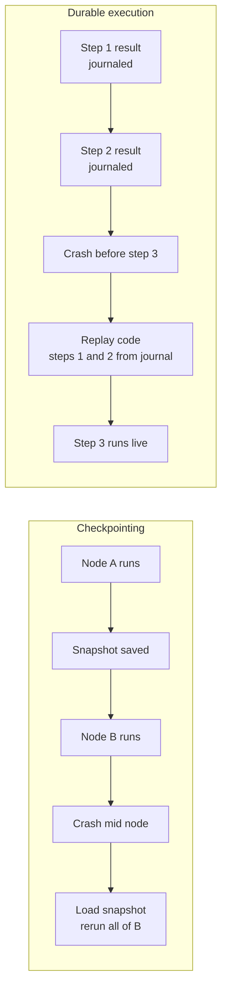
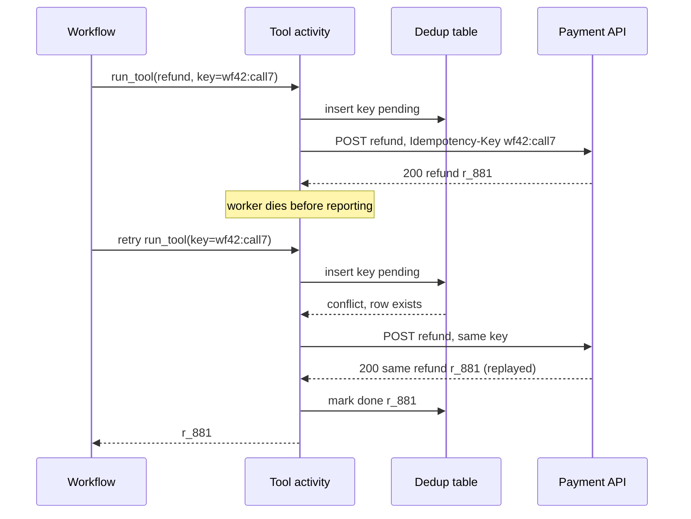
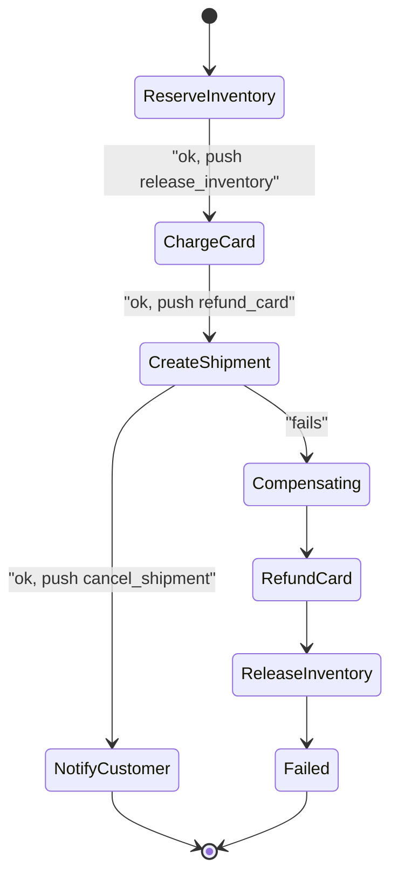
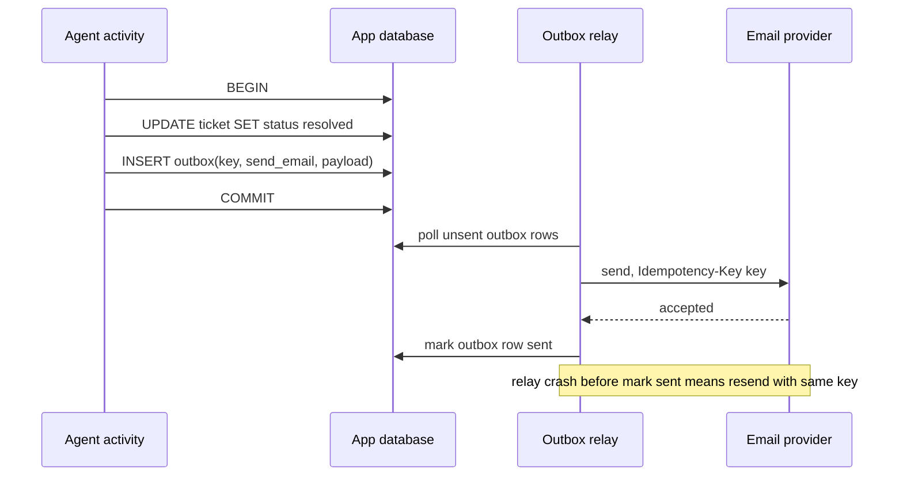
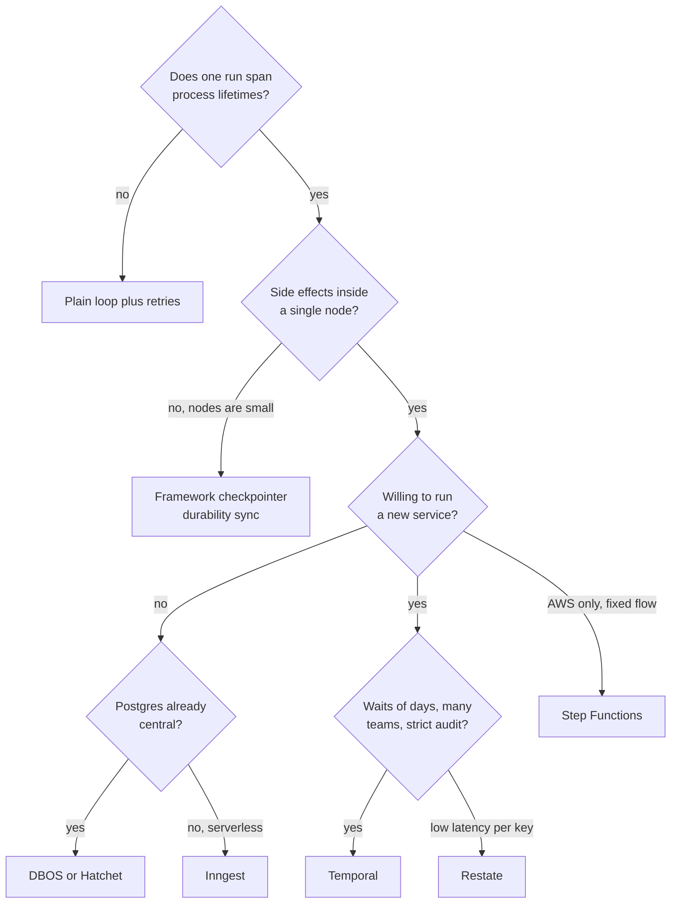
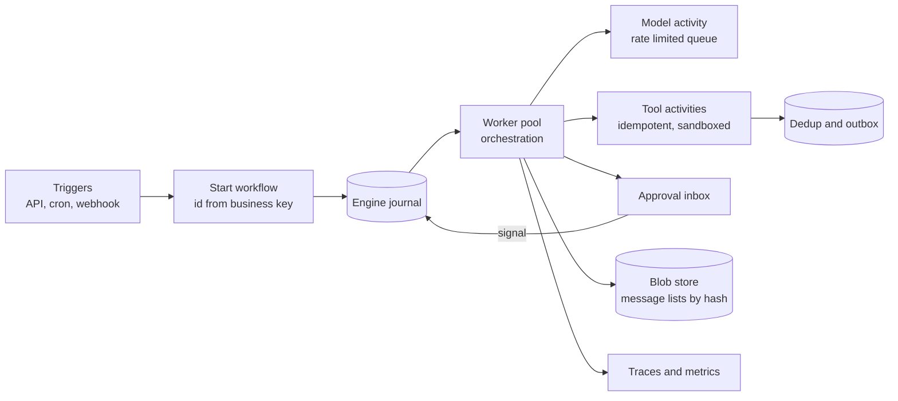
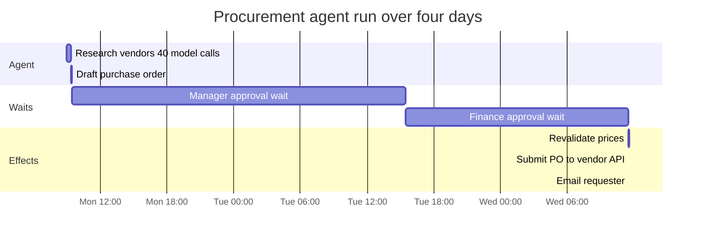

# Chapter 22: Durable Execution and Long-Running Agents

> **What this chapter covers**: The difference between checkpointing agent state and durable execution by journal replay; the engines (Temporal, Restate, DBOS, Inngest, Hatchet, AWS Step Functions) and how they differ; idempotency keys and side-effect deduplication on tool calls; resume after crash, pause for approval over days, background, scheduled, and event-triggered agents; rollback risks, compensation with sagas, checkpoint integrity; and the determinism constraints that LLM calls impose on workflow code.
>
> **Prerequisites**: Chapters 01, 05, 06, 21 (and the LangGraph chapter in Part III for checkpointers).
>
> **Where it is used**: Any agent that runs longer than one HTTP request, touches external systems with side effects, waits on humans, or runs in the background. Chapter 23 (approval gates) and Chapter 24 (sandboxed tool execution) build on it.

---

## 22.1 Level 1: Foundations

### 22.1.1 The problem

A request-scoped agent lives inside one process for one request. If that process dies, the user retries and nothing important is lost. Production agents rarely stay in that box. A refund agent calls a payment API, then waits two days for a manager's approval, then emails the customer. A research agent runs for forty minutes and makes 300 model calls. A nightly reconciliation agent is started by a cron trigger with nobody watching.

Every one of these has three properties that a plain loop cannot handle:

1. **Its lifetime exceeds the lifetime of any single process.** Deploys, OOM kills, spot preemption, and laptop sleep all happen within forty minutes, never mind two days.
2. **It has side effects in the world.** Charging a card twice is not a retry, it is an incident.
3. **Its work is expensive to redo.** Re-running 300 model calls because step 301 failed costs money and, worse, produces a different trajectory, because the model is not deterministic.

Durability is the property that the agent's progress survives failures of the machinery running it. There are two families of technique for getting it.

### 22.1.2 Checkpointing versus durable execution

**Checkpointing** saves a snapshot of the application state at chosen boundaries. LangGraph's checkpointer writes the graph state after each super-step, keyed by `thread_id`. To resume, you load the latest snapshot and continue from the next node. The unit of recovery is the node. Anything that happened inside a node that crashed half way is re-run from the start of that node.

**Durable execution** records a journal (an event history) of every non-deterministic operation the program performs: each activity or step call, its inputs, its result, each timer, each signal received. To resume, the engine re-runs the program's code from the top, and every time the code asks for an operation that already has a result in the journal, the engine returns the recorded result instead of performing it again. This is called **replay**. The code reaches the point of failure with all its local variables reconstructed, then continues live.

| Aspect | Checkpointing (LangGraph style) | Durable execution (Temporal style) |
|---|---|---|
| What is saved | State snapshot at node boundaries | Journal of every step result, timer, signal |
| Recovery unit | The node | The individual step (activity) |
| How you resume | Load snapshot, run next node | Re-run code, replay journal, continue |
| Constraint on code | State must be serializable | Orchestration code must be deterministic |
| Waiting for days | Possible, via interrupt plus stored thread | Native: durable timers and signals, no process held |
| Who retries a failed call | You, inside the node | The engine, with a declared retry policy |
| Typical infra | A database table | An engine service (or a library over Postgres) |

Neither is strictly better. Checkpointing is simple and cheap when nodes are small and idempotent. Durable execution is the right tool when a single logical unit contains several side effects, when waits are long, and when you want the engine to own retries, timeouts, and scheduling.



### 22.1.3 Vocabulary

- **Workflow**: the orchestration function. In durable engines it must be deterministic given its inputs and the journal.
- **Activity / step**: a unit of non-deterministic work (an LLM call, an HTTP request, a database write). Its result is recorded once.
- **Journal / event history**: the append-only log of what happened.
- **Replay**: re-executing workflow code against the journal to reconstruct state.
- **Signal / event**: an external message delivered into a running workflow (an approval, a webhook).
- **Durable timer**: a sleep that is stored in the engine, not held by a process. `sleep(3 days)` costs nothing while it waits.
- **Idempotency key**: a unique identifier attached to a side-effecting request so that a repeat is recognised and not re-applied.
- **Compensation**: an action that semantically undoes a completed step (refund for charge, cancel for booking).
- **Saga**: a sequence of steps each paired with a compensation, run in reverse on failure.

### 22.1.4 Why agents make this harder than ordinary workflows

Classic workflow engines were built for business processes where the steps are fixed at authoring time. An agent's steps are chosen at run time by the model. Three consequences follow.

- **The step list is dynamic.** The workflow is a loop: call the model, read tool calls, run tools, repeat. The journal records whatever the model chose. That is fine, because replay returns the recorded model outputs, so the loop takes the same branches.
- **The model call is the least deterministic operation in the program.** It must be an activity. If it ran inline in workflow code, replay would call the model again and get a different answer, and the journal would no longer match.
- **Payloads are large.** A single model response with a long context can be tens of kilobytes; a 300-step history is megabytes. Engines have payload and history limits that agent workloads hit.

### 22.1.5 How much durability does an agent need?

| Agent profile | Duration | Side effects | Human waits | Recommended |
|---|---|---|---|---|
| Q&A over docs | Seconds | None | None | Plain loop, retry on error |
| Ticket triage, tags only | Seconds | Reversible, internal | None | Plain loop plus idempotent writes |
| Coding agent in a sandbox | Minutes to an hour | Sandbox files, a PR at the end | Optional review | Checkpointer with `sync` durability |
| Refund or booking agent | Minutes to days | External, costly | Yes | Durable engine, idempotency, saga |
| Nightly batch agent | Hours | Many writes | Exceptions only | Durable engine with schedules and leases |

The dividing line is not duration alone. It is the combination of external side effects and waits.

---

## 22.2 Level 2: Working knowledge

### 22.2.1 The engines at a glance

All facts below were checked against vendor documentation in September 2026. Check current docs before relying on limits.

| Engine | Model | Where state lives | Agent integrations (verified Sep 2026) | Good fit |
|---|---|---|---|---|
| Temporal | Workflow code plus activities, full event history replay | Temporal service (self-host or Temporal Cloud) | OpenAI Agents SDK integration, Python GA as of March 2026 (TypeScript still pre-stable); Pydantic AI | Long-lived, high-stakes, many side effects, polyglot teams |
| Restate | Handlers with a durable journal, virtual objects with keyed state | Restate server (single binary) | Pydantic AI, Vercel AI SDK, OpenAI Agents SDK, Google ADK examples | Low-latency services, per-key serialisation (one session per object) |
| DBOS Transact | Library, workflows and steps checkpointed to Postgres | Your Postgres | Pydantic AI | Teams that want durability without a new service |
| Inngest | Event-driven functions of `step.*` calls, re-invoked over HTTP | Inngest platform (cloud or self-host) | AgentKit, `step.ai.infer` and `step.ai.wrap` | Serverless apps, event triggers, fan-out |
| Hatchet | Task queue plus durable tasks, DAGs | Postgres | General SDKs (Python, TS, Go) | Self-hosted queues with durability, high task throughput |
| AWS Step Functions | JSON state machine (Amazon States Language) | AWS | Bedrock and Lambda integrations | AWS-native shops, auditable fixed flows |
| LangGraph checkpointer | Snapshot per super-step | Postgres, SQLite, Redis, etc. | Native to LangGraph | Graph agents where node-level recovery is enough |

Pydantic AI's documentation lists four officially supported durable backends: Temporal, DBOS, Prefect, and Restate (checked September 2026). That list is a useful signal of which engines have matured into agent runtimes.

### 22.2.2 The canonical durable agent loop

The shape is the same in every engine. The workflow holds the loop and the message list. Every model call and every tool call is an activity.

```python
@workflow.defn
class SupportAgent:
    @workflow.run
    async def run(self, ticket: Ticket) -> Outcome:
        msgs = [system_prompt(), user_msg(ticket)]
        for turn in range(MAX_TURNS):
            resp = await workflow.execute_activity(
                call_model, ModelReq(msgs, TOOLS),
                start_to_close_timeout=timedelta(minutes=2),
                retry_policy=RetryPolicy(maximum_attempts=5))
            msgs.append(resp.message)
            if not resp.tool_calls:
                return Outcome(resp.text)
            for tc in resp.tool_calls:
                if tc.name in HIGH_RISK:
                    await workflow.wait_condition(lambda: self.decision is not None,
                                                  timeout=timedelta(days=3))
                result = await workflow.execute_activity(
                    run_tool, ToolReq(tc, idem_key=f"{workflow.info().workflow_id}:{tc.id}"),
                    start_to_close_timeout=timedelta(minutes=5))
                msgs.append(tool_result(tc.id, result))
        return Outcome.escalate("max turns")
```

Read it line by line for what is durable:

- `call_model` is an activity. On replay, its recorded response is returned. The model is never re-asked.
- The approval wait is a durable condition with a three-day timeout. No worker is held for three days. When the signal arrives, a worker picks the workflow up, replays to this line, and continues.
- `run_tool` carries an idempotency key built from the workflow ID and the model's tool call ID. The tool implementation passes that key to the downstream API.
- `MAX_TURNS` and `HIGH_RISK` are constants. If you change them in a deploy while workflows are in flight, replay can diverge (see 22.3.4).

### 22.2.3 Idempotency keys and side-effect deduplication

Durable engines give you **at-least-once** activity execution, not exactly-once. The failure that proves it: the activity calls the payment API, the charge succeeds, and the worker dies before reporting completion to the engine. The engine sees no result, so it retries. Without protection, the customer is charged twice.

Exactly-once *effect* comes from pairing at-least-once execution with an idempotent receiver.

1. **Derive the key deterministically.** `workflow_id + ":" + step_id` or `workflow_id + ":" + tool_call_id`. Never `uuid4()` inside the activity, because a retry would generate a new key.
2. **Send it to the downstream system.** Stripe-style APIs accept an `Idempotency-Key` header and return the original response for a repeat. Check each provider's retention window; a key that expired before your retry is no key at all.
3. **When the downstream has no idempotency support, build a dedup table.** Before the side effect, insert `(key, status='pending')` with a unique constraint. After it, update to `done` with the result. On retry, a `done` row returns the stored result; a `pending` row means "unknown outcome", which needs a reconciliation read (query the downstream for whether the effect happened) before acting.
4. **For email, messages, and webhooks**, which have no natural read-back, prefer a provider that supports idempotency keys, or accept a small duplicate risk and record it in the risk register.

The model adds a twist. On a *non-replayed* retry of the model call (for example, the model activity timed out and ran again), the model may choose a different tool call with a different `tool_call_id`. The idempotency key then differs, and a semantically duplicate action can be issued. Two defences: key on the *semantic* operation where one exists (`refund:{order_id}:{amount}`), and keep business invariants in the tool (one refund per order unless explicitly overridden).



### 22.2.4 Resume after crash

What "resume" means differs by technique.

- **Durable engine**: nothing to do. The engine notices the lost worker (heartbeat or task timeout), reschedules the workflow task on another worker, which replays. Activities in flight are retried under their retry policy.
- **LangGraph checkpointer**: the next invocation on the same `thread_id` loads the last checkpoint. With `durability="sync"` every step's checkpoint is written before the next step begins; `"async"` writes while the next step runs and can lose the last step on a crash; `"exit"` writes only when the graph exits (success, error, or interrupt) and cannot recover from a mid-run crash (LangGraph docs, checked September 2026). Pick `sync` for anything with side effects.
- **Hand-rolled**: you need a sweeper that finds runs whose heartbeat is older than a threshold and re-enqueues them. This is where most home-grown systems fail: two sweepers pick up the same run, or a slow but alive worker is declared dead. Use a lease with a fencing token (a monotonically increasing version checked on every write).

### 22.2.5 Pause for approval over days

Human approval is the most common reason an agent must outlive its process. The pattern:

1. The workflow reaches a gated action and records a pending approval (with the proposed action, arguments, and a rendered explanation for the approver).
2. It notifies the approver (Slack, email, a queue in an admin UI). The notification is itself an idempotent activity.
3. It waits on a durable condition with a timeout. Temporal uses signals or updates plus `wait_condition`; Inngest uses `step.waitForEvent` which resolves to the event or `null` on timeout; Restate uses durable promises or awakeables; DBOS uses `recv` on a workflow topic; LangGraph uses `interrupt()` and a later `Command(resume=...)`.
4. On approval, it re-validates. Three days is a long time: the order may have been cancelled, the price may have changed. **Re-read the world before acting on a stale approval.**
5. On timeout, it follows a declared policy: escalate, auto-reject, or auto-approve for low tiers. Never leave "what happens on timeout" undefined.

A subtle LangGraph point: on resume, the node that called `interrupt()` restarts from its beginning, so any code before the `interrupt()` call runs again. Side effects placed before an interrupt in the same node will repeat. Put them in a separate node or make them idempotent.

### 22.2.6 Background, scheduled, and event-driven agents

| Trigger | Example | Mechanism | Pitfall |
|---|---|---|---|
| User request, runs in background | "Research these 20 vendors" | Start workflow, return run ID, stream progress (Chapter 23) | User closes tab; results must be retrievable later |
| Schedule | Nightly invoice reconciliation | Temporal Schedules, Inngest cron, EventBridge Scheduler to Step Functions | Overlap: last night's run still going. Declare an overlap policy (skip, buffer, cancel previous) |
| Event | New support ticket, file uploaded, webhook | Inngest event triggers, Restate ingress, a queue consumer starting workflows | Duplicate events from at-least-once delivery. Use the event ID as the workflow ID |
| Agent-to-agent | Planner delegates to sub-agent | Child workflows | Cancellation must propagate to children |

Using the event ID (or a hash of the business key) as the workflow ID is the single most useful trick in this table. Every engine rejects or deduplicates a second start with the same ID in some form, so duplicate webhook deliveries collapse to one run for free. DBOS documents this directly: setting a workflow ID makes a repeat call return the original result.

### 22.2.7 The same step in three engines

The mechanism is identical; the syntax tells you where the engine draws the step boundary. Sketches, simplified from each vendor's documented patterns (check current SDK signatures):

```python
# DBOS: decorators, state in your Postgres
@DBOS.step()
def call_model(msgs): return llm.create(msgs, tools=TOOLS)

@DBOS.workflow()
def agent(ticket_id):
    msgs = start_msgs(ticket_id)
    while True:
        resp = call_model(msgs)          # checkpointed output
        if not resp.tool_calls: return resp.text
        for tc in resp.tool_calls:
            msgs.append(run_tool(tc))    # also a @DBOS.step
```

```typescript
// Inngest: each step.run is memoised by its id
export const agent = inngest.createFunction(
  { id: "support-agent" }, { event: "ticket/created" },
  async ({ event, step }) => {
    let msgs = startMsgs(event.data);
    for (let turn = 0; turn < 20; turn++) {
      const resp = await step.run(`model-${turn}`, () => callModel(msgs));
      if (!resp.toolCalls.length) return resp.text;
      for (const tc of resp.toolCalls)
        msgs.push(await step.run(`tool-${turn}-${tc.id}`, () => runTool(tc)));
    }
  });
```

Notice the Inngest step IDs. They must be stable across invocations, because the platform matches memoised results by ID. `model-${turn}` is stable; `model-${Date.now()}` would re-run the model every invocation. The same determinism rule, surfacing as a naming rule.

### 22.2.8 Scheduled agents: overlap arithmetic

A nightly reconciliation agent starts at 02:00. Median run 50 minutes, p95 110 minutes, p99 190 minutes (synthetic but typical of long-tailed agent runs). The schedule is every 2 hours during month-end close.

- With a 2-hour interval, runs overlap whenever a run exceeds 120 minutes: about 4 percent of runs, given p95 at 110 and p99 at 190.
- Over a 5-day close with 12 runs a day, that is 60 runs and about 2 to 3 overlaps.
- Overlap policy choices: **skip** (the next run does not start; data processed one cycle later), **buffer one** (start as soon as the current finishes), **cancel previous** (dangerous if the previous is mid side effect), **allow all** (two agents reconciling the same ledger concurrently: conflicting writes).

For a reconciliation agent with writes, skip or buffer-one are the only safe choices, and the agent should take a lease on the ledger partition it works on regardless. Temporal Schedules document overlap policies of this kind; for cron-driven systems without them, use the business key (ledger, date) as the workflow ID so a second start is rejected.

### 22.2.9 LangGraph checkpointer alone versus inside an engine

| Concern | LangGraph checkpointer only | LangGraph run as activity inside an engine |
|---|---|---|
| Crash mid node with side effect | Node reruns; idempotency is your job | Same inside the activity, but engine owns retry policy |
| Wait for approval | `interrupt()`, resume needs your API to call back | Engine signal; interrupt maps to workflow wait |
| Timers ("remind in 2 days") | Not native; needs an external scheduler | Native durable timers |
| Scheduled and event starts | External cron or queue | Engine schedules and dedup by ID |
| Operational load | One database | Engine plus database |
| Recovery granularity | Node | Activity (which may be a whole graph step) |

Many teams start with the left column and move to the right when they first need a timer or hit a double side effect.

---

## 22.3 Level 3: Depth

### 22.3.1 How replay actually works

Take Temporal as the reference because its model is the most explicit. A workflow execution is a sequence of *workflow tasks*. In each task, a worker runs workflow code until it blocks on something (an activity result, a timer, a signal). Each blocking call emits a *command* (ScheduleActivityTask, StartTimer). The service records the commands and the resulting events in history.

On replay, the worker runs the code from the start. Each time the code emits a command, the SDK checks it against the next matching event in history. If it matches and a result exists, the result is returned immediately. If the code emits a command that does not match history (a different activity type, a timer where an activity was expected), the SDK raises a non-determinism error and the workflow task fails until someone fixes the code.

Replay cost grows with history length. A 300-turn agent with two activities per turn has around 600 activities and several thousand events. Replaying that on every worker handoff is slow and hits history limits. The standard fix is **continue-as-new**: at a turn boundary, the workflow starts a fresh execution of itself, passing compacted state (the summarised message list plus pointers) as input. History resets. This interacts well with context compaction from Chapter 06: compaction is a natural continue-as-new point.

### 22.3.2 The determinism contract

Workflow code must produce the same sequence of commands given the same history. Things that break this:

| Breaks determinism | Why | Do instead |
|---|---|---|
| Calling the LLM in workflow code | Different output on replay | Activity |
| `datetime.now()`, `time.time()` | Different value on replay | Engine time API (`workflow.now()`) |
| `random`, `uuid4()` | Different value | Engine-provided deterministic random or UUID, or generate inside an activity |
| Iterating a set or unordered dict of tools | Order can differ across processes | Sort, or use ordered structures |
| Reading env vars or config files that change | Different branch after deploy | Pass config as workflow input, or version it |
| Threads, network I/O | Unrecorded non-determinism | Activities |
| Changing the order or type of activities in a deploy | Replay of old histories diverges | Versioning or patching APIs, or worker build IDs |

The Temporal Python SDK runs workflow code in a sandbox that intercepts many known non-deterministic calls, but the docs state it is not complete isolation; libraries can still mutate global state. Treat the sandbox as a guard rail, not a guarantee.

Restate, DBOS, and Inngest have the same contract in different clothes. Inngest re-invokes your function over HTTP and skips `step.run` calls with memoised results, so code outside `step.*` runs on every invocation and must be deterministic and side-effect free. DBOS re-executes the workflow function and returns checkpointed step outputs. Restate replays the journal against the handler. In all of them: **orchestration logic deterministic, everything else inside a step**.

### 22.3.3 Payload size and the LLM message list

Engines impose payload limits. Some are published and stable, some change. As of September 2026, AWS Step Functions documents a 256 KB limit on state input and output and a 25,000-event execution history hard quota, with Standard workflows running up to one year and Express up to five minutes. Temporal documents per-payload and per-history limits in its docs; check them for your deployment, as Cloud and self-hosted defaults differ.

A worked budget. A support agent with a 6,000-token system prompt and tool definitions, 30 turns, average 800 tokens per turn of model output plus tool results:

- Tokens in the final message list: 6,000 + 30 × 800 = 30,000 tokens.
- At roughly 4 characters per token for English plus JSON overhead of about 1.3×: 30,000 × 4 × 1.3 = 156,000 bytes, about 152 KB.
- If each model activity receives the full message list as input and returns its response, the history stores the input on every call. Sum over turns: the input at turn *t* is about 6,000 + 800*t* tokens. Sum over *t* = 1..30 is 30 × 6,000 + 800 × 465 = 552,000 tokens, about 2.9 MB of history.

The same run with a claim check and continue-as-new every 10 turns:

| Design | History bytes per 30-turn run (approx.) | Replay work on handoff |
|---|---|---|
| Full message list in every activity input | 2.9 MB | All 60 activities |
| Claim check (64-byte hash per input) | Under 50 KB plus outputs | All 60 activities, tiny payloads |
| Claim check plus continue-as-new every 10 turns | Under 20 KB per execution | At most 20 activities |
| Deltas only (new messages per turn) | About 150 KB | All 60 activities |

The quadratic term disappears as soon as inputs stop carrying the whole list. Continue-as-new then bounds replay time, which matters more than bytes once runs reach hundreds of turns.

That is fine in some engines and fatal in others. Two fixes: store the message list in an external blob store (S3, Postgres) and pass a reference plus a content hash into activities (the **claim check** pattern), or keep state in the workflow but pass only deltas into activities. The claim check has an integrity cost covered in 22.3.6.

### 22.3.4 Versioning in-flight workflows

An agent workflow that waits three days for approval will span deploys. You change the prompt, add a tool, reorder a guard. The paused workflow wakes up on new code and replays its old history.

- **Prompt text change inside an activity**: safe. Activities are not replayed; only their results are.
- **New tool added to the tool list passed to the model**: safe if the list is built inside the activity, unsafe if built in workflow code and it changes which commands are emitted.
- **New guard step (an extra activity before tool execution)**: unsafe for in-flight runs. Use the engine's versioning or patching API (`workflow.patched("guard-v2")` in Temporal) so old histories take the old branch, or pin old runs to old worker builds.
- **Changed `MAX_TURNS`**: safe only if the new value does not change a decision already recorded.

Rule of thumb: everything the model sees is built in activities; everything the workflow branches on is versioned.

### 22.3.5 Compensation and sagas

Some agent actions cannot be undone by deleting a row. A booked flight is cancelled, possibly with a fee. A sent email cannot be recalled. The saga pattern structures this: each step registers a compensating action when it succeeds; on a later failure, compensations run in reverse order.



Four hard truths about sagas with agents:

1. **Compensations are also side effects.** They need idempotency keys and retries. A refund that fails leaves you worse off than either state.
2. **Some steps have no compensation.** Place them last (a pivot step). Send the confirmation email only after everything that could fail has succeeded.
3. **The model should not improvise compensation.** When a step fails, the workflow code, not the model, decides which compensations run. Asking the model "the shipment failed, what should we do?" produces creative and unauditable recovery. Let the model explain the failure to the user; let code roll back.
4. **Compensation is semantic, not literal.** The refund appears on the customer's statement. The world observed the intermediate state. Tell the user.

### 22.3.6 Checkpoint integrity

A checkpoint that is wrong is worse than none, because the system resumes confidently into a bad state.

- **Torn writes**: state and side effect recorded non-atomically. The side effect happened, the checkpoint says it did not. Fix: dedup table plus reconciliation read, or transactional outbox (write the intent and the state in one database transaction, have a relay perform the effect).
- **Schema drift**: the state class gained a field; old checkpoints deserialise with a default that means something else. Fix: version the state schema, write migrations, test deserialising a corpus of real old checkpoints in CI.
- **Claim-check mismatch**: the workflow holds a reference to a message list blob; someone overwrote the blob. Fix: content-addressed storage (the reference is the hash), immutable writes.
- **Poisoned state**: a prompt injection in a tool result is now in the persisted message list and will be replayed into every future model call for this run. Fix: sanitise and tag untrusted content before it is persisted, and give operators a way to edit or fork a run from an earlier checkpoint (LangGraph supports forking from a prior checkpoint; Temporal supports reset to a prior workflow task).
- **Tampering**: checkpoint stores are an attack surface. A writable checkpoint table lets an attacker change what the agent believes it already approved. Restrict write access to the runtime and sign or hash approval records.

### 22.3.7 Rollback risks

"Reset to an earlier point and re-run" is a powerful debugging tool and a dangerous production tool. Resetting a Temporal workflow to before an activity means that activity runs again. If it was a payment and the idempotency key is derived from the workflow ID and step ID, the payment API returns the original charge and all is well. If the key included an attempt counter, you just charged twice. Before any reset or fork in production, list the side effects after the reset point and confirm each is idempotent or compensable.

### 22.3.8 A replay trace, step by step

Abstract descriptions of replay hide the part that matters: what the worker actually does with each line of history. Here is a synthetic refund run, shown as the event history the engine stores, then as what a new worker does after a crash.

The run: the model looks up an order, proposes a $340 refund, waits for approval, executes the refund, and replies.

| Event | Type | Payload summary | Recorded result |
|---|---|---|---|
| 1 | WorkflowStarted | ticket T-5521, model pinned | |
| 2 | ActivityScheduled | call_model, turn 1 | |
| 3 | ActivityCompleted | | tool call orders_get(SYN-10442), 1,180 output tokens billed |
| 4 | ActivityScheduled | run_tool orders_get, key wf-T5521:c1 | |
| 5 | ActivityCompleted | | delivered, damaged flag, total $340 |
| 6 | ActivityScheduled | call_model, turn 2 | |
| 7 | ActivityCompleted | | tool call refund_order(340.00) |
| 8 | ActivityScheduled | notify_approver | |
| 9 | ActivityCompleted | | Slack message ts 1727... |
| 10 | TimerStarted | approval timeout 72 h | |
| 11 | SignalReceived | approval, approver A-17, amount 340.00 | |
| 12 | ActivityScheduled | revalidate_order | |
| 13 | ActivityCompleted | | still delivered, no prior refund |
| 14 | ActivityScheduled | run_tool refund_order, key wf-T5521:c2 | |
| 15 | (worker crashes here) | | |

Now a new worker picks the workflow up. It runs the workflow function from line one.

1. The code calls `call_model` for turn 1. The SDK finds events 2 and 3, returns the recorded tool call. No model call, no tokens billed.
2. The code calls `run_tool(orders_get)`. Events 4 and 5 match. The recorded order is returned. No HTTP call.
3. Turn 2 model call: events 6 and 7. Recorded refund proposal returned.
4. `notify_approver`: events 8 and 9. The Slack message is not sent again.
5. The code waits for the approval condition. Event 11 is already in history, so the condition is true immediately.
6. `revalidate_order`: events 12 and 13 replayed.
7. `run_tool(refund_order)`: event 14 says it was scheduled but there is no completion. The engine treats the activity as in flight; after its start-to-close timeout it is retried. This is the only live work, and it is the dangerous one, which is why the key `wf-T5521:c2` exists.

Cost of this recovery: zero model tokens, zero Slack messages, one refund request that the payment API deduplicates. Without durability, the same crash means re-running from the ticket: two model calls (roughly $0.14 at the chapter's illustrative prices), a second Slack notification, a second approval request to a manager who already approved, and a possible double refund.

Two things the trace makes obvious. First, **every line of workflow code between events must be deterministic**, because the worker re-executes it to reach step 7. Second, **the approval signal is history**. A worker that replays after the signal does not wait again. If you had implemented the wait as "poll a database row every minute" inside an activity, a replay would re-run the poll, and if an operator had since cleared the row, the workflow would wait forever.

### 22.3.9 Idempotency under the three failure windows

A side-effecting activity has three windows in which the worker can die. Each needs a different answer.

| Window | What happened downstream | What the engine sees | Safe handling |
|---|---|---|---|
| Before the request left | Nothing | Activity timed out | Retry freely |
| After request, before response | Unknown: may have applied | Activity timed out | Retry with same idempotency key, or reconcile by reading downstream |
| After response, before completion recorded | Applied | Activity timed out | Retry with same key returns original response; without key, duplicate |

Worked dedup table example with numbers. A synthetic bank-ops agent issues 40,000 fee reversals a month through an internal API that has no idempotency support. Worker crash and timeout rate on that activity measured at 0.3 percent. Without dedup, roughly one third of timeouts fall in the third window (the request is fast relative to the post-processing), so expected duplicates are 40,000 × 0.003 × 0.33 ≈ 40 duplicate reversals a month. Each costs a manual clawback at, say, 20 minutes of an operator's time: 13 hours a month plus customer confusion. A dedup table with a unique key and a reconciliation read on `pending` rows drops this to near zero at the cost of one extra database write per call (about 2 ms) and one read per retry.

The reconciliation read is the part teams skip. A `pending` row means "I started and do not know how it ended". Retrying blindly is only safe if the downstream is idempotent. Otherwise, read: "does account X have a reversal for fee F?" If yes, mark done with the found ID. If no, proceed. If the read API does not exist, the operation cannot be made safely retryable, and it must be escalated to a human on unknown outcome. Write that down as a known limitation.

### 22.3.10 The transactional outbox

When the agent's own database is the system of record, the cleanest way to make "update state and cause a side effect" atomic is the outbox.



The activity never talks to the email provider. It commits state and intent in one transaction, which either both happen or neither do. The relay performs the effect at least once, and the idempotency key makes the provider deduplicate. The trade-off is latency (the email goes out on the next relay poll, typically sub-second to a few seconds) and one more component to run. For agents whose side effects are mostly writes to your own systems plus notifications, the outbox is often simpler than a full workflow engine.

### 22.3.11 A catalogue of production failures

These are the failure patterns that recur in durable agent systems, with their signature and fix.

| Failure | Signature | Root cause | Fix |
|---|---|---|---|
| Non-determinism error after deploy | Workflow tasks failing on replay, runs stuck | Changed command order or type in workflow code | Patching API, worker build pinning, replay tests in CI |
| Double side effect | Customer charged twice, two emails | Random idempotency key, or key includes attempt count | Deterministic key from workflow and step, or semantic key |
| Stuck forever | Run waiting with no timer | Wait without timeout; approver left company | Every wait has a timeout and a timeout policy |
| History limit reached | Workflow terminated by engine | Full message list in every activity input | Claim check, continue-as-new |
| Retry storm | Provider 429s, rising cost | Tight retry policy on model activity across thousands of runs | Exponential backoff with jitter, max attempts, a shared rate limiter |
| Poisoned run | Every turn repeats an injected instruction | Untrusted tool output persisted in state | Sanitise and label, fork from clean checkpoint |
| Ghost approval | Action executed on outdated approval | No revalidation after long wait | Revalidate world state; bind approval to argument hash |
| Orphaned children | Sub-agents keep spending after parent cancelled | Cancellation not propagated | Parent close policy on child workflows; activities check cancellation |
| Silent partial saga | Card refunded, inventory never released | Compensation failed without alert | Compensations retried and alerted; dead-letter queue with owner |
| Clock skew bugs | Timeout fired early or late | `datetime.now()` in workflow code | Engine time API |

The retry storm deserves arithmetic. 2,000 concurrent research runs each hit a provider 429. Retry policy: initial interval 1 s, no jitter, max 10 attempts. All 2,000 retry at t = 1 s, again at t = 2 s, 4 s, and so on, in synchronised waves that keep the provider saturated. With full jitter (retry at a random point in [0, backoff]), the 2,000 retries at the first backoff spread over one second, second backoff over two seconds, and the aggregate request rate falls below the provider limit within a few waves. Better still, a shared token-bucket rate limiter in front of model activities (one per provider key) so the engine queues work instead of hammering.

### 22.3.12 LLM-specific determinism traps

Beyond the generic rules, agent code has its own traps.

- **Building the tool list in workflow code from a registry.** If the registry changes between the original run and replay, the list differs. Harmless if the list is only passed into the model activity (activity inputs are not compared on replay in most engines), dangerous if workflow code branches on it (`if "refund_order" in tools`).
- **Token counting in workflow code.** A tokenizer library upgrade changes counts, which changes when compaction triggers, which changes the command sequence. Count tokens inside an activity and record the result.
- **Parsing model output in workflow code.** Safe if the parser is pure and versioned. Unsafe if a parser upgrade changes how a borderline tool call is interpreted. Parse inside the model activity and return a structured result.
- **Parallel tool calls.** If the model returns three tool calls and workflow code starts three activities in parallel, the order they are scheduled must be deterministic (iterate the list in order). Waiting on "whichever finishes first" is fine only through the engine's own deterministic selector.
- **Streaming.** Streaming tokens to a user from inside an activity is fine, but the stream is not replayed. After a crash, the user's UI sees a gap. Store stream events with sequence numbers outside the engine (Chapter 23) so the UI can reattach.

---

## 22.4 Level 4: Mastery

### 22.4.1 Choosing a runtime



Senior judgement sits in three places this chart hides.

- **Operational cost.** Temporal self-hosted is a real distributed system with its own database and scaling concerns. Temporal Cloud moves that to a bill. DBOS moves durability into your existing Postgres, which is cheap until your Postgres becomes the bottleneck for both your app and your workflow journal.
- **Language and team.** Workflow code is a programming model. A team fluent in Temporal's determinism rules ships safely; a team new to it will ship non-determinism errors to production during its first prompt change.
- **Where the agent loop lives.** If you already built on LangGraph, you can keep LangGraph as the reasoning layer and run each graph invocation as an activity inside a durable workflow, or rely on the LangGraph checkpointer alone. Nesting both is legitimate but you now have two sources of truth about progress; pick which one owns retries.

### 22.4.2 Cost arithmetic of durability

Worked example. A research agent: 120 model calls per run, average 18,000 input tokens and 900 output tokens per call, at an illustrative price of $3 per million input tokens and $15 per million output tokens (use your provider's current price sheet).

- Cost per model call: 18,000 × 3 / 10⁶ + 900 × 15 / 10⁶ = $0.054 + $0.0135 = $0.0675.
- Cost per run: 120 × $0.0675 = $8.10.
- Suppose 4 percent of runs are interrupted (deploys, preemption) at a uniformly random point. Without durability, an interrupted run restarts from zero, wasting on average half a run: 0.04 × 0.5 × $8.10 = $0.162 per run on average.
- At 5,000 runs a month: $810 a month of wasted tokens, plus the harder cost that the restarted run takes a different trajectory and users see inconsistent results.
- With durability the waste is at most the in-flight model call: 0.04 × $0.0675 × 5,000 = $13.50 a month.

Whether $800 a month justifies running a workflow engine depends on the team, but the consistency argument usually wins before the cost argument does.

Prompt caching interacts with replay favourably: replay does not call the model, so it does not touch the cache at all. Live continuation after a long pause does: provider cache TTLs are minutes to an hour (Chapter 06), so the first call after a two-day approval wait pays full input price. Budget for it.

### 22.4.3 Long-running agent architecture



Design decisions visible in the diagram:

- **Separate task queues for model activities and tool activities.** Model calls need provider rate limiting and concurrency caps; tool calls need access to internal networks and credentials. Different worker pools, different security boundaries.
- **The engine is the rate limiter's memory.** When the provider returns 429, the activity fails with a retryable error and the engine's backoff handles it. Do not sleep inside activities.
- **Heartbeats for long tools.** A tool that runs a 20-minute sandbox job should heartbeat with progress so the engine can distinguish slow from dead, and so a retry can resume from the last heartbeat detail.
- **Cancellation.** A user who cancels a background research run expects model spend to stop within seconds. Propagate cancellation to activities (they must check for it) and to child workflows.

### 22.4.4 Observability of durable agents

Traces (Chapter 27) and workflow history are two views of the same run. Link them: put the workflow ID and run ID on every span, and put the trace ID in workflow memo or search attributes. When an on-call engineer opens a stuck run, they need to see both "the engine is waiting on signal `approval`" and "the last model call proposed a refund of $4,200". Metrics that matter: runs waiting on human by age bucket, activity retry rate by tool, non-determinism errors (should be zero), history size percentiles, and compensation executions.

### 22.4.5 Where practitioners disagree

- **"Just use a queue and a database."** Many teams argue durable engines are overkill and a job table plus idempotent handlers is enough. For short agents with one side effect at the end, they are right. The argument fails once there are waits, multiple side effects, and cancellation; teams then rebuild half an engine, badly.
- **Framework-native durability vs external engine.** LangGraph, the OpenAI Agents SDK, Vercel's AI SDK 7 (which added a `WorkflowAgent` for durable execution, June 2026), and Pydantic AI are all adding durability. Vendors of engines argue their journal is the only real durability; framework vendors argue node checkpoints are enough. The honest answer is the failure analysis in 22.2.3: if a node contains a side effect and can crash mid-way, node checkpoints alone do not protect you.
- **Journal the model's thinking or not.** Recording full reasoning content in history helps debugging and is required for some providers to continue a tool loop with thinking blocks intact (Chapter 04). It also bloats history and may store sensitive content. Most teams store it in the blob store under the claim check and keep only a hash in history.
- **Determinism of the model itself.** Some argue temperature 0 makes LLM calls safe to re-run. It does not: providers do not guarantee bitwise determinism across batches and hardware, and model versions change under aliases. Always record.

### 22.4.6 Edge cases a senior engineer plans for

- **The approver approves twice** (double click, two approvers). The signal handler must be idempotent: first decision wins, later ones are logged.
- **The approval arrives after timeout.** The workflow has moved on (auto-rejected). The UI must show "this request expired" rather than silently discarding.
- **A tool's contract changes during a pause.** The model's recorded tool call has arguments valid under the old schema. Validate again at execution time.
- **Provider model deprecation during a long run.** A run paused for a week may resume after a model alias moved. Pin model versions in workflow input for reproducibility; decide per product whether resumed runs should upgrade.
- **Data deletion requests.** A user asks to be forgotten; their data is inside immutable workflow histories. Keep PII in the blob store behind the claim check so it can be deleted, and store only references in history.

### 22.4.7 Engine comparison in more depth

The table in 22.2.1 answers "what is it". This one answers the questions a design review asks. Entries describe architecture as documented in September 2026; operational numbers depend on your deployment and should be measured.

| Question | Temporal | Restate | DBOS | Inngest | Hatchet | Step Functions |
|---|---|---|---|---|---|---|
| New service to run? | Yes (or Cloud) | Yes, single binary (or Cloud) | No, library over Postgres | Platform (cloud or self-host) | Yes, over Postgres (or Cloud) | No, AWS managed |
| Where orchestration code runs | Your workers | Your services | Your process | Your HTTP endpoints | Your workers | AWS (states), Lambda for code |
| Replay model | Full history replay | Journal replay | Re-execute, skip checkpointed steps | Re-invoke, memoised steps | Durable task checkpoints | No replay; state machine transitions |
| Long waits | Timers, signals, updates | Durable timers, awakeables | Sleep, recv | sleep, waitForEvent | Durable sleep, events | Wait state, task tokens |
| Determinism burden | High | High | Medium | Medium | Medium | Low (flow is declarative) |
| Dynamic agent loop fit | Natural | Natural | Natural | Natural | Natural | Awkward; loops via states, payload limits |
| Main operational risk | Running the cluster; history size | Newer ecosystem | Postgres load shared with app | Platform dependency, HTTP timeouts per step | Postgres load | Payload and history quotas, vendor lock |

Step Functions deserves a note. Its model is a declarative state machine, so the determinism burden is low, but a model-driven loop with dynamic tool selection is awkward to express, and the 256 KB payload quota forces the claim-check pattern from turn one. It shines when the agent is one step in a fixed business process (extract, classify with an LLM, route, approve with a task token, write).

### 22.4.8 Testing durable agents

Durable systems fail in ways unit tests do not reach. A test pyramid for them:

1. **Activity unit tests** with mocked downstreams, including idempotency: call twice with the same key, assert one effect.
2. **Workflow tests with a time-skipping test environment.** Temporal's test server can skip durable timers, so a 72-hour approval timeout runs in milliseconds. Script the model activity to return fixed tool calls.
3. **Replay tests.** Save real histories from staging and production (scrubbed), and replay them against every new build in CI. Any non-determinism error fails the build. This single test prevents the most common durable-agent outage.
4. **Chaos tests.** Kill workers at random points during a scripted run (the Level 2 exercise, automated). Assert: exactly one of each side effect, run completes, no stuck runs.
5. **Load tests on the model queue.** Simulate provider 429s and verify backoff and rate limiting keep throughput stable.

Worked sizing for replay tests. Keep 200 representative histories covering every tool and every branch (approval approved, rejected, timed out, escalated, compensated). At a typical few tens of milliseconds per replay for short histories, the whole suite runs in seconds. Refresh the corpus monthly and after adding a tool.

### 22.4.9 Multi-tenant durable agents

In a SaaS product, one engine serves many customers.

- **Isolation of state.** Separate namespaces per tenant (Temporal namespaces, separate schemas in DBOS) or at least a tenant ID in every workflow ID and search attribute with access control on queries.
- **Noisy neighbours.** One tenant starting 50,000 runs should not starve others. Per-tenant concurrency limits on task queues or at start time; Inngest and Hatchet document concurrency keys for this.
- **Per-tenant model keys and rate limits.** If tenants bring their own provider keys, the rate limiter is per key, and a tenant's 429s must not slow other tenants' activities.
- **Data residency.** Workflow history stores inputs and outputs. If a tenant requires EU residency, their history must live in an EU engine deployment, including the message lists you put in it. Another reason for the claim check with regional blob stores.
- **Deletion.** Offboarding a tenant means deleting histories, blobs, dedup rows, and traces. Design the retention policy up front.

### 22.4.10 Timeline of a multi-day run

A synthetic procurement agent shows how the pieces fit over real time.



Workers held during those four days: none, except for the 34 minutes of actual work. Deploys during the waits: probably several, which is why versioning matters. Price change between research and submission: plausible, which is why revalidation precedes the effect. Prompt cache state at submission: cold, which is why the first call after the wait pays full price.

### 22.4.11 Production decision record

A senior engineer writes the durability decisions down. A template with the answers for the support agent used in this chapter:

| Decision | Choice | Reason |
|---|---|---|
| Runtime | Temporal Cloud | Multi-day approvals, several side effects, audit need |
| Model call placement | Activity, own task queue, token-bucket limiter | Determinism, provider limits |
| Tool side effects | Semantic idempotency keys, dedup table, reconciliation reads | At-least-once execution |
| Approval wait | Signal plus 72 h timeout, escalate on timeout | No silent waits |
| Message list | Claim check in S3, content-addressed | History size, deletion |
| Compaction | At 60 percent of context, then continue-as-new | History and context both reset |
| Versioning | Patching API for workflow changes, replay tests in CI | In-flight runs span deploys |
| Compensation | Saga in code, refunds last-before-email | Recoverability |
| Observability | Workflow ID on spans, trace ID in memo | One view of each run |
| Retention | Histories 30 days, blobs 90 days, PII deletable | Privacy and cost |

---

## 22.5 Subtopic checklist

- [x] Checkpointing (state between nodes) vs durable execution (journal replay)
- [x] Temporal
- [x] Restate
- [x] DBOS
- [x] Inngest
- [x] Hatchet
- [x] AWS Step Functions
- [x] Idempotency keys and side-effect deduplication on tool calls
- [x] Resume after crash
- [x] Pause for approval over days
- [x] Background agents
- [x] Scheduled agents
- [x] Event-driven triggers
- [x] Rollback risks
- [x] Compensation (saga)
- [x] Checkpoint integrity
- [x] Determinism constraints on LLM calls inside workflows
- [x] Versioning in-flight workflows and continue-as-new
- [x] Cost arithmetic of durability

## 22.6 Common misconceptions

1. **"A checkpointer makes my agent durable."** It makes node boundaries durable. A node that charges a card and then crashes before the checkpoint will charge again on resume. Durability of effects needs idempotency, not only snapshots.
2. **"Durable engines give exactly-once execution."** They give at-least-once activity execution with exactly-once *recording* of results. Exactly-once effects need idempotent receivers.
3. **"Temperature 0 makes the LLM deterministic, so it can run in workflow code."** Providers do not guarantee determinism, and model aliases change. LLM calls are always activities.
4. **"A three-day approval wait holds a worker for three days."** Durable timers and signals hold no process. The workflow is state in a database until something wakes it.
5. **"I can change workflow code freely between deploys."** Changes to the order or type of commands break replay of in-flight runs. Version them.
6. **"Compensation means undo."** Compensation is a new forward action with its own side effects and failure modes. The world saw the intermediate state.
7. **"The model should decide how to recover from a failed step."** Recovery of side effects belongs to deterministic code. The model can explain; code rolls back.
8. **"Retries are free because replay does not call the model."** Replay is free; activity retries are not. A model activity retried five times costs five calls.
9. **"Approval once granted is valid forever."** An approval is for a proposal in a world state. Re-validate before acting after a long wait.
10. **"Using the event ID as workflow ID is only a nice-to-have."** It is the cheapest defence against duplicate webhook deliveries, which are guaranteed to happen with at-least-once delivery.

11. **"Replay tests are optional if unit tests pass."** Unit tests run new code on new histories. Only replaying saved real histories against new code catches the non-determinism errors that stall in-flight runs after a deploy.
12. **"A pending dedup row means the effect did not happen."** It means the outcome is unknown. Read the downstream before retrying, or escalate if no read exists.

## 22.7 Practice

1. **Conceptual.** For each of these tool calls, say whether it needs an idempotency key, a compensation, both, or neither: `search_kb`, `create_ticket`, `send_email`, `refund_order`, `update_crm_field(status)`. Justify each in two sentences.
2. **Conceptual.** A LangGraph node fetches an order, calls `interrupt()` for approval, then issues a refund. Explain what happens on resume and rewrite the node boundaries so no side effect repeats.
3. **Design.** Design the durable workflow for a synthetic travel company's rebooking agent: search flights, hold seat, charge fare difference, issue ticket, email itinerary. Give the saga order, which step is the pivot, and the compensation for each step.
4. **Design.** A webhook provider delivers each event at least once and sometimes three times within a second. Design the start path so exactly one agent run exists per event, and show what happens when the provider sends a *different* event ID for the same business change.
5. **Hands-on (4060, local).** Install DBOS Transact with a local Postgres in Docker inside WSL2. Write a two-step workflow: step one calls a local Ollama model (Qwen 2.5 1.5B or similar fits easily in 8 GB), step two appends to a file. Kill the process with `kill -9` between steps and restart. Confirm the model is not called again and the file gets exactly one line.
6. **Hands-on (free tier).** Run the Temporal dev server locally (`temporal server start-dev`). Implement the loop from 22.2.2 with a fake model activity that returns scripted tool calls. Add a `datetime.now()` call in workflow code, run, then run a replay test against the saved history and observe the failure. Replace with `workflow.now()`.
7. **Hands-on.** Measure history growth: run a 30-turn scripted agent passing the full message list into every model activity, then with a claim-check reference. Report the history size in both cases and compare with the arithmetic in 22.3.3.
8. **Design.** Your agent paused for approval is woken after a deploy that added a new pre-execution guard activity. Write the versioning plan so in-flight runs and new runs both behave correctly, and the test that proves it.
9. **Conceptual.** Compute the monthly token waste without durability for 20,000 runs of 60 calls at $0.03 per call with a 2 percent interruption rate. Then state one reason other than cost to adopt durability.

10. **Hands-on.** Using the replay trace format in 22.3.8, write out the event history for a run that is rejected by the approver, then re-proposed with a lower amount and approved. Mark which events a replaying worker skips and which run live after a crash at each of three points.
11. **Design.** Build the failure-window table from 22.3.9 for an email-sending tool whose provider supports idempotency keys for 24 hours only. What happens to a retry after 30 hours, and how do you prevent it?
12. **Hands-on.** Write a jittered and a non-jittered retry simulator in 30 lines of Python: 2,000 clients, a server accepting 200 requests per second. Plot accepted requests over time for both and report time to drain.

## 22.8 How this is tested

<details><summary>What is the difference between checkpointing and durable execution?</summary>

Checkpointing snapshots application state at chosen boundaries (LangGraph per super-step) and resumes by loading the latest snapshot and running the next node; anything inside a crashed node reruns. Durable execution journals every non-deterministic operation's result and resumes by re-running the code from the start while returning recorded results, so recovery is at the granularity of individual steps and waits are free. The cost of durable execution is a determinism constraint on orchestration code.
</details>

<details><summary>Why must an LLM call be an activity and not inline workflow code?</summary>

On replay the workflow code runs again. An inline model call would be re-issued and return a different output, the workflow would take different branches, emit different commands, and diverge from the recorded history, producing a non-determinism error or silent corruption. As an activity, its result is recorded once and returned on replay. Temperature 0 does not fix this because providers do not guarantee determinism and model aliases change.
</details>

<details><summary>Your agent refunded a customer twice. Walk through how that can happen under a durable engine.</summary>

The refund activity called the payment API, the refund succeeded, and the worker died (or the activity timed out) before the completion was recorded. The engine retried the activity under at-least-once semantics. If the request carried no idempotency key, or the key was generated inside the activity with a random UUID, or the retry followed a re-run model call that emitted a new tool call ID, the payment API treated it as new. Fixes: deterministic key from workflow ID and step or semantic key such as order ID, a dedup table with reconciliation read when outcome is unknown, and a business invariant of one refund per order in the tool.
</details>

<details><summary>How do you pause an agent for approval for three days without holding resources?</summary>

Use a durable wait: a signal plus `wait_condition` with a timeout in Temporal, `step.waitForEvent` with a timeout in Inngest, an awakeable or durable promise in Restate, `interrupt()` plus a persisted thread in LangGraph. The run is only state in the engine's store. On approval, a worker replays to the wait and continues. Define the timeout policy explicitly and re-validate the world before executing the approved action.
</details>

<details><summary>What breaks when you deploy a new version while workflows are in flight?</summary>

Replay runs old histories through new code. If the new code emits a different sequence of commands (an extra activity, reordered steps, a changed branch condition), replay does not match history and fails. Changes inside activity implementations (prompt text) are safe because only results are replayed. Use the engine's patching or versioning API, or worker build pinning, and run replay tests against real histories in CI.
</details>

<details><summary>Explain the saga pattern for an agent that books and charges.</summary>

Each step registers a compensation when it succeeds: reserve then release, charge then refund, ship then cancel. On failure, run registered compensations in reverse order. Compensations must be idempotent and retried. Put non-compensable steps (emails) last as the pivot. The workflow code, not the model, decides compensations, and the user is told, because compensation is a visible forward action.
</details>

<details><summary>Which LangGraph durability mode would you choose for an agent with side effects, and why?</summary>

`sync`, which writes each checkpoint before the next step starts. `async` can lose the last step's checkpoint on a crash, so a completed side effect may be repeated. `exit` persists only when the graph exits and cannot recover from a mid-run crash. Even with `sync`, side effects inside a node still need idempotency, because a crash inside the node reruns it.
</details>

<details><summary>How do you size and control workflow history for a long agent?</summary>

Estimate: message list grows per turn, and if each model activity takes the full list as input, history grows quadratically in turns (sum of inputs). Controls: claim check (store the message list in a content-addressed blob store, pass a hash), pass deltas, and continue-as-new at compaction boundaries so history resets with a compacted state. Watch engine payload limits, for example Step Functions' 256 KB state payload.
</details>

<details><summary>What threatens checkpoint integrity, and how do you defend?</summary>

Torn writes between effect and checkpoint (outbox or dedup table), schema drift in persisted state (versioned schemas, migration tests over real checkpoints), mutable blobs behind references (content addressing), prompt injection persisted into state and replayed every turn (sanitise and tag untrusted content, allow fork from earlier checkpoint), and tampering with approval records (restrict writes, sign approvals).
</details>

<details><summary>How do you prevent duplicate agent runs from duplicate webhook deliveries?</summary>

Make the workflow ID a deterministic function of the event ID or business key. Engines deduplicate starts on the same ID (or return the existing run). When the provider sends different event IDs for one business change, key on the business entity plus version instead, and make the handler check current state before acting.
</details>

<details><summary>When would you not use a durable execution engine for an agent?</summary>

When runs are short (seconds), fit in one request, have at most one side effect at the end that is idempotent, and no waits on humans. A plain loop with retries, or a framework checkpointer, is cheaper to operate. Also when the team cannot absorb the determinism programming model yet and the risk of shipping non-determinism errors outweighs the benefit.
</details>

<details><summary>Temporal vs DBOS vs Inngest for a new agent product: how do you choose?</summary>

Temporal for long waits, strict audit, many side effects, multiple languages and teams, at the cost of running or paying for a service and learning its model. DBOS when Postgres is already central and you want a library, not a service; watch Postgres load. Inngest when the app is serverless and event-driven and you want triggers, fan-out, and `step.ai` offloading, accepting the platform dependency. State the decision criteria, not a favourite.
</details>

<details><summary>What is the cost of resuming a run after a two-day approval pause?</summary>

Replay itself makes no model calls. But the first live model call after the pause misses the provider prompt cache (TTLs are minutes to about an hour), so it pays full input price on the whole context. For a 40,000-token context that is the difference between cached and uncached input pricing for one call; budget it and consider compacting at the pause point.
</details>

<details><summary>Walk through what a worker does when it picks up a crashed agent workflow.</summary>

It runs the workflow function from the beginning. Each model and tool activity call is matched against history; completed ones return recorded results without any external call, and recorded signals satisfy waits immediately. When it reaches an activity scheduled but not completed, that activity is retried live after its timeout, protected by its idempotency key. From there the run continues normally. The only live work is the in-flight step, which is why that step's idempotency matters most.
</details>

<details><summary>What is the transactional outbox and when would you use it instead of a workflow engine?</summary>

The activity writes the state change and an outbox row describing the side effect in one database transaction. A relay reads unsent rows and performs the effect with an idempotency key, marking rows sent. State and intent are atomic, and the effect is at-least-once with provider dedup. Use it when side effects are mostly your own database plus notifications, and waits and timers are not needed; it is simpler to run than an engine.
</details>

<details><summary>Two thousand agent runs hit provider rate limits at once. What happens and how do you fix it?</summary>

With fixed retry intervals and no jitter, retries arrive in synchronised waves and keep the provider saturated, multiplying cost and latency. Fix with exponential backoff and full jitter, bounded attempts, and a shared token-bucket rate limiter per provider key in front of model activities, so the engine queues work rather than retrying into the limit. Per-tenant limits prevent one customer's burst from starving others.
</details>

## 22.9 Summary

- Durability is progress that survives the machinery running it. Agents need it once they outlive a process, have side effects, or are expensive to redo.
- Checkpointing saves state at node boundaries; durable execution journals every step result and replays code. Choose by where side effects live.
- Orchestration code must be deterministic. Every LLM call, clock read, random value, and I/O goes in an activity or step.
- Engines give at-least-once execution. Exactly-once effects need deterministic idempotency keys, dedup tables, and reconciliation reads.
- Long approval waits cost nothing with durable timers and signals. Always define timeout policy and re-validate before acting.
- Use event IDs or business keys as workflow IDs to collapse duplicate triggers.
- Sagas pair each side effect with a compensation. Code, not the model, runs them. Put non-compensable steps last.
- History grows fast with message lists. Use claim checks, deltas, and continue-as-new at compaction points.
- Version workflow code for in-flight runs; build model inputs inside activities so prompt changes are safe.
- Checkpoints are an attack and corruption surface: content-address blobs, version schemas, sanitise persisted tool output.
- Resets and forks re-run side effects; audit idempotency before using them in production.
- Durability pays for itself in consistency before it pays in tokens.
- Replay tests over saved histories, chaos kills, and jittered, rate-limited retries are the production test suite for durable agents.

## 22.10 Further reading

- Temporal documentation, "Workflow Definition" and "Python SDK sandbox" (docs.temporal.io): the determinism contract and its limits, from the source.
- Temporal, "OpenAI Agents SDK integration" (docs.temporal.io/develop/python/integrations/openai-agents): how model calls become activities in a real integration.
- LangGraph documentation, "Durable execution" (docs.langchain.com): the three durability modes and interrupt semantics.
- Pydantic AI documentation, "Durable Execution" overview (pydantic.dev/docs/ai): side-by-side integrations with Temporal, DBOS, Prefect, Restate.
- Restate documentation, "Durable Agents" (docs.restate.dev/ai): journal-based agents, awakeables, and compensation patterns.
- DBOS Transact repository and docs (github.com/dbos-inc/dbos-transact-py): durability as a Postgres library; workflow IDs as idempotency keys.
- Inngest docs, "AI Inference Steps" and `step.waitForEvent` (inngest.com/docs): memoised steps and event waits.
- Hatchet documentation (docs.hatchet.run): Postgres-backed durable tasks and queues.
- AWS Step Functions, "Service quotas" and "Choosing workflow type" (docs.aws.amazon.com/step-functions): hard limits on payload, history, and duration.
- Garcia-Molina and Salem, "Sagas" (SIGMOD 1987): the original compensation model; short and still correct.
- Stripe API reference, "Idempotent requests": the canonical design of idempotency keys at an API boundary.
