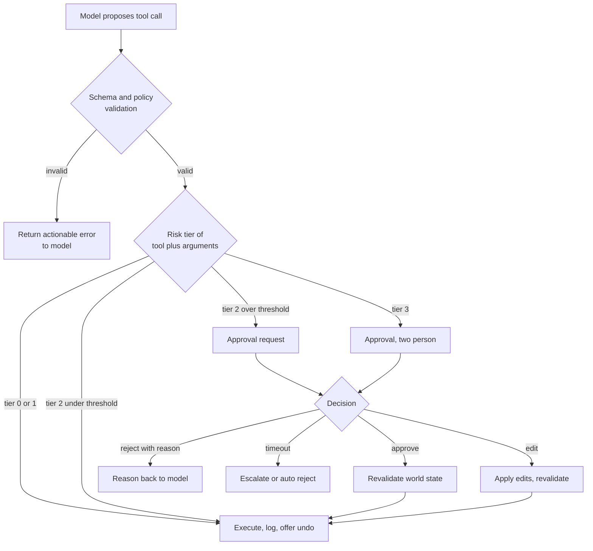
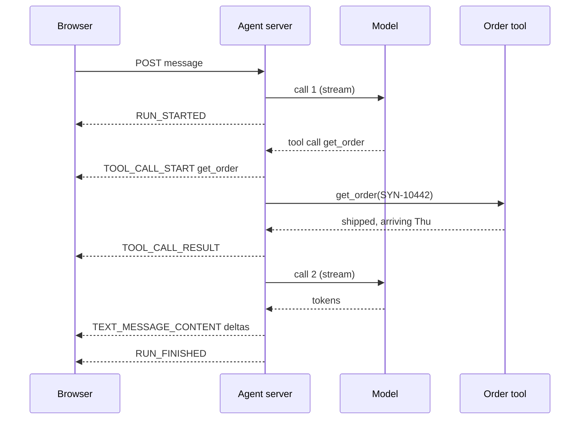
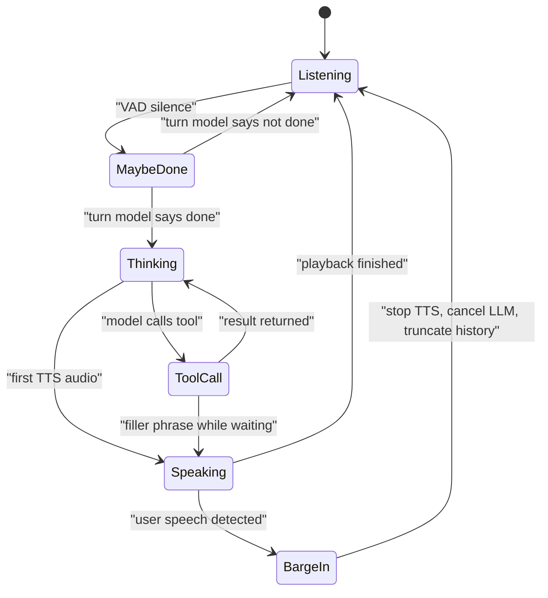
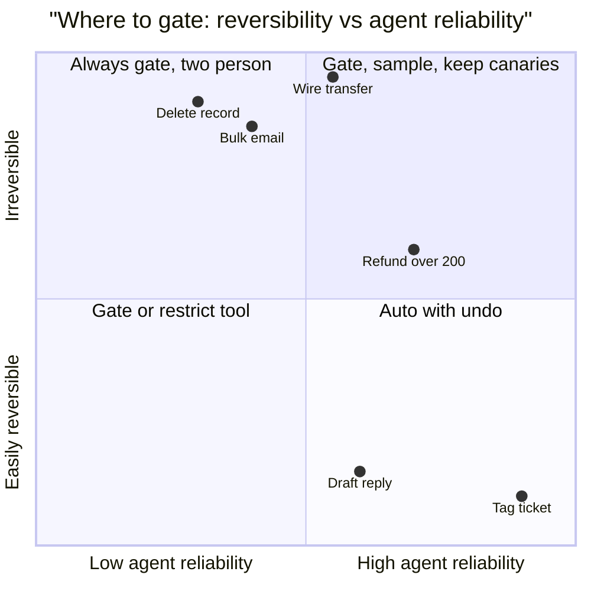
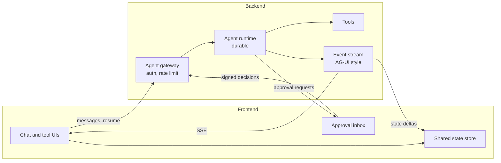
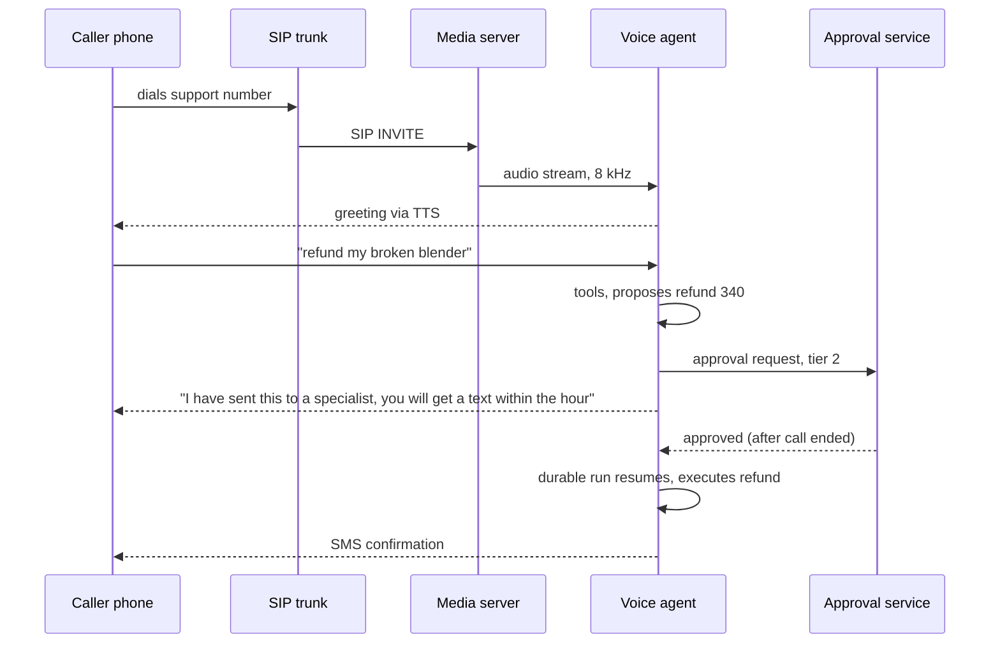
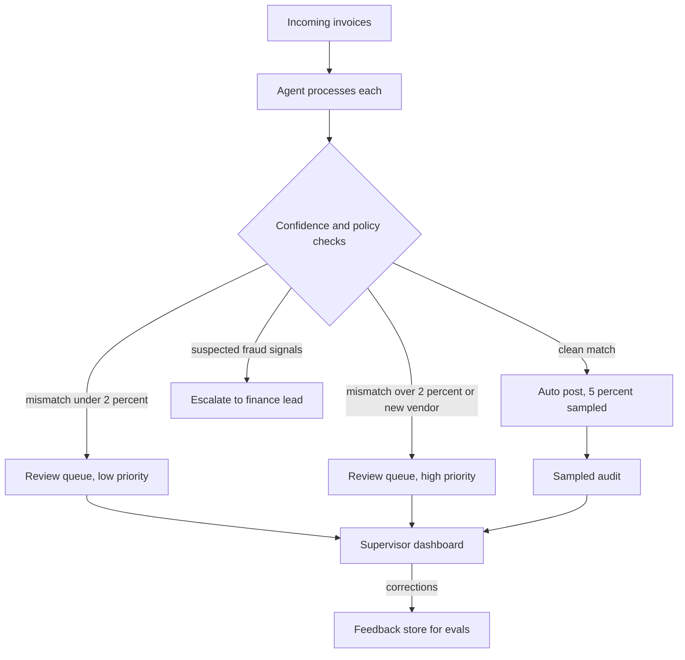

# Chapter 23: Human-in-the-Loop and Agent UX

> **What this chapter covers**: Approval gates by risk tier, interrupts, edit-and-resume, and escalation; streaming UX for tokens, tool progress, and partial results; generative UI protocols and toolkits (AG-UI, A2UI, CopilotKit, Vercel AI SDK, assistant-ui, Streamlit, Chainlit); trust calibration and explaining agent actions; and voice agents (OpenAI Realtime, Gemini Live, Pipecat, LiveKit Agents), turn detection, and latency budgets.
>
> **Prerequisites**: Chapters 01, 05, 22 (durable waits for approvals), and the MCP chapter in Part IV.
>
> **Where it is used**: Every agent a person supervises or talks to. Approval gates connect to guardrails (Part VII) and to durable execution (Chapter 22). Streaming and generative UI are what a customer demo is judged on.

---

## 23.1 Level 1: Foundations

### 23.1.1 Why humans stay in the loop

An agent is a policy that acts. The question for every action is who bears the cost of a wrong one and whether it can be reversed. A human in the loop is a control that trades latency and attention for reduced risk. Used everywhere, it destroys the value of the agent (the user becomes a click-through machine). Used nowhere, it ships the agent's error rate straight into the world.

Chapter 01's compounding arithmetic shows why. An agent with 97 percent per-step reliability over 20 steps completes cleanly 0.97²⁰ ≈ 54 percent of the time. If three of those steps are irreversible and each has a 3 percent error rate, the chance at least one goes wrong is 1 − 0.97³ ≈ 8.7 percent. A reviewer who catches 90 percent of bad proposals at those three gates lowers that to about 1 − (1 − 0.03 × 0.1)³ ≈ 0.9 percent. Three gates, not twenty, bought an order of magnitude. That is the whole design principle: **put humans where risk concentrates, not everywhere.**

### 23.1.2 Vocabulary

- **Approval gate**: a point where a proposed action waits for a human decision before execution.
- **Interrupt**: the runtime mechanism that pauses a run and surfaces a payload to a human (LangGraph `interrupt()`, AI SDK `needsApproval`).
- **Edit-and-resume**: the human modifies the proposed action (arguments, draft text) and the run continues with the edited version.
- **Escalation**: the agent hands the task to a human owner, with context, because it cannot or should not finish.
- **Risk tier**: a classification of actions by reversibility, blast radius, and cost, which determines the gate.
- **Streaming**: incremental delivery of output and progress events to the UI.
- **Generative UI**: the agent's output includes UI components (forms, cards, tables), not only text.
- **Trust calibration**: the user's reliance on the agent matching the agent's actual reliability.
- **Turn detection**: deciding when a speaking user has finished, so a voice agent can respond.

### 23.1.3 The three human roles

| Role | Human does | Agent does | Example |
|---|---|---|---|
| Approver | Accepts, edits, or rejects a proposal | Proposes, explains, executes on approval | Refund over $200 |
| Collaborator | Works in the same artifact | Drafts, suggests, fills in | Co-editing a contract in a sidebar copilot |
| Supervisor | Watches a stream of work, intervenes by exception | Runs autonomously, flags anomalies | Back-office agent processing 500 invoices |

Each role needs a different UX. Approvers need a crisp diff and a reason. Collaborators need shared state and low latency. Supervisors need a queue, filters, and alerts.

---

## 23.2 Level 2: Working knowledge

### 23.2.1 Risk tiers

Classify every tool (and some argument ranges of a tool) before launch. A workable four-tier scheme:

| Tier | Definition | Gate | Examples |
|---|---|---|---|
| 0 Read | No state change outside the agent | None | `search_orders`, `get_customer` |
| 1 Reversible, internal | State change, easily undone, internal only | None, logged, undo offered | Draft reply saved, tag added |
| 2 Reversible, external or costly | Visible to others or costs money, compensable | Approval above a threshold, or sampled review | Refund under $200 auto, above needs approval |
| 3 Irreversible or high blast radius | Cannot be undone, legal or safety impact | Always approval, possibly two-person | Delete account, wire funds, send to all customers |

Three practical rules. First, tier by *argument*, not only by tool: `send_email(to=one customer)` is tier 2, `send_email(to=segment)` is tier 3. Second, the gate decision is code, not the model: the model cannot talk its way past a threshold. Third, tier thresholds are product decisions with owners; write them down and review them after incidents.



### 23.2.2 Interrupts in practice

Every mainstream stack now has a first-class primitive. As of September 2026:

- **LangGraph**: `interrupt(payload)` inside a node pauses and checkpoints; the caller resumes with `Command(resume=value)` on the same `thread_id`. A checkpointer is required. LangChain v1's `HumanInTheLoopMiddleware` wraps this for `create_agent`, with decisions approve, edit, reject, and respond.
- **Vercel AI SDK**: since AI SDK 6, a tool can declare `needsApproval: true` or a function of the input; the loop pauses and the UI renders an approval part. AI SDK 7 (June 2026) adds HMAC-signed approvals so an approval token cannot be forged by the client.
- **OpenAI Agents SDK, Google ADK, Pydantic AI**: each has a tool-approval or deferred-tool mechanism; check current docs for names, which have changed across releases.
- **Durable engines**: signals and event waits (Chapter 22).

The approval payload is a UX artifact. What goes in it:

```json
{
  "action": "refund_order",
  "args": {"order_id": "SYN-10442", "amount": 340.00, "currency": "USD"},
  "tier": 2,
  "reason": "Customer reports item arrived broken; photo attached in turn 3.",
  "evidence": ["msg:turn3:image1", "order:SYN-10442:delivery_scan"],
  "policy": "Refunds over $200 need approval (policy RF-2)",
  "editable": ["amount"],
  "expires_at": "2026-09-30T17:00:00Z"
}
```

Note what is absent: the raw chain of thought. The approver needs the claim, the evidence, the policy that triggered the gate, and what they can change.

### 23.2.3 Edit-and-resume

Editing is the highest-value human action, because the human's correction is also training signal (Chapter 34). Mechanics:

1. Render only the editable fields as inputs. Everything else is read-only.
2. On submit, validate the edited arguments with the same schema and policy checks as the model's proposal. Humans make typos too.
3. Resume the run with the edited call executed, and add a message to the history telling the model what the human changed ("Approver changed amount from 340.00 to 170.00: partial refund per policy RF-3"). Otherwise the model's next turn may contradict the executed action.
4. Log the diff (proposal, final, who, when). The diff rate per tool is a quality metric.

### 23.2.4 Escalation

Escalation is the agent admitting it should stop. Triggers: explicit user request ("talk to a person"), policy (legal threat, safety), low confidence signals (repeated tool errors, looping, contradictory evidence), and budget exhaustion (max turns, max cost). A good escalation package: a three-line summary, what was tried, what the agent believes the answer is and why it did not act, and the full transcript link. The human should not have to re-ask the customer anything. Measure time-to-first-human-action after escalation and re-ask rate.

### 23.2.5 Streaming UX

Users judge an agent by what they see in the first second. Four layers of streaming:

| Layer | What streams | Why it matters |
|---|---|---|
| Tokens | Assistant text as generated | Perceived latency; users start reading at time-to-first-token |
| Tool progress | "Searching orders...", "Running query (2.1 s)" | Explains waits; builds a mental model of what the agent does |
| Partial results | Rows found so far, draft sections | Lets the user intervene early; useful work before completion |
| State | Shared state snapshots or deltas | Keeps UI components (a plan checklist, a map) in sync |

Worked latency budget for a text agent answering "Where is my order?":

- Model call 1 (decide tool): time-to-first-token 600 ms, tool-call JSON complete at 900 ms.
- Tool `get_order`: 250 ms.
- Model call 2 (answer): time-to-first-token 500 ms, 120 output tokens at 80 tokens per second = 1.5 s.
- Total to last token: 0.9 + 0.25 + 0.5 + 1.5 = 3.15 s.
- Without streaming the user stares at a spinner for 3.15 s. With a tool-progress event at 0.9 s ("Looking up order SYN-10442") and tokens from 1.65 s, the first meaningful feedback arrives at 0.9 s. Same compute, very different product.



Transport: Server-Sent Events are the default for one-way streaming over HTTP and pass through most proxies. WebSockets when the client must also push mid-run (interruptions, voice). Set proxy buffering off (nginx `proxy_buffering off`, or the platform equivalent), or your stream arrives all at once.

### 23.2.6 The UI toolkit landscape

Checked September 2026. This space moves quickly; confirm versions before starting a project.

| Tool | What it is | Language | Use when |
|---|---|---|---|
| AG-UI | Open event protocol between agent backend and frontend (lifecycle, text, tool call, state, custom events), from CopilotKit | Protocol, SDKs in several languages | You want any agent framework to drive any frontend |
| A2UI | Google-originated declarative UI spec: agent emits a component description, client renders natively. v0.9 current, v1.0 targeted for Q4 2026 per Google | Protocol | Cross-platform generative UI without shipping code from the agent |
| CopilotKit | React framework for in-app copilots, shared state, frontend tools, built on AG-UI | TypeScript | Embedding an agent inside an existing product |
| Vercel AI SDK | TypeScript SDK: model abstraction, agent loop, `useChat`, tool approval, streaming UI parts; AI SDK 7 released June 2026 | TypeScript | Next.js apps, full-stack TS teams |
| assistant-ui | React component library for chat UIs (threads, tool UIs, attachments), backend agnostic | TypeScript | Polished chat UI fast, own backend |
| Streamlit | Python app framework, `st.chat_message`, `st.write_stream` | Python | Internal tools and demos by Python teams |
| Chainlit | Python chat UI with step visualisation; community-maintained since May 2025, still releasing in 2026 | Python | Python agent demos showing intermediate steps |

The layering matters more than the names. **Protocol** (AG-UI, A2UI, MCP Apps) defines what goes over the wire. **Framework** (CopilotKit, AI SDK) implements a client and server for it. **Components** (assistant-ui) render it. A Python team can serve AG-UI events from a LangGraph or Pydantic AI backend and use a CopilotKit or assistant-ui frontend; the protocol is what makes that possible.

### 23.2.7 The event vocabulary a UI needs

Whatever protocol you adopt, the frontend needs roughly these event kinds. The names below follow AG-UI's categories (lifecycle, text message, tool call, state, special) as documented by CopilotKit in 2026; check the current spec for exact event names and fields.

| Category | Events | UI behaviour |
|---|---|---|
| Lifecycle | Run started, run finished, run error, step started and finished | Show and clear the "working" state; show errors with a retry |
| Text message | Start, content delta, end | Stream text into a message bubble |
| Tool call | Start (name), arguments delta, end, result | Render a tool card: "Searching orders" then the result summary |
| State | Snapshot, delta | Update shared components (a plan, a form, a map) |
| Special | Raw, custom | Approval requests, citations, product-specific cards |

Every event carries a run ID, a thread ID, and a sequence number. Approval requests are best modelled as a custom event plus a paused run, so the same stream carries them.

### 23.2.8 Undo as the cheaper alternative to approval

For tier-1 actions, an undo window beats an approval gate: the action happens immediately and the user has, say, 30 seconds (or until end of session) to reverse it. Gmail's "undo send" is the familiar pattern: a delayed commit disguised as instant.

| | Approval before | Undo after |
|---|---|---|
| Latency | Waits on human | None |
| Attention cost | Every action | Only mistakes |
| Works for | Irreversible, external, costly | Reversible, internal, or delayable |
| Implementation | Pause and resume | Delayed commit or compensating action |
| Failure mode | Rubber-stamping | User never notices the mistake |

Delayed commit is the robust implementation: the action is queued for N seconds, shown as done, and cancelled if the user clicks undo. Compensating undo (perform, then reverse) works only when reversal is clean.

### 23.2.9 Worked example: one support turn, end to end

A synthetic retailer's support copilot, user writes "My blender arrived broken, I want my money back."

1. **0 ms**: POST received; run started event sent immediately. The UI shows a typing indicator.
2. **620 ms**: model decides `orders_search(customer_id)`; tool call start event. UI shows "Looking up your orders".
3. **880 ms**: result, one matching order SYN-10442, $340. Tool result event; UI renders an order card.
4. **1,500 ms**: model proposes `refund_order(SYN-10442, 340.00)`. Policy says over $200 is tier 2. Run pauses; custom approval event. The user sees: "I have asked a specialist to approve a $340 refund. You will hear back within 1 business hour."
5. **27 min later**: approver opens the card, sees delivery scan and the customer's photo, edits nothing, approves. Signed decision returned.
6. **+2 s**: run resumes, revalidates (no existing refund), executes with idempotency key, injects confirmation into history, streams the reply. The user's open tab (or an email if closed) receives it.

The user got meaningful feedback at 620 ms, a concrete expectation at 1.5 s, and the action after 27 minutes, with an audit trail for each step.

---

## 23.3 Level 3: Depth

### 23.3.1 Generative UI: three approaches

| Approach | How | Safety | Flexibility |
|---|---|---|---|
| Tool-to-component mapping | Frontend registers a component per tool; tool result renders as that component | High: only known components | Low: one layout per tool |
| Declarative spec | Agent emits JSON describing components from an allowed catalog (A2UI style) | High if the catalog is fixed and the renderer validates | Medium to high |
| Generated code | Agent writes HTML or React, rendered in a sandboxed iframe | Low unless strictly sandboxed | Highest |

A2UI's design choice is worth understanding: the agent never ships executable code, only a description the client renders with its own trusted components. That lets a remote agent (possibly from another organisation, over A2A) put UI in your app without a code-injection path. The cost is that the agent can only use what the catalog offers. Google's v0.9 notes describe moving away from very strict nested JSON schemas because models broke on complex structures at scale; that is a general lesson: deep nested output schemas are where structured generation fails first (Chapter 03).

### 23.3.2 Shared state between agent and UI

In collaborator UX, the agent and user edit the same object (a plan, an itinerary, a spreadsheet). AG-UI models this with state snapshot and state delta events (JSON Patch style deltas). The hard problems are the classic ones:

- **Concurrent edits.** The user changes cell B3 while the agent's delta also touches B3. Pick a rule (user wins, or last-writer-wins with a visible conflict marker). Never silently overwrite a user's edit.
- **Stale agent view.** The agent planned against state version 12; the user is at version 15. Send the version with each agent turn and reject deltas against stale versions, or rebase them.
- **Size.** Snapshots of large state on every turn waste tokens and bandwidth. Deltas plus periodic snapshots.

### 23.3.3 Trust calibration

Lee and See (2004) define appropriate reliance as trust that matches the automation's capability. Two failure modes: **over-trust** (users approve everything, the gate becomes theatre) and **under-trust** (users redo the agent's work, the agent adds cost). Both are measurable.

- **Approval rate without edits** per tool. If a tier-2 gate is approved unchanged 99.5 percent of the time over 2,000 requests, either the gate is unnecessary (lower the tier, with data) or approvers are rubber-stamping (inject known-bad canary proposals and measure catch rate).
- **Time to decision.** A median of 1.8 seconds for a refund approval means nobody reads the evidence.
- **Override correctness.** When a human rejects or edits, was the human right? Sample and audit.
- **Redo rate.** How often a user performs the same action manually after the agent did it.

Canary arithmetic: inject 1 known-bad proposal per 200 real ones. After 2,000 real approvals you have 10 canaries. If approvers catch 6, the catch rate estimate is 60 percent with a 95 percent Wilson interval of roughly 31 to 83 percent. Wide, but already enough to know the gate is weaker than the 90 percent you assumed in 23.1.1.

How many canaries do you need? The half-width of a 95 percent interval on a proportion near p is about 1.96 × √(p(1 − p)/n). To estimate a catch rate near 80 percent to within plus or minus 10 points needs n ≈ 1.96² × 0.8 × 0.2 / 0.1² ≈ 62 canaries. At 1 canary per 200 real proposals that is 12,400 real approvals, which for a 500-a-day gate is about a month. If that is too slow, raise the canary rate for a calibration sprint, then drop it.

A calibration scorecard per gate, reviewed monthly:

| Signal | Healthy | Warning |
|---|---|---|
| Canary catch rate | At or above target, interval clear of the floor | Interval overlaps the floor |
| Median time to decision | Proportional to payload complexity | Under 3 s for non-trivial proposals |
| Approve-without-edit | Stable, with some edits and rejects | Above 99.5 percent for months |
| Human override correctness (sampled) | Above 90 percent | Humans wrong often: the review UX misleads |
| Redo rate after auto actions | Low and falling | Users redoing agent work |

Design levers that improve calibration:

- **Show evidence, not confidence numbers.** Model-verbalised confidence is poorly calibrated. A link to the delivery scan is worth more than "92 percent sure".
- **Surface uncertainty specifically.** "I could not find a delivery scan" beats a generic disclaimer.
- **Make the diff the default view.** Approvers should see what changes, not re-read the whole context.
- **Friction proportional to risk.** Tier 3 requires typing the amount or a reason. Tier 2 is one click.

### 23.3.4 Explaining agent actions

Three levels of explanation, for three audiences:

1. **Inline narration for the user**: short, present tense, tied to actions. "Checked your last 3 orders. The blender (SYN-10442) shipped Tuesday."
2. **Rationale for the approver**: claim, evidence, policy, alternatives considered.
3. **Trace for the operator**: every model call, tool call, and state change (Chapter 27).

Do not show raw reasoning tokens as the explanation. Providers may return summarised or encrypted thinking (Chapter 04), and research on chain-of-thought faithfulness shows stated reasoning does not always reflect what drove the output. An explanation built from the actual tool calls and their results is grounded by construction.

### 23.3.5 Voice agents: architectures

Two architectures:

| | Cascaded (STT, LLM, TTS) | Speech-to-speech (realtime model) |
|---|---|---|
| Pipeline | VAD and turn detection, streaming STT, text LLM, streaming TTS | One model takes audio in, gives audio out |
| Latency | Sum of stages, optimise each | Lower floor, fewer hops |
| Control | Full: swap any stage, inspect text, apply text guardrails | Less: guardrails on transcripts, fewer knobs |
| Tool use | Any text LLM with tools | Supported, quality varies by model |
| Examples | Pipecat or LiveKit pipelines with any STT, LLM, TTS | OpenAI Realtime with gpt-realtime; Gemini Live API with native audio models |

Verified September 2026: OpenAI's Realtime API is GA with the `gpt-realtime` model family over WebRTC, WebSocket, and SIP, and supports `server_vad` and `semantic_vad` turn detection. Google's Gemini Live API with a native audio model is GA on Vertex AI with preview status in the Gemini API at last check; check current model names before building, as Google renames audio models frequently. Pipecat (open source, from Daily) and LiveKit Agents (open source, from LiveKit) are the two main orchestration frameworks; both support either architecture.

### 23.3.6 Turn detection

Voice activity detection (VAD, for example Silero) detects speech versus silence. It cannot tell a pause mid-sentence ("my order number is... uh...") from the end of a turn. Waiting a fixed 800 ms of silence makes the agent feel slow; waiting 300 ms makes it interrupt.

Semantic turn detection adds a model that estimates the probability the user is done, from audio or transcript. OpenAI's `semantic_vad` scores based on the words spoken. LiveKit's turn detector plugin runs an open-weight end-of-turn model locally on CPU, documented as needing under 500 MB of RAM. Pipecat's Smart Turn v3 is an open audio model taking up to 8 seconds of 16 kHz audio, used alongside Silero VAD, with around 65 ms inference reported by the Pipecat team on their cloud. These numbers are vendor-reported, as of September 2026.

**Barge-in** (the user interrupts the agent) needs: stop TTS playback immediately, cancel the in-flight LLM generation, and truncate the conversation history to what the user actually heard. The last point is often missed: if the history records the full planned response, the model believes it said things the user never heard.



### 23.3.7 Voice latency budget

Humans expect a response gap of a few hundred milliseconds in conversation. Voice agents aim for under about 800 ms voice-to-voice for a natural feel; many production systems land between 1 and 1.5 s. A cascaded budget, with illustrative stage numbers (measure your own):

| Stage | Budget (ms) |
|---|---|
| Endpointing (silence plus turn model) | 250 |
| Final STT transcript after end of speech | 150 |
| LLM time to first token | 350 |
| TTS time to first audio byte | 150 |
| Network and audio buffering, both directions | 100 |
| **Total voice-to-voice** | **1,000** |

Levers in order of payoff: a faster endpoint (semantic turn detection lets you cut the silence threshold), a smaller or faster LLM for the first sentence, streaming TTS that starts on the first clause, co-locating services in one region, and prompt caching the system prompt so time-to-first-token drops. A tool call in the middle adds its full latency; cover it with a filler ("Let me check that") generated immediately.

### 23.3.8 Approval latency budget

An approval gate converts an agent task from seconds to however long a human takes. That latency is often the dominant term in end-to-end task time, and it has structure you can budget.

Worked example: a synthetic insurer's claims agent, tier-2 payouts over $500 need adjuster approval, business hours 09:00 to 17:00, target "customer informed within 4 business hours".

| Component | p50 | p90 | Notes |
|---|---|---|---|
| Agent work before gate | 45 s | 2 min | Model calls, document extraction |
| Notification delivery | 5 s | 30 s | Slack or queue push |
| Queue wait until an adjuster opens it | 25 min | 2 h 40 min | Depends on staffing, see below |
| Review time | 90 s | 5 min | Evidence quality drives this |
| Revalidation and execution | 10 s | 30 s | Re-read claim, pay, record |
| Agent reply to customer | 5 s | 15 s | |
| **Total (in business hours)** | **about 28 min** | **about 2 h 50 min** | Queue wait is 90 percent of it |

The lever is the queue, not the model. Two ways to shrink it:

- **Staffing arithmetic.** 240 approvals a day arriving over 8 hours is 30 an hour. At a mean review time of 2 minutes, one adjuster can clear 30 an hour, so utilisation with one adjuster is 100 percent and the queue grows without bound during peaks. With two adjusters sharing the queue, utilisation is 50 percent and queue waits fall to minutes. Queueing theory's lesson (M/M/c models) is that waits explode as utilisation approaches 100 percent; plan for 60 to 75 percent.
- **Better evidence cuts review time.** If a redesigned approval card (diff, photos inline, policy link) drops mean review time from 2 minutes to 70 seconds, one adjuster's utilisation at 30 an hour falls to about 58 percent. The same headcount now has headroom. UX is capacity.

Out-of-hours arrivals wait for the next morning. A claim filed at 17:30 has a queue wait of at least 15.5 wall-clock hours regardless of staffing. Show the customer that honestly ("A specialist will review this by 11:00 tomorrow") rather than a spinner, and consider an on-call rota only if the business value justifies it.

### 23.3.9 Approval UX failure modes

| Failure | What users do | Root cause | Fix |
|---|---|---|---|
| Rubber-stamping | Approve in under 3 s | Too many low-risk gates, no diff | Remove gates with data, add canaries, show diffs |
| Approval fatigue at batch time | Approve 40 in a row | Queue bursts | Batch similar items with sampled deep review |
| Missing context | Reject or ask the customer again | Payload lacks evidence | Evidence links, policy reference, transcript link |
| Stale approvals | Approve something already resolved | No expiry, no revalidation | Expiry field, revalidate before execution |
| Wrong approver | Decision by someone without authority | Routing by team only | Route by tier, amount, region; authorise on server |
| Double decisions | Two approvers act | No locking | First decision wins, idempotent handler, show who decided |
| Silent timeout | Nobody notices a stuck request | No aging alert | SLA timers, escalation to a secondary owner |
| Edit breaks invariants | Human edits amount above policy limit | Edits not validated | Same policy validation as model proposals |

### 23.3.10 Streaming failure modes

- **Buffered proxies.** The whole response arrives at once. Check each hop (CDN, load balancer, reverse proxy, serverless platform) for buffering; send an initial comment or event immediately to confirm.
- **Idle timeouts.** A tool that takes 90 seconds with no bytes on the wire trips a 60-second load balancer timeout. Send heartbeat events every 15 to 30 seconds.
- **Token-by-token re-rendering.** Re-parsing and re-rendering Markdown on every token makes long answers janky. Batch deltas per animation frame and render incrementally.
- **Partial JSON in tool arguments.** Streaming tool arguments lets UIs show "searching for 'blender'..." early, but the partial JSON is invalid until complete. Use a tolerant partial parser for display only; never act on partial arguments.
- **Lost events on reconnect.** Without sequence numbers and replay, a reconnecting client shows a truncated answer. Store events per run with offsets.
- **Ordering across parallel tools.** Two tools run in parallel and emit progress interleaved. Every event carries its tool call ID; the UI groups by it.

### 23.3.11 Generative UI: choosing a surface

| Criterion | Tool-to-component | Declarative catalog (A2UI style) | Sandboxed generated code | MCP Apps style embedded UI |
|---|---|---|---|---|
| Who controls rendering | Your frontend | Your frontend | The model | The tool server |
| Injection risk | Low | Low if validated | High | Medium, isolated frame |
| Design consistency | High | High | Low | Depends on server |
| New layouts without deploy | No | Yes, within catalog | Yes | Yes, per server |
| Cross-organisation agents | Hard | Designed for it | Risky | Possible |
| Testability | High | Medium | Low | Medium |

MCP Apps (an extension letting MCP tools return interactive UI rendered by the host in an isolated frame) is a fourth option that sits between the others; the Vercel AI SDK 7 release lists support for it. Check the current MCP extension status before relying on it.

### 23.3.12 Voice failure catalogue

| Symptom | Likely cause | Distinguish by | Fix |
|---|---|---|---|
| Agent interrupts users mid-sentence | Silence threshold too short, no semantic turn model | Interruptions cluster at hesitations ("um") | Semantic turn detection; raise threshold after fillers |
| Long awkward pauses | Threshold too long, slow STT finalisation, slow first token | Stage timings in traces | Measure each stage; faster endpointing; smaller first model |
| Agent stops talking at "mm-hm" | Barge-in triggers on backchannels | Stops correlate with short utterances | Minimum speech duration or a backchannel classifier before barge-in |
| Agent refers to things it never said | History not truncated on barge-in | Transcript versus played audio mismatch | Truncate to played text |
| Wrong order numbers | STT errors on alphanumerics | WER on ID tokens versus normal words | Custom vocabulary, spell-back confirmation, DTMF entry |
| Echo triggers responses | Agent hears its own TTS | Happens only on speakerphone | Echo cancellation, client-side AEC, half-duplex during TTS |
| Silence during tool calls | No filler strategy | Gaps equal tool latency | Immediate filler phrase, progress speech for long tools |

### 23.3.13 Voice latency budget at p95, with a tool call

The p50 budget in 23.3.7 is optimistic. Users remember the slow turns. A p95 budget for a turn that calls one tool, cascaded pipeline, illustrative numbers:

| Stage | p50 (ms) | p95 (ms) |
|---|---|---|
| Endpointing | 250 | 600 |
| STT finalisation | 150 | 350 |
| LLM first token (decides tool) | 350 | 900 |
| Tool call arguments complete | 200 | 400 |
| Tool latency (order lookup) | 250 | 1,200 |
| LLM first token (answer) | 300 | 800 |
| TTS first audio | 150 | 350 |
| Network and buffering | 100 | 250 |
| **Total, voice to voice** | **1,750** | **4,850** |

At p95 the user hears nearly five seconds of silence, which callers perceive as a dropped line. Mitigations in order of impact on this table:

1. **Filler at tool start.** Speak "Let me check that order" as soon as the tool call is decided. Perceived silence becomes endpointing plus STT plus first token: 250 + 150 + 350 = 750 ms at p50, 600 + 350 + 900 = 1,850 ms at p95.
2. **Cache the tool.** If the order was mentioned earlier, prefetch it during the user's speech from the partial transcript.
3. **Speculative response.** Start the LLM on the partial transcript before endpointing completes, discard if the user keeps talking. Saves hundreds of milliseconds at the cost of wasted tokens.
4. **Regional co-location.** STT, LLM, and TTS in the same region as the media server; cross-region hops add tens of milliseconds each way per stage.

```mermaid
gantt
    title Voice turn with tool call at p50 in ms
    dateFormat x
    axisFormat %L
    section User
    Speech ends and endpointing       :u1, 0, 250
    section Pipeline
    STT final                         :p1, 250, 400
    LLM decides tool                  :p2, 400, 950
    Order lookup                      :p3, 950, 1200
    LLM answer first token            :p4, 1200, 1500
    TTS first audio                   :p5, 1500, 1650
    section Speech out
    Filler phrase playing             :s1, 950, 1650
    Answer audio starts               :s2, 1750, 2500
```



---

## 23.4 Level 4: Mastery

### 23.4.1 Designing the approval system as a product

An approval system at scale is a queue product. For 500 approvals a day:

- Queue with SLA per tier, owner routing (by team, region, amount), and aging alerts.
- Batch approvals for homogeneous low-risk items, with sampling: approve 50 similar refunds by reviewing 5 in detail.
- Delegation and out-of-office handling; an approval routed to someone on leave is a silent timeout.
- Audit log: proposal, evidence shown, decision, edits, identity, timestamp. Regulators and security reviews ask for this.
- Integration with durable execution (Chapter 22) so waits survive deploys and approvals are idempotent.

Worked capacity example. 500 approvals a day at a median 45 seconds each is 6.25 reviewer-hours a day, nearly one full-time person. Moving tier-2 refunds under $100 to auto-approve with 5 percent sampled post-hoc review removes, say, 300 items; the remaining 200 plus 15 samples take 2.7 hours. That change is worth a headcount, and the risk it introduces is quantifiable from the historical edit and reject rate on those 300.

### 23.4.2 Autonomy as a ratchet

Mature teams move tools between tiers using evidence. Start strict. For each gated tool, collect decisions. When the reject-plus-edit rate falls below an agreed threshold over a minimum sample (for example below 1 percent over at least 1,000 decisions, with the upper confidence bound below 2 percent), propose lowering the tier. Keep canaries and sampled review after lowering. Raise the tier immediately after an incident. This turns "how autonomous should the agent be" from an opinion into a controlled process with owners.



### 23.4.3 Front-end architecture for agent products



Decisions a senior engineer makes here:

- **The client is untrusted.** Approval decisions from the browser must be authenticated and bound to the specific proposal (sign the proposal ID, arguments hash, and expiry). This is why AI SDK 7 added signed approvals. A client that can resume a run with arbitrary tool arguments is a privilege escalation.
- **Resumable streams.** The user reloads mid-run. The backend must let the client reattach to a run by ID and replay events from an offset. Store events with sequence numbers.
- **Frontend tools.** Some actions execute in the browser (navigate, fill a form in the user's session). They are tools like any other; define them in the same schema, but treat their results as untrusted user-side input.
- **Accessibility.** Streaming text into a screen reader region at token granularity is unusable. Announce at sentence or message boundaries, and give tool progress a live region with polite updates.

### 23.4.4 Voice in production

- **Telephony**: SIP trunks connect to realtime APIs directly (OpenAI supports SIP as of GA) or through LiveKit or Pipecat telephony transports. Phone audio is 8 kHz narrowband; test STT quality on phone audio, not studio recordings.
- **Guardrails in voice**: you cannot unsay audio. Run fast input classifiers on transcripts and constrain tools; do post-hoc review on transcripts for output issues. For high-risk domains, cascaded architectures allow a text guardrail between LLM and TTS at the cost of latency.
- **Evaluation**: measure voice-to-voice latency at p50 and p95, interruption false-positive rate (agent stopped when the user only said "mm-hm"), false-negative rate (agent talked over the user), task success on scripted calls, and word error rate on domain vocabulary (order numbers, names).
- **Cost**: speech-to-speech models are priced per audio token and are typically several times more expensive per minute than a cascaded pipeline with a small text LLM. Price both on your own call mix before choosing; do not quote a per-minute figure without the current price sheet.

### 23.4.5 Where practitioners and vendors disagree

- **Chat is the wrong interface** versus **chat is universal**. Generative UI vendors argue agents should render purpose-built components; many users and teams find a chat thread with good tool cards is enough. The answer depends on whether the task has structure (an itinerary, a spreadsheet) that text flattens.
- **Protocol proliferation.** AG-UI, A2UI, MCP Apps, and framework-specific streaming formats overlap. CopilotKit positions AG-UI as the transport and A2UI as a payload it can carry; Google positions A2UI as framework-agnostic. Expect consolidation; design your backend to emit a clean internal event model you can adapt to any of them.
- **Speech-to-speech vs cascaded.** Realtime model vendors report lower latency and more natural prosody. Teams in regulated domains keep cascaded pipelines for inspectability. Both are valid; the choice is control versus latency.
- **Showing reasoning.** Some products show a live "thinking" panel as a trust device. Evidence that it improves calibration is thin, and it can over-trust by looking diligent. Show actions and evidence; offer reasoning summaries on request.

### 23.4.6 Telephony call flow



The design point: a voice call is short, approvals are not. The voice agent must hand the gated action to a durable run (Chapter 22) and close the call with an honest expectation, rather than holding a caller on the line for an approval that may take an hour.

### 23.4.7 Escalation design at scale

Escalation is a routing and handoff problem with measurable outcomes.

| Metric | Definition | Target direction |
|---|---|---|
| Escalation rate | Escalated tasks over all tasks | Down over time, but never to zero by suppression |
| Appropriate escalation rate | Escalations a reviewer agrees were necessary | Up |
| Missed escalation rate | Tasks that should have escalated but did not, found in sampled review | Down; the dangerous one |
| Re-ask rate | Human had to ask the customer something the agent already knew | Down |
| Time to human | Escalation to first human action | Within SLA |
| Resolution after escalation | Human resolves without re-escalating | Up |

Worked example. 10,000 conversations a month, 12 percent escalate (1,200). Sampled review of 200 escalations finds 150 appropriate (75 percent). Sampled review of 400 non-escalated conversations finds 8 that should have escalated (2 percent, which across 8,800 non-escalated conversations is about 176 missed a month). A prompt change that cuts escalations to 9 percent looks like a win until the missed rate is re-measured. Always measure both sides; optimising escalation rate alone trains the agent to hold on to cases it should hand off.

### 23.4.8 Choosing a UI stack for a demo versus a product

| Situation | Stack | Why |
|---|---|---|
| Two-day customer demo by a Python team | Streamlit or Chainlit over the agent | Fastest path; Chainlit shows intermediate steps |
| Internal tool with approvals | Streamlit plus durable backend, or a small Next.js app | Approval inbox is the main screen |
| Embedded copilot in an existing React product | CopilotKit or assistant-ui over an AG-UI backend | Shared state and frontend tools inside the product |
| Full-stack TypeScript product | Vercel AI SDK with `useChat` and tool approval | One language, streaming parts, approvals built in |
| Cross-platform UI from remote agents | A2UI payloads rendered natively | No code shipped from the agent |
| Voice product | LiveKit Agents or Pipecat, or a realtime API directly | Media transport and turn handling are the hard part |

For a Forward Deployed Engineer the first two rows are the daily reality. The skill is making a Streamlit demo that already has the shape of the product (streamed tool progress, an approval card, an escalation button) so the conversation with the customer is about the workflow, not the widgets.

### 23.4.9 Accessibility and internationalisation

- Streaming text to screen readers at token granularity floods the user. Announce completed sentences through a polite live region; offer a "read full answer" control.
- Approval cards need keyboard operation and visible focus; approvers at scale use keyboards.
- Voice agents in multilingual markets need language detection per turn (callers switch languages), locale-aware number and date reading, and STT models evaluated per language. Turn detection models trained on one language underperform on others; research on end-of-turn detection for languages such as Thai shows dedicated models help.
- Explanations should avoid idioms; approvers may be reading in a second language.

### 23.4.10 Supervisor UX for batch agents

The supervisor role (23.1.3) needs a different surface from chat. A back-office agent processing 500 invoices a day produces a stream of outcomes, and the human's job is exception handling.



The "confidence" here is not model self-report. It is computed from checks in code: does the invoice total equal the purchase order total within tolerance, does the vendor exist, is the bank account unchanged since last payment. Those are the signals a supervisor trusts.

Dashboard essentials:

| Panel | Content | Why |
|---|---|---|
| Throughput | Processed, auto, queued, escalated today | Capacity planning |
| Queue by age | Items over SLA highlighted | Prevents silent timeouts |
| Exception reasons | Top reasons with counts | Points at fixable causes (a vendor's new invoice format) |
| Sampled audit results | Error rate on auto-posted items with interval | The actual quality metric |
| Drift | Week over week change in exception mix | Early warning of upstream changes |

Worked numbers. 500 invoices a day; 82 percent clean (410), 5 percent sampled (about 21 reviewed); 15 percent low-priority exceptions (75) at 60 seconds each; 3 percent high-priority (15) at 4 minutes each. Supervisor time: 21 × 30 s + 75 × 60 s + 15 × 240 s ≈ 10.5 + 75 + 60 = 145 minutes a day. Before the agent, 500 invoices at 3 minutes each was 25 hours a day. That comparison, with its assumptions visible, is the business case an FDE puts in front of a customer.

---

## 23.5 Subtopic checklist

- [x] Approval gates by risk tier
- [x] Interrupts
- [x] Edit-and-resume
- [x] Escalation
- [x] Streaming UX: tokens
- [x] Streaming UX: tool progress
- [x] Streaming UX: partial results
- [x] Generative UI: AG-UI
- [x] Generative UI: A2UI
- [x] CopilotKit
- [x] Vercel AI SDK
- [x] assistant-ui
- [x] Streamlit
- [x] Chainlit
- [x] Trust calibration
- [x] Explaining agent actions
- [x] Voice agents: OpenAI Realtime
- [x] Voice agents: Gemini Live
- [x] Pipecat
- [x] LiveKit Agents
- [x] Turn detection
- [x] Latency budgets (text and voice)
- [x] Shared state and approval security

## 23.6 Common misconceptions

1. **"More approval gates means a safer agent."** Past a point, gates train reviewers to click through, and catch rate collapses. Fewer gates at concentrated risk, with measured catch rates, are safer.
2. **"The model can decide when it needs approval."** The gate decision is code over tool, arguments, and policy. A model that can argue past a threshold is not gated.
3. **"An approval is valid when it arrives."** The world may have changed. Re-validate state before executing an approved action, and bind the approval to the exact arguments.
4. **"Streaming is a nice-to-have."** For multi-step agents it is the difference between a 3-second spinner and feedback at under 1 second. It also lets users interrupt bad runs early.
5. **"Show the chain of thought to build trust."** Raw reasoning can be unfaithful, may be summarised or unavailable, and looks diligent regardless of correctness. Explanations grounded in tool calls and evidence are better.
6. **"Generative UI means the model writes React."** The safer mainstream approaches map tools to known components or render a declarative spec from an allowed catalog. Generated code needs strict sandboxing.
7. **"Voice agents just need VAD."** VAD detects silence, not the end of a thought. Semantic turn detection is what prevents both interruptions and slow responses.
8. **"On barge-in, stopping audio is enough."** The conversation history must be truncated to what was actually played, or the model believes it said things the user never heard.
9. **"A high approval rate means the agent is good."** It may mean reviewers are rubber-stamping. Measure with canaries and time-to-decision.
10. **"The client can send the approval decision."** Only as a signed, authenticated decision bound to a specific proposal. Otherwise any client can resume with arbitrary arguments.

11. **"Approval latency is a model problem."** It is almost always queue wait, which is a staffing, routing, and utilisation problem. Better evidence cuts review time, which is capacity.
12. **"A voice agent can wait on the line for approval."** Calls are short; approvals are not. Hand the action to a durable run and close the call with an honest expectation.

13. **"Supervisor queues can be prioritised by model confidence."** Verbalised confidence is poorly calibrated. Prioritise by checks computed in code (totals match, vendor known, bank details unchanged), which supervisors can verify.

14. **"Streaming tool arguments can be acted on early to save time."** Partial arguments are invalid JSON until complete and can change meaning as they finish. Display them with a tolerant parser; execute only complete, validated calls.

## 23.7 Practice

1. **Conceptual.** Tier these tools for a synthetic telecom support agent, including argument-dependent tiers: `get_bill`, `apply_credit(amount)`, `change_plan`, `port_out_number`, `send_sms(to)`, `close_account`. State the gate for each.
2. **Design.** Write the approval payload schema for `apply_credit`, including the fields shown to the approver, editable fields, policy reference, evidence links, and expiry. Explain how the backend binds the decision to the proposal.
3. **Hands-on (4060, local).** Build a LangGraph agent with a local Ollama model (a 3B to 7B instruct model with tool calling, quantised, fits in 8 GB) and a Postgres or SQLite checkpointer. Add `interrupt()` before a fake `refund` tool. Build a Streamlit page that lists pending interrupts and resumes with approve, edit, or reject. Kill the server while an approval is pending and confirm it survives.
4. **Hands-on.** Serve the same agent's events over SSE and measure time-to-first-token, time-to-first-tool-progress, and time-to-last-token for 20 queries. Report p50 and p95, then disable proxy buffering or enable it and show the difference.
5. **Hands-on (free tier).** Build a Pipecat or LiveKit Agents cascaded voice pipeline using free-tier or local STT (Whisper small on the 4060), a local LLM, and a local TTS. Instrument each stage and fill in the latency budget table in 23.3.7 with measured numbers.
6. **Conceptual.** An approvals dashboard shows 99.7 percent approve-without-edit on tier-2 refunds with a median decision time of 2 seconds. Give two hypotheses and the experiment that distinguishes them.
7. **Design.** Design a canary program for approval gates: injection rate, how canaries are constructed from synthetic data, how reviewers are told (or not), and how results change tiers.
8. **Design.** A user reloads the page while a 90-second research run is streaming. Specify the event storage, reattach protocol, and what the UI shows.
9. **Conceptual.** Compute the probability of at least one bad irreversible action per task for an agent with 4 irreversible steps at 2 percent error each, without gates and with gates that catch 80 percent. Then compute the reviewer-hours for 1,000 tasks a day at 40 seconds per review.

10. **Conceptual.** 360 approvals a day arrive evenly over 8 hours with a mean review time of 100 seconds. Compute utilisation with one, two, and three reviewers, and say which you would staff and why.
11. **Hands-on.** Take the p95 voice table in 23.3.13, replace the numbers with your measurements from exercise 5, and compute perceived silence with and without a filler phrase.
12. **Design.** Write the escalation package schema for a synthetic telecom agent, and the sampling plan to measure missed escalations with a 95 percent interval no wider than plus or minus 1.5 points.

13. **Design.** For the invoice supervisor in 23.4.10, choose the sampling rate on auto-posted invoices so that a true error rate of 1 percent is estimated within plus or minus 0.5 points each month. Show the arithmetic and the reviewer-minutes it costs.
14. **Hands-on.** Add an undo window (delayed commit, 20 seconds) to one tier-1 tool in your exercise 3 agent. Measure how often you use it over a day of testing and what it saves compared with an approval gate.

## 23.8 How this is tested

<details><summary>How do you decide which agent actions need human approval?</summary>

Tier actions by reversibility, blast radius, and cost, per tool and per argument range. Read-only and internal reversible actions run automatically with logging and undo. External or costly reversible actions need approval above a threshold or sampled review. Irreversible or high blast radius actions always need approval, sometimes two-person. The gate is enforced in code, owned by the product, and revisited with data (edit and reject rates, canary catch rates).
</details>

<details><summary>Walk through how LangGraph implements human-in-the-loop.</summary>

A node calls `interrupt(payload)`. The graph checkpoints state and returns the payload to the caller. The run is resumed later with `Command(resume=value)` on the same `thread_id`, and the value becomes the return value of `interrupt()`. A checkpointer is required. On resume the node restarts from its beginning, so code before the interrupt re-runs; keep side effects out of that region. LangChain v1 wraps this as `HumanInTheLoopMiddleware` with approve, edit, reject, and respond decisions.
</details>

<details><summary>What must happen after a human edits a proposed tool call?</summary>

Validate the edited arguments with the same schema and policy checks, re-validate world state, execute the edited call, and inject a message into the history stating what the human changed and why, so the model's next turn is consistent. Log the diff as quality and training signal.
</details>

<details><summary>How do you know if approvers are actually reviewing?</summary>

Measure time-to-decision, approve-without-edit rate, and inject canaries: known-bad synthetic proposals at a low rate. Catch rate on canaries estimates real catch rate, with a confidence interval. Low decision times and low canary catch rates mean the gate is theatre; either redesign the review UX (diffs, evidence, friction proportional to risk) or change the tier with data.
</details>

<details><summary>Design the streaming protocol between an agent backend and a web UI.</summary>

Emit typed events: run started and finished, text message start, content deltas, end, tool call start, arguments, result, state snapshot and deltas, errors, and custom events, each with run ID and sequence number. Transport over SSE for one-way, WebSocket if the client pushes mid-run. Store events for reattach after reload. AG-UI is an existing open protocol with this shape. Disable proxy buffering.
</details>

<details><summary>Compare AG-UI and A2UI.</summary>

AG-UI is an event protocol for the interaction between an agent backend and a frontend: lifecycle, text, tool calls, state sync. A2UI is a declarative UI description format: the agent describes components from a catalog and the client renders them with trusted native components, so no agent code executes on the client. They compose: A2UI payloads can travel inside an AG-UI stream. A2UI was at v0.9 with v1.0 targeted for late 2026 at the time of writing.
</details>

<details><summary>Why not let the model generate React for generative UI?</summary>

Generated code is a code-injection path, especially with prompt injection from tool results, and it is hard to test, style, and make accessible. Tool-to-component mapping or a declarative catalog gives most of the flexibility with a fixed, audited rendering surface. If generated code is necessary, render it in a sandboxed iframe with no access to the parent's session.
</details>

<details><summary>Cascaded vs speech-to-speech voice agents: how do you choose?</summary>

Cascaded (STT, LLM, TTS) gives control: swap components, inspect and guard text, use any tool-capable LLM, often cheaper. Speech-to-speech (OpenAI Realtime, Gemini Live) gives lower latency floors and more natural prosody with fewer hops but less inspectability and typically higher per-minute cost. Regulated or tool-heavy flows lean cascaded; latency-critical conversational flows lean speech-to-speech. Measure both on your call mix.
</details>

<details><summary>Explain turn detection and why VAD alone is insufficient.</summary>

VAD distinguishes speech from silence. Users pause mid-thought, so a silence threshold is either long (agent feels slow) or short (agent interrupts). Semantic turn detection uses a model over audio or transcript to estimate whether the user is done, allowing shorter silence thresholds without interruptions. Examples: OpenAI `semantic_vad`, LiveKit's turn detector model, Pipecat Smart Turn, used together with a VAD such as Silero.
</details>

<details><summary>Build a voice-to-voice latency budget for a cascaded agent.</summary>

Endpointing about 250 ms, final STT about 150 ms, LLM time to first token about 350 ms, TTS first audio about 150 ms, network and buffering about 100 ms: roughly 1 s. Reduce with semantic turn detection, a faster first-sentence model, streaming TTS on the first clause, co-location, and prompt caching. Tool calls add their latency; cover with an immediate filler phrase.
</details>

<details><summary>What must happen on barge-in?</summary>

Stop TTS playback immediately, cancel the in-flight LLM generation and any pending TTS, and truncate the assistant message in history to what the user actually heard. Then process the new user utterance. Without truncation, the model's history contains unheard content and it will refer to things the user never heard.
</details>

<details><summary>How do you secure an approval flow where decisions come from a browser?</summary>

Authenticate the approver, authorise by role and tier, and bind the decision to the proposal: sign the proposal ID, a hash of the arguments, and an expiry, and verify on the server. Reject decisions for expired or changed proposals. Make the decision handler idempotent. Never let the client resume a run with free-form arguments.
</details>

<details><summary>How do you explain agent actions to users and approvers?</summary>

Users get short narration tied to actions and results. Approvers get the claim, evidence links, the policy that triggered the gate, and alternatives. Operators get the full trace. Build explanations from actual tool calls and results, not raw chain of thought, which may be unfaithful or unavailable.
</details>

<details><summary>Your approval gate's end-to-end latency is three hours at p90. Where do you look first?</summary>

Break it into agent time, notification, queue wait, review, and execution. Queue wait usually dominates, and it is a staffing and utilisation problem: waits explode as reviewer utilisation approaches 100 percent. Reduce arrival rate (lower tiers with data, batch similar items), reduce service time (better evidence and diffs), or add capacity. Also check out-of-hours arrivals, which no staffing fixes, and set honest expectations for them.
</details>

<details><summary>How would you handle a tool call that needs approval during a live phone call?</summary>

Do not hold the caller. Hand the gated action to a durable run, tell the caller what will happen and when, end the call, and notify them (SMS or email) when the approval resolves. The durable run waits, revalidates, executes, and confirms. For tiers where approval is quick and staffed, a warm transfer to a human is an alternative.
</details>

<details><summary>How do you measure escalation quality?</summary>

Track escalation rate together with appropriate-escalation rate (sampled review of escalations) and missed-escalation rate (sampled review of non-escalated conversations), plus re-ask rate and time to human. Optimising escalation rate alone teaches the agent to hold cases it should hand off; the missed rate is the safety metric.
</details>

<details><summary>Give the p95 voice latency budget for a turn with a tool call, and how you would fix it.</summary>

Endpointing, STT, first LLM call to decide the tool, tool latency, second LLM first token, TTS first audio, and network add to several seconds at p95 (about 4.8 s in the chapter's illustrative table). Speak a filler as soon as the tool is decided, prefetch likely tools from partial transcripts, start speculative generation before endpointing ends, co-locate services, and use a faster model for the first sentence.
</details>

<details><summary>When would you use an undo window instead of an approval gate?</summary>

For reversible or delayable actions where the cost of an occasional mistake is small and the cost of waiting on a human is large: tags, drafts, internal notes, a message held for 30 seconds before sending. Implement as a delayed commit so undo is a cancellation, not a compensation. Keep approval gates for irreversible, external, or costly actions.
</details>

<details><summary>How many canary proposals do you need to estimate an approver catch rate?</summary>

For a rate near p with half-width h at 95 percent, n is about 1.96 squared times p(1 minus p) over h squared. Near 80 percent within plus or minus 10 points, about 62 canaries. At 1 canary per 200 real proposals that needs over 12,000 approvals, so raise the canary rate temporarily for a calibration sprint if the gate's volume is low.
</details>

## 23.9 Summary

- Humans belong where risk concentrates. A few gates at irreversible steps buy an order of magnitude in safety; gates everywhere destroy value and attention.
- Tier actions by reversibility, blast radius, and cost, per tool and per argument. The gate is code, not the model.
- Approval payloads carry the action, evidence, policy, editable fields, and expiry. Bind decisions to proposals cryptographically.
- Edit-and-resume must revalidate, tell the model what changed, and log the diff.
- Escalations hand over a summary, what was tried, and the transcript, so the human never re-asks.
- Stream four layers: tokens, tool progress, partial results, state. First feedback under a second changes the product.
- AG-UI standardises agent-to-frontend events; A2UI standardises declarative UI payloads; CopilotKit, AI SDK, assistant-ui, Streamlit, and Chainlit implement clients.
- Trust calibration is measurable: canaries, time-to-decision, edit rates, redo rates. Show evidence, not confidence numbers.
- Autonomy is a ratchet moved by data, with owners.
- Voice agents are cascaded or speech-to-speech; the trade-off is control versus latency.
- Semantic turn detection and correct barge-in handling (including history truncation) make voice feel human.
- Aim for about 1 s voice-to-voice at p50; budget p95 separately and cover tool calls with fillers.
- Approval latency is dominated by queue wait; utilisation and evidence quality are the levers.
- Supervisors of batch agents need exception queues and sampled audits computed from code checks, not model confidence.

## 23.10 Further reading

- LangChain docs, "Human-in-the-loop" (docs.langchain.com/oss/python/langchain/human-in-the-loop): interrupts, resume, and middleware decisions.
- Vercel, "AI SDK 6" and "AI SDK 7" release posts (vercel.com/blog): `needsApproval`, signed approvals, durable agents.
- AG-UI protocol documentation (docs.ag-ui.com and CopilotKit docs): the event taxonomy for agent-frontend communication.
- A2UI specification (a2ui.org) and Google Developers Blog posts introducing A2UI and v0.9: declarative agent UI and its design rationale.
- assistant-ui documentation (assistant-ui.com): composable chat and tool UI components.
- Chainlit repository (github.com/Chainlit/chainlit): Python chat UI; note the community-maintenance status.
- OpenAI, "Introducing gpt-realtime and Realtime API updates" and the Realtime VAD guide (developers.openai.com): GA realtime voice, SIP, semantic VAD.
- Google Cloud, "Gemini Live API overview" (docs.cloud.google.com): native audio Live API capabilities and status.
- Pipecat documentation and the Smart Turn repository (github.com/pipecat-ai/smart-turn): open voice pipelines and turn detection model.
- LiveKit Agents documentation, "Turn detector" (docs.livekit.io/agents): end-of-turn model and pipeline design.
- Lee and See, "Trust in Automation: Designing for Appropriate Reliance" (Human Factors, 2004): the foundational framing of calibrated trust.
- Amershi et al., "Guidelines for Human-AI Interaction" (CHI 2019): 18 tested design guidelines, still the best checklist for agent UX.
