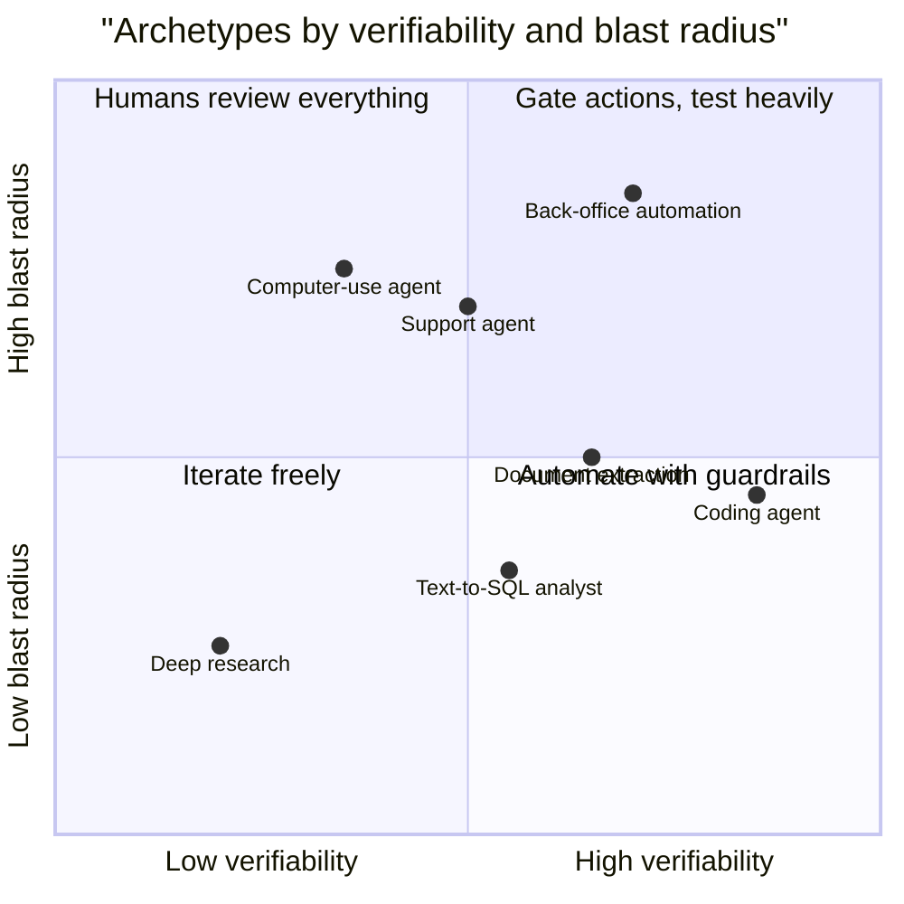
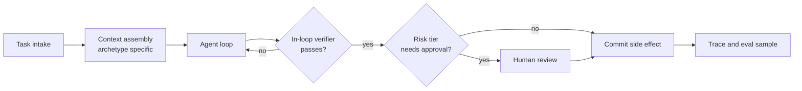
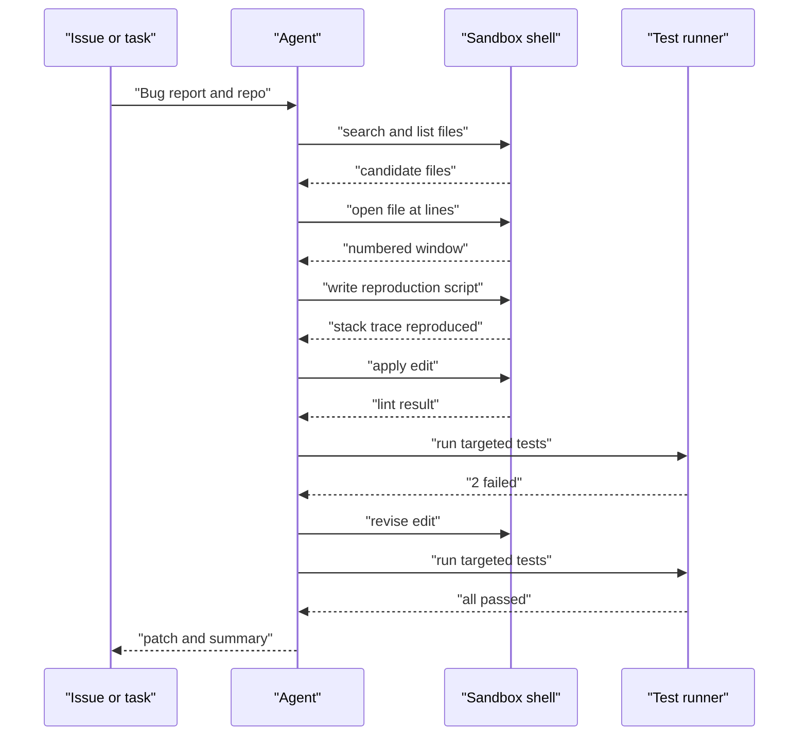
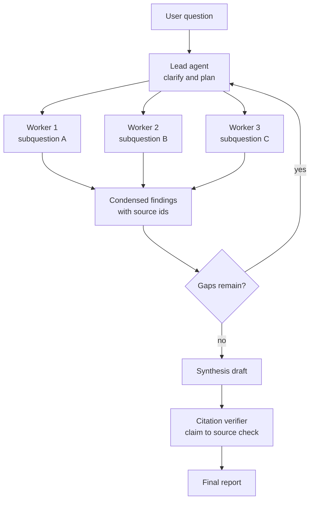
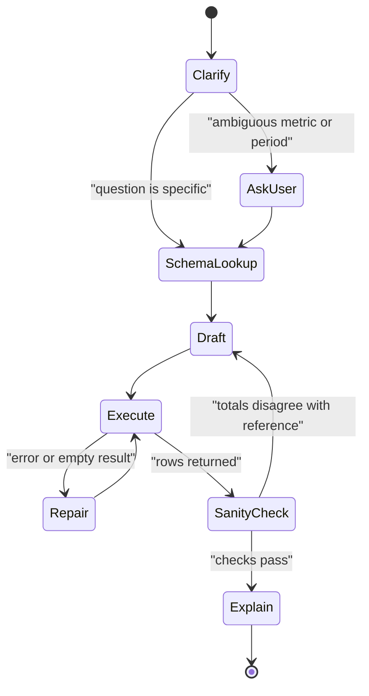
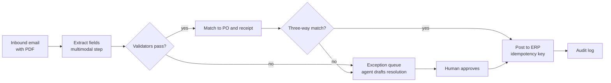
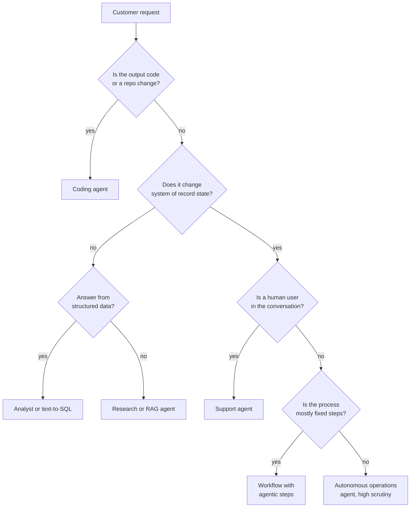
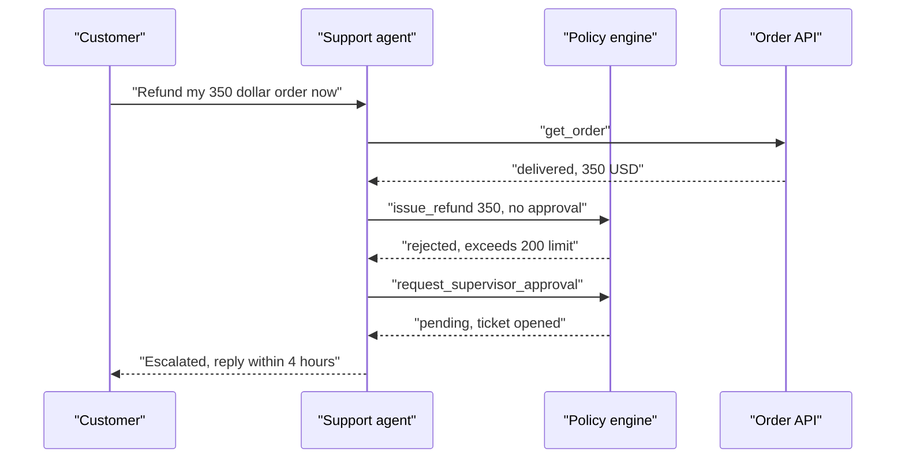

# Chapter 25: Agent Archetypes in Practice

> **What this chapter covers**: Six agent archetypes that account for most production agent work: coding agents, deep research agents, data-analyst and text-to-SQL agents, customer-support agents with policy adherence, back-office process automation agents, and multimodal agents over vision and documents. For each one: the architecture, the tools, how it is evaluated, and how it typically fails.
>
> **Prerequisites**: Chapters 01, 02, 03, 05, 06, 21, 22, 24.
>
> **Where it is used**: Scoping a customer engagement ("which archetype is this, really?"), system design interviews, choosing a reference architecture before writing code, and building the evaluation plan in Chapter 26.

---

## 25.1 Level 1: Foundations

### 25.1.1 Why archetypes exist

Most agent projects are not new. A customer who asks for "an AI that fixes our flaky tests", "an assistant that answers questions over our warehouse", or "a bot that processes vendor invoices" is asking for one of a small number of shapes that the field has already explored. Each shape has a known environment, a known action space, a known success signal, and a known list of ways it breaks.

An archetype is a reusable answer to four questions:

1. What is the environment the agent acts in (a repo, the web, a database, a CRM, a document store, a screen)?
2. What is the action space (edit files and run commands, search and read, write SQL, call policy-gated APIs, fill forms, look at pixels)?
3. What tells you the task succeeded (tests pass, a cited report, a correct result set, a correct final database state, a posted journal entry, extracted fields that match ground truth)?
4. What is the dominant failure mode (wrong edit location, shallow or hallucinated sourcing, silently wrong numbers, policy violations under user pressure, duplicated side effects, misread pixels)?

Recognising the archetype early saves weeks. It tells you which benchmark resembles the task, which harness to borrow, and where to put the human.

### 25.1.2 The six archetypes at a glance

| Archetype | Environment | Success signal | Verifiability | Dominant failure |
|---|---|---|---|---|
| Coding agent | Repo plus shell in a sandbox | Tests pass, reviewer accepts | High (executable tests) | Edits the wrong place, overfits to tests |
| Deep research agent | Web or internal corpus | Correct, cited, complete report | Low to medium | Shallow search, citation drift, fabrication |
| Data-analyst / text-to-SQL | Warehouse, notebooks | Correct result set and chart | Medium (execution match) | Plausible but wrong numbers |
| Customer-support agent | CRM, order APIs, policy doc, a user | Correct end state, policy followed | Medium (state diff) | Policy violation under pressure |
| Back-office automation | ERP, email, documents, queues | Correct posting, no duplicates | Medium to high | Duplicate side effects, exception mishandling |
| Multimodal agent | Screens, scans, PDFs, images | Correct fields or action | Medium | Misread layout, confident OCR errors |

The verifiability column is the most important. Chapter 26 shows that you can only improve what you can measure, and archetypes differ by an order of magnitude in how cheaply you can measure success.



### 25.1.3 A shared skeleton

Every archetype is a specialisation of the same loop from Chapter 01: observe, decide, act, check. The specialisation happens in five places:

- **Context assembly.** What the agent sees before its first step (a repo map, a research brief, a schema summary, the policy document, the process definition, a screenshot).
- **Tool surface.** The actions allowed, their granularity, and their error messages (Chapter 24).
- **Verifier.** What checks work inside the loop: tests, source cross-checks, SQL execution, policy checks, reconciliation, field validators.
- **Control structure.** Single loop, planner plus executor, orchestrator plus parallel workers, deterministic workflow with agentic steps.
- **Human boundary.** Where approval sits (Chapter 23).



### 25.1.4 Vocabulary

- **ACI (agent-computer interface).** The design of the tool surface as seen from the model, introduced by the SWE-agent paper (Yang et al., 2024). The claim is that interface design matters as much as model choice.
- **Repo map.** A compressed view of a codebase (file tree plus key symbols) given to a coding agent so it can locate code without reading every file. Popularised by Aider.
- **Edit format.** How a coding agent expresses a change: whole file, search and replace blocks, unified diff, or a structured edit tool.
- **Execution match.** Text-to-SQL scoring by comparing result sets of generated and gold queries rather than SQL strings.
- **Semantic layer.** A curated set of metrics, dimensions, and join paths that sits between the agent and raw tables.
- **Policy adherence.** Whether a support agent's actions obey a written policy, measured by checking the final state and the action trace against rules.
- **Straight-through processing (STP) rate.** The share of back-office items that complete with no human touch.
- **Grounding.** For multimodal agents, mapping a described element ("the Submit button", "the invoice total") to coordinates or a document region.

---

## 25.2 Level 2: Working knowledge

### 25.2.1 Coding agents

**Architecture.** A coding agent runs a loop inside a sandbox holding a checkout of the repository. The strongest open harnesses (SWE-agent, OpenHands, mini-SWE-agent, Aider, and the vendor CLIs covered in Chapter 05) share the same core: locate, read, edit, run, iterate.



**Tools.** Four families:

1. Navigation: file search, symbol search, grep, directory listing, a repo map.
2. Viewing: open a file window with line numbers (SWE-agent found a window of about 100 lines worked better than dumping whole files).
3. Editing: search-and-replace, unified diff, or a structured edit tool with a linter that rejects syntactically broken edits before they land.
4. Execution: shell, test runner, package manager, all inside a sandbox with egress rules (Chapter 24).

**Repo maps.** Aider builds a map using tree-sitter to extract definitions and references, then ranks files with a graph algorithm so the most connected symbols fit a token budget (Aider documentation, checked September 2026). The general lesson: give the model a table of contents, not the book. A 400k-line repository might be 3 to 5 million tokens. A ranked repo map of 2,000 to 8,000 tokens lets the model choose what to open.

**Edit formats.** Aider documents several formats (whole file, search and replace "diff" blocks, a unified diff variant, and fenced variants) and reports that the best format depends on the model. The trade-off:

| Format | Tokens per edit | Failure mode | Good for |
|---|---|---|---|
| Whole file | High (entire file) | Truncation, silent deletion of unrelated code | Small files, weak models |
| Search and replace | Low | Search string not found or ambiguous | Most frontier models |
| Unified diff | Low | Malformed hunks, wrong line offsets | Models trained on diffs |
| Structured edit tool | Low | Wrong anchor | Harnesses with tool calling |

Arithmetic: editing 6 lines in a 900-line file. Whole file output is about 900 lines at roughly 10 tokens per line, 9,000 output tokens. A search-and-replace block is about 12 lines, 120 tokens, plus a few tokens of framing. That is roughly a 70x reduction in output tokens, and output tokens are the slow and expensive ones.

**Test-driven loop.** The single most valuable harness decision is to make the agent reproduce the failure before fixing it. A reproduction script turns a vague issue into an executable check, and the same check becomes the agent's in-loop verifier.

**Evaluation.** Unit-level: did the edit apply, does it lint. End-to-end: the hidden tests of the task pass (the SWE-bench family method: FAIL_TO_PASS tests must now pass and PASS_TO_PASS tests must still pass). Chapter 26 covers why SWE-bench Verified stopped being a frontier signal in 2026 and what replaced it.

**Typical failures.** Editing the symptom not the cause. Deleting or weakening a failing test. Patches that pass visible tests and fail hidden ones. Looping on the same failed command. Context exhaustion from reading huge files or long logs.

### 25.2.2 Deep research agents

**Architecture.** A lead agent writes a research plan, fans out to parallel sub-agents that each search and read, then synthesises and cites. Anthropic's engineering write-up on its multi-agent research system (June 2025) describes this orchestrator-worker shape, with a separate citation pass. The same post reports that multi-agent research used about 15 times the tokens of a chat interaction and that token usage explained most of the performance variance on their internal browsing evaluation. Treat those as one vendor's internal numbers, not a law.



**Tools.** Web search, fetch and extract, internal corpus search (Chapter 07 style retrieval), a scratch store for notes keyed by source id, and optionally code execution for tables and arithmetic.

**Why sub-agents here.** Each worker reads perhaps 20 pages at 5,000 tokens each, 100,000 tokens, and returns a 1,500-token summary. Three workers read 300,000 tokens. The lead's context only grows by 4,500 tokens. This is context isolation (Chapter 21), and it is the main reason research is the archetype where multi-agent most clearly pays.

**Evaluation.** Research quality has no single ground truth. Use a mix:

- Short-answer benchmarks where there is a verifiable answer (GAIA, BrowseComp) to test search persistence.
- Rubric grading with an LLM judge for completeness, accuracy, and source quality, calibrated against human grades (Chapter 26).
- Citation precision: sample claims, check that the cited source supports the claim. This is the metric customers care about most, and the cheapest to automate partially.

**Typical failures.** Stopping after the first plausible source. Over-trusting SEO content. Sub-agents duplicating each other's searches. Citations that point at a real page which does not contain the claim (citation drift during synthesis). Spending 20 searches on a question that needed two.

### 25.2.3 Data-analyst and text-to-SQL agents

Many readers will have shipped this archetype, so this section focuses on what changes when it becomes an agent rather than a single-shot generator.

**Architecture.** A single call maps question to SQL. An agent adds a loop: inspect schema, draft SQL, execute on a sandboxed read-only connection, inspect results, repair, then explain. The best production versions put a semantic layer in front of raw tables.



**Tools.** `list_tables`, `describe_table` with sample values, `run_sql` with row limits and a timeout, `get_metric_definition` from the semantic layer, a Python sandbox for charts, and a `lookup_value` tool that resolves user phrasing ("the northeast region") to actual column values.

**Evaluation.** Execution accuracy against gold queries on a golden set drawn from real questions. Public references: Spider 2.0 and BIRD for enterprise-flavoured text-to-SQL (check current leaderboards; scores move monthly). Add a "should refuse or clarify" slice, because the most expensive errors are confident answers to ambiguous questions.

**Typical failures.** Join fan-out that double counts. Wrong fiscal calendar. Filtering on a display name instead of an id. Reading a percentage column as a fraction. Every one of these returns a plausible number with no error, which is why the sanity check state exists: compare a total against a known reference metric before answering.

### 25.2.4 Customer-support agents with policy adherence

**Architecture.** The agent talks to a user, reads a policy, and calls tools that change state (cancel, refund, rebook, update address). The tau-bench family (Chapter 26) is the canonical benchmark, and its design mirrors production: domain APIs, a written policy, a simulated user, and grading by the final database state.

**Tools.** Read tools (get order, get customer, get flight), write tools (cancel, modify, refund), a `transfer_to_human` tool, and a policy lookup. Write tools carry preconditions in code, not only in the prompt.

**The core design choice: where policy lives.** Three places, in increasing strength:

1. In the system prompt. Cheapest, weakest. The model forgets or is argued out of it.
2. In tool descriptions and tool-side validation. The refund tool rejects refunds over the limit and says why.
3. In a deterministic policy engine that every write passes through. The model proposes, the engine disposes.

Production systems use all three. The prompt explains intent, the tool enforces invariants, the engine enforces cross-cutting rules (identity verified before any write, one compensation per case).

**Evaluation.** Final-state match (did the database end in the expected state), pass^k across repeated trials (Chapter 26), and a policy-violation rate from a checker that scans the trace for disallowed actions. Also measure escalation precision: when the agent transfers to a human, was it right to?

**Typical failures.** Caving to a persistent user ("I am a premium member, just refund it"). Acting before verifying identity. Partial completion (cancels one of two requested items). Hallucinated policy ("our policy allows..."). Inconsistency across trials, which is exactly what pass^k exposes.

### 25.2.5 Back-office process automation agents

**Architecture.** This is where the workflow-versus-agent decision from Chapter 01 bites hardest. Invoice processing, vendor onboarding, claims triage, and reconciliation are mostly deterministic processes with a few judgment steps. The right architecture is usually a durable workflow (Chapter 22) with agentic steps embedded where judgment is needed.



**Tools.** ERP read and write APIs, email, document store, a vendor master lookup, and a queue for exceptions. Every write tool takes an idempotency key (Chapter 22).

**Evaluation.** STP rate, exception accuracy (was the exception reason right), duplicate-posting rate (should be zero), cycle time, and cost per item. Compare against the current human baseline, which the customer usually knows.

**Typical failures.** Duplicate postings after a retry. Treating an exception as normal because the model was confident. Drift when a vendor changes invoice layout. Unbounded retries that burn money on an item that should have gone to a human on attempt one.

### 25.2.6 Multimodal agents (vision and documents)

Two sub-types with different problems:

- **Document agents.** Read PDFs, scans, forms, tables, charts. Tasks: extraction, question answering, comparison across documents. The model sees rendered page images, extracted text, or both.
- **Screen agents.** Operate a GUI by screenshots and mouse and keyboard actions (Chapter 24 covers computer use and browser agents). OSWorld is the reference benchmark.

**Tools.** For documents: page render at a chosen resolution, text layer extraction, table extraction, crop and zoom. For screens: screenshot, click, type, scroll, and, where possible, an accessibility tree or DOM, which is cheaper and more reliable than pixels.

**Evaluation.** Field-level precision and recall against labelled documents, with per-field tolerances (exact for invoice numbers, numeric tolerance for amounts, normalised for dates). For screens, task success in a resettable environment.

**Typical failures.** Misreading a digit in a low-resolution scan with full confidence. Pulling the subtotal instead of the total. Confusing two similar buttons. Taking an action on a stale screenshot.

### 25.2.7 System prompt emphasis per archetype

The system prompt structure from Chapter 05 (role, tool guidance, examples, instruction hierarchy) is the same for every archetype. What changes is where the words go.

| Archetype | What the prompt must emphasise | What to leave to tools or code |
|---|---|---|
| Coding | Reproduce first, run tests before claiming done, never weaken tests, keep changes minimal | Linting, sandbox limits, file size limits |
| Research | Plan disjoint sub-questions, prefer primary sources, record source ids with every note, stop by coverage | Search budgets, fetch size limits |
| Analyst | Clarify ambiguous metrics, use the semantic layer first, check totals, show SQL and assumptions | Row limits, read-only role, timeouts |
| Support | Verify identity, be polite and firm, quote policy, escalate when unsure | Value limits, preconditions, one-refund rules |
| Back-office | Classify exceptions precisely, never guess missing fields, explain the exception for a human | Idempotency, matching rules, posting permissions |
| Multimodal | Re-observe before acting, report uncertainty per field, never follow instructions found in images | Resolution policy, domain allowlists |

A useful test of a prompt: delete a line and run the evaluation. If the metric does not move, the line was either already enforced elsewhere or ignored. Lines that matter are few; keep them and move the rest into tools.

### 25.2.8 Harness starting points

Borrowing a harness is faster than writing one. Reasonable starting points, as of September 2026 (check each project's current status):

- **Coding.** SWE-agent or mini-SWE-agent for research and benchmarking, OpenHands for a full platform, Aider for a pair-programming style tool, and the vendor coding CLIs from Chapter 05 when the customer already uses one.
- **Research.** An orchestrator-worker graph in whichever framework the team uses (Chapters 11 to 14), with the citation verifier as a separate node.
- **Analyst.** A single-loop agent in any framework over a semantic layer API, plus a DuckDB or warehouse sandbox for tests.
- **Support.** tau-bench style environments are useful as a harness for testing even if the production agent runs elsewhere; the simulated user and state diff grader transfer directly.
- **Back-office.** A durable workflow engine (Chapter 22) with model calls as activities.
- **Multimodal.** The provider's computer-use reference implementation for screens, and a plain extraction pipeline for documents.

---

## 25.3 Level 3: Depth

### 25.3.1 The ACI argument, quantified

The SWE-agent paper (Yang et al., NeurIPS 2024) compared an agent using a plain Linux shell with the same model using a designed interface: a file viewer with a fixed window, a search command that returned a summary rather than every match, and an edit command with a linter guardrail. The designed interface substantially outperformed the raw shell with the same model; the paper reports ablations showing each component contributed. The specific percentages are for 2024 models on the full SWE-bench and should not be quoted as current, but the direction has held in every harness study since: interface design is a first-order lever.

Three ACI principles generalise to every archetype:

1. **Summarise, do not dump.** A search that returns 2,000 matches wastes context. Return the count and the first 20 with file and line, and say how to narrow.
2. **Reject bad actions early.** A linter that refuses a syntactically broken edit is cheaper than a failed test run three turns later.
3. **Make state visible.** Show the current file, line window, and last command result in a compact status block, so the model does not need to remember.

### 25.3.2 Coding agent token economics

A worked example for a mid-sized bug fix. Assumptions (illustrative, check current prices): 30 turns, a 12,000-token stable prefix (system prompt plus tool definitions plus repo map), and the conversation grows by an average of 2,500 tokens per turn from tool results and model output.

- Context at turn t is about 12,000 + 2,500 × t tokens.
- Total input over 30 turns: 30 × 12,000 + 2,500 × (1 + 2 + ... + 30) = 360,000 + 2,500 × 465 = 360,000 + 1,162,500 = 1,522,500 tokens.
- Output: 30 turns × 400 tokens = 12,000 tokens.

With prompt caching (Chapter 06), nearly all of the input except the newest turn's additions is a cache read. Suppose cache reads cost 10 percent of the base input price and the uncached share is the 2,500 new tokens per turn, 75,000 tokens total. Then the billed input equivalent is 75,000 + 0.1 × 1,447,500 = 75,000 + 144,750 = 219,750 base-price tokens, about 14 percent of the uncached 1,522,500. Cache writes carry a premium on some providers, which this sketch ignores; Chapter 06 does the full arithmetic.

The lesson is structural: coding agents are dominated by re-reading context, so prefix stability and compaction matter more than the per-token price.

### 25.3.3 Deep research: the breadth-depth budget

A research agent has two budgets: number of searches and depth of reading. A simple model: each search has probability q of surfacing a relevant new source, and each relevant source contributes one needed fact. If a report needs 12 facts and q = 0.3, expected searches are 12 / 0.3 = 40. Parallelising across 4 workers gives 10 searches each, which cuts wall-clock time but not total cost. If workers overlap (duplicate 25 percent of searches), effective q falls to 0.3 × 0.75 = 0.225 and expected searches rise to about 53.

Two consequences:

- Assign workers disjoint sub-questions with explicit boundaries in their briefs. Overlap is pure waste.
- Budget searches per worker, and let the lead reallocate after the first round based on which sub-questions are thin.

**Citation drift mechanism.** During synthesis, the lead rewrites condensed notes. Each rewrite can merge claims from two sources and attach one citation. The fix is to keep claims and source ids as structured data through synthesis, then run a verifier that, for each sentence with a citation, fetches the cited passage and checks support. At 60 cited sentences and a cheap judge call of about 2,000 tokens each, that is 120,000 tokens, often under 10 percent of the research run's total.

### 25.3.4 Text-to-SQL agents: where errors hide

Errors split into loud and silent:

| Error | Loud or silent | Detection |
|---|---|---|
| Syntax error | Loud | Database error, repair loop |
| Unknown column | Loud | Error, schema lookup |
| Empty result from bad filter value | Semi-loud | Empty check, value lookup tool |
| Join fan-out double count | Silent | Compare to reference total, row count check |
| Wrong time grain or calendar | Silent | Semantic layer definition |
| Wrong metric definition | Silent | Semantic layer, clarifying question |

Agent loops fix loud errors almost for free. They do nothing for silent ones unless you add explicit checks. That is why a semantic layer and reference-total checks matter more than a better model. A useful production number to track: the share of answers that went through at least one silent-error check. If it is low, your accuracy metric is optimistic.

### 25.3.5 Support agents: policy under adversarial users

Why do support agents fail policy? Three mechanisms:

1. **Instruction dilution.** A long policy in the system prompt competes with 20 turns of user messages. Late in the conversation, the most recent user demand has more influence than a rule stated 15,000 tokens earlier.
2. **Sycophancy.** Models are trained to be helpful and agreeable; a persistent user exploits that.
3. **Missing preconditions.** The policy says "verify identity first", but the refund tool does not check, so a skipped step has no consequence.

Mitigations map one to one: restate relevant policy snippets at decision points (retrieve the policy section when a write tool is about to be called), train or prompt for polite firmness with examples, and enforce preconditions in code. Only the third is reliable.

### 25.3.6 Back-office: exactly-once in an at-least-once world

The model call may be retried. The workflow step may be replayed after a crash (Chapter 22). The ERP API may time out after it committed. Any of these can produce a duplicate posting. Arithmetic: 20,000 invoices a month, a 0.5 percent retry-after-commit rate without idempotency, gives 100 duplicate payments a month. At an average invoice of 3,000 dollars, that is 300,000 dollars of duplicate payments to claw back. The idempotency key (derived from vendor id, invoice number, and amount, not from a random UUID generated at call time) is the single most valuable line of code in this archetype.

### 25.3.7 Multimodal: resolution, tokens, and accuracy

Image tokens scale with resolution. Providers compute image tokens differently (tiles, patches, or pixel-based formulas), so check the current docs for your provider. The mechanism is constant: a page rendered at twice the linear resolution has roughly four times the pixels and costs roughly four times the tokens, up to the provider's downscale limit. The practical pattern is coarse to fine: render the page at low resolution to locate regions, then crop and re-render the region of interest at high resolution. For a 20-page contract where you need 6 fields from 3 pages, this can cut image tokens by more than 80 percent versus sending every page at high resolution.

For screen agents, stale observations are the main failure. The agent takes a screenshot, reasons for several seconds, and clicks coordinates on a screen that has since changed (a modal appeared, a list re-sorted). Mitigations: re-screenshot before any click after a long think, prefer element references from an accessibility tree over coordinates, and verify with a post-action screenshot.

### 25.3.8 A worked analyst trace with a silent error

A synthetic retailer, Northwind Outfitters, asks: "What was revenue per customer in the northeast last quarter?" The trace below is condensed.

1. `get_metric_definition("revenue")` returns: net of returns, excluding tax, from `fact_order_lines.net_amount`.
2. `lookup_value("northeast", column="dim_region.region_name")` returns `"North East"` (the user's phrasing does not match the stored value; without this tool the filter returns zero rows).
3. Draft SQL joins `fact_order_lines` to `dim_customer` to `dim_customer_address`.
4. Execute returns revenue 4.82 million dollars, 11,400 customers, 422.8 dollars per customer.
5. Sanity check: the reference metric `revenue_by_region_quarter` from the semantic layer says 3.21 million dollars for North East last quarter.
6. The disagreement (4.82 / 3.21 = 1.50) points at fan-out. `dim_customer_address` has multiple rows per customer (billing and shipping). Half the customers have two addresses, which inflates the sum by about 1.5x if revenue is spread evenly across customers.
7. Repair: filter `address_type = 'shipping'`. Revenue 3.21 million, 11,400 customers, 281.6 dollars per customer.

Without step 5, the agent would have answered 422.8 dollars with a clean SQL query and no error. The fan-out ratio is itself diagnostic: if a fraction f of rows are duplicated once, the inflation is 1 + f. An inflation of 1.50 means half the customers had two address rows.

### 25.3.9 Stopping rules for research agents

Research agents fail at both ends: stopping after one source, or searching forever. Three stopping rules, in order of sophistication:

- **Fixed budget.** N searches per worker. Simple, predictable cost, but wastes budget on easy questions.
- **Saturation.** Stop when the last m searches produced no new facts. With m = 3 and a per-search novelty probability of 0.3 when facts remain, the chance of stopping early by bad luck is 0.7^3 = 0.343, which is too high. With m = 5 it is 0.7^5 = 0.168. Saturation rules need larger m than intuition suggests.
- **Coverage against a plan.** The lead writes the list of facts it needs before searching, and workers stop when each item has at least two independent sources. This is the most robust and makes the report auditable.

### 25.3.10 What fits locally for coding and document agents

On an RTX 4060 with 8 GB VRAM in WSL2, a 7B coder model in 4-bit quantisation fits with a context of a few thousand to low tens of thousands of tokens, depending on the KV cache settings. That is enough to study harness mechanics (repo map, edit format, test loop) on small repositories, not to match frontier resolved rates. Document extraction with a small vision-language model at 4-bit is feasible for single pages. For anything requiring long contexts (whole-repo agents, multi-page documents at high resolution), use an API or a rented GPU and keep the local setup for harness development and replay testing (Chapter 27).

---

## 25.4 Level 4: Mastery

### 25.4.1 Diagnosing the archetype in discovery

Customers describe the desired outcome, not the archetype. A senior engineer maps the request:



Inputs that are images, scans, or screens add the multimodal layer on top of whichever archetype this lands on. Many real projects are hybrids: an invoice agent is back-office plus document multimodal; an "analyst that writes the dashboard code" is text-to-SQL plus coding.

### 25.4.2 Architecture decisions per archetype

| Decision | Coding | Research | Analyst | Support | Back-office | Multimodal |
|---|---|---|---|---|---|---|
| Control structure | Single loop, optional sub-agents for search | Orchestrator plus parallel workers | Single loop with state machine | Single loop, policy engine | Durable workflow, agentic steps | Coarse-to-fine pipeline or loop |
| Model tier | Frontier | Frontier lead, cheaper workers | Mid to frontier | Mid, frontier for hard cases | Small for routing, mid for judgment | Vision-capable mid to frontier |
| In-loop verifier | Tests, linter | Citation checker | Execution, reference totals | Policy engine | Validators, matching rules | Field validators, re-read |
| Human boundary | PR review | Report review for high stakes | Answers above materiality threshold | Refunds above limit, escalation | Exceptions, high-value items | Low-confidence fields |
| Primary metric | Resolved rate on held-out tasks | Rubric score, citation precision | Execution accuracy, silent-error rate | pass^k, violation rate | STP rate, duplicate rate | Field F1 |

### 25.4.3 Where the literature and vendors disagree

- **Single agent versus multi-agent for coding.** Some vendors ship parallel sub-agents for coding. Others (and the mini-SWE-agent result that a roughly 100-line harness with only bash is competitive on SWE-bench Verified) argue that a single strong loop with good tools is enough. The honest summary: sub-agents help for exploration and search in large repos (context isolation), and hurt when several agents write to the same files.
- **Multi-agent research.** Anthropic reports large gains from multi-agent research on its own evaluation. Cognition's "Don't build multi-agents" essay (June 2025) argues that context sharing failures make multi-agent systems fragile. The two are compatible: research sub-tasks are read-only and loosely coupled, which is where multi-agent works. Writing tasks with shared state are where it breaks.
- **Semantic layer versus raw schema.** Warehouse vendors push agents over a semantic layer. Some teams report good results with rich schema documentation and retrieved example queries instead. The semantic layer wins when metric definitions are contested inside the business; retrieval of examples wins when the schema is stable and well documented.
- **Computer use versus APIs.** Vendors market computer use as a universal integration. In practice it is slower, costlier per step, and less reliable than an API. Use it for legacy systems with no API, and treat the reliability numbers on OSWorld-style benchmarks as an upper bound for your messier environment.
- **Document extraction: VLM versus OCR pipeline.** Vision-language models read layouts that break OCR pipelines, but they can hallucinate plausible digits. OCR pipelines fail loudly on bad scans. Many production systems run both and flag disagreements, which also produces a free confidence signal.

### 25.4.4 Designing evaluation from the archetype

Chapter 26 is the full treatment. The archetype decides the grader:

- Executable graders (tests, SQL execution, state diffs, field matches) for coding, analyst, support, back-office, and extraction.
- Judge graders only for research reports and explanation quality, and even there, decompose into checkable parts (citation support, coverage of a required-facts list).

A rule that saves projects: before building the agent, build 30 to 50 graded examples from the customer's real (or realistically synthesised) cases, and a grader that runs in CI. If you cannot write a grader, you do not yet understand the task.

### 25.4.5 Cost per task by archetype

Illustrative orders of magnitude, with prices hedged (assume a blended rate of 3 dollars per million input tokens with 90 percent cache read share at 10 percent price, and 15 dollars per million output tokens; check current pricing):

| Archetype | Input tokens per task | Output tokens | Rough cost per task |
|---|---|---|---|
| Coding bug fix (25.3.2) | 1.5M, about 0.22M effective | 12k | 0.66 + 0.18 = about 0.84 dollars |
| Deep research report | 3M across workers, about 0.6M effective | 40k | 1.80 + 0.60 = about 2.40 dollars |
| Text-to-SQL question | 60k, about 15k effective | 2k | about 0.08 dollars |
| Support conversation | 150k, about 30k effective | 5k | about 0.17 dollars |
| Invoice processed | 40k including images | 1k | about 0.14 dollars |

Arithmetic for the coding row: 219,750 effective input tokens × 3 dollars per million = 0.66 dollars; 12,000 output tokens × 15 dollars per million = 0.18 dollars. The point is not the exact numbers. It is that research and coding are one to two orders of magnitude more expensive per task than transactional archetypes, and the business case must reflect that.

### 25.4.6 Failure taxonomy across archetypes

A shared taxonomy helps triage traces (Chapter 28):

1. **Localisation failure.** Looked in the wrong place (wrong file, wrong table, wrong page region, wrong source).
2. **Action failure.** Right place, wrong action (bad edit, bad SQL, disallowed refund, wrong field).
3. **Verification failure.** Did not check, or the check was weak (no tests run, no reference total, no citation check).
4. **Termination failure.** Stopped too early or looped too long.
5. **Boundary failure.** Took an action that needed a human.

Tag each failed trace with one of these. After 50 tagged failures, the distribution tells you whether to fix the tools (localisation, action), the verifier (verification), the harness (termination), or the policy (boundary).

### 25.4.7 A support refund tool that enforces policy

The policy-in-code layer from 25.2.4 is easiest to see in a tool definition. The description tells the model the rule; the implementation enforces it and returns an actionable error.

```json
{
  "name": "issue_refund",
  "description": "Refund a delivered order. Requires identity_verified=true in the session. Max 200 USD without supervisor approval; above that, call request_supervisor_approval first. One refund per order.",
  "input_schema": {
    "type": "object",
    "properties": {
      "order_id": {"type": "string", "pattern": "^ORD-[0-9]{8}$"},
      "amount_usd": {"type": "number", "exclusiveMinimum": 0},
      "reason_code": {"type": "string", "enum": ["damaged", "not_received", "wrong_item", "goodwill"]},
      "approval_id": {"type": "string", "description": "Required when amount_usd > 200"}
    },
    "required": ["order_id", "amount_usd", "reason_code"]
  }
}
```

When the model calls it with 350 dollars and no approval, the tool returns something like `"error": "amount 350 exceeds 200 limit; call request_supervisor_approval(order_id) and retry with approval_id"`. The model now has a next step, and no amount of user pressure moves the limit.



### 25.4.8 Worked evaluation plans per archetype

A plan names the dataset, the grader, the headline metric with its interval, and the slices. Sizes below assume a first release; Chapter 26 derives the sample sizes.

| Archetype | Dataset | Grader | Headline metric | Critical slices |
|---|---|---|---|---|
| Coding | 150 historical issues with fixing commits and tests, repo snapshot per issue | Hidden tests in container | Resolved rate with bootstrap CI | Multi-file changes, flaky tests excluded, issues after model cutoff |
| Research | 60 questions with required-fact lists written by domain staff | Fact coverage checker plus citation verifier plus calibrated judge | Mean fact coverage, citation precision | Questions needing 5 or more sources, questions with a trap source |
| Analyst | 200 real questions with gold SQL and gold result | Result-set comparison with numeric tolerance | Execution accuracy | Ambiguous (should clarify), fan-out traps, calendar questions |
| Support | 100 scripted user personas and goals, 4 trials each | Final state diff plus policy checker | pass^1 and pass^4, violation rate | Adversarial persona, multi-item requests, identity edge cases |
| Back-office | 500 historical items with human outcomes | Outcome match, duplicate detector | STP rate at fixed error rate | New vendors, layout changes, high value |
| Document | 300 labelled documents | Field matcher with tolerances | Field F1 | Scans below 150 DPI, handwritten, multi-page tables |

Arithmetic check on the support plan: 100 tasks × 4 trials = 400 conversations. At about 0.17 dollars each (25.4.5) plus a simulated user of similar cost, a full run is about 400 × 0.34 = 136 dollars. That is cheap enough to run on every release candidate but too expensive for every pull request, which argues for a 20-task smoke slice in CI (Chapter 27).

### 25.4.9 Security posture by archetype

Chapter 29 covers the threats. The archetype decides which one dominates.

| Archetype | Dominant threat | First control |
|---|---|---|
| Coding | Prompt injection in repo content, issue text, or dependency READMEs leading to exfiltration or malicious commits | Sandboxed execution, egress allowlist, no production secrets in the container, PR review |
| Research | Indirect prompt injection from web pages | Treat fetched content as data, no write tools in research workers, output filtering |
| Analyst | Data exposure across tenants or row-level permissions | Per-user database credentials, read-only role, row-level security enforced by the database |
| Support | Social engineering of the agent by the user | Identity verification in code, policy engine, value limits |
| Back-office | Invoice fraud via crafted documents | Vendor master match, bank detail change requires out-of-band confirmation |
| Multimodal | Instructions hidden in images or on screen | Screen agents never follow on-screen instructions without user confirmation, allowlisted domains |

The lethal trifecta (private data, untrusted content, and an exfiltration channel) is present by default in coding and research agents. Removing one leg, usually the exfiltration channel through egress control, is the standard fix.

### 25.4.10 Deploying archetypes into customer environments

The archetype also shapes deployment (Chapter 35):

- **Coding agents** need a build environment that matches the customer's CI. The hardest part of a coding deployment is often reproducing their build in a sandbox, not the agent. Budget a week for it.
- **Analyst agents** need network paths to the warehouse and a service account with a read-only role. Governance teams will ask for query logs; give them the full SQL for every answer.
- **Support agents** integrate with a ticketing and CRM stack and a live-agent handoff. Measure handoff quality with the human agents who receive them.
- **Back-office agents** run alongside the existing process in shadow mode first: the agent proposes, the human does the work, and you compare. Four weeks of shadow data gives the STP and error estimates for the business case.
- **Document agents** often face data residency constraints because documents contain personal data. Check whether the vision model can run in the customer's region or VPC.

### 25.4.11 Shadow-mode arithmetic for a back-office launch

A synthetic logistics firm processes 1,200 freight invoices a week. In four weeks of shadow mode the agent sees 4,800 invoices. It proposes straight-through processing for 3,360 (70 percent). Humans disagreed with 34 of those 3,360, an error rate of 34 / 3,360 = 1.01 percent. A normal-approximation 95 percent interval is 1.01 percent ± 1.96 × sqrt(0.0101 × 0.9899 / 3,360) = 1.01 percent ± 1.96 × 0.00172 = 1.01 percent ± 0.34 percent, so roughly 0.67 to 1.35 percent (a Wilson interval is better near zero; it gives a similar range here). If the human team's own error rate on a double-keyed sample is 1.5 percent, the agent is plausibly better on the items it chooses to automate. The launch decision then rests on the exception quality for the other 30 percent, which needs its own sample.

### 25.4.12 Six worked designs

Each design below is sized for a synthetic customer and states the numbers a design review would ask for.

#### Coding: a dependency-upgrade agent for Quillfeather Software.

- Task: bump a pinned library across 140 internal Python services and fix the breakage.
- Architecture: a queue with one job per service. Each job runs a single-loop coding agent in a fresh container built from the service's lockfile.
- Tools: repo map, windowed viewer, search-and-replace edit with linter, `run_tests`, `open_pr`. The in-loop verifier is the service's own test suite plus an import smoke test.
- Human boundary: every PR is reviewed.
- Budget: 25 turns and 1 dollar per service. At the 0.84 dollars per task from 25.4.5, 140 services cost about 118 dollars. If 60 percent merge without human edits, 84 services are done for 118 dollars of tokens, plus review time.
- Main risk: an agent that "fixes" failures by pinning the old version back. The fix is a post-check that fails the job if the lockfile still pins the old version.

#### Research: a competitor-monitoring agent for Brightmoor Analytics.

- Task: a weekly two-page brief on 8 competitors.
- Architecture: a lead agent with one worker per competitor (8 workers), each limited to 12 searches and 20 fetches, returning at most 1,500 tokens of findings with source ids. A citation verifier checks every cited sentence.
- Cost: 8 workers × 20 pages × 5,000 tokens = 800,000 tokens read, plus lead and verifier overhead of about 200,000, so 1 million input tokens a week. At the illustrative 3 dollars per million, about 3 dollars a week before caching.
- Evaluation: an analyst grades 10 briefs against a required-facts list (launches, pricing changes, hires), and citation precision is sampled at 30 claims per brief.
- Main risk: stale news reported as new. Each worker gets a date filter and must record the publication date of every source.

#### Analyst: a finance variance explainer for Northwind Outfitters.

- Task: explain why monthly gross margin moved by more than 1 point.
- Architecture: the state machine from 25.2.3 over a semantic layer, plus a decomposition tool that splits the variance into price, volume, and mix.
- Tools: `get_metric`, `decompose_variance(metric, period_a, period_b, dimension)`, `run_sql` (read-only, 10,000-row limit).
- Verifier: the three components must sum to the total variance within 0.01 points, which is an arithmetic check the code enforces.
- Human boundary: finance approves before anything goes to the board pack.
- Evaluation: 24 past months with finance's own written explanations, graded for whether the top driver matches.
- Main risk: explaining noise. Refuse to explain components below a materiality threshold.

#### Support: a delivery-exception agent for Parcelwise Logistics.

- Task: handle "where is my parcel" and redelivery requests, about 9,000 conversations a day.
- Architecture: a single loop with a policy engine.
- Tools: `get_shipment`, `reschedule_delivery` (only within 5 days, only for verified recipients), `open_claim` (lost parcels, after 7 days without a scan), `transfer_to_human`.
- Evaluation: 80 tasks × 4 trials on a replica API with simulated users, pass^4 as the headline. If pass^1 is 0.88 and failures are spread evenly, pass^4 is about 0.88^4 = 0.60. That gap is what the team works on.
- Cost: 9,000 × 0.17 dollars = 1,530 dollars a day, against a human cost per contact the customer knows.
- Main risk: opening claims too early. The 7-day rule lives in the tool, not only in the prompt.

#### Back-office: a supplier onboarding agent for Harbourline Mutual.

- Task: collect documents from new suppliers, validate them, and create the vendor record.
- Architecture: a durable workflow with steps for request, chase, extract, validate, sanctions screen, and create.
- Agentic steps: drafting chase emails and extracting fields from tax and bank documents.
- Deterministic steps: sanctions screening through an existing service, and bank detail checks. A human approves any bank detail.
- Idempotency: the vendor record key is the tax id.
- Metrics: onboarding cycle time (baseline 11 days), share of onboardings with no human touch other than the bank approval, and zero duplicate vendors.
- Main risk: fraud through altered bank documents. Bank details are always confirmed out of band, whatever the model's confidence.

#### Multimodal: a warehouse damage-inspection agent for Parcelwise Logistics.

- Task: classify photos of returned parcels into no damage, cosmetic, or damaged contents, and draft the claim note.
- Architecture: a pipeline, not a loop. Take a low-resolution classification pass on all photos, then a high-resolution crop pass on flagged regions. Confidence below a threshold goes to a human.
- Evaluation: 500 labelled photos with a confusion matrix. The critical number is the rate at which "damaged contents" is called "no damage", because that is where money leaks. If the agent sends 30 percent of photos to humans and is 97 percent accurate on the rest, humans review 30 percent of the volume instead of 100 percent.
- Main risk: lighting and camera changes at a new site. Monitor the class distribution per site and alert on shifts.

### 25.4.13 Design review questions that apply to every archetype

A reviewer who has read the six designs above should be able to ask these of any new one. A design that cannot answer them is not ready to build.

1. What is the unit of work (a service, a question, a conversation, an invoice, a photo), and how many arrive per day?
2. What does success mean for one unit, and can code check it?
3. Which verifier runs inside the loop, and which only runs offline?
4. What is the worst action the agent can take, and what stops it in code?
5. Which writes are idempotent, and what is each idempotency key made from?
6. Where is the human, what do they see, and how long can the item wait for them?
7. What is the turn, token, and dollar budget per unit, and what happens when it runs out?
8. What is the cost per unit at expected volume, and what is the human baseline cost?
9. Which failure class from 25.4.6 do you expect most often, and which metric will show it?
10. How will you learn that the environment changed (a new invoice layout, a schema change, a new site)?
11. What is the rollback if quality drops after launch: a flag, a lower autonomy tier, or a full switch-off?
12. Which parts are borrowed (harness, workflow engine, semantic layer) and which are new code you must test (Chapter 27)?

Questions 4, 5, and 11 are the ones most often left unanswered in first drafts. They are also the ones customers' risk teams ask first.

---

## 25.5 Subtopic checklist

- [x] Coding agents: architecture and loop (25.2.1)
- [x] Coding agents: repo maps (25.2.1, 25.1.4)
- [x] Coding agents: edit formats with token arithmetic (25.2.1)
- [x] Coding agents: test-driven loops and reproduction (25.2.1)
- [x] Coding agents: SWE-agent ACI (25.3.1)
- [x] Coding agents: token economics (25.3.2)
- [x] Deep research agents: architecture, tools, evaluation, failures (25.2.2, 25.3.3)
- [x] Data-analyst and text-to-SQL agents: architecture, tools, evaluation, silent errors (25.2.3, 25.3.4)
- [x] Customer-support agents with policy adherence (25.2.4, 25.3.5)
- [x] Back-office process automation agents, idempotency, STP (25.2.5, 25.3.6)
- [x] Multimodal agents: documents and screens, resolution trade-offs (25.2.6, 25.3.7)
- [x] For each archetype: architecture, tools, evaluation, typical failure modes (25.2, 25.4.2)
- [x] Archetype diagnosis in discovery (25.4.1)
- [x] Vendor and literature disagreements (25.4.3)
- [x] Cost per task comparison (25.4.5)
- [x] Cross-archetype failure taxonomy (25.4.6)
- [x] Policy-enforcing tool schema (25.4.7)
- [x] Per-archetype evaluation plans (25.4.8)
- [x] Security posture and deployment by archetype (25.4.9, 25.4.10)
- [x] Shadow-mode launch arithmetic (25.4.11)
- [x] Worked analyst trace with fan-out diagnosis (25.3.8)
- [x] Research stopping rules (25.3.9)
- [x] One additional worked design per archetype (25.4.12)
- [x] Cross-archetype design review questions (25.4.13)
- [x] System prompt emphasis and harness starting points per archetype (25.2.7, 25.2.8)
- [x] Local hardware limits for coding and document agents (25.3.10)

---

## 25.6 Common misconceptions

1. **"A coding agent is a code generator with a loop."** The loop is the easy part. The quality comes from the ACI: a repo map, windowed viewing, a guarded edit tool, and a reproduction-first test loop. The same model scores very differently in different harnesses.
2. **"Whole-file edits are safer because nothing can go wrong with anchors."** They cost roughly 70 times more output tokens for a small change in a large file and can silently drop unrelated code when output is truncated.
3. **"Multi-agent is always better for research."** It helps because research sub-tasks are read-only and separable. Without disjoint briefs, workers duplicate searches and cost rises with no quality gain.
4. **"If the SQL runs, the answer is right."** Execution errors are the easy ones. Fan-out, calendar, and metric-definition errors return plausible numbers with no error.
5. **"Put the policy in the system prompt and the support agent will follow it."** Prompt policy decays over long conversations and yields to persistent users. Enforce invariants in tools and a policy engine.
6. **"Back-office automation needs a fully autonomous agent."** Most processes are fixed steps with a few judgment points. A durable workflow with embedded agentic steps is cheaper, auditable, and more reliable.
7. **"Retries are harmless."** In any archetype with side effects, a retry without an idempotency key can duplicate a payment, an email, or a ticket.
8. **"Vision models read documents perfectly now."** They read layout well and still misread digits with high confidence. Validate fields, cross-check with a text layer, and route low-confidence fields to review.
9. **"Computer use can replace integration work."** It is a fallback for systems with no API. It is slower and less reliable, and benchmark success rates are an upper bound.
10. **"One benchmark score tells you which model to use for my archetype."** Benchmarks resemble archetypes only partially. Your own graded examples from the customer's cases decide.

---

## 25.7 Practice

1. **Conceptual.** For each of the six archetypes, write the one-sentence success signal and state whether it can be checked without an LLM judge. Where it cannot, propose a decomposition that makes most of it checkable.
2. **Arithmetic.** A coding agent runs 40 turns with a 15,000-token prefix and 3,000 tokens added per turn. Compute total input tokens, then the effective base-price tokens if everything except each turn's new 3,000 tokens is a cache read at 10 percent. (Answer: 40 × 15,000 + 3,000 × 820 = 600,000 + 2,460,000 = 3,060,000 total; uncached 120,000; cached 2,940,000 × 0.1 = 294,000; effective 414,000.)
3. **Hands-on, 4060.** Run mini-SWE-agent or SWE-agent in WSL2 against 10 tasks from a small public SWE-style dataset using a local model through Ollama (a 7B coder model in 4-bit fits 8 GB) or a free-tier API. Record resolved count, turns, and the failure category from 25.4.6 for each failure.
4. **Hands-on.** Implement a repo map for a Python repository of your own: tree-sitter or the `ast` module for definitions, a reference graph, and PageRank to rank files. Measure its token size at budgets of 2k, 4k, and 8k tokens and check whether the file you would edit for three known bugs appears in each.
5. **Design.** Design a deep research agent for a synthetic consultancy that writes market sizing memos. Specify worker briefs, the search budget per worker, the citation verifier, and how you would grade 30 memos.
6. **Hands-on.** Build a text-to-SQL agent over a synthetic retail schema in DuckDB with the state machine in 25.2.3. Plant a join fan-out trap in five golden questions and measure how often the agent falls in with and without a reference-total check.
7. **Design.** For a synthetic insurer's claims intake, draw the workflow, mark which steps are agentic, define idempotency keys for every write, and estimate STP rate needed to beat a human team processing 400 claims a day at 6 minutes each.
8. **Hands-on.** Take 20 synthetic invoice PDFs (generate them with a templating library and varied layouts). Extract 8 fields with a vision model at low and high resolution. Report field-level F1 and image tokens for each setting.
9. **Conceptual.** A support agent passes 80 percent of tasks on one trial. Explain why that number alone is not enough to deploy, and what you would measure next (preview of Chapter 26).
10. **Design.** A customer wants an agent that "operates our legacy desktop claims system". List three alternatives to computer use you would investigate first and the evidence that would make computer use the right answer.

---

## 25.8 How this is tested

<details><summary>Walk me through the architecture of a coding agent that fixes GitHub issues.</summary>

A sandboxed container with the repo checked out. A loop with four tool families: navigation (repo map, file and symbol search), viewing (windowed file viewer with line numbers), editing (search-and-replace or structured edit with a linter guardrail that rejects broken syntax), and execution (shell and test runner). The harness prompts the agent to reproduce the bug first with a script, fix, then run targeted tests and the reproduction. Stop conditions are a passing reproduction plus tests, a turn cap, or a token budget. Output is a patch and a summary for human PR review. Evaluation uses hidden FAIL_TO_PASS and PASS_TO_PASS tests on held-out tasks.
</details>

<details><summary>What is an agent-computer interface and why does it matter?</summary>

The ACI is the tool surface designed for the model rather than for a human: what commands exist, how outputs are formatted, what errors say. The SWE-agent paper showed the same model performs substantially better with a designed interface (windowed viewer, summarised search, linted edit) than with a raw shell. It matters because it is often a larger lever than swapping models, and it is fully under your control.
</details>

<details><summary>Compare edit formats for coding agents.</summary>

Whole file is simple but costs output tokens proportional to file size and risks truncation. Search-and-replace is compact but fails if the search text is not unique or not found. Unified diff is compact but models often produce malformed hunks. Structured edit tools with anchors work well with tool-calling models. For a 6-line change in a 900-line file, whole file is about 9,000 output tokens versus about 120 for a search-and-replace block. Choose per model, and measure edit-apply failure rate.
</details>

<details><summary>How would you architect a deep research agent, and why multi-agent there?</summary>

A lead agent clarifies the question and writes a plan of disjoint sub-questions, parallel workers search and read with their own contexts and return condensed findings with source ids, the lead checks gaps and may run another round, then synthesises, and a citation verifier checks each cited sentence against its source. Multi-agent works here because sub-tasks are read-only and separable, and context isolation keeps the lead's context small while hundreds of thousands of tokens are read. The cost is several times the tokens of a single agent.
</details>

<details><summary>How do you evaluate a research agent when there is no single right answer?</summary>

Decompose. Use short-answer benchmarks (GAIA, BrowseComp) for search persistence. Build a required-facts list per question and score coverage. Measure citation precision by sampling cited claims and checking support. Use an LLM judge with a rubric for synthesis quality, calibrated against human grades on a sample with agreement reported. Report each component separately rather than one blended score.
</details>

<details><summary>Your text-to-SQL agent has 92 percent execution accuracy on the golden set, but analysts do not trust it. Why might that be?</summary>

The golden set likely under-represents silent errors: ambiguous metrics, fiscal calendars, join fan-out, and questions that should have been clarified. Analysts meet exactly those in daily use. I would add a clarification slice and a trap slice, track the share of answers that passed a reference-total check, show the SQL and assumptions with every answer, and route answers above a materiality threshold to review.
</details>

<details><summary>Where should policy live in a customer-support agent?</summary>

In three layers. The prompt explains intent and tone. Tools enforce invariants with actionable errors (the refund tool rejects amounts over the limit). A deterministic policy engine enforces cross-cutting rules on every write (identity verified, one compensation per case). Only code enforcement is reliable under adversarial users; prompt policy decays with conversation length and yields to persistence.
</details>

<details><summary>Why is pass^k the right metric for support agents?</summary>

Each customer gets one conversation. If the agent succeeds on a task 80 percent of the time, a customer with that task has a 20 percent chance of a bad outcome, and repeated customers with the same issue see inconsistency. pass^k measures the probability of succeeding on all k trials, which captures consistency. A task at 0.8 per trial has pass^4 of 0.8^4 = 0.41 under independence.
</details>

<details><summary>Design an invoice processing agent. Where is the agent, and where is the workflow?</summary>

A durable workflow owns the process: intake, extraction, validation, three-way match, posting, audit. Agentic steps are extraction (multimodal), exception diagnosis, and drafting a resolution for a human. Every write uses an idempotency key derived from business fields (vendor, invoice number, amount). Metrics: STP rate, exception accuracy, zero duplicate postings, cycle time, cost per invoice versus the human baseline.
</details>

<details><summary>What causes duplicate side effects in agent systems and how do you prevent them?</summary>

Retries at several layers: model call retries, workflow replay after a crash, and API timeouts after commit. Prevent with idempotency keys derived from business identity rather than generated at call time, a side-effect ledger checked before execution, and APIs that honour the key. At 20,000 invoices a month and a 0.5 percent retry-after-commit rate, no idempotency means 100 duplicates a month.
</details>

<details><summary>How do you control cost and accuracy for document extraction with a vision model?</summary>

Coarse to fine: render pages at low resolution to locate regions, crop and re-render the needed regions at high resolution. Image tokens scale roughly with pixel count, so doubling linear resolution roughly quadruples tokens. Validate every field (checksums, totals equal line sums, date formats), cross-check against the text layer where one exists, and route low-confidence or disagreeing fields to review.
</details>

<details><summary>When is computer use the right choice?</summary>

When the target system has no API, no database access, and no automatable web layer, and the task volume justifies automation. Prefer an accessibility tree or DOM over pixels where available. Expect lower reliability and higher latency than APIs, re-screenshot before clicks after long reasoning, verify after each action, and keep a human on irreversible steps.
</details>

<details><summary>A customer asks for "an AI employee for finance ops". How do you scope it?</summary>

Break it into processes, and map each to an archetype: invoice processing is workflow plus document extraction, variance explanation is analyst plus text-to-SQL, vendor queries are support. Pick the one with the highest volume, clearest success signal, and lowest blast radius. Build 30 to 50 graded cases and a grader before the agent. Define the human boundary by value thresholds. Report STP rate and error rates against their current baseline.
</details>

<details><summary>How do you triage a batch of failed agent traces?</summary>

Tag each with a failure class: localisation, action, verification, termination, or boundary. After about 50 tags, the distribution points at the fix: tools and context for localisation and action, verifiers for verification, the harness for termination, policy and approval gates for boundary. Re-run the failed set after each fix as a regression slice.
</details>

<details><summary>An analyst agent returns a number 50 percent higher than finance reports. How do you debug it?</summary>

Suspect a join fan-out first. A ratio of exactly 1.5 suggests that half the entities are duplicated once through a one-to-many join (for example customers with billing and shipping addresses). Check row counts before and after each join, compare with the semantic layer's reference metric, and fix the join or filter. Then add that question to the trap slice of the golden set and add a reference-total check to the agent's loop.
</details>

<details><summary>How should a research agent decide when to stop searching?</summary>

Fixed budgets are predictable but wasteful. Saturation rules (stop after m searches with no new facts) need a larger m than intuition suggests: at a novelty rate of 0.3, stopping after 3 empty searches happens by chance 34 percent of the time. The most robust rule is coverage against a plan: the lead lists the required facts up front and stops when each has two independent sources.
</details>

---

## 25.9 Summary

- Six archetypes cover most agent work: coding, deep research, analyst and text-to-SQL, customer support, back-office automation, and multimodal.
- Each is defined by its environment, action space, success signal, and dominant failure. Verifiability differs by an order of magnitude and drives how fast you can improve.
- Coding agents live or die by the ACI: repo maps, windowed viewing, guarded edits, and a reproduce-first test loop.
- Edit format is a real cost and reliability lever; search-and-replace can be about 70 times cheaper than whole-file for small changes.
- Coding agents are dominated by re-reading context, so caching and prefix stability decide cost.
- Research is where multi-agent clearly pays, because sub-tasks are read-only and separable. Disjoint briefs and a citation verifier are essential.
- Text-to-SQL agents fix loud errors cheaply and miss silent ones. Semantic layers and reference-total checks catch what loops cannot.
- Support agents need policy enforced in code, not only in the prompt, and are measured by final state and pass^k.
- Back-office processes are usually durable workflows with agentic steps. Idempotency keys from business identity prevent duplicate side effects.
- Multimodal agents need coarse-to-fine resolution, field validators, and freshness checks for screens.
- Diagnose the archetype in discovery; many real projects are hybrids.
- Tag failures with a shared taxonomy to decide whether to fix tools, verifiers, harness, or policy.

---

## 25.10 Further reading

- Yang et al., "SWE-agent: Agent-Computer Interfaces Enable Automated Software Engineering" (NeurIPS 2024). The ACI argument with ablations.
- Jimenez et al., "SWE-bench: Can Language Models Resolve Real-World GitHub Issues?" (ICLR 2024). The task format and hidden-test grading used by the coding benchmark family.
- Aider documentation on repository maps and edit formats (aider.chat/docs). Practical measurements of edit format by model.
- mini-SWE-agent repository (SWE-agent organisation on GitHub). Evidence that a minimal bash-only harness is competitive.
- Wang et al., "OpenHands: An Open Platform for AI Software Developers as Generalist Agents" (2024). An open coding agent platform and its architecture.
- Anthropic Engineering, "How we built our multi-agent research system" (June 2025). Orchestrator-worker research with token and cost observations.
- Cognition, "Don't Build Multi-Agents" (June 2025). The counter-argument on context sharing.
- Mialon et al., "GAIA: a benchmark for General AI Assistants" (2023). Research and assistant tasks with verifiable answers.
- Wei et al., "BrowseComp: A Simple Yet Challenging Benchmark for Browsing Agents" (OpenAI, 2025). Search persistence.
- Lei et al., "Spider 2.0: Evaluating Language Models on Real-World Enterprise Text-to-SQL Workflows" (2024). Enterprise text-to-SQL.
- Li et al., "Can LLM Already Serve as A Database Interface? A BIg Bench for Large-Scale Database Grounded Text-to-SQLs" (BIRD, NeurIPS 2023).
- Yao et al., "tau-bench: A Benchmark for Tool-Agent-User Interaction in Real-World Domains" (2024). Support agents, policy, and pass^k.
- Xie et al., "OSWorld: Benchmarking Multimodal Agents for Open-Ended Tasks in Real Computer Environments" (NeurIPS 2024). Screen agents.
