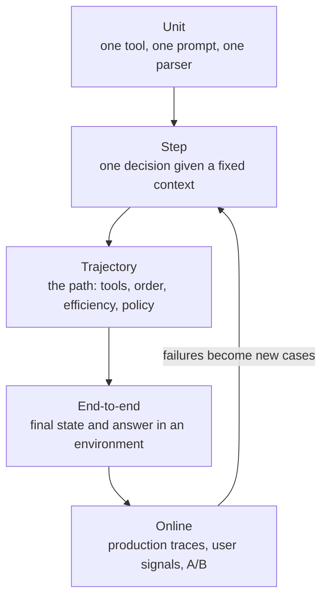
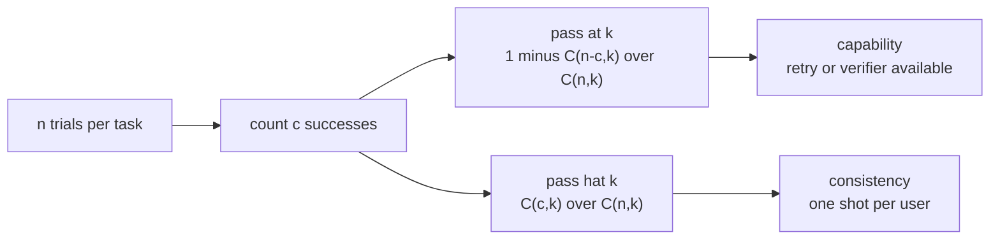
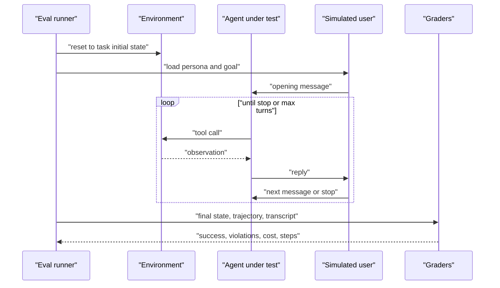
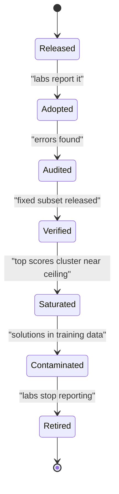
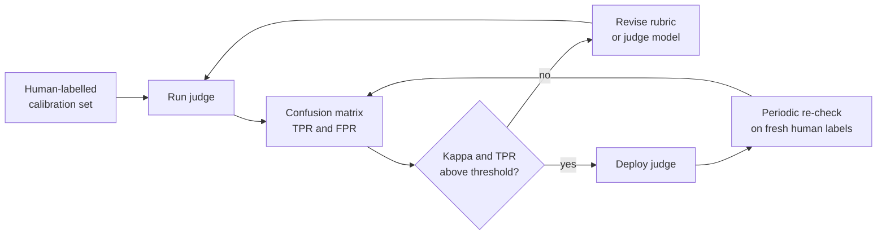
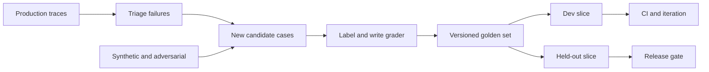
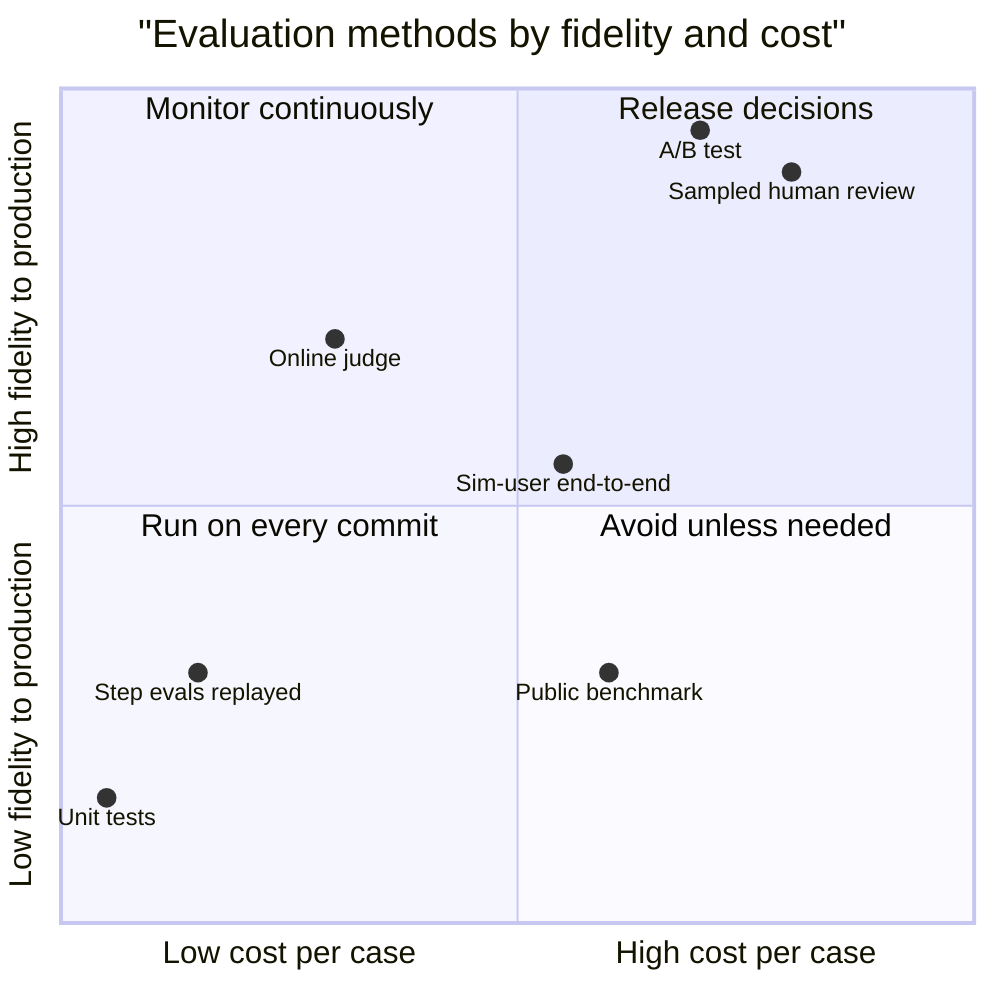

# Chapter 26: Agent Evaluation

> **What this chapter covers**: How to measure whether an agent works. The five levels of agent evaluation (unit, step, trajectory, end-to-end, online), the metrics that matter (task success, pass@k versus pass^k, tool-call accuracy, trajectory efficiency, policy adherence), the public benchmarks and their current versions and weaknesses, simulated users and the sim-to-real gap, LLM judges for trajectories with calibration, the tooling landscape, and the statistics behind CI regression gates: golden sets, bootstrap intervals, paired comparisons, and sample size.
>
> **Prerequisites**: Chapters 01, 05, 21, 25. Familiarity with basic hypothesis testing.
>
> **Where it is used**: Every release decision for an agent, model and prompt migrations, vendor bake-offs for customers, benchmark claims in write-ups, and the regression gates of Chapter 32.

---

## 26.1 Level 1: Foundations

### 26.1.1 Why agent evaluation is different

Evaluating a single LLM call is a well-understood problem: an input, an output, a grader. Agents break that picture in four ways.

1. **Outputs are trajectories.** The agent produces a sequence of thoughts, tool calls, observations, and a final answer. Two trajectories can reach the same answer by very different routes, one safe and cheap, one reckless and expensive.
2. **The environment has state.** A support agent that cancels the wrong order has changed the world. Grading the final message misses it; you must grade the final state.
3. **Runs are stochastic and long.** Variance compounds over many steps. One trial per task tells you little about consistency.
4. **Some tasks involve a user.** The user's behaviour is part of the environment, so evaluating requires simulating the user, which introduces its own error.

The consequence is that agent evaluation is closer to evaluating a reinforcement learning policy in an environment than to scoring a classifier. You need environments, graders over state, repeated trials, and statistics.

### 26.1.2 The five levels



| Level | Question it answers | Grader | Cost per case | Runs when |
|---|---|---|---|---|
| Unit | Does this tool, parser, or prompt fragment behave? | Deterministic assertion | Milliseconds, no model or a mocked one | Every commit (Chapter 27) |
| Step | Given this exact context, does the agent pick the right next action? | Exact or AST match on the tool call | One model call | Every pull request |
| Trajectory | Was the path acceptable: right tools, right order, no violations, not wasteful? | Rules over the trace, or a judge | Full run | Nightly or per release |
| End-to-end | Did the task succeed in the environment? | State diff, tests, answer match | Full run, often several trials | Per release, per model change |
| Online | Does it work for real users? | Implicit and explicit feedback, sampled human review, A/B | Production traffic | Continuously |

A mature system has all five. A common failure is to have only end-to-end runs: they are slow, expensive, and tell you something broke without telling you where.

### 26.1.3 Vocabulary

- **Task.** An environment initial state, an instruction (and for user-facing agents, a user persona and goal), and a grader.
- **Trial.** One run of the agent on a task. Agents are stochastic, so a task has a success probability, not a success.
- **Golden set.** A curated, versioned set of tasks with graders, used for regression testing. Owned, not scraped.
- **pass@k.** Probability that at least one of k trials succeeds. Measures capability when you can retry or verify.
- **pass^k.** Probability that all k trials succeed. Measures consistency when every user gets one shot. Introduced for agents by tau-bench (Yao et al., 2024).
- **Trajectory.** The ordered list of messages, tool calls, and observations in a trial.
- **Sim-to-real gap.** The difference between performance with simulated users or environments and performance in production.
- **Saturation.** A benchmark on which top systems cluster near the ceiling, so it no longer separates them.
- **Contamination.** Benchmark items or solutions present in model training data, inflating scores.

### 26.1.4 The reliability arithmetic that motivates everything

From Chapter 01: if each of 20 steps succeeds independently with probability 0.95, task success is 0.95^20 = 0.358. At 0.99 per step, it is 0.99^20 = 0.818. Small per-step improvements produce large task-level gains, and a per-step metric that looks fine (95 percent tool-call accuracy) can hide a task success rate near one in three. This is why you need both step-level and end-to-end measurement.

---

## 26.2 Level 2: Working knowledge

### 26.2.1 Task success

Task success is the headline metric, and defining it is most of the work.

- **State-based.** Compare the environment's final state with the expected state. tau-bench compares the final database with the goal database. This is robust to different paths reaching the same outcome.
- **Test-based.** Run tests against the result. SWE-bench and Terminal-Bench check the final repository or container state with tests.
- **Answer-based.** Match the final answer against a reference with normalisation (GAIA uses exact match after normalisation).
- **Rubric-based.** A judge scores against a rubric. Use only where the above are impossible.

Prefer state and tests. They are cheap, deterministic, and cannot be argued with.

### 26.2.2 pass@k and pass^k, with arithmetic

Run n trials per task and count c successes. The unbiased estimators (Chen et al., 2021 for pass@k; the pass^k analogue follows the same combinatorics) are:

$$
\text{pass@}k = 1 - \frac{\binom{n-c}{k}}{\binom{n}{k}}, \qquad \text{pass}^k = \frac{\binom{c}{k}}{\binom{n}{k}}
$$

Average each over tasks for the benchmark score.

**Worked example, one task.** n = 8 trials, c = 6 successes.

- pass@1 = pass^1 = 6 / 8 = 0.75.
- C(8,2) = 28, C(6,2) = 15, C(2,2) = 1.
- pass@2 = 1 - 1/28 = 0.964.
- pass^2 = 15/28 = 0.536.
- C(8,4) = 70, C(6,4) = 15, C(2,4) = 0.
- pass@4 = 1 - 0/70 = 1.000.
- pass^4 = 15/70 = 0.214.
- pass^8 = C(6,8)/C(8,8) = 0/1 = 0.

Compare with the naive plug-in p^k with p = 0.75: 0.75^2 = 0.5625 and 0.75^4 = 0.316. The plug-in overestimates pass^4 for this task (0.316 versus 0.214) because it ignores that you sampled without replacement from a finite set of observed trials. With n much larger than k the two converge. Use the combinatorial estimator and report n.

**Worked example, heterogeneity across tasks.** Four tasks with true success probabilities 1.0, 1.0, 0.5, 0.5. Mean pass^1 = 0.75, the same as a benchmark where every task sits at 0.75.

- Heterogeneous: pass^4 = (1 + 1 + 0.5^4 + 0.5^4) / 4 = (2 + 0.0625 + 0.0625) / 4 = 2.125 / 4 = 0.531.
- Homogeneous at 0.75: pass^4 = 0.75^4 = 0.316.

Same average accuracy, very different consistency profile. The heterogeneous agent is perfectly reliable on half the tasks and a coin flip on the rest; the homogeneous one is mildly unreliable everywhere. pass^k exposes the difference; pass^1 cannot.



**Which to report.** Coding agents with a verifier (tests) can retry, so pass@k is meaningful, provided the verifier is available at deployment time. Support agents give each customer one conversation, so pass^k is the business metric. Report pass^1 always, plus pass^k at the k matching the deployment story.

The original tau-bench paper reported that a strong 2024 function-calling agent scored around 61 percent pass^1 on the retail domain and fell to roughly 25 percent at pass^8. The exact figures are for 2024 models; the shape (steep decline with k) has held for every model since.

### 26.2.3 Tool-call accuracy

At the step level, compare predicted tool calls with expected ones.

- **Tool selection accuracy.** Right tool name.
- **Argument accuracy.** Right arguments, compared structurally. BFCL uses abstract syntax tree matching so that argument order and equivalent literal forms do not matter.
- **Call-set match.** For parallel calls, compare as a multiset.
- **Irrelevance detection.** When no tool applies, the agent should not call one. BFCL has a dedicated category for this.

Step-level datasets are cheap to build from production traces: freeze the context at a decision point, record the correct next call (after human review), and replay.

### 26.2.4 Trajectory efficiency

Two agents with equal success can differ threefold in cost. Measure:

- Steps (tool calls) per successful task, and the ratio to a reference solution's step count.
- Tokens and dollars per successful task (divide total cost by successes, not by attempts, so failure costs are included).
- Wall-clock time and number of sequential model calls (latency is dominated by sequential calls, Chapter 31).
- Redundant calls: the same tool with the same arguments twice in one trajectory.

Arithmetic: agent A succeeds on 70 of 100 tasks at a total cost of 42 dollars; agent B succeeds on 75 at 90 dollars. Cost per success is 42 / 70 = 0.60 dollars for A and 90 / 75 = 1.20 dollars for B. B is 5 points better and twice as expensive per success. Whether that is worth it depends on the value of a success, which is a business question you surface, not answer alone.

### 26.2.5 Policy adherence

For agents operating under rules, grade the trajectory against the policy separately from task success.

- **Hard violations.** Disallowed actions (a refund over the limit, a write before identity verification). Detect with deterministic rules over the trace.
- **Soft violations.** Tone, disclosure, required statements. Detect with a judge and a rubric.
- **Violation rate.** Violations per trial, and the share of trials with any violation.

A task can succeed and violate policy (the user got their refund, and the agent skipped verification). Report both, and treat hard violations as a release blocker regardless of success rate.

### 26.2.6 A minimal end-to-end harness



The runner records everything: seeds, model versions, prompt hashes, tool versions, and the full trace. Without this, you cannot reproduce a regression.

### 26.2.7 Building step-level cases from traces

Step-level cases are the cheapest high-signal evaluation you can build. Freeze the message history at a decision point, record the expected next action, and replay only that one model call.

```yaml
# step case: refund decision after identity check
id: step-refund-017
context_ref: traces/2026-09-03/conv-88121.jsonl   # messages up to turn 6
frozen_tools: [get_order, issue_refund, request_supervisor_approval, transfer_to_human]
expected:
  any_of:
    - tool: request_supervisor_approval
      args: {order_id: "ORD-00412345"}
    - tool: transfer_to_human
forbidden:
  - tool: issue_refund          # 350 USD exceeds the 200 limit
grader: ast_match
tags: [refund, over_limit, adversarial_user]
```

Three rules make these cases useful:

1. **Accept equivalent actions.** `any_of` allows several correct next steps. A step case with one allowed answer punishes valid alternatives and teaches you to overfit prompts.
2. **List forbidden actions explicitly.** The most valuable step cases are those where one tempting action is wrong.
3. **Keep the frozen context byte-identical.** Store it, hash it, and never regenerate it from a newer trace. Otherwise the case changes under you.

At one model call per case, 300 step cases cost about the same as 3 to 10 end-to-end tasks, and they pinpoint the decision that regressed.

### 26.2.8 Sources of variance in agent scores

When a score moves, ask which of these moved it:

| Source | Typical size | How to control |
|---|---|---|
| Model sampling (temperature, nondeterministic kernels) | Several points on small sets | Multiple trials, fixed seeds where offered, report intervals |
| Task sampling (which tasks are in the set) | The largest source on sets under 300 | More tasks, paired comparisons, stratification |
| Simulated user sampling | Several points for user-facing agents | Fix the simulator model and prompt, measure simulator error |
| Environment drift (live APIs, web pages, package mirrors) | Unbounded | Snapshots and replicas (Chapter 27) |
| Provider-side model updates behind a stable alias | Unannounced shifts | Pin dated model versions, rerun a canary slice nightly |
| Grader changes | Can flip many cases | Version graders with the golden set |

Note that even at temperature 0, hosted models are not guaranteed to be deterministic, because batching and floating-point order vary on the server. Treat every live run as a sample.

---

## 26.3 Level 3: Depth

### 26.3.1 Public benchmarks: what they measure and their current state

Benchmarks change versions, get audited, and saturate. The table records what was verified in September 2026; check each project page before quoting numbers.

| Benchmark | What it measures | Size and version facts (verified Sept 2026) | Grader | Caveats |
|---|---|---|---|---|
| tau-bench | Tool-agent-user interaction under policy (retail, airline) | 2024 original, Sierra Research | Final database state, pass^k | Simulated user noise; some tasks later corrected |
| tau2-bench | Adds a telecom dual-control domain where user and agent both act on shared state | 2025, Sierra; repository now hosts further domains | State plus user-side state | Performance drops sharply from no-user to dual-control |
| tau3-bench | Third generation; third-party summaries describe a banking knowledge-retrieval domain, voice evaluation, and task corrections | 2026 | As above | Details from secondary sources; check the Sierra repository |
| Terminal-Bench 2.0 | Hard terminal tasks in containers | 89 human-verified tasks, 16 categories (tbench.ai, Hugging Face dataset) | Tests on final container state | Harness-dependent; 2.1 revision exists |
| Terminal-Bench 2.1 | Revision of 2.0 | Same 89 tasks, 28 fixed for dependency drift, resource budgets, misspecification | As above | Scores not comparable with 2.0 |
| SWE-bench Verified | Resolving GitHub issues in Python repos | 500 human-screened tasks (2024) | Hidden unit tests | OpenAI stopped reporting it in February 2026: saturation near 80 percent, an audit finding flawed tests in 59.4 percent of 138 audited tasks, and evidence of memorised solutions |
| SWE-bench Pro | Longer-horizon, multi-language issues | 1,865 tasks: 731 public (copyleft repos), 276 commercial (private), 858 held out (Scale AI) | Hidden tests | Public set can still leak over time; commercial set is the cleaner signal |
| GAIA | General assistant questions needing tools and browsing | 466 questions, three difficulty levels, humans about 92 percent (2023) | Normalised exact match | Answers on the web over time; validation answers public |
| WebArena | Web tasks on self-hosted replicas of sites | 812 tasks on five self-hosted sites (ICLR 2024 paper) | Programmatic state and answer checks | Some checkers brittle; audited variants exist |
| OSWorld and OSWorld-Verified | Computer use across real desktop apps | 369 tasks; Verified (2025) fixed tasks and infrastructure; human baseline about 72 percent | Execution-based checkers per task | Heavy infrastructure; scores sensitive to screenshot resolution and step limits |
| BFCL V4 | Function calling, now with agentic parts | V4 adds web search, memory, and format sensitivity categories | AST matching plus execution | Single-call categories largely saturated |
| MCP-Bench | Multi-step tool use over live MCP servers | 28 servers, 250 tools (Accenture, 2025, NeurIPS 2025 workshop) | Rule checks plus LLM judge | Live servers drift; judge-dependent parts |

Three patterns recur:

1. **Verification rounds.** Nearly every major benchmark has had a "Verified" or point release because a meaningful share of tasks were broken. Expect 5 to 20 percent label or environment noise in any new agent benchmark.
2. **Harness dependence.** Terminal-Bench and SWE-bench scores depend on the harness as much as the model. A leaderboard row is a (model, harness, budget) triple.
3. **Saturation and contamination.** Once top systems are within a few points of each other near the ceiling, and items are on the public web, the benchmark measures memorisation and harness polish more than capability.



### 26.3.2 Contamination: how to detect and defend

Detection techniques:

- **Identifier probing.** Give the model only a task id or issue title and see whether it reproduces solution details. The SWE-bench Verified audit used this.
- **Date splits.** Compare performance on tasks created before and after the model's training cutoff. A large drop after the cutoff suggests contamination before it.
- **Perturbation.** Rename variables, reorder options, change numbers. Memorised answers break; reasoning does not.
- **Canary strings.** Some benchmarks embed a unique string so labs can filter them from training data. This only works if labs comply.

Defences for your own evaluation: keep a private held-out set, never paste it into prompts on hosted services that may train on inputs, refresh a slice each quarter from recent production cases, and version the set so you can compare old and new slices.

### 26.3.3 Simulated users and the sim-to-real gap

User-facing agents need a user. A simulated user is an LLM given a persona, a goal, and hidden information (the order number it will reveal only when asked).

Sources of sim-to-real gap:

| Gap | Simulated user | Real user | Effect on scores |
|---|---|---|---|
| Cooperativeness | Answers every question clearly | Vague, changes mind, multitasks | Sim overestimates |
| Knowledge leakage | May reveal the goal too early or state the solution | Does not know the solution | Sim overestimates |
| Persistence | Gives up or complies predictably | Some are adversarial and persistent | Sim underestimates violations |
| Language | Fluent, standard | Typos, dialects, code-switching | Sim overestimates |
| Simulator errors | Hallucinates facts, ends early, breaks persona | Not applicable | Adds noise both ways |

Tactics:

- Measure simulator error: sample 50 transcripts, have a human label whether the simulated user behaved according to its instructions. If 10 percent of failures are the simulator's fault, correct for it or fix the simulator.
- Use a strong model for the user and hold it fixed across comparisons, so simulator error is at least paired.
- Build personas from real transcripts (anonymised and synthetic-rewritten), including difficult ones.
- Validate against production: once live, compare sim success on a task type with real resolution rates for the same type. The ratio is your sim-to-real correction.

### 26.3.4 LLM judges for trajectories

When state and tests cannot grade (report quality, tone, whether an escalation was justified), use a judge. For trajectories, judges face extra problems: long inputs, many steps to reason over, and position effects.

Design rules:

1. **Decompose.** One judge call per criterion (did it verify identity before writing, was the explanation accurate, was the tool order reasonable), each producing a binary or three-level label with a reason. Avoid a single 1 to 10 overall score.
2. **Give the judge a reference.** The expected final state, a reference trajectory, or the policy text. Reference-guided judging is more reliable than open-ended.
3. **Pre-digest the trajectory.** Present the trace as a numbered list of actions with compact observations, not raw JSON with 50k tokens of tool output.
4. **Use a different model family from the agent** where possible, to reduce self-preference bias.
5. **Calibrate against humans** before trusting it.

**Calibration arithmetic.** You have 100 trajectories with human labels (pass or fail) and judge labels. They agree on 85. Humans pass 60 percent, the judge passes 65 percent.

- Observed agreement p_o = 0.85.
- Chance agreement p_e = 0.60 × 0.65 + 0.40 × 0.35 = 0.39 + 0.14 = 0.53.
- Cohen's kappa = (0.85 - 0.53) / (1 - 0.53) = 0.32 / 0.47 = 0.681.

A kappa around 0.68 is usually described as substantial agreement. More useful than kappa is the confusion matrix: estimate the judge's true positive rate (TPR) and false positive rate (FPR) against humans, then correct the judge's observed pass rate on new data. If TPR = 0.90, FPR = 0.15, and the judge passes 65 percent of a new batch, the corrected estimate of true pass rate is (0.65 - 0.15) / (0.90 - 0.15) = 0.50 / 0.75 = 0.667. The correction matters when you compare systems whose outputs the judge treats differently.



### 26.3.5 Statistics: intervals, paired tests, sample size

**Bootstrap intervals.** Resample tasks with replacement (not trials; tasks are the unit of generalisation), recompute the metric, take the 2.5th and 97.5th percentiles. For multiple trials per task, resample tasks and keep their trials together (a cluster bootstrap).

**Normal approximation for a quick check.** Success rate 0.70 on 200 tasks: standard error sqrt(0.70 × 0.30 / 200) = sqrt(0.00105) = 0.0324. A 95 percent interval is 0.70 ± 1.96 × 0.0324 = 0.70 ± 0.064, so 0.636 to 0.764. On 200 tasks you cannot distinguish 0.70 from 0.75 with an unpaired comparison.

**Paired comparisons.** When two systems run on the same tasks, compare per task. Most variance is task difficulty, and pairing removes it. For binary outcomes, McNemar's test uses only discordant tasks: b = tasks where the candidate wins, c = tasks where the baseline wins.

Example: 300 tasks, baseline 0.72, candidate 0.70. Discordant: b = 12, c = 18. McNemar with continuity correction: (|12 - 18| - 1)^2 / (12 + 18) = 25 / 30 = 0.833, p about 0.36. No evidence of a difference. The 2-point drop is noise at this sample size, but so would a 2-point gain be.

**Sample size, unpaired.** To detect a 5-point difference around 0.70 with 80 percent power at alpha 0.05 (two-sided): n per arm ≈ (1.96 + 0.84)^2 × (0.70 × 0.30 + 0.75 × 0.25) / 0.05^2 = 7.84 × (0.21 + 0.1875) / 0.0025 = 7.84 × 0.3975 / 0.0025 = 1,247 tasks per arm. Almost nobody has that many graded agent tasks.

**Sample size, paired.** If systems disagree on 10 percent of tasks (discordant rate p_d = 0.10) and the true difference is 5 points (d = 0.05), the McNemar sample size is approximately

$$
n \approx \frac{\left(z_{\alpha/2}\sqrt{p_d} + z_{\beta}\sqrt{p_d - d^2}\right)^2}{d^2}
$$

= (1.96 × 0.316 + 0.84 × 0.312)^2 / 0.0025 = (0.620 + 0.262)^2 / 0.0025 = 0.882^2 / 0.0025 = 0.778 / 0.0025 = 311 tasks. Pairing cuts the requirement by a factor of four here. This is the single most important statistical habit in agent evaluation.

**Multiple trials.** Running k trials per task shrinks within-task variance but not between-task variance. If tasks are the main variance source, 3 trials on 300 tasks beats 30 trials on 30 tasks. Use extra trials when you need pass^k, not to shrink the interval of pass^1.

### 26.3.6 Reading a leaderboard row

A leaderboard row is a claim with hidden parameters. Before comparing two rows, check:

1. **Benchmark version.** Terminal-Bench 2.0 and 2.1 differ on 28 of 89 tasks. SWE-bench Verified and SWE-bench Pro are different benchmarks. tau-bench domains have had task corrections.
2. **Harness.** The same model in two harnesses can differ by more than two models in one harness.
3. **Budget.** Maximum turns, tokens, time, and cost per task. A generous budget raises scores and cost.
4. **Trials and aggregation.** pass@1 from one trial, a mean over several, or a best of several. A best-of-k number is a pass@k number.
5. **Subset.** Full set, a verified subset, or a lite subset.
6. **Date and model version.** Hosted models change behind aliases.
7. **Who ran it.** Self-reported by the vendor, or reproduced by the benchmark maintainers.

Only rows that match on all seven are comparable. In a customer conversation, saying "those two numbers are not comparable because the harness and budget differ" is often more valuable than the numbers themselves.

### 26.3.7 Evaluating multi-agent systems

Multi-agent systems (Chapter 21) need evaluation at two more levels:

- **Per-agent.** Evaluate each sub-agent on its own sub-task with its own golden cases (the research worker's findings on a fixed sub-question, the planner's decomposition on a fixed request). This localises regressions.
- **Coordination.** Measure duplicated work (overlapping tool calls across workers), handoff failures (information present in one agent and missing in the next), and loops (repeated delegations). These appear only in the full trace.

A useful ratio is tokens per success for the multi-agent system divided by tokens per success for the best single-agent baseline on the same tasks. If the multi-agent system is 4 times more expensive per success and only 3 points better, the coordination overhead is the headline finding.

### 26.3.8 Judge cost and sampling online

Online judges cost money on every judged trace. Arithmetic: 50,000 conversations a day, a judge input of 6,000 tokens (pre-digested trace plus rubric) and 200 output tokens. At an illustrative 1 dollar per million input and 5 dollars per million output for a small judge model (check current prices), one judgment costs 0.006 + 0.001 = 0.007 dollars. Judging every conversation costs 350 dollars a day. Judging a 5 percent stratified sample costs 17.50 dollars a day and, at 2,500 judged conversations, still gives a standard error of about sqrt(0.2 × 0.8 / 2,500) = 0.008 on a 20 percent violation rate. Sample, and oversample the rare strata.

### 26.3.9 Worked example: trials per task inflate the apparent sample

A team runs 100 tasks with 4 trials each and reports "400 trials, success 0.70, 95 percent interval ± 4.5 points". The naive standard error is sqrt(0.70 × 0.30 / 400) = sqrt(0.000525) = 0.0229, so the interval is ± 1.96 × 0.0229 = ± 0.045.

Trials of the same task are correlated: an easy task passes on nearly every trial, a hard one fails on nearly every trial. The standard correction is the design effect:

$$
\text{DE} = 1 + (m - 1)\rho
$$

where m is trials per task and ρ is the intra-task correlation of outcomes. For agent benchmarks ρ is often high, because task difficulty dominates. With m = 4 and ρ = 0.6, DE = 1 + 3 × 0.6 = 2.8. The effective sample is 400 / 2.8 = 143, and the standard error becomes 0.0229 × sqrt(2.8) = 0.0229 × 1.673 = 0.0383. The honest interval is ± 1.96 × 0.0383 = ± 7.5 points, not ± 4.5.

A cluster bootstrap (resample tasks, keep each task's trials together) gives this answer automatically, without estimating ρ. The design effect is useful for planning: at ρ = 0.6, a fifth trial per task adds almost nothing to the precision of pass^1.

### 26.3.10 Worked example: correcting for simulator error

A support agent runs 400 simulated conversations and succeeds on 280 (0.70). A reviewer labels a random sample of 50 of the 120 failures and finds 10 in which the simulated user broke its instructions (revealed the wrong order number, ended the conversation early, invented a fact). That is 20 percent of failures.

- Estimated simulator-caused failures: 0.20 × 120 = 24.
- Those conversations tell you nothing about the agent, so drop them from the denominator: 280 / (400 - 24) = 280 / 376 = 0.745.
- The corrected estimate is 4.5 points above the raw one.

Two cautions. First, the 20 percent is itself an estimate from 50 labels. A 95 percent Wilson interval for 10 of 50 runs from about 0.11 to 0.33, so the corrected success rate lies somewhere between about 0.72 and 0.78. Second, simulator error is rarely the same for both systems. A terser agent may confuse the simulator more often. In a paired comparison, label simulator faults for both systems, not only one.

### 26.3.11 Worked example: a mix shift that looks like a regression

Online metrics can move while the agent does not change. A support agent resolves 90 percent of simple requests and 40 percent of hard ones, and both rates are stable across weeks.

- Week 1 traffic: 70 percent simple, 30 percent hard. Overall resolution is 0.7 × 0.90 + 0.3 × 0.40 = 0.63 + 0.12 = 0.75.
- Week 2, after a product launch brings more hard requests: 50 percent simple, 50 percent hard. Overall resolution is 0.5 × 0.90 + 0.5 × 0.40 = 0.45 + 0.20 = 0.65.

The dashboard shows a 10-point drop, and someone proposes reverting last week's prompt change. Yet every stratum is unchanged. Report online metrics by stratum, and standardise the headline to a fixed reference mix (for example the quarter's average mix) so that changes in composition and changes in the agent show up separately.

### 26.3.12 Worked example: grading a trajectory for policy

Take a refund conversation with this action sequence:

1. `get_customer(email)`
2. `get_order(ORD-00412345)`
3. `issue_refund(ORD-00412345, 80, damaged)`
4. `verify_identity(customer_id, last4)`
5. Final reply: "Your refund of 80 dollars is on its way."

The final state has the right refund, so state-based success is 1. A rule checker with the rule "no write before `verify_identity` succeeds" flags step 3 as a hard violation. The trajectory grade is success = 1 and hard violations = 1, and the release gate counts this conversation as a failure.

As a rule over the trace, this is a few lines of code: find the index of the first successful `verify_identity` and the index of the first write tool, and flag the trace if the write comes first. Rules like this are cheap, deterministic, and immune to judge bias. Write one for each hard policy line, and keep the judge for the soft ones (tone, required disclosures).

### 26.3.13 Worked example: estimating pass^k from a results table

Five tasks, 4 trials each, with success counts c = 4, 4, 3, 2, 0.

| Task | c | pass^1 = c/4 | pass^2 = C(c,2)/6 | pass^4 = C(c,4)/1 |
|---|---|---|---|---|
| 1 | 4 | 1.00 | 6/6 = 1.00 | 1 |
| 2 | 4 | 1.00 | 1.00 | 1 |
| 3 | 3 | 0.75 | 3/6 = 0.50 | 0 |
| 4 | 2 | 0.50 | 1/6 = 0.167 | 0 |
| 5 | 0 | 0.00 | 0 | 0 |
| Mean | | 0.65 | 0.533 | 0.40 |

pass^1 is 0.65, but only 2 of 5 tasks are fully reliable, so pass^4 is 0.40. The per-task view also says where to work: task 3 and task 4 are the inconsistent ones, and task 5 is a capability gap. These call for different fixes (Chapter 25's failure taxonomy), and a single average hides the difference.

---

## 26.4 Level 4: Mastery

### 26.4.1 Building a golden set

A golden set is a product, with an owner, a version, and a change log.

1. **Source.** Start with 30 to 50 cases from real (or realistically synthesised) customer tasks. Add every production failure that a human triaged (Chapter 28). Add adversarial and edge cases deliberately.
2. **Stratify.** Tag each case by task type, difficulty, and risk. Report metrics per stratum; a flat average hides regressions in the rare, expensive slice.
3. **Grade deterministically where possible.** State diffs, tests, result sets. Store the grader with the case.
4. **Version.** Never edit a case in place. Deprecate and add. Otherwise scores across versions are not comparable.
5. **Split.** A development slice you look at freely, and a held-out slice you run only for release decisions. Looking at the held-out set during development turns it into a training set.
6. **Refresh.** Each quarter, add recent cases and retire saturated ones (cases every candidate passes carry no information).



### 26.4.2 CI regression gates

A gate turns evaluation into a release decision. A workable design:

- **Per pull request.** Unit tests and step-level evaluations with recorded or mocked model responses (Chapter 27). Fast, deterministic, near zero cost.
- **Nightly.** A smoke slice of end-to-end tasks (20 to 50) against live models, 1 to 3 trials, tracked over time for drift.
- **Per release candidate.** The full held-out slice, with enough trials for pass^k, paired against the current production version.

Gate rules should be statistical, not threshold-on-point-estimate:

- **Non-inferiority for refactors and cost cuts.** Ship if the lower bound of the paired difference in success rate is above -2 points (margin chosen by the business).
- **Superiority for claimed improvements.** Ship the claim only if the lower bound is above 0.
- **Hard blockers.** Any new hard policy violation on the held-out set blocks, regardless of success rate.
- **Cost and latency budgets.** Cost per success and p95 steps must stay within budget.

Arithmetic for the non-inferiority gate: 300 paired tasks, candidate wins 15, baseline wins 12, difference 3 / 300 = +1.0 point. Standard error of a paired difference for binary outcomes ≈ sqrt(b + c - (b - c)^2 / n) / n = sqrt(27 - 9/300) / 300 = sqrt(26.97) / 300 = 5.193 / 300 = 0.0173. The 95 percent interval is 1.0 ± 3.4 points, from -2.4 to +4.4. With a -2 point margin, this candidate narrowly fails non-inferiority, not because it is worse but because the evidence is too thin. Add tasks or trials, or accept a wider margin explicitly.

### 26.4.3 Online evaluation

Offline evaluation predicts; online evaluation measures.

- **Implicit signals.** Task abandonment, user rephrasing, escalation to a human, retries, edits to agent output, time to resolution.
- **Explicit signals.** Thumbs, ratings, and free-text feedback. Sparse and biased toward unhappy users.
- **Sampled human review.** Review a stratified random sample of traces weekly with a rubric. This is the ground truth the others are calibrated against.
- **Online judges.** Run cheap judges on a share of production traces for policy and quality, with the calibration from 26.3.4.
- **A/B and interleaving.** For changes with measurable outcomes (resolution rate), randomise at the user or conversation level. Agents' long sessions make per-request randomisation invalid.



### 26.4.4 Tooling landscape

Ownership and status change often; the notes below were checked in September 2026.

| Tool | Type | Strength for agents | Notes |
|---|---|---|---|
| Langfuse | Open source (MIT) tracing, evals, datasets, prompts | Traces to datasets to experiments in one place, self-hostable, OTel ingestion | Acquired by ClickHouse (announced January 2026); stated it stays MIT and self-hostable |
| LangSmith | Hosted tracing and evaluation (LangChain) | Trajectory evaluators, datasets, online evals, tight LangGraph integration | Framework-agnostic via SDK and OTel |
| Braintrust | Hosted eval and observability | Experiment comparison UI, scorers, CI integration | Commercial |
| Arize Phoenix | Open source tracing and evals | OpenInference and OTel based, local-first | Arize also has a commercial platform |
| promptfoo | Open source CLI for evals and red teaming | Config-driven test matrices, CI friendly, red-team plugins | OpenAI announced its acquisition in March 2026 and stated the open source project continues; check licence and roadmap |
| DeepEval | Open source pytest-style LLM evaluation (Confident AI) | Many built-in metrics including agentic ones, pytest integration | Metric definitions are judge-based; calibrate them |
| Inspect AI | Open source eval framework (UK AI Security Institute) | Agent evals with sandboxes, solvers and scorers, many published benchmark implementations | Strong for reproducible benchmark runs |
| Ragas | Open source evaluation for RAG and agents | Retrieval metrics, some agent and tool-call metrics | Mostly judge-based metrics |

How to choose: the tracing platform the team already runs (Chapter 28) usually hosts datasets and experiments. Add Inspect AI or a tau-bench style harness for environment-based end-to-end runs, and promptfoo or DeepEval for CI-friendly tests. Whatever you pick, keep the golden set and graders in your own repository in an open format, so the tool is replaceable.

### 26.4.5 What the literature and vendors disagree on

- **Judge reliability.** Vendors ship dozens of judge-based metrics as if they were measurements. Research repeatedly finds position bias, verbosity bias, and self-preference. The defensible position: judges are instruments that need calibration, per task, per judge model version.
- **Benchmark relevance.** Labs report public benchmarks; practitioners find weak correlation with their own tasks. Both are right: benchmarks rank general capability roughly, and say little about your specific environment and policy.
- **pass@k for agents.** Some reports quote pass@k to show capability. For any deployment without a verifier, it overstates what users experience. Ask which k and whether a verifier exists.
- **Single score versus dashboard.** Leaderboards want one number. Engineering needs success, pass^k, violations, cost per success, and latency together. Collapsing them hides the trade-offs you are paid to make.
- **Harness in or out.** Some leaderboards fix the harness to compare models; others let each submitter bring a harness. Neither is wrong, but the two kinds of number are not comparable.

### 26.4.6 An evaluation plan for a customer bake-off

A synthetic insurer, Harbourline Mutual, wants to pick between three agent stacks for claims-status support.

1. **Tasks.** 150 tasks from anonymised, synthetic-rewritten historical conversations, stratified into simple status, document request, dispute, and adversarial. 30 held out.
2. **Environment.** A replica of the claims API with seeded data, reset per trial.
3. **Users.** A simulated user on a fixed model, personas derived from transcripts, simulator error measured on 50 transcripts.
4. **Trials.** 4 per task for pass^4.
5. **Graders.** State diff for actions, a rule checker for hard policy, a calibrated judge for tone and disclosure.
6. **Statistics.** Paired comparisons between each pair of stacks on the same tasks with bootstrap intervals, Holm correction for three comparisons.
7. **Report.** Per-stratum success and pass^4, violations, cost per success, p95 latency, with intervals and dates. A recommendation that states the trade-off, not only the winner.

Cost arithmetic: 150 tasks × 4 trials × 3 stacks = 1,800 conversations. At about 0.35 dollars each including the simulated user, that is 630 dollars, plus judge calls at perhaps 0.02 dollars per conversation (36 dollars). A bake-off under 700 dollars that the customer can audit is a strong FDE deliverable.

### 26.4.7 Worked example: a release decision

A candidate prompt and tool refactor for the Harbourline support agent is compared with production on the 300-task held-out slice, 4 trials each, paired.

| Gate | Production | Candidate | Rule | Result |
|---|---|---|---|---|
| Success, pass^1 | 0.742 | 0.763 | Non-inferiority, margin -2 points | Difference +2.1, cluster bootstrap 95 percent interval -0.8 to +5.0; lower bound above -2, pass |
| pass^4 | 0.51 | 0.55 | Report only | Interval overlaps zero |
| New hard violations | 0 | 0 | Must be 0 | Pass |
| Cost per success | 0.48 dollars | 0.52 dollars | At most +10 percent | +8.3 percent, pass |
| p95 steps | 13 | 14 | At most +2 | Pass |

The decision is to ship as non-inferior. The release note must not claim an improvement, because the interval for the difference includes zero. The customer-facing note reads "equivalent quality, 8 percent higher cost per resolution, simpler tool surface", and the cost increase goes on the list for the next iteration.

### 26.4.8 Worked example: comparing three stacks without fooling yourself

The bake-off in 26.4.6 makes three pairwise comparisons. The unadjusted p-values are 0.004 (A versus C), 0.030 (A versus B), and 0.045 (B versus C). At alpha 0.05, all three look significant.

Holm's procedure sorts the p-values and compares each against a threshold that loosens as it goes:

- Smallest, 0.004, against 0.05 / 3 = 0.0167. Significant.
- Next, 0.030, against 0.05 / 2 = 0.025. Not significant, so stop. This p-value and every larger one are not significant.

Only A over C survives. The honest summary is "A beats C. At this sample size the evidence does not separate A from B, or B from C." Customers respect this more than a clean ranking that falls apart in production.

### 26.4.9 Worked example: spending a fixed evaluation budget

The team has 500 dollars per release for live evaluation. Each simulated conversation costs about 0.35 dollars, which buys about 1,428 conversations. Options:

| Plan | Tasks | Trials | pass^1 standard error (ρ = 0.6) | Supports pass^4? |
|---|---|---|---|---|
| A | 1,428 | 1 | sqrt(0.21 / 1,428) = 0.0121 | No |
| B | 714 | 2 | 0.0121 × sqrt(1.6) = 0.0153 | No |
| C | 357 | 4 | 0.0121 × sqrt(2.8) = 0.0203 | Yes |

With the total number of conversations fixed, the design effect scales the variance of the single-trial plan: DE = 1.6 for 2 trials and 2.8 for 4.

If pass^4 is the business metric, as it is for support, plan C is the only one that measures it, at the price of a wider pass^1 interval. A common compromise is plan C on the held-out slice for pass^4, plus single trials on a larger pool of fresh tasks for pass^1. Most teams do not have 1,428 graded tasks, so in practice the task count sets the design.

### 26.4.10 Worked example: an online judge that drifted

An online judge for "disclosed the recording notice" was calibrated in June against 200 human labels, at TPR 0.95 and FPR 0.05. In September its pass rate rose from 0.88 to 0.96 with no agent change. A fresh sample of 100 human labels shows that the judge now has an FPR of 0.40 on conversations where the notice appears only inside a quoted email. The provider had updated the judge model behind an alias, and the new version accepts quoted notices.

A check with the new rates: if the true pass rate were still 0.88 and the TPR still 0.95, the judge would report 0.95 × 0.88 + 0.40 × 0.12 = 0.836 + 0.048 = 0.884. The observed 0.96 is higher still, so the FPR on the rest of the traffic has also moved. A fresh confusion matrix on current traffic is needed before the metric can be trusted again. The lessons: pin dated judge model versions, re-calibrate on a schedule, and alert when a judge metric moves while the step and replay tiers are flat.

### 26.4.11 Worked example: deriving the non-inferiority margin from money

A margin of "-2 points" is often picked by habit. It should come from the economics. Parcelwise (Chapter 25) runs 9,000 support conversations a day. A failed conversation escalates to a human at about 6 dollars. A candidate change to a cheaper model saves 0.05 dollars per conversation.

- Daily saving: 9,000 × 0.05 = 450 dollars.
- Cost of a quality drop of d (as a fraction): 9,000 × d × 6 = 54,000 × d dollars a day.
- Break-even: 54,000 × d = 450, so d = 0.0083, which is 0.83 points.

A -2 point margin would allow a change that loses up to 9,000 × 0.02 × 6 = 1,080 dollars a day to save 450 dollars. The margin here should be about -0.8 points, and proving non-inferiority at that margin needs far more tasks. With a discordant rate of 10 percent, the standard error of a paired difference on n tasks is about sqrt(0.10 / n). For the lower bound of a zero-difference result to clear -0.83 points, 1.96 × sqrt(0.10 / n) must be below 0.0083, so n > 0.10 × (1.96 / 0.0083)^2 = 0.10 × 55,760 = about 5,576 tasks. No golden set is that large. The practical answer is to ship behind a canary and measure the escalation rate online (Chapter 32) with a pre-registered stopping rule, rather than claim offline non-inferiority you cannot afford to prove.

---

## 26.5 Subtopic checklist

- [x] Levels: unit, step, trajectory, end-to-end, online (26.1.2)
- [x] Task success definitions (26.2.1)
- [x] pass@k versus pass^k with arithmetic, estimators, heterogeneity (26.2.2)
- [x] Tool-call accuracy (26.2.3)
- [x] Trajectory efficiency and cost per success (26.2.4)
- [x] Policy adherence (26.2.5)
- [x] tau-bench, tau2-bench, and later versions (26.3.1)
- [x] Terminal-Bench 2.0 and 2.1 (26.3.1)
- [x] SWE-bench Verified, its retirement, and SWE-bench Pro (26.3.1)
- [x] GAIA, WebArena, OSWorld, BFCL, MCP-Bench (26.3.1)
- [x] Benchmark contamination and saturation (26.3.1, 26.3.2)
- [x] Simulated users and sim-to-real gap (26.3.3)
- [x] LLM-as-judge for trajectories: rubrics and calibration (26.3.4)
- [x] Tooling: Langfuse, LangSmith, Braintrust, Phoenix, promptfoo, DeepEval, Inspect AI, Ragas (26.4.4)
- [x] CI regression gates (26.4.2)
- [x] Golden sets (26.4.1)
- [x] Bootstrap CIs, paired comparisons, sample size (26.3.5, 26.4.2)
- [x] Online evaluation (26.4.3)
- [x] Customer bake-off plan (26.4.6)
- [x] Step-level cases from traces (26.2.7)
- [x] Sources of variance (26.2.8)
- [x] Reading leaderboard rows (26.3.6)
- [x] Evaluating multi-agent systems (26.3.7)
- [x] Online judge cost and sampling (26.3.8)
- [x] Worked examples: design effect, simulator error correction, mix shift, policy trajectory grading (26.3.9 to 26.3.12)
- [x] Worked examples: release decision, multiple comparisons, budget allocation, judge drift (26.4.7 to 26.4.10)
- [x] Worked example: non-inferiority margin from economics (26.4.11)
- [x] Worked example: per-task pass^k table (26.3.13)

---

## 26.6 Common misconceptions

1. **"Checking the final answer is enough."** For agents with side effects, the answer can be right while the state is wrong (a cancelled wrong order). Grade the final state and the trajectory.
2. **"pass@k and pass^k are two ways of saying the same thing."** pass@k rises with k and measures capability given retries; pass^k falls with k and measures consistency. For one-shot users, pass^k is the business metric.
3. **"pass^k is just pass@1 to the power k."** Only for homogeneous tasks and large n. Across heterogeneous tasks, and with the unbiased estimator on finite trials, the numbers differ materially (0.531 versus 0.316 in 26.2.2).
4. **"More trials per task narrow the confidence interval."** They reduce within-task noise but not between-task variance, which usually dominates. Add tasks.
5. **"A 3-point improvement on 100 tasks is a real improvement."** The standard error around 0.7 on 100 tasks is about 4.6 points. Use paired tests and intervals.
6. **"A high benchmark score means the model will work for my agent."** Benchmarks are harness-dependent, often saturated or contaminated, and differ from your environment and policy.
7. **"An LLM judge with a good prompt is an objective metric."** Judges have biases and version drift. Calibrate against human labels and correct for TPR and FPR.
8. **"Simulated users are close enough to real users."** They are cooperative, fluent, and may leak the goal. Measure simulator error and calibrate against production.
9. **"Once you have a golden set, you are done."** Golden sets saturate and drift from production. Refresh quarterly from triaged failures.
10. **"Evaluation tooling choice determines evaluation quality."** The tasks, graders, and statistics determine quality. Keep them in your repo so the tool can be swapped.

---

## 26.7 Practice

1. **Arithmetic.** A task has n = 10 trials with c = 7 successes. Compute pass@3 and pass^3 with the unbiased estimators, and compare with 0.7^3. (C(10,3) = 120, C(7,3) = 35, C(3,3) = 1. pass@3 = 1 - 1/120 = 0.992; pass^3 = 35/120 = 0.292; plug-in 0.343.)
2. **Arithmetic.** Two systems on 250 paired tasks: candidate wins 20, baseline wins 9. Compute McNemar's statistic with continuity correction and the paired difference with a 95 percent interval. (Statistic (11 - 1)^2 / 29 = 3.45, p about 0.063; difference 11/250 = 4.4 points, SE = sqrt(29 - 121/250)/250 = sqrt(28.516)/250 = 0.0214, interval 4.4 ± 4.2 points, about 0.2 to 8.6, which is borderline and consistent with the p-value near 0.06 given the continuity correction.)
3. **Hands-on, free tier or local.** Clone the tau2-bench repository and run one domain with a small model through an API free tier or a local model through an OpenAI-compatible endpoint in WSL2. Run 4 trials on 20 tasks and compute pass^1 to pass^4 with the unbiased estimator.
4. **Hands-on.** Write a cluster bootstrap for a results table with multiple trials per task. Verify on synthetic data that it gives wider intervals than a naive bootstrap over trials.
5. **Design.** Build a 40-case golden set for the text-to-SQL agent from Chapter 25 practice, stratified into simple, join-heavy, ambiguous, and trap. Write the grader for each stratum.
6. **Hands-on.** Calibrate a judge. Label 60 agent transcripts yourself for "escalated appropriately". Run two judge models. Report kappa, TPR, and FPR for each, and the corrected pass rate on a fresh batch of 100.
7. **Design.** Write the CI gate policy for an agent in your own project: what runs per PR, nightly, and per release, the non-inferiority margin, hard blockers, and the cost budget.
8. **Hands-on, Inspect AI.** Implement one of your agent tasks as an Inspect AI task with a sandboxed tool, a solver, and a scorer. Run it against two models and compare with paired statistics.
9. **Conceptual.** A vendor claims 85 percent on a benchmark. Write the six questions you would ask before believing it applies to your customer (version, harness, budget, trials, contamination, relevance).
10. **Arithmetic.** You need to detect a 4-point improvement with paired tasks, discordant rate 8 percent. Estimate the number of tasks. (sqrt(0.08) = 0.283, sqrt(0.08 - 0.0016) = 0.280; (1.96 × 0.283 + 0.84 × 0.280)^2 / 0.0016 = (0.554 + 0.235)^2 / 0.0016 = 0.623 / 0.0016 = about 389 tasks.)
11. **Arithmetic.** A team reports 0.72 success on 150 tasks with 5 trials each and a naive interval of plus or minus 3.2 points. Assuming an intra-task correlation of 0.5, compute the design effect and the corrected interval. (DE = 1 + 4 × 0.5 = 3.0; naive SE = sqrt(0.72 × 0.28 / 750) = 0.0164; corrected SE = 0.0164 × sqrt(3) = 0.0284; interval plus or minus 5.6 points.)
12. **Design.** For your own agent, derive a non-inferiority margin from the cost of a failure and the value of the change, as in 26.4.11, and compute how many paired tasks you would need to prove it offline. Decide whether an offline gate or a canary is the right tool.

---

## 26.8 How this is tested

<details><summary>Explain pass@k versus pass^k and when to use each.</summary>

pass@k is the probability that at least one of k trials succeeds; pass^k is the probability that all k succeed. With n trials and c successes, unbiased estimators are 1 - C(n-c,k)/C(n,k) and C(c,k)/C(n,k). pass@k fits settings with a verifier and retries (coding with tests). pass^k fits one-shot user settings (support), because it measures consistency. For a task with 6 of 8 successes, pass@2 is 0.96 and pass^2 is 0.54.
</details>

<details><summary>What are the levels of agent evaluation and what does each catch?</summary>

Unit (tools, parsers, prompt fragments, deterministic), step (right next action from a frozen context), trajectory (path quality: tool order, violations, efficiency), end-to-end (final state or answer in an environment), and online (production signals and human review). Unit and step catch where things break cheaply; end-to-end catches whether it works; online catches the sim-to-real gap. A suite with only end-to-end runs is slow and hard to debug.
</details>

<details><summary>Your agent went from 72 to 75 percent on 100 tasks. Ship?</summary>

Not on that evidence. The standard error around 0.73 on 100 tasks is about 4.4 points, so the change is within noise. Run a paired comparison on the same tasks, look at discordant counts, compute a bootstrap interval on the difference, and check per-stratum results, violations, and cost per success. If the claim is an improvement, the lower bound should be above zero; if the change is a refactor, a non-inferiority margin applies.
</details>

<details><summary>Why are paired comparisons so important for agents?</summary>

Most variance is task difficulty. When both systems run the same tasks, differencing per task removes that variance. For a 5-point difference with a 10 percent discordant rate, a paired design needs about 311 tasks for 80 percent power, versus about 1,250 per arm unpaired.
</details>

<details><summary>How do you design a CI regression gate for an agent?</summary>

Tiered. Per PR: unit tests and step evals on recorded responses, deterministic and cheap. Nightly: a smoke slice against live models to catch drift. Per release: the held-out golden set, multiple trials, paired against production. Rules: non-inferiority on success for refactors, superiority for claimed improvements, zero new hard policy violations, cost per success and p95 steps within budget. Report intervals, not point estimates.
</details>

<details><summary>How do you calibrate an LLM judge for trajectories?</summary>

Label a calibration set with humans, run the judge, compute kappa and the confusion matrix. Decompose criteria into binary checks, give the judge the policy or a reference, pre-digest the trace, and use a different model family than the agent. With TPR and FPR, correct observed pass rates: (observed - FPR) / (TPR - FPR). Re-check on fresh labels when the judge model or rubric changes.
</details>

<details><summary>What is the sim-to-real gap and how do you manage it?</summary>

Simulated users are more cooperative, fluent, and consistent than real users, may leak the goal, and have their own errors. Manage it by measuring simulator error on labelled transcripts, deriving personas from real conversations including difficult ones, holding the simulator fixed across comparisons, and calibrating simulated success against production resolution rates by task type.
</details>

<details><summary>Why did SWE-bench Verified lose its value as a frontier signal?</summary>

By early 2026 top systems clustered around 80 percent, so it no longer separated them. OpenAI's audit reported that 59.4 percent of 138 audited tasks had flawed tests, and models reproduced solution details from task identifiers alone, indicating contamination. OpenAI stopped reporting it in February 2026 and recommended SWE-bench Pro, which has public, private commercial, and held-out subsets.
</details>

<details><summary>How do you detect benchmark contamination?</summary>

Identifier probing (give only a task id or title and look for solution details), date splits around training cutoffs, perturbation (rename, reorder, change numbers), and canary strings. For your own sets, keep a private held-out slice, avoid pasting it into services that may train on inputs, and refresh it with recent cases.
</details>

<details><summary>What is tau2-bench's dual-control setting and why does it matter?</summary>

In the telecom domain both the agent and the simulated user have tools that act on a shared state, so the agent must guide the user to take actions (toggle settings, restart a device) rather than act alone. It models real troubleshooting and exposes coordination and communication failures; performance drops sharply compared with the setting where the agent acts alone.
</details>

<details><summary>Which metrics would you put on the dashboard for a production support agent?</summary>

Resolution rate from sampled human review with intervals, escalation rate and escalation precision, hard policy violation rate, pass^k on the nightly golden run, cost per resolved conversation, p95 latency per turn and turns per conversation, tool error rate, and online judge scores for tone and disclosure with their calibration date. Stratify by intent.
</details>

<details><summary>How would you run a vendor bake-off for a customer?</summary>

Tasks from their own (anonymised or synthetic-rewritten) cases, stratified and with a held-out slice; a resettable replica environment; a fixed simulated user with measured error; several trials per task; state and rule graders plus a calibrated judge for soft criteria; paired comparisons with bootstrap intervals and multiplicity correction; and a report of success, pass^k, violations, cost, and latency per stratum. Budget it: 150 tasks, 4 trials, 3 stacks is about 1,800 conversations.
</details>

<details><summary>How many trials per task should you run?</summary>

For pass^1 estimates, adding tasks beats adding trials because between-task variance dominates. Run more trials when you need pass^k (at least k, preferably 2k or more so the estimator is stable), or when measuring consistency itself. Keep trials together in a cluster bootstrap.
</details>

<details><summary>How do you measure trajectory efficiency fairly?</summary>

Cost and tokens per successful task (total cost divided by successes, so failure costs count), steps relative to a reference solution, redundant calls, and sequential model calls for latency. Compare at matched success rates or show the trade-off: 0.60 dollars per success at 70 percent versus 1.20 dollars at 75 percent is a business decision to surface.
</details>

<details><summary>How do you build step-level evaluation cases, and why bother?</summary>

Freeze the context at a decision point from a real trace, record the acceptable next actions (allowing equivalents) and the forbidden ones, and grade the single replayed call with AST matching. They cost one model call each, run in CI, and pinpoint which decision regressed, which end-to-end runs cannot.
</details>

<details><summary>Two leaderboard rows show 58 and 64 percent. Can you compare them?</summary>

Only if they match on benchmark version, harness, budget, trials and aggregation, subset, model version and date, and who ran them. A best-of-k number is pass@k and is not comparable with pass@1. If any of these differ, the gap may be entirely setup.
</details>

<details><summary>You ran 100 tasks with 4 trials each. What is your sample size?</summary>

Closer to 100 than 400. Trials of the same task are correlated, so the effective sample is n × m / (1 + (m - 1)ρ). With ρ = 0.6 the design effect is 2.8, the effective sample is about 143, and the interval is about 1.7 times wider than the naive one. Use a cluster bootstrap over tasks.
</details>

<details><summary>Resolution rate dropped 10 points week over week with no deploy. What do you check first?</summary>

The traffic mix. If simple requests fell from 70 to 50 percent of traffic, stable per-stratum rates of 0.90 and 0.40 produce exactly a drop from 0.75 to 0.65. Report by stratum and standardise the headline to a reference mix. Then check provider model changes behind aliases, environment changes, and judge drift, in that order.
</details>

<details><summary>How do you choose a non-inferiority margin?</summary>

From the economics: the value of the change (for example the saving per conversation) set against the cost of each extra failure. At 9,000 conversations a day, a 6 dollar escalation, and a 0.05 dollar saving, break-even is 0.83 points. If proving that offline needs more tasks than you have, use a canary with an online stopping rule instead.
</details>

---

## 26.9 Summary

- Agent evaluation grades trajectories and final state, over stochastic runs, sometimes with a simulated user. It resembles policy evaluation more than classification scoring.
- Use five levels: unit, step, trajectory, end-to-end, online. Only end-to-end is slow and hard to debug.
- Define success by state, tests, or normalised answers wherever possible; use judges only where you must.
- pass@k measures capability with retries; pass^k measures consistency for one-shot users. Use the unbiased combinatorial estimators and report n.
- Heterogeneity across tasks changes pass^k at the same mean accuracy; always report pass^k where consistency matters.
- Report tool-call accuracy, cost per success, and policy violations alongside success.
- Public benchmarks are harness-dependent, get audited and re-versioned, saturate, and get contaminated. SWE-bench Verified was retired by OpenAI in February 2026 in favour of SWE-bench Pro; Terminal-Bench moved from 2.0 to 2.1.
- Simulated users overestimate success and underestimate adversarial behaviour. Measure simulator error and calibrate against production.
- Judges are instruments: decompose criteria, give references, calibrate with kappa, TPR, and FPR, and correct observed rates.
- Tasks, not trials, are the unit of generalisation. Bootstrap over tasks, pair comparisons, and size samples honestly.
- Gate releases on intervals: non-inferiority for refactors, superiority for claims, zero new hard violations.
- Keep golden sets versioned, stratified, and refreshed from triaged production failures.

---

## 26.10 Further reading

- Yao et al., "tau-bench: A Benchmark for Tool-Agent-User Interaction in Real-World Domains" (arXiv 2406.12045, 2024). Introduces pass^k and state-based grading with simulated users.
- Barres et al., "tau2-bench: Evaluating Conversational Agents in a Dual-Control Environment" (arXiv 2506.07982, 2025). Dual-control telecom domain.
- sierra-research/tau2-bench repository and release notes. Current domains and task corrections.
- "Terminal-Bench: Benchmarking Agents on Hard, Realistic Tasks in Command Line Interfaces" (arXiv 2601.11868, 2026) and tbench.ai news on version 2.1.
- OpenAI, "Why SWE-bench Verified no longer measures frontier coding capabilities" (2026). The audit and retirement.
- "SWE-Bench Pro: Can AI Agents Solve Long-Horizon Software Engineering Tasks?" (arXiv 2509.16941, Scale AI, 2025).
- Mialon et al., "GAIA: a benchmark for General AI Assistants" (2023).
- Zhou et al., "WebArena: A Realistic Web Environment for Building Autonomous Agents" (arXiv 2307.13854, ICLR 2024). 812 tasks across shopping, forum, GitLab, CMS, and map sites.
- Xie et al., "OSWorld" (NeurIPS 2024) and the XLANG Lab OSWorld-Verified post (2025).
- Patil et al., Berkeley Function Calling Leaderboard (BFCL) V4 blog posts and the gorilla repository.
- "MCP-Bench: Benchmarking Tool-Using LLM Agents with Complex Real-World Tasks via MCP Servers" (arXiv 2508.20453, 2025).
- Chen et al., "Evaluating Large Language Models Trained on Code" (2021). The unbiased pass@k estimator.
- Zheng et al., "Judging LLM-as-a-Judge with MT-Bench and Chatbot Arena" (2023). Judge biases.
- Miller, "Adding Error Bars to Evals: A Statistical Approach to Language Model Evaluations" (Anthropic, 2024). Clustered standard errors and paired analysis.
- Inspect AI documentation (UK AI Security Institute). Agent evaluation with sandboxes.
- Langfuse, LangSmith, Braintrust, Phoenix, promptfoo, DeepEval, and Ragas official documentation for current evaluation features.
