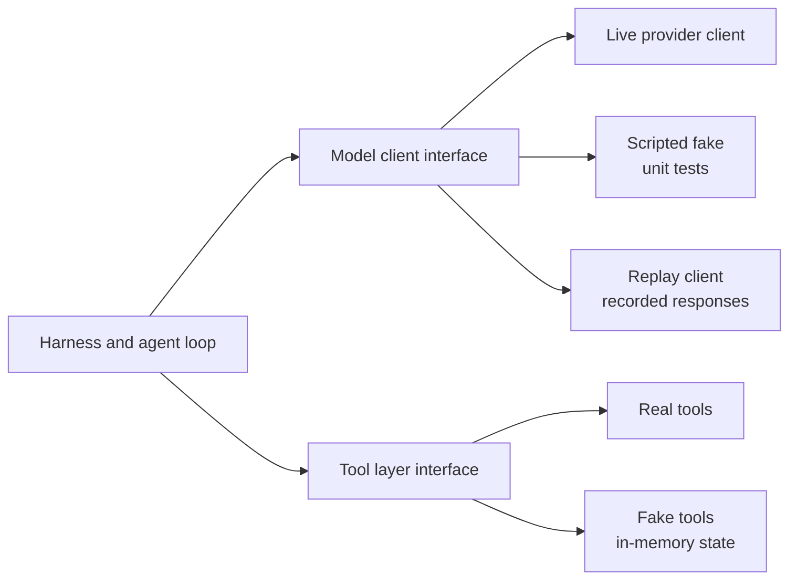
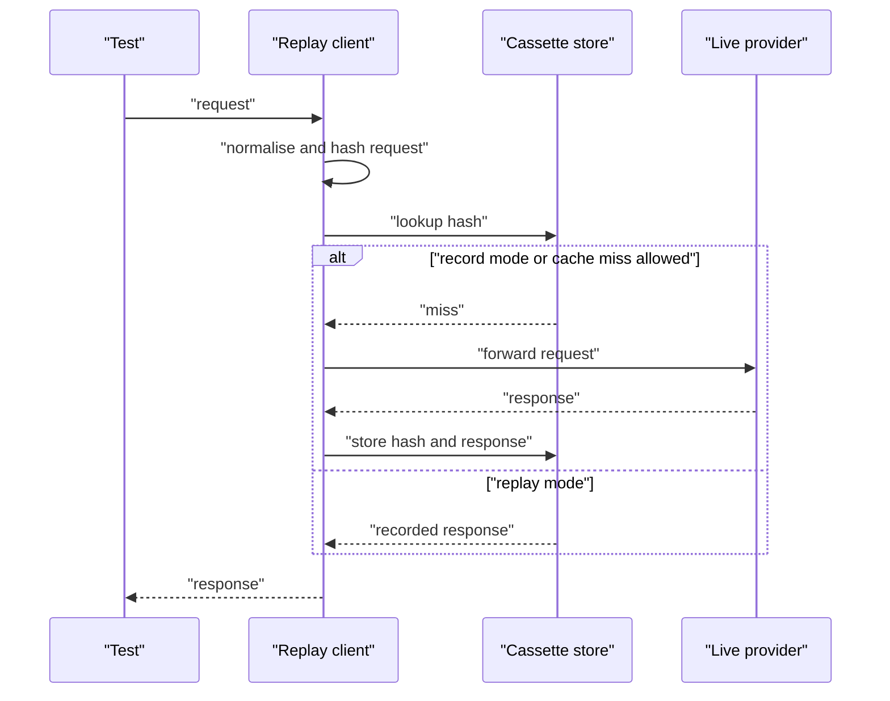
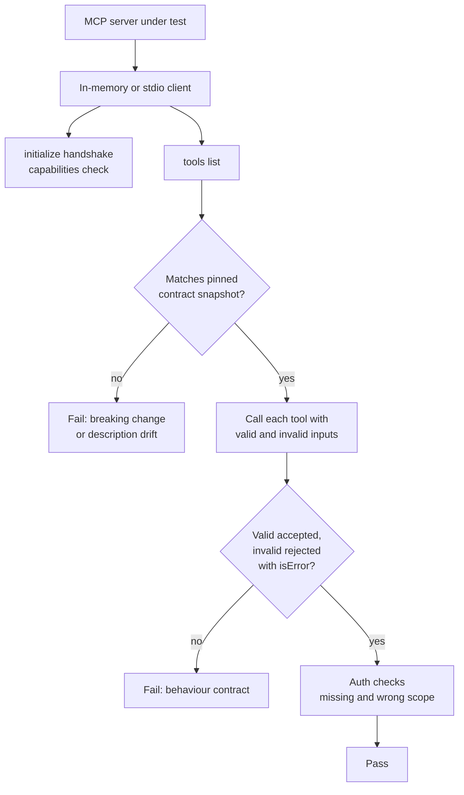
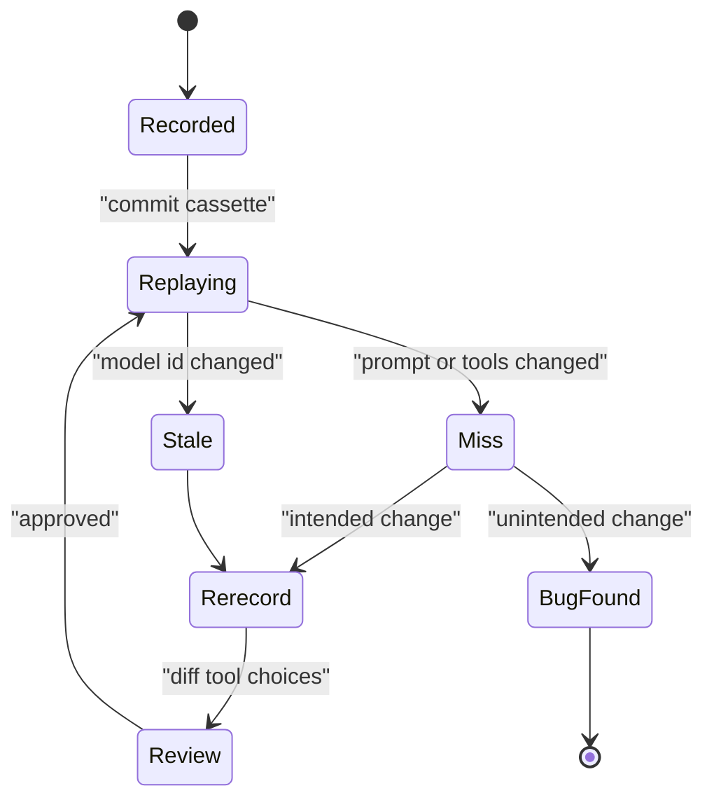
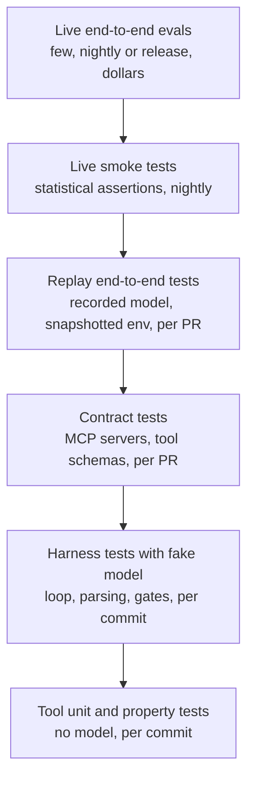
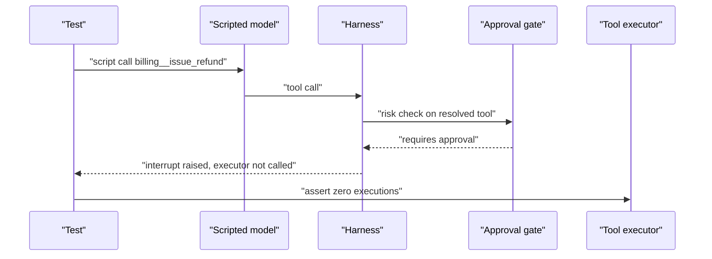

# Chapter 27: Testing Agents as Software

> **What this chapter covers**: The software-engineering side of agent quality. Unit testing tools, mocking the model, record and replay of model responses, deterministic fixtures, property-based and fuzz testing of tool inputs, contract tests for MCP servers, environment snapshots, managing flakiness when the model is non-deterministic, and a testing pyramid for agents that says what runs where and how often.
>
> **Prerequisites**: Chapters 03, 05, 08, 22, 24, 26.
>
> **Where it is used**: Every agent repository's `tests/` folder, pull request CI, refactors of the harness or tools, model migrations, and the per-PR tier of the regression gates in Chapter 26.

---

## 27.1 Level 1: Foundations

### 27.1.1 Evaluation versus testing

Chapter 26 asked "how good is the agent?" This chapter asks "did my change break the code around the model?" The two overlap but are not the same.

| | Evaluation (Chapter 26) | Testing (this chapter) |
|---|---|---|
| Question | How well does the system perform the task? | Does the code behave as specified? |
| Output | A metric with an interval | Pass or fail |
| Model | Live, the real one | Mocked, recorded, or live only at the top of the pyramid |
| Determinism | Stochastic by nature | Deterministic by design, except a small live tier |
| Runs | Nightly, per release | Every commit and PR |
| Cost | Dollars to hundreds of dollars | Near zero |
| Failure means | Quality regressed | A bug |

Most of an agent codebase is not the model. It is tools, parsers, state management, retries, prompt assembly, context trimming, approval gates, and integrations. That code can and should be tested like any other code, deterministically and in milliseconds. Teams that only run live evaluations end up discovering a broken JSON parser through a 40-dollar nightly run that fails for reasons nobody can reproduce.

### 27.1.2 The core idea: put a seam at the model boundary

The model is an external, non-deterministic, paid dependency, exactly like a payment gateway. Software engineering has a standard answer: define an interface at the boundary, and substitute it in tests.



With two seams (model and tools), you can test the harness with a fake model and fake tools, test tools with no model at all, and test the whole agent with recorded model responses against snapshotted environments.

### 27.1.3 Vocabulary

- **Fake model.** A deterministic stand-in that returns scripted responses, including tool calls.
- **Record and replay.** Capture real model request and response pairs once, store them as fixtures (cassettes), and replay them in tests. Popularised for HTTP by VCR libraries.
- **Cassette.** A stored set of recorded interactions for one test.
- **Request matching.** How a replay client decides which recorded response answers a new request (exact body, normalised body, or hash of selected fields).
- **Deterministic fixture.** Test data and environment state that is identical on every run: seeded databases, frozen clocks, fixed ids.
- **Property-based testing.** Generating many inputs from a specification and checking that properties (invariants) hold, rather than writing examples by hand. Hypothesis is the standard Python library.
- **Contract test.** A test that checks an interface honours its published contract, for example that an MCP server's tools list matches a pinned schema and that each tool accepts valid inputs and rejects invalid ones.
- **Environment snapshot.** A captured, restorable state of the agent's world (a container image, a database dump, a filesystem tree) so each test starts identical.
- **Flaky test.** A test that passes and fails without code changes.

### 27.1.4 What can go wrong without tests

Real categories of agent bugs that are pure software bugs:

- A tool's JSON schema changes a field name; the model keeps sending the old name; every call fails with a validation error the harness swallows.
- The context trimmer drops the tool result that pairs with a tool call, and the provider rejects the next request.
- Retries re-execute a non-idempotent tool.
- A prompt template renders `None` into the system prompt when a customer field is missing.
- A max-turns guard is off by one and allows an infinite loop on a particular error.
- The approval gate checks the tool name with a case-sensitive comparison and a renamed tool bypasses it.

None of these need a live model to catch. All of them have shipped in real systems.

---

## 27.2 Level 2: Working knowledge

### 27.2.1 Unit testing tools

Tools are ordinary functions with side effects. Test them as such, with no model involved.

What to test for each tool:

1. **Happy path.** Valid input, expected output and side effect.
2. **Validation.** Invalid input is rejected with an actionable error message (Chapter 24). Test the message text, because the model reads it.
3. **Output shape and size.** Results are compact, paginated, and within a token budget. A tool that returns 80k tokens on a large account is a bug.
4. **Idempotency.** Calling twice with the same idempotency key performs the side effect once.
5. **Authorisation.** The tool enforces tenant and user scope, and refuses cross-tenant access.
6. **Failure translation.** Upstream errors (timeouts, 500s, rate limits) become structured, model-readable errors, not stack traces.

```python
def test_refund_over_limit_returns_actionable_error(fake_orders):
    fake_orders.add(order_id="ORD-00412345", amount=350.0, status="delivered")
    result = issue_refund(order_id="ORD-00412345", amount_usd=350.0,
                          reason_code="damaged", session=verified_session())
    assert result["ok"] is False
    assert "exceeds 200 limit" in result["error"]
    assert "request_supervisor_approval" in result["error"]   # tells the model what to do
    assert fake_orders.refunds == []                           # no side effect

def test_refund_is_idempotent(fake_orders):
    fake_orders.add(order_id="ORD-00412346", amount=80.0, status="delivered")
    for _ in range(2):
        issue_refund(order_id="ORD-00412346", amount_usd=80.0, reason_code="damaged",
                     session=verified_session(), idempotency_key="k-1")
    assert len(fake_orders.refunds) == 1
```

### 27.2.2 Mocking the model

A fake model returns scripted outputs. The script is a list of responses the harness will receive in order, including tool calls.

```python
class ScriptedModel:
    def __init__(self, script):
        self.script = list(script)
        self.requests = []          # capture what the harness sent

    def complete(self, messages, tools, **kw):
        self.requests.append({"messages": messages, "tools": tools, **kw})
        if not self.script:
            raise AssertionError("harness made more model calls than scripted")
        return self.script.pop(0)

def test_loop_stops_after_final_answer():
    model = ScriptedModel([
        tool_call("get_order", {"order_id": "ORD-00412345"}),
        final_text("Your order was delivered on 2 September."),
    ])
    result = run_agent(model, tools=fake_tools(), user="Where is my order?")
    assert result.turns == 2
    assert model.requests[1]["messages"][-1]["role"] == "tool"   # result was fed back
```

Two things to assert in every harness test: what the harness did with the model's output (called the tool, stopped, retried) and what the harness sent to the model (the tool result was attached, the system prompt was stable, the thinking blocks were preserved or dropped as designed).

Framework support exists. Pydantic AI documents a `TestModel` that calls every tool with schema-valid generated arguments and a `FunctionModel` for custom scripted logic, swapped in with `agent.override(model=...)` (Pydantic AI testing docs, checked September 2026). LangChain provides fake chat models in `langchain_core` for similar purposes. Whatever the framework, the pattern is the same.

What fakes are good for:

- Loop control: stop conditions, max turns, retries, error handling.
- Message assembly: tool results paired with calls, ordering, caching breakpoints in the right place.
- Parsing: malformed tool calls, unknown tool names, invalid JSON arguments, refusals, empty responses, truncation at max tokens.
- Gates: approval required for high-risk tools, blocked tools never executed.

What fakes cannot tell you: whether the real model will choose the right tool. That is evaluation.

### 27.2.3 Scripting the failure modes providers actually produce

The most valuable fake-model tests script the responses that break harnesses:

| Scripted response | What the harness should do |
|---|---|
| Tool call to a tool that does not exist | Return an error tool result listing valid tools, continue |
| Tool call with invalid JSON arguments | Return a validation error as the tool result, continue, count toward a repair limit |
| Response truncated at max tokens mid tool call | Detect the stop reason, retry with more tokens or ask the model to continue |
| Empty response | Retry once, then fail with a clear error |
| Refusal | Surface to the user or escalate, do not loop |
| Same tool call with same arguments 3 times | Loop detector trips, inject a nudge or stop |
| Provider 429 or 529 | Backoff and retry at the client layer, not the agent layer |
| Parallel tool calls, one fails | Return all results, including the error, in one turn |

Each row is a two-line script and a few assertions. Together they are the harness's safety net.

### 27.2.4 Record and replay

Fakes test the harness against responses you imagined. Record and replay tests it against responses a real model produced.



Modes:

- **Record.** Call the live model, save every request and response.
- **Replay.** Serve only from the cassette; a miss is a test failure (the harness sent a request it never sent before).
- **Record new.** Replay hits, record misses. Convenient, and dangerous in CI because it silently spends money and changes fixtures.

For HTTP-level recording in Python, VCR.py and the pytest plugins built on it work with provider SDKs that use standard HTTP clients. Many teams instead record at the model-client interface (the seam from 27.1.2), which is provider-agnostic and avoids storing auth headers.

**Request matching** is the hard part. The request body includes things that change without meaning anything: timestamps in the system prompt, random ids, tool result ordering from dictionaries. Normalise before hashing:

1. Replace volatile values (dates, UUIDs, request ids) with placeholders at prompt assembly time, or freeze them with fixtures.
2. Canonicalise JSON (sorted keys, fixed float formatting).
3. Exclude fields that do not affect the response semantically (metadata, user ids for tracing).
4. Hash the rest.

A replay miss then means something real changed: the prompt, the tools, the history, or a parameter.

### 27.2.5 Deterministic fixtures

Everything in the agent's world must be pinned:

- **Clock.** Freeze time (a fixture that sets "now" to 2026-09-01T09:00:00Z). Agents reason about dates, and system prompts often include today's date.
- **Ids.** Seeded id generators, so the order created in a test always has the same id.
- **Data.** Seeded databases built from a script, not copied from a shared environment.
- **Randomness.** Seed every random generator the harness or tools use.
- **Network.** Deny by default in tests. Any real network call is a test failure unless the test is in the live tier.
- **Model parameters.** Record them in the cassette and assert they did not change.

---

## 27.3 Level 3: Depth

### 27.3.1 Property-based testing of tools

Example-based tests check the cases you thought of. Models generate the cases you did not. Property-based testing closes that gap by generating inputs from the tool's own JSON schema and checking invariants.

Properties worth checking for every tool:

1. **No crash.** For any schema-valid input, the tool returns a result or a structured error, never an unhandled exception.
2. **Schema-invalid input is rejected with a structured error.** Never a stack trace, never a partial side effect.
3. **Output budget.** Output size is below the token budget for all inputs.
4. **Idempotency.** f(x) twice with the same key has the same effect as once.
5. **Round trip.** For paired tools (create then get), the get returns what was created.
6. **Authorisation.** For any input, the tool never returns data outside the caller's tenant.

```python
from hypothesis import given, settings, strategies as st

amounts = st.floats(min_value=-1e6, max_value=1e6, allow_nan=True, allow_infinity=True)
order_ids = st.one_of(st.text(max_size=40), st.from_regex(r"ORD-[0-9]{8}", fullmatch=True))

@settings(max_examples=500, deadline=None)
@given(order_id=order_ids, amount=amounts,
       reason=st.sampled_from(["damaged", "not_received", "wrong_item", "goodwill", "", "DAMAGED"]))
def test_refund_never_crashes_and_never_overpays(fake_orders, order_id, amount, reason):
    before = fake_orders.total_refunded()
    result = issue_refund(order_id=order_id, amount_usd=amount, reason_code=reason,
                          session=verified_session())
    assert isinstance(result, dict) and "ok" in result          # structured, no exception
    if not result["ok"]:
        assert fake_orders.total_refunded() == before            # no partial side effect
    assert fake_orders.total_refunded() - before <= 200.0        # limit holds for every input
```

Generating inputs straight from JSON Schema is possible with libraries such as `hypothesis-jsonschema`, which lets one test cover every tool in a registry. Hypothesis also shrinks failures to a minimal example, which turns "the refund tool crashed on some weird input" into "the refund tool crashes on `amount_usd=nan`".

**Why this matters more for agents than for normal APIs.** A human-facing API gets inputs from a form with client-side validation. A tool gets inputs from a model that will, over millions of calls, produce every edge case: NaN, negative amounts, empty strings, strings where numbers belong, Unicode lookalikes, values from a different tenant it saw earlier in the context. The model is a fuzzer you did not ask for.

### 27.3.2 Fuzzing beyond the schema

Schema-valid inputs are only part of the space. Fuzz the layers around the tools too:

- **Model output parsing.** Generate malformed tool-call payloads (truncated JSON, extra fields, wrong types, duplicated keys) and check the parser returns structured errors.
- **Tool results into the model.** Generate large, deeply nested, or binary tool results and check the harness truncates and formats them within budget.
- **Prompt assembly.** Generate customer records with missing, null, very long, or injection-shaped fields and check the rendered prompt stays within budget and never renders `None` or raw template syntax.
- **Injection strings.** Include known prompt-injection patterns in tool results (Chapter 29) and check that deterministic guards (output filters, egress checks) still hold. This does not test whether the model resists injection; it tests that the code-level defences work regardless.

### 27.3.3 Contract tests for MCP servers

An MCP server is an API with a contract: its tool list, their input schemas, their descriptions, and their behaviour. Two parties rely on it: the agent (which depends on names, schemas, and descriptions) and the server's own clients across versions.



What a contract test suite checks:

1. **Handshake.** Initialisation succeeds and the server advertises the expected capabilities and protocol version.
2. **Tool list snapshot.** Names, input schemas, output schemas where declared, and descriptions match a committed snapshot. Any diff fails the test, and updating the snapshot is a reviewed change. Descriptions are included because they are prompts: a description change changes model behaviour (and a silent change after approval is the rug-pull pattern from Chapter 29).
3. **Backward compatibility.** Removing a tool, renaming a field, adding a required field, or narrowing an enum is breaking. Adding an optional field or a new tool is not. Encode these rules as a schema diff check.
4. **Behaviour per tool.** Valid inputs succeed. Invalid inputs return a tool error result (MCP distinguishes tool execution errors reported in the result from protocol errors) with an actionable message.
5. **Auth.** Calls without credentials or with insufficient scopes are refused (Chapter 08 for OAuth scopes).
6. **Pagination and limits.** List operations paginate; large results are truncated with a cursor.

**How to run them.** With FastMCP, tests can pass the server object directly to a client for an in-memory transport that exercises the protocol layer without a subprocess or network (FastMCP testing docs, checked September 2026). The official SDKs also support in-process or stdio test setups, and the MCP Inspector is useful for manual exploration. Keep at least one test over the real transport (stdio or Streamable HTTP) in CI, since transport bugs are real.

**A snapshot test** in outline:

```python
async def test_tool_contract_snapshot(mcp_server, snapshot):
    async with Client(mcp_server) as client:          # in-memory transport
        tools = await client.list_tools()
    contract = sorted(
        ({"name": t.name, "description": t.description, "inputSchema": t.inputSchema}
         for t in tools), key=lambda t: t["name"])
    assert contract == snapshot                       # reviewed update on change
```

Consumer-side contract tests matter too. If your agent depends on a third-party MCP server, pin its contract snapshot in your repo and run a nightly job that lists its tools and diffs them. A changed description or schema on a server you do not own should page someone before your agent starts misbehaving.

### 27.3.4 Environment snapshots

End-to-end agent tests need the world to start identical every time.

| Environment | Snapshot mechanism | Reset cost |
|---|---|---|
| Relational database | Template database cloned per test, or a transaction rolled back after each test | Milliseconds to seconds |
| Filesystem or repo | Git commit plus clean checkout, or a copy-on-write overlay | Milliseconds |
| Container with installed state | Image built once with a digest pin, fresh container per test | Seconds |
| Microservice APIs | Local replicas or fakes seeded from fixtures; recorded HTTP for third parties | Seconds |
| Browser and web apps | Self-hosted replicas (the WebArena approach), browser profile reset | Seconds to minutes |
| Desktop | VM snapshot restore (the OSWorld approach) | Tens of seconds |

Pin everything by digest, not by tag: base images, package lockfiles, dataset versions. Environment drift is the most common cause of "the agent got worse" reports that turn out to be nothing to do with the agent (Terminal-Bench 2.1 fixed nine tasks broken by external dependency changes).

### 27.3.5 Flakiness with non-deterministic models

Any test that calls a live model is probabilistic. Treat flakiness as a measured quantity.

**Arithmetic.** A suite of 50 live-model tests, each with an independent 2 percent chance of a spurious failure. Probability the whole suite passes: 0.98^50 = e^(50 × ln 0.98) = e^(50 × -0.0202) = e^(-1.010) = 0.364. Nearly two out of three runs fail with no code change. Engineers learn to ignore red builds, and then real regressions slip through.

With one automatic retry per failed test, a spurious failure needs two failures in a row: 0.02^2 = 0.0004. The suite pass rate becomes 0.9996^50 = e^(50 × -0.0004) = e^(-0.020) = 0.980. Retries fix spurious failures cheaply, but they also mask real regressions that fail intermittently. A test with a true 30 percent failure rate after a regression still passes with one retry 1 - 0.3^2 = 91 percent of the time.

Better strategies for live-model tests:

1. **Assert properties, not strings.** "The agent called `get_order` before `issue_refund`" and "the final state has one refund", not "the reply equals this text".
2. **Assert statistically.** Run a live test n times and require at least m passes, with m chosen from a baseline rate. If the baseline pass rate is 0.95 and you run 10 trials, the probability of 8 or more passes is about 0.988 at baseline; at a regressed rate of 0.70 it is about 0.383. That threshold catches most real regressions while tolerating noise (see 27.4.3 for the arithmetic).
3. **Quarantine.** A test that flakes above a threshold moves to a quarantine suite that runs but does not block, with an owner and a deadline.
4. **Track flake rate per test** over time. A rising flake rate is often the first sign of model drift behind an alias.
5. **Push assertions down the pyramid.** If a property can be checked with a fake or a replay, do it there.

### 27.3.6 When replays go stale

Recorded responses encode a model version and a prompt. When either changes, the cassette is stale. Symptoms: replay misses (the request hash changed) or, worse, replay hits with responses a new model would never produce.

Policies:

- Store the model id and prompt hash in each cassette. A test that replays a cassette recorded against a different model id warns or fails.
- Re-record on a schedule (monthly) and on every model change, as a reviewed pull request with a diff of the recorded behaviour. Reviewing the diff is itself a cheap evaluation: did the new model change tool choices on these fixtures?
- Keep cassettes small and focused. One scenario per cassette, not an entire conversation library.
- Never let CI record. Recording happens locally or in a dedicated job with credentials and a budget.



### 27.3.7 Worked example: request normalisation for replay

A replay test for the Parcelwise support agent fails on every run with a cache miss, although nothing changed. Diffing two consecutive request bodies shows three differences:

1. The system prompt contains `Today is 2026-09-14` on one run and `Today is 2026-09-15` on the next.
2. A tool result contains a `request_id` UUID from the fake shipment service.
3. The `get_shipment` result is a dictionary whose keys come out in a different order, because the fake builds it from a set.

The fixes, in order of preference:

- Freeze the clock in the test fixture so the date is fixed. Do not strip dates in the matcher, because a real date bug would then be hidden.
- Seed the id generator in the fake service, so request ids are the same on every run.
- Canonicalise JSON (sorted keys) before hashing, and fix the fake to build ordered output, since the model sees the ordering too.

A normaliser in outline:

```python
VOLATILE = re.compile(r"[0-9a-f]{8}-[0-9a-f]{4}-[0-9a-f]{4}-[0-9a-f]{4}-[0-9a-f]{12}")

def request_key(req: dict) -> str:
    body = {k: req[k] for k in ("model", "system", "messages", "tools", "tool_choice",
                                "max_tokens", "temperature") if k in req}
    text = json.dumps(body, sort_keys=True, separators=(",", ":"), ensure_ascii=False)
    text = VOLATILE.sub("<uuid>", text)              # last resort for ids you cannot seed
    return hashlib.sha256(text.encode()).hexdigest()
```

The field allowlist matters. Hashing only the fields that change the response means that tracing metadata or a user id added for observability does not invalidate every cassette. Including `model` and `max_tokens` means that a parameter change does.

### 27.3.8 Worked example: what a property test finds

The refund tool from 27.2.1 had eight example-based tests, and all of them passed. The Hypothesis test from 27.3.1 failed within a few hundred examples and shrank the failure to:

```text
Falsifying example: order_id='ORD-00000000', amount=nan, reason='damaged'
AssertionError: total_refunded increased by nan
```

The cause was the limit check `if amount_usd > 200: reject`. Every comparison with NaN is false, so NaN passed the check, and the refund was recorded as NaN, which then corrupted the running total. The JSON Schema said `"type": "number"`, and many JSON parsers accept `NaN` as an extension. The fix is to validate `math.isfinite(amount_usd)` and positivity before any comparison, and to set the parser to reject non-standard numbers.

A second run found `reason='DAMAGED'`, which the enum rejected with a message listing the allowed values. That behaviour was correct, so it became an example test that pins the message text. This is the normal rhythm: property tests find the cases, and example tests pin the ones worth keeping.

### 27.3.9 Worked example: the orphaned tool result

The context trimmer keeps the last N tokens of history. A harness test with a fake model scripts a 30-turn conversation in which turn 17 is an assistant message with two parallel tool calls, followed by one message carrying both tool results. The trimmer cuts between the tool calls and their results, so the trimmed history starts with a tool result whose matching call is gone. Providers reject such a request as malformed.

The test asserts an invariant rather than an exact output: after trimming, every tool result has a matching tool call earlier in the history, and every tool call has its result. Written as a property over randomly generated conversations (random turn counts, random parallel call counts, random trim budgets), it found two more boundary cases: trimming exactly at a thinking block, and trimming a conversation whose first message was a tool result left from a previous compaction. None of the three bugs needed a real model to find.

---

## 27.4 Level 4: Mastery

### 27.4.1 The testing pyramid for agents



| Tier | Count (illustrative) | Model | Environment | Runtime | Cost per run | Blocks merge |
|---|---|---|---|---|---|---|
| Tool unit and property | 300 to 1,000 | None | Fakes, in-memory | Seconds | 0 | Yes |
| Harness with fake model | 100 to 300 | Scripted | Fake tools | Seconds | 0 | Yes |
| Contract | 20 to 100 | None | In-memory MCP server | Seconds | 0 | Yes |
| Replay end-to-end | 30 to 100 | Recorded | Snapshots | 1 to 5 minutes | 0 | Yes |
| Live smoke, statistical | 10 to 30 | Live | Snapshots | 5 to 20 minutes | A few dollars | No, alerts |
| Live evaluation (Chapter 26) | 100 to 1,000 tasks | Live | Snapshots, sim users | Hours | Tens to hundreds of dollars | Release gate |

The shape matters. If most of your tests are at the top, CI is slow, expensive, and flaky. If you have nothing at the top, you never learn that the model changed.

### 27.4.2 Cost arithmetic: why replay pays

A team runs 400 end-to-end tests live on every PR. Each test averages 6 model calls of 3,000 input and 300 output tokens. At illustrative prices of 3 dollars per million input tokens and 15 dollars per million output tokens (check current pricing):

- Per call: 3,000 × 3 / 1,000,000 + 300 × 15 / 1,000,000 = 0.009 + 0.0045 = 0.0135 dollars.
- Per test: 6 × 0.0135 = 0.081 dollars.
- Per suite run: 400 × 0.081 = 32.40 dollars.
- At 30 CI runs a day: 972 dollars a day, about 21,000 dollars over a 22-working-day month.

With replay for the PR tier, the per-PR cost falls to zero. Re-recording 400 cassettes monthly costs one suite run, 32.40 dollars. A nightly live smoke of 20 tests at 10 trials each is 200 × 0.081 = 16.20 dollars a night. The monthly total drops from about 21,000 dollars to about 32.40 + 30 × 16.20 = 32.40 + 486 = 518.40 dollars, and PR CI becomes deterministic.

### 27.4.3 Choosing thresholds for statistical live tests

For a live smoke test run n times with baseline pass probability p0, choose a threshold m so that a healthy system passes with high probability and a regressed one (pass probability p1) usually fails.

Worked example with n = 10, p0 = 0.95, p1 = 0.70, threshold m = 8 (pass if 8 or more of 10 succeed).

At p0 = 0.95:

- P(10) = 0.95^10 = 0.5987.
- P(9) = 10 × 0.95^9 × 0.05 = 10 × 0.6302 × 0.05 = 0.3151.
- P(8) = 45 × 0.95^8 × 0.05^2 = 45 × 0.6634 × 0.0025 = 0.0746.
- P(at least 8) = 0.5987 + 0.3151 + 0.0746 = 0.9885.

At p1 = 0.70:

- P(10) = 0.7^10 = 0.0282.
- P(9) = 10 × 0.7^9 × 0.3 = 10 × 0.04035 × 0.3 = 0.1211.
- P(8) = 45 × 0.7^8 × 0.09 = 45 × 0.05765 × 0.09 = 0.2335.
- P(at least 8) = 0.0282 + 0.1211 + 0.2335 = 0.3828.

So the healthy system fails the test 1.2 percent of the time (a false alarm), and a regression to 0.70 is caught 61.7 percent of the time per run. Two consecutive nightly failures before alerting cuts false alarms to about 0.0115^2 = 0.013 percent while catching a persistent regression within a few nights. Choose n, m, and the alert rule from these two numbers, not by feel.

### 27.4.4 Testing non-determinism you own

Some non-determinism is in your code, not the model: parallel tool execution order, async race conditions in state updates, retries interleaving with cancellations. These are ordinary concurrency bugs, and agent frameworks with parallel branches (Chapter 11) make them common.

Techniques:

- Run harness tests with parallel tool calls whose fake implementations complete in randomised order, seeded so failures reproduce.
- Inject delays and failures in fakes (a tool that times out on the second call) to test cancellation and retry paths.
- For durable workflows (Chapter 22), use the engine's replay testing: run the workflow, capture its history, and replay the history against new code to detect non-deterministic changes. Temporal, for example, provides replay testing for exactly this purpose.

### 27.4.5 What to test in a model migration

A model swap is the highest-risk routine change. A migration checklist that spans the pyramid:

1. **Tool unit, property, and contract tests.** Unchanged, should pass trivially. If they fail, something else changed.
2. **Harness fake-model tests.** Add scripted responses for any new response features (new stop reasons, thinking block formats, new content types).
3. **Re-record cassettes** against the new model in a branch. Diff tool choices and arguments across all cassettes. Review the diff like a code change.
4. **Step-level evaluation** (Chapter 26) on frozen contexts: paired comparison, old versus new.
5. **Live smoke** with statistical thresholds recalibrated for the new model's baseline.
6. **Full evaluation** with pass^k and cost per success, paired against production.
7. **Canary** in production with online metrics (Chapter 32).

### 27.4.6 Where practitioners disagree

- **Mock the model at all?** Some argue that mocking the model tests nothing important because the model is the system. The counter: most bugs are in the code around the model, and a fake catches them in milliseconds. Both tiers are needed; the argument is about proportions.
- **HTTP-level versus interface-level recording.** HTTP recording works with any SDK and captures exact wire behaviour, but ties cassettes to one provider's wire format and risks storing secrets. Interface-level recording is portable and cleaner, but misses SDK bugs. Many teams do interface-level by default and keep a few HTTP-level tests per provider.
- **Snapshot tests of prompts.** Snapshotting the fully rendered system prompt catches accidental changes, but every intended change requires a snapshot update, and reviewers rubber-stamp them. Snapshot the parts that should rarely change (tool descriptions, policy text) and test assembly logic separately.
- **Retries on flaky tests.** Retries keep CI green and hide intermittent regressions. Statistical assertions and flake tracking are more honest, at the cost of more runs.
- **Coverage targets.** Line coverage on the harness is meaningful. Coverage on prompt templates is not. "Behaviour coverage" (which scripted failure modes from 27.2.3 have a test) is a better target for agent code.

### 27.4.7 A reference test layout

```text
tests/
  tools/            unit and property tests per tool, fakes for upstream APIs
  harness/          fake-model tests: loop, parsing, gates, trimming, caching layout
  contracts/        MCP server snapshot and behaviour tests, third-party contract pins
  replay/           end-to-end tests with cassettes and environment snapshots
    cassettes/      one file per scenario, model id and prompt hash in header
  live/             statistical smoke tests, marked and excluded from PR CI
  fixtures/         seeded DB builders, frozen clock, id generators
```

Makefile verbs map to tiers: `make test` runs everything except `live/`, `make test-live` runs the smoke tier with a budget cap, `make rerecord` refreshes cassettes locally with credentials.

### 27.4.8 Worked example: a flake budget for the live tier

Set the target first: the nightly live smoke suite should pass at least 95 percent of nights when nothing is wrong. With 20 independent live tests, the allowed spurious failure rate per test is 1 - 0.95^(1/20) = 1 - 0.99744 = 0.0026, about 0.26 percent. That is far stricter than most live tests achieve, which is the quantitative reason for statistical assertions (each test runs n times against a threshold, as in 27.4.3) and for keeping the live tier small. With 5 tests, the per-test budget loosens to 1 - 0.95^(1/5) = 1.0 percent.

Track each test's observed flake rate over a rolling 30 nights. A test above its budget gets quarantined with an owner and a date. A quarantine list that keeps growing means the tier is too large or asserts on the wrong things.

### 27.4.9 Worked example: how fast a statistical smoke test catches a regression

Use the test from 27.4.3 (10 runs, pass if at least 8 succeed) with the alert rule "two consecutive failing nights". After a regression to a 0.70 pass rate, each night fails with probability q = 1 - 0.383 = 0.617.

- Probability of an alert within 3 nights: 0.527.
- Probability of an alert within 5 nights: 0.763.

(These come from a two-state recursion over nights, tracking whether the previous night failed.)

For a healthy system, each night fails with probability 0.0115. The probability of a false alarm at some point in 30 nights is about 0.0038. The trade-off is explicit: fewer than 1 false alarm a year at the cost of a median detection time of about 3 nights. If 3 nights is too slow for this agent, raise n rather than dropping the two-night rule. At n = 20 with a threshold of 16, a single night already catches a regression to 0.70 with probability about 0.76.

### 27.4.10 Worked example: classifying MCP contract changes

A release of an internal MCP server has six changes in its tool-list diff. The contract test's compatibility checker classifies them:

| Change | Breaking? | Why |
|---|---|---|
| New tool `list_invoices` | No | Additive; old clients ignore it |
| New optional field `currency` on `create_invoice` | No | Old calls remain valid |
| `amount` changed from `number` to `string` | Yes | Old valid inputs are now invalid |
| Enum `status` gained `"disputed"` in the output schema | Possibly | Inputs are safe, but consumers that switch on status may break |
| Tool `get_vendor` renamed to `fetch_vendor` | Yes | Agents and prompts refer to the old name |
| Description of `create_invoice` rewritten | Not a schema break, needs review | Changes model behaviour; rerun step-level evals for this tool |

The policy: breaking changes need a new tool name or a version with a deprecation period, in which both tools are served. Description changes need the evaluation run. The enum case needs a consumer check. The checker blocks the merge until each row has a recorded decision.

### 27.4.11 Worked example: reviewing a cassette diff in a model migration

Moving the support agent to a new model version, the team re-records 120 cassettes on a branch. The replay harness compares the old and new tool-call sequences per cassette:

- 94 are identical in tool names and arguments.
- 11 differ only in argument formatting (for example `"2026-09-14"` against `"2026-09-14T00:00:00Z"`), and the tools accept both. These are harmless, but two tools gain normalisation tests.
- 9 take a different but valid path (checking the order before the customer, say). These are accepted after review.
- 4 skip `verify_identity` before a write. The policy engine blocked the write in all four, so the replay still passed, but the new model is trying to act before verification more often.
- 2 call a deprecated tool name that the old model had stopped using.

The four identity skips are the finding. The replay tests passed because the code-level defence held, and without the diff nobody would have seen the behaviour change. The team adds a step-level evaluation slice for "write attempted before verification", runs it paired on the old and new model, and adds a policy reminder to the prompt before continuing the migration. A cassette diff costs one suite recording, about 32 dollars at 27.4.2's prices, and it is often the most informative artefact of a migration.

### 27.4.12 Worked example: an approval gate bypass found by a harness test

Harbourline's harness requires human approval for any tool in a high-risk set: `{"issue_refund", "close_account", "change_bank_details"}`. A refactor exposes tools through an MCP server that namespaces names, so the model now sees `billing__issue_refund`. The gate compares exact names and never fires. No evaluation caught it, because in the golden set the policy engine happened to reject the refunds on other grounds.

The harness test that catches it scripts the fake model to call each high-risk tool under each naming form the system can produce, and asserts that execution pauses for approval:



The fix is structural, not a better string comparison. Risk is an attribute of the tool definition in the registry (`risk: high`), resolved after namespacing, and the gate reads the attribute. The test then iterates over every registered tool with `risk: high` rather than over a hand-written list, so a new high-risk tool is covered automatically.

### 27.4.13 Worked example: a workflow replay test catching non-determinism

A supplier-onboarding workflow (Chapter 25, 25.4.12) runs on a durable engine. A developer adds a line to the workflow code that picks a chase-email template according to whether the current time is before noon. Workflows in progress were recorded with the old code, which had no such branch. On replay after a worker restart, the new code takes a different branch at that point, the engine detects that the command sequence differs from the history, and the workflow fails with a non-determinism error in production.

The replay test that catches it before merge:

1. Export histories from 50 recent workflow executions in staging (these are fixtures, committed or fetched in CI).
2. Replay each history against the new workflow code with the engine's replayer.
3. Fail on any non-determinism error.

The fix is to move the time read into an activity, or to use the engine's deterministic time API, so the value is recorded in the history. The general rule for agent workflows: model calls, clock reads, random numbers, and I/O all go in activities, and replay tests enforce it on every PR at no model cost.

### 27.4.14 Worked example: fuzzing prompt assembly

The system prompt template for the analyst agent interpolates the tenant's name, fiscal year start, currency, and a list of approved metrics. A Hypothesis strategy generates tenant records with missing fields, `None` values, 10,000-character names, names containing template syntax such as `{{`, and metric lists of length 0 to 500. The properties are:

- The rendered prompt never contains the strings `None`, `{{`, or `}}`.
- The rendered prompt stays within its 4,000-token budget, measured with the provider's tokenizer or a conservative estimate.
- A missing fiscal year start renders an explicit "not configured, ask the user" line, never a default that silently assumes January.

The run found that 500 approved metrics produced a 19,000-token prompt, and that a `None` currency rendered as the literal text "None". The first led to a design change: metrics moved from the prompt into a `list_metrics` tool. Only the second was a bug fix.

### 27.4.15 Worked example: a CI time budget

The team's rule is that PR CI finishes in under 5 minutes. Timings are illustrative but typical for a Python agent repository.

| Tier | Tests | Time per test | Parallelism | Wall clock |
|---|---|---|---|---|
| Tool unit and property | 800 (property tests at 200 examples) | 5 ms average, property tests about 1 s | 4 workers | About 15 s |
| Harness with fake model | 250 | 20 ms | 4 workers | About 2 s |
| Contract (in-memory MCP) | 60 | 50 ms | 1 | 3 s |
| Contract (real stdio transport) | 5 | 1.5 s | 1 | 8 s |
| Replay end-to-end | 80 | 2 s, mostly database clone and container start | 4 workers | 40 s |
| Setup (install from lockfile, build images from cache) | | | | About 90 s |
| Total | | | | About 2.6 minutes |

The live smoke tier does not fit and does not belong here: 20 tests × 10 runs × about 30 seconds is 6,000 seconds of agent time, 10 minutes even with 10-way parallelism, plus a few dollars. It runs nightly.

When PR CI creeps past budget, the replay tier is almost always the cause. The fixes are cheap: share one database template clone per worker and wrap each test in a rolled-back transaction, reuse containers across tests that start from the same snapshot, and split cassettes so that each test replays only its own scenario.

---

## 27.5 Subtopic checklist

- [x] Evaluation versus testing (27.1.1)
- [x] Model and tool seams (27.1.2)
- [x] Unit testing tools: happy path, validation, output size, idempotency, auth, error translation (27.2.1)
- [x] Mocking the model with scripted fakes, framework support (27.2.2)
- [x] Scripting provider failure modes (27.2.3)
- [x] Record and replay of model responses, modes, request matching (27.2.4)
- [x] Deterministic fixtures: clock, ids, data, randomness, network (27.2.5)
- [x] Property-based testing of tool inputs with Hypothesis (27.3.1)
- [x] Fuzz testing of parsers, results, prompt assembly, injection strings (27.3.2)
- [x] Contract tests for MCP servers: snapshot, compatibility, behaviour, auth, consumer pins (27.3.3)
- [x] Environment snapshots (27.3.4)
- [x] Flakiness management with non-deterministic models, arithmetic (27.3.5, 27.4.3)
- [x] Stale replays and re-recording (27.3.6)
- [x] Testing pyramid for agents (27.4.1)
- [x] Replay cost arithmetic (27.4.2)
- [x] Concurrency non-determinism and workflow replay tests (27.4.4)
- [x] Model migration test plan (27.4.5)
- [x] Worked examples: request normalisation, a property-test bug, orphaned tool results (27.3.7 to 27.3.9)
- [x] Worked examples: flake budget, detection time, MCP contract change classification, cassette diff review (27.4.8 to 27.4.11)
- [x] Worked examples: approval gate bypass, workflow replay non-determinism, prompt assembly fuzzing (27.4.12 to 27.4.14)
- [x] Worked example: CI time budget per tier (27.4.15)

---

## 27.6 Common misconceptions

1. **"You cannot unit test an agent because the model is non-deterministic."** Most agent code is deterministic: tools, parsers, loop control, prompt assembly, gates. Put a seam at the model and test it with fakes.
2. **"Evaluations cover testing."** Evaluations measure quality statistically and are too slow and expensive to run on every commit. They also cannot localise a parser bug.
3. **"Temperature 0 makes live tests deterministic."** Hosted models can vary at temperature 0 due to batching and numerical effects, and aliases change behind the name. Treat live runs as samples.
4. **"Retrying flaky tests solves flakiness."** Retries hide intermittent real regressions: a test regressed to 70 percent still passes with one retry 91 percent of the time.
5. **"Record-new mode in CI is convenient."** It silently spends money, needs credentials in CI, and lets fixtures drift without review.
6. **"Tool schemas validate inputs, so property tests are redundant."** Schemas check types, not semantics: NaN, negative amounts, cross-tenant ids, and huge strings can be schema-valid.
7. **"MCP tool descriptions are documentation, so they need no tests."** Descriptions are prompts. Changing them changes model behaviour, and silent changes are a known attack pattern. Snapshot them.
8. **"Replay tests prove the agent works."** They prove the code handles one recorded behaviour. When the model changes, the recording is stale.
9. **"Snapshotting environments is overkill for agent tests."** Environment drift is one of the most common causes of phantom regressions; Terminal-Bench 2.1 fixed nine tasks broken by external dependency changes.
10. **"More live tests means more confidence."** Past a small smoke tier, live tests add cost and flakiness; confidence comes from the lower tiers plus a properly powered evaluation.

11. **"Passing replay tests mean the model behaves the same."** Code-level defences can hide behaviour changes. Diff the tool-call sequences when you re-record (27.4.11).
12. **"Approval gates keyed on tool names are enough."** Namespacing, aliases, and renames bypass name lists. Attach risk to the tool definition and test every high-risk tool automatically (27.4.12).

---

## 27.7 Practice

1. **Hands-on.** Write unit tests for three tools in one of your agents covering the six categories in 27.2.1. Include at least one test that asserts the exact text of an actionable error.
2. **Hands-on.** Implement a `ScriptedModel` for your harness and write the eight failure-mode tests from 27.2.3. Count how many real bugs you find.
3. **Hands-on.** Add record and replay at your model-client interface. Normalise requests (dates, ids, key order), store model id and prompt hash, and make replay misses fail. Record ten scenarios against a free-tier API or a local Ollama model in WSL2.
4. **Hands-on.** Write a Hypothesis test that generates inputs for every tool in your registry from their JSON Schemas (for example with `hypothesis-jsonschema`) and checks the no-crash and structured-error properties. Report the minimal failing examples found.
5. **Hands-on.** Build a FastMCP (or official SDK) server with three tools and write contract tests: handshake, tool list snapshot including descriptions, valid and invalid calls, and a backward-compatibility diff that fails on a removed field.
6. **Arithmetic.** A live suite has 30 tests with 3 percent independent spurious failure rate each. Compute the suite pass probability without retries and with one retry. (0.97^30 = e^(30 × -0.03046) = e^(-0.914) = 0.401; with retry 0.9991^30 = e^(-0.027) = 0.973.)
7. **Arithmetic.** Choose n and m for a statistical smoke test with baseline 0.90 and a regression to 0.60 you want to catch at least 80 percent of the time per run, with false alarms under 5 percent. Try n = 10 and n = 15. (For n = 10, m = 8: P(at least 8 at 0.9) = 0.930, false alarm 7.0 percent; P(at least 8 at 0.6) = 0.167, caught 83.3 percent. For m = 7: false alarm 1.3 percent, caught 61.8 percent. Neither threshold meets both targets at n = 10. At n = 15, m = 12: P(at least 12 at 0.9) = 0.944, false alarm 5.6 percent; P(at least 12 at 0.6) = 0.091, caught 90.9 percent. m = 11: false alarm 1.3 percent, caught 78.3 percent. Close; n = 20 with m = 15 meets both.)
8. **Design.** Draw the testing pyramid for your text-to-SQL agent with test counts per tier, what each tier asserts, and the CI stage where it runs.
9. **Design.** Write a model migration plan for moving your agent to a new model version, following 27.4.5, with the budget for each step.
10. **Hands-on.** Take a durable workflow from Chapter 22 practice and write a replay test that fails when you introduce a non-deterministic change (for example, reading the current time directly in workflow code).

11. **Hands-on.** Add a `risk` attribute to every tool in your registry and write a harness test that scripts a call to each high-risk tool (under every naming form your MCP namespacing produces) and asserts that execution pauses for approval, as in 27.4.12.
12. **Arithmetic.** Your nightly live tier has 8 tests and must pass on 97 percent of healthy nights. Compute the per-test flake budget. (1 - 0.97^(1/8) = 1 - 0.99620 = 0.0038, about 0.38 percent.)

---

## 27.8 How this is tested

<details><summary>How do you unit test an agent when the model is non-deterministic?</summary>

Put a seam at the model client and substitute a scripted fake in tests. Test the deterministic code around the model: loop control, parsing, message assembly, trimming, retries, gates, and every tool. Assert both what the harness did with scripted responses and what it sent to the model. Leave "does the model choose well" to evaluation and a small live tier.
</details>

<details><summary>What would you test in a single tool?</summary>

Happy path, input validation with an actionable error message (test the text, since the model reads it), output size within a token budget, idempotency with keys, tenant and user authorisation, and translation of upstream failures into structured errors. Add property-based tests for no-crash and invariants across generated inputs.
</details>

<details><summary>Explain record and replay for LLM calls and its pitfalls.</summary>

Record real request and response pairs once, store them as cassettes, and replay them in tests so CI is deterministic and free. Pitfalls: request matching breaks on volatile fields (normalise dates, ids, key order before hashing), cassettes go stale when the model or prompt changes (store model id and prompt hash, re-record on a schedule and review diffs), secrets can leak into cassettes at the HTTP level, and record-new mode in CI silently spends money and drifts fixtures.
</details>

<details><summary>Why is property-based testing especially valuable for agent tools?</summary>

The model acts as an unplanned fuzzer: over many calls it produces NaN, negatives, empty strings, lookalike Unicode, and ids from other tenants, many of them schema-valid. Property tests generate such inputs from the schema and check invariants (no crash, structured errors, no partial side effects, limits hold, no cross-tenant data), and shrink failures to minimal examples.
</details>

<details><summary>What goes into a contract test suite for an MCP server?</summary>

The handshake and capabilities; a snapshot of the tool list including names, input and output schemas, and descriptions; backward-compatibility rules as a schema diff; per-tool behaviour for valid and invalid inputs, with tool errors reported in the result; auth with missing and insufficient scopes; pagination and limits. Run in-memory for speed and keep one real-transport test. Pin third-party servers' contracts and diff them nightly.
</details>

<details><summary>Why include tool descriptions in a contract snapshot?</summary>

Descriptions are part of the prompt. Changing one changes which tool the model picks and how it fills arguments. A silent description change after approval is the rug-pull attack pattern. Snapshotting makes every change a reviewed diff.
</details>

<details><summary>Your live CI suite of 50 tests fails on most runs with no code change. Diagnose and fix.</summary>

Likely compounding of small per-test flake rates: at 2 percent each, the suite passes only 0.98^50 = 36 percent of the time. Other causes to distinguish: environment drift (check snapshot and dependency pins) and provider-side model changes (check whether failures correlate with a date). Fix by moving most assertions down to fake and replay tiers, asserting properties rather than strings, using statistical thresholds for the remaining live tests, quarantining flaky tests with owners, and tracking flake rate per test.
</details>

<details><summary>How do you choose a pass threshold for a statistical live test?</summary>

From two binomial tail probabilities: the healthy baseline pass rate and a regressed rate you want to detect. For n = 10 with baseline 0.95, requiring 8 or more passes gives a 1.2 percent false alarm rate, and catches a regression to 0.70 about 62 percent of the time per run. Require two consecutive failures before alerting to cut false alarms further.
</details>

<details><summary>Describe a testing pyramid for agents.</summary>

From the base: tool unit and property tests (no model), harness tests with a fake model, contract tests for MCP servers and schemas, replay end-to-end tests with recorded responses and snapshotted environments (all per PR, deterministic, free), then a live smoke tier with statistical assertions nightly, and full live evaluation per release. Most tests at the bottom, a few at the top.
</details>

<details><summary>How do you keep end-to-end agent tests reproducible?</summary>

Snapshot the environment (template databases, git checkouts, digest-pinned images, local replicas of services), freeze the clock, seed ids and randomness, deny network by default, record model responses, and pin dependency lockfiles. Drift in any of these is a common source of phantom regressions.
</details>

<details><summary>What is your test plan for a model migration?</summary>

Lower tiers should pass unchanged. Add fake-model scripts for any new response features. Re-record cassettes on a branch and review the diff in tool choices. Run step-level paired evaluation, recalibrate live smoke thresholds, run the full evaluation with pass^k and cost per success, then canary with online metrics.
</details>

<details><summary>What non-determinism is in your own code, and how do you test it?</summary>

Parallel tool completion order, async races in state updates, retries interleaved with cancellations, and non-deterministic code inside durable workflows. Randomise completion order in fakes with a seed, inject delays and failures, and use the workflow engine's history replay tests to catch non-deterministic changes.
</details>

<details><summary>How much does replay save compared with live tests in CI?</summary>

Example: 400 tests, 6 calls each, 3,000 input and 300 output tokens per call, at 3 and 15 dollars per million: 0.081 dollars a test, 32.40 dollars a suite run, 972 dollars a day at 30 runs, about 21,000 dollars a month. With replay on PRs plus monthly re-record and a nightly live smoke of 200 test runs, it is about 520 dollars a month, and PR CI becomes deterministic.
</details>

<details><summary>What per-test flake rate can a 20-test live suite tolerate?</summary>

If the suite should pass on 95 percent of healthy nights, each test may flake at most 1 - 0.95^(1/20), about 0.26 percent. Few live tests reach that, which is why the live tier stays small, uses statistical assertions, and quarantines tests over budget.
</details>

<details><summary>Your replay tests passed during a model migration. Is the migration safe?</summary>

Not necessarily. Replays can pass because code-level defences held while the model's behaviour changed. Re-record on a branch and diff the tool-call sequences per cassette. In one example, 4 of 120 cassettes showed the new model trying to write before verifying identity, which the policy engine blocked. That is a behaviour regression to measure with a paired step-level slice before continuing.
</details>

<details><summary>Which MCP schema changes are breaking?</summary>

Removing or renaming a tool, changing a field's type, adding a required field, and narrowing an input enum. Additive changes (a new tool, a new optional field) are not breaking. Widening an output enum can break consumers that switch on it. A description rewrite is not a schema break, but it changes model behaviour and needs an evaluation run.
</details>

---

## 27.9 Summary

- Testing asks whether the code behaves; evaluation asks how well the system performs. Agents need both.
- Most agent code is deterministic. Put seams at the model and tool boundaries and test with fakes.
- Test tools like any API: validation with actionable errors, output budgets, idempotency, auth, and error translation.
- Script the provider failure modes that break harnesses: unknown tools, bad JSON, truncation, refusals, loops, rate limits.
- Record and replay gives deterministic, free end-to-end tests. Normalise requests, store model id and prompt hash, never record in CI.
- Pin the world: clock, ids, data, randomness, network, and environment snapshots by digest.
- Property-based and fuzz testing matter more for tools than for human-facing APIs, because the model will eventually send every edge case.
- MCP servers need contract tests, including snapshots of descriptions, and third-party servers need pinned contracts.
- Live-model tests are probabilistic. Flake rates compound (0.98^50 = 0.36); use statistical thresholds and flake tracking rather than blind retries.
- Stale cassettes are expected. Re-record on a schedule and review the behaviour diff.
- Shape the suite as a pyramid: many fast deterministic tests, few live ones.
- Model migrations are tested across every tier, ending in a canary.
- Budget each tier explicitly: a per-test flake budget for the live tier and a wall-clock budget for PR CI, so the pyramid stays the right shape.

---

## 27.10 Further reading

- Pydantic AI documentation, "Unit testing" (TestModel, FunctionModel, `Agent.override`). A framework-level model seam.
- FastMCP documentation on testing with in-memory clients. Protocol-level MCP server tests without a subprocess.
- Model Context Protocol specification (modelcontextprotocol.io), sections on tools, errors, and lifecycle. The contract you test against.
- MCP Inspector (modelcontextprotocol GitHub organisation). Manual exploration and debugging of servers.
- Hypothesis documentation (hypothesis.readthedocs.io). Property-based testing and shrinking in Python.
- hypothesis-jsonschema (GitHub). Strategies generated from JSON Schema, useful for tool registries.
- VCR.py documentation. HTTP record and replay, matchers, and filtering secrets.
- Temporal documentation on replay testing of workflows. Detecting non-deterministic workflow changes.
- Fowler, "The Practical Test Pyramid" (martinfowler.com, 2018). The pyramid this chapter adapts.
- Google Testing Blog, posts on flaky tests. Measuring and managing flakiness at scale.
- Terminal-Bench 2.1 release notes (tbench.ai). A worked example of environment drift breaking tasks.
