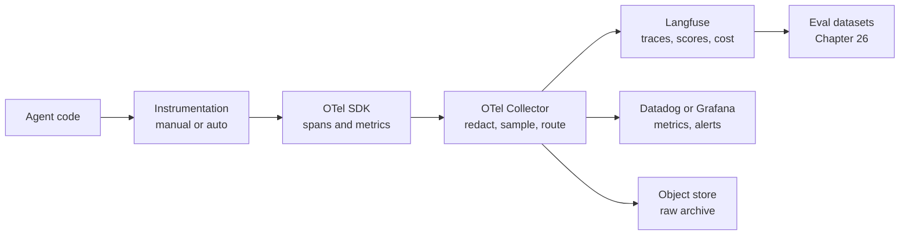
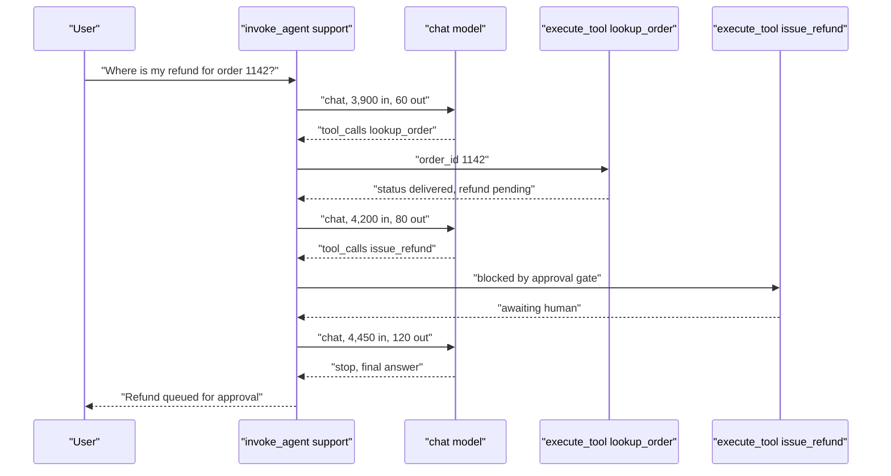
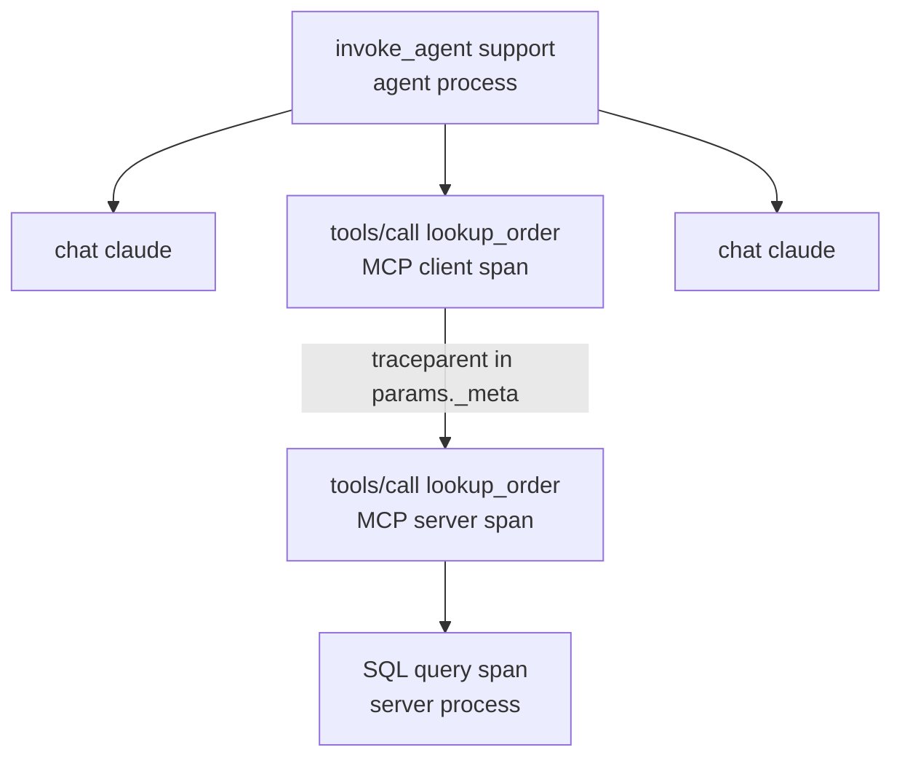
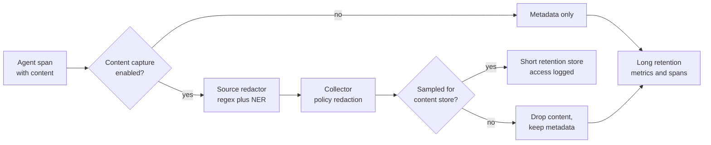
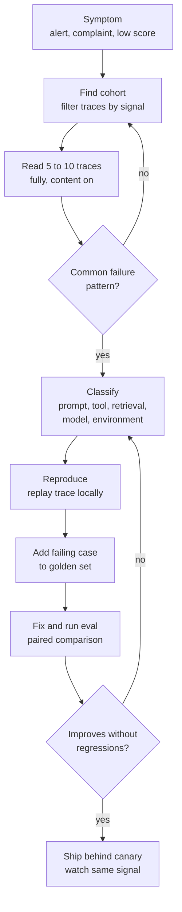
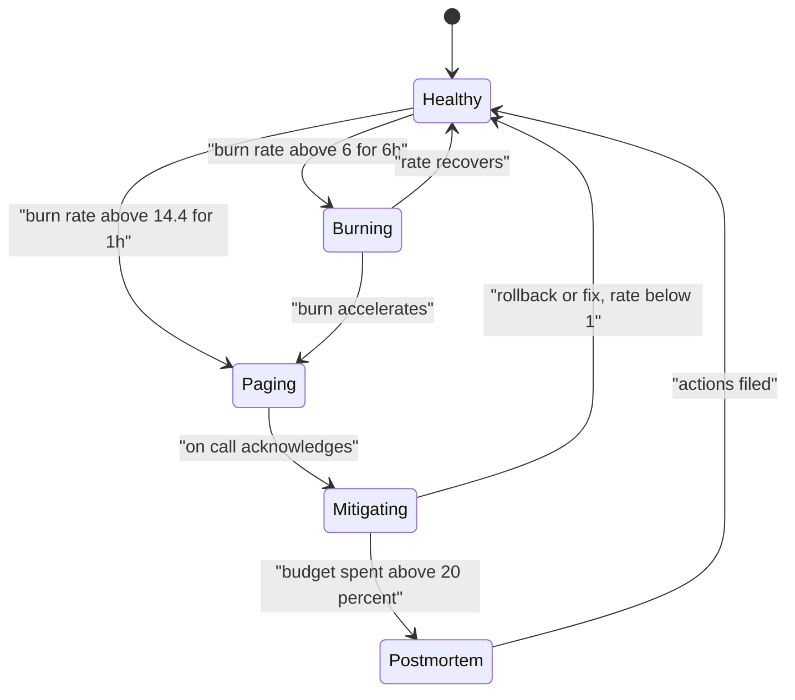
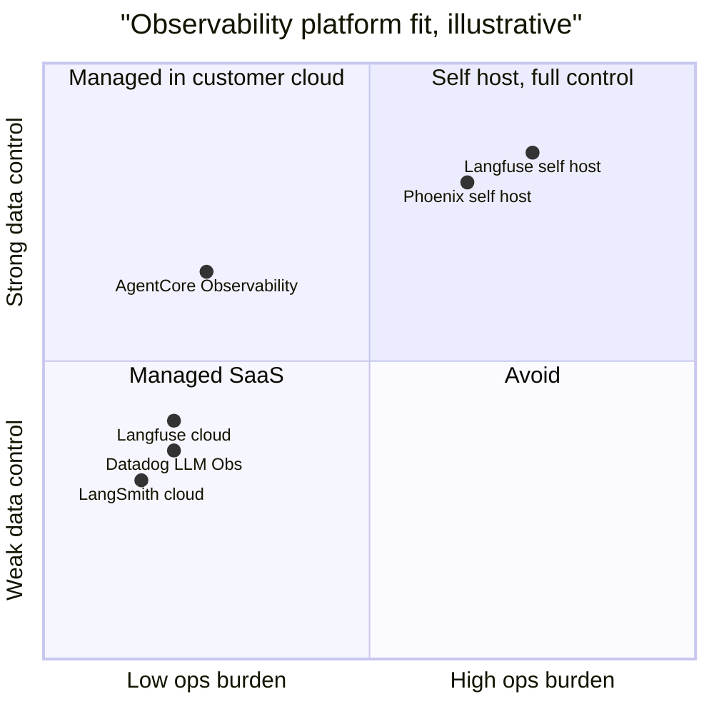
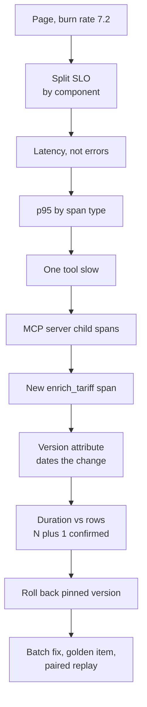

# Chapter 28: Observability

> **What this chapter covers**: how to see what an agent did, why, and at what cost. The OpenTelemetry GenAI semantic conventions (agent, tool, model, and MCP spans), Langfuse as the reference backend, the other platforms (LangSmith, Phoenix, Datadog LLM Observability, AgentCore Observability, OpenLLMetry, Laminar), the signals worth alerting on, PII redaction in traces, and a trace-driven debugging workflow.
>
> **Prerequisites**: Chapters 2 (the agent loop), 9 (context engineering), 20 to 22 (MCP), 26 (evaluation), 27 (testing).
>
> **Where it is used**: every production agent. Chapter 31 uses these signals for cost and latency control, Chapter 32 for canary promotion, Chapter 33 for audit trails, Chapter 34 for the data flywheel.

---

## 28.1 Level 1: Foundations

### 28.1.1 Why agents need a different kind of observability

A classic web request has a fixed call graph. The code decides which database queries run. You can read the code and know the shape of every trace before it happens.

An agent inverts this. The model decides the call graph at run time. The same user message can produce three tool calls on Monday and eleven on Tuesday, because a retrieved document changed or the model sampled differently. The code no longer tells you what happened. Only the trace does.

This has three consequences.

1. **The trace is the program.** For debugging, the trace is the only faithful record of the control flow. Logs without structure are not enough.
2. **Content matters, not just timing.** In a web service you rarely need the request body to debug latency. In an agent the prompt, the tool arguments, and the tool results are the cause of most failures. You must capture content, which creates a privacy problem.
3. **Cost is a per-trace quantity.** Every model call has a token bill. The unit of cost is the task, and the task is a trace.

### 28.1.2 Vocabulary

| Term | Meaning in an agent system |
|---|---|
| Trace | All work done for one task or one user turn, linked by a trace ID |
| Span | One timed operation inside a trace: a model call, a tool call, an agent invocation |
| Session (conversation) | A sequence of traces sharing a conversation ID, for example a multi-turn chat |
| Attribute | A key and value on a span, such as `gen_ai.request.model` |
| Event | A timestamped record inside a span; used for message content in some convention versions |
| Score | An evaluation result attached to a trace or span (Langfuse term; LangSmith calls it feedback) |
| Generation | Langfuse term for a span that is a model call, with tokens and cost |
| Semantic conventions | The agreed attribute names so that any backend can read any instrumentation |
| Instrumentation | Code that creates spans, either manual or auto (library patching) |
| Exporter | The component that ships spans, usually over OTLP |

### 28.1.3 The three layers

Observability for agents has three layers that people often conflate.

- **Telemetry**: spans, metrics, logs. The raw record. OpenTelemetry owns this layer.
- **Analysis**: dashboards, trace viewers, cost roll ups, search. Backends like Langfuse or Datadog own this layer.
- **Evaluation**: scores attached to traces, from humans, rules, or LLM judges. This is where observability meets Chapter 26.

A healthy design keeps telemetry vendor neutral (OTel) and lets you swap or combine analysis backends.



### 28.1.4 What you want to answer from a trace

A good trace answers these questions without opening the code:

- What did the user ask, and what did the agent finally say?
- Which model calls happened, with which model, how many tokens, how much cache hit, how long?
- Which tools were called, with which arguments, and what came back?
- Where did time go? Where did money go?
- Did any step error, retry, or hit a limit?
- Which prompt version, tool version, and agent version produced this?
- Which user and tenant was this for (as a pseudonymous ID)?

If a trace cannot answer the last two, you cannot run a canary or do cost attribution later.

### 28.1.5 A maturity ladder

Teams move through recognisable stages. Knowing the stage tells you what to build next.

| Stage | What exists | What you cannot yet do |
|---|---|---|
| 0. Print debugging | Console logs of prompts | Anything across more than one run |
| 1. Traces in dev | A tracing backend in development, content on | Compare versions, see production |
| 2. Production traces | Metadata spans for all traffic, cost per task | Know if quality moved |
| 3. Scored traces | Online scores on a sample, dashboards, alerts | Turn failures into tests quickly |
| 4. Closed loop | Traces promoted to golden sets, paired evals gate deploys, canaries watch the same signals | This is the target |

Most teams an FDE meets sit at stage 1 or 2. The highest value move is usually from 2 to 3: pick three quality signals, sample and score them, and put them on the same dashboard as cost.

### 28.1.6 What observability is not

- It is not evaluation. Evaluation decides whether a version is good enough; observability tells you what happened. They share data.
- It is not an audit log (28.4.6).
- It is not a guardrail. A span recording a leaked secret does not stop the leak. Guardrails (Chapter 29) act in the request path; observability records what they did.

## 28.2 Level 2: Working knowledge

### 28.2.1 OpenTelemetry GenAI semantic conventions: status first

Status as of September 2026, verified against the OpenTelemetry sources:

- The GenAI conventions have moved out of the main `semantic-conventions` repository into a dedicated repository, `open-telemetry/semantic-conventions-genai`. The old pages on opentelemetry.io now point there.
- The agent spans, model spans, and MCP conventions are all marked **Development** status. Not stable. Attribute names have changed between releases (for example `gen_ai.system` became `gen_ai.provider.name`) and may change again.
- Instrumentations that emitted older attribute names typically gate the newer names behind the `OTEL_SEMCONV_STABILITY_OPT_IN` environment variable. The exact accepted value for GenAI has changed across releases; check the current docs for your instrumentation library before relying on it.

The practical rule: pin the instrumentation library version, pin the semantic convention version you target, and write a small mapping layer in your collector or backend so a rename does not break dashboards.

### 28.2.2 The span types

The conventions define operations through `gen_ai.operation.name`. The ones that matter for agents:

| Operation | Span kind | Span name | Typical parent |
|---|---|---|---|
| `create_agent` | CLIENT | `create_agent {agent_name}` | App code |
| `invoke_agent` | CLIENT (remote agent service) or INTERNAL (in process framework) | `invoke_agent {agent_name}` | App code or another agent |
| `invoke_workflow` | INTERNAL | Workflow name | App code, for multi-agent orchestration |
| `plan` | INTERNAL | Plan phase | `invoke_agent` |
| `chat` (and `text_completion`, `embeddings`, `generate_content`) | CLIENT | `{operation} {model}` | `invoke_agent` |
| `execute_tool` | INTERNAL | `execute_tool {tool_name}` | `invoke_agent` |

The client versus internal distinction for `invoke_agent` is real: a call to a hosted agent (a vendor assistant or a Bedrock agent) is a CLIENT span; a LangGraph or CrewAI run in your process is INTERNAL.

`invoke_workflow` and `plan` are newer additions. Check whether your instrumentation emits them; many do not yet (as of September 2026).

### 28.2.3 Key attributes

The attribute set is large. These are the ones you will query every day.

| Attribute | Meaning |
|---|---|
| `gen_ai.operation.name` | `chat`, `invoke_agent`, `execute_tool`, and so on |
| `gen_ai.provider.name` | Provider, for example `anthropic`, `openai`, `aws.bedrock` |
| `gen_ai.request.model` / `gen_ai.response.model` | Requested and actually served model |
| `gen_ai.agent.name` / `gen_ai.agent.id` | Which agent |
| `gen_ai.conversation.id` | Session or thread ID; groups traces |
| `gen_ai.usage.input_tokens` / `gen_ai.usage.output_tokens` | Billed token counts |
| Cache token attributes | Cached input tokens (read and creation); names have shifted, check the current spec |
| `gen_ai.response.finish_reasons` | `stop`, `tool_calls`, `length`, and so on |
| `gen_ai.tool.name` / `gen_ai.tool.call.id` | Which tool, which call |
| `gen_ai.request.temperature`, `max_tokens` | Sampling parameters |
| `error.type` | Error class when the span failed |

The spec asks you to record billed tokens when the provider distinguishes billed from consumed. That matters for cached tokens, which are billed at a discount.

Message content (system instructions, input messages, output messages, tool arguments and results) is **opt in**. The spec marks it as potentially sensitive. Instrumentations usually disable content capture by default and enable it with a flag. You will almost certainly turn it on in staging and must decide deliberately for production (28.3.5).

### 28.2.4 A minimal trace, drawn

One user turn of the reference support agent (three tools, memory, one approval gate, from Part III).



The span tree is: one `invoke_agent support` root, three `chat` children, two `execute_tool` children. Each child is a sibling under the agent span, ordered by time. If memory retrieval happens, it appears as its own span (often a retrieval or tool span).

### 28.2.5 MCP spans

The MCP conventions (Development status as of September 2026) define:

- A required `mcp.method.name` on client and server spans, for example `tools/call`, `resources/read`, `initialize`.
- Span name `{mcp.method.name} {target}`, where target is the tool or prompt name, for example `tools/call lookup_order`.
- `mcp.session.id` and `mcp.protocol.version` (a date string like `2025-06-18`).
- Context propagation through the MCP request's `params._meta` field, carrying W3C `traceparent`, `tracestate`, and baggage. This is how a trace crosses from the agent process into an MCP server process, even over stdio where there are no HTTP headers.
- Compatibility with `execute_tool`: an MCP tool call span should also set `gen_ai.operation.name` to `execute_tool` and `gen_ai.tool.name`.
- Four duration histograms: `mcp.client.operation.duration`, `mcp.server.operation.duration`, `mcp.client.session.duration`, `mcp.server.session.duration`.



This is the payoff for anyone who builds MCP servers: once both sides propagate `_meta`, a slow tool call in the agent trace expands into the server's own spans, including the database query that made it slow.

### 28.2.6 Langfuse as the reference backend

Langfuse is open source (MIT core), self hostable, and has a managed cloud. Its data model:

| Object | What it is |
|---|---|
| Trace | One task or turn |
| Observation | A node in the trace: span, generation (model call), event, and newer typed variants (agent, tool, retriever) |
| Session | Traces grouped by session ID |
| Score | Numeric, categorical, or boolean value on a trace or observation, from API, UI annotation, or LLM judge |
| Prompt | Versioned prompt with labels (`production`, `staging`); linking a generation to a prompt version gives per-version metrics |
| Dataset | Items with input and expected output; dataset runs link traces to items for offline eval |
| Model definitions | Price tables per model used to compute cost when the provider does not send it |

OTel ingestion (verified September 2026): Langfuse accepts OTLP over HTTP (JSON or protobuf) at `/api/public/otel` (or `/api/public/otel/v1/traces`), authenticated with Basic auth built from the public and secret key. gRPC is not supported. It maps `gen_ai.*` attributes to its own model and gives `langfuse.*` attributes precedence, which is how you set session, user, tags, and prompt links from plain OTel.

The Langfuse SDKs (v3 and later) are themselves built on OpenTelemetry, so manual SDK spans and auto instrumented OTel spans end up in the same tree.

### 28.2.7 A manual instrumentation sketch

When your framework does not emit good spans, wrap the loop yourself. This is plumbing, not design; the decision is which attributes to set.

```python
from opentelemetry import trace
tracer = trace.get_tracer("support-agent", "1.4.0")

def run_turn(conv_id, user_id, msg):
    with tracer.start_as_current_span("invoke_agent support") as s:
        s.set_attribute("gen_ai.operation.name", "invoke_agent")
        s.set_attribute("gen_ai.agent.name", "support")
        s.set_attribute("gen_ai.conversation.id", conv_id)
        s.set_attribute("langfuse.user.id", pseudonymise(user_id))
        s.set_attribute("app.prompt.version", PROMPT_VERSION)
        for step in range(MAX_STEPS):
            resp = call_model(msgs)          # instrumented chat span
            if not resp.tool_calls:
                return resp.text
            for tc in resp.tool_calls:
                with tracer.start_as_current_span(f"execute_tool {tc.name}") as t:
                    t.set_attribute("gen_ai.operation.name", "execute_tool")
                    t.set_attribute("gen_ai.tool.name", tc.name)
                    t.set_attribute("gen_ai.tool.call.id", tc.id)
                    msgs.append(run_tool(tc))
        s.set_attribute("app.stop_reason", "max_steps")
```

Two details worth copying: the stop reason is an attribute, so you can count runs that hit the step cap; and the user ID is pseudonymised before it touches the span.

### 28.2.8 GenAI metrics

Spans are for individual traces. Metrics are for rates and percentiles across all traffic, and they are cheap enough to keep at 100 percent.

The GenAI conventions define client metrics including `gen_ai.client.token.usage` (a histogram of tokens, split by a token type attribute of input or output) and `gen_ai.client.operation.duration` (a histogram of call duration in seconds). Server side metrics for model servers, such as time to first token and time per output token, are also defined. Like the spans, these are Development status; check names against the current spec for your instrumentation version.

What to add yourself as custom metrics, with low cardinality labels:

| Metric | Type | Labels |
|---|---|---|
| `app.agent.task.duration` | Histogram, seconds | agent, version, outcome |
| `app.agent.task.cost` | Histogram, dollars | agent, version, tenant tier |
| `app.agent.task.steps` | Histogram | agent, version |
| `app.agent.tool.calls` | Counter | agent, tool, status |
| `app.agent.stop_reason` | Counter | agent, reason |
| `app.agent.cache.read_tokens` | Counter | agent, model |

Outcome labels should be a closed set (`success`, `error`, `max_steps`, `budget`, `escalated`, `approval_pending`). An open set becomes a cardinality problem.

### 28.2.9 The other platforms

| Platform | Model | Strengths | Caveats (as of September 2026, check current docs) |
|---|---|---|---|
| Langfuse | Open source, self host or cloud | Traces, prompts, datasets, scores in one; OTLP ingest; cheap to self host | Self hosting at scale needs ClickHouse, Redis, S3 and ops time |
| LangSmith | Managed, self host on enterprise tier | Deep LangChain and LangGraph integration, datasets, annotation queues, online evaluators; accepts OTel | Best experience inside the LangChain ecosystem |
| Arize Phoenix | Open source, local or self host; Arize AX managed | OpenInference instrumentation, runs locally in a notebook, evals built in | OpenInference attribute names differ from OTel GenAI; mapping needed |
| Datadog LLM Observability | Managed | Joins LLM spans with APM, infra, logs; enterprise alerting | Priced per volume; content retention and cost need design |
| AgentCore Observability | AWS managed, CloudWatch based | Native for agents on Bedrock AgentCore; OTel based; session views | AWS centric; check which frameworks are auto instrumented |
| OpenLLMetry (Traceloop) | Open source instrumentation library | Auto instruments many providers and frameworks, emits OTel to any backend | It is instrumentation, not a backend |
| Laminar | Open source, cloud | Agent focused tracing, browser agent session replay, evals | Younger project; smaller ecosystem |

The durable decision is not which vendor. It is: emit OTel, run a collector, and treat the backend as replaceable.

### 28.2.10 Worked example: cost per task from a trace

The trace in 28.2.4 has three model calls. Assume a model priced at $3 per million input tokens, $15 per million output tokens, cache reads at 10 percent of input price (illustrative prices, check current vendor pricing). The system prompt and tool schemas are 3,500 tokens and are cached after the first call.

| Call | Input total | Cached | Uncached | Output | Input cost | Output cost |
|---|---|---|---|---|---|---|
| 1 | 3,900 | 0 | 3,900 | 60 | $0.01170 | $0.00090 |
| 2 | 4,200 | 3,500 | 700 | 80 | $0.00105 + $0.00210 = $0.00315 | $0.00120 |
| 3 | 4,450 | 3,500 | 950 | 120 | $0.00105 + $0.00285 = $0.00390 | $0.00180 |

Call 1 pays full price (and in practice a cache write premium, ignored here). Total: input $0.01875, output $0.00390, so about $0.0227 per task. Without caching, input would be 12,550 tokens times $3 per million, $0.03765, and the task would cost $0.0416. Caching saves 45 percent here. The cache hit rate by tokens is 7,000 / 12,550 = 56 percent.

This arithmetic is why cache token attributes are not optional. If your spans lack them, your cost dashboard overstates spend by nearly two times and hides cache regressions.

## 28.3 Level 3: Depth

### 28.3.1 What to watch: the signal catalogue

| Signal | How to compute from spans | Why it matters | Typical alert |
|---|---|---|---|
| Loop rate | Traces with the same tool and same arguments three or more times | Stuck agents burn tokens | Above 1 percent of traces |
| Step cap hits | `app.stop_reason = max_steps` | Tasks the agent could not finish | Rising week over week |
| Steps per task | Count of `chat` spans per `invoke_agent` | Efficiency, cost driver | p95 up 30 percent vs baseline |
| Cost per task | Sum of token cost per trace | Unit economics | p95 above budget |
| Cost per tenant | Group by tenant attribute | Attribution, abuse | Tenant over quota |
| Tool error rate | `execute_tool` spans with `error.type` / total, per tool | Broken integrations | Any tool above 5 percent |
| Latency per step | Duration of `chat` and `execute_tool` spans | SLO decomposition | Step p95 over budget |
| Time to first token | From request start to first streamed token | User perceived latency | p95 over budget |
| Cache hit rate | Cached input tokens / input tokens | Cost and TTFT | Drops more than 10 points |
| Finish reason `length` | Share of `chat` spans truncated | Silent failures | Any increase |
| Online eval score | Judge or rule scores on sampled traces | Quality | Below threshold on rolling window |
| Drift | Distribution shift in input topics, tool mix, or embedding clusters | New traffic the eval set does not cover | Cluster share change |

### 28.3.2 Loop detection, precisely

A naive loop detector counts repeated tool names. That flags legitimate pagination. A better detector hashes `(tool_name, canonical_json(arguments))` and counts repeats within a trace. A canonical form sorts keys and strips volatile fields like timestamps.

Worked numbers: a support agent averages 4.2 steps at $0.008 per step. A loop that runs to a 25 step cap costs $0.20, 25 times a normal step and about 6 times a normal task. If 2 percent of 50,000 daily tasks loop, that is 1,000 times $0.20, $200 per day, against a normal daily spend of 50,000 times $0.034 = $1,680. Loops alone add 12 percent to the bill. Run the detector in process as a guard (stop the loop) and in the backend as a metric (find the cause).

### 28.3.3 Latency budgets from spans

Suppose the p95 end to end target is 8 seconds for a three step turn. The spans tell you the budget split.

| Component | p95 measured | Share |
|---|---|---|
| Model call 1 (TTFT 0.9 s, 60 tokens) | 1.6 s | 20 percent |
| Tool `lookup_order` via MCP | 1.9 s | 24 percent |
| Model call 2 | 1.4 s | 18 percent |
| Model call 3 (streamed answer, 120 tokens) | 2.6 s | 33 percent |
| Orchestration overhead | 0.4 s | 5 percent |
| Total | 7.9 s | |

Note that p95 of a sum is not the sum of p95s; the per step p95s sum to an upper bound for independent steps. Use the trace level p95 for the SLO and the per step p95 for finding the culprit. The MCP server span tree (28.2.5) then shows whether the 1.9 seconds is the database or the transport.

### 28.3.4 Sampling

Agent traces are large (tens of kilobytes with content) and expensive to store. But the interesting traces are rare: errors, loops, low scores, high cost. Head sampling (decide at the start) will drop most of them.

Use tail sampling in the OTel Collector: buffer a whole trace, then keep it if it has an error, exceeds a cost or latency threshold, hit the step cap, or falls in a random 5 to 10 percent baseline. Keep 100 percent of metrics (they are cheap) so rates stay accurate regardless of trace sampling.

The catch: tail sampling needs all spans of a trace on the same collector instance. With MCP servers in other processes or clusters, route by trace ID (a load balancing exporter) or you will keep half traces.

### 28.3.5 PII redaction in traces

Content capture is where observability meets privacy law. A trace with full prompts contains everything the user typed and everything the tools returned: names, emails, order histories, possibly health or financial data.

Design options, from least to most protective:

1. **Capture everything, restrict access.** Fast debugging, highest risk. Acceptable only for synthetic or internal data.
2. **Redact at the source.** A span processor in the app replaces detected entities before export. Detection by regex (emails, phone numbers, card numbers) plus an NER model such as Microsoft Presidio.
3. **Redact in the collector.** A central processor (the Collector's transform or redaction processors, or a custom one) applies one policy for all services. Easier to audit. Raw content still crosses the network to the collector, so the collector is in scope for compliance.
4. **Tokenise or pseudonymise.** Replace entities with stable tokens (`<EMAIL_7f3a>`) so you can still see that the same email appears in two places, and keep the mapping in a separate vault with stricter access.
5. **Metadata only in production, content in a sampled, short retention store.** Keep spans and tokens for everything; keep content for a small sample with a 7 to 30 day retention and access logging.



Failure modes of redaction worth knowing:

- NER misses entities in tool results that are JSON, because models trained on prose do poorly on keys and values. Redact JSON by key (`email`, `phone`, `address`) as well as by content.
- Redaction applied to the span but not to the log line the framework also printed. Audit all sinks.
- Redacting the prompt breaks the ability to replay the trace (Chapter 27). Keep a replayable, access controlled copy for a short window, or replay from synthetic reconstructions.
- Embeddings are not anonymous. An embedding of a user's message can leak content. Treat vector payloads in traces as content.

### 28.3.6 Cardinality and cost of the telemetry itself

Metrics labelled by `user_id` or `conversation_id` explode cardinality and your metrics bill. Put high cardinality IDs on spans (searchable) and keep metric labels to low cardinality dimensions: agent name, model, tool name, tenant tier, prompt version, outcome.

Rough sizing: a 5 step trace with content is often 20 to 80 KB. At 50,000 tasks per day and 40 KB each, that is 2 GB per day, 60 GB per month before compression. Metadata only is typically under 5 KB per trace. The ten times difference is the argument for content sampling.

### 28.3.7 How frameworks emit telemetry

Part III built the same support agent in several frameworks. Their telemetry stories differ, and the differences show up the first day in a customer environment. As of September 2026 (check each framework's current docs, since this changes release to release):

| Framework | Native tracing | OTel path | Notes |
|---|---|---|---|
| LangGraph / LangChain | Callbacks, LangSmith native | OTel export supported; also OpenLLMetry and OpenInference instrumentors | Node level spans; graph state visible in LangSmith |
| OpenAI Agents SDK | Built in tracing to the OpenAI dashboard by default | Custom trace processors to send spans elsewhere | Disable default export if data must not leave |
| Google ADK | OTel based tracing | Exports to Cloud Trace or any OTLP backend | Agent, tool, and model spans |
| Strands Agents | OTel native | OTLP to any backend, AgentCore Observability on AWS | Designed around GenAI conventions |
| CrewAI | Own telemetry plus integrations | OpenLLMetry, OpenInference, vendor integrations | Check and disable anonymous usage telemetry if required |
| Pydantic AI | Logfire, OTel based | Any OTLP backend | GenAI attributes |

Two FDE lessons follow. First, some frameworks send telemetry to their vendor by default; in a customer VPC that is a data egress finding, so audit defaults before the first run. Second, when two instrumentation layers are active (framework native plus an auto instrumentor on the provider SDK), you get duplicate model spans and double counted tokens. Pick one layer per call.

### 28.3.8 Online evaluation from traces: how many samples

Online scores (a judge or a rule applied to sampled production traces) turn observability into a quality monitor. The question is how many traces to score.

For a pass or fail score with true rate p, the standard error of the sample mean over n traces is sqrt(p(1 minus p) / n). To detect a drop from 0.90 to 0.85 with a one sided test at 5 percent significance and 80 percent power, the usual approximation needs about

n = (1.645 sqrt(0.9 times 0.1) + 0.842 sqrt(0.85 times 0.15))^2 / 0.05^2

The numerator terms: 1.645 times 0.300 = 0.494; 0.842 times 0.357 = 0.301; sum 0.795, squared 0.632. Divided by 0.0025 gives about 253 traces per comparison window.

At 50,000 tasks per day, scoring 1 percent (500 traces) gives a daily window that detects a 5 point drop. Scoring 100 percent buys detection of a roughly 0.8 point drop per day at 100 times the judge cost. For most agents, 1 percent stratified by risk tier is the right trade. Scale up the sample for high risk tiers (refunds, account changes) where a smaller drop matters.

Judge cost check: 500 judged traces per day at 6,000 input tokens and 200 output tokens each on a mid tier model at $3 and $15 per million is 500 times ($0.018 + $0.003) = $10.50 per day. Scoring all 50,000 would be $1,050 per day, over half the agent's own spend in the example.

### 28.3.9 Failure modes of observability itself

| Failure | Symptom | Cause | Fix |
|---|---|---|---|
| Broken trees | Tool spans appear as separate traces | Context lost across threads, async tasks, or process boundary | Propagate context explicitly; use `_meta` for MCP |
| Double counting tokens | Cost twice reality | Both framework and provider SDK instrumented | Disable one layer |
| Missing cache tokens | Cost overstated | Old instrumentation or attribute rename | Pin versions, map names in collector |
| Streaming spans end early | Zero output tokens | Span closed when stream object returned, not consumed | End span on stream completion |
| Silent exporter drops | Gaps in traces under load | Batch queue full | Monitor exporter drop metrics, size queues |
| Clock skew | Child before parent | Different hosts | Use durations, NTP, trust span ordering by parent ID |
| PII leak via tags | Emails in searchable tags | Developers tag with raw user IDs | Lint instrumentation, redact in collector |

## 28.4 Level 4: Mastery

### 28.4.1 Trace-driven debugging workflow

The senior skill is not reading one trace. It is a repeatable path from a symptom to a regression test.



The steps in words:

1. **Start from a cohort, not an anecdote.** "Refund tool error rate rose from 1 to 6 percent after Tuesday's deploy" is a cohort. Filter traces by tool, time, and version.
2. **Read whole traces.** The failure is usually upstream of the error. A tool error at step 5 often comes from a wrong ID extracted at step 2.
3. **Classify the cause.** Five buckets cover most failures: prompt (instructions ambiguous), tool (schema, description, or error message poor), retrieval (wrong or missing context), model (capability or version change), environment (API down, rate limits, data changed).
4. **Reproduce by replay.** Take the recorded inputs and tool results (Chapter 27) and rerun the model with the fix. Replay isolates model behaviour from environment noise.
5. **Promote the trace into the eval set.** One click in Langfuse or LangSmith turns a trace into a dataset item. Redact first.
6. **Fix, then measure paired.** Run old and new versions on the same items, report the paired difference with a bootstrap CI (Chapter 26).
7. **Canary and watch the same signal.** Close the loop by checking the metric that fired.

### 28.4.2 Worked debugging case

Synthetic company Northwind Parcel runs the support agent. Alert: cost per task p95 rose from $0.06 to $0.14 on 2026-09-15.

- Filter: traces after the deploy with cost above $0.10. 4.1 percent of traces, versus 0.6 percent before.
- Read ten traces. Eight show `search_kb` called four to six times with near identical queries. The span attributes show `search_kb` results were truncated to 200 characters.
- Root cause: a tool version bump changed the result formatter's truncation from 2,000 to 200 characters. The model could not find the answer and kept searching. Classified as tool.
- The version attributes on spans (`app.tool.version`) made this a five minute diagnosis. Without them it would have been a code archaeology exercise.
- Fix: restore truncation with a pointer to pagination. Replay 40 affected traces: mean `search_kb` calls drop from 4.8 to 1.3. Paired comparison on the 200 item golden set: task success 0.84 to 0.85, difference +0.01 (95 percent CI -0.02 to +0.04), no regression; cost per task mean down 38 percent.

### 28.4.3 Architecture decisions a senior engineer makes

| Decision | Options | Default recommendation |
|---|---|---|
| Instrumentation source | Framework native, OpenLLMetry or OpenInference auto, manual | Auto for model calls, manual for agent and business spans |
| Convention target | OTel GenAI, OpenInference, vendor | OTel GenAI with a collector mapping layer |
| Collector | None, sidecar, gateway | Gateway collector: one place for redaction, sampling, routing |
| Backend | One or split | Split: LLM backend for traces and evals, general APM for metrics and alerts |
| Content | Off, redacted, sampled | Redacted and sampled, short retention |
| Retention | Uniform or tiered | Metrics 13 months, metadata spans 90 days, content 7 to 30 days |
| Multi-tenant isolation | Shared project, per tenant project | Tenant attribute plus row level access; per tenant projects for regulated tenants |
| Customer deployments (FDE) | Vendor cloud, customer self host | Self hosted Langfuse or customer APM in their VPC when data cannot leave |

### 28.4.4 Multi-agent and long-running traces

Multi-agent systems (Chapter 19) and durable workflows (Chapter 18) break two assumptions: that a trace is short, and that it lives in one process.

- **A2A and cross-service agents.** Propagate W3C trace context in the transport. For HTTP based protocols this is headers. Represent each remote agent as a CLIENT `invoke_agent` span in the caller and an INTERNAL root in the callee.
- **Long workflows.** A trace that spans a two day human approval is awkward: collectors buffer, UIs time out. Common practice is one trace per activity or step, linked by span links and a shared workflow ID attribute, plus a session view that stitches them. Temporal and similar engines have their own history; link the trace to the workflow run ID rather than duplicate it.
- **Fan out.** A supervisor calling five workers in parallel produces sibling spans that overlap in time. The critical path, not the sum, sets latency. Some backends compute critical paths; most do not yet.

### 28.4.5 Where the vendors and the literature disagree

- **Events versus attributes for content.** Earlier conventions put messages in span events; later versions moved toward attributes holding structured JSON, partly because many backends handle events poorly. Instrumentations differ. Expect to handle both.
- **What an agent span is.** Frameworks disagree on whether a LangGraph node, a CrewAI task, or a handoff deserves its own agent span. The convention is permissive. Consistency within your system matters more than matching someone else.
- **OTel versus proprietary SDKs.** Vendors say their SDK gives richer features. Some is true (prompt linking, typed observations). Much of it is lock-in. The middle path: vendor SDK built on OTel (Langfuse v3 and later is one example), so you can still route spans elsewhere.
- **Judge scores in the telemetry path.** Some teams run LLM judges online on every trace. That doubles model spend for little gain. A sampled 1 to 5 percent with stratification by risk usually suffices; say so when a vendor pitches always-on evaluation.

### 28.4.6 Observability as audit trail

Observability data and audit logs overlap but are not the same. Audit logs (Chapter 33) must be complete, tamper evident, and retained per regulation. Traces are sampled, mutable, and retained for debugging. Do not rely on sampled traces as the audit record of which tool an agent executed on whose behalf. Emit a separate, unsampled audit event for every side effecting tool call (who, which agent version, which tool, arguments hash, result status, approval ID), and link it to the trace ID.

### 28.4.7 Alerting on agent SLOs with error budgets

Threshold alerts on raw rates are noisy for agents, because traffic is bursty and a single tenant can swing a rate. Error budget burn rate alerts are steadier.

Define the SLO: 97 percent of support tasks finish without error, without a step cap hit, and under 10 seconds, measured over 28 days. The error budget is 3 percent. At 50,000 tasks per day, that is 1,500 bad tasks per day, or 42,000 over the window.

A burn rate of 1 spends the budget exactly over 28 days. Common practice (from the Google SRE workbook) is a fast alert at burn rate 14.4 over 1 hour (2 percent of the monthly budget gone in an hour) and a slow alert at burn rate 6 over 6 hours.

Worked check: burn rate 14.4 means a bad task ratio of 14.4 times 3 percent = 43 percent over an hour. That fires on an outage, not on a mild regression. Burn rate 6 over 6 hours means 18 percent bad, which catches a broken tool. A quality regression that moves success from 97 to 95 percent is burn rate 1.67; that is a job for the daily eval dashboard and the canary gate, not the pager.

This split matters. Paging is for availability and runaway cost. Quality regressions are caught by evals and reviewed in working hours.



### 28.4.8 Cost guardrails wired to telemetry

Cost signals are only useful if something acts on them. The same span data drives three controls:

| Control | Where it runs | Input signal | Action |
|---|---|---|---|
| Per task budget | In process | Running token cost for the trace | Stop the loop, return a partial answer |
| Per tenant daily cap | Gateway or router | Sum of cost by tenant from metrics | Throttle or downgrade model tier |
| Global runaway switch | Ops | Spend rate per minute vs forecast | Page, disable a feature flag |

Worked example: per task budget of $0.25, set at about 7 times the mean task cost of $0.034. On the loop numbers in 28.3.2 a looping task reaches $0.20 at the 25 step cap, so the budget never fires there; the step cap does. The budget protects against a different failure, long context growth, where each step's input grows because tool results accumulate. A task with 12 steps and inputs growing by 3,000 tokens per step reaches 234,000 input tokens (sum of 3,000 times 1 to 12), $0.70 at $3 per million. The step cap does not catch that. The budget does.

### 28.4.9 Drift detection in practice

Drift for agents has three distinct kinds, each visible in traces.

1. **Input drift.** Users ask new things. Embed the first user message of each trace, cluster weekly (k-means or HDBSCAN on a sample), and track the share of traffic in clusters not represented in the golden set. When a new cluster passes 3 to 5 percent of traffic, sample it into annotation.
2. **Behaviour drift.** The tool mix changes without an input change. A model version update (silent on some hosted aliases) can change how often the agent calls `search_kb` versus answering directly. Track the tool call distribution per version and alert on a chi-squared test or a simple total variation distance above a threshold.
3. **Environment drift.** The world changes: an API returns new fields, a knowledge base doubles in size. Visible as tool latency, result size, and tool error shifts.

Worked total variation example: last week the tool mix for 10,000 tasks was lookup_order 50 percent, search_kb 35 percent, issue_refund 15 percent. This week it is 42, 46, 12. Total variation distance is half the sum of absolute differences: (8 + 11 + 3) / 2 = 11 percent. With 10,000 tasks, that is far outside sampling noise (the standard error on a 35 percent share is under half a point). Investigate: in this synthetic case a provider alias moved to a new model snapshot that prefers searching before looking up.

The lesson for FDE work: pin model snapshots where the vendor offers them, and record `gen_ai.response.model` so you can see when an alias moved under you.

### 28.4.10 Choosing a platform for a customer



The positions are judgement, not measurement. The questions that decide it with a customer: can prompts and tool results leave the VPC; who operates the stack after you leave; what APM do they already pay for; and do they need evals and prompt management in the same tool.

### 28.4.11 Incident walkthrough: a trace-driven debugging session

This is a full session, step by step, on a synthetic incident. The goal is to show the order of moves and what each one rules out.

**Context.** Synthetic company Tallis Home Energy runs a billing support agent built on LangGraph, with an MCP server `billing-mcp` exposing `get_invoice`, `get_meter_readings`, and `open_dispute`. Traces go through a gateway collector to self-hosted Langfuse; metrics go to Grafana.

**T+0, 09:40, 2026-09-22.** Page fires: burn rate 7.2 over 6 hours on the task SLO (success, no step cap, under 10 seconds). The error budget dashboard shows the bad ratio at 21 percent, up from a 2 percent baseline.

**T+5 min. Split the bad ratio by its three components.** The SLO is a conjunction, so first find which part failed. Metrics by `app.agent.stop_reason` and duration bucket:

| Component | Baseline | Now |
|---|---|---|
| Error stop reason | 0.8 percent | 1.1 percent |
| Step cap hits | 0.4 percent | 0.6 percent |
| Over 10 seconds | 0.8 percent | 19.4 percent |

Latency, not errors. That rules out a broken tool and most prompt regressions (which usually show as step cap hits or errors first).

**T+8 min. Localise latency by span type.** Per step p95 from span durations:

| Span | Baseline p95 | Now p95 |
|---|---|---|
| `chat` (model) | 1.7 s | 1.8 s |
| `execute_tool get_invoice` | 0.6 s | 0.7 s |
| `execute_tool get_meter_readings` | 0.9 s | 6.8 s |
| `execute_tool open_dispute` | 0.5 s | 0.5 s |

One tool. The model provider is fine, which rules out a vendor incident.

**T+12 min. Expand the MCP server spans.** Because `billing-mcp` extracts `traceparent` from `params._meta`, the slow `tools/call get_meter_readings` span has server-side children. In ten slow traces, the child `SELECT readings` span is 0.4 s and a new child `enrich_tariff` span is 6.1 s. `enrich_tariff` did not exist last week.

**T+15 min. Check version attributes.** `app.tool.version` on the server spans moved from 3.2.0 to 3.3.0 at 07:55. The changelog entry for 3.3.0: "enrich readings with tariff band". The enrichment calls an internal tariff API per reading row, so a customer with 90 daily readings makes 90 sequential calls.

**T+18 min. Confirm by cohort, not anecdote.** In Langfuse, filter traces after 07:55 that call `get_meter_readings` and plot duration against the `app.result.rows` attribute on the tool span. Duration is linear in rows (about 65 ms per row). Traces with fewer than 10 rows are unaffected. This is an N+1 pattern, and it explains why only some users were slow.

**T+20 min. Mitigate.** Roll `billing-mcp` back to 3.2.0 through the gateway's pinned version (Chapter 29 pinning pays off operationally, not only for security). Burn rate falls below 1 within 25 minutes.

**T+1 day. Fix and regress.** The server team batches the tariff lookup (one call per request). You add a golden set item with a 90 row customer and a latency assertion on the tool span in the replay harness (Chapter 27). Paired replay of 60 affected traces: tool p95 from 6.8 s to 0.95 s, task success unchanged at 0.86 (paired difference 0.00, 95 percent CI -0.03 to +0.03).

**What made this a 20 minute diagnosis rather than a day:**

1. Stop reason as an attribute, so the SLO could be decomposed.
2. Per tool span durations with low cardinality metric labels.
3. MCP `_meta` propagation, so the server was not a black box.
4. Tool version on spans, so the change was dated to the minute.
5. Result size on tool spans, so the mechanism was visible.

Each of these is a line or two of instrumentation. None is provided by default auto-instrumentation.



### 28.4.12 Production decisions, written down

A senior engineer records the observability decisions for an agent as a short decision record, because each has a cost and someone will ask later. A template with Tallis's choices:

| Decision | Choice | Reason | Revisit when |
|---|---|---|---|
| Convention target | OTel GenAI, pinned to one release, collector maps renames | Vendor neutral; spec is Development status | Spec reaches stable |
| Content capture in production | On, redacted at source and collector, 5 percent sampled into a 14 day store | GDPR scope; need content for debugging | Regulator or DPO guidance changes |
| Sampling | Tail: all errors, step caps, cost above $0.15, latency above 10 s, 5 percent baseline | Keep rare failures, bounded storage | Traffic doubles |
| Metrics retention | 13 months | Year over year comparisons | Never, cheap |
| Online eval | 1 percent stratified, 3 percent for dispute flows | Detect 5 point drop per day | Detection needs change |
| Paging | Burn rate 14.4 over 1 h, 6 over 6 h; cost runaway above 2 times forecast per 15 min | Availability and money page; quality does not | After first quarter |
| Audit | Separate unsampled events for `open_dispute`, linked by trace ID | Traces are sampled and mutable | Never |
| Backend | Self-hosted Langfuse in customer VPC plus existing Grafana | Data residency; team already on Grafana | Ops burden exceeds 0.5 FTE |

The "revisit when" column prevents decisions from becoming permanent by default.

## 28.5 Subtopic checklist

- [x] OpenTelemetry GenAI semantic conventions and their Development status (28.2.1)
- [x] `invoke_agent`, `execute_tool`, `chat` spans and span kinds (28.2.2)
- [x] Token usage and cache token attributes (28.2.3, 28.2.8, 28.2.10)
- [x] MCP spans, `_meta` propagation, MCP metrics (28.2.5)
- [x] Langfuse traces, sessions, scores, prompts, datasets, cost, OTel ingestion (28.2.6)
- [x] LangSmith, Phoenix, Datadog LLM Observability, AgentCore Observability, OpenLLMetry, Laminar (28.2.9, 28.4.10)
- [x] What to watch: loops, cost per task, tool error rates, latency per step, cache hit rate, drift (28.3.1 to 28.3.3, 28.4.7 to 28.4.9)
- [x] PII redaction in traces (28.3.5)
- [x] Trace-driven debugging workflow (28.4.1, 28.4.2)
- [x] Sampling, cardinality, telemetry cost (28.3.4, 28.3.6)
- [x] Multi-agent and long-running traces (28.4.4)
- [x] Observability versus audit logs (28.4.6)

## 28.6 Common misconceptions

1. **"The OTel GenAI conventions are a stable standard."** They are in Development status as of September 2026 and have renamed attributes between releases. Pin versions and map names.
2. **"Logging prompts and responses is observability."** Flat logs lose the causal tree. You need spans with parent links, timings, and token attributes to answer why and where.
3. **"Auto instrumentation is enough."** It captures model calls well and business context poorly. Add agent, version, tenant, and stop reason attributes by hand.
4. **"Cost can be computed from input and output tokens."** Without cached token counts, cost is overstated, sometimes by nearly two times, and cache regressions are invisible.
5. **"Head sampling at 10 percent is fine."** It drops 90 percent of your rare failures. Use tail sampling on errors, cost, latency, and step caps.
6. **"Redaction with an NER model makes traces anonymous."** NER misses entities in JSON, embeddings leak content, and pseudonymous IDs can be re-identified with context. Layer defences and limit retention.
7. **"Traces are the audit log."** Traces are sampled and mutable. Audit needs complete, tamper evident records of side effects.
8. **"Tool error rate is a model problem."** Most tool errors come from schemas, descriptions, upstream APIs, or data. Classify before blaming the model.
9. **"An MCP server is a black box in the trace."** With `_meta` trace context propagation, the server's own spans join the agent trace.
10. **"Online LLM judges should score every trace."** Sampling with stratification gives the same signal at a fraction of the cost.
11. **"When an alert fires, start reading traces."** Decompose the signal with metrics first; reading random traces before localising wastes the first half hour of an incident.
12. **"A slow tool means a slow model call inside the agent."** Per span durations usually show the time is in the tool or the MCP server's own dependencies, visible only with context propagation.

## 28.7 Practice

1. **Conceptual.** Explain why an agent's control flow is only knowable from its trace, and name two debugging tasks that are impossible with flat logs.
2. **Arithmetic.** A task has four model calls with inputs 5,000, 5,400, 5,900, 6,300 tokens; 4,500 tokens cached from call 2 onward; outputs 80 each. At $3 per million input, $0.30 per million cached input, $15 per million output, compute cost per task with and without caching, and the cache hit rate by tokens.
3. **Hands-on (local).** Run Langfuse with Docker Compose in WSL2. Instrument a small agent over Ollama (Qwen2.5 3B fits the 4060 easily) with OpenLLMetry or manual OTel spans, export OTLP HTTP to Langfuse, and confirm the span tree matches 28.2.4.
4. **Hands-on (MCP).** Build a two tool MCP server over stdio. Propagate `traceparent` through `params._meta` from client to server and show a server side span as a child of the client `tools/call` span.
5. **Design.** Write a tail sampling policy for 50,000 tasks per day with a storage budget of 20 GB per month of content. State keep rules and expected volumes.
6. **Hands-on (redaction).** Write a span processor that redacts emails, phone numbers, and JSON keys named `email` or `address`. Test it on 30 synthetic traces; report recall on a labelled set with a bootstrap CI.
7. **Design.** Define the dashboard for the reference support agent: ten panels, the query behind each, and one alert threshold each with justification.
8. **Debugging drill.** Given a cohort where `finish_reason = length` rose from 0.2 to 3 percent after a prompt change, list the three most likely causes and how the trace distinguishes them.
9. **Conceptual.** Compare OpenInference and OTel GenAI attribute naming for a model call; describe the collector mapping you would write.
10. **Design (FDE).** A customer in a regulated sector forbids traces leaving their VPC. Design the observability stack, retention, and access model.

11. **Incident drill.** Replay the Tallis walkthrough (28.4.11) on your local stack: add a deliberate N+1 call to one MCP tool, fire a synthetic load of 200 tasks, and time how long it takes you to localise the cause from the dashboard alone. Write down which attribute you wished you had.

## 28.8 How this is tested

<details><summary>What are the main span types in the OTel GenAI conventions for agents, and how do they nest?</summary>

`invoke_agent` is the root for an agent run (CLIENT for a remote agent service, INTERNAL for an in-process framework). Under it are `chat` (or other inference operation) spans for model calls and `execute_tool` spans for tool calls. `create_agent` covers creation on a remote service, and newer versions add `invoke_workflow` for multi-agent orchestration and `plan`. All are in Development status as of September 2026, so names can change.
</details>

<details><summary>How does trace context cross into an MCP server running over stdio?</summary>

There are no HTTP headers over stdio, so the MCP conventions carry W3C `traceparent`, `tracestate`, and baggage in the request's `params._meta` property bag. The server instrumentation extracts it and parents its span to the client's `tools/call` span. This works for any transport.
</details>

<details><summary>Why must cost dashboards include cached token counts?</summary>

Cached input tokens are billed at a fraction of normal input price. If you multiply total input tokens by the full price, you overstate cost, in the chapter's example by about 83 percent ($0.0416 vs $0.0227). You also cannot see a cache regression, which is one of the most common silent cost increases after a prompt edit that changes the prefix.
</details>

<details><summary>Design a sampling strategy for agent traces.</summary>

Keep 100 percent of metrics. Use tail sampling in a gateway collector: keep all traces with errors, step cap hits, loops, cost or latency above p95 thresholds, low online eval scores, and a 5 to 10 percent random baseline. Route spans by trace ID so each trace lands on one collector. Keep content only on a subset with short retention.
</details>

<details><summary>How do you detect loops in an agent?</summary>

Hash the tool name plus canonicalised arguments (sorted keys, volatile fields removed) and count repeats within a trace; flag three or more. Pure name counts false-positive on pagination. Run it in process as a guard that stops the loop and in the backend as a rate metric. Also track step cap hits.
</details>

<details><summary>What are the options for PII in traces and which would you pick?</summary>

Capture and restrict, redact at source, redact in collector, tokenise with a separate vault, or metadata only with sampled content. For production with real users I would redact at source and again in the collector, pseudonymise IDs, keep metadata for all traces and content for a small sample with 7 to 30 day retention and access logging. Test redaction recall, including JSON keys.
</details>

<details><summary>Walk me through debugging a quality regression using traces.</summary>

Define a cohort from the signal, filter by time and version, read 5 to 10 whole traces, find the common pattern, classify it (prompt, tool, retrieval, model, environment), reproduce by replaying recorded inputs, add the case to the golden set, fix, run a paired eval with a bootstrap CI, then canary and watch the original signal.
</details>

<details><summary>Why is the p95 of a sum not the sum of the p95s?</summary>

Percentiles do not add. For independent steps, the sum of per step p95s is an upper bound on the end to end p95 in most practical cases, because all steps rarely hit their tails together. Use the measured trace level p95 for SLOs and per step percentiles to locate the bottleneck.
</details>

<details><summary>Langfuse or LangSmith or Datadog: how do you choose?</summary>

LangSmith if the team lives in LangGraph and wants the tightest integration. Langfuse if you want open source, self hosting (often required by FDE customers), and prompts plus datasets plus scores in one tool. Datadog if the customer already runs it and wants LLM spans joined with APM and infra. In all cases emit OTel through a collector so the choice is reversible.
</details>

<details><summary>What attributes do you add manually that auto instrumentation misses?</summary>

Agent name and version, prompt version, tool versions, tenant and pseudonymous user ID, conversation ID, stop reason (final answer, max steps, error, approval pending), approval IDs, and business outcome where known. These enable canaries, attribution, and cohort filtering.
</details>

<details><summary>How are traces different from audit logs?</summary>

Traces are for debugging: sampled, mutable, short retention, possibly redacted. Audit logs are for accountability: complete for every side effecting action, tamper evident, retained per regulation, with actor, agent version, tool, argument hash, result, and approval. Link them by trace ID but store separately.
</details>

<details><summary>What breaks trace trees in agent frameworks?</summary>

Context lost across threads, async tasks, or process boundaries; streaming spans closed before the stream is consumed; two instrumentation layers producing duplicate spans; exporters dropping spans under load; and MCP or A2A calls without context propagation. Fix with explicit context propagation, ending spans on stream completion, one instrumentation layer per call, and exporter drop metrics.
</details>

<details><summary>How do you trace a workflow that pauses for two days waiting for approval?</summary>

Do not keep one open trace. Emit a trace per step or activity, link them with span links and a shared workflow or session ID, and let the durable engine's history be the source of truth for the long run. The backend's session view stitches them for humans.
</details>

<details><summary>How many production traces do you need to score to detect a quality drop?</summary>

For a pass rate near 0.9 and a 5 point drop, a one sided test at 5 percent significance and 80 percent power needs roughly 250 scored traces per window. At 50,000 tasks a day, a 1 percent sample (500) per day is enough; stratify so high risk tiers get more. Scoring everything multiplies judge cost by 100 for a finer detection threshold you rarely need.
</details>

<details><summary>Your agent's cost per task jumped after a model alias update. How do you confirm and respond?</summary>

Group traces by `gen_ai.response.model` to see whether the served snapshot changed at the jump. Compare steps per task, tool mix (total variation distance), output tokens, and cache hit rate before and after. If the new snapshot causes it, pin the old snapshot where the vendor allows, run the paired eval on the new one, and adjust the prompt or tool descriptions before unpinning.
</details>

<details><summary>An SLO alert fires. What is your first move with the traces?</summary>

Decompose the SLO into its components (errors, step cap hits, latency) using stop reason and duration metrics, so you know which part failed before reading any trace. Then localise by span type and tool, expand downstream MCP spans, and date the change with version attributes. Reading random traces first wastes the first half hour.
</details>

<details><summary>Which five instrumentation choices make incident diagnosis fast?</summary>

Stop reason as a span attribute, per tool duration metrics with low cardinality labels, MCP trace context propagation through `_meta`, component versions (prompt, tool, agent, model snapshot) on spans, and result size on tool spans. None comes from default auto-instrumentation.
</details>

## 28.9 Summary

- In an agent, the model decides the call graph at run time, so the trace is the only faithful record of control flow.
- OTel GenAI conventions define `invoke_agent`, `chat`, `execute_tool`, `create_agent`, and newer `invoke_workflow` and `plan` spans; all are Development status as of September 2026 and live in a dedicated repository.
- MCP conventions add `mcp.method.name`, session and protocol version attributes, `_meta` based context propagation, and four duration histograms.
- Record cached tokens; without them cost is overstated and cache regressions are invisible.
- Langfuse is an open source backend with traces, sessions, scores, prompts, datasets, and OTLP HTTP ingestion; treat any backend as replaceable behind a collector.
- Watch loops, step cap hits, steps and cost per task, tool error rates per tool, latency per step, cache hit rate, truncation, online scores, and drift.
- Use tail sampling routed by trace ID, keep all metrics, and keep high cardinality IDs off metric labels.
- Redact PII in layers, include JSON keys, treat embeddings as content, and limit content retention.
- Debug from cohorts, read whole traces, classify, replay, promote to the golden set, measure paired, canary.
- Traces are not audit logs; emit unsampled audit events for side effects.

- Traces promoted into golden sets are the bridge from observability to evaluation; keep the promotion path one click and redacted by default.
- Record every observability decision with a reason and a revisit trigger.

## 28.10 Further reading

- OpenTelemetry GenAI semantic conventions repository, `github.com/open-telemetry/semantic-conventions-genai`: the current source for agent, model, and MCP conventions and their status.
- OpenTelemetry GenAI agent spans document in that repository: `invoke_agent`, `create_agent`, `invoke_workflow`, `plan` definitions.
- OpenTelemetry MCP semantic conventions document in that repository: MCP span names, attributes, `_meta` propagation, metrics.
- OpenTelemetry Collector documentation, tail sampling and load balancing exporter: how to keep whole traces.
- Langfuse documentation, data model and OpenTelemetry integration pages: traces, observations, scores, OTLP endpoint.
- LangSmith documentation: tracing, datasets, online evaluators, OTel support.
- Arize Phoenix and OpenInference specification: the alternative attribute convention.
- Datadog LLM Observability documentation: joining LLM spans with APM.
- Amazon Bedrock AgentCore Observability documentation: session and span views for AgentCore agents.
- Traceloop OpenLLMetry repository: auto instrumentation emitting OTel.
- Microsoft Presidio documentation: PII detection and anonymisation used in redaction processors.
- W3C Trace Context recommendation: the `traceparent` format carried in headers and in MCP `_meta`.
