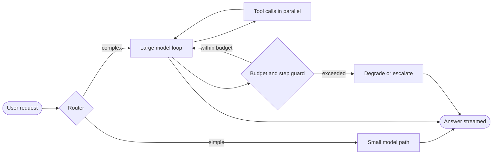
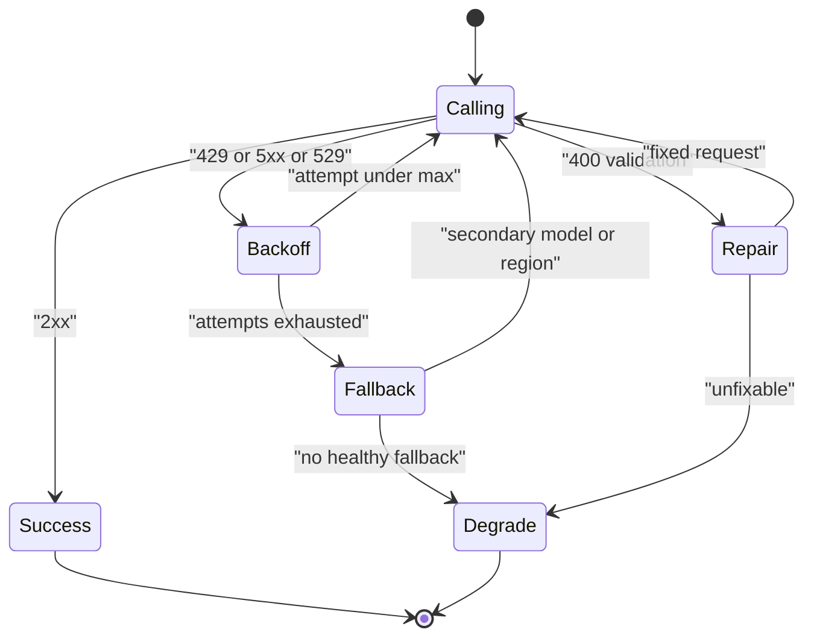
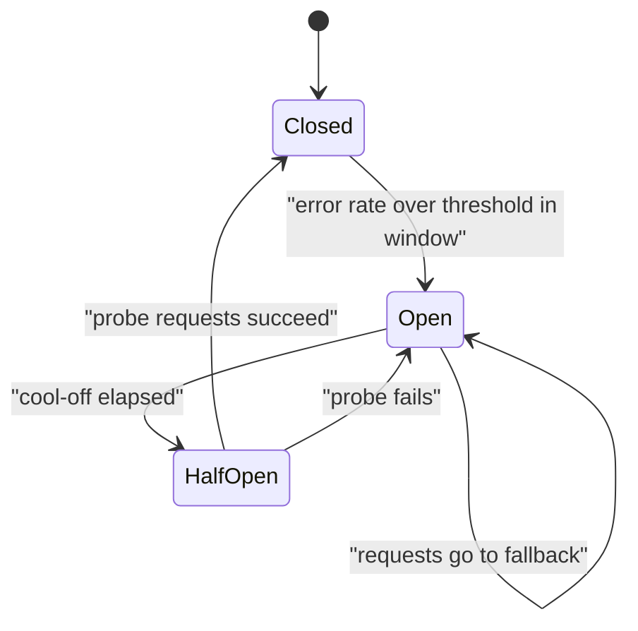
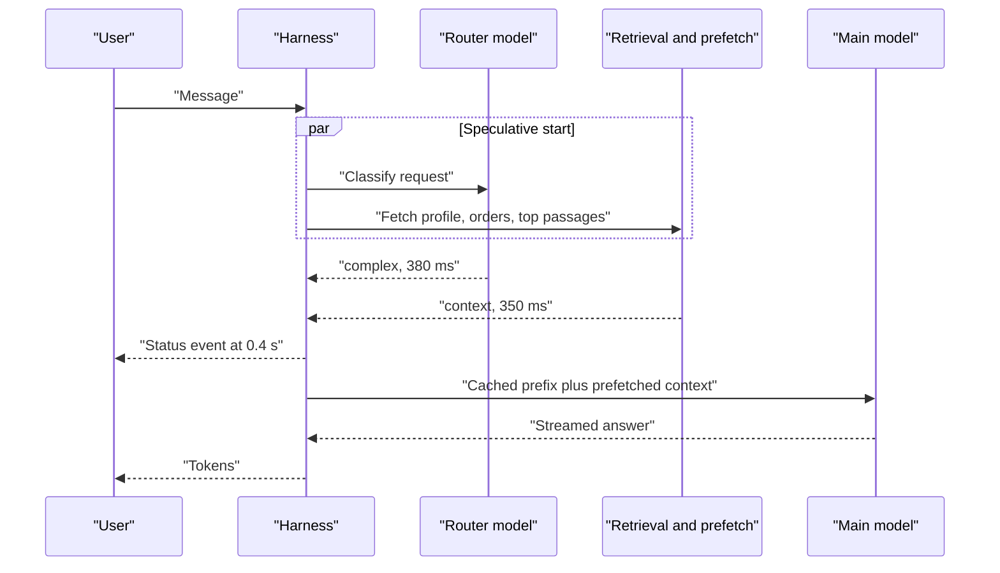
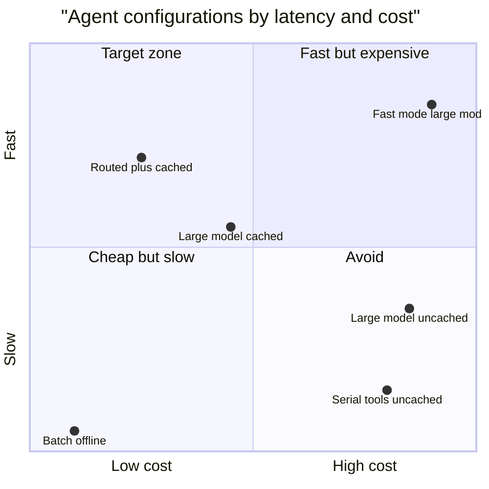
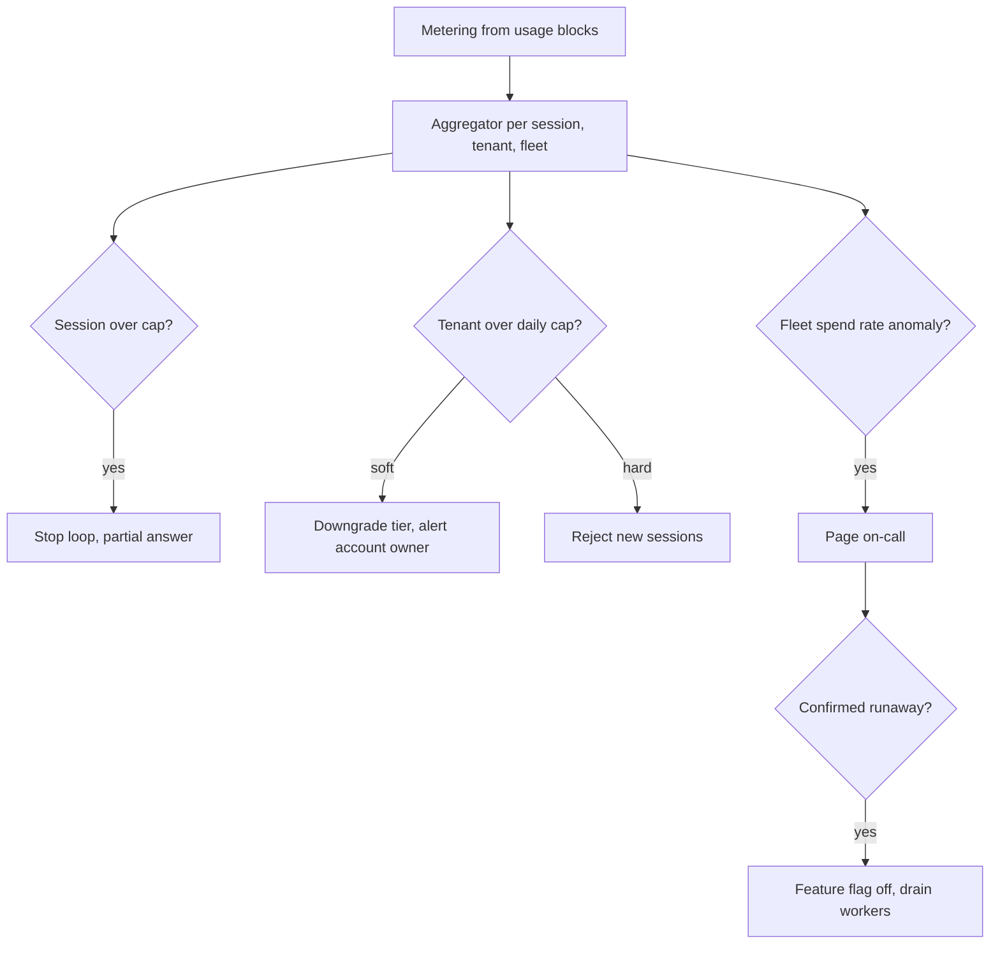
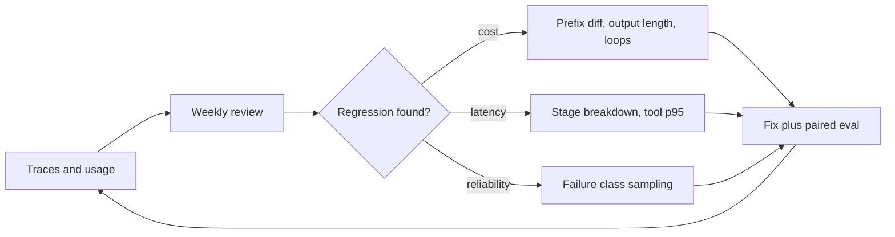

# Chapter 31: Latency, Cost, and Reliability Engineering

> **What this chapter covers**: The three production budgets every agent spends: wall-clock time, money, and failure probability. Latency techniques (streaming, parallel tools, speculative execution, small routing models, caching for time to first token, fewer turns, precomputed context, pooled MCP connections, per-step SLOs). Cost engineering (tokens per task, cache hit ratio, model tiering, batch APIs, budget caps per session and tenant, runaway kill switches, a full cost model). Reliability engineering (max iterations, timeouts, retries, fallback models, graceful degradation, deterministic replay).
>
> **Prerequisites**: Chapters 01, 03, 05, 06, 26, 28.
>
> **Where it is used**: Every production agent. Chapter 32 (scaling and deployment) consumes the concurrency and rate-limit numbers from here. Chapter 33 (governance) consumes the cost attribution model. Chapter 35 (delivering as an FDE) consumes the cost model for customer ROI.

---

## 31.1 Level 1: Foundations

### 31.1.1 Three budgets, one loop

An agent is a loop. Each turn calls a model, maybe calls tools, and appends results to the context. Every turn spends three things at once.

- **Time.** Model prefill, model decode, tool execution, network hops, queueing.
- **Money.** Input tokens (uncached, cache writes, cache reads), output tokens, tool fees (web search, sandboxes, runtime hours), infrastructure.
- **Failure probability.** Each step can fail transiently (a 529 overload, a timeout), semantically (a wrong tool argument), or catastrophically (a loop that never ends).

The loop structure is what makes agents different from single-call LLM features. A chat feature makes one call; its latency is TTFT plus decode, its cost is one prompt plus one response, and its reliability is one call's reliability. An agent makes N calls, and N is not fixed. So all three budgets are random variables with long right tails, and the tails are where incidents live.

### 31.1.2 Why the context grows the bill quadratically

In a naive loop, call i resends everything from calls 1 to i minus 1. If the stable prefix is P tokens and each turn adds d tokens, call i sends P + d(i minus 1) tokens. Summed over n calls:

$$
\text{Input}_{\text{total}} = nP + d\,\frac{n(n-1)}{2}
$$

The second term is quadratic in the number of turns. Doubling the turns from 8 to 16 with P = 6,000 and d = 1,500 takes input from 90,000 to 276,000 tokens, a factor of 3.07, not 2. This single formula explains why "fewer turns" is the best cost and latency lever, why prompt caching matters so much more for agents than for chat, and why a runaway loop is a financial incident and not just a quality bug.

### 31.1.3 Why reliability compounds

If each step succeeds independently with probability p, a task of k steps succeeds with probability p to the k. At p = 0.99 and k = 20, that is 0.818. At p = 0.995 it is 0.905. Half a percentage point per step is nine points per task. Chapter 01 derived this; here it drives engineering choices. Every retry, fallback, and validation layer is an attempt to raise effective p per step, and every turn you remove raises task reliability by removing a factor.

### 31.1.4 Vocabulary

| Term | Meaning |
|---|---|
| TTFT | Time to first token. Dominated by queueing plus prefill for long prompts. |
| TPOT or ITL | Time per output token, inter-token latency. Dominated by decode speed. |
| End-to-end task latency | Wall clock from user request to final answer, across all turns and tools. |
| Tokens per task | Sum of input and output tokens over every model call in one task. |
| Cache hit ratio | Cached input tokens read divided by all input tokens. |
| Cost per successful task | Total spend divided by tasks that passed, the metric that matters. |
| Kill switch | A mechanism that stops a session, tenant, or fleet when a budget is exceeded. |
| Graceful degradation | Returning a reduced but safe answer when the full path is unavailable. |
| Deterministic replay | Re-running a recorded trajectory with recorded model and tool outputs to reproduce behavior. |

### 31.1.5 The mental model



Every production technique in this chapter is a box on this diagram. The router picks the cheapest capable path. Parallel tools shrink wall clock per turn. The guard caps turns, tokens, and dollars. Degradation turns a failure into a safe partial result. Streaming makes whatever remains feel fast.

### 31.1.6 Who owns which budget

The three budgets trade against each other, so each needs an owner who can say no.

| Budget | Typical owner | Trades against | Failure if unowned |
|---|---|---|---|
| Latency | Product and the agent team | Quality (bigger model, more turns), cost (hedging, fast modes) | Features that are correct but too slow to use |
| Cost | Engineering lead with finance | Quality (smaller model), latency (batch) | A bill that grows faster than revenue, discovered monthly |
| Reliability | SRE or platform team | Cost (fallback capacity), latency (retries) | Incidents with no runbook and no degraded mode |

An FDE usually has to set all three for a customer who has thought about none of them. The rest of the chapter gives the numbers to do it.

### 31.1.7 The levers at a glance

| Lever | Latency | Cost | Reliability | Section |
|---|---|---|---|---|
| Fewer turns | Large gain | Large gain | Gain (fewer factors) | 31.2.2 |
| Prompt caching | Gain on long prompts | Large gain | Neutral, raises effective rate limit | 31.2.6, 31.3.10 |
| Parallel tools | Large gain | Neutral | Neutral | 31.2.2 |
| Routing to small models | Gain | Gain | Risk of misrouting | 31.3.3 |
| Shorter outputs | Large gain | Gain | Neutral | 31.3.12 |
| Retries and fallbacks | Loss on failures | Small loss | Large gain | 31.2.8 |
| Hedged requests | Tail gain | Small loss | Gain | 31.3.9 |
| Budget caps and loop detection | Neutral | Protects the tail | Gain | 31.2.7 |
| Batch APIs | Large loss (async) | Halves cost | Neutral | 31.3.4 |

## 31.2 Level 2: Working knowledge

### 31.2.1 Where the time goes in one agent turn

A single turn breaks into stages. Measure each stage separately in traces (Chapter 28), because the fix for each is different.

| Stage | Typical driver | Primary lever |
|---|---|---|
| Queueing at provider | Load, tier, priority class | Priority tiers, provisioned throughput, fallback region |
| Prefill | Prompt length that is not cached | Prompt caching, shorter context |
| Decode | Output length, model speed | Shorter outputs, smaller model, faster serving mode |
| Tool execution | External API latency | Parallel calls, pooled connections, timeouts |
| Harness overhead | Serialization, validation, DB writes | Async I/O, batching writes |
| Network | Region distance | Co-locate workers with the model endpoint |

A rule of thumb that holds across providers: output tokens are an order of magnitude slower per token than input tokens, because prefill is parallel and decode is sequential. A 300-token answer at 60 tokens per second takes 5 seconds of decode. A 30,000-token prompt prefill on a warm cache is a fraction of that. So "make the model write less" is usually a bigger latency win than "make the prompt shorter", unless the prompt is uncached and very long.

### 31.2.2 Latency techniques, one by one

**Streaming.** Stream tokens and tool progress to the user. Streaming does not reduce end-to-end latency. It reduces perceived latency, which is what users judge. Stream three kinds of events: text deltas, tool-start and tool-end events ("Looking up order 4417..."), and partial results. Chapter 23 covers the UX.

**Parallel tool calls.** When the model emits several independent tool calls in one turn, execute them concurrently. Turn latency becomes the maximum of the tool latencies, not the sum. Three lookups at 400, 700, and 900 ms take 900 ms in parallel and 2,000 ms serially. Encourage parallel calls in the system prompt and make sure your harness does not serialize them by accident (a common bug with synchronous tool wrappers).

**Fewer turns.** Each removed turn saves a full prefill, a full decode, and one factor in the reliability product. Ways to remove turns: consolidate tools (one `get_customer_context` instead of `get_customer`, `get_orders`, `get_tickets`), return richer tool results so the model does not need a follow-up call, and precompute context before the loop starts.

**Precomputed context.** If 80 percent of sessions need the user profile and recent orders, fetch them before the first model call and put them in the prompt, below the cached prefix. This trades a few hundred tokens for one or two avoided turns.

**Small models for routing.** A small model classifies the request and picks the path. The router must be cheaper and faster than the savings it creates; a router call of about 1,000 input tokens on a small model costs about a tenth of a cent and adds a few hundred milliseconds.

**Caching for TTFT.** Prompt caching cuts prefill work on the cached prefix. Anthropic reported latency reductions of up to 85 percent for long prompts when it launched prompt caching (August 2024 announcement); treat that as an upper bound for very long, fully cached prompts. The effect on short prompts is small.

**Speculative execution.** Start work before you know you need it. Examples: fire the likely retrieval call in parallel with the router call; start a tool call from a partially streamed tool-use block once the arguments are complete; run a small model and a large model concurrently and take the small one if a verifier accepts it. You pay for work you throw away, so speculate only where the hit rate is high and the wasted work is cheap.

**Pooled MCP connections.** An MCP client that opens a new connection per tool call pays TCP and TLS setup, the MCP `initialize` handshake, and often an OAuth token exchange every time. Keep sessions warm per worker, per tenant, and reuse them. For remote servers over Streamable HTTP, reuse the HTTP connection pool and the MCP session. For stdio servers, keep the subprocess alive across calls rather than spawning per call.

**Per-step SLOs.** Set a latency objective per stage, not only per task: router p95, retrieval p95, each tool's p95, model TTFT p95. A task SLO without stage SLOs cannot tell you which team owns the regression.

### 31.2.3 A latency budget, worked

Target: a support agent answers a typical question with p95 end-to-end under 8 seconds, first visible progress under 1 second.

| Stage | p95 budget (ms) | Notes |
|---|---|---|
| Router (small model, 20 output tokens) | 400 | Runs in parallel with profile prefetch |
| Profile and orders prefetch | 350 | Hidden behind router |
| Turn 1: model call, TTFT | 900 | Cached 6,000-token prefix |
| Turn 1: decode tool call (60 tokens) | 600 | |
| Tools, 2 in parallel | 900 | max(500, 900) |
| Turn 2: model call, TTFT | 900 | |
| Turn 2: decode answer (250 tokens at 60 tokens per second) | 4,200 | Streamed, so user sees text at about 4.2 s into the task |
| Total | 7,900 | Router hides prefetch, so 400 counts once |

Sum: 400 + 900 + 600 + 900 + 900 + 4,200 = 7,900 ms. Note what dominates: 4.2 seconds of decode for the final answer. Cutting the answer to 150 tokens saves about 1.7 seconds, more than any caching change. First visible progress arrives with the tool-start event at about 1.9 seconds, which misses the 1-second target; the fix is to stream a status event the moment the router returns (0.4 s).

Summing p95 values overstates the true p95 of the total, because stages are not all at their tail at once. It is a conservative budget, which is what you want for planning. Measure the real distribution in traces.

### 31.2.4 Cost: tokens per task, the only unit that matters

Bills arrive per token. Decisions should be made per task, and ideally per successful task.

$$
\text{Cost per successful task} = \frac{\sum_{\text{tasks}} \text{cost}}{\#\text{successful tasks}} = \frac{\text{mean cost per attempt}}{\text{success rate}}
$$

A cheaper model with a lower success rate can be more expensive per successful task. If model A costs 4 cents per task at 90 percent success and model B costs 2.5 cents at 55 percent success, A costs 4.4 cents per success and B costs 4.5 cents, before counting the human cost of the 45 percent B failed.

### 31.2.5 Prices used in this chapter

All prices are from the Anthropic pricing page, retrieved 27 September 2026, in USD per million tokens. Check the current page before reusing them.

| Model | Base input | 5-min cache write | 1-hour cache write | Cache read | Output | Batch input / output |
|---|---|---|---|---|---|---|
| Claude Sonnet 5 | 2.00 | 2.50 | 4.00 | 0.20 | 10.00 | 1.00 / 5.00 |
| Claude Haiku 4.5 | 1.00 | 1.25 | 2.00 | 0.10 | 5.00 | 0.50 / 2.50 |
| Claude Opus 5.5 | 4.00 | 5.00 | 8.00 | 0.20 | 20.00 | 2.00 / 10.00 |

Three facts from the same page matter for the arithmetic. Cache writes cost 1.25 times base input for the 5-minute TTL and 2 times for the 1-hour TTL. Cache reads cost 0.1 times base input for most models (Opus 5.5 is listed at 0.05 times). The Batch API is a 50 percent discount on input and output, and the page states caching multipliers stack with the batch discount and with data residency multipliers. The page also notes that Claude 4.7 and later models use a newer tokenizer that produces about 30 percent more tokens for the same text, so token counts measured on an older model do not transfer.

OpenAI documents a 50 percent Batch API discount with a 24-hour completion window, and a flex service tier at batch-like rates with variable latency; as of September 2026, check the current OpenAI docs for which models support flex and priority tiers and at what multiplier.

### 31.2.6 The single-task cost, worked

Reference task: a support agent, 8 model calls, stable prefix P = 6,000 tokens (system prompt plus tool schemas), each turn adds d = 1,500 tokens (tool results plus the model's own output), each call outputs 400 tokens. Model: Sonnet 5.

**Input tokens.** Using the formula from 31.1.2: 8 times 6,000 plus 1,500 times 28 equals 48,000 plus 42,000, so 90,000 input tokens. Output: 8 times 400 equals 3,200 tokens.

**No caching.** Input 90,000 times 2.00 per million is 0.180 dollars. Output 3,200 times 10.00 per million is 0.032 dollars. Total 0.212 dollars per task.

**Incremental caching** (cache breakpoint at the end of each turn, 5-minute TTL). Call i reads the whole prompt of call i minus 1 from cache and writes the new 1,500-token delta. Call 1 writes the 6,000-token prefix.

- Cache reads: sum over calls 2 to 8 of 6,000 + 1,500(i minus 2) = 7 times 6,000 + 1,500 times 21 = 42,000 + 31,500 = 73,500 tokens.
- Cache writes: 6,000 + 7 times 1,500 = 16,500 tokens. Check: 73,500 + 16,500 = 90,000.
- Cost: reads 73,500 times 0.20 per million = 0.0147. Writes 16,500 times 2.50 per million = 0.04125. Output 0.032. Total 0.08795 dollars.

Caching cuts the task from 21.2 cents to 8.8 cents, a 58.5 percent saving. The cache hit ratio is 73,500 / 90,000 = 81.7 percent.

**Warm shared prefix.** If other sessions keep the 6,000-token prefix warm (a busy tenant), call 1 reads it instead of writing it. Reads rise to 79,500, writes fall to 10,500: 0.0159 + 0.02625 + 0.032 = 0.07415 dollars. Notice that output is now 43 percent of the bill. After caching, output tokens dominate, and the next lever is shorter outputs, not more caching.

### 31.2.7 Budget caps and kill switches

Three scopes, each with a hard and a soft limit.

| Scope | Soft limit action | Hard limit action | Typical value |
|---|---|---|---|
| Per step | Truncate tool result, paginate | Reject tool result, return error to model | 20,000 tokens per tool result |
| Per session or task | Tell the model to wrap up, disable expensive tools | Stop the loop, return partial result, escalate | 3 to 5 times p99 cost |
| Per tenant per day | Alert, route to cheaper tier | Reject new sessions with a clear message | Contract value divided by days, with headroom |
| Fleet | Page on-call | Global circuit breaker, feature flag off | Set by finance |

Enforce caps in the harness, not the prompt. A model cannot be trusted to count its own tokens. The harness reads the `usage` block of every response, accumulates cost using a price table keyed by model and token class, and checks the guard before every model call.

```python
@dataclass
class Budget:
    max_turns: int = 25
    max_usd: float = 0.60           # about 5x p99 for the reference task
    max_wall_s: float = 120.0
    spent_usd: float = 0.0
    turns: int = 0
    started: float = field(default_factory=time.monotonic)

    def charge(self, usage, price):
        self.spent_usd += (usage.input_tokens * price.inp
            + usage.cache_creation_input_tokens * price.write
            + usage.cache_read_input_tokens * price.read
            + usage.output_tokens * price.out) / 1e6
        self.turns += 1

    def check(self):
        if self.turns >= self.max_turns: raise BudgetExceeded("turns")
        if self.spent_usd >= self.max_usd: raise BudgetExceeded("usd")
        if time.monotonic() - self.started > self.max_wall_s: raise BudgetExceeded("wall")
```

The field names on `usage` follow the Anthropic Messages API response shape; OpenAI and Gemini report cached tokens under different fields, so normalize them in one adapter.

### 31.2.8 Reliability primitives

**Max iterations.** Every loop has a turn cap. Choose it from the trajectory length distribution: p99 of successful task lengths times 1.5 to 2. A cap below the natural length truncates good tasks; a cap far above it lets loops burn money.

**Timeouts.** Four layers: per model call (connect plus read, with streaming idle timeout), per tool call, per turn, per task. The model-call timeout must allow for long decodes; use an idle timeout on the stream (no token for 30 seconds) rather than a total timeout for long generations.

**Retries.** Retry transient errors only: HTTP 429, 500, 502, 503, 504, provider-specific overload codes (Anthropic returns 529 when overloaded), connection resets. Do not retry 400-class validation errors; repair them or surface them. Use exponential backoff with full jitter and honor `retry-after` headers.

**Fallback models.** When the primary model fails after retries, fail over to a secondary: another region, another cloud host of the same model, or another model. A fallback to a different model is a behavior change, so the fallback must be evaluated on the same golden set (Chapter 26).

**Graceful degradation.** Define what "reduced service" means per feature before the outage: read-only mode, cached answers, a simpler workflow without the agent, a handoff to a human queue with the context pre-filled.

**Deterministic replay.** Record every model request and response and every tool call and result with timestamps. Replay feeds the recorded outputs back in order, which makes a production failure reproducible on a laptop. Chapter 27 covers record and replay for tests; here it is an incident tool.



### 31.2.9 Measuring before optimizing

Every number in this chapter came from a trace sample or a price page. Before any optimization, collect the baseline for one route:

1. **Token shape.** From 200 to 2,000 traces: prefix size, per-turn growth, output per call, turns per task. Report medians and p95s, not only means, because the runaway tail skews the mean.
2. **Cache fields.** Sum `cache_read_input_tokens`, `cache_creation_input_tokens`, and `input_tokens` separately. Total input is their sum.
3. **Stage latencies.** Span durations for router, each tool, each model call (TTFT and total), per the OpenTelemetry GenAI conventions (Chapter 28).
4. **Outcome.** Pass or fail per task from the golden set or online scoring, so cost and latency can be divided by success.
5. **Price table.** Dated, per model, per token class, with the source URL.

Use the provider's token counting endpoint to measure the stable prefix exactly, because tool schemas are larger than they look and each provider adds a hidden tool-use system prompt. The Anthropic pricing page (September 2026) lists 354 extra input tokens for Sonnet 5 when any tool is present with `tool_choice` auto, and larger fixed overheads for built-in toolsets (about 4,500 tokens for the computer-use toolset and 6,600 for the browser toolset). A computer-use agent pays that on every call, which is exactly what caching is for.

### 31.2.10 Latency percentiles and why averages lie

Agent latency distributions are right-skewed and often bimodal: short tasks finish in 2 or 3 turns, long ones take 10 or more. The mean sits between the modes and describes nobody. Report p50, p95, and p99 per task class. And remember that the p95 of a sum is not the sum of p95s; for independent stages it is smaller, for correlated stages (a slow provider slows every call in the task) it approaches the sum. In agents, correlation is common, because all calls in one task hit the same provider at the same moment.

Worked example: a task with 5 sequential model calls, each with p50 of 1.2 s and p99 of 6 s. The chance that at least one of 5 calls is in its own worst 1 percent is 1 minus 0.99 to the 5th = 4.9 percent. So nearly 5 percent of tasks contain a p99-slow call, and the task p95 is set by the per-call p99, not the per-call p95. This is the fan-out effect from "The Tail at Scale": the more calls per task, the more the tail of a single call dominates the task. It is the quantitative argument for hedged requests and for fewer turns.

## 31.3 Level 3: Depth

### 31.3.1 Prompt caching mechanics that decide the hit ratio

Caching is a prefix match. Any change to a byte before a breakpoint invalidates everything after it. Rules that follow:

1. **Order by volatility.** Tools and system prompt first (change per deploy), then tenant context (changes per tenant), then session context (changes per session), then turns.
2. **No timestamps or request IDs in the prefix.** A `Current time: 14:03:22` line in the system prompt drops the hit ratio to zero. Put the date at day granularity, or put it after the last breakpoint.
3. **Stable tool ordering.** If tools are loaded from a dictionary with nondeterministic order, or tool search adds tools mid-session in varying positions, the prefix changes. Sort tools.
4. **TTL matching traffic.** The 5-minute TTL refreshes on each hit. A user who thinks for 6 minutes between messages misses. The 1-hour write costs 2 times base versus 1.25 times, so it pays when the expected gap between reads exceeds 5 minutes and the session will have at least two more reads.
5. **Minimum cacheable length.** Providers set a minimum prefix length below which no cache is created; as of September 2026 check the provider docs for the per-model minimum.

**Break-even for the 1-hour TTL.** Let a prefix of P tokens be read r more times over the next hour, with gaps longer than 5 minutes. With the 5-minute TTL, each read is a miss and a fresh write at 1.25 times base: cost P times 1.25 times (r + 1). With the 1-hour TTL: P times (2 + 0.1r). The 1-hour TTL wins when 2 + 0.1r < 1.25r + 1.25, that is when r > 0.65. One slow return visit is enough.

### 31.3.2 Cache hit ratio is a production metric, not a setting

Track cache hit ratio per route and per tenant in the observability stack. A hit ratio drop is often the first symptom of a deploy that injected a volatile field into the prompt. In the reference task, the theoretical ratio is 81.7 percent. If production shows 40 percent, something is breaking the prefix. The cost difference at 200,000 tasks a month is the gap between 17,590 and 42,400 dollars.

### 31.3.3 Model tiering and routing, with arithmetic

Suppose 60 percent of tasks are simple enough for Haiku 4.5. Same task shape on Haiku with caching: reads 73,500 times 0.10 = 0.00735, writes 16,500 times 1.25 = 0.020625, output 3,200 times 5.00 = 0.016. Total 0.043975 dollars.

Blend, with a router call (about 1,000 input and 20 output tokens on Haiku, about 0.0011 dollars) and 10 percent of Haiku tasks escalating to a full Sonnet rerun (6 percent of all tasks):

| Component | Per-task cost (USD) |
|---|---|
| 0.6 times Haiku path | 0.026385 |
| 0.4 times Sonnet path | 0.035180 |
| Router, every task | 0.001100 |
| Escalations, 0.06 times Sonnet path | 0.005277 |
| Blended total | 0.067942 |

At 200,000 tasks a month: 13,588 dollars with routing, 17,590 dollars all-Sonnet cached, 42,400 dollars all-Sonnet uncached. Routing saves 23 percent on top of caching. The escalation rate is the sensitive assumption: at 30 percent escalation of Haiku tasks, the escalation line becomes 0.18 times 0.08795 = 0.01583 and the blend is 0.07850, still below 0.08795 but the saving shrinks to 11 percent. Measure escalation in the eval before shipping the router, and include the cost of the failed Haiku attempt (already in the Haiku line).

### 31.3.4 Batch APIs: where they fit in an agent system

Batch APIs process asynchronous requests at half price within a completion window (24 hours on both Anthropic and OpenAI as documented in September 2026). An interactive agent loop cannot use them, because each turn depends on the previous one. They fit around the agent:

- Nightly regression evals over golden sets (Chapter 26). 2,000 reference tasks at 0.08795 dollars is 175.90 dollars synchronous and 87.95 at batch rates, if you can run each turn as a batch round. Multi-turn evals need one batch round per turn, which stretches wall clock, so many teams batch only single-turn judge calls.
- LLM-as-judge scoring of production traces.
- Offline summarization of long-term memory, trace labeling, synthetic data generation (Chapter 34).
- Precomputing context: nightly customer summaries loaded as precomputed context the next day.

Claude Managed Agents sessions are not eligible for the batch discount (the pricing page says sessions are stateful and there is no batch mode).

### 31.3.5 Runaway loops: what one costs

A loop that repeats the same failing tool call for 50 turns with the reference shape:

- Input: 50 times 6,000 + 1,500 times 1,225 = 300,000 + 1,837,500 = 2,137,500 tokens.
- Uncached on Sonnet 5: 2,137,500 times 2.00 = 4.275, plus output 20,000 times 10.00 = 0.20, total 4.475 dollars.
- Cached: reads 2,058,000 times 0.20 = 0.4116, writes 79,500 times 2.50 = 0.19875, output 0.20, total 0.81 dollars.

One runaway session costs 9 to 51 times a normal session. A bug that sends 2 percent of 6,700 daily sessions into a 50-turn loop costs 134 times 4.475 = 600 dollars a day uncached, silently, while quality metrics may look fine because the loop eventually hits the cap and returns a polite apology. That is why the kill switch keys on dollars and turns, and why loop detection (the same tool with the same arguments three times in a row) should end the loop long before the turn cap.

### 31.3.6 Retry arithmetic and the correlation trap

If a call fails transiently with probability q = 0.02 and failures are independent, three attempts fail with probability 0.02 cubed = 8 in a million. That calculation is wrong in the situations that matter, because transient failures cluster: when a provider is overloaded, the second and third attempts are likely to fail too. Retries cure independent blips; fallbacks cure correlated outages. Design for both.

Retries also multiply load. If 1,000 workers each retry three times during an overload, the provider sees up to 4,000 requests for the original 1,000, making the overload worse. Mitigations: jittered backoff, a retry budget (retries may not exceed 10 percent of requests in a rolling window), and a circuit breaker that stops calling a failing endpoint for a cool-off period.



### 31.3.7 Where reliability actually fails in agents

Transient API errors are the easy part. The failure modes seen in production traces, roughly in order of cost:

1. **Semantic tool errors.** The model calls a tool with plausible but wrong arguments. Retrying the same request does not help. Actionable error messages (Chapter 24) and validation help.
2. **Loops.** Repeated identical calls, oscillation between two tools, re-planning that never converges.
3. **Context overflow.** The session exceeds the window, or compaction drops a critical fact (the compaction cliff, Chapter 06).
4. **Tool timeouts.** A slow downstream API holds the turn; the model gets no result and guesses.
5. **Stuck human gates.** An approval request nobody answers; the session holds resources indefinitely.
6. **Provider incidents.** Elevated error rates or latency for minutes to hours.

Each needs its own guard. Max iterations catches loops late; loop detection catches them early. Timeouts plus explicit "tool timed out, try X" results keep the model honest. Approval gates need their own timeout and a default action.

### 31.3.8 Deterministic replay in detail

Model sampling is not reproducible even at temperature 0 across providers and hardware, because batch composition changes floating point reduction order. So replay does not re-sample the model. It records and substitutes.

What to record per step: the exact request (messages, tools, parameters, model ID with version), the full response (content blocks, stop reason, usage), each tool call's input and output, wall-clock timestamps, and the harness version. What replay gives you: exact reproduction of the harness behavior given the recorded outputs, the ability to change one thing (a harness guard, a tool result formatter) and see the new path, and the ability to fork at step k and re-sample live from there to test a fix. Store recordings with the same PII controls as traces (Chapter 28), since they contain the full context.

### 31.3.9 Speculative execution, traced

The clearest win is overlapping the router with retrieval and prefetch, because both are cheap and usually needed.



Serial execution would cost 380 plus 350 = 730 ms before the main call; overlapped it costs max(380, 350) = 380 ms. The price is the prefetch on sessions that turn out not to need it. If prefetch costs 5 ms of database time and 600 extra prompt tokens, and 20 percent of sessions do not use it, the waste is 0.2 times 600 = 120 tokens per session on average, about 0.02 cents on Sonnet 5 at the uncached rate. Cheap. Speculating a whole large-model call is a different trade: at 8.8 cents a task you want a hit rate above 80 percent before running two large calls in parallel.

A second form is **hedged requests**, borrowed from distributed systems (Dean and Barroso, "The Tail at Scale", 2013). If a model call has not returned its first token by the p95 TTFT, send a duplicate to a second region and take whichever answers first. This cuts tail latency at the cost of duplicate spend on about 5 percent of calls. Hedge only idempotent, read-only calls, and cancel the loser so you do not pay for its full decode.

### 31.3.10 Rate limits are a reliability problem

Providers limit requests per minute and tokens per minute per organization and model, and tier limits by spend history. When an agent fleet hits the limit, every session slows or fails at once, which looks like an outage.

Worked example. Northwind averages 0.077 tasks per second (200,000 a month), but a regional delivery delay produces bursts of 1 task per second, about 13 times the average. At that burst, 8 calls per task, 90,000 input and 3,200 output tokens per task. Per minute at peak: 480 requests, 5.4 million input tokens, 192,000 output tokens. Of the input, 73,500 of every 90,000 are cache reads. Anthropic's rate-limit page (retrieved 27 September 2026) states that for most Claude models only uncached input tokens and cache writes count toward input tokens per minute; cache reads do not (Haiku 3.5 is the listed exception). So the counted input is 16,500 times 60 = 990,000 tokens per minute, a factor of 5.5 lower than the raw 5.4 million. This is a second, less discussed benefit of caching: it raises effective throughput under a fixed limit. The same page lists Sonnet 5 at 2 million ITPM and 400,000 OTPM on the Start tier and 10 million and 2 million on the Scale tier, and monthly spend caps per tier (500 dollars on Start, 200,000 on Scale). Northwind's 19,000-dollar month would stop dead on a lower tier's spend cap, returning 429 with no `retry-after` header, which retries cannot fix. Check the tier before launch, not during the incident.

Defensive patterns:

- **Client-side token bucket** per model, sized just under the org limit, so the fleet queues locally instead of getting 429s.
- **Priority classes**: interactive sessions first, evals and batch preprocessing last. Evals should never compete with customers for the same limit; give them a separate workspace or key.
- **Read the headers.** Providers return remaining-limit headers; feed them into the token bucket so it adapts.
- **Fairness across tenants.** One tenant's bulk import should not starve others. Per-tenant sub-buckets inside the org limit (Chapter 32).

### 31.3.11 Timeout values that work

| Timeout | Starting value | Rationale |
|---|---|---|
| Model connect | 5 s | Connect should be fast; failing fast allows fallback |
| Model stream idle | 30 to 60 s | Long thinking blocks may pause output; tune per model and effort |
| Model total (non-streaming) | 10 minutes or more for long outputs | Providers warn that very long non-streaming calls may time out; stream instead |
| Tool call, read | 5 to 10 s | User-facing turn budget |
| Tool call, write | 30 s plus idempotency key | Writes must not be retried blindly without a key |
| Approval gate | 15 minutes to 24 hours | Business decision, with a default action on expiry |
| Task wall clock | 2 to 5 minutes interactive, hours for background | Separate classes |

The write-tool row matters most. A timeout on a write does not mean the write failed. Retrying `issue_refund` after a timeout can refund twice. Every side-effecting tool takes an idempotency key derived from the session and step, and the downstream system deduplicates on it. That rule belongs in the tool contract (Chapter 24), and the harness enforces it by refusing to retry write tools that lack a key.

### 31.3.12 Output length is the hidden cost driver

On Sonnet 5, output costs 5 times input and 50 times a cache read. In the warm-cache reference task, 400 output tokens per call is 43 percent of spend. Levers that do not hurt quality:

- Ask for terse tool-calling turns ("call tools without narration") and a concise final answer.
- Set `max_tokens` per step class: small for tool-calling turns, larger for the final answer.
- Use structured outputs for intermediate steps so the model does not write prose nobody reads.
- For reasoning models, cap the thinking budget or effort per step (Chapter 04); thinking tokens bill as output.

Cutting output from 400 to 250 tokens per call saves 8 times 150 times 10 per million = 1.2 cents per task on Sonnet 5, 2,400 dollars a month at Northwind volume, with a latency win of about 2.5 seconds per task at 60 tokens per second across all 8 calls.

## 31.4 Level 4: Mastery

### 31.4.1 The full cost model, worked

A synthetic company, Northwind Parcel, runs a support agent. The FDE is asked for a monthly cost forecast and a unit economics case. Inputs, each labelled with its source:

| Input | Value | Source |
|---|---|---|
| Tasks per month | 200,000 | Ticket volume, last 3 months |
| Model calls per task (mean) | 8 | Trace sample, n = 2,000 |
| Stable prefix | 6,000 tokens | Token counting endpoint |
| Growth per turn | 1,500 tokens | Trace sample |
| Output per call | 400 tokens | Trace sample |
| Routing split | 60 percent Haiku 4.5, 40 percent Sonnet 5 | Router eval |
| Escalation of Haiku tasks | 10 percent | Router eval |
| Retry overhead | 3 percent of calls | Last month's logs |
| Runaway tail | 0.5 percent of tasks hit the cost cap of 0.60 dollars | Trace sample |
| Web search | 0.2 searches per task at 10 dollars per 1,000 | Anthropic pricing page, September 2026 |
| Nightly eval | 2,000 tasks per night, batch rate | Eval plan |
| Success rate | 88 percent | Golden set, 95 percent CI 86.6 to 89.4 |

Build it up:

| Line | Calculation | Monthly USD |
|---|---|---|
| Blended model cost | 200,000 times 0.067942 | 13,588 |
| Retry overhead | 3 percent of 13,588 | 408 |
| Runaway tail | 1,000 tasks times (0.60 minus 0.0679) | 532 |
| Web search | 40,000 searches times 0.01 | 400 |
| Nightly eval | 30 nights times 2,000 times 0.08795 times 0.5 | 2,639 |
| Infrastructure (workers, Postgres, Redis, tracing) | Estimate from Chapter 32 sizing | 1,500 |
| Total | | 19,067 |

Unit economics: 19,067 divided by 200,000 tasks is 9.5 cents per task; divided by 176,000 successful tasks is 10.8 cents per success. If a human-handled ticket costs 4.00 dollars fully loaded and failed agent tasks go to humans, the comparison is 200,000 times 4.00 = 800,000 dollars today versus 19,067 plus 24,000 times 4.00 = 115,067 dollars with the agent. The forecast is dominated by the human cost of failures, not the model bill, so a 2-point success gain is worth 16,000 dollars a month, more than the entire routing saving. That is the senior insight: once caching is in place, quality is the biggest cost lever.

Two sensitivities to present to the customer: the eval line (2,639 dollars, 14 percent of spend) scales with eval size, not traffic, and can be cut by sampling; the runaway line is a forecast of a bug class, and should trend to zero as loop detection matures.

### 31.4.2 Designing the latency and cost frontier



A senior engineer does not pick a point on this chart once. Different routes in the same product sit at different points: the chat route near the target zone, the nightly report in the batch corner, an executive escalation path in the fast and expensive corner. Anthropic's fast mode for Opus models (research preview as of September 2026, priced at 8 and 40 dollars per million input and output tokens for Opus 5.5 versus 4 and 20 standard) is an example of explicitly buying the top-right corner.

### 31.4.3 SLOs for agents: what to promise

Agent SLOs have to account for variable task length. Promise per-stage latencies with confidence, and task-level latencies per task class.

| SLO | Target | Measured on |
|---|---|---|
| First progress event | p95 under 1 s | All sessions |
| Model TTFT per call | p95 under 1.5 s | All model calls |
| Tool latency | p95 under 1 s per tool, per tool | All tool calls |
| Simple task end to end | p95 under 8 s | Router class "simple" |
| Complex task end to end | p95 under 45 s | Router class "complex" |
| Task success | at least 85 percent, lower CI bound | Weekly golden set |
| Cost per task | p99 under 0.30 dollars | All tasks |
| Availability | 99.5 percent of sessions get a non-error response | All sessions, degraded counts as success |

Note the last line: counting a graceful degradation as available is a product decision. Make it explicit in the SLO document, because an SRE and a product owner will disagree otherwise.

Error budgets work as usual. A 99.5 percent monthly availability target over 200,000 sessions allows 1,000 failed sessions. A 20-minute provider outage at 4.6 sessions per minute with no fallback burns 92 of them; without fallback the budget tolerates about 3.6 hours of hard downtime a month.

### 31.4.4 Fallback design: same model elsewhere versus different model

| Fallback | Behavior change | Cost change | Setup |
|---|---|---|---|
| Same model, another region | None | Regional pricing differences (Bedrock and Vertex regional endpoints carried a 10 percent premium over global as of September 2026) | Multi-region credentials |
| Same model, another cloud (first party to Bedrock or Vertex) | Minor (feature parity gaps, different beta headers) | Varies | Adapter per platform |
| Smaller model, same family | Moderate, lower success | Lower | Eval on golden set |
| Different vendor | Large: tool calling, caching, prompts all differ | Varies | Separate prompts, separate eval, gateway |
| No model: scripted workflow or human queue | Total | Human cost | Degradation design |

Most teams overestimate how well a cross-vendor fallback works. Prompts tuned for one model family underperform on another, cache state does not transfer so the first calls after failover are full price and slower, and tool-calling edge cases differ. Treat a cross-vendor fallback as a second product that needs its own eval run in CI, or do not claim it.

### 31.4.5 Kill switches at fleet scale



Design choices a senior engineer makes here:

- **Metering must be local and fast.** A session guard cannot wait for a billing export that lands hours later. Meter from the response `usage` fields in the worker, write to Redis with an atomic increment, and reconcile against the provider's usage API daily.
- **Anomaly detection on spend rate, not spend level.** A fleet alarm at "spend per 10 minutes over 3 times the same window last week" catches a runaway in minutes.
- **Kill switches are rehearsed.** A flag nobody has flipped in production is a flag that might not work. Game-day it quarterly.
- **Degrade before you kill.** Downgrading a tenant to a cheaper model tier preserves service; rejecting sessions does not.

### 31.4.6 What vendors and practitioners disagree on

- **Streaming tool arguments.** Some teams execute tools speculatively from partial JSON; others wait for the complete block. The former saves hundreds of milliseconds; the latter avoids executing a call the model would have changed. Only speculate on read-only tools.
- **Router or no router.** Some argue a single strong model with good caching is simpler and nearly as cheap, and routers add a failure mode (misrouting). The arithmetic above shows routing pays when the simple fraction is large and escalation is rare. Measure both.
- **Reasoning effort as a latency knob.** Higher thinking budgets improve hard planning steps and waste time on easy tool calls (Chapter 04). Per-step effort control is becoming common; whether to vary it per turn is an open empirical question for each workload.
- **Retries inside the SDK or in your harness.** Provider SDKs retry by default. If your harness also retries, you get multiplicative retries. Pick one layer and disable the other.

### 31.4.7 Reliability as a product of layers

A senior engineer quantifies what each reliability layer buys, instead of adding layers by habit. Start from a baseline task success of 80 percent on the golden set and attribute failures from a sample of 200 failed traces:

| Failure class | Share of failures | Layer that addresses it | Expected recovery |
|---|---|---|---|
| Transient API errors | 10 percent | Retries plus fallback | About 95 percent recovered |
| Semantic tool-argument errors | 35 percent | Validation plus actionable errors | About 50 percent recovered |
| Loops and non-convergence | 15 percent | Loop detection plus replan prompt | About 40 percent recovered |
| Wrong final answer | 30 percent | Better prompt, better model, verifier | Varies |
| Tool timeouts | 10 percent | Timeouts plus retry with idempotency | About 70 percent recovered |

The failure rate is 20 percent. Expected recovered share: 0.10 times 0.95 + 0.35 times 0.5 + 0.15 times 0.4 + 0.10 times 0.7 = 0.095 + 0.175 + 0.06 + 0.07 = 0.40 of failures, so task success rises from 80 to 80 + 0.40 times 20 = 88 percent, before touching the model. The biggest line is semantic tool errors, which retries do nothing for. This is why "add retries" is the junior answer and "fix the tool contract and error messages" is the senior one. Recovery estimates are hypotheses; confirm each with a paired eval on the same items (Chapter 26).

### 31.4.8 Operating the budgets: a weekly review

Numbers only help if someone looks at them on a schedule. A workable weekly review for an agent in production, 30 minutes:

1. Cost per successful task, per route, with the week-over-week change and a bootstrap interval.
2. Cache hit ratio per route. Any drop over 5 points gets a ticket.
3. Top 10 most expensive sessions. Read the traces. Most are loops or huge tool results.
4. Turn-count distribution. A rising p99 predicts cost and latency problems before they show up in averages.
5. Tool error rates and p95 latencies per tool, owned by the tool team.
6. Error budget burn against the availability SLO.
7. Fallback activations and circuit-breaker trips, with cause.



### 31.4.9 Per-tenant cost attribution and pricing

Caps need attribution first: you cannot cap a tenant you cannot meter. Tag every model call and tool call with `tenant_id`, `session_id`, `route`, and `model` at the span level, and compute cost from usage fields at write time. Shared costs need an allocation rule.

| Cost | Attribution rule |
|---|---|
| Model tokens | Direct, from usage per call |
| Cache writes of a shared prefix | Whoever wrote it pays, or amortize across tenants on that prefix by read share |
| Web search and tool fees | Direct, per call |
| Sandbox or runtime hours | Direct, per session |
| Evals and batch jobs | Platform overhead, allocated by traffic share |
| Workers, databases, tracing | Platform overhead, allocated by session share or peak concurrency |

The shared-prefix row is the one people get wrong. If tenant A's traffic keeps the common prefix warm, tenant B rides free on A's writes. At Northwind's numbers the prefix write is 6,000 tokens at 2.50 per million, 1.5 cents, so the unfairness is small per session. It matters for pricing when you sell per-task plans: price on the cold-cache cost plus margin, so a small tenant who never gets warm-cache benefits is still profitable. Chapter 33 extends this to chargeback and audit, and Chapter 35 turns it into a customer ROI model.

A pricing guardrail follows directly: never sell unlimited agent usage at a flat price without a per-tenant hard cap. A single tenant with a runaway integration can consume a month of margin in a day.

### 31.4.10 Edge cases a senior engineer plans for

- **Price changes mid-contract.** Vendors change prices, sometimes downward (Sonnet 5's introductory price became standard on 1 September 2026 per the Anthropic pricing page), sometimes with a new tokenizer that changes token counts for the same text. Keep the price table versioned and dated, and recompute the cost model on each model migration.
- **Long-running background agents.** A research agent that runs for an hour will see cache expiry, rate-limit windows, and possibly a provider incident within one task. It needs checkpointing (Chapter 13, durable execution) so a failure resumes from the last step rather than restarting and re-spending.
- **Human think time.** In chat, gaps of several minutes are common; the 5-minute TTL will miss. Measure the gap distribution and pick the TTL from it.
- **Tool result explosions.** A search that returns 200 rows of 500 tokens each is 100,000 tokens in one step. Enforce a per-result token cap and paginate (Chapter 06).
- **Multi-agent fan-out.** An orchestrator that spawns 5 sub-agents multiplies cost by roughly the fan-out. Anthropic reported that its multi-agent research system used about 15 times the tokens of a chat interaction (engineering blog, June 2025). Budget sub-agents from the parent's budget, not independently.
- **Retries of the whole task.** Some teams retry a failed task end to end. That doubles the cost of every failure and, for tasks with side effects, repeats them. Retry steps, not tasks, unless the task is read-only.

## 31.5 Subtopic checklist

- [x] Latency: streaming (31.2.2)
- [x] Latency: parallel tools (31.2.2, 31.2.3)
- [x] Latency: speculative execution (31.2.2, 31.4.6)
- [x] Latency: small models for routing (31.2.2, 31.3.3)
- [x] Latency: caching for TTFT (31.2.2, 31.3.1)
- [x] Latency: fewer turns (31.1.2, 31.2.2)
- [x] Latency: precomputed context (31.2.2, 31.3.4)
- [x] Latency: pooled MCP connections (31.2.2)
- [x] Latency: per-step SLOs (31.2.2, 31.4.3)
- [x] Cost: tokens per task (31.2.4, 31.2.6)
- [x] Cost: cache hit ratio (31.2.6, 31.3.2)
- [x] Cost: tiering (31.3.3, 31.4.4)
- [x] Cost: batch APIs (31.2.5, 31.3.4)
- [x] Cost: budget caps per session and tenant (31.2.7, 31.4.5)
- [x] Cost: runaway kill switches (31.3.5, 31.4.5)
- [x] Cost: a full cost model worked example (31.4.1)
- [x] Reliability: max iterations (31.2.8)
- [x] Reliability: timeouts (31.2.8, 31.3.7)
- [x] Reliability: retries (31.2.8, 31.3.6)
- [x] Reliability: fallback models (31.2.8, 31.4.4)
- [x] Reliability: graceful degradation (31.2.8, 31.4.3)
- [x] Reliability: deterministic replay (31.2.8, 31.3.8)

## 31.6 Common misconceptions

1. **"Streaming makes the agent faster."** It makes it feel faster. End-to-end latency is unchanged. If the SLO is on task completion (a backend agent), streaming does nothing for it.
2. **"Agent cost scales linearly with turns."** Without caching, input cost grows quadratically with turns because each call resends the growing history. With caching it is closer to linear on reads plus the deltas.
3. **"Caching is on, so the cost problem is solved."** Hit ratio is fragile. One timestamp in the system prompt, nondeterministic tool ordering, or a TTL shorter than user think time can drop it to near zero. Monitor it per route.
4. **"A cheaper model is cheaper."** Per token, yes. Per successful task, not necessarily; divide by success rate and add the cost of the failures.
5. **"Three retries give three nines."** Only if failures are independent. Provider overloads are correlated; retries without backoff, jitter, and a retry budget amplify the outage.
6. **"The model will stop when it is done."** Models loop, oscillate, and re-plan. The harness owns termination: turn caps, dollar caps, wall-clock caps, and loop detection.
7. **"Temperature 0 makes replay deterministic."** Sampling at temperature 0 still varies across batches and hardware. Replay records and substitutes outputs; it does not re-sample.
8. **"A different-vendor fallback is free resilience."** It is a second product with different prompt sensitivity, tool-calling behavior, and no warm cache. Without its own eval it is an untested code path that runs only during incidents.
9. **"Batch APIs can run the agent loop at half price."** Each turn depends on the previous output, so an interactive loop cannot batch. Batch fits evals, judging, and offline preprocessing.
10. **"Budget caps in the system prompt are enough."** The model cannot see its own token spend reliably and can be injected to ignore instructions. Caps belong in code.

11. **"Caching makes long prompts free."** Reads are 10 percent of base input on most models, not zero, and writes cost more than base. A 200,000-token cached prompt read 8 times per task still costs 1.6 million read tokens, 0.32 dollars on Sonnet 5.
12. **"Rate limits are a capacity problem, not a reliability problem."** When the whole fleet hits a limit, every session degrades at once. It is an outage mode and belongs in the incident runbook, along with the spend cap, which returns a 429 that no retry can fix.

## 31.7 Practice

1. **Conceptual.** Derive the total input tokens for an n-turn loop with prefix P and per-turn growth d, then derive the cache reads and writes under incremental caching. Verify with P = 6,000, d = 1,500, n = 8 that reads plus writes equals the uncached total.
2. **Arithmetic.** Recompute 31.2.6 for Opus 5.5 (cache read at 0.05 times base). What fraction of the bill is output? What does that imply for where to optimize?
3. **Design.** Write the latency budget for a voice agent where the user must hear the first word within 800 ms of end of speech. Which stages from 31.2.3 must disappear or move off the critical path?
4. **Hands-on (laptop).** Build a minimal loop against a local model in Ollama inside WSL2 (a 3B to 8B instruct model with tool calling fits in 8 GB at 4-bit). Instrument TTFT, decode time, and tool time per turn with OpenTelemetry spans. Measure the effect of executing two tool calls in parallel versus serially.
5. **Hands-on (free tier).** Using a provider free credit or your own small budget capped at 2 dollars, send the same 5,000-token prefix 10 times with and without a cache breakpoint. Record `cache_creation_input_tokens`, `cache_read_input_tokens`, and TTFT. Then add a timestamp to the system prompt and show the hit ratio collapse.
6. **Hands-on.** Implement the `Budget` guard from 31.2.7 plus loop detection (same tool and arguments three times). Write a mocked model that loops forever and prove the guard stops it at the right step with the right reason.
7. **Design.** Northwind wants a fallback for a regional provider outage. Compare same-model other-region against a smaller-model fallback on behavior, cost, and eval burden. Which do you recommend and what do you test in CI?
8. **Arithmetic.** In 31.4.1, the success rate rises from 88 to 91 percent after a prompt change that adds 800 tokens to the cached prefix. Compute the new monthly model cost (assume all cached reads and one extra write per task) and the net change including human handling cost.
9. **Hands-on.** Record 20 trajectories from your laptop agent into JSONL (requests, responses, tool I/O). Write a replayer that re-runs the harness with recorded outputs and asserts the same tool-call sequence. Change the tool-result formatter and show which trajectories diverge.
10. **Conceptual.** Explain why a retry budget (retries at most 10 percent of requests) prevents a retry storm, and what happens to user-visible errors when the budget is exhausted.

11. **Design.** Draft the weekly review from 31.4.8 as a dashboard spec for Langfuse or Grafana: panels, queries, alert thresholds. Which panel would have caught the runaway in 31.3.5 fastest?
12. **Arithmetic.** A task class has 12 sequential model calls, each with a 1 percent chance of exceeding 6 seconds. What fraction of tasks contain at least one slow call? How many calls could you remove to bring that under 5 percent?

13. **Design.** Write the attribution rules from 31.4.9 as a schema for a cost table (columns, keys, retention). Show the SQL that produces cost per successful task per tenant per week.
14. **Hands-on.** Add a hedged-request wrapper to your laptop agent's model client: if no first token arrives within a threshold, send a duplicate to a second local endpoint (a second Ollama instance on another port) and cancel the loser. Measure p99 TTFT with and without hedging under an artificial load.

## 31.8 How this is tested

<details><summary>Why does agent input cost grow faster than linearly with the number of turns, and what are the two main fixes?</summary>

Each call resends the full history, so call i carries P + d(i minus 1) tokens and the total is nP + d n(n minus 1)/2, quadratic in n. The fixes are fewer turns (tool consolidation, richer tool results, precomputed context) and prompt caching, which bills the repeated prefix at a tenth of the input rate on most models. Compaction and tool-result clearing also cap d.
</details>

<details><summary>Walk me through the cost of an 8-turn task with and without caching.</summary>

With P = 6,000, d = 1,500, 400 output tokens per call on Sonnet 5 (2 dollars in, 10 out, 0.20 cache read, 2.50 5-minute write as of September 2026): input is 90,000 tokens, output 3,200. Uncached: 0.18 plus 0.032 = 0.212 dollars. Cached incrementally: reads 73,500 at 0.20 = 0.0147, writes 16,500 at 2.50 = 0.04125, output 0.032, total 0.088 dollars, a 58 percent saving and an 82 percent hit ratio. After caching, output is over a third of the bill, so shorter outputs are the next lever.
</details>

<details><summary>Your cache hit ratio dropped from 80 percent to 15 percent after a deploy. How do you debug it?</summary>

Caching is a prefix match, so something before the first breakpoint changed per request. Diff two consecutive rendered prompts byte for byte. Usual suspects: a timestamp or request ID in the system prompt, tool definitions in nondeterministic order, per-user data moved above the breakpoint, a changed breakpoint position, a model version change (caches are per model). Confirm with the `cache_read_input_tokens` field per request and fix by reordering by volatility.
</details>

<details><summary>How do you choose max iterations for an agent?</summary>

From data. Take the distribution of turn counts for successful trajectories on the golden set and in production, and set the cap at 1.5 to 2 times the p99. Too low truncates legitimate long tasks; too high lets loops burn money. Pair it with loop detection (repeated identical calls) and a dollar cap, because the turn cap alone catches loops late and says nothing about cost per turn.
</details>

<details><summary>What errors should an agent harness retry, and how?</summary>

Transient ones: 429, 5xx, provider overload codes such as Anthropic's 529, connection resets, stream idle timeouts. Exponential backoff with full jitter, honoring retry-after, capped attempts, and a retry budget so retries cannot exceed a fraction of traffic. Do not retry 400 validation errors blindly; repair the request or return an error to the model. Make sure the SDK and the harness do not both retry.
</details>

<details><summary>Why is "three retries at 2 percent failure gives 8 in a million" wrong in practice?</summary>

It assumes independence. Provider failures cluster in time: during an overload the next attempt fails with much higher probability. Retries fix blips; correlated outages need a fallback (another region or model) and a circuit breaker. Retries during an overload also add load and can extend the outage.
</details>

<details><summary>Design the kill switch for a multi-tenant agent platform.</summary>

Meter every response's usage in the worker, convert to dollars with a versioned price table, and increment session, tenant, and fleet counters in Redis atomically. Session hard cap stops the loop and returns a partial answer. Tenant soft cap downgrades the model tier and alerts; hard cap rejects new sessions with a clear message. Fleet alarm on spend rate anomaly pages on-call, with a feature flag that disables the agent and drains workers. Reconcile against provider usage daily. Rehearse the flag.
</details>

<details><summary>When does the 1-hour cache TTL beat the 5-minute TTL?</summary>

With a 5-minute TTL and gaps longer than 5 minutes, each return is a miss and a rewrite at 1.25 times base. With a 1-hour TTL you pay 2 times once, then 0.1 times per read. For r later reads the 1-hour option wins when 2 + 0.1r < 1.25(r + 1), which holds for r above about 0.65. So any session likely to return once after a long pause benefits.
</details>

<details><summary>How do you decide whether a router to a smaller model is worth it?</summary>

Compute blended cost per task: fraction to small model times small-path cost, plus fraction to large times large-path cost, plus the router call on every task, plus escalations times large-path cost. Compare against the large model alone and against success rate on the golden set per route. In the Northwind numbers routing cut 0.088 to 0.068 dollars per task at 10 percent escalation; at 30 percent escalation the saving halves. If routing lowers success, cost per successful task may rise.
</details>

<details><summary>How would you make a production agent failure reproducible?</summary>

Deterministic replay. Record every model request and response, tool input and output, timestamps, model IDs, and harness version. Replay substitutes recorded outputs instead of sampling, which reproduces the harness path exactly. Then fork at the failing step and resample live to test a fix. Temperature 0 does not give reproducibility, because batching and hardware change numerics. Recordings need the same PII controls as traces.
</details>

<details><summary>Where does the time go in an agent turn, and what is usually the biggest lever?</summary>

Queueing, prefill, decode, tool execution, harness overhead, network. For a typical cached prompt, decode dominates: a 250-token answer at 60 tokens per second is over 4 seconds, while a cached prefill is sub-second. So shorter outputs and fewer turns usually beat prompt trimming. Parallel tool execution turns the sum of tool latencies into the maximum. Streaming a status event early fixes perceived latency.
</details>

<details><summary>What is graceful degradation for an agent, and who decides it?</summary>

A pre-designed reduced mode used when the full path fails: cached or templated answers, read-only operation, a simpler scripted workflow, or a handoff to a human with context attached. Product owns what counts as acceptable; engineering implements the triggers (circuit breaker open, budget exhausted, fallback unhealthy). Decide whether degraded responses count toward the availability SLO and write it down.
</details>

<details><summary>What does cost per successful task tell you that cost per task does not?</summary>

It divides by the success rate, so a cheap model that fails often looks as expensive as it is. Adding the downstream cost of failures (human handling, refunds) often shows that quality dominates the economics once caching is in place: in the Northwind model, a 2-point success gain was worth more than the router's whole saving.
</details>

<details><summary>How do pooled MCP connections reduce latency?</summary>

A fresh connection per tool call pays TCP and TLS setup, the MCP initialize handshake and capability negotiation, and often an OAuth token fetch. Keeping a warm session per worker and tenant removes those round trips, which can be hundreds of milliseconds per call for remote servers. For stdio servers, keeping the subprocess alive avoids process start cost. The pool must be tenant-scoped so credentials do not leak across tenants.
</details>

<details><summary>A task makes 5 sequential model calls. Why does the per-call p99 matter more than the per-call p95 for the task p95?</summary>

The probability that at least one of 5 calls lands in its own worst 1 percent is 1 minus 0.99 to the 5th, about 4.9 percent. So roughly one task in 20 contains a p99-slow call, and the task p95 is governed by the single-call p99. More calls per task make this worse. The fixes are fewer calls, hedged requests on read-only calls, and a fallback region when TTFT exceeds a threshold.
</details>

<details><summary>What is the danger of a timeout on a write tool, and how do you design around it?</summary>

A timeout does not mean the write failed; the downstream system may have completed it. Retrying can double-apply the effect (a second refund). Require an idempotency key per side-effecting call, derived from session and step, have the downstream deduplicate, and make the harness refuse to retry write tools without a key. Surface an explicit "status unknown, check before retrying" result to the model instead of a generic error.
</details>

<details><summary>How does prompt caching affect rate limits, not just cost?</summary>

On most current Claude models, only uncached input and cache writes count toward input tokens per minute; cache reads do not (per Anthropic's rate-limit page, September 2026). With an 82 percent hit ratio, the counted input is about a fifth of raw input, so the same limit carries several times more traffic. Other providers count tokens differently, so check each one; a fallback to a provider with combined token limits can hit its limit immediately.
</details>

<details><summary>Your agent's monthly bill doubled but traffic is flat. List the likely causes in order and how you would distinguish them.</summary>

First, a cache hit ratio drop from a prefix change: check cache read versus write fields per route by day. Second, longer trajectories from a prompt or model change: check turn-count distribution and tokens per task. Third, a runaway loop class: look at the most expensive sessions and repeated identical tool calls. Also check output length (a new model that writes more), a tokenizer change on a model migration, and eval jobs moved onto the production key. Each shows up in a different field of the usage data.
</details>

## 31.9 Summary

- Agents spend three budgets on every turn: time, money, and failure probability, and all three have long right tails.
- Without caching, input tokens grow quadratically with turns: nP + d n(n minus 1)/2. Fewer turns is the best single lever.
- Per-step reliability compounds: 0.99 to the 20th is 0.82. Every removed turn and every repaired error raises task success.
- Decode usually dominates latency for cached prompts; shorter outputs, parallel tools, and early status events beat prompt trimming.
- Prompt caching cut the reference task from 21.2 to 8.8 cents (Sonnet 5 prices, September 2026). Hit ratio is fragile and must be monitored per route.
- Routing 60 percent of tasks to a smaller model cut cost a further 23 percent, and the escalation rate is the assumption that matters.
- Batch APIs halve cost for evals, judging, and preprocessing, not for interactive loops.
- Caps on turns, dollars, and wall clock live in the harness. Loop detection catches runaways before the cap does. One 50-turn runaway cost up to 51 times a normal task.
- Retry transient errors with jittered backoff and a retry budget; use fallbacks and circuit breakers for correlated outages.
- Cross-vendor fallbacks are second products that need their own evals.
- Deterministic replay records and substitutes model and tool outputs; it is the core incident debugging tool.
- Once caching is in place, quality is usually the largest cost lever, because failures cost more than tokens.

## 31.10 Further reading

- Anthropic, "Pricing" (platform.claude.com/docs/en/about-claude/pricing). Source of every Anthropic price, cache multiplier, batch discount, and Managed Agents runtime rate in this chapter.
- Anthropic, "Prompt caching" documentation. Breakpoints, TTLs, minimum lengths, and usage fields.
- Anthropic, "Batch processing" documentation. Completion window, limits, and how batch stacks with caching.
- OpenAI, "Batch API" guide (developers.openai.com). The 24-hour window and discount; also see the flex processing docs for service tiers.
- Anthropic, "Building effective agents" (December 2024). The argument for simple workflows and fewer turns.
- Google SRE Book, chapters on "Service Level Objectives" and "Handling Overload". Error budgets, retry budgets, and load shedding, directly applicable to agents.
- Marc Brooker, "Exponential Backoff and Jitter" (AWS Architecture Blog, 2015). Why full jitter beats plain backoff.
- Michael Nygard, "Release It!" (2nd edition, 2018). Circuit breakers, bulkheads, timeouts as stability patterns.
- Model Context Protocol specification (modelcontextprotocol.io). Lifecycle and transports, relevant to connection pooling.
- Dean and Barroso, "The Tail at Scale" (Communications of the ACM, 2013). Fan-out tail latency and hedged requests.
- Anthropic, "How we built our multi-agent research system" (engineering blog, June 2025). Token multipliers of multi-agent fan-out.
- Anthropic, "Rate limits" (platform.claude.com/docs/en/api/rate-limits). Cache-aware ITPM, tier limits, spend caps, headers.
- Leviathan, Kalman, and Matias, "Fast Inference from Transformers via Speculative Decoding" (2023). The model-level ancestor of speculative execution at the agent level.
