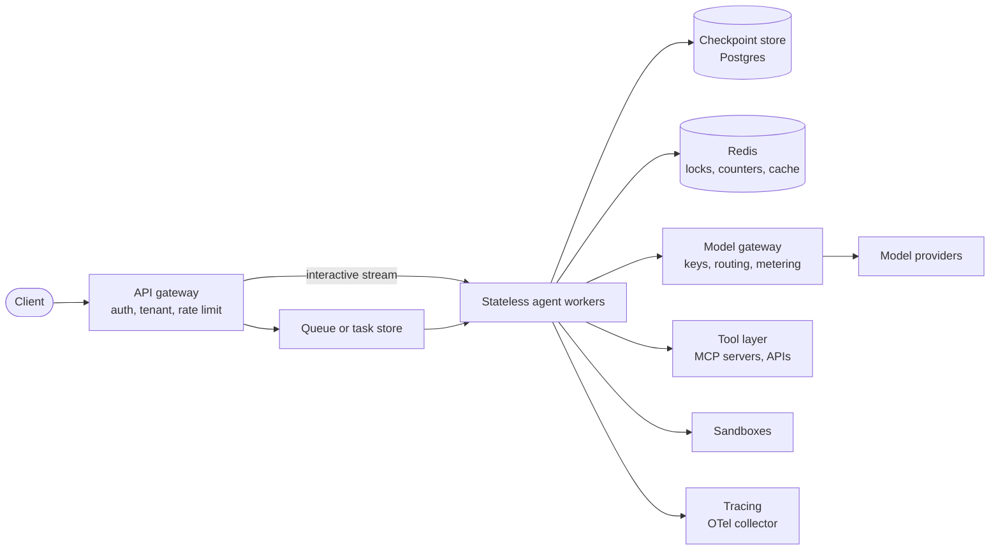
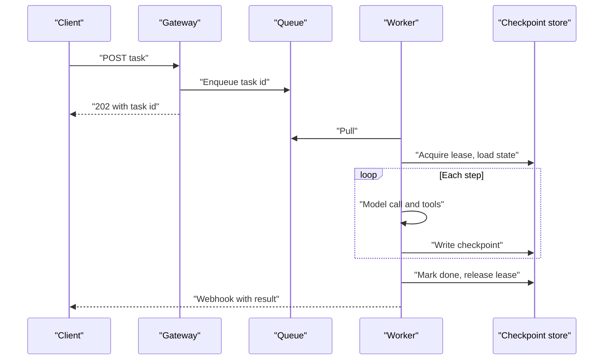
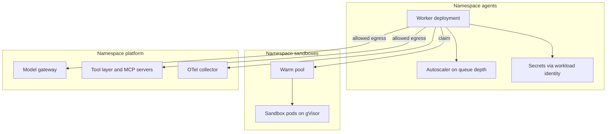
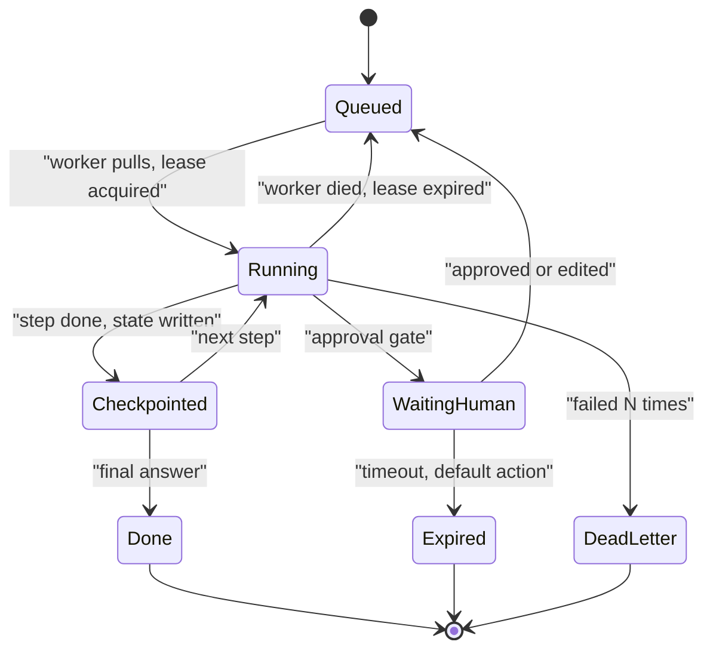
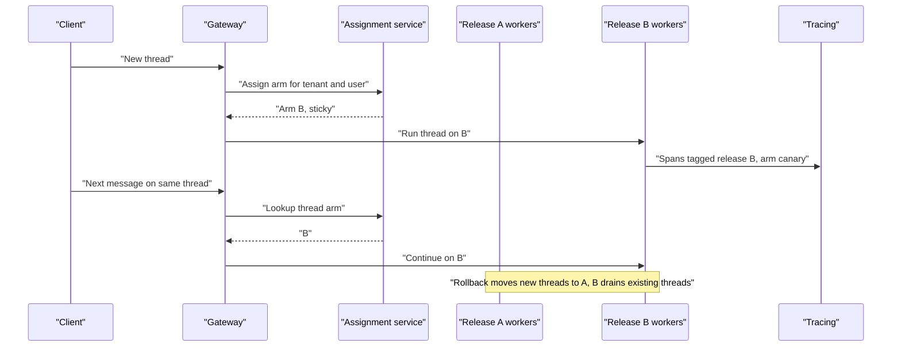
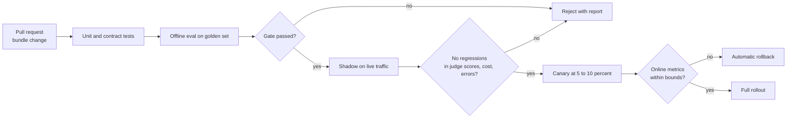
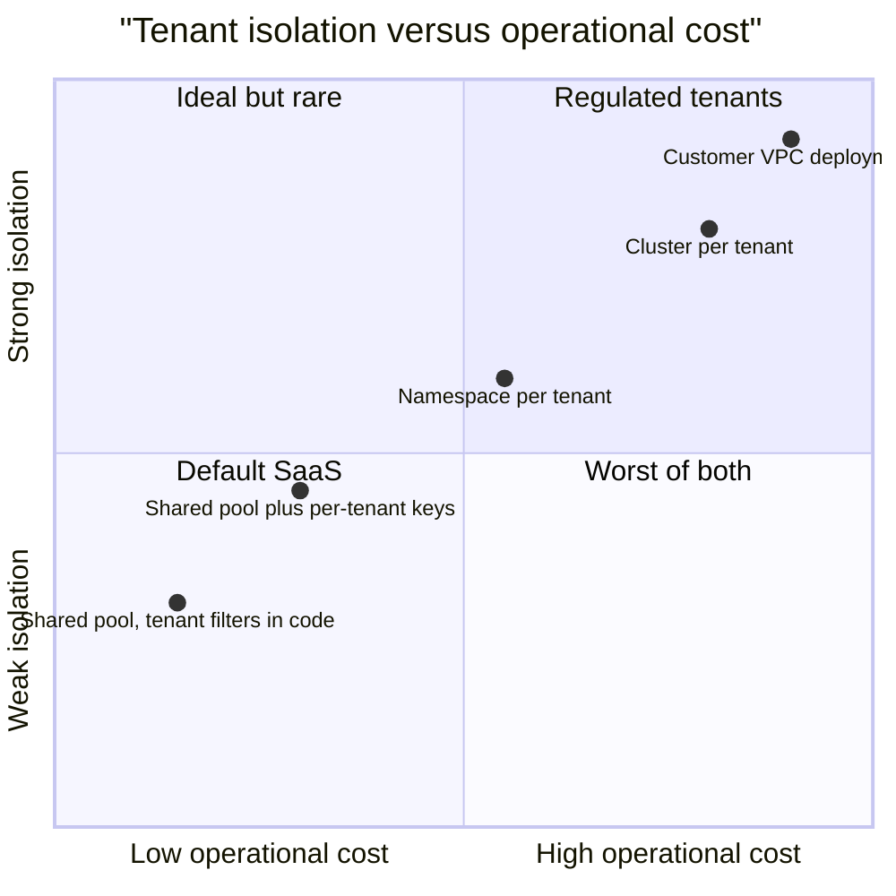

# Chapter 32: Scaling, Deployment, and Versioning

> **What this chapter covers**: How to run agents as a service. Stateless workers with external state, queues, concurrency limits, and capacity sizing with Little's law. Multi-tenancy: tenant-scoped tools, memory, and keys. Deployment targets: containers, Kubernetes, serverless, and managed agent runtimes (Amazon Bedrock AgentCore, Google's Agent Engine, now Agent Runtime, and Claude Managed Agents). Versioning prompts, tools, models, and harness code together as one release unit; prompt registries; config as code; eval-gated promotion; canary and shadow deployments with the statistics to read them.
>
> **Prerequisites**: Chapters 05, 10, 13, 26, 28, 31.
>
> **Where it is used**: Any agent past the prototype stage. Chapter 33 builds audit and residency on the deployment topology here. Chapter 35 uses the deployment options for customer VPC and on-prem delivery. Chapter 36's capstones deploy with these patterns.

---

## 32.1 Level 1: Foundations

### 32.1.1 What is different about serving agents

A web API request lasts milliseconds and holds no state between requests. An LLM completion lasts seconds. An agent task lasts seconds to hours, makes many external calls, may pause for a human for a day, and accumulates state (messages, tool results, scratch files, memory writes) as it goes. Four consequences shape everything in this chapter:

1. **Long-lived work.** A task can outlive the process running it. Deploys, autoscaling, spot interruptions, and crashes will kill workers mid-task. State must survive the worker.
2. **I/O-bound concurrency.** A worker spends most of its time waiting on model APIs and tools. CPU is rarely the constraint; concurrent in-flight tasks, memory per task, and upstream rate limits are.
3. **Behavior lives in config.** A prompt edit or a tool description change alters behavior as much as a code change. It must be versioned, reviewed, tested, and rolled out like code.
4. **Tenant boundaries run through the context window.** Anything placed in the context can leak into output. Multi-tenancy is not only a database concern; it covers tools, memory, caches, keys, and traces.

### 32.1.2 The canonical architecture



Every box is replaceable, but the shape recurs across frameworks and clouds. Workers hold no durable state. The checkpoint store holds the conversation and graph state, keyed by thread. Redis holds short-lived coordination (locks so two workers do not run the same thread, budget counters from Chapter 31). The model gateway centralizes provider keys, fallbacks, and metering. The tool layer enforces tenant scoping. Tracing sees everything.

### 32.1.3 Vocabulary

| Term | Meaning |
|---|---|
| Stateless worker | A process that can be killed at any step without losing task state, because state is checkpointed externally. |
| Thread or session ID | The key that identifies one conversation or task's durable state. |
| Checkpoint | A persisted snapshot of agent state after a step, from which execution can resume. |
| Concurrency limit | The maximum number of in-flight tasks per worker, tenant, or upstream. |
| Release bundle | The versioned combination of harness code, prompts, tool definitions, model IDs, and parameters that defines behavior. |
| Prompt registry | A store for versioned prompts with labels such as production and staging. |
| Eval-gated promotion | A release moves to the next environment only if it passes an offline eval gate. |
| Canary | A small share of live traffic sent to the new release, compared against the old. |
| Shadow | The new release runs on copies of live traffic, but its outputs are not shown to users. |

### 32.1.4 Why "agent version" is not a git SHA

A git SHA identifies harness code. It does not identify the behavior, because behavior depends on the prompt text (maybe in a registry, edited by a product manager), the tool descriptions (maybe served by a remote MCP server owned by another team), the model ID (and whether it is a pinned snapshot or a moving alias), and parameters such as effort or temperature. An agent's version is the tuple of all of these. Section 32.3.5 turns that into a manifest.

### 32.1.5 From prototype to production, in stages

| Stage | State | Deployment | Versioning | Typical trigger to move on |
|---|---|---|---|---|
| Notebook or script | In memory | Laptop | None | A stakeholder wants to try it |
| Demo service | In-memory checkpointer | One container | Git SHA | First real users, first lost session |
| Pilot | Durable checkpointer, single tenant | Container service, one region | Git plus prompt file | Second tenant, first security review |
| Production | Durable, multi-tenant, leases | Autoscaled fleet, gateway, queue | Release bundle, eval gate | First incident caused by a prompt change |
| Platform | Shared harness, many agents | Kubernetes or managed runtime, multi-region | Bundles per agent, shared registry, canaries | Several teams shipping agents |

Most FDE engagements start at the demo or pilot stage and must reach production within weeks. The stage tells you which parts of this chapter to build first: durable state and tenant scoping before canaries, the release bundle before multi-region.

## 32.2 Level 2: Working knowledge

### 32.2.1 Stateless workers plus external state

The rule: after every step, the state needed to resume is somewhere other than the worker's memory. Frameworks give you this directly: LangGraph checkpointers (Postgres, Redis, and others, Chapter 10), Temporal and other durable execution engines that replay workflow history (Chapter 13), and managed runtimes that store session state server-side. If you build your own harness, the minimum is a `threads` table and a `steps` table written transactionally at the end of each step.

What goes where:

| State | Store | Why |
|---|---|---|
| Messages and graph state | Postgres (checkpointer) | Durable, queryable, transactional |
| Large tool outputs, files | Object storage, referenced by URI | Keeps checkpoints small |
| Long-term memory | Vector or graph store, tenant-partitioned (Chapter 08) | Different access pattern |
| Locks, budget counters, rate buckets | Redis | Fast atomic operations, short TTLs |
| Sandbox filesystem | Sandbox provider snapshot or volume | Restorable per session |
| Traces | Observability backend | Append-only, retention policy |

**Single-writer per thread.** Two workers resuming the same thread will fork its history. Take a lease (a Redis lock with a TTL, or a row lock in Postgres) before running a step, renew it during long steps, and release it after the checkpoint write. If a worker dies, the lease expires and another worker resumes from the last checkpoint.

**Idempotent steps.** Resumption can repeat the step that was running when the worker died. Model calls are safe to repeat (you pay twice). Side-effecting tool calls are not; they need idempotency keys (Chapter 31).

### 32.2.2 Interactive and background paths

Agents usually need two entry paths.

- **Interactive.** The client opens a stream (SSE or WebSocket), the gateway routes it to a worker, and the worker streams events back while checkpointing. If the worker dies, the client reconnects with the thread ID and a last-event ID, and a new worker resumes and replays missed events from the store.
- **Background.** The client submits a task and gets a task ID. The task goes on a queue (SQS, Pub/Sub, Redis streams, a Postgres queue table, or a durable execution engine). Workers pull, run to completion or to a human gate, and write results. The client polls or receives a webhook.

MCP added a Tasks mechanism for long-running tool calls in its 2025-11-25 specification revision, and the 2026-07-28 revision moved Tasks into an extension (Chapter 16). It solves the same problem at the tool layer: return a handle now, deliver the result later.



### 32.2.3 Concurrency and capacity with Little's law

Little's law: the average number of items in a system equals arrival rate times average time in the system, L = lambda W. For agents, apply it at three layers.

Using the Northwind numbers from Chapter 31 (200,000 tasks a month, 8 model calls per task, bursts of 1 task per second):

- **Tasks in flight.** Average arrival rate is 200,000 / (30 times 86,400) = 0.077 tasks per second. With a mean task duration of 40 s, L = 3.1 tasks in flight on average. At the 1 per second burst, L = 40.
- **Model calls in flight.** At the burst: 8 calls per task, so 8 calls per second. With a mean model call of 3 s, 24 concurrent model calls.
- **Tool calls in flight.** If each task makes 6 tool calls of 0.6 s mean, 6 per second times 0.6 = 3.6 concurrent tool calls. Small, but a single slow tool at 10 s would raise that to 60 and exhaust its connection pool.

Sizing workers: an async Python worker can hold hundreds of waiting tasks; the constraint is memory per task. At 30 MB per in-flight task (message state, MCP client sessions, parsed tool results), 40 tasks need 1.2 GB. Two workers with 2 GB each, plus one for failure headroom, cover the burst. Coding agents with a sandbox per task are different: 40 concurrent sandboxes at 1 vCPU and 2 GB each is 40 vCPU and 80 GB, and that dominates infrastructure cost.

Session duration is not task duration. A chat session with human think time may be open for 20 minutes while the agent is active for 40 seconds of it. Do not hold a worker slot during think time; checkpoint and release.

### 32.2.4 Concurrency limits at every layer

| Layer | Limit | Why |
|---|---|---|
| Per worker | Max in-flight tasks | Memory and event loop fairness |
| Per tenant | Max concurrent tasks, requests per minute | Noisy neighbor protection |
| Per user | Max concurrent sessions | Abuse, runaway clients |
| Per model | Token bucket under provider ITPM, OTPM, RPM | Avoid fleet-wide 429s (Chapter 31) |
| Per tool or MCP server | Semaphore sized to the downstream's capacity | Protect legacy systems from agent bursts |
| Per sandbox pool | Max sandboxes | Cost and quota |

In code, the limits are a handful of semaphores and a token bucket keyed by scope. A minimal sketch in an asyncio worker:

```python
class Limits:
    def __init__(self, cfg):
        self.worker = asyncio.Semaphore(cfg.max_inflight_per_worker)   # e.g. 20
        self.tools = {name: asyncio.Semaphore(n) for name, n in cfg.tool_limits.items()}
        self.tenant = RedisConcurrency(cfg.redis, prefix="tenant", default=cfg.tenant_max)

    @asynccontextmanager
    async def task(self, tenant_id):
        async with self.worker:
            if not await self.tenant.acquire(tenant_id, ttl_s=300):
                raise TenantBusy(tenant_id)            # 429 to the client, not a queue pile-up
            try:
                yield
            finally:
                await self.tenant.release(tenant_id)

    @asynccontextmanager
    async def tool(self, name):
        async with self.tools.get(name, NULL_SEM):
            yield
```

The tenant limit is distributed (Redis) because tasks from one tenant land on many workers; the worker and tool limits are local. The TTL on the tenant slot prevents a crashed worker from leaking slots forever.

The per-tool limit is the one teams forget. A human support team of 50 people might make 2 lookups per minute each against a legacy order system. An agent fleet at the burst makes 6 per second, 360 per minute, more than three times the human peak. Legacy systems fall over under agent traffic. Talk to the system owner, set a semaphore, and add a cache in front.

### 32.2.5 Multi-tenancy: what has to be scoped

Everything that can carry data between tenants must be keyed by tenant.

| Resource | Scoping mechanism | Failure if missed |
|---|---|---|
| Tool credentials | Per-tenant OAuth tokens or keys from a vault, injected by the tool layer, never visible to the model | Agent for tenant A acts in tenant B's system |
| Tool results | Tool layer filters by tenant before returning | Cross-tenant data in context |
| Long-term memory | Namespace per tenant and user, enforced in the store query | Memory recall of another tenant's facts |
| Retrieval indexes | Separate index or mandatory tenant filter | Retrieved passages from another tenant |
| Checkpoints | Thread IDs bound to tenant, verified on load | Session hijack by guessing an ID |
| Prompt caches | Provider caches are organization-scoped; your own semantic caches must key on tenant | Cached answer from another tenant |
| Model keys | Per-tenant keys or workspaces where contracts require separate billing or residency | Mixed billing, residency violations |
| Traces | Tenant attribute plus access control in the backend | Support engineer reads another tenant's data |

The key design principle: **the model never chooses the tenant.** Tenant identity comes from the authenticated request, flows through the harness as context, and is applied by tool and store code. A tool signature like `get_orders(customer_id)` where the model supplies an ID is an invitation to a confused deputy; the tool should resolve the caller's tenant and user from the session and check authorization on every call (Chapter 29).

### 32.2.6 Tenant-scoped keys in practice

Keys come in three kinds, and each has its own scoping pattern.

| Key | Who holds it | Pattern |
|---|---|---|
| Model provider key | Platform, or the tenant (bring your own key) | Gateway maps tenant to key or provider workspace; BYOK tenants' keys stored encrypted in a vault, never in worker memory longer than a call |
| Tool credentials for the tenant's systems | Tenant, granted through OAuth or service accounts | Per-tenant, per-user tokens in a vault; the tool layer exchanges session identity for the right token at call time |
| Platform service credentials | Platform | Workload identity per service; no long-lived secrets in environment variables |

Bring your own key is common in B2B deals because it moves token spend to the customer's own provider contract and satisfies procurement rules. It has operational costs: each BYOK tenant has its own rate limits and spend caps, so a tenant hitting its own provider cap looks like your outage. Surface provider errors per tenant, and make the error message say whose limit was hit.

Provider-side separation helps where it exists. Anthropic workspaces, for example, carry their own spend and rate limits within an organization (per its rate-limit documentation, September 2026), which gives a cheap per-tenant or per-environment boundary: production, evals, and each large tenant in separate workspaces, so an eval job cannot consume production's rate limit.

### 32.2.7 Containerizing an agent

A container for an agent worker looks like any Python service, with a few agent-specific concerns:

- Pin everything: base image digest, lockfile-installed dependencies, and the release bundle version as an environment variable or baked-in manifest.
- No provider keys in the image. Mount from a secret store at runtime, ideally through workload identity so the pod exchanges its identity for short-lived credentials.
- Graceful shutdown. On SIGTERM, stop pulling new tasks, finish or checkpoint the current step, release leases, then exit. Set the orchestrator's termination grace period longer than your longest step (a long model decode can exceed 60 seconds).
- Health checks that mean something: readiness should fail if the worker cannot reach the checkpoint store or the model gateway.
- Separate containers for untrusted code execution. The agent worker must not run model-generated code in its own process (Chapter 24).

### 32.2.8 Deployment targets compared

| Target | Good for | Limits | State |
|---|---|---|---|
| Containers on a VM or ECS or Cloud Run | Small to medium fleets, interactive agents | Request timeouts on some serverless container platforms; check the maximum for your platform | External |
| Kubernetes | Large fleets, many agents, customer VPC and on-prem | Operational cost, needs a platform team | External |
| Serverless functions (Lambda, Cloud Functions) | Short event-driven steps, one step per invocation | Hard execution time limits (Lambda caps at 15 minutes), cold starts, no long streams | External, mandatory |
| Durable execution (Temporal, Restate, Inngest, cloud workflow services) | Long-running and human-gated tasks | Determinism constraints on workflow code (Chapter 13) | Engine history |
| Amazon Bedrock AgentCore Runtime | AWS shops, framework-agnostic agents, session isolation | AWS-specific; microVM sessions capped at 8 hours; runtime instances for longer sessions announced August 2026 | Managed plus your stores |
| Google Agent Runtime (formerly Vertex AI Agent Engine) | Google Cloud shops, ADK and LangGraph agents | Google Cloud specific | Managed sessions and memory bank |
| Claude Managed Agents | Claude-based agents that want a managed harness and sandbox | Public beta since April 2026; Claude models only | Server-side sessions |

Dates and limits in this table were checked in September 2026 against vendor announcements: AgentCore became generally available on 13 October 2025 with 8-hour runtime sessions; Google renamed Vertex AI to Gemini Enterprise Agent Platform at Cloud Next in April 2026, with Agent Engine becoming Agent Runtime; Anthropic opened Claude Managed Agents as a public beta on 8 April 2026, billed at model token rates plus 0.08 dollars per running session-hour per its pricing page. All three move fast; check the current docs.

### 32.2.9 The model gateway

Workers should not call providers directly with raw keys. A model gateway (LiteLLM, Portkey, a cloud AI gateway, or a thin internal service) sits between workers and providers and centralizes:

- **Keys and identity.** Workers authenticate to the gateway with workload identity; only the gateway holds provider keys, per tenant where contracts require it.
- **Routing and fallback.** Model aliases (`support-primary`) resolve to concrete model IDs per release, with fallback chains and circuit breakers (Chapter 31).
- **Metering.** Every response's usage is converted to dollars and tagged with tenant, route, and release, feeding the budget counters and the cost attribution in Chapter 33.
- **Rate shaping.** The token buckets under provider limits live here, so fairness across workers and tenants is enforced in one place.
- **Policy.** Region pinning for residency (for example Anthropic's `inference_geo` parameter or a regional cloud endpoint), logging and redaction rules.

The gateway is on the critical path of every model call, so it must be horizontally scaled, stateless apart from Redis counters, and fast (single-digit milliseconds of overhead). A gateway that adds 50 ms per call adds 400 ms to an 8-call task.

Beware one subtle cost of gateways: some rewrite requests (reordering fields, injecting metadata into the system prompt), which can break the provider-side prompt cache prefix. Verify cache hit ratio before and after introducing a gateway.

### 32.2.10 Worked example: deploying Northwind's support agent

Putting Level 2 together for the Chapter 31 workload (200,000 tasks a month, bursts to 1 task per second):

| Component | Choice | Sizing | Monthly estimate (USD) |
|---|---|---|---|
| Workers | Containers on a managed Kubernetes cluster, 3 pods of 1 vCPU and 2 GB, autoscaled to 6 on queue depth | 40 in-flight tasks at burst | 150 to 250 |
| Checkpoint store | Managed Postgres, 2 vCPU, 8 GB, high availability | 200,000 threads a month, 30-day retention | 300 to 400 |
| Redis | Managed, small, replicated | Locks, counters, buckets | 100 |
| Model gateway | 2 pods, shared with workers' node pool | 8 calls per second at burst | Included above |
| Queue | Managed queue service | Background tasks only | Under 20 |
| Tracing | Self-hosted Langfuse or a SaaS tier | 1.6 million spans a month | 200 to 500 |
| Object storage | Large tool outputs | Tens of GB | Under 20 |
| Total infrastructure | | | About 800 to 1,300 |

This lands under the 1,500 dollars assumed in Chapter 31's cost model and is about 5 to 7 percent of total spend. Infrastructure is not where agent money goes; tokens and failures are. The exception is sandboxed agents, where per-session compute can rival token spend.

### 32.2.11 Scheduled and event-triggered agents

Not every agent starts from a user message. Many back-office agents run on a schedule (reconcile yesterday's invoices at 02:00) or on an event (a new support email, a webhook from a CRM). Deployment consequences:

- **Triggers go through the same queue** as background tasks, so limits, leases, and dead-lettering apply unchanged.
- **Thundering herds.** A schedule that fires one task per tenant at 02:00 sends every tenant's work at once. Jitter the start times over a window, and apply per-tenant concurrency.
- **Deduplication.** Webhooks are retried by their senders. Key the task on the event ID so a redelivered webhook does not create a second task.
- **No human watching.** Scheduled agents need stricter caps and alerting, because no user will notice a loop at 02:00. Their outputs usually go to a review queue first (Chapter 23).
- **Batch pricing.** If the scheduled work is single-shot per item (classify, extract, summarize), it may fit a batch API at half price (Chapter 31). If it is a multi-turn agent loop, it does not.

## 32.3 Level 3: Depth

### 32.3.1 Kubernetes for agents

What Kubernetes gives you is standard: deployments, horizontal pod autoscaling, secrets, network policies, namespaces. What agents need on top:

- **Autoscale on the right signal.** CPU is the wrong metric for I/O-bound workers. Scale on queue depth plus in-flight tasks per pod, using KEDA or a custom metrics adapter. Target in-flight tasks at 60 to 70 percent of the per-pod limit.
- **Long termination grace.** `terminationGracePeriodSeconds` longer than the longest step, plus a preStop hook that stops task intake.
- **Pod disruption budgets** so node upgrades do not evict every worker at once.
- **Network policies for egress.** Workers may call the model gateway, the tool layer, and the checkpoint store; nothing else. Sandboxes get stricter policies (Chapter 24).
- **Sandboxes as a separate workload class.** The Kubernetes SIG Apps project agent-sandbox (introduced on the Kubernetes blog in March 2026) defines Sandbox, SandboxTemplate, SandboxClaim, and warm pool resources that run isolated, stateful, singleton pods on gVisor or Kata runtimes. It is young; check its API version before depending on it.
- **Namespaces per tenant** only when contracts require hard isolation; otherwise tenant scoping in code is cheaper and easier to operate. Dedicated node pools or clusters are the next step up.



### 32.3.2 Serverless: where it fits and where it breaks

Serverless functions fit agents if each invocation is one step: load state, run one model call and its tool calls, checkpoint, and enqueue the next step. That turns a long task into a chain of short invocations, which survives function time limits and scales to zero. It breaks when:

- A single model decode or tool call exceeds the function limit.
- The client needs a single long-lived stream from one process.
- Cold starts add seconds to interactive turns. Provisioned concurrency fixes this at a cost.
- Per-invocation connection setup (MCP sessions, database connections) is not pooled; use an external pool or proxy.

Managed agent runtimes are, in effect, serverless for agents with the long-session problem solved by the vendor: session-scoped microVMs or containers that persist for hours and bill for active time.

### 32.3.3 Managed runtimes: what you get and what you give up

| Concern | Self-hosted (K8s plus framework) | Managed runtime |
|---|---|---|
| Time to production | Weeks | Days |
| Session isolation | You build it (sandboxes, per-session pods) | Built in (microVM or container per session) |
| Identity and credential vault | You integrate a vault and OAuth | Often built in (for example AgentCore Identity) |
| Observability | You wire OTel | Built in, usually OTel-compatible export |
| Framework choice | Any | Varies: AgentCore and Agent Runtime host several frameworks; Claude Managed Agents uses Anthropic's harness |
| Model choice | Any | Varies by vendor |
| Data residency and VPC | Wherever you deploy | Vendor regions, VPC connectivity options |
| Portability | High | Low to medium |
| Cost model | Infrastructure plus tokens | Runtime fees plus tokens |

The honest trade: managed runtimes remove undifferentiated work (isolation, session storage, scaling) and add lock-in and limits you do not control. For an FDE, the customer's cloud usually decides: an AWS customer with a security team that trusts IAM will adopt AgentCore faster than a self-hosted cluster; an on-prem bank cannot use any of them.

Cost comparison, worked. A coding agent session runs 1 hour with 50,000 input and 15,000 output tokens on Claude Opus 5. Anthropic's pricing page (September 2026) works the Managed Agents example: 0.25 dollars input plus 0.375 output plus 0.08 runtime equals 0.705 dollars, or 0.525 with 40,000 of the input cached. Runtime is 11 to 15 percent of the bill. Self-hosting saves at most that 0.08, minus the sandbox you would pay for anyway. The decision is about control and portability, not the runtime fee.

### 32.3.4 Versioning: the release bundle

A release bundle pins every behavior-determining input:

```yaml
# agent-release.yaml, one file per release, reviewed like code
agent: support-agent
release: 2026.09.24-3
harness:
  image: registry.example.com/support-agent@sha256:9f1c...
  git_sha: 4be21a7
model:
  primary: claude-sonnet-5          # pin a dated snapshot where the vendor offers one
  fallback: claude-haiku-4-5
  params: {max_tokens: 1024, effort: medium}
prompts:
  system: {registry: langfuse, name: support-system, version: 41}
  router: {registry: langfuse, name: support-router, version: 12}
tools:
  - {server: orders-mcp, version: 3.2.0, manifest_sha256: 7ac0...}
  - {server: kb-search, version: 1.8.1, manifest_sha256: 02de...}
policies: {max_turns: 25, max_usd: 0.60, approval_tiers: v4}
eval:
  golden_set: support-golden@v17
  gate: {task_success_min_ci_low: 0.85, cost_p99_max_usd: 0.30}
```

The values are illustrative (synthetic registry, hashes truncated). The point is the shape: code by digest, prompts by registry version, tools by version and manifest hash, model by ID, policies and eval gate inline. A release is immutable; changing any field is a new release. Rollback means redeploying the previous bundle, which restores all fields together.

Model IDs deserve care. Vendors publish aliases that move to new snapshots and dated IDs that do not. Pin dated IDs in production where the vendor offers them, and treat a model migration as a release with a full eval, because tokenizers, tool-calling behavior, and default verbosity change between versions (Chapter 31 noted the roughly 30 percent token count change on newer Claude models).

### 32.3.5 Prompt registries

A prompt registry stores prompt templates with versions and labels, and lets the harness fetch "the version labelled production" at runtime. Langfuse, LangSmith, MLflow, Braintrust, and PromptLayer offer this, and many teams keep prompts in git instead.

| Approach | Strength | Weakness |
|---|---|---|
| Prompts in git, bundled with code | One review process, atomic with code, reproducible | Non-engineers edit through PRs |
| Registry with labels fetched at runtime | Fast iteration, non-engineer editing, links to traces | A label move changes production behavior without a deploy |
| Registry, but pinned by version in the release bundle | Iteration in the registry, promotion through the bundle | Two places to look |

The third row is the senior default. Authors iterate in the registry and link versions to traces and eval runs. Production pins a version number in the release bundle. Moving to a new prompt version is a bundle change that goes through the eval gate. A runtime fetch of "latest production label" is acceptable only if the label move itself is gated by the same eval, and the fetched version is logged on every trace.

### 32.3.6 Tools are versioned by someone else

Remote MCP servers and shared tool services change on their owners' schedules. A tool description edit changes model behavior. A changed tool list can be a rug pull (Chapter 29). Defenses:

- Pin server versions and hash the tool manifest (names, descriptions, schemas) at release time. At session start, compare the live manifest hash with the pinned one; on mismatch, fail closed or alert, depending on the tool's risk tier.
- Contract tests in CI against each tool server (Chapter 27).
- For internal tools, the tool team publishes versions with changelogs, and the agent team upgrades deliberately.

### 32.3.7 Config as code

Everything in the release bundle, plus infrastructure (Terraform or equivalent), lives in version control, and CI renders and validates it: schema checks on the bundle, a dry-run that resolves every registry reference and manifest hash, and the eval gate. The benefit is not tidiness. It is that an incident review can answer "what exactly was running at 14:03" from the repository and the deploy log, which Chapter 33 turns into an audit requirement.

### 32.3.8 Queue semantics that bite agents

Most queues deliver at least once. A message is invisible for a visibility timeout after a worker pulls it; if the worker does not acknowledge in time, the message reappears and another worker takes it. For a 40-second task with a 30-second visibility timeout, every task runs twice. Rules:

- Set the visibility timeout above the p99 step duration, and extend it (heartbeat) during long steps.
- Acknowledge after the checkpoint write, not before, or a crash loses the task.
- Make the task handler idempotent: check the thread's state on pull; if it is done, acknowledge and skip.
- Route messages that fail N times to a dead-letter queue, and alert on its depth. A poison task (one that crashes the worker every time, for example a 3 MB tool result that overflows the context) will otherwise loop forever and burn tokens on each attempt.
- Enqueue one message per step, not per task, when steps are long; this makes each message short-lived and limits what a crash repeats.



A waiting-for-human task holds no worker. It is a row with a status and an expiry. When the human acts, the approval service enqueues the resume. This is how an agent can wait a day for an approval without consuming anything but a database row.

### 32.3.9 Sandboxes, cold starts, and warm pools

Sandboxed agents (coding, data analysis, computer use) add a per-session compute resource with its own start latency. Rough orders of magnitude, from vendor claims that you should re-measure: Firecracker microVMs are designed to boot in about 125 ms (Firecracker project documentation), while pulling a large container image on a cold node can take tens of seconds. The practical fix is a warm pool: keep N pre-started sandboxes and hand them out on claim.

Sizing the pool is Little's law again. If sandboxed sessions arrive at 0.2 per second at peak and a replacement sandbox takes 20 seconds to start, the pool needs at least 0.2 times 20 = 4 idle sandboxes to absorb arrivals while replacements boot, plus a safety margin for bursts. Each idle sandbox costs money, so scale the pool by time of day.

Session affinity matters too: a coding agent's sandbox holds the cloned repository and installed dependencies. Losing it on a worker restart forces a rebuild. Persist the sandbox (snapshot or volume) keyed by thread ID, or let a managed runtime handle it.

### 32.3.10 Checkpoint storage sizing

Checkpointers that write full state after every step store the history many times. Estimate it. At Northwind, the final context is 6,000 + 7 times 1,500 = 16,500 tokens, roughly 66 KB of text at about 4 bytes per token. If each of 8 steps writes a full snapshot, the average snapshot is about half the final size, so 8 times 33 KB is about 264 KB per thread, plus metadata. At 200,000 threads a month that is about 53 GB a month; with 30-day retention the table holds about 53 GB, with 1-year retention about 630 GB. Options: store deltas (some checkpointers write only changed channels), keep large tool outputs in object storage by reference, and prune intermediate checkpoints after a thread completes, keeping only the final state and the audit trail (Chapter 33 decides what the audit trail must retain, which may be more than you want to keep).

### 32.3.11 Observability hooks that deployment must provide

Every trace span should carry the release identifier from the bundle, the prompt versions, the model ID that actually served the call (after gateway resolution and fallback), the tenant, and the canary arm. Without these, you cannot compare releases in a canary, attribute a regression to a prompt version, or answer an auditor. OpenTelemetry resource attributes (service version, deployment environment) cover part of this; add custom attributes for the rest (Chapter 28).

### 32.3.12 What versioning discipline costs

Eval gates cost tokens, and teams skip them when they feel expensive. Price it. A 400-task golden set, 3 runs per task, at the Chapter 31 reference cost of 0.088 dollars per task on Sonnet 5: 400 times 3 times 0.088 = 105.60 dollars per gate run synchronously, 52.80 at batch rates where the harness supports batched turns. With LLM-judge scoring at roughly 5,000 input and 300 output tokens per trajectory on Haiku 4.5 (0.005 plus 0.0015 = 0.0065 dollars), judging 1,200 trajectories adds 7.80 dollars. So a full gate costs roughly 60 to 115 dollars. At 20 releases a month that is 1,200 to 2,300 dollars, consistent with the nightly-eval line in Chapter 31's cost model. Compare it with one bad prompt release that drops success 4 points for a day at Northwind: 267 extra failed tasks times 4.00 dollars of human handling is 1,067 dollars, before reputational cost. The gate pays for itself if it catches one regression in about two months.

Cheaper gates for small changes: a smoke subset of 50 tasks for typo-level prompt edits, the full gate for model, tool, or policy changes. Decide the tiering in advance and write it in the repository, or every change will be declared typo-level.

### 32.3.13 Canary routing, traced



## 32.4 Level 4: Mastery

### 32.4.1 The promotion pipeline



Each gate answers a different question. The offline eval asks whether the release is better on known tasks. Shadow asks whether it behaves sanely on real traffic distribution without user exposure. Canary asks whether users, with real consequences, do at least as well.

### 32.4.2 The offline gate, done properly

A gate that says "success rate went from 0.87 to 0.88" is noise at typical golden-set sizes. The gate should be a paired comparison on the same items with a bootstrap interval on the difference (Chapter 26).

Worked example. Golden set of 400 tasks, each run 3 times per release to average model noise. Old release: 87.0 percent. New: 88.5 percent. Paired bootstrap over tasks gives a 95 percent interval on the difference of, say, minus 0.8 to plus 3.8 points. The interval includes zero, so the gate should say "not worse" rather than "better". A sensible gate rule has two parts: the lower bound of the difference must be above a non-inferiority margin (for example minus 2 points), and hard constraints must hold (cost p99, policy violations equal to zero on the safety subset). This release passes on non-inferiority. Claiming it improves success would need more tasks or more runs.

### 32.4.3 Shadow deployments for agents: the side-effect problem

Shadowing a stateless classifier is easy: copy the input, run both, compare outputs. Shadowing an agent is hard because the agent acts. A shadow agent that calls `issue_refund` has issued a refund.

Options, in increasing fidelity and cost:

1. **Read-only shadow.** The shadow runs with write tools replaced by stubs that record the intended call and return a plausible success. Good for comparing plans and tool choices. Diverges after the first write, because the stubbed world does not change.
2. **Replay shadow.** Replay recorded production trajectories (Chapter 31) up to step k, then let the shadow continue with stubs. Compares decision quality at each branch point.
3. **Sandboxed environment shadow.** Run against a staging copy of the tools with synthetic or cloned data. Highest fidelity, highest cost, and data-cloning has privacy implications.

Compare shadow and production with an LLM judge on paired trajectories plus hard metrics (tool error rate, turns, cost). Shadow doubles token spend on the shadowed share, so shadow a sample, not all traffic: at Northwind's 8.8 cents per task, shadowing 20 percent for a week costs about 0.2 times 6,667 times 7 times 0.088 = 821 dollars.

### 32.4.4 Canary: how much traffic, for how long

The canary must collect enough tasks to detect a regression you care about. For a binary online success signal (resolved without escalation, or judge pass), the per-arm sample size to detect a drop from p1 to p2 with two-sided alpha 0.05 and 80 percent power is approximately:

$$
n \approx \frac{(z_{1-\alpha/2} + z_{1-\beta})^2 \left[p_1(1-p_1) + p_2(1-p_2)\right]}{(p_1 - p_2)^2}
$$

For p1 = 0.90, p2 = 0.85: (1.96 + 0.84) squared is 7.84; the variance term is 0.09 + 0.1275 = 0.2175; the denominator is 0.0025. So n is about 682 tasks per arm. At 6,667 tasks a day, a 10 percent canary collects 667 a day and reaches 682 in about a day; a 1 percent canary needs about 10 days. Detecting a 2-point drop instead of 5 needs about 6 times as many tasks. These numbers are why small canaries catch only large regressions, and why the offline gate carries most of the statistical weight.

Canary assignment should be sticky per session or per user, not per request, so a conversation does not switch releases mid-thread. A thread started on release A should finish on A, which means both releases run side by side until old threads drain, and checkpoint schemas must be compatible across them.

### 32.4.5 Automatic rollback triggers

| Signal | Threshold example | Why it is fast |
|---|---|---|
| Error rate (5xx, tool errors) | Canary over 2 times baseline for 10 minutes | Direct, high volume |
| Cost per task p95 | Canary over 1.5 times baseline | Catches loops and cache breaks |
| Turns per task p95 | Canary over 1.5 times baseline | Leading indicator of loops |
| Escalation to human rate | Over baseline by more than the pre-computed detectable difference | Direct user impact |
| Policy violation detector | Any on high-severity policies | Zero tolerance |
| Judge score on sampled traces | Drop beyond non-inferiority margin | Slower, needs volume |

Fast signals catch mechanical breakage; slow signals catch quality regressions. Automate rollback on the fast ones, and require a human decision on the slow ones, since they are noisy.

### 32.4.6 Schema evolution for long-lived state

A thread checkpointed under release A may resume under release B days later, after a human approval. If B changed the state schema (a new field, a renamed tool, a removed node), resumption can crash or silently misbehave. Rules:

- Version the state schema and store the version with each checkpoint.
- Make changes additive; provide defaults for new fields.
- Keep tool names stable across releases, or keep a mapping for renamed tools, because the message history contains old tool-use blocks.
- For breaking changes, drain: stop assigning new threads to A, wait for A's threads to finish or expire, or migrate checkpoints with a script tested on a snapshot.
- Durable execution engines have their own versioning mechanisms for workflow code changes; use them rather than editing workflow code in place (Chapter 13).

### 32.4.7 Multi-tenant topologies



Most platforms run a hybrid: a shared pool for the long tail of tenants with scoping in code, dedicated namespaces or clusters for a few regulated tenants, and customer-VPC deployments for the ones whose security teams will not accept anything else (Chapter 35). The code must be the same across all of them; only the deployment manifest differs. If tenant isolation logic differs between topologies, the shared pool becomes the untested one.

Noisy neighbor control in the shared pool combines per-tenant concurrency limits, per-tenant token buckets carved from the org-level provider limit, and weighted fair queuing on the task queue so a tenant's bulk job waits behind other tenants' interactive traffic.

### 32.4.8 Blue-green, canary, and feature flags

| Strategy | How | Good for | Weak for |
|---|---|---|---|
| Blue-green | Two full environments, switch traffic at once | Infrastructure changes, fast rollback | Behavior changes, since everyone switches at once |
| Canary | Gradual share of traffic, sticky per thread | Behavior changes with online signals | Low-volume agents, where it cannot reach significance |
| Feature flag | Code path toggled per tenant or user | Tenant-by-tenant rollout, kill switches | Proliferating flags nobody removes |
| Tenant-by-tenant | Opt in friendly tenants first | B2B agents, FDE-led rollouts | Slow; early tenants are not representative |

B2B agent platforms often combine them: the release is deployed blue-green for infrastructure safety, enabled by flag for internal and design-partner tenants, canaried across the long tail, and rolled out last to regulated tenants whose contracts require notice of material changes. That contractual notice is a governance requirement, covered in Chapter 33.

### 32.4.9 Multi-region, disaster recovery, and provider outages

Two kinds of regional failure affect agents: your own infrastructure (a cloud region down) and the model provider (elevated errors in one region or globally).

| Failure | Mitigation | Recovery point | Recovery time |
|---|---|---|---|
| Worker pod or node | Leases expire, another worker resumes | Last checkpoint | Seconds to a minute |
| Checkpoint database primary | Managed failover to replica | Seconds of writes, depending on replication mode | Minutes |
| Your cloud region | Standby region with replicated Postgres and deployable manifests | Replication lag | Tens of minutes, rehearsed |
| Provider region | Gateway fallback to another region or cloud host of the same model | None lost | Seconds, if fallback is warm |
| Provider global | Fallback to another model or degrade (Chapter 31) | None lost | Seconds, with behavior change |

Residency constrains failover. If a tenant's data must stay in the EU, the standby region and the fallback model endpoint must also be in the EU, and a global fallback is not allowed. Encode residency in the gateway's routing policy per tenant, so an incident responder cannot accidentally route EU traffic to a US endpoint under pressure.

### 32.4.10 Deploying the same agent into customer environments

FDE work often ends with the agent running in the customer's VPC or data center (Chapter 35). The deployment architecture in this chapter survives that move if a few things hold from the start:

- The release bundle is the unit of delivery. The customer receives images by digest and a bundle file, not a git checkout.
- Prompts are resolvable offline. A runtime dependency on your SaaS prompt registry fails in an air-gapped site; export pinned versions into the bundle.
- Model access is abstracted behind the gateway, so the customer can point it at their approved endpoint (a cloud provider's private endpoint, or a self-hosted open-weight model with a different tool-calling format; Chapter 03).
- Tracing exports to the customer's observability stack via OTel, not to yours.
- The eval harness ships too, with a synthetic golden set, so the customer can run the gate after every upgrade in their own environment.

### 32.4.11 A production readiness review

Before an agent takes customer traffic, a senior engineer walks a checklist with the owning team. Each item has an owner and evidence, not a yes.

| Area | Question | Evidence |
|---|---|---|
| State | Can any worker be killed at any step without losing or duplicating work? | Chaos test log: kill during each step type |
| Idempotency | Does every write tool take an idempotency key? | Tool contract list |
| Tenancy | Is there a test per resource that fails on cross-tenant access? | CI test names |
| Limits | Are per-tool semaphores sized with the downstream owner? | Signed-off capacity numbers |
| Provider | Does the tier's rate limit and spend cap cover the burst and the month? | Console limits screenshot, dated |
| Release | Does the bundle pin image, prompts, tools, model, policies? | Bundle file, CI resolution check |
| Gate | Is there a golden set with a non-inferiority rule? | Last gate report with intervals |
| Rollout | Are canary assignment sticky and rollback automatic on fast signals? | Rollback drill record |
| Recovery | Has failover to the standby region or fallback model been rehearsed within the residency rules? | Game-day notes |
| Observability | Does every span carry release, prompt version, model served, tenant, arm? | Sample trace |

### 32.4.12 What practitioners disagree on

- **Framework platform or plain containers.** Managed platforms tied to a framework (LangGraph Platform, renamed LangSmith Deployment in October 2025) bundle checkpointing, streaming, and cron. Others argue a plain container plus Postgres is simpler and portable. The decision often follows who operates it after the FDE leaves.
- **Prompts in a registry or in git.** Covered in 32.3.5. Both work with discipline; neither works without pinning.
- **Canary or eval only.** Some teams skip canaries for agents because online signals are too slow and noisy, relying on offline gates plus shadow. Others insist real users are the only true test. The sample-size arithmetic says a canary is a smoke test for large regressions, not a quality measurement.
- **One agent per service or a shared agent platform.** A platform with a shared harness, gateway, and tool layer amortizes security and observability work. It also becomes a bottleneck and a single point of failure. Large organizations tend to converge on a platform with a thin per-agent layer.

## 32.5 Subtopic checklist

- [x] Stateless workers plus external state (32.2.1, 32.1.2)
- [x] Queues (32.2.2)
- [x] Concurrency limits (32.2.3, 32.2.4)
- [x] Multi-tenancy: tenant-scoped tools (32.2.5)
- [x] Multi-tenancy: tenant-scoped memory (32.2.5)
- [x] Multi-tenancy: tenant-scoped keys (32.2.6, 32.4.7)
- [x] Containerizing agents (32.2.7)
- [x] Kubernetes (32.3.1)
- [x] Serverless (32.2.8, 32.3.2)
- [x] AgentCore (32.2.8, 32.3.3)
- [x] Agent Engine, now Agent Runtime (32.2.8, 32.3.3)
- [x] Managed Agents (32.2.8, 32.3.3)
- [x] Versioning prompts, tools, and agents together (32.1.4, 32.3.4, 32.3.6)
- [x] Prompt registries (32.3.5)
- [x] Config as code (32.3.7)
- [x] Eval-gated promotion (32.4.1, 32.4.2)
- [x] Canary deployments (32.4.4, 32.4.5)
- [x] Shadow deployments (32.4.3)

## 32.6 Common misconceptions

1. **"Our workers are stateless because we use a framework."** Frameworks offer checkpointers; they do not force you to configure a durable one. An in-memory checkpointer in production means a deploy kills every in-flight task.
2. **"Autoscale on CPU."** Agent workers are I/O-bound and sit near idle CPU while saturated with in-flight tasks. Scale on queue depth and in-flight count.
3. **"The git SHA is the version."** Behavior depends on prompts, tool descriptions, model snapshot, and parameters. Version the whole bundle.
4. **"A registry label is a safe way to ship prompts."** Moving a label changes production without a deploy, a review, or an eval unless you gate the move. Pin versions in the bundle.
5. **"Multi-tenancy is a database problem."** Tenant data flows through tools, memory, retrieval, caches, traces, and the context window. Every one needs scoping, and the model must never choose the tenant.
6. **"Shadowing an agent is free and safe."** It doubles tokens on the shadowed share and, without stubbing write tools, performs real side effects.
7. **"A 1 percent canary for a day tells us quality held."** At Northwind volume that is about 67 tasks; it can detect only very large regressions. The offline gate does the statistical work.
8. **"Serverless cannot run agents."** It can, one step per invocation with external checkpoints. It cannot hold a single long decode or stream beyond its time limit.
9. **"Managed runtimes remove the need for evals and versioning."** They host the agent. They do not know whether your release is better.
10. **"Rollback restores the old behavior."** Only if prompts, tools, and model are pinned in the bundle and threads started on the new release can resume on the old schema.

11. **"Infrastructure is the big cost of running agents."** For conversational agents, infrastructure is usually a single-digit percentage of spend; tokens and failures dominate. Sandboxed agents are the exception.
12. **"At-least-once delivery is fine because tasks are idempotent."** Model calls are repeatable at a cost; side-effecting tools are not, and a visibility timeout shorter than the task makes every task run twice.
13. **"A gateway is transparent."** A gateway that rewrites requests can break prompt-cache prefixes and add tens of milliseconds per call, both multiplied by the number of calls per task.

## 32.7 Practice

1. **Conceptual.** Using Little's law, size workers for a tenant with 5 tasks per second at peak, 90-second mean task duration, and 50 MB memory per in-flight task. How many 4 GB pods do you need at 70 percent target utilization?
2. **Design.** List every resource in your current agent that could carry data between tenants. For each, write the scoping mechanism and a test that would catch a leak.
3. **Hands-on (laptop).** Run a LangGraph agent with the Postgres checkpointer in Docker inside WSL2. Kill the worker mid-task with `kill -9` and resume on a second worker from the same thread ID. Show that a side-effecting stub tool is not double-applied because of an idempotency key.
4. **Hands-on (laptop).** Deploy the worker to `kind` with a KEDA-style autoscaler on a Redis queue length (or a simple custom metric). Push 200 synthetic tasks and record pod count over time.
5. **Design.** Write a release bundle file for your agent: image digest, prompt versions, tool manifests with hashes, model IDs, policies, eval gate. Write the CI check that fails if any reference does not resolve.
6. **Arithmetic.** With p1 = 0.92 and p2 = 0.89, compute the per-arm canary sample size at alpha 0.05 and 80 percent power. How many days at a 10 percent canary with 3,000 tasks a day?
7. **Hands-on.** Implement a read-only shadow: route 20 percent of your test traffic to a second release whose write tools are recording stubs. Compare tool-call sequences between arms and report the first-divergence step distribution.
8. **Design.** A customer needs one tenant in a dedicated cluster in the EU and the rest in a shared US pool. Draw the topology and list what must be identical between them and what may differ.
9. **Hands-on.** Change the state schema of your LangGraph agent (add a required field). Resume a thread checkpointed under the old schema. Make it work with a default, then write the migration you would need for a breaking rename.
10. **Conceptual.** Your tool team edited a tool description on a shared MCP server, and success dropped 4 points without any agent deploy. Which controls from 32.3.6 would have caught it, and at which step?

11. **Hands-on.** Put LiteLLM in front of your laptop agent as a gateway routing to Ollama and one hosted model. Add per-tenant virtual keys and a budget per key. Measure the gateway's added latency per call.
12. **Design.** Write the queue configuration for background tasks: visibility timeout, heartbeat interval, max receives before dead-letter, and the alert on dead-letter depth. Justify each number from your trace data.
13. **Arithmetic.** Your golden set has 250 tasks run twice per release at 0.12 dollars per task, and you ship 30 releases a month. What does gating cost per month, and how many prevented regressions per month justify it if each costs 800 dollars?
14. **Design.** Plan the customer-VPC version of your agent from 32.4.10: list every runtime dependency on your own SaaS and how each is replaced.

15. **Hands-on.** Write a chaos test for your laptop deployment: a script that kills a random worker every 20 seconds while 100 tasks run. Assert that every task completes exactly once and that no write-tool stub records a duplicate key.
16. **Design.** Your scheduled agent runs for 400 tenants at 02:00. Design the jitter window and per-tenant limits so provider ITPM never exceeds 70 percent of the limit, given each run uses 30,000 uncached input tokens over 2 minutes.

## 32.8 How this is tested

<details><summary>What does "stateless worker" mean for an agent, and how do you implement it?</summary>

The worker can be killed at any step without losing the task. After each step, messages, graph state, and pointers to large artifacts are checkpointed to an external store (Postgres through a framework checkpointer, or a durable execution engine's history). A lease per thread prevents two workers from running it at once. Side-effecting tools carry idempotency keys so a resumed step does not repeat effects. Workers also shut down gracefully: stop intake, finish or checkpoint, release leases.
</details>

<details><summary>Size the fleet for 1 task per second at peak, 40 seconds per task, 8 model calls per task.</summary>

Little's law: 40 tasks in flight. Model calls arrive at 8 per second; at 3 seconds each, 24 concurrent model calls. At 30 MB per in-flight task, 1.2 GB of task memory; two pods of 2 GB plus one for headroom. Check the provider limits for 480 requests per minute and the uncached token rate, and every downstream tool's capacity for the tool call rate, which is usually the real constraint.
</details>

<details><summary>How do you make an agent multi-tenant safely?</summary>

Tenant identity comes from authentication and is carried by the harness, never chosen by the model. Tool credentials are per tenant from a vault and injected by the tool layer. Tools authorize every call against the session's tenant and user. Memory, retrieval indexes, semantic caches, checkpoints, and traces are keyed and access-controlled by tenant. Per-tenant concurrency and token buckets prevent noisy neighbors. Regulated tenants get dedicated namespaces, clusters, or VPC deployments running the same code.
</details>

<details><summary>What is in an agent release, and why is it more than the code?</summary>

Harness image digest, prompt versions, tool server versions with manifest hashes, model IDs (pinned snapshots where offered), parameters, policies such as caps and approval tiers, and the eval gate. Each of these changes behavior. A release pins them all so rollback restores behavior, and an incident review can say exactly what ran.
</details>

<details><summary>Prompts in git or in a registry?</summary>

Either, if production pins a version. A registry gives fast iteration, non-engineer editing, and trace linkage. Git gives atomic review with code. The pattern that works is iterating in the registry and promoting by bumping the pinned version in the release bundle, which goes through the eval gate. Fetching a moving "production" label at runtime is acceptable only if moving the label is itself gated and the resolved version is logged on each trace.
</details>

<details><summary>Describe eval-gated promotion for an agent.</summary>

A bundle change triggers unit and contract tests, then an offline eval on the golden set with paired comparison and a bootstrap interval on the difference. The gate requires non-inferiority (lower bound above a margin) and hard constraints (cost, safety). Passing releases run in shadow on sampled traffic, then canary with sticky assignment and automatic rollback on fast signals. Full rollout follows. Each stage answers a different question.
</details>

<details><summary>Why is shadowing an agent harder than shadowing a model?</summary>

Agents take actions. A shadow that calls real write tools performs real side effects. You stub write tools with recorders, which makes the shadow world diverge after the first write, or run against a staging environment with cloned or synthetic data. Shadow also doubles token cost on the shadowed share, so sample. Compare with paired judge scores and hard metrics.
</details>

<details><summary>How large should a canary be?</summary>

Compute it. To detect a drop from 90 to 85 percent success at alpha 0.05 and 80 percent power you need about 680 tasks per arm. At 6,700 tasks a day that is one day at 10 percent or ten days at 1 percent. A 2-point drop needs about 6 times more. Canaries catch large or mechanical regressions; offline evals carry quality decisions.
</details>

<details><summary>What breaks when a thread resumes under a new release?</summary>

State schema changes (new required fields, renamed nodes), renamed or removed tools referenced in history, changed prompts that assume different state, and different model behavior mid-conversation. Mitigate with versioned additive schemas, stable tool names, sticky release assignment per thread, draining old releases, and tested migrations for breaking changes.
</details>

<details><summary>When would you choose a managed agent runtime over Kubernetes?</summary>

When the customer is already on that cloud, trusts its IAM and network controls, wants session isolation and identity handled for them, and values time to production over portability. Kubernetes wins for multi-cloud, on-prem, air-gapped, heavy customization, or when the customer has a platform team. The runtime fee is rarely decisive; in Anthropic's own Managed Agents example it is 0.08 dollars of a 0.705-dollar session.
</details>

<details><summary>How do you autoscale agent workers?</summary>

On queue depth and in-flight tasks per pod, not CPU, targeting 60 to 70 percent of the per-pod task limit. Scale-down must respect long termination grace so in-flight steps finish or checkpoint. Add pod disruption budgets. Remember the real ceiling is often upstream: provider rate limits and downstream tool capacity, so autoscaling past them only increases 429s.
</details>

<details><summary>A remote MCP server changed a tool description and success dropped. How do you prevent this class of incident?</summary>

Pin tool server versions and hash the tool manifest at release; compare the live manifest hash at session start and fail closed or alert on mismatch. Run contract tests and a small eval against tool servers on a schedule, not only on your own deploys. Treat an upstream tool change as a release that goes through the gate. The same control defends against deliberate rug pulls.
</details>

<details><summary>How do you run agents on serverless functions?</summary>

One step per invocation: load the checkpoint, run a model call and its tools, write the checkpoint, and enqueue the next step. That survives time limits and scales to zero. Pool connections externally, use provisioned concurrency for interactive latency, and move any step that can exceed the time limit (long decodes, slow tools) to a container or a durable workflow.
</details>

<details><summary>What goes wrong with at-least-once queues for agent tasks, and how do you configure them?</summary>

If the visibility timeout is shorter than the task or step, the message reappears and a second worker runs the same task, doubling cost and possibly side effects. Set the timeout above p99 step duration and heartbeat to extend it, acknowledge only after the checkpoint write, make the handler check thread state before running, and dead-letter after N failures with an alert so poison tasks do not loop.
</details>

<details><summary>Why put a model gateway between workers and providers?</summary>

It centralizes provider keys (workers use workload identity), routing and fallback chains, metering tagged by tenant and release, token buckets under provider limits, and residency routing. The costs are an extra hop on every call and the risk of breaking cache prefixes if it rewrites requests, so keep it fast, stateless, and verified against cache hit ratio.
</details>

<details><summary>How does data residency constrain disaster recovery for agents?</summary>

The standby region, the checkpoint replicas, the tracing backend, and every fallback model endpoint for a residency-bound tenant must be inside the permitted geography. A global fallback that is fine for other tenants is a violation for them. Encode residency as per-tenant routing policy in the gateway so failover respects it automatically, and rehearse the failover.
</details>

<details><summary>How would you roll out a new model version to a B2B agent platform?</summary>

Treat it as a release: new bundle with the pinned model ID, full offline gate with paired comparison (tokenizer and verbosity changes affect cost too, so recompute cost per task), shadow on sampled traffic with stubbed writes, then flags for internal and design-partner tenants, a sticky canary across the long tail with automatic rollback on errors, cost, and turn counts, and finally regulated tenants after any contractual notice. Keep the old model available until old threads drain.
</details>

<details><summary>What changes when an agent is triggered by schedules or webhooks instead of users?</summary>

Triggers enter the same queue with the same limits and leases. Schedules need jittered start times to avoid a thundering herd across tenants. Webhook tasks are keyed on the event ID so sender retries do not duplicate work. With no human watching, caps and alerts are stricter and outputs often land in a review queue. Single-shot items may move to a batch API; multi-turn loops cannot.
</details>

## 32.9 Summary

- Agent tasks outlive processes, are I/O-bound, and carry behavior in config; the architecture follows from those three facts.
- Workers are stateless: checkpoint after every step, lease per thread, idempotency keys on side effects, graceful shutdown.
- Provide an interactive streaming path and a background queue path; both resume from the checkpoint store.
- Size with Little's law at the task, model-call, and tool-call layers. The binding constraint is usually memory per task, provider limits, or a legacy tool, not CPU.
- Limit concurrency per worker, tenant, user, model, tool, and sandbox pool. Protect legacy systems from agent bursts.
- Multi-tenancy covers tools, memory, retrieval, caches, checkpoints, keys, and traces. The model never chooses the tenant.
- Deployment targets range from containers and Kubernetes to serverless per-step execution and managed runtimes (AgentCore, Agent Runtime, Claude Managed Agents); the customer's cloud and isolation needs usually decide.
- A release is a bundle: image digest, prompt versions, tool manifests, model IDs, parameters, policies, and eval gate. Rollback restores all of them.
- Iterate in a prompt registry, promote by pinning versions in the bundle.
- Promotion runs offline eval (paired, with intervals and non-inferiority), then shadow with stubbed writes, then a sticky canary with automatic rollback on fast signals.
- Canary sample sizes are large: about 680 tasks per arm to detect a 5-point drop. Offline gates carry the statistical weight.
- Queues deliver at least once: size visibility timeouts above step duration, acknowledge after checkpointing, and dead-letter poison tasks.
- A model gateway centralizes keys, routing, metering, rate shaping, and residency, and must not break cache prefixes.
- Long-lived threads cross releases; version state schemas and keep tool names stable.

## 32.10 Further reading

- John D. C. Little, "A Proof for the Queuing Formula L = lambda W" (Operations Research, 1961). The law behind capacity sizing.
- LangGraph documentation, "Persistence" and "Checkpointers". Thread-scoped state and durable checkpoint backends.
- Temporal documentation, "Workflow versioning". Changing long-running workflow code safely.
- Amazon Bedrock AgentCore Developer Guide, Runtime and lifecycle settings. Session isolation, duration limits, and runtime instances.
- Google Cloud, "Gemini Enterprise Agent Platform name changes". The mapping from Vertex AI product names, including Agent Engine to Agent Runtime.
- Anthropic, "Claude Managed Agents overview" (platform.claude.com/docs/en/managed-agents/overview). Agents, environments, sessions, and the beta header.
- Kubernetes blog, "Running Agents on Kubernetes with Agent Sandbox" (March 2026), and the kubernetes-sigs/agent-sandbox repository. Sandbox CRDs and warm pools.
- KEDA documentation. Event-driven autoscaling on queue length.
- Langfuse documentation, "Prompt management". Versions, labels, and linking prompts to traces.
- Model Context Protocol specification, lifecycle and Tasks sections. Long-running tool calls and session behavior.
- Anthropic, "Rate limits" and "Workspaces" documentation. Per-workspace spend and rate limits as a tenant or environment boundary.
- LiteLLM documentation, proxy server. Virtual keys, budgets, routing, and fallbacks in an open-source model gateway.
- Firecracker project documentation. MicroVM design and boot-time targets behind many sandbox and managed runtime offerings.
- Kohavi, Tang, and Xu, "Trustworthy Online Controlled Experiments" (Cambridge University Press, 2020). Sample sizes, sticky assignment, and guardrail metrics for canaries.
