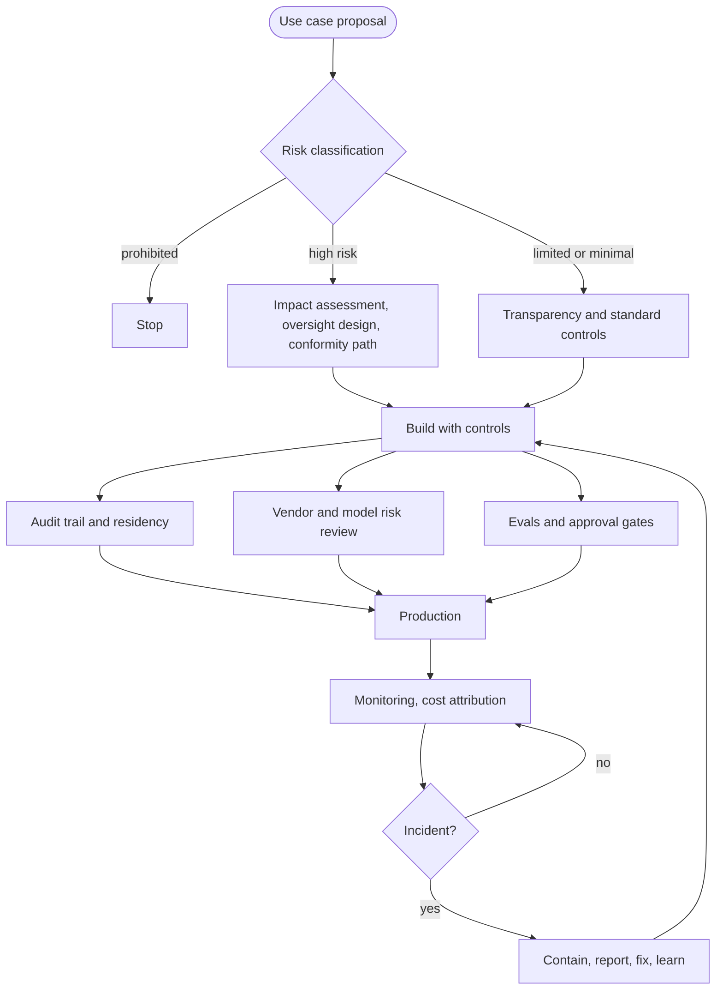
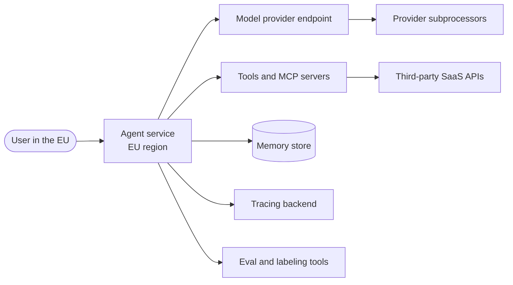
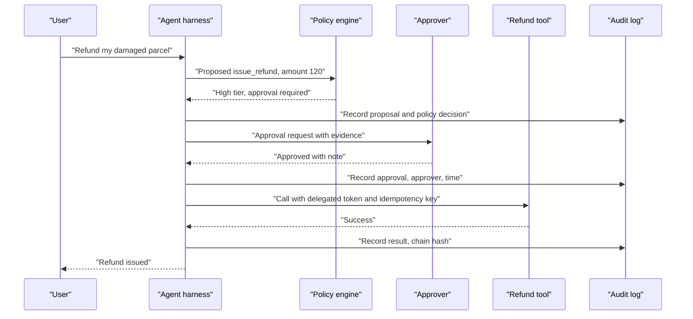
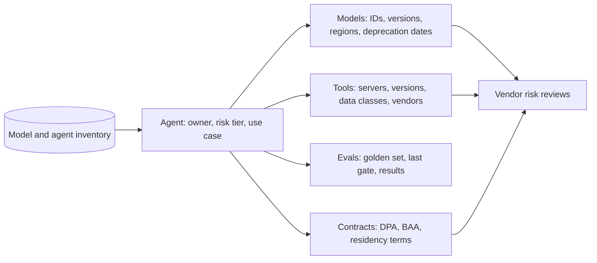
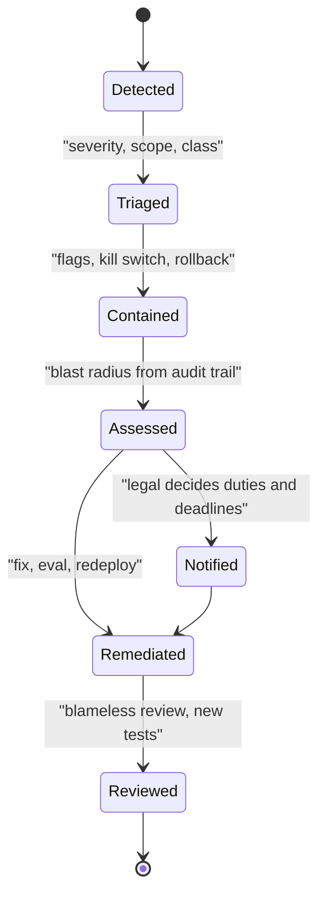
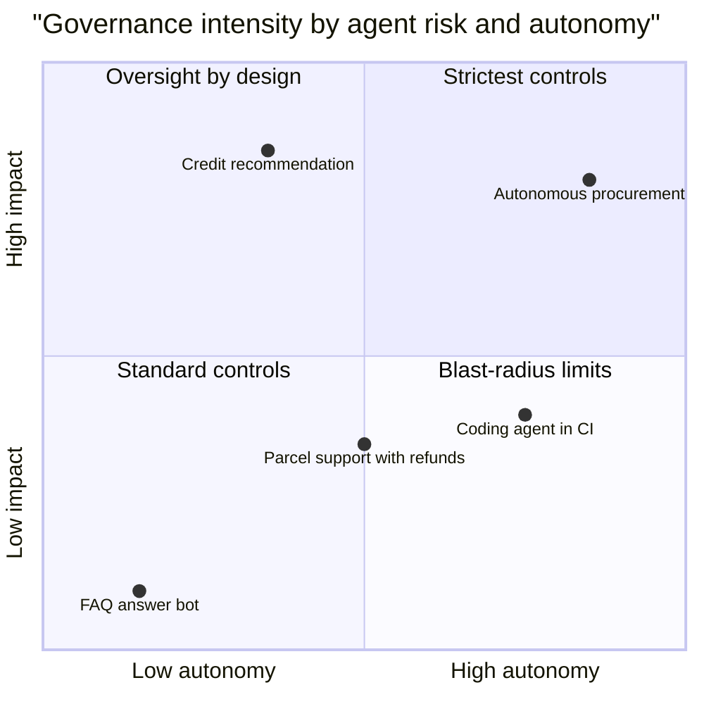
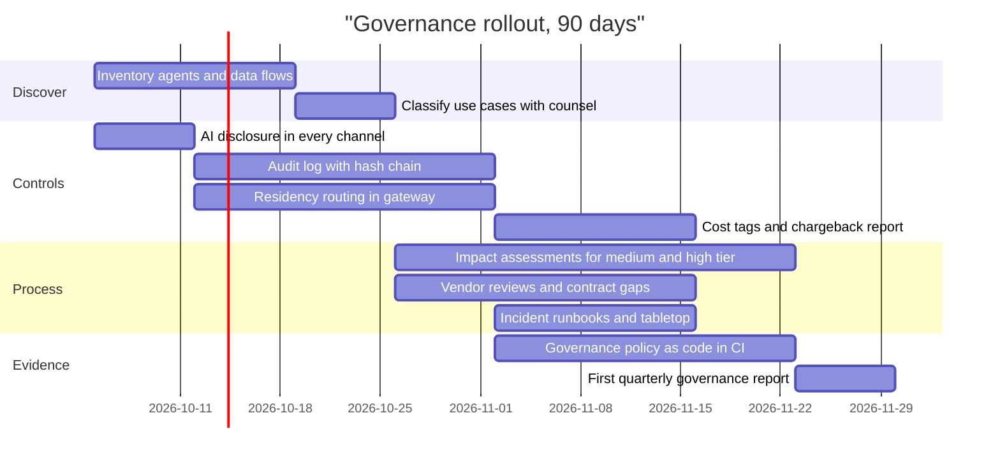

# Chapter 33: Governance and Compliance

> **What this chapter covers**: The controls that let an organization prove what its agents did, where data went, who approved it, what it cost, and what happens when it goes wrong. Audit trails for agent actions. Data residency. The EU AI Act obligations and timelines relevant to agents, including the 2026 Digital Omnibus amendments. NIST AI RMF and its Generative AI Profile. ISO/IEC 42001 and its companion standards. Sector rules (finance, health, employment, privacy). Cost attribution and chargeback. Model and vendor risk management. Incident response for agents.
>
> **Prerequisites**: Chapters 23, 26, 28, 29, 30, 31, 32.
>
> **Where it is used**: Every enterprise deployment, every security questionnaire, every procurement review. Chapter 35 (delivering as an FDE) uses this chapter for the customer's risk and legal reviews and the design doc's compliance section.
>
> **Not legal advice.** This chapter explains mechanisms and dates as of late September 2026 so an engineer can design for them and talk to counsel precisely. Confirm obligations for a specific deployment with the customer's legal team.

---

## 33.1 Level 1: Foundations

### 33.1.1 Why agents change governance

Governance for classic ML asked: is the model accurate, fair, and documented? Governance for LLM features added: is the output safe, and is personal data handled correctly? Agents add a third question that changes the engineering: **who is accountable for an action taken by software on someone's behalf?**

An agent reads data, decides, and acts through tools: it refunds, emails, files, changes records, runs code. Each action has a business owner, a legal basis, a data flow, and a cost. Governance for agents means that for every action you can answer, after the fact and with evidence:

1. What did the agent do, in what order, with what inputs? (audit trail)
2. Under whose authority? (identity, delegation, approvals)
3. Which data went where, including to which model provider in which region? (data residency and transfers)
4. Which version of the agent did it? (release bundle, Chapter 32)
5. Was this use permitted and assessed before it started? (risk classification, impact assessment)
6. What did it cost, and who pays? (cost attribution)
7. When it went wrong, how was it detected, contained, reported, and fixed? (incident response)

Every framework in this chapter, legal or voluntary, is a structured way of demanding answers to some subset of these questions.

### 33.1.2 Three kinds of obligation

| Kind | Examples | Force | Engineering consequence |
|---|---|---|---|
| Law and regulation | EU AI Act, GDPR, sector regulations, state laws | Mandatory, fines | Hard requirements on logs, oversight, transparency, reporting deadlines |
| Voluntary frameworks | NIST AI RMF, NIST AI 600-1 | Voluntary, but referenced by contracts and regulators | A vocabulary and a checklist for risk management |
| Certifiable standards | ISO/IEC 42001 | Voluntary, audited by third parties | A management system with documented processes and evidence |
| Contracts | Customer DPAs, BAAs, security addenda, vendor terms | Mandatory between parties | Residency, retention, subprocessor lists, notice of changes |

For an FDE, contracts are often the most concrete and the most immediate. A customer's security addendum that says "no customer data may leave the EU" is enforceable next week; the high-risk obligations of the EU AI Act for most systems now apply from December 2027.

### 33.1.3 Vocabulary

| Term | Meaning |
|---|---|
| Provider (EU AI Act) | Who develops an AI system or model and places it on the market or puts it into service under its own name. |
| Deployer (EU AI Act) | Who uses an AI system under its authority in a professional capacity. |
| High-risk AI system | A system in a listed use (Annex III) or a safety component of a regulated product (Annex I), subject to the heaviest obligations. |
| GPAI model | General-purpose AI model, such as a foundation LLM, with its own obligations for its provider. |
| Audit trail | A tamper-evident, retained record of actions, actors, inputs, and outputs sufficient to reconstruct events. |
| Data residency | Where data is stored and processed geographically. |
| Data transfer | Movement of personal data across jurisdictions, regulated under GDPR Chapter V. |
| AIMS | AI management system, the object ISO/IEC 42001 certifies. |
| Chargeback | Billing internal cost centers for their use of a shared platform. |
| Serious incident | Under the AI Act, an incident causing death, serious harm, serious disruption of critical infrastructure, or certain rights infringements. |

### 33.1.4 The governance map



### 33.1.5 Who does what

| Role | Owns | Engineering touchpoint |
|---|---|---|
| Legal and privacy counsel | Classification, legal basis, contracts, notification decisions | Data flow map, audit trail design review |
| Risk and compliance | Policies, inventory, assessments, regulator relationships | Evidence store, governance metrics |
| Security | Threat model, vendor security reviews, incident command | Tool allowlists, identity, egress, red teaming |
| Platform engineering | Controls as defaults: gateway, audit log, residency routing, kill switches | Everything in Chapters 31 and 32 |
| Product team | The agent, its evals, its evidence, its oversight UX | Release bundle, gate reports, approval flows |
| Finance | Budgets, chargeback rules | Cost tags and reports |
| Business owner | Accepting residual risk for the use case | Signs the impact assessment |

An FDE usually sits between all of them for the customer. Knowing who owns which decision prevents the most common failure: engineering making a legal call by default because nobody else was in the room.

## 33.2 Level 2: Working knowledge

### 33.2.1 Audit trails for agent actions

A trace (Chapter 28) and an audit trail overlap but are not the same thing.

| Property | Trace | Audit trail |
|---|---|---|
| Purpose | Debugging and performance | Accountability and evidence |
| Audience | Engineers | Auditors, regulators, legal, customers |
| Retention | Days to weeks, sampled | Months to years, complete for in-scope actions |
| Mutability | Can be deleted or sampled | Append-only, tamper-evident |
| Content | Everything, including verbose prompts | What is needed to reconstruct decisions and actions, minimized for privacy |
| Access | Broad within engineering | Restricted, access itself logged |

What an audit record for an agent action should contain:

```json
{
  "event_id": "evt_01J9...",
  "ts": "2026-09-24T14:03:22.418Z",
  "tenant_id": "t_northwind",
  "session_id": "s_7c1f...",
  "actor": {"type": "agent", "agent": "support-agent", "release": "2026.09.24-3"},
  "on_behalf_of": {"user_id": "u_4412", "auth": "oidc", "scopes": ["orders:read", "refunds:create"]},
  "action": {"tool": "issue_refund", "tool_version": "3.2.0", "risk_tier": "high",
             "args_hash": "sha256:1be0...", "args_redacted": {"order_id": "ORD-88213", "amount": 42.00}},
  "approval": {"required": true, "approver": "u_0917", "decision": "approved", "ts": "2026-09-24T14:02:51Z"},
  "model": {"id": "claude-sonnet-5", "region": "eu", "request_id": "req_01..."},
  "result": {"status": "success", "idempotency_key": "s_7c1f:step6"},
  "prev_hash": "sha256:a91c...", "hash": "sha256:5d03..."
}
```

The values are synthetic. The fields that matter: the release bundle identifier, the human on whose behalf the agent acted with their scopes, the approval record for gated actions, the model and region that processed the data, and a hash chain (each record includes the previous record's hash) so deletion or edits are detectable.

**What to log.** Every side-effecting tool call, every approval decision, every policy block (a guardrail refusing an action), every escalation to a human, every access to sensitive data classes, every change to the agent's configuration (release deploys, prompt version pins, tool allowlist changes). Read-only model calls can live in traces with shorter retention, linked by session ID.

**What not to log in the audit trail.** Full prompts and tool outputs containing personal data, unless a rule requires them. Store a hash and a pointer to the trace store, which has its own retention and redaction. This keeps the audit store small enough to retain for years and limits the blast radius if it leaks.

### 33.2.2 Data residency and transfers

For an agent, personal data flows to more places than for a classic app:



Each arrow is a potential transfer. The ones teams miss: the tracing backend (a US SaaS receiving full prompts), the eval and labeling pipeline (production traces copied into a golden set), third-party tools called by MCP servers, and web search tools that send query text to a search provider.

Mechanisms to control residency:

| Mechanism | Example | Notes |
|---|---|---|
| Regional model endpoints | Bedrock and Google Cloud regional endpoints for Claude (10 percent premium over global as of September 2026); Anthropic's `inference_geo` parameter (US-only inference at 1.1 times standard price, per the Anthropic pricing page, September 2026) | Check which geographies each provider offers for each model; offerings change |
| Self-hosted open-weight models | vLLM in the customer's region or data center | Full control, operational cost, capability gap |
| Regional deployment of everything else | Checkpoints, memory, traces, evals in-region | The model is only one of the flows |
| Data minimization before the model | Redact or tokenize identifiers before sending | Reduces what crosses; can reduce quality |
| Contracts | DPA with standard contractual clauses, subprocessor lists, zero or limited data retention terms | Legal transfer basis, retention limits |

A residency requirement must be enforced in routing code (the model gateway, Chapter 32), not in a runbook. Failover paths are where it breaks.

### 33.2.3 The EU AI Act, the parts that matter for agents

The AI Act (Regulation (EU) 2024/1689) entered into force on 1 August 2024. It regulates by risk and by role, not by technology, so "agent" is not a category in the Act. An agent is an AI system; its obligations follow from what it is used for and who you are in the value chain.

**Timeline, as amended.** The Digital Omnibus on AI was proposed by the Commission on 19 November 2025, provisionally agreed in May 2026, and, per law-firm and research summaries, published as Regulation (EU) 2026/1744 in the Official Journal on 24 July 2026 and in force from 27 July 2026. Confirm the regulation number and text on EUR-Lex before citing it formally.

| Date | What applies | Status |
|---|---|---|
| 1 August 2024 | Act enters into force | Done |
| 2 February 2025 | Prohibited practices (Article 5) and AI literacy (Article 4) | In force |
| 2 August 2025 | GPAI model provider obligations, governance, penalties framework | In force |
| 2 August 2026 | Transparency obligations (Article 50), most remaining provisions | In force since last month; omnibus kept this date |
| 2 December 2026 | End of grace period for machine-readable marking for generative systems already on the market; transition for new prohibitions on AI-generated non-consensual intimate imagery and CSAM added by the omnibus | Per omnibus summaries |
| 2 August 2027 | Deadline for national AI regulatory sandboxes (moved from 2026) | Per omnibus summaries |
| 2 December 2027 | High-risk obligations for Annex III systems (moved from 2 August 2026) | Per omnibus |
| 2 August 2028 | High-risk obligations for AI in Annex I regulated products (moved from 2 August 2027) | Per omnibus |

Sources: Gibson Dunn and Cloud Security Alliance summaries of the omnibus agreement and publication (2026), the Council press release of 29 June 2026, and the original Act. Treat any date not in the original text as "per the omnibus, confirm on EUR-Lex".

**Roles and agents.** If you build an agent and offer it to customers under your name, you are likely the provider of that AI system. The customer using it internally is the deployer. The foundation model vendor is the GPAI model provider. A deployer that puts its own name on a system, or substantially modifies it, or changes its intended purpose into a high-risk use, can become a provider (Article 25). This matters for FDE work: heavy customization inside a customer's environment can shift who holds provider obligations.

**When is an agent high risk?** When it is used in an Annex III area, such as employment (screening candidates, allocating tasks, monitoring performance), access to essential private and public services (credit scoring, eligibility for benefits, insurance pricing for life and health), education (admissions, grading), law enforcement, migration, justice, and critical infrastructure management, subject to the Act's exceptions for narrow procedural tasks. A support agent answering parcel questions is not high risk. The same agent deciding whether a customer qualifies for a credit extension is.

**Transparency (Article 50), applicable from 2 August 2026.** In summary: people must be informed that they are interacting with an AI system unless it is obvious; providers of generative systems must mark synthetic outputs in a machine-readable way; deployers must disclose deepfakes and AI-generated text published to inform the public on matters of public interest, with exceptions. For a customer-facing agent, the first obligation is the live one: the chat or voice agent must say it is an AI.

### 33.2.4 High-risk obligations translated to agent engineering

If an agent is high risk, the provider obligations (Articles 9 to 15 and related) become engineering work. From 2 December 2027 for Annex III systems:

| Obligation (article) | What it means for an agent |
|---|---|
| Risk management system (9) | A documented, iterative risk process over the lifecycle: threat model, failure modes, residual risk acceptance |
| Data and data governance (10) | Documented provenance and quality of training, validation, and test data, including golden sets and any fine-tuning data |
| Technical documentation (11, Annex IV) | Architecture, models, tools, evals, known limitations, versioned per release |
| Record-keeping (12) | Automatic logging of events over the system's lifetime, enabling traceability: the audit trail |
| Transparency to deployers (13) | Instructions for use: capabilities, limits, accuracy metrics, oversight measures |
| Human oversight (14) | Design so humans can understand, monitor, intervene, override, and stop: approval gates, kill switches, explanations |
| Accuracy, robustness, cybersecurity (15) | Declared accuracy metrics, resilience to errors and adversarial inputs (prompt injection counts) |
| Quality management system (17) | Processes for design, testing, change control: the release pipeline |
| Logs retention (19, and 26 for deployers) | Keep automatically generated logs for at least six months, unless other law says otherwise |
| Post-market monitoring (72) | Online monitoring plan with metrics and triggers |
| Serious incident reporting (73) | Report to market surveillance authorities within deadlines |

Deployers of high-risk systems (Article 26) must use them per instructions, assign competent human oversight, monitor operation, keep logs under their control for at least six months, and inform affected workers where applicable; some deployers must also do a fundamental rights impact assessment (Article 27).

Most of this list is what a well-run agent platform already does: Chapters 26 to 32 are the implementation. The difference is documentation and evidence, retained and producible on request.

### 33.2.5 NIST AI RMF and the Generative AI Profile

The NIST AI Risk Management Framework 1.0 (NIST AI 100-1, January 2023) is voluntary and organized into four functions:

- **Govern**: policies, roles, accountability, culture.
- **Map**: context, intended use, stakeholders, risks.
- **Measure**: metrics, tests, evaluation of the risks mapped.
- **Manage**: prioritize, respond, monitor, communicate.

NIST AI 600-1, the Generative AI Profile (July 2024), applies the RMF to generative AI with twelve risk categories (including confabulation, information security, data privacy, harmful bias, information integrity, value chain and component integration) and over 200 suggested actions. It predates most agent deployments, so autonomy-specific risks (excessive agency, tool misuse, delegated authority) are not enumerated as their own category; map them to information security, value chain, and human-AI configuration.

In February 2026, NIST's Center for AI Standards and Innovation (CAISI) launched an AI Agent Standards Initiative with pillars on industry standards, open protocols, and agent security and identity research, including an RFI on agent security that closed in March 2026. As of September 2026, treat its outputs as emerging; check nist.gov for any published agent profile before citing one.

### 33.2.6 ISO/IEC 42001 and companions

ISO/IEC 42001:2023 (published December 2023) specifies an AI management system: the organizational processes for responsible AI, in the same style as ISO/IEC 27001 for information security. It is certifiable by accredited bodies. It requires, among other things, an AI policy, defined roles, AI risk assessment and treatment, AI system impact assessment, lifecycle controls, supplier management, and continual improvement, with Annex A listing reference controls.

Companion standards: ISO/IEC 42005:2025 gives guidance on AI system impact assessments (published May 2025); ISO/IEC 42006 sets requirements for bodies that audit and certify 42001 management systems (published 2025; check the ISO catalogue for the exact edition). ISO/IEC 23894:2023 gives AI risk management guidance.

Why it matters for agents: enterprise buyers increasingly ask vendors for 42001 certification or alignment in security questionnaires, the way they ask for SOC 2 and 27001. For an agent vendor, the audit evidence is the same artifacts: release bundles, eval reports, audit trails, incident records.

### 33.2.7 How the frameworks relate

| Question | EU AI Act | NIST AI RMF | ISO/IEC 42001 |
|---|---|---|---|
| Is it mandatory? | Yes, in the EU market, by role and risk | No | No, but certifiable |
| Unit of regulation | AI system or GPAI model, by use | Organization and system | Organization's management system |
| Risk classification | Fixed tiers in law | Organization defines | Organization defines |
| Logging | Required for high risk (Article 12) | Suggested under Measure and Manage | Required as evidence of controls |
| Human oversight | Required for high risk (Article 14) | Suggested (human-AI configuration) | Control objective |
| Incident reporting | Required, deadlines (Article 73) | Suggested | Required process (nonconformity and corrective action) |
| Evidence | Technical documentation, conformity assessment | Self-attested | Third-party audit |

A practical approach: use ISO/IEC 42001 as the management system, NIST AI RMF and AI 600-1 as the risk vocabulary, and map the EU AI Act obligations for the specific system onto both. One set of engineering artifacts serves all three.

### 33.2.8 Identity and delegated authority

Governance asks "under whose authority?" for every action. Agents make this hard, because three identities are in play: the human user, the agent (a workload), and the downstream system's view of who is calling.

| Pattern | How it works | Governance quality |
|---|---|---|
| Shared service account | Agent calls every system with one powerful credential | Poor: every action looks like the service; no per-user authorization |
| User impersonation with stored passwords | Agent logs in as the user | Unacceptable: credential handling, no delegation record |
| Delegated OAuth tokens | User grants the agent scoped tokens; the agent calls as the user with limited scopes | Good: downstream sees user plus client, scopes limit blast radius |
| Token exchange with agent identity | Workload identity plus user context exchanged for a short-lived, down-scoped token naming both | Best: audit records name the agent, the user, and the scopes |

The audit record in 33.2.1 has `actor` and `on_behalf_of` for this reason. When an auditor asks "who refunded order ORD-88213?", the answer is "the support agent, release 2026.09.24-3, acting for user u_4412 with scope refunds:create, approved by u_0917". Every part of that sentence must be in the record. MCP's authorization specification builds on OAuth for exactly this delegation (Chapter 16), and Chapter 29 covers the security side.

### 33.2.9 An approval with its audit trail, traced



Four audit records for one action: proposal and policy decision, approval, execution, result. If the approver rejects, the trail records that too, which is the evidence that oversight is real.

### 33.2.10 Transparency in practice

Article 50's first duty, telling people they are interacting with an AI system unless obvious, has concrete engineering forms:

- The chat or voice agent identifies itself as an AI at the start of the interaction, in the user's language.
- Handoffs are explicit: when a human takes over, the user is told; when the agent takes back, the user is told.
- Outbound messages written by the agent (emails, SMS) carry disclosure where the context requires it; check with counsel for each channel, since Article 50 has exceptions and national consumer law may add duties.
- The disclosure event is logged, so you can prove it happened for a given session.

Transparency toward the deployer (Article 13, for high-risk systems) is a document: instructions for use with capabilities, limitations, accuracy metrics with intervals, oversight measures, and log interpretation. Generate it from the release bundle and eval reports so it stays current.

### 33.2.11 Minimization before the model, worked

Minimization is the cheapest residency and privacy control, because data that never reaches the model or the traces needs no transfer basis and no retention rule. Techniques, from least to most invasive to quality:

| Technique | Example | Quality impact |
|---|---|---|
| Drop fields the task does not need | Tool returns order status and dates, not the full customer record | None if the task truly does not need them |
| Pseudonymize identifiers | `cust_8f2a` instead of name and email; the tool layer resolves it back when acting | Minimal; the model rarely needs real names |
| Generalize | Age band instead of birth date, city instead of street address | Small for most tasks |
| Redact free text | Pattern and NER-based removal of phone numbers, card numbers, IDs in user messages | Can remove context the user intended to share |
| Local model for sensitive steps | A small open-weight model on-prem classifies or extracts, the hosted model sees only the result | Capability gap on the local step |

Worked example. Northwind's order tool returned a 1,800-token customer record per call, of which the agent used about 300 tokens (status, dates, items). Returning only those fields cuts the per-turn growth d in Chapter 31's model from 1,500 to roughly 900 tokens for turns that call it, lowers cost and latency, and removes addresses and phone numbers from every model call and trace. Privacy and cost engineering point the same way more often than people expect.

## 33.3 Level 3: Depth

### 33.3.1 Sector rules that bite agents

| Sector or area | Rule (verify current status) | Agent consequence |
|---|---|---|
| Privacy, EU | GDPR: lawful basis, minimization, Article 22 on solely automated decisions with legal or similarly significant effects, DPIAs, records of processing, 72-hour breach notification (Article 33) | Human in the loop for significant decisions, DPIA before launch, memory and trace retention limits, deletion must reach memory stores |
| US banking | SR 26-2, Revised Guidance on Model Risk Management (Federal Reserve, OCC, FDIC, 17 April 2026), superseding SR 11-7 | Law-firm summaries report it excludes generative and agentic AI from scope; banks still apply model risk practices to agents through their own policies. Read the text |
| EU finance | DORA (Regulation (EU) 2022/2554), applicable from 17 January 2025: ICT risk, incident reporting, third-party risk registers | Model providers are ICT third-party providers; agent incidents may be major ICT incidents with hour-level reporting deadlines |
| EU critical and important entities | NIS2: early warning within 24 hours, notification within 72 hours of significant incidents | Agent-caused outages in scope entities are reportable |
| US health | HIPAA: business associate agreements with any vendor handling PHI, minimum necessary standard | BAA with the model provider and every tool vendor that sees PHI; check which endpoints a vendor's BAA covers |
| Employment, New York City | Local Law 144: bias audits and notices for automated employment decision tools | Screening agents need an annual independent bias audit and candidate notice |
| Employment and consumer, Colorado | SB 24-205, repealed and replaced by a narrower 2026 law signed 14 May 2026, effective 1 January 2027 per legal summaries; enforcement of the original law was blocked by a federal court in April 2026 | Status is in flux; confirm with counsel before designing to it |
| Payments | PCI DSS | Card data must never enter model context or traces; tokenize upstream |

Two cross-cutting points. First, sector rules often apply regardless of whether "AI" is mentioned: a refund agent is subject to consumer protection rules exactly as a human agent would be. Second, the agent inherits the customer's regulatory perimeter: deploying into a bank means the bank's third-party risk, change management, and audit processes apply to your agent.

### 33.3.2 Penalties, for scale

The AI Act's penalty ceilings (Article 99 of the original text) are tiered: up to 35 million euros or 7 percent of worldwide annual turnover, whichever is higher, for prohibited practices; up to 15 million euros or 3 percent for most other obligations, including high-risk and transparency duties; up to 7.5 million euros or 1 percent for supplying incorrect or misleading information to authorities. For SMEs and start-ups the lower of the two amounts applies. The Commission's own fining powers over GPAI model providers apply from 2 August 2026. GDPR ceilings remain 20 million euros or 4 percent. Check whether the omnibus changed any SME provisions before quoting figures to a customer.

These numbers matter less for their size than for the conversation they enable: a customer's legal team will weigh a missing log or a missing AI disclosure against a 3 percent ceiling, which is why cheap controls such as disclosure and logging should never be the thing a project skips.

### 33.3.3 Designing the audit trail for tamper evidence and retention

**Tamper evidence.** A hash chain per tenant (each record contains the hash of the previous one) makes deletion and modification detectable. Periodically anchor the chain head in a separate system (an object store with object lock in compliance mode, or a transparency log). Verification is a linear scan recomputing hashes.

**Retention.** Set per record class, from the strictest applicable rule, and document the reason.

| Record class | Retention example | Driver |
|---|---|---|
| High-risk system logs | At least 6 months | AI Act Articles 19 and 26 |
| Financial actions (refunds, payments) | Often 5 to 10 years | Financial record-keeping law, varies by country |
| Approval decisions | Same as the action they approve | Evidence chain |
| Configuration changes (releases) | Life of the system plus a margin | Technical documentation |
| Full traces with personal data | Days to weeks | GDPR minimization |

The tension between the last row and the others is resolved by the split in 33.2.1: long-retained audit records carry hashes and redacted fields; full content lives in short-retention stores. If an auditor needs the full content of an old decision, the reason must be written into policy before the fact, and that content retained under that policy.

**Sizing, worked.** Northwind (Chapter 31) runs 200,000 tasks a month. Suppose 2.5 audit-worthy events per task on average (tool writes, approvals, escalations) at 1.5 KB per record: 200,000 times 2.5 times 1.5 KB = 750 MB a month, 9 GB a year, 63 GB over seven years. That is cheap to keep. Full traces at about 264 KB per task (Chapter 32's checkpoint estimate) would be 53 GB a month and 4.4 TB over seven years, which is expensive and a privacy liability. The design choice is obvious once the numbers are on the table.

**Right to erasure versus append-only.** GDPR erasure requests conflict with immutable logs. Common patterns: keep personal data out of the immutable records (pseudonymous IDs only), and store the mapping from ID to person in a mutable store that can be erased (crypto-shredding: encrypt personal fields with a per-subject key and delete the key). Get counsel to sign off on which records are exempt under legal retention obligations.

### 33.3.4 Cost attribution and chargeback

Governance includes money: who approved the spend, who pays, and whether spend matches the business case. Chapter 31 built the metering; here it becomes accounting.

Worked example. Northwind's agent platform serves three internal business units. Monthly spend is 19,067 dollars (Chapter 31's model). Metered direct costs by business unit, from usage tagged with `cost_center`:

| Business unit | Tasks | Direct model and tool cost (USD) | Share of tasks |
|---|---|---|---|
| Customer support | 150,000 | 11,210 | 75 percent |
| Claims | 30,000 | 2,730 | 15 percent |
| Sales ops | 20,000 | 988 | 10 percent |
| Direct total | 200,000 | 14,928 | |

Direct costs are the blended model line plus retries, runaway tail, and web search from Chapter 31 (13,588 + 408 + 532 + 400 = 14,928), attributed from actual usage, which is why claims (longer tasks, more Sonnet) costs more per task than sales ops. Shared costs (evals 2,639 plus infrastructure 1,500 = 4,139) are allocated by task share: support 3,104, claims 621, sales ops 414. Fully loaded: support 14,314, claims 3,351, sales ops 1,402, total 19,067.

Per-task fully loaded cost: support 9.5 cents, claims 11.2 cents, sales ops 7.0 cents. That comparison, with each unit's success rate and human-handling cost, is what the governance committee needs to decide whether each use case is still justified.

Allocation choices are political as well as technical. Allocating evals by task share makes low-volume, high-risk units (claims) underpay for the extra evaluation they need; allocating by eval usage is fairer but requires tagging eval runs by use case. Pick one, write it down, and keep it stable.

### 33.3.5 Model and vendor risk management

An agent depends on vendors at several layers: the model provider, the cloud, the agent framework or managed runtime, MCP servers and tool SaaS, observability, and evaluation tooling. Each is a third-party risk.

| Risk | Example | Control |
|---|---|---|
| Model behavior change | A model snapshot is deprecated or an alias moves to a new version | Pin dated IDs, track deprecation notices, re-run the gate on migration (Chapter 32) |
| Model retirement | The pinned model is retired on a published schedule | Deprecation calendar, migration budget in the plan |
| Price change | New pricing, new tokenizer inflating token counts | Versioned price table, cost model rerun per migration |
| Data handling | Retention, training use, subprocessors, region | Contract review, zero or limited retention terms where available, subprocessor monitoring |
| Availability | Provider incidents | Fallbacks, SLAs, status page monitoring (Chapter 31) |
| Supply chain | Compromised MCP server or package | Allowlists, pinned manifests, signatures (Chapter 29) |
| Concentration | One provider for every agent | Documented exit plan, abstraction at the gateway |
| Regulatory | Vendor's own compliance posture (GPAI obligations, certifications) | Request documentation: model cards, GPAI Code of Practice signatory status, ISO or SOC reports |

A model inventory is the backbone: every agent, the models and versions it uses, the tools it can call, the data classes it touches, its risk tier, its owner, and its last eval date. Regulators, auditors, and incident responders all start by asking for it.



### 33.3.6 Running an impact assessment for an agent

Impact assessments go by several names: DPIA under GDPR Article 35, fundamental rights impact assessment under AI Act Article 27 for certain deployers of high-risk systems, AI system impact assessment under ISO/IEC 42001 with guidance in 42005. The content overlaps, so run one combined assessment with sections that satisfy each.

A workable structure for an agent:

1. **Purpose and context.** What the agent does, for whom, what decisions it influences, what it must never do.
2. **Actions and autonomy.** Every tool, its risk tier, which actions need approval, the maximum blast radius per session (Chapter 30).
3. **Data.** Categories processed, special categories, sources, flows, regions, retention, and the legal basis per purpose.
4. **Affected people.** Users, third parties mentioned in data, workers whose jobs change, vulnerable groups.
5. **Risks.** Harms by category (wrong action, discrimination, privacy, security, over-reliance), with likelihood and severity before and after controls. Use the NIST AI 600-1 categories as a checklist and add agent-specific ones: excessive agency, prompt injection, tool misuse.
6. **Controls.** Mapped to each risk: approval gates, caps, guardrails, evals with thresholds, monitoring, incident runbooks.
7. **Evidence.** Eval results with intervals, red-team findings and fixes (Chapter 29), residual risks accepted and by whom.
8. **Review triggers.** A new tool, a new data category, a new model family, a new use case, or an incident reopens the assessment.

The review triggers are the part engineers own. Wire them into CI: a bundle change that adds a tool above a risk tier, or changes the model family, fails until the assessment ID in the bundle points to an updated, approved version.

### 33.3.7 What downstream builders get from GPAI obligations

Since 2 August 2025, providers of general-purpose AI models placed on the EU market have obligations under the AI Act: technical documentation, information and documentation for downstream providers who integrate the model, a copyright policy, and a summary of training content, with additional duties for models with systemic risk (evaluation, adversarial testing, serious incident tracking, cybersecurity). The Commission published a GPAI Code of Practice in July 2025 as a voluntary route to demonstrate compliance; check the Commission's list for which vendors signed.

For an agent builder, the practical value is the downstream documentation: model capabilities and limitations, intended and prohibited uses, and evaluation information, which feed your own technical documentation and risk assessment. Request it from the vendor during procurement. If a vendor cannot provide it, record that in the vendor risk review.

### 33.3.8 Provider data handling terms

What happens to prompts and outputs at the model provider is a governance question with contractual answers. Items to check per vendor and per endpoint, because terms differ between first-party APIs, cloud marketplaces, and consumer products:

- Whether API data is used for training by default (major API providers state they do not train on API data by default; confirm in the current commercial terms).
- Retention period for inputs and outputs, and whether zero or reduced retention is available and on which features (some features, such as server-side state or file storage, require retention by design).
- Abuse monitoring retention and human review policies.
- Subprocessors and their regions.
- Where inference runs, and whether residency controls exist for the model you use (Anthropic's `inference_geo` and regional cloud endpoints, per 33.2.2).
- Breach notification commitments and audit reports available (SOC 2, ISO/IEC 27001, ISO/IEC 42001).

Stateful features deserve particular attention in agent designs: managed sessions, server-side memory, file stores, and managed agent runtimes (Chapter 32) keep data at the vendor by design. That can be acceptable, but it must be in the data flow map and the DPA.

## 33.4 Level 4: Mastery

### 33.4.1 Incident response for agents

Agent incidents differ from classic software incidents in three ways. The system can take actions at machine speed across many tenants before anyone notices. The cause may be an input (a prompt injection in a document) rather than a code change. And the evidence is distributed across traces, audit logs, model provider logs, and tool systems.

Incident classes worth rehearsing:

| Class | Example | First containment action |
|---|---|---|
| Harmful action | Agent issued refunds outside policy | Disable the write tool or its risk tier via flag; keep read-only service |
| Data exposure | Cross-tenant data in a response; secrets in traces | Kill switch for the route, purge caches, lock trace access |
| Prompt injection exploitation | Injected instructions in a retrieved email caused exfiltration via a tool | Disable the affected tool and source, block egress, preserve evidence |
| Runaway cost | Loop class burning money | Fleet spend kill switch (Chapter 31) |
| Quality regression | New release gives wrong policy answers | Roll back the release bundle (Chapter 32) |
| Vendor incident | Provider outage or provider-side data incident | Fallback or degrade; vendor communications; assess notification duties |



**Blast radius from the audit trail.** The first question after containment is "what else did it do?". A good audit trail answers it with a query: all `issue_refund` calls by release 2026.09.24-3 between deploy time and the flag flip, grouped by tenant, with amounts. Without release IDs on audit records, the answer takes days.

**Notification deadlines.** Several clocks may run at once, and legal decides which apply:

| Regime | Deadline | Trigger |
|---|---|---|
| GDPR Article 33 | 72 hours after becoming aware | Personal data breach, to the supervisory authority |
| NIS2 | 24-hour early warning, 72-hour notification | Significant incident at an in-scope entity |
| EU AI Act Article 73 | Immediately once a causal link is established, and no later than 15 days after awareness; 10 days if a death; 2 days for widespread infringement or serious and irreversible critical infrastructure disruption | Serious incident involving a high-risk system (applies with high-risk obligations, so from December 2027 for Annex III) |
| DORA | Hour-level initial reporting for major ICT incidents (check the delegated regulation for exact deadlines) | Financial entities |
| Contracts | Often 24 to 72 hours | Customer DPAs and security addenda |

The AI Act allows an incomplete initial report followed by a complete one, per Article 73. Plan to report early and amend.

**Evidence preservation.** Snapshot the release bundle, the relevant traces (before their short retention deletes them), audit records, and provider request IDs. Put a legal hold on trace retention for the affected sessions.

### 33.4.2 Governance as code

Manual governance does not scale to dozens of agents and weekly releases. The senior pattern is to encode governance in the same pipeline that ships the agent (Chapter 32):

- **Risk tier in the release bundle.** The bundle declares the use case and risk tier; CI refuses a bundle that adds a high-risk tool without a linked, approved impact assessment ID.
- **Tool allowlists by tier.** A policy file maps risk tiers to permitted tools and required approval gates; the harness enforces it at runtime.
- **Residency policy per tenant.** The gateway reads it; CI tests that no route for an EU tenant resolves to a non-EU endpoint, including fallbacks.
- **Documentation generated from artifacts.** Technical documentation sections (models, tools, eval results, limitations) are rendered from the bundle and the latest gate report, so they cannot drift.
- **Evidence retention automated.** Gate reports, bundle files, and approval records are written to the evidence store on every release.

```yaml
# governance-policy.yaml (illustrative)
use_cases:
  parcel-support: {risk: limited, transparency_notice: required}
  credit-extension: {risk: high, impact_assessment: IA-2026-014, human_approval: all_decisions}
tools:
  issue_refund: {tier: high, approval: "amount > 50", max_per_session: 1}
  send_email:   {tier: medium, approval: external_recipients}
  search_kb:    {tier: low}
residency:
  t_northwind_eu: {model_geo: eu, traces: eu, fallback_geo: eu}
audit:
  retain: {high_tier_actions: P7Y, approvals: P7Y, traces: P14D}
```

### 33.4.3 Mapping one agent across frameworks, worked

A synthetic lender, Fjord Credit, wants an agent that gathers documents and drafts a recommendation on small-business credit line increases for EU customers. A human underwriter makes the final decision.

1. **Classification.** Creditworthiness assessment of natural persons is an Annex III area. Small-business lending to legal persons may fall outside that item, but sole traders are natural persons. Counsel classifies it as high risk to be safe. Obligations apply from 2 December 2027; the project launches in 2026, so the design must be compliant from day one to avoid a retrofit.
2. **Role.** Fjord builds it in-house on a foundation model: Fjord is provider and deployer; the model vendor is a GPAI provider.
3. **GDPR.** Article 22 is relevant; keeping a human underwriter as the real decision maker (with authority and information to disagree, not rubber-stamping) is the design response. DPIA required.
4. **Human oversight (Article 14).** The approval gate shows the underwriter the evidence the agent used, the draft, and the policy checks; the underwriter can edit or reject; a stop control exists per case and fleet-wide.
5. **Logging (Article 12).** Audit trail per 33.2.1, retained at least six months and under financial record rules for longer.
6. **Accuracy and robustness (Article 15).** Declared metrics from the golden set with intervals: recommendation agreement with senior underwriters, document extraction accuracy, prompt injection resistance on adversarial documents (Chapter 29).
7. **DORA.** The model provider becomes an ICT third-party provider in Fjord's register.
8. **NIST and ISO.** The same artifacts are filed as Map, Measure, and Manage evidence and as 42001 controls.

The engineering delta over a well-built non-regulated agent is small: the impact assessment, the documentation, stricter retention, and the oversight UX. That is the argument an FDE makes to a nervous customer.

### 33.4.4 Governance operating model



A central AI governance function (often risk, legal, security, and a platform engineering lead) owns policy, classification, the inventory, and incident coordination. Product teams own their agents' evidence. The platform provides the controls as defaults so compliance is the path of least resistance. Classification should be quick for the bottom-left quadrant and thorough for the top-right; a uniform heavy process drives teams to avoid registering agents at all, which is the worst outcome.

### 33.4.5 Governance metrics

What gets measured gets governed. A quarterly governance report for an agent portfolio:

| Metric | Why | Target direction |
|---|---|---|
| Agents in inventory versus agents discovered in traffic | Shadow agents are the biggest governance gap | Equal |
| Agents with current impact assessment | Coverage | 100 percent of medium and high tier |
| Approval override rate per gate | Oversight is real, not rubber-stamped | Not near zero; investigate extremes |
| Median time to approve per gate | Automation bias signal when very short | Stable, tier-appropriate |
| Policy blocks per 1,000 sessions | Guardrail activity and attack pressure | Watched for spikes |
| Audit chain verification failures | Tamper evidence working | Zero |
| Residency test failures in CI | Routing correctness | Zero |
| Incidents by class, time to contain | Response maturity | Falling time to contain |
| Models within 90 days of deprecation | Migration risk | Plan exists for each |
| Cost per successful task per use case versus business case | Continued justification | Within case |

The first row deserves emphasis. Teams build agents with a personal API key and a script long before governance hears about them. Discovering them from provider usage reports and gateway logs, then registering them with a light process, beats a heavy process nobody follows.

### 33.4.6 The compliance section of an FDE design doc

When an FDE writes the design doc for a customer agent (Chapter 35), the compliance section should fit on two pages and answer, with references to evidence:

1. Use case classification under the AI Act and the customer's sector rules, with counsel's sign-off noted.
2. Roles: who is provider, deployer, GPAI provider; who owns the agent after handover.
3. Data flow map with regions, retention, and legal basis per flow.
4. Actions and risk tiers, with approval gates and caps.
5. Audit trail design: records, retention, tamper evidence, access.
6. Human oversight design, and how override rates will be monitored.
7. Evaluation plan with thresholds and intervals, and the release gate.
8. Vendor list with contract status (DPA, BAA, residency terms).
9. Incident response: classes, containment controls, notification owners, contacts.
10. Open questions for legal, each with an owner and a date.

This section often unblocks procurement faster than any demo. Customer risk teams are looking for evidence that someone has thought about these questions; a precise, short answer beats a long generic one.

### 33.4.7 A 90-day governance rollout for a new agent platform

A customer with three agents in pilot and no governance asks the FDE for a plan. Sequence by risk reduction per week of effort: inventory and cheap controls first, certification-grade process last.



Week one delivers the AI disclosure, because it is legally live since 2 August 2026, cheap, and visible. The audit log and residency routing come next, because they cannot be created retroactively: every week without them is a week of missing evidence. Impact assessments run in parallel once counsel has classified the use cases. Policy as code and the first governance report close the loop, turning the controls into repeatable process that an ISO/IEC 42001 audit could later examine.

What the plan deliberately leaves out: certification itself (months, and only worth it if buyers ask), and high-risk conformity work for Annex III use cases whose obligations start in December 2027, which gets its own project once classification confirms it is needed.

### 33.4.8 Edge cases

- **Agents that write code or configuration.** A coding agent that changes infrastructure is taking actions through CI/CD. Its audit trail is the commit and deploy history plus the agent's session; require that commits identify the agent and the human who requested the change.
- **Cross-border teams.** A support engineer in another country viewing an EU tenant's traces is a transfer. Trace access control is part of residency.
- **Model provider as processor or controller.** Most API terms position the provider as a processor for API data. Consumer products differ. Agents that route through consumer products are a governance problem.
- **Multi-agent systems across vendors.** An agent that delegates to another organization's agent over A2A (Chapter 18) sends data to a third party. That delegation needs the same contract and residency review as any vendor, plus audit records of what was sent.
- **Memory.** Long-term memory is personal data processing with its own retention and erasure obligations. Erasure must reach memory stores, derived summaries, and vector indexes, not only the primary database.

### 33.4.9 Where frameworks, vendors, and practitioners disagree

- **Whether agents need their own regulatory category.** The AI Act regulates by use; some commentators argue autonomy itself should raise risk tier. For now, design as if autonomy raises the bar, since oversight and logging expectations track it in practice.
- **How much to log.** Privacy teams push for minimal content; incident responders and auditors want everything. The hash-plus-pointer design with tiered retention is the usual compromise.
- **Human oversight quality.** Regulators and researchers warn about automation bias: an approval gate a human clicks through in two seconds is not oversight. Measure approval times and override rates; an override rate near zero is a warning sign, not a success metric.
- **Vendor claims of compliance.** A vendor saying its platform is "AI Act compliant" is marketing. Compliance attaches to a specific system and use by a specific provider or deployer. A platform can make compliance easier; it cannot confer it.
- **Dates.** The omnibus moved dates once already, and delay debates continue. Build to the obligations, not to the deadlines, and keep the timeline table dated.

## 33.5 Subtopic checklist

- [x] Audit trails (33.2.1, 33.2.9, 33.3.3)
- [x] Data residency (33.2.2, 33.4.2)
- [x] EU AI Act obligations relevant to agents (33.2.3, 33.2.4, 33.2.10, 33.3.2, 33.3.6)
- [x] EU AI Act timelines, verified, including 2026 amendments (33.2.3)
- [x] NIST AI RMF (33.2.5, 33.2.7)
- [x] ISO 42001 (33.2.6, 33.2.7)
- [x] Sector rules (33.3.1)
- [x] Cost attribution (33.3.4)
- [x] Model and vendor risk management (33.3.5, 33.3.7, 33.3.8)
- [x] Incident response for agents (33.4.1)

## 33.6 Common misconceptions

1. **"The EU AI Act regulates agents as a category."** It regulates AI systems by use and role. An agent's obligations depend on what it does and who you are, not on its architecture.
2. **"High-risk obligations started in August 2026."** The omnibus deferred Annex III high-risk obligations to 2 December 2027 and Annex I to 2 August 2028. Transparency obligations under Article 50 did start on 2 August 2026.
3. **"Traces are our audit trail."** Traces are sampled, mutable, short-lived, and broadly accessible. An audit trail is complete for in-scope actions, append-only, tamper-evident, retained, and access-controlled.
4. **"Using an EU region for the model gives EU residency."** Traces, evals, memory, tool vendors, web search, and fallbacks all move data too. Residency is a property of every flow.
5. **"ISO/IEC 42001 certification means the AI is safe."** It certifies that a management system exists and operates. It says nothing directly about a specific agent's behavior.
6. **"A human approval step satisfies oversight requirements."** Only if the human has the information, time, and authority to disagree. Rubber-stamp approvals are automation bias with a signature.
7. **"Our vendor is compliant, so we are."** Compliance attaches to your system and your role. Vendor documentation is input to your assessment.
8. **"Immutable logs and GDPR erasure are irreconcilable."** Keep personal data out of immutable records or crypto-shred it; retain what law requires with a documented basis.
9. **"Cost attribution is finance's job."** Only engineering can tag usage with tenant, cost center, and use case at the source. Without tags, chargeback is a guess.
10. **"Incident response is the same as for any service."** Agents act, can be exploited by inputs, and leave evidence across several systems with different retention. Rehearse agent-specific classes and keep release IDs on every audit record.
11. **"NIST AI 600-1 covers agent risks fully."** It predates most agent deployments and does not enumerate autonomy-specific risks separately; map them onto its categories and watch for NIST's agent-specific outputs.

12. **"A shared service account is fine because the agent logs the user."** The downstream system cannot enforce per-user authorization, and its own logs attribute every action to the service. Delegated, scoped credentials are the only way both sides agree on who acted.
13. **"Compliance can be added before launch."** Retrofitting audit trails, residency routing, and oversight UX after an agent is built costs far more than designing them in, and evidence for past releases cannot be created retroactively.

## 33.7 Practice

1. **Conceptual.** For three agents (FAQ bot, refund agent, candidate screening agent), classify each under the EU AI Act, name the role you would hold as the builder, and list the obligations that apply today and from December 2027.
2. **Design.** Write the audit record schema for your agent. Mark each field as required, redacted, hashed, or pointer. Justify the retention for each record class.
3. **Hands-on (laptop).** Implement a hash-chained audit log in Postgres inside WSL2. Write a verifier that detects a deleted and a modified record. Anchor the chain head hourly to a file in a separate directory with restricted permissions.
4. **Hands-on.** Draw every data flow of your agent (model, tools, traces, evals, memory, search). For each, record the region and the legal basis. Find at least one flow you had not considered.
5. **Design.** Write the governance policy file from 33.4.2 for your agent and a CI test that fails if a high-tier tool lacks an approval rule or if an EU tenant's fallback resolves outside the EU.
6. **Arithmetic.** Recompute the chargeback in 33.3.3 allocating evals by eval usage instead of task share, assuming claims consumes 50 percent of eval runs, support 40, sales ops 10. How much does each unit's fully loaded per-task cost change?
7. **Tabletop.** Run a 60-minute incident exercise: a prompt injection in a customer email caused the agent to send order data to an external address. Walk detection, containment, blast radius query, notification decisions (which clocks start), and remediation.
8. **Design.** Build the model and agent inventory for a synthetic company with five agents. Include deprecation dates for each model from the vendor's deprecation page, and plan the next migration.
9. **Mapping.** Take your agent's artifacts (bundle, eval report, audit trail, threat model) and map each to NIST AI RMF functions and to the EU AI Act articles in 33.2.4. Which article has no artifact yet?
10. **Hands-on.** Measure approval behavior in your HITL prototype: time to approve and override rate over 50 synthetic cases where 10 are deliberately wrong. Did the approver catch them? What UI change would help?

11. **Design.** Write the two-page compliance section from 33.4.6 for a synthetic insurer's claims triage agent. Mark every statement that needs counsel's confirmation.
12. **Hands-on.** Add `actor`, `on_behalf_of`, and `approval` fields to your laptop agent's tool-call logging, then write the blast-radius query: every write action by a given release in a time window, grouped by tenant.
13. **Conceptual.** Pick one sector rule from 33.3.1 that applies to a customer you might serve. Read the primary text (not a summary) and list three concrete engineering requirements it implies.
14. **Design.** Draft the quarterly governance report from 33.4.5 for a portfolio of five agents with synthetic numbers. Which metric would you escalate first, and why?

15. **Hands-on.** Apply the minimization table in 33.2.11 to one tool in your agent. Measure tokens per call before and after, and rerun a 30-task eval to check quality did not drop (paired comparison).
16. **Conceptual.** Explain to a non-technical risk officer, in five sentences, why the audit trail stores hashes and pointers rather than full prompts, and what that means when they request evidence for a decision made 18 months ago.

## 33.8 How this is tested

<details><summary>What are the EU AI Act dates an agent builder needs to know as of September 2026?</summary>

The Act entered into force on 1 August 2024. Prohibitions and AI literacy apply from 2 February 2025. GPAI provider obligations from 2 August 2025. Article 50 transparency, such as telling users they are talking to an AI, from 2 August 2026, with a grace period to 2 December 2026 for machine-readable marking on generative systems already on the market. The 2026 Digital Omnibus moved Annex III high-risk obligations to 2 December 2027 and Annex I product-embedded systems to 2 August 2028. Confirm on EUR-Lex before citing.
</details>

<details><summary>Is a customer support agent high risk under the EU AI Act?</summary>

Usually not. High risk follows from use in an Annex III area or as a safety component of a regulated product. A parcel support agent is limited risk with transparency duties: it must disclose it is an AI. The same agent becomes high risk if it decides eligibility for essential services, credit, insurance pricing for life or health, or employment outcomes. Classify by what it decides, not by its architecture.
</details>

<details><summary>How does an audit trail differ from observability traces?</summary>

Traces are for debugging: sampled, verbose, short retention, broad engineering access, mutable. An audit trail is for accountability: complete for in-scope actions, append-only with a hash chain, retained for legally driven periods, minimized for privacy with hashes and pointers, and access-controlled with access itself logged. They link by session and release IDs.
</details>

<details><summary>Design an audit record for an agent's tool call.</summary>

Event ID and timestamp; tenant and session; actor (agent name and release bundle ID); on-behalf-of user with auth method and scopes; tool name, version, risk tier, hashed arguments plus redacted key fields; approval record if gated (approver, decision, time); model ID, region, and provider request ID; result status and idempotency key; previous record hash and own hash. Full content lives in the trace store with its own retention.
</details>

<details><summary>How do you guarantee EU data residency for an agent?</summary>

Enumerate every flow: model endpoint, fallbacks, tools and their SaaS backends, memory, checkpoints, traces, eval and labeling pipelines, web search. Put each in an EU region or remove it. Enforce routing in the model gateway per tenant, including fallback paths, and test it in CI. Back it with contracts: DPA, subprocessor list, retention terms. Minimize data before it reaches the model where quality allows.
</details>

<details><summary>What do NIST AI RMF and ISO/IEC 42001 each give you?</summary>

NIST AI RMF is a voluntary framework with four functions (Govern, Map, Measure, Manage) and, through AI 600-1, a generative AI risk taxonomy and suggested actions. ISO/IEC 42001 is a certifiable AI management system standard: policies, roles, risk and impact assessment, lifecycle and supplier controls, audited by third parties. Use 42001 for the management system, NIST for risk vocabulary, and map legal obligations onto both.
</details>

<details><summary>What would you do in the first hour of an incident where an agent leaked one tenant's data to another?</summary>

Contain: kill switch on the affected route, purge semantic and retrieval caches, lock access to traces. Preserve: snapshot the release bundle, relevant traces, audit records, and provider request IDs, and put a hold on trace retention. Scope: query the audit trail by release and time window for all cross-tenant retrievals. Notify legal immediately so they can decide on GDPR's 72-hour clock and contractual deadlines. Only then start the root-cause fix.
</details>

<details><summary>What does Article 14 human oversight mean for agent UX?</summary>

The overseer must be able to understand the system's capabilities and limits, monitor its operation, interpret outputs, decide not to use or override them, and stop the system. For an agent: approval gates that show the evidence and reasoning behind a proposed action, edit and reject controls, per-case and fleet-wide stop controls, and awareness of automation bias, measured through approval times and override rates.
</details>

<details><summary>How do you attribute agent costs to business units fairly?</summary>

Tag every model and tool call at source with tenant, cost center, use case, and release. Attribute direct costs from actual usage. Allocate shared costs (evals, infrastructure, platform team) with a documented rule: task share is simple, but usage-based allocation is fairer for low-volume, high-scrutiny use cases. Report fully loaded cost per successful task per unit so the governance committee can compare against the business case.
</details>

<details><summary>What belongs in model and vendor risk management for an agent platform?</summary>

An inventory of agents, models (IDs, versions, regions, deprecation dates), tools and vendors, data classes, and risk tiers. Controls for behavior change (pinning, gates on migration), retirement (deprecation calendar), pricing and tokenizer changes (versioned price tables), data handling (contracts, retention, subprocessors), availability (fallbacks), supply chain (allowlists, pinned manifests), and concentration (exit plan). Vendor documentation such as model cards and certifications feeds the review but does not replace it.
</details>

<details><summary>When can a deployer become a provider under the AI Act, and why does that matter for FDEs?</summary>

Article 25: if the deployer puts its name or trademark on a high-risk system, makes a substantial modification, or changes the intended purpose so that the system becomes high risk. An FDE who heavily customizes an agent inside a customer's environment, or repurposes it into a high-risk use, can shift provider obligations to the customer, or create ambiguity. Settle roles in the contract and the design doc.
</details>

<details><summary>How do you reconcile GDPR erasure with an append-only audit trail?</summary>

Keep direct personal data out of the immutable records: use pseudonymous IDs, with the mapping in a mutable store that can be erased, or encrypt personal fields with per-subject keys and delete the key on erasure (crypto-shredding). Retain what other laws require under a documented legal basis, which counsel confirms. The hash chain stays verifiable because hashes cover ciphertext or pseudonyms.
</details>

<details><summary>Which incident notification clocks might start when an agent causes a data breach at an EU bank?</summary>

GDPR Article 33: 72 hours to the supervisory authority for a personal data breach. DORA: major ICT incident reporting with hour-level initial deadlines for financial entities. NIS2 if in scope: 24-hour early warning, 72-hour notification. Contractual deadlines in DPAs. AI Act Article 73 applies to serious incidents involving high-risk systems once those obligations apply. Legal decides; engineering must provide the evidence fast.
</details>

<details><summary>What changed for US bank model risk management in 2026, and how does it affect agents?</summary>

On 17 April 2026 the Federal Reserve, OCC, and FDIC issued SR 26-2, revised model risk management guidance superseding SR 11-7. Law-firm summaries report it is more principles-based and excludes generative and agentic AI from its scope. Banks still need governance for agents, so expect them to apply model risk practices by internal policy, and read the guidance text rather than assuming agents are out of scope in practice.
</details>

<details><summary>How should an agent authenticate to downstream systems so that audits work?</summary>

Not with a shared service account and never with stored user passwords. Use delegated, scoped OAuth tokens or token exchange that yields a short-lived credential naming both the agent workload and the user, with down-scoped permissions. The downstream system then logs the user and the client, and the agent's audit record carries actor, on-behalf-of, scopes, and approvals, so "who did this?" has a complete answer.
</details>

<details><summary>What does Article 50 transparency require of a customer-facing agent today?</summary>

Since 2 August 2026, people must be informed they are interacting with an AI system unless it is obvious from context. For a chat or voice agent, that means an explicit disclosure at the start, clear signalling of human handoffs, attention to outbound messages the agent writes, and a logged disclosure event per session as evidence. Providers of generative systems also have machine-readable marking duties, with a grace period to 2 December 2026 for systems already on the market per the omnibus.
</details>

<details><summary>What should trigger a re-assessment of an agent's impact assessment?</summary>

A new tool above a risk tier, a new data category (especially special categories), a new model family, a new use case or user population, a change in autonomy (removing an approval gate), a new region, and any serious incident. Encode the triggers in CI: the release bundle carries the assessment ID, and bundles that cross a trigger fail until the assessment is updated and approved.
</details>

<details><summary>What do you ask a model vendor during procurement for a governed agent deployment?</summary>

Data use and retention terms for the specific endpoint, zero or reduced retention options and which features they exclude, subprocessors and regions, residency controls for the model in question, audit reports and certifications, downstream documentation required of GPAI providers (capabilities, limitations, evaluations), Code of Practice status, deprecation policy and notice periods, incident notification commitments, and pricing change terms. Record gaps in the vendor risk review.
</details>

## 33.9 Summary

- Agent governance answers: what happened, under whose authority, where data went, which version, whether the use was permitted, what it cost, and how failures were handled.
- Audit trails are not traces: append-only, hash-chained, complete for actions, minimized for privacy, retained by rule, and linked to traces by session and release.
- Residency covers every flow, including traces, evals, tools, search, and fallbacks, and is enforced in routing code.
- The EU AI Act regulates by use and role. Prohibitions (February 2025), GPAI (August 2025), and Article 50 transparency (August 2026) apply now. The 2026 omnibus moved Annex III high-risk obligations to 2 December 2027 and Annex I to 2 August 2028.
- High-risk obligations map directly onto engineering already covered in this book: logging, oversight, accuracy metrics, change control, monitoring, incident reporting.
- NIST AI RMF and AI 600-1 give the risk vocabulary; CAISI's AI Agent Standards Initiative (February 2026) is the agent-specific work to watch.
- ISO/IEC 42001 certifies a management system and is increasingly requested by buyers; 42005 guides impact assessments.
- Sector rules (GDPR, DORA, NIS2, HIPAA, NYC Local Law 144, US bank model risk guidance SR 26-2) often matter sooner and more concretely than AI-specific law.
- Cost attribution tags usage at source and allocates shared costs by a written rule, reported per successful task per business unit.
- Model and vendor risk management runs on an inventory of agents, models, tools, vendors, data classes, and deprecation dates.
- Agent incident response adds action rollback, input-borne attacks, and multi-clock notification; release IDs on audit records make blast radius a query.
- Governance as code (risk tiers, tool allowlists, residency policies, generated documentation) keeps compliance on the default path.
- Delegated, scoped identity (agent plus user plus scopes) is what makes "who did this?" answerable, on both sides of every tool call.

## 33.10 Further reading

- Regulation (EU) 2024/1689, the Artificial Intelligence Act (EUR-Lex). The primary text; read Articles 5, 9 to 15, 25 to 27, 50, 72, 73, and Annex III.
- The Digital Omnibus on AI, as published in the Official Journal in July 2026 (EUR-Lex), and the Council press release of 29 June 2026. The amended timeline.
- Gibson Dunn, "EU AI Act Omnibus Agreement: Postponed High-Risk Deadlines and Other Key Changes" (2026). A clear summary of the changed dates and new prohibitions.
- European Commission AI Act Service Desk, Article 73 page and draft guidance on serious incident reporting (2025). Reporting mechanics.
- NIST AI 100-1, "Artificial Intelligence Risk Management Framework (AI RMF 1.0)" (January 2023). The four functions.
- NIST AI 600-1, "Generative Artificial Intelligence Profile" (July 2024). Twelve risk categories and suggested actions.
- NIST CAISI, "AI Agent Standards Initiative" (announced 17 February 2026). Agent security, identity, and interoperability work in progress.
- ISO/IEC 42001:2023, AI management systems; ISO/IEC 42005:2025, AI system impact assessment; ISO/IEC 23894:2023, AI risk management guidance.
- Regulation (EU) 2016/679 (GDPR), Articles 22, 30, 33, 35, and Chapter V on transfers.
- Regulation (EU) 2022/2554 (DORA) and Directive (EU) 2022/2555 (NIS2). ICT risk and incident reporting for financial and critical entities.
- Federal Reserve SR 26-2, "Revised Guidance on Model Risk Management" (April 2026), and OCC Bulletin 2026-13. The successor to SR 11-7.
- NYC Department of Consumer and Worker Protection, Local Law 144 rules on automated employment decision tools. Bias audit and notice requirements.
- European Commission, General-Purpose AI Code of Practice (July 2025) and signatory list. What GPAI vendors commit to provide downstream.
- Anthropic, "Data residency" and "Pricing" documentation (platform.claude.com). The `inference_geo` parameter and its price multiplier, an example of provider-side residency controls.
- Cloud Security Alliance, "EU AI Act's High-Risk Deadline: Deferred, Not Cancelled" (2026). Omnibus publication details and practical implications.
- OWASP Top 10 for Agentic Applications and the OWASP LLM Top 10. Security risks that feed the risk register (Chapter 29).
