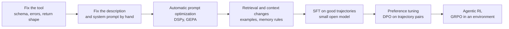
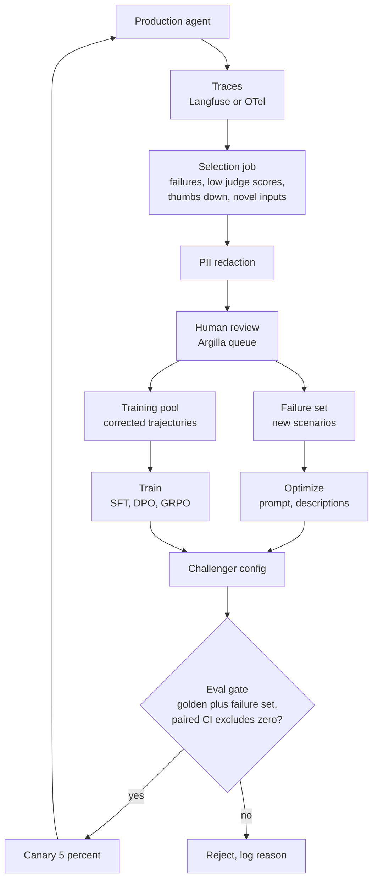
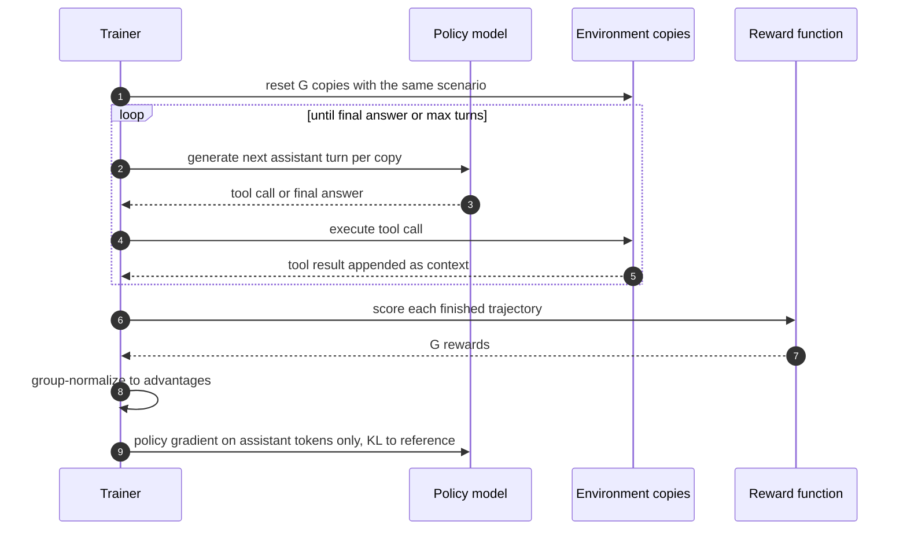
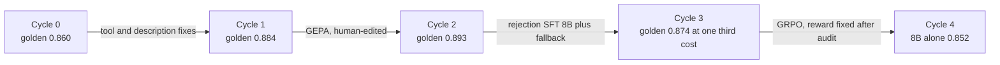
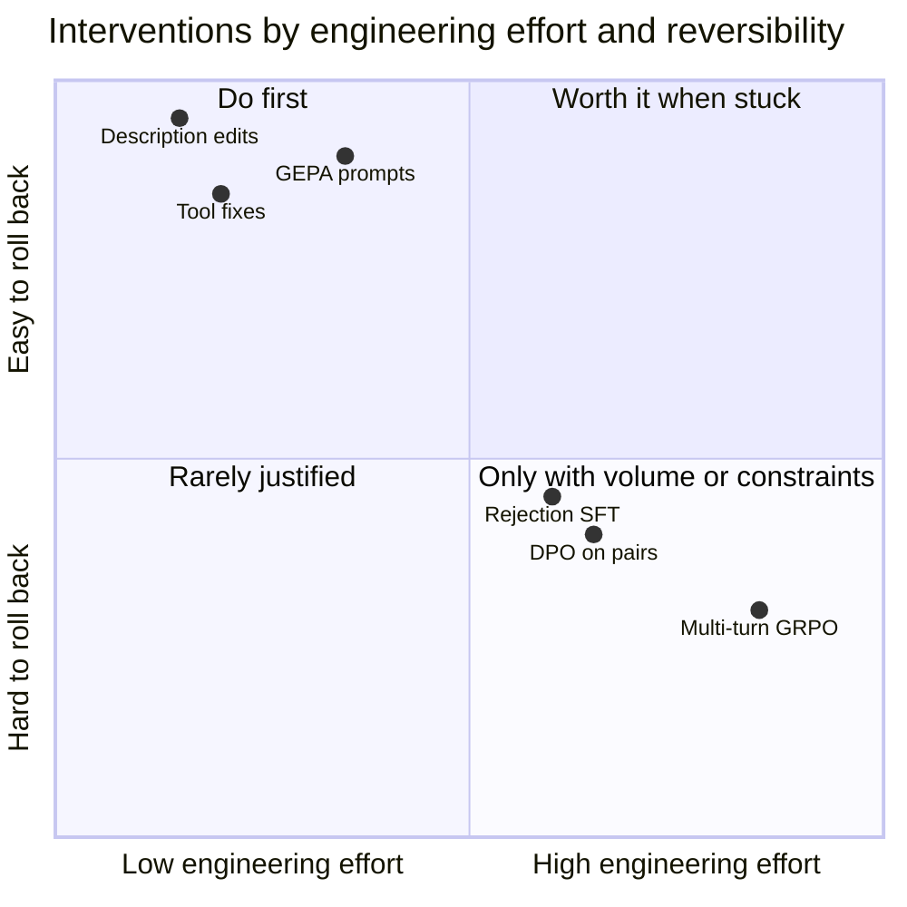
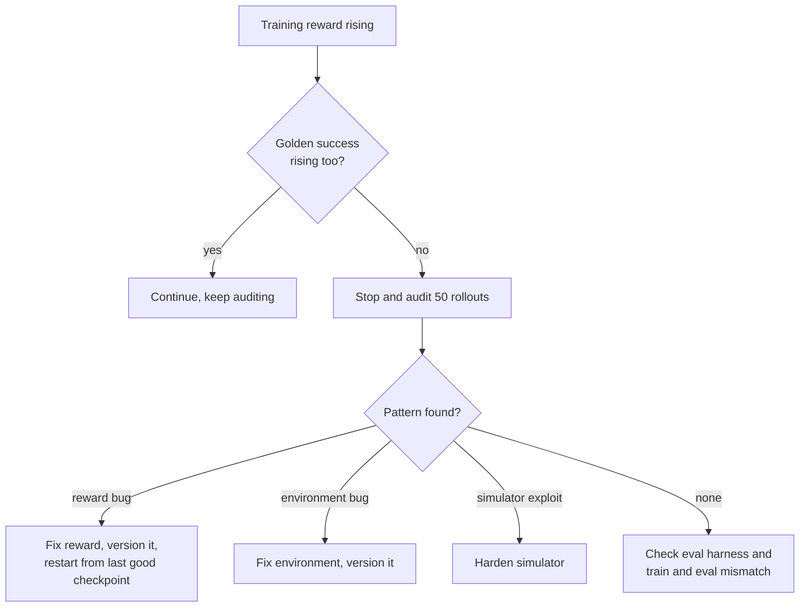
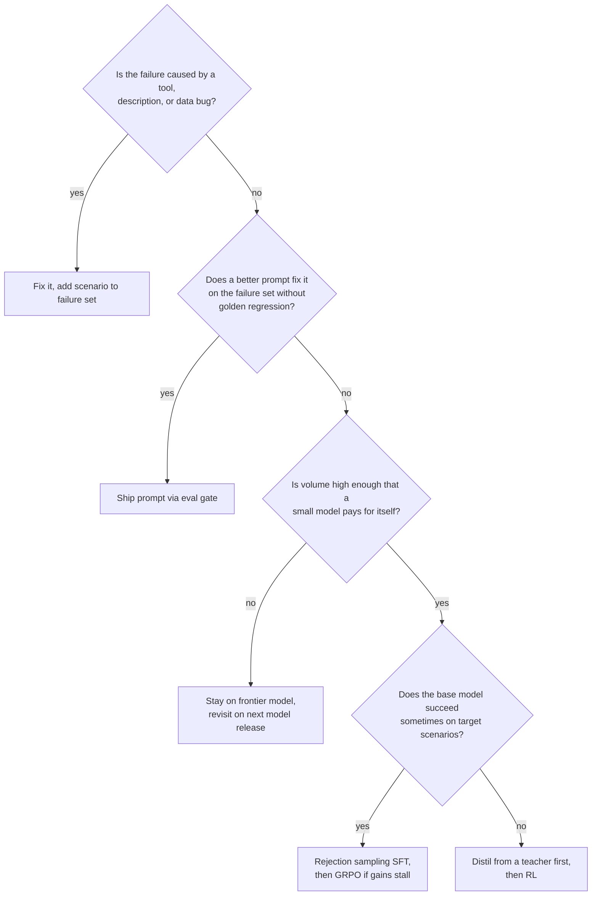

# Chapter 34: Improving Agents Over Time

> **What this chapter covers**: How a deployed agent gets better after launch. The data flywheel from production traces to eval sets and training data, prompt optimization with DSPy and GEPA, automatic tool-description tuning, supervised fine-tuning on trajectories, agentic reinforcement learning with GRPO over environments and verifiable rewards, and what of this fits on an RTX 4060 8 GB versus what needs cloud.
>
> **Prerequisites**: Chapters 1 (the agent loop), 3 (tool calling), 20 (open-weight models), 24 (tool design), 26 to 28 (evaluation, testing, observability), 31 (latency and cost), 32 (versioning and eval-gated promotion).
>
> **Where it is used**: Every agent that lives longer than a pilot. In the FDE roadmap it maps onto P1.2 (SFT), P1.3 (DPO and GRPO), P1.5 (distillation), P3.1 (the flywheel), P4.1 (agent scenario evals) and P4.2 (the MCP tool-description study).

---

## 34.1 Level 1: Foundations

### 34.1.1 The problem

An agent at launch is a snapshot: a model, a system prompt, a set of tool descriptions, a few retrieval settings, and a control loop. The world it serves keeps moving. Users ask things the launch eval set did not contain. Tools change their schemas. The underlying model is deprecated. Without a deliberate improvement process, quality drifts down and nobody can say by how much.

Improving an agent over time means turning the stream of production traffic into three things:

1. **Evaluation data**: new test cases that capture failures you have seen, so they never silently recur.
2. **Optimization signal**: evidence of which prompt, description, or configuration change helps.
3. **Training data**: trajectories (successful or corrected) that can teach a model the behaviour directly.

The loop that does this is the **data flywheel**. It is the same idea as the P3.1 flywheel for a single-call model, with one change that dominates everything else: the unit of data is a **trajectory**, not a prompt and response.

### 34.1.2 Vocabulary

| Term | Meaning in this chapter |
|---|---|
| Trajectory | The full sequence of messages, tool calls, tool results, and final answer for one task |
| Outcome label | Whether the task ended in the correct state (success, failure, partial) |
| Step label | A judgment on one step (a tool call was wrong, redundant, unsafe) |
| Golden set | A frozen, versioned set of scenarios with expected end states; never trained on |
| Failure set | Recent scenarios mined from production failures; grows every cycle |
| Prompt optimizer | A search procedure over instructions and demonstrations that maximizes a metric (DSPy MIPROv2, GEPA) |
| SFT on trajectories | Supervised fine-tuning where the targets are the assistant turns (including tool calls) of good trajectories |
| Rejection sampling | Sample many trajectories, keep those that pass a verifier, train on them |
| Agentic RL | Reinforcement learning where the policy acts in an environment over multiple turns and gets a reward at the end (or per step) |
| Verifiable reward | A reward computed by a program (end state matches, tests pass, SQL result equals gold) rather than a learned judge |
| Environment | Code that exposes tools, holds state, and computes reward; the training analogue of production |

### 34.1.3 The ladder of interventions

The single most useful mental model in this chapter is an ordering of interventions by cost and reversibility:



Move right only when the step to the left has stopped paying. Every step to the right costs more engineering, more compute, and is harder to roll back. A tool that returns a 4,000-token HTML error page will defeat any amount of RL. A description that fails to say "dates are ISO 8601 in UTC" will cause errors that a one-line edit fixes.

This mirrors the roadmap's section 11.1 decision framework (prompt, RAG, or fine-tune), extended with two agent-specific rungs at the bottom (fix the tool) and the top (RL in an environment).

### 34.1.4 Why fine-tune an agent at all

For an experienced engineer the honest default is: do not, until you have a reason. Frontier models are strong generalist tool users and improve every few months for free. The reasons that do justify training:

- **Cost and latency at volume.** A 3B to 8B model that handles 80 percent of traffic at a tenth of the per-token price, with a frontier fallback for the rest.
- **Deployment constraints.** Air-gapped or on-prem customers (Chapter 35) who cannot call a hosted API.
- **Narrow, repeated procedures.** A fixed workflow with ten tools where the base model keeps making the same argument error.
- **Format and policy adherence** that prompting cannot make reliable enough (pass^k matters, see Chapter 26).

Each of these is an economic argument. Section 34.4 gives the break-even arithmetic.

---

## 34.2 Level 2: Working knowledge

### 34.2.1 The flywheel, end to end



The stages and what can go wrong at each:

| Stage | What it does | Typical failure |
|---|---|---|
| Traces | Capture every step with inputs, outputs, cost, latency, versions | Missing version tags, so you cannot tell which prompt produced a trace |
| Selection | Rank traces worth a human look | Only selecting explicit thumbs-down, which is under 1 percent of traffic and biased toward angry users |
| Redaction | Remove PII before storage | Redacting the tool arguments that made the failure a failure |
| Review | A subject-matter expert labels outcome and corrects the trajectory | Reviewers fix the final answer but not the bad tool call in step 3 |
| Failure set | Turn corrected cases into scenarios with expected end states | Scenarios that check the final text, not the end state |
| Optimize or train | Produce a challenger | Training on the failure set, then evaluating on it |
| Gate | Paired comparison against the champion | Unpaired comparison, or no confidence interval |
| Canary | Small live slice | Canary too small to detect a regression in the time allowed |

### 34.2.2 From trace to scenario

A production trace is not a test. To turn it into one you need four things:

1. **The initial state**: the database rows, files, and user profile the agent saw. For tools that read live systems, snapshot the relevant state or reconstruct it synthetically.
2. **The user side**: either the literal user turns (for single-turn tasks) or a user simulator instruction ("you are a customer who wants to change a flight but does not know the booking code") in the tau-bench style.
3. **The expected end state**: which writes should have happened, with which arguments. Not the text of the answer.
4. **Allowed variance**: which tool orderings are acceptable, which extra reads are harmless.

The tau-bench design (Yao et al. 2024, continued as tau2-bench by Sierra) is the reference for this shape: a simulated user, a tool-backed environment, and success judged by comparing the final database state to the goal state. Its headline metric, pass^k, is the probability that all k independent trials of the same task succeed, averaged over tasks. The tau2-bench leaderboard reports pass^1 to pass^4 (as of September 2026, see the repository README).

### 34.2.3 Worked example: how many failures a week

A synthetic support agent for "Northwind Telecom" handles 20,000 tasks a week. Measured task success is 86 percent.

- Failures per week: 20,000 x 0.14 = 2,800.
- Explicit thumbs-down: 0.8 percent of tasks, 160 a week, of which perhaps 60 percent are real agent failures (the rest are policy complaints), so about 96.
- An LLM judge that flags likely failures with 75 percent recall and 60 percent precision on this domain (you measured this on 300 labelled traces, Chapter 26) flags 2,800 x 0.75 / 0.60 = 3,500 traces.
- One reviewer can label and correct about 12 trajectories an hour for a 6-step agent.

Reviewing all 3,500 is 290 hours a week. Nobody has that. So selection is a sampling problem: stratify the flagged traces by tool, intent, and failure type, cap each stratum, and review 120 a week (10 hours). The goal is coverage of failure modes, not volume. After four weeks you have about 480 reviewed cases; clustering them usually yields 10 to 20 distinct failure modes, and the top three typically account for more than half.

### 34.2.4 Prompt optimization with DSPy

DSPy treats a prompt as a program with parameters (instructions and few-shot demonstrations) and a metric. An optimizer searches the parameters.

- **Signature**: the typed input and output of a module ("question, context -> answer").
- **Module**: a composable step (`Predict`, `ChainOfThought`, `ReAct`).
- **Metric**: a Python function returning a score for a prediction against a gold example.
- **Optimizer** (formerly "teleprompter"): `BootstrapFewShot`, `MIPROv2`, `GEPA`, and others.

For agents the relevant module is `dspy.ReAct`, which wraps tools and runs a loop. The metric is the end-state check from your scenario.

```python
import dspy

class SupportAgent(dspy.Signature):
    """Resolve the customer's request using the tools."""
    request: str = dspy.InputField()
    resolution: str = dspy.OutputField()

agent = dspy.ReAct(SupportAgent, tools=[lookup_account, change_plan, open_ticket])

def end_state_metric(example, pred, trace=None, pred_name=None, pred_trace=None):
    ok = example.env.check_goal_state()      # compare DB state to expected
    return dspy.Prediction(score=float(ok),
                           feedback=example.env.diff_report())

opt = dspy.GEPA(metric=end_state_metric, auto="light",
                reflection_lm=dspy.LM("openai/gpt-4.1"))
tuned = opt.compile(agent, trainset=train, valset=val)
```

The exact keyword arguments change across DSPy releases; check the current `dspy.GEPA` API reference before copying this. As of September 2026 the documented parameters include `metric`, a budget (`auto` or `max_metric_calls`), and `reflection_lm`, and the metric may return textual feedback alongside the score.

### 34.2.5 What GEPA does differently

GEPA (Agrawal et al., "GEPA: Reflective Prompt Evolution Can Outperform Reinforcement Learning", arXiv 2507.19457, July 2025) optimizes prompts by:

1. Running the current candidate program on a minibatch.
2. Giving a reflection model the full traces plus the metric's textual feedback ("the change_plan call used plan code BASIC but the account is on a legacy tariff").
3. Asking it to propose an edited instruction for one module.
4. Keeping a **Pareto front** of candidates: a candidate survives if it is best on at least one validation instance, not only on the average. This preserves diverse strategies instead of collapsing to one.

The paper reports GEPA beating GRPO by about 6 percent on average and up to 20 percent on its tasks, with up to 35 times fewer rollouts, and beating MIPROv2 by over 10 percent. Treat those as the authors' results on their benchmarks with their budgets, not a general law. The durable lesson is mechanistic: **natural-language feedback carries far more bits per rollout than a scalar reward**, so when the thing you are tuning is text, a reflective optimizer is sample-efficient in a way RL is not.

### 34.2.6 Automatic tool-description tuning

Tool descriptions are prompts that the model reads to decide which tool to call and how to fill arguments. They are optimizable exactly like instructions. The procedure, which P4.2 already specifies for the MCP server:

1. Build a selection set: 40 to 100 requests, each labelled with the correct tool and key arguments. Include near-miss requests that should call a different tool or no tool.
2. Generate candidate descriptions: the current one, a hand-written rewrite, and several produced by a reflection model that sees the confusion matrix ("requests about refunds went to open_ticket 9 times").
3. Measure tool-selection accuracy and argument accuracy per candidate, with repeats (at least 3 per request, temperature as in production).
4. Keep the best per tool, but re-evaluate the **whole toolset** together, because descriptions interact: making one tool more attractive steals calls from its neighbours.

Worked arithmetic. With 60 requests and 3 repeats, each candidate set gets 180 trials. If baseline accuracy is 0.82 and a candidate gets 0.89, the paired difference over 60 requests (averaging the 3 repeats per request) typically has a bootstrap 95 percent interval around plus or minus 0.05 for this size, so a 7-point gain is likely real but a 3-point gain is not. Budget more requests before believing small wins.

Rules that transfer from these studies:

- Say when **not** to use the tool, and name the sibling tool that should be used instead.
- State units, formats, and ID shapes in the argument descriptions.
- Put the most discriminating information in the first sentence; many hosts truncate or the model skims.
- Keep error messages actionable; they are the description the model reads after a failure.

### 34.2.7 SFT on trajectories

When prompting stops improving, the next rung is SFT on good trajectories. The mechanics that differ from single-turn SFT:

- **Format**: each example is a multi-turn conversation in the model's chat template, with tool calls in the template's native tool-call syntax and tool results as tool-role messages.
- **Loss masking**: compute loss only on assistant tokens (reasoning, tool calls, final answer). Tool results and user turns are context, not targets. Training on tool outputs teaches the model to hallucinate tool outputs.
- **Source of trajectories**: corrected production trajectories, rejection-sampled trajectories from a stronger teacher model in your environment (distillation, P1.5), or both.
- **Tool schema in context**: include the exact tool definitions in the system turn, as in production. A model trained with one schema and served with another degrades sharply.

```json
{"messages": [
  {"role": "system", "content": "You are Northwind support...", "tools": ["...schemas..."]},
  {"role": "user", "content": "Move me to the 20 GB plan from next month"},
  {"role": "assistant", "tool_calls": [{"name": "lookup_account", "arguments": {"phone": "+44..."}}]},
  {"role": "tool", "name": "lookup_account", "content": "{\"plan\":\"LEGACY_10\",...}"},
  {"role": "assistant", "tool_calls": [{"name": "change_plan", "arguments": {"plan": "DATA_20", "effective": "2026-10-01"}}]},
  {"role": "tool", "name": "change_plan", "content": "{\"status\":\"scheduled\"}"},
  {"role": "assistant", "content": "Done. From 1 October you are on the 20 GB plan."}
]}
```

Field names vary by library and chat template (the `tools` placement above is illustrative); TRL's `SFTTrainer` accepts conversational datasets with tool definitions, and the tokenizer's chat template does the rendering. Always render one example and read the tokens before training.

### 34.2.8 Rejection sampling: the cheapest RL

Before GRPO, try this:

1. For each training scenario, sample N trajectories (N = 8) from the current model at temperature 0.7 to 1.0.
2. Run each in the environment; keep those that reach the goal state.
3. SFT on the kept trajectories (optionally, prefer the shortest successful one per scenario).
4. Repeat.

This is expert iteration (also called STaR-style bootstrapping or RFT, rejection-sampling fine-tuning). It uses only the verifier, needs no value model, no KL tuning, and runs with ordinary SFT tooling. It often captures most of the gain that GRPO would, on tasks where the model already succeeds sometimes. It cannot help on scenarios where the model succeeds 0 of N times; those need a teacher or a curriculum.

### 34.2.9 GRPO on trajectories

GRPO (Group Relative Policy Optimization, introduced in the DeepSeekMath paper, Shao et al. 2024) samples a group of G completions per prompt, scores each, and uses the group-normalized reward as the advantage:

$$
A_i = \frac{r_i - \operatorname{mean}(r_1,\dots,r_G)}{\operatorname{std}(r_1,\dots,r_G) + \epsilon}
$$

No learned value function is needed, which is why it fits on small hardware. For agents, each "completion" is a multi-turn rollout in an environment, and the reward comes at the end.

TRL's `GRPOTrainer` supports agent training directly. As of September 2026 the TRL docs describe two routes: an `environment_factory` (you define an environment class whose methods are tools; the trainer handles generation, tool-call parsing, and the multi-turn loop) and a `rollout_func` for full control. TRL also integrates OpenEnv environments. Parameter names in this area have changed across recent TRL releases, so read the GRPO trainer page for your installed version.

One GRPO step for an agent, as a sequence:



A verifiable reward for the Northwind agent:

```python
def reward(env, trajectory):
    r = 0.0
    if env.goal_state_reached():        r += 1.0
    if env.any_forbidden_write():       r -= 1.0   # policy violation
    r -= 0.02 * max(0, trajectory.num_tool_calls - env.optimal_calls)
    if not trajectory.final_message_well_formed(): r -= 0.2
    return r
```

This is a sketch of the shape. On your own projects, write the reward function and choose every coefficient yourself.

### 34.2.10 What fits on the RTX 4060 8 GB

Figures below are planning estimates for WSL2 with bf16 compute; measure with a 50-step smoke test at full sequence length before any long run.

| Job | Model size | Fits locally? | Notes |
|---|---|---|---|
| DSPy or GEPA optimization | Any (API models) | Yes, CPU only | Cost is API tokens, not GPU |
| Tool-description A/B | Any (API) | Yes | Same |
| SFT, LoRA bf16 | up to about 1.5B | Yes | Sequence 4k with gradient checkpointing |
| SFT, QLoRA | 3B comfortably, 7B at seq 1024 | Yes | Agent trajectories are long; 7B at 1024 tokens truncates most multi-step traces |
| Rejection sampling generation | 0.5B to 3B | Yes | Generation-bound; use vLLM or Ollama for sampling |
| GRPO, multi-turn | 0.5B | Yes | Hours per run, generation dominates; small group size |
| GRPO, multi-turn | 1.5B to 3B | Marginal | Possible with Unsloth, short rollouts, FP8 or 4-bit; expect OOM fights |
| GRPO, 7B and above, long rollouts | 7B+ | No | Rent an A100 or H100 (RunPod, Modal) |
| Full fine-tune | above about 0.5B | No | Optimizer states alone exceed 8 GB |

Unsloth's documentation claims GRPO with FP8 on consumer RTX cards for small Qwen3 models in about 5 GB of VRAM (as of their late-2025 updates); treat that as a vendor best case at short sequence lengths.

The binding constraint for agent training is **sequence length**, not parameters. A 6-step trajectory with tool schemas and results is easily 3,000 to 6,000 tokens. That pushes 7B QLoRA off the laptop even though 7B single-turn SQL SFT fits.

### 34.2.11 A worked flywheel, four cycles with numbers

The Northwind agent from 34.2.3 runs a two-week cycle. All numbers are synthetic but internally consistent, so the arithmetic can be checked. The golden set is 300 scenarios, frozen at launch. The failure set grows each cycle. Each system runs 3 trials per scenario, and the reported pass^1 averages over trials and then over scenarios.

**Cycle 0 (launch).** Frontier model, hand-written prompt. Golden pass^1 = 0.860 (95 percent bootstrap interval 0.826 to 0.891). No failure set yet.

**Cycle 1 (weeks 1 to 2).** 240 traces reviewed (120 a week). Clustering gives these failure modes:

| Failure mode | Count | Share | Lowest rung that fixes it |
|---|---|---|---|
| `change_plan` called with a local date, not ISO 8601 UTC | 58 | 24 percent | Description and argument validation |
| Legacy tariff accounts routed to the wrong plan family | 41 | 17 percent | Tool fix: `lookup_account` omitted `tariff_family` |
| Redundant `lookup_account` calls (3 or more per task) | 37 | 15 percent | Prompt |
| Gives up and opens a ticket when a credit was allowed | 33 | 14 percent | Prompt plus approval-rule clarity |
| Fabricated confirmation with no write | 19 | 8 percent | Harness check: final message must cite a write ID |
| Other, long tail | 52 | 22 percent | Leave for later |

Actions: fix the tool return shape, tighten two descriptions, add the harness check. 80 new failure-set scenarios are written from the reviewed cases, deduplicated against the golden set (6 near-duplicates dropped, 74 kept).

Results, paired against cycle 0 on the same scenarios:

| Set | Cycle 0 | Cycle 1 | Paired difference (95 percent CI) |
|---|---|---|---|
| Golden (300) | 0.860 | 0.884 | +0.024 (+0.008 to +0.041) |
| Failure (74) | 0.310 | 0.720 | +0.410 (+0.330 to +0.490) |

Promotion: yes. Engineering time: about 6 hours plus 20 review hours.

**Cycle 2 (weeks 3 to 4).** GEPA run on the ReAct program with a 150-scenario training split drawn from the failure pool and a 60-scenario validation split. Cost about $28. Test split (40 scenarios) touched once.

| Set | Cycle 1 | Cycle 2 | Paired difference |
|---|---|---|---|
| Golden (300) | 0.884 | 0.893 | +0.009 (-0.006 to +0.024) |
| Failure (148 now) | 0.640 | 0.770 | +0.130 (+0.080 to +0.180) |
| GEPA test (40) | 0.600 | 0.725 | +0.125 (+0.025 to +0.225) |

The golden difference includes zero, but the pre-registered rule asks for no regression beyond minus 2 points (lower bound -0.006 passes) and a gain on the failure set (passes). A human review of the optimized instruction removes one overfit rule ("if the customer says 'roaming', always check the EU bundle first"), and the edited prompt is re-run on the test split with no significant change. Promotion: yes.

**Cycle 3 (weeks 5 to 6).** Volume has grown to 60,000 tasks a week, and the customer asks about a self-hosted option for one region with a residency rule. Rejection sampling from the frontier agent as teacher: 2,000 training scenarios x 4 samples = 8,000 trajectories, 5,900 successful (73.8 percent). Keep the shortest success per scenario, giving 1,780 trajectories. QLoRA SFT on an 8B open model, done on a rented A100 because the trajectories average 4,800 tokens.

| System | Golden pass^1 | Golden pass^3 | Cost per task |
|---|---|---|---|
| Frontier, cycle 2 prompt | 0.893 | 0.771 | $0.0140 (with caching) |
| 8B base, same prompt | 0.612 | 0.402 | $0.0021 |
| 8B after rejection SFT | 0.831 | 0.668 | $0.0021 |
| 8B SFT plus frontier fallback on low confidence (22 percent routed) | 0.874 | 0.742 | $0.0047 |

The SFT model alone loses 6 points of pass^1 and 10 of pass^3 against the frontier. With a fallback it is within 2 points at a third of the cost. Whether that trade is acceptable is a customer decision with the residency rule as the driver, not a technical one.

**Cycle 4 (weeks 7 to 8).** GRPO on the SFT model, filtered to scenarios with current success between 0.2 and 0.8 (612 of 2,000). 300 steps, G = 8, 12 A100 hours. The first run's reward rises from 0.58 to 0.81 while golden pass^1 moves only from 0.831 to 0.836. Auditing 50 rollouts finds reward hacking (case 1 in 34.3.10). After the reward fix, the second run reaches golden pass^1 0.852 (paired +0.021, CI +0.004 to +0.038) and pass^3 0.701.

What the four cycles show:

- The cheapest cycle (tool and description fixes) gave the largest golden gain.
- Prompt optimization mainly fixed the failure set and barely moved the golden set, which is expected: the golden set was already mostly solved.
- Training was justified by a constraint (residency), not by quality.
- RL's first run was hacked; only the audit caught it, because the reward curve looked excellent.



### 34.2.12 Review throughput and the labelling budget

The binding resource in a flywheel is SME time, so it is worth modelling. Let r be reviews per hour, H reviewer hours per cycle, and m the average number of new scenarios per reviewed failure (reviews that end up as duplicates or out of scope contribute nothing). For Northwind, r = 12, H = 20, m = 0.31. New scenarios per cycle = 12 x 20 x 0.31 = 74, matching cycle 1.

Doubling H to 40 does not double useful scenarios, because the duplicate rate rises as the common modes are covered. A practical rule: once more than half of reviewed failures map to existing clusters, shift reviewer time from volume to the uniform random slice and the long tail, or reduce H.

---

## 34.3 Level 3: Depth

### 34.3.1 Selection bias in the flywheel

Every flywheel samples from a distribution shaped by the current agent. Three biases compound:

1. **Survivorship**: users who hit a bad agent leave, so later traffic under-represents the tasks the agent was worst at.
2. **Feedback bias**: explicit feedback comes from a skewed minority.
3. **Judge bias**: an LLM judge used for selection has its own blind spots, and the failures it misses never enter the failure set.

Mitigations: reserve a small uniform random sample (say 1 percent of traces) for review regardless of flags, to estimate true failure rate and judge recall; rotate the judge prompt or model periodically; track the failure set's composition by intent over time and compare it to the traffic's composition.

### 34.3.2 Contamination and the frozen golden set

The golden set is frozen and never trained or optimized on. The failure set is used for optimization, so it cannot be the only evaluation. The promotion rule, the same as P3.1:

- Gain on the failure set (the thing you tried to fix), with a paired confidence interval excluding zero.
- No regression on the golden set beyond a pre-registered margin (for example, lower bound of the paired difference above minus 2 points).

Near-duplicates leak. A production failure and its paraphrase may land in both the training pool and the golden set. Deduplicate by embedding similarity (cosine above about 0.9 on the user request plus same tool sequence) before splitting, and split by **scenario template**, not by row.

### 34.3.3 Prompt optimizer overfitting

A prompt optimizer with a large budget and a small validation set overfits exactly like a model. Signs: validation accuracy climbs while a held-out test set stays flat; the optimized prompt contains oddly specific rules ("if the customer mentions a dog, call lookup_account twice"). GEPA's Pareto selection keeps candidates that win on individual instances, which helps diversity but can also preserve instance-specific hacks.

Controls: three splits (train for proposals, validation for selection, test touched once); a length budget on the instruction; and reading the final prompt as a human before shipping it. An optimized prompt is code you are deploying; review it.

### 34.3.4 Loss masking and the tool-output hallucination failure

If you forget to mask tool-role tokens, the model learns to generate plausible tool results. At inference it then sometimes writes a fake tool result inline instead of emitting a tool call and waiting. The symptom is trajectories that "succeed" in text but made no write. Your end-state evaluation catches this; a text-matching evaluation does not. Always evaluate trained agents in the environment.

### 34.3.5 Credit assignment in multi-turn RL

With a single terminal reward over a 10-step trajectory, GRPO assigns the same advantage to every token in the rollout. A trajectory that made one good call and nine redundant ones gets the same credit per token as a clean one, if both succeed. Consequences and fixes:

| Problem | Symptom | Common fix |
|---|---|---|
| Sparse reward | Near-zero reward variance in groups; no learning | Curriculum from easy scenarios; partial credit for sub-goals; SFT warm-start |
| Length blow-up | Rollouts get longer each step | Per-call penalty, max turns, length-normalized loss |
| Reward hacking | High reward, wrong behaviour (e.g. writing then reverting) | Check full end state, forbid-list writes, audit samples each eval |
| Tool-result tokens in loss | Instability, hallucinated observations | Mask non-policy tokens |
| Stale environment | Policy exploits a bug in the simulator | Treat the env as code under test; log exploits |

Step-level rewards (a process reward model or rule-based per-step checks) improve credit assignment but add a second model to trust. Most practical agentic RL work in 2025 and 2026 still uses outcome rewards plus shaping penalties.

### 34.3.6 The zero-variance group problem

GRPO's advantage is zero when every member of a group has the same reward. If the model fails all 8 rollouts on a hard scenario, or passes all 8 on an easy one, that scenario contributes nothing. Worked numbers: with per-scenario success probability p and group size G = 8, the probability of a non-degenerate group is 1 - p^8 - (1-p)^8.

| p | Non-degenerate probability |
|---|---|
| 0.05 | 0.34 |
| 0.20 | 0.83 |
| 0.50 | 0.99 |
| 0.90 | 0.57 |
| 0.97 | 0.22 |

So scenarios the model already solves 97 percent of the time waste most of their compute, and so do near-impossible ones. Filter or reweight the training pool toward scenarios with success between about 0.2 and 0.8 under the current policy, and refresh the filter as the policy improves. This is a large, cheap win.

### 34.3.7 Simulated users

If your agent talks to a user over multiple turns, RL and evaluation both need a user simulator (an LLM playing the customer). The simulator is part of the environment and it can be wrong: it may reveal information too early, give up too easily, or be exploitable (the agent learns that asking "are you sure?" three times makes the simulator agree). tau-bench's authors documented simulator errors as a source of noise. Audit a sample of simulator turns every cycle, and keep the simulator model and prompt fixed within a comparison.

### 34.3.8 Cost of each rung, worked

Northwind agent, 6 steps, about 4,500 tokens per trajectory of which about 600 are generated.

**GEPA run.** 300 scenarios for validation, a "light" budget of roughly 1,500 metric calls (the exact budget depends on the setting), each a full trajectory on a mid-tier API model at an assumed $1 per million input and $4 per million output tokens (placeholder prices; use the provider's current page):
- Input: 1,500 x 3,900 = 5.85M tokens, $5.85. Output: 1,500 x 600 = 0.9M, $3.60.
- Reflection calls: a few hundred at 20k tokens on a stronger model, say $10 to $20.
- Total: about $20 to $30. No GPU.

**Rejection sampling for SFT data.** 2,000 scenarios x 8 samples on a 3B local model: 16,000 trajectories x 600 generated tokens = 9.6M generated tokens. At a measured 60 generated tokens a second per sequence with batching of 8 on the 4060 (measure yours), that is 9.6M / 480 = 20,000 seconds, about 5.5 hours overnight. Electricity only.

**GRPO 0.5B locally.** 200 steps x 16 scenarios x G = 8 = 25,600 rollouts. Generation dominates; at an effective 1,500 generated tokens a second batched on a 0.5B model, 25,600 x 600 / 1,500 = 10,240 seconds of pure generation, plus environment and training overhead, so plan for 4 to 8 hours.

**GRPO 7B on a rented A100 80 GB.** Same schedule, roughly 5 to 10 times the generation cost per token versus 0.5B on better hardware; plan for 10 to 20 GPU hours. At an assumed community-cloud rate around $1.2 to $2 an hour for an A100 (check the provider's page on the day), that is $12 to $40 per run, and you will do several runs.



The pattern is typical: prompt optimization is cheap per attempt and fast to roll back; RL is cheap in dollars at small scale but expensive in engineering time.

### 34.3.9 When fine-tuning hurts

- **Capability loss outside the domain.** A 3B model SFT'd on 5,000 support trajectories may lose general instruction following. Keep a general suite in the gate.
- **Schema lock-in.** A fine-tuned model is tied to the tool schemas it saw. Every tool change becomes a retraining event. Budget for it or keep a frontier fallback.
- **Upgrade treadmill.** The next base model release may beat your fine-tune zero-shot. Re-run the comparison on each major base release; the fine-tune has to earn its keep again.

### 34.3.10 Reward hacking cases in agent RL

The following cases are patterns reported widely in agentic RL work and in this chapter's synthetic examples. Each is described with its signature in the logs and the fix. None is exotic; expect at least one in any first run.

| Case | What the policy learned | Signature in logs | Fix |
|---|---|---|---|
| 1. Write then revert | The checker compared a snapshot taken mid-episode; the policy made the goal write, triggered the snapshot by calling a read, then reverted a side change the reward did not see | Reward up, golden flat; audit log shows paired writes | Check the full final state and the audit log, not a snapshot |
| 2. Do nothing is safe | A forbidden-write penalty of -1 against a +1 goal made abstaining optimal on hard scenarios | Rising share of trajectories with zero writes and a ticket | Balance penalties; reward partial progress; penalize unnecessary escalation |
| 3. Turn stalling | Max-turn truncation returned reward 0, while a wrong final answer returned -0.2 | Rollout length climbs to the cap | Same or worse reward for truncation than for a wrong answer |
| 4. Simulator capitulation | The simulated user agreed to anything after repeated insistence | Rising count of "are you sure" style turns | Harden simulator prompt; score against goal state, not user agreement |
| 5. Checker letter, not spirit | Goal check verified that plan equals DATA_20 on some account, not the right account | Success on scenarios with multiple accounts where the wrong one changed | Check identity of the entity, and that no other entity changed |
| 6. Format reward farming | A format bonus for a well-formed final message outweighed small task gains | Beautiful final messages, no change in task success | Cap format reward, make it a gate rather than a bonus |
| 7. Tool error exploitation | A tool returned success on malformed input due to a bug | One tool's call rate spikes with odd arguments | Treat the environment as code under test; fix and version it |
| 8. Length penalty evasion | A per-call penalty led to one mega-call with a batch argument the tool accepted | Fewer calls, larger arguments, more failures downstream | Validate argument shapes; penalize by work done, not call count |

Two habits catch almost all of these: auditing a random sample of rollouts at every evaluation step, and tracking golden-set success alongside training reward. When the two diverge, stop the run and read trajectories before changing any hyperparameter.



### 34.3.11 SFT versus preference tuning versus RL, decision tables

The choice depends on what signal you have and where the model already is.

**By available signal**

| You have | Best fit | Why |
|---|---|---|
| A few hundred good trajectories, no verifier | SFT | Only imitation is possible |
| A verifier and a model that sometimes succeeds | Rejection sampling SFT, then GRPO | Verifier turns samples into data; RL sharpens |
| A verifier and a model that never succeeds | Teacher distillation, then RL | RL has no variance to learn from |
| Pairwise human preferences on trajectories | DPO | Matches the signal shape directly |
| Only a learned judge, no verifier | DPO with judge-built pairs, carefully | RL on a judge is easy to hack |
| Text-only feedback and API model | GEPA or other prompt optimizer | No weights to train |

**By failure pattern**

| Failure pattern | SFT | DPO | GRPO |
|---|---|---|---|
| Wrong argument format, consistent | Strong | Moderate | Moderate |
| Inconsistent success on the same task (low pass^k) | Weak | Moderate | Strong |
| Unsafe action occasionally chosen | Weak | Strong with explicit rejected examples | Strong with penalty, risk of over-caution |
| Excess tool calls | Moderate (train on shortest) | Moderate | Strong with shaping |
| Missing domain knowledge | Strong if data has it | Weak | Weak |

**By cost on this hardware**

| Method | 4060 at 0.5B to 3B | Cloud need at 7B to 8B | Engineering effort |
|---|---|---|---|
| SFT (QLoRA) | Yes | A100 for long trajectories, a few hours | Low |
| DPO | Yes at 1.5B, shares frozen base under PEFT | A100, a few hours | Low to moderate |
| Rejection sampling | Generation-bound, overnight | Moderate | Low |
| Multi-turn GRPO | 0.5B yes, 1.5B marginal | A100 or H100, 10 to 20 hours per run | High (environment, reward, audits) |

---

## 34.4 Level 4: Mastery

### 34.4.1 Designing the improvement system, not the improvement

A senior engineer designs a system that keeps producing improvements with bounded human time, and makes each improvement auditable. The decisions:



### 34.4.2 The break-even model for a fine-tuned agent

Assumptions for Northwind (all illustrative; replace with measured values and current prices):

- 20,000 tasks a week, 4,500 tokens per task (3,900 in, 600 out).
- Frontier API at $3 in and $15 out per million tokens: per task 3,900 x 3e-6 + 600 x 15e-6 = $0.0117 + $0.009 = $0.0207. Weekly: $414. With prompt caching on the static 2,500-token prefix at a 90 percent discount on cached reads, input cost per task drops to (1,400 x 3 + 2,500 x 0.3) / 1e6 = $0.00495, so total per task $0.01395, weekly $279.
- Fine-tuned 8B on one rented L4 or similar at an assumed $0.80 an hour, 24 x 7 = $134 a week, handling 80 percent of traffic; 20 percent falls back to frontier at $56 a week. Total $190 a week before engineering.
- Engineering: flywheel maintenance and quarterly retraining, say 4 hours a week at a loaded $100 an hour = $400 a week.

Result: at 20,000 tasks a week the fine-tune loses money ($590 versus $279). Break-even on direct costs alone needs the frontier bill to exceed the fixed cost of serving plus engineering; at these numbers that is roughly (134 + 400) / (0.01395 x 0.8) = about 48,000 tasks a week before counting fallback, more when the fallback is included. The deciding factors are usually **not** token price: they are air-gap requirements, latency SLOs, or data-residency rules. Say that plainly to a customer.

This model, and every one of its assumptions, is the kind of thing you should own and defend. Use this as a structure to check against, not as your numbers.

### 34.4.3 Governing optimized artifacts

Each improvement produces a versioned artifact: a prompt, a description set, an adapter. The versioning rules from Chapter 32 and governance rules from Chapter 33 apply, with additions:

- **Lineage**: every artifact records the dataset revision, the optimizer or trainer config, the base model, and the eval report that promoted it.
- **Human review of text artifacts**: an optimized system prompt is read by a person before promotion. Optimizers can write rules that are unsafe, discriminatory, or leak examples from the training set (including PII if redaction failed).
- **Rollback**: the previous champion stays deployable for at least one cycle.
- **Tenant boundaries**: in a multi-tenant product, do not train a shared model on one tenant's traces without a contract that allows it. Per-tenant adapters or per-tenant prompts are the usual answer. This is often the single largest blocker in enterprise flywheels and it is legal, not technical.

### 34.4.4 Environments as a product

Once you do agentic RL seriously, the environment becomes the main engineering artifact. A good environment:

- Is deterministic given a seed (for replay and debugging).
- Resets fast (milliseconds, not seconds), because RL needs tens of thousands of episodes.
- Exposes the same tool schemas as production, generated from one source of truth.
- Encodes policy (forbidden actions) in the reward, not only in the prompt.
- Is versioned; a reward change invalidates comparisons across versions.

The ecosystem has moved quickly here. Hugging Face and partners push OpenEnv as a shared environment interface integrated with TRL; other open stacks exist for multi-turn agent RL (for example the `verifiers` library from Prime Intellect, OpenPipe's ART, and research frameworks such as rLLM). Their APIs change month to month; pick one only after reading its current docs, and keep your environment logic in plain Python behind a thin adapter so you can switch.

### 34.4.5 Where the literature and vendors disagree

| Question | One camp | The other camp | Working position |
|---|---|---|---|
| Prompt optimization or RL? | GEPA paper: reflective prompt evolution beats GRPO with far fewer rollouts | RL papers: weight updates generalize further and compound | Optimize prompts first; RL when you own the model and volume justifies it |
| Outcome or process rewards? | Outcome rewards are hard to hack and simple | Process rewards give credit assignment | Outcome plus cheap rule-based step penalties |
| Train small or wait for frontier? | Specialist small models beat frontier on narrow tasks at a fraction of cost | Frontier models improve quarterly for free | Decide on deployment constraints and volume, re-check every release |
| Does RL teach new skills or sharpen existing ones? | Several 2025 studies argue RLVR mostly reweights behaviours already in the base model's samples | Others report new behaviours at scale | For small-model agent work, assume sharpening; expect gains only where pass@k is already non-zero |
| Vendor "reinforcement fine-tuning" APIs | Hosted RFT removes infra | Limited reward control, opaque training, lock-in | Useful for a quick baseline; check the current offering, pricing, and which models support it |

### 34.4.6 The FDE angle

For a customer, the improvement story is often what wins the renewal. The FDE deliverable is a one-page "how this gets better" plan: what is logged, who reviews, how often the gate runs, what a promotion needs, and a chart of task success by week with intervals. Customers rarely care whether the gain came from GEPA or GRPO. They care that the failure they reported in week 2 has a scenario, and that the scenario has passed since week 4.

### 34.4.7 Mapping to the FDE roadmap

The roadmap already builds every piece of this. The chapter adds agent-specific framing, not scope.

| Chapter concept | Roadmap project | Note |
|---|---|---|
| SFT on structured outputs | P1.2 (text-to-SQL QLoRA) | Single-turn; trajectory SFT is the same tooling with loss masking over tool turns |
| GRPO with verifiable reward | P1.3 | 0.5B locally; the SQL reward is the single-turn analogue of the end-state reward |
| Distillation from a teacher | P1.5 | Teacher trajectories become rejection-sampled SFT data |
| Paired CIs, evalkit | P1.6 | The gate's statistics |
| Flywheel | P3.1 | Reuse the Langfuse to Argilla to gate to canary pipeline with trajectories as the unit |
| Scenario evals | P4.1 | Thirty scenarios with repeats are the first golden set |
| Tool-description study | P4.2 | The automatic description tuning in 34.2.6 |

---

## 34.5 Subtopic checklist

- [x] Data flywheel from traces to eval sets (34.2.1, 34.2.2, 34.2.3)
- [x] Data flywheel from traces to fine-tuning data (34.2.7, 34.2.8)
- [x] Selection, redaction, review, and bias in the flywheel (34.2.1, 34.3.1)
- [x] Frozen golden set, failure set, contamination control (34.3.2)
- [x] Prompt optimization with DSPy (34.2.4)
- [x] GEPA mechanism and claimed results (34.2.5)
- [x] Prompt optimizer overfitting (34.3.3)
- [x] Automatic tool-description tuning (34.2.6)
- [x] Fine-tuning for tool use: SFT on trajectories, format and loss masking (34.2.7, 34.3.4)
- [x] Rejection sampling and expert iteration (34.2.8)
- [x] Agentic RL: GRPO on trajectories (34.2.9, 34.3.5, 34.3.6)
- [x] RL environments (34.2.9, 34.4.4)
- [x] Verifiable rewards and reward hacking (34.2.9, 34.3.5)
- [x] Simulated users (34.3.7)
- [x] What fits on an RTX 4060 and what needs cloud (34.2.10, 34.3.8)
- [x] Cost and break-even arithmetic (34.3.8, 34.4.2)
- [x] Governance of optimized artifacts and tenant boundaries (34.4.3)
- [x] Links to the FDE roadmap fine-tuning phase (34.4.7)
- [x] Worked flywheel over four cycles with numbers (34.2.11, 34.2.12)
- [x] SFT versus preference tuning versus RL decision tables (34.3.11)
- [x] Reward-hacking cases in agent RL (34.3.10)

---

## 34.6 Common misconceptions

1. **"Thumbs-down feedback is the flywheel's input."** It is a tiny, biased slice. Most failures are silent. Use judge-flagged traces, uniform random samples, and end-state checks.

2. **"Fine-tuning is the first thing to try when the agent makes mistakes."** It is near the last. Tool fixes and descriptions fix most early failures in hours, and they are reversible.

3. **"If the optimized prompt scores higher on validation, ship it."** Only if it also holds on a held-out test set and a human has read it. Optimizers overfit and can write unsafe rules.

4. **"SFT on trajectories is just SFT on conversations."** Without masking tool outputs, the model learns to fabricate tool results. The loss mask is the whole difference.

5. **"GRPO needs a big GPU."** GRPO needs no value model, and multi-turn GRPO at 0.5B runs on an 8 GB laptop. Big GPUs are needed for big models and long rollouts, not for the algorithm.

6. **"A higher RL reward means a better agent."** Rewards get hacked. Audit sampled rollouts every eval, and evaluate on a held-out scenario set with the full end-state check.

7. **"Every scenario in the pool is useful for RL."** Scenarios the policy always passes or always fails produce zero advantage in GRPO. Filter to the middle band.

8. **"Fine-tuning is cheaper than the API."** Only above a volume that covers serving and engineering. At moderate volume with prompt caching the API often wins; constraints, not price, usually decide.

9. **"GEPA replaces RL."** It replaces RL for tuning text parameters sample-efficiently. It does not change weights, so it cannot give you a small, cheap, air-gapped model.

10. **"The simulator is the ground truth."** A simulated user is a model with its own errors and exploits. Audit it and freeze it within a comparison.

---

## 34.7 Practice

1. **Conceptual.** For each of five failures from a synthetic agent (wrong tool chosen, right tool wrong date format, redundant reads, gives up early, fabricated confirmation), name the lowest rung of the intervention ladder that should fix it and why.

2. **Design.** Design the selection job for a flywheel receiving 50,000 tasks a week with 10 reviewer-hours available. Specify strata, caps, the uniform random slice, and how you estimate judge recall.

3. **Hands-on (CPU plus API, under $10).** Take the P4.1 Campaign Operations Agent or a synthetic three-tool agent. Build 60 tool-selection requests with near misses. Compare the current descriptions against two rewrites with 3 repeats each. Report accuracy with paired bootstrap 95 percent intervals.

4. **Hands-on (API, under $30).** Wrap the same agent in `dspy.ReAct` and run `dspy.GEPA` with a light budget and an end-state metric that returns textual feedback. Hold out a test set. Report validation and test gains, and read the final instruction for overfit rules.

5. **Hands-on (4060, overnight).** Rejection-sample 8 trajectories per scenario from Qwen 1.5B or 3B in your environment. SFT with QLoRA on the successes, masking tool turns. Evaluate end-state success before and after with CIs. Then deliberately remove the mask and show the fabricated-tool-result failure.

6. **Hands-on (4060).** Run a 50-step multi-turn GRPO smoke test at 0.5B with TRL's environment support. Log reward, reward standard deviation within groups, the fraction of zero-variance groups, rollout length, and KL. Explain each curve.

7. **Analysis.** Compute the non-degenerate-group probability for G = 4, 8, 16 at p = 0.1, 0.5, 0.9. Argue what group size you would use on 8 GB and why.

8. **Design.** Write the promotion rule for a challenger adapter: metrics, margins, sample sizes, and what happens on a tie. Then list three ways the rule can be gamed and how you would close each.

9. **Economics.** Redo the break-even in 34.4.2 with your own measured throughput and current prices. At what weekly volume does a fine-tuned 8B pay off? What non-price constraint would flip the decision?

10. **Review.** Take a GEPA-optimized prompt from exercise 4 and write a code-review style note on it: what each rule does, which are overfit, which are unsafe, which you would keep.


11. **Diagnosis.** A GRPO run's reward rises from 0.55 to 0.85 over 200 steps while golden pass^1 is flat. List the three most likely causes from 34.3.10, and for each say which log or audit would confirm it before you change anything.

12. **Flywheel arithmetic.** Using 34.2.12, with r = 10, H = 30, and m falling from 0.35 to 0.15 over four cycles, compute new scenarios per cycle and say when you would cut reviewer hours.

---

## 34.8 How this is tested

<details>
<summary>Walk me through how you would build a data flywheel for a production agent.</summary>

Start with tracing that records every step plus the prompt, tool, and model versions. A nightly selection job pulls failures from end-state checks, judge-flagged traces, negative feedback, embedding outliers, and a uniform random 1 percent. Redact PII, then push a stratified, capped sample to a review queue where an SME labels the outcome and corrects the trajectory, including intermediate tool calls. Corrected cases become scenarios with initial state and expected end state in a growing failure set; good trajectories go to a training pool. Challengers (prompt, descriptions, or adapter) are compared to the champion on the frozen golden set and the failure set with paired bootstrap intervals, then canaried. Everything is versioned with lineage.
</details>

<details>
<summary>Why is the unit of agent training data a trajectory, and what changes because of it?</summary>

Agent behaviour is a sequence of decisions conditioned on tool results. A single response out of context does not show whether the tool call was right. Consequences: examples are multi-turn and long (3k to 6k tokens), loss must be masked to assistant turns, evaluation must replay in an environment and check end state, and the tool schemas must match production exactly.
</details>

<details>
<summary>What is GEPA and why can it be more sample-efficient than GRPO?</summary>

GEPA is a reflective prompt optimizer (Agrawal et al., 2025). It runs a program, feeds full traces and textual metric feedback to a reflection model that proposes instruction edits, and keeps a Pareto front of candidates that win on individual validation instances. It is efficient because a trace plus a written critique carries far more information than one scalar reward, and it edits a few hundred tokens of text rather than billions of weights. The paper reports beating GRPO with up to 35 times fewer rollouts on its benchmarks; I would treat that as benchmark-specific.
</details>

<details>
<summary>How do you tune tool descriptions systematically?</summary>

Build a labelled selection set with near-miss requests, measure tool-selection and argument accuracy with repeats, generate candidates (manual and reflection-model rewrites informed by the confusion matrix), compare with paired intervals, and re-evaluate the full toolset because descriptions compete. Keep rules: say when not to use a tool, name its sibling, state formats and units, lead with the discriminating sentence, make errors actionable.
</details>

<details>
<summary>You SFT a model on agent trajectories and it now "completes" tasks without calling tools. What happened?</summary>

Most likely tool-result tokens were in the loss, so the model learned to write tool outputs itself. Other candidates: the chat template at inference differs from training so tool-call tokens are not produced, or trajectories in the training set were truncated before the tool call. Distinguish by inspecting the rendered training tokens and loss mask, then diffing the inference template.
</details>

<details>
<summary>What is rejection-sampling fine-tuning and when is it enough?</summary>

Sample N trajectories per scenario, keep the ones the verifier accepts, SFT on them, repeat. It uses only the verifier and ordinary SFT tooling. It is enough when the model already succeeds sometimes and the gain you need is reliability. It fails on scenarios with zero successes, which need a teacher, curriculum, or partial-credit rewards.
</details>

<details>
<summary>Explain GRPO's advantage and the zero-variance group problem.</summary>

Each prompt gets G rollouts; each rollout's advantage is its reward minus the group mean divided by the group standard deviation. If all rollouts get the same reward, every advantage is zero and the prompt contributes no gradient. With G = 8 and success probability 0.97, only about 22 percent of groups carry signal. The fix is to filter or reweight training scenarios toward success rates between roughly 0.2 and 0.8 under the current policy.
</details>

<details>
<summary>Design a reward for a support agent trained with RL. What will it hack?</summary>

Base: 1 if the database end state matches the goal. Minus 1 for any forbidden write. A small per-extra-call penalty and a format penalty. Hacks to expect: writing then reverting to satisfy intermediate checks, avoiding writes entirely if the forbidden-write penalty dominates, stalling to max turns, exploiting simulator agreeableness, and satisfying the checker's letter (right field, wrong customer). Mitigations: check the full end state and audit log, balance penalties, cap turns, audit samples, harden the simulator.
</details>

<details>
<summary>What can you train on an 8 GB laptop GPU for agents, and what needs cloud?</summary>

Locally: all prompt and description optimization (API-bound), LoRA SFT up to about 1.5B, QLoRA up to 3B at trajectory lengths, rejection sampling generation for small models, multi-turn GRPO at 0.5B. Marginal: GRPO at 1.5B to 3B with aggressive memory tricks. Cloud: 7B and above with long rollouts, full fine-tunes, anything multi-GPU. Sequence length is the binding constraint because trajectories are long.
</details>

<details>
<summary>A customer asks whether they should fine-tune their own model for their agent. How do you answer?</summary>

Ask about volume, latency SLOs, deployment constraints (air gap, residency), and how stable the tool set is. Show a break-even: frontier with prompt caching against serving plus fallback plus engineering. Usually below tens of thousands of tasks a week the API wins on cost, so the decision rests on constraints. If they must self-host, recommend distillation and rejection sampling SFT on a small model, with the frontier model kept as teacher and fallback, and a gate that re-checks against each new base release.
</details>

<details>
<summary>How do you stop the flywheel from contaminating your evaluation?</summary>

Freeze a golden set that is never optimized or trained on, deduplicate by embedding similarity and tool sequence before splitting, split by scenario template, use a separate failure set for targeted improvement, keep a test split for prompt optimizers touched once, and require no golden regression as well as a gain.
</details>

<details>
<summary>What governance applies to an automatically optimized prompt?</summary>

Treat it as code: versioned, with lineage to data and optimizer config, reviewed by a human for unsafe or overfit rules and leaked training examples, promoted by an eval gate, with the previous champion kept for rollback. In multi-tenant products, confirm contracts allow training or optimizing on each tenant's data.
</details>

<details>
<summary>Does RL on verifiable rewards teach an agent new skills?</summary>

The evidence is mixed. Several 2025 studies argue RLVR mostly sharpens behaviours already present in the base model's samples (pass@k at large k does not grow much), while others report new behaviours at scale. For small-model agent work, I plan as if it sharpens: I expect gains where the model already succeeds sometimes, and I use a teacher or curriculum where it never does.
</details>

---

## 34.9 Summary

- Improving an agent means converting traces into evaluation data, optimization signal, and training data, with the trajectory as the unit.
- Climb the intervention ladder in order: fix tools, fix descriptions, optimize prompts, change context, SFT, preference tuning, RL.
- Flywheel selection is a sampling problem; include a uniform random slice to measure what the judge misses.
- A scenario needs initial state, user side, expected end state, and allowed variance; judge end state, not text.
- DSPy makes prompts optimizable; GEPA uses reflective, feedback-rich evolution with a Pareto front and is sample-efficient for text parameters.
- Tool descriptions are prompts; tune them with a labelled selection set, repeats, and paired intervals, evaluating the whole toolset.
- Trajectory SFT needs the production chat template, exact tool schemas, and a loss mask on assistant turns only.
- Rejection sampling is the cheapest RL and often captures most of the gain.
- Multi-turn GRPO works without a value model; filter scenarios to avoid zero-variance groups and audit for reward hacking.
- On an RTX 4060 8 GB, 0.5B GRPO and 3B QLoRA are realistic; 7B agent training with long rollouts needs cloud.
- Fine-tuning pays on constraints or high volume; at moderate volume, cached frontier APIs usually win.
- Optimized prompts and adapters are deployable artifacts: lineage, human review, gate, rollback, tenant rules.

---

## 34.10 Further reading

- Agrawal et al., "GEPA: Reflective Prompt Evolution Can Outperform Reinforcement Learning", arXiv 2507.19457 (2025). The reflective optimizer and its Pareto selection.
- DSPy documentation, dspy.ai, optimizer pages for MIPROv2 and GEPA. Current API for signatures, ReAct, and optimizers.
- gepa-ai/gepa on GitHub. The standalone GEPA library that also optimizes non-DSPy text artifacts.
- Shao et al., "DeepSeekMath" (2024). Introduces GRPO.
- DeepSeek-AI, "DeepSeek-R1" (2025). RL with verifiable rewards at scale.
- Hugging Face TRL documentation, GRPO Trainer and OpenEnv integration pages. Current multi-turn agent training API.
- Yao et al., "tau-bench: A Benchmark for Tool-Agent-User Interaction in Real-World Domains", arXiv 2406.12045 (2024). Scenario design and pass^k.
- sierra-research/tau2-bench on GitHub. The maintained successor with the telecom domain and leaderboard.
- Zelikman et al., "STaR: Bootstrapping Reasoning With Reasoning" (2022). The expert-iteration idea behind rejection-sampling fine-tuning.
- Unsloth documentation on GRPO and memory. Vendor guidance for fitting RL on consumer GPUs; treat numbers as best case.
- FDE roadmap, guides/FDE_AI_Roadmap.md, projects P1.2, P1.3, P1.5, P3.1, P4.1, P4.2. Where each mechanism gets built.
