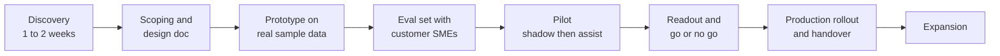
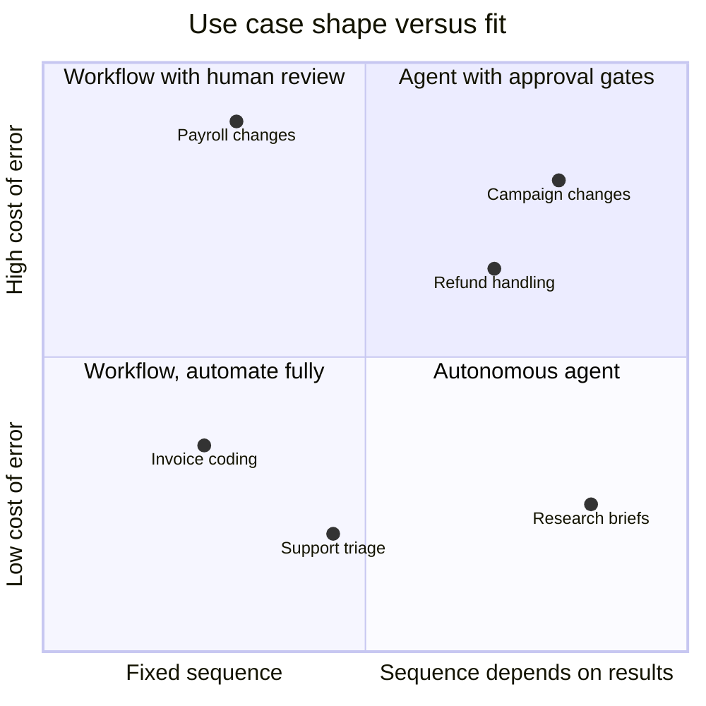
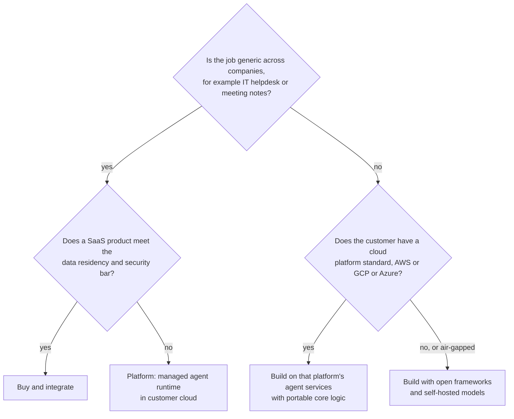
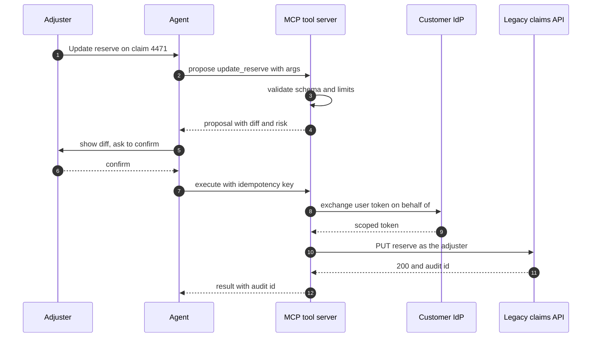
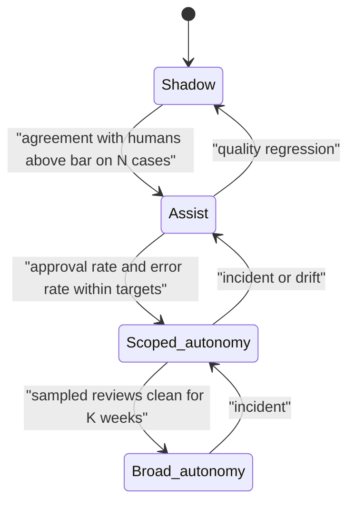
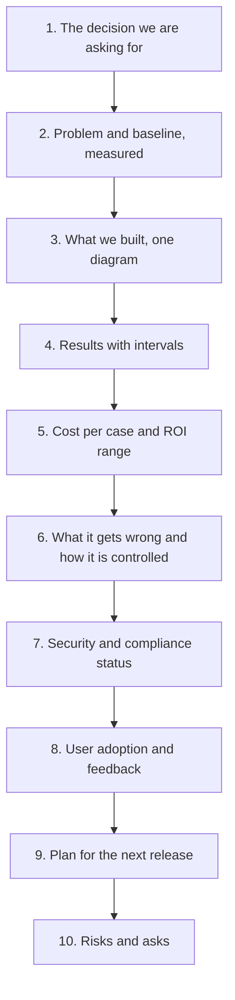
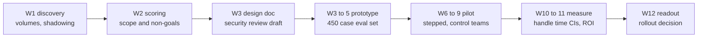

# Chapter 35: Delivering Agents as a Forward Deployed Engineer

> **What this chapter covers**: The engagement around the agent. Discovery and scoping of agent use cases, ROI and cost models a customer will accept, build versus buy versus platform, deploying into customer environments (VPC, on-prem, air-gapped), integrating with legacy systems, rollout and change management, success metrics, and writing the design doc and the executive readout.
>
> **Prerequisites**: Chapters 1 and 2 (what an agent is, patterns), 19 (cloud agent platforms), 20 (open-weight models), 23 (human in the loop), 24 (tool design), 25 (archetypes), 26 (evaluation), 29 and 30 (security and safety), 31 to 33 (production and governance), 34 (improvement over time).
>
> **Where it is used**: Every customer engagement. In the FDE roadmap it maps onto P5.1 (engagement playbook) and P5.2 (the capstone delivered as a full engagement), and it draws on P2.5 (break-even), P3.3 (security review) and P3.4 (SLOs).

---

## 35.1 Level 1: Foundations

### 35.1.1 What the FDE is accountable for

A forward deployed engineer is accountable for an outcome inside a customer's organization, not for a repository. The agent is one component. The others are the problem definition, the data access, the security approval, the people whose work changes, and the evidence that it worked. Most failed agent projects fail on those, not on the model.

Three observations frame this chapter:

1. **The customer buys a changed metric**, such as handle time, backlog, or error rate. They do not buy "an agent".
2. **The environment is the constraint.** Network boundaries, identity systems, legacy APIs, and approval processes determine the architecture more than model choice does.
3. **Trust is built with evidence.** Evaluation sets built from the customer's real cases, reported with intervals, are the currency of every decision.

### 35.1.2 The engagement arc

Each arrow is a decision gate with a written artifact. Skipping the eval set between prototype and pilot is the most common and most expensive shortcut: without it, the pilot's result is an opinion.

### 35.1.3 Vocabulary

| Term | Meaning |
|---|---|
| Use case | A specific job, done by specific people, with a measurable outcome |
| Champion | The customer person who wants this to succeed and can unblock |
| Economic buyer | The person who signs the budget; often not in the working sessions |
| SME | Subject-matter expert who labels cases and defines correct |
| Shadow mode | The agent runs on real traffic but its output is not used |
| Assist mode | The agent drafts; a human approves every action |
| Autonomous mode | The agent acts within a bounded scope; humans review samples |
| Readout | A short executive presentation of results and the decision asked for |
| Design doc | The architecture decision record for the engagement |

### 35.1.4 Where agents fit and where they do not

Agents earn their complexity when the task needs multiple tool calls whose sequence depends on what earlier calls return. If the steps are fixed, a workflow (a pipeline with an LLM in some steps) is cheaper, more predictable, and easier to approve. A good FDE says this early, because recommending a workflow when a workflow suffices builds more trust than an impressive demo.

---

## 35.2 Level 2: Working knowledge

### 35.2.1 Discovery

Discovery answers five questions, each with evidence:

1. **What job, done by whom, how often?** Get volumes from the system of record, not estimates in a meeting.
2. **What does done look like?** Collect 30 to 50 real completed examples with the actions taken.
3. **What systems are touched, and how?** API, database, UI only, file drop. Who owns each, and what are the access rules?
4. **What is the cost of an error?** Reversible or not, customer-visible or not, regulated or not.
5. **What changes for the people?** Whose day changes, who approves, who is measured on the outcome.

Techniques that work:

- **Shadow a practitioner** for two hours. Record every system they open and every judgment they make. The list of judgments is your first draft of the tool contracts and the approval rules.
- **Ask for the exception log.** Every process has a spreadsheet of "weird ones". It is the best source of hard eval cases.
- **Ask who said no last time.** Security, legal, the works council, a data owner. Meet them in week one.

The discovery questions themselves, their scoring weights, and the architecture decision are yours to write; this chapter gives the structure they fit into.

### 35.2.2 Scoring use cases

A lightweight scoring grid lets you compare candidates and explain the choice. Weights are illustrative.

| Criterion | Weight | Question |
|---|---|---|
| Value | 0.30 | Hours or money per month if it works |
| Feasibility | 0.25 | Data and tool access exist, task is within model capability on a quick test |
| Measurability | 0.15 | Correctness can be checked by a program or an SME in under two minutes |
| Risk | 0.15 | Cost of an error, reversibility, regulatory exposure (scored inversely) |
| Sponsorship | 0.15 | A champion with authority and a team willing to pilot |

Worked example for a synthetic insurer "Harbourline Mutual":

| Use case | Value | Feas. | Meas. | Risk (inv.) | Spons. | Score |
|---|---|---|---|---|---|---|
| Claims document intake | 4 | 4 | 5 | 4 | 3 | 0.30x4 + 0.25x4 + 0.15x5 + 0.15x4 + 0.15x3 = 4.00 |
| Adjuster research agent | 5 | 3 | 2 | 3 | 4 | 1.50 + 0.75 + 0.30 + 0.45 + 0.60 = 3.60 |
| Automated claim denial | 5 | 3 | 3 | 1 | 2 | 1.50 + 0.75 + 0.45 + 0.15 + 0.30 = 3.15 |

Claims intake wins not because it is the most valuable but because it is measurable and low-risk, so it can produce evidence fast. The research agent is the natural second phase.

### 35.2.3 The ROI model a customer will accept

Customers distrust ROI models that multiply headcount by a percentage. Build it from measured units:

- **Volume** V per month, from their system.
- **Baseline handle time** h0 minutes per case, from a time study or their workforce tool.
- **Assisted handle time** h1, measured in the pilot, not assumed.
- **Coverage** c: the fraction of cases the agent handles (the rest route to the old process).
- **Loaded cost** w per hour, from finance.
- **Agent cost** a per case: tokens, infrastructure, and review time.

Monthly benefit = V x c x (h0 - h1) / 60 x w. Monthly cost = V x c x a + fixed run cost.

Harbourline claims intake, with pilot measurements:

- V = 12,000 documents a month. h0 = 9 minutes. h1 = 3.5 minutes (includes human review of the agent's extraction). c = 0.75. w = $48.
- Benefit: 12,000 x 0.75 x 5.5 / 60 x 48 = 9,000 x 0.0917 x 48 = $39,600 a month.
- Agent cost: about 6,000 input and 800 output tokens per document on an assumed mid-tier model at $1 and $4 per million: $0.006 + $0.0032 = $0.0092, plus $0.01 for OCR and storage, so about $0.02 per document, $180 a month. Fixed run cost (hosting, monitoring, a share of the support rota) $4,000 a month.
- Net: roughly $35,400 a month, before the one-off build cost.

Present it with ranges. If h1 has a pilot 95 percent interval of 3.0 to 4.2 minutes, the benefit ranges from about $34,500 to $43,200. Show the sensitivity to coverage, because coverage is where optimistic models usually break: if c is 0.5 instead of 0.75, benefit falls by a third.

Two rules. Never count a saved hour as saved money unless the customer agrees how the hour is redeployed. And put the agent's token cost in, even when it is small, because it shows you know it.

### 35.2.4 Build, buy, or platform

| Option | Strengths | Weaknesses | Who owns the evals |
|---|---|---|---|
| Buy (vertical SaaS agent) | Fast, vendor maintains | Opaque, limited tools, data leaves the tenant | Mostly the vendor; insist on your own acceptance set |
| Platform (Bedrock AgentCore, Vertex AI Agent Engine, Azure AI Foundry Agent Service, Claude Managed Agents) | Identity, scaling, observability provided; stays in customer cloud | Lock-in to one provider's primitives; feature churn | You |
| Build (LangGraph, ADK, Strands, Claude Agent SDK, self-hosted models) | Full control, portable, works air-gapped | You operate everything | You |

Product names and GA status of the managed platforms change often; check the current documentation before naming them in a customer document. As of September 2026, Amazon Bedrock AgentCore has been generally available since October 2025, including Gateway, which fronts APIs, Lambda functions, and existing MCP servers as tools.

The portable-core pattern reduces lock-in: keep the tool contracts (MCP servers), the prompts, and the eval harness framework-neutral, and put only the runtime glue on the platform.

### 35.2.5 Deploying into customer environments

Three archetypes, each with a different architecture:

| Environment | Model access | Typical constraints | Architecture choice |
|---|---|---|---|
| Customer VPC in public cloud | Cloud provider's model service through private endpoints, or a vendor API over private link | No public egress, customer KMS keys, logs stay in account | Agent runtime in their account, models via the cloud's hosted catalogue, traces to their observability stack |
| On-prem with outbound internet | Vendor API through an egress proxy, or self-hosted | Proxy allowlists, SSO through their IdP, change boards | Containers on their Kubernetes or VMs; secrets in their vault |
| Air-gapped | Self-hosted open-weight model only | No outbound traffic, media transfer for updates, strict software supply chain | vLLM or similar on their GPUs, offline model and container registry, local tracing, signed artifacts |

For air-gapped deployments, plan the **update path** before the first install. Every model update, container, Python wheel, and eval set must cross the air gap through a reviewed transfer process that can take days. That means pinning everything with lockfiles and checksums, shipping an offline eval harness so they can re-run acceptance tests themselves, and choosing a model small enough for their GPUs (Chapter 34's fine-tuning rungs become relevant here, because a distilled 8B that meets the bar is often the only option).

### 35.2.6 Integrating with legacy systems

Agents meet systems that were never designed for them. Patterns:

- **Wrap, do not expose.** Put a narrow tool in front of a legacy API: one purpose, validated arguments, idempotency key, read-only by default. Never give the agent a generic "call any endpoint" tool.
- **Database access through views.** A read-only role on curated views, with row-level security and query cost limits, instead of raw tables.
- **Screen-only systems.** If the only interface is a UI (a mainframe terminal, a desktop app), consider computer-use or RPA only for reads, and push the customer for an API for writes. UI automation is brittle and hard to audit.
- **Batch systems.** When the system of record updates nightly, the agent must say "submitted, will appear tomorrow" and the tool must return a durable reference.
- **Identity.** Tools should act as the end user (delegated OAuth, on-behalf-of tokens) where the system supports it, so the audit trail names a person. A shared service account that can do anything is a finding in every security review.

### 35.2.7 Rollout and change management

The rollout sequence reduces risk while producing evidence:

Change management is people work:

- **Name what changes for each role.** The adjuster reviews drafts instead of typing. Their team lead reviews samples. Their metrics change.
- **Train on the failure modes**, not just the happy path. Show users three cases the agent gets wrong and how to spot them.
- **Give users an easy override and a feedback button** that feed the flywheel (Chapter 34).
- **Keep the old path available** during the pilot; forced adoption produces sabotage-by-workaround.
- **Report weekly** to the champion with the same metrics each week.

### 35.2.8 Success metrics customers accept

Agree the metrics in writing before the pilot, with the measurement method.

| Level | Metric | How measured |
|---|---|---|
| Business | Handle time, backlog, cost per case, revenue impact | Customer's systems, before and after, same season if possible |
| Task | Task success rate, first-contact resolution, approval rate of drafts | Eval set plus pilot logs |
| Quality | Error rate by severity, escalation correctness | SME review of a random sample |
| Operational | p95 latency, availability, cost per task | Tracing and billing |
| Adoption | Weekly active users, override rate | Product analytics |

Rules: at least one business metric the economic buyer already tracks; every number with an interval and a date; a pre-registered success bar ("task success of at least 85 percent with the lower bound of the 95 percent interval above 80 percent on 400 SME-labelled cases").

### 35.2.9 Total cost of ownership over three years

Executives compare an agent against the alternative over a planning horizon, not per month. A three-year view for Harbourline claims intake (from 35.2.3), with explicit assumptions:

| Line | Year 1 | Year 2 | Year 3 | Assumption |
|---|---|---|---|---|
| Build (engagement plus internal team time) | $180,000 | $0 | $0 | 12-week engagement plus 0.5 internal engineer |
| Run: hosting, monitoring, support rota | $48,000 | $48,000 | $50,000 | $4,000 a month, 4 percent rise in year 3 |
| Tokens and OCR | $2,200 | $2,600 | $3,000 | Volume grows 15 percent a year, unit price flat |
| Flywheel: SME review and quarterly re-evaluation | $30,000 | $24,000 | $24,000 | 10 SME hours a week in year 1, 8 after |
| Model migration (one forced upgrade) | $0 | $25,000 | $0 | Re-run evals, prompt fixes, possible re-tuning |
| Total cost | $260,200 | $99,600 | $77,000 | |
| Benefit (from 35.2.3, low end $34,500 a month) | $379,500 | $476,100 | $547,500 | Year 1: 10 full months plus 2 at half; then 15 percent volume growth a year |
| Net | $119,300 | $376,500 | $470,500 | |

Two lines are often forgotten and both appear here: the flywheel's SME time, and the forced model migration when a hosted model is deprecated. Including them makes the model more credible, and it barely changes the decision.

### 35.2.10 The day-one demo

A demo in the first week, on a sample of the customer's own data, does three jobs: it makes the possibility concrete, it surfaces requirements nobody mentioned ("it also needs to handle the Welsh-language emails"), and it shows the customer how you work. It can also anchor expectations on clean data, so it needs guardrails.

Rules for the day-one demo:

- Use 20 to 50 real examples the customer supplied, including five from the exception log. Show at least one failure on purpose.
- Label it on screen as a prototype, with no claim about accuracy. The eval set comes later.
- Keep it read-only. No writes to any customer system in week one, even in a sandbox, unless the sandbox is theirs and they asked.
- Timebox the build to about a day, using the demo kit (P4.4 in the roadmap).
- End by asking which of the failures matters most to them. Their answer tells you the first scenarios for the eval set and what they fear.

Worked example: at Kestrel, the demo drafted replies for 30 real status emails from a CSV export, with shipment data pulled from a copy of the TMS read view. It got 26 right. Of the four failures, two were multi-shipment emails and two came from a depot whose data was a day stale. The ops director said the stale-depot problem had existed for years and nobody had measured it. That observation became a data-quality item in the design doc and a scenario in the eval set.

### 35.2.11 Scoping the statement of work

The statement of work for an agent pilot should make the evaluation contractual. Minimum contents:

- Scope: the use cases, the systems touched, and the non-goals, verbatim from the design doc.
- Customer obligations with dates: data access by week 1, SME hours (a number, not "availability"), a named security reviewer, a pilot team.
- Deliverables: discovery document, design doc, eval set, pilot system, readout, handover package.
- Acceptance: the pre-registered success bar and the measurement method.
- Change control: how new use cases are added and what they displace.
- Data terms: what is logged, retention, whether traces may be used for improvement (Chapter 34's tenant rule), deletion at exit.

A missed customer obligation (late data access, SME hours not provided) moves the timeline, by contract. Without that clause, the FDE absorbs every delay.

---

## 35.3 Level 3: Depth

### 35.3.1 Why pilots fail

| Failure | Early sign | Prevention |
|---|---|---|
| No agreed definition of success | Stakeholders describe success differently in the kickoff | Written success bar signed before build |
| Data access arrives late | "Security is reviewing" for three weeks | Access request filed in week one, synthetic data build in parallel |
| Demo on clean data, pilot on messy data | Prototype accuracy far above first pilot week | Build the eval set from the exception log |
| No owner after the FDE leaves | Nobody on the customer side can run the eval harness | Pair with a customer engineer from day one; handover checklist |
| Scope creep | New use cases added in every weekly | Change log with explicit trade-offs |
| Users route around it | Low weekly active users, high override | Involve users in eval set building; fix their top complaint first |
| Cost surprise | Token spend far over estimate | Budget caps per session and tenant, cost per task on the dashboard |

### 35.3.2 Sample sizes for the pilot

A pilot claim like "the agent resolves 85 percent" needs a sample that supports it. For a proportion near 0.85, the 95 percent Wilson interval half-width is about 1.96 x sqrt(0.85 x 0.15 / n):

| n | Half-width |
|---|---|
| 100 | about 7.0 points |
| 200 | about 4.9 points |
| 400 | about 3.5 points |
| 1,000 | about 2.2 points |

So 100 labelled cases cannot distinguish 85 from 80 percent. For handle-time comparisons, prefer a paired design (the same cases done both ways) or a stepped rollout across teams, because between-person variance in handle time is large. Budget SME time accordingly: 400 cases at 2 minutes each is about 13 hours of SME review, which must be booked in week one.

### 35.3.3 Security review as a delivery milestone

Every enterprise deployment passes a security review. Treat it as a deliverable with a date, not an obstacle. The document (P3.3's template) covers architecture and data flows, trust boundaries, identity and delegation, tool permissions and write controls, prompt injection defenses, data retention and residency, logging and audit, model and vendor risk, incident response, and residual risks with owners. Having it drafted before the reviewer asks shortens the cycle by weeks.

### 35.3.4 The design doc

Structure for an agent engagement design doc:

1. Context and problem, with the measured baseline.
2. Goals and non-goals. Non-goals prevent scope creep.
3. Success metrics and the pre-registered bar.
4. Options considered (workflow, agent, buy, platform) with the decision and why.
5. Architecture diagram: components, trust boundaries, data flows.
6. Tool contracts: each tool's purpose, arguments, permissions, idempotency, and approval rule.
7. Evaluation plan: eval set provenance, metrics, statistics, gates.
8. Security and governance summary with a link to the full review.
9. Deployment topology and environments.
10. Rollout plan with gates and rollback.
11. Cost model with ranges.
12. Risks, open questions, and owners.

Keep it under 10 pages. Customers read the first two pages and the diagram.

### 35.3.5 Handover

The engagement ends when the customer can operate and improve the system without you. Handover checklist: runbooks for the top five incidents, the eval harness running in their CI, a named owner for the flywheel review queue, dashboards in their tooling, credentials rotated to their accounts, a recorded walkthrough, and one supervised release done by their team.

### 35.3.6 Stakeholders and who decides what

An agent engagement touches more roles than a typical software project, because it changes how people work and it acts on systems. A RACI for the Kestrel engagement (R responsible, A accountable, C consulted, I informed):

| Decision | COO (buyer) | Ops director (champion) | Team leads | CISO | Data owner (TMS) | Legal and privacy | Union rep | FDE |
|---|---|---|---|---|---|---|---|---|
| Use case and scope | A | R | C | I | C | I | I | R |
| Success bar | A | R | C | I | I | I | I | R |
| Tool permissions | I | C | I | A | R | C | I | R |
| Data retention and logging | I | I | I | A | C | R | I | C |
| Rollout stages | A | R | C | C | I | I | C | R |
| Role changes and training | A | R | R | I | I | C | C | C |
| Go or no-go | A | R | C | C | C | C | I | C |

The FDE is responsible for many decisions and accountable for almost none. That is correct: accountability sits with the people who will own the outcome after handover.

### 35.3.7 Pilot designs and what each can claim

| Design | How it works | What it supports | Weakness |
|---|---|---|---|
| Before and after | Measure the same team before and during the pilot | Rough effect size | Seasonality, learning effects, novelty |
| Parallel control | Pilot teams and control teams in the same weeks | Causal claim if teams are comparable | Team differences; contamination if teams talk |
| Stepped wedge | Teams switch to the agent at staggered times | Causal claim with every team treated eventually | Longer; needs a schedule the customer accepts |
| Paired case study | The same cases done both ways (offline) | Clean quality comparison | Not a real workload; handle time inflated |
| Shadow agreement | Agent output compared with human output on live traffic | Quality and agreement before any user sees it | No handle-time evidence |

Kestrel used a stepped design because the COO wanted every team on the agent by week 8 and the finance lead wanted a causal number. A stepped design gave both.

**Sample size for a handle-time claim.** If per-ticket handle time has a standard deviation of about 3 minutes and you want to detect a 1-minute reduction with 80 percent power at a 5 percent two-sided level in a two-group comparison, you need roughly 2 x (1.96 + 0.84)^2 x 3^2 / 1^2 = 2 x 7.84 x 9 = 141 tickets per group. Tickets within one agent are correlated, so inflate by a design effect: with 20 tickets per agent and an intra-agent correlation of 0.1, the design effect is 1 + (20 - 1) x 0.1 = 2.9, giving about 410 tickets per group. Kestrel's pilot produced several thousand per group, so the constraint was agent count, not ticket count.

### 35.3.8 The discovery document

The discovery document is the first written artifact and it sets the tone for the engagement. Structure:

1. The ask, in the customer's words, and the restated problem, in measurable terms.
2. The process today: a swimlane of who does what, with volumes and handle times.
3. Systems touched, with owner, interface, and access status.
4. Candidate use cases with the scoring grid and the recommended first release.
5. Non-goals.
6. Risks and blockers with owners and dates (data access, security, people).
7. Proposed success bar and measurement design.
8. Next two weeks: named actions.

It fits on four pages. The customer's champion reviews it before anyone else sees it, so that it never surprises them in a meeting.

### 35.3.9 Commercial shapes and their incentives

How the engagement is paid for changes behaviour. A fixed-fee pilot encourages narrow scope and a clear bar. Time and materials encourages open-ended exploration and scope creep. Outcome-based pricing (paid per resolved case or per hour saved) aligns incentives but requires both parties to trust the measurement, so the measurement method must be in the contract. Usage-based platform pricing puts token cost on the customer's bill, which makes cost per task a metric they will watch. The FDE rarely sets the commercial shape but should know it, because it determines which trade-offs the customer will accept.

### 35.3.10 Working with the customer's engineers

The customer's engineers will own the system, and they judge the FDE on different things from the executives. They care about whether the code fits their conventions, whether the CI runs in their pipeline, and whether they understand every alert. Practices that work:

- Pair with a named customer engineer from week one, committing to their repository under their review rules.
- Use their stack where it is adequate (their CI, their Kubernetes, their observability) even when yours would be faster.
- Write the runbooks with them, from real incidents in the pilot (35.4.7), not from imagination.
- Hand over the eval harness as a first-class test suite, with a make target and a CI job, so that a prompt change without an eval run fails their pipeline.
- Explain the approval gates and thresholds, and who owns changing them after you leave.

If the customer has no engineers who can own an agent, say so in the discovery document. The options are a managed platform with vendor support, a longer engagement with a staffed handover, or not proceeding.

---

## 35.4 Level 4: Mastery

### 35.4.1 Scoping the first release down

The senior move is to shrink the first release to what can be proven in the pilot window, while keeping the architecture ready for the full vision. For Harbourline: release one extracts and codes claims documents with human approval of every record; release two adds the research agent for adjusters; release three considers bounded autonomy for low-value claims. Each release has its own success bar. The design doc shows all three, the contract covers the first.

### 35.4.2 The executive readout

Ten slides at most, one decision asked for:

Principles:

- **Lead with the decision.** "We recommend moving claims intake to assist mode for all regions in Q1."
- **Numbers with intervals and dates**, stated in business units ("5.5 minutes saved per document, 95 percent interval 4.8 to 6.0, pilot 1 to 28 September").
- **Show the failures.** A slide of what it gets wrong, and the controls, earns more trust than a perfect chart.
- **One diagram**, drawn for executives: boxes they recognize, not your internals.
- **Rehearse aloud.** The readout narrative is spoken, and per the roadmap it is Aman's to write and say.

### 35.4.3 Negotiating with the evidence

When results miss the bar, present options, not excuses: narrow the scope to the segment where the bar is met (for example, typed documents only), extend the pilot with a fix list, or stop. Stopping a use case that does not work, with clear evidence, is a legitimate and trust-building outcome, and it often leads to the next engagement.

### 35.4.4 Where practitioners disagree

| Question | View A | View B | Working position |
|---|---|---|---|
| Start with a demo or with discovery? | A day-one demo creates energy and surfaces real requirements | Demos anchor expectations on clean data | Demo on a sample of their data in week one, clearly labelled as a prototype |
| Platform or open framework? | Platforms remove months of plumbing | Lock-in and churn | Portable core (MCP tools, evals) on the customer's platform standard |
| Autonomy early? | Autonomy is where the ROI is | Trust must be earned | Assist mode first, autonomy on evidence, scoped by risk |
| Who owns the eval set? | Vendor or FDE, for speed | Customer SMEs, for legitimacy | Built jointly, owned by the customer, versioned |
| ROI up front or after the pilot? | Needed to get budget | Pre-pilot ROI is fiction | Range-based estimate up front, replaced with measured values after |

### 35.4.5 A full worked engagement: Kestrel Freight, discovery to readout

Kestrel Freight is a synthetic mid-market logistics company: 1,400 staff, 38 depots, a 60-person customer operations team, AWS as the cloud standard, an on-prem Oracle transport management system (TMS) that is 14 years old, and SSO through Entra ID. The COO's opening ask: "an AI agent for customer operations". The engagement runs 12 weeks.

**Week 1: discovery.** Findings, each with its source:

| Question | Finding | Source |
|---|---|---|
| Volume | 41,000 customer emails a month; 62 percent are "where is my shipment", 18 percent delivery rebooking, 9 percent damage claims, 11 percent other | Ticketing system export, last 6 months |
| Handle time | Where-is-my-shipment 4.1 min, rebooking 7.8 min, damage claim 16.5 min | Workforce tool, median per category |
| Systems | TMS (Oracle, read views available, writes via a SOAP service), ticketing SaaS with REST API, carrier tracking API | IT architecture review |
| Error cost | Wrong ETA is annoying and recoverable; wrong rebooking costs a failed delivery (about $38); wrong damage decision is a financial and legal risk | Ops finance lead |
| People | Agents measured on handle time and CSAT; team leads fear quality drops; the union rep asks about headcount | Interviews |
| Who said no last time | Security rejected a chatbot in 2025 because it needed a TMS service account with write access to everything | CISO interview |

Shadowing two agents for two hours each produced a list of 23 judgments. Eleven are lookups, eight are rules ("rebook only within the depot's next three slots"), four are discretionary.

**Week 2: scoring and scope.**

| Use case | Value | Feas. | Meas. | Risk (inv.) | Spons. | Score |
|---|---|---|---|---|---|---|
| Where-is-my-shipment drafts | 4 | 5 | 5 | 5 | 4 | 1.20 + 1.25 + 0.75 + 0.75 + 0.60 = 4.55 |
| Rebooking agent with approval | 4 | 4 | 4 | 3 | 4 | 1.20 + 1.00 + 0.60 + 0.45 + 0.60 = 3.85 |
| Damage claim decisions | 5 | 2 | 2 | 1 | 2 | 1.50 + 0.50 + 0.30 + 0.15 + 0.30 = 2.75 |

Decision: release one covers where-is-my-shipment (a workflow, not an agent: lookup then draft) and rebooking (an agent with an approval gate, because the path depends on slot availability and customer constraints). Damage claims are a non-goal, stated in writing.

**Weeks 2 to 3: design doc.** Key decisions:

- Build on AWS in Kestrel's account: agent runtime on their existing EKS cluster, model through Amazon Bedrock with a private endpoint. Traces go to their existing observability stack via OpenTelemetry.
- Three MCP tools: `get_shipment_status` (read, TMS view), `list_rebooking_slots` (read), `rebook_delivery` (write through the SOAP service, idempotency key, approval required, acts on behalf of the ops agent through token exchange with Entra ID).
- No TMS service account with broad rights. The write tool can call exactly one SOAP operation. This answers the 2025 security objection directly.

**Weeks 3 to 5: prototype and eval set.** Two SMEs label 450 historical emails (300 status, 150 rebooking) with the correct draft facts and, for rebooking, the correct slot. That is about 15 SME hours at 2 minutes per case, booked in week 1. Prototype results on the eval set:

| Metric | Status drafts (n = 300) | Rebooking (n = 150) |
|---|---|---|
| Factually correct draft | 0.953 (0.922 to 0.972) | n/a |
| Correct slot proposed | n/a | 0.847 (0.780 to 0.896) |
| Proposal needs no edit by agent | 0.887 | 0.713 |

**Weeks 6 to 9: pilot.** Two teams of eight in assist mode, two control teams on the old process, same weeks. Stepped design: the control teams switch in week 8.

**Weeks 10 to 11: measure.** Pilot handle times:

| Category | Baseline median | Assisted median | Difference (95 percent CI, bootstrap over tickets) |
|---|---|---|---|
| Where-is-my-shipment | 4.1 min | 1.6 min | -2.5 (-2.7 to -2.3) |
| Rebooking | 7.8 min | 4.9 min | -2.9 (-3.4 to -2.4) |

Quality: CSAT unchanged (4.41 versus 4.38 on a 5-point scale, difference inside the interval). Failed deliveries from wrong rebookings: 3 in 1,120 assisted rebookings versus 5 in 1,090 on control, too few to claim a difference.

**The ROI model with arithmetic.** Coverage: the agent drafts for 92 percent of status emails and 80 percent of rebookings (the rest are escalations or malformed).

- Status: 41,000 x 0.62 = 25,420 emails; covered 25,420 x 0.92 = 23,386; minutes saved 23,386 x 2.5 = 58,465.
- Rebooking: 41,000 x 0.18 = 7,380; covered 7,380 x 0.80 = 5,904; minutes saved 5,904 x 2.9 = 17,122.
- Total 75,587 minutes = 1,260 hours a month. At a loaded $42 an hour: $52,900 a month gross.
- Using the interval ends (2.3 and 2.4 minutes): 23,386 x 2.3 + 5,904 x 2.4 = 53,788 + 14,170 = 67,958 minutes = 1,133 hours = $47,600. Upper ends (2.7 and 3.4): 63,142 + 20,074 = 83,216 minutes = 1,387 hours = $58,300.
- Agent cost: status drafts about 3,000 input and 250 output tokens; rebooking trajectories about 9,000 input and 900 output. At assumed placeholder prices of $3 and $15 per million with 60 percent of input cached at a 90 percent discount: status per case = (1,200 x 3 + 1,800 x 0.3 + 250 x 15) / 1e6 = $0.0079; rebooking = (3,600 x 3 + 5,400 x 0.3 + 900 x 15) / 1e6 = $0.0259. Monthly: 23,386 x 0.0079 + 5,904 x 0.0259 = $185 + $153 = $338.
- Fixed run cost: EKS share, observability, and 0.25 of an engineer for the flywheel: about $6,500 a month.
- Net: roughly $41,000 to $51,500 a month. Build cost (the 12-week engagement) pays back in under three months on the low end, if the redeployed hours are agreed.

Kestrel's COO decided the saved hours go to proactive delay notifications, a backlog they already track, so the hours count. The union rep was told the same in week 2, in writing.

**Week 12: readout.** Slide 1: "We recommend rolling out status drafts to all teams in November and rebooking in assist mode in December, and starting a discovery for damage claims in Q1." Slide 6 showed the three wrong rebookings and the control that caught two of them (the approval step). The security review was signed off in week 9 because it was drafted in week 3.

### 35.4.6 Deployment environments in detail

| Dimension | Customer VPC (public cloud) | On-prem, outbound allowed | On-prem, air-gapped | Sovereign or regional cloud |
|---|---|---|---|---|
| Model access | Cloud model service via private endpoint | Vendor API through egress proxy, or self-hosted | Self-hosted open weights only | Regional model endpoints; check which models are offered in region |
| Compute | Managed Kubernetes or serverless in their account | Their Kubernetes or VMs, often without GPUs | Their GPUs; plan capacity up front | Regional managed services |
| Identity | Cloud IAM plus their IdP federation | Their IdP (SAML or OIDC), often via a proxy | Local IdP or directory | Regional tenant of their IdP |
| Secrets | Cloud KMS and secrets manager with their keys | Their vault | Their vault or HSM, offline | Regional KMS |
| Observability | Their cloud monitoring or a SaaS they approve | Their on-prem stack | Local only; export by media transfer | Region-bound logging |
| Updates | CI/CD into their account | Change board, maintenance windows | Signed bundles across the gap, days to weeks | CI/CD with region pinning |
| Typical blockers | Private endpoint availability, cross-account roles | Proxy allowlists, TLS inspection breaking streaming | GPU procurement, supply-chain review | Model availability in region |
| Eval harness | Runs in their CI | Runs in their CI | Ships offline with the bundle | Runs in their CI |
| FDE access | Federated role, time-bound | VPN plus jump host | On-site only | Federated role, region-bound |

TLS inspection proxies deserve a specific warning: they often buffer streamed responses, which breaks token streaming and long-lived connections (MCP over Streamable HTTP, server-sent events). Test streaming through the customer's proxy in week one.

### 35.4.7 An incident during the pilot, handled

In Kestrel's pilot week 3, the TMS vendor pushed a patch that changed a date field in the shipment view from local time to UTC without notice. Status drafts began quoting delivery windows one hour off for depots in one timezone.

Timeline and actions:

1. **Detection (day 1, 10:40).** Two team leads flagged drafts in the feedback button. The daily sampled review, run at 11:00, found 14 of 40 sampled drafts wrong for that region. The online check (draft ETA against carrier API ETA) was not yet in place for status drafts; it had been planned for week 4.
2. **Containment (11:15).** The FDE moved status drafts for that region back to shadow mode through a feature flag. Rebooking was unaffected, since slot times came from a different service.
3. **Diagnosis (11:15 to 13:00).** The three most likely causes were a model change (ruled out: model version pinned, unchanged in traces), a prompt change (ruled out: prompt hash unchanged), and an upstream data change (confirmed: the view's field values shifted by exactly one hour from the patch timestamp).
4. **Fix (14:30).** The `get_shipment_status` tool normalizes all times to UTC with an explicit timezone field, and a contract test now asserts the view's timezone on every deploy.
5. **Recovery (day 2).** Region re-enabled after 100 shadow drafts were checked with zero errors.
6. **Follow-up.** The ETA consistency check was pulled forward, a scenario for the timezone case was added to the eval set, and the vendor patch calendar was added to the change feed.

The incident appeared in the readout on slide 6. The COO's comment was that the detection and rollback, done in 35 minutes, was the most reassuring thing in the deck. Showing controls working beats claiming there were no failures.

### 35.4.8 The readout results slide, written out

A results slide carries one claim, the numbers behind it, and what they mean for the decision. For Kestrel:

| Element | Text on the slide |
|---|---|
| Headline | Assisted agents handle status emails 2.5 minutes faster and rebookings 2.9 minutes faster, with no change in CSAT |
| Evidence | Stepped pilot, 4 teams, 1 September to 26 October; status -2.5 min (95 percent CI -2.7 to -2.3), rebooking -2.9 min (-3.4 to -2.4); CSAT 4.41 versus 4.38 |
| Translation | About 1,260 hours a month at full rollout (range 1,130 to 1,390), redeployed to proactive delay notifications |
| Caveat | Wrong rebookings: 3 in 1,120, too few to compare with control; monitored weekly |
| So what | Supports the rollout decision on slide 1 |

Notice what is absent: model names, framework names, token counts. Those go in the appendix for the technical audience.

### 35.4.9 Mapping to the FDE roadmap

| Chapter element | Roadmap project |
|---|---|
| Discovery, scoring, playbook templates | P5.1 |
| Full engagement: discovery doc, demo, architecture memo, prototype with eval set, production, readout | P5.2 |
| Break-even and cost model | P2.5, Appendix D |
| Security review template | P3.3 |
| SLOs and runbooks | P3.4 |
| Demo kit | P4.4 |

---

## 35.5 Subtopic checklist

- [x] Discovery of agent use cases (35.2.1)
- [x] Scoping and use-case scoring (35.2.2, 35.4.1)
- [x] Agent versus workflow fit (35.1.4)
- [x] ROI and cost models for customers, with ranges (35.2.3)
- [x] Build versus buy versus platform (35.2.4)
- [x] Deploying into customer VPC, on-prem, and air-gapped environments (35.2.5)
- [x] Integration with legacy systems, identity, and delegated access (35.2.6)
- [x] Rollout stages and change management (35.2.7)
- [x] Success metrics customers accept, and pilot sample sizes (35.2.8, 35.3.2)
- [x] Why pilots fail (35.3.1)
- [x] Security review as a milestone (35.3.3)
- [x] Writing the design doc (35.3.4)
- [x] Handover (35.3.5)
- [x] Writing and presenting the executive readout (35.4.2, 35.4.3)
- [x] Full worked discovery-to-readout example with ROI arithmetic (35.4.5)
- [x] Deployment environments compared in detail (35.2.5, 35.4.6)
- [x] Stakeholders, RACI, pilot designs, discovery document, commercial shapes (35.3.6 to 35.3.9)

---

## 35.6 Common misconceptions

1. **"The customer wants an agent."** They want a metric to move. An agent is one way; a workflow may be better.

2. **"A great demo wins the deal."** It opens the door. Evidence on the customer's own messy cases wins it.

3. **"ROI is headcount times a percentage."** Customers reject that. Build ROI from measured volume, handle time, coverage, and cost per case, with ranges.

4. **"Security review happens at the end."** It gates production and takes weeks. Start it in week one with a drafted document.

5. **"Air-gapped just means self-hosting the model."** It means every update, dependency, and eval set crosses a reviewed transfer; plan the update path first.

6. **"A shared service account is fine for tools."** It destroys the audit trail and fails security review. Act on behalf of the user where possible.

7. **"One hundred cases is enough to prove the pilot."** At 85 percent success the 95 percent interval is about plus or minus 7 points. Size the sample to the claim.

8. **"If the pilot misses the bar, the engagement failed."** Narrowing scope or stopping with evidence is a valid outcome and builds credibility.

9. **"Handover is sending the repo."** Handover is the customer running the eval harness, the review queue, and a release without you.

10. **"Platform choice is a technical decision."** It is mostly the customer's existing cloud standard and procurement; match it unless there is a strong reason.

11. **"Before and after is good enough for handle time."** Seasonality, learning effects, and novelty all move handle time. Use a control or a stepped design, sized by agents rather than tickets.

12. **"Failures should be kept out of the readout."** Showing a failure with its detection and rollback builds more trust than a clean chart, and executives will hear about it anyway.

---

## 35.7 Practice

1. **Discovery.** Write ten discovery questions for a synthetic logistics company that wants "an agent for dispatch". Mark which produce evidence (volumes, examples) and which produce opinions.

2. **Scoring.** Score four candidate use cases for a synthetic retailer with the grid in 35.2.2. Change one weight and show whether the ranking changes. Write two sentences defending your weights.

3. **ROI.** Build the ROI model for an accounts-payable agent: 30,000 invoices a month, baseline 6 minutes, assisted 2 minutes (interval 1.5 to 2.8), coverage 0.6, loaded cost $40 an hour, agent cost $0.03 per invoice, fixed $5,000 a month. Report net benefit with a range and the coverage sensitivity.

4. **Architecture.** Draw the deployment for the same agent in three environments: customer AWS VPC, on-prem Kubernetes with an egress proxy, and air-gapped. For each, list what changes in model access, identity, tracing, and updates.

5. **Integration.** Design the tool contract for "update vendor bank details" in a legacy ERP. Include arguments, validation, approval rule, idempotency, identity, and audit. Explain why this tool may never be autonomous.

6. **Statistics.** How many SME-labelled cases do you need to claim task success at least 90 percent with the interval lower bound above 85 percent, if the true rate is about 92 percent? Show the calculation.

7. **Hands-on (free tier).** Take your P4.1 agent. Write a two-page design doc using the structure in 35.3.4, including the tool contracts and the eval plan.

8. **Readout.** Draft the ten-slide outline for a pilot that met the task-success bar but missed the handle-time target. Lead with a decision you can defend.

9. **Change management.** List every role affected by the claims intake agent at Harbourline and, for each, what changes, what they fear, and what you would do in week one.

10. **Handover.** Write a handover checklist for an air-gapped deployment and mark which items must be completed before the FDE loses network access to the site.

11. **Worked example.** Redo the Kestrel ROI in 35.4.5 with rebooking coverage of 0.6 and a loaded cost of $36 an hour. Report the net range and say which single input the result is most sensitive to.

12. **Pilot design.** For a 30-person team, design a stepped-wedge pilot over six weeks. Compute the design effect for 25 tickets per agent and an intra-agent correlation of 0.15, and say whether the pilot can detect a 1-minute handle-time reduction.

13. **TCO.** Rebuild the three-year table in 35.2.9 for Kestrel from 35.4.5, adding a second forced model migration in year 3. Does the decision change? Which line would a CFO challenge first?

14. **Incident.** Write the one-page incident note for the Kestrel timezone incident in 35.4.7 in the format you would send the champion the same day: impact, detection, containment, cause, fix, follow-ups with owners.
---

## 35.8 How this is tested

How do you run discovery for an agent use case?

I establish the job, who does it, and how often from system data; collect 30 to 50 real completed examples plus the exception log; map every system touched and its owner and access path; establish the cost of an error and reversibility; and identify whose work changes and who approves. I shadow a practitioner to list their judgments, which become tool contracts and approval rules. I meet the people who blocked the last project in week one.

When would you recommend a workflow instead of an agent?

When the sequence of steps is known in advance and does not depend on intermediate results. A workflow with LLM steps is cheaper, more predictable, easier to test, and easier to approve. I use an agent when the path depends on what tools return, and I put approval gates on anything with a high cost of error.

Build an ROI case for an agent in two minutes.

Benefit per month equals volume times coverage times minutes saved over 60 times loaded hourly cost. Cost equals volume times coverage times agent cost per case plus fixed run cost. I take volume from their system, baseline time from a time study, assisted time from the pilot with an interval, and I show sensitivity to coverage because that is where models break. I do not count saved hours as savings unless they agree how the time is redeployed.

How do you decide build, buy, or platform?

If the job is generic and a SaaS product passes security and residency, buy and integrate. If it is specific and they have a cloud standard, build on that platform's managed agent services but keep the tools as MCP servers, prompts and evals portable. If they are air-gapped or have no standard, build on open frameworks with self-hosted models. Lock-in and feature churn are the main platform risks.

What changes when the customer is air-gapped?

Only self-hosted open-weight models, sized to their GPUs. No hosted tracing, so local observability. Every artifact crosses the gap through a reviewed transfer, so everything is pinned with lockfiles and checksums, container images and wheels are mirrored, and an offline eval harness ships so they can run acceptance tests. The update path is designed before the first install.

How should an agent authenticate to a customer's legacy system?

Preferably on behalf of the end user through delegated OAuth or token exchange with the customer IdP, with narrow scopes, so every write is attributable to a person. If the system only supports a service account, restrict it to a narrow wrapper tool with validated arguments, rate limits, and a full audit log that records the requesting user, and flag it as a residual risk.

Describe a rollout plan for an agent that makes writes.

Shadow mode on real traffic until agreement with humans is above the bar on a sized sample; assist mode where humans approve every write, tracking approval and error rates; scoped autonomy for low-risk writes with sampled review; broader autonomy only after clean weeks. Each transition has a written criterion, and regressions move it back a stage automatically.

What success metrics do you agree with a customer before a pilot?

At least one business metric they already track (handle time, backlog, cost per case), a task success rate on an SME-labelled set with a pre-registered bar including the interval lower bound, quality by error severity, operational metrics (p95 latency, cost per task), and adoption. Each with a measurement method and a sample size that supports the claim.

The pilot shows 84 percent task success on 100 cases and the bar was 85. What do you say?

That 100 cases give roughly plus or minus 7 points, so the result is consistent with both passing and failing. I would show the error breakdown, identify whether a segment clearly meets the bar, and propose either extending to about 400 cases or narrowing scope to the passing segment, with a date. I would not claim success or failure on this sample.

What goes in an agent design doc?

Problem and measured baseline, goals and non-goals, success metrics and bar, options considered and the decision, architecture with trust boundaries, tool contracts with permissions and approval rules, evaluation plan, security summary, deployment topology, rollout with gates and rollback, cost model with ranges, and risks with owners. Under 10 pages, with the diagram on page two.

How do you structure the executive readout?

Lead with the decision asked for. Then measured baseline, one diagram of what was built, results with intervals in business units, cost per case and an ROI range, what it gets wrong and how that is controlled, security and compliance status, adoption, next release plan, and risks and asks. Ten slides maximum, rehearsed aloud.

How would you design a pilot so the handle-time claim survives scrutiny from finance?

Use a parallel control or stepped wedge rather than before and after, so seasonality and novelty do not explain the effect. Size it by agents, not tickets, because tickets within an agent are correlated: apply a design effect of 1 plus (tickets per agent minus 1) times the intra-agent correlation. Pre-register the metric, the median or mean, and the bootstrap method, and report the interval in minutes and in dollars.

Your customer's security team blocked the last AI project. What do you do differently?

Find out exactly why in week one, from the person who blocked it. Usually it was over-broad credentials, unclear data retention, or no audit trail. Design the tools to answer that objection directly (narrow wrapper tools, on-behalf-of identity, explicit retention), draft the security review in week three, and have the reviewer check the tool contracts before the build, not after.

What goes into a three-year cost of ownership for an agent that people usually forget?

The ongoing SME time for the flywheel review queue and re-evaluation, and at least one forced model migration when a hosted model is deprecated or a better one appears, which means re-running evals, fixing prompts, and possibly re-tuning. Also the support rota share and volume growth in token cost. Including them makes the model credible and rarely changes the decision.

How do you run a day-one demo without anchoring the customer on unrealistic accuracy?

Build it on 20 to 50 of their real examples including exception-log cases, label it as a prototype with no accuracy claim, keep it read-only, show a failure deliberately, and end by asking which failure matters most. That answer seeds the eval set and says the real measurement comes next.

What does a good handover look like?

The customer runs the eval harness in their CI, owns the review queue with a named person, has dashboards and alerts in their tooling, has runbooks for the top incidents, holds all credentials, and has done one release under supervision. If they cannot improve and ship without me, the engagement is not finished.

---

## 35.9 Summary

- The FDE is accountable for a changed customer metric; the agent is one component.
- Discovery produces evidence: volumes, real examples, the exception log, systems and owners, error costs, and affected roles.
- Score use cases on value, feasibility, measurability, risk, and sponsorship; start with what can be proven fast.
- Recommend a workflow when the sequence is fixed; use an agent when the path depends on tool results.
- Build ROI from measured units with ranges and coverage sensitivity, and include agent cost per case.
- Choose build, buy, or platform by job genericity, security bar, and the customer's cloud standard; keep tools and evals portable.
- VPC, on-prem, and air-gapped deployments differ in model access, identity, observability, and update path.
- Wrap legacy systems in narrow, validated, idempotent tools that act on behalf of the user.
- Roll out from shadow to assist to scoped autonomy with written criteria and automatic rollback.
- Agree metrics and a sized sample before the pilot; 100 cases is rarely enough.
- Treat the security review, design doc, and handover as dated deliverables.
- Use a control or stepped-wedge pilot sized by agents, with a design effect for clustered tickets.
- Show pilot incidents with their detection and rollback; controls working are evidence.
- Three-year cost of ownership must include flywheel SME time and at least one forced model migration.
- The readout leads with the decision, shows failures and controls, and states every number with an interval and date.

---

## 35.10 Further reading

- Anthropic, "Building effective agents" (December 2024). The workflow versus agent distinction used in 35.1.4.
- AWS, Amazon Bedrock AgentCore documentation and GA announcement (October 2025). Gateway, Identity, Runtime, and VPC support.
- Google Cloud, Vertex AI Agent Engine documentation. Managed runtime for ADK and other frameworks.
- Microsoft, Azure AI Foundry Agent Service documentation. The Azure managed option.
- Model Context Protocol specification, modelcontextprotocol.io, authorization section. Delegated access patterns for tools.
- OWASP Top 10 for LLM Applications. Structure for the security review.
- NIST AI Risk Management Framework (AI RMF 1.0). Vocabulary for risk sections of design docs.
- Wilson, "Probable inference, the law of succession, and statistical inference" (1927). The interval behind pilot sample sizes.
- Hussey and Hughes, "Design and analysis of stepped wedge cluster randomized trials", Contemporary Clinical Trials (2007). The design behind staggered rollouts and its sample-size logic.
- Kish, "Survey Sampling" (1965). The design effect for clustered samples used in 35.3.7.
- Google SRE Book, chapter on postmortem culture. The structure behind the pilot incident write-up in 35.4.7.
- FDE roadmap, guides/FDE_AI_Roadmap.md, P5.1 and P5.2. The engagement playbook and capstone this chapter prepares for.
