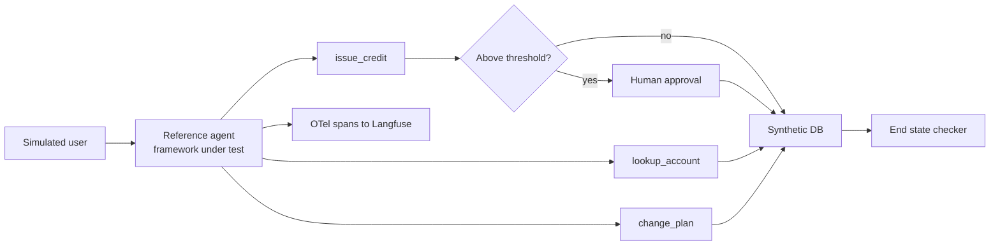
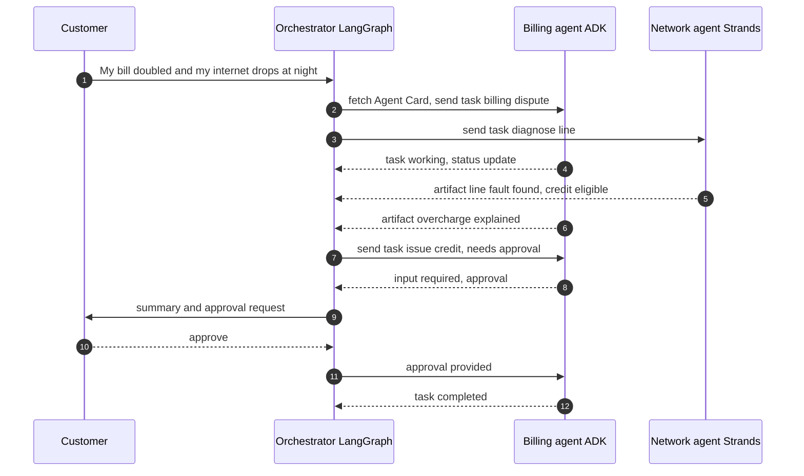
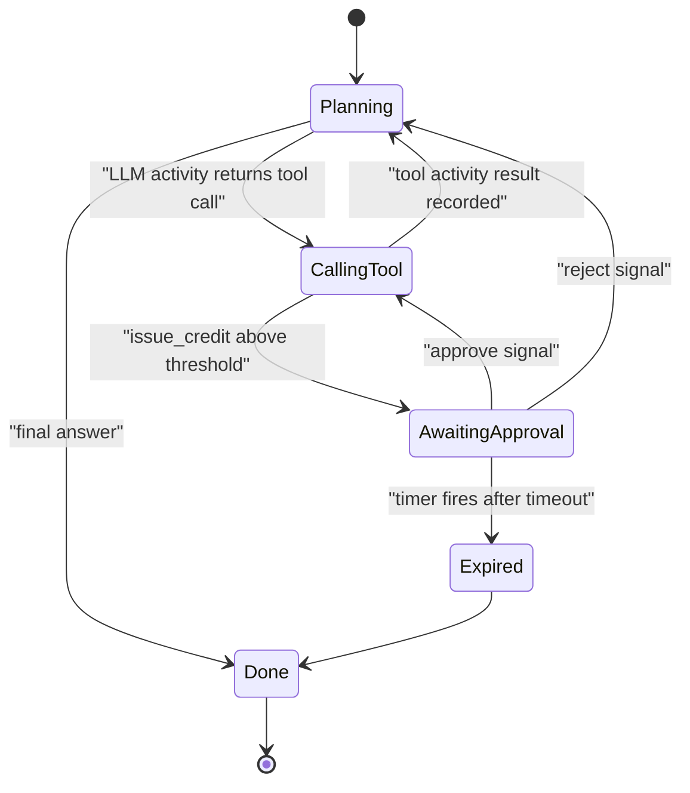
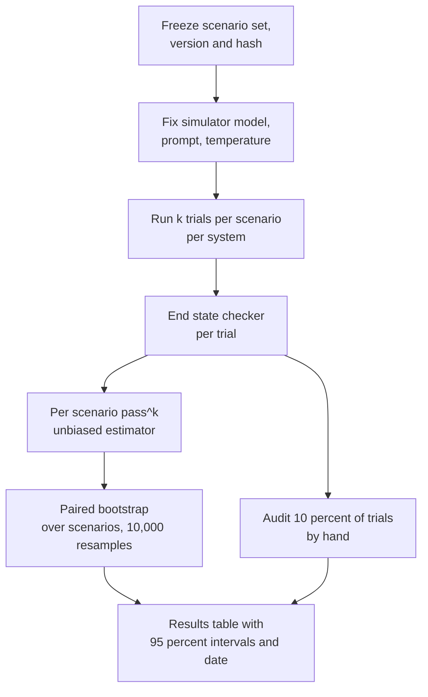
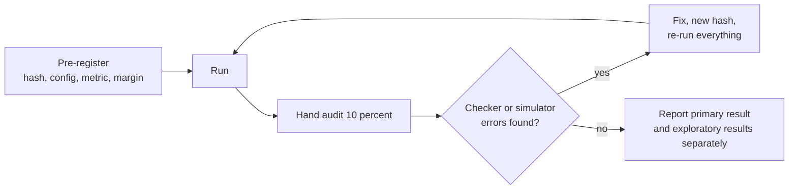
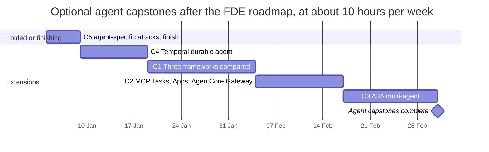

# Chapter 36: Capstones

> **What this chapter covers**: Five capstone projects that consolidate the curriculum, each with a definition of done, an hour estimate, a hardware and cost plan, and an evaluation protocol. The same agent built in three frameworks and compared on tau-bench-style evals; an MCP server with OAuth, Tasks, and an MCP Apps UI behind AgentCore Gateway; a cross-framework multi-agent system over A2A; a durable agent on Temporal with approval gates; and a red-team report against your own agent. Plus a sequencing plan against the FDE roadmap.
>
> **Prerequisites**: All earlier chapters, especially 10 to 15 (frameworks), 16 and 17 (MCP and A2A), 19 (cloud platforms), 21 (multi-agent), 22 and 23 (durability and HITL), 24 (tools), 26 to 28 (evaluation and observability), 29 (security), 34 and 35.
>
> **Where it is used**: Portfolio evidence for FDE interviews, and as reference implementations for customer engagements. Against the FDE roadmap, one capstone folds into an existing project and the other four are optional extensions after 31 December 2026.

---

## 36.1 Level 1: Foundations

### 36.1.1 Why capstones, and why these five

Each capstone answers a question an FDE interviewer or customer actually asks:

| Capstone | The question it answers |
|---|---|
| C1 Three frameworks, one agent | "Which framework should we use, and how do you know?" |
| C2 Production MCP server | "How do we expose our systems to agents securely?" |
| C3 Cross-framework multi-agent over A2A | "Our teams use different stacks. Can their agents work together?" |
| C4 Durable agent on Temporal | "What happens when a long job fails halfway through a write?" |
| C5 Red-team report | "Is it safe to connect this to our data?" |

Together they cover the four things the curriculum argues matter most: evaluation with statistics, tool contracts, durability, and security.

### 36.1.2 The rules every capstone follows

These come from the roadmap's repository conventions and apply unchanged:

- Public or synthetic data only. Synthetic companies (the running examples are "Northwind Telecom" and "Harbourline Mutual").
- A `uv` project with a lockfile, Makefile verbs, pytest, ruff, a Dockerfile, `.env.example`.
- The README's first screen is a results table: metric, value, 95 percent confidence interval, date.
- Every claimed number has a bootstrap interval; comparisons on the same items are paired.
- Paid compute and `terraform apply` are launched only after an explicit decision, and every paid session goes in the spend ledger.
- Everything that would be explained to an interviewer (tool contracts, reward and risk thresholds, the threat model, the write-ups) is written by Aman; plumbing is delegated.

### 36.1.3 The shared reference agent

C1, C3, C4, and C5 reuse one reference agent so their results compare. It is the reference spec from Part III: a support agent with three tools, memory, one approval gate, and tracing.

| Element | Specification |
|---|---|
| Domain | Northwind Telecom customer support, synthetic SQLite database of 2,000 accounts |
| Tools | `lookup_account` (read), `change_plan` (write, reversible), `issue_credit` (write, approval required above a threshold) |
| Memory | Per-customer notes with explicit expiry |
| Approval gate | `issue_credit` above the threshold interrupts for human approval |
| Tracing | OpenTelemetry spans to Langfuse, with prompt, tool, and model versions |
| Scenario set | 60 scenarios with initial state, simulated-user instruction, expected end state |

The approval threshold, tool contracts, and memory rules are Aman's to set. The scenarios are evaluation data; once frozen they are edited only with an explicit decision.

---

## 36.2 Level 2: Working knowledge

### 36.2.1 C1: The same agent in three frameworks

**Goal.** Implement the reference agent in three frameworks (suggested: LangGraph, Google ADK, and the Claude Agent SDK or Strands Agents) with identical tools (served from one MCP server), identical prompts where the framework allows, and the same model. Compare them on the 60 scenarios.

**Build**

1. One MCP server exposes the three tools, so tool behaviour is identical across frameworks.
2. Three thin agent implementations, each wiring memory, the approval interrupt, and tracing in that framework's idiomatic way.
3. A tau-bench-style harness: a simulated user (fixed model, fixed prompt, fixed seed where supported), the environment reset per trial, and an end-state checker.
4. Run each framework on 60 scenarios x 4 trials.

**Metrics**

- pass^1 and pass^4 (all four trials succeed), per framework.
- Tool-call accuracy and unnecessary calls per task.
- Tokens, cost, and p50 and p95 latency per task.
- Lines of framework-specific code, and hours to implement each (a real engineering cost).
- Approval-gate correctness: every above-threshold credit interrupted, none below.

**Evaluation protocol.** pass^k is estimated per scenario from its 4 trials, then averaged. Compare frameworks pairwise on the same scenarios with a paired bootstrap over scenarios (resample scenarios, not trials, because trials within a scenario are correlated). Report the difference in pass^1 with a 95 percent interval.

Worked arithmetic for pass^k: a scenario with 3 successes in 4 trials contributes an unbiased pass^2 estimate of C(3,2)/C(4,2) = 3/6 = 0.5, and pass^4 of 0. If a framework's per-scenario success rates average 0.80 but are uneven, its pass^4 can be far lower than 0.80^4 = 0.41 would suggest, or higher; that is why pass^k is computed per scenario, not from the pooled rate.

**Expected finding.** With the same model and the same MCP tools, differences in pass^1 between mature frameworks are usually small (a few points, often inside the interval). Differences show up in cost (prompt overhead), latency (extra round trips), and engineering effort. Being able to say "the framework is not the variable that matters; here is the interval" is the result.

**Definition of done**

- [ ] Three implementations pass a shared contract test suite (tool calls, interrupt, resume)
- [ ] Results table: pass^1, pass^4, cost per task, p95 latency per framework, with paired 95 percent intervals, dated
- [ ] Approval gate proven by test in all three
- [ ] A two-page write-up: which framework for which customer situation, backed by the table

**Hours.** About 22: MCP server reuse 2, three implementations 9, harness and simulator 5, runs and analysis 4, write-up 2.

**Hardware and cost.** Laptop only; CPU for frameworks, API for the model. 60 x 4 x 3 = 720 trajectories, plus the simulator. At about 5,000 input and 700 output tokens per trajectory for the agent and a similar simulator load on a cheaper model, at assumed placeholder prices of $3 and $15 per million for the agent model, agent cost per trajectory is 0.015 + 0.0105 = $0.0255, total about $18, simulator perhaps $5. Budget $30 to $40 including reruns. With prompt caching on the static system prompt and tool definitions, less.

### 36.2.2 C2: A production MCP server behind AgentCore Gateway

**Goal.** Take the P4.2 server further: current-spec authorization, a long-running operation using the Tasks extension, an interactive UI using the MCP Apps extension, and deployment behind Amazon Bedrock AgentCore Gateway.

**Version check.** As of September 2026, the current MCP specification is dated 2026-07-28. It introduced a stateless core and an extensions framework; Tasks, experimental in 2025-11-25, was redesigned and moved to an extension; MCP Apps, announced as an official extension in January 2026, lets servers ship HTML that hosts render in a sandboxed iframe with UI templates declared ahead of time. Authorization was aligned more closely with OAuth and OpenID Connect. Before building, read the specification and the extension documents directly, check which SDK version implements them, and check which hosts render MCP Apps. Host and SDK support for newly finalized extensions lags the spec.

**Build**

1. Streamable HTTP server with the three reference tools plus a long-running `generate_statement` tool implemented as a Task (returns a handle; the client polls).
2. An MCP Apps UI for the approval step of `issue_credit`: the server declares the UI template, the host renders it, the user confirms in it.
3. Authorization per the current spec, with per-tenant scopes; an external authorization server (for example a local Keycloak for development).
4. Deploy the server (container on a small AWS service, or Lambda where it fits) and register it as a target behind AgentCore Gateway, using OAuth inbound. AgentCore Gateway has supported existing MCP servers as targets since its October 2025 GA; check the current docs for supported MCP protocol versions, because a gateway may not yet pass through the newest extensions.
5. Contract tests with the MCP Inspector and a scripted client; security review with the P3.3 template.

**Metrics.** Tool-selection accuracy (reuse the P4.2 study), Task completion and resumption under client disconnect, gateway-added latency p50 and p95, auth failure modes tested (expired token, wrong audience, missing scope).

**Definition of done**

- [ ] A client connects through AgentCore Gateway with OAuth and calls all tools
- [ ] A Task survives a client disconnect and is retrieved by handle
- [ ] The approval UI renders in at least one host that supports MCP Apps, or the write-up documents which hosts were tried and why none rendered
- [ ] Auth negative tests pass; security review completed
- [ ] Gateway overhead reported with intervals

**Hours.** About 18: auth and scopes 4, Tasks 3, MCP Apps UI 4, AWS deployment and gateway 4, tests and review 3.

**Hardware and cost.** Laptop for development. AWS for the gateway and hosting: paid, launch only after an explicit decision, tear down after measurement. Keep the run to a few days with minimal resources; AgentCore pricing is usage-based, so check the current pricing page and set a billing alarm first. Budget an estimate of $10 to $30 including a small container host, to be confirmed on the day.

### 36.2.3 C3: A cross-framework multi-agent system over A2A

**Goal.** Three agents in three frameworks cooperate through the A2A protocol: a triage and orchestration agent in LangGraph, a billing specialist in Google ADK, and a network-diagnostics specialist in Strands Agents. Each is an independent A2A server with an Agent Card.

**Version check.** A2A is governed by the Linux Foundation; the specification reached v1.0 in early 2026 (reported release March 2026) with signed Agent Cards. ADK and Strands document A2A support; LangGraph's A2A support is provided through LangChain's Agent Server rather than the open-source library alone, as of the docs checked in September 2026. Verify each SDK's supported A2A version before starting, and pin them.

**Build**

1. Split the reference tools by domain: billing tools behind the ADK agent, diagnostics tools behind the Strands agent.
2. Each agent publishes an Agent Card and runs as an A2A server; the orchestrator discovers and calls them.
3. Propagate trace context across A2A calls so one Langfuse trace shows all three agents.
4. The approval gate lives in the billing agent and surfaces through A2A's input-required state to the orchestrator and the user.
5. Scenario set: 40 multi-domain scenarios, 3 trials each.

**Metrics.** End-to-end task success and pass^3, number of inter-agent messages per task, cost and latency against a single-agent baseline with all tools (C1's best framework), failure attribution (which agent or which hand-off failed).

**Evaluation protocol.** The key comparison is multi-agent versus single-agent on the same scenarios, paired. Multi-agent systems often cost more and succeed no more often on tasks a single agent can handle with a small toolset; the interesting result is where the boundary lies. Failure attribution uses the trace: label each failed trajectory with the first agent whose output was wrong.

**Definition of done**

- [ ] Three agents in three frameworks interoperate over A2A with Agent Cards
- [ ] One trace spans all agents for every scenario
- [ ] Approval flows through the input-required state end to end
- [ ] Paired comparison against the single-agent baseline with intervals, and a failure attribution table
- [ ] A write-up on when a customer should and should not split into multiple agents

**Hours.** About 20: agent split 3, three A2A servers 7, tracing propagation 3, scenarios and harness 3, runs and analysis 2, write-up 2.

**Hardware and cost.** Laptop, three local processes or containers. API model costs roughly 1.5 to 3 times C1 per task because of hand-offs: 40 x 3 = 120 multi-agent tasks plus 120 baseline runs, budget $25 to $40.

### 36.2.4 C4: A durable agent on Temporal with approval gates

**Goal.** Rebuild the reference agent's control loop as a Temporal workflow so that crashes, restarts, long approval waits, and retries are handled by the durable execution engine.

**Mechanism.** In Temporal, a workflow is deterministic code whose event history is persisted; non-deterministic work (LLM calls, tool calls) runs in activities whose results are recorded. On a crash, a worker replays the history and resumes from the last recorded event. A human approval is a signal the workflow waits for, possibly for days, with no process holding state in memory. Temporal has published integrations with agent SDKs (for example the OpenAI Agents SDK); check the current Temporal docs for which integrations are GA before relying on one, and implement the loop directly in a workflow if not.

**Build**

1. Temporal dev server locally (the Temporal CLI provides one), a Python worker.
2. Activities: `llm_step`, each tool call, each with retry policy and timeouts. Writes carry idempotency keys derived from workflow ID and step number, so a retried activity cannot double-apply.
3. Approval as a signal with a timer; a query exposes the pending proposal to an approval UI.
4. A chaos script: kill the worker at random steps, including between a write activity's side effect and its completion being recorded.

**Metrics.** Exactly-once rate for writes across chaos runs, completion rate after kills, added latency per step from the engine, and time to resume.

**Evaluation protocol.** 30 scenarios x 5 chaos runs each, with the kill point sampled uniformly over steps. Count duplicated writes (must be zero), lost tasks (must be zero), and completed tasks. Report the completion rate with a Wilson interval. The important test is the kill after the side effect but before the activity completes: the retry must be deduplicated by the idempotency key at the tool, because the engine cannot know the side effect happened.

**Definition of done**

- [ ] 150 chaos runs with zero duplicate writes and zero lost tasks
- [ ] Approval waits survive a worker restart and a timer expiry path is tested
- [ ] Workflow code passes Temporal's determinism checks (replay test from recorded histories)
- [ ] A write-up comparing Temporal durability with LangGraph checkpointing from P4.1: guarantees, cost, operational burden

**Hours.** About 14: Temporal setup and learning 3, workflow and activities 4, approval signal and UI 2, chaos harness 3, write-up 2.

**Hardware and cost.** Laptop only. The Temporal dev server runs locally. API costs for 150 runs, about $5 to $10. A local Ollama model can replace the API for chaos runs, since the test is about durability, not quality.

### 36.2.5 C5: Red-team report against your own agent

**Goal.** Attack the reference agent (and the C2 MCP server) systematically, measure attack success by category, fix, and re-measure. Deliver a report in the P3.3 security review format.

**Attack categories**

| Category | Example against Northwind |
|---|---|
| Direct prompt injection | User asks the agent to ignore policy and issue a large credit |
| Indirect injection | A customer note in memory contains instructions to raise the credit |
| Tool poisoning | A tool description or result contains hidden instructions |
| Approval bypass | Splitting one large credit into many below-threshold credits |
| Data exfiltration | Getting another customer's account details via lookup arguments |
| Confused deputy | Agent uses its own permissions for a user who lacks them |
| Denial of wallet | Inputs that cause long loops and high token spend |
| Memory poisoning | Persisting a false fact that later sessions trust |

**Build**

1. Threat model with trust boundaries (Chapter 29), written first.
2. Automated attacks with promptfoo's red-team mode and garak or PyRIT, plus hand-written attacks for the agent-specific categories (approval splitting and memory poisoning are rarely covered by generic tools).
3. At least 20 attempts per category, with 3 trials each, scored by an end-state checker (did a forbidden write or disclosure happen), not by a judge reading the text.
4. Fixes: argument-level policy (cumulative credit per customer per day), tenant-scoped lookups, spotlighting of memory and tool results, per-session budget caps, memory write rules.
5. Re-run the full suite; add it to CI.

**Metrics.** Attack success rate by category before and after, with Wilson intervals; utility cost of defenses (task success on the 60 benign scenarios before and after, paired).

**Worked arithmetic.** 8 categories x 20 attacks x 3 trials = 480 attack trials. If approval-bypass succeeds in 21 of 60 trials before the fix (35 percent, Wilson 95 percent interval about 24 to 48 percent) and 0 of 60 after (interval 0 to about 6 percent), the fix is clearly effective. If benign task success drops from 0.88 to 0.84 on 60 scenarios, the paired interval probably includes zero; report it anyway, because defenses have costs.

**Definition of done**

- [ ] Threat model and security review document completed
- [ ] Attack success by category before and after, with intervals, and the suite in CI
- [ ] Every fix linked to the attacks it closes and to its utility cost
- [ ] Residual risks listed with owners

**Hours.** About 12 if done standalone; about 4 incremental if folded into P3.3 (see 36.4.2).

**Hardware and cost.** Laptop. Attack generation and target agent via API: 480 trials plus reruns, budget $15 to $25. Llama Guard and similar classifiers run locally within 8 GB at small sizes.

### 36.2.6 Summary table

| Capstone | Hours | Hardware | Cash estimate | Roadmap relation |
|---|---|---|---|---|
| C1 Three frameworks | 22 | Laptop, API | $30 to $40 | Extends P4.1 |
| C2 MCP plus Gateway | 18 | Laptop, AWS | $20 to $50 incl. API | Extends P4.2 |
| C3 A2A multi-agent | 20 | Laptop, API | $25 to $40 | New, after roadmap |
| C4 Temporal | 14 | Laptop, API or Ollama | $5 to $10 | Extends P4.1 durability |
| C5 Red team | 12 (4 if folded) | Laptop, API | $15 to $25 | Folds into P3.3 |
| Total | 86 (78 with C5 folded) | | about $95 to $165 | |

All cash figures are estimates with placeholder token prices; confirm against current pricing before each run and record actuals in the spend ledger.

### 36.2.7 The shared harness

Four of the five capstones reuse one evaluation harness, so building it once, well, saves hours later. Its components:

| Component | Responsibility | Reused by |
|---|---|---|
| Scenario store | Versioned YAML or JSON files: initial state, user instruction, expected end state, allowed variance; a content hash per set | C1, C3, C4, C5 |
| Environment | Resets the synthetic SQLite database from a seed per trial; exposes the reference tools through the MCP server | All |
| Simulated user | Fixed model, prompt, and temperature; logs every turn | C1, C3, C5 |
| Runner | Drives a system under test for k trials per scenario; framework adapters are thin | C1, C3, C4 |
| Checker | Compares final state and audit log to the expected end state; flags forbidden writes and disclosures | All |
| Statistics | Per-scenario pass^k, paired bootstrap over scenarios, Wilson intervals, rule of three for zero counts | All |
| Report | Writes the README results table with intervals, date, scenario hash, and configuration | All |

The adapter interface is deliberately small: start a session, send a user turn, receive either an assistant turn or an interrupt, resume after an interrupt. Anything framework-specific stays inside the adapter. The harness plumbing is delegable; the scenarios, the checker's definition of success, and the thresholds are not.

Worked budget for the harness itself: about 5 hours inside C1, of which scenario writing is the largest part (60 scenarios at about 3 minutes each is 3 hours). Every later capstone reuses it at close to zero cost.

---

## 36.3 Level 3: Depth

### 36.3.1 Evaluation protocol shared by all capstones

Details that matter:

- **Unit of resampling** is the scenario, because trials within one scenario share difficulty.
- **Simulator fixed** within a comparison. Changing the simulator model invalidates earlier numbers.
- **Hand audit** of a sample catches checker bugs and simulator errors, which otherwise masquerade as agent differences.
- **Pre-register** the comparison and margins in the README before running.

### 36.3.2 Sizing the scenario sets

With 60 scenarios and pass^1 near 0.8, a single system's 95 percent interval half-width is roughly 1.96 x sqrt(0.16 / 60) = 0.10 before accounting for the extra precision from 4 trials per scenario. Paired comparisons do better because scenario difficulty cancels, but a 5-point difference between frameworks will usually not be resolvable. That is acceptable: the claim C1 supports is "no large difference in quality; here are the cost and latency differences", which is the claim customers need. Growing to 150 scenarios roughly halves the width at about 2.5 times the API cost.

### 36.3.3 Failure modes by capstone

| Capstone | Likely failure | How to tell | Fix |
|---|---|---|---|
| C1 | One framework's prompt differs silently (added system text) | Diff the rendered first request in traces | Normalize prompts, record the rendered prompt hash |
| C1 | Simulator leaks goal information | Hand audit shows user reciting the expected end state | Tighten simulator prompt, re-freeze |
| C2 | Gateway strips or rejects newer protocol fields | Works direct, fails through gateway | Pin to the gateway's supported protocol version, document the gap |
| C2 | Host does not render MCP Apps | UI resource fetched but not shown | Test in a host that implements the extension; record which |
| C3 | Trace context lost at A2A boundary | Separate traces per agent | Propagate W3C trace context in message metadata |
| C3 | Orchestrator loops on input-required | Rising message count per task | Max hand-offs, explicit state handling |
| C4 | Non-determinism in workflow code | Replay test fails | Move time, randomness, and I/O into activities |
| C4 | Duplicate write after kill | Chaos run shows two credits | Idempotency key enforced at the tool, not the workflow |
| C5 | Judge scores attack success on text | Numbers disagree with DB state | Score on end state and disclosure checks |

### 36.3.4 Hardware plan

Everything runs on the RTX 4060 laptop in WSL2 except AWS in C2. The GPU matters only if you substitute a local model: an 8B model at 4-bit quantization in Ollama fits in 8 GB for C4 chaos runs and C5 classifier work; tool-calling quality of small local models is well below frontier models, so do not use them for C1 or C3 quality comparisons unless the comparison is explicitly about local models. Keep repos in the ext4 filesystem. Temporal's dev server, three A2A agents, Langfuse, and Postgres together fit comfortably in 32 GB RAM.

### 36.3.5 Week-by-week plans

The plans assume about 10 hours a week after the roadmap ends (36.4.3). Each week ends with something checked in and a line in the log. Hours per week are approximate; a week that overruns takes from the next week of the same capstone, not from another capstone.

**C5 Red team (finishing, about 4 incremental hours if P3.3 covered the rest, 12 standalone)**

| Week | Work | Exit check |
|---|---|---|
| 1 (4 h) | Write approval-splitting and memory-poisoning attacks, 20 each, 3 trials; run against the P4.1 agent; end-state scoring | Before-numbers for the two agent-specific categories with Wilson intervals |
| 1 (standalone, +8 h) | Threat model, promptfoo and garak or PyRIT runs for the generic categories, fixes, re-run, CI job | Full before and after table; suite green in CI |

**C4 Temporal (about 14 hours over two weeks)**

| Week | Work | Exit check |
|---|---|---|
| 1 (7 h) | Temporal dev server, Python worker, the loop as a workflow with `llm_step` and tool activities, retry policies, idempotency keys at the tools | One scenario runs end to end; replay test passes on its recorded history |
| 2 (7 h) | Approval signal, timer, query for the pending proposal; chaos harness; 150 chaos runs; comparison write-up against P4.1 checkpointing | Zero duplicates, zero lost tasks, completion rate with interval, write-up drafted |

**C1 Three frameworks (about 22 hours over two and a half weeks)**

| Week | Work | Exit check |
|---|---|---|
| 1 (9 h) | Freeze 60 scenarios and hash them; simulated user with fixed model, prompt, and seed; end-state checker; contract test suite; first implementation (the P4.1 framework) passes it | Contract suite green for framework A; 10-scenario dry run hand-audited |
| 2 (9 h) | Frameworks B and C against the same MCP server; prompt normalization and hash recorded per request | Contract suite green for all three; rendered-prompt diff clean |
| 3 (4 h) | 720 trajectories; paired bootstrap; hand audit of 10 percent; results table and two-page write-up | README results table with intervals and date |

**C2 MCP plus AgentCore Gateway (about 18 hours over two weeks; paid window inside week 2 only)**

| Week | Work | Exit check |
|---|---|---|
| 1 (10 h) | Read the 2026-07-28 spec and the Tasks and MCP Apps extension docs; confirm SDK support; auth with local Keycloak and per-tenant scopes; `generate_statement` as a Task; approval UI as an MCP Apps resource; Inspector and scripted client tests | All tests pass locally; list of hosts that render MCP Apps recorded |
| 2 (8 h) | With explicit go-ahead: billing alarm, deploy the container, register it as a Gateway target with OAuth inbound, run negative auth tests, measure direct versus gateway latency, tear down, security review | Gateway results with intervals; spend recorded; resources confirmed deleted |

**C3 A2A multi-agent (about 20 hours over two weeks)**

| Week | Work | Exit check |
|---|---|---|
| 1 (10 h) | Pin A2A SDK versions; split tools by domain; ADK billing agent and Strands network agent as A2A servers with Agent Cards; LangGraph orchestrator via the documented A2A path; trace propagation | One multi-domain scenario in one trace across three agents |
| 2 (10 h) | Input-required approval path; 40 scenarios x 3 trials; single-agent baseline on the same scenarios; failure attribution; write-up | Paired comparison table and attribution table in the README |

### 36.3.6 Evaluation protocols and sample sizes

Each protocol states its unit, its trials, and the smallest difference it can resolve. The last column uses a rough rule: for a paired comparison of success rates near p over n scenarios, the 95 percent interval half-width is about 1.96 x sqrt(2 x p x (1 - p) x (1 - rho) / n), where rho is the within-scenario correlation between the two systems. With p = 0.8 and rho = 0.5 (typical when two systems share a model and tools), this is about 1.96 x sqrt(0.16 / n).

| Capstone | Unit | n | Trials per unit | Primary metric | Approx. resolvable difference |
|---|---|---|---|---|---|
| C1 | Scenario | 60 | 4 | Paired difference in pass^1 | about 10 points; 150 scenarios gives about 6 |
| C2 | Request (tool selection) | 60 | 3 | Selection accuracy, direct versus gateway | Accuracy should be identical; latency difference resolved to a few ms with 300 requests |
| C2 | Auth negative case | 12 | 1 | Correct rejection | Must be 12 of 12; any failure is a finding |
| C3 | Scenario | 40 | 3 | Paired difference multi versus single | about 12 points |
| C4 | Chaos run | 150 | 1 | Duplicate writes, lost tasks | Zero observed gives a 95 percent upper bound of about 2 percent (rule of three: 3 / 150) |
| C5 | Attack per category | 20 | 3 | Attack success rate by category | Before and after changes of 25 points or more are clear at 60 trials per category |
| C5 | Benign scenario | 60 | 3 | Utility cost of defenses, paired | about 10 points |

Two implications. C1 and C3 will not resolve small quality differences, and the write-ups say so rather than over-reading them. C4's zero-duplicate claim is bounded at about 2 percent, not zero; to claim under 0.5 percent needs about 600 chaos runs, which is cheap with a local model and worth doing if the result goes in front of a customer.

**Pre-registration.** Before each run, the README states the scenario hash, simulator configuration, trials, primary metric, comparison, and the margin that would count as a meaningful difference. Results that were not pre-registered are reported as exploratory.

### 36.3.7 Risk registers

Each register lists the risks that could invalidate the result or cost unplanned time, with likelihood and impact (high, medium, low), the mitigation, and the trigger that says the risk has happened.

**C1 Three frameworks**

| Risk | L | I | Mitigation | Trigger |
|---|---|---|---|---|
| A framework cannot express the approval interrupt cleanly | M | M | Check interrupt support in docs before choosing framework C; substitute if needed | Contract test for interrupt fails after 2 hours |
| Hidden prompt differences bias results | H | H | Rendered-prompt hashing per request | Hash mismatch across frameworks for the same scenario |
| Simulator drift from a model update | M | H | Pin simulator model version; record it | Provider deprecates or silently updates the model |
| Budget overrun from reruns | M | L | Cache static prefixes; cap reruns at two | Spend above $40 |

**C2 MCP plus Gateway**

| Risk | L | I | Mitigation | Trigger |
|---|---|---|---|---|
| Gateway does not support the newest protocol features | H | M | Test direct first; document the gap as a result | Feature works direct, fails via gateway |
| No available host renders MCP Apps | M | M | Record hosts tried; the definition of done allows this | No host renders the UI after trying the documented ones |
| AWS resources left running | M | M | Billing alarm, teardown script, check after every session | Any charge after the measurement day |
| Spec extension changes during the build | L | M | Pin the spec and SDK versions in the README | New extension version published |

**C3 A2A multi-agent**

| Risk | L | I | Mitigation | Trigger |
|---|---|---|---|---|
| SDKs implement different A2A versions | M | H | Pin versions; test Agent Card exchange first | Card parsing or task-state mismatch |
| LangGraph A2A path requires a hosted server component | M | M | Confirm the documented path early; fall back to a thin A2A wrapper around the graph | Documented path needs a paid tier |
| Trace context lost at boundaries | H | M | Propagate W3C trace context in message metadata | Separate traces per agent |
| Orchestrator loops | M | M | Max hand-offs per task | Messages per task above the cap |

**C4 Temporal**

| Risk | L | I | Mitigation | Trigger |
|---|---|---|---|---|
| Non-deterministic workflow code | M | H | Keep I/O, time, and randomness in activities; replay tests in CI | Replay test fails |
| Kill point misses the dangerous window | M | H | Explicitly inject a kill between side effect and completion | No duplicate-write attempts observed in the harness logs |
| Learning curve overruns | M | L | Use the official samples as a starting point | Week 1 exit check not met |

**C5 Red team**

| Risk | L | I | Mitigation | Trigger |
|---|---|---|---|---|
| Judge-based scoring inflates or hides success | H | H | End-state and disclosure checks only | Judge and end state disagree on a sample |
| Defenses break benign tasks | M | M | Paired benign run after each fix | Benign pass^1 drops more than 5 points |
| Attack set overfits to the fixes | M | M | Hold out 5 attacks per category written after the fixes | Held-out attacks succeed at the old rate |

### 36.3.8 Computing C1's primary result, worked on a toy slice

Take five scenarios and two frameworks, A and B, with 4 trials each. Successes out of 4:

| Scenario | A successes | B successes | A pass^1 | B pass^1 | A pass^4 | B pass^4 | Difference in pass^1 (B minus A) |
|---|---|---|---|---|---|---|---|
| s1 | 4 | 4 | 1.00 | 1.00 | 1 | 1 | 0.00 |
| s2 | 3 | 4 | 0.75 | 1.00 | 0 | 1 | +0.25 |
| s3 | 2 | 1 | 0.50 | 0.25 | 0 | 0 | -0.25 |
| s4 | 4 | 3 | 1.00 | 0.75 | 1 | 0 | -0.25 |
| s5 | 0 | 1 | 0.00 | 0.25 | 0 | 0 | +0.25 |
| Mean | | | 0.65 | 0.65 | 0.40 | 0.40 | 0.00 |

Pooled success is 13 of 20 for both, so pass^1 is 0.65 for both. Naive pass^4 from the pooled rate would be 0.65^4 = 0.18, but the per-scenario estimate is 0.40, because success is concentrated in s1 and s4 for A (and s1 and s2 for B). The paired bootstrap resamples the five rows of the last column; with 60 scenarios instead of 5, the same computation gives the interval in the results table.

The toy slice also shows why per-scenario differences matter more than the means: the two frameworks tie on average but disagree on four of five scenarios. Reading those four transcripts is where the write-up's insight comes from.

### 36.3.9 Dependencies between capstones

The capstones share artifacts, so a defect found late in one can invalidate an earlier result.

| Artifact | Produced by | Consumed by | If it changes |
|---|---|---|---|
| Reference agent (P4.1) | Roadmap | C1, C4, C5 | Re-run C5 benign baseline; C1 unaffected if tools unchanged |
| MCP server with the three tools | P4.2, extended in C2 | C1, C3, C5 | Re-run the contract suite; re-run C1 if tool descriptions changed |
| Scenario set and hash | C1 week 1 | C3, C4, C5 | New hash; results across hashes are never compared |
| Simulated user | C1 week 1 | C3, C5 | Re-run every comparison that used it |
| Checker | C1 week 1 | All | Re-run everything; a checker bug is the most expensive defect |

The practical rule: freeze the tool descriptions before C1 starts. C2's work on the server happens after C1 and C4 in the sequence, and any description change it makes is recorded as a new server version that C3 uses. C1's results stay tied to the earlier version.

### 36.3.10 Cost tracking, worked

Every paid or API-metered run gets a ledger line, in the format of the roadmap's cloud spend ledger. Example lines for C2 and C1 (illustrative amounts):

| Date | Capstone | Provider | What | Hours | Cost | Running total |
|---|---|---|---|---|---|---|
| 2027-01-26 | C1 | Model API | 720 agent trajectories plus simulator | n/a | $24.10 | $24.10 |
| 2027-01-28 | C1 | Model API | Rerun after simulator fix | n/a | $12.40 | $36.50 |
| 2027-02-12 | C2 | AWS | Gateway, container host, one day | 9 | $7.80 | $44.30 |
| 2027-02-13 | C2 | AWS | Teardown check, zero residual | 0 | $0.00 | $44.30 |

The rerun line shows why the C1 budget includes a margin: a simulator bug found during the hand audit forces a full rerun, because results from before and after the fix cannot be mixed.

---

## 36.4 Level 4: Mastery

### 36.4.1 The FDE roadmap is fixed

The FDE roadmap runs from 14 September to 31 December 2026 at about 14 hours a week, with no buffer week, and its scope and dates are not changed here. The capstones are therefore placed in two ways only:

1. **Folded into an existing project** where the capstone is the same work the project's definition of done already requires, at no extra hours or with incremental hours that come from the project's own budget as an implementation choice.
2. **Optional extensions after 31 December 2026**, at a pace chosen then.

Any decision to change the plan belongs in the roadmap's decision log with a reason, made by Aman.

### 36.4.2 Mapping onto existing projects

| Roadmap project (dates from the roadmap Gantt) | What overlaps | Capstone relation |
|---|---|---|
| P3.3 Guardrails, security, red-teaming (22 to 26 Nov 2026) | Threat model of gateway, agent, and MCP server; promptfoo, garak or PyRIT; before and after attack success in CI; security review | C5 is the agent-focused slice of P3.3. Running P3.3's red team against the P4.1 agent design covers most of C5. The agent-specific categories (approval splitting, memory poisoning) need the agent built, so they finish as an extension |
| P4.1 Production agent with HITL (29 Nov to 4 Dec 2026) | Durable execution, idempotency keys, kill-and-resume exactly once, approval interrupts, scenario evals | The P4.1 build is the reference agent for C1 and C4. P4.1 names the Claude Agent SDK or LangGraph with Postgres checkpoints; C4 (Temporal) and the other two C1 frameworks are extensions, not substitutions |
| P4.2 Remote MCP server with OAuth (5 to 8 Dec 2026) | Streamable HTTP, OAuth, scopes, tool-description study, security review | The P4.2 server is C2's starting point. Tasks, MCP Apps, and AgentCore Gateway are extensions |
| P5.2 Capstone engagement (20 to 29 Dec 2026) | Full system with agent, MCP, security review | Its agent and MCP components can later be reused as C1 to C5 inputs; P5.2's own deliverables are unchanged |

### 36.4.3 Sequencing after 31 December 2026

The order is chosen by dependency and risk:

1. **C5 first**, because it closes the loop on P3.3 while the threat model is fresh and needs only the P4.1 agent.
2. **C4 next**, the smallest, laptop-only, and it deepens P4.1's durability result into a comparison.
3. **C1**, which needs the harness that C4's scenarios start; its framework comparison is the most requested interview topic.
4. **C2**, the only one with paid AWS, scheduled once the rest is stable so the paid window is short.
5. **C3 last**, because it reuses C1's frameworks and harness and has the most moving parts.

At about 10 hours a week the 78 incremental hours take roughly eight weeks, ending in early March 2027. The pace and whether to do them at all are decisions for January, informed by the job search in progress then. If the roadmap's 10 hours a week fallback is in effect, Phases 4 and 5 land in early February 2027 and these extensions start after that; the relative order stays the same.

### 36.4.4 If only one capstone gets done

Choose by the conversations you expect:

- For platform-heavy FDE roles (AWS, Google Cloud partner teams): C2, because it shows current MCP plus a managed gateway.
- For roles where framework selection is the recurring customer question: C1.
- For regulated customers (finance, health, insurance): C5, which also carries the most reuse into security reviews.

### 36.4.5 Presenting the capstones

Each capstone produces a README results table, a short write-up, and a two-minute demo recording. In an interview, lead with the question it answers, then the number with its interval, then the design decision it led to. For example: "Across three frameworks with the same model and MCP tools, pass^1 differed by at most 4 points with intervals overlapping; cost per task differed by 30 percent because of prompt overhead, so for this customer I would choose on operational fit." Those numbers are illustrative until the run exists, and every figure in a write-up must come from an actual dated run.

### 36.4.6 The write-up template for each capstone

Each capstone's write-up follows the same one-page structure so they read as a set, and each is Aman's to write:

1. The question, in a customer's words.
2. The setup: systems compared, what was held constant, scenario hash, dates.
3. The result table with intervals.
4. What the result does and does not show (the resolvable difference from 36.3.6).
5. The decision it supports, for two customer situations.
6. What went wrong during the build and what that teaches.
7. Cost and hours, actuals against estimate.

Point 6 is the one interviewers ask about most, because it separates having run the experiment from having read about it.

### 36.4.7 When a capstone slips

Slips are likely; the plan has no buffer between capstones. Rules decided now, so they are not decided under pressure:

- A capstone that exceeds its estimate by more than 50 percent stops at its current exit check, writes up what exists, and marks the rest as future work. A partial result with honest intervals is still a portfolio item.
- The order in 36.4.3 is kept; a slipped capstone does not push the one after it to a later slot and then get resumed, because context switching costs more than the slip.
- Paid work (C2's AWS window) is never extended to recover time. If the week 2 exit check is not met in the planned window, tear down and reschedule.
- If a job offer or interview loop changes priorities, pick by 36.4.4 and drop the rest without guilt.

### 36.4.8 What experts disagree on, relevant to these capstones

| Question | View A | View B | How the capstone tests it |
|---|---|---|---|
| Framework matters for quality | Orchestration choices change success rates | Model and tools dominate | C1 paired comparison |
| Multi-agent helps | Specialization improves success | Hand-offs add failure points and cost | C3 against single-agent baseline |
| Checkpointing is enough | Framework checkpoints give durability | Durable execution engines are needed for long waits and exactly-once | C4 against P4.1 |
| Generic red-team tools suffice | Scanners cover the OWASP categories | Agent-specific attacks need custom tests | C5 category breakdown |
| Managed gateways are ready | Gateways centralize auth and discovery | They lag spec versions | C2 direct versus gateway tests |

---

## 36.5 Subtopic checklist

- [x] Capstone 1: same agent in three frameworks, tau-bench-style evals, CIs (36.2.1)
- [x] Capstone 2: MCP server with OAuth, Tasks, MCP Apps UI, behind AgentCore Gateway (36.2.2)
- [x] Capstone 3: cross-framework multi-agent over A2A with ADK, Strands, LangGraph (36.2.3)
- [x] Capstone 4: durable agent on Temporal with approval gates (36.2.4)
- [x] Capstone 5: red-team report against your own agent with fixes (36.2.5)
- [x] Definitions of done for each (36.2.1 to 36.2.5)
- [x] Hour estimates for each (36.2.1 to 36.2.6)
- [x] Hardware plan (36.2.6, 36.3.4)
- [x] Evaluation protocol for each and shared (36.2.1 to 36.2.5, 36.3.1, 36.3.2)
- [x] Sequencing plan against the FDE roadmap without changing its scope or dates (36.4.1 to 36.4.3)
- [x] Week-by-week plans per capstone (36.3.5)
- [x] Evaluation protocols with sample sizes and resolvable differences (36.3.6)
- [x] Risk registers per capstone (36.3.7)
- [x] Shared harness, worked primary result, dependencies, and cost tracking (36.2.7, 36.3.8 to 36.3.10)

---

## 36.6 Common misconceptions

1. **"A framework comparison needs only the leaderboard numbers."** Public leaderboards use different tools and prompts. Only a same-tools, same-model, paired comparison on your scenarios supports a choice.

2. **"pass^4 can be computed as pass^1 to the fourth power."** Only if every scenario has the same success rate. Compute pass^k per scenario and average.

3. **"Resample trials for the bootstrap."** Trials in one scenario are correlated; resample scenarios.

4. **"If the MCP spec has a feature, every host and gateway supports it."** Hosts, SDKs, and gateways lag spec releases. Test and document what actually works.

5. **"Multi-agent is more capable than a single agent."** Often it costs more and succeeds no more often. Measure against a single-agent baseline.

6. **"Durable execution guarantees exactly-once side effects."** It guarantees the workflow's progress. Side effects in external systems need idempotency keys enforced at the tool.

7. **"A red-team scanner run is a red-team report."** Generic scanners miss agent-specific attacks like approval splitting and memory poisoning, and a report needs fixes and re-measurement.

8. **"Scoring attacks with an LLM judge is fine."** The ground truth is whether a forbidden write or disclosure happened; check the end state.

9. **"Capstones should be squeezed into the roadmap."** The roadmap has no buffer. Fold only what is the same work, and schedule the rest after 31 December.

10. **"More scenarios is always better."** It is better statistically but costs linearly; size the set to the claim you need to make.

11. **"Zero failures in the test means zero failure rate."** With n trials and zero failures, the 95 percent upper bound is about 3/n. Report the bound.
---

## 36.7 Practice

1. **Design.** Write the contract test suite that all three C1 implementations must pass. Which tests catch a framework that silently retries a write?

2. **Statistics.** A scenario has 2 successes in 4 trials. Compute its unbiased pass^1, pass^2, pass^3, and pass^4 estimates. Then explain why averaging these across scenarios differs from raising the pooled rate to the kth power.

3. **Hands-on (laptop, under $5).** Build the simulated user and end-state checker for 10 Northwind scenarios. Run one framework for 3 trials each and hand-audit every transcript. List the simulator errors you find.

4. **Design.** For C2, write the list of auth negative tests. For each, state the expected HTTP status and error.

5. **Hands-on (laptop).** Implement the C4 chaos harness against a toy two-activity workflow. Demonstrate the duplicate-write failure without an idempotency key, then fix it at the tool.

6. **Analysis.** For C3, propose the failure attribution rubric. How do you label a failure where the orchestrator routed correctly but passed an incomplete context to the specialist?

7. **Security.** Write five approval-bypass attacks against the reference agent that a generic scanner would not generate. Define the end-state check for each.

8. **Planning.** Assume only 40 hours are available after the roadmap. Choose which capstones to do and justify the choice for a specific target role.

9. **Economics.** Recompute C1's API budget with prompt caching on the system prompt and tool definitions (assume 3,000 cached tokens per request at a 90 percent read discount and 6 requests per trajectory).

10. **Write-up.** Draft the results table header and the pre-registration paragraph for C1 before running anything.

11. **Sample size.** Using the formula in 36.3.6, how many scenarios does C3 need to resolve a 6-point difference in pass^1 at p = 0.75 and rho = 0.4? Is that affordable at the per-task cost in 36.2.3?

12. **Risk register.** Add three risks to the C2 register that are specific to OAuth (for example token audience, refresh, clock skew), each with a mitigation and a trigger.
---

## 36.8 How this is tested

How would you compare three agent frameworks fairly?

Same model, same tools served from one MCP server, prompts normalized and hashed, the same frozen scenario set with a fixed simulated user, end-state checking, k trials per scenario, and a paired bootstrap over scenarios. Report pass^1 and pass^k with intervals, plus cost, latency, and implementation effort. Expect quality differences to be small; the decision often rests on cost and operational fit.

What is pass^k and how do you estimate it?

The probability that all k independent trials of a task succeed, averaged over tasks. For a scenario with c successes in n trials, the unbiased estimate is C(c,k)/C(n,k). Average across scenarios. It measures reliability; it falls quickly with k when success is inconsistent.

Why resample scenarios rather than trials in the bootstrap?

Trials of the same scenario share its difficulty, so they are not independent. Resampling trials understates the variance and produces intervals that are too narrow. The scenario is the independent unit.

What does the 2026-07-28 MCP specification change that matters for a production server?

As of September 2026: a stateless core that works on ordinary HTTP infrastructure, an extensions framework, Tasks redesigned and moved to an extension for long-running work with durable handles, MCP Apps as an official extension for server-provided UI in sandboxed iframes, and authorization aligned more closely with OAuth and OpenID Connect. The practical caveat is that hosts, SDKs, and gateways adopt these at different speeds, so each must be tested.

Why put an MCP server behind a gateway like AgentCore Gateway?

Central authentication (OAuth or IAM), one endpoint for discovery across many tool servers, policy and logging in one place, and conversion of existing APIs and Lambda functions into tools. The costs are added latency, another component to secure, and possible lag behind the MCP spec version.

How do A2A and MCP differ in your multi-agent capstone?

MCP connects an agent to tools and data: the agent is the client, and the server exposes capabilities. A2A connects agents to agents: each agent is an opaque peer with an Agent Card, and they exchange tasks, messages, and artifacts with a task lifecycle that includes states like working and input-required. In C3 each specialist uses MCP for its tools and A2A to talk to the orchestrator.

When is a multi-agent design worse than a single agent?

When one agent with a small toolset can do the task: hand-offs add latency, tokens, and failure points, and context passed between agents loses detail. Multi-agent pays when domains are owned by different teams or systems, when toolsets are too large for one context, or when specialists need separate permissions.

What does Temporal guarantee for an agent, and what does it not?

It persists the workflow's event history, so after a crash the workflow replays and resumes from the last recorded event, with timers and signals (such as approvals) surviving restarts. It does not make external side effects exactly-once: if a worker dies after a tool's side effect but before the activity completion is recorded, the activity retries. Idempotency keys enforced by the tool close that gap. Workflow code must be deterministic.

Compare Temporal with LangGraph checkpointing for a long-running agent.

LangGraph checkpoints graph state to a store after each node, which supports resume and human interrupts within the application. Temporal is a separate durable execution service with event-sourced history, timers, signals, retries, and visibility across many workflows, which suits waits of days and operational fleets. Temporal adds infrastructure and determinism constraints; checkpointing is simpler but leaves more of the retry and timeout logic to you. Both need idempotent tools.

What attacks would you run against your own agent that a generic scanner would miss?

Approval splitting (many below-threshold writes that add up to one forbidden action), memory poisoning that persists a false instruction into later sessions, cross-tenant lookups through argument manipulation, confused-deputy calls using the agent's own permissions, and denial-of-wallet loops. Each is scored by checking the database, disclosure logs, and spend, not the text.

How do you report the cost of a security fix?

Measure benign task success before and after on the same scenarios with a paired interval, plus latency and cost per task. A fix that stops an attack but drops task success materially is a trade-off the customer must see.

You observed zero duplicate writes in 150 chaos runs. What can you claim?

That the duplicate rate is below about 2 percent with 95 percent confidence, by the rule of three (3 divided by n). Zero observed is not zero. To claim below 0.5 percent I would need about 600 runs, which is cheap with a local model. I would also confirm from the harness logs that kills actually landed in the dangerous window between side effect and completion, or the test proves nothing.

What is a risk register for an experiment, and what goes in it?

A list of what could invalidate the result or cost unplanned time: each risk with likelihood, impact, mitigation, and a concrete trigger that says it has happened. For a framework comparison the top entry is hidden prompt differences, mitigated by hashing rendered prompts. The trigger matters most, because it turns a vague worry into a check.

How would you fit these capstones around a fixed learning plan?

Without changing its scope or dates: fold in only what is the same work (the red team against the agent inside the existing security project, the existing agent and MCP server as starting points), and schedule the rest after the plan ends, ordered by dependency and risk, with paid cloud work kept in one short window.

---

## 36.9 Summary

- Five capstones answer five recurring customer questions: framework choice, secure tool exposure, cross-team agents, durability, and safety.
- One shared reference agent (three tools, memory, one approval gate, tracing) makes results comparable across capstones.
- C1 compares three frameworks on the same tools and model with pass^k and paired intervals; expect cost and effort to differ more than quality.
- C2 extends the P4.2 MCP server with current-spec auth, Tasks, MCP Apps, and AgentCore Gateway; verify host and gateway support for new extensions.
- C3 connects LangGraph, ADK, and Strands agents over A2A v1.0 and measures against a single-agent baseline.
- C4 moves the agent loop onto Temporal and proves exactly-once writes under chaos with tool-level idempotency keys.
- C5 red-teams the agent by category, fixes, re-measures, and reports utility costs.
- Evaluation shares one protocol: frozen scenarios, fixed simulator, end-state checks, per-scenario pass^k, bootstrap over scenarios, hand audit.
- Everything runs on the RTX 4060 laptop in WSL2 except C2's paid AWS window.
- Incremental effort is about 78 to 86 hours and roughly $95 to $165, estimated.
- Each capstone has a week-by-week plan with exit checks, a pre-registered protocol with a stated resolvable difference, and a risk register with triggers.
- Freeze tool descriptions, scenarios, simulator, and checker before C1; a change to any of them means re-running every result that used it.
- Zero observed failures bound the rate at about 3/n, not zero.
- The FDE roadmap is unchanged: C5 folds partly into P3.3, P4.1 and P4.2 supply starting points, and the rest runs January to early March 2027 if chosen.

---

## 36.10 Further reading

- Yao et al., "tau-bench", arXiv 2406.12045 (2024), and sierra-research/tau2-bench on GitHub. Scenario design, simulated users, pass^k.
- Model Context Protocol specification 2026-07-28 and the MCP blog post announcing it. Stateless core, extensions, Tasks, MCP Apps, authorization.
- MCP Apps extension documentation (modelcontextprotocol.io). Server-provided UI templates and host rendering.
- Amazon Bedrock AgentCore developer guide, Gateway section. MCP targets, OAuth and IAM inbound auth.
- A2A protocol specification v1.0, a2a-protocol.org. Agent Cards, task lifecycle, streaming.
- Google ADK documentation, A2A section. Exposing and consuming A2A agents.
- Strands Agents documentation, Agent-to-Agent page. A2A server and client in Strands.
- LangChain docs, A2A endpoint in Agent Server. LangGraph agents as A2A servers.
- Temporal documentation, workflows, activities, signals, and determinism. Durable execution semantics.
- promptfoo red-team documentation, garak, and PyRIT. Automated attack generation.
- OWASP Top 10 for LLM Applications. Category structure for the red-team report.
- Hanley and Lippman-Hand, "If nothing goes wrong, is everything all right?", JAMA (1983). The rule of three for zero-event upper bounds used in C4.
- Efron and Tibshirani, "An Introduction to the Bootstrap" (1993). The resampling method behind every interval here.
- Chen et al., "Evaluating Large Language Models Trained on Code" (2021). The unbiased combinatorial estimator that pass^k adapts.
- FDE roadmap, guides/FDE_AI_Roadmap.md, section 3 and projects P3.3, P4.1, P4.2, P5.2. The fixed plan these capstones sequence against.
